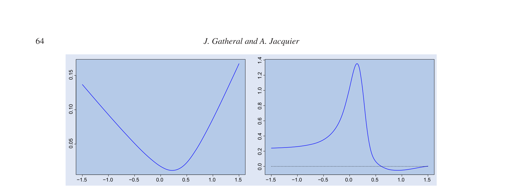
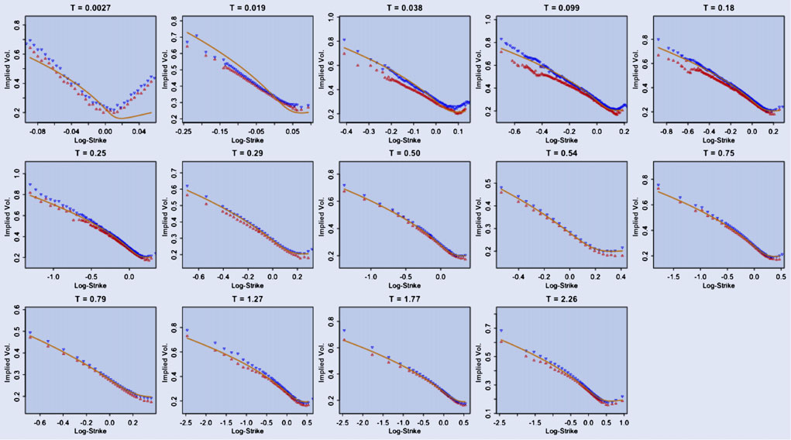
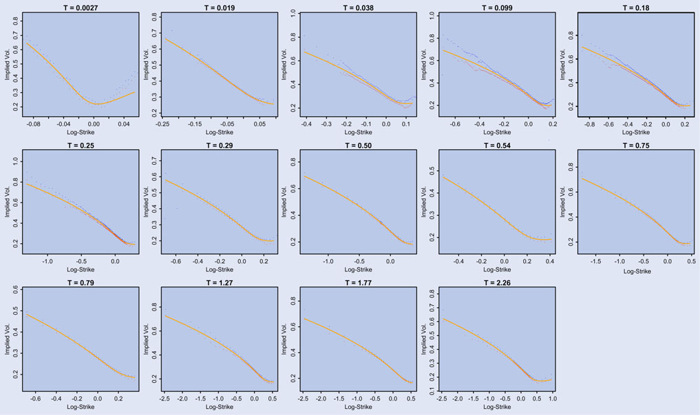

# Arbitrage-free SVI volatility surfaces

## Metadata

- **Source File:** `Arbitrage-free SVI volatility surfaces.pdf`
- **Authors:** Unknown
- **Year:** 2014
- **DOI:** 10.1080/14697688.2013.819986

## Abstract

Not found.

## Main Text

### Quantitative Finance
ISSN: 1469-7688 (Print) 1469-7696 (Online) Journal homepage: www.tandfonline.com/journals/rquf20
## Arbitrage-free SVI volatility surfaces
Jim Gatheral & Antoine Jacquier
To cite this article: Jim Gatheral & Antoine Jacquier (2014) Arbitrage-free SVI volatility surfaces,
Quantitative Finance, 14:1, 59-71, DOI: 10.1080/14697688.2013.819986
To link to this article: https://doi.org/10.1080/14697688.2013.819986
Published online: 11 Sep 2013.
Submit your article to this journal
Article views: 2513
View related articles
View Crossmark data
Citing articles: 25 View citing articles
Full Terms & Conditions of access and use can be found at
https://www.tandfonline.com/action/journalInformation?journalCode=rquf20

Quantitative Finance, 2014
Vol. 14, No. 1, 59–71, http://dx.doi.org/10.1080/14697688.2013.819986
## Arbitrage-free SVI volatility surfaces
JIM GATHERAL∗† and ANTOINE JACQUIER‡
†Department of Mathematics, Baruch College, CUNY, New York, NY, USA
‡Department of Mathematics, Imperial College, London, UK
(Received 6 April 2012; accepted 7 June 2013)
In this article, we show how to calibrate the widely used SVI parameterization of the implied volatility
smile in such a way as to guarantee the absence of static arbitrage. In particular, we exhibit a large class
of arbitrage-free SVI volatility surfaces with a simple closed-form representation. We demonstrate
the high quality of typical SVI fits with a numerical example using recent SPX options data.
Keywords: Volatility smile fitting; Volatility surfaces; Arbitrage pricing; Arbitrage relationship;
Financial engineering; Financial mathematics
JEL Classification: C60, C63, G12, G13, G
1. Introduction
the implied volatility surface are still widely considered to be
futile.
The stochastic volatility inspired or SVI parameterization of the
In this article, we exhibit a large class of SVI volatility
implied volatility smile was originally devised at Merrill Lynch
surfaces with a simple closed-form representation, for
in 1999 and subsequently publicly disseminated in Gatheral
which absence of static arbitrage is guaranteed. Absence of
(2004). This parameterization has two key properties that have
static arbitrage—as defined by Cox and Hobson (2005)—
led to its popularity with practitioners:
corresponds to the existence of a non-negative martingale on
a filtered probability space such that European call option
• For
t,
a
fixed
time
to
expiry
the
implied
prices can be written as the expectation, under the risk-neutral
Black–Scholes variance σ 2
BS(k, t) is linear in the logmeasure, of their final payoffs. This definition also implies
strike k as |k| →∞consistent with Roger Lee’s
(see Fengler (2009)) that the corresponding total variance must
moment formula (Lee 2004).
be an increasing function of the maturity (absence of cal-
• It is relatively easy to fit listed option prices whilst
endar spread arbitrage). Using some mathematics from the
ensuring no calendar spread arbitrage.
Renaissance, we show how to eliminate any calendar spread
The consistency of the SVI parameterization with arbitrage
arbitrage resulting from a given set of SVI parameters. We also
bounds for extreme strikes has also led to its use as an extrappresent a set of necessary conditions for the corresponding denolation formula (Jäckel and Kahl 2008). Moreover, as shown
sity to be non-negative (absence of butterfly arbitrage), which
in Gatheral and Jacquier (2011), the SVI parameterization is
corresponds—from the definition of static arbitrage—to call
not arbitrary in the sense that the large-maturity limit of the
prices being decreasing and convex functions of the strike. We
Heston implied volatility smile is exactly SVI. However, it
go on to use the existence of such arbitrage-free surfaces to deis well known that SVI smiles may be arbitrageable. Previous
vise a new algorithm for eliminating butterfly arbitrage should
workhasshownhowtocalibrateSVItogivenimpliedvolatility
it occur. With both types of arbitrage eliminated, we achieve a
data (for example Zeliade Systems (2009)). Other recent work
volatility surface that typically calibrates well to given implied
(Carr and Wu 2010) has been concerned with showing how to
volatility data and is guaranteed free of static arbitrage.
parameterize the volatility surface in such a way as to preclude
In Section 2.1, we present a necessary and sufficient condidynamic arbitrage. There has been some work on arbitragetion for the absence of calendar spread arbitrage. In Section 2.2,
free interpolation of implied volatilities or equivalently of opwe present a necessary and sufficient condition for the absence
tion prices (Kahalé 2004, Fengler 2009, Andreasen and Huge
of butterfly arbitrage, or negative densities. In Section 3, we
2011,Glaser and Heider2012).Priorworkhasnotsuccessfully
present various equivalent forms of the SVI parameterization.
attempted to eliminate static arbitrage and indeed, efforts to
In Section 4,we exhibita large and usefulclassofSVIvolatility
find simple closed-form arbitrage-free parameterizations of
surfaces that are guaranteed to be free of static arbitrage. In
Section 5, we show how to calibrate SVI to observed option
prices, avoiding both butterfly and calendar spread arbitrages.
∗Corresponding author. Email: jim.gatheral@baruch.cuny.edu
© 2013 Taylor & Francis

60
Let (Xt)t≥0 be a martingale, L ≥0 and 0 ≤t1 < t2.
Proof
We further show how to interpolate and extrapolate in such a
Then the inequality
way as to guarantee the absence of static arbitrage. Finally, in

(Xt2 −L)+

(Xt1 −L)+
Section 6, we summarize and conclude.
≥E
E
Notation.
In the foregoing, we consider a stock price process
is standard. For any i = 1, 2, let Ci be options with strikes Ki
(St)t≥0 with natural filtration (Ft)t≥0, and we define the forand expirations ti. Suppose that the two options have the same
ward price process (Ft)t≥0 by Ft := E (St|F0). For any k ∈R
moneyness, i.e.
and t > 0, CBS(k, σ 2t) denotes the Black–Scholes price of
K1
= K2
=: ek
a European Call option on S with strike Ftek, maturity t and
Ft1
Ft2
volatility σ > 0. We shall denote the Black–Scholes implied
Then,ifdividendsareproportional,theprocess(Xt)t≥0 defined
volatility by σBS(k, t), and define the total implied variance by
by Xt := St/Ft for all t ≥0 is a martingale and
w(k, t) = σ 2

Xt2 −ek+

Xt1 −ek+
BS(k, t)t.
= C1
C2
= e−kE
≥e−kE
The implied variance v shall be equivalently defined as
K2
K1
v(k, t) = σ 2
BS(k, t) = w(k, t)/t. We shall refer to the twoSo, if dividends are proportional, keeping the moneyness condimensional map (k, t) →w(k, t) as the volatility surface,
stant, option prices are non-decreasing in time to expiration.
and for any fixed maturity t > 0, the function k →w(k, t)
The Black–Scholes formula for the non-discounted value of
will represent a slice. We propose below three different—
an option may be expressed in the form CBS(k, w(k, t)) with
yet equivalent—slice parameterizations of the total implied
CBS strictly increasing in its second argument. It follows that
variance, and give the exact correspondence between them. For
for fixed k, the function w(k, ·) must be non-decreasing.
□
a given maturity slice, we shall use the notation w(k; χ) where
Lemma 2.1 motivates the following definition.
χ represents a set of parameters, and drop the t-dependence.
A volatility surface w is free of calendar
Definition 2.2
spread arbitrage if
2. Characterization of static arbitrage
∂tw(k, t) ≥0,
for all k ∈R and t > 0.
In this section, we provide model-independent definitions of
(static) arbitrage and some preliminary results. We define static
arbitrage for a given volatility surface in the following way,
2.2. Butterfly arbitrage
which is equivalent to the definition of static arbitrage for call
options recalled in the introduction (see also Roper (2009)).
In Section 2.1, we provided conditions under which a volatility
surface could be guaranteed to be free of calendar spread arDefinition 2.1
A volatility surface is free of static arbitrage
bitrage. We now consider a different type of arbitrage, namely
if and only if the following conditions are satisfied:
butterfly arbitrage (Definition 2.3). Absence of this arbitrage
(i) it is free of calendar spread arbitrage;
corresponds to the existence of a risk-neutral martingale
(ii) each time slice is free of butterfly arbitrage.
measure and the classical definition of no static arbitrage, as
developed in Föllmer and Schied (2002) or Cox and Hobson
In particular, absence of butterfly arbitrage ensures the ex-
(2005).Inthissection,weconsideronlyonesliceoftheimplied
istence of a (non-negative) probability density, and absence of
volatility surface, i.e. the map k →w(k, t) for a given fixed
calendarspreadarbitrageimpliesmonotonicityofoptionprices
maturity t > 0. For clarity, we, therefore, drop—in this section
with respect to the maturity. The following two subsections
only—the t-dependence of the smile and use the notation w(k)
analyse in detail each of these two types of arbitrage, in a
instead. Unless otherwise stated, we shall always assume that
model-independent way.
the map k →w(k, t) is at least of class C2(R) for all t ≥0.
Definition 2.3
A slice is said to be free of butterfly arbitrage
2.1. Calendar spread arbitrage
if the corresponding density is non-negative.
Calendar spread arbitrage is usually expressed as the monoRecall the Black–Scholes formula for a European call option
tonicity of European call option prices with respect to the
price:
maturity (see for example Carr and Madan (2005) or Cousot


N(d+(k)) −ekN(d−(k))
(2007)). Since our main focus here is on the implied volatility,
CBS(k, w(k))= S
, for all k ∈R,
wetranslatethisdefinitionintoapropertyoftheimpliedvolatilwhere N is the Gaussian cdf and d±(k) := −k/√w(k) ±
ity. Indeed, assuming proportional dividends, we establish a
√w(k)/2. Let us define the function g : R →R by
necessary and sufficient condition for an implied volatility

2

parameterization to be free of calendar spread arbitrage. This
1 −kw′(k)
−w′(k)2
+ w′′(k)
w(k) + 1
1
.
g(k) :=
can also be found in Fengler (2009) and Gatheral (2004), and
2w(k)
4
4
2
we outline its proof for completeness.
(2.1)
This function will be the main ingredient in the determination
Lemma 2.1
If dividends are proportional to the stock price,
of butterfly arbitrage as stated in the following lemma.
the volatility surface w is free of calendar spread arbitrage if
and only if
Lemma 2.2
A slice is free of butterfly arbitrage if and only
if g(k) ≥0 for all k ∈R and limk→+∞d+(k) = −∞.
∂tw(k, t) ≥0,
for all k ∈R and t > 0.

61
decreasing. We also exclude the case σ = 0 which corresponds
Proof
It is well known (Breeden and Litzenberger 1978) that
the probability density function p may be computed from the
to a linear smile.
call price function C as
p(k) = ∂2C(k)
3.2. The natural SVI parameterization
∂K 2
K=Ftek
= ∂2CBS(k, w(k))
For a given parameter set χN = {, μ, ρ, ω, ζ}, the natural
K=Ftek ,
for any k ∈R.
SVI parameterization of total implied variance reads:
∂K 2

w(k; χN) =  + ω
Explicit differentiation of the Black–Scholes formula then
1 + ζρ (k −μ)
2
gives for any k ∈R,
1 −ρ2



(ζ(k −μ) + ρ)2 +
−d−(k)2
g(k)
+
,
(3.2)
√2πw(k) exp
p(k) =
.
2
where ω ≥0,  ∈R, μ ∈R, |ρ| < 1 and ζ > 0. It is straightWe have so far implicitly assumed that the function p is a
forward to derive the following correspondence between the
well-defined density, and in particular that it integrates to one.
raw and natural SVI parameters:
This may not always be the case though, and one needs to imLemma 3.1
pose asymptotic boundary conditions. In particular, call prices
We have the following mapping of parameters
must converge to 0 as k tends to infinity, which is equivabetween the raw and the natural SVI:
lent to having limk→+∞d+(k) = −∞. We refer the reader
(a, b, ρ, m, σ)
to Rogers and Tehranchi (2010) for a proof of this equivalence.



1 −ρ2
□
1 −ρ2
2 , ρ, μ −ρ
 + ω
, ωζ
ζ ,
,
=
ζ
2
(3.3)
3. SVI formulations
and its inverse transformation, between the natural and the
We first recall here the original SVI formulation proposed
raw SVI:

in Gatheral (2004), and then present some alternative

1 −ρ2
a −ω
(, μ, ρ, ω, ζ) =
, m
(but equivalent) ones. We emphasize in particular that even
2
though the original (raw) formulation is very tractable and has
1 −ρ2
ρσ
2bσ
become popular with practitioners, it is difficult—seemingly
+
1 −ρ2 , ρ,
1 −ρ2 ,
.
impossible—to find precise conditions on the parameters to
σ
prevent arbitrage.
(3.4)
3.1. The raw SVI parameterization
3.3. The SVI Jump-Wings (SVI-JW) parameterization
For a given parameter set χR = {a, b, ρ, m, σ}, the raw SVI
Neither the raw SVI nor the natural SVI parameterizations
parameterization of total implied variance reads:
are intuitive to traders in the sense that a trader cannot be
expected to carry around the typical value of these parame-
(k −m)2 + σ 2
w(k; χR) = a + b
ρ (k −m) +
, (3.1)
ters in his head. Moreover, there is no reason to expect these
where a ∈R, b ≥0, |ρ| < 1, m ∈R, σ > 0, and the
parameters to be particularly stable. The SVI-Jump-Wings
1 −ρ2 ≥0, which ensures that
obvious condition a + b σ
(SVI-JW) parameterization of the implied variance v (rather
w(k; χR) ≥0 for all k ∈R. This condition indeed ensures that
than the implied total variance w) was inspired by a similar
the minimum of the function w(·; χR) is non-negative. Note
parameterization attributed to Tim Klassen, then at Goldman
further that the function k →w(k; χR) is (strictly) convex on
Sachs. For a given time to expiry t > 0 and a parameter set
χJ = {vt, ψt, pt, ct, vt}, the SVI-JW parameters are defined
the whole real line. It follows immediately that changes in the
parameters have the following effects:
from the raw SVI parameters as follows:
√
m2 + σ 2
• increasing a increases the general level of variance,
−ρ m +
a + b
vt =
,
a vertical translation of the smile;
t

• increasing b increases the slopes of both the put and
b
m
1
√
ψt =
−
m2 + σ 2 + ρ
,
√wt
call wings, tightening the smile;
2
• increasing ρ decreases (increases) the slope of the
1
(3.5)
pt =
b (1 −ρ) ,
√wt
left(right) wing, a counter-clockwise rotation of the
smile;
1
ct =
b (1 + ρ) ,
√wt
• increasing m translates the smile to the right; and


• increasing σ
reduces the at-the-money (ATM)
vt = 1
1 −ρ2
a + b σ
,
curvature of the smile.
t
We exclude the trivial cases ρ = 1 and ρ = −1, where the
with wt := vtt. Note that this parameterization has an explicit
dependence on the time to expiration t, and hence can be
volatility smile is, respectively, strictly increasing and

62
If m = 0, then the formulae above for b, ρ and a still hold, but
viewed as generalizing the raw (expiration-independent) SVI
σ = (vtt −a) /b.
parameterization. The SVI-JW parameters have the following
interpretations:
The expressions for b, ρ and a follow directly from
Proof
(3.5). Assume that m ̸= 0 and let β := ρ −2ψt√wt/b and
• vt gives the ATM variance;
• ψt gives the ATM skew;
α := σ/m ∈R. Then, the expressions in (3.5) give
• pt gives the slope of the left (put) wing;
β = sign (α)
√
1 + α2 ,
• ct gives the slope of the right (call) wing; and
• vt is the minimum implied variance.
which implies that
If smiles scaled perfectly as 1/√wt (as is approximately

the case empirically), these parameters would be constant,
1
α = sign(β)
β2 −1.
independent of the slice t. This makes it easy to extrapolate
the SVI surface to expirations beyond the longest expiration
Using (3.5), we also have
in the data-set. Also, note that by definition, for any t > 0 we


have
vt −vt
t
1 + α2 −α
ψt = ∂σBS(k, t)
1 −ρ2
= m
−ρ + sign(α)
,
b
∂k
k=0
from which we deduce m in terms of α, and the expression of
The choice of volatility skew as the skew measure rather than
σ is recovered from the equality σ = αm. The expression for
variance skew, for example, reflects the empirical observation
σ in the case m = 0 is straightforward from (3.5).
□
that volatility is roughly lognormally distributed. Specifically,
following the lines of Gatheral (2006, Chapter 7), assume that
the instantaneous variance process satisfies the SDE
3.4. Arbitrage and absence thereof in SVI parameterizations
dvt = α(vt) dt + η√vt β(vt) dZt,
for all t ≥0
Given a volatility surface, it is natural to wonder whether it is
where η > 0, (Zt)t≥0 is a standard Brownian motion and
free of arbitrage. Since we can easily switch from any of the
α and β two functions on R+ ensuring the existence of a
SVI formulations to either of the other two using Lemmas 3.3
unique strong solution to the SDE (see for instance Karatzas
and 3.2, we shall state the following results only for the raw
andShreve(1991)forexactconditions),thentheATMvariance
SVI parameterization (3.1). Referring to (3.1) as a volatility
skew
surface is a slight abuse of language since (3.1) is really an
∂σBS(k, t)2
expiry-independent slice parameterization.Avolatility surface
lim
∂k
is thus understood as a (discrete) collection of slices, with a
t→0
k=0
different set of parameters for each expiry. Checking calendar
exists and is proportional to β(v). If the variance process is lognormal so that β(v) behaves like √v, the limit of the
arbitrage in the sense of Lemma 2.1 is then equivalent to
checking for calendar arbitrage for any pair of expiries t1 and
at-the-money volatility skew as time to expiry tends to zero
t2. The following lemma establishes a sufficient condition for
is constant and independent of the volatility level. This consisthe absence of calendar spread arbitrage.
tency of the SVI-JW parameterization with empirical volatility
Lemma 3.3
dynamics thus leads in practice to greater parameter stability
The raw SVI surface (3.1) is free of calendar
over time. The following lemma provides the inverse represpread arbitrage if a certain quartic polynomial (given in (3.7)
sentation of (3.5).
below) has no real root.
Lemma 3.2
Assume that m ̸= 0. For any t > 0, define the
Proof
By definition, there is no calendar arbitrage if for any
(t-dependent) quantities:
two dates t1 ̸= t2, the corresponding slices w (·, t1) and

w (·, t2) do not intersect. Let these two slices be characterized
β := ρ −2ψt√wt
1
by the sets of parameters χ1 := {a1, b1, σ1, ρ1, m1} and χ2 :=
α := sign(β)
β2 −1.
and
b
{a2, b2, σ2, ρ2, m2},
and
assume
for
convenience
that
0 < t1 < t2. We, therefore, need to determine the (real) roots
where we have further assumed that β ∈[−1, 1]†. Then, the
of the equation w (k, t1) = w (k, t2). The latter is equivalent
raw SVI and SVI-JW parameters are related as follows:
√wt
to



b =
(ct + pt) ,
(k −m1)2 + σ 2
2
a1 + b1
ρ1 (k −m1) +
ρ = 1 −pt √wt
1



,
(k −m2)2 + σ 2
b
= a2 + b2
ρ2 (k −m2) +
.
(3.6)
2
1 −ρ2,
a = vtt −bσ



vt −vt
t
(k −m1)2 + σ 2
Leaving
1 on one side, squaring the equality
,
m =
√
1 + α2 −α
1 −ρ2
−ρ + sign(α)
b
and rearranging it leads to

σ = α m.
(k −m1)2 + σ 2
(k −m2)2 + σ 2
2 = b2
2b2 (α + βk)
1
1
(k −m2)2 + σ 2
−(α + βk)2 ,
†The condition β ∈[−1, 1] is equivalent to −pt ≤2ψt ≤ct, i.e. to
−b2
2
2
the convexity of the smile.

63
class C1 on R∗
where α := a2−a1+b1ρ1m1−b2ρ2m2 and β := b2ρ2−b1ρ1.
+. An ATM option with zero time to expiry has
no value so θ0 := limt→0 θt = 0.
Squaring the last equation above gives a quartic polynomial
equation of the form
Let ϕ be a smooth function from R∗
+ to R∗
Definition 4.1
+
α4 k4 + α3 k3 + α2 k2 + α1 k + α0 = 0,
such that the limit limt→0 θtϕ(θt) exists in R. We refer to as
(3.7)
SSVI the surface defined by
where each of the coefficients lengthy yet explicit expressions†

w(k, θt) = θt
{a1, b1, ρ1, σ1, m1}
and
in
terms
of
the
parameters
1 + ρϕ(θt)k
{a2, b2, ρ2, σ2, m2}. If this quartic polynomial has no real root,
2


then the slices do not intersect and the lemma follows. Roots
(ϕ(θt)k + ρ)2 + (1 −ρ2)
.
+
(4.1)
of a quartic polynomial are known in closed-form, thanks
to Ferrari and Cardano (1545). Thus, there exist closed-form
expressions in terms of χ1 and χ2 for the possible intersection
From Section 3, SSVI corresponds to the natural SVI volatil-
□
itysurfaceparameterization (3.2)withχN ={0, 0, ρ, θt, ϕ(θt)}.
points of the two SVI slices.
NotethatthisrepresentationamountstoconsideringthevolatilRemark 3.1
If the quartic polynomial (3.7) has one or more
ity surface in terms of ATM variance time, instead of standard
real roots, we need to check whether the latter are indeed
calendar time, similar in spirit to the stochastic subordination
solutions of the original problem (3.6), or spurious solutions
of Clark (1973).
arising from the two squaring operations. The absence of real
roots of the quartic polynomial is clearly a sufficient—but not
Remark 4.1
Intheparameterization (4.1),theATMvariance
curve θt may be viewed as a (vector) parameter of the volatility
necessary—condition.
surface. Moreover, this parameter is directly observable given
Remark 3.2
By a careful study of the minima and the shapes
market prices for a finite set of expiries, and can be considered
of the two slices w(·, t1) and w(·, t2), it is possible to determine
well known to traders even for expiries which are not explicitly
a set of conditions on the parameters ensuring no calendar
quoted. The explicit reference to θt also emphasizes the imporspread arbitrage. However, these conditions involve tedious
tance of studies such as De Marco and Martini (2012) of the
combinations of the parameters and will hence not match the
ATM variance structure in classical models which may shed
computational simplicity of the lemma.
some light on how to impose dynamics on SSVI.
For a given slice, we now wish to determine conditions on
The ATM implied total variance is θt = σ 2
BS(0, t) t and the
the parameters of the raw SVI formulation (3.1) such that butATM volatility skew is given by
= ρ√θt
terfly arbitrage is excluded. By Lemma 2.1, this is equivalent
1
to showing (i) that the function g defined in (2.1) is always
2√t ϕ(θt).
2√θtt ∂kw(k, θt)
∂kσBS(k, t)|k=0 =
positive and (ii) that call prices converge to zero as the strike
k=0
(4.2)
tends to infinity. Sadly, the highly non-linear behaviour of g
Furthermore, the smile is symmetric around at-the-money if
makes it seemingly impossible to find general conditions on
and only if ρ = 0. This is consistent with Carr and Lee (2009,
the parameters that would eliminate butterfly arbitrage. We
Theorem 3.4) which states that in a standard stochastic volatilprovide below an example where butterfly arbitrage is violated.
ity model, the smile is symmetric if and only if the correlation
Notwithstanding our inability to find general conditions on the
between the stock price and its instantaneous volatility is null.
parameters that would preclude arbitrage, in Section 4, we will
Since θ0 = 0, we have at time t = 0:
introduce a new sub-class of SVI volatility surface for which
w(k, θ0) = 1
the absence of butterfly arbitrage is guaranteed for all expiries.
2 φ0 (ρk + |k|) ,
for any k ∈R,
(4.3)
Example 3.1
(From Axel Vogt on wilmott.com) Consider
where φ0 := limθ→0 θϕ(θ). φ0 = 0 is characteristic of
the raw SVI parameters:
stochastic volatility models as in Example 4.1; φ0 > 0 as in
Example 4.2 gives a V-shaped time zero smile which is char-
(a, b, m, ρ, σ)=(−0.0410, 0.1331, 0.3586, 0.3060, 0.4153),
acteristic of models with jumps and in particular, characteris-
(3.8)
tic of empirically observed volatility surfaces. For notational
with t = 1. These parameters give rise to the total variance
convenience, we shall always assume that limt↗∞θt = ∞.
smile w and the function g (defined in (2.1)) on figure 1, where
As proved in Rogers and Tehranchi (2010), this is equivalent
the negative density is clearly visible.
(assuming no interest rate) to the stock price (assumed to be
a non-negative martingale) to converging to zero as t tends to
infinity. Although this holds in many popular models (Black–
4. Surface SVI: A surface free of static arbitrage
Scholes, Heston, exponential Lévy), this is not always true,
see Hobson (2010) for counter-examples. If limt↗∞θt is finite,
We now introduce a class of SVI volatility surfaces—which
all our results remain valid, but only on the support of the
we shall call SSVI (for ‘Surface SVI’)—as an extension of
function t →θt.
the natural parameterization (3.2). For any maturity t ≥0,
The following theorem gives precise necessary and suffidefine the at-the-money (ATM) implied total variance θt :=
cient conditions to ensure that the SSVI volatility surface (4.1)
σ 2
BS(0, t)t. We shall assume that the function θ is at least of
is free of calendar spread arbitrage (Lemma 2.1) and also
matches the term structure of ATM volatility and the term
†Explicit expressions for these coefficients can be found in the R-code
structure of the ATM volatility skew.
posted on http://mfe.baruch.cuny.edu/jgatheral/.

64
1.4
0.15
1.2
1.0
0.8
0.10
0.6
0.4
0.05
0.2
0.0
0.0
0.5
1.0
1.5
0.0
0.5
1.0
1.5
−1.5
−1.0
−0.5
−1.5
−1.0
−0.5
Plots of the total variance smile w (left) and the function g defined in (2.1) (right), using the parameters (3.8).
Figure 1.
1.4
0.15
1.2
1.0
0.8
0.10
0.6
0.4
0.05
0.2
0.0
−1.5
−1.0
−0.5
0.0
0.5
1.0
1.5
−1.5
−1.0
−0.5
0.0
0.5
1.0
1.5
Plots of the total variance smile (left) and the function g defined in (2.1) (right), using the parameters (3.8).The graphs corresponding
Figure 2.
to the original Vogt parameters is solid, to the guaranteed butterfly arbitrage-free parameters dashed, and to the ‘optimal’choice of parameters
dotted.
1 + ρx
Theorem 4.1
The SSVI surface (4.1) is free of calendar
ψ0(x, ρ) := 1 +
and
x2 + 2ρx + 1
spread arbitrage if and only if


x + ρ
(1) ∂tθt ≥0,
for all t ≥0;


+ ρ
ψ1(x, ρ) := x
.
x2 + 2ρx + 1
1
1 −ρ2
(2) 0 ≤∂θ(θϕ(θ)) ≤
1 +
ϕ(θ), for all
ρ2
θ > 0,
For any |ρ| < 1, ψ0(x, ρ) is strictly positive for all x ∈R.
where the upper bound is infinite when ρ = 0.
Now define the set
⎧
(−∞, 0) ∪(−2ρ, ∞),
if ρ < 0,
⎨
In particular, this theorem implies that the SSVI surface (4.1)
(−∞, −2ρ) ∪(0, ∞),
if ρ > 0,
Dρ =
is free of calendar spread arbitrage if the skew in total variance
⎩
R \ {0},
if ρ = 0.
terms is monotonically increasing in trading time and the skew
in implied variance terms is monotonically decreasing in tradThen, ψ1(·, ρ) > 0 if x ∈Dρ and ψ1(·, ρ) < 0 if x ∈R \


ing time. In practice, any reasonable skew term structure that
Dρ ∪{0, −2 ρ}
. It follows that
a trader defines has these properties.
∂θw(k, θ) ≥0 if and only if
⎧
Proof
Since the definition of calendar spread arbitrage does
γ (θ) ≥−ψ0(x, ρ)
⎪
for x ∈Dρ,
ψ1(x, ρ),
⎨
not depend on the log-moneyness k, there is no loss of generality in assuming k fixed. First, note that ∂tw(k, θt) = ∂θw


γ (θ) ≤−ψ0(x, ρ)
⎪
⎩
Dρ ∪{0, −2 ρ}
ψ1(x, ρ),
for x ∈R \
,
(k, θt)∂tθt sotheSSVIvolatilitysurface(4.1)isfreeofcalendar
spread arbitrage if ∂θw(k, θ) ≥0 for all θ > 0.
(4.4)
Consider first the case |ρ| < 1. To proceed, we compute, for
When x ∈{0, −2ρ},thenψ1(x, ρ) = 0andso∂θw(k, θ)≥0.
any θ > 0,
The inequalities (4.4) thus give necessary and sufficient conditions for absence of calendar spread arbitrage for any given
2∂θw(k, θ) = ψ0(x, ρ) + γ (θ)ψ1(x, ρ),
x ∈R. To determine the tightest possible bounds on γ (θ), we
with x := kϕ(θ), γ (θ) := ∂θ(θϕ(θ))/ϕ(θ),
compute

65
1 −ρ2)/ρ2 is greater than one for
−ψ0(x, ρ)
Since the quantity (1 +
ψ1(x, ρ) = 0
and
sup
any ρ ∈[−1, 1], the conditions of Theorem 4.1 are satisfied.
x∈Dρ
This function is consistent with the implied variance skew in
1 −ρ2
ψ1(x, ρ) = 1 +
−ψ0(x, ρ)
.
the Heston model as shown in Gatheral (2006, Equation 3.19).
inf
ρ2
x∈R\(Dρ∪{0,−2ρ})
Example 4.2
Power-law parameterization
The supremum in the first equality is never attained (the funcConsider ϕ(θ) = ηθ−γ with η > 0 and 0 < γ < 1. Then,
tion increases to zero from below as |x| tends to infinity).
∂θ (θϕ(θ)) /ϕ(θ) = 1 −γ ∈(0, 1) holds for all θ > 0, and
However, the infimum in the second equality is attained at
hence the conditions of Theorem 4.1 are satisfied. In particx = −ρ /∈Dρ. It follows that
ular, if γ = 1/2, then Lemma 4.1 implies that the SVI-JW
1 −ρ2
∂θw(k, θ) ≥0 if and only if 0 ≤γ (θ) ≤1 +
parameters ψt, pt, and ct associated with the SSVI volatil-
.
ity surface (4.1) are constant and independent of the time to
ρ2
expiration t. Furthermore, Equation 4.2 implies that the ATM
Note that when ρ = 0, the infimum above is taken over an
volatility skew is given by
empty set, and there is hence no upper bound.
∂kσBS(k, t)|k=0 = ρ η
When ρ = 1, for any (k, θ) ∈R × (0, ∞), we have
2√t .


1 + x
∂θw(k, θ) =
1 +
(1 + γ (θ) x)
The following theorem provides sufficient conditions for a
(1 + x)2
SSVI surface (4.1) to be free of butterfly arbitrage.

2 (1 + γ (θ) x)
if x ≥−1,
=
Theorem 4.2
The SSVI volatility surface (4.1) is free of
otherwise.
0
butterfly arbitrage if the following conditions are satisfied for
Obviously, ∂θw(k, θ) ≥0 if x ≥0. For x > −1, clearly
all θ > 0:
∂θw(k, θ) ≥0 if and only if γ (θ) ∈[0, 1]. Similarly, with
(1) θϕ(θ) (1 + |ρ|) < 4;
ρ = −1, we have


(2) θϕ(θ)2 (1 + |ρ|) ≤4.
1 −x
∂θw(k, θ) =
1 +
(1 −γ (θ) x)
Proof
For ease of notation, we suppress the explicit depen-
(1 −x)2

dence of θ and ϕ on t. By symmetry, it is enough to prove the
2 (1 −γ (θ) x)
if x ≤1,
theorem for 0 ≤ρ < 1. We shall, therefore, assume so, and
=
otherwise.
0
we define z := ϕk. The function g defined in (2.1) reads
Again ∂θw(k, θ) ≥0 if x ≤0, and for x ≤1, ∂θw(k, θ) ≥0
f (z)
if and only if γ (θ) ∈[0, 1].
□
3/2 ,
g(z) =

z2 + 2zρ + 1
64
The following lemma is a straightforward consequence of
where
(3.3) and (3.5).
f (z) := a −bϕ2θ −c
16ϕ2θ2,
Lemma 4.1
The SVI-JW parameters associated with the
SSVI surface (4.1) are
and where a, b and c depend on z. In the following, we frevt = θt/t,
quently use the inequality
ψt = 1
z2 + 2zρ + 1 = (z + ρ)2 + 1 −ρ2 ≥0.
2 ρ
θt ϕ(θt),
pt = 1
Computing the coefficient of ϕ2θ2 in f (z) explicitly gives
θt ϕ(θt) (1 −ρ),
2

1 + ρ2
z2 + 2zρ + 1
(z + ρ)2
ct = 1
c =
θt ϕ(θt) (1 + ρ),

1 −ρ2
ρ2
2
z2 + 2zρ + 1 +
+ 2ρ(z + ρ)
vt = θt
t (1 −ρ2).

1 + ρ2
z2 + 2zρ + 1
(z + ρ)2
≥
We now give several examples of SSVI implied volatility

1 −ρ2
ρ2
+ 2ρ(z + ρ)2 +
surfaces (4.1).
Example 4.1
A Heston-like parameterization
(1 + ρ)2 (z + ρ)2
z2 + 2zρ + 1
=
Consider the function ϕ defined by

1 −ρ2
ρ2


1 −1 −e−λθ
+
≥0.
ϕ(θ) ≡1
,
λθ
λθ
Thus, if
with λ > 0. Then, for all θ > 0, we immediately obtain
4
4
∂θ (θϕ(θ)) = e−λθ 

0 ≤θϕ2 ≤
eλθ −1 −λθ
1 + ρ ,
0 ≤θϕ ≤
and
1 + ρ
> 0
and
λ2θ2
we have
= 1 −(1 + λθ)e−λθ
∂θ (θϕ(θ))
⎧
e−λθ + λθ −1 .
c
4 b
⎪
⎨
ϕ(θ)
1 + ρ −
a −
(1 + ρ)2 =: f1(z),
if b ≥0,
f (z) ≥
For any λ > 0, the map θ →∂θ (θϕ(θ)) /ϕ(θ) is strictly
c
⎪
⎩
a −
(1 + ρ)2 =: f2(z),
if b < 0.
decreasing on (0, ∞) with limit as θ tends to zero equal to one.

66
Proof
Considering the SSVI surface (4.1) and the function g
It is then straightforward to verify that
defined in (2.1), we have
2 f1(z)
z2 + 2zρ + 1
z2ρ −z(1 −ρ)ρ
⎧
(1 + ρ)2 =
16 −θ2ϕ(θ)2 (1 + ρ)2
+ 4 −θϕ(θ)2 (1 + ρ)
⎪
⎪

1 −ρ2
⎪
⎪
⎪
8ϕ(θ)k
64
⎪
+ 2(1 + ρ)
+ ρ


⎪
⎪
⎪

1 −ρ2

1 −ρ2
1
⎨
+O
,
as k →+∞,
+ ρ (z + ρ)2 + 3ρ
k2
+ 2
g(k) =
16 −θ2ϕ(θ)2 (1 −ρ)2
−4 −θϕ(θ)2 (1 −ρ)
⎪


⎪
⎪
z2 + 2zρ + 1
⎪
⎪
−zρ
,
⎪
8ϕ(θ)k
64
⎪


⎪
⎪
⎩
1
+O
,
as k →−∞.
which is clearly positive for z < 0. To see that f1(z) is also
k2
positive when z > 0, we rewrite it as
□
The result follows by inspection.
2 f1(z)
The asymptotic behaviour of SSVI (4.1) as |k|
Remark 4.3
(1 + ρ)2
tends to infinity is

2

z −1 −ρ
z2 + 2zρ + 1 −(z + ρ)
w(k, θt) = (1 ± ρ) θt
=
ρ
ϕ(θt) |k| + O(1),
for any t > 0.
2
2



1 −ρ2
1 −(1 −ρ)2
We thus observe that the condition θϕ(θ) (1 + |ρ|) ≤4 of
+2(1 + ρ)
+ ρ
4
Theorem 4.2 corresponds to the upper bound of 2 on the

2 −ρ2

1 −ρ2
asymptotic slope established by Lee (2004) and so again,
+ (1 + ρ)
+ 2 (1 + ρ)
+ ρ
.
z
Condition 4.2 of Theorem 4.2 is necessary.
Consider now the function f2(z). It is straightforward to verify
The following corollary follows directly from Theorems 4.1
that
and 4.2.

3/2
2z3ρ
z2 + 2zρ + 1
Corollary 4.1
f2(z) = −
(1 + ρ)2 +
The SSVI surface (4.1) is free of static


arbitrage if the following conditions are satisfied:
z2 + 2zρ + 1
z2 + 2zρ + 1
+ 2
+
(1) ∂tθt ≥0, for all t > 0


1
which is positive by inspection if z < 0. To see that f2(z) is
1 −ρ2
(2) 0 ≤∂θ(θϕ(θ)) ≤
1 +
ϕ(θ), for all
ρ2
also positive when z > 0, we rewrite it as
θ > 0; and


(3) θϕ(θ) (1 + |ρ|) < 4, for all θ > 0;
f2(z) = z3 1 + ρ2
z2 + 2zρ + 1
(1 + ρ)2 + 3z2ρ + 2
(4) θϕ(θ)2 (1 + |ρ|) ≤4, for all θ > 0.


Considerthefunctionϕ(θ) = ηθ−γ withη > 0
z2 + 2zρ + 1
Remark 4.4
z2 + 2zρ + 1 −(z + ρ)
+
from Example 4.2, then Condition 4.2 imposes γ ∈(0, 1).
z2 + 2zρ + 1 + 2zρ2 + z + ρ.
+
From Condition 4.1, such surfaces can be free of static arbitrage only up to some maximum expiry. Take for instance
Thus, f (z) ≥0 in all cases. From Lemma 2.2, we are left
the simple case θt := σ 2t for some σ > 0. Then, the map
to prove that limk→∞d+(k) = −∞. A straightforward comψ : t →θtϕ(θt) (1 + |ρ|) −4 is clearly strictly increasing
putation shows that this is satisfied as soon as Condition 1 in
with ψ(0) = −4 and limt→∞ψ(t) = ∞. Therefore, there
□
Theorem 4.2 holds.
exists t∗
0 > 0 such that ψ(t) ≤0 for t ≤t∗
0 . The map
ψ2 : t →θtϕ(θt)2 (1 + |ρ|) −4 is
Remark 4.2
ASSVI volatility surface (4.1) is free of butterfly arbitrage if
• strictly increasing if γ ∈(0, 1/2) with ψ2(0) = −4
√vt t max (pt, ct) < 2,
t→∞ψ(t) = +∞; there exists t∗
1 > 0 such that
and lim
(pt + ct) max (pt, ct) ≤2,
and
ψ2(t) ≤0 for t ≤t∗
1 .
hold for all t > 0. The proof follows from Lemma 4.1 by ret→0 ψ2(0) =
• strictly decreasing if γ ∈(1/2, 1) with lim
expressing Conditions 4.2 and 4.2 of Theorem 4.2 in terms of
t→∞ψ(t) = −4; there exists t∗
1 > 0 such
+∞and lim
SVI-JW parameters.
that ψ2(t) ≤0 for t ≥t∗
1 .
The following lemma shows that Theorem 4.2 is almost
• constant if γ = 1/2 with ψ2 ≡−4.
if-and-only-if.
When γ ∈(0, 1/2), the surface is guaranteed to be free of static
Lemma 4.2
The SSVI volatility surface (4.1) is free of
arbitrage only for t ≤t∗
0 ∧t∗
1 . For γ ∈(1/2, 1), this remains
butterfly arbitrage only if
true only for t ∈(0, t∗
0 )∩(t∗
1 , ∞) (which may be empty).When
γ = 1/2, static arbitrage cannot occur for t ≤t∗
θϕ(θ) (1 + |ρ|) ≤4,
for all θ > 0.
0 . However,
the behaviour for large θ can be easily modified so as to ensure
Moreover, if θϕ(θ) (1 + |ρ|) = 4, the SSVI surface is free of
that the entire surface is free of static arbitrage. For example,
butterfly arbitrage only if
the choice
η
θϕ(θ)2 (1 + |ρ|) ≤4.
ϕ(θ) =
(4.5)
θγ (1 + θ)1−γ
Thus, Condition 4.2 of Theorem 4.2 is necessary and
gives a surface that is completely free of static arbitrage proCondition 4.2 is tight.
vided that η (1 + |ρ|) ≤2.

67
kw′(k) > 0 since wα(0) ≥0. It follows that ∂αGα(k) < 0 for
Remark 4.5
In
the
Heston-like
parameterization
of
any k > k∗.
Example 4.1, note that
For any k < 0, we always have w′(k) < 0, the inequality
θ→+∞θϕ(θ) (1 + |ρ|) = 1 + |ρ|
2wα(k) −kw′(k) > 0 follows by convexity as above, and
.
lim
λ
hence ∂αGα(k) < 0 for any k < 0.
Therefore, Condition 4.1 of Corollary 4.1 imposes λ
≥
We now prove that gα(k) ≥gα(0) for all k ∈(0, k∗). Since
(1 + |ρ|) /4.
we already showed that gα(0) > 0, the result follows. From
the definition of gα and (2.1),
The following theorem provides a way to expand the class

2
of volatility surfaces that are guaranteed to be free of static
kw′(k)
gα(k) −gα(0) =
1 −
−1
arbitrage by adding a suitable time-dependent function.
2 (w(k) + α)

Theorem 4.3
−w′(k)2
Let (k, t) →w(k, t) be a SSVI volatility
w(k) + α + 1
1
surface (4.1) satisfying the conditions of Corollary 4.1 (in
4
4

particular free of static arbitrage), and α : R+ →R+ a non-
+w′(0)2
w(0) + α + 1
1
negative and increasing function of time. Then, the volatility
4
4
surface (k, t) →wα(k, θt) := w(k, θt) + αt is also free of
+ w′′(k)
−w′′(0)
static arbitrage.
.
(4.7)
2
2
Since ∂twα(k, θt) := ∂tw(k, θt) + ∂tαt, Lemma 2.1
Proof
Astraightforward analysis shows that the function k →w′′(k)
implies that wα is free of calendar spread arbitrage if ∂tαt ≥0
is strictly increasing on the interval (0, k∗/2) and strictly deand αt ≥0. We now show that wα is also free of butterfly
creasingon(k∗/2, k∗).Theeasycomputationw′′(0) = w′′(k∗)
arbitrage. For clarity, since butterfly arbitrage does not depend
implies that w′′(k) ≥w′′(0) on (0, k∗).Also, w′(0)2 > w′(k)2
on the time parameter t, we shall use the simplified notation
on (0, k∗). Simplifying (4.7), it follows that
w(k) := w(k, θt), and likewise wα(k) := wα(k, θt). Similarly,

2
kw′(k)
in view of (2.1), we shall define the map gα(k), where the
gα(k) −gα(0) ≥
1 −
−1
function w is replaced by wα.
2(w(k) + α)
 w′(0)2
Consider the case ρ < 0; the case ρ > 0 follows by
w′(k)2
+ 1
w(0) + α −
symmetry. Define the function Gα : R →R as follows:
w(k) + α
4
 w′(0)2
Gα(k) := g(k) −gα(k),
for all k ∈R,
w′(k)2
−k w′(k)
≥1
w(0) + α −
w(k) + α .
w(k) + α
4
and let k∗:= −2ρ/ϕ(θt) > 0 be the unique solution to the
equation w′(k) = 0. We can compute explicitly the following:
Note that w′(k)2 ≤w′(0) w′(k) ≤w′(0)2 on the interval

(0, k∗) so
Gα(k) = w′(k)
1
1
wα(k) −
w(k)
4
gα(k) −gα(0)



≥w′(0) w′(k)
−k w′(k)
1
1
1
1
4k + w′(k) −w′(k)k2
wα(k) +
×
,
w(0) + α −
w(k) + α .
w(k)
w(k) + α
4
(4.8)
which implies
We now prove the following claim: kw(0) −w′(0)
[w(k) −


4
w′(k) + 4k
wα(k) −2k2w′(k)
∂αGα(k) = −w′(k)
w(0)] ≥0 for k ∈(0, k∗). Indeed,
. (4.6)

1 −ρ2 θ ϕ2
wα(k)3
4
kw(0) −w′(0)
[w(k) −w(0)] =
θ k
Since w′(0) = ρθtϕ(θt) < 0 the equation w′(k) + 4k = 0 has
4
8
a unique solution k∗> 0, and w′(k) + 4k is strictly positive
+ ρ ϕ θ2
−ρ ϕ θ2
ϕ2k2 + 2ϕ ρ k + 1.
for any k > k∗and strictly negative when k < k∗. By strict
8
8
convexity of the function w, it also follows that k∗< k∗.
Condition 2 of Theorem 4.2 implies that 1 −ρ2θϕ2
≥0. Then,
Therefore, for any k ∈(k∗, k∗), the two inequalities w′(k) <
8
(recall that ρ ≤0) the right-hand side of the above equality
0 and w′(k) + 4k > 0 hold, and, therefore, ∂αGα(k) > 0.
represents an increasing function on (0, k∗) which is equal to
Since by construction G0(k) = 0, we, therefore, conclude that
zero at the origin, and the claim holds. Then, from (4.8),
g(k) > gα(k) for any k ∈(k∗, k∗). For k /∈(k∗, k∗), the
−w′(k)
inequality g(k) < gα(k) holds as soon as ∂αGα(k) < 0.
gα(k) −gα(0) ≥
Consider first the case k > k∗. We can rewrite (4.6) as
(w(0) + α) (w(k) + α)




k (w(0) + α) −w′(0)
2wα(k) −kw′(k)
+ wα(k)w′(k)
∂αGα(k) = −w′(k)
2k
[w(k) −w(0)]
.
4
wα(k)3
4
≥0.
so that it suffices to prove the inequality 2wα(k)−kw′(k) > 0
for any k > k∗.
In the case ρ = 0, it is clear that the minimum of the smile is
First, note that if k > k∗, w′(k) > 0 . Then, recall that a
attained at k∗= 0. The above proofs for the cases k > k∗and
k < 0 remain valid, and the result, therefore, follows when
continuously differentiable function f is convex on the interval
(a, b) if and only if f (x)−f (y) ≥f ′(x)(x−y) for all (x, y) ∈
ρ = 0. Note that the continuity of the maps w and wα also
imply the result at k = 0 and k = k∗.
(a, b). Setting x = k and y = 0, we conclude that 2wα(k) −
□

68
translates to the condition vt (1 −ρ2) < ˜vt which is violated
Given a set of expirations 0 < t1 < . . . < tn
Remark 4.6
(n ≥1) and at-the-money implied total variances 0 < θt1 <
in the Vogt case.
. . . < θtn, Corollary 4.1 gives us the freedom to match three
features of one smile (level, skew, and curvature say) but only
5.2. Calibration of SVI parameters to implied volatility data
two features of all the other smiles (level and skew say), subject
of course to the given smiles being themselves arbitrage-free.
There are many possible ways of defining an objective funcTheorem 4.3 may allow us to match an additional feature of
tion, the minimization of which would permit us to calibrate
each smile through αt.
SVI to observed implied volatilities. Whichever calibration
strategy we choose, we need an efficient fitting algorithm and a
good choice of initial guess. The approach we will present here
5. Numerics and calibration methodology
involves taking a square-root fit as the initial guess. We then
fit SVI slice-by-slice with a heavy penalty for calendar spread
5.1. How to eliminate butterfly arbitrage
arbitrage (i.e. crossed lines on a total variance plot). Consider
two SVI slices with parameters χ1 and χ2 where t2 > t1. We
In Section 4, we showed how to define a volatility smile that
first compute the points ki (i = 1, . . . , n) with n ≤4 at which
is free of butterfly arbitrage. This smile is completely defined
the slices cross, sorting them in increasing order. If n > 0, we
given three observables.TheATM volatility andATM skew are
define the points ki as
obvious choices for two of them. The most obvious choice for
k1 := k1 −1,
the third observable in equity markets would be the asymptotic
slope for k negative and in FX markets and interest rate mar-
ki := 1
2 (ki−1 + ki),
if 2 ≤i ≤n,
kets, perhaps the ATM curvature of the smile might be more
appropriate.
kn+1 := kn + 1.
In view of Lemma 4.1, supposing we choose to fix the
For each of the n + 1 points ki, we compute the amounts ci by
SVI-JW parameters vt, ψt and pt of a given SVI smile, we
which the slices cross:
may guarantee a smile with no butterfly arbitrage by choosing
the remaining parameters c′
t and v′
t as
0, w(ki; χ1) −w(ki; χ2)
ci = max
.
4ptc′
c′
v′
t
Definition 5.1
The crossedness of two SVI slices is defined
t = pt + 2 ψt,
t = vt
2 .
and

pt + c′t
as the maximum of the ci (i = 1, . . . , n). If n = 0, the
crossedness is null.
In other words, given a smile defined in terms of its SVI-JW
parameters, we are guaranteed to be able to eliminate butterAn example SVI calibration recipe
fly arbitrage by changing the call wing ct and the minimum
• Given mid implied volatilities σi j = σBS(ki, t j),
variance vt, both parameters that are hard to calibrate with
compute mid option prices using the Black–Scholes
available quotes in equity options markets.
formula.
Example 5.1
Consider again the arbitrageable smile from
• Fit the square-root SVI surface by minimizing sum
Example 3.1. The corresponding SVI-JW parameters read
of squared distances between the fitted prices and


the mid option prices. This is now the initial guess.
vt, ψt, pt, ct, vt
= (0.01742625, −0.1752111, 0.6997381,
• Starting with the square-root SVI initial guess,
1.316798, 0.0116249) .
change SVI parameters slice-by-slice so as to mini-




co
t , vo
ct, vt
=
:=
We know then that choosing
mize the sum of squared distances between the fitted
t
(0.3493158, 0.01548182) gives a smile free of butterfly arpricesandthemidoptionpriceswithabigpenaltyfor
bitrage. It follows by continuity of the parameterization in all
crossing either the previous slice or the next slice (as
of its parameters that there must exist some pair of parameters
quantified by the crossedness from Definition 5.1).
(c∗
t , v∗
t ) with c∗
t , ct) and v∗
t ∈(co
t ∈(vt, vo
t ) such that the new
There are obviously many possible variations on this recipe.
smile is free of butterfly arbitrage and is as close as possible to
The objective function may be changed and when finally workthe original one in some sense. In this particular case, choosing
ing to optimize the fit slice-by-slice, one can work from the
the objective function as the sum of squared option price difshortest expiration to the longest expiration or in the reverse
ferences plus a large penalty for butterfly arbitrage, we arrive at
order. In practice, working forward or in reverse seems to
the following ‘optimal’ choices of the call wing and minimum
make little difference. Changing the objective function on the
variance parameters that still ensure no butterfly arbitrage:
other hand will make some difference especially for very short


c∗
t , v∗
= (0.8564763, 0.0116249) .
expirations.
t
Note that the optimizer has left vt unchanged but has decreased
the call wing. The resulting smiles and plots of the function g
5.3. Interpolation and extrapolation of calibrated slices
are shown in figure 2.
Remark 5.1
The additional flexibility potentially afforded
Suppose we follow the above recipe above to fit SVI to opto us through the parameter αt of Theorem 4.3 sadly does not
tions with a discrete set of expiries. In particular, each of the
help us with the Vogt smile of Example 5.1. For αt to help,
resulting SVI smiles will be free of butterfly arbitrage. It is
we must have αt > 0; it is straightforward to verify that this
not immediately obvious that we can interpolate these smiles

69
Figure 3.
Red dots are bid implied volatilities; blue dots are offered implied volatilities; and the orange solid line is the square-root SVI fit.
Figure 4.
Red dots are bid implied volatilities; blue dots are offered implied volatilities; and the orange solid line is the SVI fit following
recipe of Section 5.2
Lemma 5.1
Giventwovolatilitysmilesw(k, t1)andw(k, t2)
in such a way as to ensure the absence of static arbitrage in
with t1 < t2 where the two smiles are free of butterfly arbitrage
the interpolated surface. The following lemma shows that it is
and such that w(k, τ2) ≥w(k, τ1) for all k, there exists an
possible to achieve this.

70
seem to be reasonable) and extrapolate the smile for t > tn
interpolation such that the interpolated volatility surface is
free of static arbitrage for t1 < t < t2.
according to
w(k, θt) = w(k, θtn) + θt −θtn,
Given the two smiles w(k, t1) and w(k, t2), we may
Proof
compute the (undiscounted) prices C(Fi, Ki, ti) =: Ci of
which is free of static arbitrage if w(k, θtn) is free of butterfly
European calls with expirations ti (i = 1, 2) using the Black–
arbitrage by Theorem 4.3.
Scholes formula. In particular, since the two smiles are free of
butterfly arbitrage,
5.4. A calibration example
∂2Ci
∂K 2 ≥0,
for i = 1, 2.
We take SPX option quotes as of 3pm on 15-Sep-2011 (the day
Consider any monotonic interpolation θt of the at-the-money
before triple-witching) and compute implied volatilities for all
implied total variance w(0, t). Let Ki = Fiek and Kt = Ftek.
14 expirations. The result of fitting square-root SVI is shown in
Then, for any t1 < t < t2, define the price Ct = C(Ft, Kt, t)
figure 3. The result of fitting SVI following the recipe provided
of a European call option to be
in Section 5.2 is shown in figure 4. With the sole exception of
the first expiration (options expiring at the market open on the
C1
Ct
+ (1 −αt) C2
= αt
,
(5.1)
following morning), the fit quality is almost perfect.
Kt
K1
K2
where for any t ∈(t1, t2), we define
θt2 −√θt
6. Summary and conclusion
θt2 − θt1
∈[0, 1] .
αt :=
(5.2)
We have found and described a large class of arbitrage-free
By construction, for fixed k, the inequality
SVI volatility surfaces with a simple closed-form representation. Taking advantage of the existence of such surfaces, we
∂
Ct
≥0
showed how to eliminate both calendar spread and butterfly
∂τ
Kt
arbitrages when calibrating SVI to implied volatility data. We
holds so that there is no calendar spread arbitrage. Also, behave also demonstrated that the high quality of typical SVI fits
cause of the square-roots in the definition (5.2), the at-thewith a numerical example using recent SPX options data. The
money interpolated option price will be almost perfectly conpotential applications of this work to modelling the dynamics
sistent with the chosen implied total variance interpolation θt.
of the implied volatility surface are left for future research.
Moreover, if the two smiles w(k, t1) and w(k, t2) are free of
butterfly arbitrage, we have ∂K,K C(k, t) ≥0. To see this, first
note that because all the options have the same moneyness, the
Acknowledgements
identity (5.1) is equivalent to
+ (1 −αt) C2
C1
Ct
The first author is very grateful to his former colleagues at Bank
= αt
.
(5.3)
of America Merrill Lynch for their work on SVI and its impleFt
F1
F2
mentation, in particular Chrif Youssfiand Peter Friz. We also
Then, note that the ratio C(F, K, t)/F is a function of F and K
thank Richard Holowczak of the Subotnick Financial Services
only through the log-moneyness k. Also, for K = Kt, K1, K2,
Centre at Baruch College for supplying the SPX options data,
we have
K 2 ∂2 f
∂K 2 = ∂2 f
Andrew Chang of the Baruch MFE programme for helping
∂k2 −∂f
∂k .
with the data analysis, and Julien Guyon and the participants
of Global Derivatives, Barcelona 2012, for their feedback and
Applying this to (5.3), we obtain
comments. We are very grateful to the anonymous referees for
K 2
+ (1 −αt) K 2
K 2
∂2Ct
∂2C1
∂2C2
τ
1
2
their helpful comments and suggestions, and in particular to
= αt
∂K 2 .
∂K 2t
∂K 2
Ft
F1
F2
one of the referees who led us to tighten our results and correct
1
an error in one proof.
All the terms on the rhs are non-negative, so the lhs must
also be non-negative. We conclude that there is no butterfly
arbitrage in the interpolated slice and thus that there is no static
References
arbitrage. The interpolated volatility surface may be retrieved
□
by inversion of the Black–Scholes formula.
Andreasen, J. and Huge, B., Volatility interpolation. Risk, 2011,
We could conceive of a myriad of algorithms for extrapolatMarch, 86–89.
Breeden, D.T. and Litzenberger, R.H., Prices of state-contingent
ing the volatility surface. For example, one way to extrapolate
claims implicit in option prices. J. Bus., 1978, 51, 621–651.
a given set of n ≥1 (arbitrage-free) volatility smiles with
Cardano, G., Ars Magna or The Rules of Algebra, 1545 (Dover:
expirations 0 < t1 < . . . < tn would be as follows: at time
Mineola, NY).
t0 = 0, the value of a call option is just the intrinsic value.
Carr, P. and Lee, R., Put-call symmetry: Extensions and applications.
We may then interpolate between t0 and t1 using the algorithm
Math. Finance, 2009, 19, 523–560.
Carr, P. and Madan, D., A note on sufficient conditions for no
presented in the proof of Lemma 5.1, thereby guaranteeing
arbitrage. Finance Res. Lett., 2005, 2, 125–130.
no static arbitrage. For extrapolation beyond the final slice,
Carr, P. and Wu, L., A new simple approach for for constructing
we suggest to first recalibrate the final slice using the SSVI
implied volatility surfaces. Preprint available at SSRN, 2010.
form (4.1). Then, fix a monotonic increasing extrapolation
Clark, P.K., A subordinated stochastic process model with finite
(Stineman 1980) of θt (asymptotically linear in time would
variance for speculative prices. Econometrica, 1973, 41, 135–155.

71
Cox,A. and Hobson, D., Local martingales, bubbles and option prices.
Hobson, D., Comparison results for stochastic volatility models via
Finance Stoch., 2005, 9, 477–492.
coupling. Finance Stoch., 2010, 14, 129–152.
Jäckel, P. and Kahl, C., Hyp hyp hooray. Wilmott Magazine, March
Cousot, L., Conditions on option prices for absence of arbitrage and
exact calibration. J. Bank. Finance, 2007, 31, 3377–3397.
2008, 70–81.
Kahalé, N., An arbitrage-free interpolation of volatilities. Risk, 2004,
De Marco, S. and Martini, C., The term structure of implied volatility
in symmetric models with applications to Heston. IJTAF, 2012, 15,
17, 102–106.
Karatzas,I.andShreve,S.,BrownianMotionandStochasticCalculus,
1250026.
Fengler, M., Arbitrage-free smoothing of the implied volatility
1991 (Springer-Verlag: New York).
surface. Quant. Finance, 2009, 9, 417–428.
Lee, R., The moment formula for implied volatility at extreme strikes.
Föllmer, H. and Schied, A., Stochastic Finance: An Introduction in
Math. Finance, 2004, 14, 469–480.
Discrete Time, 2002 (de Gruyter: Berlin).
Rogers, C. and Tehranchi, M., Can the implied volatility surface move
by parallel shift? Finance Stoch., 2010, 14, 235–248.
Gatheral, J., A parsimonious arbitrage-free implied volatility
parameterization with application to the valuation of volatility
Roper, M.P.V., Implied volatility: General properties and asymptotics.
derivatives, Presentation at Global Derivatives, 2004.
PhD Thesis, The University of New South Wales, 2009.
Gatheral, J., The Volatility Surface: A Practitioner’s Guide, 2006
Stineman, R.W.,Aconsistently well-behaved method of interpolation.
Creative Comput., 1980, 54–57.
(Wiley Finance).
Gatheral, J. and Jacquier, A., Convergence of Heston to SVI. Quant.
Zeliade Systems, Quasi-explicit calibration of Gatheral’s SVI model.
Finance, 2011, 11, 1129–1132.
Zeliade white paper, 2009.
Glaser, J. and Heider, P., Arbitrage-free approximation of call price
surfaces and input data risk. Quant. Finance, 2012, 12, 61–73.

## Tables

No tables extracted.

## Figures

## Extraction Notes

- discarded 15 tiny-placement embedded figure(s)
- discarded 1 dense-page embedded figure candidate(s)
