# Implied volatility surfaces: a comprehensive analysis using half a billion option prices

## Metadata

- **Source File:** `s11147-023-09195-5.pdf`
- **Authors:** Maxim Ulrich
- **Year:** 2023
- **DOI:** 10.1007/s11147-023-09195-5

## Abstract

This study delves into the critical aspect of accurately estimating single stock volatility surfaces, a task indispensable for option pricing, risk management, and empirical asset pricing. Utilizing a comprehensive dataset consisting of half a billion daily price observations for options on 499 US individual stocks and the S&P 500, the research investigates the accuracy of diverse methods for constructing volatility surfaces. The comparative evaluation of the three-dimensional kernel smoother by OptionMetrics (IvyDB US file and data reference manual, version 5.2, Rev. 01/27/2022, Computer software manual, New York, 2022), the semi-parametric spline by Figlewski (in: Robert F. Engle (ed) Estimating the implied risk neutral density. Volatility and time series econometrics: Essays in honor, Oxford University Press, Oxford, 2008), and a refined one-dimensional kernel smoother reveals the distinct superiority of the latter. This method consistently outperforms its counterparts across all moneyness, maturity, and liquidity categories, with markedly lower error metrics. The study further uncovers significant distortions in the extraction of Bakshi et al. (Rev Financ Stud 16:101–143, 2003) moments and skewness spanning induced by the noise-infused three-dimensional kernel smoother, which could potentially mislead derivative pricing and trading decisions. The findings offer valuable insights to traders, risk managers, investors, and researchers, suggesting a robust, one-size-fits-all method for crafting more accurate and less noisy volatility predictions. The research advances our understanding of option-implied information, its extraction, and broader implications for financial markets. Keywords Volatility surface construction · Single stock options · Implied volatility estimation · Prediction accuracy · Kernel smoother · Three-dimensional vs. onedimensional smoothing Maxim Ulrich and Lukas Zimmer have equally contributed to this work. * Maxim Ulrich maxim.ulrich@kit.edu 1 Karlsruhe Institute of Technology (KIT), E008, Bluecherstr. 17, Karlsruhe 76185, Germany 1 3 Vol.:(0123456789) 136 JEL Classification G13 · G17 · C14 · C53

## Main Text

Review of Derivatives Research (2023) 26:135–169
https://doi.org/10.1007/s11147-023-09195-5
Implied volatility surfaces: a comprehensive analysis using
half a billion option prices
Maxim Ulrich1 · Lukas Zimmer1 · Constantin Merbecks1
Accepted: 26 August 2023 / Published online: 30 September 2023
© The Author(s) 2023
Abstract
This study delves into the critical aspect of accurately estimating single stock volatility surfaces, a task indispensable for option pricing, risk management, and empirical asset pricing. Utilizing a comprehensive dataset consisting of half a billion
daily price observations for options on 499 US individual stocks and the S&P 500,
the research investigates the accuracy of diverse methods for constructing volatility surfaces. The comparative evaluation of the three-dimensional kernel smoother
by OptionMetrics (IvyDB US file and data reference manual, version 5.2, Rev.
01/27/2022, Computer software manual, New York, 2022), the semi-parametric
spline by Figlewski (in: Robert F. Engle (ed) Estimating the implied risk neutral
density. Volatility and time series econometrics: Essays in honor, Oxford University Press, Oxford, 2008), and a refined one-dimensional kernel smoother reveals the
distinct superiority of the latter. This method consistently outperforms its counterparts across all moneyness, maturity, and liquidity categories, with markedly lower
error metrics. The study further uncovers significant distortions in the extraction of
Bakshi et al. (Rev Financ Stud 16:101–143, 2003) moments and skewness spanning
induced by the noise-infused three-dimensional kernel smoother, which could potentially mislead derivative pricing and trading decisions. The findings offer valuable
insights to traders, risk managers, investors, and researchers, suggesting a robust,
one-size-fits-all method for crafting more accurate and less noisy volatility predictions. The research advances our understanding of option-implied information, its
extraction, and broader implications for financial markets.
Keywords Volatility surface construction · Single stock options · Implied volatility
estimation · Prediction accuracy · Kernel smoother · Three-dimensional vs. onedimensional smoothing
Maxim Ulrich and Lukas Zimmer have equally contributed to this work.
* Maxim Ulrich
maxim.ulrich@kit.edu
1
Karlsruhe Institute of Technology (KIT), E008, Bluecherstr. 17, Karlsruhe 76185, Germany
1 3
Vol.:(0123456789)

136
JEL Classification G13 · G17 · C14 · C53
1 Introduction
The accurate estimation of the implied volatility surface of stock options is paramount for option pricing, risk management, and financial research. Existing methods, often tested on highly liquid index options, demonstrate limitations when
applied to single stock options. To address this, our study utilizes an extensive dataset of half a billion daily price observations for options on 499 US individual stocks
and the S&P 500. Our analysis identifies the one-dimensional kernel smoother as
the most reliable and accurate method for constructing daily volatility surfaces.
These findings bear significant implications for a spectrum of stakeholders,
including traders, risk managers, investors, and academics. By adopting the onedimensional kernel smoother, they can estimate volatility surfaces with higher precision, leading to improved decision-making and analysis. This research accentuates
the importance of a robust method that delivers accurate predictions across diverse
options, regardless of their maturity, moneyness, and liquidity variations.
The research contrasts the one-dimensional kernel smoother with the threedimensional kernel smoother by OptionMetrics (2022) and the spline method by
Figlewski (2008). The one-dimensional kernel smoother consistently outshines
the other methods, delivering the lowest leave-one-out cross-validation root-meansquared errors (RMSE) across different volume buckets, maturity, and moneyness
categories.
Moreover, our research uncovers the disruptive effects of noise in the volatility surface construction, particularly from the three-dimensional kernel smoother.
Such distortions profoundly impact the Bakshi et al. (2003) moments and skewness
spanning regressions, especially for short-term options and during extreme volatility events. These distortions potentially mislead derivative pricing and trading decisions, emphasizing the urgency for a more reliable volatility surface construction
method.1
This study significantly enhances the existing literature in several ways. Firstly,
we extend the investigation of volatility surface construction methods to include
single stock options of varied liquidity, moving beyond the typically studied liquid
index options.2 This extension gains relevance in the current era of big data and
machine learning, where single stock options offer forward-looking insights into
firm-specific information.
1 For studies that have explored the usefulness of the options-implied volatility surface in addressing
fundamental asset pricing questions, considering the interpolated volatility surface provided by OptionMetrics (2016) and OptionMetrics (2022) as the gold standard, refer to An et al. (2014), Bali et al.
(2023), Kelly et al. (2016b), Kelly et al. (2016a), Buss and Vilkov (2012), Chang et al. (2012), Christoffersen et al. (2017), Du and Kapadia (2012), Hofmann and Uhrig-Homburg (2018), among others.
2 Refer to Ulrich and Walther (2020) for a recent comparative study of volatility construction methodologies specifically for liquid index options.
1 3

137
Secondly, we substantially broaden the scope and depth of the data used in this
research field.3 Our work incorporates almost half a billion daily option prices from
500 distinct underlying assets, marking a significant advancement in both dataset
volume and investigative depth.
Moreover, we challenge the prevailing perception of the three-dimensional kernel
smoother as the ’gold standard,’ advocating for the more precise and robust refined
one-dimensional kernel smoother. This methodology allows for constructing a dense
volatility surface for both single stock and index options, enabling more accurate
and reliable inferences in applied empirical research studies.
Lastly, our research uncovers significant issues with the spline method, particularly for short-term out-of-the-money single stock options used in studies like Driessen et al. (2009) and Bollerslev and Todorov (2011), shedding light on areas that
require improvement in existing literature.
The rest of the paper is structured as follows. Section 2 provides a detailed exposition of the methodology employed by each state-of-the-art method. In Sect. 3, we
elaborate on our evaluation methodology for comparing the predictive accuracy of
each method. Section 4 presents a brief overview of the data. We summarize our key
findings in Sect. 5. Finally, Sect. 6 provides concluding remarks.
2 Constructing single stock volatility surfaces
In this section, we present the methodology for constructing single stock volatility
surfaces by comparing three methods that have been established to be accurate in
prior research: (i) the spline method proposed by Figlewski (2008), (ii) the threedimensional kernel smoother of OptionMetrics (2022), and (iii) the one-dimensional
kernel smoother of Ulrich and Walther (2020). We exclude the parametric GramCharlier expansion method, as it has been identified as the least accurate method
for constructing volatility surfaces of European-style index options by Ulrich and
Walther (2020).
While the literature has highlighted the superior performance of the one-dimensional kernel smoother for most moneyness and maturity combinations in the context of European-style index options, our study focuses on American single-stock
options that are influenced by firm-specific information, creating additional variance in option prices. Our analysis is unique in several ways. First, we use a much
larger dataset consisting of nearly half a billion end-of-day option prices, compared
to the 9 million S&P 500 option prices used by Ulrich and Walther (2020). Second, OptionMetrics (2022) has updated its methodology in response to Ulrich and
Walther (2020), prompting us to investigate whether the one-dimensional kernel
smoother still outperforms OptionMetrics’ approach. Lastly, previous studies have
primarily focused on S&P 500 index options, while our research specifically targets
single-stock American options.
3 See Jackwerth (1999), Jondeau and Rockinger (2000), Bliss and Panigirtzoglou (2002), and Bahaludin
and Abdullah (2017) for more traditional dataset applications.
1 3

138
It is important to note that all of the methods examined are agnostic to both the
time and the specific firm under consideration. As such, we omit a firm and time
index in the following formulas, which are generalizable to different times and single firm combinations.
2.1 One‑dimensional kernel smoother
In this section, a description of the one-dimensional kernel smoother employed in
our approach is provided.
We consider the input volatility surface for a firm and day, denoted by
{휎i,휏}i∈[1,N휏],휏∈T . Here, N휏 denotes the total number of observed option-implied
moneyness levels for a 휏 maturity option and T stands for the set of observed
maturities. We denote with mi,휏∈{mi,휏}i∈[1,N휏],휏∈T an ascendingly ordered set of
observed option-implied moneyness levels for a specific observed option maturity 휏.4
Moneyness mi,휏 is defined as
Ki,휏
(1)
mi,휏∶=
F휏
where K and F stand for the strike and the single stock’s forward price, respectively.
We denote the observed option-implied volatility for mi,휏 as 휎i,휏.
We let Kmin
휏 and Kmax
denote the smallest and largest observed strike of a 휏-matu휏
rity option, i.e.
Kmin
Kmax
∶= min
∶= max
i∈[1,N휏] Ki,휏,
i∈[1,N휏] Ki,휏.
and
(2)
휏
휏
Our goal is to generate a volatility surface for normalized moneyness levels ranging from [−10, 4] . Specifically, we express the normalized moneyness ̄mi,𝜏 as a function of both the moneyness mi,휏 and the at-the-money implied volatility 휎ATM
for the
휏
observed option panel at a given maturity 휏 . Mathematically, this reads:
ln mi,𝜏
̄mi,𝜏(mi,𝜏, 𝜎ATM
) ∶=
.
(3)
√
𝜏
𝜏𝜎ATM
𝜏
Initially, we employ Ulrich and Walther (2020)’s one-dimensional kernel
smoother to compute 휎i,휏i∈[1,N휏] with a target moneyness step size of 0.01. Next,
we utilize linear regressions to estimate the missing implied volatility-normalized
moneyness pairs for our target interval of ̄mi,𝜏∈[−10, 4] based on the three left and
rightmost implied volatility-moneyness pairs. Lastly, we smooth the resulting volatility surface using the same one-dimensional kernel smoother. The one-dimensional
kernel smoother takes the following form:
4 Ulrich and Walther (2020) implement a (one-dimensional) kernel smoother that is executed individually for each observed maturity. This reduces the dimension of the kernel and was shown to be one reason for the superior forecasting ability relative to higher dimensional kernel smoothers.
1 3

139
N휏
k휏(mj −mi,휏)
× 휎i,휏
휎1d
(4)
휏(mj) =
∑N휏
i=1 k휏(mj −mi,휏)
i=1
where 휎1d
휏(mj) is the smoothed 휏-period implied volatility for a target moneyness mj ,
mi,휏 and 휎i,휏 are observed (and linearly extrapolated) moneyness and option-implied
volatility pairs, N휏 represents the total number of input implied volatilities and k휏(x)
is an unnormalized Gaussian kernel function, defined as
(
)
x2
(5)
−
, x ∈ℝ,
k휏(x) = e
2∗h휏
where h휏 is a maturity-specific bandwidth parameter, defined as
)2
(
1
(6)
(N휏−1)S × (Kmax
−Kmin
)
h휏=
,
0.75
휏
휏
where S is the price of the underlying stock.
2.2 Three‑dimensional kernel smoother
In estimating single firm volatility surfaces, OptionMetrics (2022) employs a threedimensional kernel smoother which includes a maturity dimension 휏 , Put/Call flag
Ij ∈{0, 1} , and option delta Δj , with the moneyness dimension being replaced by Δj .
OptionMetrics (2022) uses options with vegas of 휈≥0.5 as input to the three-dimensional kernel smoother, producing an implied volatility surface with option deltas in
the range of [0.1, 0.9]. This range of deltas has been extended compared to OptionMetrics (2016) to address the finding in Ulrich and Walther (2020) that a delta range of
[0.2, 0.8] is insufficient for accurately capturing left tail risk in index options.
The three-dimensional kernel smoother takes the form
휈ik(Δi −Δj, log(휏i) −log(휏j), Ii −Ij)
N
휎3d(Δj, 휏j, Ij) =
∑N
(7)
i=1 휈ik(Δi −Δj, log(휏i) −log(휏j), Ii −Ij)
i=1
× 휎(Δi, 휏i, Ii)
where 휎3d is the implied volatility smoothed using the three-dimensional kernel
smoother, 휈 and Δ represent the option’s vega and delta, respectively, and 휎 is the
observed implied volatility with a specific delta, maturity, and call or put flag. The
three-dimensional Gaussian kernel takes the form
2h1 + y2
x2
2h2 + z2
1
−
k(x, y, z) =
e
(8)
√
2h3
2휋
with the respective bandwidth parameters h1 ∶= 0.05, h2 ∶= 0.005, h3 ∶= 0.001.
1 3

140
2.3 Spline
The final method we examine is the smoothing spline developed by Figlewski
(2008). This semi-parametric approach smoothes the observed implied volatilitymoneyness pairs using an nth-order polynomial with one knot point located at a
moneyness of one.
To enhance flexibility, we adopt an adaptive approach by setting the order of the
smoothing spline n휏 to vary with N휏 . Specifically, we set the order to increase gradually as the number of observations increases, in order to mitigate overfitting. Concretely, we set the order as follows:
⎧
2, N𝜏< 8
⎪
3, N𝜏< 15
(9)
n𝜏=
⎨
⎪⎩
4, N𝜏≥15.
The data pre-processing method employed is based on Figlewski (2008). Specifically, the spline is fitted to out-of-the-money call and put options, while smoothing
is applied to at-the-money volatilities in order to mitigate noise. The smoothing is
performed using the following method:
휎∗
휏(Ki,휏) ∶= w(Ki,휏) × 휎휏,Put(Ki,휏) + (1 −w(Ki,휏)) × 휎휏,call(Ki,휏)
(10)
with
Kmax
−Ki,휏
휏
(11)
∀Ki,휏∈[0.98F휏, 1.02F휏]
w(Ki,휏) ∶=
,
Kmax
−Kmin
휏
휏
휏(Ki,휏) stands for the smoothed implied volatility of observed at-the-money
where 휎∗
options that is later used in the spline smoothing. We address the potential impact of
the minimum amount of input data on the model’s performance by reporting results
separately for days with a minimum number of inputs of 4 and 5, corresponding to
N휏≥4 and N휏≥5 , respectively.
The parameters of the spline are estimated by minimizing the least squares of
the non in-the-money subset of observed implied volatilities {휎i,휏}i∈[1,N휏] . As with
the one-dimensional kernel, the spline is fitted for each maturity 휏 separately. The
resulting smoothed volatilities of the spline are denoted as 휎spline
.
i,휏
3 Validation
We employ the leave-one-out cross-validation technique to validate the accuracy
of the three state-of-the-art implied volatility surfaces. This technique is a standard
tool in machine learning for assessing the generalization performance of predictive
models on unseen data (Geisser, 1993; Kohavi, 1995). Our cross-validation procedure involves sequentially leaving out one observation from a day’s option price
1 3

141
Table 1 Summary statistics of data for cross-validating volatility surface construction methods
S&P 500
Single stock
Number of underlyings
1
499
Total number of price observations
14,267,068
373,825,605
Avg. number of maturities per day
19.53
6.23
Avg. number of strikes per maturity
185.61
31.96
Total number of short-term ATM prices
164,756
28,095,578
Total number of short-term Left Tail prices
913,908
41,359,827
Total number of short-term Right Tail prices
389,705
32,507,416
Total number of medium-term ATM prices
1,912,580
35,874,503
Total number of medium-term Left Tail prices
5,142,258
106,902,827
Total number of medium-term Right Tail prices
1,482,504
79,423,161
Total number of long-term ATM prices
1,455,950
4,834,453
Total number of long-term Left Tail prices
2,284,378
24,655,963
Total number of long-term Right Tail prices
521,029
20,171,877
This table presents a summary of the data used for cross-validating different methods to construct a volatility surface, covering the period from January 2004 to July 2019. The data is categorized into short-,
medium-, and long-term based on the remaining time to maturity: 1 to 29, 30 to 365 days, and longer,
respectively. Moneyness is classified as at-the-money (ATM), left-tail, and right-tail if their moneyness
is between 0.95 and 1.05, below 0.95, and above 1.05, respectively. The table provides summary statistics for the total number of price observations, the average number of maturities per day, and the average number of strikes per maturity. Additionally, it includes a breakdown of the total number of short-,
medium-, and long-term options, as well as whether the options have strikes below, close to, or above the
current futures prices. All statistics pertain to options on the S&P 500 and single stock options
observations and using the remaining data to predict its value, conditional on one of
the three methodologies. The iterative nature of this procedure enables us to evaluate the forecast accuracy of each method when predicting the left-out price, based
on the information contained in the other prices. We perform two prediction tasks:
one that excludes the leftmost and rightmost points and another that includes all
observations. This enables us to evaluate the sensitivity of each method to extrapolation-induced overfitting.
Consistent with the literature, we examine implied volatilities rather than prices
to evaluate the predictive performance of the three state-of-the-art methods. For
each method M ∈{1d, 3d, splineN휏≥4} and observed option panel, we calculate the
root-mean-squared error (RMSE) and the mean absolute error (MAE),
√
√
√
Nj
(
)2
∑
∑
∑
∑
√
휏
1
RMSEM ∶=
(12)
√
휎j,t,i,휏−휎M
j,t,i,휏
N휏× NT × NT × 500
휏∈T
t
j∈[1,500]
i=1
and
Nj
∑
∑
∑
∑
휏
1
MAEM ∶=
(13)
|휎j,t,i,휏−휎M
j,t,i,휏|,
N휏× NT × NT × 500
휏∈T
t
j∈[1,500]
i=1
1 3

142
Fig. 1 Boxplots for cross-validation squared prediction errors for S&P 500 options. This figure displays
Boxplots of the cross-validation squared errors with inter- and extrapolation for S&P 500 options. The
maturity section categorizes options based on remaining maturities, with short maturity options having
less than 30 days, medium maturity options having 30 to 365 days, and long maturity options having
more than 365 days. The moneyness buckets, color-coded in the plot, are represented by m = K
F , and
divides the volatility smile into left, center, and right sections, with the dividing lines at 0.95 and 1.05.
The volume buckets 0.25, 0.5, 0.75 stand for low, medium and high volume trading days. The Spline plot
reports the results for spline with N휏≥4 data points per fitted line. The data covers the period from Jan
2004 to Jul 2019
where in order to highlight that the error statistics are calculated across all time
periods and all firms, we explicitly incorporate the time index t and a firm index
j ∈[1, 500] . Here, NT represents the total number of time points. As we have 499
firms and the S&P 500, we consider j ∈[1, 500] . To report the RMSE and MAE for
different moneyness and maturity combinations, we adjust the formulas by considering the relevant subsets.
4 Data
In this section, we describe the data used in our analysis and explain how we calculate single firm dividend yields and the risk-free rate.
1 3

143
Table 2 Cross-validation prediction errors for implied volatilities of S&P 500 options
Maturity
Moneyness
Mean absolute error
Root mean squared error
1d
3d
Spline
Spline*
1d
3d
Spline
Spline*
(a) Extrapolation and interpolation
0.0003
0.0006
Long
Center
0.0007
0.0084
0.0003
0.0016
0.0108
0.0007
0.0008
0.0016
Left
0.0043
0.0364
0.0008
0.0157
0.0427
0.0016
0.0015
0.0044
Right
0.0019
0.0327
0.0015
0.0486
0.0133
0.0133
0.0006
0.0016
Medium
Center
0.0006
0.0161
0.0006
0.0282
0.0140
0.0141
0.0031
0.0114
Left
0.0633
0.0148
0.0148
0.1002
0.4087
0.4094
0.0015
0.0043
Right
0.0017
0.0475
0.0015
0.0674
0.0142
0.0142
0.0009
0.0029
Short
Center
0.0355
0.0014
0.0012
0.1181
0.0489
0.0143
0.0034
0.0090
Left
0.2264
1.6616
1.6616
0.5566
3.7805
3.7805
0.0028
0.0075
Right
0.0765
0.0050
0.0049
0.2690
0.4600
0.4604
(b) Interpolation only
0.0003
0.0005
Long
Center
0.0006
0.0084
0.0003
0.0015
0.0108
0.0005
0.0004
0.0007
Left
0.0028
0.0365
0.0004
0.0092
0.0425
0.0007
0.0007
0.0015
Right
0.0014
0.0330
0.0007
0.0025
0.0489
0.0015
0.0005
0.0016
Medium
Center
0.0006
0.0161
0.0005
0.0282
0.0144
0.0144
0.0023
0.0065
Left
0.0616
0.0044
0.0044
0.0938
0.0598
0.0598
0.0010
0.0027
Right
0.0013
0.0478
0.0010
0.0677
0.0043
0.0043
0.0008
0.0025
Center
0.0354
0.0012
0.0011
0.1168
0.0184
0.0147
Short
0.0028
0.0066
Left
0.2162
1.1094
1.1094
0.5257
1.8050
1.8050
0.0023
0.0063
Right
0.0024
0.0727
0.0023
0.2493
0.0295
0.0295
This table presents the cross-validation MAE and RMSE for S&P 500 options across various maturity
and moneyness combinations. The maturity section categorizes options based on remaining maturities,
with short maturity options having less than 30 days, medium maturity options having 30 to 365 days,
and long maturity options having more than 365 days. The moneyness axis, represented by m = K
F , is
divided into left, center, and right sections, with the dividing lines at 0.95 and 1.05. The error figures
are given in annualized implied volatility units. The Spline* column reports the results for spline with
N휏≥5 data points per fitted line instead of N휏≥4 . Cells in bold highlight the best performing method
per maturity-moneyness bucket. The data covers the period from Jan 2004 to Jul 2019
4.1 Option prices
In this section, we provide an overview of the option price data used in our analysis, consisting of 373,825,605 daily option prices for 499 S&P 500 constituents
and 14,267,068 prices for options on the S&P 500 between January 2004 and July
2019, sourced from CBOE. For our analysis, we use daily quote data and consider
the mid price. Table 1 summarizes the input data broken down into moneyness
and maturity buckets. The data is categorized into short-, medium-, and long-term
based on the remaining time to maturity: 1 to 29, 30 to 365 days, and longer, respectively. Moneyness is classified as at-the-money (ATM), left-tail, and right-tail if the
moneyness is between 0.95 and 1.05, below 0.95, and above 1.05, respectively. On
average, there were 31.96 strikes and 6.23 maturities traded per day and single firm,
1 3

144
13.7648
13.7220
81.7022
Spline*
5.0486
0.2887
6.8682
0.1002
2.0364
0.0478
0.0463
0.0369
0.1292
1.9127
0.1075
1.6724
0.1093
0.1075
0.0841
13.8337
16.0398
65.3623
62.8079
0.4439
7.1199
1.6745
2.1305
0.0507
0.0460
0.0376
0.6654
2.7411
0.4128
1.6408
0.0959
0.0906
0.0749
Spline
Root mean squared error
0.3456
0.4414
0.2504
0.1253
0.1819
0.0683
0.0526
0.0862
0.0361
0.4820
0.5627
0.4105
0.1304
0.1832
0.0789
0.0748
0.0976
0.0540
3d
0.0554
0.0428
0.0210
0.0385
0.0403
0.0200
0.0325
0.0556
0.0227
0.0879
0.0612
0.0380
0.0395
0.0454
0.0215
0.0405
0.0620
0.0251
1d
Spline*
0.0411
0.1286
0.0450
0.0145
0.0150
0.0068
0.0073
0.0078
0.0046
0.4730
0.1088
1.6692
0.0145
0.0216
0.0134
0.0180
0.0140
0.0108
0.0624
0.1569
0.0606
0.0161
0.0202
0.0082
0.0075
0.0088
0.0052
0.7378
0.3050
1.1147
0.0182
0.0357
0.0166
0.0164
0.0153
0.0115
Spline
Table 3 Cross-validation prediction errors for implied volatilities of single stock options
0.1398
0.2199
0.0622
0.0503
0.0944
0.0156
0.0242
0.0448
0.0120
0.2266
0.3400
0.1256
0.0593
0.1028
0.0189
0.0315
0.0492
0.0153
Mean absolute error
3d
0.0188
0.0190
0.0086
0.0089
0.0121
0.0050
0.0076
0.0147
0.0061
0.0385
0.0325
0.0176
0.0140
0.0196
0.0078
0.0135
0.0235
0.0089
1d
Moneyness
Center
Center
Center
Center
Center
Center
Right
Right
Right
Right
Right
Right
Left
Left
Left
Left
Left
Left
(a) Extrapolation and interpolation
Maturity
Medium
Medium
Short
Short
Long
Long
Medium
Volume
Low
1 3

145
417.7495
37.5149
14.8631
16.6357
Spline*
1.1213
0.0659
0.1684
0.0782
0.1673
0.0410
0.0872
0.0184
0.0468
0.1608
0.0667
0.0748
0.0350
0.0447
399.6585
36.8436
15.4456
15.6766
0.9272
0.5227
0.1371
0.0694
0.2628
0.0367
0.0771
0.0189
0.0430
0.1787
0.0681
0.0732
0.0361
0.0434
Spline
Root mean squared error
0.4866
0.4551
0.3671
0.1237
0.1429
0.0760
0.0771
0.0754
0.0528
0.4260
0.4125
0.3000
0.1587
0.1892
0.0852
0.0743
0.0958
0.0582
3d
0.0811
0.0487
0.0374
0.0333
0.0309
0.0208
0.0268
0.0390
0.0243
0.0350
0.0329
0.0152
0.0338
0.0435
0.0135
0.0448
0.0732
0.0232
1d
Spline*
0.2681
0.0632
0.0176
0.0100
0.0657
0.0046
0.0161
0.0057
0.0077
0.0607
0.0567
0.0484
0.1377
0.0089
0.0129
0.0099
0.0063
0.0047
0.1858
0.2939
0.0157
0.0097
0.1034
0.0051
0.0141
0.0059
0.0072
0.0662
0.0638
0.0555
0.1289
0.0097
0.0125
0.0098
0.0070
0.0049
Spline
0.1946
0.2750
0.1047
0.0522
0.0788
0.0179
0.0307
0.0356
0.0152
0.1238
0.1929
0.0555
0.0505
0.0937
0.0166
0.0269
0.0476
0.0136
Mean absolute error
3d
0.0291
0.0283
0.0169
0.0089
0.0152
0.0074
0.0082
0.0153
0.0085
0.0116
0.0128
0.0058
0.0062
0.0098
0.0033
0.0065
0.0159
0.0049
1d
Moneyness
Center
Center
Center
Center
Center
Center
Right
Right
Right
Right
Right
Right
Left
Left
Left
Left
Left
Left
Maturity
Medium
Medium
Short
Short
Long
Long
(b) Interpolation only
Table 3 (continued)
Volume
High
Low
1 3

146
options based on remaining maturities, with short maturity options having less than 30 days, medium maturity options having 30 to 365 days, and long maturity options
figures are given in annualized implied volatility units. The Spline* column reports the results for spline with N휏≥5 data points per fitted line instead of N휏≥4 . Cells in
F , is divided into left, center, and right sections, with the dividing lines at 0.95 and 1.05. The error
This table presents the cross-validation MAE and RMSE for single stock options across various maturity and moneyness combinations. The maturity section categorizes
Spline*
0.3038
0.0945
0.1145
0.1135
0.0321
0.0375
0.0734
0.0203
0.0435
0.2773
0.1170
0.0715
0.0746
0.0619
0.0273
0.0432
0.0188
0.0187
0.3102
0.1000
0.1095
0.1111
0.0322
0.0363
0.0716
0.0208
0.0427
0.2924
0.1228
0.0690
0.0746
0.0641
0.0262
0.0417
0.0196
0.0184
Spline
Root mean squared error
0.4236
0.3603
0.2833
0.1545
0.1614
0.0837
0.0751
0.0747
0.0582
0.3301
0.3639
0.2287
0.1184
0.1504
0.0658
0.0520
0.0652
0.0350
3d
bold highlight the best performing method per maturity-moneyness bucket. The data covers the period from Jan 2004 to Jul 2019
0.0214
0.0229
0.0136
0.0297
0.0263
0.0126
0.0427
0.0481
0.0191
0.0381
0.0300
0.0189
0.0361
0.0240
0.0197
0.0298
0.0331
0.0207
1d
Spline*
0.0246
0.0422
0.0045
0.0108
0.0062
0.0026
0.0095
0.0033
0.0040
0.0242
0.0565
0.0059
0.0083
0.0169
0.0032
0.0064
0.0040
0.0033
0.0253
0.0440
0.0045
0.0105
0.0063
0.0026
0.0092
0.0034
0.0040
0.0258
0.0606
0.0061
0.0082
0.0175
0.0032
0.0063
0.0041
0.0033
Spline
0.1122
0.1690
0.0530
0.0478
0.0795
0.0164
0.0264
0.0386
0.0136
0.1216
0.1842
0.0579
0.0462
0.0770
0.0153
0.0232
0.0356
0.0119
having more than 365 days. The moneyness axis, represented by m = K
Mean absolute error
3d
0.0074
0.0095
0.0051
0.0045
0.0067
0.0032
0.0053
0.0093
0.0046
0.0114
0.0144
0.0077
0.0064
0.0084
0.0048
0.0056
0.0085
0.0058
1d
Moneyness
Center
Center
Center
Center
Center
Center
Right
Right
Right
Right
Right
Right
Left
Left
Left
Left
Left
Left
Maturity
Medium
Medium
Short
Short
Long
Long
Table 3 (continued)
Medium
Volume
High
1 3

147
Fig. 2 Boxplots for cross-validation squared prediction errors for single stock options. This figure displays Boxplots of the average cross-validation squared errors with inter- and extrapolation across single
stock options. The maturity section categorizes options based on remaining maturities, with short maturity options having less than 30 days, medium maturity options having 30 to 365 days, and long maturity
options having more than 365 days. The moneyness buckets, color-coded in the plot, are represented
by m = K
F , and divides the volatility smile into left, center, and right sections, with the dividing lines at
0.95 and 1.05. The volume buckets 0.25, 0.5, 0.75 stand for low, medium and high volume trading days.
The Spline plot reports the results for spline with N휏≥4 data points per fitted line. The data covers the
period from Jan 2004 to Jul 2019
compared to 185.61 traded strikes and 19.53 maturities for a typical day in the index
option market.
The moneyness breakdown in Table 1 shows that the majority of the input data
concentrates in the left tail, with approximately 58% (8,340,544 observations)
for index options and 46% (172,918,617 observations) for single firm options.
The disparity in the relative proportion of call options between the index and single firm option markets is significant, with right tail options representing only
1 3

148
▸
Fig. 3 Boxplots for cross-validation squared prediction errors for single stock options, one-dimensional
kernel smoother, by industry sector. This figure displays Boxplots of the average cross-validation
squared errors with inter- and extrapolation across single stock options by GICS industry sector for the
one-dimensional kernel smoother method. The maturity section categorizes options based on remaining
maturities, with short maturity options having less than 30 days, medium maturity options having 30 to
365 days, and long maturity options having more than 365 days. The moneyness buckets, color-coded in
the plot, are represented by m = K
F , and divides the volatility smile into left, center, and right sections,
with the dividing lines at 0.95 and 1.05. The volume buckets 0.25, 0.5, 0.75 stand for low, medium and
high volume trading days. The data covers the period from Jan 2004 to Jul 2019
17% (2,393,238 observations) of quoted S&P 500 options, but constituting 35%
(132,102,454 observations) of quoted single firm options. At-the-money options
constitute 25% (3,533,286 observations) of index options and 18% (68,804,534
observations) of single firm options.
The maturity breakdown in Table 1 shows that medium-term options make up the
majority of quoted prices, comprising approximately 60% for both index and single
firm options. However, there is a notable difference in the proportion of short-term
options, with only 10% classified as short-term for index options, while for single
stock options, this figure rises to 27%.
Our option panel data analysis reveals that for index options, the majority of
quoted prices are medium to long-term at-the-money (ATM) and out-of-the-money
(OTM) put options, while for single stock options, the largest share of quoted prices
are short to medium-term OTM put and call options. We apply standard filters to
remove duplicates and option prices that do not fulfill basic no-arbitrage restrictions
and drop options for which implied volatility did not converge.
4.2 Risk‑free rate, dividend yields and implied volatility
In this section, we provide a description of how we calculate the risk-free rate,
dividend yields, and implied volatilities. We follow the methodology suggested by
van Binsbergen et al. (2021) to extract the risk-free rate term structure from index
options. This approach utilizes the put-call parity relationship for index options with
the same maturity and has become the standard in option pricing research. Similar
approaches have also been employed by Ulrich et al. (2023), Golez and Jackwerth
(2022), and OptionMetrics (2022) to compute the risk-free rate.
Calculating the dividend yield is a challenging task, and no one-size-fits-all solution exists. We choose to work with one at-the-money call and put price pair for
each traded maturity to derive the dividend yield (Hull, 2018). Any measurement
error in the dividend yield is equally reflected in all the methods and does not introduce any bias in our comparative analysis.
Lastly, we utilize the approach proposed by Barone-Adesi and Whaley (1987) to
convert option prices with early exercise features into implied volatilities. BaroneAdesi and Whaley (1987) extends the Black-Scholes model for an early exercise premium and is known for its favorable trade-off of computation speed and accuracy.
1 3

149
1 3

150
Fig. 3 (continued)
Similar to the dividend yield calculation, any measurement error in the inversion
process is evenly spread across all methods.5
5 We have conducted robustness tests on a subset of the data and found that our results are not sensitive
to the choice of pricing model. Other approaches commonly employed in the literature include different
variations of Binomial trees as well as Ju and Zhong (1999), Geske and Johnson (1984), Kim (1990),
Bunch and Johnson (1992), Barone-Adesi (2005), Zhu (2006), among many others.
1 3

151
5 Findings
In this section, we present the findings of our analysis. We begin by summarizing
the cross-validation error statistics for different specifications, including one where
we do not evaluate extrapolation to the left and right most observations. To better
understand the cross-validation errors, we record the maximum, standard deviation,
95% quantiles, and the entire error distribution using boxplots. We disaggregate the
results for different moneyness, maturity, and volume buckets.
To study the relationship between accuracy and trading volume, we introduce
volume buckets. We collect all single stock option volumes for each day and calculate the 0.25 ( q0.25 ) and 0.75 ( q0.75 ) volume quantiles. For each day t and single firm
i, we classify its daily volume into a low, medium, or high volume bucket, depending on whether the actual volume is (i) below q0.25 , (ii) between q0.25 and q0.75 , or
(iii) larger than q0.75.
We then present the results for S&P 500 options and compare them to Ulrich and
Walther (2020). This is followed by an analysis of single stock options.
5.1 S&P 500
In this section, we present our analysis of three methods used to construct implied
volatility surfaces for S&P 500 index options. Our focus is on the short-, medium-,
and long-term options, and we report our results using leave-one-out cross-validation root-mean-squared errors (RMSE) and mean absolute errors (MAE) in panel (a)
of Table 2.
Our findings indicate that the one-dimensional kernel smoother is the only
method that produces acceptable, small prediction errors across all moneyness and
maturity buckets for S&P 500 index options. Specifically, its short-term RMSE for
left, center, and right tail options are 0.0090, 0.0029, and 0.0075, respectively. In
contrast, the three-dimensional kernel smoother of OptionMetrics (2022) and the
spline exhibit strong evidence of overfitting and noise in their smoothed volatility
surfaces. Specifically, their respective RMSEs for the same maturity and moneyness
buckets are 0.5566, 0.1181, 0.2690, and 3.7805, 0.0489, and 0.4600.
Moreover, we find that the three-dimensional kernel smoother and the spline
exhibit a concerning level of noise in their smoothed implied volatilities for shortterm options. For instance, for the class of short-term out-of-the-money put options,
both methods produce noise in implied volatility forecasts that is 61.84 and 420
times larger than prediction noise arising from the one-dimensional kernel smoother.
Our results hold true for medium and long-term options as well, as indicated by
the RMSE of predicted versus realized implied volatility. Specifically, the threedimensional kernel smoother of OptionMetrics (2022) and the semi-parametric
spline exhibit RMSEs that are approximately ten times larger than those of the onedimensional kernel smoother. Our findings are consistent with previous research by
1 3

152
▸
Fig. 4 Boxplots for cross-validation squared prediction errors for single stock options, three-dimensional kernel regression, by industry sector. This figure displays Boxplots of the average cross-validation
squared errors with inter- and extrapolation across single stock options by GICS industry sector for the
three-dimensional kernel smoother method. The maturity section categorizes options based on remaining
maturities, with short maturity options having less than 30 days, medium maturity options having 30 to
365 days, and long maturity options having more than 365 days. The moneyness buckets, color-coded in
the plot, are represented by m = K
F , and divides the volatility smile into left, center, and right sections,
with the dividing lines at 0.95 and 1.05. The volume buckets 0.25, 0.5, 0.75 stand for low, medium and
high volume trading days. The data covers the period from Jan 2004 to Jul 2019
Ulrich and Walther (2020) on the RMSEs of index options in terms of the magnitude of errors and the relative ranking of RMSEs.
Panel (b) of Table 2 confirms that our performance measures are not affected by
extrapolation into the left and right tails of the observed implied volatility distribution. The results from both the RMSE and MAE in panels (a) and (b) of Table 2
confirm the superiority of the one-dimensional kernel smoother, which exhibits the
smallest prediction errors for S&P 500 index options.
Boxplots for the RMSE of all methods and moneyness/maturity buckets are displayed in Fig. 1, with the results indicating that at-the-money options have the
lowest RMSE across all methods. However, the semi-parametric spline exhibits
severe difficulties in accurately predicting implied volatility for short-term left tail
options.
In conclusion, we strongly advise against using the semi-parametric spline and
the three-dimensional kernel smoother of OptionMetrics (2022) for constructing
implied volatility surfaces of index options. The one-dimensional kernel smoother
emerges as the superior choice, producing negligible noise that falls comfortably
within typical bid-ask price bounds.
In the following analysis, we turn our attention to assessing the efficacy of the
examined methods in predicting implied volatility for stock options.
5.2 Single firms
In this section, we focus on evaluating the performance of each method in predicting implied volatility for single stock options. To our knowledge, there is a gap
in the literature in terms of examining the quality of implied volatility surfaces
for individual stock options. Therefore, we break down the RMSE results for single stock options into three-dimensional volume/maturity/moneyness buckets to
further assess the performance of each method for high and low volume option
contracts.
Panel (a) of Table 3 shows the average RMSEs and MAEs for single stock
options. The results indicate that even the best-performing method incurs twice
as high RMSEs when applied to single stock options on low volume days. For
short maturity options in high volume days, the average RMSE for left, center,
and right-tail options is 0.0329, 0.0152, and 0.0350, respectively. These respective RMSEs increase to 0.0612, 0.0380, and 0.0879 when looking at low volume single stock options while keeping all else equal. Furthermore, the RMSE
1 3

153
1 3

154
Fig. 4 (continued)
of even the highest volume bucket is roughly four times larger than the overall
RMSE of index options, indicating that illiquidity is a significant concern for
single stock options and introduces significant noise into their implied volatility
surfaces.
1 3

155
We then compare how different methods perform in coping with the noise
induced by illiquidity in single stock implied volatilities. The semi-parametric spline
exhibits catastrophic RMSEs for short-dated options, with RMSEs for high volume
left-tail, center, and right-tail options being 0.1787, 15.4456, and 36.8436, respectively. These RMSEs are five, one thousand, and one thousand times higher than
those of the best-performing one-dimensional kernel method. The OptionMetrics
(2022) three-dimensional kernel smoother performs better than the semi-parametric
spline, but its RMSE for high volume short-dated options (left, center, right) is still
13, 20, and 12 times higher than those of the one-dimensional kernel smoother. This
result highlights that building option-implied volatility surfaces using the threedimensional kernel smoother cannot be recommended.
Figure 2 indicates that the squared prediction error diminishes as the volume of
traded options increases. In particular, the one-dimensional kernel smoother exhibits an exponential decrease in error as volume increases, suggesting that the benefits of additional information from option trading volumes are large. In contrast,
the semi-parametric spline performs poorly for low volume short-maturity left-tail
single stock options, indicating that the spline is less effective in incorporating information on low volume days into the volatility surface. The three-dimensional kernel smoother aligns with the trend of the one-dimensional smoother, but its forecast
errors are significantly larger.
In summary, we find that the one-dimensional kernel smoother outperforms the
other two methods examined in this study, across all different volume/maturity/
moneyness buckets, in terms of accuracy in computing implied volatility surfaces
for both index and single stock options. Our recommendation is to use the onedimensional kernel smoother in future research that requires low RMSE volatility
surfaces. Our findings support the notion that simplicity often pays off in terms of
prediction accuracy and generalizability to unseen data.
5.3 Industry clusters
In a final step, we group single stocks into industries based on the Global Industry
Classification Standard (GICS), which includes eleven sectors: Energy, Materials,
Industrials, Consumer Discretionary, Consumer Staples, Health Care, Financials,
Information Technology, Communication Services, Utilities, and Real Estate. To
explore the industry-specific effects on our findings, we examine the Boxplots for
the one-dimensional (Fig. 3), three-dimensional (Fig. 4), and spline methodologies
(Fig. 5) across the 11 industries. The results in Fig. 3 reveal that the one-dimensional kernel smoother’s performance remains unaltered by industry, exemplifying
its robustness across various sectors. Conversely, Fig. 4 highlights that the threedimensional kernel smoother persistently generates larger errors in comparison to
the one-dimensional smoother throughout all 11 industries, further supporting our
conclusion that the one-dimensional kernel smoother is the superior method for
computing volatility surfaces.
We also observe in Fig. 5 that the spline method produces varying results for different industries. Some industries exhibit small errors similar to the one-dimensional
1 3

156
▸
Fig. 5 Boxplots for cross-validation squared prediction errors for single stock options, SplineN휏≥4 , by
industry sector. This figure displays Boxplots of the average cross-validation squared errors with inter- and
extrapolation across single stock options by GICS industry sector for the spline method. The maturity section categorizes options based on remaining maturities, with short maturity options having less than 30
days, medium maturity options having 30 to 365 days, and long maturity options having more than 365
days. The moneyness buckets, color-coded in the plot, are represented by m = K
F , and divides the volatility smile into left, center, and right sections, with the dividing lines at 0.95 and 1.05. The volume buckets
0.25, 0.5, 0.75 stand for low, medium and high volume trading days. The plot reports the results for spline
with N휏≥4 data points per fitted line. The data covers the period from Jan 2004 to Jul 2019
kernel smoother, while others have significantly larger errors. These industry-specific differences suggest that the semi-parametric spline method may not be reliable for single stock options analysis, particularly in certain industries. As such,
we advise caution when using the spline method and recommend that researchers
benchmark their results against those obtained using the one-dimensional kernel
smoother.
5.4 Lessons from the tails
To complete the analysis, we have a closer look at the (i) standard deviation of
the prediction error, (ii) the 95% quantile of the absolute prediction error and (iii)
the maximum absolute prediction error. These values are displayed in Table 4. As
previously, we aggregate prediction errors across all 499 firms and display results
for different volume/maturity/moneyness buckets.
The standard deviation of the prediction error, which can be viewed as the volatility of the distribution of prediction errors, is lower for the one-dimensional
kernel smoother than for the three-dimensional kernel smoother or spline. In
the high volume and short maturity options bucket, the prediction error volatility for the left-tail region is 0.0229, 0.3515, and 0.0999 for the one-dimensional
kernel smoother, three-dimensional kernel smoother, and spline, respectively.
The one-dimensional kernel smoother performs well regardless of which part
of the implied volatility surface is predicted, while the three-dimensional kernel
smoother and spline have difficulties predicting the tails. In summary, the realized
standard deviation of single stock implied volatility prediction errors is excessive
for all methods except the one-dimensional kernel smoother.
In terms of the 95% quantile of the absolute prediction error, the one-dimensional kernel smoother outperforms the other two methods, with respective values of 0.0370, 0.6297, and 0.2359 for high volume short maturity left-tail implied
volatilities. This implies that the worst 5% of mispricing for a short maturity
out-of-the-money put option is around 4% (implied volatility units) for the onedimensional kernel smoother, while it is 63% for the three-dimensional kernel
smoother of OptionMetrics (2022) and 24% for the spline. The three-dimensional
kernel smoother performs significantly worse on days when trading reveals more
information, while both the one-dimensional kernel smoother and spline tend to
exhibit lower 95% error quantiles as volume increases.
1 3

157
1 3

158
Fig. 5 (continued)
The average maximum absolute prediction error across all single stock options
shows that the one-dimensional kernel smoother outperforms the other two methods by several magnitudes. The maximum absolute implied volatility prediction
error for the one-dimensional kernel smoother ranges from 0.7004 to 2.7663,
1 3

159
81.6876
13.7213
13.7647
Spline*
0.0841
0.1075
0.1093
1.6724
0.1075
1.9127
0.1137
0.0368
0.0462
0.0478
2.0364
0.1001
6.8682
0.2888
5.0486
62.7992
65.3611
16.0397
13.8337
0.0749
0.0906
0.0959
1.6408
0.4128
2.7411
0.6634
0.0376
0.0460
0.0507
2.1305
1.6745
7.1199
0.4441
Spline
Error standard deviation
0.0529
0.0900
0.0696
0.0752
0.1700
0.1210
0.3762
0.5422
0.4426
0.0352
0.0770
0.0492
0.0671
0.1690
0.1216
0.2425
0.4251
0.3384
3d
0.0243
0.0587
0.0400
0.0209
0.0443
0.0379
0.0371
0.0612
0.0859
0.0225
0.0542
0.0324
0.0197
0.0398
0.0381
0.0207
0.0428
0.0545
1d
15696.4828
13416.8550
1793.5933
7987.3261
1102.0343
3924.7502
4893.2363
804.1000
15.9824
31.8780
Spline*
6.7315
6.8580
7.4879
0.2396
9.7659
6.9820
7.8043
3.2928
10452.7116
15696.4828
13416.8550
13796.0161
2500.8240
7987.3261
3924.7502
804.1000
867.9476
15.9824
64.2004
41.0895
10.6949
6.7315
6.8580
3.0225
9.7659
6.9820
Spline
Maximum absolute error
11.8059
11.8739
31.0426
38.9442
36.8477
10.8848
12.0208
14.4632
42.4592
42.7900
49.0625
3.3005
3.1467
3.5901
9.7269
4.3689
3.9338
3.8082
Table 4 Tails of the cross-validation prediction error for single stock implied volatilities
3d
0.7004
2.0464
2.0937
1.6988
2.8391
1.7843
1.6666
1.6712
1.8019
2.6279
3.0897
2.7799
2.0474
3.1224
3.6519
2.2028
1.5748
3.5432
1d
Spline*
0.0225
0.0375
0.0515
0.0188
0.0632
0.0309
0.0511
0.2174
1.4053
0.0109
0.0202
0.0166
0.0109
0.0482
0.0209
0.0179
0.5305
0.0487
0.0310
0.0456
0.0488
0.0324
0.1029
0.0385
0.0724
1.1662
0.7075
0.0136
0.0244
0.0188
0.0138
0.0590
0.0223
0.0221
0.6256
0.0532
Spline
95% Quantile of abs. error
0.0330
0.1639
0.1025
0.0592
0.3731
0.2106
0.5650
1.0224
0.6278
0.0283
0.1455
0.0838
0.0410
0.3582
0.1866
0.2860
0.8003
0.4988
3d
0.0230
0.0845
0.0452
0.0244
0.0670
0.0469
0.0583
0.1100
0.1322
0.0151
0.0519
0.0239
0.0142
0.0430
0.0276
0.0328
0.0692
0.0679
1d
Moneyness
(a) Extrapolation and interpolation
Center
Center
Center
Center
Center
Center
Right
Right
Right
Right
Right
Right
Left
Left
Left
Left
Left
Left
Maturity
Medium
Medium
Short
Short
Long
Long
Medium
Volume
Low
1 3

160
417.7495
16.6357
14.8631
37.5149
Spline*
0.0447
0.0350
0.0748
0.0667
0.1606
0.0468
0.0184
0.0872
0.0410
0.1585
0.0782
0.1683
0.0204
1.1203
399.6585
15.6766
15.4456
36.8436
0.0434
0.0361
0.0732
0.0680
0.1785
0.0430
0.0190
0.0771
0.0367
0.2468
0.0694
0.1371
0.4585
0.9268
Spline
Error standard deviation
0.0580
0.0877
0.0729
0.0850
0.1772
0.1583
0.2966
0.3990
0.4239
0.0516
0.0718
0.0717
0.0722
0.1366
0.1110
0.3442
0.4511
0.4392
3d
0.0231
0.0720
0.0448
0.0134
0.0433
0.0338
0.0150
0.0329
0.0349
0.0240
0.0370
0.0264
0.0202
0.0290
0.0321
0.0357
0.0440
0.0799
1d
1402341.6553
37465.8025
15235.8668
57586.5212
10.7048
21.8311
12.6974
11.0275
12.7598
27.9422
Spline*
3.6802
6.1317
1.7934
2.2983
0.2746
3.4783
1.0972
0.1043
1402341.6553
37465.8025
15235.8668
57586.5212
10.7048
21.8311
12.6974
11.0275
12.7598
27.9422
3.6802
6.1317
2.1062
2.2983
0.2746
3.4783
1.0972
1.1334
Spline
Maximum absolute error
17.1366
11.8155
16.1318
52.1571
35.9986
51.4390
10.8440
11.8739
30.9378
32.6929
36.8477
5.7096
3.8177
3.8574
3.3005
3.1467
3.5901
9.7269
3d
2.7663
3.4186
3.3366
2.1903
3.5311
3.4737
1.7837
2.8282
1.8318
0.7004
1.1605
1.1689
1.6988
1.8230
1.7168
1.6666
1.4708
1.5611
1d
Spline*
0.0090
0.0172
0.0162
0.0076
0.0236
0.0162
0.0115
0.2539
0.0347
0.0143
0.0162
0.0442
0.0111
0.4260
0.0222
0.0343
0.0957
1.4057
0.0107
0.0199
0.0173
0.0085
0.0273
0.0165
0.0131
0.2763
0.0359
0.0147
0.0167
0.0365
0.0141
0.8134
0.0238
0.0354
1.1083
0.8780
Spline
95% Quantile of abs. error
0.0300
0.1640
0.0908
0.0408
0.3653
0.1825
0.2359
0.7295
0.4531
0.0333
0.1027
0.0983
0.0542
0.2788
0.1808
0.4700
0.8080
0.5271
3d
0.0123
0.0521
0.0168
0.0096
0.0339
0.0188
0.0254
0.0510
0.0457
0.0226
0.0524
0.0232
0.0228
0.0530
0.0264
0.0555
0.0948
0.0947
1d
Moneyness
Center
Center
Center
Center
Center
Center
Right
Right
Right
Right
Right
Right
Left
Left
Left
Left
Left
Left
Table 4 (continued)
Maturity
Medium
Medium
(b) Interpolation only
Short
Short
Long
Long
Volume
High
Low
1 3

161
tilities across various volume, maturity and moneyness combinations. Reported quantities are 95% quantile of the absolute forecast error, the maximum absolute forecast
the results for spline with N휏≥5 data points per fitted line instead of N휏≥4 . Cells in bold highlight the best performing method per maturity-moneyness bucket. The data
F , is divided
into left, center, and right sections, with the dividing lines at 0.95 and 1.05. The error figures are given in annualized implied volatility units. The Spline* column reports
error and the standard deviation of the forecast error. The maturity section categorizes options based on remaining maturities, with short maturity options having less than
This table presents selected statistics of the cross-validation forecast error of different methods (1d-, 3d- kernel smoother and spline) for single stock option implied volaSpline*
0.0187
0.0188
0.0432
0.0273
0.0616
0.0746
0.0715
0.1161
0.2773
0.0434
0.0203
0.0734
0.0375
0.0320
0.1135
0.1145
0.0941
0.3038
30 days, medium maturity options having 30 to 365 days, and long maturity options having more than 365 days. The moneyness axis, represented by m = K
0.0184
0.0196
0.0417
0.0262
0.0637
0.0746
0.0690
0.1226
0.2924
0.0427
0.0208
0.0716
0.0363
0.0321
0.1111
0.1095
0.0999
0.3102
Spline
Error standard deviation
0.0342
0.0581
0.0487
0.0646
0.1420
0.1136
0.2219
0.3554
0.3244
0.0580
0.0686
0.0737
0.0835
0.1528
0.1538
0.2800
0.3515
0.4227
3d
0.0205
0.0326
0.0297
0.0194
0.0236
0.0358
0.0184
0.0296
0.0372
0.0190
0.0476
0.0427
0.0125
0.0261
0.0297
0.0134
0.0229
0.0213
1d
109.5617
23.5331
18.0771
18.0704
62.9665
13.3601
52.5697
Spline*
2.5927
0.6134
5.7743
1.5162
0.6302
3.3716
1.3670
3.9594
9.3230
1.1393
0.6684
109.5617
23.5331
23.7381
18.0704
62.9665
13.3601
53.0452
2.5927
0.6134
5.7743
1.5162
0.6302
3.3716
1.3670
3.9594
9.3230
1.1393
0.6684
Spline
Maximum absolute error
10.8848
12.0208
14.4632
35.7643
39.3441
49.0625
17.1366
11.6185
16.1318
52.1571
28.9173
51.4390
4.3689
3.9338
3.8082
5.7096
3.8177
3.8574
3d
2.6279
2.9184
2.4878
2.0474
2.0822
1.9900
1.7751
1.4222
1.6623
2.7663
3.0287
2.2399
1.9653
2.5214
2.4890
1.5406
1.4779
1.7303
1d
Spline*
0.0077
0.0093
0.0129
0.0079
0.0825
0.0154
0.0145
0.2380
0.0351
0.0063
0.0069
0.0129
0.0060
0.0230
0.0124
0.0093
0.2322
0.0263
0.0079
0.0095
0.0132
0.0081
0.0864
0.0154
0.0153
0.2889
0.0364
0.0065
0.0071
0.0129
0.0060
0.0235
0.0122
0.0096
0.2359
0.0265
Spline
95% Quantile of abs. error
0.0283
0.1056
0.0797
0.0403
0.2874
0.1688
0.2614
0.6600
0.4234
0.0300
0.1235
0.0879
0.0405
0.3057
0.1693
0.2225
0.6297
0.3944
3d
covers the period from Jan 2004 to Jul 2019
0.0145
0.0271
0.0138
0.0134
0.0309
0.0154
0.0288
0.0535
0.0383
0.0120
0.0242
0.0114
0.0093
0.0237
0.0117
0.0218
0.0370
0.0280
1d
Moneyness
Center
Center
Center
Center
Center
Center
Right
Right
Right
Right
Right
Right
Left
Left
Left
Left
Left
Left
Table 4 (continued)
Maturity
Medium
Medium
Short
Short
Long
Long
Medium
Volume
High
1 3

162
▸
Fig. 6 Single stock (Bakshi et al., 2003) moments for different volatility surfaces. This figure displays
Boxplots of model-free option-implied (Bakshi et al., 2003) moments for the one-dimensional kernel
smoother method, the three-dimensional kernel smoother method and spline with N휏≥3 data points per
fitted line. The volume buckets stand for low, medium and high volume trading days. All options are of
short maturity with less than 30 days to expiration. The data covers the period from Jan 2004 to Jul 2019
while the respective values for the three-dimensional kernel smoother are 3.1467
to 52.1571 and 0.2746 to 109.5617 for the spline.
In summary, the one-dimensional kernel smoother is the most reliable method
for constructing single stock implied volatility surfaces. The three-dimensional
kernel smoother of OptionMetrics (2022) and the semi-parametric spline of
Figlewski (2008) are both prone to prediction errors with large second and higher
moments, suggesting that they may be too complex or unrealistic. We therefore recommend academics and practitioners to use the one-dimensional kernel
smoother for constructing end-of-day volatility surfaces.
5.5 Further implications for single stock option‑implied information
The extraction of meaningful economic insights from implied volatility surfaces
can be compromised by the presence of uninformative noise. This is particularly
relevant when evaluating the efficacy of option-implied risk measures. In this section, we investigate Bakshi et al. (2003)’s implied moments within the cross-section
of implied volatility. Additionally, we extend our analysis to replicate the skewness
spanning regressions presented in Bakshi et al. (2003) Table 6, utilizing an expanded
dataset that includes a larger number of firms and a longer time span compared to
Bakshi et al. (2003). Through these exercises, we aim to demonstrate the potential
effects that different methods for constructing volatility surfaces could have on the
extraction of information implied by options.
5.5.1 Impact of method selection on Bakshi et al. (2003) moments
Our analysis, as visualized in Fig. 6, underscores the importance of the methodology adopted for constructing the volatility surface. Both the three-dimensional kernel smoother and the spline method inject substantial uninformative noise, resulting in significant distortions in the Bakshi et al. (2003) moments. These distortions
are particularly acute for short-term options and in instances of extreme market
situations.
For short-term options across varying liquidity days, the distortions become even
more pronounced for options-implied skewness and kurtosis, with the three-dimensional kernel smoother drastically underpredicting kurtosis and depicting skewness close to zero. This infers that the implied risk-neutral density for this method
resembles a Gaussian distribution, a misleading interpretation when compared to the
1 3

163
1 3

164
▸
Fig. 7 Statistics
of
skewness
spanning
regressions
for
one-dimensional
kernel
smoother.
This figure displays Histogram plots for statistics of skewness spanning regressions, given by
SKEWn(t) = 훽0 + 훽1 × SKEWm(t) + 휖n(t) , where SKEWn and SKEWm denote the risk-neutral skewness of
a single stock n and the market, for the one-dimensional kernel smoother method. All options are of short
maturity with less than 30 days to expiration. The data covers the period from Jan 2004 to Jul 2019
non-Gaussian return densities implied by the more accurate one-dimensional kernel
smoother and, to some extent, the spline method.
This discrepancy raises concerns about the efficacy of the three-dimensional kernel smoother in accurately reflecting the properties of the implied volatility surface.
This misrepresentation could lead to significant misconceptions about risk, thus
affecting derivative pricing and trading decisions. Our results strongly suggest that,
in the context of the Bakshi et al. (2003) moments, the spline method and the onedimensional kernel smoother provide more reliable insights compared to the threedimensional kernel smoother, further emphasizing the need for accurate methodology selection in volatility surface construction.
5.5.2 Noise in skewness spanning
Our skewness spanning regressions (depicted in Fig. 7) corroborate the findings of
Bakshi et al. (2003) Table 6: the skewness of the index is more pronounced than that
of single stocks. Nonetheless, our results also highlight that the choice of method to
construct the volatility surface dramatically affects these observations.
Employing the one-dimensional kernel smoother, we are able to accurately detect
significant mapping coefficients, aligning with Bakshi et al. (2003)’s original results.
However, when the three-dimensional kernel smoother is applied, the added noise
drastically diminishes the spanning R2 and spanning t-statistics, effectively rendering them close to zero across firms (see Fig. 8). Such a result conceals the inherent
patterns within the data, thus impairing the accurate extraction of option-implied
information.
More worryingly, this discrepancy underlines the risk of potential misinterpretations in derivative pricing and trading decisions, which could be led astray by the
distortions introduced by the three-dimensional kernel smoother. In this context, our
findings argue powerfully for the adoption of more accurate methodologies, like the
one-dimensional kernel smoother, for robust volatility surface construction and reliable skewness spanning regressions.
1 3

165
1 3

166
▸
Fig. 8 Statistics of skewness spanning regressions by methodology. This figure displays Histogram plots
for statistics of skewness spanning regressions, given by SKEWn(t) = 훽0 + 훽1 × SKEWm(t) + 휖n(t) , where
SKEWn and SKEWm denote the risk-neutral skewness of a single stock n and the market, for the onedimensional kernel smoother method, the three-dimensional kernel smoother method and spline with
N휏≥3 data points per fitted line. All options are of short maturity with less than 30 days to expiration.
The data covers the period from Jan 2004 to Jul 2019
6 Conclusion
Our research underscores the robust superiority of the one-dimensional kernel
smoother in constructing accurate volatility surfaces, outperforming both the widely
utilized three-dimensional kernel smoother of OptionMetrics (2022) and the semiparametric spline of Figlewski (2008) across all tested error metrics. The difference
becomes particularly stark when considering the worst 5% absolute implied volatility prediction error for short-maturity out-of-the-money put options: less than 4%
for the one-dimensional kernel smoother, compared to 24% and 63% for the spline
and three-dimensional kernel smoother, respectively.
This study also reveals the profound impact of method choice on the extraction
of option-implied information. The use of the three-dimensional kernel smoother
introduces significant distortions in Bakshi et al. (2003) moments, particularly for
short-term options and during extreme volatility events. These distortions can potentially mislead derivative pricing and trading decisions, underscoring the urgency of
adopting a more accurate and reliable method for constructing daily implied volatility surfaces across all moneyness and maturity ranges.
Further, by extending our investigation to single stock options and incorporating
a considerably larger dataset than earlier studies, our research provides a comprehensive evaluation of methodologies for constructing accurate volatility surfaces in
the era of abundant data. This contribution deepens our understanding of optionimplied information, its extraction process, and the far-reaching implications for
broader financial markets, offering valuable insights for practitioners and academics alike.
1 3

167
1 3

168
Acknowledgements The authors acknowledge bwHPC clusters for providing computational resources
that have contributed to the results reported.
Author Contributions The first two authors have contributed equally to this work. All authors read and
approved the final manuscript. Conceptualization: MU; Methodology: MU, LZ; Software: LZ, CM; Validation: LZ, CM; Formal Analysis: CM, LZ, MU; Investigation: LZ, CM, MU; Data Curation: LZ; Writing - Original Draft: MU; Writing - Review & Editing: MU; Visualization: LZ, CM; Supervision: MU,
LZ
Funding Open Access funding enabled and organized by Projekt DEAL. The authors did not receive support from any organization for the submitted work.
Declarations
Conflict of interest All authors certify that they have no affiliations with or involvement in any organization or entity with any financial interest or non-financial interest in the subject matter or materials discussed in this manuscript.
Open Access This article is licensed under a Creative Commons Attribution 4.0 International License,
which permits use, sharing, adaptation, distribution and reproduction in any medium or format, as long as
you give appropriate credit to the original author(s) and the source, provide a link to the Creative Commons licence, and indicate if changes were made. The images or other third party material in this article
are included in the article’s Creative Commons licence, unless indicated otherwise in a credit line to the
material. If material is not included in the article’s Creative Commons licence and your intended use is
not permitted by statutory regulation or exceeds the permitted use, you will need to obtain permission
directly from the copyright holder. To view a copy of this licence, visit http://​creat​iveco​mmons.​org/​licen​
ses/​by/4.​0/.
References
An, B. J., Ang, A., Bali, T. G., & Cakici, N. (2014). The joint cross section of stocks and options. The
Journal of Finance, 69(5), 2279–2337.
Bahaludin, H., & Abdullah, M. H. (2017). Empirical performance of interpolation techniques in riskneutral density (RND) estimation. Journal of Physics: Conference Series, 819(1), 012026.
Bakshi, G., Kapadia, N., & Madan, D. (2003). Stock return characteristics, skew laws, and the differential
pricing of individual equity options. The Review of Financial Studies, 16(1), 101–143.
Bali, T. G., Beckmeyer, H., Moerke, M., & Weigert, F. (2023). Option return predictability with machine
learning and big data. Review of Financial Studies (forthcoming).
Barone-Adesi, G. (2005). The saga of the American put. Journal of Banking & Finance, 29, 2909–2918.
https://​doi.​org/​10.​1016/j.​jbank​fin.​2005.​02.​001
Barone-Adesi, G., & Whaley, R. E. (1987). Efficient analytic approximation of American option values.
The Journal of Finance, 42(2), 301–320. https://​doi.​org/​10.​1111/j.​1540-​6261.​1987.​tb025​69.x
Bliss, R. R., & Panigirtzoglou, N. (2002). Testing the stability of implied probability density functions.
Journal of Banking & Finance, 26(2–3), 381–422.
Bollerslev, T., & Todorov, V. (2011). Tails, fears, and risk premia. The Journal of Finance, 66(6),
2165–2211.
Bunch, D. S., & Johnson, H. (1992). A simple and numerically efficient valuation method for American
puts using a modified Geske–Johnson Approach. Journal of Finance, 47(2), 809–816.
Buss, A., & Vilkov, G. (2012). Measuring equity risk with option-implied correlations. The Review of
Financial Studies, 25(10), 3113–3140.
Chang, B. Y., Christoffersen, P., Jacobs, K., & Vainberg, G. (2012). Option-implied measures of equity
risk. Review of Finance, 16(2), 385–428.
Christoffersen, P., Feunou, B., Jeon, Y., & Ornthanalai, C. (2017). Time-varying crash risk: The role of
stock market liquidity. Rotman School of Management Working Paper No. 2797308. https://​ssrn.​
com/​abstr​act=​27973​08
1 3

169
Driessen, J., Maenhout, P. J., & Vilkov, G. (2009). The price of correlation risk: Evidence from equity
options. The Journal of Finance, 64(3), 1377–1406.
Du, J., & Kapadia, N. (2012). Tail and volatility indices from option prices. https://​people.​umass.​edu/​
nkapa​dia/​docs/​Du_​Kapad​ia_​Augus​t2012.​pdf.
Figlewski, S. (2008). Estimating the implied risk neutral density. Volatility and time series econometrics:
Essays in honor of Robert F. Engle (pp. 293–316). Oxford University Press.
Geisser, S. (1993). Predictive inference: An introduction. Chapman & Hall.
Geske, R., & Johnson, H. E. (1984). The American put option valued analytically. Journal of finance,
39(5), 1511–1524. https://​doi.​org/​10.​1111/j.​1540-​6261.​1984.​tb049​21.x
Golez, B., & Jackwerth, J. C. (2022). Holding period effects in dividend strip returns. SSRN Electronic
Journal 1–31. https://​doi.​org/​10.​2139/​ssrn.​40157​23. https://​ssrn.​com/​abstr​act=​40157​23
Hofmann, M., & Uhrig-Homburg, M. (2018). Volatility noise. https://​ssrn.​com/​abstr​act=​31300​45.
Hull, J. (2018). Options, futures, and other derivatives (10th ed.). Pearson.
Jackwerth, J. C. (1999). Option-implied risk-neutral distributions and implied binomial trees: A literature
review. The Journal of Derivatives, 7(2), 66–82.
Jondeau, E., & Rockinger, M. (2000). Reading the smile: The message conveyed by methods which infer
risk neutral densities. Journal of International Money and Finance, 19(6), 885–915.
Ju, N., & Zhong, R. (1999). An approximate formula for pricing American options. The Journal of Derivatives, 7, 31–40. https://​doi.​org/​10.​3905/​jod.​1999.​319140
Kelly, B., Lustig, H., & Van Nieuwerburgh, S. (2016). Too-systemic-to-fail: What option markets imply
about sector-wide government guarantees. American Economic Review, 106(6), 1278–1319.
Kelly, B., Pástor, L., & Veronesi, P. (2016). The price of political uncertainty: Theory and evidence from
the option market. The Journal of Finance, 71(5), 2417–2480.
Kim, I. J. (1990). The analytic valuation of American options. Review of Financial Studies, 3(4),
547–572.
Kohavi, R. (1995). A study of cross-validation and bootstrap for accuracy estimation and model selection.
In Proceedings of the fourteenth international joint conference on artificial intelligence (vol. 14,
pp. 1137-1145).
OptionMetrics (2016). IvyDB US file and data reference manual, version 3.1, Rev. 08/19/2016 [Computer software manual]. : 1776 Broadway, Suite 1800, New York, NY 10019.
OptionMetrics (2022). IvyDB US file and data reference manual, Version 5.2, Rev. 01/27/2022 [Computer software manual]. 1776 Broadway, Suite 1800, New York, NY 10019.
Ulrich, M., Florig, S., & Seehuber, R. (2023). A model-free term structure of US dividend premiums. The
Review of Financial Studies, 36(3), 1289–1318.
Ulrich, M., & Walther, S. (2020). Option-implied information: What’s the vol surface got to do with it?
Review of Derivatives Research, 23(3), 323–355.
van Binsbergen, J. H., Diamond, W. F., & Grotteria, M. (2021). Risk-free interest rates. Journal of Financial Economics, 143(1), 1–29.
Zhu, S. P. (2006). An exact and explicit solution for the valuation of American put options. Quantitative
Finance, 6(3), 229–242.
Publisher’s Note Springer Nature remains neutral with regard to jurisdictional claims in published maps
and institutional affiliations.
1 3

## Tables

### Table 1

*Caption:* Table 2 Cross-validation prediction errors for implied volatilities of S&P 500 options

| Maturity | Moneyness |  | Mean absolute error |  |  |  | Root mean squared error |  |  |
| --- | --- | --- | --- | --- | --- | --- | --- | --- | --- |
|  |  | 1d | 3d | Spline | Spline* | 1d | 3d | Spline | Spline* |
|  | (a) Extrapolation and interpolation |  |  |  |  |  |  |  |  |
| Long | Center | 0.0007 | 0.0084 | 0.0003 | 0.0003 | 0.0016 | 0.0108 | 0.0006 | 0.0007 |
|  | Left | 0.0043 | 0.0364 | 0.0008 | 0.0008 | 0.0157 | 0.0427 | 0.0016 | 0.0016 |
|  | Right | 0.0019 | 0.0327 | 0.0015 | 0.0015 | 0.0044 | 0.0486 | 0.0133 | 0.0133 |
| Medium | Center | 0.0006 | 0.0161 | 0.0006 | 0.0006 | 0.0016 | 0.0282 | 0.0140 | 0.0141 |
|  | Left | 0.0031 | 0.0633 | 0.0148 | 0.0148 | 0.0114 | 0.1002 | 0.4087 | 0.4094 |
|  | Right | 0.0017 | 0.0475 | 0.0015 | 0.0015 | 0.0043 | 0.0674 | 0.0142 | 0.0142 |
| Short | Center | 0.0009 | 0.0355 | 0.0014 | 0.0012 | 0.0029 | 0.1181 | 0.0489 | 0.0143 |
|  | Left | 0.0034 | 0.2264 | 1.6616 | 1.6616 | 0.0090 | 0.5566 | 3.7805 | 3.7805 |
|  | Right | 0.0028 | 0.0765 | 0.0050 | 0.0049 | 0.0075 | 0.2690 | 0.4600 | 0.4604 |
| (b) Interpolation only |  |  |  |  |  |  |  |  |  |
| Long | Center | 0.0006 | 0.0084 | 0.0003 | 0.0003 | 0.0015 | 0.0108 | 0.0005 | 0.0005 |
|  | Left | 0.0028 | 0.0365 | 0.0004 | 0.0004 | 0.0092 | 0.0425 | 0.0007 | 0.0007 |
|  | Right | 0.0014 | 0.0330 | 0.0007 | 0.0007 | 0.0025 | 0.0489 | 0.0015 | 0.0015 |
| Medium | Center | 0.0006 | 0.0161 | 0.0005 | 0.0005 | 0.0016 | 0.0282 | 0.0144 | 0.0144 |
|  | Left | 0.0023 | 0.0616 | 0.0044 | 0.0044 | 0.0065 | 0.0938 | 0.0598 | 0.0598 |
|  | Right | 0.0013 | 0.0478 | 0.0010 | 0.0010 | 0.0027 | 0.0677 | 0.0043 | 0.0043 |
| Short | Center | 0.0008 | 0.0354 | 0.0012 | 0.0011 | 0.0025 | 0.1168 | 0.0184 | 0.0147 |
|  | Left | 0.0028 | 0.2162 | 1.1094 | 1.1094 | 0.0066 | 0.5257 | 1.8050 | 1.8050 |
|  | Right | 0.0024 | 0.0727 | 0.0023 | 0.0023 | 0.0063 | 0.2493 | 0.0295 | 0.0295 |
| This table presents the cross-validation MAE and RMSE for S&P 500 options across various maturity |  |  |  |  |  |  |  |  |  |
| and moneyness combinations. The maturity section categorizes options based on remaining maturities, |  |  |  |  |  |  |  |  |  |
| with short maturity options having less than 30 days, medium maturity options having 30 to 365 days, |  |  |  |  |  |  |  |  |  |
| and long maturity options having more than 365 days. The moneyness axis, represented by m = K |  |  |  |  |  |  |  |  | F , is |
|  | divided into left, center, and right sections, with the dividing lines at 0.95 and 1.05. The error figures |  |  |  |  |  |  |  |  |
|  | are given in annualized implied volatility units. The Spline* column reports the results for spline with |  |  |  |  |  |  |  |  |
|  | N𝜏 ≥ 5 data points per fitted line instead of N𝜏 ≥ 4 . Cells in bold highlight the best performing method |  |  |  |  |  |  |  |  |
|  | per maturity-moneyness bucket. The data covers the period from Jan 2004 to Jul 2019 |  |  |  |  |  |  |  |  |

Raw CSV: `assets/table_001.csv`

## Figures

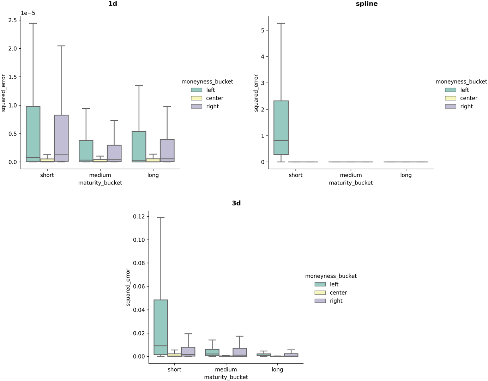

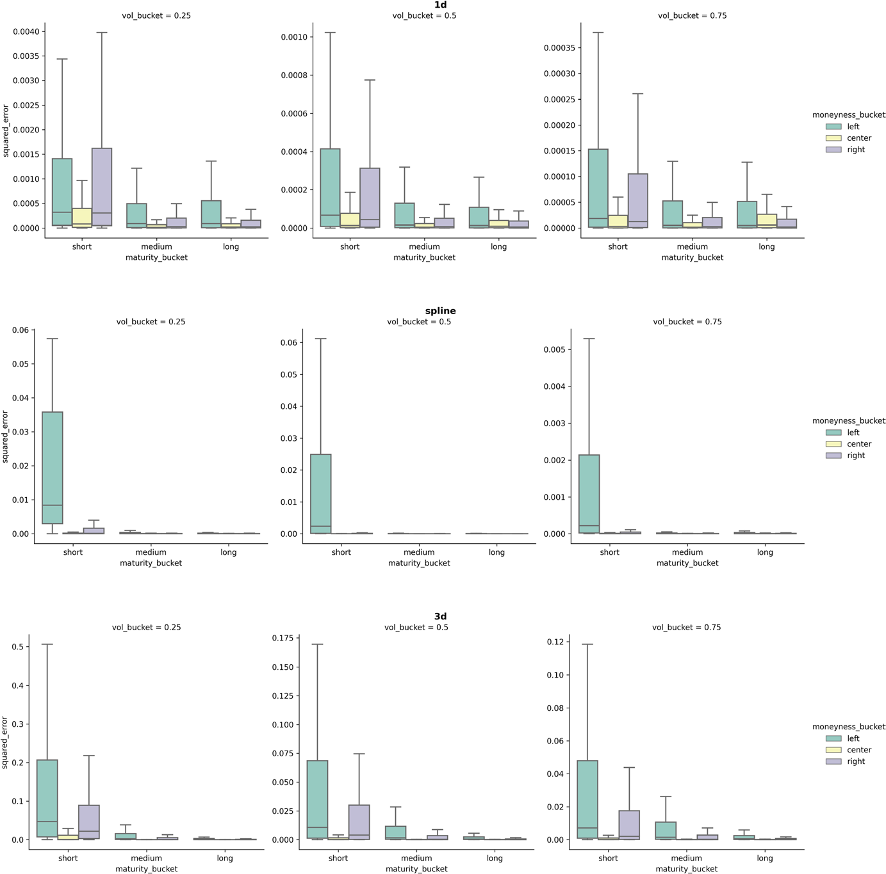

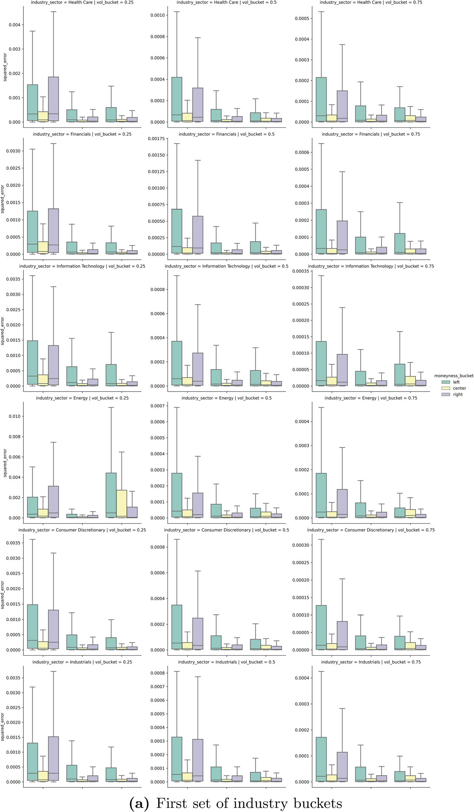

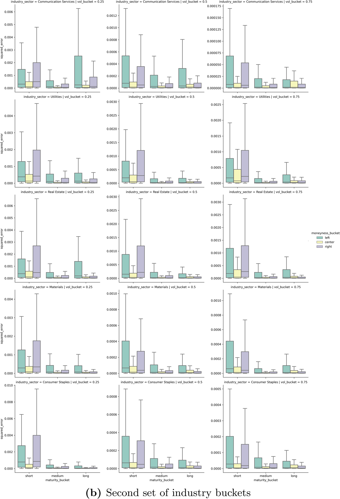

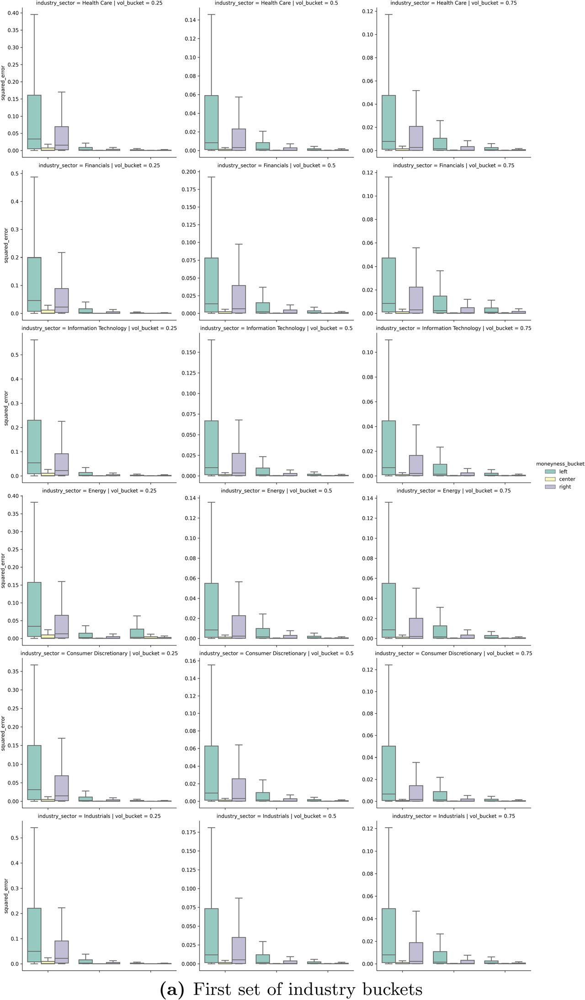

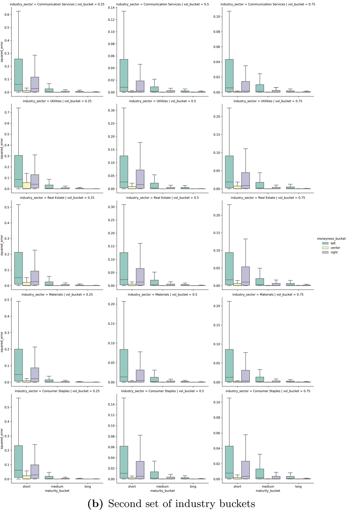

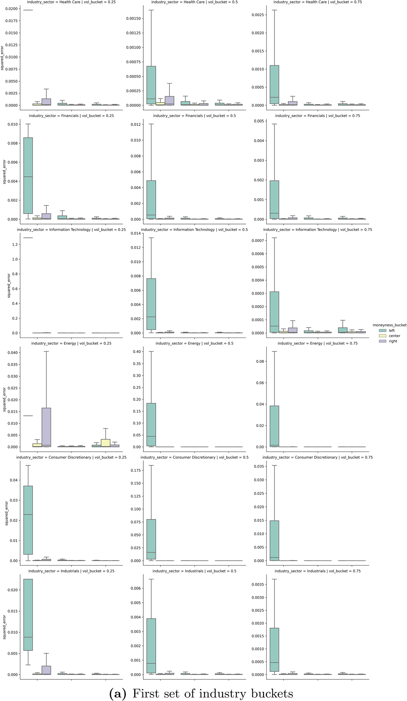

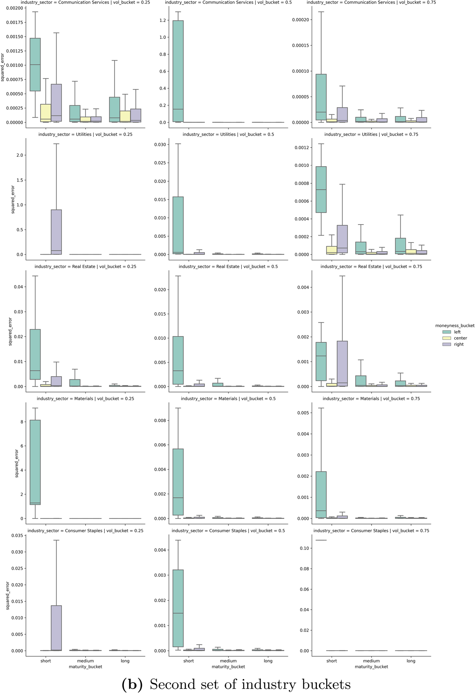

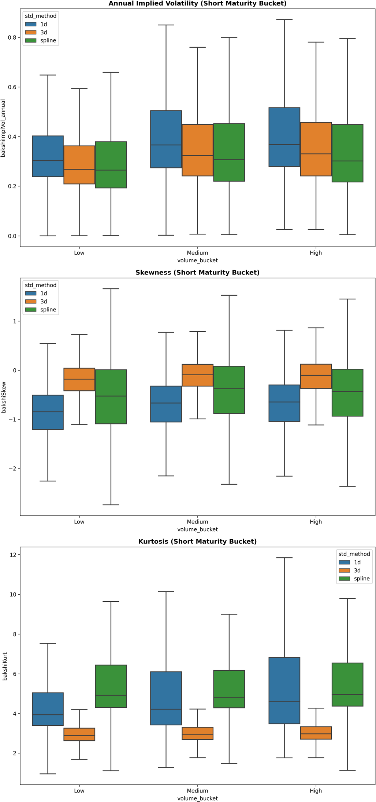

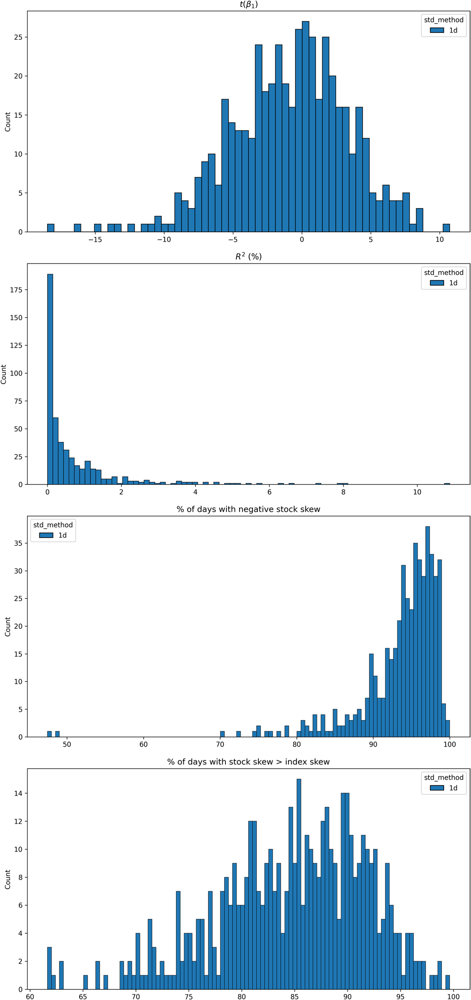

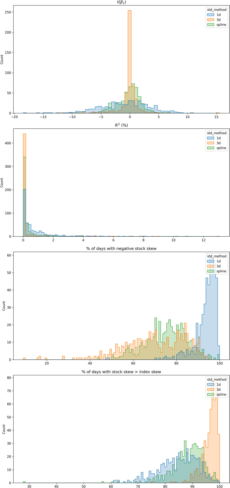

## Extraction Notes

- camelot lattice produced no usable tables; using stream output
