# arXiv:2002.00085v1 [q-fin.ST] 31 Jan 2020

## Metadata

- **Source File:** `2002.00085v1.pdf`
- **Authors:** Unknown
- **Year:** 2020
- **DOI:** Unknown

## Abstract

Principal component analysis (PCA) is a useful tool when trying to construct factor models from historical asset returns. For the implied volatilities of U.S. equities there is a PCA-based model with a principal eigenportfolio whose return time series lies close to that of an overarching market factor. The authors show that this market factor is the index resulting from the daily compounding of a weighted average of impliedvolatility returns, with weights based on the options’ open interest (OI) and Vega. The authors also analyze the singular vectors derived from the tensor structure of the implied volatilities of S&P500 constituents, and find evidence indicating that some

## Main Text

## PCA for Implied Volatility Surfaces
M. Avellaneda∗, B. Healy†, A. Papanicolaou‡ and G. Papanicolaou§
February 4, 2020
## arXiv:2002.00085v1 [q-fin.ST] 31 Jan 2020
Abstract
Principal component analysis (PCA) is a useful tool when trying to construct factor
models from historical asset returns. For the implied volatilities of U.S. equities there is
a PCA-based model with a principal eigenportfolio whose return time series lies close
to that of an overarching market factor. The authors show that this market factor
is the index resulting from the daily compounding of a weighted average of impliedvolatility returns, with weights based on the options’ open interest (OI) and Vega.
The authors also analyze the singular vectors derived from the tensor structure of the
implied volatilities of S&P500 constituents, and find evidence indicating that some
type of OI and Vega-weighted index should be one of at least two significant factors in
this market.
∗Courant Institute of Mathematical Sciences, New York University, 251 Mercer Street, New York, NY
10012-1185, USA (avellaneda@courant.nyu.edu)
†Department of Financial Computing and Analytics, University College London, Gower Street, London
WC1E 6BT, UK (brian@decisionsci.net)
‡Department of Finance and Risk Engineering, NYU Tandon School of Engineering, 6 MetroTech Center,
Brooklyn, NY 11201-3840, USA (ap1345@nyu.edu)
§Department of Mathematics, Stanford University, Stanford, CA 94305 (papanicolaou@stanford.edu)
1

1
### Introduction
We show through principal component analysis (PCA) that a relatively small number of
factors can account for most of the variation in the collective movements of the implied
volatilities derived from U.S. equity options. In fact, a matrix formed with normalized
implied volatility returns over time has positive covariance with the first principal eigenvector, which is closely related to an open interest and vega (OI-Vega)-weighted basket
of implied volatilities. This draws parallels with the first principal component obtained
from the covariance of the matrix of normalized equity returns and its proximity to the
capitalization-weighted portfolio (see [Avellaneda and Lee(2010), Boyle(2014)]), since OI
is a measure of market size for options just as capitalization is a measure of market size
for equities, and both implicitly carry liquidity information. OI is the number of open
contracts for a given option (name, strike, maturity) at a given time. Our findings highlight and give detailed insight into how PCA can be used to extract information from the
covariance structure for a large dataset of implied volatilities, and how new and improved
implied volatility factors can be constructed using OI and Vega – both of which will be useful for portfolio and risk managers who have a need for better statistical prediction models
to improve their estimated risk metrics (such as VaR and expected shortfall). To date, the
preeminent volatility index is VIX, which is constructed from index options. The VIX has
proven reliable but on occasion has shown susceptibility to outlier prices and manipulative
trading (see [Griffin and Shams(2017)]). The OI-Vega based factors constructed in this
paper are more robust as they are based on hundreds of implied volatilities and place more
emphasis on those contracts having most trading interest.
The study in this paper builds on the work in [Avellaneda and Dobi(2014)], where
they consider a large dataset of implied volatility surfaces for a few thousand U.S. equities, and use PCA to find the smallest number of factors needed to explain the collective
movements of these volatilities. They also construct principal eigenportfolios and examine the qualitative structure of each from the 1st through 4th eigenvectors.
We draw
from the same data source as [Avellaneda and Dobi(2014)], namely, the implied volatility
surface (IVS) data available from OptionMetrics through Wharton Research Data Services (WRDS). We hypothesize that the normalized covariance matrix of market-wide
implied volatilities has a low-rank plus random structure (known as the “spike model”),
and similar to [Avellaneda and Dobi(2014)], we find that removal of the low-rank components leaves a residual whose squared singular values are close in distribution to a
Marchenko-Pastur law.
Using Random Matrix Theory (RMT), the presence of principal factors should make it possible to reject a model of purely random noise. RMT was
used in [Avellaneda and Dobi(2014)], with the spectra limiting Marchenko-Pastur distribution providing the basis for establishing cutoffs for the identification of the non-random
structure. The analyses in this paper consistently (for multiple years) show there to be at
least two outliers in the singular value distribution, indicating that at least two factors are
driving the time series of IVS returns.
2

As already noted, we focus on the 1st principal eigenportfolio and its closeness to various
OI and Vega-weighted portfolios. An eigenportfolio is a vector of portfolio weights that is
derived from an eigenvector of the returns’ covariance matrix. In equities, it is well known
that the eigenportfolio constructed from the 1st principal eigenvector has explanatory power
for the cross section of U.S. equity returns ([Avellaneda and Lee(2010), Boyle(2014)]), and
that it tracks closely with a dominant factor such as a market portfolio. Perhaps the most
significant finding in this paper is a sizable body of evidence indicating that option OI
and OI-Vega are key elements for construction of factors for explaining the collective crosssectional changes of implied volatility surfaces. Specifically, we show that various factors
constructed from OI and OI-Vega-weightings of implied volatility returns have significant
explanatory power for interpreting the principal eigenportolio’s returns. This finding can
be considered as the implied volatility analogue to the equity market’s 1st principal factor,
namely the capitalization-weighted returns portfolio. As already noted, it appears that
OI plays a similar role for implied volatility to that played by capitalization for equities.
However, such a comparison is very informal as the CAPM and its related economic theory
bind equities and capitalization closely together, whereas the implied volatility results
shown in this paper are, at present, statistical findings.
The time series of implied volatility surfaces can be put into vector form, but its natural
representation is a 4-dimensional tensor, with the 4 dimensions being time, name, option
maturity and option delta (normalized strike). Our study of the 1st principal eigenportfolio
can be extended to this tensor setting, which provides an example of how factor construction
can, in fact, be improved by considering the natural representation offered by the tensor
structure. The maturity and strike dimensions lend themselves to individual factors, for
which we can construct individualized OI-weighted factors for each option maturity or
for each maturity-delta pair. Individualized factors allow for a more nuanced weighing
of changes in implied volatilities, and this leads to improved explanatory power for the
covariance structure’s, suitably defined, principal eigenportfolio.
1.1
Review of Literature
The work of [Avellaneda and Dobi(2014)] and [Dobi(2014)] provides a cross-sectional classification of U.S. equity options based on implied volatility data for the period from August
2004 to August 2013, jointly with equity returns. The spectrum of the joint equity-IVS is
used, in particular the leading eigenvalues, to classify options into those carrying mostly
systemic risk and into those carrying mostly idiosyncratic risk. Then employing methods
from principal component analysis and results from random matrix theory, the significant
eigenvalues are identified, and it is shown that approximately nine principal components
suffice to reproduce the implied volatility surfaces of all equities studied, with even fewer
risk factors for so-called systemic names, such as SPY, QQQ and AAPL. An explicit model
is introduced, which can be used to track the dynamics of the implied volatility surface,
yet is compact and computationally tractable.
3

Focusing on the implied volatility surface for a single asset, [Cont and Da Fonseca(2002)]
examine time series of option prices for options on the S&P500 and FTSE100 indices.
They show how the implied volatility surface can be deformed and represented as a randomly fluctuating surface driven by a small number of orthogonal random factors and
find a simple factor model compatible with the empirical observations.
Also of interest are methods for pricing baskets of many assets using option implied volatilities (see
[Avellaneda et al.(2002)Avellaneda, Boyer-Olson, Busca, and Friz]).
Prior to work on implied volatilities there was a bounty of research on equities. The original work on portfolio composition dates back to [Markowitz(1952)], and subsequent work
on the CAPM model which focused on the expected return of an asset relative to the riskfree instrument and derived a relationship between this and the excess return of a market or
benchmark portfolio. Work in subsequent years suggested that factors other than the market excess return were being priced. In particular, [Roll and Ross(1980)] used data for individual equities during the 19621972 period and found that at least three are priced in the
generating process of returns, and [Fama and French(1992)] found the most significant factors to be market excess return, company size and the ratio of the book value to the market
value of the firm. An early use of PCA and random matrix theory for analyzing equity returns is [Plerou et al.(2002)Plerou, Gopikrishnan, Rosenow, Amaral, Guhr, and Stanley].
The importance of eigenportfolios is highlighted in [Boyle(2014)], where there is examination of conditions under which frontier portfolios have positive weights on all assets.
This is of interest since the market portfolio given by CAPM is mean variance efficient
and has positive weights on all assets. Prior to this work is [Avellaneda and Lee(2010)],
which studies statistical arbitrage strategies in U.S. equities with trading signals generated using PCA. Modeling the residuals of stock returns as a mean-reverting process,
[Avellaneda and Lee(2010)] develop contrarian trading signals and then back-test these
over the broad universe of U.S. equities. The fact that these PCA-based strategies have
an average annual Sharpe ratio that is statistically and economically significant provides
empirical support for the PCA approach.
1.2
Structure and Results of the Paper
This paper has three main sections after this introduction. The first section addresses the
estimation of the low-rank principal component structure from the standardized returns of
options’ implied volatility. The main result of this section is the introduction of an effective
dimension approach for assessing the randomness of residuals, especially when there is only
randomness in time since the vectorized IVS data produces residuals that do retain some of
the structure of the data. The second section explores the role of the 1st principal component in constructing an eigenportfolio, with option OI and Vega as weights, as the primary
factor in evaluating collective movements of implied volatility surfaces. The final section
makes use of the data’s natural tensor structure for construction of improved principal
eigenportfolios.
The main contribution of this paper is the presented evidence demon4

strating the importance of OI when measuring changes in implied volatilities. Performing
PCA to determine the number of relevant factors is a fairly standard procedure once we’ve
standardized the data, but construction and analysis of eigenportfolios requires a deeper
understanding of the data, including OI. The tensor analysis does provide more depth of
understanding, as it shows us that construction of factors individualized to sub-categories of
options (e.g., separate OI-based factors for each of the options’ maturities) leads to a clear
improvement in the eigenportfolio’s ability to account for implied volatilities’ movements.
2
### Matrix of Implied Volatility Returns
Let t be an index denoting calendar days. Let i be an index denoting an individual option
contract, and denote the implied volatility for this particular option contract as ˆσi(t). We
define at time t the vector of daily returns on the ith contract’s implied volatility as
ri(t) = dˆσi(t)
1 ≤i ≤N
1 ≤t ≤T ,
for
and
(1)
ˆσi(t)
where dˆσi(t) = ˆσi(t + dt) −ˆσi(t) with dt = 1/252 = 1 day. We assume throughout
that the number of contracts far exceeds the number of days, N ≫T, which
means that the covariance/correlation matrix has several eigenvalues equal to zero. We
standardize these returns and then place them into a matrix R ∈RN×T , given by

ri(t) −¯ri
(2)
R =
hi
1≤i≤N,1≤t≤T
q
where ¯ri = 1
1
t(ri(t) −¯ri)2. Our hypothesis is that R can be
P
P
t ri(t) and hi =
T−1
T
decomposed into a low-rank factor matrix F and a random matrix X
R = F + X
(3)
which can be tested using the “spike-model” approach (see [Benaych-Georges and Nadakuditi(2011)]).
The low-rank matrix F can be further decomposed into orthogonal components
d
X
fiθ∗
F =
(4)
i
i=1
where each vector fi is a principal characteristic of R with orthogonality between fi and
fj ∀i ̸= j, each θi is its loading, and where ∗denotes matrix/vector adjoint. In particular,
if ∥fi∥= 1 then ∥θi∥2 is an eigenvalue of FF ∗.
There are two obvious issues to address: the value of d in (4) and the vectors (fi)i=1,...,d.
In the RMT literature it is equally as important to determine the θi’s, as the criticality
5

of a given θi will determine whether or not component fi is distinguishable from R’s bulk
eigenvectors. In applications to financial data however, the top components are typically
much greater than the critical threshold and attempts to include the middle ranks of F
will usually lead to overfitting.
A brief description of the IVS data is in the appendix. For our analysis, we extracted
56 implied volatility values for each of the (roughly) 500 S&P500 constituents, for each of
the approximately 252 business days in each year of data, 2012-2017. Specifically, we use
options with time to maturity: 30 days, 60 days, 91 days, 122 days, 152 days, 182 days, 273
days & 365 days which have delta (normalized strike; see Appendix A): -20, -30, -40, 50, 40,
30, 20. Therefore, for each maturity we use three out of the money put options (-20, -30,
-40), one at-the-money option (50) and three out-of-the-money call options (40, 30, 20).
Out-of-the-money options are used as these are more widely traded and hence are more
liquid and have more reliable prices. Thus N = 500 × 8 × 7 = 28, 000 and T = 252 (or 250
or 251 depending on when holidays fall in the year) if we use a one-year estimation window.
2.1
Singular Values of Non-Principal Structure
A very basic estimator of the covariance matrix is bρ = RR∗/T.
Much of the literature has addressed methods for improvements of this estimator, including shrinkage of
the eigenvalues in [Ledoit and Wolf(2004)] and asymptotic behavior of eigenvectors in
[Ledoit and P´ech´e(2011)] and [Ledoit and Wolf(2012)]. Perhaps the most applicable reference for what we’re seeking in this paper is [Benaych-Georges and Nadakuditi(2011)],
which contains a result stating that if the magnitude of the ∥θi∥’s are greater than some
critical threshold with respect to the variance of X’s entries in (3), then the principal
component vectors of bρ will be inside a cone centered around the principal eigenvectors
of FF ∗/T. For financial data, the 1st principal component often accounts for as much as
50% of the total variance and thus has an eigenvalue that is well over the threshold, but
higher-order factors may be closer to the critical level. Detection of factors whose eigenvalue(s) are near the critical threshold is interesting but not the main focus in this paper.
Instead, we focus on finding an estimate of the minimum number of factors needed to have
a statistical non-rejection of the estimated low-rank model.
In practice, the estimator bρ is not calculated because usually N ≫T making it more
efficient to compute the Singular Value Decomposition (SVD). The SVD represents R as
R = USV ∗,
(5)
where U = [U1, U2, . . . , UT ] is an N × T matrix with orthonormal columns, S is a T × T
diagonal matrix with entries S11 ≥S22 ≥· · · ≥STT ≥0, and V = [V1, V2, . . . VT ] is
a T × T matrix with orthonormal columns. The non-zero eigenvalues of the correlation
structure are the S2
ii values, and if R were completely random (i.e., if F = 0 in (3)), then
the histogram of these values would be close to a Marchenko-Pastur (MP) density when
6

35
35
35
30
30
30
25
25
25
20
20
20
15
15
15
10
10
10
5
5
5
0
0
0
-1
0
1
2
3
4
5
6
-1
0
1
2
3
4
5
6
-1
0
1
2
3
4
5
6
(a) 2012
(b) 2013
(c) 2014
35
35
35
30
30
30
25
25
25
20
20
20
15
15
15
10
10
10
5
5
5
0
0
0
-1
0
1
2
3
4
5
6
-1
0
1
2
3
4
5
6
-1
0
1
2
3
4
5
(d) 2015
(e) 2016
(f) 2017
Figure 1: Histograms of log(1 + S2
ii/N) where Sii are the non-zero singular values of R,
estimated with one-year windows from 2012 to 2017. If F = 0, there will be low probability
of outliers from the bulk, and the histogram can be fitted with a Marchenko-Pastur density.
However, in each of these histograms we see at least two outliers (circled marks), which
indicates the rank of F is at least two. Hence, principal components need to be removed.
N and T are large. However, from Figure 1, it is clear that at least two values separated
visibly from the bulk of (S2
ii/N)1≤i≤T . Hence, the rank of F is at least two, which means
at least two principal components need to be removed from the data for the remainder to
be considered “noise”.
For some d ≤T, the best rank-d estimator of F that minimizes the Frobenius norm of
error, is
X
SiiUiV ∗
bF =
i ,
i≤d
with residual eR = R −bF. The true rank of F is greater than d if a statistical test of
the residual rejects the hypothesis of purely random entries in eR. A Kolmogorov-Smirnoff
(KS) test is likely to reject this hypothesis if d is too small. We devise a simple KS test
using the data’s own estimated MP distribution, that is, we use the estimated asymptotic
distribution parameters obtained from (S2
ii/N)d<i≤T and then check for significance of the
associated KS statistic as we now describe.
7

The MP density is
p
(λ+ −x)(x −λ−)
1
for λ−≤x ≤λ+
ν(x) =
(6)
2πγ2
λx
where
√
λ)2 and λ > 0 .
λ± = γ2(1 ±
(7)
If R were a random N × T matrix with independent identically distributed entries of
mean zero and variance γ2, then for N > T the RMT tells us that the empirical spectral
1
N R∗R
distribution of the covariance
T
1
X
1{S2
ii/N≤x},
T
i=1
converges in probability (pointwise in x) to the distribution of the MP density in (6) as N
and T tend to infinity with lim T
N = λ ∈(0, 1) fixed. Conversely, the spectral distribution
1
T RR∗is the case of λ > 1, wherein the limit law has an additional discrete mass at
of
zero with weight 1 −1/λ, which appears because the N × N covariance has rank at most
T < N, and so there are N −T zero eigenvalues. Since we are interested only in eigenvalues
1
N R∗R for
through their empirical spectral density, we can consider the T × T covariance
which the dimension ratio λ = T/N is less than one and there is no mass at zero in the
asymptotic MP law.
The issue with the IVS data matrix R and its residual eR = R −bF is that we are
not dealing with matrices with independent identically distributed entries. We are in fact
very far from it, and so it is not at all clear that the empirical spectral density of the
residual matrices will be close to the MP law. There are significant correlations among
the entries of the residual matrices, even without addressing the normalization issue. As
already noted, there is considerable theory on separating the bulk spectrum from the spike
eigenvalues for idealized random matrix spike models, and we may also cite the survey,
[Johnstone and Paul(2018)], and in dealing with normalization issues, [El Karoui(2008)].
The theoretical criteria provided in the literature do not work with the IVS data, as
expected. Writing a data matrix as a factor matrix plus a residual so that the residual is
“noise”, or has no useful information, is a problem that arises often and in many different
disciplines, not only with financial data, but also for example in imaging in materials
science, [Berman(2019)]. With real data, this is almost always treated with a variety of
empirical estimation methods whose validity is assessed on the basis of the results produced
in specific applications.
For the IVS data, we will fit the empirical spectrum of the residuals to the MP law by
matching supports as we now describe. The quality of the fit is quantified by a KS test.
The main result of this empirical fit, which works well for the IVS data, is to extract an
estimated dimension ratio ˆλ and standard deviation ˆγ (see Table 1).
8

Let Xi = S2
ii/N be the eigenvalues (normalized) of the IVS data matrix R (normalized).
Given the number of factors d that we want to retain, the estimators for for the support
λ± of the empirical spectral density, or histogram, of the residual that we use are
ˆλ+ = Xd+1
ˆλ−= XT ,
and
(8)
which then using (7) with λ ∈(0, 1) gives
2
q
q
q
q


ˆλ+ +
ˆλ−
ˆλ+ −
ˆλ−
ˆλ =
.
(9)
ˆγ =
and


2
2ˆγ
The fitted MP densities to the empirical spectral densities of the residuals with 9
components removed, are shown in Figure 2 for each of the years from 2012 to 2017. For
each of these years a 2-sample KS test does not reject, and increasing d to 10, 20, 30 and
50 continues to result in a visibly good fit and non-rejection by the KS test. Hence, we
conclude that 9 factors is typically enough to describe the daily systematic movements
among all implied volatility surfaces over a single year of daily data. In contrast, for equity
returns for the S&P500 constituents, it typically requires (roughly) 20 factors to account
for the majority of daily movement, with the number dropping below 10 during the 2008
financial crisis (see [Avellaneda and Lee(2010)]).
A direct comparison with [Avellaneda and Dobi(2014)], wherein a cutofffor purely random entries was determined to be around 108 factors (out of ∼3,000 names), is not possible
because the dataset in [Avellaneda and Dobi(2014)] includes equity returns normalised using the strike of the ATM option. This is a more complex data set because the vectorized
time series of IVS plus equities (of size 28, 000 + 500 in the context of this paper) is quite
heterogeneous and therefore the “low-rank plus random” decomposition needs additional
attention.
In this paper, the 9 factors (out of ∼500 names for IVS) describe the systematic movements. Compared to equity returns by themselves, the number of factors are of comparable
size for the different years 2012-2017 and d = 20 factors are needed for the S&P500 constituents to produce a “random” residual.
2.2
Effective Dimension in Residual Matrices
We will now introduce the notion of effective dimension of the data as follows. The parameter estimates given in (8) and (9) for the dimension ratio λ = T/N and the data standard
deviation γ imply that the empirical spectral density of the data fits a Marchenko-Pastur
distribution associated with a random matrix whose dimensions are different from those
of the actual data matrix R. This is because the IVS data has entries with significant
correlations between them, and the effective dimension idea is a way to account for or
quantify this feature. We could say roughly that the residual data matrix does not have
9

14
15
18
16
12
14
10
10
12
8
10
8
6
6
5
4
4
2
2
0
0
0
0
0.2
0.4
0.6
0.8
1
1.2
1.4
1.6
1.8
0
0.5
1
1.5
2
0
0.5
1
1.5
2
2.5
(a) 2012
(b) 2013
(c) 2014
16
16
18
16
14
14
14
12
12
12
10
10
10
8
8
8
6
6
6
4
4
4
2
2
2
0
0
0
0
0.2
0.4
0.6
0.8
1
1.2
1.4
1.6
1.8
0
0.5
1
1.5
2
0
0.5
1
1.5
2
2.5
(d) 2015
(e) 2016
(f) 2017
Figure 2: For each of the years from 2012 to 2017, we removed the top d = 9 principal singular values and fitted a MP density to the histogram of the remaining T −d
squared singular values over N, i.e., S2
ii/N for i > d. For each of these years, a 2-sample
Kolmogorov-Smirnofftest does not reject. Removal of more than 9 components also leads
to non-rejection of the hypothesis that the residual matrices eR have purely random entries.
independent entries, but it does have some kind of independence when the data is grouped
in blocks and the number of such blocks plays the role of an effective dimension. This
assessment is made using the empirical spectral density of the residual.
N = T/ˆλ, which we call this the effective dimension associated with a residDenote by e
ual that is purely random. In other words, the N-dimensional columns of Ud+1, Ud+2, . . .
and UT do not affect the spectrum and we have
T
eR∗eR = 1
D≈1
1
X
Y ∗Y ,
iiViV ∗
S2
(10)
i
N
N
N
e
i=d+1
D≈” denotes approximate
N ×T matrix with purely random entries, and where “
where Y is a e
equality in distribution, in the sense of the fitting of the empirical spectral density to the
MP law that was described in the previous section. Hence, we are looking for pure randomness in the temporal loadings, and we are not concerned if there is non-random structure
remaining in the higher-order spatial components. In fact, for the implied volatility data
there are clear patterns of non-random structure in the residual eR even for d large enough
10

Figure 3: Non-random structure can be seen in the residual matrix eR even after sufficiently
many components have been removed for non-rejection by the KS test. The horizontal
coordinate on the right is IVS name, delta and maturity (vectorized), and that on the left
is time. This patterned structure suggests that the spatial modes are non-random and that
the randomness we have concluded from the KS test is due to randomness in the temporal
loadings. Random temporal loadings is precisely what is suggested in (10).
for non-rejection of the randomness hypothesis, which is clearly seen in Figure 3 for the
year 2017 data. The reason for the non-random patterns is simple: the implied volatility’s 4-dimensional tensor structure was flattened into a 2-dimensional N ×T matrix using
a lexicographical ordering for vectorizing the IVS data (name, strike and maturity) that
prevails even after removal of PCA factors. This patterned structure does not mean that
we have incorrectly concluded ”pure” randomness in the residual as seen by the empirical
spectral density, but rather it suggests that the spatial modes (name, strike and maturity)
retain some of their structure and that the randomness we have concluded from the KS test
is due to randomness in the temporal loadings. Indeed, randomness of temporal loadings
is precisely what is suggested by the approximate distributional equivalence expressed in
(10).
Denote the tth column of R as Rt, which we can write as
d
T
X
X
Rt =
fiθit +
SiiUiVit ,
i=1
i=d+1
where θit and Vit are the tth entry of θi and Vi, respectively; Ui is the ith column of U.
Clearly θit are the temporal loadings on the ith principal factor, and for i > d the temporal
loadings are SiiVit. Denote the higher-order temporal modes as eV = [Vd+1, . . . , VT ]. The
KS test has indicated randomness of these loadings for i > d, which means the (T −d) × T
11

Figure 4: The matrix S eV ∗of temporal loadings for the 2017 data, of dimension (T −d)×T
with d = 9. The distinctive tapering is not an indication of non-randomness in the residual,
but instead says that S eV ∗/N is close in distribution to ΣQ∗where QΣQ∗is the spectral
form of another matrix Y ∗Y/ e
N × T matrix with purely random entries of
N and Y is an e
variance ˆγ2.
ˆλ+
ˆλ−
ˆλ
N
ˆγ
year
e
2012
1.77
0.07
0.80
0.44
573
1.93
0.10
0.85
0.40
633
2013
2014
2.15
0.07
0.86
0.49
519
2015
1.80
0.06
0.80
0.47
537
2016
1.98
0.06
0.83
0.50
506
2017
2.33
0.11
0.93
0.42
601
Table 1: The estimated parameters for the MP distribution and the effective dimension
after the removal of 9 principal components, for each of the 251 or 250 IVS daily returns
The data points are Xi = S2
observed in each year.
ii/N for i > 9, the estimates are
N = T/ˆλ. Notice in particular that
given by (8) and (9), and the effective dimension is e
N ≪N ∼25, 000.
e
12

matrix S eV ∗has covariance spectrum close in distribution to that of a random matrix. But
this matrix has a distinctive tapering that would counter any claim of pure randomness.
Indeed, Figure 4 shows this tapering for the 2017 data for the S2
ii/N with i > 9, that is,
with d = 9. However, if one considers a purely random matrix Y of dimension T × e
N with
entries having variance ˆγ2, and expresses it in spectral form such that Y ∗Y/ e
N = QΣQ∗,
then ΣQ∗is a tapered matrix that is derived from a purely random matrix. Moreover, the
squared singular values of ΣQ∗fit the MP law and are equal in distribution to the squared
singular values of S eV ∗/N.
The notion of effective dimension as we have introduced it here is robust and useful
in understanding the real information content of the IVS data. Note in particular that
in Table 1, which has the parameter estimators for the MP fit as well as the effective
dimension for each of the 6 years we’ve considered, a striking finding is that we have a
very low effective dimension for each year, namely 500 ∼e
N ≪N ∼25, 000. The effective
dimension of the IVS residuals in a factor decomposition indicates that there is structure
in these residuals; they are not purely random matrices.
3
### Principal Eigenportfolios and OI-Weighted Indices
The portfolio constructed from the first eigenvector of the normalized covariance, the eigenportfolio, has been analyzed in [Avellaneda and Lee(2010)] and [Boyle(2014)] and elsewhere
for equities returns. In this section, we will apply a similar approach and terminology to
construct a portfolio of implied volatilities and compare it to an analog of a market portfolio. Although such portfolios can exist in theory, they are not directly1 tradeable. However
it is still of interest to introduce them and use them as a proxy for the market’s collective
volatility, similar to the VIX index.
Central to our analysis of the eigenportfolio is its “closeness” to an open-interest (OI)-
weighted factor of our construction. Analogous to the case in equities where the eigenportfolio’s returns track the capitalization-weighted market portfolio (with varying degrees
of closeness), we show that the implied volatility eigenportfolio’s returns track closely
to various OI-weighted factors or indices.
It is essential to include the OI as it is the
implied volatilities’ analogue to capitalization, thereby capturing each option contract’s
importance.2 Both in the analysis of implied volatilities and equities, the underlying spike
model (see [Benaych-Georges and Nadakuditi(2011)]) provides a mathematical framework
for closeness of the eigenportfolio and factor returns. Figure 5 shows daily OI amounts for
at-the-money options for the year 2017. It is important to note the spikes and the zeros
1A portfolio can be constructed with returns equal to a linear combination of implied volatilities returns,
i.e., a linear combination of the ri(t)’s. However, such a portfolio would probably incur a roll yield due to
the daily rebalancing required to maintain a constant maturity and constant delta position.
2In practice, the CBOE’s VIX calculation uses OI too. Specifically, the VIX construction includes only
SPX options that are between the at-the-money mark and the last strike before the first two consecutive
strikes that have zero OI.
13

(a) ATM Front Month
(b) ATM Third Month
Figure 5: The daily values of open interest (OI) for the at-the-money options with 30 days
to maturity (the front month) and 90 days to maturity (third month). The horizontal
coordinate on the left is time and on the right option name. Note the spikes and the zeros
in the OI, which indicate that only a small percentage of options can explain changes in
implied volatilities because most options do not have open trades any on given day.
in the OI. Most options have zero open trades at any point in time, which is an indication
that a rather small percentage of options can explain changes in implied volatilities.
3.1
“Trading” Implied Volatility and Construction of OI-Based Factors
It is not only OI, however, that must be taken into consideration in constructing IVS returns
portfolios. We must also account for the sensitivity of IVS to fluctuations as measured by
the Vega, for example. We can motivate this sensitivity in portfolios we are about to create
by first introducing a synthetic market of exchange-traded notes (ETNs). For each option
we can think of an ETN whose prospectus states the daily returns to be
dEi(t)
Ei(t) := ri(t) ,
(11)
where ri(t)’s are the components of the implied volatility return vector defined in (1),
and dt = 1/252 = 1 day. The ETN whose returns are given by (11) are the stochastic
component in the returns of a ∆-neutral options position. Indeed, letting Ci(t) denote the
option price with underlying price, time-to-maturity and delta (Si(t), τi, ∆i), from Itˆo’s
lemma we compute the (unitless) differential of a ∆-neutral position (up to a term of size
“Big-Oh”),
dCi(t) −∆idSi(t)
= Vi(t)
Si(t)dˆσi(t) + O(dt) = Vuntls
(t)ri(t) + O(dt) ,
(12)
i
Si(t)
14

where Vi(t) is the Vega for the ith option and
(t) = ˆσi(t)Vi(t)
Vuntls
,
(13)
i
Si(t)
is a unitless Vega, which is the dollar-Vega divided by the price of the underlying. We
will use (13) in constructing weighing factors, in addition to OI, after we first discuss them
more generally.
We would like to construct a global factor that can describe upwards of 50% of daily
variance for all of the IVS ETNs. In equities, such a factor is the market portfolio, which
suggests to us that the number of outstanding shares (contracts) should have some bearing
on the relevance of an individual equity in factor construction. Indeed, in options this is
precisely the OI, and a general form for a global factor with only OI weighing is


P
OIi(t)
i ω
ri(t)
dQ(t)
Q(t) :=
,
(14)


P
OIi(t)
i ω
where OIi(t) is the OI for the ith option and ω( · ) is a weighting function of our choosing.
In the simplest case we have d = 1 in (3), and the ETN returns have a simple factor-based
returns model,
dQ(t)
dEi(t)
Ei(t) = βi
Q(t) + ξi(t) ,
(15)
where ξi is an idiosyncratic noise component independent of Q(t). Ordinary least squares
regression shows us that the βi’s are given by the covariance with the factor,

dEi
, dQ
/h2
q ,
(16)
βi = cov
Ei
Q
q = var(dQ
where h2
Q ).
Remark 1. [Boyle(2014)] explains how the principal eigenportfolio is a frontier portfolio
if the Perron-Frobenius theorem applies. However, for options the frontier/CAPM theory
does not apply because the lifetime of an option is too short. Therefore, comparisons with
equities are merely an informal, statistical analogy.
3.2
The Spike Model and the Principal Eigenportfolio
Let us consider the N × N empirical covariance matrix for the returns of the synthetic
ETNs,
T
1
X
(ri(t) −¯ri)(rj(t) −¯rj)
for 1 ≤i, j ≤N.
bΣij :=
T −1
t=1
15

Using the returns model in (15), the population covariance matrix is
qββ∗+ Ω,
Σ = h2
(17)


dQ(·)
where Ωis the covariance matrix with Ωij = cov(ξi(·), ξj(·)), and h2
q = var
. EquaQ(·)
tion (17) is a spike model, as referred to above, because the β’s describe a substantial
portion of variance and cause a single eigenvalue to stick out from the rest of the spectrum.
The 1st principal component of the ETN empirical covariance matrix will be nearly proportional to the β’s of the OI-weighted portfolio if the ξ(t) covariance is not too large. For
the model in (3), the distribution of the empirical matrix principal component is shown in
[Benaych-Georges and Nadakuditi(2011)] to be within a cone surrounding the spike model’s
low-rank component if the difference between ∥θ∥2 and the variances of the noise is over
a critical amount. For the spike model in (17), the critical threshold is crossed if h2
q∥β∥2
exceeds a threshold determined by the covariances of the ξi(t)’s, which should happen as
N grows.
In finance there usually are differing sizes among the Σii’s, which means better statistical estimation of principal eigenvectors results from consideration of correlations rather
than covariances, which is the normalization issue we noted earlier. The ETNs’ empirical
correlation matrix is
bρ = h−1bΣh−1 ,
where h is a diagonal matrix of standard deviations hi defined in (2). Letting u1 denote
the principal eigenvector of bρ, the spike model suggests u1 ≈1
ch−1β for c a normalizing
constant. Using another (orthogonal) eigenvector eu such that eu ⊥u1, we can also construct
portfolios as done in [Avellaneda and Lee(2010)],
h−1eu
h−1u1
,
eπ =
,
π1 =
i(h−1u1)i
i(h−1eu)i
P
P
which are orthogonal in the sense that covariance of these portfolios’ returns is zero,
π∗
1 bΣeπ = u∗
1bρ eu = λ1u∗
1eu = 0 ,
where λ1 > 0 is the principal eigenvector such that bρu1 = λ1u1.
Proposition 3.1. Returns of the top eigenportfolio tend toward the factor returns plus
some tracking error. Returns of the orthogonal portfolios tend toward factor neutrality.
Proof. Assuming the parameters are such that we are over the critical levels in [Benaych-Georges and Nadakudi
16

and letting EP1(t) be the principal eigenportfolio, we have
i(βi/hi)2
P
dQ(t)
dEP1(t)
EP1(t) −
i βi/h2
P
Q(t)
i
X
!
!
βi/h2
dQ(t)
X
i
π1i −
=
βi
Q(t) +
π1iξi(t)
j βj/h2
P
j
i
i
→ε1(t) ,
βi/h2
j →0 as the random matrix’s diwhere factor returns disappear because π1i −
i
j βj/h2
P
P
mensions grow, and where ε1(t) = limN
i π1iξi(t) is the tracking error. All orthogonal
portfolios eπ are approximately factor neutral,
X
!
dg
EP(t)
dQ(t)
X
eπiξi(t) →eε(t) ,
=
eπiβi
Q(t) +
EP(t)
g
i
i
|
{z
}
≈0
i eπiξi(t), and where the limit happens because (h−1eu)∗β ≈eu∗h−1hu1 =
P
where eε(t) = limN
0; the “≈” becomes more accurate and tends toward an equality as the gap between ∥h−1β∥
and the critical level is increased.
3.3
Empirical Analysis
The 1st spatial3 singular vector U1 computed by the SVD in (5) is the empirical estimator
for u1, and the estimator for each hi is the empirical standard deviation of each ri. Hence,
we can compute the eigenportfolio from the data, and then compare it with the empirically
estimated β’s. In our studies we will consider two weighting functions,
ω(OI) = log(1 + OI) × Vuntls ,
ω(OI) = OI
or
(18)
where Vuntls denotes the unitless Vega of (13). Generally speaking, ω(OI) = OI results in
a factor with a less signficant intercept in ex-post regressions of eigenportfolio returns onto
the factor returns, whereas the ω(OI) = log(1+OI)×Vuntls results in the same regression
having significant intercept but lower projection error. The plain OI weighting is a bit
strange, however, because it counts contracts without taking into account the sensitivity
of the contract to a change in the volatility of the underlying stock. It should also be
noted that the log-weighting has a factor loading that is closer to unity, whereas the plain
OI-weighting that is significantly less than unity.
The OI and unitless Vega weighing does in fact matter and it performs better when
the tensor data structure is taken into consideration. We have chosen the combined OI
3That is, of the IVS vector of names, deltas and maturities
17

and unitless Vega weighing in the form log(1 + OI) × Vuntls, which works well for the IVS
data, although it is rather arbitrary at present.
In Figure 6, we see the comparison for each of the years, with each year’s eigenportfolio
computed using the 251 or 250 days of data from the year, and with a Q(t) factor computed
using the weight function ω(OI) = OI.
If the eigenportfolio’s weights are sorted in
descending order (i.e., we sort π1 in descending order) and then the sorting index is used to
permute the vector diag−2(h)β/ P
i(diag−2(h)β)i, then the sorted vector and the permuted
vector should line up. Indeed, the plots in Figure 6 show this lining up, with the sorted
eigenportfolio in red and the permuted β’s in blue.
10-5
10-4
10-5
2.5
18
16
16
14
2
14
12
12
1.5
10
10
8
8
1
6
6
0.5
4
4
2
2
0
0
0
-2
-2
-0.5
100
101
102
103
104
105
100
101
102
103
104
105
100
101
102
103
104
105
(a) 2012
(b) 2013
(c) 2014
10-5
10-5
10-4
20
2.5
18
16
2
15
14
12
1.5
10
10
8
1
5
6
0.5
4
0
2
0
0
-5
-2
-0.5
100
101
102
103
104
105
100
101
102
103
104
105
100
101
102
103
104
105
(d) 2015
(e) 2016
(f) 2017
Figure 6: The eigenportfolio computed from the data (red) compared with the theoretical
eigenportfolio that is close to βi/h2
i (blue). The horizontal axes are in log scale. Each βi =
cov(dEi(·)/Ei(·), dQ(·)/Q(·))/h2
q, where for these plots the factor Q(t) has been computed
according to the formula in (14) using the weighting function ω(OI) = OI. To generate this
plot, we first sort the eigenportfolio in descending order, and then insert the sorting index
into the vector h−2β/ P
i(h−2β)i. The lining up of the two vectors using a single sorting
index is evidence that the factor computed using the weighting function ω(OI) = OI is
close to the data’s principal component.
We can also check the name, the tenor, the ∆, the βi/h2
i ’s and the OI for the topweighted options. These traits are listed for the top 32 options in the 2017 sorting. It is
interesting to note that most of the top options are out-of-the-money put options, and all
with 365 days to maturity (the longest-dated options in the dataset). Generally speaking,
18

long-dated options have higher Vega4 and therefore are most sensitive to changes in implied
volatility. The interpretation of long-dated options dominating the 1st eigenportfolio is
simple: the 1st eigenportfolio explains the most systematic movements among the options
and should be the least sensitive to idiosyncratic noise, and therefore ignores short-dated
options that may fluctuate idiosyncratically due to short-lived risk events. The years 2013
to 2017 had similar characteristics in the top 32 eigenportfolio options.
We also perform checks to make sure that eigenportfolios can track in an online setting,
i.e., all quantities used to compute a portfolio in real-time are adapted to the filtration generated by the options data.5 We group all 6 years of data into one simulated run, and then
compute an eigenportfolio each month using the previous six months’ daily returns. The
returns are compounded daily but we only update the portfolio weights monthly. Figures
7a-7d show the online 6-month sliding window performance of the eigenportfolio alongside
the factor returns and the VIX returns. Notice in Figure 7b that the eigenportfolio returns
have significant explanatory power for the returns on VIX (i.e., dVIX(t)/VIX(t)), but also
that returns for the OI factor and eigenportfolio have a much stronger linear dependence.
Indeed, even if we use the weighting function ω(OI) = log(1 + OI) × Vuntls, which allows
the OI factor to have better tracking with the VIX (see Figure 7d), the stronger linear
dependence in daily returns between factor and eigenportfolio still prevails.
Lastly, some discussion on performance with the two different weighting functions is
in order. The visual evidence in Figures 6 and 7 should be sufficiently convincing for the
reader that OI needs to be included in factor construction. The discussion that remains is
for us to decide how to determine the OI-weighted factor that is somehow ’best’. Table 3
provides evidence indicating that ω(OI) = OI is good because it leaves the least amount
of unexplained systematic return after regression of the eigenportfolio onto the factor’s
returns (as well as two other factors).
However, visually from Figure 7d we see that
ω(OI) = log(1 + OI) × Vuntls produces a factor that is better for tracking the VIX, and
the VIX is the U.S. market’s premier volatility index, but this choice of ω leaves a significant
amount of unexplained systematic return after the regression. Bear in mind that leaving
unexplained systematic return is not entirely bad because we have thus far only been able
to construct a single factor for explained implied volatility movements, but we know that
we need at least two (recall Figure 1 where it was clear that there are at least two principal
components).
It turns out that there is a setting wherein ω(OI) = log(1+OI)×Vuntls is an acceptable
factor, but it will require us to move from ordinary ’flat’ linear algebra and use tensors in
4The Black-Scholes call/put option Vega of is V(t) = SN ′(d1)√τ where τ is the time-to-maturity. Hence,
all other things being equal, longer-dated options have higher Vega.
5The online eigenportfolio that we compute has one major anticipatory element, which is survivorship
bias. We have selected names of the S&P500 constituents from 2017 and collect their options’ data going
back to 2012. Hence, there is some survivorship bias in favor of names that perform well enough to stay in
the index for these 6 years. We acknowledge this bias and realize that it will persist over time, but for our
analysis of daily statistics it does not make our findings any less valid. Moreover, the OI weighing favors
liquid options for which survivorship bias is likely to be reduced.
19

the next Section.
4
### Factors and Eigenportfolios Using Tensors
The implied volatility surfaces have a natural tensor structure with 4 dimensions: time,
name, maturity and delta (normalized strike). To work with this tensor we first need to
redefine our notation for implied volatility returns from how they were defined in (1) and
(2). Before we had 1 ≤i ≤N where N = 500 · 8 · 7 = 28, 000 (500 names, 8 maturities, 7
deltas). Now we have multiple indices,
rijk(t) = time-t implied vol. return for ith name, jth maturity and kth ∆,
where now 1 ≤i ≤N(1), 1 ≤j ≤N(2), 1 ≤k ≤N(3) and 1 ≤t ≤T (i.e., N(1) = 500,
N(2) = 8 and N(3) = 7). We standardize the returns and place them in a 4-dimensional
tensor,
rijk(t) −rijk

,
(19)
R =
hijk
1≤t≤T, 1≤i≤N(1), 1≤j≤N(2), 1≤k≤N(3)
q
where rijk = 1
1
t(rijk(t) −rijk)2. Similar to the sector-based
P
P
t rijk(t) and hijk =
T−1
T
hierarchical PCA done for equities in [Avellaneda(2019)], we can define individualized
factors for each value of a certain tensor dimension.
The maturity dimension and the
delta dimension are the two candidates for individualized factors; the following subsection
demonstrates the advantage of constructing the individualized factors.
4.1
Eigenportfolios Via Multilinear SVD (MLSVD)
A tensor analogue for the SVD is the multilinear singular value decomposition (MLSVD)
(see [Cichocki et al.(2015)Cichocki, Mandic, De Lathauwer, Zhou, Zhao, Caiafa, and Phan,
Kolda and Bader(2009), De Lathauwer and Vandewalle(2000)]).
The canonical polyadic
decomposition (CPD) (see [Kolda and Bader(2009), Tucker(1966)]) can also be used, but
when it comes to computing principal components with the IVS data, the results produced
by these two approaches are very similar. We use the MLSVD, which is briefly described
in the Appendix, as follows. We can write the tensor R in the form
Stijk U(1)
◦U(2)
◦U(3)
◦U(4)
X
R =
,
(20)
t
i
j
k
t,i,j,k
where U(1) is a T ×T orthonormal matrix, U(2) is an N(1)×T orthonormal matrix, U(3) is an
N(2)×N(2) orthonormal matrix, U(4) is a N(3)×N(3) orthonormal matrix, S is a T ×N(1)×
N(2) × N(3) real-valued tensor, and where ◦denotes the vector outerproduct. The main
disadvantage of the MLSVD is that the so-called core tensor S is, in general, not diagonal
or even sparse, which results in difficulties when computing a rank-d decomposition that
20

is best in the sense of the Frobenius norm. In practice, the rank-1 decomposition used for
computing the eigenportfolio can be estimated using the top MLSVD vectors, which we
write as
eU(1) = U(2)
◦U(3)
◦U(4)
,
(21)
1
1
1
which for the IVS data is very close to what one gets using CPD. To compute the tensor
eigenportfolio, we do an elementwise division with the tensor of standard deviations,
eU(1)
ijk
π(1)
ijk ∝
.
(22)
hijk
It remains to decide how to normalize this π(1). If we normalize with one global summation
over the multi-index (i, j, k), then there would have been no need to use tensors. However,
if there is a dimension such that for each of the index values there corresponds a different
OI-weighted factor, then the normalization needs to be done separately for the different
values of this index. The logic for using different normalizations for different index values
will become clearer in the following example.
4.2
Example: Different Factors for Each Maturity
Suppose that we construct a different OI-weighted factor for each maturity, for a total
of 8 factors. Moreover, suppose that our factor considers the β for each option to be its
loading on the factor corresponding to the same maturity, i.e., there are factors Qj for
j = 1, 2, . . . 8, with dQj(t)/Qj(t) ∝P
i,k ω(OIijk(t))rijk(t), where OI is the tensor of open
interests. The factor model for returns is then
dQj(t)
rijk(t) = βijk
Qj(t) + ξijk(t) ,
where ξ is a tensor of idiosyncratic noise that is independent of the factor processes in
Qj. In this case, for the the βijk/h2
ijk’s to line up with the eigenportfolio in (22), the
normalization needs to be done as follows for each j,
eU(1)
ijk/hijk
π(1)
ijk =
i,k eU(1)
P
ijk/hijk
P
i,k ω(OIijk(t))rijk(t)
dQj(t)
.
(23)
Qj(t) =
P
i,k ω(OIijk(t))
Finally, the global factor (to compare with the eigenportfolio) is simply the mean of the
tenor factors,
dQj(t)
dQ(t)
1
X
Q(t) =
Qj(t) .
(24)
N(2)
j
21

Figure 8 shows improved results if this maturity-wise approach is used with the normalizations in (23) along with the weighting function ω(OI) = log(1 + OI) × Vuntls. The linear
dependence between the tensor eigenportfolio and the Q seen in Figure 8a is a considerable
improvement from the linear dependence shown in Figure 7a that was obtained using flat
matrices. The ex-post regression diagnostics of the tensor approach show an improvement
over the flat matrix approach, as Table 4 lists regression outputs that have higher R2 (i.e.,
less projection error) than their counterparts in Table 3.
Finally, we show the in-sample plots of cumulative returns for the tensor portfolios
next to the cumulative returns of the portfolios from the flat matrices; all portfolios are
constructed with weighting function ω(OI) = log(1 + OI) × Vuntls. Figures 9 and 10 show
these results, from which it is clear that the tensor factor constructed in this subsection
allows for eigenportfolio tracking that is much closer to the factor. This is evidence that
the family of OI-based tensor factors subsumes a ’good’ factor, in the sense that it can
track the eigenportfolio returns. We recall that the reason why we are concerned with the
eigenportfolio when constructing factors, is because we know from theoretical analysis of
the spike model that the 1st eigenportfolio will have weights close to the vector h−2β, where
β are loadings on a dominant factor. Hence, to determine if we have a dominant factor, we
should make comparisons with the eigenportfolio and in the tensor IVS data context the
results come out better, most likely because the data is heterogeneous and it is therefore
beneficial to respect the tensor structure, which MLSVD does.
5
### Summary and Conclusion
We have carried out a principal component analysis of a data set of implied volatility
surfaces from options on U.S. equities. It contains daily implied volatilities for the 6 years
2012-2017 for 500 equities (names), 8 maturities and 7 strikes, that is, 28, 000 data points
daily for 251 × 6 days. We have posed and answered three questions in this data-driven
study: (a) what is the essential information in this data set, or how many factors are needed
to represent the data with the residual being “noise”, (b) by analogy with equity returns
PCA analysis, can the principal eigenportfolio be associated with a “market” portfolio
and what should that “market” portfolio be and (c) since the natural structure of the
data is that of a four-dimensional tensor (time, name, maturity, strike), do we benefit by
preserving this structure in the PCA analysis, that is, by doing a tensor PCA?
The analysis of question (a) is in the section “Matrix of Implied Volatility Returns”.
Building on [Avellaneda and Dobi(2014)], we perform matrix PCA on the flattened IVS
data excluding stock returns, arriving at the conclusion that the number of significant
factors is 9. For comparison, the number of significant factors for equity returns is normally
in the range 15 −20. There is a very large dimension reduction to the IVS data set since
there is a lot of structure in option prices and hence in the IVS. In this section, we also
introduce the concept of effective dimension for the residual because, contrary to theoretical
22

factor analysis as well as equity returns analysis, the IVS residuals retain structural patterns
or correlations. We find that the effective spatial dimension (name, maturity, strike) of
the residuals is closer to 500 than to the nominal dimension of 28, 000. This is the way
spectral analysis, that is, PCA, deals with the heterogeneity of the IVS data: the residuals
have patterns in them even after the market information has been taken out.
The analysis of question (b) is in the section “Principal Eigenportfolios”. The main
result here is the construction of the analog for IVS of the market portfolio for equity
returns. This is based on using the open interest of the options as well as their (unitless)
Vega. OI is the number of contracts on a given day for each name, maturity and strike,
and the Vega is an associated sensitivity to volatility.
We find that portfolios of IVS
returns weighed suitably by OI and Vega do track the IVS eigenportfolio. This provides
an interpretation of the eigenportfolio that is analogous to the one for equity returns, is
robust and can be used in ways that the VIX, the SPX volatility index, is used.
The analysis of the last question (c) can be found in the “Factors and Eigenportfolios
Using Tensors” section.
Yes, we find that retaining the tensor structure in the eigenportfolio analysis makes a difference in that the OI-Vega weighted (tensor) IVS returns
portfolio tracks the (tensor) eigenportfolio much better. This is a strong indication that
data structure matters and data flattening should be avoided if possible.
There are obviously many, many more questions that can and should be asked about
the IVS data set, including theoretical ones about the methodology used. It is an evolving
research enterprise.
A
### Appendix: Description of Data
A.1
Implied Volatility
Implied volatilities are not directly observable in the market and must be derived from the
prices of traded options. At any point in time, for a given underlying stock, there will be
a variety of call and put options available to trade on the market, each of which will have
a specific strike price and time to maturity. Given the observed prices of these options it
is then possible to infer an implied volatility using a numerical method.
Options on individual stocks have an American-style exercise feature and must be priced
using a numerical algorithm as no closed form solution is available. For this purpose OptionMetrics uses the industry standard Cox-Ross-Rubinstein (CRR) binomial tree model.
This model can accommodate underlying securities with either discrete dividend payments
or a continuous dividend yield. An option is priced by working backwards through the
tree from the maturity date when the payoffis known and incorporating any potential
value arising from the possibility of early exercise at each node. The calculated price of
the option at time t = 0 is the model price.
To compute the implied volatility of an option given its price, the model is run iteratively
with different values of σ until the model price of the option converges to its market price,
23

defined as the midpoint of the options best closing bid and best closing offer prices. At
this point, the final value of σ is the options implied volatility.
This model can be adapted to account for the discrete dividends that stocks typically
pay on a quarterly basis. The approach taken is to adjust the price of the underlying stock
by subtracting the discounted value of all dividends to be paid between now and the expiry
of the option.
Once the implied volatility has been calculated for an option, it is a simple matter to
then calculate its delta using the Black-Scholes model. We can then create a grid of time
to maturity vs delta with a corresponding implied volatility where it is known. This will
result in a grid of implied volatilities which have very different times to maturity and deltas
from those needed to form a standardised grid, which is referred to as an implied volatility
surface.
OptionMetrics calculates its standardized option implied volatilities using a kernel
smoothing technique. The data is first organized by the log of days to expiration and
by call-equivalent delta (delta for a call, one plus delta for a put). A kernel smoother is
then used to generate a smoothed volatility value at each of the specified interpolation
grid points. At each grid point j on the volatility surface, the smoothed volatility ˆσj is
calculated as a weighted sum of option implied volatilities:
P
i ViσiΦ (xi,j, yi,j, zi,j)
ˆσj =
,
P
i ViΦ (xi,j, yi,j, zi,j)
where i is indexed over all the options for that day, Vi is the vega of the option, σi is the
implied volatility and Φ is the kernel function:




y2
z2
x2


1
−
+
+
2h1
2h2
2h3
√
Φ (x, y, z) =
2πe
where
xi,j = log(Ti/Tj)
yi,j = ∆i −∆j
zi,j = ICPi=CPj .
Values xi,j, yi,j and zi,j are measures of the distance between the option and the target grid
point, Ti(Tj) is the number of days to the expiration of the option (grid point), ∆i(∆j) is
the call-equivalent delta of the option (grid point), CPi(CPj) is the call/put identifier of
the option (grid point) and I() is an indicator function. The kernel bandwidth parameters
were chosen empirically and are set as h1 = 0.05, h2 = 0.005, and h3 = 0.001.
24

A.2
Open Interest
Unlike implied volatility, open interest is directly observable in the market and represents
the number of contracts in a particular option (underlying stock, strike and expiry date)
open at a point in time. For each open contract, there will be a party who is long the
option and conversely one who is short the option. Open interest is therefore concentrated
in the most popular contracts, which tend to be those closest to at-the-money and have
less then one year but more than two weeks to expiry.
OptionMetrics provides an open interest for every available contract at the close of
each trading day, as this is the information available from the exchange.
However, as
described above we are interested in the open interest at the grid points we have chosen
for our implied volatility surfaces, namely constant ∆’s and constant maturities. In order
to estimate the open interest for these points, we used a bucketing approach.
Firstly, we allocated each option to one of eight time buckets according to its days to
expiry (τ) where the limits on these ranges are as given in Table 5. Similarly, we allocated
each option to one of eight ∆buckets according to where the limits on these ranges are as
given in Table 6. Once this has been done, each option has been allocated to one of our
56 grid points and we then sum the open interest across all options at each grid point for
each stock on each day in our dataset.
τ Bucket (days)
Min Value (days)
Max Value (days)
30
1
45
60
46
75
91
76
106
122
107
137
152
138
167
182
168
227
273
228
319
365
320
Table 5: Bucketing scheme for open interest
25

∆Bucket
Min Value
Max Value
-20
-25
-1
-30
-35
-24
-40
-45
-34
50
45
54
40
35
44
30
25
34
20
1
24
Table 6: Bucketing scheme for open interest
B
### Appendix: The Multilinear SVD
If A is a matrix6, we can use the singular value decomposition (SVD) to expand
A = A(i, t), i = 1, . . . , N, t = 1, . . . , T
in the form
A = UΣV ∗.
Here U is an N × N unitary matrix, V is a unitary T × T matrix and Σ is a diagonal
matrix with entries σ1 ≥σ2 ≥· · · ≥σR ≥0, where the index R is the rank of A and
R ≤min{N, T}. In terms of the components, we have
R
X
A(i, t) =
σrU(i, r)V (t, r), i = 1, . . . , N, j = 1, . . . , T .
r=1
For this expansion, only R columns of the unitary matrices U and V are needed to represent
the matrix A. When the sum stops at ¯R < R then the corresponding matrix A ¯R is the
best rank ¯R approximation of the matrix A in the Frobenius norm.
These properties do not generalize to tensors except in special and rather limited ways.
A frequently used approach for tensors is the multi-linear SVD (MLSVD) or Tucker decomposition which for a fourth order tensor that has the form:
X
S(i′, t′)U(i, i′)V (t, t′) .
A(i, t) =
(A.1)
1≤i′≤N,1≤t′≤T
Here i = (i1, i2, i3), N = (N1, N2, N3), V is a unitary T × T matrix and U is a unitary
tensor of the form
U(i, i′) = U(1)(i1, i′
1)U(2)(i2, i′
2)U(3)(i3, i′
3)
(A.2)
6The notation in the Appendix is a bit different from that used in the paper and closer to that used in
the linear algebra literature.
26

and the matrices U(1), U(2), U(3) are unitary of size N1 × N1, N2 × N2, and N3 × N3,
respectively. The fourth order tensor S is not diagonal anymore, in general. However, it
has the property of all orthogonality:
X
S(i, t)S(i′, t′) = 0
(A.3)
where the indices (i, t) and (i′, t′) are equal except for one of the four components and the
sum is over the three equal components. This means that distinct “slices” of each orientation (Horizontal (N1), Vertical (N2), Frontal (N3), Time (T)) are orthogonal. Moreover,
the indices can be permuted so that the sums of squares over all except for one index are
ordered by size
sX
S2(1, j, k, t) ≥σH
2 ≥· · · ≥σH
σH
(A.4)
1 =
N1
j,k,t
sX
σV
2 ≥· · · ≥σV
S2(i, 1, k, t) ≥σV
1 =
N2
i,k,t
sX
σF
S2(i, j, 1, t) ≥σF
2 ≥· · · ≥σF
1 =
N3
i,j,t
sX
σT
2 ≥· · · ≥σT
S2(i, j, k, 1) ≥σT
1 =
T
i,j,k
where we write here i = (i, j, k).
The MLSVD representation (A.1) is exact and is obtained from the application of
SVDs to all the possible flattenings of the tensor and organizing the output suitably
to get the result, see [Kolda and Bader(2009), De Lathauwer and Vandewalle(2000)] and
[Cichocki et al.(2015)Cichocki, Mandic, De Lathauwer, Zhou, Zhao, Caiafa, and Phan]. A
schematic of the MLSVD expansion is shown in Figure 11. Another expansion, not used
here, is the canonical polyadic decomposition that is based on Frobenius norm minimization, a non-convex problem; a schematic is shown in Figure 12.
In tensor PCA, we are interested in the covariance over time of the data, which we assume here is already normalized. In the notation of this Appendix, we define this covariance
as
X
C(i, j) =
A(i, t)A(j, t) .
(A.5)
t
Using the MLSVD representation of A in (A.1) we deduce the representation
X
s(i′, j′)U(i, i′)U(j, j′)
C(i, j) =
(A.6)
i′,j′
27

where
X
s(i, j) =
S(i, t)S(j, t) .
(A.7)
t
Using the unitarity of the tensor U, (A.2), in the covariance expansion (A.6) we obtain
X
X
s(i′, k)U(i, i′) .
C(i, j)U(j, k) =
(A.8)
i′
j
We see from this expression that the unitary tensor U is not an eigenvector of the covariance
tensor C in (A.8) because s is not diagonal in general. As noted earlier, U has the form
U(i, j) = U(1)(i1, j1)U(2)(i2, j2)U(3)(i3, j3)
with U(1)(i1, j1), U(2)(i2, j2), U(3)(i3, j3) unitary matrices of size N1×N1, N2×N2 N3×N3,
respectively. The equation (A.8) captures rather clearly the scope the MLSVD representation of A in (A.1) in that while it is not a spectral form for the covariance, the tensor s on
the right has positive diagonal elements that can be ordered and has offdiagonal elements
that are often small because of the total orthogonality property (A.3), although this has
to be verified separately and it is not generally true. When, however, s(1, 1) is large then
we can take
˜U(1)(i, 1) = U(1)(i1, 1), U(2)(i2, 1), U(3)(i3, 1)
(A.9)
as the principal tensor eigenvector, as we did with a slightly different notation in (21).
We close this Appendix with a few comments that complement the discussion up to now.
(#1) The truncation that produces the principal tensor eigenvector does not, in general,
arise from a Frobenius norm minimization of the difference ||A −APCA||. However, for
the IVS data, the principal tensor eigenvector using MLSVD as described here and using
CPD by Frobenius norm minimization produces essentially the same result. There will
be a difference for multi-factor tensor PCA, an issue that is not considered here. (#2)
It is observed in practice that if there is a big gap in the size of the sigmas, A.4, then
this kind of truncation does behave like it does for matrices. That is, the residual tends
to behave as if it came from random entries. (#3) How does one test that a tensor has
entries that behave as if they are random? We saw in the matrix case in the “Matrix of
Implied Volatility Returns” section that one looks at the histogram of the singular values
and compares this to a suitably adapted Marchenko-Pastur density, using a KolmogorovSmirnov test, for example. For tensors a test can be developed by using matrix flattenings
of the tensor, horizontal, vertical, frontal, etc. flattenings. Since the Marchenko-Pastur
law is an asymptotic one, care must be taken so that the data structure is constructed
so that it gives rise to flattenings for which this asymptotic law can actually be used.
This is work in progress at present. (#4) There are other methods for constructing tensor
28

principal components: Alternating least squares (or alternating SVDs), are often used but
for which little can be said theoretically, or direct (non-convex in general) Frobenius norm
optimizations using gradient descent or stochastic gradient descent to avoid getting stuck
in local minima early on.
U(2)
A
=
S
U(1)
Figure 11: Core decomposition of a 3-D cube
Figure 12: Tucker decomposition
### References
[Avellaneda(2019)] M. Avellaneda. Hierarchical pca and applications to portfolio management. Available at https: // arxiv. org/ abs/ 1910. 02310 , 2019. NYU Courant
Working Paper.
[Avellaneda and Dobi(2014)] M Avellaneda and D. Dobi. Modeling volatility risk in equity
options market: A statistical approach. 2014. NYU Courant Working Paper.
29

[Avellaneda and Lee(2010)] M. Avellaneda and J.-H. Lee. Statistical arbitrage in the us
equities market. Quantitative Finance, 10(7):761–782, 2010.
[Avellaneda et al.(2002)Avellaneda, Boyer-Olson, Busca, and Friz] M.
Avellaneda,
D. Boyer-Olson, J. Busca, and P. Friz.
Reconstruction of volatility:
Pricing
index options by the steepest descent approximation. Risk, Oct. 2002.
[Benaych-Georges and Nadakuditi(2011)] F. Benaych-Georges and R. R. Nadakuditi. The
eigenvalues and eigenvectors of finite, low rank perturbations of large random matrices.
Advances in Mathematics, 227(1):494–521, 2011.
[Berman(2019)] M. Berman. Improved estimation of the intrinsic dimension of a hyperspectral image using random matrix theory. Remote Sensing, 11(9):1049, 2019.
[Boyle(2014)] P. Boyle. Positive weights on the efficient frontier. North American Actuarial
Journal, 18(4):462–477, 2014.
[Cichocki et al.(2015)Cichocki, Mandic, De Lathauwer, Zhou, Zhao, Caiafa, and Phan]
A. Cichocki, D. Mandic, L. De Lathauwer, G. Zhou, Q. Zhao, C. Caiafa, and H. A.
Phan. Tensor decompositions for signal processing applications: From two-way to
multiway component analysis.
IEEE Signal Processing Magazine, 32(2):145–163,
2015.
[Cont and Da Fonseca(2002)] R. Cont and J. Da Fonseca. Dynamics of implied volatility
surfaces. Quantitative Finance, 2(1):45–60, 2002.
[De Lathauwer and Vandewalle(2000)] B. De Lathauwer, L.and De Moor and J. Vandewalle. A multilinear singular value decomposition. SIAM Journal on Matrix Analysis
and Applications, 21(4):1253–1278, 2000.
[Dobi(2014)] D. Dobi.
Modeling volatility risk in equity options: A cross-sectional approach. PhD thesis, New York University, 2014.
[El Karoui(2008)] N. El Karoui.
Spectrum estimation for large dimensional covariance
matrices using random matrix theory. Annals of Statisics., 36(6):27572790, 2008.
[Fama and French(1992)] E. F. Fama and K. R. French. The cross-section of expected
stock returns. The Journal of Finance, 47(2):427–465, 1992.
[Griffin and Shams(2017)] J. M. Griffin and A. Shams. Manipulation in the VIX? The
Review of Financial Studies, 31(4):1377–1417, 2017.
[Johnstone and Paul(2018)] I. M. Johnstone and D. Paul. Pca in high dimensions: An
orientation. Proceedings of the IEEE, 106(8):1277–1292, 2018.
30

[Kolda and Bader(2009)] T. G. Kolda and B. W. Bader. Tensor decompositions and applications. SIAM Review, 51(3):455–500, 2009.
[Ledoit and P´ech´e(2011)] O. Ledoit and S. P´ech´e. Eigenvectors of some large sample covariance matrix ensembles. Probability Theory and Related Fields, 151(1-2):233–264,
2011.
[Ledoit and Wolf(2004)] O. Ledoit and M. Wolf. A well-conditioned estimator for largedimensional covariance matrices.
Journal of Multivariate Analysis, 88(2):365–411,
2004.
[Ledoit and Wolf(2012)] O. Ledoit and M. Wolf. Nonlinear shrinkage estimation of largedimensional covariance matrices. The Annals of Statistics, 40(2):1024–1060, 2012.
[Markowitz(1952)] H. Markowitz. Portfolio selection. The Journal of Finance, 7(1):77–91,
1952.
[Plerou et al.(2002)Plerou, Gopikrishnan, Rosenow, Amaral, Guhr, and Stanley]
V. Plerou, P. Gopikrishnan, B. Rosenow, L. A. N. Amaral, T. Guhr, and H. E.
Stanley. Random matrix approach to cross correlations in financial data. Physical
Review E, 65(6):066126, 2002.
[Roll and Ross(1980)] R. Roll and S. A. Ross. An empirical investigation of the arbitrage
pricing theory. The Journal of Finance, 35(5):1073–1103, 1980.
[Tucker(1966)] L. R. Tucker.
Some mathematical notes on three-mode factor analysis.
Psychometrika, 31(3):279–311, 1966.
31

β/h2
ticker
maturity (days)
∆
OI (average)
3.5332×103
ADSK
365
-20
2751
3.4206×103
KLAC
365
-20
3962
3.3575×103
DHR
365
-20
18017
3.2402×103
KLAC
365
-30
3906
3.2904×103
LRCX
365
-30
4063
3.1996×103
KLAC
365
-40
5171
3.2450×103
LRCX
365
-40
4002
3.1577×103
365
-40
4229
INTU
3.1832×103
INTU
365
-30
5457
3.1372×103
365
-20
15907
ADI
3.1402×103
XLNX
365
-20
4237
3.1365×103
FLR
365
-20
19285
3.0942×103
ADI
365
-30
13276
3.1348×103
ADSK
365
-30
4018
3.1324×103
TXN
365
-20
19669
3.0415×103
365
-30
23395
DHR
3.0531×103
CHRW
365
-40
2874
3.0543×103
CHRW
365
-30
3044
3.0444×103
365
-30
22425
FLR
3.1108×103
ROST
365
-30
5809
3.0327×103
365
-40
7943
RCL
3.0153×103
FDX
365
-30
34131
3.0019×103
RCL
365
-20
24656
2.9784×103
365
-20
5796
EXPD
3.0237×103
LRCX
365
40
14541
2.9778×103
365
-20
43925
FDX
2.9695×103
FLR
365
40
18146
3.0293×103
365
30
12629
LRCX
2.9768×103
ADSK
365
-40
3314
3.0220×103
SBUX
365
-40
39345
2.9369×103
IR
365
-20
4699
2.9476×103
CF
365
-20
72143
Table 2: The ordering of names in the top 32 slots in the eigenportfolio of S&P500 constituents’ implied volatility for the year 2012. The maturity for all these top-weighted
options is 365 days, which are the longest-dated options in our dataset. Generally speaking, long-dated options have higher Vega, which means that the 1st eigenportfolio finds the
most systematic explanation of implied volatility surface movements by considering the
options with the greatest sensitivity to implied volatility changes.
32

dVIX(t)/VIX(t) vs. Factor Returns
Returns on Eigenportfolio vs. Factor Returns
0.2
0.6
0.5
0.15
0.4
Eigenportfolio Returns
0.1
dVIX(t)/VIX(t)
0.3
0.2
0.05
0.1
0
0
-0.1
-0.05
-0.2
-0.3
-0.1
-0.1
-0.05
0
0.05
0.1
0.15
0.2
0.25
-0.1
-0.05
0
0.05
0.1
0.15
0.2
0.25
Factor Returns
Factor Returns
(a) A scatter plot of the adapted eigen-
(b) A scatter plot of the VIX returns
portfolio returns against the returns
against the returns of OI-weighted facof OI-weighted factor computed using
tor computed using weighting function
weighting function ω(OI) = OI, from
ω(OI) = OI, from 2012 through 2017.
2012 through 2017. The eigenportfolio is
computed using a 6-month sliding window, which is why the first 6 months of
2012 are not included in the output.
Log Eigenportfolio, OI Factor and VIX, 2012 to 2017
Log Eigenportfolio, OI Factor and VIX, 2012 to 2017
Eigenportfolio
Eigenportfolio
0.8
0.8
OI factor
OI factor
VIX
VIX
0.6
0.6
0.4
0.4
0.2
0.2
0
0
-0.2
-0.2
-0.4
-0.4
-0.6
-0.6
-0.8
-0.8
06-Jan-2015
06-Jan-2015
02-Feb-2016
02-Feb-2016
28-Feb-2017
28-Feb-2017
25-Mar-2013
25-Mar-2013
01-Aug-2013
01-Aug-2013
27-Aug-2014
27-Aug-2014
23-Sep-2015
23-Sep-2015
12-Nov-2012
09-Dec-2013
12-Nov-2012
09-Dec-2013
13-Nov-2017
13-Nov-2017
21-Apr-2014
21-Apr-2014
18-Oct-2016
18-Oct-2016
15-May-2015
15-May-2015
10-Jun-2016
10-Jun-2016
03-Jul-2012
03-Jul-2012
07-Jul-2017
07-Jul-2017
(c)
The
adapted
6-month
sliding-
(d)
The
adapted
6-month
slidingwindow
eigenportfolio
and
the
OIwindow
eigenportfolio
and
the
OIweighted factor computed using weightweighted index computed using weighting function ω(OI) = OI.
ing function ω(OI) = log(1 + OI) ×
Vuntls (logarithm of each index).
By
taking the OI weights to be the logarithm of 1 plus OI, we see improved
tracking of the VIX compared to Figure 7c.
Regression of the eigenportfolio onto the factor has significant intercept coefficient but improved projection
error compared to the same regression
with ω(OI) = OI (see Table 3).
Figure 7: Output from adapted eigenportfolios using a 6-month sliding window.
33

ω(OI)
α3
β3
α2
β2
α1
β1
2012-2014
OI
0.0629
0.6348
0.0755
0.7196
0.0908
0.7187
(1.6307)
(1.8777)
(2.2614)
R2 = 0.9387
R2 = 0.9332
R2 = 0.9322
log(1 + OI) × Vuntls
0.1224
0.8947
0.1418
1.0053
0.1745
1.0000
(4.0669)
(4.4146)
(5.2169)
R2 = 0.9629
R2 = 0.9574
R2 = 0.9529
2013-2015
OI
0.0570
0.5500
0.0728
0.6794
0.0865
0.6769
(1.1356)
(1.3413)
(1.5885)
R2 = 0.9303
R2 = 0.9184
R2 = 0.9172
log(1 + OI) × Vuntls
0.1409
0.8472
0.1664
0.9842
0.1934
0.9745
(4.1438)
(4.4377)
(4.8793)
R2 = 0.9681
R2 = 0.9610
R2 = 0.9561
2014-2016
OI
0.0190
0.5259
0.0116
0.6600
0.0165
0.6594
(0.3091)
(0.1746)
(0.2491)
R2 = 0.9183
R2 = 0.9049
R2 = 0.9047
log(1 + OI) × Vuntls
0.1841
0.8731
0.2007
0.9734
0.2184
0.9687
(4.9527)
(5.1087)
(5.3412)
R2 = 0.9701
R2 = 0.9664
R2 = 0.9634
2015-2017
OI
-0.0505
0.5164
-0.0705
0.6168
-0.0803
0.6170
(-0.8877)
(-1.1757)
(-1.3413)
R2 = 0.9102
R2 = 0.8997
R2 = 0.8992
log(1 + OI) × Vuntls
0.1705
0.8926
0.1769
0.9389
0.1836
0.9381
(6.5261)
(6.6106)
(6.8505)
R2 = 0.9810
R2 = 0.9800
R2 = 0.9797
2012-2017 (all years)
OI
-0.0010
0.5444
-0.0020
0.6604
0.0028
0.6601
(-0.0289)
(-0.0546)
(0.0781)
R2 = 0.9156
R2 = 0.9033
R2 = 0.9032
log(1 + OI) × Vuntls
0.1476
0.8903
0.1619
0.9760
0.1813
0.9732
(7.2613)
(7.5857)
(8.2952)
R2 = 0.9697
R2 = 0.9665
R2 = 0.9645
Table 3: Factor loadings and unexplained systematic returns for the eigenportfolio from
a 6-month sliding window and various OI-weightings in the factor construction. For each
sample period there are three regressions: a 3-factor regression dEep
dQ
Q +beq dS&P
Eep = α3+β3
S&P +
VIX +ε, a 2-factor regression dEep
dQ
bvx dVIX
Q +beq dS&P
Eep = α2 +β2
S&P +ε, and a 1-factor regression
dEep
dQ
Q + ε. The factor obtained by weighting function ω(OI) = OI is perhaps
Eep = α1 + β1
desireable because it leaves no significant excess return in the residual, but there is no
reason why we should reject a factor with non-zero intercept. In contrast, the weighting
function ω(OI) = log(1+OI)×Vuntls has significant intercept and a higher R2, and hence
is perhaps a better factor.
34

Log Eigenportfolio, OI Factor and VIX, 2012 to 2017
Eigenportfolio
Returns on Eigenportfolio vs. Factor Returns
0.8
OI factor
0.2
VIX
0.6
0.15
0.4
Eigenportfolio Returns
0.2
0.1
0
-0.2
0.05
-0.4
0
-0.6
-0.8
-0.05
06-Jan-2015
02-Feb-2016
28-Feb-2017
25-Mar-2013
01-Aug-2013
27-Aug-2014
23-Sep-2015
12-Nov-2012
09-Dec-2013
13-Nov-2017
21-Apr-2014
18-Oct-2016
15-May-2015
10-Jun-2016
03-Jul-2012
07-Jul-2017
-0.1
-0.1
-0.05
0
0.05
0.1
0.15
0.2
0.25
Factor Returns
(b) The adapted tensor eigenportfolio
(a) A scatter plot of the adapted tenand the tensor OI-weighted index computed using weighting function ω(OI) =
sor eigenportfolio returns against the relog(1 + OI) × Vuntls (logarithm of each
turns of tensor OI-weighted factor Q
given by (24), computed using weighting
index).
This picture does not suggest
function ω(OI) = log(1 + OI) × Vuntls,
that the tensor approach to eigenportfofrom 2012 through 2017. The eigenportlio and factor construction offers an imfolio is computed using a 6-month slidprovement to simply using flat matrices,
ing window. The linear dependence seen
as it is roughly similar to its analogue in
here is an improvement from the linear
Figure 7d. Improvement due to tensors
dependence seen in Figure 7a achieved
is more evident in Figures 8a, 9 and 10,
using flat matrices.
and in Table 4.
Figure 8: Output from the adapted tensor eigenportfolio using a 6-month sliding window.
ω(OI)
α3
β3
α2
β2
α1
β1
2012-2017 (all years)
OI
0.0891
0.7384
0.0923
0.8432
0.0925
0.8432
(3.0439)
(2.9875)
(3.0107)
R2 = 0.9466
R2 = 0.9404
R2 = 0.9404
log(1 + OI) × Vuntls
0.2092
0.9673
0.2211
1.0466
0.2339
1.0450
(11.8532)
(11.8433)
(12.3862)
R2 = 0.9806
R2 = 0.9782
R2 = 0.9775
Table 4: Factor loadings and systematic unexplained returns for the tensor eigenportfolio
from a 6-month sliding window and various OI-weightings in the tensor-factor construction.
For each sample period there are three regressions: a 3-factor regression dEep
dQ
Eep = α3+β3
Q +
VIX +ε, a 2-factor regression dEep
dQ
beq dS&P
S&P +bvx dVIX
Q +beq dS&P
Eep = α2 +β2
S&P +ε, and a 1-factor
regression dEep
dQ
Eep = α1 + β1
Q + ε. The tensor regressions shown in this Table have higher
R2 than their counterparts in Table 3, which is an indication that the tensor approach to
factor construction is better.
35

0.2
0.4
Eigenportfolio
Eigenportfolio
OI Factor
OI Factor
0.1
VIX Returns
VIX Returns
0.2
0
-0.1
0
-0.2
-0.2
-0.3
-0.4
-0.4
-0.5
-0.6
-0.6
03-Jan-2012
15-Feb-2012
29-Mar-2012
07-Aug-2012
19-Sep-2012
02-Nov-2012
17-Dec-2012
11-May-2012
25-Jun-2012
03-Jan-2012
15-Feb-2012
29-Mar-2012
07-Aug-2012
19-Sep-2012
02-Nov-2012
17-Dec-2012
11-May-2012
25-Jun-2012
(a) 2012 flat
(b) 2012 tensor
0.4
0.5
Eigenportfolio
Eigenportfolio
OI Factor
OI Factor
0.4
0.3
VIX Returns
VIX Returns
0.3
0.2
0.2
0.1
0.1
0
0
-0.1
-0.1
-0.2
-0.2
-0.3
-0.3
02-Jan-2013
14-Feb-2013
07-Aug-2013
19-Sep-2013
13-Dec-2013
01-Apr-2013
31-Oct-2013
13-May-2013
25-Jun-2013
02-Jan-2013
14-Feb-2013
07-Aug-2013
19-Sep-2013
13-Dec-2013
01-Apr-2013
31-Oct-2013
13-May-2013
25-Jun-2013
(c) 2013 flat
(d) 2013 tensor
1
0.6
Eigenportfolio
Eigenportfolio
OI Factor
OI Factor
0.8
VIX Returns
VIX Returns
0.4
0.6
0.2
0.4
0.2
0
0
-0.2
-0.2
-0.4
-0.4
02-Jan-2014
02-Jan-2014
14-Feb-2014
14-Feb-2014
31-Mar-2014
31-Mar-2014
07-Aug-2014
19-Sep-2014
07-Aug-2014
19-Sep-2014
15-Dec-2014
15-Dec-2014
31-Oct-2014
31-Oct-2014
13-May-2014
13-May-2014
25-Jun-2014
25-Jun-2014
(e) 2014 flat
(f) 2014 tensor
Figure 9: Comparison of the eigenportfolio tracking the OI factor, for both the flat matrices
(on the left) and the tensors (on the right); all portfolios are constructed with weighting
function ω(OI) = log(1 + OI) × Vuntls. The plots display the logarithm of each index.
These are in-sample fits for each of the years 2012, 2013 and 2014.
36

1
1
Eigenportfolio
Eigenportfolio
OI Factor
OI Factor
0.8
0.8
VIX Returns
VIX Returns
0.6
0.6
0.4
0.4
0.2
0.2
0
0
-0.2
-0.2
-0.4
-0.4
02-Jan-2015
02-Jan-2015
17-Feb-2015
17-Feb-2015
31-Mar-2015
31-Mar-2015
07-Aug-2015
21-Sep-2015
07-Aug-2015
21-Sep-2015
02-Nov-2015
15-Dec-2015
02-Nov-2015
15-Dec-2015
13-May-2015
13-May-2015
25-Jun-2015
25-Jun-2015
(a) 2015 flat
(b) 2015 tensor
0.8
0.4
Eigenportfolio
Eigenportfolio
OI Factor
OI Factor
0.6
VIX Returns
0.2
VIX Returns
0.4
0
0.2
0
-0.2
-0.2
-0.4
-0.4
-0.6
-0.6
-0.8
-0.8
04-Jan-2016
04-Jan-2016
17-Feb-2016
17-Feb-2016
31-Mar-2016
31-Mar-2016
08-Aug-2016
20-Sep-2016
08-Aug-2016
20-Sep-2016
01-Nov-2016
14-Dec-2016
01-Nov-2016
14-Dec-2016
12-May-2016
12-May-2016
24-Jun-2016
24-Jun-2016
(c) 2016 flat
(d) 2016 tensor
0.3
0.6
Eigenportfolio
OI Factor
0.2
VIX Returns
0.4
0.1
0.2
0
-0.1
0
-0.2
-0.2
Eigenportfolio
-0.3
OI Factor
VIX Returns
-0.4
-0.4
03-Jan-2017
03-Jan-2017
15-Feb-2017
15-Feb-2017
30-Mar-2017
30-Mar-2017
08-Aug-2017
20-Sep-2017
08-Aug-2017
20-Sep-2017
01-Nov-2017
14-Dec-2017
01-Nov-2017
14-Dec-2017
12-May-2017
12-May-2017
26-Jun-2017
26-Jun-2017
(e) 2017 flat
(f) 2017 tensor
Figure 10: Comparison of the eigenportfolio tracking the OI factor, for both the flat matrices (on the left) and the tensors (on the right); all portfolios are constructed with weighting
function ω(OI) = log(1 + OI) × Vuntls. The plots display the logarithm of each index.
These are in-sample fits for each of the years 2015, 2016 and 2017.
37

## Tables

### Table 1

*Caption:* Table 5: Bucketing scheme for open interest

| τ Bucket (days) | Min Value (days) | Max Value (days) |
| --- | --- | --- |
| 30 60 91 122 152 182 273 365 | 1 46 76 107 138 168 228 320 | 45 75 106 137 167 227 319 |

Raw CSV: `assets/table_001.csv`

### Table 2

*Caption:* Table 6: Bucketing scheme for open interest

| ∆ Bucket | Min Value | Max Value |
| --- | --- | --- |
| -20 -30 -40 50 40 30 20 | -25 -35 -45 45 35 25 1 | -1 -24 -34 54 44 34 24 |

Raw CSV: `assets/table_002.csv`

### Table 3

*Caption:* Table 3: Factor loadings and unexplained systematic returns for the eigenportfolio from

| 0.0629 0.6348 (1.6307) R2 = 0.9387 | 0.0755 0.7196 (1.8777) R2 = 0.9332 |
| --- | --- |
| 0.1224 0.8947 (4.0669) R2 = 0.9629 | 0.1418 1.0053 (4.4146) R2 = 0.9574 |

Raw CSV: `assets/table_003.csv`

### Table 4

*Caption:* Table 3: Factor loadings and unexplained systematic returns for the eigenportfolio from

| 0.0570 0.5500 (1.1356) R2 = 0.9303 | 0.0728 0.6794 (1.3413) R2 = 0.9184 |
| --- | --- |
| 0.1409 0.8472 (4.1438) R2 = 0.9681 | 0.1664 0.9842 (4.4377) R2 = 0.9610 |

Raw CSV: `assets/table_004.csv`

### Table 5

*Caption:* Table 3: Factor loadings and unexplained systematic returns for the eigenportfolio from

| 0.0190 0.5259 (0.3091) R2 = 0.9183 | 0.0116 0.6600 (0.1746) R2 = 0.9049 |
| --- | --- |
| 0.1841 0.8731 (4.9527) R2 = 0.9701 | 0.2007 0.9734 (5.1087) R2 = 0.9664 |

Raw CSV: `assets/table_005.csv`

### Table 6

*Caption:* Table 3: Factor loadings and unexplained systematic returns for the eigenportfolio from

| -0.0505 0.5164 (-0.8877) R2 = 0.9102 | -0.0705 0.6168 (-1.1757) R2 = 0.8997 |
| --- | --- |
| 0.1705 0.8926 (6.5261) R2 = 0.9810 | 0.1769 0.9389 (6.6106) R2 = 0.9800 |

Raw CSV: `assets/table_006.csv`

## Figures

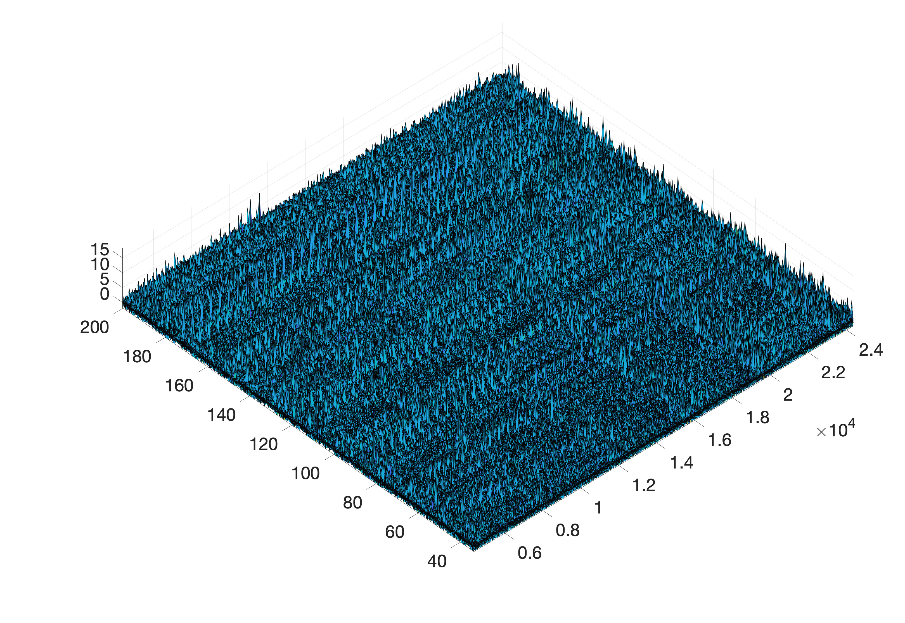

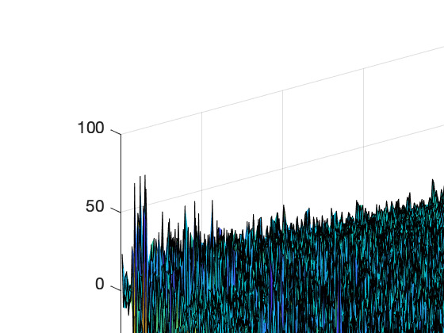

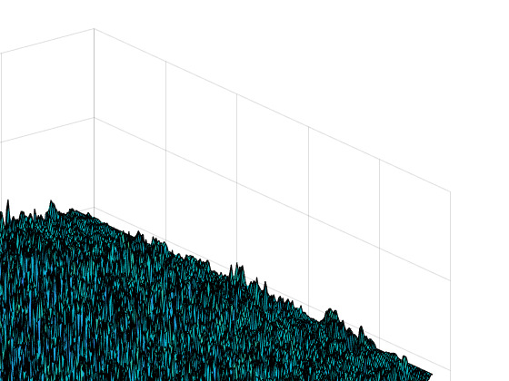

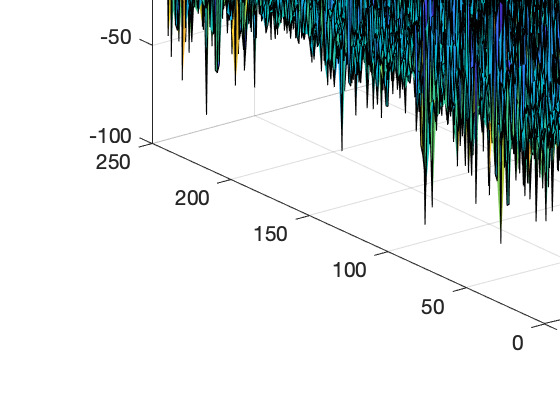

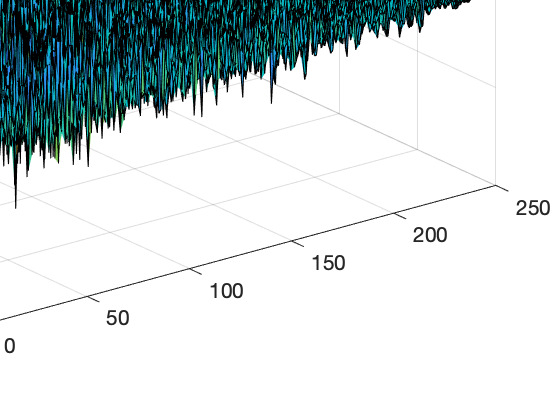

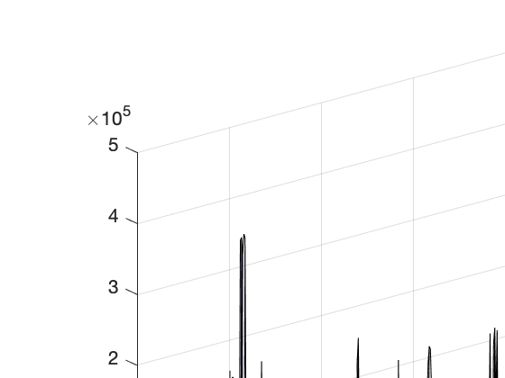

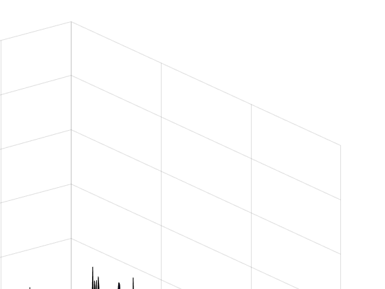

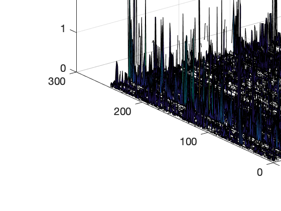

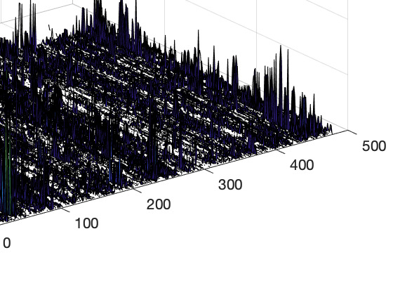

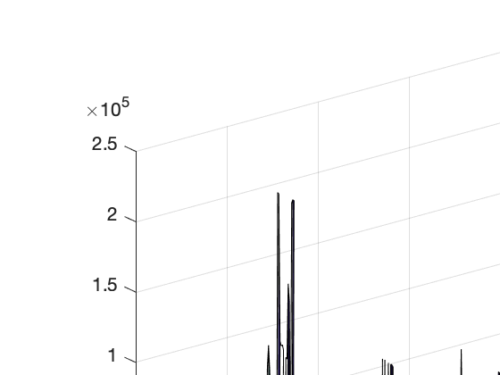

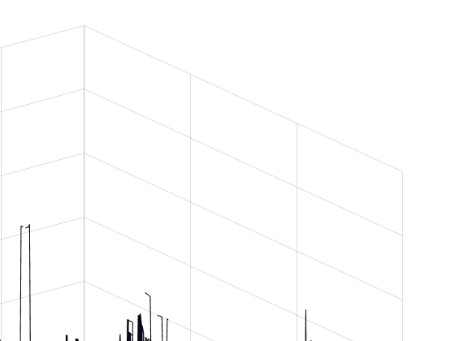

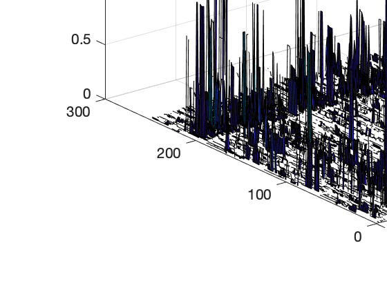

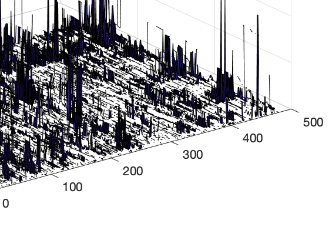

![Figure 16: Figure 6: The eigenportfolio computed from the data (red) compared with the theoretical eigenportfolio that is close to βi/h2 i (blue). The horizontal axes are in log scale. Each βi = cov(dEi(·)/Ei(·), dQ(·)/Q(·))/h2 q, where for these plots the factor Q(t) has been computed according to the formula in (14) using the weighting function ω(OI) = OI. To generate this plot, we first sort the eigenportfolio in descending order, and then insert the sorting index into the vector h−2β/ P i(h−2β)i. The lining up of the two vectors using a single sorting index is evidence that the factor computed using the weighting function ω(OI) = OI is close to the data’s principal component.](assets/fig_016.png)

![Figure 17: Figure 8 shows improved results if this maturity-wise approach is used with the normaliza- tions in (23) along with the weighting function ω(OI) = log(1 + OI) × Vuntls. The linear dependence between the tensor eigenportfolio and the Q seen in Figure 8a is a considerable improvement from the linear dependence shown in Figure 7a that was obtained using flat matrices. The ex-post regression diagnostics of the tensor approach show an improvement over the flat matrix approach, as Table 4 lists regression outputs that have higher R2 (i.e., less projection error) than their counterparts in Table 3. Finally, we show the in-sample plots of cumulative returns for the tensor portfolios next to the cumulative returns of the portfolios from the flat matrices; all portfolios are constructed with weighting function ω(OI) = log(1 + OI) × Vuntls. Figures 9 and 10 show these results, from which it is clear that the tensor factor constructed in this subsection allows for eigenportfolio tracking that is much closer to the factor. This is evidence that the family of OI-based tensor factors subsumes a ’good’ factor, in the sense that it can track the eigenportfolio returns. We recall that the reason why we are concerned with the eigenportfolio when constructing factors, is because we know from theoretical analysis of the spike model that the 1st eigenportfolio will have weights close to the vector h−2β, where β are loadings on a dominant factor. Hence, to determine if we have a dominant factor, we should make comparisons with the eigenportfolio and in the tensor IVS data context the results come out better, most likely because the data is heterogeneous and it is therefore beneficial to respect the tensor structure, which MLSVD does.](assets/fig_017.png)

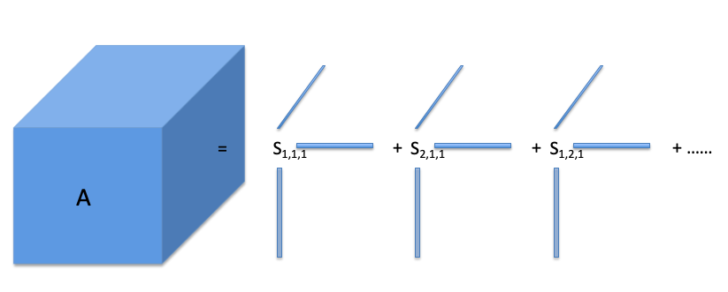

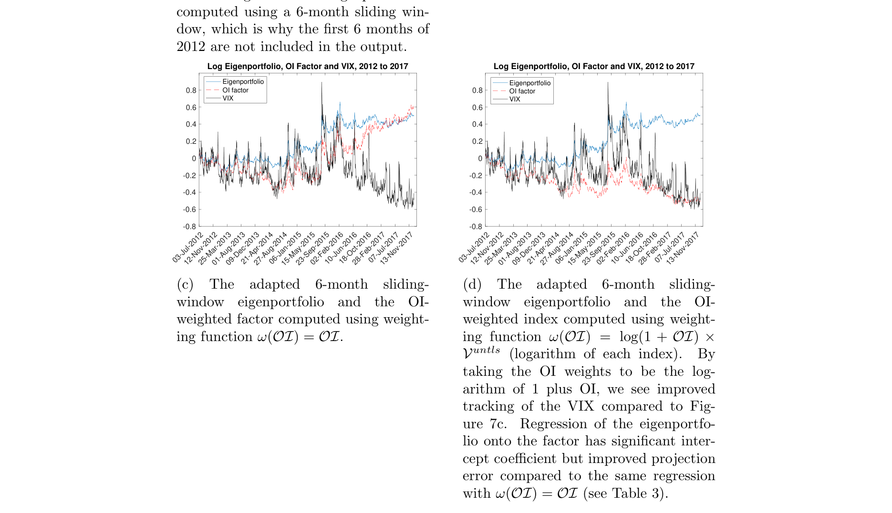

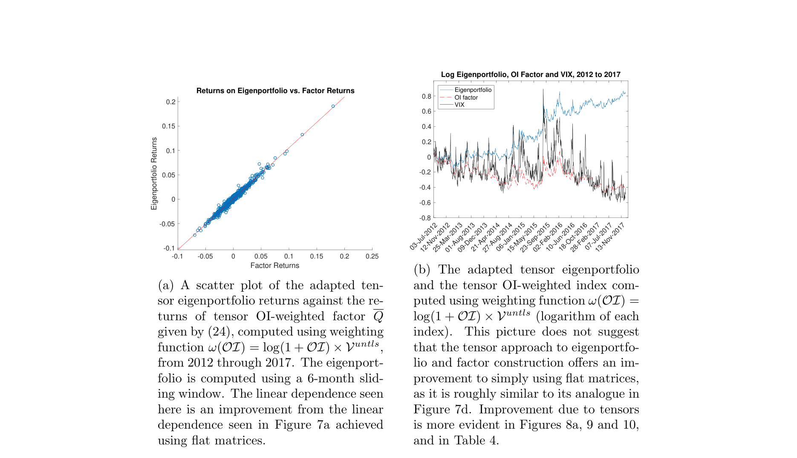

## Extraction Notes

- pdfplumber unusable table on page 29 index 1
- pdfplumber unusable table on page 33 index 1
- pdfplumber unusable table on page 33 index 2
- pdfplumber unusable table on page 34 index 5
- pdfplumber unusable table on page 35 index 1
- pdfplumber unusable table on page 35 index 2
- pdfplumber unusable table on page 37 index 1
- discarded 18 low-quality embedded figure(s)
