# Arbitrage-Free Neural-SDE Market Models

## Metadata

- **Source File:** `Arbitrage-Free Neural-SDE Market Models.pdf`
- **Authors:** Unknown
- **Year:** 2023
- **DOI:** 10.1080/1350486X.2023.2257217

## Abstract

ARTICLE HISTORY Received 30 June 2023 Modelling joint dynamics of liquid vanilla options is crucial for Accepted 28 August 2023 arbitrage-free pricing of illiquid derivatives and managing risks of option trade books. This paper develops a nonparametric model KEYWORDS for the European options book respecting underlying financial conMarket models; no-arbitrage; straints and while being practically implementable. We derive a state European options; neural space for prices which are free from static (or model-independent) networks; neural SDE; arbitrage and study the inference problem where a model is learnt constrained diffusions from discrete time series data of stock and option prices. We use neural networks as function approximators for the drift and diffusion of the modelled SDE system, and impose constraints on the neural nets such that no-arbitrage conditions are preserved. In particular, we give methods to calibrate neural SDE models which are guaranteed to satisfy a set of linear inequalities. We validate our approach with numerical experiments using data generated from a Heston stochastic local volatility model.

## Main Text

### Applied Mathematical Finance
ISSN: 1350-486X (Print) 1466-4313 (Online) Journal homepage: www.tandfonline.com/journals/ramf20
## Arbitrage-Free Neural-SDE Market Models
Samuel N. Cohen, Christoph Reisinger & Sheng Wang
To cite this article: Samuel N. Cohen, Christoph Reisinger & Sheng Wang (2023) ArbitrageFree Neural-SDE Market Models, Applied Mathematical Finance, 30:1, 1-46, DOI:
10.1080/1350486X.2023.2257217
To link to this article: https://doi.org/10.1080/1350486X.2023.2257217
© 2023 The Author(s). Published by Informa
UK Limited, trading as Taylor & Francis
Group.
Published online: 28 Sep 2023.
Submit your article to this journal
Article views: 3100
View related articles
View Crossmark data
Citing articles: 13 View citing articles
Full Terms & Conditions of access and use can be found at
https://www.tandfonline.com/action/journalInformation?journalCode=ramf20

2023, VOL. 30, NO. 1, 1–46
https://doi.org/10.1080/1350486X.2023.2257217
Arbitrage-Free Neural-SDE Market Models
Samuel N. Cohen, Christoph Reisinger and Sheng Wang
Mathematical Institute, University of Oxford, Oxford, UK
ABSTRACT
ARTICLE HISTORY
Received 30 June 2023
Modelling joint dynamics of liquid vanilla options is crucial for
Accepted 28 August 2023
arbitrage-free pricing of illiquid derivatives and managing risks of
option trade books. This paper develops a nonparametric model
KEYWORDS
for the European options book respecting underlying financial conMarket models; no-arbitrage;
straints and while being practically implementable. We derive a state
European options; neural
space for prices which are free from static (or model-independent)
networks; neural SDE;
arbitrage and study the inference problem where a model is learnt
constrained diffusions
from discrete time series data of stock and option prices. We use
neural networks as function approximators for the drift and diffusion
of the modelled SDE system, and impose constraints on the neural
nets such that no-arbitrage conditions are preserved. In particular,
we give methods to calibrate neural SDE models which are guaranteed to satisfy a set of linear inequalities. We validate our approach
with numerical experiments using data generated from a Heston
stochastic local volatility model.
1. Introduction
Consider a financial market where the following assets are liquidly traded: a stock1 S and
a collection of European call options C(T, K) on S with various expiries T ∈T and strikes
K ∈K. Pricing and risk management generally require a statistical model for these assets’
prices, which are known to be related to each other in complex ways. For example, the
volatility of the stock price through time is typically related to the value of call options, in
a monotone but nonlinear fashion. These stylized relationships suggest that there is significant statistical information captured in the interrelated prices of the stock and options,
however modelling these jointly is challenging. Furthermore, there are various constraints
on prices which must hold in the absence of arbitrage, and these should be reflected in any
statistical model.
We aim to construct a class of models for the stock and options that should
(i) permit no arbitrage;
(ii) allow exact cross-sectional calibration; and
(iii) reflect stylized facts observed from market price dynamics.
samuel.cohen@maths.ox.ac.uk
Mathematical Institute, University of Oxford,
CONTACT Samuel N. Cohen
Oxford, OX2 6GG, UK
© 2023 The Author(s). Published by Informa UK Limited, trading as Taylor & Francis Group.
ThisisanOpenAccessarticledistributedunderthetermsoftheCreativeCommonsAttributionLicense(http://creativecommons.org/licenses/
by/4.0/), whichpermitsunrestricteduse, distribution, andreproductioninanymedium, providedtheoriginalworkisproperlycited. Theterms
on which this article has been published allow the posting of the Accepted Manuscript in a repository by the author(s) or with their consent.

2
Importantly, it should be practically convenient to estimate these models, given that
observations are discrete time series of prices for a large but finite collection of options. We
aim to exploit the recent successes in the use of neural networks as function approximators
in order to give a flexible class of models. However, the no-arbitrage constraints on option
prices imply that we need to fit neural-nets where the resulting behaviour (when used in an
SDE) will satisfy a family of linear (in)equalities. In this paper we will develop methods to
solve this challenge, and demonstrate their effectiveness when building a financial model.
The goal of this paper is to provide the core details of the approach and its performance
in an idealized (simulated) setting, where it can be compared with a known ground-truth.
The application of this methodology to risk estimation can be found in Cohen, Reisinger,
and Wang (2022a), and to hedging in Cohen, Reisinger, and Wang (2022b).
1.1. Martingale and Market Model Approaches
Many models in the literature are derived using the martingale approach. In this approach,
one specifies the dynamics of the underlying S (usually in the form of an SDE) under some
pricing measure Q, and uses no-arbitrage arguments and Itô calculus to derive option
prices, written as discounted conditional expectation of options’ payoffs under Q. For
example, Ct(T, K) = Dt(T) · EQ[(ST −K)+|Ft], where Dt(T) is the time t price of the
zero-coupon bond expiring at time T. Prestigious examples of martingale models are the
Black–Scholes (BS) (Black and Scholes 1973) model, the local volatility (LV) model of
Dupire (1994) and Derman and Kani (1994), stochastic volatility (SV) models such as Heston (1993) and Hagan et al. (2002, 2014), and stochastic local volatility (SLV) models (see,
for example, Jex, Henderson, and Wang (1999)). A data-driven approach to learn an overparametrized martingale model with SDE coefficients expressed as neural-nets is taken by
Gierjatowicz et al. (2020).
The martingale approach guarantees no-arbitrage by the First Fundamental Theorem
of Asset Pricing (FFTAP) (Harrison and Kreps 1979). Therefore, the martingale approach
eliminates arbitrage by construction, and the LV model and SV models can calibrate exactly
for static price surfaces. However, some challenges remain:
(i) martingale models do not give explicit expressions for option prices, often requiring
heavy, model-specific numerical methodology to calibrate these models to market
data;
(ii) the values of calibrated model parameters are observed to change over time, even
though they are assumed to be constant by the posited model;
(iii) martingale models are naturally posed under the (risk-neutral) measure Q, and additional steps are often needed to use them to model dynamics under the historical
measure P, as is needed for risk management.
An alternative family of models admitting exact calibration are market models, where
one specifies the joint dynamics of all liquid tradables simultaneously, and imposes additional conditions to exclude arbitrage, as option prices are no longer automatically discounted conditional expectations. This idea originates from the framework of Heath, Jarrow, and Morton (1992) for interest rate modelling, which establishes no-arbitrage through
drift restrictions. The case for options is more complicated, as the contract specifications at

3
maturity enforce convoluted relationships between option prices and the underlying price.
In other words, the state space of these processes is heavily constrained.
There is a useful distinction to be drawn, in this context, between ‘model-free’ and
‘model-based’ arbitrage. If a market model produces prices which display model-free arbitrages, then these are easily exploited, as they do not depend on the dynamic model used.
A counterparty simply needs to observe prices inconsistent with a set of restrictions (in
practice given by a finite set of linear inequalities), and can quickly identify arbitrage opportunities. On the other hand, if a market model only has the risk of producing model-based
arbitrage, then this may be less of a concern; to exploit this opportunity, a counterparty
would typically need to know the model being used (including all conventions around
interpolation of prices). Indeed, if no model-free arbitrages are present, then it is known
that there exists a dynamic model which is arbitrage free and replicates these prices (see,
for example, Carr and Madan (2005) and Davis and Hobson (2007)).
Conveniently, the model-free arbitrage restrictions correspond to static arbitrage constraints, that is, to restrictions on the state-space of the price process. In previous work
(Cohen, Reisinger, and Wang 2020) (drawing on (Cousot 2007)), we have reduced these
constraints, for a collection of arbitrary strikes and maturities, to an efficient set of linear
inequalities.
In this paper, we will focus our attention, therefore, on estimating (under the historical
measure P) a market model where the model-free arbitrage constraints will be satisfied.
We will see that this restriction of the state-space of our model yields significant benefits
to the task of statistical calibration.
1.2. Factor-Based Arbitrage-Free Market Models
To allow practical calibration, we will focus on constructing market models for finitely many
options that may have an arbitrarily-shaped lattice.
Typically, the range of strikes actively quoted on the market is much smaller for shortexpiry options than for long-expiry options, as seen in Figure 1 .2 This causes problems for
methods based on a rectangular lattice. One might augment market data using arbitragefree interpolation techniques (see e.g., Fengler 2009; Kahale 2004), but these are prone to
extrapolate unrealistic prices for deep ITM and OTM options. Our models allow an arbitrarily shaped lattice of options, which can be specified according to the stylized liquidity
profile of the options market.
Imposing no-arbitrage conditions is a key component in our models. To achieve this, our
models first ensure that for each fixed time, prices take values in a constrained state space
such that options with different strikes (moneynesses) and expiries are statically arbitragefree. Unlike the neat static arbitrage constraints for options on a rectangular lattice, e.g.,
see Carr and Madan (2005), the flexibility of modelling options on an arbitrarily-shaped
lattice induces challenges for deriving static arbitrage constraints. Based on the work of
Davis and Hobson (2007) and Cousot (2007), our previous work (Cohen, Reisinger, and
Wang 2020) produces an efficient construction of static arbitrage constraints for large-scale
practical problems. Second, we aim both to guarantee the statistical accuracy of our model
(by training with historical data) and to minimize the opportunities for dynamic arbitrage
– the discounted price process of each traded asset, i.e., stock and all options, should be
a martingale under some joint risk-neutral measure (which is not generally the measure

4
Figure 1. The quoted strikes/log-moneynesses/Black–Scholes deltas (horizontal axis) for all expiries
(vertical axis) of CME weekly- and monthly-listed EURUSD European call options as of 31st May 2018.
Each dot represents a market quote.
from which our training data are sampled). This involves compatibility restrictions on the
model coefficients, analogous to the Heath, Jarrow, and Morton (1992) drift restrictions.
The static arbitrage constraints are linear with respective to option prices, and enforce
simple geometric shape constraints on the surface (T, K) →C(T, K), including positivity,
monotonicity and convexity. This effectively restricts the evolution of the option price surface to a low-dimensional submanifold; see for example (Cont and Fonseca 2002; Cont,
Fonseca, and Durrleman 2002) for the use of Karhunen–Loève decomposition on implied
volatility (IV) surfaces to extract low-dimensional factor models. Rather than decomposing IVs, we decode factors directly from option prices, preserving the linearity of the static
arbitrage constraints in the factor space. This results in a convex polytope state space for
the factors.
We then assume that the evolution of the collection of option prices is driven by a small
number of latent factors, for which we specify diffusion-like dynamics. To summarize, from
the no-arbitrage conditions, we derive a class of low-dimensional market models with drift
restrictions and a convex polytope state space. We shall see that this low-dimensional representation has various advantages, in particular it is possible to calibrate non-parametric
models for the factor dynamics, the estimated models are noticeably more stable, and the
number of constraints that need to be verified is significantly reduced.
1.2.1. Comparison with Codebook Models
Most work on arbitrage-free market models for option prices has sought a convenient
parametrization, or codebook in the language of Carmona (2007), such that the codebook
processes have a simple state space and yet capture all the static arbitrage constraints. Specifying the dynamics of the codebook then leads to a tractable arbitrage-free dynamic model
for options.
A proper choice of codebook processes improves the descriptive capability of the model
in terms of the observed strikes and expiries (K and T ). Schonbucher (1999) proposes
a market model in terms of the BS implied volatility σimp for a single option, i.e., the
case K = {K} and T = {T}. The model is free from static arbitrage if S>0 and σimp ≥
0. However, as discussed by Schweizer and Wissel (2008a), market models of implied
volatilities cannot be easily extended to the general case with more than one option,

5
because the absence of static arbitrage between different options enforces awkward constraints between the corresponding implied volatilities (see, for example, Lemma 2.2 in
Gatheral and Jacquier (2014)). For the term structure case, K = {K} and T = [0, +∞),
Schonbucher (1999) and Schweizer and Wissel (2008b) use the forward implied volatilities,
defined as σ 2
fw(T) := ∂((T −t)σ 2
imp(T))/∂T, as the codebook. Their model is statically
arbitrage-free if S>0 and σ 2
fw(T) ≥0 for all T ∈T . Jacod and Protter (2010) directly use
call option prices as the codebook and work in a more general setting of jump processes.
Static arbitrage is ruled out by imposing a non-decreasing term structure on the call option
prices. For the multi-strike case K = [0, +∞) and T = {T}, Schweizer and Wissel (2008a)
introduce a new parametrization of option prices called local implied volatilities X(K) and
price level Y , see Definition 4.1 and 4.4 of Schweizer and Wissel (2008a). Their model does
not admit static arbitrage if X(K) > 0 for all K ∈K.
The surface case K = [0, +∞) and T = [0, +∞) has been considered by Derman and
Kani (1998), Carmona and Nadtochiy (2009, 2012) and Kallsen and Krühner (2013). Carmona and Nadtochiy use Dupire’s local volatilities σloc(T, K) as the codebook processes
and rigorously analyse the dynamic arbitrage conditions derived by Derman and Kani.
Later, these authors independently built market models relying on time-inhomogeneous
Lévy processes, which allow jumps and may hence be particularly suitable for short-term
options. Both parametrizations make the static arbitrage constraints naturally hold.
The non-trivial construction of codebook processes, i.e., a PDE for local volatility
(Carmona and Nadtochiy 2009) and Fourier transforms for Lévy process (Carmona and
Nadtochiy 2012; Kallsen and Krühner 2013), add complexities for model calibration.
By considering a continuous spectrum of strikes and expiries, one is usually forced to
consider an infinite-dimensional problem, where it is difficult to prove the existence of
models and computationally infeasible to implement them exactly. The only work, to our
knowledge, that considers market models for a finite family of strikes and expiries is Wissel (2008). Wissel combines ideas from the LV model of Dupire with the market model of
Schweizer and Wissel (2008a) and uses local implied volatilities and price level as a codebook for parametrizing statically arbitrage-free option prices on a rectangular lattice .3 The
rectangular lattice setup is necessary for the codebook construction but is a rather restrictive assumption in practice. In addition, there is not a straightforward model calibration
method for general cases.
1.3. Model Inference and Constrained Neural SDE
For our models, inference consists of two independent steps: factor decoding and SDE
model calibration.
The factor decoding step is to extract a smaller number of market factors from prices
of finitely many options. These factors are built to reflect the joint goals of eliminating
static and dynamic arbitrage in reconstructed prices and guaranteeing statistical accuracy.
Expressing option prices as affine functions of market factors, we use a modified form of
principal component analysis (PCA) to decompose option prices into a small number of
driving factors.
In the SDE model calibration step, we represent the drift and diffusion functions by
neural networks, referred to as neural SDE by Cuchiero, Khosrawi, and Teichmann (2020)

6
and Gierjatowicz et al. (2020). By leveraging deep learning algorithms, we train the neural networks by maximizing the likelihood of observing the factor paths, subject to the
derived arbitrage constraints. As argued by Gierjatowicz et al. in their framework of
neural martingale models, this allows for calibration and model selection to be done
simultaneously.
No-arbitrage conditions are embedded as part of model inference. Specifically, static
arbitrage constraints are characterized by a convex polytope state space for the latent factors; we identify sufficient conditions on the drift and diffusion to restrict the factors to
their arbitrage-free domain, using the classic results of Friedman and Pinsky (1973). Consequently, the neural network that is used to parametrize the drift and diffusion functions
needs to be constrained .4 We achieve this by developing appropriate transformations for
the output of the neural network.
Our models are friendly for implementation for the following reasons:
(i) They are flexible enough to model options on an arbitrarily-shaped lattice of strikes
and expiries. One can specify the lattice according to the stylized liquidity profile of
the target option market.
(ii) The model inference procedure includes both cross-sectional calibration (i.e., the factor decoding step) and time-series estimation (i.e., the neural SDE calibration step).
Neural SDEs enable a data-driven model selection approach, and mitigate model risk
arising from restrictive parametric forms.
(iii) Further economic considerations (for example bounds on statistical arbitrage) can be
incorporated into the training of these models through penalization.
1.4. Key Contributions
We summarize the key contributions of this paper as follows.
(i) We construct a family of factor-based market models (Section 2), where the factor
representation in principle allows exact static calibration, and the joint dynamics of
options are straightforwardly available once the dynamics of the factors are specified.
The models are given by a finite system of SDEs for the factors and the stock price.
(ii) We derive an HJM-type drift condition on the factor SDEs which guarantees freedom
from dynamic arbitrage, and the state space of the market factor processes where the
models are free from static arbitrage.
(iii) To calibrate our models, we need to tackle the problem of calibrating a neural SDE
with a convex polytope state space. We propose a novel hard constraint approach
that modifies the network to respect sufficient conditions on the drift and diffusion to
restrain the process within the polytope. Readers who are interested in this calibration
problem, rather than market models, can directly jump to Section 3.
2. Arbitrage-Free Market Models
We assume a frictionless market in continuous-time, with a distant fixed finite horizon T∗.
We allow non-zero interest and dividends ,5 and assume a deterministic interest rate rt and
 T
dividend yield qt at time t. We use Dt(T) = exp(−
t rsds) to denote the market discount

7
 T
factor for time T, and t(T) = exp(
t qsds) to account for reinvestment of dividends.
There is a model-independent, arbitrage-free forward price, Ft(T) = St/(t(T)Dt(T)), for
delivery of the asset at T, where St is the price of the underlying asset. The primary traded
securities in the market are zero coupon bonds, the stock, and a collection of forwards and
European call options written on the stock. We assume no derivatives expire after T∗.
2.1. Liquid Options
While it is theoretically reasonable to search for a model to produce arbitrage-free option
prices for every possible T and K at any time t, doing so can be both practically unnecessary
and restrictive. It is of limited use to ensure absence of arbitrage with regards to deep in or
out-of-the-money options, given these are not liquidly traded, and modelling these would
impose significantly more constraints when calibrating to data. Our models focus on the
joint dynamics of liquid options, rather than options of any strikes and expiries. Liquid
options are usually those that are neither too far from the money nor too close to expiry
(typically a few days). In addition, the range of liquid strikes typically broadens for longer
expiries, as seen in Figure 1.
Over time, the range of liquid options in (T, K)-coordinates tends to change stochastically. For example, a liquid at-the-money option as of today will become deep out-of-themoney if the underlying price plunges quickly. It is empirically advantageous, therefore,
to cast the liquid range into relative coordinates (τ, m), where τ = T −t is time-to-expiry
and m denotes moneyness. There is usually a stable range of time-to-expiries and moneynesses for which the options are actively quoted, and therefore price data are most readily
available. A convenient parametrization is given by the forward log-moneyness mt, which is


K
mt = M(K; Ft(T)) := ln
.
(1)
Ft(T)
The function M(·) is referred to as the moneyness function. In Figure 2, we highlight
the trajectories of (τt, mt) for three differently struck options (with the same expiry). The
option that is very far from the money, i.e., K =1.3 (green line), moved out of the liquid
range (which could be approximated by the grey dotted area) and was never traded after
its time-to-expiry became shorter than 0.4 years.
We assume the range of liquid options in the (τ, m)-coordinates is fixed over time, and
develop arbitrage-free models on the liquid range. We denote by τ and τ the minimal and
maximal liquid time-to-expiries. For fixed τ, we denote by m(τ) and m(τ) the minimal and
maximal liquid moneynesses. We then define the constant set Rliq = {(τ, m) ∈R2 : τ ∈
[τ, τ], m ∈[m(τ), m(τ)]} as the range of moneynesses and time-to-expiries where options
are liquid. A typical market’s range exhibits that 0 < τ < τ < T∗; m(τ) < 0 < m(τ) for
all τ ∈[τ, τ]; m(τ1) ≥m(τ2) and m(τ1) ≤m(τ2) for any τ ≤τ1 < τ2 ≤τ. An example
can be seen in Figure 3.
Our models construct option price surfaces on Rliq through smooth interpolation of a
finite collection of option prices, with parameters given by the set Lliq = {(τi, mi
j) ∈Rliq :
m(τi) = mi
1 < · · · < mi
ni = m(τi), τ = τ1 < · · · < τp = τ, 1 ≤j ≤ni, 1 ≤i ≤p}. We call
Lliq an option lattice. There are two reasons for us to have this model design. First, given
the static arbitrage requirements concern monotonicity and convexity of the price surface,

8
Figure 2. An example of the trajectory of (τt, mt) for fixed (T, K)’s. Grey dots indicate the traded strikes
forCMEEURUSDoptioncontractswithexpirydate6thMarch2020,fromtheirfirstlistingdayuntilexpiry.
We highlight the trajectories for three differently struck contracts.
Figure 3. An example of liquid range and lattice.
our models are free of static arbitrage on Rliq if options on Lliq are statically arbitrage-free
and these prices are extended to Rliq using a shape-preserving interpolation method (in
particular, a method which preserves monotonicity in time to maturity and monotonicity
and convexity in moneyness). Second, options with very close strike and expiry will have
strongly dependent price processes, and so contain little new statistical information. We
use options on Lliq to represent local dynamics of different sub-areas of the surface on
range Rliq; this is analogous to a common practice for quoting OTC data. For example, in
the OTC FX market, traders quote options on the lattice [1-day, 1-week, 1-month,...] ×
[10-delta, 15-delta,...] and smoothly interpolate them for pricing a specific contract.
2.2. Factor Representation of Call Option Prices
Even after reducing our model to the finite set Lliq of liquid options, one usually finds that
these prices contain significant redundancies. For this reason, it is efficient to express them

9
through a low-dimensional factor representation, for which a reliable model can be built.
These factors will be built from data, but are simple enough to be intuitively understood
and plotted, as they have a linear relationship with option prices.
We will build a model based on the randomness provided by d+1 standard independent Brownian motions W0, W1, . . . , Wd under the objective measure P. Writing W =
[W1 · · · Wd]⊤and W = [W0 W1 · · · Wd]⊤, we describe the information available at
time t by the σ-algebra Ft, which is the completion of ∩s>tF 0
s with P-null sets, where
F 0
t := ({Ws : 0 ≤s ≤t}) ∨F0 (here we use (·) to denote the sigma-algebra generator). Taking  to be the space of paths of W, we have a filtered probability space
(, {Ft}0≤t≤T∗, P).
Suppose that the market is described by the underlying price S ∈R and some latent
market factor ξ ∈Rd. We model the joint dynamics of the underlying price and the market
factor by a (d + 1)-dimensional diffusion process solving the following time-homogeneous
SDE:



α(˜ξt) −qt
Stdt + γ (˜ξt)StdW0,t,
S0 = s0 ∈R;
dSt =
(2)
dξt = μ(˜ξt)dt + σ(˜ξt)dWt,
ξ0 = ζ0 ∈Rd,
where ˜ξt = (St, ξt). We use αt, γt, μt and σt to denote α(˜ξt), γ (˜ξt), μ(˜ξt) and σ(˜ξt), respectively. Denote by Lp
loc(Rd) the space of all Rd-valued, progressively measurable, and locally
p-integrable (in t, P-a.s.) processes on [0, T∗], and assume that αS ∈L1
loc(R), μ ∈L1
loc(Rd),
γ S ∈L2
loc(R) and σ ∈L2
loc(Rd).
We now associate the latent market factor with call option prices. Denote by Ct(T, K) the
market price at time t of a European call option with expiry T and strike K. We call the map
(T, K) →Ct(T, K) a call price surface. After casting the surface into relative coordinates
(τ, m), the surface is parametrized over the range {(τ, m) : τ ∈(0, T∗−t], m ∈R}. For
some fixed T and K, we define the following transformations of call option prices for all
t ∈[0, T∗):
Ct(T, K)
˜ct(T −t, M(K; Ft(T))) = ˆct(T, K),
ˆct(T, K) =
Dt(T)Ft(T),
(3)
where ˆct and ˜ct are the normalized prices but with different arguments. The parametric
surface we shall model is the normalized call price surface (τ, m) →˜ct(τ, m) rather than
the original call price surface (T, K) →Ct(T, K), though C(T, K) can be implied from a
family of ˜c(τ, m). A key advantage of ˜c(τ, m) over C(T, K) is that it is more reasonable to
suppose t →˜ct(τ, m) to be a time-homogeneous process, whereas Ct(T, K) →(ST −K)+
as t ↑T, making a statistical model more difficult.
For some fixed τ and m, we assume that the normalized option price ˜ct(τ, m) is
determined by the latent factor ξ through a time-independent linear transformation
d

˜ct(τ, m) = g(t, τ, m, ξt) := G0(τ, m) +
Gi(τ, m)ξit,
(4)
i=1
where Gi ∈C1,2(Rliq) is called a price basis function, for i = 0, . . . , d. The smoothness
requirements on Gi(·) are necessary for deriving the dynamics of C(T, K), for given T and

10
K, from the dynamics of a family of ˜c(τ, m). Though this representation does not show
explicit dependence between the normalized call price ˜c(τ, m) and the underlying price S,
it does relate the two variables through the moneyness m.
Combining (2), (3) and (4), we have a model for the joint dynamics of S and C(T, K) for
all relevant strikes and expiries. We observe that the drift and diffusion coefficients of ξ are
functions of S. In addition, given the potential nonlinearity in (2), we argue that a linear
transformation in (4) is not a restrictive assumption, as a smooth nonlinear relation with
respect to one factor can be approximated by a linear combination of polynomials of that
factor.
Remark 2.1: The use of a Markovian model for ξ may seem a little restrictive. In theory,
any observed data could be included in the model for ξ. In practice, we shall build factors ξ to minimize reconstruction errors in (4). As this involves all liquid option prices,
it determines the law of S under Q in the future (through the Breeden–Litzenberger formula (Breeden and Litzenberger 1978)); in other words, the joint process given by S and
all call option prices is guaranteed to be Markovian under the pricing measure. This is
closely related to the endogenous completeness of market models with options, see Davis
and Obłój (2008), Schwarz (2017) and Wissel (2008).
2.2.1. Convergence to Terminal Payoff
To ensure prices of call options converge to correct payoffs at expiry, independently of the
behaviour of ξ, by examining (4) it is clearly sufficient (and generally necessary) that
G0(0, m) = (1 −em)+, and Gi(0, m) = 0,
∀i = 1, . . . , d.
(5)
Under this assumption, ˜ct(0, m) = (1 −em)+ and, for any T and K,



K
t↑T Dt(T)Ft(T)˜ct
t↑T Ct(T, K) = lim
T −t, ln
lim
Ft(T)

 K

= (ST −K)+ .
= ST˜cT
0, ln
ST
2.2.2. Connections with the Black–Scholes Model
We can also see that the Black–Scholes model is within the class of factor models we consider (in particular, it is a trivial model where no additional factors ξ are needed). The
Black–Scholes model assumes deterministic drift and constant volatility for the underlying
2γ √τ,
asset price, i.e., γt ≡γ . In fact, with d1,2(τ, m) = −m
γ √τ ± 1
˜ct(τ, m) = G(τ, m) := (d1(τ, m)) −em (d2(τ, m)) .
(6)
More generally, we can see that ˜c(τ, m) has a deterministic bijective relation with the
Black–Scholes implied volatility, for arbitrary but fixed τ and m. With implied volatility

11
σ imp
(τ, m), the transformation (3) indicates that
t
˜ct(τ, m) = Ct(t + τ, emFt(t + τ))
Dt(t + τ)Ft(t + τ)
√τ
√τ
+ 1
−1
m
m
2σ imp
2σ imp
−em
−
=
−
,
(7)
√τ
√τ
t
t
σ imp
σ imp
t
t
where (·) is the cumulative density of the standard normal distribution. In addition,
√τ
; τ, m) = √τφ
d˜ct
+ 1
m
(σ imp
2σ imp
−
> 0,
√τ
t
t
dσ imp
σ imp
t
t
where φ(·) is the density of the standard normal distribution. Hence, there is a timeindependent and deterministic bijective relation between ˜ct and σ imp
for arbitrary but
t
fixed τ and m. Consequently, by modelling the normalized call prices, we are essentially
modelling the implied volatility surface as a function of τ and m. This aligns with the conventional ‘sticky delta’ rule (see Daglish, Hull, and Suo 2007), where the process for implied
volatility depends on T, K, F and t only through its dependence on τ and m.
2.3. Absence of Arbitrage
Arbitrage refers to a costless trading strategy that has zero risk and a positive probability
(under P) of profit. The First Fundamental Theorem of Asset Pricing (FFTAP) establishes
an equivalence relation between no-arbitrage and the existence of an equivalent martingale measure (EMM). After the landmark work of Harrison and Kreps (1979), there are
various versions of the FFTAP and extensions of the no-arbitrage concept (e.g., no free
lunch (Kreps 1981), no free lunch with vanishing risk (Delbaen and Schachermayer 1994),
no unbounded profit with bounded risk (Karatzas and Kardaras 2007)). In this article, we
work with a simplified version of FFTAP as follows. Given the model, there is no arbitrage
if and only if ∃Q ∼P, such that the discounted price processes for all tradable assets are
martingales. These tradable assets include the stock and all forwards and options written
on it.
If the model is arbitrage-free, then, for any fixed T and K, the discounted option price
D0(t)Ct(T, K) should be a Q-martingale. We derive an HJM-type drift restriction for this
no-arbitrage condition to hold in Appendix 1, by analysing the existence of a market price
of risk process ψt = [ψ1,t · · · ψd,t]⊤. Specifically, suppose we model N = |Lliq| options,
with prices given in (τ, m)-coordinates. Then we look for a solution ψt to
⎧
G⊤σtψt = G⊤μt −zt,
⎪⎪⎪⎪⎨
where
⎤
⎡
˜ct(τ1, m1)


⎥⎥⎦.
⎢⎢⎣
∂2
∂
−∂
(8)
∂τ −1
∂m + 1
...
2γ 2
2γ 2
⎪⎪⎪⎪⎩
zt =
t
t
∂m2
˜ct(τN, mN)
j=1 ∈RN for
Here, we define G as the d × N matrix with i-th row Gi, where Gi = (Gij)N
i = 0, . . . , d, and Gij = Gi(τj, mj). We call G⊤a price basis and each of its columns a price
basis vector.

12
If zt lives in the column space of the price basis G⊤, and given that σt is invertible,
then (8) always admits a solution for ψt, regardless of what the drift and diffusion functions
are. In other words, the HJM conditions are principally related to the choice of price basis
G, rather than to the specific choice of calibrated model (i.e., to μ, σ).
This encourages us to construct factors from principal components of zt, as will be
explored in detail in Algorithm 1. Unless zt ∈RN lives in an Rd submanifold, equality (8)
always yields an over-determined linear system when the number of options N is greater
than the number of latent market factors d, which is usually the case in practice. Given a
price basis G, we will then use (8) to encourage choices of μ and σ that do not suggest
unreasonable values for the market price of risk ψ, evaluated on our liquid lattice Lliq.
Remark 2.2: If we modelled all τ and m and enforced the drift restrictions at all times,
then this would be enough to guarantee no-arbitrage. However, our models will be built
on finitely many options on a fixed liquid lattice in the (τ, m)-coordinates, as specified by
Lliq. These options do not correspond to fixed contracts (i.e., fixed T and K) over time.
Therefore, the HJM-type drift restrictions cannot be implemented in practice, and further
consideration of no-arbitrage conditions is needed.
2.4. Constrained State Space for Static Arbitrage
To ensure that our model does not generate static/model-free arbitrage, we introduce static
arbitrage constraints on the underlying factors.
2.4.1. Static Arbitrage-Free Relations
We study the static arbitrage-free relations at time t =0 without loss of generality. For some
T and K, we define MT = ST/F0(T), k = K/F0(T), and ˘c(τ, k) = ˜c0(τ, ln k). We assume
that ˘c(T, k) ∈C1,2(R2
≥0).
Carr et al. (2003) and Carr and Madan (2005) establish the equivalence of no static
arbitrage and the existence of a Markov Martingale Measure (MMM) Q, under which
(MT −k)+ F0
˘c (T, k) = EQ 

.
(9)
For an arbitrary but fixed T, using (Breeden and Litzenberger 1978) analysis, the marginal
measure QT = Q(·|FT) exists if −1 ≤∂˘c/∂k ≤0 and ∂2˘c/∂k2 ≥0. Furthermore, if a
family of marginal measures {QT}T∈[0,T∗) on (R, B(R)) exist, which are non-decreasing
in convex order6 (NCDO), then there exists a Markov martingale measure with these
marginals, by Kellerer’s theorem (Kellerer 1972). The convex order can be characterized
in terms of call price functions:
⎧
⎨
QTi and QTj have equal means;


QT1 ≥cx QT2 ⇐⇒
(x −k)+ dQT1 ≥
(x −k)+ dQT2
⎩
∀x ∈R.
R
R
Hence, {QT}T∈[0,T∗) is NDCO if ∂˘c/∂T ≥0.

13
Therefore, if we define the set of surface functions s(x, y) : D →R ∩[0, 1], where D ⊆
R2
≥0 are compact sets, by


∂y ≤0, ∂2s
∂x ≥0, −1 ≤∂s
s(x, y) ∈C1,2(D) : 0 ≤s ≤1, ∂s
S(D) =
∂y2 ≥0
,
(10)
then no arbitrage can be constructed on the surface (T, k) →˘c(T, k) if ˘c ∈S(R2
≥0).
Our models aim to ensure absence of static arbitrage for the liquid range Rliq defined
in the (τ, m)-coordinates, or equivalently the liquid range ˘Rliq defined on the (τ, em)-
coordinate, where ˘Rliq = {(τ, k) : (τ, ln k) ∈Rliq}. Accordingly, the corresponding discrete lattice Lliq in (τ, em)-coordinates is denoted by ˘Lliq = {(τi, ki
j) : (τi, ln ki
j) ∈Lliq}. We
will construct models to ensure that ˘c ∈S( ˘Rliq). We achieve this in two steps:
(i) Ensure that no static arbitrage can be constructed from the finitely many liquid options
on ˘Lliq, i.e.,
∃s ∈S( ˘Rliq), s.t. ∀(τ, k) ∈˘Lliq,
s(τ, k) = ˘c(τ, k).
(11)
(ii) Given statically arbitrage-free prices on ˘Lliq, apply some shape-preserving smooth
interpolation method which ensures monotonicity (on τ and k axes) and convexity (on k axis) of the surface. The interpolating function then belongs to S( ˘Rliq).
For example, Fengler and Hin (2015) use bivariate tensor-product B-spines to estimate a statically arbitrage-free call price surface from observed prices of options on
an arbitrarily shaped lattice.
2.4.2. Static Arbitrage Constraints on the Liquid Lattice
For notational simplicity, we reindex our liquid lattice Lliq = {(τi, mi
j)}i,j to a single
sequence {(τj, mj)}N
j=1, and denote cj = ˘c(τj, kj) = ˜c(τj, mj = ln kj).
Cousot (2007) finds practically verifiable conditions for (11), which we have simplified
in Cohen, Reisinger, and Wang (2020). We can write these constraints in the form Ac ≥b,
where c = [c1 · · · cN]⊤∈RN is the vector of normalized call prices, A = (Aij) ∈RR×N
andb = (ˆbj) ∈RR are a known constant matrix and vector. Here R is the number of static
arbitrage constraints. The construction of A and b depends on the choice of Lliq, and is
given in Cohen, Reisinger, and Wang (2020). We assume for simplicity that Lliq is fixed
over time.
Using our factor representation (4) of option prices, we have ct = G0 + G⊤ξt, with G
as in (8) and G0 the vector with entries G0(τj, mj). Consequently, the market model allows
no static arbitrage among options on the liquid lattice Lliq if ξt satisfies
AG⊤ξt ≥b := b −AG⊤
0 , for all t ∈[0, T∗−τ].
(12)
The dynamics of the diffusion process ξ are characterized by its drift and diffusion coefficients, which are assumed to be functions of ˜ξ = (S, ξ). We will address how to enforce
this constraint on ξt when training a model in Section 3.1.

14
2.5. Model Inference
Given an observable normalized option price surface, we estimate the model following two
steps:
(i) we decode the factor representation ˜ct(τ, m) = G0(τ, m) + d
i=1 Gi(τ, m)ξit by calibrating the price basis functions {Gi}d
i=0;
(ii) we infer the drift and diffusion functions of the decoded factor process ξ.
While these models are written in a continuous-time setting, inference is made from
discretely observed data. Let us assume that we observe a discrete time series of normalized
call option prices ct = [˜ct(τ1, m1) · · · ˜ct(τN, mN)]⊤at times 0 = t0 < t1 < · · · < tL = T,
where {(τj, mj)}1≤j≤N = Lliq, assuming d ≪N ≪L.
2.5.1. Decoding the Factor Representation
Projecting the data from ˜c to ξ reduces dimensions by a linear transformation. The
matrix representation of this linear projection gives an estimate of the price basis vectors {Gi}i=0,...,d. Define matrices C = (Clj) ∈R(L+1)×N and  = (li) ∈R(L+1)×d, where
Clj = ˜ctl−1(τj, mj) and li = ξi,tl−1, respectively. We represent the observed data C, with
residuals ϒ ∈R(L+1)×N, by
C = 1L+1 ⊗G0 + G + ϒ,
(13)
where 1L+1 is an (L + 1)-vector of ones, and ⊗denotes the outer product of two vectors.
We call C −ϒ the reconstructed prices, and the Frobenius norm ||ϒ||F the reconstruction
error. For some fixed d <N, an ideal factor representation should achieve the following
three objectives:
(i) Statistical accuracy: The reconstruction error ||ϒ||F should be as small as possible.
Among linear dimension reduction techniques, PCA applied to the observed prices
C gives the optimal reconstruction error.
(ii) Minimal dynamic arbitrage: There should be as few violations of the HJM-type
drift restrictions (8) as possible. For this purpose, we estimate zt from our observed
prices C, then construct factors from principal components of zt, to minimize the
discrepancy between zt and the space spanned by the factors.
(iii) No static arbitrage: The reconstructed prices should violate the static arbitrage
constraints (12) as seldom as possible.
Suppose we construct dst, dda and dsa factors for the above-mentioned objectives,
respectively, where dst + dda + dsa = d. Algorithm 1 gives the details of the factor decoding process.
Remark 2.3: We discuss here some practical aspects of Algorithm 1:
(i) The order of fulfilling the three objectives could be altered. However, if the factor
construction for no static arbitrage was not placed in the last step, it is possible that
any factors defined afterwards could introduce more static arbitrage.

15
Algorithm 1: Decoding the factor representation
Input : Matrix of price data C ∈R(L+1)×N; number of factors d; number of statistical accuracy factors dst;
number of dynamic arbitrage factors dda; number of static arbitrage factors dsa; data for zt in (8),
denoted as Z ∈R(L+1)×N; constraint matrices A, b from (12).
Output: Factor data  ∈R(L+1)×d; price basis vectors Gi ∈RN for i = 0, . . . , d.
L+1
1
1 Let G0j =
l=1 Clj for j = 1, . . . , N ;
L+1
/* Construct factors to minimize dynamic arbitrage. */
2 Compute the residual data R0 = C −1L+1 ⊗G0;
3 Compute the principal component decomposition of Z and assign, ∀i = 1, . . . , dda and ∀l = 1, . . . , L + 1,
Gi = i-th principal component of Z, li = ⟨(R0)l, Gi⟩,
where (R0)l is the l-th row of R0;
/* Construct factors to maximize statistical accuracy. */
4 Compute the residual data Rdda = R0 − dda
k=1 k ⊗Gk, where k = [1k · · · L+1,k];
5 Compute the principal component decomposition of Rdda and assign, ∀i = dda + 1, . . . , dda + dst and
∀l = 1, . . . , L + 1,
Gi = (i −dda)-th principal component of Rdda, li = ⟨(Rdda)l, Gi⟩,
where (Rdda)l is the l-th row of Rdda;
/* Construct factors to minimize static arbitrage. */
6 foreach i = dda + dst, . . . , d −1 do
Compute the residual data Ri = R0 − i
k=1 k ⊗Gk, where k = [1k · · · L+1,k];
7
Compute the covariance of the residual data i = R⊤
i Ri ;
8
Eigen-decompose i = QiiQ−1
(where Qi is a unitary matrix) ;
9
i
For some w ∈Rd such that ∥w∥2 = 1, define
10
qi(w) = Qiw, si(w) = Riqi(w).
Then solve the following minimization problem:


L+1

 + λ ∥Ri −si(w) ⊗qi(w)∥2
w∗= argmin
 i−1
1
−
,
(14)
⟨Aqi(w),si(w)⟩≥b−A
k=1 lkGk
∥w∥2=1
l=1
1
∥Ri∥) so that the penalty term is strictly less than 1;
where we require λ < min(1,
Let Gi+1 = qi(w∗) and i+1 = si(w∗) ;
11
12 end
(ii) The objective function (14) calculates the number of arbitrage inequalities which are
violated in the reconstructed data, with an additional penalty term concerning the
reconstruction errors. The penalty term plays a role in ensuring uniqueness of the
preferred weights w in the case that multiple weights produce the same number of
arbitrage-free samples.
(iii) The decoding algorithm depends on the choice of the parameters dst, dda and dsa,
which should be determined through some preliminary analysis of the given data.
We show an example in the numerical experiments in Section 4.
(iv) For numerical convenience, it is useful to ensure that the factors constructed are
orthonormal (i.e., G is a unitary matrix). This can be done through a simple
Gram–Schmidt process once an initial set of factors has been constructed.
2.5.2. Estimating the Constrained Diffusion Process
Our goal is to estimate the functions α : Rd+1 →R, μ : Rd+1 →Rd, γ : Rd+1 →R, and
σ : Rd+1 →Rd×d of the diffusion process ˜ξ = (S, ξ), given observations of the solution

16
of the SDE (under the objective measure P)


α(˜ξt) −qt
Stdt + γ (˜ξt)StdW0,t,
dSt =
(15a)
dξt =μ(˜ξt)dt + σ(˜ξt)dWt.
(15b)
To ensure reconstructed prices do not generate static arbitrage, μ, σ in (15b) should be
chosen to guarantee that ξ takes values in the (deterministic) polytope given by (12).
The SDE system (15) can be divided into two subsystems and estimated independently,
as the constraints are only needed in (15b), and do not depend on S. In the next section,
we will discuss an estimation method for the model of ξ (15b), which is generic enough
for estimating the model of S (15a).
3. Neural SDE Constrained by a Polytope
Consider a stochastic process Y ∈Rd which is a solution of the SDE
dYt = μ(Yt)dt + σ(Yt)dWt,
(16)
where W is a standard d-dimensional Brownian motion under the measure P. In addition,
μ, σ satisfy the usual Lipschitz regularity conditions such that a unique strong solution Y
of the SDE exists. Given discrete observations of Y , we study the problem of estimating
the drift μ : Rd →Rd and the diffusion σ : Rd →Rd×d in the model (16), such that paths
of Y are guaranteed to lie within the deterministic convex polytope generated by a finite
matrix-vector pair (V, b), that is,
Yt ∈P := {x ∈Rd : Vx ≥b}
P-a.s.
for all t ≥0
Without loss of generality (by rescaling), we assume the rows of V are unit vectors.
3.1. Nonattainability of a Diffusion Process
Let vk denote the k-th row of V. For each k, the diffusion process Y should not enter the
k = Rd \
k := {x ∈Rd : v⊤
k x < bk} at any time t >0, P-a.s. Writing Pc := ∪kPc
domain Pc
P, we formulate the desired nonattainability of Pc from its exterior by the solution Y of
the SDE (16) as
∃t > 0 s.t. Yt ∈Pc Y0 ∈P
Y0 ∈P
1 −P
Yt ∈P
= P
for all t > 0
= 0.
(17)
Friedman and Pinsky (1973) give a set of sufficient conditions for (17) in terms of μ and σ.
It suffices that the normal components of the diffusion and the drift vanish on any boundaries ∂Pk := {x ∈Rd : v⊤
k x = b}, and that an additional ‘convexity’ relation between the
drift and diffusion coefficients on ∂Pk is imposed. Conveniently, this results in separate
conditions for each of our k constraints, which are easily analysed.
For each k, let ρk(y) := dist(y, Pc
k) be the distance function defined for y ̸∈Pc
k, and let
ν : Rd →Rd be the outward normal to ∂Pk (relative to Pc
k, that is, a vector towards the

17
interior of P). Then, restricting to the closure of P, we have νi = ∂ρk/∂yi on ∂Pk. Defining
a := σσ ⊤, to ensure that Pc
k is nonattainable we verify
d

on ∂Pk,
aijνiνj = 0
(18a)
i,j=1
d
d


∂ρk
μiνi + 1
on ∂Pk,
≥0
aij
(18b)
∂yi, yj
2
i=1
i,j=1
assuming that ρk has second-order derivatives in a neighbourhood of ∂Pk. This is formally
written as Theorem 3.1.
Theorem 3.1 (Friedman and Pinsky (1973)): Suppose μ and σ satisfy Lipschitz and linear
growth conditions, and let Yt be any solution to (16) with initial data Y0 ∈P. If (18) holds
for all k, then Pc is nonattainable by Yt, i.e., P(∃t > 0 s.t. Yt ∈Pc |Y0 ∈P) = 0.
In our case of interest, the distance function ρk(y) measures the (Euclidean) distance
between a point y ∈Rd and a hyperplane v⊤
k x = bk, that is, ρk(y) = v⊤
k y −bk. (Note
that ρk(y) is guaranteed to be non-negative for all y within the interior of P.) Therefore,
∂ρk(y)/∂y = vk and ∂2ρk(y)/∂yi∂yj = 0 on ∂Pk. Therefore, we are able to re-write the
conditions (18) as, for all k,
v⊤
if v⊤
k a(y)vk = 0
k y = bk,
(no diffusion over the boundary);
(19a)
v⊤
if v⊤
k μ(y) ≥0
k y = bk,
(inward-pointing drift at the boundary).
(19b)
By enforcing these simple linear (in)equality constraints on a = σσ ⊤and μ, we ensure
that our process cannot leave the desired region P.
3.2. The Likelihood Function Approximation
Denote by y0:T the observed discrete sample path of Yt at times 0 = t0 < t1 < · · · < tL =
T. The problem of estimating the model (16) is formulated as the constrained optimization
problem:
μ,σ p(y0:T; μ, σ), subject to (19a) and (19b), for all k.
max
(20)
Here, p(y0:T; μ, σ) is the likelihood (under measure P) of observing the time series y0:T
given μ and σ. The formulation (20) is an infinite-dimensional optimization problem,
where the optimization variables are real-valued Lipschitz functions that are subject to
boundary conditions.
We can compute the likelihood p(y0:T; μ, σ) using the marginal density of the finite
dimensional observations y0:T. However, the transition density is generally not available in
closed form. A simple approximation is to use the Euler–Maruyama scheme for the SDE of
Yt. Suppose we have a uniform time mesh and let t = ti −ti−1 = T/L for all 1 ≤i ≤L.

18
We have the single step approximation
Yti+1 −Yti ≈μ(Yti)t + σ(Yti)(Wti+1 −Wti),
where Wti+1 −Wti ∼N (0, Id) and 0 ≤i < L. For notional simplicity, let μ(i) = μ(yti),
σ(i) = σ(yti) and a(i) = σ(i)σ(i)⊤. The likelihood of observing yti+1 given yti is then
approximately

!
∥yti+1 −yti −μ(i)t∥2
1
a(i)
p(yti+1|yti; μ, σ) ∝
−
√|a(i)| exp
,
2t
where |a(i)| = det(a(i)), and for u, ν ∈Rd and a positive definite matrix a ∈Rd×d,
(u, ν)a := u⊤a−1ν,
∥u∥2
a := (u, u)a.
Due to the Markov property, we have
L−1
"
p(y0:T|y0; μ, σ) =
p(yti+1|yti; μ, σ)
i=0
 L−1



L−1
"

1
|a(i)|−1
∥yti+1 −yti∥2
∝
× exp
−
2
a(i)
2t
i=0
i=0

$
#
L−1

−1
∥μ(i)∥2
× exp
a(i)t −2
μ(i), yti+1 −yti
.
a(i)
2
i=0
Taking the log of the approximate likelihood p, we have
ln p(y0:T|yt00; μ, σ)
%
&
L−1

∝−1
ln |a(i)| + 1
t∥yti+1 −yti∥2
a(i) + ∥μ(i)∥2
a(i)t −2
μ(i), yti+1 −yti
.
a(i)
2
i=0
(21)
3.3. Deep Learning a Function Approximation
Given the approximated likelihood function (21), the optimization (20) can be viewed as
a supervised learning problem, where the input variable is yt and the output variable is the
increment yt+t −yt.
We will use a neural network to represent functions μ(·) and σ(·) in a non-parametric
way, limited only by properties such as continuity and boundedness. We design a neural network such that μ(·) and σ(·) always satisfy the constraints listed in (19). This
is achieved by viewing the target functions μ(·) and σ(·) as transformations of some
underlying functions ˆμ(·) and ˆσ(·) through some operators Gμ and Gσ, respectively:
μ = Gμ[ ˆμ],
σ = Gσ[ˆσ].
We construct the operators Gμ and Gσ such that (19) holds for any functions ˆμ(·) and ˆσ(·),
but impose essentially no further restrictions. We then proceed by modelling the functions

19
Figure 4. Constrained neural network.
ˆμ(·) and ˆσ(·) using a standard neural network. In Figure 4, we show an illustration of the
proposed constrained neural network model.
3.3.1. Operator for Diffusion Constraints
The diffusion function σ is unconstrained except when y approaches a boundary of P.
More specifically, if y is on the k-th boundary, i.e., ρk(y) = v⊤
k y −bk = 0, the diffusion
k σ)2 = v⊤
matrix σ(y) will live in the kernel of v⊤
k , as (v⊤
k avk = 0. We want to construct
a Lipschitz operator Gσ such that, for any non-degenerate locally (Lipschitz) continuous
ˆσ : Rd →Rd×d,
σ = Gσ[ˆσ] ∈ker(v⊤
k ), whenever ρk(y) = 0.
We propose to achieve this by shrinking v⊤
k σ to zero as ρk ↓0. Accordingly, we construct
an operator which is able to act when near multiple boundaries, and should be unaffected
by boundaries distant from y. Specifically, we define
σ(y) = Gσ[ˆσ](y) := (P(y))⊤ˆσ(y),
(22)
where P(y) is a linear shrinking matrix constructed using Algorithm 2.
Proposition 3.2: Given the operator Gσ defined by (22) and (24), we have σ = Gσ[ˆσ] ∈
k ) whenever ρk(y) = 0, for each k and any function ˆσ : Rd →Rd×d.
ker(v⊤
Proof: Suppose that y is on the k-th boundary. Recall that we define π as the permutation
of the indices of εσ when sorting {εσ
j }j in ascending order. If π(k) ≥d, then y is on a vertex
of P with ε(j) = 0 for all j = 1, . . . , d. Hence,
d

k qj)√ε(i)ε(j) = 0.
v⊤
aij(v⊤
k qi)(v⊤
k avk =
i,j=1

20
Algorithm 2: Constructing diffusion shrinking transformation matrix
Input : A non-empty d-polytope P = {x ∈Rd : Vx ≥b, V ∈RR×d, b ∈Rd}; a Lipschitz continuous and
monotonically increasing function hσ : R≥0 →R ∩[0, 1] satisfying hσ (0) = 0 and hσ (x) →1 for
x →∞; some fixed y ∈Rd.
Output: The shrinking transformation P(y) ∈Rd×d.
/* In our experiments, we use the simple example hσ (x) = 1 −1/(1 + x). */
1 foreach k = 1, . . . , R do
k = hσ ◦ρk(y), where ρk is the Euclidean distance to the k-th
Construct the normalized distances εσ
2
boundary of P, as defined in Section 3.1.
3 end
k }k in ascending order, and denote the corresponding permutation of the indices of εσ as π. That is,
4 Sort {εσ
εσ
k = εσ
(π(k));
5 Keep the first d minimal εσ s, denoted by {εσ
(k)}1≤k≤d, and the associated hyperplane boundary coefficients
{v(k)}1≤k≤d. Let U = [v(1) · · · v(d)] and assume it has full rank. (To ensure U is of full rank, we can exclude
from the ordering any k such that v(k) ∈span{v(1), . . . , v(k−1)});
/* The set {v(k)}k represents the d directions on which the projected
diffusion components most need to vanish. Therefore, we consider
shrinking the diffusion along the orthogonal basis that is formed by
these directions according to the order and scale of the
corresponding distances {εσ
(k)}k. */
6 Let q1 = v(1);
7 foreach k = 2, . . . , d do
Following the Gram–Schmidt process, let
8
⎛
⎞
k−1

1
⎝v(k) −
⎠,
'
qk =
⟨qj, v(k)⟩qj
(23)
1 − k−1
j=1 ⟨qj, v(k)⟩2
j=1
then qk is the unit component of v(k) that is orthogonal to span{v(1), . . . , v(k−1)};
9 end
10 Let Q = [q1 · · · qd], be the resulting change of basis matrix
/* A geometric illustration of the construction of Q is shown in
Figure 5 */
11 Define
√ε(1), . . . , √ε(d)
× Q;
P(y) = diag
(24)
/* Unless the directions {v(k)}k are orthogonal, shrinking the
diffusion along qj will shrink it along all directions in {v(k)}k≥j. This
may cause the diffusion along v(k), for any k ≥2, to be shrunk by a
much smaller factor than √ε(k). To mitigate this compounded shrinking
issue, we propose an alternative method to compute adaptive shrinking
scales in Appendix 2. */
Figure 5. Orthogonaldirectionsforshrinkingthediffusionfunction.Asy isclosertoboundary4(bottom
right) than the others, direction q1 points to this boundary, and will be shrunk the most by the linear
shrinking matrix P(y).

21
Figure 6. An example of ρ∗-interior points for calculating drift correction directions.
Otherwise, when 1 ≤π(k) < d, the Gram–Schmidt process ensures that vk = v(π(k)) ∈
span{q1, . . . , qπ(k)} ⊥qj for all j > π(k). Hence,
π(k)

k qj)√ε(i)ε(j) = 0,
v⊤
aij(v⊤
k qi)(v⊤
k avk =
i,j=1
k σ)2 = v⊤
as ε(j) = 0 for all j = 1, . . . , π(k). Therefore, σ ∈ker(v⊤
k ) as (v⊤
■
k avk = 0.
3.3.2. Operator for Drift Constraints
As with the diffusion function, the drift function μ should be unconstrained except when
y approaches a boundary of P. The geometric interpretation of the constraint v⊤
k μ ≥0 is
that the drift is pointing inwards whenever y is on the boundary Pk.
As P is convex, we know that the vector from any point on the boundary y towards any
interior point ζk will satisfy v⊤
k (ζk −y) > 0. Therefore, we construct μ as an unconstrained
locally (Lipschitz) continuous function ˆμ, corrected by some P-inward-pointed d-vectors,
i.e.,

μ(y) = Gμ[ ˆμ](y) := ˆμ(y) +
λk(y)(ζk −y),
(25)
k
where {ζk}k is a collection of interior points in P, and λk is a scalar weight chosen such
that ζk −y will dominate ˆμ when y moves close to the k-th boundary.
In order to ensure our correction acts smoothly as we approach a boundary, for some
small ρ∗> 0, we select {ζk}k from the ρ∗-interior points, defined as Pρ∗:= {x ∈Rd :
Vx ≥b −ρ∗1}, provided that Pρ∗̸= ∅(which is guaranteed for ρ∗sufficiently small, as
long as our inequality constraints are not degenerate). We pre-compute one ρ∗-interior
point of P for each boundary (see Algorithm 3 in Appendix 3 for a method for constructing
interior points). Ideally, an interior point should be as far from its corresponding boundary as possible, so that the correction vector ζk −y aligns more with the inward orthogonal
vector to the corresponding boundary, where the correction is more efficient. An example
is shown in Figure 6.
Since the drift constraint is only required on the boundary, we require the correction
vectors {ζk −y}k to vanish quickly when y moves away from the boundary. To achieve

22
this, it is sufficient to define
+
k ˆμ −εμ
v⊤
k (y)
λk(y) =
,
(26)
v⊤
k (ζk −y)
k = hμ ◦ρk, for some continuous and monotonically increasing function hμ :
where εμ
R≥0 →R≥0 with hμ(0) = 0 and hμ(x) ≥εμ∗for x ≥ρ∗and some sufficiently large real
number εμ∗. For example, we define hμ(x) = εμ∗(ex −1)/(eρ∗−1).
Proposition 3.3: Given the operator Gμ defined by (25) and (26), we have v⊤
k μ ≥0
whenever ρk(y) = 0, for each k and any function ˆμ : Rd →Rd.
Proof: For each k and any ρ∗-interior point ζ, whenever ρk(y) < ρ∗, we have
v⊤
k (ζ −y) = (v⊤
k ζ −bk) −(v⊤
k y −bk) ≥ρ∗−ρ∗= 0.
(27)
Consequently, by the definition of λk in (26),


μ = ˆμ +
λk(ζk −y) +
0 · (ζk −y).
ρk(y)<ρ∗
ρk(y)≥ρ∗
If y ∈Pρ∗, we have ρi(y) ≥ρ∗for all k, which leads to μ = ˆμ. Therefore, no direction
correction vectors are imposed on the drift when y is in the ρ∗-interior region of P. For
any k such that ρk(y) < ρ∗,

k (ζk −y) ≥−εμ
v⊤
k μ = v⊤
λiv⊤
k (ζi −y) ≥v⊤
k ˆμ + λkv⊤
k ˆμ +
k (y),
ρi(y)<ρ∗
where we use the property of ρ∗-interior points as shown in (27) and the definition of λk
k μ ≥−εμ
in (26). It follows that, when ρk(y) = 0, we have v⊤
■
k (y) = 0.
3.3.3. Loss Functional
With the approximated likelihood function and the transformed drift and diffusion
functions, we are able to re-define the model estimation problem from the constrained
optimization problem (20) to the following unconstrained optimization problem:
ˆμ,ˆσ J[ ˆμ, ˆσ]
min
%
&
L−1

ln |a(i)| + 1
t∥yti+1 −yti∥2
a(i) + ∥μ(i)∥2
=
a(i)t −2
μ(i), yti+1 −yti
a(i)
i=0
+ λR( ˆμ, ˆσ),
(28)
where R( ˆμ, ˆσ) is a regularization term added to the loss function to encourage useful
properties such as sparsity; λ > 0 is a tuning parameter which controls the importance
of the regularization term. Here, μ and a are constructed from ˆμ and ˆσ by μ = Gμ[ ˆμ] and
a = Gσ[ˆσ](Gσ[ˆσ])⊤.

23
Finally, to prevent the likelihood becoming degenerate, it is convenient to ensure ˆσ
(and hence a) is of full rank everywhere within P. We do this by parametrizing ˆμ, ˆσ
using φθ : Rd →R
2d(d+3), a neural network with weight parameters θ, and let φθ =
1
(φθ
1, . . . , φθ
2d(d+3)). We construct
1
⎤
⎡
⎤
⎡
φθ
exp(φθ
1)
· · ·
0
0
1
2d(d+1)+1
⎥⎥⎥⎥⎥⎦
⎢⎢⎢⎢⎢⎣
⎥⎥⎥⎥⎥⎦
⎢⎢⎢⎢⎢⎣
φθ
exp(φθ
3)
· · ·
0
φθ
2
1
...
...
...
2d(d+1)+2
...
ˆμ =
ˆσ =
,
. (29)
...


φθ
φθ
φθ
. . .
exp
φθ
1
1
1
2d(d−1)+1
2d(d−1)+2
2d(d+1)
1
2d(d+3)
Here we choose a lower triangular form for ˆσ without loss of generality, and its diagonal
terms have been exponentiated to ensure positivity. In addition, the lower triangular structure of ˆσ greatly simplifies the computation of the likelihood part of the loss functional J.
Specifically,
P⊤ˆσ ˆσ ⊤P
 = ln
d
d
"

φθ
|P|2
ˆσ 2
ln |a| = ln
= 2 ln |P| + 2
2i(i+1),
ii
1
i=1
i=1
and for any u, v ∈Rd,
%
&⊤%
&
−1
(u, v)a = u⊤
ˆσ ⊤−1
ˆσ ⊤−1
P⊤ˆσ ˆσ ⊤P
P−1u
P−1v
v =
can be computed efficiently, as ˆσ is a triangular matrix.
4. Numerical Results – Estimating the Market Model
We validate our modelling and inference approach with numerical experiments using data
generated from a stochastic local volatility model (Jex, Henderson, and Wang 1999), which
is a state-of-the-art model frequently used on equity and FX derivatives desks in investment banks. We will here use simulated data, as our aim is to study the effectiveness of
these methods in a situation with a well understood ground truth model, where we are
not limited by any lack of data. Application to market data has further market-specific
complexities, which we shall explore in future work.
4.1. Input Simulation Data
The Heston-type Stochastic Local Volatility (Heston-SLV) model we use is given by:
Sudu + Lt(u, Su)√νtSudWS
dSu =
ru −qu
u,
dνu = κ(θ −νu)du + σ√νudWν
u,
(30)
u, Wν
u ∈(t, T∗).
d⟨WS
u⟩= ρdu,
This model is popular in industry for its realistic dynamic properties through the stochastic
volatility component √νt, and its ability to exactly reprice vanilla options through fitting

24
Figure 7. The leverage function L(t, S) of the Heston-SLV model used for simulation.
Table 1. Parameter values.
Heston-SLV model
Simulation
rt
qt
S0
ν0
θ
κ
σ
ρ
L
t
N
Parameter
−0.42
Value
0
0
100
0.0083
0.0085
8.3
0.32
10,000
0.0001
46
a local volatility component, the so-called leverage function L. Here, the subscript t of L
indicates that calibration of L is performed from derivative prices observed at t. The calibration typically involves an initial optimization of the fit over the Heston parameters,
followed by a calibration of the leverage function using Markovian projections (see Piterbarg 2006 for a review of early approaches and the references in Bain, Mariapragassam,
and Reisinger (2021) for more recent contributions).
We obtain the parameters and the leverage function used for generating synthetic input
data in our tests by calibrating a Heston-SLV model to Bloomberg OTC USDBRL option
price data on 28th October 2008, using the QuantLib library (Quantlib 2021). The Heston
parameters are listed in Table 1, and we plot the leverage function L in Figure 7.
We simulate discrete time series data for S, ν and call options with N fixed values of
moneyness and maturity, over a time period of (L + 1)t (see Table 1 for the values used).
These values are chosen to broadly emulate the observation, at moderate frequency (of
the order of every 10 minutes), of a single year’s prices for the underlying asset and liquid
European options book. Here, a single path of (S, ν) is sampled by an Euler–Maruyama
approximation to (30) on [0, T∗] ,7 and, for each t, option values at (St, νt) are produced
using the calibrated Heston parameters and the initial portion, i.e., Lt(u, ·) = L0(u −t, ·),
u ∈(t, T∗).8
This step is only required to generate the simulated input data, but not when real market data are used. The SDE (30) is formulated in the risk-neutral measure used for pricing
options for each t, started at (St, νt) along the chosen trajectory. We also use (30) for generating the (St, νt) trajectory on [0, T]. Here, any drift could be used, and we choose 0 for
simplicity, but note that this does not imply simulation under the risk-neutral measure.9

25
Figure 8. Partial derivatives of the normalized call price surface approximated by interpolation at t = 0.
4.2. Implementation Details of the Model Estimation Strategy
Approximation of zt in (8): We need Z = (zt)t, as inputs for Algorithm 1 to decode our
factors. However, neither γt (see (2) and thereafter) nor the partial derivatives of call option
prices, as seen in (8), are readily available for computing zt.
To estimate γt, we fit an initial model10 for S with state variable ˜ξ = (S, ξ(0)), where ξ(0)
is the factor projected from the first d(0) principal components of the input call prices. We
use a large d(0), such that the reconstruction error is small. This initial calibration gives us
a candidate volatility ˆγ (0)
.
t
Next, we need to evaluate the partial derivatives ∂˜c/∂τ, ∂˜c/∂m and ∂2˜c/∂m2 on the
option lattice Lliq = {(τj, mj)}j=1,...,N. We interpolate these values using C1,2 basis functions ,11 from which we can approximate the required derivatives. In Figure 8, we show
the approximated partial derivatives at {(τj, mj)}j=1,...,N for some fixed t. With ˆγ (0)
and the
t
approximated partial derivatives, we can compute zt.
Decorrelation and normalization of factors: Though the price basis decoded from
Algorithm 1 is orthogonal by construction, i.e., GG⊤= Id, the corresponding factors 
could still have high correlations. To enhance the explanatory capability of factors, we
decorrelate the factor data by considering the full principal component decomposition
(1) = H, where columns of H are eigenvectors of ⊤.
In addition, data of different factors could distribute over very different scales. To
improve numerical stability of model training, we further normalize the decorrelated factor
data (1) as (2) = (1)−1, where
%
&



(1)
(1)
 = diag (λ1, . . . , λd) , with λj = λ0
−min
max
.
lj
lj
l
l
Here λ0 is a positive constant; we choose λ0 = 10 in our numerical example so that the
min-max ranges of all normalized factor data are 1/λ0 = 0.1. Consequently, the factor
representation of call price data as described in (13) can be re-written as
C = 1L+1 ⊗G0 + (2)G(2) + ϒ, where G(2) = H⊤G.
We will build models for the decorrelated and normalized factors. In the following sections,
for notational simplicity, we let  ←(2) and G ←G(2).
Parametrization of the drift μt: To improve the efficiency of the maximum likelihood
estimator of the drift μt for the model of ξ, we provide a baseline estimator of the drift and

26
use neural network only as a modification to the baseline model. Specifically, rather than
constructing ˆμ with the neural network φθ directly as in (29), we define, for some baseline
drift function ¯μ(˜ξ) : Rd+1 →Rd,


φθ
2d(d+1)+1, . . . , φθ
ˆμ = diag
× ¯μ.
1
1
2d(d+3)
A sensible baseline drift model can be built based on the assumption that the input option
data do not permit dynamic arbitrage, i.e, the HJM drift restriction (8) holds, and that the
market price of risk ψt is small. In particular, assuming zero market price of risk ψt ≡0,
the drift restriction (8) implies12 that μt = −2Gzt. In the following tests, we first perform
a regression on the data {(˜ξtl, −2Gztl)}l to obtain a baseline drift model ˜ξ →¯μ(˜ξ).
4.3. Factor Construction and No-Arbitrage Boundaries
We apply Algorithm 1 to decode factors from the normalized call prices that are generated
from the Heston-SLV model. To see how well the decoded factors reconstruct the input
data, we examine the following metrics:
• Mean absolute percentage error (MAPE):
˜ctl(τj, mj) −G0j − d

i=1 Gijξitl
L
N


1
MAPE =
.
˜ctl(τj, mj)
(L + 1)N
j=1
l=0
• Proportion of dynamic arbitrage (PDA):
−1G,Z⊤,ZG⊤−1
PDA = 1 −tr
,Z⊤,Z
,
tr
where ,Z = (˜zlj) ∈R(L+1)×N, with ˜zlj = ztlj −
1
k ztkj. This metric gives the fracL+1
tion of variance of zt that is unexplained by the constructed factors.
• Proportion of statically arbitrageable samples (PSAS):
L
l=0 1{AG⊤ξtl≥b}
PSAS = 1 −
.
L + 1
We show the three metrics for a few combinations of factors in Table 2. Using only two
factors, i.e., one dynamic arbitrage factor and one static arbitrage factor13 (last row in the
table), can represent the whole collection of call prices with reasonable accuracy. Note that
the use of a static arbitrage factor is significant in reducing the number of violations of the
static arbitrage constraints, as evidenced by the corresponding reduction in PSAS.
As a proof-of-concept, we will restrict our attention to this simple three-factor model
(i.e., two vectors ξ, in addition to the stock price), as it also allows us to demonstrate qualitative features of the model easily. We plot the price basis functions of these two factors,
denoted as G1 and G2, as well as G0, the constant term of ˜c, in Figure 9. The points in the
liquid lattice (in (τ, m) coordinates)14 are also shown on this plot. Here the real-valued
functions G1 and G2 are obtained by interpolating the price basis vectors G1 and G2, and

27
Table 2. MAPE, PDA and PSAS metrics when including different
combinations of factors.
Factors
MAPE
PDA
PSAS
Dynamic arb.
24.37%
3.51%
60.67%
Dynamic arb. + Statistical acc.
5.11%
3.21%
28.11%
Dynamic arb. + Static arb.
3.85%
3.04%
0.37%
Figure 9. Price basis functions of the normalized call price surface.
Figure 10. Trajectory (black dots) of the R2 factors and the corresponding static arbitrage constraints
(red dashed lines) projected to the R2 factor space.
G0 is obtained by interpolating the normalized call prices averaged over time. Since the
minimal option expiry in the input data is nonzero, there is no guarantee that the terminal payoff convergence condition (5) will be satisfied by simply extrapolating the input
data along expiry. Hence, we introduce a few artificial data points at τ = 0 for Gi, where
i=0,1,2, that satisfy (5) before interpolation.
Given these factors, we use the linear programming method (Caron, McDonald, and
Ponic 1989) to eliminate redundant constraints in the system AG⊤ξ ≥b, which is the projection of the original no-arbitrage constraints, constructed in price space, to the R2 factor
space. This results in only 7 constraints, which we indicate as red dashed lines in Figure 10.
The convex polygonal domain surrounded by these constraints (light green area) is the
statically arbitrage-free zone for the factors, that is, provided the factor process remains in
this region, we are guaranteed to have no static arbitrage in the reconstructed call prices
on our liquid lattice Llip.

28
Figure 11. Evolution of training losses and validation losses.
The data we use for training the market model should be in the interior of the arbitragefree factor space, otherwise we either have data exhibiting model-free arbitrage, or (if points
are on the boundary) the covariance matrix a will be singular, causing a failure in computing the likelihood part of the loss function J. Therefore, we truncate the factor data by
removing those observations outside or on the boundary of the no-arbitrage region .15
4.4. Neural Network Training Results
We apply the method in Section 3 to estimate the dynamics of the decoded factors. Specifically, we let y = ξ and V = AG⊤and, by slight abuse of notation, μ and σ take ˜ξ = (S, ξ)
as their argument rather than ξ. This does not alter the estimation method, except that the
input layer of the neural network shall consist of d+1, instead of d, neurons.
For the neural-SDE model of ξ, we use a simple architecture16 that is a composition of
fully-connected layers and activation functions in the following orders:
φθ = Fd+1 ◦AReLU ◦F256 ◦AReLU ◦F256 ◦AReLU ◦F256,
(31)
where Fx is a fully connected layer, or affine transformation, with x units, and Axxx is an
activation function. Each layer F is parametric, but we omit the parameters for notational
simplicity. We use a smaller network φS,θ : Rd+1 →R2 for the neural-SDE model of S:
φS,θ = Fd+1 ◦AReLU ◦F128 ◦AReLU ◦F128 ◦AReLU ◦F128.
(32)
We train the model for S separately from that for ξ. In addition, to mitigate over-fitting
problems, we train both networks with 50% sparsity, meaning that the 50% smallest weights
are pruned to zero. We implement and train our model using the standard tools within the
Tensorflow (Abadi et al. 2015) environment.
In Figure 11, we show the evolution of training losses and validation losses17 over epochs
during the training of the models for S and ξ, respectively. For the model of S, the loss
value quickly drops during the first 10 epochs, and slowly declines and converges within
100 epochs. The loss function for the model of ξ is much more complex than that for the
model of S (due to the higher dimensionality and transformations near boundaries), so we
train it for significantly more epochs. Similar to the loss history for the model of S, the loss
value for the model of ξ has a rapid decline for the first a few epochs, and then gradually
converges.

29
Figure 12. Estimated drift and diffusion coefficients for S. (a) Scattergrams of φS,μ
σ (˜ξtl) against S, ξ1 and
ξ2. The estimated drift φS,μ
σ (˜ξtl) has values around 0, the ground-truth drift. (b) Scattergram of φS,θ
σ (˜ξtl)
against σ S
t .
In addition to observing the convergence of the loss functions, we need to demonstrate
that the model has been trained sensibly compared with the ground truth Heston-SLV
model, and that the learnt model is capable of generating data similar to the input data. We
consider the following in-sample and out-of-sample tests.
4.5. In-Sample Test
We assess how well the learnt model recovers the ground truth Heston-SLV model (30).
t = L(t, St)√νtSt (the diffusion coefficient of S), μt = κ(θ −νt)
Specifically, we study σ S
(the drift coefficient of ν) and σt = ησ√νt (the diffusion coefficient of ν), and compare
values deduced from the input data against those generated by the learned model.
Model for S: The neural network for the model of S is written as φS,θ = (φS,θ
μ , φS,θ
σ ),
: Rd+1 →R give the approximation to the drift and diffusion coefficients
where φS,θ
μ , φS,θ
σ
μ (˜ξtl)}l
of S, respectively. Using in-sample data {˜ξtl = (Stl, ξtl)}l=0,...,L, we can compute {φS,θ
σ (˜ξtl)}l.
and {φS,θ
It is well known that the estimation of drift terms in an SDE, from observation of a single
time series over a short period, is prone to significant error. We hope that the drift estimates
will be close to 0, the ground truth drift of S. However, as seen in Figure 12(a), there are
some deviations from 0, as well as some polynomial relations with the factors. Nevertheless,
these deviations from 0 are small when compared to the size of the estimated diffusion, as
will be seen later, and the polynomial relations with regards to the factors are possibly also
artifacts introduced by selecting a path where S does not leave the domain of the leverage
function.
σ (˜ξtl)}l approximate {σ S
The diffusion estimates {φS,θ
tl }l, which is generated from the
ground truth Heston-SLV model. As we see in Figure 12(b), the volatility of S has been
essentially correctly captured, with some noise and a slight upward bias for very low
volatilities. We observe a 4.96% mean absolute percentage error in this volatility estimate,
σ (˜ξtl) −σ S
l |φS,θ
1
tl |/σ S
computed as
tl .
L+1
We could also use these methods to perform an out-of-sample calibration check, provided that we can simulate ˜ξt realistically – this is indeed verified in Section 4.6; here

30
Figure 13. The linear relationship between ξ1 and ν.
we present in-sample performance to avoid any potential biases introduced by simulation
methods.
Model for ξ: It is non-trivial to derive the ground-truth model for the factor ξ, given that
the input data are generated from a Heston-SLV model. Nevertheless, the first calibrated
factor {ξ1tl}l=0,...,L has a very strong linear relationship with the Heston-SLV simulated variance process {νtl}l=0,...,L, as shown in Figure 13. Using this, an approximated ground-truth
model for ξ1 can be used to benchmark the learnt neural network model.
Assuming a simple linear model ν = β0 + β1ξ1 with β1 ̸= 0, we apply Itô’s lemma to
the SDE for ν in (30) to get
dξ1t = μξ1(ξ1t)dt + σ ξ1(ξ1t)dWν
t ,
, σ ξ1(x) = ησ√β0 + β1x
μξ1(x) = κ(θ −β0 −β1x)
.
(33)
β1
β1
: Rd+1 →R and φξ1,θ
: Rd+1 →R be the components of the neural network
Let φξ1,θ
μ
σ
model that approximate the drift and diffusion functions of ξ1, respectively. Using insample data {˜ξtl = (Stl, ξtl)}l=0,...,L, we can compute {φξ1,θ
(˜ξtl)}l and {φξ1,θ
(˜ξtl)}l, which
μ
σ
are supposed to approximate {μξ1(ξ1tl)}l and {σ ξ1(ξ1tl)}l, which were generated from the
ground truth model (33). We plot and compare these data against {ξ1tl}l in Figure 14.
We observe that the neural network model has captured the ground truth model well for
ξ1 < 0.04, where there are rich data for training. The square-root behaviour in the diffusion
of ν has been particularly well captured, as has the decreasing drift, despite the presence of
noise.
Market price of risk: As discussed in Section 2.3, the no-arbitrage HJM-type drift restriction implies an over-determined linear system (8). Given the already estimated stock
volatility γt and the approximated partial derivatives of ˜c, we compute zt and find an
approximate solution to (8) using the ordinary least squares method,

−1


σ ⊤
t GG⊤σt
σ ⊤
G⊤μt −zt
ˆψt =
t G
.
(34)
The violation to the drift restriction can be measured by
---
---G⊤μt −zt −G⊤σt ˆψt
χt =
2 .
(35)

31
Figure 14. Comparison of the estimated drift and diffusion functions and the (approximated) groundtruth drift and diffusion functions for ξ1.
Figure 15. Statistics of the estimated market price of risk.
We estimate the market price of risk ψt from the learnt drift and diffusion coefficients
using (34) for all in-sample data points. In Figure 15, we show the heatmaps of the violation of the HJM-type drift restriction χ, as defined in (35), and the size of the market
price of risk ∥ˆψ∥2. The calibrated market price of risk ˆψ initially appears large, given we
have simulated under a risk-neutral measure; however, the use of a factor representation,
forward translation of the leverage function, interpolation of prices, and the selection of a
training path where S does not leave the region of the leverage function (as discussed in
Section 4.1) may lead to a non-vanishing market price of risk in the underlying ground
truth model. We also note, comparing with Figures 10, 16 and 18, that the most common
values of ξ1 are slightly negative, coinciding with the region where the market price of risk
is low.
4.6. Out-of-Sample Simulation Test
Many potential applications of our models involve the simulation of S and ξ, which can
then be used for pricing or risk management. We take the trained model and simulate
sample paths using a tamed18 Euler scheme (see Hutzenthaler, Jentzen, and Kloeden 2012

32
Figure 16. Simulation of S and ξ from the learnt neural network model, compared with the Heston-SLV
model generated data.
Figure 17. Drift vectors (arrows on the left plot) and diffusion matrices (ellipses representing the
principal components of the diffusion on the right plot) for some randomly selected factor data points.
Figure 18. Comparison of the marginal and joint distributions of the simulated ξ1 and ξ2 with the real
distributions (generated from the Heston-SLV model).

33
or Szpruch and Zhang 2018), which is given by
μS(˜ξt)
σ S(˜ξt)
t +
St+t = St +
W0,t+t −W0,t
√
√
,
1 + |μS(˜ξt)|
1 + |σ S(˜ξt)|
t
t
(36)
σ(˜ξt)
μ(˜ξt)
t +
ξt+t = ξt +
(Wt+t −Wt) .
√
√
1 + |μ(˜ξt)|
1 + ∥σ(˜ξt)∥
t
t
The values of μS, σ S, μ and σ are approximated by the trained neural networks (along with
the diffusion scaling Gσ and drift corrections Gμ).
To demonstrate the learnt model’s ability to simulate time series data that are alike the
input data, we show an independent sample path of 10,000 steps for ˜ξ = (S, ξ) in Figure
16, right.19 In the scatter plot on the left of Figure 16, we see that the dependence structure
between ξ1 and ξ2 is well captured. In addition, the simulated factors remain within the noarbitrage region, due to the hard constraints imposed on the drift and diffusion functions.
As expected, when the factor process is close to any no-arbitrage boundary, its diffusion
component that is normal to the boundary will tend to vanish, while its drift will point
inwards the no-arbitrage region. To illustrate this, we sample a few simulated factor data,
and visualize their drift and diffusion coefficients in Figure 17.
In Figure 18, we compare the empirical distributions of the simulated log-return of S, ξ1
and ξ2 with those of the input data. We see that the learnt model is capable of generating
realistic long time series data that is similar to the input data. More simulation results for
implied volatilities can be found in Appendix 4, including the simulated paths of implied
volatilities for a variety of option specifications.
VIX simulation: In addition, we follow the CBOE VIX calculation methodology
(CBOE 2019) to compute a volatility index from the simulated option prices. Specifically,
VIX is a linear combination of OTM call and put option prices, which can be further written as a linear combination of call prices only, provided that put-call parity holds under
no-arbitrage.
Suppose the time t VIX index can be written as VIXt := h⊤ct for some constant vector
h ∈RN. Given simulated factors ξs
t , we first reconstruct prices cs
t and then compute VIX as
t = h⊤cs
t = h⊤G0 + h⊤G⊤ξs
VIXs
t .
(37)
In Figure 19(a), we plot the marginal and joint distributions of the log-return of S and the
VIX index, for both the input data and the simulation data. While the distributions of the
log-return of S are very close, our simulation gives a VIX of much lower kurtosis. This
error is principally due to our factor representation, which does not align with the weights
involved in the VIX calculation.
To improve the performance of our existing model for VIX simulation, we seek to minimize the impact of the factor reconstruction error. Consider fitting the linear regression
model
VIXt = β0 + β⊤ξt + εt,
(38)
Using this relationship, we can compute VIX directly from the simulated factors ξs
t using
t = ˆβ0 + ˆβξs
VIXr
t .
(39)

34
Figure 19. Joint distribution of the log-return of S and the VIX-like volatility index. (a) Heston-SLV VIX
v.s. VIX calculated from the simulated option prices. (b) Heston-SLV VIX v.s. VIXr calculated from the
regression model on the simulated factors.
Figure 20. Simulated time series of VIXr, together with log-returns of the underlying stock.
We plot the distributions for this factor-regression based VIX in Figure 19(b). Both its
marginal distribution and the joint distribution with the log-return of S look reasonably
similar to those of the Heston-SLV input data. This demonstrates that our model is capturing the dependence structure between the volatility index and the underlying S. In addition,
the simulated time series of VIX and log-return of S are plotted in Figure 20. We see several occurrences of volatility clustering in the return series, which always coincide with
high VIX values.
Remark 4.1: The nontrivial improvement in VIX simulation from (37) to (39) indicates
that the decoded factors and their corresponding price basis do not optimize the representation of VIX. If one values a more accurate replication of VIX, an additional ‘VIX
factor’ could be included as a price basis vector in G, with the objective of minimizing

35
the VIX reconstruction error and included in the model. (As VIX is here given by a linear
combination of option prices, it can be directly included as a basis vector.)
4.7. Concluding Remarks on the Numerical Example
We have chosen to use three factors (S, ξ1, ξ2) to represent a whole collection of call prices,
while the ground-truth Heston-SLV model is a two-factor model with states (S, ν). Our
model adopts an extra factor to compensate for the restrictive linear representation (4) of
normalized call prices in terms of latent factors. In fact, we see that ξ1 has a strong linear
relationship with ν (Figure 13), where most of the residuals from this linearity has been
captured by ξ2. In addition, as seen in Figure 16, there seems to be a dominating polynomial relationship between ξ2 and ξ1. For higher dimensional models, this polynomial
relationship (which is forced by the use of linear factors) seems likely to cause the main
difficulty in calibration, and appropriate methods to address this may be valuable.
While our focus here is on understanding the presence of true arbitrage in our model, in
practice it may also be of concern if the model exhibits statistical arbitrage, that is, where a
combination of options moves with very high probability in a given direction. This would
correspond to the estimated market price of risk process ˆψ providing a perfect solution
(so (35) is zero) but taking very large values. In practice, therefore, an additional regularization term to discourage large ˆψ may also be useful (for example the addition of ∥ˆψt∥2
to (35)).
Notes
1. Although we refer to the asset as ‘stock’ throughout the paper, our methods are equally applicable
to other asset classes such as currencies or commodities.
2. Unsurprisingly, the ranges of quoted Black–Scholes deltas appear quite similar across expiries,
which is consistent with the OTC FX convention of quoting option price by delta (see Reiswich
and Wystup 2009).
3. The lattice of strikes and expiries is called rectangular if prices are specified for a finite collection
of discrete strikes and, for each strike, for a common finite set of expiries.
4. Chataigner, Crépey, and Dixon (2020) compare the hard constraint and soft constraint
approaches for imposing no-arbitrage constraints on put option prices. To enforce hard constraints, one modifies the network structure to embed the constraints (see Dugas et al. 2009),
while the soft constraint approach introduces penalty terms favouring the satisfaction of the
constraints (see Itkin 2019). Though all these works are concerned with enforcing no-arbitrage
conditions on neural networks that generate option prices, they are all solving cross-sectional
calibration problems, rather than learning dynamic models.
5. When applying our methods to other asset classes, dividends of stocks are comparable to foreign
currency interest for FX, or convenience yield for commodities.


6. The convex order is given by QT1 ≥cx QT2 if
R φdQT1 ≥
R φdQT2 for each convex function
φ : R →R. We say {QT}T∈[0,T∗) is non-decreasing in convex order if QT1 ≥cx QT2 whenever
T1 ≥T2.
7. Since the leverage function is only defined on a bounded interval of S, we choose a path where
the trajectory of S is always within the interval in order to avoid extrapolating the input leverage
function. The trajectory of S can be found on the top right graph of Figure 16.
8. This is consistent with the re-calibration approach in financial practice, which lends justification
to our assumption of a stationary model for each fixed maturity.

36
9. In fact, selection of a path within a certain range implicitly introduces a drift, and the use of the
leverage function translated forward at different t, means that the simulation measure differs
from the pricing measure.
10. We use the neural SDE estimation method described in Section 3, where the neural network
architecture is defined in (32).
11. One could also use shape-preserving interpolation or convex regression to ensure monotonicity
and convexity of the surface. This is likely to induce significant additional computational costs,
as the interpolation method would depend on the state of the risk factors ξ.
12. The normalization of factors results in GG⊤= 2, rather than an identity matrix.
13. The minimization problem (14) in the factor decoding algorithm has a discrete objective function, where gradient-based optimization methods do not apply. We use Py-BOBYQA (Cartis
et al. 2019), a derivative-free optimization solver, to find its global optimum heuristically.
14. These lattice points are chosen to mimic a typical liquid range of EURUSD options traded at
CME, as seen in Figure 1.
15. We are solving a supervised learning problem with the input-label data as (xl, yl) = (˜ξtl, ξtl+1 −
ξtl) for l = 1, . . . , L. Hence, if ξtl is an arbitrageable data point, we need to remove two samples
(˜ξtl−1, ξtl −ξtl−1) and (˜ξtl, ξtl+1 −ξtl) from the training data. For our training data, this leads
to removing 49 samples given that we have observed 37 arbitrageable data points (after factor
reconstruction) in our simulation.
16. The robustness of the estimated neural network is assessed via sensitivity analysis in Appendix 6.
17. The first 90% of the dataset is used for training and the last 10% is reserved as validation data.
18. We include the taming method simply to ensure stability of simulations if our neural networks
were to produce unusually large values for drifts or volatilities. In our examples, the tamed Euler
scheme has very similar performance to the classical Euler–Maruyama scheme.
19. There is no pathwise similarity here, as our learned factor model is based on a larger number of
Brownian motions than the ground truth model.
20. If Novikov’s condition is not satisfied, but the process ϕ is locally square-integrable in time, then
some no-arbitrage results are still possible; see Karatzas and Kardaras (2007).
Acknowledgements
We thank Florian Huchede, Director of Quantitative Risk Management, and other colleagues at CME
Group for providing valuable data access, suggestions from the business perspective, and continued
support.
Disclosure statement
No potential conflict of interest was reported by the author(s).
Funding
This publication is based on work supported by the EPSRC Centre for Doctoral Training in Industrially Focused Mathematical Modelling [grant number EP/L015803/1] in collaboration with CME
Group. Samuel Cohen and Christoph Reisinger acknowledge the support of the Oxford-Man Institute for Quantitative Finance, and Samuel Cohen also acknowledges the support of the Alan
Turing Institute under the Engineering and Physical Sciences Research Council [grant number
EP/N510129/1].
References
Abadi, M., A. Agarwal, P. Barham, E. Brevdo, Z. Chen, C. Citro, G. S. Corrado, et al. 2015.
“TensorFlow: Large-Scale Machine Learning on Heterogeneous Systems.” https://tensorflow.org/.

37
Bain, A., M. Mariapragassam, and C. Reisinger. 2021. “Calibration of Local-Stochastic and PathDependent Volatility Models to Vanilla and No-Touch Options.” The Journal of Computational
Finance 24 (4): 115–161. https://doi.org/10.21314/JCF.2020.400.
Black, F., and M. Scholes. 1973. “The Pricing of Options and Corporate Liabilities.” Journal of
Political Economy 81 (3): 637–54. https://doi.org/10.1086/260062.
Breeden, D. T, and R. H. Litzenberger. 1978. “Prices of State-Contingent Claims Implicit in Option
Prices.” The Journal of Business 51 (4): 621–51. https://ssrn.com/abstract=2642349.
Carmona, R. 2007. “HJM: A Unified Approach to Dynamic Models for Fixed Income, Credit
and Equity Markets.” Paris–Princeton Lectures on Mathematical Finance 2004, 1–50. Berlin,
Heidelberg: Springer.
Carmona, R., and S. Nadtochiy. 2009. “Local Volatility Dynamic Models.” Finance and Stochastics
13 (1): 1–48. https://doi.org/10.1007/s00780-008-0078-4.
Carmona, R., and S. Nadtochiy. 2012. “Tangent Lévy Market Models.” Finance and Stochastics 16
(1): 63–104. https://doi.org/10.1007/s00780-011-0158-8.
Caron, R. J., J. F. McDonald, and C. M. Ponic. 1989. “A Degenerate Extreme Point Strategy for the
Classification of Linear Constraints as Redundant Or Necessary.” Journal of Optimization Theory
and Applications 62 (2): 225–237. https://doi.org/10.1007/BF00941055.
Carr, P., H. Geman, D. B. Madan, and M. Yor. 2003. “Stochastic Volatility for Lévy Processes.”
Mathematical Finance 13 (3): 345–382. https://doi.org/10.1111/1467-9965.00020.
Carr, P., and D. B. Madan. 2005. “A Note on Sufficient Conditions for No Arbitrage.” Finance
Research Letters 2 (3): 125–130. https://doi.org/10.1016/j.frl.2005.04.005.
Cartis, C., J. Fiala, B. Marteau, and L. Roberts. 2019. “Improving the Flexibility and Robustness of Model-Based Derivative-Free Optimization Solvers.” ACM Transactions on Mathematical
Software 45 (3): 32. https://doi.org/10.1145/3338517.
CBOE. 2019. “White Paper: CBOE Volatility Index.” April 2021. https://cdn.cboe.com/resources/
vix/vixwhite.pdf.
Chataigner, M., S. Crépey, and M. Dixon. 2020. “Deep Local Volatility.” Risks 8 (3): 1.
https://doi.org/10.3390/risks8030082.
Choudhary, V., S. Jaimungal, and M. Bergeron. 2023. “FuNVol: A Multi-Asset Implied Volatility
Market Simulator Using Functional Principal Components and Neural SDEs.” ArXiv Preprint
ArXiv:2303.00859.
Cohen, S. N., C. Reisinger, and S. Wang. 2020. “Detecting and Repairing Arbitrage in Traded Option
Prices.” Applied Mathematical Finance 27 (5): 345–373. https://doi.org/10.1080/1350486X.2020.
1846573.
Cohen, S. N., C. Reisinger, and S. Wang. 2022a. “Estimating Risks of European Option Books Using
Neural Stochastic Differential Equation Market Models.” Journal of Computational Finance 26 (3):
33–72.
Cohen, S. N., C. Reisinger, and S. Wang. 2022b. “Hedging Option Books Using Neural-SDE Market
Models.” Applied Mathematical Finance 29 (5): 366–401. https://doi.org/10.1080/1350486X.2023.
2221448.
Cont, R., and J. da Fonseca. 2002. “Dynamics of Implied Volatility Surfaces.” Quantitative Finance 2
(1): 45–60. https://doi.org/10.1088/1469-7688/2/1/304.
Cont, R., J. da Fonseca, and V. Durrleman. 2002. “Stochastic Models of Implied Volatility Surfaces.”
Economic Notes 31 (2): 361–377. https://doi.org/10.1111/1468-0300.00090.
Cont, R., and M. Vuletić. 2022. “Simulation of Arbitrage-Free Implied Volatility Surfaces.” Available
at SSRN: https://ssrn.com/abstract = 4299363.
Cousot, L. 2007. “Conditions on Option Prices for Absence of Arbitrage and Exact Calibration.”
Journal of Banking & Finance 31 (11): 3377–3397. https://doi.org/10.1016/j.jbankfin.2007.04.006.
Cuchiero, C., W. Khosrawi, and J. Teichmann. 2020. “A Generative Adversarial Network Approach to
Calibration of Local Stochastic Volatility Models.” Risks 8 (4). https://doi.org/10.3390/risks8040
101.
Daglish, T., J. Hull, and W. Suo. 2007. “Volatility Surfaces: Theory, Rules of Thumb, and Empirical
Evidence.” Quantitative Finance 7 (5): 507–524. https://doi.org/10.1080/14697680601087883.

38
Davis, M. H. A., and D. G. Hobson. 2007. “The Range of Traded Option Prices.” Mathematical
Finance 17 (1): 1–14. https://doi.org/10.1111/j.1467-9965.2007.00291.x.
Davis, M., and J. Obłój. 2008. “Market Completion Using Options.” Advances in Mathematics of
Finance 83: 49–60. https://doi.org/10.4064/bc83-0-4.
Delbaen, F., and W. Schachermayer. 1994. “A General Version of the Fundamental Theorem of Asset
Pricing.” Mathematische Annalen 300 (1): 463–520. https://doi.org/10.1007/BF01450498.
Derman, E., and I. Kani. 1994. “Riding on a Smile.” Risk 7 (2): 32–39.
Derman, E., and I. Kani. 1998. “Stochastic Implied Trees: Arbitrage Pricing with Stochastic Term
and Strike Structure of Volatility.” International Journal of Theoretical and Applied Finance 1 (1):
61–110. https://doi.org/10.1142/S0219024998000059.
Dugas, C., Y. Bengio, F. Bélisle, C. Dadeau, and R. Garcia. 2009. “Incorporating Functional Knowledge in Neural Networks.” Journal of Machine Learning Research 10 (42): 1239–1262.
Dupire, B. 1994. “Pricing with a Smile.” Risk Magazine 7: 18–20.
Fengler, M. 2009. “Arbitrage-Free Smoothing of the Implied Volatility Surface.” Quantitative Finance
9 (4): 417–428. https://doi.org/10.1080/14697680802595585.
Fengler, M. R., and L.-Y. Hin. 2015. “Semi-Nonparametric Estimation of the Call-Option Price Surface under Strike and Time-to-Expiry No-Arbitrage Constraints.” Journal of Econometrics 184
(2): 242–261. https://doi.org/10.1016/j.jeconom.2014.09.003.
Friedman, A., and M. A. Pinsky. 1973. “Asymptotic Stability and Spiraling Properties for Solutions of Stochastic Equations.” Transactions of the American Mathematical Society 186: 331–358.
https://doi.org/10.1090/S0002-9947-1973-0329031-5
Gatheral, J., and A. Jacquier. 2014. “Arbitrage-Free SVI Volatility Surfaces.” Quantitative Finance 14
(1): 59–71. https://doi.org/10.1080/14697688.2013.819986.
Gierjatowicz, P., M. Sabate-Vidales, D. Šiška, Ł. Szpruch, and Ž. Žurič. 2020. “Robust Pricing and
Hedging via Neural SDEs.” ArXiv:2007.04154.
Hagan, P. S., D. Kumar, A. S. Lesniewski, and D. E. Woodward. 2002. “Managing Smile Risk.” The
Best of Wilmott 1: 249–296.
Hagan, P. S., D. Kumar, A. S. Lesniewski, and D. E. Woodward. 2014. “Arbitrage-Free SABR.”
Wilmott 69: 60–75. https://doi.org/10.1002/wilm.10290.
Harrison, J. M., and D. Kreps. 1979. “Martingales and Arbitrage in Multiperiod Securities Markets.”
Journal of Economic Theory 20 (3): 381–408. https://doi.org/10.1016/0022-0531(79)90043-7.
Heath, D., R. Jarrow, and A. Morton. 1992. “Bond Pricing and the Term Structure of Interest
Rates: A New Methodology for Contingent Claims Valuation.” Econometrica 60 (1): 77–105.
https://doi.org/10.2307/2951677.
Heston, S. L. 1993. “A Closed-Form Solution for Options with Stochastic Volatility with
Applications to Bond and Currency Options.” Review of Financial Studies 6 (2): 327–343.
https://doi.org/10.1093/rfs/6.2.327.
Hutzenthaler, M., A. Jentzen, and P. E. Kloeden. 2012. “Strong Convergence of An Explicit Numerical
Method for SDEs with Nonglobally Lipschitz Continuous Coefficients.” The Annals of Applied
Probability 22 (4): 1611–1641. https://doi.org/10.1214/11-AAP803.
Itkin, A. 2019. “Deep Learning Calibration of Option Pricing Models: Some Pitfalls and Solutions.”
ArXiv:1906.03507.
Jacod, J., and P. Protter. 2010. “Risk-Neutral Compatibility with Option Prices.” Finance and
Stochastics 14 (2): 285–315. https://doi.org/10.1007/s00780-009-0109-9.
Jex, M., R. Henderson, and D. Wang. 1999. “Pricing Exotics under the Smile.” Risk 72–75.
Kahale, N. 2004. “An Arbitrage-Free Interpolation of Volatilities.” Risk Magazine 17:102–106.
Kallsen, J., and P. Krühner. 2013. “On a Heath–Jarrow–Morton Approach for Stock Options.”
Finance and Stochastics 19: 583–615. https://doi.org/10.1007/s00780-015-0263-1.
Karatzas, I., and C. Kardaras. 2007. “The Numéraire Portfolio in Semimartingale Financial Models.”
Finance and Stochastics 11 (4): 447–493. https://doi.org/10.1007/s00780-007-0047-3.
Kellerer, H. G. 1972. “Markov-Komposition Und Eine Anwendung Auf Martingale.” Mathematische
Annalen 198 (3): 99–122. http://eudml.org/doc/162296. https://doi.org/10.1007/BF01432281.
Kreps, D. 1981. “Arbitrage and Equilibrium in Economies with Infinitely Many Commodities.”
Journal of Mathematical Economics 8 (1): 15–35. https://doi.org/10.1016/0304-4068(81)90010-0.

39
Motzkin, T. S., H. Raiffa, G. L. Thompson, and R. M. Thrall. 1953. “The Double Description
Method.” In Contributions to the Theory of Games II. Princeton University Press.
Piterbarg, V. 2006. “Markovian Projection Method for Volatility Calibration.” Available at SSRN:
https://ssrn.com/abstract=906473.
Quantlib. 2021. “QuantLib, a Free/Open-Source Library for Quantitative Finance.” Accessed April
13, 2021. https://www.quantlib.org/.
Reiswich, D., and U. Wystup. 2009. “FX Volatility Smile Construction.” CPQF Working Paper Series
20. Frankfurt School of Finance and Management, Centre for Practical Quantitative Finance
(CPQF). Accessed May 20, 2021. https://EconPapers.repec.org/RePEc:zbw:cpqfwp:20.
Schonbucher, P. J. 1999. “A Market Model for Stochastic Implied Volatility.” Philosophical Transactions of the Royal Society A: Mathematical, Physical and Engineering Sciences 357 (1758):
2071–2092. https://doi.org/10.1098/rsta.1999.0418.
Schwarz, D. C. 2017. “Market Completion with Derivative Securities.” Finance and Stochastics 21
(1): 263–284. https://doi.org/10.1007/s00780-016-0317-z.
Schweizer, M., and J. Wissel. 2008a. “Arbitrage-Free Market Models for Option Prices: The MultiStrike Case.” Finance and Stochastics 12 (4): 469–505. https://doi.org/10.1007/s00780-008-00
68-6.
Schweizer, M., and J. Wissel. 2008b. “Term Structures of Implied Volatilities: Absence of Arbitrage
and Existence Results.” Mathematical Finance 18 (1): 77–114. https://doi.org/10.1111/j.1467-996
5.2007.00323.x.
Szpruch, Ł., and X. Zhang. 2018. “V-Integrability, Asymptotic Stability and Comparison
Theorem of Explicit Numerical Schemes for SDEs.” Mathematics of Computations 87:755–783.
https://doi.org/10.1090/mcom/2018-87-310.
Ventzel’, A. D. 1965. “On Equations of the Theory of Conditional Markov Processes.” Theory of
Probability and Its Applications 10 (2): 357–360. https://doi.org/10.1137/1110045.
Wissel, J. S. 2008. “Arbitrage-Free Market Models for Liquid Options.” PhD diss., ETH Zürich.
Appendices
Appendix 1: HJM drift restriction for dynamic arbitrage
In order to understand and avoid dynamic arbitrage, we will find a condition on the drifts α, μ in (2)
such that the resulting discounted prices ¯ct(T, K) := Ct(T, K)/Dt(T) = D0(t)Ct(T, K)/D0(T) are
martingales under some equivalent measure.
From the price transformation (3) and the latent factor representation (4), we can write
¯ct(T, K) = Ft(T)g(t, T −t, M(K; Ft(T)), ξt). For some fixed τ and m, we write g(t, y) = g(t, τ, m, y)
for notational simplicity. By Itô’s lemma, we have
d˜ct = dg(t, ξt)
⎤
⎡
d
d
d
d




∂g
∂g
⎣∂g
(t, ξt) + 1
⎦dt
∂t (t, ξt) +
μi,t
σij,tσkj,t
(t, ξt)
=
∂yi
∂yi, yk
2
i=1
i=1
j=1
k=1
d
d


∂g
σij,t
(t, ξt)dWj,t
+
∂yi
i=1
j=1
=: ˜ηtdt + ˜νtdWt.
(A1)
Let Ft(T) = F(t, St; rt, qt). The dynamics of the T-maturity forward price are then
dFt = dF(t, St) = (αt −rt)Ftdt + γtFtdW0,t.

40
Since moneyness is a function of forward price, we use Itô’s lemma again to derive the dynamics of
moneyness. With M(f ) = M(K; f ) for some fixed strike K, we have
%
&
∂2M
∂M
∂M
∂f (Ft) + 1
2γ 2
t F2
dmt = dM(Ft) =
(αt −rt)Ft
∂f 2 (Ft)
dt + γtFt
∂f (Ft)dW0,t.
(A2)
t
Now, for some fixed expiry T and strike K, ˆct(T, K) = ˜ct(τt, mt) where mt has the dynamics given
by (A2) and τt = T −t. Using a generalized Itô–Wentzell formula (Ventzel’ 1965),
dˆct(T, K)
= d˜ct(T −t, mt)
%
&2 ∂2g

∂M
˜ηt(T −t, mt) −∂g
∂τ (t, T −t, mt) + 1
∂f (Ft)
γtFt
∂m2 (t, T −t, mt)
=
2
%
& ∂g

∂2M
∂M
∂f (Ft) + 1
2γ 2
t F2
+
(αt −rt)Ft
∂f 2 (Ft)
∂m(t, T −t, mt)
dt
t
∂M
∂f (Ft) ∂g
∂m(t, T −t, mt)dW0,t + ˜νt(T −t, mt)dWt
+ γtFt
=: ηt(T, K)dt + νt(T, K)dWt.
(A3)
Finally, let ¯ct = h(Ft, ˆct) = Ftˆct and applying Itô’s lemma to h, we have


d¯ct = dh(Ft, ˆct) =
ηtFt + (αt −rt)¯ct + ν0,tγtFt
dt + (νtFt + γt¯cte1)dWt,
(A4)
where ei ∈R(d+1)×1 is the unit vector with i-th entry one and other entries zero.
A.1. Drift Restriction
We wish to connect the dynamics of ¯c with a no-arbitrage condition. Let W = [W0 · · · Wd]⊤and
Wt = [,
W0,t · · · ,
,
Wd,t]⊤have dynamics given by
 t
,
Wt = Wt +
ϕtdt,
0
where ϕt = [ψ0,t · · · ψp,t]⊤∈L2
loc(Rd+1) is a (d + 1)-dimensional progressively measurable
 T∗
process satisfying Novikov’s20 condition EP[exp( 1
ϕ⊤
t ϕtdt)] < 0. Then Girsanov’s theorem
0
2
enables us to construct a measure Q ∼P with the Radon–Nikodym derivative



 t
 t
dQ
s dWs −1
ϕ⊤
ϕ⊤
= exp
−
s ϕsds
.
(A5)
dP
2
0
0
Ft
Under Q the process ,
Wt is a (d + 1)-dimensional standard Brownian motion. The process ψi is
interpreted as the market price of risk associated with the source of randomness Wi for each i =
0, . . . , d.
To ensure no arbitrage, we require the existence of a measure Q ∼P under which the discounted
price processes of all tradable assets are martingales. Since Q can be found through (A5) from the
market price of risk process ϕ, we see that no-arbitrage requires the existence of an appropriate ϕ.
Letting
ψ0,t = αt −rt
,
(A6)
γt
 t
under the measure Q, the discounted stock price,St = St exp(
0(qs −rs)ds) and the forward price
are Q-local martingales, i.e., d,St = γt,Std,
W0,t and dFt = γtFtd,
W0,t. Since we have assumed that
loc(Rd+1), it follows that,S and F are also Q-martingales.
γ S ∈L2

41
We choose the rest of the d components of ϕ such that ¯c is also a Q-local martingale, i.e., it is
driftless under Q. Using (A4) and (A6), we have, under Q,
d¯ct = (ηt + ν0,tγt −νt · ϕt)Ftdt + (νtFt + γt¯cte1)d,
Wt.
(A7)
Hence, the no-arbitrage condition, also known as the drift restriction, is that there must exist a process
ϕ satisfying
νt(T, K) · ϕt(T, K) = ηt(T, K) + ν0,t(T, K)γt.
(A8)
Given the parametrization in terms of moneyness mt and the market factor representation (4), we
can simplify the drift restriction (A8). For some fixed T and K, we let mt = M(K; Ft(T)) and τt =
T −t. Then ˆct(T, K) has drift and diffusion

%

 ∂
&

d

∂2
−∂
∂m + 1
rt −αt + 1
2γ 2
2γ 2
∂τ +
ηt(T, K) =
μi,t + ξi,t
Gi(τt, mt)
t
t
∂m2
i=1

%
 ∂
&
∂2
−∂
∂m + 1
rt −αt + 1
2γ 2
2γ 2
∂τ +
+
G0(τt, mt),
(A9)
t
t
∂m2
⎧
d

⎪⎪⎪⎪⎨
∂Gi(τt, mt)
∂G0(τt, mt)
−
−γt
j = 0;
ξi,tγt
,
∂m
∂m
i=1
νj,t(T, K) =
(A10)
d
⎪⎪⎪⎪⎩

σij,tGi(τt, mt),
1 ≤j ≤d.
i=1
Substituting ηt and νt into the drift restriction (A8) yields
d
d


σij,tGi(τt, mt)
ψj,t
j=1
i=1

%
&

d

∂2
∂
−∂
∂τ −1
∂m + 1
2γ 2
2γ 2
=
μi,tGi(τt, mt) +
Gi(τt, mt)ξi,t
t
t
∂m2
i=1


d

∂2
∂
−∂
∂τ −1
∂m + 1
2γ 2
2γ 2
˜ct(τt, mt).
=
μi,tGi(τt, mt) +
(A11)
t
t
∂m2
i=1
It follows that a necessary and sufficient condition for our models to be dynamic arbitrage-free is
that (A11) admits solutions with sufficient integrability.
Appendix 2: Adaptive Diffusion Shrinking Scales
In Algorithm 2, we would ideally like to shrink the diffusion component projected on v(k) by √ε(k),
for each k. However, since {v(k)}k is, in general, not orthogonal, shrinking along one direction will
also shrink along all other non-orthogonal directions.
To mitigate this compounded shrinking issue, a modification of the definition of P(y) (24) in
Algorithm 2 is as follows:
Similarly to 2, we define
√ϵ1, . . . , √ϵd
× Q,
P(y) = diag
where {√ϵk}k is a set of adaptive shrinking scales. The novelty here is that we compute these scales
recursively, together with the Gram–Schmidt process in (23).

42
Let ϵ1 = ε(1). For each k ≥2, suppose {ϵj}j≤k−1 is known. By the Gram–Schimdt process, we
have
.
/
/
k−1
k−1


/
⟨qj, v(k)⟩2qk.
v(k) =
⟨qj, v(k)⟩qj +
01 −
j=1
j=1
Since we shrink along qj by √ϵj for all j, vk will shrink to
.
/
/
k−1
k−1


√ϵj⟨qj, v(k)⟩qj + √ϵk
/
⟨qj, v(k)⟩2qk.
01 −
ˆv(k) =
j=1
j=1
v(k)∥2 = ε(k), which yields
In addition, we want the rescaled vector to have norm ∥ˆ
⎛
⎞
k−1

1
⎝ε(k) −
⎠.
⟨qj, v(k)⟩2ϵj
ϵk =
1 − k−1
j=1 ⟨qj, v(k)⟩2
j=1
If using this method, it is then natural to re-sort the boundary directions, so that at each step we
shrink the direction corresponding to the largest remaining value of ϵk (rather than the largest value
of the original shrinking scale εk). The matrix Q is then built accordingly.
Appendix 3: The ρ∗-interior Points for Drift Correction
We apply Algorithm 3 to define the interior points for drift correction. The correction is more efficient when the correction vectors formed by the interior points align with the inward orthogonal
vector to the corresponding boundaries. Therefore, for each boundary, we first compute its midpoint (as a boundary of the polytope P) and then, starting from the midpoint, we find the furthest
possible ρ∗-interior point along the inward orthogonal direction. We can then pre-compute the set
of drift correction vectors {ζk −yti}k=1,...,R for every observation yti, where i = 0, . . . , L.
Algorithm 3: Computation of ρ∗-interior points
Input : A non-empty d-polytope P = {x ∈Rd : Vx ≥b, V ∈RR×d, b ∈Rd}, and a small positive constant
ρ∗.
Output: One ρ∗-interior point corresponding to each of the R hyperplane boundaries of P.
1 Apply the double description algorithm (Motzkin et al. 1953) to identify the set of vertices of P, denoted by
V;
2 foreach k = 1, . . . , R do
Find the set of vertices of P that are passed through by the k-th boundary, denoted by
3
Vk = V ∩{x ∈Rd : v⊤
k x = bk};
Compute the midpoint of the k-th boundary as
4

1
mk =
v;
|Vk|
v∈Vk
Solve c∗= arg maxc∈R>0{c : V(cvk + mk) ≥b −ρ∗1}. The ρ∗-interior point is given by
5
ζk = c∗vk + mk;
6 end
Appendix 4: Implied Volatility Simulation
As a further description of the performance of our model, we consider the simulated time series of
implied volatilities (IV) and IV smiles for multiple expiries and moneynesses. These are given in
Figure A1 and Figure A2.

43
Figure A1. Simulated evolution of implied volatilities for multiple expiries and moneynesses. ATM:
m = 0; ITM: m = −0.0943; OTM: m = 0.1133.
Figure A2. Simulated implied volatility smiles for 1M, 2M, 6M and 1Y options on multiple days.
We see that the long-maturity and short-maturity-ITM implied volatilities are similar, but the
short-maturity-OTM volatility processes have noticeably different behaviour. This is also reflected
in the varied shapes of the volatility smiles at different points in time.
A variant of our approach was more recently studied in Cont and Vuletić (2022), who consider
linear factor models for the implied volatility surface instead of the option price surface. As the
static no-arbitrage constraints are then nonlinear in the factors even in a linear model, a penalization
approach is used to attach low probability to scenarios with static arbitrage. In contrast, Choudhary,
Jaimungal, and Bergeron (2023) use functional principal components of the volatility surface in
conjunction with neural SDEs and find that generated scenarios are largely free of static arbitrage
without explicitly enforcing it.

44
Figure A3. Evolution of training losses and validation losses (without imposing drift correction and
diffusion shrinking).
Appendix 5: Necessity of Drift and Diffusion Operators
Given the underlying drift and diffusion functions are represented by neural networks, our approach
is to shrink the diffusion and correct the drift near boundaries such the Friedman–Pinsky conditions
(19) are satisfied. These conditions are sufficient for constraining the factor process within the state
space where there is no static arbitrage.
The question is whether it is necessary in practice to do the diffusion shrinking and drift correction. In particular, since the input data are already arbitrage-free, is the neural network capable
of learning the correct boundary behaviours for the drift and diffusion functions without enforcing
extra constraints?
To address this question, we estimate a model using exactly the same input data, neural network
architecture and other technical details, except for neither shrinking the diffusion nor correcting the
drift. The evolution of training and validation losses over epochs is shown in Figure A3. We find
that, compared with Figure 11,
(1) The losses converge faster. This is probably because that diffusion shrinking and drift correction
constrain the gradients of the loss function when using backpropagation.
(2) The initial loss value is much larger. By shrinking diffusion and correcting drift at every epoch,
we force the neural network training to start from and stay within the correct function subspace.
We investigate how well the learnt model can simulate out-of-sample data. As shown in Figure A4,
the simulated factors can easily break the static arbitrage constraints (the dashed red lines), and
generate very unrealistic values. Compared with the simulation results shown in Figure 16 (where
the same random seed is used), drift correction and diffusion shrinking are effective at producing
the correct boundary behaviours, which is crucial for an arbitrage-free model.
Appendix 6: Neural Network Sensitivity Analysis
We demonstrate the sensitivity of the model estimation outcomes against a few neural network
hyperparameters, including:
• Neural network depth: the number of hidden layers plus one (the output layer);
• Neural network width: the number of neurons per layer;
• Sparsity ratio: the fraction (between 0 and 1) of the network layers’ weights that are pruned to
zero;
• Activation function.
We call the network given in Section 4.4 the benchmark network. The values of the hyperparameters for the benchmark network for ξ are listed in Table 1. To carry out sensitivity analysis, we

45
Figure A4. Simulation of S and ξ from the learnt neural network model (without imposing drift correction and diffusion shrinking).
Table A1. Hyperparameters used for the benchmark model.
Hyperparameters
NN depth
NN width
Sparsity ratio
Activation function
Values
3
256
0.5
ReLU
Figure A5. Evolution of training losses under different neural network architectures.
will train a collection of modified networks by varying one hyperparameter from the benchmark
network (Table A1).
We compare the evolution of training losses and simulation performance between the benchmark
network and the modified networks. The training losses are shown in Figure A5. We have shown
in Figure 18 that the trained benchmark network simulates data with a similar distribution to the
training data. To quantify this similarity between the distributions of simulated data and input data,
we compute the Wasserstein distance of order one between the two distributions. We compare the
computed distances for the benchmark network and the modified networks and list the results in
Table A2.
The training losses of all networks drop fairly quickly during the first 1000 epochs, and then
gradually converge. Together with the simulation performance, we find that:

46
Table A2. Wasserstein distances (×10−4) between the empirical
distributions of simulated data and the input data.
Neural network
Log-return of S
ξ1
ξ2
Benchmark
1.71
40.44
20.30
NN depth = 2
3.79
176.89
71.99
NN depth = 5
2.83
55.07
52.14
NN width = 64
2.32
52.46
29.17
NN width = 512
1.82
58.90
24.97
Sparsity ratio = 0
1.51
53.92
57.47
Sparsity ratio = 0.9
3.68
69.69
105.61
Activation = tanh
2.17
46.57
35.26
Activation = softmax
2.97
148.58
462.74
• The 2-layer shallow neural network gives higher convergent losses and much worse simulation
results. Increasing the depth of the neural network, or varying its width, has a relatively small
effect on performance, with mixed direction.
• The ReLU activation function generally produces smaller convergent losses and more similar
simulations (i.e., smaller Wasserstein distances). The performance using a softmax activation
function (as implemented by Tensorflow) was surprisingly poor.
• Pruning the network with moderate sparsity improves the extrapolation capability of the learnt
neural network, thus resulting in better simulation results for ξ.

## Tables

### Table 1

|  | Figure A4. Simulation of S and ξ from the learnt neural network model (without imposing drift correc- |  |  |  |
| --- | --- | --- | --- | --- |
| tion and diffusion shrinking). |  |  |  |  |
| Table A1. Hyperparameters used for the benchmark model. |  |  |  |  |
| Hyperparameters | NN depth | NN width | Sparsity ratio | Activation function |
| Values | 3 | 256 | 0.5 | ReLU |

Raw CSV: `assets/table_001.csv`

## Figures

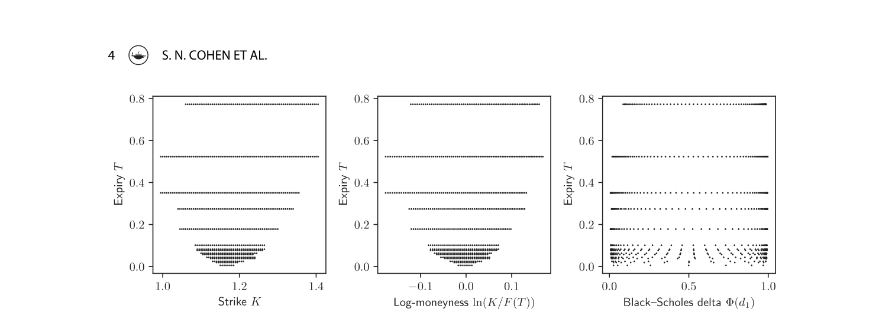

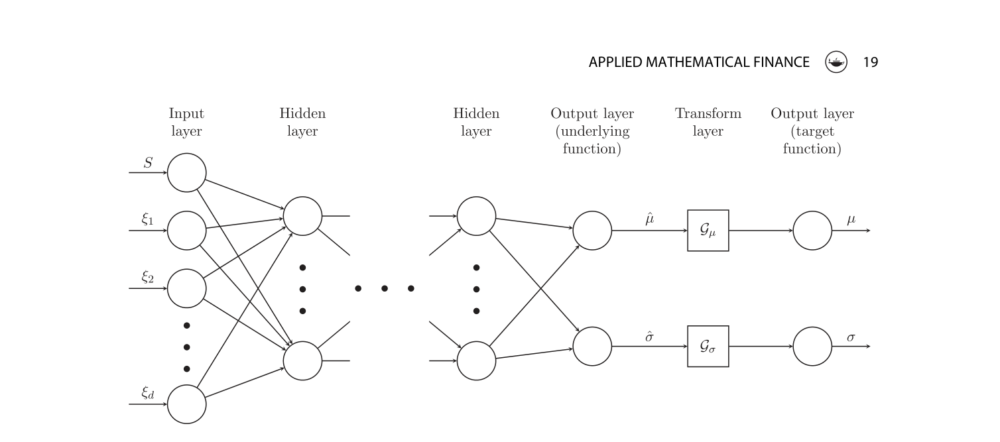

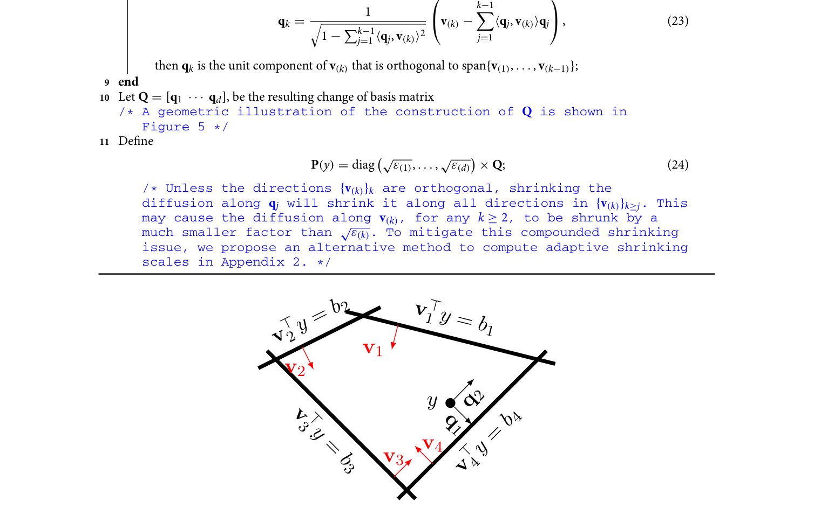

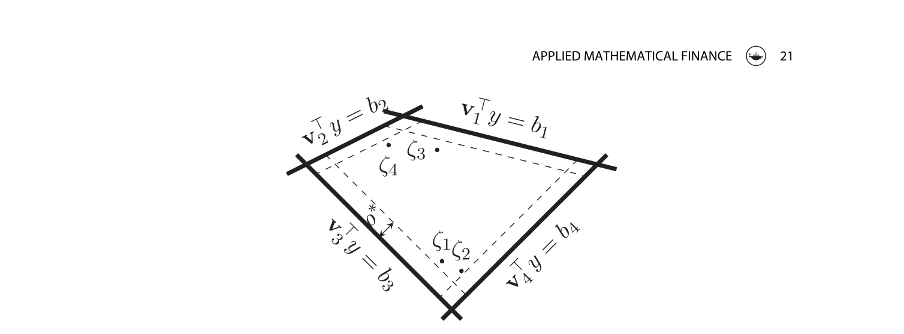

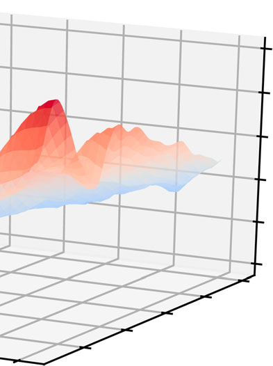

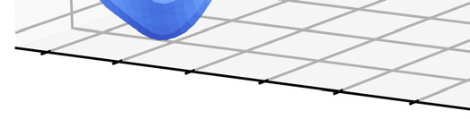

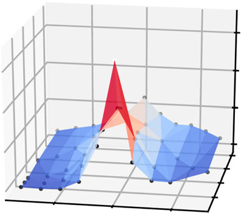

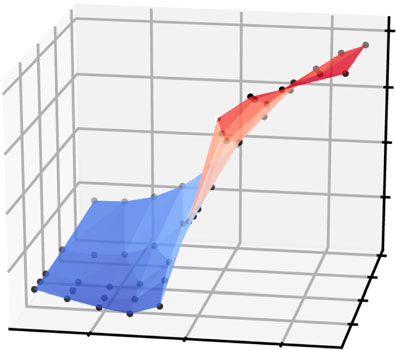

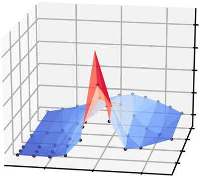

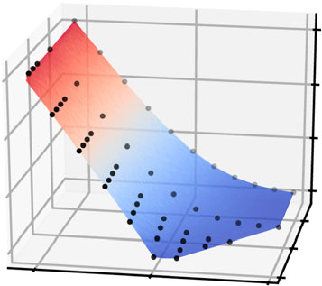

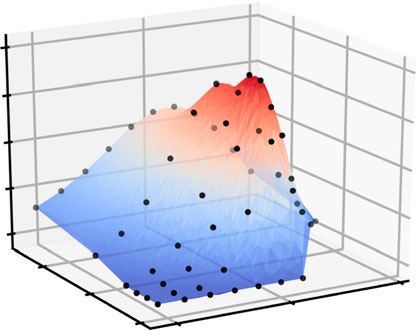

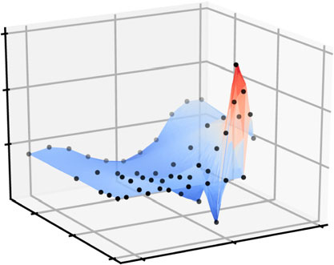

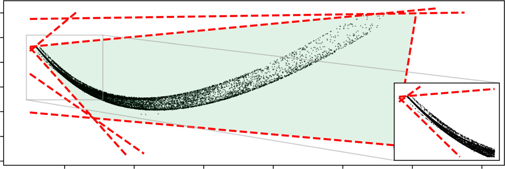

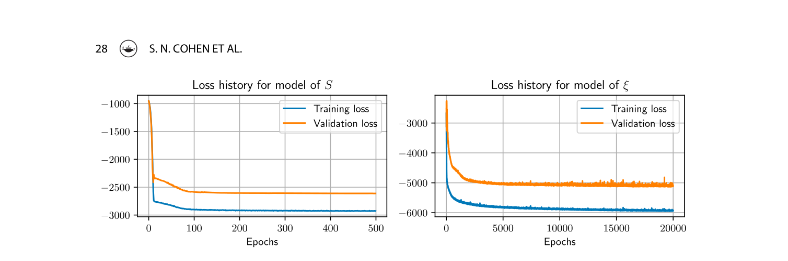

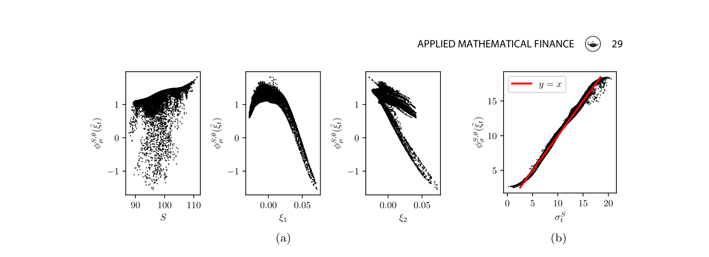

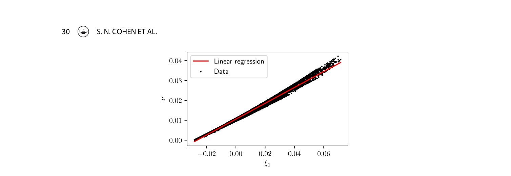

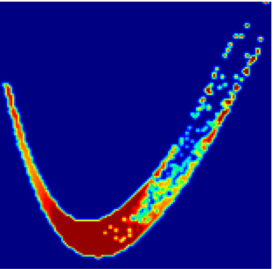

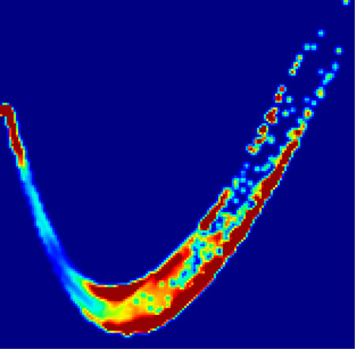

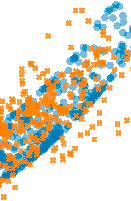

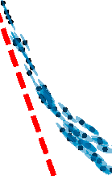

## Extraction Notes

- pdfplumber unusable table on page 29 index 1
- pdfplumber unusable table on page 29 index 2
- pdfplumber unusable table on page 32 index 1
- pdfplumber unusable table on page 45 index 1
- pdfplumber unusable table on page 45 index 2
- pdfplumber unusable table on page 46 index 1
- pdfplumber unusable table on page 46 index 2
- pdfplumber unusable table on page 46 index 3
- pdfplumber unusable table on page 46 index 4
- discarded 9 low-quality embedded figure(s)
- discarded 27 tiny-placement embedded figure(s)
- discarded 5 dense-page embedded figure candidate(s)
- camelot lattice produced no usable tables; using stream output
