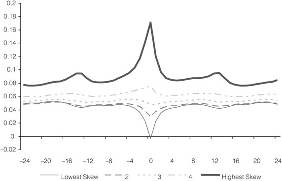

# What Does the Individual Option Volatility Smirk Tell Us About Future Equity Returns?

## Metadata

- **Source File:** `S0022109010000220.pdf`
- **Authors:** Yuhang Xing, Xiaoyan Zhang, Rui Zhao
- **Year:** 2010
- **DOI:** 10.1017/S0022109010000220

## Abstract

The shape of the volatility smirk has significant cross-sectional predictive power for future equity returns. Stocks exhibiting the steepest smirks in their traded options underperform stocks with the least pronounced volatility smirks in their options by 10.9% per year on a risk-adjusted basis. This predictability persists for at least 6 months, and firms with the steepest volatility smirks are those experiencing the worst earnings shocks in the following quarter. The results are consistent with the notion that informed traders with negative news prefer to trade out-of-the-money put options, and that the equity market is slow in incorporating the information embedded in volatility smirks. I.

## Main Text

JOURNAL OF FINANCIAL AND QUANTITATIVE ANALYSIS
Vol. 45, No. 3, June 2010, pp. 641–662
COPYRIGHT 2010, MICHAEL G. FOSTER SCHOOL OF BUSINESS, UNIVERSITY OF WASHINGTON, SEATTLE, WA 98195
doi:10.1017/S0022109010000220
### What Does the Individual Option Volatility
### Smirk Tell Us About Future Equity Returns?
Yuhang Xing, Xiaoyan Zhang, and Rui Zhao∗
Abstract
The shape of the volatility smirk has significant cross-sectional predictive power for future
equity returns. Stocks exhibiting the steepest smirks in their traded options underperform
stocks with the least pronounced volatility smirks in their options by 10.9% per year on
a risk-adjusted basis. This predictability persists for at least 6 months, and firms with the
steepest volatility smirks are those experiencing the worst earnings shocks in the following quarter. The results are consistent with the notion that informed traders with negative
news prefer to trade out-of-the-money put options, and that the equity market is slow in
incorporating the information embedded in volatility smirks.
I.
Introduction
How information becomes incorporated into asset prices is one of the fundamental questions in finance. Due to the distinct characteristics of different markets, informed traders may choose to trade in certain markets, and information is
likely to be incorporated into asset prices in these markets first. If other markets
fail to incorporate new information quickly, we might observe a lead-lag correlation between asset prices among different markets. In this paper, we use option
price data from OptionMetrics to demonstrate that option prices contain important
information for the underlying equities. In particular, we focus on the predictability and information content of volatility smirks, defined as the difference between
the implied volatilities of out-of-the-money (OTM) put options and the implied
volatilities of at-the-money (ATM) call options. We show that option volatility
smirks are significant in predicting future equity returns in the cross section. Our
analysis also sheds light on the nature of the information embedded in volatility
smirks.
∗Xing, yxing@rice.edu, Jones School of Management, Rice University, 6100 Main St., Houston,
TX 77005; Zhang, xz69@cornell.edu, 336 Sage Hall, Johnson Graduate School of Management,
Cornell University, Ithaca, NY 14853; and Zhao, rui.zhao@blackrock.com, Blackrock Inc., 40 E.
52nd St., New York, NY 10022. The authors thank Andrew Ang, Kerry Back, Hendrik Bessembinder
(the editor), Jeff Fleming, Robert Hodrick, Charles Jones, Haitao Li, Maureen O’Hara, an anonymous
referee, and seminar participants at Columbia University and the Citi Quantitative Conference.
641

642
Journal of Financial and Quantitative Analysis
The pattern of volatility smirks is well known for stock index options and
has been examined in numerous papers. For instance, Pan (2002) documents that
the volatility smirk for an S&P 500 index option with about 30 days to expiration
is roughly 10% on a median volatile day. Bates (1991) argues that the set of index
call and put option prices across all exercise prices gives a direct indication of
market participants’ aggregate subjective distribution of future price realizations.
Therefore, OTM puts become unusually expensive (compared to ATM calls), and
volatility smirks become especially prominent before big negative jumps in price
levels, for example, during the year preceding the 1987 stock market crash. In an
option pricing model, Pan incorporates both a jump risk premium and a volatility risk premium1 and shows that investors’ aversion toward negative jumps is
the driving force for the volatility smirks. For OTM put options, the jump risk
premium component represents 80% of total risk premium, while the premium is
only 30% for OTM calls. In other words, investors tend to choose OTM puts to
express their worries concerning possible future negative jumps. Consequently,
OTM puts become more expensive before large negative jumps.
In this article, we focus on individual stock options rather than on stock
index options. We first document the prevalence of volatility smirks in individual stock options, which is consistent with previous literature (see Bollen and
Whaley (2004), Bates (2003), and Gˆarleanu, Pedersen, and Poteshman (2007)).
From 1996 to 2005, more than 90% of the observations for all firms with listed
options exhibit positive volatility smirks, with a median difference between OTM
put- and ATM call-implied volatilities of roughly 5%. Next, we demonstrate that
the implied volatility smirks exhibit economically and statistically significant predictability for future stock returns. Similar to the arguments of Bates (1991) and
Pan (2002) based on index options, higher volatility smirks in individual options
should reflect a greater risk of large negative price jumps.2 For our sample period of 1996–2005, stocks with steeper volatility smirks underperform those with
flatter smirks by 10.90% per year on a risk-adjusted basis using the Fama and
French (1996) 3-factor model. This return predictability is robust to controls of
various cross-sectional effects, such as size, book-to-market (BM), idiosyncratic
volatility, and momentum.
To understand the nature of the information embedded in volatility smirks,
we examine whether the predictability persists or reverses quickly. We find that
the predictability of the volatility skew on future stock returns is persistent for
at least 6 months. We also investigate the relation between volatility smirks and
future earnings shocks. We find that stocks with the steepest volatility smirks
are those stocks experiencing the worst earnings shocks in the following quarter.
Our results indicate that the information in volatility smirks is related to firm
fundamentals.
1Many other papers also include both jump and volatility processes for index option pricing
models (e.g., Duffie, Pan, and Singleton (2000), Broadie, Chernov, and Johannes (2007)).
2To be precise, the volatility skew contains at least 3 levels of information: the likelihood of a
negative price jump, the expected magnitude of the price jump, and the premium that compensates
investors for both the risk of a jump and the risk that the jump could be large. Separating the 3 levels
of information is beyond the current paper. Here we condense the 3 levels of information into the risk
of a large negative price jump.

643
It is not necessarily true that volatility skew should predict underlying
stock returns. For instance, Heston (1993) develops an option pricing model with
stochastic volatility, under the assumption that there is perfect information flow
between the stock market and the options market. This model is able to generate
volatility skew, but volatility skew in this model does not predict underlying stock
returns since expected returns are irrelevant for option pricing. Conrad, Dittmar,
and Ghysels (2007) examine implied volatility, skewness, and kurtosis by using
a risk-neutral density function under the same no-arbitrage assumption. In contrast to the above two papers, we focus here on the information embedded in
volatility smirks without assuming that equity markets and options markets have
identical information sets. In a different setting, Gˆarleanu et al. (2007) construct a
demand-based option pricing model in which competitive risk-averse intermediaries cannot perfectly hedge their option positions, and thus demand for an option
affects its price. In this new equilibrium, Gˆarleanu et al. find a positive relationship between option expensiveness measured by implied volatility and end-user
demand. Thus, from our point of view, the end user might have an information
advantage that could lead to higher demand for particular option contracts. This,
in turn, affects the expensiveness of options measured by option-implied volatility and possibly predicts future stock returns. Thus, the findings in this paper are
consistent with the equilibrium model of Gˆarleanu et al.
Our paper contributes to the literature that examines the connection between
the options market and the stock market at firm level. This literature is vast,
and we only include several papers that are closely related. Easley, O’Hara, and
Srinivas (1998) provide empirical evidence that option volume (separated into
buyer-initiated and seller-initiated) can predict stock returns. Ofek, Richardson,
and Whitelaw (2004) use individual stock options in combination with the rebate rate spreads to examine deviation from put-call parity and the existence of
arbitrage opportunity between stock and options markets. They find that the deviations from put-call parity and rebate rate spreads are significant predictors of
future stock returns. Chakravarty, Gulen, and Mayhew (2004) investigate the contribution of the options market to price discovery and find that for their sample of
60 firms over 5 years, the options market’s contribution to price discovery is about
17%, on average. Cao, Chen, and Griffin (2005) find that prior to takeover announcements, call volume imbalances are strongly correlated with next-day stock
returns. Finally, Pan and Poteshman (2006) show that put-call ratios (PCRs) by
newly initiated trades have significant predictability for equity returns, which indicates informed trading in the options market.
Our work differs from previous studies along several dimensions. First, we
are the first to examine the predictability and the information content of the volatility smirks of individual stock options. Intuitively, an OTM put is a natural place
for informed traders with negative news to place their trades. Thus, the shape of
volatility smirks might reflect the risk of negative future news. Previous literature has mostly focused on the information contained in option volume. For instance, Pan and Poteshman (2006), Cao et al. (2005), and Chan, Chung, and Fong
(2002) investigate whether volume from the options market carries predictive information for the equity market. Chakravarty et al. (2004) and Ofek et al. (2004)
both use option price information in predicting equity returns, but neither of these

644
Journal of Financial and Quantitative Analysis
studies examines volatility smirks. Second, our results shed light on the nature of
the informational content of volatility smirks. The literature has documented that
option prices as well as other information in the options market predict movements in the underlying securities. It is natural to ask whether the predictability
is due to informed traders’ information about fundamentals. We find that the information embedded in volatility smirks is related to future earnings shocks, in
the sense that firms with the steepest volatility smirks have the worst earnings
surprises. Finally, in order to examine the speed at which markets adjust to public
information, we develop trading strategies based on past volatility smirks and examine the risk-adjusted returns of these trading strategies over different holding
periods. Pan and Poteshman find that publicly observable option signals are able
to predict stock returns for only the next 1 or 2 trading days, and the stock prices
subsequently reverse. They conclude that it is the private information that leads
to predictability. In contrast, we find no quick reversals of the stock price movements following publicly observable volatility smirks. In fact, the predictability
from volatility smirks persists for at least 6 months.
The remainder of the paper is organized as follows. Section II describes our
data. Section III summarizes empirical results on the predictability of option price
information for equity returns. Section IV investigates the information content of
volatility smirks. Section V discusses related research questions, and Section VI
concludes.
II.
Data
Our sample period is from January 1996 to December 2005. Options data
are from OptionMetrics, which provides end-of-day bid and ask quotes, open
interests, and volumes. It also computes implied volatilities and option Greeks for
all listed options using the binomial tree model. More details about the options
data can be found in the Appendix. Equity returns, general accounting data, and
earnings forecast data are from the Center for Research in Security Prices (CRSP),
Compustat, and the Institutional Brokers’ Estimate System (IBES), respectively.
We calculate our implied volatility smirk measure for firm i at week t,
SKEWi,t, as the difference between the implied volatilities of OTM puts and ATM
calls, denoted by VOLOTMP
and VOLATMC
, respectively. That is,
i,t
i,t
VOLOTMP
−VOLATMC
=
.
(1)
SKEWi,t
i,t
i,t
A put option is defined as OTM when the ratio of the strike price to the stock price
is lower than 0.95 (but higher than 0.80), and a call option is defined as ATM
when the ratio of the strike price to the stock price is between 0.95 and 1.05.3
To ensure that the options have enough liquidity, we only include options with
3There are several alternative ways to measure moneyness. For instance, Bollen and Whaley
(2004) use the Black-Scholes (1973) delta to measure moneyness, and Ni (2007) uses total volatilityadjusted strike-to-stock-price ratio as one of the moneyness measures. We find quantitatively similar
results using these alternative moneyness measures and present the main results with the simplest
moneyness measure of strike price over stock price.

645
time to expiration of between 10 and 60 days. We compute the weekly SKEW by
averaging the daily SKEW over a week (Tuesday close to Tuesday close).
When there are multiple ATM and OTM options for 1 stock on 1 particular day, we further select options or weight all available options using different
approaches to come up with 1 SKEW observation for each firm per day. Our
main approach is based on the option’s moneyness, which is also used in Ofek
et al. (2004). That is, we choose 1 ATM call option with its moneyness closest
to 1, and 1 OTM put option with its moneyness closest to 0.95. Alternatively,
we compute a volume-weighted volatility skew measure, where we use option
trading volumes as weights to compute the average implied volatilities for OTM
puts and ATM calls for each stock each day. Obviously, if an option has 0 volume during a particular day, the weight on this option will be 0. Thus, volumeweighted implied volatility only reflects information from options with nonzero
volumes. We find that around 60% of firms have ATM call and OTM put options
listed with valid price quotes and positive open interest, but these options are not
traded every day and thus have 0 volumes from time to time. Compared to the
volume-weighted SKEW, the moneyness-based SKEW utilizes all data available
with valid closing quotes and positive open interests. Our later results mainly
focus on the moneyness-based SKEW measure, but we always use the volumeweighted SKEW for a robustness check.4
We base the use of our SKEW measure on the demand-based option pricing model of Gˆarleanu et al. (2007). They find the end user’s demand for index
options is positively related to option expensiveness measured by implied volatility, which consequently affects the steepness of the implied volatility skew. Here
we can develop similar intuition for individual stock volatility skew. If there is
an overwhelmingly pessimistic perception of the stock, investors tend to buy put
options either for protection against future stock price drops (hedging purpose) or
for a high potential return on long put positions (speculative purpose). If more investors are willing to long the put than willing to short the put, both the price and
the implied volatility of the put increase, reflecting higher demand and leading to a
steeper volatility skew. In general, high buying pressure for puts and steep volatility skew are associated with bad news about future stock prices. Empirically, we
choose to use OTM puts to capture the severity of the bad news. When bad news
is more severe in terms of probability and/or magnitude, we expect stronger buying pressure on OTM puts and an increase in our SKEW variable. We choose to
use the implied volatility of ATM calls as the benchmark of implied volatility,
because it is generally believed that ATM calls are one of the most liquid options
traded and should reflect investors’ consensus about the firm’s uncertainty.5 Due
to data limitation, we do not directly calculate the buying and selling pressures.
4We also consider several alternative methods for computing SKEW when there are more than 1
pair of ATM calls and OTM puts, such as selecting the options with the highest volumes or open
interests, or using open interests as weighting variables. Our results are not sensitive to which SKEW
measure we choose to use. Results based on these alternative measures of SKEW are available from
the authors.
5ATM calls account for 25% of call and put option trading volumes combined in our sample. We
do not use OTM calls because they are much less liquid and account for less than 8% of total option
trading volume.

646
Journal of Financial and Quantitative Analysis
Table 1 provides summary statistics for the underlying stocks and options in
our sample. We first calculate the summary statistics over the cross section for
each week, and then we average the statistics over the weekly time series. We include firms with nonmissing SKEW measures, where the SKEW measure is computed using implied volatilities of ATM calls with the strike-to-stock-price ratio
closest to 1 and OTM puts with the strike-to-stock-price ratio closest to 0.95. We
require all options to have positive open interests. The first 2 rows report firms’
equity market capitalizations and BM ratios. Naturally, firms in our sample are
relatively large firms with low BM ratios compared to those firms without traded
options. Firms with listed options have an average market capitalization of $10.22
billion and a median of $2.45 billion, whereas firms without listed options have
an average market capitalization of $0.63 billion and a median of $0.11 billion.
To compute stock turnover (TURNOVER), we divide the stock’s monthly trading
volume by the total number of shares outstanding. On average, 24% of shares are
traded within a month. Thus, our sample firms are far more liquid than an average
firm traded on NYSE/NASDAQ/AMEX, which has a turnover of about 14% per
month over the same period. The variable VOLSTOCK is the stock return volatility, calculated using daily return data over the past month. An average firm in
this sample has an annualized volatility of around 47.14%, which is smaller than
the average firm level volatility of 57% for the sample of all stocks, as in Ang,
Hodrick, Xing, and Zhang (2006). The reason, again, is that our sample is tilted
toward large firms, and large firms tend to be relatively less volatile. The next 3
rows report summary statistics calculated from options data. VOLATMC, the implied volatility for an ATM call with the strike-to-stock-price ratio closest to 1, has
an average of 47.95%, about 0.8% higher than the historical volatility, VOLSTOCK.
This finding is consistent with Bakshi and Kapadia (2003a), (2003b), who argue
that the difference between VOLATMC and VOLSTOCK is due to a negative volatility risk premium. VOLOTMP, the implied volatility for an OTM put option with
the strike-to-stock-price ratio closest to 0.95, has an average of around 54.35%,
much higher than both VOLSTOCK and VOLATMC. The variable SKEW, defined as
the difference between VOLOTMPand VOLATMC, has a mean of 6.40% and a median of 4.76%. Alternatively, when we compute SKEW using the option trading
volume as the weighting variable, the mean and median of SKEW become 5.70%
and 5.05%, respectively. The correlation between the moneyness-based SKEW
and the volume-weighted SKEW is 80%.
III.
Can Volatility Skew Predict Future Stock Returns?
We argue that volatility skew reflects investors’ expectation of a downward
price jump. If informed traders choose the options market to trade in first and
the stock market is slow to incorporate the information embedded in the options
market, then we should see the information from the options market predicting
future stock returns. In this section, we illustrate that option volatility skew predicts underlying equity returns using different methodologies. In Section III.A
we conduct a Fama-MacBeth (FM) (1973) regression to examine whether volatility skew can predict the next week’s returns, while controlling for different firm

647
TABLE 1
Summary Statistics
In Table 1, data are obtained from CRSP, Compustat (for stocks), and OptionMetrics (for options). Our sample period is
1996–2005. Variable SIZE is the firm market capitalization in $ billions. Variable BM is the book-to-market ratio. Variable
TURNOVER is calculated as monthly volume divided by shares outstanding. Variable VOLSTOCK is the underlying stock
return volatility, calculated using the previous month’s daily stock returns. Variable VOLATMC is the implied volatility for
at-the-money calls, with the strike-to-stock-price ratio closest to 1. Variable VOLOTMP is the implied volatility for out-of-themoney puts, with the strike-to-stock-price ratio closest to 0.95. Variable SKEW is the difference between VOLOTMP and
VOLATMC. We first calculate the summary statistics over the cross section for each week, then we average the statistics
over the weekly time series. For each week, there are on average 840 firms in the sample.
Variable
Mean
5%
25%
50%
75%
95%
SIZE
10.22
0.35
0.94
2.45
7.56
45.14
BM
0.40
0.07
0.17
0.30
0.50
0.99
TURNOVER (%)
0.24
0.05
0.09
0.16
0.29
0.68
VOLSTOCK (%)
47.14
19.78
29.41
41.37
58.87
92.83
VOLATMC (%)
47.95
24.00
32.91
44.53
60.03
82.84
VOLOTMP (%)
54.35
29.07
38.93
51.25
66.65
89.87
SKEW (%)
6.40
–0.99
2.40
4.76
8.43
19.92
characteristics. In Section III.B we construct weekly long-short trading strategies
based on the volatility skew measure. In Section III.C we examine time-series
behavior of volatility skew and whether predictability lasts beyond 1 week.
A.
Fama-MacBeth Regression
The standard FM regression has 2 stages. In the 1st stage, we estimate the
following regression in cross section for each week t:
b0t + b1tSKEWi,t−1 + b′
=
2tCONTROLSi,t−1 + eit,
RETi,t
(2)
where variable RETi,t is firm i’s return for week t (Wednesday close to Wednesday
close), SKEWi,t−1 is firm i’s volatility skew measure for week t – 1 (Tuesday close
to Tuesday close), and CONTROLSi,t−1 is a vector of control variables for firm
i observed at week t – 1. The options market closes at 4:02 PM for individual
stock options, while the equity market closes at 4 PM. If one uses same-day prices
for both equity prices and option prices, as pointed out by Battalio and Schultz
(2006), serious nonsynchronous trading issues exist. Therefore, we skip 1 day
between weekly returns and weekly volatility skews to avoid nonsynchronous
trading issues. As one might expect, the results are even stronger if we do not
skip 1 day.
After obtaining a time series of slope coefficients, {b0t, b1t, b2t}, the 2nd
stage of standard FM methodology is to conduct inference on the time series
of the coefficients by assuming the coefficients over time are independent and
identically distributed (i.i.d.). For robustness, we also examine results when we
allow the time series of coefficients to have a trend or to have autocorrelation
structures, by detrending or using the Newey-West (1987) adjustment. The results
are close to those of the i.i.d. case and are available from the authors. With the FM
regression, not only can we easily examine the significance of the predictability
of the SKEW variable, but we also can control for numerous firm characteristics
at the same time.

648
Journal of Financial and Quantitative Analysis
We report the results for the FM regression in Panel A of Table 2. In the
first regression, we only include the volatility skew, and its coefficient estimate
is –0.0061 with a statistically significant t-statistic of –2.50. To better understand
the magnitude of the predictability, we compute the interquartile difference in the
next week’s returns. From Table 1, the 25th percentile and the 75th percentile of
SKEW are 2.40% and 8.43%, respectively. When SKEW increases from the 25th
percentile to the 75th percentile, the implied decrease in the next week’s return
becomes (8.43% – 2.40%) × (–0.0061) = –5.52 basis points (bp) (or –2.90% per
year).
TABLE 2
Predictability of Volatility Skew after Controlling for Other Effects (FM Regression)
In Table 2, data are obtained from CRSP, Compustat (for stocks), and OptionMetrics (for options). Our sample period is
1996–2005. Variable SKEW is the difference between the implied volatilities of out-of-the-money (OTM) put options and
at-the-money (ATM) call options. Variable LOGSIZE is the logged firm market capitalization. Variable BM is the book-tomarket ratio. Variable LRET is the previous 6-month return. Variable VOLSTOCK is the underlying return volatility calculated
using the previous month’s daily stock returns. Variable TURNOVER is the stock trade volume over number of shares
outstanding. Variable HSKEW is the underlying return skewness calculated using the previous month’s daily stock returns.
Variable PCR is the option volume put-call ratio. Variable PVOL is the volatility premium, which is the difference between the
implied volatility for ATM call options and VOLSTOCK. Variable VOLUME is the total volume on all option contracts. Variable
OPEN is the total open interest on all option contracts. In both panels, we report Fama-MacBeth (FM) (1973) regression
estimates for weekly returns, as specified in equation (2). In Panel A, the implied volatilities are the implied volatilities on
ATM calls with moneyness closest to 1 and OTM puts with moneyness closest to 0.95. In Panel B, the implied volatilities are
volume weighted for ATM calls and OTM puts. *, **, and *** indicate significance at 10%, 5%, and 1% levels, respectively.
TURNOVER
Regression
VOLSTOCK
LOGSIZE
VOLUME
HSKEW
Adj. R2
SKEW
OPEN
PVOL
LRET
PCR
BM
Panel A. Fama-MacBeth Regression for 1-Week Return, Using Moneyness-Based SKEW
I
Coeff. –0.0061
0.18%
t-stat. –2.50**
II
Coeff. –0.0089 0.0001 0.0006 0.0037 –0.0034 0.0000 0.0011
0.0000
–0.0008
0.0000
0.0000
8.52%
t-stat. –3.86*** 0.24
1.49
3.52*** –0.97
0.33
5.69*** –0.55
–0.25
–0.34
0.45
Panel B. Fama-MacBeth Regression for 1-Week Return, Using Volume-Based SKEW
I
Coeff. –0.0223
0.18%
t-stat. –4.30***
II
Coeff. –0.0216 0.0003 0.0015 0.0032 –0.0038 0.0000 0.0011 –0.0001
0.0008
0.0000
0.0000
11.11%
t-stat. –4.09*** 0.89
1.79*
2.73*** –0.93
0.20
3.62*** –0.81
0.20
–0.12
–0.29
To separate the predictive power of volatility skew from other firm characteristics, we consider 10 control variables in the 2nd regression in Panel A of
Table 2. The first 6 controls are from the equity market with potential predictive
power in the cross section of equity returns. The 1st control variable, SIZE, is firm
equity market capitalization. Since Banz (1981), numerous papers have demonstrated that smaller firms have higher returns than larger firms. The 2nd control
variable, BM, is meant to capture the value premium (Fama and French (1993),
(1996)). The 3rd control variable, LRET, is the past 6 months of equity returns.
We use this variable to control for a possible momentum effect (Jegadeesh and
Titman (1993)) in stock returns. The 4th variable, VOLSTOCK, is stocks’ historical
volatilities, computed using 1 month of daily returns. The reason for including
this variable is that Ang et al. (2006) show that high historical volatility strongly

649
predicts low subsequent returns. The 5th control variable is TURNOVER. As in
Lee and Swaminathan (2000) and Chordia and Swaminathan (2000), firm-level
liquidity is strongly related to a firm’s future stock return. The 6th characteristic
variable is the historical skewness (HSKEW) measure for the stock, measured
using 1 month of daily returns. Volatility skew is usually considered an indirect
measure of skewness of the implied distribution under the risk-neutral probability,
while HSKEW is computed under the real probability. The remaining 4 control
variables are from the options market. The 7th control variable, PCR, is calculated as the average volume of puts over the volume of calls from the previous
week. Pan and Poteshman (2006) show that a high PCR is related to low future
stock returns.6 The 8th control variable, volatility premium (PVOL), is the difference between the implied volatility of the ATM call, VOLATMC, and the historical
stock return volatility, VOLSTOCK. We include this variable to examine whether
the predictive power of SKEW is related to the negative volatility risk premium,
as suggested by Bakshi and Kapadia (2003a), (2003b). Finally, we include option
volumes on all contracts and option new open interests on all contracts to control
for option trading activities.
Inclusion of the control variables does not reduce the predictive power of
SKEW for the empirical results in Panel A of Table 2. Now the coefficient on
volatility skew becomes –0.0089, with a t-statistic of –3.86. In terms of economic magnitude, the interquartile difference for future return becomes (8.43% –
2.40%) × (–0.0089) = –8.30 bp (or –4.41% per year), where the interquartile
numbers are reported in Table 1.
We now take a closer look at the coefficients on the control variables. The
size variable carries a positive and insignificant coefficient, possibly because the
size effect is almost nonexistent over our specific sample period of 1996–2005.
It also may be due to the relatively large market capitalization of the firms in our
sample. For the BM variable, the coefficient is positive, which is consistent with
the value effect, but it is not significant. The coefficient for lagged return over
the past 6 months turns out to be positive and significant, indicating a strong momentum effect. The coefficients for the firm historical volatility and turnover are
negative but insignificant. Surprisingly, HSKEW is positive and significant. It is
counterintuitive because previous work, such as Barbaris and Huang (2008), indicates that one should expect a higher return for more negatively skewed stocks.
However, when we use HSKEW to predict n-week-ahead returns, the pattern reverses (see Section V.A). The PCR has a negative coefficient, which is consistent with the finding in Pan and Poteshman (2006), although insignificant. The
coefficient on PVOL is negative, indicating that firms with higher PVOLs have
higher returns. However, the coefficient is insignificant. The coefficients on option
volume and option open interest are not significant.
We also provide results using volume-weighted volatility skew in Panel B
of Table 2. The coefficient of volatility skew is statistically significant and larger
in magnitude than the moneyness-based volatility skew measure. To summarize,
6Pan and Poteshman (2006) use a newly initiated PCR to predict equity returns. As no newly
initiated PCR is publicly available, our overall PCR serves only as a rough approximation.

650
Journal of Financial and Quantitative Analysis
after controlling for firm and option characteristics, the predictive power of SKEW
remains economically large and statistically significant.
B.
Long-Short Portfolio Trading Strategy
In this section we demonstrate the predictability of SKEW using the portfolio sorting approach. Each week, we sort all sample firms into quintile portfolios
based on the previous week average skew (Tuesday close to Tuesday close). Portfolio 1 includes firms with the lowest skews, and Portfolio 5 includes firms with
the highest skews. We then skip 1 day and compute the value-weighted quintile
portfolio returns for the next week (Wednesday close to Wednesday close). If
we long Portfolio 1 and short Portfolio 5, then the return on this long-short investment strategy heuristically illustrates the economic significance of the sorting
SKEW variable. Compared to the linear regressions as in the FM approach, the
portfolio sorting procedure has the advantage of not imposing a restrictive linear
relation between the variable of interest and the return. Furthermore, by grouping
individual firms into portfolios, we can reduce firm-level noise in the data.
In Panel A of Table 3, we present the weekly quintile portfolio excess returns
and characteristics based on the moneyness-based volatility skew measure. Each
quintile portfolio has 168 stocks, on average. Portfolio 1, containing firms with
the lowest skews, has a weekly return in excess of the risk-free rate of 24 bp (an
annualized excess return of 13.18%), and Portfolio 5, containing firms with the
highest skews, has a weekly excess return of 8 bp (an annualized excess return of
3.99%). Portfolio 5 underperforms Portfolio 1 by 16 bp per week (9.19% per year)
with a t-statistic of –2.19, consistent with our conjecture that steeper volatility
smirks forecast worse news. We adjust for risk by applying the Fama and French
(1996) 3-factor model. The Fama-French (1996) alphas for Portfolios 1 and 5
are 10 bp and –11 bp per week, respectively. If we long Portfolio 1 and short
Portfolio 5, the Fama-French alpha of the long-short strategy is 21 bp per week
(10.90% annualized) with a t-statistic of 2.93. It is evident that the large spread
for this long-short strategy is driven by both Portfolio 1 and Portfolio 5.7 From
results not reported, if we conduct risk adjustment by including market aggregate
volatility risk, as in Ang et al. (2006), the return spreads are very similar to those
that appear when we use the Fama-French 3-factor model. This suggests that the
return spread between the low skew firms and high skew firms is not driven by
their exposure to aggregate volatility risk.
We also report several characteristics of the quintile portfolio firms in Panel
A of Table 3. The SIZE column exhibits a hump-shaped pattern from Portfolio 1
to Portfolio 5. Even though the market capitalizations for Portfolios 1 and 5 are
relatively smaller than those of the intermediate portfolios, their absolute magnitudes are still large, since our sample consists mainly of large cap firms. For the
BM ratio column, the pattern is relatively flat, except for the last quintile, where
BM is higher than in the other 4 quintiles. Stock return volatility, VOLSTOCK,
7In our sample, 9.91% of observations have negative volatility skews. We also separate firms with
positive skews and negative skews, and we redo the portfolio sorting for firms with positive skews
only. The return difference is very similar.

651
TABLE 3
Predictability of Volatility Skew, Portfolio Forming Approach
In Table 3, data are obtained from CRSP, Compustat (for stocks), and OptionMetrics (for options). Our sample period is
1996–2005. Variable SKEW is the difference between the implied volatilities of out-of-the-money (OTM) put options and
at-the-money (ATM) call options. Variable EXRET is the weekly excess return over the risk-free rate. Variable ALPHA is the
weekly risk-adjusted return using the Fama-French (1996) 3-factor model. Variable SIZE is the firm market capitalization in
$ billions. Variable BM is the book-to-market ratio. Variable VOLSTOCK is the underlying return volatility calculated using the
previous month’s daily stock returns. Variable PVOL is the volatility premium, which is the difference between the implied
volatility for ATM call options and VOLSTOCK. Variable VOLUME is the total volume on all option contracts. Variable OPEN
is the total open interest on all option contracts. Both panels report summary statistics for quintile portfolios sorted on the
previous week’s SKEW. For each week, we form quintile portfolios based on the average skew from the previous week.
We then skip a day and hold the quintile portfolios for another week. In Panel A, the implied volatilities are the implied
volatilities on ATM calls with moneyness closest to 1 and OTM puts with moneyness closest to 0.95. On average, each
quintile portfolio contains 168 firms. In Panel B, the implied volatilities are volume weighted for ATM calls and OTM puts.
On average, each quintile portfolio contains 68 firms. The t-statistics for mean returns and alphas are calculated over 520
weeks. The firm characteristics are computed by averaging over the firms within each quintile portfolio and then over 520
weeks. *, **, and *** indicate significance at 10%, 5%, and 1% levels, respectively.
VOLSTOCK
EXRET
ALPHA
SKEW
SIZE
BM
PVOL
VOLUME
OPEN
Panel A. Quintile Portfolios Using Moneyness-Based SKEW
Low
0.24%
0.10%
–0.34%
7.82
0.394
0.504
3.03%
1,042
10,718
2
0.15%
0.03%
2.87%
13.81
0.377
0.454
1.11%
1,234
13,890
3
0.16%
0.03%
4.79%
14.70
0.373
0.459
0.51%
1,258
14,299
4
0.11%
–0.02%
7.55%
10.46
0.398
0.474
0.18%
962
10,865
High
0.08%
–0.11%
17.14%
4.29
0.468
0.466
–0.80%
469
5,618
Low – High
0.16%
0.21%
t-stat.
2.19**
2.93***
Panel B. Quintile Portfolios Using Volume-Based SKEW
Low
0.26%
0.14%
0.48%
13.56
0.342
0.543
1.98%
1,994
18,222
2
0.21%
0.08%
3.45%
22.25
0.316
0.483
0.21%
2,244
22,987
3
0.14%
0.04%
5.06%
25.57
0.301
0.487
–0.56%
2,525
26,839
4
0.15%
0.04%
6.96%
23.95
0.302
0.506
–0.96%
2,535
26,918
High
0.07%
–0.05%
12.54%
13.26
0.348
0.558
–1.27%
2,024
21,859
Low – High
0.19%
0.19%
t-stat.
2.05**
2.07**
displays a slightly downward trend from quintile 1 to quintile 5. The next column
reports PVOL. Interestingly, as SKEW increases from Portfolio 1 to Portfolio 5,
PVOL decreases. Hence, for firms with low volatility skews, the options market prices the options higher than historical volatilities mandate, while high skew
firms’ options are less expensive than historical volatilities imply. It is possible
that SKEW’s predictive power is related to the magnitude of PVOL, yet our earlier FM regression results show that PVOL does not have strong predictive power
in a linear regression. In the last 2 columns, we report average volumes and average open interests for all contracts. It is interesting to see that volumes on firms
with the lowest volatility skews are much higher than volumes on firms with the
highest skews. However, high trading intensity is not a necessary condition for
option prices to contain information. The open interest variable displays a similar
pattern in the last column.8
Panel B of Table 3 reports the returns and characteristics for quintile portfolios sorted on volume-weighted volatility skew, where options with 0 volumes are
implicitly excluded. By requiring positive trading volume, we impose a stricter
requirement on option liquidity. As a consequence, sample size in Panel B is
8From results not reported, we conduct a double sort based on volume/open interest and volatility
skew. Our goal is to see whether the long-short strategy works better for firms with more option trading
(in terms of higher volume and larger open interest), and the results indicate that is the case.

652
Journal of Financial and Quantitative Analysis
considerably smaller than in Panel A. Quintile portfolios in Panel B, on average,
have 68 firms per week. By comparing Panels A and B, we find that firms with
positive daily option volumes are twice as large in terms of market capitalization,
and their SKEW measures are smaller. If we long the quintile portfolio with the
lowest volume-weighted skew firms and short the quintile portfolio with the highest volume-weighted skew firms, the Fama-French (1996) adjusted return now
becomes 19 bp per week, or 10.06% annualized, with a t-statistic of 2.07. The
patterns of characteristics in Panel B are qualitatively similar to those in Panel A
with the exceptions of volume and open interest. With volume-weighted implied
volatility, volume and open interest are fairly flat across the quintile portfolios.
To summarize, we find firms with high volatility skews underperform firms
with low volatility skews. The return difference is economically large and statistically significant no matter which SKEW measure is used. In the interest of being
concise, we only report results on moneyness-based SKEW for the remainder of
the paper. Our results are quantitatively and qualitatively similar among different
SKEW measures and are available from the authors.
C.
How Long Does the Predictability Last?
We have just shown that stocks with high volatility skews underperform
those with low volatility skews in the subsequent week. In this section, we examine
whether this underperformance lasts over longer horizons. If the stock market is
very efficient in incorporating new information from the options market, the predictability will be temporary and unlikely to persist over a long period. Whether
the predictability lasts over a longer horizon also might relate to the nature of
the information. If the information is a temporary fad and has nothing to do with
fundamentals, the predictability also will fade rather quickly. Of course, the definitions of “temporary” and “longer period” are relative. In this section, “temporary” refers to less than 1 week, and “longer period” refers to more than 1 week
but less than half a year. We take two approaches to investigate this issue: First,
we examine whether volatility skew can predict future return after n weeks by
using FM regressions; second, we examine portfolio holding period returns over
different longer periods by using volatility skew from the previous week as the
sorting variable.
Panel A of Table 4 reports the FM regression results. We focus on weekly
returns from the 4th week (return over week t+4), the 8th week (return over week
t + 8) up, and so on until the 24th week (return over week t + 24). We control
for firm characteristics as well as option characteristics in all regressions, as in
equation (2). We set the dependent variables to be weekly returns, rather than
cumulative returns such as from week t + 1 to week t + 4, because this allows
us to easily compare magnitudes of parameters on the SKEW variable with the
benchmark case of the next week (week t + 1), as presented in the first 2 rows.
The coefficients on volatility skew are significant for returns in the 4th week up
to the 24th week. The coefficient on SKEW changes from –0.0089 in the first
week to –0.0038 for the 24th week, indicating that predictability weakens as the
time horizon lengthens. Interestingly, HSKEW now has the expected negative
coefficients for all estimated horizons, and the coefficients are significant from

653
(continued on next page)
Variable OPEN is the total open interest on all option contracts. In Panel A, we report Fama-MacBeth (FM) (1973) regression estimates for n-week-ahead weekly returns, with n = 1, 4, 8, . . . , 24. Panel B reports
put-call ratio. Variable PVOL is the volatility premium, which is the difference between the implied volatility for at-the-money call options and VOLSTOCK. Variable VOLUME is the total volume on all option contracts.
cumulative holding period returns for quintile portfolios sorted on the previous week’s skew over the next n weeks, with n = 4, 8, . . . , 28. All returns are adjusted by the Fama-French (1996) 3-factor model, and
BM is the book-to-market ratio. Variable LRET is the previous 6-month return. Variable VOLSTOCK is the underlying return volatility calculated using the previous month’s daily stock returns. Variable TURNOVER
is the stock trade volume over number of shares outstanding. Variable HSKEW is the underlying return skewness calculated using the previous month’s daily stock returns. Variable PCR is the option volume
In Table 4, data are obtained from CRSP, Compustat (for stocks), and OptionMetrics (for options). Our sample period is 1996–2005. Variable SKEW is the difference between the implied volatilities of out-of-themoney (OTM) put options (strike-to-stock-price ratio closest to 0.95) and at-the-money (ATM) call options (strike-to-stock-price ratio closest to 1). Variable LOGSIZE is the logged firm market capitalization. Variable
Adj. R2
7.88%
7.80%
7.44%
7.30%
7.14%
6.77%
11.11%
0.0000
0.0000
0.0000
0.0000
0.0000
0.0000
0.0000
OPEN
0.69
1.51
0.03
–0.29
0.74
–0.33
0.76
VOLUME
0.0000
0.0000
0.0000
0.0000
0.0000
0.0000
0.0000
–0.12
1.41
0.60
0.35
0.05
1.37
–0.60
the risk-adjusted returns are annualized. Panel C reports autocorrelation coefficients of the SKEW. *, **, and *** indicate significance at 10%, 5%, and 1% levels, respectively.
–0.0027
–0.0044
–0.0050
–0.0002
–0.0049
–0.0034
–0.0001
PVOL
–1.55
–1.42
–1.52
–1.04
–0.81
–0.88
–0.07
3.62***
0.0000
0.0000
0.0000
0.0000
0.0000
0.0000
0.0011
PCR
1.81*
0.13
1.37
–0.56
–0.02
–0.70
How Long Does SKEW’s Predictability Last?
HSKEW
–2.97***
0.0008
–0.0004
–0.0003
–0.0004
–0.0005
–0.0001
–0.0003
–2.30**
–2.21**
–1.93*
0.20
–0.43
–1.52
TURNOVER
0.0001
0.0001
0.0001
0.0000
0.0000
0.0000
0.0000
TABLE 4
0.60
1.21
0.35
0.20
0.81
–0.17
–0.14
VOLSTOCK
–0.0037
–0.0055
–0.0038
–0.0011
–0.0033
–0.0030
–0.0038
–1.09
–1.58
–0.86
–0.93
–0.93
–1.08
–0.32
2.73***
0.0016
0.0016
0.0015
0.0021
0.0020
0.0019
0.0032
LRET
2.21**
2.24**
2.24**
1.67*
1.64
1.64
0.0008
0.0002
0.0015
0.0005
0.0011
0.0006
0.0008
2.43**
1.97**
1.90*
1.79*
BM
1.15
0.49
1.38
Panel A. Predict Future nth Weekly Returns (FM Regression)
LOGSIZE
–0.0002
–0.0005
0.0003
–0.0003
–0.0003
–0.0003
–0.0005
–2.04**
–2.41**
0.89
–1.52
–1.25
–1.29
–1.07
–4.09***
–3.27***
–0.0067
–0.0040
–0.0216
–0.0026
–0.0052
–0.0043
–0.0038
–2.47**
–2.03**
SKEW
–1.89
–1.30
–1.82
Coeff.
Coeff.
Coeff.
Coeff.
Coeff.
Coeff.
Coeff.
t-stat.
t-stat.
t-stat.
t-stat.
t-stat.
t-stat.
t-stat.
Week
nth
4
8
1
12
16
20
24

654
Journal of Financial and Quantitative Analysis
TABLE 4 (continued)
How Long Does SKEW’s Predictability Last?
Panel B. Holding Period Returns for the Next n Weeks, Risk Adjusted by the Fama-French 3-Factor Model
n Weeks
4
8
12
16
20
24
28
Low
3.40%
3.55%
3.97%
3.46%
3.59%
3.94%
3.51%
2
1.15%
1.84%
2.28%
2.43%
2.35%
2.43%
1.98%
3
1.69%
0.90%
0.76%
0.87%
0.89%
0.97%
1.20%
4
–1.33%
–0.58%
–1.12%
–1.25%
–0.77%
–0.72%
–0.68%
High
–3.12%
–3.32%
–3.16%
–2.53%
–2.92%
–3.11%
–2.87%
Low – High
6.52%
6.88%
7.14%
5.99%
6.50%
7.04%
6.38%
t-stat.
2.70***
3.73***
4.23***
4.32***
4.34***
4.33***
4.31***
Panel C. Autocorrelations for SKEW
AR1
AR2
AR3
AR4
AR5
AR6
AR7
AR8
0.660
0.412
0.316
0.285
0.251
0.195
0.189
0.225
the 4th week to the 16th week. Clearly, a positive and significant coefficient on
HSKEW exists only for a 1-week horizon. Over the longer term, high HSKEW
leads to negative returns, which is consistent with explanations based on investor
preferences for skewed assets, as in Barbaris and Huang (2008).
Panel B of Table 4 presents portfolio holding period return results. First, we
sort firms into quintile portfolios based on the previous week’s volatility skew
measure, and then we compute the value-weighted holding period returns for the
next 4 weeks (from week t + 1 to week t + 4), the next 8 weeks (from week t + 1 to
week t+8), and so on up until week 28 (from week t+1 to week t+28). In contrast
to Panel A, Panel B shows cumulative holding period returns, rather than weekly
returns, because it is easier for portfolio managers to understand the magnitudes
for different holding periods. These holding period returns are annualized and
are adjusted by the Fama-French (1996) 3-factor model. The t-statistics are adjusted using Newey-West (1987), because the holding period returns overlap. For
a holding period of 1 week, as in Table 3, the alpha difference between firms with
the lowest skews and the highest skews is 10.90%. The alpha difference drops to
6.52% when we extend the holding period to 4 weeks. This is almost 40% smaller
than the alpha if we hold the portfolio for 1 week. For holding period returns of
8–28 weeks, the risk-adjusted return for the long-short strategy stays between 6%
and 7%. It declines further after week 28. The results suggest that the stock market
is slow to incorporate information embedded in option prices. The predictability
of volatility skew lasts over the 28-week horizon and then slowly dies out.
We conduct additional analysis on volatility skew to investigate whether
volatility skew itself is persistent or mean reverting. First, we calculate the autocorrelation coefficient of the volatility skew measure. In Panel C of Table 4,
the 1st-order autocorrelation coefficient is 66%, and then the autocorrelation goes
down almost monotonically to around 20% for the 8th-order autocorrelation. This
indicates that volatility skew is not highly persistent over the weekly horizon.
Figure 1 plots the evolution of the average volatility skew for firms belonging to different quintile portfolios sorted on week 0’s volatility skew. It spans 24
weeks before and after the portfolio formation time, which is week 0. The figure
clearly shows that for the firms with the highest volatility skews at week 0, average volatility skew starts to increase about 2–3 weeks before portfolio formation,

655
FIGURE 1
Evolution of Volatility Skew over [–24, +24]
Data are obtained from CRSP, Compustat (for stocks), and OptionMetrics (for options). Our sample period is 1996–2005.
Variable SKEW is the difference between the implied volatilities of out-of-the-money (OTM) put options (strike-to-stock-price
ratio closest to 0.95) and at-the-money (ATM) call options (strike-to-stock-price ratio closest to 1). In Figure 1, we track
the average volatility skew for firms within quintile portfolios between 24 weeks before the sorting and 24 weeks after the
sorting, while the ranks of quintile portfolios are determined based on SKEW at week 0.
and it quickly decreases over week +1 to +3 after it reaches the peak at week
0. Afterward, the speed of decreasing slows down. The pattern for firms with the
lowest volatility skews is the opposite. Overall, the figure indicates that the big increase in volatility skew for Portfolio 1 firms is short term, as driven by short-term
information, rather than permanent.
To summarize, the results in this section show that the predictability of
volatility skew lasts for as long as around a half year, suggesting the equity market
is slow in reacting to information in the options market.
IV.
Volatility Smirks and Future Earnings Surprises
Given the strong predictability of volatility skew, the next natural question
becomes: What is the nature of the information embedded in volatility skew?
Broadly speaking, information relevant for a firm’s stock price includes news to its
discount rate and news to its future cash flows. The news could be at the aggregate
market level, at the industry level, or firm-specific. Since the volatility skew is a
firm-specific variable, we focus on firm-level information rather than on aggregate
information. Nevertheless, we do not rule out the possibility that some underlying
macroeconomic factors affect the volatility skew in a systematic fashion, and we
leave that to potential future studies.
The most important firm-level event is a firm’s earnings announcement.
Dubinsky and Johannes (2006) note that most of the volatility in stock returns
is concentrated around earnings announcement days. This indicates that a firm’s
earnings announcement is a major channel for new information release. Hence, in

656
Journal of Financial and Quantitative Analysis
this section we investigate whether the option volatility skew contains information
related to future earnings.9
First, we sort firms into quintile portfolios based on the volatility skew. Then,
we examine the next quarterly earnings surprise for firms in each quintile portfolio. The earnings surprise variable, UE, is the difference between announced
earnings and the latest consensus earnings forecast before the announcement. We
also scale UE by the standard deviation of the latest consensus earnings forecast,
and this gives us the standardized earnings surprise variable, SUE. If the information in SKEW is related to news about firms’ earnings, the firms with the highest
skews are likely to be the firms with the worst news, and they should have the lowest UE/SUE in the next quarter. Since our sample firms are generally large firms,
about 80% of these firms have earnings forecast data available within the next
12-week interval. So the results in this section are representative of the general
cross section in this article.
We report earnings surprise statistics in Table 5. Panel A includes all observations with an earnings release within the next n weeks after observing the
volatility skew variable, where n = 4, 8, 12, 16, 20, and 24. Consider n = 12 as
an example: The difference in UE between the lowest and the highest 20% of
TABLE 5
Option Volatility Smirks and Future Earnings Surprises
In Table 5, data are obtained from CRSP, IBES (for stocks), and OptionMetrics (for options). Our sample period is 1996–
2005. Variable SKEW is the difference between the implied volatilities of out-of-the-money (OTM) put options (strike-tostock-price ratio closest to 0.95) and at-the-money (ATM) call options (strike-to-stock-price ratio closest to 1). Variable
UE is the unexpected earnings, the difference between announced earnings and the latest earnings forecast consensus.
Variable SUE is the standardized UE, where UE is divided by volatility of analyst forecasts. In Panel A, we sort stocks into
quintiles based on the previous week’s average SKEW. We then check the average future UE/SUE for each portfolio, where
the firms have an earnings release within the next n weeks, with n = 4, 8, . . . , 24. In Panel B, we use Fama-MacBeth (FM)
(1973) regression to investigate whether the previous week’s volatility skew is able to predict future UE/SUE within the next
n weeks, with n = 4, 8, . . . , 24. Here *, **, and *** indicate significance at 10%, 5%, and 1% levels, respectively.
Panel A. Earnings Surprises for Firms with Earnings Announcements within the Next n Weeks
UE
SUE
n
Low SKEW –
Low SKEW –
Weeks
High SKEW
t-Stat.
High SKEW
t-Stat.
4
0.0087
3.24***
0.3167
2.63***
8
0.0088
2.59***
0.3163
3.01***
12
0.0063
3.04***
0.3369
2.88***
16
0.0062
2.35**
0.3427
2.43**
20
0.0104
3.85***
0.4881
4.40***
24
0.0074
2.62**
0.3672
2.10**
Panel B. Predicting Future Earnings Surprise within Next n Weeks Using the Previous Week’s SKEW (FM Regression)
UE
SUE
n
Weeks
Coeff.
t-Stat.
Coeff.
t-Stat.
4
–0.039
–2.51**
–1.847
–2.98***
8
–0.045
–2.78***
–2.023
–3.57***
12
–0.033
–3.26***
–2.063
–3.72***
16
–0.033
–2.98***
–1.980
–2.75***
20
–0.053
–3.43***
–2.681
–3.66***
–2.61***
24
–0.041
–2.87***
–2.188
9In a related paper, Amin and Lee (1997) examine trading activities in the 4-day period just before
earnings announcements and document that option trading volume is related to price discovery of
earnings news.

657
firms ranked by volatility skew is 0.63 of a cent ($0.0063), with a significant tstatistic of 3.04. Given that the average size of UE is 2 cents, the 0.63 of a cent
difference is economically significant. The results on SUE are qualitatively similar. The above findings are consistent with the hypothesis that SKEW is related to
future earnings and that higher SKEW suggests worse news.
We also conduct an FM regression to investigate whether volatility skew can
predict future earnings surprise. Specifically, we examine whether the coefficient
on volatility skew is significantly negative for earnings announcements within the
next n weeks, where n = 4, 8, 12, 16, 18, 20, and 24. The results are presented
in Panel B of Table 5. On the left-hand side, we use volatility skew to predict
future UE, and we predict SUE in the right-hand side. For the UE regressions, the
coefficient estimates for the volatility skew range between –0.039 to –0.041 and
are statistically significant over all horizons for weeks 4–24. The results on SUE
are qualitatively similar.
The results demonstrate a close link between the shape of the volatility smirk
and future news about firm fundamentals. We find that the firms with the highest
skews are the firms with the worst earnings surprises between 1 and 6 months
in the future. This empirical finding is suggestive of the superior informational
advantage option traders have over stock traders.
V.
Discussion on Related Literature
A.
Volatility Skew versus Risk-Neutral Skew
A few papers (e.g., Conrad et al. (2007), Zhang (2005)) indicate that lower
skewness leads to higher returns. The intuition is that firms with more negative
skewness are riskier and thus should receive higher expected returns as compensation. However, the skewness measures used in these studies are either risk-neutral
skewness (RNSKEW) or HSKEW, under the assumption that there is no arbitrage
or information difference between the options market and the stock market.
Bakshi, Kapadia, and Madan (BKM) (2003) show that more negative
RNSKEW equals a steeper slope of implied volatilities, everything else being
equal. Thus, our volatility skew measure is negatively related to RNSKEW. In
previous sections we show that firms with higher volatility skews have lower average returns. If our volatility skew is a proxy for RNSKEW or HSKEW, then
our finding is at odds with the risk explanations mentioned above. In this section
we empirically separate the predictive powers of volatility skew, RNSKEW, and
HSKEW.
We compute RNSKEW following BKM’s (2003) procedure. BKM show that
higher moments in the risk-neutral world, such as skewness and kurtosis, can
be expressed as functions of OTM calls and puts. Based on equations (5)–(9) in
BKM, we compute the RNSKEW using at least 2 pairs of OTM calls and OTM
puts for each day. Next, we average the daily RNSKEW over a week to obtain
weekly measures that are compatible in frequency with the volatility skew measure. Since not all stocks have more than 2 pairs of OTM calls and OTM puts each
day, we only require a stock to have more than 2 daily observations in each week
to be included in our weekly sample. Even so, many smaller stocks do not have

658
Journal of Financial and Quantitative Analysis
2 pairs of OTM calls and OTM puts with valid price quotes. Finally, there are
only about 140 firms with weekly RNSKEW for each week, on average, which is
substantially smaller than the sample size with the volatility skew measure available. Due to the significant smaller sample size, results in this section should be
interpreted with caution.
We first investigate the correlations between different skewness measures. As
expected, the cross-sectional correlation between volatility skew and RNSKEW
is –29%. HSKEW has close to 0 correlations with the other 2 skewness measures:
Its correlation with volatility skew is 1.79%, and its correlation with RNSKEW
is –0.43%.
To separate the explanatory power of volatility skew, RNSKEW, and
HSKEW, we apply an FM regression, rather than double sorting, due to the limited number of firms with available RNSKEW data. In the FM regression, we
use all 3 skewness measures to predict the weekly return in the 1st and 4th–24th
weeks after the skewness measures are observed. Using the regression, we test
2 hypotheses: first, whether volatility skew can still predict future stock returns
in the presence of other skewness measures; second, whether the RNSKEW and
HSKEW can predict future stock returns, and whether they carry a negative sign
as expected from a risk explanation.
Table 6 reports the regression results. In the left-hand panel we do not include characteristics variables as controls, and in the right-hand panel we include
the 10 control variables as in equation (2). For the sample of firms with RNSKEW
available, the volatility skew is negative and statistically significant in predicting
the next week’s returns when there are no control variables. However, the predictability weakens substantially when we extend the weekly returns further into
TABLE 6
Distinguishing between Different Skew Measures (FM Regression)
In Table 6, data are obtained from CRSP, Compustat (for stocks), and OptionMetrics (for options). Our sample period
is 1996–2005. Variable SKEW is the difference between the implied volatilities of out-of-the-money (OTM) put options
(strike-to-stock-price ratio closest to 0.95) and at-the-money (ATM) call options (strike-to-stock-price ratio closest to 1).
Variable RNSKEW is the risk-neutral skewness estimated following Bakshi, Kapadia, and Madan (2003). Variable HSKEW
is the historical skewness estimated using the previous month’s daily return. We report the Fama-MacBeth (FM) (1973)
regression estimates for n-week ahead weekly returns, where n = 1, 4, . . . , 24. The control variables are the same as in
equation (2). *, **, and *** indicate significance at 10%, 5%, and 1% levels, respectively.
With Controls
Without Controls
nth
Week
SKEW
RNSKEW
HSKEW
SKEW
RNSKEW
HSKEW
1
Coeff.
–0.0457
0.0014
0.0021
–0.0324
0.0001
0.0017
t-stat.
–2.67***
0.76
3.93***
–1.74*
0.07
2.63***
4
Coeff.
0.0022
0.0004
–0.0001
–0.0121
–0.0002
–0.0003
t-stat.
0.15
0.24
–0.21
–0.64
–0.11
–0.66
8
Coeff.
–0.0172
–0.0006
–0.0002
0.0285
0.0049
–0.0008
t-stat.
–1.23
–0.37
–0.48
0.86
1.23
–1.11
12
Coeff.
–0.0008
0.0021
–0.0010
–0.0444
–0.0023
–0.0003
t-stat.
–0.05
1.24
–2.10**
–0.82
–0.35
–0.30
16
Coeff.
0.0006
0.0027
–0.0005
0.0252
0.0070
–0.0010
t-stat.
0.04
1.42
–1.10
0.75
1.62
–1.55
20
Coeff.
0.0073
0.0009
–0.0013
0.0586
0.0075
–0.0023
t-stat.
0.52
0.56
–2.56**
1.35
1.30
–2.24**
24
Coeff.
–0.0154
0.0007
–0.0005
–0.0354
0.0011
0.0004
t-stat.
–1.12
0.39
–1.18
–1.44
0.52
0.44

659
the future. The RNSKEW measure does not appear to be significant in any regression. HSKEW has an expected negative coefficient over horizons longer than
1 week. The results suggest that RNSKEW and volatility skew contain different
information for future equity returns. BKM (2003) show that implied volatility
can be expressed as a linear transformation of risk-neutral higher moments like
skewness and kurtosis. The correlation between RNSKEW and volatility skew in
our sample is fairly low at –29%. It is possible that, in addition to RNSKEW,
there are additional factors, such as risk-neutral kurtosis, that affect the shape of
the volatility skew. This may lead to the difference in predictive power of SKEW
and RNSKEW.
Overall, the volatility skew and HSKEW both have weak predictive power
in the presence of RNSKEW for a much smaller sample size. RNSKEW does
not predict future returns. It is likely that volatility skew and RNSKEW contain
different information, and this might explain the differences between our findings
and those of Conrad et al. (2007).
B.
Where Do Informed Traders Trade?
We have documented that the volatility skew variable can predict the underlying cross-sectional equity returns, and we argue that the informational advantage of some option traders might be the reason for the observed predictability. In
this section we investigate the question of when informed traders would choose
to trade in the options market rather than in the equity market.
Easley et al. (1998) provide a theoretical framework for understanding where
informed traders trade. In the pooling equilibrium of their model, given access to
both the stock market and the options market, profit-maximizing informed traders
may choose to trade in one or both markets. Informed traders would choose to
trade in the options market if the options traded provide high leverage, and/or if
there are many informed traders in the stock market, and/or the stock market for
the particular firm is illiquid. Presumably, the predictive power of volatility skew
would be stronger when more informed traders choose to trade in the options
market. To test the above conjecture, we first define measurable proxies for the
key variables. For option leverage, we use the option’s delta, which is the 1storder derivative of option price with respect to stock price. Since informed traders
are more likely to use OTM puts to trade and reveal severe negative information,
we use the deltas of OTM puts, rather than the deltas of ATM calls. The higher
leverage of a put option is equivalent to a more negative delta. We follow Easley,
Hvidkjaer, and O’Hara (2002) and use the probability of informed trading (PIN)10
to proxy for the percentage of informed trading for individual stocks. Finally, we
use TURNOVER to proxy for stock trading liquidity.
To investigate how the SKEW’s predictability changes with the option’s
delta, PIN, and TURNOVER, we estimate another set of FM regressions by adding
interaction terms:
10The data on PIN is obtained from Soeren Hvidkjaer’s Web site, http://sites.google.com/site/
hvidkjaer/data, for the sample period 1996–2002, so the regression with PIN has a shorter sample
period than other regressions.

660
Journal of Financial and Quantitative Analysis
=
b0t + (b1t + c1tTURNOVERi,t−1)SKEWi,t−1
(3)
RETi,t
+ b2tCONTROLSi,t−1 + eit,
=
b0t + (b1t + c2tDELTAi,t−1)SKEWi,t−1
RETi,t
+ b2tCONTROLSi,t−1 + eit,
=
b0t + (b1t + c3tPINi,t−1)SKEWi,t−1
RETi,t
+ b2tCONTROLSi,t−1 + eit,
To be consistent with Easley et al. (1998), the predictability of SKEW should be
increasing in stock market illiquidity, option delta, and stock market asymmetric
information. Thus, the coefficient c1 should be negative, the coefficient c2 should
be positive, and the coefficient c3 should be negative.
Table 7 presents the FM regression results. In the 1st regression the interaction between SKEW and TURNOVER carries a negative sign, which indicates
that when stock market liquidity deteriorates, the predictive power of SKEW becomes stronger. In the 2nd regression we find that the coefficient on the interaction
between SKEW and OTM put delta has a positive sign and is marginally significant. This implies that when OTM put option deltas become more negative, that
is, options become more leveraged, more informed traders prefer to trade in the
options market and cause stronger predictability of the volatility skew variable.
Finally, the interaction between SKEW and PIN is positive, indicating that as information asymmetry increases in the stock market, the predictability of volatility
skew becomes weaker. Apart from the PIN measure, the regression results are
consistent with the model predictions in Easley et al. (1998). Although most of
the coefficients are insignificant, the SKEW variable always has a negative sign.
TABLE 7
Where Do Informed Traders Trade?
In Table 7, data are obtained from CRSP, Compustat (for stocks), and OptionMetrics (for options). Our sample period is
1996–2005. Variable SKEW is the difference between the implied volatilities of out-of-the-money (OTM) put options (striketo-stock-price ratio closest to 0.95) and at-the-money (ATM) call options (strike-to-stock-price ratio closest to 1). Variable
TURNOVER is the stock trade volume over the number of shares outstanding. Variable DELTA is the delta of the OTM
put option. Variable PIN is the PIN measure from Easley, O’Hara, and Hvidkjaer (2002). We report Fama-MacBeth (1973)
regression results as specified in equation (3). *, **, and *** indicate significance at 10%, 5%, and 1% levels, respectively.
SKEW ×
SKEW ×
SKEW ×
Adj. R2
Regression
SKEW
TURNOVER
DELTA
PIN
I
Coeff.
–0.0050
–0.0015
8.08%
t-stat.
–1.73*
–1.38
II
Coeff.
–0.0028
0.0407
7.82%
t-stat.
–0.67
1.49
III
Coeff.
–0.0088
0.0385
7.46%
t-stat.
–1.07
0.65
VI.
Conclusion
Informed traders might choose to trade in different markets to benefit from
their informational advantage. Thus, one market could lead another market in the
price discovery process. In this paper, we investigate whether the shape of the
volatility smirk contains relevant information for the underlying stock’s future

661
returns. We define the volatility skew variable as the difference between the implied volatilities of out-of-the-money puts and at-the-money calls. Empirically,
the majority of individual stock options exhibit a downward sloping volatility
smirk pattern. We find that volatility skew has significant predictive power for
future cross-sectional equity returns. Firms with the steepest volatility skews underperform those with the least pronounced volatility skews. This cross-sectional
predictability is robust to various controls and is persistent for at least 6 months.
The predictability we document is consistent with the model of Gˆarleanu et al.
(2007), which shows that demand is positively related to option expensiveness. It
also suggests that informed traders trade in the options market and that the stock
market is slow to incorporate information from the options market. We further
document that firms with the steepest volatility smirks are those experiencing the
worst earnings shocks in subsequent months, suggesting that the information embedded in the shape of the volatility smirk is related to firm fundamentals.
Appendix
The options data are obtained from OptionMetrics. We apply the following filters to
the daily options data:
i) The underlying stock’s volume for that day is positive.
ii) The underlying stock’s price for that day is higher than $5.
iii) The implied volatility of the option is between 3% and 200%.
iv) The option’s price (average of best bid price and best ask price) is higher than
$0.125.
v) The option contract has positive open interest and nonmissing volume data.
vi) The option matures within 10–60 days.
For at-the-money (ATM) call options, we require the option’s moneyness to be between 0.95 and 1.05. For out-of-the-money (OTM) put options, we require the option’s
moneyness to be between 0.80 and 0.95. We compute firm daily volatility skew by using
the daily difference between implied volatilities of ATM calls and OTM puts. The daily
skew data set on average has 1,005 firms each day over the sample period 1996–2005.
We choose the ATM call as a benchmark for implied volatility because it has the
highest liquidity among all traded options. In fact, in terms of volume, the average daily
volume for ATM calls accounts for about 25% of volume for all call and put options combined. The ATM puts account for 17% of daily volume, and the OTM puts account for another 10%. On average, each firm has about 2 ATM call options each day, and we chose the
one with moneyness closest to 1.00. Each firm has approximately 1 OTM put option daily.
When we construct the weekly volatility skew data set, we only include firms that
have at least 2 nonmissing daily skew observations within the week. The weekly skew data
set on average has 840 firms each week over the sample period 1996–2005.
References
Amin, K., and C. Lee. “Option Trading, Price Discovery, and Earnings News Dissemination.”
Contemporary Accounting Research, 14 (1997), 153–192.
Ang, A.; R. J. Hodrick; Y. Xing; and X. Zhang. “The Cross-Section of Volatility and Expected
Returns.” Journal of Finance, 61 (2006), 259–299.
Bakshi, G., and N. Kapadia. “Delta-Hedged Gains and the Negative Volatility Risk Premium.” Review
of Financial Studies, 16 (2003a), 527–566.

662
Journal of Financial and Quantitative Analysis
Bakshi, G., and N. Kapadia. “Volatility Risk Premiums Embedded in Individual Equity Options: Some
New Insights.” Journal of Derivatives, 11 (2003b), 45–54.
Bakshi, G.; N. Kapadia; and D. Madan. “Stock Returns Characteristics, Skew Laws, and the Differential Pricing of Individual Equity Options.” Review of Financial Studies, 16 (2003), 101–143.
Banz, R. W. “The Relation between Return and Market Value of Common Stocks.” Journal of
Financial Economics, 9 (1981), 3–18.
Barbaris, N., and M. Huang. “Stocks as Lotteries: The Implications of Probability Weighting for
Security Prices.” American Economic Review, 98 (2008), 2066–2100.
Bates, D. S. “The Crash of ’87: Was It Expected? The Evidence from Options Markets.” Journal of
Finance, 46 (1991), 1009–1044.
Bates, D. S. “Empirical Option Pricing: A Retrospection.” Journal of Econometrics, 116 (2003),
387–404.
Battalio, R., and P. Schultz. “Options and the Bubble.” Journal of Finance, 61 (2006), 2071–2102.
Black, F., and M. Scholes. “The Pricing of Options and Corporate Liabilities.” Journal of Political
Economy, 81 (1973), 637–654.
Bollen, N. P. B., and R. E. Whaley. “Does Net Buying Pressure Affect the Shape of Implied Volatility
Functions?” Journal of Finance, 59 (2004), 711–753.
Broadie, M.; M. Chernov; and M. Johannes. “Model Specification and Risk Premia: Evidence from
Futures Options.” Journal of Finance, 62 (2007), 1453–1490.
Cao, C.; Z. Chen; and J. M. Griffin. “Informational Content of Option Volume Prior to Takeovers.”
Journal of Business, 78 (2005), 1073–1109.
Chakravarty, S.; H. Gulen; and S. Mayhew. “Informed Trading in Stock and Option Markets.” Journal
of Finance, 59 (2004), 1235–1257.
Chan, K.; Y. P. Chung; and W.-M. Fong. “The Informational Role of Stock and Option Volume.”
Review of Financial Studies, 15 (2002), 1049–1075.
Chordia, T., and B. Swaminathan. “Trading Volume and Cross-Autocorrelations in Stock Returns.”
Journal of Finance, 55 (2000), 913–935.
Conrad, J.; R. F. Dittmar; and E. Ghysels. “Skewness and the Bubble.” Working Paper, University of
Michigan (2007).
Dubinsky, A., and M. Johannes. “Earnings Announcements and Equity Options.” Working Paper,
Columbia University (2006).
Duffie, D.; J. Pan; and K. Singleton. “Transform Analysis and Asset Pricing for Affine JumpDiffusions.” Econometrica, 68 (2000), 1343–1376.
Easley, D.; S. Hvidkjaer; and M. O’Hara. “Is Information Risk a Determinant of Asset Returns?”
Journal of Finance, 57 (2002), 2185–2222.
Easley, D.; M. O’Hara; and P. S. Srinivas. “Option Volume and Stock Prices: Evidence on Where
Informed Traders Trade.” Journal of Finance, 53 (1998), 431–465.
Fama, E. F., and K. R. French. “Common Risk Factors in the Returns on Stocks and Bonds.” Journal
of Financial Economics, 33 (1993), 3–56.
Fama, E. F., and K. R. French. “Multifactor Explanation of Asset Pricing Anomalies.” Journal of
Finance, 51 (1996), 55–84.
Fama, E. F., and J. D. MacBeth. “Risk, Return, and Equilibrium: Empirical Tests.” Journal of Political
Economy, 81 (1973), 607–636.
Gˆarleanu, N.; L. H. Pedersen; and A. Poteshman. “Demand-Based Option Pricing.” Working Paper,
University of Pennsylvania (2007).
Heston, S. L. “A Closed-Form Solution for Options with Stochastic Volatility with Applications to
Bond and Currency Options.” Review of Financial Studies, 6 (1993), 327–343.
Jegadeesh, N., and S. Titman. “Returns to Buying Winners and Selling Losers: Implications for Stock
Market Efficiency.” Journal of Finance, 48 (1993), 65–91.
Lee, C. M. C., and B. Swaminathan. “Price Momentum and Trading Volume.” Journal of Finance, 55
(2000), 2017–2069.
Newey, W. K., and K. D. West. “A Simple, Positive Semi-Definite, Heteroskedasticity and Autocorrelation Consistent Covariance Matrix.” Econometrica, 55 (1987), 703–708.
Ni, S. “Stock Option Returns: A Puzzle.” Working Paper, University of Illinois (2007).
Ofek, E.; M. Richardson; and R. F. Whitelaw. “Limited Arbitrage and Short Sale Constraints:
Evidence from the Option Markets.” Journal of Financial Economics, 74 (2004), 305–342.
Pan, J. “The Jump-Risk Premia Implicit in Options: Evidence from an Integrated Time-Series Study.”
Journal of Financial Economics, 63 (2002), 3–50.
Pan, J., and A. M. Poteshman. “The Information in Option Volume for Future Stock Prices.” Review
of Financial Studies, 19 (2006), 871–908.
Zhang, Y. “Individual Skewness and the Cross-Section of Average Stock Returns.” Working Paper,
Yale University (2005).

## Tables

### Table 1

*Caption:* TABLE 2

<table>
  <tr>
    <th>648 Journal of Financial and Quantitative Analysis</th>
  </tr>
  <tr>
    <td>We report the results for the FM regression in Panel A of Table 2. In the</td>
  </tr>
  <tr>
    <td>first regression, we only include the volatility skew, and its coefficient estimate</td>
  </tr>
  <tr>
    <td>is –0.0061 with a statistically significant t-statistic of –2.50. To better understand</td>
  </tr>
  <tr>
    <td>the magnitude of the predictability, we compute the interquartile difference in the</td>
  </tr>
  <tr>
    <td>next week’s returns. From Table 1, the 25th percentile and the 75th percentile of</td>
  </tr>
  <tr>
    <td>SKEW are 2.40% and 8.43%, respectively. When SKEW increases from the 25th</td>
  </tr>
  <tr>
    <td>percentile to the 75th percentile, the implied decrease in the next week’s return</td>
  </tr>
  <tr>
    <td>becomes (8.43% – 2.40%) × (–0.0061) = –5.52 basis points (bp) (or –2.90% per</td>
  </tr>
  <tr>
    <td>year).</td>
  </tr>
</table>

Raw CSV: `assets/table_001.csv`

### Table 2

*Caption:* TABLE 4

|  | In Table 4, data are obtained from CRSP, Compustat (for stocks), and OptionMetrics (for options). Our sample period is 1996–2005. Variable SKEW is the difference between the implied volatilities of out-of-the- |  |  |  |  |  |  |  |  |  |  |  |  |  |  |
| --- | --- | --- | --- | --- | --- | --- | --- | --- | --- | --- | --- | --- | --- | --- | --- |
|  | money (OTM) put options (strike-to-stock-price ratio closest to 0.95) and at-the-money (ATM) call options (strike-to-stock-price ratio closest to 1). Variable LOGSIZE is the logged firm market capitalization. Variable |  |  |  |  |  |  |  |  |  |  |  |  |  |  |
|  | BM is the book-to-market ratio. Variable LRET is the previous 6-month return. Variable VOLSTOCK is the underlying return volatility calculated using the previous month’s daily stock returns. Variable TURNOVER |  |  |  |  |  |  |  |  |  |  |  |  |  |  |
|  | is the stock trade volume over number of shares outstanding. Variable HSKEW is the underlying return skewness calculated using the previous month’s daily stock returns. Variable PCR is the option volume |  |  |  |  |  |  |  |  |  |  |  |  |  |  |
|  | put-call ratio. Variable PVOL is the volatility premium, which is the difference between the implied volatility for at-the-money call options and VOL STOCK. Variable VOLUME is the total volume on all option contracts. |  |  |  |  |  |  |  |  |  |  |  |  |  |  |
|  | Variable OPEN is the total open interest on all option contracts. |  |  |  | In Panel A, we report Fama-MacBeth (FM) (1973) regression estimates for n-week-ahead weekly returns, with n = 1, 4, 8, |  |  |  |  |  |  |  |  | . . . | , 24. Panel B reports |
|  | cumulative holding period returns for quintile portfolios sorted on the previous week’s skew over the next n weeks, with n = 4, 8, |  |  |  |  |  |  | . | . | . | , 28. All returns are adjusted by the Fama-French (1996) 3-factor model, and |  |  |  |  |
|  | the risk-adjusted returns are annualized. Panel C reports autocorrelation coefficients of the SKEW. *, **, and *** indicate significance at 10%, 5%, and 1% levels, respectively. |  |  |  |  |  |  |  |  |  |  |  |  |  |  |
| Panel A. Predict Future nth Weekly Returns (FM Regression) |  |  |  |  |  |  |  |  |  |  |  |  |  |  |  |
| nth |  |  |  |  |  |  |  |  |  |  |  |  |  |  |  |
| Week |  | SKEW | LOGSIZE | BM | LRET | VOLSTOCK | TURNOVER | HSKEW |  |  | PCR | PVOL | VOLUME | OPEN | Adj. R2 |
| 1 | Coeff. | –0.0216 | 0.0003 | 0.0015 | 0.0032 | –0.0038 | 0.0000 | 0.0008 |  |  | 0.0011 | –0.0001 | 0.0000 | 0.0000 | 11.11% |
|  | t-stat. | –4.09*** | 0.89 | 1.79* | 2.73*** | –0.93 | 0.20 | 0.20 |  |  | 3.62*** | –0.81 | –0.12 | –0.29 |  |
| 4 | Coeff. | –0.0067 | –0.0002 | 0.0008 | 0.0016 | –0.0037 | 0.0001 | –0.0004 |  |  | 0.0000 | –0.0027 | 0.0000 | 0.0000 | 7.88% |
|  | t-stat. | –3.27*** | –1.07 | 1.97** | 1.67* | –1.08 | 0.81 | –2.30** |  |  | –0.02 | –0.88 | –0.60 | 0.76 |  |
| 8 | Coeff. | –0.0040 | –0.0005 | 0.0002 | 0.0016 | –0.0055 | 0.0001 | –0.0003 |  |  | 0.0000 | –0.0044 | 0.0000 | 0.0000 | 7.80% |
|  | t-stat. | –1.89 | –2.04** | 0.49 | 1.64 | –1.58 | 1.21 | –1.93* |  |  | 1.81* | –1.42 | 0.60 | 0.74 |  |
| 12 | Coeff. | –0.0026 | –0.0003 | 0.0005 | 0.0015 | –0.0038 | 0.0001 | –0.0004 |  |  | 0.0000 | –0.0050 | 0.0000 | 0.0000 | 7.44% |
|  | t-stat. | –1.30 | –1.52 | 1.15 | 1.64 | –1.09 | 0.60 | –2.21** |  |  | 0.13 | –1.55 | 1.41 | –0.33 |  |
| 16 | Coeff. | –0.0052 | –0.0003 | 0.0011 | 0.0021 | –0.0011 | 0.0000 | –0.0005 |  |  | 0.0000 | –0.0002 | 0.0000 | 0.0000 | 7.30% |
|  | t-stat. | –2.47** | –1.25 | 2.43** | 2.24** | –0.32 | –0.14 | –2.97*** |  |  | –0.70 | –0.07 | 1.37 | 0.03 |  |
| 20 | Coeff. | –0.0043 | –0.0003 | 0.0006 | 0.0020 | –0.0033 | 0.0000 | –0.0001 |  |  | 0.0000 | –0.0049 | 0.0000 | 0.0000 | Xing, Zhang, and Zhao 7.14% |
|  | t-stat. | –2.03** | –1.29 | 1.38 | 2.24** | –0.93 | 0.35 | –0.43 |  |  | 1.37 | –1.52 | 0.35 | 0.69 |  |

Raw CSV: `assets/table_002.csv`

### Table 3

*Caption:* TABLE 4 (continued)

|  |  |  | How Long Does SKEW’s Predictability Last? |  |  |  |  |
| --- | --- | --- | --- | --- | --- | --- | --- |
|  | Panel B. Holding Period Returns for the Next n Weeks, Risk Adjusted by the Fama-French 3-Factor Model |  |  |  |  |  |  |
| n Weeks | 4 | 8 | 12 | 16 | 20 | 24 | 28 |
| Low | 3.40% | 3.55% | 3.97% | 3.46% | 3.59% | 3.94% | 3.51% |
| 2 | 1.15% | 1.84% | 2.28% | 2.43% | 2.35% | 2.43% | 1.98% |
| 3 | 1.69% | 0.90% | 0.76% | 0.87% | 0.89% | 0.97% | 1.20% |
| 4 | –1.33% | –0.58% | –1.12% | –1.25% | –0.77% | –0.72% | –0.68% |
| High | –3.12% | –3.32% | –3.16% | –2.53% | –2.92% | –3.11% | –2.87% |
| Low – High | 6.52% | 6.88% | 7.14% | 5.99% | 6.50% | 7.04% | 6.38% |
| t-stat. | 2.70*** | 3.73*** | 4.23*** | 4.32*** | 4.34*** | 4.33*** | 4.31*** |
|  | Panel C. Autocorrelations for SKEW |  |  |  |  |  |  |
| AR1 | AR2 | AR3 | AR4 | AR5 | AR6 | AR7 | AR8 |
| 0.660 | 0.412 | 0.316 | 0.285 | 0.251 | 0.195 | 0.189 | 0.225 |
|  | the 4th week to the 16th week. Clearly, a positive and significant coefficient on |  |  |  |  |  |  |
|  | HSKEW exists only for a 1-week horizon. Over the longer term, high HSKEW |  |  |  |  |  |  |
|  | leads to negative returns, which is consistent with explanations based on investor |  |  |  |  |  |  |
|  | preferences for skewed assets, as in Barbaris and Huang (2008). |  |  |  |  |  |  |
|  | Panel B of Table 4 presents portfolio holding period return results. First, we |  |  |  |  |  |  |
|  | sort firms into quintile portfolios based on the previous week’s volatility skew |  |  |  |  |  |  |
|  | measure, and then we compute the value-weighted holding period returns for the |  |  |  |  |  |  |
|  | next 4 weeks (from week t + 1 to week t + 4), the next 8 weeks (from week t + 1 to |  |  |  |  |  |  |
|  | week t +8), and so on up until week 28 (from week t +1 to week t +28). In contrast |  |  |  |  |  |  |
|  | to Panel A, Panel B shows cumulative holding period returns, rather than weekly |  |  |  |  |  |  |
| returns, because it |  | is easier for portfolio managers to understand the magnitudes |  |  |  |  |  |
|  | for different holding periods. These holding period returns are annualized and |  |  |  |  |  |  |
|  | are adjusted by the Fama-French (1996) 3-factor model. The t-statistics are ad- |  |  |  |  |  |  |
|  | justed using Newey-West (1987), because the holding period returns overlap. For |  |  |  |  |  |  |
|  | a holding period of 1 week, as in Table 3, the alpha difference between firms with |  |  |  |  |  |  |
|  | the lowest skews and the highest skews is 10.90%. The alpha difference drops to |  |  |  |  |  |  |
|  | 6.52% when we extend the holding period to 4 weeks. This is almost 40% smaller |  |  |  |  |  |  |
|  | than the alpha if we hold the portfolio for 1 week. For holding period returns of |  |  |  |  |  |  |

Raw CSV: `assets/table_003.csv`

### Table 4

*Caption:* TABLE 5

|  |  | Option Volatility Smirks and Future Earnings Surprises |  |  |  |  |
| --- | --- | --- | --- | --- | --- | --- |
|  | In Table 5, data are obtained from CRSP, |  | IBES (for stocks), and OptionMetrics (for options). Our sample period is 1996– |  |  |  |
|  | 2005. Variable SKEW is the difference between the implied volatilities of out-of-the-money (OTM) put options (strike-to- |  |  |  |  |  |
| stock-price ratio closest |  | to 0.95) and at-the-money (ATM) call options (strike-to-stock-price ratio closest |  |  |  | to 1). Variable |
| UE is the unexpected earnings, |  | the difference between announced earnings and the latest earnings forecast consensus. |  |  |  |  |
|  | Variable SUE is the standardized UE, where UE is divided by volatility of analyst |  |  | forecasts. | In Panel A, we sort stocks into |  |
|  | quintiles based on the previous week’s average SKEW. We then check the average future UE/SUE for each portfolio, where |  |  |  |  |  |
|  | the firms have an earnings release within the next n weeks, with n = 4, 8, . . . , 24. In Panel B, we use Fama-MacBeth (FM) |  |  |  |  |  |
|  | (1973) regression to investigate whether the previous week’s volatility skew is able to predict future UE/SUE within the next |  |  |  |  |  |
| n weeks, with n = 4, 8, . . . , 24. Here *, **, and *** indicate significance at 10%, 5%, and 1% levels, respectively. |  |  |  |  |  |  |
|  | Panel A. Earnings Surprises for Firms with Earnings Announcements within the Next n Weeks |  |  |  |  |  |
|  |  | UE |  |  | SUE |  |
| n | Low SKEW – |  |  | Low SKEW – |  |  |
| Weeks | High SKEW |  | t-Stat. | High SKEW |  | t-Stat. |
| 4 | 0.0087 |  | 3.24*** | 0.3167 |  | 2.63*** |
| 8 | 0.0088 |  | 2.59*** | 0.3163 |  | 3.01*** |
| 12 | 0.0063 |  | 3.04*** | 0.3369 |  | 2.88*** |
| 16 | 0.0062 |  | 2.35** | 0.3427 |  | 2.43** |
| 20 | 0.0104 |  | 3.85*** | 0.4881 |  | 4.40*** |
| 24 | 0.0074 |  | 2.62** | 0.3672 |  | 2.10** |
|  | Panel B. Predicting Future Earnings Surprise within Next n Weeks Using the Previous Week’s SKEW (FM Regression) |  |  |  |  |  |
|  |  | UE |  |  | SUE |  |
| n |  |  |  |  |  |  |
| Weeks | Coeff. |  | t-Stat. | Coeff. |  | t-Stat. |
| 4 | –0.039 |  | –2.51** | –1.847 |  | –2.98*** |
| 8 | –0.045 |  | –2.78*** | –2.023 |  | –3.57*** |
| 12 | –0.033 |  | –3.26*** | –2.063 |  | –3.72*** |
| 16 | –0.033 |  | –2.98*** | –1.980 |  | –2.75*** |
| 20 | –0.053 |  | –3.43*** | –2.681 |  | –3.66*** |
| 24 | –0.041 |  | –2.87*** | –2.188 |  | –2.61*** |
|  | 9In a related paper, Amin and Lee (1997) examine trading activities in the 4-day period just before |  |  |  |  |  |
|  | earnings announcements and document |  | that option trading volume is related to price discovery of |  |  |  |
| earnings news. |  |  |  |  |  |  |

Raw CSV: `assets/table_004.csv`

### Table 5

*Caption:* TABLE 5

<table>
  <tr>
    <th>656 Journal of Financial and Quantitative Analysis</th>
  </tr>
  <tr>
    <td>this section we investigate whether the option volatility skew contains information</td>
  </tr>
  <tr>
    <td>related to future earnings.9</td>
  </tr>
  <tr>
    <td>First, we sort firms into quintile portfolios based on the volatility skew. Then,</td>
  </tr>
  <tr>
    <td>we examine the next quarterly earnings surprise for firms in each quintile port-</td>
  </tr>
  <tr>
    <td>folio. The earnings surprise variable, UE, is the difference between announced</td>
  </tr>
  <tr>
    <td>earnings and the latest consensus earnings forecast before the announcement. We</td>
  </tr>
  <tr>
    <td>also scale UE by the standard deviation of the latest consensus earnings forecast,</td>
  </tr>
  <tr>
    <td>and this gives us the standardized earnings surprise variable, SUE. If the informa-</td>
  </tr>
  <tr>
    <td>tion in SKEW is related to news about firms’ earnings, the firms with the highest</td>
  </tr>
  <tr>
    <td>skews are likely to be the firms with the worst news, and they should have the low-</td>
  </tr>
  <tr>
    <td>est UE/SUE in the next quarter. Since our sample firms are generally large firms,</td>
  </tr>
  <tr>
    <td>about 80% of these firms have earnings forecast data available within the next</td>
  </tr>
  <tr>
    <td>12-week interval. So the results in this section are representative of the general</td>
  </tr>
  <tr>
    <td>cross section in this article.</td>
  </tr>
  <tr>
    <td>We report earnings surprise statistics in Table 5. Panel A includes all ob-</td>
  </tr>
  <tr>
    <td>servations with an earnings release within the next n weeks after observing the</td>
  </tr>
  <tr>
    <td>volatility skew variable, where n = 4, 8, 12, 16, 20, and 24. Consider n = 12 as</td>
  </tr>
  <tr>
    <td>an example: The difference in UE between the lowest and the highest 20% of</td>
  </tr>
</table>

Raw CSV: `assets/table_005.csv`

## Figures

## Extraction Notes

- camelot lattice produced no usable tables; using stream output
- camelot:stream table quality filter dropped 1 low-quality table(s)
