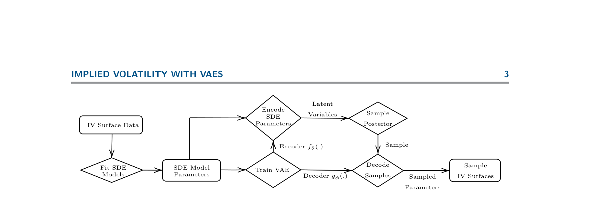
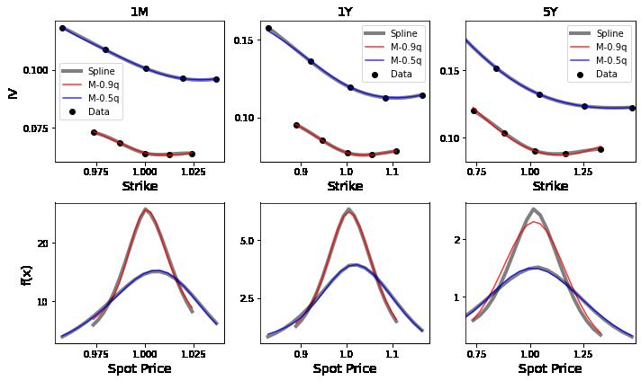
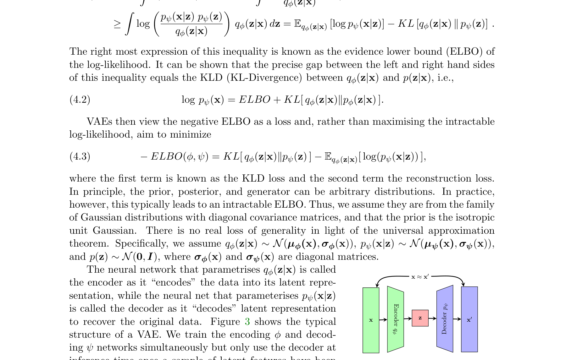
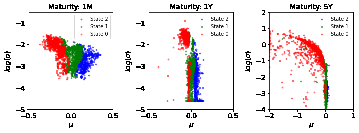
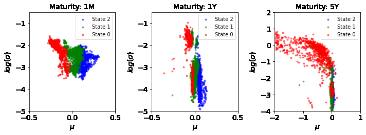
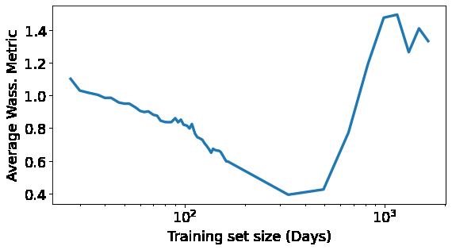
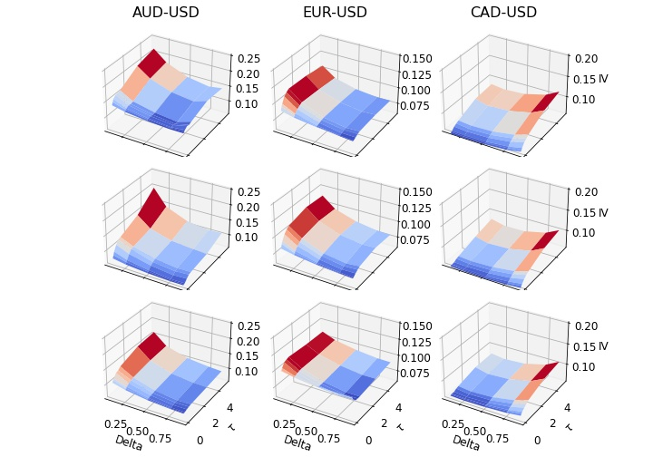
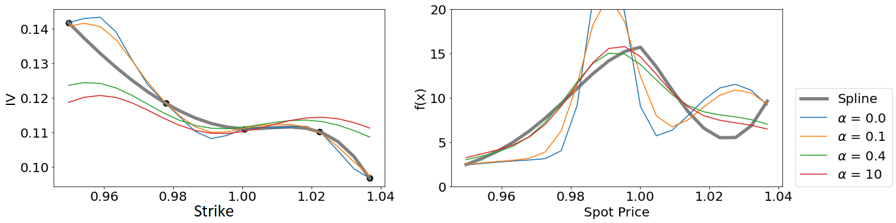

# arXiv:2108.04941v3 [q-fin.MF] 27 Jan 2022

## Metadata

- **Source File:** `2108.04941v3.pdf`
- **Authors:** Unknown
- **Year:** 2022
- **DOI:** Unknown

## Abstract

Not found.

## Main Text

Arbitrage-Free Implied Volatility Surface Generation
with Variational Autoencoders∗
Brian (Xin) Ning† , Sebastian Jaimungal† , Xiaorong Zhang† , and Maxime Bergeron‡
Abstract. We propose a hybrid method for generating arbitrage-free implied volatility (IV) surfaces consistent
with historical data by combining model-free Variational Autoencoders (VAEs) with continuous time
stochastic differential equation (SDE) driven models. We focus on two classes of SDE models: regime
switching models and L´evy additive processes. By projecting historical surfaces onto the space of
SDE model parameters, we obtain a distribution on the parameter subspace faithful to the data on
which we then train a VAE. Arbitrage-free IV surfaces are then generated by sampling from the
posterior distribution on the latent space, decoding to obtain SDE model parameters, and finally
## arXiv:2108.04941v3 [q-fin.MF] 27 Jan 2022
mapping those parameters to IV surfaces. We further refine the VAE model by including conditional
features and demonstrate its superior generative out-of-sample performance.
1. Introduction. Modelling implied volatility (IV) surfaces in a manner that reflects historical dynamics while remaining arbitrage-free is a challenging open problem in finance.
There are numerous approaches driven by stochastic differential equations (SDEs) that aim
to do just so, including local volatility models [13], stochastic volatility models [18, 17], stochastic local volatility models [29], jump-diffusion models [12], and regime switching models
[7], among many others. Such approaches make specific assumptions on the dynamics of the
underlying asset and a choice of an equivalent martingale measure in order to avoid arbitrage.
While these assumptions are not necessarily dynamically consistent with historical data, they
do allow, e.g., pricing exotic derivatives via Monte Carlo or PDE methods.
An alternative to the SDE approach is to use non-parametric models to approximate IV
surfaces directly without making assumptions on the underlying dynamics. For example, ML
models such as support vector machines (SVMs) have been used to model such surfaces [33].
The issue of ensuring arbitrage-free surfaces is often tackled jointly during model fitting [3]
either through penalisation of arbitrage constraints [1] or by directly encoding them into the
network architecture [34]. These approaches, however, typically do not provide any guarantees
and may not be arbitrage-free across the entire surface. A recent intriguing approach [11] is
to reduce surfaces to arbitrage-free ‘factors’ – learned, e.g., through principal component
analysis (PCA) – which can then be modeled using neural SDEs [26]. This approach, while
very promising, relies on the quality of the ‘factors’ which are often complicated to compute.
Another recent approach is that of [10] where the authors use Gaussian processes under shape
constraints to generate surfaces and illustrate good fits to S&P data. Here, however, we are
interested in the setting of sparse FX data and in generating the distribution over surfaces in
a manner that is consistent with the historical data. The construction of arbitrage-free models
based on ML approaches for stochastic interest rates has been tackled in [24]. In contrast, our
∗The authors thank Ivan Sergienko for his comments on earlier versions of this work. S.J. acknowledges the
support of the Natural Sciences & Engineering Research council of Canada [ALLRP 550308 - 20].
†Department
of
Statistical
Sciences,
University
of
Toronto
(brian.ning@mail.utoronto.ca,
sebastian.jaimungal@utoronto.ca; http://sebastian.statistics.utoronto.ca, xiaorong.zhang@mail.utoronto.ca)
‡Riskfuel Analytics (mb@riskfuel.com; http://riskfuel.com)
1

2
focus is on European options and, more specifically, our application setting is to FX options.
In this paper, we develop a hybrid approach to resolve these issues by using SDE models
that are by construction arbitrage-free yet flexible enough to fit arbitrary IV surfaces. One
immediate dividend of this approach lies in its ability to produce realistic synthetic training
data that can be used to leverage deep learning pricing methods in downstream tasks [15,
20].
The class of SDE models we consider include time-varying regime switching models
and L´evy additive processes detailed in Section 3. We avoid overfitting by incorporating a
Wasserstein penalty to keep the SDE model’s risk-neutral density from deviating too far from
the candidate one. The SDE model parameters, once fitted to data, represent a parameter
subspace reflecting the features embedded in the data.
The distribution on the subspace
depends on the characteristics of the underlying asset and can be complex. We “learn” this
distribution by using Variational Autoencoders (VAEs) which also allows for disentanglement
of the subspace in an interpretable manner. SDE model parameters may be generated from
the VAE model and used to create IV surfaces that are both faithful to the historical data but
also strictly risk-neutral. This is similar in spirit, but distinct from, the tangent L´evy model
approach introduced in [8] where a L´evy density is used to generate arbitrage-free prices while,
here, the VAE generates parameters of the SDE model.
The overall approach may be summarised as: (i) fit a rich arbitrage-free SDE model to
historical market data to obtain a collection of parameters, (ii) train a generative model, in
particular a VAE model, on the collection of SDE model parameters, (iii) sample from the
latent space of the generative VAE model, (iv) decode the samples to obtain a collection of
SDE model parameters, and (v) use said SDE model and parameters to obtain arbitrage-free
surfaces faithful to the historical data. A flow-chart of the process is presented in Figure 1.
We further refine the VAE model by including conditioning features into the encoding and
decoding architectures. This results in a conditional VAE (CVAE) model, first introduced in
[30] in a very different setting, for the arbitrage-free model parameter embeddings. We find
that the CVAE model outperforms all others when comparing out-of-sample performance.
The remainder of this article is organised as follows. Section 2 describes a generic method
of fitting SDE models to a limited data set. Section 3 defines the financial models we use in
calibration. Section 4.1 details the structure of the VAE and its generative process. Section 4.4
extends the VAE framework by conditioning prespecified features. Finally, Section 5 presents
the results of our algorithm applied to 1,900 days of foreign exchange (FX) data for three
currency pairs1: AUD-USD, EUR-USD, and CAD-USD.
2. Model Setup and Estimation Procedure. We work with a completed filtered probability space (Ω, Q, F, (Ft)t≥0) where the filtration is the natural one generated by a stochastic
driver X := (Xt)t≥0. We explore several choices of models for X in Section 3. Here, Q represents the risk-neutral probability measure and we assume that the market prices options
using this measure and model the FX rate process S = (St)t≥0 as follows:
R t
R t
s−rf
0 (rd
s ) ds+
0 l(s)ds+Xt,
∀t ≥0,
(2.1)
St = S0 e
1AUD = Australian Dollar, USD = US Dollar, and CAD = Canadian Dollar.

3
Latent
Encode
Sample
Variables
SDE
Parameters
Posterior
IV Surface Data
Sample
Encoder fθ(.)
Decode
Sample
SDE Model
Fit SDE
Train VAE
Parameters
Models
Samples
Decoder gφ(.)
IV Surfaces
Sampled
Parameters
Figure 1: Flow chart of algorithm starting from raw IV surface data to generated surfaces.
where rd := (rd
t )t≥0 and rf := (rf
t )t≥0 are the domestic and foreign short rate processes, and
R t
s−rf
0 (rd
s ) dsSt)t≥0 is a Q-martingale. We
l is a deterministic function of time that ensures (e−
assume interest rates are deterministic since there is no conceptual difficulty in generalising
to the stochastic case.
From, e.g., Theorem 3.2 in [25], we may write the undiscounted option price as
Z ∞
p
K ˜S0


dz
˜
S0
EQh
i
= ˜S0 −
ei z log
z −1
K φθ
(Sτ −K)+
R
(2.2)
2i
,
z2 + 1
π
0
4
R τ
R τ
s−rf
0 l(s)ds, φθ(z) := EQ[eizXτ ] is the characteristic function of Xτ, θ
0 (rd
where ˜S0 := S0 e
s ) ds+
encodes the parameters of the stochastic driver X, and R(·) denotes the real component of its
argument. For the class of SDE models considered here, the characteristic function is known
in closed form and the above formula allows for efficient calibration to market data.
A naive approach to parameter estimation is to minimise the squared error between the
model and data prices. Such parameter estimation is prone to overfitting when data is sparse
as is often the case in FX markets. To address this issue, we add a regularisation term to
our objective. Specifically, we use the 1-Wasserstein distance between the model price’s riskneutral probability distribution function (pdf), denoted F m
θ (dx), and the implied pdf derived
from option data, denoted F d(dx). Wasserstein distances provide a natural metric on the
space of probability measures and have seen wide application across many fields [32]. Other
choices include divergences, such as the Kullback-Liebler divergence, or metric variations such
as Jensen-Shannon divergence. We chose the Wasserstein distance in particular because it is
the most ubiquitous and robust.
To this end, the 1-Wasserstein distance between F d and F m
is given by
θ
W1(F d, F m
R |F d(x) −F m
R
R
R2 |x −y| dπ(x, y) =
θ (x)| dx,
(2.3)
θ ) =
inf
π∈Π(F d,F m
θ )
θ ) denotes the set of all probability distributions on R2 with marginals F d
where Π(F d, F m
and F m
and the second equality holds in dimension one [31]. As data is observed at discrete
θ
strikes, we approximate the candidate density by interpolating IVs at each fixed maturity
using B-splines. It is well known [6] that ∂KKC(T, K) corresponds to the risk-neutral density
of the underlying asset price evaluated at K. The derivation of the spline implied density
for the case of call options can be found in Appendix A. Since we are using a B-spline, the
corresponding density is not necessarily risk-neutral. This is not a problem, however, as we

4
merely use them as a regularisation term and ultimately use risk-neutral models to derive
option prices.
We use a combination of the pricing error and the Wasserstein distance (2.3) as the loss
function in model estimation. That is we seek to obtain model parameters
θ −Cd 2 + α PN
 Cm

n=1 W1(F d,(n), F m,(n)
θ∗:= argmin
(2.4)
)
,
θ
θ
where Cd and Cm
θ denotes the flattened vector of data and model prices, respectively, at each
strike-maturity pair, and F d,(n) and F m,(n)
represent the model and data implied distribution
θ
functions at each maturity, respectively. The regularisation parameter α ≥0 controls the importance placed on being close to the spline implied densities. The effect this hyperparameter
has on model accuracy is explored in detail in Appendix B.
3. Class of Stochastic Drivers. In this section, we describe the class of models over which
we perform estimation. Throughout, we denote the sequence of dates on which we have option
implied volatility data by {τ1, τ2, . . . , τ} and define τ0 = 0.
3.1. CTMC. The continuous time Markov-Chain model (CTMC) is a multi-regime model
that assumes the underlying asset follows a Geometric Brownian motion (GBM) modulated
by a continuous time Markov-Chain representing the current market regime. They were first
introduced into financial modelling in [7]. Here, however, we generalise the model to allow
for time-varying parameters and use transform methods in [21] to solve for the characteristic
function. We use this model as a non-parametric approach to modelling the sequence of riskneutral densities. The potential of overfitting of such models is mitigated by the Wasserstein
distance penalty in (2.3).
Let (Zt)t≥0 denote a continuous time Markov chain taking on values in K := {1 . . . K}.
Suppose, moreover, that the generator matrix A driving the CTMC, the regime specific vector
of drifts µ, and the regime specific vector of volatilities σ are all constant on the sequence of
maturity intervals [τi−1, τi), but may vary across maturity periods. We can then consider a
driving process X satisfying the SDE
Zt )2

2(σ(n)
dt + σ(n)
µ(n)
Zt −1
∀t ∈[τn−1, τ),
Zt dWt,
(3.1)
dXt =
where µ(n)
∈R and σ(n)
∈R+ denote the expected return and instantaneous volatility in
k
k
period n when Zt = k, k ∈K. Similarly, we let A(n) denote the transition rate matrix for
period n, satisfying A(n)
∈R+, i ̸= j, and PK
j=1 Aij = 0.
ij
Proposition 3.1. If X satisfies (3.1), then the characteristic function φXτ(ω) := EQ[eiω Xτ ]
is given by φX(ω) = π⊺eτ1Ψ(1)(ω)e(τ2−τ1)Ψ(2)(ω) . . . e(τ−τN−1)Ψ(N)(ω) 1, where πk = Q(Z0 = k) is
the prior probability of the latent state,
k)2ω2

A(n)
δjk + A(n)
[Ψ(n)(ω)]jk :=
µn
2(σn
k)2
2(σn
ω −1
k −1
jk (1 −δjk),
(3.2)
kk + i
and δjk is the Kroencker delta, which equals 1 if j = k and 0 otherwise.
Proof. See Appendix

5
Figure 2: Typical fits of the CTMC model to the IVs (top) and densities (bottom) of AUDUSD data with root mean squared error in the 50th (blue) and 90th (red) quantiles. Strike
ranges differ on different days.
To assist with identifiability when estimating the CTMC model parameters, we introduce
a cyclic structure on the transition rate matrices. More precisely, we require that A(n)
=
ij
2λ(n)
(δj=i+1 + δj=i−1), for all K > i > 1, A(n)
1,2 = A(n)
2λ(n)
1 , A(n)
K,1 = A(n)
2λ(n)
1
1,K = 1
K,K−1 = 1
K , and
i
λ(n)
> 0, together with the usual constraint that PK
j=1 Aij = 0, for all i ∈K.
i
Figure 2 shows the CTMC model fitted to two days of data including the corresponding
implied densities. The two specific days are chosen as they correspond to a root mean squared
error (rmse) that lie in the 50th and 90th quantiles of rmse across all days.
3.2. L´evy Additive Processes. For comparison, we also study a class of L´evy additive
processes to allow jumps in FX rates. To this end, we model X as
R t
R t
R
R y [µ(dy, ds) −ν(dy, ds)] +
(3.3)
Xt =
0 σs dWs,
0
where (σt)t≥0 is piecewise deterministic, σt := σ(n)1t∈[τn−1,τ), µ is a Poisson random measure
with compensator ν, and where ν(dy, ds) = 1t∈[τn−1,τ) ν(n)(dy) ds with ν(n)(dy) being L´evy
measures. This allows the structure of the L´evy measure to differ between maturity periods
and allows for both finite and infinite activity processes. For example, we may have ν(n)(dy) =
λ(n) F (n)(dy), in which case X is an additive compound Poisson process with jump measure


|y|1+Y 1x<0 + e−M y
e−G|y|
|y|1+Y 1x>0
F (n)(dy) and intensity λ(n), or ν(n)(dy) = C
dy in which case X
is additive version of a tempered stable L´evy measure (also known as the KoBol [5, 4] or
CGMY [9] models). There are a slew of alternate models as well, however, in the sake of
brevity we restrict to these two classes.
For the additive compound Poisson process, we


y−˜µ(n)
j=1 ˜π(n)
include two jump measure types: mixture of normals F (n)(dy) = PK
φ
dy,
k
k
˜σ(n)
k

6
Model
Characteristic Function
π⊺eτ1Ψ(1)(ω)e(τ2−τ1)Ψ(2)(ω) . . . e(τ−τN−1)Ψ(N)(ω)1
CTMC


−σ2ω2
a+
a−
a+−iω + (1 −p)
a−+iω −1
Double Exponential JD
+ λ
p
2

PK
σi2ω2/2) −1
−σ2ω2
µiω−˜
i=1 ˜πi(ei ˜
Gaussian Mixture JD
+ λ
2
CΓ(−Y )[(M −iω)Y −M Y + (G + iω)Y −GY ]
CGMY/KoBoL
Table 1: Summary of characteristic functions within a given maturity period.
where φ is the standard normal pdf – to mimick a non-parametric estimation of the jump
distribution implied by the data, and a double exponential model (see [23]), in which case
(1 −p(n)) e−a(n)
−|x|1x<0 + p(n) e−a(n)


+ x1x>0
F (n)(dy) =
dy.
Proposition 3.2. If X satisfies (3.3), then the characteristic function φX(ω) := EQ[eiω Xτ ]
PN
n=1 Ψ(n)(ω)(τ−τn−1), where
is given by φX(ω) = e
Z
eiωy −1 −iωy1|y|≤1
2 (σ(n))2 ω2 +
Ψ(n)(ω) = −1
ν(n)(dy) .

(3.4)
R
Proof. Apply the L´evy-Khintchine formula [2, Chap 1.2.4] within each period.
The specific form of the L´evy characteristic function appearing in (3.4) for the models we
employ in the numerical analysis appear in Table 1. The parameters for the appropriate period
should be inserted into these expression when computing the full characteristic function. We
also record the characteristic function for the CTMC model in the same table.
4. Model Parameter Generation. In the previous section, we described two classes of
stochastic models that can be calibrated to option prices. The SDE model parameters θ are
estimated by minimising a weighted average of the mean-squared error in option prices and
the Wasserstein distance between the model implied risk-neutral densities and the densities
implied by a B-spline fit of the IV smiles. Once the SDE model parameters are estimated
on market data, our goal is to generate new synthetic parameters θ that are consistent with
the historical data. This allows us to produce synthetic IV surfaces that are guaranteed to be
both arbitrage-free and representative of real surfaces.
4.1. Variational Autoencoder (VAE). Variational Autoencoders [22] are generative models that aim to train a multivariate latent representation, known as an encoding, from a collection of data. A key advantage of VAEs over conventional dimensionality reduction techniques
such as vanilla autoencoders (AEs), PCA, or KPCA is their ability to generalize the latent
feature space. A well-known issue of AEs is that the latent space may not be continuous and
may not exhibit any well defined structure. This makes it difficult to interpolate between
training data points and poses difficulties in generating new data, as demonstrated by [27]. In
[27], attempts to rectify such issues are made by regularizing the training procedure to ensure
the latent manifold is smooth and locally convex. VAEs, however, place a prior on the latent
feature and are thus able to easily generate out-of-sample data by sampling from either the
prior or the posterior, depending on the specific application.

7
Given a set of samples {xi | xi ∈RD}i≥1 from a distribution parameterized by ground
truth latent factors {zi | zi ∈RD′}i≥1 where D ≫D′ and a generative model pψ(x), we
seek to maximise the log-likelihood log pψ(x). The log-likelihood is, however, intractable as it
involves integration over the posterior pψ(z|x), which, even in setups where p(x|z) is specified,
is itself intractable. The VAE circumvents this issue by introducing an approximation of the
true posterior with a neural network qφ(z|x) parameterized by φ. Indeed, for any distribution
qφ(z|x), we have that the log-likelihood satisfies the inequality
Z pψ(x|z) pψ(z)
Z
pψ(x|z) pψ(z) dz = log
qφ(z|x) dz
log pψ(x) = log
qφ(z|x)
pψ(x|z) pψ(z)

Z
qφ(z|x) dz = Eqφ(z|x) [log pψ(x|z)] −KL [qφ(z|x) ∥pψ(z)] .
≥
log
qφ(z|x)
The right most expression of this inequality is known as the evidence lower bound (ELBO) of
the log-likelihood. It can be shown that the precise gap between the left and right hand sides
of this inequality equals the KLD (KL-Divergence) between qφ(z|x) and p(z|x), i.e.,
log pψ(x) = ELBO + KL[ qφ(z|x)∥pφ(z|x) ].
(4.2)
VAEs then view the negative ELBO as a loss and, rather than maximising the intractable
log-likelihood, aim to minimize
−ELBO(φ, ψ) = KL[ qφ(z|x)∥pψ(z) ] −Eqφ(z|x)[ log(pψ(x|z)) ],
(4.3)
where the first term is known as the KLD loss and the second term the reconstruction loss.
In principle, the prior, posterior, and generator can be arbitrary distributions. In practice,
however, this typically leads to an intractable ELBO. Thus, we assume they are from the family
of Gaussian distributions with diagonal covariance matrices, and that the prior is the isotropic
unit Gaussian.
There is no real loss of generality in light of the universal approximation
theorem. Specifically, we assume qφ(z|x) ∼N(µφ(x), σφ(x)), pψ(x|z) ∼N(µψ(x), σψ(x)),
and p(z) ∼N(0, I), where σφ(x) and σψ(x) are diagonal matrices.
The neural network that parametrises qφ(z|x) is called
x ≈x′
the encoder as it “encodes” the data into its latent representation, while the neural net that parameterises pψ(x|z)
Decoder pψ
is called the decoder as it “decodes” latent representation
Encoder qφ
z
x′
to recover the original data. Figure 3 shows the typical
x
structure of a VAE. We train the encoding φ and decoding ψ networks simultaneously but only use the decoder at
inference time once a sample of latent features have been
Figure 3: VAE architecture.
chosen.
As detailed in Section 4.3, however, the latent
sampling procedure makes use of the encoder.
4.2. β-VAE. The β-VAE [19] is a modification of the traditional VAE objective that
introduces an adjustable hyperparameter β > 0, precisely the ELBO is modified to
Eqφ(z|x)[log(p(x|z))] −β KL(qφ(z|x)∥p(z)).
(4.4)
argmax
φ,ψ

8
Larger values of β result in more disentangled latent representations z, while smaller values
result in more faithful reconstructions. β is often chosen to be greater than one to encourage
disentanglement; however, this constrains latent information z and can lead to poorer reconstructions [19]. Instead, we may choose smaller values of β to improve reconstructions and
rely on directly sampling from the posterior to accurately sample from the less structured
latent space.
4.3. Latent Sampling. Typically, samples from a VAE are generated by sampling from the
latent prior p(z) and decoding the result. From a Bayesian perspective, however, conditional
on a set of observed data X, it is more appropriate to sample from the posterior pψ(z|X) ≈
R
qφ(z|X) =
qφ(z|x)p(x)dx. While this integral is typically intractable, it is possible to sample
from. This can be done by first uniformly sampling from the data x0 ∼X, encoding using
the approximate posterior qφ(x0) to obtain the Gaussian parameters µφ(x0) and σφ(x0), and
finally sampling latent states from said Gaussian z0 ∼N(µφ(x0), σφ(x0)). This latent sample
z0 can then be decoded to obtain model parameters which may then be used to construct the
IV surface.
4.4. Conditional Variational Autoencoder (CVAE). A natural extension of the variational modeling framework is the inclusion of observable market features, such as indices or
spot rates. We may then generate surfaces conditional on the state of these features through
Conditional Variational Autoencoders (CVAEs) [30]. Such an approach may be used in risk
calculations in which scenarios for the conditional features are generated through other means,
and our approach used to generate IV surfaces conditioned on those simulated features.
In brief, a CVAE is constructed as follows. Given ground truth latent factors z, observations x, and conditional features y, we define the generative model pψ(x|y)p(y) where p(y) is
the prior on the conditional features. Following the same argument as in section 4.1 we approximate the posterior pψ(z|x, y) by a neural network qφ(z|x, y) and minimize the conditional
negative ELBO:
−ELBO(φ, ψ) = KL[ qφ(z|x, y)∥pψ(z|y) ] −Eqφ(z|x,y)[ log(pψ(x|z, y)) ].
(4.5)
This allows the conditioning feature y to modulate how data x gets encoded and how a latent
factor z gets decoded. In the results section, we include the VIX as a conditioning feature and
find that it improves the out of sample performance of the VAE model. In implementation,
the CVAE model is identical to the VAE model, except that the conditional features are added
into the encoding and decoding networks.
5. Results.
5.1. Market Data. We apply our hybrid method to IV data for three currency pairs
provided by Exchange Data International: AUD-USD, EUR-USD, and CAD-USD for the
1,900 days between September 18th, 2012 to December 30, 2019. The data is divided equally
into the training set (September 18th, 2012 to May 09, 2016) and the testing set (May 10,
2016 to December 30, 2019.) The data includes option prices with five strikes at each of eight
different maturities (1M, 2M, 3M, 6M, 9M, 1Y, 3Y, 5Y). Foreign exchange option prices are
quoted in terms of deltas rather than strikes and in terms of at-the-money call, risk reversal,

9
AUD-USD
EUR-USD
CAD-USD
CTMC
8.1
5.0
6.0
DE JD
62.0
42.9
64.2
GM JD
10.2
17.0
24.3
CGMY/KoBoL
140.2
151.3
136.2
Table 2: Median rmse (×10−5) for the collection of models and FX pairs.
and butterfly spread options, rather than simple calls.
We use standard formulas [28] to
convert raw quotes into IVs at deltas of 0.1, 0.25, 0.5, 0.75, and 0.9 for each maturity.
5.2. SDE Model Specifics. The CTMC model assumes three regimes with a Wasserstein’s
distance penalty2 of 0.3. To reduce the number of parameters to fit, initial regime probabilities
π are set to 1
3. To take advantage of the label invariance of the transition matrix, the mean
µ of each regime is assumed to be in ascending order, i.e., µn
1 ≤µn
2 ≤µn
3. The structure of
the transition matrix is detailed in Appendix D. We fit the CTMC model iteratively by first
optimizing for the parameters of the first maturity, then iteratively optimizing the parameters
of the i’th maturity by holding the parameters of the first (i−1) maturities fixed. For the L´evy
additive processes, we fit the parameters subject to a Wasserstein’s distance penalty of 0.1 for
time to maturity (TTM) less than 1 year and 0.3 otherwise to increase the regularising power
at larger TTM. Moreover, we apply a penalty of 10−8 on day-to-day parameter percentage
changes to stabilise model parameters without sacrificing fit quality. For the Gaussian Mixture
JD model, we assume a mixture of two Gaussians, as adding more factors did not increase the
fit quality. The penalty varies with maturity as long maturities tend to have stable pdfs but
less stable IVs, while shorter maturities tend to have less stable pdfs. Table 2 show the median
rmse across days, where the rmse on a given day is computed across all Delta/maturity pairs,
for the collection of models and FX pairs we study.
5.3. VAE Model Specifics. The encoder and decoder of the VAE have four fully connected hidden layers, with 64, 128, 256, and 512 nodes each, and a single output layer mapping to the appropriate dimensions. The network structure was selected using a validation
set, however, we found that any network exceeding four layers with a minimum of 64 node
in each layer is sufficient to produce satisfactory results. We used ADAM with weight decay
(AdamW) with a fixed learning rate of 0.001. Appropriate transformations (normalizations,
log-transforms) are performed to ensure standardized inputs. Details of the transformations
used can be found in Table 6 in Appendix E. We perform a grid search over β values and
number of latent dimensions summarized in Table 3. The table reports an evaluation metric
described in the next subsection. Training is carried out with batches of 200 randomly sampled days from the training set. We set a fixed training duration of 2, 000 epochs as we find
that is usually sufficient to train the β-VAE.
5.4. Benchmarks. We introduce three benchmarks to assess the performance of our approach. These benchmark models all generate distributions of IV surfaces (using only the
2The Wasserstein penalty for the various models are chosen from a grid search and balancing goodness of
fit to IV smiles with goodness of fit to the implied risk-neutral densities.

10
training data) that we use to assess how close they are to the testing data. Details on the
benchmarks themselves will be given below while the metric we use is described in the next
subsection.
The first is a β-VAE that is fit directly to the set of IVs on the fixed grid of delta and
time to maturity (as defined in Section 5.5) without the addition of any arbitrage constraints.
This technique is inspired by [3] (see also [34]), although they favor a flexible point-based
method where the inputs to the VAE are arbitrary strikes and times to maturity. Typically,
these point-based approaches are complemented by either penalizing deviations from (static)
arbitrage constraints during training or smoothing the resulting surfaces after generation.
However, [3] shows that arbitrage constraints do not enhance the fit and excluding them
introduces only negligible amounts of static arbitrage. In our context, the grid-based method
is more natural as our data is already structured in this fashion. For comparison purposes,
we present the result from a grid of latent dimensions and β’s consistent with those used for
our other approaches. We label this approach as VAE-IV.
As a second benchmark model, we perform a PCA on the trained CTMC model parameters
and sample from the dimensionally reduced latent submanifold using a kernel density estimator
(KDE). Several choices for the number of latent dimensions are explored in Table 3.
We
choose a Gaussian kernel with a bandwidth selected through 20-fold cross-validation. Gaussian
kernels are generally quite flexible, but other choices (such as Epanechnikov, Triweight, and
Triangular) are possible. For discussions on kernel and bandwidth selection more generally
see, e.g., [16]. This PCA approach serves as a simplification of our CTMC-VAE model where
the VAE sampler is replaced with a dimensionality reduction technique combined with a KDE
sampler.
As a final benchmark, we use the empirical distribution of the training data.
5.5. Evaluation Metric. Our goal is to generate arbitrage-free IV surfaces that are faithful
to the historical dataset. Here, we describe a natural metric that allows us to assess how well we
meet this goal. Let G and F denote the probability distribution over IV surfaces for the trained
model using the our algorithm and the true distribution, respectively. As Wasserstein distances
provide a natural metric on the space of probability measures, we use the 1-Wasserstein
distance between the trained and true distribution as our performance metric. While the true
distribution F is unknown, the data provides a finite sample from it at a set of discrete 2dimensional grid points Z := {zi}i∈G (the collection of Delta/TTM pairs which are observed).
Specifically, we look at the collection: Z = D × M where D := {0.1, 0.25, 0.50.75, 0.9} and
M := {1M, 2M, 3M, 6M, 9M, 1Y, 3Y, 5Y }. Further, the trained model’s distribution may be
estimated by sampling from the posterior distribution in latent space (using the method
described in Section 4.3) and decoding to produce SDE model parameters, which can be
mapped to a sample of IVs at the set of grid points Z. The 1-Wasserstein distance between
the true and the model’s distribution may be estimated by the 1-Wasserstein distance between
the multi-variate distribution of IVs at grid points Z for the test data and the model generated
ones. We refer to this quantity as the Wasserstein metric.
5.6. Results Summary. Table 3 shows a complete summary of the Wasserstein metric
computed for each currency pair on a range of β values and latent dimensions. Increasing
the number of latent dimensions does not generally increase performance. This suggests that

11
Latent Dimension
Model
AUD-USD
EUR-USD
CAD-USD
β
3
5
10
15
3
5
10
15
3
5
10
15
0.01
4.56
5.35
4.82
4.40
3.88
3.63
3.61
3.97
1.54
2.12
1.78
1.63
CTMC
0.1
4.32
5.83
4.54
4.62
3.18
3.29
3.62
2.77
1.81
1.53
1.40
1.34
1
4.67
4.43
4.13
3.69
3.64
3.94
3.12
3.62
1.72
1.55
1.48
1.70
10
6.10
5.92
6.40
5.63
4.00
3.59
3.86
3.90
2.98
2.96
3.17
3.06
0.01
5.13
5.37
5.30
4.66
3.52
3.79
3.88
3.69
1.61
1.76
1.96
2.09
0.1
4.61
5.29
5.04
4.41
4.58
3.96
3.69
3.87
1.51
1.95
1.50
1.47
DE
1
5.84
4.92
4.61
4.81
3.70
3.46
4.12
4.01
1.65
1.76
1.94
1.51
10
6.01
5.25
5.40
5.08
3.38
3.73
3.89
3.69
1.84
2.28
1.82
2.20
VAE
0.01
5.49
5.14
5.61
5.48
3.65
3.67
3.56
4.55
1.86
1.73
1.88
1.63
0.1
5.94
5.04
5.02
5.13
3.49
3.36
3.59
3.54
1.54
1.70
1.54
1.91
GM
1
5.15
5.27
5.00
5.83
4.01
3.49
3.96
3.30
2.11
2.28
1.93
1.62
10
5.72
5.56
4.83
5.26
3.22
3.15
3.73
3.27
1.81
1.70
2.03
2.11
0.01
5.86
6.11
5.80
5.53
3.58
3.36
3.94
4.02
2.33
2.08
1.85
1.94
CGMY/
KoBoL
0.1
6.12
6.37
5.99
5.65
3.68
4.17
3.92
3.56
2.19
1.85
2.06
2.08
1
6.54
6.43
6.17
6.22
3.58
3.79
3.94
3.88
2.09
2.34
1.97
2.28
10
5.96
5.97
5.90
6.20
4.01
3.84
4.31
4.21
2.16
2.24
2.21
2.61
0.01
6.07
6.16
6.06
6.26
3.55
4.17
4.05
3.65
1.65
1.61
1.62
1.64
0.1
6.22
6.34
5.87
5.86
3.94
3.61
3.44
4.04
1.68
1.44
1.59
1.86
IV
1
6.43
6.55
6.05
5.60
3.88
4.14
4.11
4.08
2.05
1.97
1.83
1.79
10
6.23
6.21
6.16
6.11
4.37
4.14
3.88
4.28
1.82
1.76
2.32
1.75
PCA
5.25
5.34
7.15
8.38
2.51
3.00
3.5
6.15
2.22
1.73
2.40
2.76
Empirical
5.82
5.82
5.82
5.82
3.83
3.83
3.83
3.83
1.67
1.67
1.67
1.67
Table 3: Wasserstein metrics (×10−2) for varying levels of β, latent dimensionality, and currency pair. Three benchmarks are shown here for reference: the Wasserstein metric (×10−2)
between the test set and the VAE-IV, PCA, and training empirical models as described in
Section 5.4. Bold numbers are the smallest metric within each subgrid.
for these currency pairs, most surfaces can be captured with as few as three factors when
viewed holistically. However, it does appear that the optimal hyperparameter pair are often
at somewhat higher latent dimensions (≥10) which is natural when there are no penalizations
on dimensionality. Interestingly, for both classes of SDE models, decreasing β does not lead to
significantly worse performance. This is an indication that the posterior sampling from Section
4.3 performed admirably in highly unstructured latent spaces, which is a by-product of low
β values. For the three L´evy additive processes explored here, the double exponential model
performs the best but it is generally worse performing than the CTMC model. Moreover, the
CTMC is able to significantly outperform most of the benchmark methods.
Overall, the results show that our generated surfaces are as close to the testing data’s distribution as the training set itself! This suggests that to improve our model’s performance we
need to include additional explanatory features (Section 5.7) or perhaps a temporal structure.
Figure 4 shows a comparison between (a) the CTMC parameters obtained by fitting to
test data, and (b) random samples from the corresponding VAE model. We focus on the two
most important parameters µ and σ (which are state and maturity specific) of the CTMC
model. We select three maturities 1M, 1Y, and 5Y to succinctly illustrate the results. Ideally,
this comparison would be made using the IV surfaces directly implied by the the parameters;
however, no good visualization is available for such comparisons. Instead, we illustrate the
similarity of the generated and test data distributions using the model parameters. The figure
showcases the VAE’s ability to capture the complex structures of the CTMC model parameters

12
(a) Testing Parameters
(b) Generated Parameters
Figure 4: Scatter plots of the three regime specific µ and σ from (a) fitting to test data, and
(b) random sample from the generative model, using the CTMC model on AUD-USD data.
Colours represent three different regimes.
which in turn is used to generate the final implied volatility surfaces. As the figure shows, the
VAE successfully captures the various complex structures that are inherent in the test data
across all maturities and states.
Next, we investigate the impact the training window has on our results. To this end, Figure
5 summarizes how the length of the training set affects the Wasserstein metric between the
testing data and the CTMC-VAE model. The score is computed as the average Wasserstein
metric, using a randomly generated sample of 500 surfaces and a predefined testing set, across
sixteen different sets of hyperparameters as described in Table 3. The testing data is fixed to
be the period from January 15th, 2019 to December 30th, 2019. Here, we reduced the size of
the test set in order to illustrate how the size of the training set may both improve and worsen
the model’s performance. The ending date of the training data is fixed to be January 14th,
2019, while the starting date ranges from September 18th, 2012 to December 5th, 2018. The
figure suggests that approximately 350 days of data is sufficient to fully train the network.
The average score increases as the training set size is reduced beyond this point. In contrast,
larger time horizon training sets typically produce worse scores as the training set becomes
less representative of the current state of the market. This leads to a generative model that

13
Figure 5: Average scores of the CTMC model when trained on a range of different sized
training sets and tested on the period from January 15th, 2019 to December 30, 2019.
may be historically accurate but does not reflect the data in the near future.
While we show the sampling of model parameters in Figure 4, it is informative to generate
surfaces themselves. For this purpose, we show three randomly generated surfaces from each
of the three currency pairs in Figure 6. There are clear differences between the surfaces for a
specific currency pair, however, the general characteristics (skew, level and smile) are similar
for a fixed pair. This demonstrates the model’s ability to capture the innate characteristics of
each currency pair but still faithfully respect the observed variation between random samples.
5.7. CVAE Results. To test the efficacy of the CVAE approach, we focus on using the
daily closing CBOE Volatility Index (VIX) as a predictor for generating IV surfaces in the
testing set, courtesy of Wharton Data Services [14]. Specifically, we train the CVAE on several
currency pairs conditional on the end-of-day VIX index value. We then condition on the value
of the VIX index for each day in the testing set to generate surfaces by randomly sampling from
the latent space as specified in section 4.3. Table 5 in the Appendix details the results while
Table 4 summarizes the comparison between the CVAE, CTMC-VAE, and the benchmarks
described in Section 5.4. We train our model using the same training set as in Section 5. The
results in the table show that the VIX index has significant predictive power on IV surfaces,
as the generated surfaces conditional on the VIX index produces significantly smaller metric
compared to both the unconditional CTMC-VAE and all benchmark approaches.
6. Conclusions. Overall, the results show that our generated surfaces are as close to the
testing data’s distribution as the training set itself! This suggests that to improve our model’s
performance we need to include additional explanatory features (Section 5.7) or perhaps a
temporal structure.
To summarise, we propose a hybrid approach for generating synthetic IV surfaces by first
calibrating SDE model parameters to historical data – using a Wasserstein penalty between
the implied model risk-neutral distribution and that induced by option data as a regularisation
term – and then training a rich VAE model to learn the distribution on the space of SDE
model parameters.
We show that the distribution of IV surfaces from the VAE model is
capable of generating surfaces as close to the testing data’s distribution as the training set
itself, and performs well in comparison with several benchmarks, while ensuring the generated

14
Figure 6: Sample of three randomly generated surfaces using the CTMC-VAE for each of the
three currency pairs.
Latent Dimension
AUD-USD
EUR-USD
CAD-USD
Model
3
5
10
15
3
5
10
15
3
5
10
15
CTMC-CVAE
3.24
3.65
3.35
3.70
2.64
2.72
2.75
2.76
1.47
1.38
1.26
1.37
CTMC-VAE
4.91
5.38
4.97
4.59
3.68
3.61
3.55
3.57
2.01
2.04
1.96
1.93
IV-VAE
6.24
6.32
6.04
5.96
3.94
4.01
3.87
4.02
1.80
1.69
1.84
1.76
PCA
5.25
5.34
7.15
8.38
2.51
3.00
3.50
6.15
2.22
1.73
2.40
2.76
Empirical
5.82
5.82
5.82
5.82
3.83
3.83
3.83
3.83
1.67
1.67
1.67
1.67
Table 4: Average Wasserstein’s metric (×10−2) across all β values for different number of
latent dimensions used for the CTMC-CVAE, CTMC-VAE, and benchmarks models IV-VAE,
PCA, and Empirical for three currency pairs.
surfaces are arbitrage-free.
A short demo of the CTMC model and VAE model fitting procedure are available3 at:
https://github.com/BrianNingUT/ArbFreeIV-VAE.
3Please note that some notebooks require significant run time due to the adaption of C++ to Python.

15
REFERENCES
[1] D. Ackerer, N. Tagasovska, and T. Vatter, Deep smoothing of the implied volatility surface, in
Proceedings of the 34th Conference on Neural Information Processing Systems (NeurIPS 2020), 2020.
[2] D. Applebaum, L´evy processes and stochastic calculus, Cambridge university press, 2009.
[3] M. Bergeron, N. Fung, Z. Poulos, J. C. Hull, and A. Veneris, Variational autoencoders: A
hands-offapproach to volatility, Available at SSRN 3827447, (2021).
[4] S. Boyarchenko and S. Z. Levendorskii, Non-Gaussian Merton-Black-Scholes Theory, vol. 9, World
Scientific, 2002.
[5] S. I. Boyarchenko and S. Z. Levendorskiˇı, Option pricing for truncated l´evy processes, International
journal of theoretical and applied finance, 3 (2000), pp. 549–552.
[6] D. T. Breeden and R. H. Litzenberger, Prices of state-contingent claims implicit in option prices,
Journal of business, (1978), pp. 621–651.
[7] J. Buffington and R. J. Elliott, Regime switching and european options, in Stochastic Theory and
Control, Springer, 2002, pp. 73–82.
[8] R. Carmona and S. Nadtochiy, Tangent l´evy market models, Finance and Stochastics, 16 (2012),
pp. 63–104.
[9] P. Carr, H. Geman, D. B. Madan, and M. Yor, The fine structure of asset returns: An empirical
investigation, The Journal of Business, 75 (2002), pp. 305–332.
[10] M. Chataigner, A. Cousin, S. Cr´epey, M. Dixon, and D. Gueye, Short communication: Beyond
surrogate modeling: Learning the local volatility via shape constraints, SIAM Journal on Financial
Mathematics, 12 (2021), pp. SC58–SC69, https://doi.org/10.1137/20M1381538, https://doi.org/10.
1137/20M1381538, https://arxiv.org/abs/https://doi.org/10.1137/20M1381538.
[11] S. N. Cohen, C. Reisinger, and S. Wang, Arbitrage-free neural-sde market models, arXiv e-prints,
(2021), pp. arXiv–2105.
[12] R. Cont and P. Tankov, Calibration of jump-diffusion option pricing models: a robust non-parametric
approach, https://ssrn.com/abstract=332400, (2002).
[13] B. Dupire et al., Pricing with a smile, Risk, 7 (1994), pp. 18–20.
[14] C. B. O. Exchange, Measure market expectations of near-term volatility conveyed by s&p 500 stock
index option prices., tech. report, Wharton Research Data Services, 2020.
[15] R. Ferguson and A. Green, Deeply learning derivatives, arXiv preprint arXiv:1809.02233, (2018).
[16] A. Gramacki, Nonparametric kernel density estimation and its computational aspects, Springer, 2018.
[17] P. S. Hagan, D. Kumar, A. S. Lesniewski, and D. E. Woodward, Managing smile risk, Wilmott
Magazine, 1 (2002), pp. 249–296.
[18] S. L. Heston, A closed-form solution for options with stochastic volatility with applications to bond and
currency options, The review of financial studies, 6 (1993), pp. 327–343.
[19] I. Higgins, L. Matthey, A. Pal, C. Burgess, X. Glorot, M. Botvinick, S. Mohamed, and
A. Lerchner, Beta-VAE: Learning basic visual concepts with a constrained variational framework,
5th International Conference on Learning Representations, ICLR, (2016).
[20] B. Horvath, A. Muguruza, and M. Tomas, Deep learning volatility, arXiv preprint arXiv:1901.09647,
(2019).
[21] K. R. Jackson, S. Jaimungal, and V. Surkov, Fourier space time-stepping for option pricing with
l´evy models, Journal of Computational Finance, 12 (2008), p. 1.
[22] D. P. Kingma and M. Welling, Auto-encoding variational Bayes, arXiv preprint arXiv:1312.6114,
(2013).
[23] S. G. Kou and H. Wang, Option pricing under a double exponential jump diffusion model, Management
science, 50 (2004), pp. 1178–1192.
[24] A. Kratsios and C. Hyndman, Deep arbitrage-free learning in a generalized hjm framework via
arbitrage-regularization, Risks, 8 (2020), p. 40.
[25] A. L. Lewis, A simple option formula for general jump-diffusion and other exponential l´evy processes,
Available at SSRN 282110, (2001).
[26] X. Li, T.-K. L. Wong, R. T. Chen, and D. Duvenaud, Scalable gradients for stochastic differential
equations, in International Conference on Artificial Intelligence and Statistics, PMLR, 2020, pp. 3870–
3882.

16
[27] A. Oring, Z. Yakhini, and Y. Hel-Or, Autoencoder image interpolation by shaping the latent space,
arXiv preprint arXiv:2008.01487, (2020).
[28] D. Reiswich and W. Uwe, Fx volatility smile construction, Wilmott, 2012 (2012), pp. 58–69.
[29] K. Said, Pricing exotics under the smile, RISK, 12 (1999), pp. 72–75.
[30] K. Sohn, H. Lee, and X. Yan, Learning structured output representation using deep conditional generative models, Advances in neural information processing systems, 28 (2015), pp. 3483–3491.
[31] S. Vallender, Calculation of the wasserstein distance between probability distributions on the line, Theory of Probability & Its Applications, 18 (1974), pp. 784–786.
[32] C. Villani, Optimal transport: old and new, vol. 338, Springer, 2009.
[33] Y. Zeng and D. Klabjan, Online adaptive machine learning based algorithm for implied volatility surface
modeling, Knowledge-Based Systems, 163 (2019), pp. 376–
391.
[34] Y. Zheng, Y. Yang, and B. Chen, Gated deep neural networks for implied volatility surfaces, arXiv
preprint arXiv:1904.12834, (2019).
Appendix A. Candidate Risk Neutral Density.
Foreign exchange data is often quoted only at specific strikes/deltas. In order to reduce
the possibility of overfitting, we introduce a candidate risk neutral density which we attempt
to minimize the 1-Wasserstein distance to. We can approximate this candidate density by
interpolating implied volatilities at each fixed maturity using B-splines. It is important to
note that as this is simply a candidate density derived from a spline interpolation of the IV
surface, it provides no guarantee on risk-neutrality.
Let us define such an interpolated surface by σ(K, τ). The price using this implied volatility may be written in terms of the Black-Scholes price of a call option with spot price S0,
strike K, maturity τ, and risk-neutral interest rate r as
C(S0, K, τ, r) = S0 Φ(d+(K, τ)) −e−rτ K Φ(d−(K, τ)),
(A.1)
1
S0
d±(K, τ) =
2σ2(K, τ))τ
+ (r ± 1


σ(K, τ)√τ
(A.2)
log
.
K
It is well known [6] that, in an arbitrage-free model, ∂KKC(S0, K, τ) corresponds to the
risk-neutral density of the underlying asset price evaluated at K. Thus, we can simply take
the second derivative of A.1 to find the implied density.
To compute this density, for a fixed τ, we may consider all but K fixed and constant.
As we use a spline representation of the implied volatility we may evaluate the candidate
risk-neutral density at any point within the range of available values of K. For simplicity, we
set r = 0, and drop the dependence of d±(K, τ) on τ. Thus,
(A.3)


¯d+(K)
 ¯d+′(K)
¯d−(K)
¯d−(K)
 ¯d−′(K)


∂
∂




−
∂2K C(S0, K, τ) = S0
φ
Φ
+ K φ
∂K


|
{z
}
|
{z
}


:=t1(K)
:=t2(K)
Focusing on the remaining derivatives, we have
¯d+(K)
 ¯d+′(K)2 + φ
¯d+(K)
 ¯d+′′(K)
∂
∂K t1(K) = −¯d+(K)φ
(A.4a)
¯d−(K)
 ¯d−′(K) −Kφ
¯d−(K)
  ¯d−(K) ¯d−′(K)2 −¯d−′′(K)
∂

(A.4b)
∂K t2(K) = 2 φ

17
Figure 7: Fits of the CTMC model to the first maturity (1M) of a particular day (2012-05-16)
at varying level of the regularizer α. The left panel showcases the fits to the IV surface and
the right panel the corresponding risk-neutral density.
and
Kσ(K)√τ + log(K) σ′(K)
2σ′(K)√τ
−1
+ 1
¯d+′(K) =
σ2(K)√τ
(A.4c)
¯d−′(K) = ¯d+′(K) −σ′(K)√τ
(A.4d)
¯d+′′(K) = σ(K) + 2Kσ′(K)
+ log(K) σ(K) σ′′(K) + 2 log(K) σ′(K)
2σ′′(K)√τ
+ 1
(K)2 σ2(K)√τ
σ3(K)√τ
(A.4e)
¯d−′′(K) = ¯d+′′(K) −σ′′(K)√τ .
(A.4f)
As we use splines for σ(K), putting these computations together with (A.3) provides us with
the candidate risk-neutral density which we use to regularise the implied volatility fits to.
Appendix B. Effect of α.
The parameter α serves as a regularising term to prevent
overfitting when the data points in the delta axis are sparse. Figure 7 shows its effects. We
have chosen a day that is particularly difficult to fit to exhibit the effects of α. Large values of
α (green) correspond to smoother risk-neutral density curves that only deviate slightly from
the non-risk-neutral density implied by the spline interpolation at the cost of significantly
poor fits to the IV surfaces. In contrast, smaller values of α (blue) typically correspond to
rougher risk-neutral densities that often lead to rougher IV surfaces that over-fit to the small
number of IV points available. Often, the middle ground (orange), which correctly balances
both accuracy and smoothness, is required. In practice, candidate back-testing can determine
the optimal choice. We employ a grid search and balance goodness of fit to IV smiles with
goodness of fit to the implied risk-neutral densities. For different models, different optimal α
are obtained, details are found in Section 5.2. It is important to note that the spline implied
density (grey) is not guaranteed to be risk-neutral and, thus, a perfect fit to such densities is
sometimes impossible despite choosing a large value of α.
Appendix C. Proofs.
Proof of Proposition 3.1. Denote vt := EQ[eizXτ |Ft]. As (X, Z) is Markov, there exists a
function v : K×R+×R →R, such that vt = vZt(t, Xt). Moreover, applying the Feynman-Kac

18
theorem, we have that the function vk(t, x) satisfies the coupled system of PDEs


∂t + (A(n)
A(n)
X
kk + Lk(n))
vk(x, t) +
kj vj(x, t) = 0,
∀t ∈[τn−1, τ), n ∈N, k ∈K,
(C.1)
j̸=k
vk(τ, x) = eiz x, and Lk denotes the infinitesimal
subject to the terminal condition (t.c.)
generator, given Zt = k, which acts upon twice differentiable functions as follows
Lk(n)f(x) =
µn
2(σn
k)2
2(σn
k)2∂xxf(x) .
k −1
∂xf(x) + 1
(C.2)
To solve the coupled system of PDEs (C.1), we apply the Fourier transform defined
R ∞
as ˆf(ω) = F[f](ω) :=
−∞eiωxf(x) dx to both sides of (C.1).
Recall that F[∂n
xf](ω) =
](ω) = · · · = (iω)n F[f](ω). Thus,
i ω F[∂n−1
x
F[Lk(n)vk](ω, t) =
µn
2(σn
k)2
2(σn
k)2ω2
F[vk](ω, t).
k −1
ω −1
(C.3)
i
Using the above, and denoting ˆvk = F[vk], (C.1) may be written in Fourier space as
h
i
∂t + A(n)
A(n)
X
kk + γn
ˆvk(t, ω) +
kj ˆvj(t, ω) = 0 ,
∀t ∈[τn−1, τ), n ∈N, k ∈K,
(C.4)
k (ω)
j
k)2ω2 and D is the
k −1
ω −1
µn
s.t. the t.c. vk(τ, x) = D(z −ω), where γn
k)2
2(σn
2(σn
k (ω) := i
Dirac delta function. We may further rewrite this system of equations in matrix notation by


A(n)
δjk +A(n)
(i) defining the matrix Ψn(ω) whose entries are [Ψ(ω)]jk =
kk + γn
jk (1−δjk)
k (ω)
where δjk is the Kroencker delta, and (ii) defining the vector of transformed prices ˆv(t, ω) =
(ˆv1(t, ω), . . . , ˆvK(t, ω))⊺. Thus, (C.4) may be written as a vector-valued ODE
∀t ∈[τn−1, τ), n ∈N,
(C.5)
(∂t + Ψ(ω))ˆv(t, ω) = 0 ,
ˆv(τ, ω) = D(ω −z) 1.
s.t.
the t.c.
This system may be solved explicitly by backward
induction. For t ∈[τN−1, τ) (the last period), the matrix ODE admits the solution ˆv(t, ω) =
e(τ−t)Ψ(ω)1 ˆϕ(ω) . Next, due to continuity, we have that ˆv(τN−1, ω) = limt↓τN−1 ˆv(t, ω) =
e(τ−τN−1)Ψ(ω)1 ˆϕ(ω). Using this limit as the t.c. at t = τN−1, for t ∈(τN−2, τN−1], we solve
(∂t + ΨN−1(ω))ˆv(t, ω) = 0, which admits the solution
ˆv(t, ω) = e(τN−1−t)ΨN−1(ω)e(τ−τN−1)Ψ(ω)1 D(ω −z).
Continuing iteratively, we obtain Continuing iteratively we arrive at
ˆv(0, ω) = eτ1Ψ1(ω)e(τ2−τ1)Ψ2(ω) . . . e(τ−τN−1)Ψ(ω)1 D(ω −z) .
(C.6)
Averaging over the prior π on Z0, and taking the Fourier inverse (which is trivial due to the
Dirac delta function), we obtain the stated result.
Appendix D. Structure of the A matrix.
We assume each state k has its corresponding
rate parameter λk which determines the rate at which the chain will move out of the state.
For any state 1 ≤k ≤K, the chain has an equal chance of moving into the state below (k −1)

19
Latent Dimension
AUD-USD
EUR-USD
CAD-USD
Model
β
3
5
10
15
3
5
10
15
3
5
10
15
0.01
3.47
4.11
3.41
3.94
3.19
3.17
3.34
3.16
1.63
1.34
1.12
1.38
0.1
3.54
3.47
3.46
4.18
2.90
3.58
3.11
3.12
1.08
1.13
1.08
1.22
CTMC-CVAE
1
3.99
3.90
3.27
3.49
2.48
2.23
2.55
2.81
1.18
1.06
1.13
0.91
10
2.97
3.14
3.26
3.18
1.96
1.89
2.00
1.96
2.00
2.00
1.72
1.96
0.01
4.56
5.35
4.82
4.40
3.88
3.63
3.61
3.97
1.54
2.12
1.78
1.63
0.1
4.32
5.83
4.54
4.62
3.18
3.29
3.62
2.77
1.81
1.53
1.40
1.34
CTMC-VAE
1
4.67
4.43
4.13
3.69
3.64
3.94
3.12
3.62
1.72
1.55
1.48
1.70
10
6.10
5.92
6.40
5.63
4.00
3.59
3.86
3.90
2.98
2.96
3.17
3.06
0.01
6.07
6.16
6.06
6.26
3.55
4.17
4.05
3.65
1.65
1.61
1.62
1.64
0.1
6.22
6.34
5.87
5.86
3.94
3.61
3.44
4.04
1.68
1.44
1.59
1.86
IV-VAE(B)
1
6.43
6.55
6.05
5.60
3.88
4.14
4.11
4.08
2.05
1.97
1.83
1.79
10
6.23
6.21
6.16
6.11
4.37
4.14
3.88
4.28
1.82
1.76
2.32
1.75
CTMC-PCA(B)
5.25
5.34
7.15
8.38
2.51
3.00
3.50
6.15
2.22
1.73
2.40
2.76
Empirical (B)
5.82
5.82
5.82
5.82
3.83
3.83
3.83
3.83
1.67
1.67
1.67
1.67
Table 5: Wasserstein metrics (×10−2) for varying levels of β, latent dimensionality, and
currency pair using the CVAE with the CTMC model with VIX as predictor compared with
the vanilla CTMC-VAE and benchmark approaches (B) IV-VAE and CTMC-PCA trained on
the period from September 18th, 2012 to May 09, 2016. The Wasserstein metric (×10−2)
between the training and tests sets (Empirical) are presented here for reference.
or above (k + 1). We further assume that states form a cyclical graph so that state 1 may
transition to state K, and vice versa. Any other transitions will have probability 0. This
restricts the process to only being able to move through one state at a time without jumping.
All together, this creates a generator matrix of the form:


λn
λn
−λn
0
. . .
1
1
1
2
2


λn
λn
−λn
0
. . .
2
2
2
2
2
...
...
An =
(D.1)
λn
λn
−λn
K−1
K−1
. . .
0
K−1
2
2
λn
λn
−λn
. . .
0
K
K
K
2
2
which reduces the number of parameters needed to be estimated at each given maturity
to 3K (K from σ, K from µ, and K from λ) excluding the vector of initial probabilities, where
K is the number of possible states of the system.
Appendix E. Additional Tables and Figures.

20
Model
Parameter
Transforms
None 1
π1 . . . π3
µi−¯µ(µi)
µ1 . . . µ3
s(µi)
CTMC
log(σi)−¯µ(log(σi))
σ1 . . . σ3
s(log(σi))
log(λi)−¯µ(log(λi))
λ1, . . . λ3
s(log(λi))
log(σ)−¯µ(log(σ))
σ
s(log(σ)
λi−¯µ(λi)
λ
s(λi)
DE-JD


˜p−¯µ(˜p)
p
p
s(˜p) ,
˜p = log
1−p
a1−¯µ(a1)
a1
s(a1)
a2−¯µ(a2)
a2
s(a2)
log(σ)−¯µ(log(σ))
σ
s(log(σ)
λi−¯µ(λi)
λ
s(λi)
GM-JD
log(ηi)−¯µ(log(ηi))
η1 = 1, η2 = ˜π2
˜π1, ˜π2
,
˜π1 . . .
s(log(ηi)
˜µi−¯µ(˜µi)
˜µ1, ˜µ2
s(˜µi)
log(˜σi)−¯µ(log(˜σi))
˜σ1, ˜σ2
s(log(˜σi))
log(C)−¯µ(log(C)))
C
s(log(C))
log(G)−¯µ(log(G)))
G
s(log(G))
CGMY/KoBoL
log(M)−¯µ(log(M)))
M
s(log(M))
log(Y )−¯µ(log(Y )))
Y
s(log(Y ))
Table 6: Normalizations performed on model parameters before
input into VAE. ¯µ(·) and s(·) are the empirical mean and standard
deviation respectively.
1 π1 = π2 = π3 = 1
3

## Tables

### Table 1

*Caption:* Table 1: Summary of characteristic functions within a given maturity period.

| 6 |  | NING, JAIMUNGAL, ZHANG, BERGERON |
| --- | --- | --- |
|  | Model | Characteristic Function |
|  | CTMC | π(cid:124)eτ1Ψ(1)(ω)e(τ2−τ1)Ψ(2)(ω) . . . e(τ −τN −1)Ψ(N )(ω)1 |
|  |  | (cid:16) (cid:17) |
|  |  | a+ a− − σ2ω2 |
|  |  | 2 a+−iω + (1 − p) a−+iω − 1 |
|  |  | (cid:16)(cid:80)K |
|  |  | 2ω2/2) − 1 − σ2ω2 |
|  | Gaussian Mixture JD | + λ i=1 ˜πi(ei ˜µiω− ˜σi 2 |
|  | CGMY/KoBoL | CΓ(−Y )[(M − iω)Y − M Y + (G + iω)Y − GY ] |

Raw CSV: `assets/table_001.csv`

### Table 2

*Caption:* Table 2: Median rmse (×10−5) for the collection of models and FX pairs.

| IMPLIED VOLATILITY WITH VAES |  |  |  | 9 |
| --- | --- | --- | --- | --- |
|  | AUD-USD | EUR-USD | CAD-USD |  |
| CTMC | 8.1 | 5.0 | 6.0 |  |
| DE JD | 62.0 | 42.9 | 64.2 |  |
| GM JD | 10.2 | 17.0 | 24.3 |  |
| CGMY/KoBoL | 140.2 | 151.3 | 136.2 |  |

Raw CSV: `assets/table_002.csv`

### Table 3

*Caption:* Table 3: Wasserstein metrics (×10−2) for varying levels of β, latent dimensionality, and currency pair. Three benchmarks are shown here for reference: the Wasserstein metric (×10−2)

| IMPLIED VOLATILITY WITH VAES |  |  |  |  |  |  |  |  |  |  |  |  |  | 11 |
| --- | --- | --- | --- | --- | --- | --- | --- | --- | --- | --- | --- | --- | --- | --- |
|  |  |  |  |  |  |  | Latent Dimension |  |  |  |  |  |  |  |
|  | Model |  |  | AUD-USD |  |  |  | EUR-USD |  |  | CAD-USD |  |  |  |
|  | β | 3 | 5 | 10 | 15 | 3 | 5 | 10 | 15 | 3 | 5 | 10 | 15 |  |
|  | 0.01 | 4.56 | 5.35 | 4.82 | 4.40 | 3.88 | 3.63 | 3.61 | 3.97 | 1.54 | 2.12 | 1.78 | 1.63 |  |
|  | 0.1 | 4.32 | 5.83 | 4.54 | 4.62 | 3.18 | 3.29 | 3.62 | 2.77 | 1.81 | 1.53 | 1.40 | 1.34 |  |
|  | CTMC 1 | 4.67 | 4.43 | 4.13 | 3.69 | 3.64 | 3.94 | 3.12 | 3.62 | 1.72 | 1.55 | 1.48 | 1.70 |  |
|  | 10 | 6.10 | 5.92 | 6.40 | 5.63 | 4.00 | 3.59 | 3.86 | 3.90 | 2.98 | 2.96 | 3.17 | 3.06 |  |
|  | 0.01 | 5.13 | 5.37 | 5.30 | 4.66 | 3.52 | 3.79 | 3.88 | 3.69 | 1.61 | 1.76 | 1.96 | 2.09 |  |
|  | 0.1 | 4.61 | 5.29 | 5.04 | 4.41 | 4.58 | 3.96 | 3.69 | 3.87 | 1.51 | 1.95 | 1.50 | 1.47 |  |
|  | DE 1 | 5.84 | 4.92 | 4.61 | 4.81 | 3.70 | 3.46 | 4.12 | 4.01 | 1.65 | 1.76 | 1.94 | 1.51 |  |
|  | 10 | 6.01 | 5.25 | 5.40 | 5.08 | 3.38 | 3.73 | 3.89 | 3.69 | 1.84 | 2.28 | 1.82 | 2.20 |  |
| VAE | 0.01 | 5.49 | 5.14 | 5.61 | 5.48 | 3.65 | 3.67 | 3.56 | 4.55 | 1.86 | 1.73 | 1.88 | 1.63 |  |
|  | 0.1 | 5.94 | 5.04 | 5.02 | 5.13 | 3.49 | 3.36 | 3.59 | 3.54 | 1.54 | 1.70 | 1.54 | 1.91 |  |
|  | GM 1 | 5.15 | 5.27 | 5.00 | 5.83 | 4.01 | 3.49 | 3.96 | 3.30 | 2.11 | 2.28 | 1.93 | 1.62 |  |
|  | 10 | 5.72 | 5.56 | 4.83 | 5.26 | 3.22 | 3.15 | 3.73 | 3.27 | 1.81 | 1.70 | 2.03 | 2.11 |  |
|  | 0.01 | 5.86 | 6.11 | 5.80 | 5.53 | 3.58 | 3.36 | 3.94 | 4.02 | 2.33 | 2.08 | 1.85 | 1.94 |  |
|  | 0.1 | 6.12 | 6.37 | 5.99 | 5.65 | 3.68 | 4.17 | 3.92 | 3.56 | 2.19 | 1.85 | 2.06 | 2.08 |  |
|  | CGMY/ KoBoL 1 | 6.54 | 6.43 | 6.17 | 6.22 | 3.58 | 3.79 | 3.94 | 3.88 | 2.09 | 2.34 | 1.97 | 2.28 |  |
|  | 10 | 5.96 | 5.97 | 5.90 | 6.20 | 4.01 | 3.84 | 4.31 | 4.21 | 2.16 | 2.24 | 2.21 | 2.61 |  |
|  | 0.01 | 6.07 | 6.16 | 6.06 | 6.26 | 3.55 | 4.17 | 4.05 | 3.65 | 1.65 | 1.61 | 1.62 | 1.64 |  |
|  | 0.1 | 6.22 | 6.34 | 5.87 | 5.86 | 3.94 | 3.61 | 3.44 | 4.04 | 1.68 | 1.44 | 1.59 | 1.86 |  |
|  | IV 1 | 6.43 | 6.55 | 6.05 | 5.60 | 3.88 | 4.14 | 4.11 | 4.08 | 2.05 | 1.97 | 1.83 | 1.79 |  |
|  | 10 | 6.23 | 6.21 | 6.16 | 6.11 | 4.37 | 4.14 | 3.88 | 4.28 | 1.82 | 1.76 | 2.32 | 1.75 |  |
|  | PCA | 5.25 | 5.34 | 7.15 | 8.38 | 2.51 | 3.00 | 3.5 | 6.15 | 2.22 | 1.73 | 2.40 | 2.76 |  |
|  | Empirical | 5.82 | 5.82 | 5.82 | 5.82 | 3.83 | 3.83 | 3.83 | 3.83 | 1.67 | 1.67 | 1.67 | 1.67 |  |

Raw CSV: `assets/table_003.csv`

### Table 4

*Caption:* Table 4: Average Wasserstein’s metric (×10−2) across all β values for different number of

| Figure 6: Sample of three randomly generated surfaces using the CTMC-VAE for each of the |  |  |  |  |  |  |  |  |  |  |  |  |
| --- | --- | --- | --- | --- | --- | --- | --- | --- | --- | --- | --- | --- |
| three currency pairs. |  |  |  |  |  |  |  |  |  |  |  |  |
|  |  |  |  |  |  | Latent Dimension |  |  |  |  |  |  |
|  |  | AUD-USD |  |  |  |  | EUR-USD |  |  | CAD-USD |  |  |
| Model | 3 | 5 | 10 | 15 | 3 | 5 | 10 | 15 | 3 | 5 | 10 | 15 |
| CTMC-CVAE | 3.24 | 3.65 | 3.35 | 3.70 | 2.64 | 2.72 | 2.75 | 2.76 | 1.47 | 1.38 | 1.26 | 1.37 |
| CTMC-VAE | 4.91 | 5.38 | 4.97 | 4.59 | 3.68 | 3.61 | 3.55 | 3.57 | 2.01 | 2.04 | 1.96 | 1.93 |
| IV-VAE | 6.24 | 6.32 | 6.04 | 5.96 | 3.94 | 4.01 | 3.87 | 4.02 | 1.80 | 1.69 | 1.84 | 1.76 |
| PCA | 5.25 | 5.34 | 7.15 | 8.38 | 2.51 | 3.00 | 3.50 | 6.15 | 2.22 | 1.73 | 2.40 | 2.76 |
| Empirical | 5.82 | 5.82 | 5.82 | 5.82 | 3.83 | 3.83 | 3.83 | 3.83 | 1.67 | 1.67 | 1.67 | 1.67 |

Raw CSV: `assets/table_004.csv`

### Table 5

*Caption:* Table 5: Wasserstein metrics (×10−2) for varying levels of β, latent dimensionality, and

| or above (k + 1). We further assume that states form a cyclical graph so that state 1 may |  |  |
| --- | --- | --- |
| transition to state K, and vice versa. Any other | transitions will have probability 0. | This |
| restricts the process to only being able to move through one state at a time without jumping. |  |  |
| All together, this creates a generator matrix of the form: |  |  |
| λn | λn |  |
| 12 −λn 0 | 12 . . . |  |
| 1 |  |  |
| λn λn |  |  |
| 22 22 −λn | 0 . . . |  |
| 2 |  |  |
|   . |   |  |
| . (D.1) An = . . . . |  |  |
| λn | λn |  |
| K−1 . . . 0 | K−1 −λn |  |
| 2 | K−1 2 |  |
| λn | λn |  |
| K2 . . . 0 | K2 −λn |  |
|  | K |  |
|  | which reduces the number of parameters needed to be estimated at each given maturity |  |
| to 3K (K from σ, K from µ, and K from λ) excluding the vector of initial probabilities, where |  |  |
| K is the number of possible states of the system. |  |  |
| Appendix E. Additional Tables and Figures. |  |  |

Raw CSV: `assets/table_005.csv`

### Table 6

*Caption:* Table 5: Wasserstein metrics (×10−2) for varying levels of β, latent dimensionality, and

| IMPLIED VOLATILITY WITH VAES |  |  |  |  |  |  |  |  |  |  |  |  |  | 19 |
| --- | --- | --- | --- | --- | --- | --- | --- | --- | --- | --- | --- | --- | --- | --- |
|  |  |  |  |  |  |  | Latent Dimension |  |  |  |  |  |  |  |
|  |  |  |  | AUD-USD |  |  | EUR-USD |  |  |  | CAD-USD |  |  |  |
| Model | β | 3 | 5 | 10 | 15 | 3 | 5 | 10 | 15 | 3 | 5 | 10 | 15 |  |
|  | 0.01 | 3.47 | 4.11 | 3.41 | 3.94 | 3.19 | 3.17 | 3.34 | 3.16 | 1.63 | 1.34 | 1.12 | 1.38 |  |
|  | 0.1 | 3.54 | 3.47 | 3.46 | 4.18 | 2.90 | 3.58 | 3.11 | 3.12 | 1.08 | 1.13 | 1.08 | 1.22 |  |
| CTMC-CVAE |  |  |  |  |  |  |  |  |  |  |  |  |  |  |
|  | 1 | 3.99 | 3.90 | 3.27 | 3.49 | 2.48 | 2.23 | 2.55 | 2.81 | 1.18 | 1.06 | 1.13 | 0.91 |  |
|  | 10 | 2.97 | 3.14 | 3.26 | 3.18 | 1.96 | 1.89 | 2.00 | 1.96 | 2.00 | 2.00 | 1.72 | 1.96 |  |
|  | 0.01 | 4.56 | 5.35 | 4.82 | 4.40 | 3.88 | 3.63 | 3.61 | 3.97 | 1.54 | 2.12 | 1.78 | 1.63 |  |
|  | 0.1 | 4.32 | 5.83 | 4.54 | 4.62 | 3.18 | 3.29 | 3.62 | 2.77 | 1.81 | 1.53 | 1.40 | 1.34 |  |
| CTMC-VAE |  |  |  |  |  |  |  |  |  |  |  |  |  |  |
|  | 1 | 4.67 | 4.43 | 4.13 | 3.69 | 3.64 | 3.94 | 3.12 | 3.62 | 1.72 | 1.55 | 1.48 | 1.70 |  |
|  | 10 | 6.10 | 5.92 | 6.40 | 5.63 | 4.00 | 3.59 | 3.86 | 3.90 | 2.98 | 2.96 | 3.17 | 3.06 |  |
|  | 0.01 | 6.07 | 6.16 | 6.06 | 6.26 | 3.55 | 4.17 | 4.05 | 3.65 | 1.65 | 1.61 | 1.62 | 1.64 |  |
|  | 0.1 | 6.22 | 6.34 | 5.87 | 5.86 | 3.94 | 3.61 | 3.44 | 4.04 | 1.68 | 1.44 | 1.59 | 1.86 |  |
| IV-VAE(B) |  |  |  |  |  |  |  |  |  |  |  |  |  |  |
|  | 1 | 6.43 | 6.55 | 6.05 | 5.60 | 3.88 | 4.14 | 4.11 | 4.08 | 2.05 | 1.97 | 1.83 | 1.79 |  |
|  | 10 | 6.23 | 6.21 | 6.16 | 6.11 | 4.37 | 4.14 | 3.88 | 4.28 | 1.82 | 1.76 | 2.32 | 1.75 |  |
| CTMC-PCA(B) |  | 5.25 | 5.34 | 7.15 | 8.38 | 2.51 | 3.00 | 3.50 | 6.15 | 2.22 | 1.73 | 2.40 | 2.76 |  |
| Empirical (B) |  | 5.82 | 5.82 | 5.82 | 5.82 | 3.83 | 3.83 | 3.83 | 3.83 | 1.67 | 1.67 | 1.67 | 1.67 |  |

Raw CSV: `assets/table_006.csv`

### Table 7

*Caption:* Table 6: Normalizations performed on model parameters before

|  | µi−¯µ(µi) |  |  |  |  |
| --- | --- | --- | --- | --- | --- |
| µ1 . . . µ3 |  |  |  |  |  |
|  | s(µi) |  |  |  |  |
| CTMC |  |  |  |  |  |
|  | log(σi)−¯µ(log(σi)) |  |  |  |  |
| σ1 . . . σ3 |  |  |  |  |  |
|  | s(log(σi)) |  |  |  |  |
|  | log(λi)−¯µ(log(λi)) |  |  |  |  |
| λ1, . . . λ3 |  |  |  |  |  |
|  | s(log(λi)) |  |  |  |  |
|  | log(σ)−¯µ(log(σ)) |  |  |  |  |
| σ |  |  |  |  |  |
|  | s(log(σ) |  |  |  |  |
|  | λi−¯µ(λi) |  |  |  |  |
| λ |  |  |  |  |  |
|  | s(λi) |  |  |  |  |
| DE-JD |  |  |  |  |  |
|  | p−¯µ( ˜p) |  | (cid:16) (cid:17) p |  |  |
| p | , | p = log |  |  |  |
|  | s( ˜p) |  | 1−p |  |  |
|  | a1−¯µ(a1) |  |  |  |  |
| a1 |  |  |  |  |  |
|  | s(a1) |  |  |  |  |
|  | a2−¯µ(a2) |  |  |  |  |
| a2 |  |  |  |  |  |
|  | s(a2) |  |  |  |  |
|  | log(σ)−¯µ(log(σ)) |  |  |  |  |
| σ |  |  |  |  |  |
|  | s(log(σ) |  |  |  |  |
|  | λi−¯µ(λi) |  |  |  |  |
| λ |  |  |  |  |  |
|  | s(λi) |  |  |  |  |
| GM-JD |  |  |  |  |  |
|  | log(ηi)−¯µ(log(ηi)) |  |  |  |  |
| π1, ˜π2 |  | , |  | η1 = 1, η2 = ˜π2 | . . . |
|  | s(log(ηi) |  |  | π1 |  |
|  | µi−¯µ(˜µi) |  |  |  |  |
| µ1, ˜µ2 |  |  |  |  |  |
|  | s(˜µi) |  |  |  |  |
|  | log(˜σi)−¯µ(log(˜σi)) |  |  |  |  |
| σ1, ˜σ2 |  |  |  |  |  |
|  | s(log(˜σi)) |  |  |  |  |
|  | log(C)−¯µ(log(C))) |  |  |  |  |
| C |  |  |  |  |  |
|  | s(log(C)) |  |  |  |  |
|  | log(G)−¯µ(log(G))) |  |  |  |  |
| G |  |  |  |  |  |
|  | s(log(G)) |  |  |  |  |
| CGMY/KoBoL |  |  |  |  |  |
|  | log(M )−¯µ(log(M ))) |  |  |  |  |
| M |  |  |  |  |  |
|  | s(log(M )) |  |  |  |  |
|  | log(Y )−¯µ(log(Y ))) |  |  |  |  |
| Y |  |  |  |  |  |
|  | s(log(Y )) |  |  |  |  |

Raw CSV: `assets/table_007.csv`

## Figures

## Extraction Notes

- camelot lattice produced no usable tables; using stream output
- camelot:stream table quality filter dropped 4 low-quality table(s)
