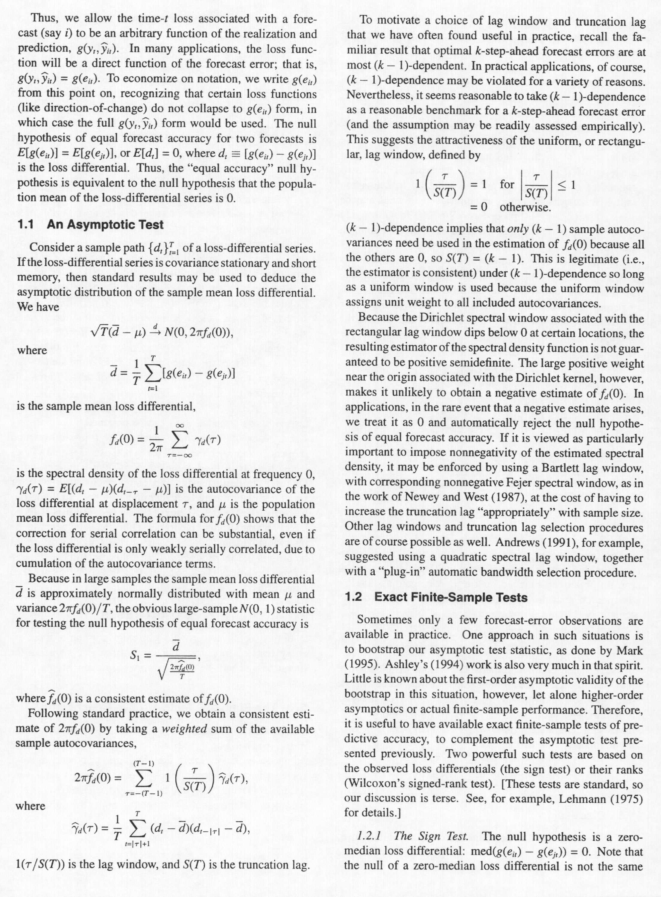
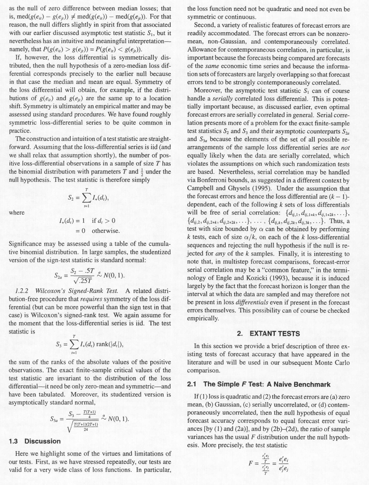
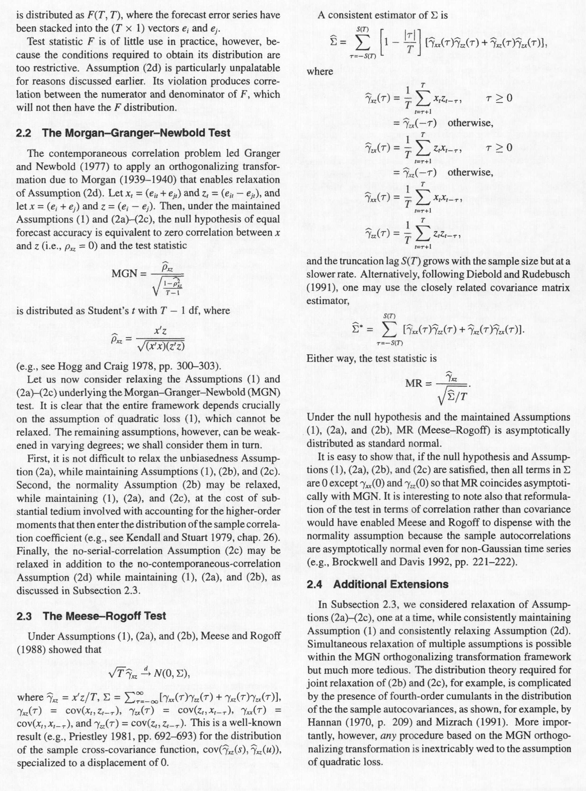
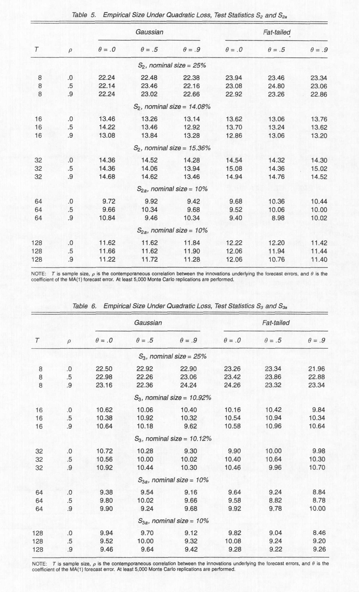
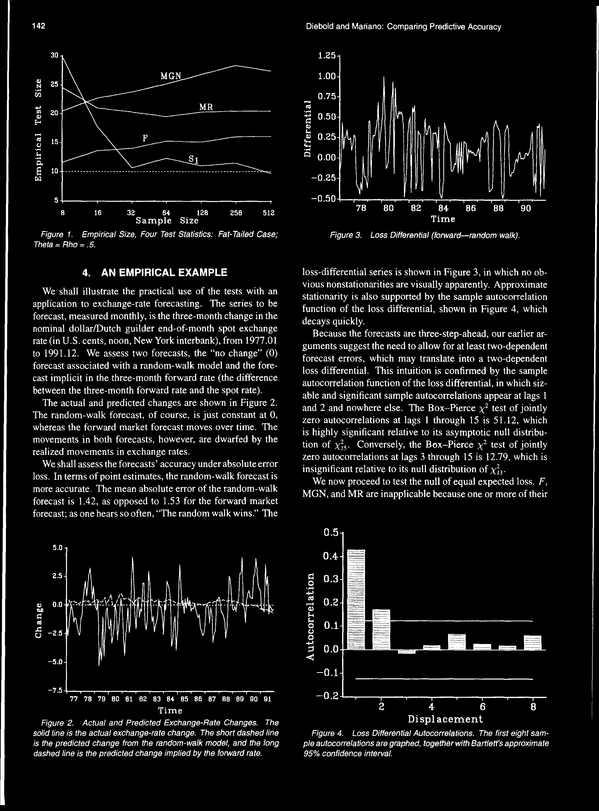

# out.pdf

## Metadata

- **Source File:** `out.pdf`
- **Authors:** Unknown
- **Year:** Unknown
- **DOI:** Unknown

## Abstract

Not found.

## Main Text

No extractable text.

## Tables

No tables extracted.

## Figures

## Extraction Notes

- No warnings.
