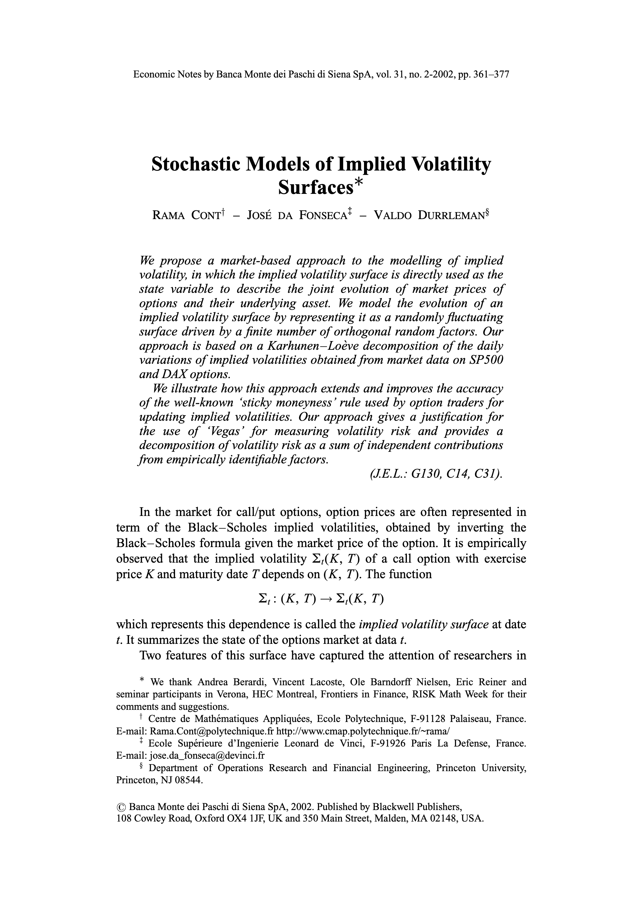
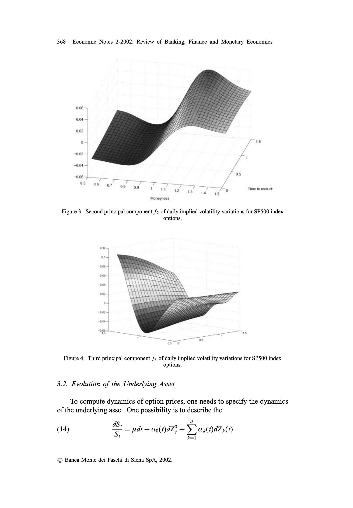
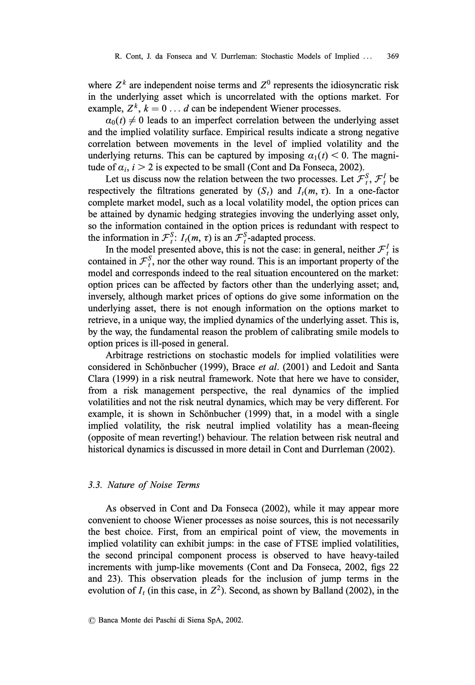
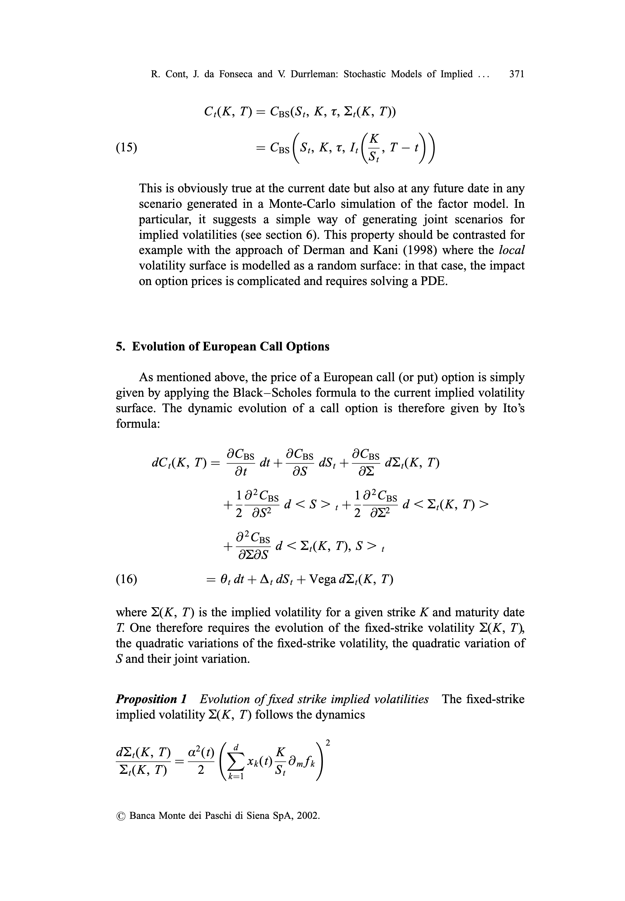
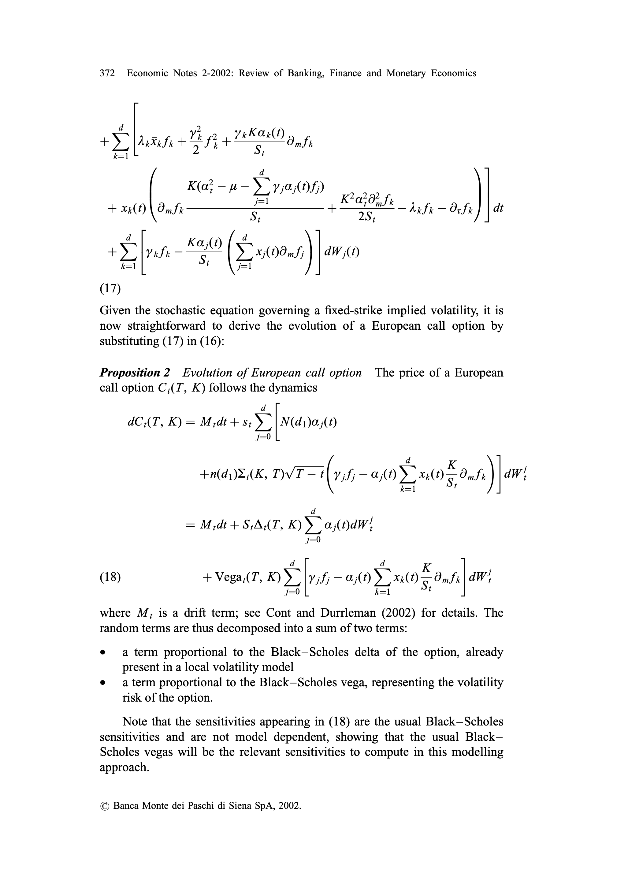
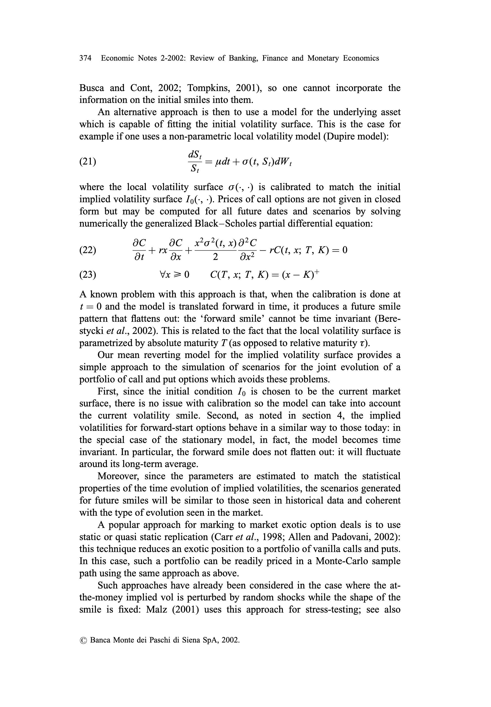
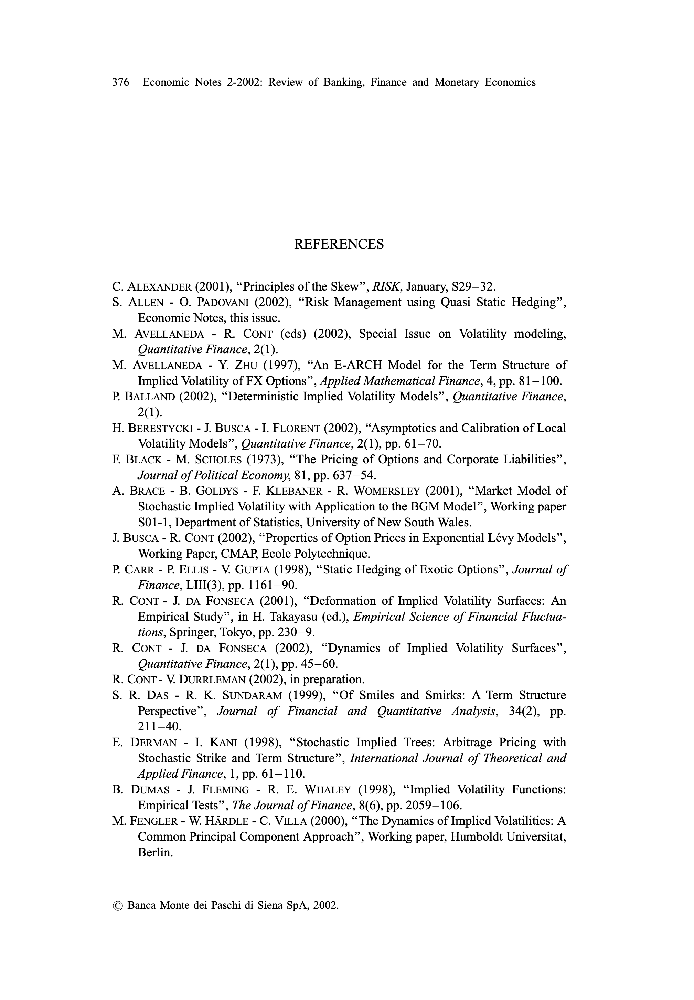
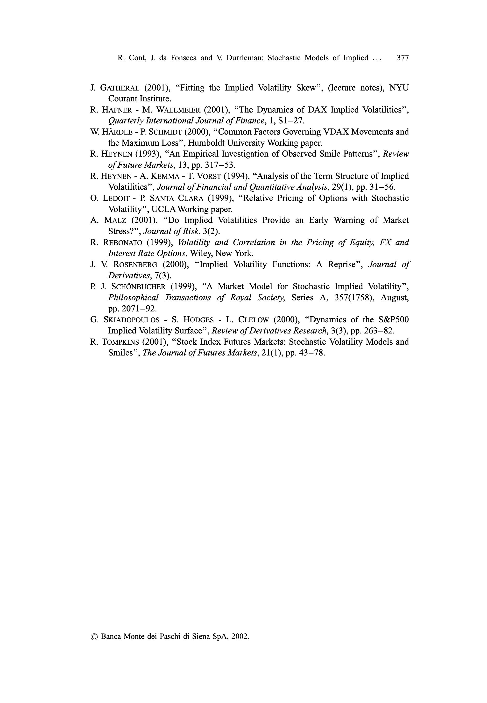

# Stochastic Models of Implied Volatility Surfaces

## Metadata

- **Source File:** `Stochastic Models of Implied Volatility Surfaces.pdf`
- **Authors:** Unknown
- **Year:** 2003
- **DOI:** 10.1111/1468-0300.00090

## Abstract

Not found.

## Main Text

Economic Notes by Banca Monte dei Paschi di Siena SpA, vol. 31, no. 2-2002, pp. 361-377
## Stochastic Models of Implied Volatility
### Surfaces*
## RAMA Contt — José DA FONSECA? — VALDO DURRLEMANS
We propose a market-based approach to the modelling of implied
volatility, in which the implied volatility surface is directly used as the
### state variable to describe the joint evolution of market prices of
### options and their underlying asset. We model the evolution of an
implied volatility surface by representing it as a randomly fluctuating
surface driven by a finite number of orthogonal random factors. Our
approach is based on a Karhunen—Loéve decomposition of the daily
variations of implied volatilities obtained from market data on SP500
and DAX options.
We illustrate how this approach extends and improves the accuracy
### of the well-known ‘sticky moneyness’ rule used by option traders for
### updating implied volatilities. Our approach gives a justification for
### the use of ‘Vegas’ for measuring volatility risk and provides a
decomposition of volatility risk as a sum of independent contributions
from empirically identifiable factors.
(JE.L.: G130, C14, C31).
In the market for call/put options, option prices are often represented in
### term of the Black-Scholes implied volatilities, obtained by inverting the
Black-Scholes formula given the market price of the option. It is empirically
observed that the implied volatility 2,(K, T) of a call option with exercise
price K and maturity date T depends on (K, T). The function
## 2,: (K, T) — 2K, T)
which represents this dependence is called the implied volatility surface at date
t. It summarizes the state of the options market at data ¢.
Two features of this surface have captured the attention of researchers in
* We thank Andrea Berardi, Vincent Lacoste, Ole Barndorff Nielsen, Eric Reiner and
seminar participants in Verona, HEC Montreal, Frontiers in Finance, RISK Math Week for their
comments and suggestions.
+ Centre de Mathématiques Appliquées, Ecole Polytechnique, F-91128 Palaiseau, France.
E-mail: Rama.Cont@polytechnique.fr http://www.cmap.polytechnique. fr/~rama/
t Ecole Supérieure d’Ingenierie Leonard de Vinci, F-91926 Paris La Defense, France.
E-mail: jose.da_fonseca@devinci.fr
8 Department of Operations Research and Financial Engineering, Princeton University,
Princeton, NJ 08544.
© Banca Monte dei Paschi di Siena SpA, 2002. Published by Blackwell Publishers,
108 Cowley Road, Oxford OX4 1JE, UK and 350 Main Street, Malden, MA 02148, USA.

License

License

License

License

License

License

License

License

License

License

License

License

License

License

License

License

## Tables

No tables extracted.

## Figures

## Extraction Notes

- No warnings.
