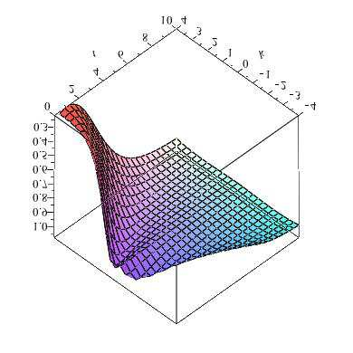
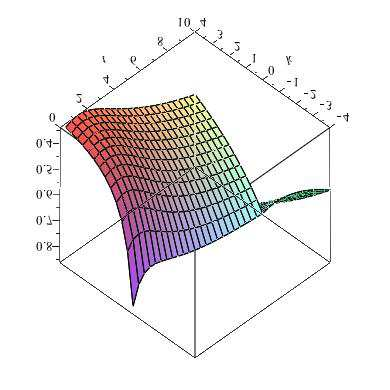

# arXiv:1210.7111v4 [q-fin.PR] 27 May 2016

## Metadata

- **Source File:** `1210.7111v4.pdf`
- **Authors:** Unknown
- **Year:** 2016
- **DOI:** Unknown

## Abstract

Not found.

## Main Text

Abstract. In this article we propose a generalisation of the recent work by Gatheral-Jacquier [12] on
## arXiv:1210.7111v4 [q-fin.PR] 27 May 2016
explicit arbitrage-free parameterisations of implied volatility surfaces. We also discuss extensively the
notion of arbitrage freeness and Roger Lee’s moment formula using the recent analysis by Roper [21].
We further exhibit an arbitrage-free volatility surface different from Gatheral’s SVI parameterisation.
1. Introduction
European option prices are usually quoted in terms of the corresponding implied volatility, and over the
last decade a large number of papers (both from practitioners and academics) has focused on understanding its behaviour and characteristics. The most important directions have been towards (i) understanding
the behaviour of the implied volatility in a given model [1, 2, 9, 14] and (ii) deciphering its behaviour
in a model-independent way, as in [19, 21, 23]. These results have provided us with a set of tools and
methods to check whether a given parameterisation is free of arbitrage or not. In particular, given a set
of observed data (say European Calls and Puts for different strikes and maturities), it is of fundamental
importance to determine a methodology ensuring that both interpolation and extrapolation of this data
are also arbitrage-free. Such approaches have been carried out for instance in [4, 8, 24]. Several parameterisations of the implied volatility surface have now become popular, in particular [10, 15, 17], albeit
not ensuring absence of arbitrage.
Recently, Gatheral and Jacquier [12] proposed a new class of implied volatility parameterisation, based
on the previous works by Gatheral [10]. In particular they provide explicit sufficient and—in a certain
sense—almost necessary conditions ensuring that such a surface is free of arbitrage.
We shall recall
later the exact definition of arbitrage, and see that it can be decomposed into two elements: butterfly
arbitrage and calendar spread arbitrage. This new class depends on the maturity and can hence be
used to model the whole volatility surface, and not a single slice. It also depends on the at-the-money
total implied variance θt, and on a positive function ϕ such that the total variance w as a function of
time-to-maturity t and log-(forward)-moneyness k is given by w(k, t) ≡θtSVIρ(kϕ(θt)), where SVIρ is
the classical (normalised) SVI parameterisation from [12], and ρ an asymmetry parameter (essentially
playing the role of the correlation between spot and volatility in stochastic volatility models).
In this work, we generalise their framework to volatility surfaces parameterised as w(k, t) ≡θtΨ(kϕ(θt))
for some (general) functions ϕ, θ, Ψ. We obtain (Sections 3 and 4) necessary and sufficient conditions
coupling the functions Ψ and ϕ that preclude arbitrage. This allows us to obtain (i) the exact set of
Date: May 30, 2016.
Key words and phrases. SVI volatility surface, calendar spread arbitrage, butterfly arbitrage, static arbitrage.
The authors are indebted to Stefano De Marco for numerous remarks and comments in the early stages of this paper,
and would like to thank the anonymous referees for their precise and helpful suggestions. AJ acknowledges financial support
from the EPSRC First Grant EP/M008436/1.
1

2
admissible functions ϕ in the symmetric (ρ = 0) SVI case, and (ii) a constraint-free parameterisation
of Gatheral-Jacquier functions satisfying the conditions of [12]. In passing (Section 4.4), we extend the
class of possible functions by allowing for non-smooth implied volatility functions. Finally (Section 5),
we exhibit examples of non-SVI arbitrage-free implied volatility surfaces.
Notations: We consider here European option prices with maturity t ≥0 and strike K ≥0, written
on an underlying stock S. Without loss of generality we shall always assume that S0 = 1 and that interest
rates are null, and hence the log (forward) moneyness reads k := log(K). We denote by
BS(K, w) = N(d+(log(K), w)) −KN(d−(log(K), w)),
(1.1)
the Black-Scholes value for a European Call option with strike K and total variance w, where N denotes
the Gaussian cumulative distribution function and d±(k, w) := −k/√
w ± √
w/2; more generally, we shall
write C(K, t) for (any) European Call prices with strike K and maturity t. For any k ∈R, t ≥0, the
corresponding implied volatility is denoted by σ(k, t) and the total variance w is defined by w(k, t) :=
σ(k, t)2t. With a slight abuse of language (commonly accepted in the finance jargon), we refer to the
two-dimensional map (k, t) 7→w(k, t) as the (implied) volatility surface. Finally, for two functions g
and h not null almost everywhere, we say that g(z) ∼h(z) at z = 0 whenever limz→0 g(z)/h(z) = 1. We
shall also use the notations R+ := [0, ∞) and R∗
+ := (0, ∞), and use the convention inf∅= ∞.
2. Absence of arbitrage and volatility parameterisations
This preliminary section serves several purposes: we first recall the very definition of ‘arbitrage freeness’
and its characterisation in terms of implied volatility. We then state and prove a few results (which are also
of independent interest) related to this notion of arbitrage. We finally quickly review the parameterisation
proposed in [12] and introduce an extension, which is our new contribution.
2.1. Absence of arbitrage. As defined in [5], absence of static arbitrage corresponds to the existence
of a non-negative local martingale (on some probability space) such that European Call options (on
this local martingale) can be written as risk-neutral expectations of their final payoffs. Armed with this
definition, it is however not easy to check whether a given set of (Call) option prices yields an arbitrage or
not. A more practical route follows Roper’s [21] arguments (or equivalently [12]), who provide sufficient
and almost1 necessary conditions for a given two-dimensional function (of strike and maturity) to be
a proper implied volatility surface, i.e. to generate arbitrage-free European option prices. Note that
Cox and Hobson’s definition [5] allows for strict local martingales, whereas Roper’s framework only
considers true martingales, his argument being that the implied volatility is ill-defined for strict local
martingales, in particular through the failure of Put-Call parity. Following collateralisation arguments
developed in [5], the recent paper [18] restores Put-Call parity in strict local martingale models and
clarifies the definition and properties of the implied volatilities (differently generated from Put and from
Call options). Pursuing the goal set up in [12], we shall exclude here in our modelling framework the
1The ‘almost’ refers to [21, Theorem 2.15], where smoothness and strict positivity of the implied volatility are required.

3
strict local martingale case, and understand ‘static arbitrage’ as a restriction to true martingales.2 We
now define these terms precisely, and refer to [21] for full details.
Definition 2.1. Given a map (K, t) ∈R+ × R+ 7→C(K, t), we say that there is no static arbitrage if
there exists a non-negative martingale S on some filtered probability space (Ω, F, (Ft)t≥0, P) such that
C(K, t) = E((St −K)+|F0) for each (K, t) ∈R+ × R+.
Consider now a two-dimensional map w : R×R+ →R+ representing a total variance surface; it is then
natural to wonder whether the Call price surface defined by R+ × R+ ∋(K, t) 7→BS(K, w(log(K), t)) is
free of static arbitrage. Introduce the operator L acting on C2,1(R × R∗
+ →R∗
+) functions by

2


−(∂kw(k, t))2
+ ∂2
1 −k∂kw(k, t)
w(k, t) + 1
1
kkw(k, t)
for all k ∈R, t > 0.
(2.1) Lw(k, t) :=
,
2w(k, t)
4
4
2
Note that even though L does not act on the second component of the function, we shall keep this notation
for clarity. For fixed t > 0, the total variance w(k, t) may in principle be null for some k ∈R, which
might break the well-posedness of the right-hand side of (2.1). However, it is easy to show that w(k, t)
is strictly positive whenever k belongs to the support of the log stock price at time t, and the restriction
w(k, t) > 0 is therefore sensible, which is imposed in model (2.3) with Assumption 2.7(iii). At t = 0,
the total variance is equal to zero everywhere, and the definition of the operator L shall not be needed.
Roper [21, Theorem 2.9] proved the following theorem:
Theorem 2.2. If the two-dimensional map w : R × R+ →R+ satisfies
(i) w(·, t) is of class C2(R) for each t ≥0;
(ii) w(k, t) > 0 for all (k, t) ∈R × R∗
+;
(iii) w(k, ·) is non-decreasing for each k ∈R;
(iv) for each (k, t) ∈R × R∗
+, Lw(k, t) is non-negative;
(v) w(k, 0) = 0 for all k ∈R;
(vi) limk↑∞d+(k, w(k, t)) = −∞, for each t > 0.
Then the corresponding Call price surface (K, t) 7→BS(K, w(log(K), t)) is free of static arbitrage.
Conditions (i), (ii) and (v) are usually easy to check. The other conditions motivate the following
weaker notions of arbitrage commonly used in practice, in the maturity and in the strike directions:
Definition 2.3. Let w : R × R∗
+ →R+ be a two-dimensional map satisfying Theorem 2.2(i)-(ii).
• w is said to be free of calendar spread arbitrage if Condition (iii) in Theorem 2.2 holds;
• w is said to be free of butterfly arbitrage if Condition (iv) in Theorem 2.2 holds.
Butterfly arbitrage corresponds to the convexity of option prices, which can be read as a condition on
the behaviour of the implied volatility surface ([12, Definition 2.3] and [12, Lemma 2.2]). If σloc represents
loc(k, t) = ∂tw(k, t)/Lw(k, t), for all k ∈R, t > 0 is now
the (Dupire) local volatility, the relationship σ2
standard (see [11, Chapter 1, Equation (1.10)]). Therefore absence of static arbitrage implies that both
2For a true martingale S, it is easy to see that, for a fixed maturity T, the map K 7→E(ST −K)+ is decreasing, convex
and tends to zero at infinity, properties that still hold in the strict local martingale setting. However, as shown by Pal
and Protter [20], Call prices are not necessarily increasing in maturity in strict local martingale models, and therefore the
corresponding total implied variance, whenever defined, need not be an increasing map any longer.

4
the numerator and the denominator are non-negative quantities. Condition (vi) in Theorem 2.2 is called
the ‘Large-Moneyness Behaviour’ (LMB) condition, and is equivalent to Call option prices tending to zero
as the strike tends to (positive) infinity, as proved in [23, Theorem 5.3]. The following lemma however
shows that other asymptotic behaviours of d+ and d−hold in full generality. This was proved by Rogers
and Tehranchi [23] in a general framework, and we include here a short self-contained proof.
Lemma 2.4. Let w be any positive real function. Then
(i) limk↑∞d−(k, w(k)) = −∞;
(ii) limk↓−∞d+(k, w(k)) = +∞.
√
√
w(k)
k
√
Proof. The arithmetic-geometric mean inequality reads −d−(k, w(k)) =
≥
2k, when
w(k) +
2
√
√
w(k)
□
−k
√
≥
−2k, when k < 0.
k > 0, which implies (i), and (ii) follows using d+(k, w(k)) =
w(k) +
2
The missing statements in Lemma 2.4 are the LMB Condition (Condition (vi) in Theorem 2.2) and the
Small-Moneyness Behaviour (SMB): limk↓−∞d−(k, v(k)) = +∞. To investigate further, let us remark
that the framework developed in [21] encompasses situations where the underlying stock price can be null
with positive probability. This can indeed be useful to model the probability of default of the underlying.
Computations similar in spirit to [21] show that the marginal law of the stock price at some fixed time
t > 0 has no mass at zero if and only if limK↓0 ∂KC(K, t) = −1, which is a statement about a ’smallmoneyness’ behaviour. This can be fully recast in terms of implied volatility, and the above missing
conditions then come naturally into play in the following proposition, the proof of which is postponed to
Appendix A.1:
Proposition 2.5. (Symmetry under small-moneyness behaviour) Let v be a C2(R) real function satisfying
(I) v(k) > 0 and Lv(k) ≥0 for all k ∈R;
(II) limk↓−∞d−(k, v(k)) = +∞(SMB Condition);
(III) limk↑∞d+(k, v(k)) = −∞(LMB Condition).

Define the two functions p−and p+ by k 7→p±(k) := (2πv(k))−1/2 exp
−1
2d2
Lv(k). Then
±(k, v(k))
(1) p+ and p−define two densities of probability measures on R with respect to the Lebesgue measure,
R
R
i.e.
R p−(k)dk =
R p+(k)dk = 1;
R ∞
R ∞
−∞e−kp+(k)dk = 1;
−∞ekp−(k)dk =
(2) p+(k) = ekp−(k), so that
(3) p−is the density of probability associated to Call option prices with implied volatility v, in the
sense that p−(k) ≡ek∂2
KKBS(K, v(log(K)))|K=ek, and k 7→p+(−k) is the density of probability
associated to Call option prices with implied volatility k 7→w(k) := v(−k).
The strict positivity of the function v in Assumption (I) ensures that the support of the underlying
distribution is the whole real line. One could bypass this assumption by considering finite support as
in [23]. In the latter—slightly more general—case, the statements and proofs would be very analogous
but much more notationally inconvenient.
Symmetry properties of the implied volatility have been
investigated in the literature, and we refer the interested reader to [3, 13, 22]. This proposition has been
intentionally stated in a maturity-free way: it is indeed a purely ‘marginal’ or cross-sectional statement,
which does not depend on time. A natural question arises then: can such a function v, satisfying the
assumptions of Proposition 2.5, represent the total implied variance smile at time 1 associated to some

5
martingale (issued from 1 at time zero)? The answer is indeed positive and this can be proved as follows.
Consider the natural filtration B of a standard (one-dimensional) Brownian motion (Bt)t≥0.
Let P
be the cumulative distribution function associated to p−characterised in Proposition 2.5, and N the
Gaussian cumulative distribution function. Then the random variable X := P −1(N(B1)) has law P,
Set now Ms := E(X|Bs), then M is a martingale issued from 1.
and E(X) = 1.
Note that M is
even a Brownian martingale and therefore a continuous martingale. The associated Call option prices
E[(Ms −K)+] uniquely determine a total implied variance surface (t, k) 7→w(k, t) such that v = w(1, ·).
2.2. Volatility parameterisations. In [10], Gatheral proposed a parameterisation for the implied
volatility, the now famous SVI (‘Stochastic Volatility Inspired’). However, finding necessary and sufficient
conditions preventing static arbitrage have been inconclusive so far. Recently, Gatheral and Jacquier [12]
extended this approach and introduced the following parameterisation for the total implied variance w:
o
n
p
w(k, t) ≡θt
(kϕ(θt) + ρ)2 + (1 −ρ2)
(2.2)
,
1 + ρkϕ(θt) +
2
with θt > 0 for t > 0 and ϕ is a smooth function from R∗
+ to R+ and ρ ∈(−1, 1). The main result in
their paper (Corollary 5.1) is the following theorem, which provides sufficient conditions for the implied
volatility surface w to be free of static arbitrage:
Theorem 2.6. The surface (2.2) is ‘free of static arbitrage’ if the following conditions are satisfied:
(1) ∂tθt ≥0 for all t > 0;
(2) ϕ(θ) + θϕ′(θ) ≥0 for all θ > 0;
(3) ϕ′(θ) < 0 for all θ > 0;
(4) θϕ(θ)(1 + |ρ|) < 4 for all θ > 0;
(5) θϕ(θ)2(1 + |ρ|) ≤4 for all θ > 0.
A few remarks are in order here:
(1) the conditions in Theorem 2.6 are sufficient, but not necessary;
(2) the full characterisation of the functions ϕ guaranteeing absence of (static or not) arbitrage in
the symmetric SVI case ρ = 0 is left open;
(3) it would be useful to ‘parameterise’ the set of functions ϕ satisfying the conditions of Theorem 2.6.
This could lead to easy-to-implement calibration algorithms among the whole admissible class,
without being tied to a particular family as in [12].
In this paper, we try to settle all these points, and state our results in a more general framework, not
tied to the specific shape of the SVI model, by considering implied volatility surfaces of the form
for all k ∈R, t ≥0,
(2.3)
w(k, t) = θtΨ(kϕ(θt)),
together with the following assumptions:
Assumption 2.7.
(i) θ ∈C1(R∗
+ →R∗
+), is not constant, limt↓0 θt = 0, and θ∞:= limt↑∞θt is well defined in (0, ∞];
(ii) ϕ ∈C1(R∗
+ →R∗
+), and limu↑∞ϕ(u) is well defined in (0, ∞];
(iii) Ψ ∈C2(R →R∗
+) with Ψ(0) = 1 and Ψ is not constant;
(iv) for any k ∈R, limt↓0 w(k, t) = 0.

6
The time-dependent function θ models the at-the-money total variance; the assumption on its behaviour at the origin is thus natural. A constant function Ψ corresponds to deterministic time-dependent
volatility, a trivial case we rule out here. Likewise, were θ assumed to be constant, it would be null
everywhere, which we shall also not consider. Assumption (iv) ensures that at maturity, European Call
option prices are equal to their payoffs. We can recast it in terms of assumptions on ϕ and Ψ, for example:
Assumption (iv’): ϕ(θ) converges to a non-negative constant as θ ↓0.
Indeed (iv’), together with (iii), clearly implies (iv). We shall present another alternative below with the
help of the ‘asymptotic linear’ property of Ψ (Definition 3.4 and Assumption 3.5). Assumption (iii) may
look strong from a purely theoretical point of view, but is always satisfied in practice. In Section 4.4
though, we partially relax it (Assumption 4.10) to allow for possible kinks. The main goal here is to
provide sufficient conditions on the triplet (θ, ϕ, Ψ) that will guarantee absence of static arbitrage. Note
p
z2 + 2ρz + 1), which
that the SVI parameterisation (2.2) corresponds to the case Ψ(z) ≡1
2(1 + ρz +
clearly satisfies Assumption 2.7(iii). In the sequel, we shall refer to this case as the SVI case. The next
sections provide necessary and sufficient conditions on θ, ϕ and Ψ to prevent static arbitrage.
3. Elimination of calendar spread arbitrage
We first concentrate on determining (necessary and sufficient) conditions on the triplet (θ, ϕ, Ψ) to
eliminate calendar spread arbitrage.
3.1. The first coupling condition. The quantity ∂tw(k, t) in Definition 2.3 is nothing else than the
numerator of the local volatility expressed in terms of the implied volatility, i.e. Dupire’s formula (see [11]).
Define now the functions F : R →R and f : R →R by
F(z) := z Ψ′(z)
f(u) := uϕ′(u)
(3.1)
Ψ(z) ,
ϕ(u) .
They will play a major role in our analysis, and Assumption 2.7(iii) implies that F(z) ∼Ψ′(0)z/Ψ(0) at
the origin and F(0) = 0. Note that Ψ and ϕ can be recovered through the identities

Z u

Z z
f(v)
F(u)
du
,
ϕ(u) = ϕ(r) exp
dv
,
Ψ(z) = exp
u
v
0
r
for some arbitrary constant r > 0. The following proposition gives new conditions for absence of calendar
spread arbitrage.
Proposition 3.1 (First coupling condition). The surface (2.3) is free of calendar spread arbitrage if and
only if the following two conditions hold:
(i) θ is non-decreasing;
(ii) 1 + F(z)f(u) ≥0 for any z ∈R and u ∈(0, θ∞).
Proof. By Definition 2.3, the surface defined by (2.3) is free of calendar spread arbitrage if and only if
for all k ∈R, t > 0,
∂tw(k, t) = θ′
tΨ(z) + θtΨ′(z)kϕ′(θt)θ′
t ≥0,
(3.2)
where z := kϕ(θt). Since Ψ is strictly positive by Assumption 2.7(iii), the inequality (3.2) is equivalent to
t (1 + F(z)f(θt)) ≥0 for all z ∈R, t > 0, with F and f defined in (3.1). For k = 0 we get θ′
θ′
t ≥0 for all
□
t > 0. Otherwise (ii) is necessary and sufficient for the surface to be free of calendar spread arbitrage.

7
Remark 3.2. We do not assume here that θ∞is infinite. In most popular stochastic volatility models with or without jumps, θ∞is infinite. Rogers and Tehranchi [23] showed that for a non-negative
martingale (St)t≥0 the equality θ∞= ∞is equivalent to the almost sure equality limt↑∞St = 0 (where
the limit exists by the martingale convergence theorem). However, it may occur that θ∞< ∞. As a
corollary of coupling properties of stochastic volatility models, Hobson [16] provides instances where such
a phenomenon appears, for example the SABR [15] model with β = 1.
Remark 3.3. Condition (ii) in Proposition 3.1 can be stated in a more compact way:
1 −sup F+ sup f−≥0
1 −sup F−sup f+ ≥0,
and
where f+ := max(f, 0) and f−:= max(−f, 0).
Motivated by the celebrated moment formula in [19] (see also Theorem B.1), which forces the function Ψ
to be at most linear at (plus/minus) infinity, let us propose the following definition:
z→±∞Ψ′(z) =: α± ∈R \ {0}.
Definition 3.4. The function Ψ is said to be asymptotically linear if
lim
With this definition, we can replace Assumption 2.7(iv) by
Assumption 3.5. Ψ is asymptotically linear and limθ↓0 θϕ(θ) = 0.
We now obtain a necessary condition on the behaviour of the function ϕ in (2.3).
Proposition 3.6. If Ψ is asymptotically linear and if there is no calendar spread arbitrage, then the map
u 7→uϕ(u) is non-decreasing on R+.
Proof. Using (3.1), if Ψ is asymptotically linear, then limz→±∞zΨ′(z)/Ψ(z) = limz→±∞F(z) = 1, so
that absence of calendar spread arbitrage implies 1 + f(u) ≥0 for any u ∈(0, θ∞) by Proposition 3.1(ii).
□
Since ϕ is a strictly positive function by Assumption 2.7(ii), the proposition follows from (3.1).
Note that if limz→±∞Ψ′(z) = 0 then the limit of the function F at (plus or minus) infinity does not
necessarily exist. Whenever it does, since z 7→Ψ(z)/z is decreasing as z →±∞, the limit can take any
value in (−∞, 1).


z+ρ
3.2. Application to SVI. In the SVI case (2.2), we have Ψ′(z) ≡1
√
with |ρ| < 1, so
ρ +
2
z2+2ρz+1
that Ψ is asymptotically linear with α+ = ρ + 1 and α−= ρ −1. Therefore Proposition 3.6 applies, and
a necessary condition is that u 7→uϕ(u) is not decreasing. In [12, Theorem 4.1], this condition, together
with ϕ being non-increasing, are shown to be sufficient to avoid calendar spread arbitrage. In the case of
the symmetric SVI model, the following corollary relates our conditions to those in [12].
Corollary 3.7. In the symmetric SVI case, the necessary condition of Proposition 3.6 is also sufficient.
Proof. In the symmetric case ρ = 0, we can compute explicitly
√
1 + z2
Ψ(z) = 1 +
z
1
Ψ′(z) = 1
for all z ∈R,
Ψ′′(z) =
√
2(1 + z2)3/2 ,
(3.3)
,
1 + z2 ,
2
2
and therefore
z2
z
for all z ∈R.
F ′(z) =
1 + z2
1 + z2
√
√
F(z) =
(1 + z2)3/2 ,
and
1 +

8
It is then clear that the even function F is strictly increasing on R∗
+ and strictly decreasing on R∗
−with
a global minimum attained at the origin for which F(0) = 0. In light of Remark 3.3, we have sup F+ = 1
and sup F−= 0. By Proposition 3.1 there is hence no calendar spread arbitrage if and only if f(u) ≥−1,
□
which is equivalent to u 7→uϕ(u) being non-decreasing.
4. Elimination of butterfly arbitrage
We now consider butterfly arbitrage which, probably not surprisingly, is more subtle to handle. We
first start with a general result (Section 4.1), which is unfortunately not that tractable in practice. When
the function Ψ is asymptotically linear, however, more elegant formulations are available, and we provide
necessary and sufficient conditions precluding static arbitrage (Section 4.2). In the particular example of
the symmetric SVI function (Section 4.3), we put these results in action, where everything is computable
explicitly. Finally, in Section 4.4, we address a delicate issue, allowing for the possibility of non-smooth
functions, thereby enlarging the class of arbitrage-free volatility surfaces.
4.1. The second coupling condition. We consider here the positivity condition Lw(k, t) ≥0 from
Definition 2.3, and reformulate the butterfly arbitrage condition in our setting. We first start with a
general formulation, and then consider the asymptotically linear case (for the function Ψ), which turns
out to be more tractable. For any u ∈(0, θ∞], define the set

Ψ′(z)2


+ Ψ′(z)2
z ∈R : 1
Ψ(z) −2Ψ′′(z)
Z+(u) :=
(4.1)
> 0
,
4u
16
as well as the function Λ : {(u, z) : u ∈(0, θ∞], z ∈Z+(u)} →R ∪{+∞} by
Ψ′(z)2
−1 
2
 1

1 −zΨ′(z)
+ Ψ′(z)2
Ψ(z) −2Ψ′′(z)
(4.2)
Λ(u, z) :=
.
4u
16
2Ψ(z)
Proposition 4.1 (Second coupling condition, general formulation). The surface w given in (2.3) is free
of butterfly arbitrage if and only if
(uϕ(u))2 ≤
for all u ∈(0, θ∞).
(4.3)
z∈Z+(u) Λ(u, z),
inf
Proof. From (2.1) and (2.3), we clearly have ∂kw(k, t) = θtΨ′(z)ϕ(θt), and ∂2
kkw(k, t) = θtΨ′′(z)ϕ(θt)2
for all k ∈R and t > 0. Therefore, with z := kϕ(θt),
2



−(∂kw(k, t))2
+ ∂2
1
kkw(k, t)
w(k, t) + 1
1 −k∂kw(k, t)
Lw(k, t) =
2w(k, t)
4
4
2

2


1 −kθtΨ′(z)ϕ(θt)
−(θtΨ′(z)ϕ(θt))2
+ θtΨ′′(z)ϕ(θt)2
θtΨ(z) + 1
1
=
2θtΨ(z)
4
4
2
2
 1

(Ψ′)2(z)


+ (Ψ′)2(z)
1 −zΨ′(z)
−2Ψ′′(z)
−(θtϕ(θt))2
(4.4)
,
=
2Ψ(z)
4θt
Ψ(z)
16
and the proposition follows from the definition of Z+(u). Indeed, on R \ Z+(u), butterfly arbitrage is
□
clearly precluded for any u > 0, since both terms on the right-hand side of (4.4) are non-negative.

9
4.2. The asymptotically linear case. We now consider the case where Ψ is asymptotically linear
(Definition 3.4). Define the sets



Ψ′(z)2
z ∈R :
Z−:= R \
ℵ:= {z ∈R : Ψ′(z) = 0},
Ψ(z) −2Ψ′′(z)
Z+ :=
Z+,
(4.5)
> 0
,
and
together with the complement in R: ℵc := R \ ℵ, as well as the, possibly infinite, quantity
(4.6)
M∞:= lim
u↑θ∞uϕ(u).
The following proposition, proved in Appendix A.2, is a reformulation of Proposition 4.1 in the asymptotically linear case, and provides sufficient and necessary conditions for the surface (2.3) to be free of
butterfly arbitrage.
Proposition 4.2. Assume that Ψ is asymptotically linear and there is no calendar spread arbitrage.
Z+ is neither empty nor bounded from above. Moreover, there is no butterfly arbitrage if and only
Then
if the following two conditions hold (recall that the functions Z+ and Λ are defined in (4.1) and (4.2)):
(i)
M 2
≤
if θ∞< ∞,
inf
Z−∩Z+(θ∞)∩ℵc Λ(θ∞, z),
∞
z∈
,
4
2z
Ψ′(z) −
≤
otherwise;
M∞
inf
Ψ(z)
Z−∩ℵc
z∈
(ii) for any u ∈(0, θ∞), (uϕ(u))2 ≤inf
Λ(u, z).
z∈
Z+
Z+ ∩ℵc and
Z+ ∩ℵ. On the former, the function
Remark 4.3. Case (ii) actually includes two cases:
Z+ ∩ℵ, however,
Λ(u, ·) is well defined and the infimum can be searched for without any confusion. On
the function z 7→Λ(u, z) reduces to −2u/Ψ′′(z), which is always strictly positive. Note further that,
from (4.4), if Ψ′(z) = Ψ′′(z) = 0, then positivity of Lw(k, t) is automatically guaranteed.
The following corollary is an immediate consequence of this proposition, in the case θ∞= ∞.
Corollary 4.4. If Ψ is asymptotically linear and θ∞= ∞, then (allowing infinity)
4
2z
M∞≤inf
Ψ′(z) −
Ψ(z)
z∈R
is a necessary condition for absence of butterfly arbitrage. In particular M∞≤2/ sup{|α+|, |α−|}.
A little work on the proposition above yields the following sufficient condition preventing butterfly
arbitrage, which is easier to check in practice.
Corollary 4.5. Assume that Ψ is asymptotically linear, that there is no calendar spread arbitrage and
that ℵ= ∅. Assume further that for any u ∈(0, θ∞), the inequality in Proposition 4.2(ii) is strict. Then
the corresponding implied volatility surface is free of static arbitrage.
w(k,t)
Proof. In our setting (Ψ asymptotically linear), limk↑∞
= θtϕ(θt)α+, so that we only need to prove
k
w(k,t)
2
< 2 clearly implies the LMB condition. For any z ∈
Z+ (defined
that θtϕ(θt) <
α+ , since limk↑∞
k

10
in (4.5)), note that
2
2


1 −zΨ′(z)
1 −zΨ′(z)
2Ψ(z)
2Ψ(z)


≤
.
Λ(θt, z) =
Ψ′(z)2
Ψ′(z)2
+ Ψ′(z)2
1
Ψ(z) −2Ψ′′(z)
16
4θt
16
Z+ diverging to infinity yields (θtϕ(θt))2 <
□
4
Applying this to a sequence in
+ and the result follows.
α2
4.3. Application to symmetric SVI. As in Section 3.2 above, we show that in the symmetric SVI
case (ρ = 0), all our expressions above are easily computed and give rise to simple formulations. It is
clear that the set ℵdefined in (4.5) is empty in this case. Let us define the functions A, Y and A∗by
16uy(y + 1)
A∗(u) := A(Y (u), u),
A(y, u)
:=
8(y −2) + uy(y −1),
s
2

(4.7)
2
2
2
+
1 −u/4 +
1 −u/4.
Y (u)
:=
1 −u/4
Of course we only define these functions on their effective domains, the forms of which we omit for clarity.
The following proposition makes the conditions of Proposition 4.2 explicit in the symmetric SVI case.
Proposition 4.6. In the symmetric SVI (2.2) case ρ = 0, there is no butterfly arbitrage if and only if
(uϕ(u))2 ≤A∗(u)1{u<4} + 16 1{u≥4},
for all u ∈(0, θ∞).
√
1 + z2; then
Proof. Define yz :=




1−zΨ′(z)
(yz −2)(yz + 1)2
2 −2Ψ(z)Ψ′′(z) = 1
2Ψ(z) = 1
1 + 1
1 −1
Ψ′(z)2 = 1
(Ψ′(z))
,
,
.
y3z
y2z
4
2
yz
4
√
√
Since Ψ(z) > 0 for all z ∈R, the first equation implies that
Z+ defined in (4.5) is equal to R\ [−
3,
3].
For any fixed u, the function appearing on the right-hand side of Proposition 4.2(ii) simplifies to A(y, u)
given in (4.7). In particular A(2, u) = 48 and limy↑∞A(y, u) = 16. For any u ≥0, we have
128uBu(y)
∂yA(y, u) =
(8y −16 + y2u −yu)2 ,

1 −u
y2−4y−2. When u ≥4, Bu is concave on (2, ∞) with Bu(2) = −(6+u) < 0, and
where Bu(y) :=
4
hence the map y 7→A(y, u) is decreasing on (2, ∞) and its infimum is equal to limy↑∞A(y, u) = 16. For
u ∈[0, 4), the strict convexity of Bu and the inequality Bu(2) = −(6 + u) < 0 implies that the equation
Bu(y) = 0 has a unique solution in (2, ∞), which in fact is equal to Y (u) given in (4.7). Then the map
y 7→A(y, u) is decreasing on (2, Y (u)) and increasing on (Y (u), ∞). Its infimum is attained at Y (u) and
□
is equal to A∗(u) defined in (4.7).
Remark 4.7. In [12], the authors prove that the two conditions (altogether) uϕ(u) < 4 and uϕ(u)2 < 4
(for all u ≥0) are sufficient to prevent butterfly arbitrage in the uncorrelated (ρ = 0) case.
These
two conditions can be combined to obtain (uϕ(u))2 < 16 min(1, ϕ(u)−2). A tedious yet straightforward
computation shows that A∗is increasing on [0, 4) and maps this interval to [0, 16). Notwithstanding the
fact that our condition is necessary and sufficient, it is then clear that
(i) for u ≥4, it is also weaker than the one in [12] whenever ϕ(u) < 1;
(ii) for u < 4 (which accounts for most practically relevant cases) it is weaker whenever 16/ϕ(u) < A∗(u).
In particular, item (ii) could be used as a sufficient and necessary lower bound condition (depending
on u) for the function ϕ on [0, 4).

11
4.4. Non-smooth implied volatilities. The formulation of arbitrage freeness in [21, Theorem 2.1] is
minimal in the sense that the regularity conditions on the Call option prices are necessary and sufficient:
to be convex in the strike direction and non-decreasing in the maturity direction. The implied volatility
formulation ([21, Theorem 2.9, condition IV.1] and Theorem 2.2(i) above) however, assumes that the total
variance is twice differentiable in the strike direction. This regularity is certainly not required; in fact, the
author [21, Theorem 2.9] proves the latter by checking the necessary assumptions on the behaviour of the
Call price ([21, Theorem 2.1]) defined by BS(ek, w(k, t)), with BS defined in (1.1). More precisely, Roper
uses the regularity assumption in k of w in order to define pointwise the second derivative of this Call
price function with respect to the strike. He then proves that the latter is positive, henceforth obtaining
the convexity of the price with respect to the strike [21, Theorem 2.1, Assumption A.1]. It turns out
that the same result can be obtained without this regularity assumption. Let eL∞
+ (R →R∗
+) denote the
space of strictly positive, continuous, functions on the real line, differentiable except possibly at finitely
loc(R →R), the space of locally essentially bounded measurable
many points, and with derivatives in L∞
functions. Introduce then the functional M on eL∞
+ (R →R∗
+) by

2
 1

1 −kv′(k)
−v′(k)2
v(k) + 1
for all k ∈R.
Mv(k) :=
(4.8)
,
2v(k)
4
4
Proposition 4.8. For any v ∈eL∞
+ (R →R∗
+), the following hold:
(1) the functional Mv in (4.8) is well defined in eL∞
+ (R →R∗
+), hence in the sense of distributions;
(2) let v′′ denote the second derivative of v in the sense of distributions.
Then the map K 7→
BS(K, v(log(K)) is convex if and only if Lv := Mv + 1
2v′′ is a positive distribution.
We abuse the notation slightly by considering the same symbol for the operator L here and in (2.1),
although they do not act on the same spaces; this should however not create any confusion.
Proof. The first statement follows from the fact that v is positive continuous and v′ ∈L∞
loc(R →R).
Consider now a strictly positive smooth function ζ with compact support, which integrates to one, and
regularise v by convolution as vε(k) ≡ε−1ζ(k/ε) ∗v(k). Then vε is a smooth strictly positive function,
and Roper’s computation [21, Theorem 2.9] applies:
d2BS(K, vε(log(K))
= 2∂wBS(K, vε(log(K))
Lvε(log(K)),
dK2
K2
where Lvε is defined pointwise, and where ∂wBS denotes the derivative of the function BS with respect
to its second component. It follows that for any φ ∈C∞(R+) with compact support on R+,
Z
Z
φ(K)d2BS(K, vε(log(K))
φ′′(K)BS(K, vε(log(K))dK =
(4.9)
dK
dK2
R+
R+
Z
φ(K)∂wBS(K, vε(log(K))
Lvε(log(K))dK,
= 2
K2
R+
where the boundary terms cancel since φ has compact support. Mapping K 7→ek, the last integral reads
Z

φ(ek)e−k∂wBS
ek, vε(k)
Lvε(k)dk.
R
ε to v′ almost everywhere, and v′′
ε to v′′ in the sense
When ε tends to zero, vε converges pointwise to v, v′
of distribution. It follows that the map ∂wBS (e·, vε(·)) Lvε(·) converges to ∂wBS (e·, v(·)) Lv(·) in the

12
sense of distribution (on R). Now the first line of (4.9) converges to
Z
φ′′(K)BS(K, v(log(K))dK = ⟨φ, P⟩R+,
R+
where P is the second derivative of K 7→BS(K, v(log(K)) in the sense of distribution, and ⟨·, ·⟩R+
the duality bracket. Therefore, ⟨φ, P⟩R+ = 2⟨φ(e·)e−·, ∂wBS(e·, v(·))Lv⟩R, so that P is a positive distribution on R+ if and only if ∂wBS(e·, v(·))Lv is a positive distribution on R. Finally, the function
K 7→BS(K, v(log(K)) is convex if and only if P is a positive distribution; since ∂wBS(e·, v(·)) is positive
continuous, ∂wBS(e·, v(·))Lv is a positive distribution if and only if Lv is, which concludes the proof.
□
Let us finally note that our assumptions on w are indeed minimal: conversely, if we start from an
option price convex in K, its first derivative is defined almost everywhere, and so is that of w (in K or k)
since the Black-Scholes mapping in total variance is smooth. Assumption 2.7 imposes some (mild yet
sometimes unrealistic) conditions on the volatility surface. It turns out that our results are still valid
under weaker conditions on the function Ψ. Recall first the following definition:
Definition 4.9. A continuous function f is said to be of class D(R →R) if there exist a0 < a1 < · · · < aN
(for some N ∈N), such that f ∈C2(R\{a0, . . . , aN} →R), and such that the right and left limits lim
a↓ai f ′(a)
a↑ai f ′(a) exist for each i ∈{0, . . ., N}.
and lim
Consider now the following alternative to Assumption 2.7:
Assumption 4.10. Assumption 2.7(i), (ii) and (iv) are unchanged, but (iii) is replaced by the weaker
version: Ψ ∈D(R →R∗
+), with Ψ(0) = 1, Ψ not constant.
Let AΨ denote the (possibly empty) set of discontinuity of Ψ′. Under our assumption, Ψ′′ in the
distribution sense is defined as a sum of a continuous measure on R \ AΨ and of Dirac masses αiδi at
each point of discontinuity ai ∈AΨ. We extend the results of Section 4 in the following way: recall the
sets Z+(·) and
Z± in (4.5) and (4.1), and define
e
e
Z+(u) := Z+(u) \ AΨ
Z+ :=
Z+ \ AΨ.
(4.10)
and
Proposition 4.11 (Second coupling condition, general formulation). The surface (2.3) is free of butterfly
arbitrage if and only if the jumps of Ψ′ are non-negative and (4.3) holds with e
Z+ instead of Z+.
Proof. Similarly to the proof of 4.1, the continuous part of Lw has a density given by
2
 1

(Ψ′)2(z)


1 −zΨ′(z)
+ (Ψ′)2(z)
−2Ψ′′(z)
−(θtϕ(θt))2
,
2Ψ(z)
4θt
Ψ(z)
16
for any t > 0 and k ∈R \ AΨ, and the first part of the proposition follows. The remaining part of the
distribution Lw(k, t) is the sum of the disjoint Dirac masses (θtϕ(θt))2αiδi. By localisation it is clear
that the distribution Lw(k, t) is positive if and only if its continuous part on R \ AΨ is positive and each
of its point mass distribution is positive. Since αi is non-negative if and only if Ψ′ has a non-negative
□
jump at ai, the rest of the proposition follows.
Likewise, the analogue of Proposition 4.2 holds as follows:

13
Proposition 4.12. If Ψ is asymptotically linear and if there is no calendar spread arbitrage, then e
Z+ is
neither empty nor bounded from above. Moreover, there is no butterfly arbitrage if and only if the jumps
Z+(·) and e
of Ψ′ are non-negative and Proposition 4.2(i)-(ii) hold with e
Z± instead of Z+(·) and
Z±.
5. The quest for a non-SVI Ψ function
In order to find examples of pairs (ϕ, Ψ), with Ψ different from the SVI parameterisation (2.2), observe
first that the second coupling condition (Proposition 4.1) is more geared towards finding out ϕ given Ψ
than the other way round. We first start with a partial result (proved in Appendix A.3) in the other
direction, assuming that Ψ is asymptotically linear.
Proposition 5.1. If the generalised SVI surface (2.3) is free of static arbitrage, Ψ is asymptotically
linear and θ∞= ∞, then there exist z+ ≥0 and κ ≥0 such that for all z ≥z+ the following upper bound
holds (with M∞defined in (4.6)):
r
Ψ(z) ≤κ2 + 2z
κ2 + 2z
−κ
.
M∞
M∞
Using this proposition, we now move on to specific examples of non-SVI families.
5.1. First example of non-SVI function. We here provide a triplet (θ, ϕ, Ψ), different from the SVI
form (2.2), which characterises an arbitrage-free volatility surface via (2.3). Let θt ≡t and

1 −e−u



p
Ψ(z) := |z| + 1
,
if u > 0,
for all z ∈R.
1 + |z|
and
,
1 +
ϕ(u) :=
u

2
1,
if u = 0,
A few remarks are in order:
• the function ϕ is continuous on R+;
• θ∞= ∞;
• the map u 7→uϕ(u) is increasing and its limit is M∞= 1;
• the function Ψ—directly inspired from the computations in Proposition 5.1—is symmetric and
continuous on R. It is also C∞on R \ {0}, and asymptotically linear. Its derivative is therefore
C1 piecewise and has a positive jump at the origin, so that Propositions 4.11 and 4.12 apply.
With these functions, the total implied variance (2.3) reads
√
√

p
1 −e−t
t
for all k ∈R, t ≥0,
k (1 −e−t) + t
w(k, t) = k
+
t +
,
2
and the following proposition (proved in Appendix A.5) is the main result here:
Proposition 5.2. The surface w is free of static arbitrage.
5.2. Second example of non-SVI function. We propose a new triplet (θ, ϕ, Ψ) characterising an
arbitrage-free volatility surface via (2.3). Let θt ≡t and

α1 −e−u

,
if u > 0,
Ψν(z) := (1 + |z|ν)1/ν ,
for z ∈R,
and
ϕ(u) :=
u

α,
if u = 0,
where ν ∈(1, ∞) and α ∈(0,
α ≈1.33. Note that when ν = 2, modulo a constant, the function
α) with
Ψ2 corresponds to SVI. We could in principle let α depend on ν. The reason for the construction above

14
Figure 1. Plot of the map (k, t) 7→Lw(k, t) (left) in the non-SVI case of Section 5.1,
and of the density at time t = 1 (right).
is that we want to show that the corresponding implied volatility surface is free of static arbitrage for
all ν > 1. The same remarks as in the example in Section 5.1 hold: ϕ is continuous on R+, θ∞= ∞,
u 7→uϕ(u) is increasing to M∞= α and Ψν is symmetric and continuous on R. It is also C∞on R \ {0},
C1 on R, and asymptotically linear. The derivative Ψ′ has a positive jump at 0, so that we are back in
the framework of Propositions 4.11 and 4.12. With these functions, the total implied variance (2.3) reads
1/ν

1 + (1 −e−θt)ν
for all k ∈R, t > 0,
αν|k|ν
,
w(k, t) = θt
θν
t
and we can check all the conditions preventing arbitrage (the proof is postponed to Appendix A.4):
Proposition 5.3. The surface w is free of static arbitrage.
Figure 2. Plot of the map (k, t) 7→Lw(k, t) (left) in the non-SVI case of Section 5.2,
and of the density at time t = 1 (right), with ν = 3.5 and α = 1. Here the density does
not have a spike at the origin.

15
Appendix A. Proofs
A.1. Proof of Proposition 2.5. The functions p−and p+ are clearly well-defined and non-negative.
Consider first p−. It is readily seen that the function D(k) ≡∂KBS(K, v(log(K)))|K=ek is a primitive
of p−. We now proceed to prove that p−is indeed a density. Let N denote the cumulative distribution
function of the standard Gaussian distribution. An explicit computation yields (the reverse one can be
found in [12, Lemma 2.2])
∂KBS(K, v(log(K))) = e−d2
−N(d−) −e−d2
= e−d2
+/2∂Kd+
−/2K∂Kd−
+/2
√
√
√
(∂Kd+ −∂Kd−) −N(d−),
2π
2π
2π
where d± and their derivatives are evaluated at (log(K), v(log(K))), and where we have used the identity
KN ′(d−(·)) = N ′(d+(·)). Evaluating the right-hand side at K = ek, using −k −1
+ = −1
2d2
2d2
−, we obtain


v′(k)
−k −d−(k, v(k))2
p
−N(d−).
D(k) =
exp
2
2
2πv(k)
Therefore if


v′(k)
−k −d−(k, v(k))2
p
exp
(A.1)
lim
= 0,
2
2
2πv(k)
k→±∞
then
Z
k↓−∞N(d−(k, v(k))) −lim
k↑∞N(d−(k, v(k))) = 1,
p−(k)dk = lim
R
where we have used the SMB Condition in Assumption (II) and Lemma 2.4(i). We now prove (A.1), and
2d−(k, v(k))2
−k −1
consider first the case when k tends to (positive) infinity. From Lemma 2.4(i), exp
tends to zero. The key point is that D is the primitive of a non-negative function, therefore is nondecreasing with a (generalised) limit L ∈(−∞, ∞] as k ↑∞. Since N (d−(k, v(k))) converges to zero by
2d−(k, v(k))2
v′(k)
−k −1
2√
also converges to L. From [23, Proof of
Lemma 2.4(ii), we deduce that
2πv(k) exp
p
Theorem 5.3], the inequality v′(k) <
2v(k)/k holds for any k > 0 so that L is necessarily non-positive.
p
p
v(k), then √
Assume that L is negative; since v′(k)/(2
v(k)) ≡∂k
v is eventually decreasing. Since
p
v(kn)
it is bounded from below by zero, there exists a sequence (kn)n≥0 going to infinity such that ∂k
converges to zero by the mean value theorem, and hence L = 0.
Let us now consider the case where k tends to negative infinity. Using similar arguments, the quantity
2d−(k, v(k))2
v′(k)
−1
2√
tends to M ∈[−∞, ∞). Assume that M < 0. Then v is decreasing for k
2πv(k) exp
small enough. Since v is positive, this implies that v(k) > ε for some ε > 0 and k small enough. In
particular 1/v(k) is bounded. Since v′(k) > −4 for all k ∈R by [23, Theorem 5.1], then for k small
enough, the inequalities −4 < v′(k) ≤0 hold, and the term outside the exponential in (A.1) is bounded.
Since the exponential converges to zero by Lemma 2.4(ii), we obtain M = 0.
If M > 0, then v is
increasing for k small enough. We conclude as above by the mean value theorem since √
v is increasing
and bounded from below. Therefore M = 0 and the limit (A.1) holds.
So far we have proved that p−is the density of probability associated to Call option prices with implied
volatility k 7→v(k). Consider now the function w(k) ≡(−k). Then for all k ∈R, ∂kw(k) = −∂kv(−k),
and it follows by inspection that Lw(k) = Lv(−k) ≥0. Consider the function bp−associated to w, i.e.


−1
bp−(k) := (2πw(k))−1/2 exp
for all k ∈R.
2d2
Lw(k),
−(k, w(k))

16
Now d−(k, w(k)) ≡−d+(−k, v(−k)), so that bp−(k) ≡p+(−k). In order for bp−to be a genuine density,
we need to check conditions symmetric to those ensuring that p−is a density. The condition symmetric
to the SMB assumption (II) is precisely Condition (i) in Lemma 2.4, and the condition symmetric to the
Lemma 2.4(ii) is precisely the LMB assumption (III). Therefore k 7→p+(−k) is also a density, associated
to a Call option price with implied variance w. Finally the identity p+(k) = ekp−(k) follows immediately
from the equality −k −1
+ = −1
2d2
2d2
−.
A.2. Proof of Proposition 4.2. Assume that Ψ is asymptotically linear and that there is no calendar
spread arbitrage. The proof relies on the decomposition of the real line into the disjoint unions R =


Z−∩(R \ Z+(u))
Z+ ∪
Z−∩Z+(u)
∪
, for any u > 0. As in the proof of Proposition 4.1, butterfly
arbitrage is precluded on R \ Z+(u), so that we are left with
Z+ and
Z−∩Z+(u).
Consider first Case (ii). If z ∈ℵc, the inequality in the proposition follows from (4.4). When z ∈ℵ,
in view of (4.4), the inequality Lw(k, t) ≥0 is equivalent to (θtϕ(θt))2Ψ′′(z) ≥−2. Since Ψ′′ is strictly
Z+ ∩ℵ, and non-negative on
Z−∩ℵ, absence of butterfly arbitrage on ℵis equivalent to
negative on
2
2
(θtϕ(θt))2 ≤−
(θtϕ(θt))2 ≥−
Z+ ∩ℵ
Z−∩ℵ,
and
Ψ′′(z) on
Ψ′′(z) on
where the inequalities are trivial (bounds equal to ±∞) whenever Ψ′′(z) = 0. In fact, on
Z−∩ℵ, this
inequality is trivially satisfied, and the result holds.
Z−∩Z+(u). We can in fact
Consider now Case (i) in the proposition, which corresponds to the set
Z−∩Z+(u) ∩ℵc since
Z−∩Z+(u) ∩ℵis empty; the map u 7→uϕ(u) is nonrestrict our attention to
4u( Ψ′(z)2
Ψ(z) −2Ψ′′(z)) + Ψ′(z)2
Z−∩ℵc the map u 7→
decreasing on R∗
1
is clearly
+ by Proposition 3.6. On
16
also non-decreasing on R∗
Z−∩Z+(u) ∩ℵc)u>0 is a non-decreasing family of sets and thus,
+. Therefore (
in view of (4.4), absence of butterfly arbitrage (Lw ≥0) on this set is equivalent to
(uϕ(u))2 ≤
for all u ∈(0, θ∞),
Z−∩Z+(u)∩ℵc Λ(u, z),
inf
z∈
when θ∞< ∞, which in turn is equivalent to
M 2
∞≤
inf
Z−∩Z+(θ∞)∩ℵc Λ(θ∞, z).
z∈
2z
4
Z−∩(∪u>0Z+(u)) ∩ℵc}. Now,
Ψ′(z) −
Ψ(z)|, z ∈
When θ∞= ∞, the previous infimum is precisely inf{|
Z−∩(∪u>0Z+(u)) ∩ℵc =
Z−∩ℵc is not empty, and therefore the last upper bound is also equal
the set
2z
4
Z−∩ℵc}.
Ψ′(z) −
Ψ(z)|, z ∈
to inf{|
Z+ is not empty. Otherwise, the asymptotic linearity of Ψ allows us to choose
We note in passing that
a > 0 such that Ψ′(z) > 0 for all z > a. Therefore 1/Ψ(z) ≤2Ψ′′(z)/Ψ′(z)2 for all z > a, which in
R z
Ψ(b) ≤2(Ψ′(a)−1 −Ψ′(z)−1). The integral diverges to infinity as z tends to infinity since
db
turn yields
a
Z+
Ψ(z) ∼α+z whereas the right-hand side is bounded by Definition 3.4. The same argument shows that
is not bounded from above.
A.3. Proof of Proposition 5.1. In the generalised SVI case (2.3), the function Ψ is asymptotically
linear (see Definition 3.4) with limz↑∞Ψ′(z) = α+ > 0, and θ∞= ∞. From subsection 4.2 the condition
holds for all z ∈Z+(θ∞) = R. Since limz↑∞


4
4
2z
2z
2
M∞≤
Ψ′(z) −
Ψ′(z) −
=
α+ , we can define
Ψ(z)
Ψ(z)




2y
4
z ∈R+ : inf
< ∞,
Ψ′(y) −
> 0
z+ := inf
Ψ(y)
y≥z

17
and therefore
2z
4
Ψ′(z) −
Ψ(z) ≥M∞,
for all z ≥z+.
(A.2)
2
Note that M∞≤
α+ , and let u+ := Ψ(z+). Since the continuous function Ψ is increasing on [z+, +∞),
q


R u
u+
dv
we can define its inverse g : [u+, +∞) →[z+, +∞), and hence from the equality exp
−
=
u ,
2v
u+
Equation (A.2) reads
4
Ψ(z) ≥M∞⇐⇒g′(u) −g(u)
2z
2u ≥M∞
Ψ′(z) −
4
!!
r
Z u
u+
≥M∞
dv
−
⇐⇒∂u
g(u) exp
2v
4
u
u+
r
√

√
u −√
u −g(u+) ≥M∞
u+
⇐⇒g(u)
u+
u+
2
r

√
√
u −√
u+ + M∞
u
⇐⇒g(u) ≥g(u+)
.
u
u+
2
where all the inequalities on the right-hand side are considered for u ≥u+. The third line is obtained
2M∞and Ks := u−1/2
by integration between u+ and u on both sides of second line. Let Kl := 1
g(u+) −
+
2M∞√
1
u+. We then obtain the condition
√
for all u ≥u+.
g(u) ≥Ks
u + Klu,
(A.3)
Note that Ks remains non-negative if we increase z+ or decrease M∞; indeed limz↑∞(2z/Ψ(z)) = 2/α+,
so that the condition M∞≤2/α+ is equivalent to M∞≤2z/Ψ(z) = 2g(u)/u. Finally let us translate
condition (A.3) into conditions on Ψ. Fix u ≥u+ and denote z := g(u), then (z −Klu)2 ≥K2
su, which is
l u2 −(K2
s + 2Klz)u + z2 ≥0. The discriminant is equal to K2
equivalent to K2
s(K2
s + 4zKl) and is clearly
non-negative. Condition (A.3) is therefore equivalent to
"
#
p
p
K2
, K2
K2s + 2Klz
K2s + 2Klz
s + 2Klz −Ks
s + 2Klz + Ks
Ψ(z) /∈
.
2K2
2K2
l
l
√
Given z −Klu ≥0 (equivalently Ψ(z) ≤z/Kl) we obtain Ψ(z) ≤κ2 + λz −κ
κ2 + λz, where κ :=

√
and λ := K−1
Ks/
2Kl
.
l
A.4. Proof of Proposition 5.3. The function f defined in (3.1) therefore reads f(u) = (u+1)e−u−1
,
1−e−u
with f(0) = 0 and is strictly decreasing from 0 to −1. Regarding the function F, it is clearly continuous,
increasing from 0 to 1 and F(z) = |z|ν/ (1 + |z|ν) for all z ̸= 0, with F(0) = 0. Since θ· is increasing and
1 + f(u)F(z) ≥0 for all (u, z) ∈R∗
+ × R, the first coupling conditions in Proposition 3.1 are satisfied,
and the volatility surface is free of calendar spread arbitrage. We now need to check the second coupling
condition, namely Proposition 4.1. For ν ≥2, Ψ is C2, and we can indeed apply Proposition 4.1. Since Ψ
is asymptotically linear, we can alternatively check Proposition 4.2. The equality
Φν(z) ≡Ψ′
ν(z)2
ν(z) = (1 + |z|ν)1/ν−2 |z|ν−2 (|z|ν −2(ν −1))
Ψν(z) −2Ψ′′
(A.4)

18
Z−= [z∗
−, z∗
holds for all z ̸= 0 and hence the sets
Z+ and
Z−defined in (4.5) are equal to
+] and
Z+ = R \ [z∗
−, z∗
+], where z∗
± := ±[2(ν −1)]1/ν. The two conditions in Proposition 4.2 read
2

1 −zΨ′
ν(z)
2Ψν(z)
M 2
∞≤
;
inf
4θ∞Φn(z) + Ψ′ν(z)2
T Z+(θ∞)
1
Z−
z∈
16

2
1 −zΨ′
ν(z)
2Ψν(z)
(uϕ(u))2 ≤inf
for any u ∈R∗
(A.5)
,
+.
4uΦn(z) + Ψ′ν(z)2
1
Z+
z∈
16
From the proof of Proposition 4.2, we know that when θ∞= ∞, the first condition simplifies to
.
4
2z
M∞≤
Ψ′ν(z) −
(A.6)
inf
Ψν(z)
−,z∗
z∈[z∗
+]
, which, as a function of z is
=
2 + |z|ν
2z
2z
4
Ψ′ν(z) −
Now, immediate computations yield
|z|ν
(1 + |z|ν)1/ν
Ψν(z)
defined on R∗, is strictly increasing on R∗
−and strictly decreasing on R∗
+. Therefore, its infimum zν over
the interval [z∗
−, z∗
+] is precisely attained at z∗
± (by symmetry) and is equal to 4ν(2ν−2)(1−ν)/ν(2ν−1)−1/ν.
Since by construction M∞= α, Inequality (A.6) is thus equivalent to α ≤zν. This inequality is clearly
not true for any ν > 1 and α > 0; however straightforward considerations show that there exists a unique
ν∗> 1 such that the map ν 7→zν is strictly increasing on (1, ν∗) and strictly decreasing on (ν∗, ∞) with
z1 = 4 and limz↑∞zν = 2. Therefore the inequality α ≤zν is satisfied for all ν > 1 if and only if α ≤2.
We now check the second inequality (A.5) above. Straightforward computations show that
2
2 + |z|ν
2

1 −zΨ′
= 1
ν(z)
,
1 + |z|ν
2Ψν(z)
4
ν(·)2 is decreasing
which increases on R−from 1
4 to 1 and decreases on R+ from 1 to 1
4. The map Ψ′
on R−, increasing on R+ and maps the real line to (0, 1). Therefore, for any u > 0, z ∈
Z+, we have
 1
Φν(z)
−1 
2
−1
1 −zΨ′
4uΦn(z) + Ψ′
ν(z)2
ν(z)
1
≥1
+ 1
=
,
1
4uΦν(z) + 1
16
2Ψν(z)
4
u
4
16
with Φν defined in (A.4).
Now a quick look at the function Φν shows that it is bounded above by
p
ν(ν −1)(ν2 + 3ν −2)]1/ν.
Φν(z∗
ν) ∈(0, 1), with z∗
ν := [ν(ν −1) −2 +
Define the function gα by

gα(u) ≡(uϕ(u))2 1
u + 1
. There exists a unique u∗≈1.87 such that gα is strictly increasing on (0, u∗)
4
α := g1(u∗)−1/2 ≈1.33, the inequality
and strictly decreasing on (u∗, ∞) with gα(u∗) = g1(u∗)α2. Setting
gα(u) ≤1 is clearly satisfied for any u > 0 and all α ∈(0,
α). To conclude, note that for 1 < ν < 2,
the second derivative has a mass at the origin, but Ψν is convex which implies that this mass is positive
and that Lw(k, t) ≥0 in the distributional sense following Section 4.4. Therefore the implied volatility
surface is free of static arbitrage and the proposition follows.
A.5. Proof of Proposition 5.2. The function f in (3.1) here reads f(u) = (u+1)e−u−1
, and is decreasing
1−e−u
from 0 to −1. The function F in (3.1) is clearly continuous, increasing from 0 to 1 and
p
1 + |z| + 1)
|z|(4
for all z ∈R∗,
p
p
,
F(z) =
1 + |z|(2|z| + 1 +
1 + |z|)
2

19
with F(0) = 0. By Proposition 3.1, straightforward computations then show that the volatility surface
is free of calendar-spread arbitrage. Now, for any z ≥0, we have
Ψ(z) −2Ψ′′(z) = (16z + 19)√
Ψ′(z)2
1 + z + 12z + 10
,
16(1 + z)3/2Ψ(z)
Z+ = R, and for any u ∈R∗
which is a decreasing function of z with limit equal to zero. Therefore
+,
Z+(u) = R. Let us check that the generalised SVI surface w parameterised by the previous triplet (θ, ϕ, Ψ)
satisfies Lw ≥0 as a distribution. Indeed we only checked that {Lw} ≥0 as a function defined everywhere
except at the origin (where as usual in distribution notations, {Lw} is a function defined where w′′ is
defined). Here Ψ′′ = {Ψ′′} + 5
2δ0 (where δ0 stands for the Dirac mass at the origin), so that Lw =
{Lw} + 5(θφ(θ))2δ0, which is positive since {Lw} ≥0. Finally,
4(z + 1)3/2 + 3z + 4
4
2z


4√
2z + 1 + √
Ψ′(z) −
Ψ(z) = 4
z + 1 + 1
z + 1
decreases to 2 ≥M∞. Since Ψ′(z)2 ≥1, the condition (uϕ(u))2 ≤4 suffices to prevent butterfly arbitrage.
Appendix B. Lee’s moment formula in the asymptotically linear case
In Section 2 we stressed that, following Roper or the variant in Proposition 2.5, the positivity of the
operator L in (2.1) guarantees the existence of a martingale explaining market prices. As a consequence,
the celebrated moment formula [19] holds:
Theorem B.1 (Roger Lee’s moment formula [19]). Let St represent the stock price at time t, assumed to
be a non-negative random variable with positive and finite expectation. Let ep := sup{p ≥0 : E(S1+p
) <


t
β
4 −1 + 1
∞} and β := lim supk↑∞k−1w(k, t). Then β ∈[0, 2] and ep = 1
.
2
β
We show here that, at least in the asymptotically linear case (Definition 3.4), this moment formula
can be derived in a purely analytic fashion.
Proposition B.2. Consider a C2(R) function v satisfying the following conditions:
(1) v(k) > 0 and Lv(k) ≥0 for all k ∈R;
(2) limk↑∞v′(k) = α ∈(0, 2);
(3) limk↑∞v′′(k) = 0.
Let X be a random variable with density p−, associated to v by Proposition 2.5. Then E(X) = 1 and
α

4 −1 + 1
sup{m ≥0 : E(X1+m) < ∞} = 1
.
2
α
Proof. Condition (1) implies Proposition 2.5(I), and Conditions (2) and (3) imply the SMB and LMB
limits in Proposition 2.5(II)-(III). Therefore by Proposition 2.5, the centred probability density p−is well
defined on R and, for any m ∈R, we have e(1+m)kp−(k) = f(k)e−g(k), where
 k2

g(k) ≡1
v(k) + v(k)
f(k) ≡(2πv(k))−1/2 Lv(k)
−(1 + m)k.
and
+ k
2
4
4−α2
g(k)
As k tends to infinity, straightforward computations show that f(k) ∼
2παk and limk↑∞
=
√
k
16
(α−2)2−8mα
:= Pm(α)
. Since Pm is a second-order strictly convex polynomial with Pm(0) > 0, the function
8α
α

√
m2 + m −m
, or m < α
8 −1
2 + 1
k 7→e(1+m)kp−(k) is integrable as long as Pm(α) > 0, i.e. α < 2−4
2α.

X1+m
α

□
m > 0 : E
= 1
4 −1 + 1
< ∞
In other words, we have proved that sup
.
2
α

20
References
[1] S. Benaim and P. Friz. Regular Variation and Smile Asymptotics. Mathematical Finance, 19(1):1-12, 2009.
[2] H. Berestycki, J. Busca and I. Florent. Computing the implied volatility in stochastic volatility models. Communications
on Pure and Applied Mathematics, 57(10): 1352-1373, 2004.
[3] P. Carr and R. Lee. Put-Call Symmetry: Extensions and Applications. Mathematical Finance, 19(4): 523-560, 2009.
[4] P. Carr and L. Wu. A new simple approach for for constructing implied volatility surfaces. Preprint available at
papers.ssrn.com/sol3/papers.cfm?abstract
id=1701685, 2010.
[5] A. Cox and D. Hobson. Local martingales, bubbles and option prices. Finance and Stochastics, 9: 477-492, 2005.
[6] E. Ekstrom and D. Hobson. Recovering a time-homogeneous stock price process from perpetual option prices. Annals
of Applied Probability, 21(3): 1102-1135, 2011.
[7] E. Ekstrom, D. Hobson, S. Janson and and J. Tysk. Can time-homogeneous diffusions produce any distribution?
Probability Theory and Related Fields, 155: 493-520, 2013.
[8] M. Fengler. Arbitrage-free smoothing of the implied volatility surface. Quantitative Finance, 9(4): 417-428, 2009.
[9] P. Friz, S. Gerhold, A. Gulisashvili and S. Sturm. Refined implied volatility expansions in the Heston model. Quantitative Finance, 11(8): 1151-1164, 2011.
[10] J. Gatheral. A parsimonious arbitrage-free implied volatility parameterization with application to the valuation of
volatility derivatives. Presentation at Global Derivatives, 2004.
[11] J. Gatheral. The Volatility Surface: A Practitioner’s Guide. Wiley Finance, 2006.
[12] J. Gatheral and A. Jacquier. Arbitrage-free SVI volatility surfaces. Quantitative Finance, 14(1): 59-71, 2014.
[13] A. Gulisashvili. Asymptotic formulas with error estimates for Call pricing functions and the implied volatility at extreme
strikes. SIAM Journal on Financial Mathematics, 1: 609-614, 2010.
[14] A. Gulisashvili and E. Stein. Asymptotic behavior of the stock price distribution density and implied volatility in
stochastic volatility models. Applied Mathematics & Optimization, 61(3):287-315, 2008.
[15] P. Hagan, D. Kumar, A. Lesniewski and D. Woodward. Managing smile risk. Wilmott Magazine: 84-108, 2002.
[16] D. Hobson. Comparison results for stochastic volatility models via coupling. Finance and Stochastics, 14(1): 129-152,
2010.
[17] P. J¨ackel and C. Kahl. Hyp hyp hooray. Wilmott Magazine: 70-81, 2008.
[18] A. Jacquier and M. Keller-Ressel. Implied volatility in strict local martingale models. arXiv: 1508.04351, 2015.
[19] R. Lee. The Moment Formula for Implied Volatility at Extreme Strikes. Mathematical Finance, 14(3): 469-480, 2004.
[20] S. Pal and P. Protter. Analysis of continuous strict local martingales via h-transforms. Stochastic Processes and Applications, 120(8): 1424-1443, 2010.
[21] M. Roper. Arbitrage-free implied volatility surfaces. Preprint, 2010.
[22] E. Renault and N.Touzi. Option hedging and implied volatilities in a stochastic volatility model. Mathematical Finance,
6(3): 279-302, 1996.
[23] C. Rogers and M. Tehranchi. Can the implied volatility surface move by parallel shift? Finance and Stochastics 14(2):
235-248, 2010.
[24] Zeliade Systems. Quasi-explicit calibration of Gatheral’s SVI model. www.zeliade.com/whitepapers/zwp-0005-SVICalibration.pdf,
2009.
Ecole Polytechnique Paris
E-mail address: guo.gaoyue@gmail.com
Department of Mathematics, Imperial College London
E-mail address: a.jacquier@imperial.ac.uk
Zeliade Systems, Paris
E-mail address: cmartini@zeliade.com
Department of Statistics, Columbia University
E-mail address: ln2294@columbia.edu

## Tables

No tables extracted.

## Figures

## Extraction Notes

- No warnings.
