# arXiv:1906.05065v3 [q-fin.PR] 26 Oct 2020

## Metadata

- **Source File:** `1906.05065v3.pdf`
- **Authors:** Unknown
- **Year:** 2020
- **DOI:** Unknown

## Abstract

We present a neural network (NN) approach to fit and predict implied volatility surfaces (IVSs). Atypically to standard NN applications, financial industry practitioners use such models equally to replicate market prices and to value other financial instruments. In other words, low training losses are as important as generalization capabilities. Importantly, IVS models need to generate realistic arbitrage-free option prices, meaning that no portfolio can lead to risk-free profits. We propose an approach guaranteeing the absence of arbitrage opportunities by penalizing the loss using soft constraints. Furthermore, our method can be combined with standard IVS models in quantitative finance, thus providing a NN-based correction when such models fail at replicating observed market prices. This lets practitioners use our approach as a plug-in on top of classical methods. Empirical results show that this approach is particularly useful when only sparse or erroneous data are available. We also quantify the uncertainty of the model predictions in regions with few or no observations. We further explore how deeper NNs improve over shallower ones, as well as other properties of the network architecture. We benchmark our method against standard IVS models. By evaluating our method on both training sets, and testing sets, namely, we highlight both their capacity to reproduce observed prices and predict new ones.

## Main Text

## Deep Smoothing of the Implied Volatility Surface
Damien Ackerer
UBS
Zürich, Switzerland
damien.ackerer@epfl.ch
## arXiv:1906.05065v3 [q-fin.PR] 26 Oct 2020
Natasa Tagasovska
Thibault Vatter
Swiss Data Science Center
Department of Statistics
Lausanne, Switzerland
Columbia University
New York, USA
natasa.tagasovska@sdsc.ch
thibault.vatter@columbia.edu
Abstract
We present a neural network (NN) approach to fit and predict implied volatility
surfaces (IVSs). Atypically to standard NN applications, financial industry practitioners use such models equally to replicate market prices and to value other
financial instruments. In other words, low training losses are as important as
generalization capabilities. Importantly, IVS models need to generate realistic
arbitrage-free option prices, meaning that no portfolio can lead to risk-free profits.
We propose an approach guaranteeing the absence of arbitrage opportunities by
penalizing the loss using soft constraints. Furthermore, our method can be combined with standard IVS models in quantitative finance, thus providing a NN-based
correction when such models fail at replicating observed market prices. This lets
practitioners use our approach as a plug-in on top of classical methods. Empirical
results show that this approach is particularly useful when only sparse or erroneous
data are available. We also quantify the uncertainty of the model predictions in
regions with few or no observations. We further explore how deeper NNs improve
over shallower ones, as well as other properties of the network architecture. We
benchmark our method against standard IVS models. By evaluating our method
on both training sets, and testing sets, namely, we highlight both their capacity to
reproduce observed prices and predict new ones.
1
Introduction
The implied volatility surface (IVS) is a key input for computing margin requirements for brokers,
quotes for market makers, prices of exotic derivatives for quants, and strategies positions for traders.
As a result, tiny predictions errors can lead to dramatic financial losses. But standard IVS models
often lack the ability to flexibly reproduce market prices and value other instruments without quotes.
In this paper, we merge known ideas from different fields, namely machine learning (ML) and
mathematical finance, to build a new solution for a non-trivial and relevant financial problem: the
interpolation and extrapolation of the IVS. More specifically, we use a neural network (NN) to
correct the IVS produced by any standard model. This lets practitioners plug our method on top of
existing approaches while offering an unprecedented trade-off between flexibility and computational
complexity. This problem was initially brought to us by a financial institution willing to improve its
existing solution and a version of this method is being tested in production by a financial institution,
where thousands of models are continuously updated throughout the day and used as inputs to various
quantitative tools.
34th Conference on Neural Information Processing Systems (NeurIPS 2020), Vancouver, Canada.

Practitioners have a growing interest to leverage NNs as flexible predictors for applications requiring
an understanding of the complex dynamics of financial markets. And the ML community continues
to build better tools and understanding deep models. But leveraging domain expertise about a specific
problem is often difficult, and still an active field of research. In this paper, we show how knowledge
from both ML and mathematical finance can be merged to build a well performing and consistent
hybrid model. Our application focuses on options, yet, the same approach could be similarly applied
to other financial problems.
Problem setting and background context. An option is a financial contract giving the option
holder the right to buy (a call option) or the right to sell (a put option) an asset, such as a stock or a
commodity, for a predetermined price (the strike price) on a predetermined date (the expiry date). An
initial premium must be paid to the option seller in order to acquire today the right to buy or sell and
asset in the future at, possibly, a preferential price. The standard, textbook approach to model option
pricing is based on the so-called Black-Scholes (BS) formula. The Black-Scholes formula provides
a closed-form formula for option prices for a specific stock price model, the geometric Brownian
motion (GBM). However, the formula builds on unrealistic assumptions such as continuous price
trajectory and trading, absence of market frictions such as bid-ask spread and integer contract size,
and normality of log-returns. Options are traded on financial exchanges, and their prices typically
invalidate the GBM model. The Black-Scholes formula is a convenient one-to-one mapping between
a price and a volatility parameter that is preferred by practitioners for a variety of reasons. For
example, it allows them to easily compare the price of options with different contract strike prices
and maturities. As a consequence, a lot of domain expertise has been developed for the so-called
implied volatility surface (IVS): the continuous representation of this volatility parameter expressed
as a function of the strike price and of the expiry at a given point in time. However, only a finite
number of option prices are observed in practice. In addition, quoted option prices should not allow
arbitrage opportunities, that is, constructing a portfolio that may generate profits at a zero initial
cost. Therefore the two main challenges when modeling the implied volatility surface are, first, to
ensure that the corresponding option prices do not allow arbitrage opportunities and, second, the
generalization to an entire surface given a limited number of observations. Such a construction allows
the IVS to be used as input to price financial derivatives in a consistent way, and that enables effective
risk-management. It is then worth noting that some commonly used models, such as SABR [26] and
SVI [18], may not be arbitrage-free for some parameters values, see for example [48, Section 3],
which contradicts real-life scenarios.
Short literature review. As neural networks and machine learning in general, prevail almost all
aspects in science and industry, finance applications have also been impacted [30, 21, 31, 9, 29]. Deep
learning have been studied with applications to option pricing in [49, 27, 17, 6, 37, 42, 43]. These
papers exploit the well-known universal approximation property of neural networks [35, 34, 41].
Several applications of NN models for implied volatility smoothing exist, see [14, 53, 44, 38, 52]
with more details in Appendix A. [53] in his PhD thesis also studied the use of soft constraints to
train an arbitrage-free model. Extensive domain specific knowledge has been built on the IVS. In this
work, we will use the no-arbitrage constraints on the IVS derived in [48], and later refined in [24], the
moment condition of [40], and the surface SVI (SSVI) model of [20]. A more exhaustive literature
review is available in Appendix A.1.
Summary of contributions. We present a new methodology to correct, interpolate, and extrapolate
the implied volatility surface in an arbitrage-free way. We achieve this by modeling the implied
total variance as a product of a neural network and a prior model, and by penalizing the loss using
soft constraints during training so as to prevent arbitrage opportunities. The prior model should be
a standard valid model for the total variance that will guide the general shape of the predictions,
two examples are the Black-Scholes model and the SSVI model of [20]. The neural network is thus
acting as a corrector of the prior model, enhancing its ability to reproduce observed market prices.
The soft-constraints specification is guided by theoretical results from mathematical finance. The
two elements together allow to build a realistic, flexible, and parsimonious model for the IVS. We
benchmark our method against standard models and study its performance both on training and
testing sets, as well as on synthetic data, and real market prices of contracts on the S&P 500 index.
Numerical experiments suggest that our method appropriately captures the features of standard option
pricing models. We show that increasing model capacity generally leads to better fits, and that the
soft constraints generally help decreasing the fitting error and the convergence speed. Similar results
2

are obtained when applying our method to real data, where an ablation study shows that constrained
learning helps producing better volatility surfaces, both in interpolation and extrapolation.
Novelty and significance. Since options and related derivatives are actively exchange traded contracts
that are used for risk-management and investment purposes, their fair valuation requires a reliable
model for the IVS. The main ambition of this work is bridging the existing gap between a traditional
challenge in finance and recent developments from the deep learning community, resulting in a
trust-worthy, computationally efficient option pricing framework. This work is the first peer-reviewed
published work to use soft-constraints to guide the training of a deep NN model for the IVS. Previous
work used hardwired constraints which limits tremendously the neural network flexibility [14], or
used constraints on the option price surface which requires additional transformations at each training
step [44]. This work also appears to be the first suggesting a hybrid model for the IVS combining a
neural network component, and a standard model component.
Paper structure. Section 2 reviews background knowledge such as the implied volatility surface,
the no-arbitrage conditions, and formulates the modeling problem. We describe the methodology
in Section 3. The numerical experiments and the empirical analysis can be found in Section 4.
Section 5 discusses the broader impact. Section 5 concludes. More information on standard option
pricing models, on implied volatility models, on the experiments, as well as additional results can be
found in the online Appendix.
2
Background and objectives
2.1
The implied volatility surface
Let π(K, τ) denotes the market price of a call option with time to maturity τ > 0 and strike price
K ≥0. Without loss of generality, we assume that the initial stock price is S, and that the interest-rate
r and dividend yield δ are constants. Denote by C(·) the Black-Scholes formula, namely
C(S, σ, r, δ, K, τ) = S−δτΦ(d+) −e−rτKΦ(d−),
(1)
where d± = (log(S/K)+(r −δ)τ)/(σ√τ)±(1/2)σ√τ. More details on this formula can be found
in Appendix A.2. The main objective of this paper is modeling the implied volatility whose definition
is given below.
Definition 2.1 The implied volatility σ(k, τ) > 0 is given by the equation
(2)
π(K, τ) = C(S, σ(k, τ), r, δ, K, τ),
with the (forward) log moneyness k = log(K/Se(r−δ)τ). The implied volatility surface is given by
σ(k, τ) for k ∈R and τ > 0.
Interpreting the IVS shape. For a fixed τ > 0, σ(k, τ) with k ∈R defines a volatility smile. If the
smile has a U shape, then the tail of the log return log(ST /St) distribution are thicker than the tails
of the Gaussian distribution, and vice versa. If the smile exhibits a skew, then one side of the log
return distribution is thicker than the other. For example, if the left side of a smile, which is a slice of
the surface for a fixed τ, is steeper than the right side, then the log price is more likely to experience
large losses than large gains. The implied volatility surface provides a snapshot representation of
valid option prices at a given time point. Although option prices fluctuate significantly over time,
the shape and level of the implied volatility surface is fairly stable and large movements indicate
important changes in market conditions.
2.2
Aribtrage-free surface
A static arbitrage is a static trading strategy that has a value that is both zero initially and always
greater than or equal to zero afterwards, and a non-zero probability of having a strictly positive value
in the future. In other words, an arbitrage costs nothing to implement while only providing upside
potential, that is, it represents a risk-free investment after accounting for transaction costs. Under
the assumption that economic agents are rational, any such opportunity should be instantaneously
exploited until the market is arbitrage free. Therefore, option pricing models are designed in such a
way that their call price surface π(K, T) offers no possibility to implement such a strategy. Standard
static arbitrage opportunities are described in Appendix A.3.
The absence of arbitrage translates into constraints on the call price surface π(K, T), which in turn
can be expressed as conditions that the implied volatility surface σ(k, τ) must satisfy [48, 20]. To
3

express those conditions, we define the total variance of σ(k, τ),
ω(k, τ) = σ2(k, τ) τ.
(3)
Proposition 2.2 Roper [48, Theorem 2.9] Let S > 0, r = δ = 0, and ω : R × [0, ∞) 7→R. Let ω
satisfy the following conditions:
C1) (Positivity) for every k ∈R and τ > 0, ω(k, τ) > 0.
C2) (Value at maturity) for every k ∈R, ω(k, 0) = 0.
C3) (Smoothness) for every τ > 0, ω(·, τ) is twice differentiable.
C4) (Monotonicity in τ) for every k ∈R, ω(k, ·) is non-decreasing, ℓcal(k, τ) = ∂τω(k, τ) ≥0,
where we have written ∂τ for ∂/∂τ.
C5) (Durrleman’s Condition) for every τ > 0 and k ∈R,
2
+ ∂2



1 −k ∂kω(k, τ)
−∂kω(k, τ)
ω(k, τ) + 1
1
kkω(k, τ)
≥0,
ℓbut(k, τ) =
2ω(k, τ)
4
4
2
where we have written ∂k for ∂/∂k and ∂kk for ∂2/(∂k∂k)
C6) (Large moneyness behaviour) for every τ > 0, σ2(k, τ) is linear for k →±∞.
Then, the resulting call price surface is free of static arbitrage.
C1) and C2) are necessary conditions that any sensible model must satisfy. As for C3), it is merely
sufficient to prove an absence of arbitrage when C4), C5), and C6) are also satisfied. Note that,
assuming C3), C4) (respectively C5) and C6)) is satisfied if and only if the call price surface is free
of calendar spread (butterfly) arbitrage [20]. C6) could be refined by imposing that σ2(k, τ)/|k| < 2
when k →±∞to guarantee the existence of higher order implied moments, see [40, 7].
Remark 2.3 The Proposition 2.2 is derived under the assumption that r = δ = 0 without loss
of generality. Indeed, the static no-arbitrage constraints have the same functional forms as in
C4)–C5)–C6) with non-zero parameters and the forward log moneyness k defined in Definition 2.1.
2.3
Problem formulation
Data availability. In practice, market data may need to be validated. This could be for a variety of
reasons. First, exchange traded securities have at least two quotes, a bid and a ask price, and there
is no guarantee that the average prices are arbitrage-free. Second, the observed prices may not be
refreshed and thus not actionable, which may translate into notable input data noise. In addition,
market data is typically sparse away from the money and dense close to the money. Indeed, far out of
the money options are less likely to be exercised and are thus less likely to be used by their buyers.
There is typically more demand and supply for contracts that are around the money.
Modeling objectives. The goal is to construct an IVS model σ(k, τ) that (I) generates options
prices that are in line with market data, (II) is free of static arbitrage opportunities in the sense
of Proposition 2.2, and (III) generalizes to unobserved data regions in a controlled fashion.
3
Methodology
3.1
Model and loss function
Explanatory and target variables. At a given time we observe triplets (σi, ki, τi) ∈I0 where σi is
the market implied volatility (the target/response), and (ki, τi) are the log moneyness and the time to
maturity (the features/explanatory variables). In addition, we complement the sample with synthetic
pairs (ki, τi) ∈IC45 ∪IC6 used to control the arbitrage opportunities and the model asymptotic
behavior (see Section 3.2).
Implied volatility model. Our model for the total variance and implied volatility is given by
p


× ωprior
and
(4)
ωθ(k, τ) = ωnn
k, τ; θ1
k, τ; θ2
σθ(k, τ) =
ωθ(k, τ)/τ
for the parameters θ = {θ1, θ2}, where ωnn and ωprior are the NN and prior models described below.
Prior model. ωprior : R2 7→R is a prior model with parameters θ2. An implied volatility model
without prior is obtained by setting ωprior ≡1 so that ωθ ≡ωnn. The prior model choice is useful to
4

ensure that the model generalization is compliant with a prescribed preferred behavior. Essentially,
the BS prior is a parameter-free model matching the implied volatility’s at-the-money (ATM) termstructure. As for the SSVI prior, it improves on the BS model by capturing both the smile and the
skew of the surface. Both models are described in Appendix B.1 and B.2 respectively.
NN model. ωnn : R2 7→R is a standard feedforward multilayer neural network, namely
gi(Wi x + bi)
n+1
i < n + 1
f Wi,bi
⃝
(k, τ) with fi(x) =
i = n + 1 (5)
ωnn(k, τ; θ1) =
i
α (1 + tanh (Wn+1 x + bn+1))
i=1
with gi an activation function, θ1 = {W1, b1, W2, b2, . . . , α} the set of weight matrices and bias
vectors, α a scaling parameter letting ωnn take values in [0, α], and n the number of hidden layers.
The functional choice 1 + tanh in the last layer is not critical, yet it appeared to perform slightly
better than the sigmoid function on a limited number of trials. Note that one can initialize the NN to
take output value one, that is no NN correction, by setting α = 1 and Wn+1 = bb+1 = 0.
Loss function. We fit the network parameters and prior parameters θ by minimizing the loss function
6
X
L(θ) = L0(θ) +
λj LCj(θ)
(6)
j=1
where the term L0(θ) is a prediction error cost, the terms LCj(θ) for j = 1, . . . , 6 materialize soft
constraints aiming to ensure that the shape of {ωθ(k, τ); (k, τ) ∈R × R+} is indeed a sensible
implied volatility surface, and λi for j = 1, . . . , 6 are the corresponding penalty weights. Note that
some parameters of the prior model may also be calibrated.
We let the prediction error be the sum of the root-mean-squared-error (RMSE) and the mean-absolutepercentage-error (MAPE),
s
(σi −σθ(ki, τi))2 + 1/|I0|
X
X
L0(θ) =
1/|I0|
|σi −σθ(ki, τi)|/σi,
(σi,ki,τi)∈I0
(σi,ki,τi)∈I0
so as to penalize both absolute and relative errors. The IV values far out of the money can take values
significantly larger than at the money. We found that the above loss function results in general a
balanced allocation of prediction errors across the different moneynesses.
Remark 3.1 (Soft versus hard constraints) An alternative approach to impose shape constraints
on the mapping ωθ is to hard-wire them into the neural network architecture, as in [14] for example.
However, hard constraints are difficult to impose on multilayer neural networks, may reduce the
neural network’s flexibility, and may lead to more challenging leaning routines, see [46].
3.2
No-arbitrage conditions and synthetic grid
We explain how each of the constraints/conditions in Proposition 2.2 can be handled either by refining
the architecture of the neural network, or by adding a penalty term to the loss function (6). Note
that the conditions C1)–C2) are in principle satisfied by design of the NN. The mapping ωθ is twice
differentiable as long as the activation functions gi and gn+1 (as well as the prior model) are twice
differentiable, in which case C3) is satisfied. An example of valid activation function is the SoftPlus
given by ln(1 + exp(x))1. Hence we set LC1 ≡LC2 ≡LC3 ≡0.
As for the other three constraints, we control for
• calendar arbitrages with LC4(θ) = 1/|IC45| P
(ki,τi)∈IC45 max (0, −ℓcal(ki, τi)) ,
• butterfly arbitrages with LC5(θ) = 1/|IC45| P
(ki,τi)∈IC45 max (0, −ℓbut(ki, τi)),
∂2ωθ(ki, τi)/∂k∂k
,
• and the asymptotic behavior with LC6(θ) = 1/|IC6| P
(ki,τi)∈IC6
where
x3 : x ∈
−(−2kmin)1/3, (2kmax)1/3



IC45 =
(k, τ) : k ∈
, τ ∈T
100


IC6 =
(k, τ) : k ∈
, τ ∈T
6kmin, 4kmin, 4kmax, 6kmax



T =
exp(x) : x ∈
log(1/365), max(log(τmax + 1))
100
1We conjecture that one could also use ReLU activation functions with adjusted constraint conditions.
5

kmin = min(Ik
0 ), kmax = max(Ik
0 ), τmax = max(Iτ
0 ), [a, b]x indicates an equidistant set of x
points between a and b, and Iτ
0 and Ik
0 are the sets of unique time to maturity and forward log
moneyness in I0. Note that it should always be that min(Ik
0 ) < 0 and max(Ik
0 ) > 0. The motivation
for the above transformations is to obtain a denser grid around the money and for short maturities. The
particular parametric choices for the above sets do not appear critical as long as they are sufficiently
dense and cover the regions of interest.
Note that the loss LC6 guarantees that ω is asymptotically linear and should in principle be refined to
control the coefficient value to be less than 2, as discussed in [40]. However LC6 has better training
performance and proved to be compliant with C6) in our post training verifications. Furthermore, we
only work with finite moneyness in practice and imposing an asymptotic condition on large but finite
moneyness values may unnecessarily constraint the model.
3.3
Model training
The training procedure and the parameters choice are described in details in Appendix C.1.
4
Results
The first part presents results on synthetic data where it is easier to study and compare model
predictions. The second part presents results on real-world data to modeling implied volatility
surfaces extracted from S&P500 options prices. The synthetic and market data are described in
Appendix C.2 and C.3 respectively. We always set λ4 = λ5 = λ6 = λ for some λ ≥0.
4.1
Numerical experiments
Smoothing behavior. Figure 1 displays the trained model on synthetic data with a strong penalty
λ = 10. A dot indicates the positioning (k, τ) of an observation used for training on figures in the
top row. The figures on the first and second rows show that σprior does not succeed to reproduce
the training data, while σθ does so perfectly. The figures in the last row display σprior and σθ on an
extended grid of log moneyness, and also shows the NN correction before the scaling by α (center
figure). As σprior fits at the money (ATM) term structure, σθ makes little correction to it on the region
k ≈0. On the other hand, σθ makes important corrections to σprior for out of the money options.
The same figure for additional scenarios (λ value, prior model, and data limits) can be found in
Appendix D.1. These additional results show that the model generalization is significantly better
with a SSVI prior and with soft-constraints. Indeed, the IVS tends to flatten for large log moneyness
values with a BS prior, whereas the present data is V shaped. Also, it is shown that the absence of
soft-constraints can translate into non-realistic and possibly absurd out of sample predictions.
Losses and convergence.
Figure 2 displays statistics on the losses in (6) for trained models with different number of layers,
neurons per layer, and penalty value λ. A total of 50 models with different random seeds for parameter
initialization have been trained for 5’000 epochs for each configuration. Recall that, with λ = x,
the weight on the soft constraints is x times larger than the loss on the predictions errors. We see
that increasing the number of layers or of neurons per layers generally decreases the RMSE and
MAPE. We also see that the arbitrage opportunities vanish as λ increases. The models prediction
errors typically worsen as λ increases, but the effect appears stronger for the lesser flexible models.
We also observe that, when the number of layers is smaller, increasing the neurons per layer without
enforcing more strictly the constraints can generate more severe arbitrage opportunities. But such
opportunities disappear completely when the absence of arbitrage penalty is given a higher weight.
Additional results can be found in Appendix D.2 for the BS prior where, in particular, we observe
that the prediction errors are worse for this choice of prior model.
Additional results. In Appendix D.3 we show that the NN model suggested in [14] cannot capture
the IVS on its full range of maturities and moneynesses for the synthetic data. We also illustrate the
impact of increasing arbitrage opportunities on the losses in Appendix D.4.
4.2
Empirical results
Smoothing market data. Figure 3 displays S&P500 options data and trained model predictions
with a strong penalty λ = 10 for the April 13-th 2018. This market data contains several thousands
6

Prior = SVI, Lambda = 10
Data vs Predictions: Total Variance
Time to maturity
Data
Prior
Prior x NN Model
0.01
0.02
G
G
G
G
0.3
0.04
0.06
G
G
G
G
0.08
0.17
G
G
G
G
Total Variance
0.2
G
G
0.25
0.33
G
G
G
G
G
G
G
G
G
G
G
G
G
G
G
G
0.42
0.5
G
G
G
G
G
G
G
G
G
G
G
G
G
G
G
G
G
G
G
G
G
G
0.1
G
G
G
G
G
G
0.58
0.67
G
G
G
G
G
G
G
G
G
G
G
G
G
G
G
G
G
G
G
G
G
G
G
G
G
G
G
G
G
G
G
G
G
G
G
G
G
G
G
G
G
G
G
G
G
G
G
G
G
G
G
G
G
G
G
G
G
G
G
G
G
G
G
G
G
G
G
G
G
G
G
G
G
G
G
G
G
G
G
0.75
0.83
G
G
G
G
G
G
G
G
G
G
G
G
G
G
G
G
G
G
G
G
G
G
G
G
G
G
G
G
G
G
G
G
G
G
G
G
G
G
G
G
G
G
G
G
G
G
G
G
G
G
G
G
G
G
G
G
G
G
G
G
G
G
G
G
G
G
G
G
G
G
G
G
G
G
G
G
G
G
G
G
G
G
G
G
G
G
G
G
G
G
G
G
G
G
G
G
G
G
G
G
GGGGG G
G
G
GGGGG G
G
G
G
G
G
G
G
G
G
G
G
G
G
G
G
G
G
G
G
G
G
G
G
G
G
G
G
G
G
G
G
G
G
G
G
GGGGG G
G
G
G
G
G
G
G
G
G
G
G
G
G
G
G
G
G
G
G
G
G GGGGG G
G
G
G
G
G
G
G
G
G
G
G
G
G
G
G
G
G
G
G
G
G
G
GGGGG G
G
GGGGG G
G
G
G
G
G
G
G
G
G
G
G
G
G
G
G
G
G
G
G
G
G
G
G
G
G
G
G
G
G
G
G
G
G
G
G
G
G
G
G
G
G
G
G
G
G
G
G
G
G
G
G
G
G
G
G
G
G
G
G
G
G
G
G
G
G
G
G
G
G
G GGGGG G
G
G
G
G
G GGGGG G
G GGGGG G
G
G
G
G
G
G
G GGGGG G
G
G
G
G
G
G
G
G
G GGGGG G
G
G GGGGG G
G
G
G
G GGGGG G
G
G
GGGGG G
GGGGG G
G
G
G
G
G
G
G
G
G
G
G
G
G
G
G
G
G GGGGG G
G
G GGGGG G
G
G
G
G
G
G
G GGGGG G
G
GGGGG G
GGGGG G
G
G
G
G
G
G
G
G
G
G
G
G
G
G
G
G
G
G
G
G GGGGG G
G GGGGG G
G GGGGG G
G
GGGGG G
GGGGG G
G
G
G
G
G
G
G
G
G
G
G
G
G
G
G
G
G
G
G GGGGG G
G
G
G
G GGGGG G
G GGGGG G
G
G
G
G
G
G
G
G
G
G
0.0
G
G
G
G GGGGG G
G
G
G
G
G
G
G
G
G
G GGGGG G
G
G GGGGG G
G
G
G
G
G
G
G
G GGGGG G
G
G
G
G
G
G
G
G
G
G
G
G
G
G
G
G
G
G
G
G
G GGGGG G
G GGGGG G
G
G
G GGGGG G
G
G
G
G
G
G
G
G
G
G
G
G
G
G
G
G
G
G GGGGG G
G
G
G
G
G
G
G
G
G
G
G
G
G
G GGGGG G
G GGGGG G
G
G
G
G
G
G
G
G
G
G
G GGGGG G
G
G
G
G
G
G
G
G
G
G
G
G
G
G
G
G
G
G
G
G
G
G
G
G GGGGG G
G
G
G
G
G
G
G GGGGG G
G
G
G GGGGG G
G
G GGGGG G
G
G
G
G
G GGGGG G
G
G
G
G
G
G GGGGG G
G
G
G GGGGG G
G
G GGGGG G
G
G
G GGGGG G
G GGGGG G
G
G
G GGGGG G
G
G GGGGG G
G GGGGG G
G
G GGGGG G
G
G GGGGG G
0.92
1
G
G
G
−1.0
−0.5
0.0
0.5
1.0
−1.0
−0.5
0.0
0.5
1.0
−1.0
−0.5
0.0
0.5
1.0
Log−Moneyness
1.5
2
G
G
Data vs Predictions: Implied Volatility
Time to maturity = 1 month
Time to maturity = 2 months
Time to maturity = 1 year
Time to maturity = 2 years
G
G
0.8
G
G
G
Implied Volatility
G
GG
Data / Model
0.6
G
G
G
G
G
Data
G
G
G
GGG
G
G
G
G
G
G
G
G
G
Prior
0.4
G
G
G
G
G
G
G
G
G
G
G
G
G
G
G
Prior x NN Model
G
G
G
G
G
G
G
G
G
G
G
G
G
G
G
G
G
G
G
GGG
G
G
G
G
G
G
G
G
G
G
0.2
G
G
G
G
G
G
G
G
G
G
G
G
G
G
G
G
G
GGG
G
G
G
G
G
G
G
G
G
G
G
G
GGG
G
G
G
G
G
G
G
G
G
GG
G
G
G
GGG
G
G
GGG
GGG
G
G
GGG
G
GGGGGGGGGGGGGGGG G GGG
GGG
G
GGGGGGGGGGGGGG
G
G
GGG
GGG
G
GGG
GGG
GGGG
GGGGG
−1.0
−0.5
0.0
0.5
1.0
−1.0
−0.5
0.0
0.5
1.0
−1.0
−0.5
0.0
0.5
1.0
−1.0
−0.5
0.0
0.5
1.0
Log−Moneyness
Predictions on an Extended Grid
Prior
Scaled NN Model
Prior x NN Model
1.00
Time to maturity
0.75
3
Total Variance
2
0.50
1
0.25
0.00
−2
−1
0
1
2
−2
−1
0
1
2
−2
−1
0
1
2
Log−Moneyness
Figure 1: Synthetic data and trained model predictions for a specific configuration (scenario 12).
observations, and the corresponding IVS has a fairly complex shape compared to the previous
synthetic data. The first two rows highlight that σprior fails to reproduce the market data, but that
σθ is able to make accurate predictions. Notice that, because of data noise, the target IVS seem not
to be arbitrage-free as some total variance slices cross each others, see upper-left figure. Yet, the
predictions generated by σθ are perfectly smooth and the slices do not cross. The same figure for
additional scenarios can be found in Appendix D.5.
Backtests. We perform the following exercise for each day in the sample. First, we split the daily
sample into a training and a testing set. Second, we fit the model on the training set and evaluate
its performance on the testing set. We use two different configurations for training and testing. In
the interpolation setting, for each maturity, we randomly select half of the contracts. As such, we
also sample options that are far out or in the money for training, and the testing error represents
the approximation error for the range of moneyness that are actually observed. In the extrapolation
setting, for each maturity, we select half of the contracts whose log moneyness is between the 10%
and 90% of the log moneyness in the corresponding slice. This second filter therefore contains more
observations around the money. Thus, we do not select options that are far out or in the money for
training, and the testing error measures how well our model extrapolates. Finally, we again use three
values for λ in order to study how the arbitrage-related penalties affect the results.
7

Prior SSVI
RMSE
MAPE
C4
C5
C6
0.100
0.075
Lambda=10
0.050
0.025
0.000
0.100
0.075
Lambda=1
Loss
0.050
0.025
0.000
0.100
0.075
Lambda=0
0.050
0.025
0.000
1
2
4
1
2
4
1
2
4
1
2
4
1
2
4
Number of layers
Neurons per layer
10
20
40
Figure 2: Losses for different number of layers, neurons per layer, and penalty value.
Table 1: Backtesting results for the SSVI prior (quantiles in %, Jan-Apr 2018 / Sep-Dec 2008)
Interpolation
Extrapolation
Train
Test
Train
Test
Loss
λ
q05
q50
q95
q05
q50
q95
q05
q50
q95
q05
q50
q95
10
0.4 / 0.7
0.5 / 3.1
1.3 / 19.9
0.4 / 0.9
0.5 / 3.3
1.4 / 18.8
0.2 / 0.3
0.3 / 1.1
0.4 / 3.5
2.2 / 2.7
5.0 / 6.3
8.0 / 12.0
1
0.3 / 3.0
0.4 / 6.8
1.0 / 13.9
0.4 / 2.9
0.5 / 7.1
1.3 / 13.5
0.2 / 1.9
0.2 / 4.4
0.4 / 10.6
3.7 / 5.0
6.6 / 10.6
11.7 / 20.5
RMSE
0
0.2 / 0.4
0.3 / 1.3
0.5 / 4.0
0.3 / 1.6
0.5 / 3.5
4.8 / 10.8
0.2 / 0.3
0.2 / 0.9
0.3 / 3.3
3.1 / 5.5
7.5 / 11.6
18.1 / 26.7
10
0.5 / 0.9
0.7 / 2.1
1.2 / 17.4
0.5 / 1.1
0.8 / 2.4
1.2 / 18.5
0.4 / 0.5
0.6 / 0.9
0.9 / 2.1
1.2 / 2.4
1.7 / 3.3
2.4 / 6.5
1
0.5 / 4.0
0.6 / 8.2
1.2 / 12.2
0.5 / 4.3
0.7 / 8.1
1.3 / 12.9
0.3 / 2.2
0.5 / 6.3
0.9 / 11.0
1.5 / 5.6
2.3 / 9.7
3.3 / 13.1
MAPE
0
0.4 / 0.5
0.6 / 1.0
0.9 / 1.8
0.5 / 1.2
0.7 / 1.9
0.9 / 3.2
0.3 / 0.3
0.5 / 0.7
0.8 / 1.6
1.5 / 4.3
2.2 / 7.4
4.8 / 14.3
10
0.0 / 0.0
0.0 / 0.0
0.0 / 0.2
0.0 / 0.0
0.0 / 0.0
0.0 / 0.5
0.0 / 0.0
0.0 / 0.0
0.0 / 0.0
0.0 / 0.0
0.0 / 0.0
0.0 / 14.1
1
0.0 / 0.0
0.0 / 0.0
0.2 / 0.1
0.0 / 0.0
0.0 / 0.0
0.2 / 0.1
0.0 / 0.0
0.0 / 0.0
0.0 / 0.1
0.0 / 0.0
0.0 / 0.0
0.1 / 0.1
C4
0
1.6 / 1.5
18.0 / 9.8
99+ / 99+
1.6 / 1.2
40.7 / 12.1
99+ / 99+
0.3 / 1.1
2.4 / 3.7
44.2 / 83.7
0.4 / 1.0
2.8 / 4.3
46.7 / 30.4
10
0.0 / 0.0
0.0 / 0.0
0.0 / 0.1
0.0 / 0.0
0.0 / 0.0
0.0 / 0.1
0.0 / 0.0
0.0 / 0.0
0.0 / 0.0
0.0 / 0.0
0.0 / 0.0
0.0 / 1.2
1
0.0 / 0.0
0.0 / 0.0
0.1 / 0.0
0.0 / 0.0
0.0 / 0.0
0.5 / 0.0
0.0 / 0.0
0.0 / 0.0
0.0 / 0.0
0.0 / 0.0
0.0 / 0.0
0.5 / 0.0
C5
0
2.6 / 99+
72.1 / 99+
99+ / 99+
2.6 / 99+
63.8 / 99+
99+ / 99+
2.8 / 99+
24.2 / 99+
99+ / 99+
1.7 / 99+
19.0 / 99+
99+ / 99+
10
0.0 / 0.0
0.0 / 0.0
0.0 / 0.2
0.0 / 0.0
0.0 / 0.0
0.0 / 0.6
0.0 / 0.0
0.0 / 0.0
0.0 / 0.0
0.0 / 0.0
0.0 / 0.0
0.0 / 44.3
1
0.0 / 0.0
0.0 / 0.0
0.0 / 0.0
0.0 / 0.0
0.0 / 0.0
0.6 / 0.0
0.0 / 0.0
0.0 / 0.0
0.0 / 0.1
0.0 / 0.0
0.0 / 0.0
0.0 / 0.0
C6
0
0.8 / 0.0
48.2 / 1.7
99+ / 99+
0.8 / 0.0
78.4 / 0.4
99+ / 99+
0.3 / 0.1
12.0 / 7.5
99+ / 99+
0.0 / 0.0
2.4 / 0.0
99+ / 99+
In Table 1 we present our results for model trained daily on the S&P500 options data between January
and April 2018, and for the subprime crisis period between September and December 2008, with
a SSVI prior. First, we describe the RMSE and MAPE. As expected, training errors are generally
below testing errors. Increasing the no-arbitrage penalty λ leads to worse RMSE and MAPE metrics
on the training set. However, larger λ also implies similar or even less RMSE and MAPE metrics on
the testing set. Note that the RMSE for testing set of the extrapolation appears to be large compared
to the MAPE. The extrapolation errors are most of the time larger than interpolation errors. This
suggest that the high RMSE value is likely to be caused by deep out of the money options with
large IV values. Regarding C4)–C6), we see that the models resulting from λ = 1, 10 are essentially
arbitrage-free. As for the model resulting from no enforcement of the constraints (i.e., λ = 0), it
generates arbitrage opportunities both in interpolation and extrapolation. Note that 99+ indicates a
value larger than 99 which can happen for arbitrage losses when λ = 0.
Additional results for the BS prior, as well as for baselines models (Bates and SSVI models), can be
found in Appendix D.6. Our approach surpasses the baseline models in terms of prediction accuracy,
which should not be a surprise. Indeed, in Section 4.1 we showed that σθ could reproduce the IVS
from a typical Bates model, hence it is likely to be at least as flexible. In addition, σθ with a SSVI
prior σprior is likely to perform better than the underlying baseline SSVI model.
8

0.01
0.02
Prior = SSVI, Lambda = 10
G
G
0.03
0.04
G
G
Data vs Predictions: Total Variance
0.05
0.06
G
G
Data
Prior
Prior x NN Model
0.07
0.08
G
G
G
G
0.09
0.1
0.3
G
G
Total Variance
0.11
0.13
G
G
G
G
G
G
G
0.2
G
0.15
0.17
G
G
G
G
G
G
G
G
G
G
G
GGG
G
GG
GG
G
G
G
G
G
G
G
G
G
G
G
G
G
G
G GG
G
G
G
G
G
GG
0.21
0.27
G
G
G
G
G
G
G
GGGGGGGG
GGGGGGGG
G
GG
GG
G
G G
G
G
G
GGG
GGG
G
G
G
G G
G
G
G G G
GG G
G
GGG
G
GGG
G
G
G
GGGGG GGGG
GGGGG GGGG
G
G
G
0.1
G G
GGGGGGG
GGGGGGG
GG GGGG GGG
G
G
GG GGGG GGG
G
G
G
G
G
G
GGGGGGGG
G GG
G
G
G
G
GGGGGGGGGGG
GGGGGGGGGGG G GGGGG
GGG
G
GG
GG
G
G
G
G
G
G
G
GG
GGG
G
GG
G
G
GG
0.3
0.38
G
G
GG
G
G
GGGGG GGGG GGGG GGGGGGGGGGGGGGGGGGGGGGGG
G GG
GGGGG GGGG GGGG GGGGGGGGGGGGGGGGGGGGGGGG
G
GGGGG GGGG
G
G
G
GGGGGG
G G G
GGGGGG
GG
G
G
G
G G G G
G G
GG
G G G
GG
G
G G G G G
GG
G
GGGG
GG GGGG GGG GGG GGGGGG GGGGGGGGGGGGGGGGG GGG GG G
GGG GGGGGG
GGG GGGGGG
G
G
G
G
G
G G
GGGG
G
GGGGGGGGGGGGGGGGGGGGGGGGGG
GG
GGGGGGGGGGGGGGGGGGGGGGGGGG
G
GG
GGGGGGG GGGGGG
G
G
G
GGG
G
G G GG GGGGG GGGG GGGG GGGGGGGGGGGGGGGGGGGGGGGG
G
G GGGGG
G
G
GGGGGGGGGGG G GGGGG
G
G
G G G G
G G G
G
G GGGGGGGG GGGGGGG GGG G GGGGGGGGGGGGG GGG GG
G
GGG G
G GGGGGGGG GGGGGGG GGG G GGGGGGGGGGGGG GGG GG
GGGG GGGGGGGGG GGGGGGGGGGGGGGGGGGGGGG G G
GG
GG
G
G
GGGG GGGGGGGGG GGGGGGGGGGGGGGGGGGGGGG G G
G
GGG G
GGGGGGGGGGGGGGGGGGGGGGGGGG
GG
G
G
G GGG
GG
G
GGGGG GGG GGGG GGGG GGGGGGGGGGGG
G
GGGGG GGG GGGG GGGG GGGGGGGGGGGG
GG
G G G G
G
G
G
G
G
G
GG
G G G G
G
G
GGG GGG GGGGGGGGGGGGGGGGGGGGGGGGGGGGGGGGGGGGGGGGGGGGGGGGGGGGGGGGGGGGGGGGGGGGGGGGGG
GG GG
G GGGG GGGGGGGGGGGGGGGGGGGGGGGGGGGGGGGGGGGGGGGGGGGGGGGGGGGGGGGGGGGGGGGGGGGGGGGGGGGGG GG GGG
G GGGG GGGGGGGGGGGGGGGGGGGGGGGGGGGGGGGGGGGGGGGGGGGGGGGGGGGGGGGGGGGGGGGGGGGGGGGGGGGG GG GGG
G
GG GGGG GGGGGGGGG GGGGGGGGGGGGGGGGGGGGGG G G
G
G GGGGG GG GGGGGGGGGGG GGGGGGGGGGGGGGGGGGGGGGGGGGGGGGGGGGGGGGGGGGGGGGGGGGGGGGGGGGGGGG G
G GGGGG GG GGGGGGGGGGG GGGGGGGGGGGGGGGGGGGGGGGGGGGGGGGGGGGGGGGGGGGGGGGGGGGGGGGGGGGGGG G
GGG
GGG
G
G
G
G
GGGGGGGGGGGGGGGGG
G
G
G
GGGGGGGGGGGGGGGGG
G
G
G
G
GG
GGG G
G
GG
GGGGGGGGGGG G
GGGGGGGGGGGGGGGGG GGG GG G
GGGGGGGGGGGGGGGGG GGG GG G
GGGGGGGGGGG
G
GGG GGGGG GGGGGGGGGGGGGGGGGGGGGGGGGGGGGGGGGGGGGGGGGGGGGGGGGGGGGGGGGGGG
GGG GGGGG GGGGGGGGGGGGGGGGGGGGGGGGGGGGGGGGGGGGGGGGGGGGGGGGGGGGGGGGGGGG
G
G
GGGGG GGG GGGG GGGG GGGGGGGGGGGG
G
GG
G
G GGGGGGGG GGGGGGG GGG G GGGGGGGGGGGGG GGG GG
G
GG
G
GGG GGGGGGGGGGGGGGGGGGGGGGGGGGGGGGGGGGGGGGGGGGGGGGGGGGGGGGGGGGGGGGGGGGGGGGGGGGG
G
G
GG
G
GG
GG
G
GG
G
GGGG
GGGGGGGGGGGGGGGGG
GGGGGGGGGGGGGGGGGGGGGGGGGGGGGGGGGGGGGGGGGGGGGGGGGGGGGGG GG
G GGG
G GGG
GGGGGGGGGGGGGGGGGGGGGGGGGGGGGGGGGGGGGGGGGGGGGGGGGGGGGGG GG
G
G
G GGG GGG GGGGGGGGGGGGGGGGGGGGGGGGGGGGGGGGGGGGGGGGGGGGGGGGGGGGGGGGGGGGGGGGGGGGGGGGGGG
G
G
G G G G G
G
GGGGGGGGGGG G
G GGGGGGGG GGGGGGGGGGGGGGGGGGGGGGGGGGG GGGGGG
G GGG GGGGG GGGGGGGGGGGGGGGGGGGGGGGGG GGGGGG
G
G
G G
G
GGG
G
G
G
GGGG
G
G G G G G
GGGG
G
G GGGG GGGGGGGGGGGGGGGGGGGGGGGGGGGGGGGGGGGGGGGGGGGGGGGGGGGGGGGGGGGGGGGGGGGGGGGGGGGGG GG GGG
GGGGGGGG
G GGGG
GGGGGGGG
G
GG G
G GGGG
GGGGGGGGGGGGGGGGGGGGGGGGGGGGGGGGGGGGGGG
GG G
G
G
G
G
G
GGGGGGGGGGGGGGGGGGGGGGGGGGGGGGGGGGGGGGG
G
G G
G
0.44
0.46
GGGGGGGGGGGGGGGGGGGGGGGGGGGGGGGGGGGGGGGGGGGGGGGGGGGGGGG GG
G
GGG GGGGG GGGGGGGGGGGGGGGGGGGGGGGGGGGGGGGGGGGGGGGGGGGGGGGGGGGGGGGGGGG
G
G
G GG G GGG GGGGGGGGGGGGGGGGGGGGGGGGGGG GGG
G
G GG G GGG GGGGGGGGGGGGGGGGGGGGGGGGGGG GGG
G GG
G G
G
G GG
G
G GGGGG GG GGGGGGGGGGG GGGGGGGGGGGGGGGGGGGGGGGGGGGGGGGGGGGGGGGGGGGGGGGGGGGGGGGGGGGGGG G
G
G GG
G
G GGGGGGGG GGGGGGGGGGGGGGGGGGGGGGGGG GGGGGG
G
G G G G
G
G
GG
G GGGGGGGGGGGGGGGGGGGGGGGGGGGGGGGGGGGGGGGGGGGGGGGGG
G
G G G G
G GGG
G GGGGGGGGGGGGGGGGGGGGGGGGGGGGGGGGGGGGGGGGGGGGGGGGG
G G GGG G
G
GG
GGGGGGGGGGGGGGGGGGGGGGGGGGGGGGGGGGGGGGG
G GG
G G GGG G
GG
G
G
G
G
GGG G GGGGGGGGGGGGGGGGGGGGGGGGGGGGGGGGGGGGGGGGGGGGGGGGGGGGGG GGG G
GGG G GGGGGGGGGGGGGGGGGGGGGGGGGGGGGGGGGGGGGGGGGGGGGGGGGGGGGG GGG G
G
G G
GGGGGGGGGGGGGGGGGGGGGGGGGGGGGGGGGGGGGGGGGGGG
G
GGGGGGGGGGGGGGGGGGGGGGGGGGGGGGGGGGGGGGGGGGGG
G G
G
GGG
GGG
G GGGGGGGGGGGGGGGGGGGGGGGGGGGGGGGGGGGGGGGGGGGG GG
G GGGGGGGGGGGGGGGGGGGGGGGGGGGGGGGGGGGGGGGGGGGGGGGGGG
G GGGGGGGGGGGGGGGGGGGGGGGGGGGGGGGGGGGGGGGGGGGGGGGGGGG
G GGGGGGGGGGGGGGGGGGGGGGGGGGGGGGGGGGGGGGGGGG GG
GGGGGGGG
GG G
G G
GG G
GG G
G
G
G
GG
G
G
GGGGGGGGGGG GG
GGGGGGGGGGG GG
GGGGGGGGGGG GG
GGGGGGGGGGGGGGGGGGGGGGGGGGGGGGGGGGGGGGGGGGGGGGGGGGG G
G GGGG
G
G
GGGGGGGGGGGGGGGGGGGGGGGGGGGGGGGGGGGGGGGGGGGGGGGGGGG G
G
GGGGGGGGGGGGGGGGGGGGGGGGGGGGGGGGGGGGGGGGGGGGGGGGGGGGGGGGGGGGGGGGGGGGGGGGGGGGGGGGGGG GGG
G
G
G GG G GGG GGGGGGGGGGGGGGGGGGGGGGGGGGG GGG
G
GG G
G GG
G
G G
G
GGGGGGGGGGGGGGGGGGGGGGGGGGGGGGGGGGGGGGGGGGGGGGGGGGGGGGGGGGGGGGGGGGGGGGGGGGGGGGGGGG GGG
G GGGGGGGGGGGGGGGGGGGGGGGGGGGGGGGGGGGGGGGGGGG GG
G
G
G
G GG
G
G
GGGGGGGGGGGGGGGGGGGGGGGGGGGGGGGGGGGGGGGGGGGGGGGGGGGGGGG G G
GGGGGGGGGGGGGGGGGGGGGGGGGGGGGGGGGGGGGGGGGGGGGGGGGGGGGG G G
GGG GGGGGGGGGGGGGGGGGGGGGGGGGGGGGGGGGGGGGGGGGGGGGGGGGGGGGGGG G
G GGGGGGGGGGGGGGGGGGGGGGGGGGGGGGGGGGGGGGGGGGGGGGGGGGG
GGG GGGGGGGGGGGGGGGGGGGGGGGGGGGGGGGGGGGGGGGGGGGGGGGGGGGGGGGG G
G GGGGGGGGGGGGGGGGGGGGGGGGGGGGGGGGG GG
G GGGGGGGGGGGGGGGGGGGGGGGGGGGGGGGGG GG
GGGG
GGGGGGGGGGGGGGGGGGGGGGGGGGGGGGGGGGGGGGGGGGGGGGGGGGGGG G
GGG G GGGGGGGGGGGGGGGGGGGGGGGGGGGGGGGGGGGGGGGGGGGGGGGGGGGGGG GGG G
G G
GGG
GGGGGGGGGGGGGGGGGGGGGGGGGGGGGGGGGGGGG G
GG
GGGGGGGGGGGGGGGGGGGGGGGGGGGGGGGGGGGGG G
G
G GGGGGGGGGGGGGGGGGGGGGGGGGGGGGGGGGGGGGGGGGGGGGGGGG
GG
GGGGGGGGGGGGGGGGGGGGGGGGGGGGGGGGGGGGGGGGGGGG
G
G
G
GGGGGGGGGGGGGGGGGGGGGGGGGGGGGGGGGGGGGGGGGGGGGGGGGGGGGGGG GGG
G G GGG G
G
GGGGGGGGGGGGGGGGGGGGGGGGGGGGGGGGGGGGGGGGGGGGGGGGGGGGGGGG GGG
GGGGGGGGGGGGGGGGGGGGGGGGGGGGGGGGGGGGGGGGGGGG
0.0
GGGGGGGGGGGGGGGGGGGGGGGGGGGGGGGGGGGGGGGGGGGG
GGGG GGGGGGGGGGGGGGGGGGGGGGGGGGGGGGGGG
GGGG GGGGGGGGGGGGGGGGGGGGGGGGGGGGGGGGG
GGGGGGGGGGGGGGGGGGGGGGGGGGGGGGGGGGGGGGGGGGGGGGGGGGGGGGG G G
G GGGGGGGGGGGGGGGGGGGGGGGGGGGGGGGGGG GG
G
GGGGGGGGGGGGGGGGGGGGGGGGGGGGGG
GGGGGGGGGGGGGGGGGGGGGGGGGGGGGGGGGGGGGGGGGGGG
G
GGGGGGGGGGGGGGGGGGGGGGGGGGGGGG
GGGGGGGGGGGGGGGGGGGGGGGGGGGGGGGGGGGGG G
GGG GGGGGGGGGGGGGGGGGGGGGGGGGGGGGGGGGGGGGGGGGGGGGGGGGGGGGGGG G
GG
GGGGGGGGGGGGGGGGGGGGGGGGGGGGGGGGGGGGGGGGGGGGGGGGGGGGGGGGGGGGGGGGGGGGGGGGGGGGGGGGGG GGG
G G
GGGGGGGGGGGGGGGGGGGGGGGGGGGGGG
GGGG GGGGGGGGGGGGGGGGGGGGGGGGGGGGGGGGG
G
G
GG
GGGGGGGGGGGGGGGGGGGGGGGGGGGGGGGGGGGGGGGGGGGGGGGGGGGGGGGG GGG
G GG
G GG
G
G
G
G
G
G GG
GGGGGGGGGGGGGGGGGGGGGGGGGGGGGGGGGGGGGG G GG
GGGGGGGGGGGGGGGGGGGGGGGGGGGGGGGGGGGGGGG G GG
GGGGGGGGGGGGGGGGGGGGGGGGGGGGGGGGGGGGGGG G GG
G
GG
GGGGGGGGGGGGGGGGGGGGGGGGGGGGGGGGGGGGGGGGGGGGG
G
GGGGGGGGGGGGGGGGGGGGGGGGGGGGGGGGGGGGGGGGGGGG
G
GGGGGGGGGGGGGGGGGGGGGGGGGGGGGGGGGGGGGGGGGGGGGG G
GGGGGGGGGGGGGGGGGGGGGGGGGGGGGGGGGGGGGGGGGGGGGG G
GGGGGGGGGGGGGGGGGGGGGGGGGGGGGGGGGGGGGGGGGGGGGG G
GGGGGGGGGGGGGGGGGGGGGGGGGGGGGGGGGGGGGGGGGGGGG
G
G
−1.5
−1.0
−0.5
0.0
0.5−1.5
−1.0
−0.5
0.0
0.5−1.5
−1.0
−0.5
0.0
0.5
0.69
0.72
G
G
Log−Moneyness
0.77
0.92
G
G
Data vs Predictions: Implied Volatility
0.96
1.19
G
G
Time to maturity = 1 month
Time to maturity = 2 months
Time to maturity = 1 year
Time to maturity = 2 years
1.69
G
G
G
Implied Volatility
Data / Model
G
G
1.0
G
G
G
G
G
G
G
G
Data
G
G
G
G
G
G
G
G
GG
G
G
G
G
Prior
G
G
G
G
GG
G
G
GG
G
GG
G
G
G
G
G
G
G
G
G
Prior x NN Model
G
G
G
G
G
G
0.5
G
G
G
G
GG
GG
GG
G
G
G
G
G
G
G
G
G
GG
G
G
G
GG
G
GG
G
G
G
G
GG
G
GG
G
G
G
G
G
GG
G
G
G
GG
GG
G
G
GG
GG
G
G
G
GGGGGGGGGGGGGGGGGGGGGGGGGGGGGGGGGGGGGGGGGGGGGGGGGGGGGGGGGGGGGGGGGGGGGGGGGGGGGGGGGGGGGGGGGGGGGGGGGGGGGGGGGGGGGGGGGGGGGGGGGGGGGGGGGGGGGGGGGGGGGGGGGGGGGGGGGGGGGGGGGGGGGGGGGGGGGGGGGGGGGG
GG
G
G
G
G
G
GG
G
G
G
GG
G
GG
GG
G
G
G
GG
G
G
GG
G
GG
G
G G
G
G
GG
G
G
G
GGGGGGGGGGGGGGGGGGGGGGGGGGGGGGGGGGGGGGGGGGGGGGGGGGGGGGGGGGGGGGGGGGGGGGGGGGGGGGGGGGGGGGGGGGGGGGGGGGGGGGGGGGGGGGGGGGG
G
G
G
GG
GG
G
GG
GG
G G
G
GG
GGGG
GG
G G
GG
G
GGGGGGGGGGGGGGGGGGGGGGGGGGGGGGGGGGGGGGGGGGGGGGGGGGGGGGGGGGGGGGGGGGGGGGGGGGGGGGGGGGGGGGGGGGGGGGGGGGGGGGGGGGGGGGGGGGGGGGGGGGGGGGGGGGGGG
G
GG
G
G
G
GG
G
G G
G
GG
G
G
G
GG
GG
G
GG
G
GG
GG
GG
GG
G
G
G
GG
GG
G
G
GG
GG
GG
G G
G
G
G
G
G
GG
G
G
G
GG
GG
GG
G
G
GG
G
GG
GG
G
GG
GG
G
GG
G
G G
G
G
G
G
G
G
GG
G
GG
G
G
G
G
G
G
GG
G
GG GGGGGGGGGGGGGGGGGGGGGGGGGGGGGGGGGGGGGGGGGGGGGGGGGGGGGGGGGGGGGGGGGGG
GGGGGGGGGGGGGGGGGGGGGGGGGGGGGGGGGGGGGGGGG GGGGG
GG
G
G
G
G
G
G
G
G
G
G
G
G
G
G
G
GG
G
G
G
G
GG
GG
G
G
G
G
G
G
G
G
G
GGGGGG GGG
G
G
G
G
G
G
G
G
−1.5
−1.0
−0.5
0.0
0.5−1.5
−1.0
−0.5
0.0
0.5−1.5
−1.0
−0.5
0.0
0.5−1.5
−1.0
−0.5
0.0
0.5
Log−Moneyness
Predictions on an Extended Grid
Prior
Scaled NN Model
Prior x NN Model
1.00
Time to maturity
0.75
2.5
Total Variance
2.0
0.50
1.5
1.0
0.5
0.25
0.00
−3
−2
−1
0
1
−3
−2
−1
0
1
−3
−2
−1
0
1
Log−Moneyness
Figure 3: Market data and trained model predictions for a specific configuration (scenario 12).
Additional results. In Appendix D.7 we display the risk-neutral density and the local volatility
corresponding to the scenario 12. The experience on Apple options in Appendix D.8 shows that
our approach can fit complex shape surfaces, such as W-shaped smiles. We trained a model on the
absolute IV errors weighted by the IV spread in Appendix D.9 which appears to converge faster
but fails to learn the IVS shape far out of the money. The computational times for the empirical
experiments are reported in Appendix D.10 and appear satisfying despite the experimental nature of
the implementation.
5
Conclusion
We described a flexible methodology the price financial derivatives in an economically sensible way.
This is achieved by modeling the implied volatility surface with a multilayer neural network and
shaping it by penalizing the loss. We validate our approach with various numerical and empirical
applications. The presented approach could be used as a building block to construct arbitragefree models for multiple stocks, and for the IVS dynamics, as further discussed in Appendix E.
Additionally, the loss function could be improved by avoiding to penalize models for predictions
inside the spread, or using vega-weighting, as is commonly done by practitioners.
9

Broader Impact
Financial markets play a central role in our economy, and our work could be used to generalize in a
robust way the information available to participants. Options are actively traded securities that can be
used for multiple reasons such as protecting pension portfolios against future losses, hedging against
future fluctuations in crop prices for agricultural farmers, or speculation for hedge funds. Options are
also used by economist and financial expert to extract market implied sentiment measures such as the
VIX “fear” index. The financial risk created by options is often held by financial intermediaries, such
as banks or brokers, which need appropriate tools to monitor and control their financial risk.
Acknowledgments and Disclosure of Funding
The authors would like to thank Michael Roper for providing detailed comments and suggestions,
as well as Serge Kassibrakis, Charles-Albert Lehalle, Johannes Wiesel, and participants at the 2019
SIAM conference on Financial Mathematics and Engineering in Toronto for helpful discussions.
The statements and opinions expressed in this article are those of the authors and do not represent the
views of UBS (and/or any branches) and/or their affiliates.
References
[1] Abadi Martín, Barham Paul, Chen Jianmin, Chen Zhifeng, Davis Andy, Dean Jeffrey, Devin
Matthieu, Ghemawat Sanjay, Irving Geoffrey, Isard Michael, others . Tensorflow: A system for
large-scale machine learning // 12th {USENIX} Symposium on Operating Systems Design and
Implementation ({OSDI} 16). 2016. 265–283.
[2] Abi Jaber Eduardo, Larsson Martin, Pulido Sergio. Affine volterra processes // The Annals of
Applied Probability. 2019. 29, 5. 3155–3200.
[3] Ackerer Damien, Filipovi´c Damir, Pulido Sergio. The Jacobi stochastic volatility model //
Finance and Stochastics. 2018. 22, 3. 667–700.
[4] Barndorff-Nielsen Ole E. Processes of normal inverse Gaussian type // Finance and stochastics.
1997. 2, 1. 41–68.
[5] Bates David S. Jumps and stochastic volatility: Exchange rate processes implicit in deutsche
mark options // The Review of Financial Studies. 1996. 9, 1. 69–107.
[6] Becker Sebastian, Cheridito Patrick, Jentzen Arnulf. Deep optimal stopping // Journal of
Machine Learning Research. 2019. 20. 1–25.
[7] Benaim Shalom, Friz Peter. Regular variation and smile asymptotics // Mathematical Finance.
2009. 19, 1. 1–12.
[8] Buehler Hans, Gonon Lukas, Teichmann Josef, Wood Ben. Deep hedging // Quantitative Finance.
2019. 8. 1271–1291.
[9] Cao Li-Juan, Tay Francis Eng Hock. Support vector machine with adaptive parameters in
financial time series forecasting // IEEE Transactions on Neural Networks. 2003. 14, 6. 1506–
1518.
[10] Carr Peter, Geman Hélyette, Madan Dilip B, Yor Marc. The fine structure of asset returns: An
empirical investigation // The Journal of Business. 2002. 75, 2. 305–332.
[11] Carr Peter, Madan Dilip. Option valuation using the fast Fourier transform // Journal of
Computational Finance. 1999. 2, 4. 61–73.
[12] Caruana Rich, Lawrence Steve, Giles C Lee. Overfitting in neural nets: Backpropagation,
conjugate gradient, and early stopping // Advances in Neural Information Processing Systems.
2001. 402–408.
[13] Corlay Sylvain. B-spline techniques for volatility modeling // Journal of Computational Finance.
2016. 19, 3. 97–135.
[14] Dugas Charles, Bengio Yoshua, Bélisle François, Nadeau Claude, Garcia René. Incorporating
second-order functional knowledge for better option pricing // Advances in Neural Information
Processing Systems. 2001. 472–478.
[15] El Euch Omar, Rosenbaum Mathieu. The characteristic function of rough Heston models //
Mathematical Finance. 2019. 29, 1. 3–38.
10

[16] Fengler Matthias R. Arbitrage-free smoothing of the implied volatility surface // Quantitative
Finance. 2009. 9, 4. 417–428.
[17] Fujii Masaaki, Takahashi Akihiko, Takahashi Masayuki. Asymptotic Expansion as Prior
Knowledge in Deep Learning Method for high dimensional BSDEs // Asia-Pacific Financial
Markets. 2019. 26. pages391–408.
[18] Gatheral Jim. A parsimonious arbitrage-free implied volatility parameterization with application to the valuation of volatility derivatives // Presentation at Global Derivatives & Risk
Management, Madrid. 2004.
[19] Gatheral Jim. The volatility surface: A practitioner’s guide // Book, John Wiley & Sons. 2011.
[20] Gatheral Jim, Jacquier Antoine. Arbitrage-free SVI volatility surfaces // Quantitative Finance.
2014. 14, 1. 59–71.
[21] Gençay Ramazan, Qi Min. Pricing and hedging derivative securities with neural networks:
Bayesian regularization, early stopping, and bagging // IEEE Transactions on Neural Networks.
2001. 12, 4. 726–734.
[22] Glorot Xavier, Bengio Yoshua. Understanding the difficulty of training deep feedforward neural
networks // Proceedings of the 13th International Conference on Artificial Intelligence and
Statistics. 2010. 249–256.
[23] Grasselli Martino. The 4/2 stochastic volatility model: a unified approach for the Heston and
the 3/2 model // Mathematical Finance. 2017. 27, 4. 1013–1034.
[24] Guo Gaoyue, Jacquier Antoine, Martini Claude, Neufcourt Leo. Generalized arbitrage-free SVI
volatility surfaces // SIAM Journal on Financial Mathematics. 2016. 7, 1. 619–641.
[25] Hagan Martin T, Menhaj Mohammad B. Training feedforward networks with the Marquardt
algorithm // IEEE Transactions on Neural Networks. 1994. 5, 6. 989–993.
[26] Hagan Patrick S, Kumar Deep, Lesniewski Andrew S, Woodward Diana E. Managing smile risk
// The Best of Wilmott. 2002. 1. 249–296.
[27] Han Jiequn, Jentzen Arnulf, Weinan E. Solving high-dimensional partial differential equations
using deep learning // Proceedings of the National Academy of Sciences. 2018. 115, 34.
8505–8510.
[28] Haykin Simon S. Neural networks and learning machines // Book, Prentice Hall. 2009.
[29] Heaton James B, Polson Nick G, Witte Jan Hendrik. Deep learning for finance: Deep portfolios
// Applied Stochastic Models in Business and Industry. 2017. 33, 1. 3–12.
[30] Hernández-Lobato José Miguel, Hernández-Lobato Daniel, Suárez Alberto. GARCH processes
with non-parametric innovations for market risk estimation // International Conference on
Artificial Neural Networks. 2007. 718–727.
[31] Hernández-Lobato José Miguel, Lloyd James R, Hernández-Lobato Daniel. Gaussian process
conditional copulas with applications to financial time series // Advances in Neural Information
Processing Systems. 2013. 1736–1744.
[32] Heston Steven L. A closed-form solution for options with stochastic volatility with applications
to bond and currency options // The review of financial studies. 1993. 6, 2. 327–343.
[33] Hinton Geoffrey, Vinyals Oriol, Dean Jeff. Distilling the knowledge in a neural network //
Unpublished manuscript. 2015.
[34] Hornik Kurt. Approximation capabilities of multilayer feedforward networks // Neural Networks.
1991. 4, 2. 251–257.
[35] Hornik Kurt, Stinchcombe Maxwell, White Halbert. Multilayer feedforward networks are
universal approximators // Neural Networks. 1989. 2, 5. 359–366.
[36] Hull John, White Alan. The pricing of options on assets with stochastic volatilities // The
Journal of Finance. 1987. 42, 2. 281–300.
[37] Hutchinson James M, Lo Andrew W, Poggio Tomaso. A nonparametric approach to pricing
and hedging derivative securities via learning networks // The Journal of Finance. 1994. 49, 3.
851–889.
[38] Itkin Andrey. To sigmoid-based functional description of the volatility smile // The North
American Journal of Economics and Finance. 2015. 31. 264–291.
11

[39] Kingma Diederik P, Ba Jimmy. Adam: A method for stochastic optimization // Proceedings of
the 3rd International Conference on Learning Representations. 2015.
[40] Lee Roger W. The moment formula for implied volatility at extreme strikes // Mathematical
Finance. 2004. 14, 3. 469–480.
[41] Leshno Moshe, Lin Vladimir Ya, Pinkus Allan, Schocken Shimon. Multilayer feedforward
networks with a nonpolynomial activation function can approximate any function // Neural
Networks. 1993. 6, 6. 861–867.
[42] Liu Shuaiqiang, Borovykh Anastasia, Grzelak Lech A, Oosterlee Cornelis W. A neural networkbased framework for financial model calibration // Journal of Mathematics in Industry. 2019. 9,
1. 9.
[43] Liu Shuaiqiang, Oosterlee Cornelis W., Bohte Sander M. Pricing Options and Computing
Implied Volatilities using Neural Networks // Risks. 2019. 7, 1.
[44] Ludwig Markus. Robust estimation of shape constrained state price density surfaces // The
Journal of Derivatives. 2015. 22, 3. 56–72.
[45] Madan Dilip B, Carr Peter P, Chang Eric C. The variance gamma process and option pricing //
Review of Finance. 1998. 2, 1. 79–105.
[46] Márquez-Neila Pablo, Salzmann Mathieu, Fua Pascal. Imposing hard constraints on deep
networks: Promises and limitations // Unpublished manuscript. 2017.
[47] Prechelt Lutz. Early stopping-but when? // Neural Networks: Tricks of the trade. 1998. 55–69.
[48] Roper Michael. Arbitrage free implied volatility surfaces // Unpublished manuscript. 2010.
[49] Sirignano Justin, Spiliopoulos Konstantinos. DGM: A deep learning algorithm for solving
partial differential equations // Journal of Computational Physics. 2018. 375. 1339–1364.
[50] Stein Elias M, Stein Jeremy C. Stock price distributions with stochastic volatility: An analytic
approach // The Review of Financial Studies. 1991. 4, 4. 727–752.
[51] Sutskever Ilya, Martens James, Dahl George, Hinton Geoffrey. On the importance of initialization and momentum in deep learning // Proceedings of the 30th International Conference on
Machine Learning. 2013. 1139–1147.
[52] Yang Yongxin, Zheng Yu, Hospedales Timothy M. Gated neural networks for option pricing:
Rationality by design // Proceedings of the 31th AAAI Conference on Artificial Intelligence.
2017.
[53] Zheng Yu. Machine learning and option implied information // PhD thesis, Imperial College
London. 2018.
12

## Online Appendix
A
Background on option pricing models
A.1
Literature review
The assumption of constant volatility in the Black-Scholes-Merton model has long been challenged
empirically and various stochastic volatility models have been developed to tackle its limitations.
Some examples are the Hull-White [36], the Stein-Stein [50], the Heston [32], the VarianceGamma [45], the normal inverse Gaussian [4], the CGMY [10], the 4/2 [23], the Jacobi [3], rough
Heston [15], and affine Volterra [2] models.
Albeit the development of more flexible models for stock prices, their statistical flexibility remained
limited and they may be computationally too costly to calibrate for some real-world applications. For
these reasons, parametric and nonparametric approaches have been developed aiming to interpolate,
and sometimes to extrapolate, the implied volatility surface. These approaches includes the stochastic
volatility inspired (SVI) and surface extension (SSVI) of [18, 20], and the smoothing spline techniques
of [16, 13], among many others.
Several shallow neural networks approaches have also been developed to smooth option prices directly.
[14] constructed a one hidden layer neural network monotonic or convex in its input coordinate, and
taking only positive values. However, the construction is specific rendering it impossible to extend to
multilayer neural networks, it performs poorly with both short and long maturities, and do not prevent
all forms of static arbitrage opportunities. Recently, this model has been extended in a PhD thesis [53]
by adding a gated unit layer linking the input to multiple models à la Dugas. [44] proposes a one
hidden layer approach to model the implied total variance and his approach includes multiple ad-hoc
rules. For examples, the extrapolation behavior to unobserved areas of the implied volatility surface
is controlled for by adding discretionary data points, the training procedure is restarted until 25 neural
nets are found to be arbitrage-free at selected strikes and maturities, the final implied volatility surface
is obtained by aggregating over the best three models, and so on. The sigmoid-based approach of [38]
to model the implied volatility smile is closely related to a neural network approach.
On a broader note, the financial applications of neural networks are booming as a consequence of
the progress made in deep learning and of the availability of specialized software and hardware.
They have for examples been used in [42, 43] to speed-up the pricing and calibration of options
in stochastic volatility models, and in [8] to approximate optimal but intractable option hedging
strategies with market frictions.
A.2
The Black-Scholes (BS) formula
In the BS model, the dynamics of the stock price St under the risk-neutral measure is given by
dSt = (r −δ)Stdt + σStdWt
(7)
for some constants r ∈R, δ ≥0, and σ > 0, and where Wt is a standard Brownian motion. Let Vt
denotes the price of a derivative at time t, then it satisfies the following partial differential equation,
2σ2S2 ∂2V
0 = ∂V
∂t + 1
∂S2 + (r −δ)S ∂V
∂S −rV.
(8)
Consider the call option payoff (x −K)+ with strike K and maturity T. Solving the PDE (8) with
boundary condition VT = (ST −K)+ with St = S gives the following formula for the time-t call
option price C,
C(S, σ, r, δ, K, τ) = S−δτΦ(d+) −e−rτKΦ(d−),
(9)
where τ = T −t, d± = (log(S/K)+(r −δ)τ)/(σ√τ)±(1/2)σ√τ and Φ is the standard Gaussian
CDF.
The dynamics of stock prices in the real world do not follow a geometric Brownian motion. Empirically validated stylized fact of stock log returns are, for examples, stochastic volatility and leverage
effect which are not capture by (7). Despite its shortcomings, the BS model remains extremely
popular in practice for its simple pricing formula, and the modeling complexity is moved to the input
volatility parameter σ. Hence, if one understands the model and its limitations, the BS formula can
be used as a Rosetta Stone to analyze market prices.
13

Calendar spread
Butterfly
10.0
7.5
Payoffat T1
5.0
2.5
0.0
50
75
100
125
150
50
75
100
125
150
ST1
Figure 4: Payoffs of the calendar spread and butterfly as a function of the underlying asset price. For
the calendar spread, T2 −T1 = 1, K = 100, and σ = 0.25. For the butterfly, K1 = 90, K2 = 110,
and K3 = 100.
A.3
Static arbitrage opportunities
One can show that π(K, T) is arbitrage-free if and only if it is free of calendar spread arbitrage
and each time slice if free of butterfly arbitrage. A calendar spread is a strategy where one buys
a call with a given maturity T1 and sells another call with maturity T2, both using the same strike,
and where T1 > T2. At T1, the value of the short call is −max(ST1 −K, 0), whereas that of the
long call, π(K, T2 −T1), is always greater. A butterfly is a strategy where one buys two calls with
strikes K1 < K2, and sells two other calls with strike K3 = (K1 + K2)/2, but the same maturity.
In Figure 4, we show the payoffs for each of the two strategies at T1. Since the payoffs are always
positives, they must have a nonzero initial price, for the market would otherwise allow for arbitrage
opportunities.
A.4
Financial engineering
The implied volatility surface plays a central role in the financial engineering toolbox. Thanks to
automatic differentiation, the model in (4) can also be used to derive the local volatility surface as
well as the risk neutral density, for examples. We refer to [19, Chapter 1] for more background.
Risk neutral density. Options are sometimes used to extract forward looking market sentiment
indicators. For examples, the VIX and the SKEW indices2 derive from the S&P500’s mean, variance,
and skewness as implied by option prices. In the present framework, we can reconstruct the entire
fitted stock price density p(x, τ) at any future time τ,
p(x, τ) = ∂2C
K=x = erτΦ(d+)ℓbut(k, τ)
K=x.
∂K2
p
ω(k, τ)
Local volatility. The pricing of exotic and path-dependent options is often carried out using stochastic
models equipped with a deterministic functional component that must be calibrated. This is the
so-called local stochastic volatility function σLV(k, τ) with log moneyness k which is given by,
∂C
∂T + (r −δ)K ∂C
∂w
∂K + δC
σLV(k, τ)2 =
∂T
=
.
2 + 1
 ∂w
2K2 ∂2C
1
w + k2
∂2w
1 −k
∂w
∂k + 1
−1
4 + 1
∂K2
w2
∂k2
w
4
∂k
2
B
Prior and baseline models
B.1
Black-Scholes (BS) model
The BS model is the simplest possible prior model. In its most standard form, one would define
ωbs
prior(k, τ) = σ2τ for some volatility σ. But, empirically, the at-the-money (ATM) total variance is
not learn in τ, and its term-structure can be inferred directly from market prices (see Appendix C).
As a result, we redefine the BS prior as
ωbs
prior(k, τ) = watm(τ)
where watm is described in Appendix C. Hence, this prior can be inferred directly from market prices
by interpolating/extrapolating the ATM total variance.
2See http://www.cboe.com/VIX and http://www.cboe.com/SKEW.
14

B.2
Surface Stochastic Volatility Inspired (SSVI)
The SVI parametrization for a volatility slice (single maturity) has been extended to the entire surface
(SSVI) in [20]. We implemented the following version with a power-law parameterization of the
function φ
prior(k, τ) = watm(τ)

(φ(watm(τ))k + ρ)2 + 1 −ρ2
p
ωssvi
1 + ρ φ(watm(τ))k +
2
η
φ(x) =
xγ(1 + x)1−γ
for some parameters ρ ∈(−1, 1), λ ∈(0, 1), η > 0, and where watm is the at the money termstructure of the IVS as described in Appendix C. We also implemented the Heston-like parametrization
for φ but the results were worse and are therefore not included. A generalization of the SSVI
parametrization is given in [24].
B.3
Stochastic volatility (SV) model
The stock price dynamics in the Bates model [5] is given by
p
VtdW 1
dSt/St = (r −δ)dt +
t + dNt
p
VtdW 2
dVt = κ(θ −Vt)dt + σ
t
where r is the interest rate, δ is the dividend yield, Vt is the spot volatility, θ is the long-run volatility,
κ is the speed of mean-reversion, σ is the volatility of volatility, and W 1
t and W 2
t are two correlated
Brownian motion with parameter ρ. The process Nt is a compound Poisson process with intensity λ
and independent jumps J with


ln(1 + β) −1
2α2, α2
ln(1 + J) ∼N
where the parameters α and β determine the distribution of the jumps, and the Poisson process is
assumed to be independent of the Brownian motions.
As the characteristic function of the log-price is known, we used the Fast Fourier transform
method [11] in order to compute option prices efficiently.
Calibration details. SV models are typically calibrated on options prices since the corresponding
implied volatility is not readily available (and would thus require an additional numerical procedure
at each iteration). Note that, for this reason, it is not possible to use SV models as prior models.
We denote here πj, σj, and νj the j-th option price, implied volatility, and Vega. Similarly ˆπj and
ˆσj denote the model option price and implied volatility. We calibrate the models by minimizing the
Vega-weighted root-mean-square-error (RMSE)
v
N
2
u
πj −ˆπj
t 1
X
u
(10)
N
νj
j=1
where N is the number of out-of-the-money options on a particular day. and where the Vega option
Greek is given by and by
ν = Se−δτφ(d+)√τ = Ke−rτφ(d−)√τ
for both Calls and Puts, where Φ and φ denotes respectively the standard Gaussian CDF and PDF.
The loss (10) is a computationally efficient approximation for the implied volatility surface RMSE
criterion which follows by observing that
σj −ˆσj ≈πj −ˆπj
πj ≈ˆπj.
when
νj
C
Additional information on model training and data
C.1
Training and model parameters
Default parameters. Unless stated otherwise, the NN will have 4 layers and 40 neurons per layer,
the loss penalty values are λ4 = λ5 = λ6 = 10, and the prior model is the SSVI. We chose this
15

configuration because it proved to be flexible enough to reproduce many model-based IVS, while
always remaining arbitrage-free thanks to the large λ penalty value.
Parameters initialization. We initialize the parameters so that the signal propagated through the
layers do not explode or vanish, as motivated in [22]. The parameters Wi and bi are all initialized by
i)−1/2 where we recall
Gaussian random variables with mean zero and standard deviation (nr
i−1 + nr
that nr
i denotes the output size of layer i.
Optimization routine. The total loss L(θ) is minimized with the Adam optimizer [39]. As adaptive
learning rate and early stopping have shown to significantly improve training [28, 25, 51, 12, 47, 33],
we follow this approach. Starting with a learning rate of 0.01, we let it decrease by a factor 2 on
plateaus of length 500 epochs when the total loss was not improved by more than 1%. The learning
routine stops if L(θ) has not improved by 1% over 2′000 epochs, and restarts using the initial learning
rate until 4′000 total epochs have been reached or until the total loss (6) is below 0.25%.
Note that the number of epochs is large compared to many deep learning applications, yet the training
takes at most few minutes as the training data is also small (at most a few thousand samples at most
and only two features). We are not using minibatch. In addition, although it takes many epochs for
a randomly initialized model to converge to a good solution, we observed that training a model on
new data using a previously trained but different model drastically improves the performance so that
convergence can be achieved within seconds. We attribute this fact to the soft constraints which shape
the neural network in complex ways that is hardly achievable with random initialization.
At the money (ATM) total variance. Because it can be inferred directly from market prices, we
consider the ATM total variance term structure watm a model input as it feeds into the prior models.
Indeed, we expect the prior model to be a first-order approximation of the surface and therefore to at
least reproduce ATM values. This is especially important given that calls/puts close close to ATM are
generally the most liquid.
We extract watm from the market data as follows. We know that it must be a positive and increasing
function of τ given C1) and C4). For each maturities τ we collect the total variance σ2τ values
corresponding to the contract closest to k = 0. We then use interp_regular_1d_grid from
TensorFlow Probability if this term-structure is increasing. Because, for some dates, it was
empirically not the case, we use the SCAM package to fit a spline monotonically increasing spline
in τ with 10 knots and a smoothness penalty being selected by minimizing the generalized crossvalidation criterion. Interpolations and extrapolations of the splines model on a fine grid are then
used as constants and fed into interp_regular_1d_grid from TensorFlow Probability.
As both prior and NN models are trained, we observed that they sometimes compensate each others
around the money. This implies that the ATM prior predictions sometimes deviate from watm. While
this is not an issue, we prefer if ωprior gives the best possible fit and let the NN compensate for its
limitations. Therefore, we added an optional loss function Latm which encourage the NN model to
be close to one for ATM values,
1/2


1
X
(1 −ωnn(ki, τi; θ1))2
Latm(θ) =


|Iatm|
(ki,τi)∈Iatm
for an ATM grid of points Iatm given by Iatm = {(0, τ) : τ ∈T }. We always use a small penalty
value of λatm = 0.1 for this loss.
Feature engineering. Feature engineering is not used for the experiments reported in this paper, yet
previous results showed that adding some features guided by expert judgment may lead to improved
performance for a fixed model capacity. We observed that including feature variables inversely
proportional to the time to maturity allowed to calibrate NN models with fewer layers and neurons for
a given accuracy level. These features would take the form of kτ −γ for γ ∈(0, 1) so that C1)–C2)
remain satisfied and that the total variance remains asymptotically linear in k. We conjecture that this
is because the implied volatility surface tends to sharply increase with |k| at short horizons while
being more flat at longer horizons.
Code and hardware. The method was implemented using tensorflow [1] and the experiments ran on
Tesla K80 GPUs via Amazon Web Services. The code and data allowing to reproduce the numerical
experiment with the synthetic data is provided in the supplementary. Because the real data was
provided by a private provider, it unfortunately cannot be made publicly available.
16

C.2
Model based (synthetic) data
To study the properties of our approach in a controlled setting, we create a synthetic dataset using
Bates model, see Appendix B.3. We use the following grid Ik,τ
of log moneynss and maturities,
0
Ik,τ

(k, τ) : k ∈K0, τ ∈T0
=
0
with

K0 =
log(x) : x ∈{0.3, 0.4, 0.6, 0.8, 0.9, 0.95, 0.975, 1,
1.025, 1.05, 1.1, 1.2, 1.3, 1.5, 1.75, 2, 2.5, 3}


T0 =
i/52 : i ∈{0.5, 1, 2, 3}
∪
i/12 : i ∈{1, 2, . . . , 11, 12, 18, 24}
or in plain words for T0: half a week, one, two and three weeks, one to twelve months, eighteen
months and two years.
The drift and diffusion parameters in the Bates model are V0 = 0.102, θ = 0.252, ρ = −0.75,
κ = 0.5, and σ = 1. and the jump parameters are λ = 0.1, β = −0.05, and α = 0.15. We also set
the interest rate and dividend yield to zero.
C.3
Market data
We use data European option price quotes on the S&P500 from the CBOE and provided by OptionMetrics IvyDB US database through the Wharton Research Data Services. Note that the quotes
represent the best 15:59EST bid and ask and we use mid-quotes. We extracted implied volatility
values for the periods September-December 2008 and January-April 2018 in multiple steps.
We first estimated the implied risk-free rate and dividend yield values. We started by computing the
option mid prices by averaging the bid and ask prices, and use it as the reference prices henceforth.
For each date t and each contract maturity T, we use the options around the money (± 7.5%) and
estimate coefficient in the linear regression
t,T + KβK
call(K, t, T) −put(K, t, T) = St βS
t,T
as guided by the put-call parity relation, where St is the time-t closing price of the index, also
provided by OptionMetrics.
We then derive the maturity specific implied risk-free rate rt,T = −log(βK
t,T )/(T −t) and dividend
yield δt,T = −log(βS
t,T )/(T −t). This allows us to compute the maturity specific log forward
moneyness defined by k = ln(K/St) −(rt,T −δt,T )(T −t) for each option, as well as the implied
volatility values. Finally, Brent’s method is used to extract the implied volatility on all options in the
dataset.
We then apply a set of rules to select a realistic range of option contracts. We select only out of the
money options, that is call options with k > 0 and put options with k < 0. We select contracts with
time to maturity (T −t) between 2 and 730 days, absolute log forward moyness |k| less than 1.5,
and implied volatility less than 300%. Table 2 provide daily summary statistics.
D
Additional results
D.1
Smoothing behavior
Figures 5 to 7 display the synthetic data and trained model predictions for the different scenarios
summarized in Table 3. We observe that the predictions are typically worse with the BS prior than
with the SSVI prior. Also, the predictions outside the observe data region (extrapolations) may exhibit
strange behavior when λ = 0 so that the arbitrage opportunities are not controlled.
D.2
Losses and convergence
Figure 8 displays the different losses for the BS prior using 50 random seeds and 5’000 epochs for
each configuration. It highlights that the NN model does not succeed to compensate for the poor
choice of prior model given the data.
D.3
Comparison with Dugas et al.’s NN model
In [14] the authors proposed a one-layer neural network model to approximate the call, or put, price
surface which is arbitrage-free by construction. We trained this model with 1’000 neurons for 50’000
17

Data vs Predictions: Total Variance
Sce. 1, Data
Sce. 1, Prior
Sce. 1, Prior x NN Model
Sce. 2, Data
Sce. 2, Prior
Sce. 2, Prior x NN Model
0.6
0.4
0.2
G
G
G
G
G
G
G
G
G
G
G
G
G
G
G
G
G
G
G
G
G
G
G
G
G
G
G
G
G
G
G
G
G
G
G
G
G
G
G
G
G
G
G
G
G
G
G
G
G
G
G
G
G
G
G
G
G
GGGGGGG G G
GGGGGGG G G
G
G
G
G GGGGGG G G
G GGGGGG G G
G
G
G
G
G
G
G
G
G
G
G
G
G
G
G
G
G
G
G
G
G
G
G
G
G
G
G
G
G
G
G
G
G
G
G
G
G
GGGGGGG G G
GGGGGGG G G
G GGGGGG G G
G GGGGGG G G
G
G
G
G
G
G
G
G
G
G
G
G
0.0
G
G
G
G
G
G
G
G
G
G
G
G
G
G
G
G
G
G
G
G
G
G
G
G
G
G
G
G
G
G
G
G
G
G GGGGGG G G
G
G
G
G
G
G
G GGGGGG G G
G
G
G
G
G
G
G
G
G
G
G
G
G
G
G
G
G
G
G
G
G
G
GGGGGGG G G
GGGGGGG G G
G GGGGGG G G
G GGGGGG G G
G
G
G
G
G
G
G
G
G
G
G
G
G
G
G
G
GGGGGGG G G
G
GGGGGGG G G
G GGGGGG G G
G GGGGGG G G
G
G
G
G
G
G
G
G
G
G
G
G
G
G
G
G
G
G
G
G
GGGGGGG G G
G
G
G
GGGGGGG G G
G
G GGGGGG G G
G GGGGGG G G
G
G
G
G
G
G
G
G
G
G
G
G
G
G
G
G
G
G
G
G
G
G
G
GGGGGGG G G
GGGGGGG G G
G GGGGGG G G
G
G GGGGGG G G
G
G
G
G
G
G
G
G
G
G
G GGGGGG G G
G
G
G
G
G
G GGGGGG G G
G
G
G
G
G
G
G
G
G
G
GGGGGGG G G
GGGGGGG G G
G GGGGGG G G
G GGGGGG G G
G
G
G
G
G
G
G
G
G
G
G
G
G
G
G
G
G
G
G
G
G
G
G
G
GGGGGGG G G
G
G GGGGGG G G
G
G
G GGGGGG G G
GGGGGGG G G
G
G
G
G
G
G
G
G
G
G
G
G
G
G
G
G
G
G
G
G GGGGGG G G
G
GGGGGGG G G
G GGGGGG G G
G
GGGGGGG G G
G
G
G
G
G
G
G
G
G
G
G
G
G
G
G
G
G GGGGGG G G
GGGGGGG G G
G GGGGGG G G
GGGGGGG G G
G
G
G
G
G
G
G
G
G
G
G
G GGGGGG G G
GGGGGGG G G
G
G GGGGGG G G
G
G
GGGGGGG G G
G
G
G
G GGGGGG G G
G
G
G
G
G
G GGGGGG G G
G
G
G
G
G
G
G
G
G
G
G
G
G
G
G
G
G GGGGGG G G
G
G
G
G
G
G GGGGGG G G
G
G
G
G
G
GGGGGGG G G
G GGGGGG G G
G GGGGGG G G
GGGGGGG G G
G
G
G
G
G
G
G GGGGGG G G
G
G
G
G
G
G GGGGGG G G
G
G
G
GGGGGGG G G
G GGGGGG G G
G GGGGGG G G
GGGGGGG G G
GGGGGGG G G
G
G
G
G GGGGGG G G
G
G
G GGGGGG G G
G
G
G
G GGGGGG G G
G
G
G GGGGGG G G
G
G
G
GGGGGGG G G
G
GGGGGGG G G
G GGGGGG G G
G GGGGGG G G
GGGGGGG G G
G
G
G
GGGGGGG G G
G GGGGGG G G
GGGGGGG G G
G GGGGGG G G
GGGGGGG G G
G
G
G
G
G GGGGGG G G
G
G
G
G
G
G GGGGGG G G
G
G
G
G
G
G
G
G
G GGGGGG G G
G
G
G GGGGGG G G
GGGGGGG G G
G
G
G
G
G GGGGGG G G
G GGGGGG G G
G
GGGGGGG G G
G
GGGGGGG G G
G
G
G GGGGGG G G
G
G
G
G
G
G GGGGGG G G
G
G
G
G
G
G
G
G GGGGGG G G
G
G
G
G
G
G GGGGGG G G
G
G
G
G
G
G GGGGGG G G
G
G
G
G
G
G GGGGGG G G
G
G
G
G
G
G GGGGGG G G
G
G
G
G
G
G GGGGGG G G
G
G
G
G
G
G GGGGGG G G
G
G
G
G
G
G GGGGGG G G
G
G
G
G
G
G GGGGGG G G
G
G
G
G
G
G GGGGGG G G
G
G
G
G
G
G GGGGGG G G
G
G
G
G
G
G GGGGGG G G
G
G
G
G
G
G GGGGGG G G
G
G
G
G
G
G GGGGGG G G
G
G
G
G
G
G GGGGGG G G
G
G
G
G
G
G GGGGGG G G
G
G
G
G
G
G GGGGGG G G
G
G
G
G
G
G GGGGGG G G
G
G
G
G
G
G GGGGGG G G
G
G
G
G
G
G GGGGGG G G
G
G
G
Sce. 3, Data
Sce. 3, Prior
Sce. 3, Prior x NN Model
Sce. 4, Data
Sce. 4, Prior
Sce. 4, Prior x NN Model
0.6
0.4
G
G
G
G
G
G
0.2
G
G
G
G
G
G
G
G
G
G
G
G
G
G
G
G
G
G
G
G
G
G
G
G
G
G
G
G
G
G
G
G
G
G
G
G
G
G
G
G
G
G
G
G
G
G
G
G
G
G
G
G
G
G
G
G
G
G
G
G
G
G
G
G
G
G
G
G
G
G
G
G
G
G
G
G
G
G
G
G
G
G
G
G
G
G
G
G
G
G
G
G
G
G
G
G
G
G
G
G
G
G
G
G
G
G
G
G
G
G
G
G
G
G
G
G
G
G
G
G
G
G
G
G
G
G
G
G
G
G
G
G
G
G
G
G
G
G
G
G
G
G
G
G
G
G
G
G
G
GGGGGGG G G
G
G
G
G GGGGGG G G
G GGGGGG G G
G
GGGGGGG G G
G
G
G
G
G
G
G
G
G
G
G
G
G
G
G
G
G
G
G
G
G
G
G
G
G
G
G
G
G
G
G
G
G
G
G
G
G
G
G
G
G
G
G
G
G
G
G
G
G
G
G
G
G
G
G
G
G
G
G
G
G
GGGGGGG G G
G
G
G
G
G
G
G
G GGGGGG G G
G GGGGGG G G
G
G
G
G
GGGGGGG G G
G
G
G
G
G
G
G
G
G
G
0.0
G
G
G
G
G
G
G
G
G
G
G
G
G
G
G
G
G
G
G
G
G
G
G
G
G
G
G
G
G
G
G
G
G
G
G GGGGGG G G
G
G
G
G
G
G
G
G GGGGGG G G
G
G
G
G
G
G
G
G
G
G
G
G
G
G
G
G
G
G
G
G
G
G
G
G
G
G
G
G
GGGGGGG G G
G GGGGGG G G
G GGGGGG G G
GGGGGGG G G
G
G
G
G
G
G
G
G
G
G
G
G
G
G
G
G
GGGGGGG G G
G
G GGGGGG G G
G GGGGGG G G
G
GGGGGGG G G
G
G
G
G
G
G
G
G
G
G
G
G
G
G
G
G
G
G
G
G
G
G
G
G
GGGGGGG G G
G GGGGGG G G
G GGGGGG G G
G
G
G
G
G
GGGGGGG G G
G
G
G
G
G
G
G
G
G
G
G
G
G
G
G
G
G
G
G
GGGGGGG G G
G GGGGGG G G
G GGGGGG G G
G
GGGGGGG G G
G
G
G
G
G
G
G GGGGGG G G
G
G
G
G
G
G
G
G
G GGGGGG G G
G
G
G
G
G
G
G
G
G
G
G
G GGGGGG G G
G
G GGGGGG G G
G
GGGGGGG G G
G
G
GGGGGGG G G
G
G
G
G
G
G
G
G
G
G
G
G
G
G
G
G
G
G
G
G
G
G
G
G GGGGGG G G
G
G GGGGGG G G
GGGGGGG G G
G
GGGGGGG G G
G
G
G
G
G
G
G
G
G
G
G
G
G
G
G
G
G
G
G
G
G
G
G
G
G
G
G GGGGGG G G
G
G GGGGGG G G
G
G
GGGGGGG G G
G
GGGGGGG G G
G
G
G
G
G
G
G
G
G
G
G
G
G
G
G GGGGGG G G
G GGGGGG G G
GGGGGGG G G
GGGGGGG G G
G
G
G
G
G
G
G
G
G GGGGGG G G
G GGGGGG G G
G
G
GGGGGGG G G
G
GGGGGGG G G
G
G
G
G GGGGGG G G
G
G
G
G
G
G
G
G
G GGGGGG G G
G
G
G
G
G
G
G
G
G
G
G
G
G
G
G
G
G
G GGGGGG G G
G
G
G
G
G
G
G
G GGGGGG G G
G
G
G
G
G
G
G
G GGGGGG G G
G GGGGGG G G
GGGGGGG G G
GGGGGGG G G
G
G
G
G
G
G
G GGGGGG G G
G
G
G
G
G
G
G
G GGGGGG G G
G
G
G
G
G
GGGGGGG G G
G
G
G
G
G
G
G
G GGGGGG G G
G GGGGGG G G
GGGGGGG G G
G
G
G
GGGGGGG G G
G
G GGGGGG G G
G
G
G GGGGGG G G
G
G
G
G
G GGGGGG G G
G
G
G
G
G GGGGGG G G
G
G
G
G
G
GGGGGGG G G
GGGGGGG G G
G GGGGGG G G
G GGGGGG G G
GGGGGGG G G
G
G
G
GGGGGGG G G
GGGGGGG G G
G GGGGGG G G
G GGGGGG G G
G
G
G
G
G GGGGGG G G
G
G
G
G
G
G
G
G GGGGGG G G
G
G
G
G
G
GGGGGGG G G
G
G
GGGGGGG G G
G GGGGGG G G
G
G GGGGGG G G
G
G GGGGGG G G
G GGGGGG G G
G
G
G
G
G
G
GGGGGGG G G
G
G
G GGGGGG G G
G
G
G
G
G
G
G
G GGGGGG G G
G
G
G
G
G
GGGGGGG G G
G
G
G GGGGGG G G
G
G
G
G
G
G
G
G
G GGGGGG G G
G
G
G
G
G
G
G
G GGGGGG G G
G
G
G
G
G
G
G
G GGGGGG G G
G
G
G
G
G
G
G
G GGGGGG G G
G
G
G
G
G
G
G
G GGGGGG G G
G
G
G
G
G
G
G
G GGGGGG G G
G
G
G
G
G
G
G
G GGGGGG G G
G
G
G
G
G
G
G
G GGGGGG G G
G
G
G
G
G
G
G
G GGGGGG G G
G
G
G
G
G
G
G
G GGGGGG G G
G
G
G
G
G
G
G
G GGGGGG G G
G
G
G
G
G
G
G
G GGGGGG G G
G
G
G
G
G
G
G
G GGGGGG G G
G
G
G
G
G
G
G
G GGGGGG G G
G
G
G
G
G
G
G
G GGGGGG G G
G
G
G
G
G
G
G
G GGGGGG G G
G
G
G
G
G
G
G
G GGGGGG G G
G
G
G
G
G
G
G
G GGGGGG G G
G
G
G
G
G
G
G
G GGGGGG G G
G
G
G
G
G
Sce. 5, Data
Sce. 5, Prior
Sce. 5, Prior x NN Model
Sce. 6, Data
Sce. 6, Prior
Sce. 6, Prior x NN Model
0.6
0.4
G
G
G
G
G
G
G
G
G
G
G
0.2
G
G
G
G
G
G
G
G
G
G
G
G
G
G
G
G
G
G
G
G
G
G
G
G
G
G
G
G
G
G
G
G
G
G
G
G
G
G
G
G
G
G
G
G
G
G
G
G
G
G
G
G
G
G
G
G
G
G
G
G
G
G
G
G
G
G
G
G
G
G
G
G
G
G
G
G
G
Total Variance
G
G
G
G
G
G
G
G
G
G
G
G
G
G
G
G
G
G
G
G
G
G
G
G
G
G
G
G
G
G
G
G
G
G
G
G
G
G
G
G
G
G
G
G
G
G
G
G
G
G
G
G
G
G
G
G
G
G
G
G
G
G
G
G
G
G
G
G
G
G
G
G
G
G
G
G
G
G
G
G
G
G
G
G
G
G
G
G
G
G
G
G
G
G
G
G
G
G
G
G
G
G
G
G
G
G
G
G
G
G
G
G
G
G
G
G
G
G
G
G
G
G
G
G
G
G
G
G
G
G
G
G
G
G
G
G
G
G
G
G
G
G
G
G
G
G
G
G
G
G
G
G
G
G
G
G
G
G
G
G
G GGGGGG G G
G
G GGGGGG G G
G
GGGGGGG G G
GGGGGGG G G
G
G
G
G
G
G
G
G
G
G
G
G
G
G
G
G
G
G
G
G
G
G
G
G
G
G
G
G
G
G
G
G
G
G
G
G
G
G
G
G
G
G
G
G
G
G
G
G
G
G
G
G
G
G
G
G
G
G
G
G
G
G
G
G
G
G
G
G
G
G
G
G
GGGGGGG G G
G
G
G
G
G
G
G
G
G
G
G
G
G
G
G
G
G
G
G
G
G
G
G
GGGGGGG G G
G GGGGGG G G
G GGGGGG G G
G
G
G
G
G
G
G
G
G
G
G
G
G
G
G
G
G
G
G
G
G
G
G
G
G
0.0
G
G
G
G
G
G
G
G
G
G
G
G
G
G
G
G
G
G
G
G
G
G
G
G
G
G
G
G
G
G
G
G
G
G
G
G
G
G
G GGGGGG G G
G
G
G
G
G
G
G
G
G
G GGGGGG G G
G
G
G
G
G
G
G
G
G
G
G
G
G
G
G
G
G
G
G
G
G
G
G
G
G
G
G
G
G
G
G
G
G
GGGGGGG G G
G GGGGGG G G
G GGGGGG G G
GGGGGGG G G
G
G
G
G
G
G
G
G
G
G
G
G
G
G
G
G
G
G GGGGGG G G
G GGGGGG G G
GGGGGGG G G
G
G
G
GGGGGGG G G
G
G
G
G
G
G
G
G
G
G
G
G
G
G
G
G
G
G
G
G
G
G
G
G GGGGGG G G
G GGGGGG G G
G
G
G
G
G
G
G
GGGGGGG G G
G
G
G
G
GGGGGGG G G
G
G
G
G
G
G
G
G
G
G
G
G
G
G GGGGGG G G
G GGGGGG G G
G
GGGGGGG G G
GGGGGGG G G
G
G
G
G
G
G
G
G
G GGGGGG G G
G
G
G
G
G
G
G
G
G
G GGGGGG G G
G
G
G
G
G
G
G
G
G
G
G
G
G GGGGGG G G
G GGGGGG G G
G
G
G
G
G
GGGGGGG G G
GGGGGGG G G
G
G
G
G
G
G
G
G
G
G
G
G
G
G
G
G
G
G
G
G
G
G
G
G GGGGGG G G
G GGGGGG G G
GGGGGGG G G
G
GGGGGGG G G
G
G
G
G
G
G
G
G
G
G
G
G
G
G
G
G
G
G
G
G
G GGGGGG G G
G GGGGGG G G
G
G
GGGGGGG G G
G
G
GGGGGGG G G
G
G
G
G
G
G
G
G
G
G
G
G
G
G
G
G
G
G
G
G
G
G
G
G
G
G GGGGGG G G
G GGGGGG G G
GGGGGGG G G
GGGGGGG G G
G
G
G
G
G
G
G
G
G
G GGGGGG G G
GGGGGGG G G
G GGGGGG G G
G
G
G
GGGGGGG G G
G
G
G
G
G
G GGGGGG G G
G
G
G
G
G
G
G
G
G
G GGGGGG G G
G
G
G
G
G
G
G
G
G
G
G
G
G
G
G
G
G
G GGGGGG G G
G
G
G
G
G
G
G
G
G
G GGGGGG G G
G
G
G
G
G
G
G
G GGGGGG G G
G GGGGGG G G
GGGGGGG G G
GGGGGGG G G
G
G
G
G
G
G
G
G
G GGGGGG G G
G
G
G
G
G
G
G
G
G
G GGGGGG G G
G
G
G
G
G
G GGGGGG G G
GGGGGGG G G
G GGGGGG G G
GGGGGGG G G
G
G
G
G
G
G
G
G
G
G
G
G
G
G
G
G
G
G
GGGGGGG G G
G GGGGGG G G
G
G
G
G
G GGGGGG G G
G
G
G
G
G
G
G GGGGGG G G
G
G
G
G
G GGGGGG G G
G
G
G
G
G
GGGGGGG G G
GGGGGGG G G
G
G GGGGGG G G
G GGGGGG G G
G
G
GGGGGGG G G
GGGGGGG G G
G GGGGGG G G
G
G GGGGGG G G
G
GGGGGGG G G
G
G
G
G
G GGGGGG G G
G
G
G
G
G
G
G
G
G
G GGGGGG G G
G
G
G
G
G
GGGGGGG G G
G
G
G GGGGGG G G
G GGGGGG G G
GGGGGGG G G
G
G
G GGGGGG G G
G GGGGGG G G
G
G
GGGGGGG G G
G
G
G
G
G GGGGGG G G
G
G
G
G
G
G
G
G
G
G GGGGGG G G
G
G
G
G
G
GGGGGGG G G
G
G
G
G
G
G
G GGGGGG G G
G
G
G
G
G
G
G
G
G
G GGGGGG G G
G
G
G
G
G
G
G
G
G
G GGGGGG G G
G
G
G
G
G
G
G
G
G
G GGGGGG G G
G
G
G
G
G
G
G
G
G
G GGGGGG G G
G
G
G
G
G
G
G
G
G
G GGGGGG G G
G
G
G
G
G
G
G
G
G
G GGGGGG G G
G
G
G
G
G
G
G
G
G
G GGGGGG G G
G
G
G
G
G
G
G
G
G
G GGGGGG G G
G
G
G
G
G
G
G
G
G
G GGGGGG G G
G
G
G
G
G
G
G
G
G
G GGGGGG G G
G
G
G
G
G
G
G
G
G
G GGGGGG G G
G
G
G
G
G
G
G
G
G
G GGGGGG G G
G
G
G
G
G
G
G
G
G
G GGGGGG G G
G
G
G
G
G
G
G
G
G
G GGGGGG G G
G
G
G
G
G
G
G
G
G
G GGGGGG G G
G
G
G
G
G
G
G
G
G
G GGGGGG G G
G
G
G
G
G
G
G
G
G
G GGGGGG G G
G
G
G
G
G
G
G
G
G
G GGGGGG G G
G
G
G
G
G
G
G
G
G
G GGGGGG G G
G
G
G
G
G
Sce. 7, Data
Sce. 7, Prior
Sce. 7, Prior x NN Model
Sce. 8, Data
Sce. 8, Prior
Sce. 8, Prior x NN Model
0.6
0.4
0.2
G
G
G
G
G
G
G
G
G
G
G
G
G
G
G
G
G
G
G
G
G
G
G
G
G
G
G
G
G
G
G
G
G
G
G
G
G
G
G
G
G
G
G
G
G
G
G
G
G
G
G
G
G
G
G
G
G
G
G
G
G
G
G
G
G
G
G
G
G
G
G
G
G
G
G
G
G
G
G
G
G
G
G
GGGGGGG G G
G
G GGGGGG G G
G GGGGGG G G
G
GGGGGGG G G
G
G
G
G
G GGGGGG G G
G
G
G GGGGGG G G
G
G
G
G
G
G
G
G
G
G
G
G
G
G
G
G
G
G
G
G
G
G
G
G
G
G
G
G
G
G
G
G
G
G
G
G
G
G
G
G
G
G
G
G GGGGGG G G
GGGGGGG G G
G GGGGGG G G
G
G
G
G
GGGGGGG G G
G
G
G
G
G
G
G
G GGGGGG G G
G
G
G
G
G
G
G GGGGGG G G
G
G
G
0.0
G
G
G
G
G
G
G
G
G
G
G
G
G
G
G
G
G
G
G
G
G
G
G
G
G
G
G
G
G
G
G
G
G
G
G
G
G
G
G
G
G
G
G
G
G
G
G
G
G
G
G
G
G
G
G
G
G
G
G
G
G
G
G
G
G
G
G
G
G
G
G
G
G
G
G GGGGGG G G
GGGGGGG G G
G GGGGGG G G
GGGGGGG G G
G
G
G
G
G
G
G
G
G
G
G
G
G
G
G GGGGGG G G
G
G
G
G
G
G
G
G GGGGGG G G
G GGGGGG G G
G
GGGGGGG G G
G GGGGGG G G
GGGGGGG G G
G
G
G
G
G
G
G
G
G
G
G
G
G GGGGGG G G
G
G
G
G
G
G
G
G
G
G
G
G
G GGGGGG G G
G
G
G
G
G
G
G
G
G
GGGGGGG G G
G
G GGGGGG G G
G
G
G
G GGGGGG G G
G
G
GGGGGGG G G
G
G
G
G
G
G
G
G
G
G
G
G
G
G
G
G
G
G GGGGGG G G
G
G
G
G
G
G
G
G
G
G
G
G
G GGGGGG G G
G
G
G
G GGGGGG G G
G
GGGGGGG G G
G
G GGGGGG G G
G
GGGGGGG G G
G
G
G GGGGGG G G
G
G
G
G
G
G
G
G
G
G GGGGGG G G
G
G
G
G
G
G
G
G
G
G
G
G GGGGGG G G
G GGGGGG G G
GGGGGGG G G
G GGGGGG G G
GGGGGGG G G
G
G
G
G
G
G
G
G
G
G
G
G
G
G
G
G
G
G
G
G
G
G GGGGGG G G
G
G
G
G GGGGGG G G
G
G
G
G
G
G
G
G
G
G
G GGGGGG G G
GGGGGGG G G
G
G GGGGGG G G
G
GGGGGGG G G
G
G
G
G
G
G
G
G
G
G
G
G
G GGGGGG G G
G
G
G
G
G
G
G
G
G GGGGGG G G
G
G
G
G
G
G
G
G
G
G
G
G GGGGGG G G
G
GGGGGGG G G
G
G GGGGGG G G
G
GGGGGGG G G
G
G
G
G
G
G
G
G
G
G
G
G
G
G
G
G
G GGGGGG G G
G
G GGGGGG G G
G
G
G
G
G
G
G
G
G
G
G
G
G
GGGGGGG G G
G GGGGGG G G
GGGGGGG G G
G GGGGGG G G
G
G
G
G
G
G
G
G GGGGGG G G
G GGGGGG G G
G
G
G
G
G
G
G
G
G GGGGGG G G
GGGGGGG G G
G
G GGGGGG G G
G
G
G
GGGGGGG G G
G
G
G
G GGGGGG G G
G
G GGGGGG G G
G
G
G
G
G
G
G
G
G
G
G
G
G
G
G
G
G
G
G
G
G
G GGGGGG G G
G GGGGGG G G
GGGGGGG G G
G GGGGGG G G
GGGGGGG G G
G GGGGGG G G
G
G
G
G
G
G
G
G
G
G GGGGGG G G
G
GGGGGGG G G
G GGGGGG G G
G
GGGGGGG G G
G
G
G
G
G
G GGGGGG G G
G
G GGGGGG G G
G
G GGGGGG G G
GGGGGGG G G
G GGGGGG G G
GGGGGGG G G
G
GGGGGGG G G
GGGGGGG G G
G GGGGGG G G
G
G GGGGGG G G
G
G
G GGGGGG G G
G
G
G
G
G
G GGGGGG G G
GGGGGGG G G
G GGGGGG G G
GGGGGGG G G
G
G
G
G GGGGGG G G
G
G
G
G
G GGGGGG G G
GGGGGGG G G
G GGGGGG G G
GGGGGGG G G
G
G GGGGGG G G
G
G
GGGGGGG G G
GGGGGGG G G
G GGGGGG G G
G GGGGGG G G
G
G
G
G
G
G
G GGGGGG G G
G
G
G GGGGGG G G
G
G GGGGGG G G
G GGGGGG G G
G
G
G
G GGGGGG G G
G
G GGGGGG G G
Sce. 9, Data
Sce. 9, Prior
Sce. 9, Prior x NN Model
Sce. 10, Data
Sce. 10, Prior
Sce. 10, Prior x NN Model
0.6
0.4
G
G
G
G
G
G
0.2
G
G
G
G
G
G
G
G
G
G
G
G
G
G
G
G
G
G
G
G
G
G
G
G
G
G
G
G
G
G
G
G
G
G
G
G
G
G
G
G
G
G
G
G
G
G
G
G
G
G
G
G
G
G
G
G
G
G
G
G
G
G
G
G
G
G
G
G
G
G
G
G
G
G
G
G
G
G
G
G
G
G
G
G
G
G
G
G
G
G
G
G
G
G
G
G
G
G
G
G
G
G
G
G
G
G
G
G
G
G
G
G
G
G
G
G
G
G
G
G
G
G
G
G
G
G
G
G
G
G
G
G
G
G
G
G
G
G
G
G
G
G
G
G
G
G
G
G
G
G
G
G
G
G
G
G
G
G
G
G
G
G
G
G
G
G
G
G
G
G
G
G
G
G
G
G
G
G
G
G
G
G
G
G
G
G
G
G
G
G
G
G
G
G
G
G
G
G
G
G
G
G
G
G
G
G
G
G
G
G
G
G
G
G
G
G
G
G
G
G GGGGGG G G
G
G
G
G
GGGGGGG G G
G
G
G GGGGGG G G
G GGGGGG G G
GGGGGGG G G
G
G
G
G
G
G
G
G
G
G
G
G
G
G
G
G
G
G GGGGGG G G
G
G
G
G
G
G
G
G
G
G
G
G
G
G
G
G
G
G
G
G
G
G
G
G
G
G
G
G
G
G
G
G
G
G
G
G
G
G
G
G
G
G
G
G
G
G
G
G
G
G
G
G
G
G
G
G
G
G
G
G
G
G
G
G GGGGGG G G
G
G
GGGGGGG G G
G
G
G
G
G
G
G
G
G
G
G
G
G
G
G
G
G GGGGGG G G
G GGGGGG G G
G
G
G
GGGGGGG G G
G
G
G
G
G
G
G
G
G
G
G
G
G
G
G
G
0.0
G
G
G
G
G
G
G
G
G
G
G GGGGGG G G
G
G
G
G
G
G
G
G
G
G
G
G
G
G
G
G
G
G
G
G
G
G
G
G
G
G
G
G
G
G
G
G
G
G
G
G
G
G
G
G
G
G
G
G
G
G
G
G
G
G
G
G
G
G
G
G
G
G
G
G
G
G
G
G
G
G
G
G
G
G
G
G
G
G
G
G
G
GGGGGGG G G
G GGGGGG G G
G GGGGGG G G
G
G
GGGGGGG G G
G GGGGGG G G
G
G
G
G
G
G
G
G
G
G
G
G
G
G
G
G
G
G
G
G
G
G GGGGGG G G
GGGGGGG G G
G
G
G GGGGGG G G
G GGGGGG G G
G
GGGGGGG G G
G
G
G
G GGGGGG G G
G
G
G
G
G
G
G
G
G
G
G
G
G
G
G GGGGGG G G
G
G
G
G
G
G
G
G
G
G
G
G
G
G
G
GGGGGGG G G
G
G GGGGGG G G
G
G
G GGGGGG G G
G
G
G
G
G
G
G
G
G
G
G
G
GGGGGGG G G
G
G
G
G
G
G
G
G GGGGGG G G
G
G
G
G
G
G
G
G
G
G GGGGGG G G
G
G
G
G
G
G
G
G
G
G
G
GGGGGGG G G
G
G GGGGGG G G
G
G GGGGGG G G
GGGGGGG G G
G
G GGGGGG G G
G
G
G
G
G GGGGGG G G
G
G
G
G
G
G
G
G
G
G
G
G
G
G
G
G
GGGGGGG G G
G GGGGGG G G
G
G GGGGGG G G
GGGGGGG G G
G
G
G GGGGGG G G
G
G
G GGGGGG G G
G
G
G
G
G
G
G
G
G
G
G
G
G
G
G
G
G
G
G
G
G GGGGGG G G
G
G
G
G
G
G
G
G
G
G
G
G
G
G GGGGGG G G
GGGGGGG G G
G
G GGGGGG G G
G
GGGGGGG G G
G
G
G GGGGGG G G
G
G
G
G
G
G
G
G
G
G
G GGGGGG G G
G
G
G
G
G
G
G
G
G
G
G
G
G
G
G
G
G
G
G
G
G
G GGGGGG G G
G
GGGGGGG G G
G GGGGGG G G
G
GGGGGGG G G
G
G
G
G
G
G
G
G
G
G
G
G GGGGGG G G
G
G
G
G
G
G GGGGGG G G
G
G
G
G
G
G
G
G
G
G
G
G
G
G
G
G
G
G
G
GGGGGGG G G
GGGGGGG G G
G GGGGGG G G
G GGGGGG G G
G GGGGGG G G
G GGGGGG G G
G
G
G
G
G
G
G
G
G GGGGGG G G
G
G
G
G
G
G
G
G
G GGGGGG G G
GGGGGGG G G
G GGGGGG G G
GGGGGGG G G
G
G
G
G
G
G GGGGGG G G
G
G
G
G
G
G
G
G
G
G GGGGGG G G
G
G
G
G
G
G
G
G
G
G
G
G
G GGGGGG G G
G GGGGGG G G
G
GGGGGGG G G
G GGGGGG G G
G
GGGGGGG G G
G
G
G
G
G GGGGGG G G
G
G
G
G
G GGGGGG G G
G GGGGGG G G
G
GGGGGGG G G
GGGGGGG G G
G
G GGGGGG G G
G
G
G GGGGGG G G
G
G
G
G
G
G GGGGGG G G
G GGGGGG G G
G GGGGGG G G
GGGGGGG G G
GGGGGGG G G
G
G GGGGGG G G
G GGGGGG G G
GGGGGGG G G
G
GGGGGGG G G
G
G
G
G GGGGGG G G
GGGGGGG G G
G GGGGGG G G
GGGGGGG G G
G
G GGGGGG G G
G
G
G
G
G
G
G
G
GGGGGGG G G
GGGGGGG G G
G GGGGGG G G
G GGGGGG G G
GGGGGGG G G
G GGGGGG G G
G GGGGGG G G
G
G GGGGGG G G
GGGGGGG G G
G
G
G
G GGGGGG G G
G
G
G
G GGGGGG G G
G
G
G
G GGGGGG G G
G
G
G GGGGGG G G
G
G GGGGGG G G
Sce. 11, Data
Sce. 11, Prior
Sce. 11, Prior x NN Model
Sce. 12, Data
Sce. 12, Prior
Sce. 12, Prior x NN Model
0.6
0.4
G
G
G
G
G
G
G
G
G
G
G
G
0.2
G
G
G
G
G
G
G
G
G
G
G
G
G
G
G
G
G
G
G
G
G
G
G
G
G
G
G
G
G
G
G
G
G
G
G
G
G
G
G
G
G
G
G
G
G
G
G
G
G
G
G
G
G
G
G
G
G
G
G
G
G
G
G
G
G
G
G
G
G
G
G
G
G
G
G
G
G
G
G
G
G
G
G
G
G
G
G
G
G
G
G
G
G
G
G
G
G
G
G
G
G
G
G
G
G
G
G
G
G
G
G
G
G
G
G
G
G
G
G
G
G
G
G
G
G
G
G
G
G
G
G
G
G
G
G
G
G
G
G
G
G
G
G
G
G
G
G
G
G
G
G
G
G
G
G
G
G
G
G
G
G
G
G
G
G
G
G
G
G
G
G
G
G
G
G
G
G
G
G
G
G
G
G
G
G
G
G
G
G
G
G
G
G
G
G
G
G
G
G
G
G
G
G
G
G
G
G
G
G
G
G
G
G
G
G
G
G
G
G
G
G
G
G
G
G
G
G
G
G
G
G
G
G
G
G
G
G
G
G
G
G
G
G
G
G
G
G
G
G
G
G
G
G
G
G
G
G
G
G
G
G
G
G
G
G
G
G
G
G
G
G
G
G
G
G
G
G
G
G
G
G
G
G
G
G
G
G
G
G
G
G
G
G
G
G
G
G
G
G
G
G
G
G
G
G
G
G
G
G
G
G
G
G
G
G
G
G
G
G GGGGGG G G
G
G GGGGGG G G
G
GGGGGGG G G
G
G
G
G
GGGGGGG G G
G
G
G
G
G
G
G
G
G
G
G
G
G
G
G
G
G
G
G
G
G
G
G
G
G
G
G
G
G
G
G
G
G
G
G
G
G
G
G
G
G GGGGGG G G
G
G
G
G
G
G
G
G
G
G
G
G
G
G
G
G
G
G
G
G
G
G
G
G
G
G
G
G
G
G
G
G
G
G
G
G
G
G
G
G
G
G
G
G
G
G
G
G
G
G
G
G
G
G
G
G
G
G
G
G
G
G
G
G
G
G
G
G
G
G
G
G
G
G
G
G
G
G
G
G
G
G
G
G
G
G
G
G
G
G
G
G
G
G
G
G
G
G
G
G
G
G
G
G GGGGGG G G
G GGGGGG G G
G
GGGGGGG G G
G
G
G
G
G
G
G
GGGGGGG G G
G
G
G
G
G
G
G
G
G
G
G
G
G
G
G
G
G
G GGGGGG G G
0.0
G
G
G
G
G
G
G
G
G
G
G
G
G
G
G
G
G
G
G
G
G
G
G
G
G
G
G
G
G
G
G
G
G
G
G
G
G
G GGGGGG G G
G
G
G
G
G
G
G
G
G
G
G
G
G
G
G
G
G
G
G
G
G
G
G
G
G
G
G
G
G
G
G
G
G
G
G
G
G
G
G
G
G
G
G
G
G
G
G
G
G
G
G
G
G
G
G
G
G
G
G
G
G GGGGGG G G
G
G GGGGGG G G
G
GGGGGGG G G
G
G
GGGGGGG G G
G
G
G
G
G
G
G
G
G
G
G
G
G
G
G
G
G
G
G
G
G GGGGGG G G
G
G
G
G
G GGGGGG G G
G GGGGGG G G
G
GGGGGGG G G
G
GGGGGGG G G
G
G
G
G
G
G
G
G
G
G
G
G
G
G
G
G
G
G
G
G
G
G
G
G
G
G
G
G
G
G
G
G
G
G
G
G
G
G
G
G GGGGGG G G
G
G GGGGGG G G
G
G
G
G
GGGGGGG G G
G
G
G
G
G
GGGGGGG G G
G
G
G
G
G
G
G
G
G
G
G
G
G
G
G
G
G
G
G
G
G
G
G
G GGGGGG G G
G
G
G
G
G
G
G
G
G GGGGGG G G
G
GGGGGGG G G
G GGGGGG G G
GGGGGGG G G
G
G
G
G
G
G
G
G
G
G
G GGGGGG G G
G
G
G
G
G
G
G
G
G
G
G
G
G
G
G
G GGGGGG G G
G
GGGGGGG G G
G GGGGGG G G
G
GGGGGGG G G
G
G
G
G
G
G
G
G
G GGGGGG G G
G
G
G
G
G
G
G
G
G
G
G
G
G
G
G
G
G
G
G
G
G
G
G
G
G
G
G
G
G
G GGGGGG G G
GGGGGGG G G
G
G GGGGGG G G
G
GGGGGGG G G
G
G
G
G
G
G
G GGGGGG G G
G
G
G
G
G
G GGGGGG G G
G
G
G
G
G
G
G
G
G
G
G
G
G
G
G
G
G
G
G
G
G
G
G
G
G
G
G
G
G
G
G
G
G GGGGGG G G
GGGGGGG G G
G
G GGGGGG G G
G GGGGGG G G
G
G
GGGGGGG G G
G
G
G
G
G
G
G
G
G
G
G GGGGGG G G
G
G
G
G
G
G
G
G
G
G
G
G
G
G
G
G
G
G
G
G
G GGGGGG G G
G GGGGGG G G
G
G
G GGGGGG G G
G GGGGGG G G
G
GGGGGGG G G
GGGGGGG G G
G
G
G
G
G
G
G
G
G
G
G
G
G GGGGGG G G
G
G GGGGGG G G
G
G
G
G
G
G
G
G
G
G
G GGGGGG G G
GGGGGGG G G
G
G GGGGGG G G
G
G
GGGGGGG G G
G
G
G
G
G GGGGGG G G
G
G
G
G
G
G GGGGGG G G
G
G
G
G
G
G
G
G
G
G
G
G
G
G GGGGGG G G
G
G
G
G
G
G
G
G
GGGGGGG G G
G GGGGGG G G
G GGGGGG G G
G GGGGGG G G
GGGGGGG G G
G
G GGGGGG G G
G
G
G
G
G
G
G
G
G
G
G GGGGGG G G
G GGGGGG G G
GGGGGGG G G
G GGGGGG G G
GGGGGGG G G
G
G
G GGGGGG G G
G
G
G
G
G
G
G
G
G GGGGGG G G
G
G GGGGGG G G
G
G
GGGGGGG G G
G GGGGGG G G
GGGGGGG G G
G
G
G GGGGGG G G
GGGGGGG G G
G GGGGGG G G
GGGGGGG G G
G
G
G
G
G
G
G GGGGGG G G
G
G GGGGGG G G
GGGGGGG G G
G GGGGGG G G
G GGGGGG G G
GGGGGGG G G
G
G
G
G
G
G
G
G
G GGGGGG G G
GGGGGGG G G
G GGGGGG G G
G
GGGGGGG G G
G
G GGGGGG G G
G
G GGGGGG G G
GGGGGGG G G
G GGGGGG G G
G
G
GGGGGGG G G
G
G
G
G
G
G
G GGGGGG G G
G GGGGGG G G
G
G
G
G
G GGGGGG G G
G GGGGGG G G
G GGGGGG G G
G
G GGGGGG G G
G
G GGGGGG G G
G GGGGGG G G
G GGGGGG G G
G
G GGGGGG G G
−1.0 −0.5 0.0
0.5
1.0
−1.0 −0.5 0.0
0.5
1.0
−1.0 −0.5 0.0
0.5
1.0
−1.0 −0.5 0.0
0.5
1.0
−1.0 −0.5 0.0
0.5
1.0
−1.0 −0.5 0.0
0.5
1.0
Log−Moneyness
urity
0.01
0.02
0.04
0.06
0.08
0.17
0.25
0.33
0.42
0.5
0.58
0.67
0.75
0.83
0.92
G
G
G
G
G
G
G
G
G
G
G
G
G
G
G
G
Figure 5: Synthetic data and trained model total variance predictions.
18

Data vs Predictions: Implied Volatility
Sce. 1, 1 month
Sce. 1, 1 year
Sce. 1, 2 months
Sce. 1, 2 years
Sce. 2, 1 month
Sce. 2, 1 year
Sce. 2, 2 months
Sce. 2, 2 years
1.00
0.75
0.50
G
G
G
G
G
G
G
G
G
G
G
G
G
G
G
G
G
G
G
G
G
G
G
G
G
G
G
G
G
G
G
G
0.25
G
G
G
G
G
G
G
G
G
G
G
G
G
G
G
G
G
G
G
G
G
G
G
G
G
G
G
G
G
G
G
G
G
G
G
G
G
G
G
G
G
G
G
G
G
G
G
G
G
G
G
G
G
G
G
G
G
G
G
G
G
G
G
G
G
G
G
G
G
G
G
G
G
G
G
G
G
G
G
G
G
G
G
G
G
G
G
G
G
G
GGGGGGGGGGGG
GGGGGGGGGGGG
G
G
G
G
G
G
G
G
GGGGGGGGG
G
G
GGGGGGGGG
G
G
G
G
G
G
G
G
G
G
G
G
G
G
G
G
G
G GGG GG
G
G
G
G
G
G
G
G
G GGG GGG
G
G
G
GGG
GGG
G
G
G
G
G
GGGG
G
G
G
G
G
G
G
G
G
GGGG
G
G
G
G
GGG
GGG
G
G
G
G
G
GGGG
G
G
G
G
G
G
G
G
G
G
G
GGGG
G
G
G
G
G
G
G
G
G
G
G
GGGGG
G
G
G
G
G
G
G
G
G
G
G
GGGGG
G
G
G
G
G
G
Sce. 3, 1 month
Sce. 3, 1 year
Sce. 3, 2 months
Sce. 3, 2 years
Sce. 4, 1 month
Sce. 4, 1 year
Sce. 4, 2 months
Sce. 4, 2 years
1.00
G
0.75
G
G
G
G
G
G
G
G
G
0.50
G
G
G
G
G
G
G
G
G
G
G
G
G
G
G
G
G
G
G
G
G
G
G
G
G
G
G
G
G
G
G
G
G
G
G
G
G
G
G
G
G
G
G
G
G
G
G
0.25
G
G
G
G
G
G
G
G
G
G
G
G
G
G
G
G
G
G
G
G
G
G
G
G
G
G
G
G
G
G
G
G
G
G
G
G
G
G
G
G
G
G
G
G
G
G
G
G
G
G
G
G
G
G
G
G
G
G
G
G
G
G
G
G
G
G
G
G
G
G
G
G
G
G
G
G
G
G
G
G
G
G
G
G
G
G
G
G
G
G
G
G
G
G
G
GGGGGGGGGGGG
G
G
G
GGGGGGGGGGGG
G
G
G
G
G
G
G
GGGGGGGGG
GGGGGGGGG
G
G
G
G
G
G
G
G
G
G
G
G
G
G
G
G
G
G
G
G GGG GGG
G
G
G
G
G
G
G
G
G
G
G GGG GGG
G
G
G
G
G
GGG
GGG
G
G
G
G
G
GGGG
G
G
G
G
G
G
G
G
G
G
G
GGGG
G
G
G
G
G
G
GGG
GGG
G
G
G
G
G
GGGG
G
G
G
G
G
G
G
G
G
G
G
G
G
GGGG
G
G
G
G
G
G
G
G
G
G
G
G
G
GGGGG
G
G
G
G
G
G
G
G
G
G
G
G
G
GGGGG
G
G
G
G
G
G
G
G
Sce. 5, 1 month
Sce. 5, 1 year
Sce. 5, 2 months
Sce. 5, 2 years
Sce. 6, 1 month
Sce. 6, 1 year
Sce. 6, 2 months
Sce. 6, 2 years
1.00
G
G
0.75
G
G
G
G
G
G
G
G
G
G
G
G
G
G
G
G
G
G
0.50
G
G
G
G
G
G
G
G
G
G
G
G
G
G
G
G
G
G
G
G
G
G
G
G
G
G
G
G
G
G
G
G
G
G
G
G
G
G
G
G
G
G
G
G
G
G
G
G
G
G
G
G
G
G
G
G
G
G
G
G
0.25
G
G
G
G
G
G
G
G
G
G
G
G
G
G
G
G
G
G
G
G
G
G
G
G
Implied Volatility
G
G
G
G
G
G
G
G
G
G
G
G
G
G
G
G
G
G
G
G
G
G
G
G
G
G
G
G
G
G
G
G
G
G
G
G
G
G
G
G
G
G
G
G
G
G
G
G
G
G
G
G
G
G
G
G
G
G
G
G
G
G
G
G
G
G
G
G
G
G
G
G
G
G
G
G
G
G
G
G
GGGGGGGGGGGG
G
GGGGGGGGGGGG
G
G
G
G
GG
G
G
G
GGGGGGGGG
G
GGGGGGGGG
G
G
G
G
G
G
G
G
G
G
G
G
G
G
G
G
G
G
G
G
G
G GGG GGG
G
G
G
G
G
G
G
G
G
G
G
G
G GGG GGG
G
G
G
G
GGG
GGG
G
G
G
G
G
G
G
GGGG
G
G
G
G
G
G
G
G
G
G
G
G
G
GGGG
G
G
G
G
G
G
GGG
GGG
G
G
G
G
G
G
G
GGGG
G
G
G
G
G
G
G
G
G
G
G
G
G
G
G
GGGG
G
G
G
G
G
G
G
G
G
G
G
G
G
G
G
GGGGG
G
G
G
G
G
G
G
G
G
G
G
G
G
G
G
GGGGG
G
G
G
G
G
G
G
G
Sce. 7, 1 month
Sce. 7, 1 year
Sce. 7, 2 months
Sce. 7, 2 years
Sce. 8, 1 month
Sce. 8, 1 year
Sce. 8, 2 months
Sce. 8, 2 years
1.00
0.75
G
0.50
G
G
G
G
G
G
G
G
G
G
G
G
G
G
G
G
G
G
G
G
G
G
G
G
G
G
G
G
G
G
G
G
G
G
G
G
G
G
G
G
G
G
0.25
G
G
G
G
G
G
G
G
G
GGG
G
G
G
G
G
G
G
G
G
G
G
G
G
G
G
G
G
G
G
G
G
G
G
G
G
G
G
G
G
G
G
G
G
G
G
G
G
G
G
GGG
GGG
GGG
G
G
G
G
G
G
G
GGG
GGG
G
G
G
G
GGG
G
G
G
G
G
G
G
G
G
G
GGG
G
G
G
G
G
G
GGG
GGG
GGG
GGG
G
G
G
GGG
G
GGG
GGG
G
G
G
G
G
GGG
GGG
GGG
G
GGGGGGGGGGGG G G
GGGGGGGGGG GGG GGG
GGG
GGG
G
G
G
G
GGGGGGGG
G
GGGGGGGGGGGGGG
G
G
GGG
G
GGG
GGG
GGG
G
GGG
GGG
G
GGG
GGG
GGGG
GGGG
GGGGGGG
GGG
Sce. 9, 1 month
Sce. 9, 1 year
Sce. 9, 2 months
Sce. 9, 2 years
Sce. 10, 1 month
Sce. 10, 1 year
Sce. 10, 2 months
Sce. 10, 2 years
1.00
G
G
G
G
0.75
G
G
G
G
G
G
G
G
G
G
G
0.50
G
G
G
G
G
G
G
G
G
G
G
G
G
G
G
G
G
G
G
G
G
G
G
G
G
G
G
G
G
G
G
G
G
G
G
G
G
G
G
G
G
G
G
G
G
G
G
G
G
G
G
G
G
G
G
G
G
G
G
G
G
G
G
G
G
0.25
GGG
G
G
G
G
GGG
G
G
G
G
G
G
G
G
G
G
G
G
G
GGG
G
G
G
G
G
G
G
G
G
G
G
G
G
G
G
G
G
G
G
G
G
G
G
G
G
G
G
G
G
G
G
GGG
GGG
G
G
G
G
G
GGG
G
G
G
GG
G
GGG
G
G
G
G
GGG
G
G
G
GGG
G
G
G
G
G
G
G
G
G
G
G
G
G
GGG
GGG
GGG
GGG
GGG
G
G
G
G
GGG
G
G
G
G
G
G
GGG
GGG
G
GGG
G
GGGGGGGGGG GGG GGG
GGGGGGGGGGGGGGGG GGG GGG
G
G
G
G
GGGGGGGGGG
GGGGGGGGGG
G
G
GGG
G
G
GGG
G
G
GGG
G
G
G
GG
GGG
G
GGG
G
G
GGGGGGG
GGGG
GGGG
GGGGGGG
Sce. 11, 1 month
Sce. 11, 1 year
Sce. 11, 2 months
Sce. 11, 2 years
Sce. 12, 1 month
Sce. 12, 1 year
Sce. 12, 2 months
Sce. 12, 2 years
1.00
G
G
G
G
0.75
G
G
G
G
G
G
G
G
G
GG
G
G
G
G
G
G
G
G
G
G
0.50
G
G
G
G
GGG
G
G
G
G
G
G
G
G
G
G
G
G
G
G
GGG
G
G
G
G
G
G
G
G
G
G
G
G
G
G
G
G
G
G
G
G
G
G
G
G
G
G
G
G
G
G
G
G
G
G
G
G
G
G
G
G
G
G
G
G
G
G
G
GGG
G
G
G
G
G
G
0.25
G
G
G
G
G
G
G
G
G
G
G
G
G
G
GGG
G
G
G
G
G
G
G
G
G
G
G
G
G
G
G
G
G
G
G
G
G
G
G
G
G
G
G
G
G
G
G
G
G
G
GGG
G
G
G
G
G
G
G
G
G
G
G
G
G
G
G
G
G
G
G
GGG
G
G
G
G
G
G
G
G
G
G
G
G
G
G
G
G
G
G
G
G
G
G
G
G
G
G
GGG
G
G
G
G
G
G
G
G
G
G
G
G
G
GGG
G
G
G
G
G
GGG
G
G
G
G
G
G
G
G
GGG
G
G
G
G
G
G
G
GGG
G
G
GGG
G
G
G
G
G
GGG
G
GGGGGGGGGGGGGG
GGGGGGGGGGGGGGGG G GGG
G
GGG
GGG
G
G
GGG
G
GGGGGGGGGGGGGG
G
GGGGGGGGGGGGGG
G
GGG
GG
G
G
GGG
GGG
G
GGG
G
G GGG G
G
G
GGG
GGG
GGG
G
G
GGGGGGG
G
GG
GGGG
GGGGG
G
−1
0
1
−1
0
1
−1
0
1
−1
0
1
−1
0
1
−1
0
1
−1
0
1
−1
0
1
Log−Moneyness
Data / Model
Data
Prior
Prior x NN Model
G
G
G
Figure 6: Synthetic data and trained model implied volatility predictions for selected maturities.
19

Predictions on an Extended Grid
Sce. 1, Prior
Sce. 1, Scaled NN Model
Sce. 1, Prior x NN Model
Sce. 2, Prior
Sce. 2, Scaled NN Model
Sce. 2, Prior x NN Model
2.0
1.5
1.0
0.5
0.0
Sce. 3, Prior
Sce. 3, Scaled NN Model
Sce. 3, Prior x NN Model
Sce. 4, Prior
Sce. 4, Scaled NN Model
Sce. 4, Prior x NN Model
2.0
1.5
1.0
0.5
0.0
Sce. 5, Prior
Sce. 5, Scaled NN Model
Sce. 5, Prior x NN Model
Sce. 6, Prior
Sce. 6, Scaled NN Model
Sce. 6, Prior x NN Model
2.0
1.5
1.0
0.5
Total Variance
0.0
Sce. 7, Prior
Sce. 7, Scaled NN Model
Sce. 7, Prior x NN Model
Sce. 8, Prior
Sce. 8, Scaled NN Model
Sce. 8, Prior x NN Model
2.0
1.5
1.0
0.5
0.0
Sce. 9, Prior
Sce. 9, Scaled NN Model
Sce. 9, Prior x NN Model
Sce. 10, Prior
Sce. 10, Scaled NN Model
Sce. 10, Prior x NN Model
2.0
1.5
1.0
0.5
0.0
Sce. 11, Prior
Sce. 11, Scaled NN Model
Sce. 11, Prior x NN Model
Sce. 12, Prior
Sce. 12, Scaled NN Model
Sce. 12, Prior x NN Model
2.0
1.5
1.0
0.5
0.0
−2
−1
0
1
2
−2
−1
0
1
2
−2
−1
0
1
2
−2
−1
0
1
2
−2
−1
0
1
2
−2
−1
0
1
2
Log−Moneyness
Time to maturity
1
2
3
Figure 7: Trained prior and NN predictions for the synthetic data.
20

Table 2: Daily statistics for the implied volatility dataset.
Min
Q1
Median
Q3
Max
contracts
3946
4405
4788
4980
5291
maturities
32
33
34
34
35.
k min
-1.5
-1.5
-1.5
-1.5
-1.4
Jan-Apr/2018
k max
0.3
0.4
0.4
0.4
0.5
σIV min
0.0
0.1
0.1
0.1
0.1
σIV max
1.6
2.4
2.8
2.9
3.0
contracts
513
631
748
790
873
maturities
12
12
13
13
14
k min
-1.5
-1.5
-1.3
-1.1
-0.8
Sep-Dec/2008
k max
0.6
0.8
1.0
1.1
1.2
σIV min
0.2
0.2
0.2
0.3
0.3
σIV max
0.7
1.3
1.7
2.2
3.0
Prior BS
RMSE
MAPE
C4
C5
C6
0.20
Lambda=10
0.15
0.10
0.05
0.00
0.20
Lambda=1
0.15
Loss
0.10
0.05
0.00
0.20
Lambda=0
0.15
0.10
0.05
0.00
1
2
4
1
2
4
1
2
4
1
2
4
1
2
4
Number of layers
Neurons per layer
10
20
40
Figure 8: Losses for different number of layers, neurons per layer, and penalty value
21

Table 3: Configurations for the different scenarios, the second column indicates the fraction of near
the money data retained for training.
prior
k prop.
scenario
λ4
λ5
λ6
BS
0.8
0
0
0
1
BS
0.8
1
1
1
2
BS
0.8
10
10
10
3
BS
1
0
0
0
4
BS
1
1
1
1
5
BS
1
10
10
10
6
SSVI
0.8
0
0
0
7
SSVI
0.8
1
1
1
8
SSVI
0.8
10
10
10
9
SSVI
1
0
0
0
10
SSVI
1
1
1
1
11
SSVI
1
10
10
10
12
4 days
7 days
14 days
21 days
30 days
3
G
G
G
G
G
2
G
G
G
G
G
G
G
G
G
G
G
G
G
G
G
G
G
G
G
G
1
G
G
G GGGGGG
G
G
G
G
G
G
G
G
G
G
G
G
G
G
G GGGGGG
G
G
G
G
G
G
G
G
G
G
G
G
G
G
G
G
G GGGGGG
G
G
G
G
G
G
G
G GGGGGG
G
G
G
G
G
G GGGGGG
G
G
G
G
G
G G
G
G
G
G G
G
G
G G
G
G GGGGGG
0
G GGGGGG
GGGGG
G GGGGGG
GGGGG
61 days
91 days
122 days
152 days
183 days
3
2
1
G
Implied Volatility
G
G
G
G
G
G
G
G
G
G
G
Data / Model
G
G
G
G
G
G
G
G
G
G
G
G
G
G
G
G
G
G
G
G
G
G
G
G
G
G
G
G
G
G
G
G
G
G
G
G
G
G GGGGGG
G
G
G
G
G
G
G
G
G
G
G
G GGGGGG
G
G
0
G
G
G
G
G
G
G
G G
G
G GGGGGG
G
G
G
G GGGGGG
G GGGGGG
G
G GGGGGG
G G
G
G GGGGGG
G GGGGGG
G GGGGGG
G GGGGGG
G G
G G
G G
Dugas et al.
213 days
244 days
274 days
304 days
335 days
G
3
Train Data
G
2
1
G
G
G
G
G
G
G
G
G
G
G
G
G
G
G
G
G
G
G
G
G
G
G
G
G
G
G
G
G
G
G
G
G
G
G
G
G
G
G
G
G
G
G
0
G
G
G
G
G
G
G
G
G
G
G
G
G
G
G
G
G
G
G
G
G
G
G
G
G
G
G GGGGGG
G
G
G GGGGGG
G GGGGGG
G GGGGGG
G
G GGGGGG
G GGGGGG
G
G
G GGGGGG
G
G G
G GGGGGG
G G
G G
G GGGGGG
G G
G G
G GGGGGG
G
−1.0 −0.5
0.0
0.5
1.0
−1.0 −0.5
0.0
0.5
1.0
365 days
548 days
730 days
3
2
1
G
G
G
G
G
G
G
G
G
G
G
G
G
G
G
G
G
G
G
0
G
G
G
G
G
G
G
G
G
G
G
G
G
G
G
G
G
G
G
G GGGGGG
G
G GGGGGG
G
G GGGGGG
G
G
G
G
G G
G GGGGGG
G G
G
G G
G GGGGGG
G
G GGGGGG
G
G
G
−1.0 −0.5
0.0
0.5
1.0
−1.0 −0.5
0.0
0.5
1.0
−1.0 −0.5
0.0
0.5
1.0
Log−Moneyness
Figure 9: IV surface for the Dugas et al. NN model trained on the synthetic data.
epochs on the put price surface from the Bates synthetic data, see Section C.2. Figure 9 displays the
train and fitted implied volatility surfaces. We observe large IV errors for the Dugas et al. model,
indeed some IV values are no even within the range (0.01%, 10′000%) and are thus not displayed.
This is because small price errors for far out of the money options translate into large implied volatility
errors. In addition an option whose time value is smaller than zero is erroneous and cannot be mapped
to an IV value, recall that the time value is defined as the difference between the option price and its
intrinsic value ((K −S0)+ here). Figure 10 highlights this issue for the put prices predicted by fitted
the Dugas et al. model.
D.4
Impact of arbitrage opportunities on the losses
We illustrate the impact of erroneous IVS data on the different losses by adding random Gaussian
noise with volatility parameter η to the synthetic log-IV data. That is, if σ is an IV value then we
multiply it by exp(ϵ) where ϵ ∼N(0, η). The first row of Figure 11 displays the perturbed total
variance surfaces, and the second row different losses for the trained NN model with penalty value
λ ∈{0.01, 10}. We observe that a larger noise level translates into larger prediction errors for the
λ = 10 model as the more severe arbitrage opportunities are smoothed away. The prediction errors
22

4 days
7 days
14 days
21 days
30 days
0.06
0.04
0.02
0.00
61 days
91 days
122 days
152 days
183 days
0.06
0.04
0.02
Put Time Value
Data / Model
0.00
Dugas et al.
213 days
244 days
274 days
304 days
335 days
Train Data
0.06
0.04
0.02
0.00
1
2
3
1
2
3
365 days
548 days
730 days
0.06
0.04
0.02
0.00
1
2
3
1
2
3
1
2
3
Moneyness
Figure 10: Put option time value for the Dugas et al. NN model trained on the synthetic data.
Noise s.d. = 0
Noise s.d. = 0.025
Noise s.d. = 0.05
Noise s.d. = 0.075
Noise s.d. = 0.1
maturity
2.0
Total Variance
0.10
1.5
1.0
0.05
0.5
0.00
−0.50 −0.25 0.00
0.25
−0.50 −0.25 0.00
0.25
−0.50 −0.25 0.00
0.25
−0.50 −0.25 0.00
0.25
−0.50 −0.25 0.00
0.25
Log−Moneyness
RMSE
MAPE
C4
C5
C6
0.125
G
0.100
G
Penalty Value
0.075
G
Loss
Lambda=10
G
G
0.050
Lambda=0.01
G
G
G
0.025
G
G
G
G
G
G
G
G
G
G
G
G
G
G
G
G
0.000
G
G
G
G
G
G
G
G
G
G
G
G
G
G
G
G
G
G
G
G
G
G
G
G
G
G
G
G
0.00
0.05
0.100.00
0.05
0.100.00
0.05
0.100.00
0.05
0.100.00
0.05
0.10
Noise Standard Dev.
Figure 11: Noise impact on the IVS shape and trained NN losses.
for λ = 0.01 model also increases with η, although at a lower rate, because its capacity remains fixed
while the surface complexity further increases.
D.5
Smoothing real data
Figures 12 to 14 display the market data and trained model predictions for the different scenarios
summarized in Table 3. The conclusions are similar as for the synthetic data. We observe that the
choice of prior has a notable impact on the NN model, and that the NN modle is always significantly
more accurate than its corresponding prior.
D.6
Backtests
Table 4 displays the backtesting results with the Black-Scholes prior. Table 5 displays the backtesting
results for the benchmark models (Bates and SSVI).
23

Data vs Predictions: Total Variance
Sce. 1, Data
Sce. 1, Prior
Sce. 1, Prior x NN Model
Sce. 2, Data
Sce. 2, Prior
Sce. 2, Prior x NN Model
0.3
0.2
GGGGGGGGGGGGG
GGGGGGGGGGGGG
GGGGGGGGGGGGG
GGGGGGGGGGGGG
G
G
G
G
GGGGGGGGGGGG
GGGGGGGGGGGG GG
GGGGGGG
GGGGGGG
0.1
GGGG
GGGG
GGGG
GGGGGGGG
GGGGGGGG
GGGGGGGG
GGGG
GGGG
GGGG
GGGGGGGGGGGGGGGGGGGGGGGGGGGGGGGGGGGGGGGGGGG
GGGGGGGGGGGGGGGGGGGGGGGGGGGGGGGGGGGGGGGGGGG
GGGGGGGGGGGGGGGGGGGGGGGGGGGGGGGGGGGGGGGGGGG
GGGGGGGGGGGGGGGGGGGGGGGGGGGGGGGGGGGGGGGGGGG
G
G
G
G
GGG
GGG GGGGGGGGGGGGGGGGGGGGG
GGG
GGG
GGGGG
GGGGG
GGGGGGGG
GGGGGGGG
GGGGGGGG
GGGGGGGG
GGGGGGGGGGGGGGGG GGGGGGGGGGGGGGGGGGGGGGGGGGGGGG
GGGGGGGGGGGGGGGGGGGGGGGGGGGGGGGG GGGGG GGGG
GGGGGGGGGGGGGGGG GGGGGGGGGGGGGGGGGGGGGGGGGGGGGG
GGGGGGGGGGGGGGGG GGGGGGGGGGGGGGGGGGGGGGGGGGGGGG
GGGGGGGGGGGGGGGG GGGGGGGGGGGGGGGGGGGGGGGGGGGGGG
GGGGGGGGGGGGGGGGGGGGGGGGGGGGGGGG GGGGG GGGG
GGGGGGGGGGGGGGGGGGGGGGGGGGGGGGGG GGGGG GGGG
GGGGGGGGGGGGGGGGGGGGGGGGGGGGGGGG GGGGG GGGG
GGGGGGGGGGGGGGGGGGGGG
GGGGGGGGGGGGGGGGGGGGG GGGGGGGGGGGGGGGGGGG G
GGGGGGGGGGGGGGGGGGGGG GGGGGGGGGGGGGGGGGGG G
GG
GG
GG
GGGGGGG
GGGGGGG
GGGGGGG
GGGGGGG
GGGGGGGGG
GGGGGGGGG
GGGGGGGGG
GGGGGGGGG
GGGGGGGGGGGGGGGGGGGGGGG
GGGGGGGGGGGGGGGGGGGGGGG
GGGGGGGGGGGGGGGGGGGGGGG
G
G
GGGGGGGGGGGGGGGGGGGGGGG
G
G
G
G
G
G
GGGGGGGGGGGGGGGGGGGGG GGGGGGGG GGGGGGGGGGGGGGGGGGGGGGG
GGGGGGGGGGGGGGGGGGGGG GGGGGGGG GGGGGGGGGGGGGGGGGGGGGGG
GGGGGGGGGGGGGGGGGGGGGGGGGGGGGGG
GGGGGGGGGGGGGGGGGGGGGGGGGGGGGGG
GGGGGGGGGGGGGGGGGGGGGGGGGGGGGGG
GGGGGGGGGGGGGGGGGGGGGGGGGGGGGGG
GGGGGGGGGGGGGGGGGGGGGGGGGGGGG
GGGGGGGGGGGGGGGGGGGGGGGGGGGGG
GGGGGGGGGGGGGGGGGGGGGGGGGGGGG
GGGGGGGGGGGGGGGGGGGGGGGGGGGGGGGGGGGG
GGGGGGGGGGGGGGGGGGGGGGGGGGGGGGGGGGGG
GGGGGGGGGGGGGGGGGGGGGGGGGGGGG
GGGGGGGGGGGGGGGGGGGGGGGGGGGGGGGGGGGG
GGGGGGGGGGGGGGGGGGGGGGGGGGGGGGGGGGGG
GGGG GGGGGGGGGGGGGGGGGGGGGGGGGGGGGGGGGGGGGGGGGGG
GGGG GGGGGGGGGGGGGGGGGGGGGGGGGGGGGGGGGGGGGGGGGGG
GGGGGGGGGGGGGGGGGGGGGGGGGGGGGGGGGGGGGGG
GGGGGGGGGGGGGGGGGGGGGGGGGGGGGGGGGGGGGGGG
GGGGGGGGGGGGGGGGGGG G
GGGGGGGGGGGGGGGGGGG G
GGGGGGGGGGGGGGGGGGGGGGGGGGGGGGGGGGGGGGG
GGGGGGGGGGGGGGGGGGGGGGGGGGGGGGGGGGGGGGG
GGGGGGGGGGGGGGGGGGGGGGGGGGGGGGGGGGGGGGGGGGGGGGGGG
GGGGGGGGGGGGGGGGGGGGGGGGGGGGGGGGGGGGGGGGGGGGGGGGGGGGGGGGGGGGGGGGGGGGGGGGGG
GGGGGGGGGGGGGGGGGGGGGGGGGGGGGGGGGGGGGGGGGGGGGGG
GGGGGGGGGGGGGGGGGGGGGGGGGGGGGGGGGGGGGGGGGGGGGGG
GGGGGGGGGGGGGGGGGGGGGGGGGGGGGGGGGGGGGGGGGGGGGGGGG
GGGGGGGGGGGGGGGGGGGGGGGGGGGGGGGGGGGGGGGGGGGGGGGGGGGGGGGGGGGGGGGGGGGGGGGGGG
GGGGGGGGGGGGGGGGGGGGGGGGGGGGGGGGGGGGGGGGGGGGGGGGGGGGGGGGGGGGGGGGGGGGGGGG
GGGGGGGGGGGGGGGGGGGGGGGGGGGGGGGGGGGGGGGGGGGGGGGGGGGGGGGGGGGGGGGGGGGGGGGGG
GGGGGGGGGGGGGGGGGGGGGGGGGGGGGGGGGGGGGGGGGGGGGGGGGGGGGGGGGGGGGGGGGG
GGGGGGGGGGGGGGGGGGGGGGGGGGGGGGGGGGGGGGGGGGGGGGGGGGGGGGGGGGGGGGGGGG
GGGGGGGGGGGGGGGGGGGGGGGGGGGGGGGGGGGGGGGGGGGGGGGGGGGGGGGGGGGGGGGGGG
GGGGGGGGGGGGGGGGGGGGGGGGGGGGGGGGGGGGGGGGGGGGGGGGGGGGGGGGGGGGGGGGGG
GG GGGGGGGGGGGGGGGGGGGGGGGGGGGGGGGGG
GG GGGGGGGGGGGGGGGGGGGGGGGGGGGGGGGGG
GG GGGGGGGGGGGGGGGGGGGGGGGGGGGGGGGGG
GG GGGGGGGGGGGGGGGGGGGGGGGGGGGGGGGGG
G
GGGGGGGGGGGGGGGGGGGGGGGGGGGGGGGG GGGGG GGGG
G
GGGGGGGGGGGGGGGGGGGGGGGGGGGGGGGG GGGGG GGGG
GGG GGGGGGGGGGGGGGGGGGGGG GGGGGGGGGGGGGGGGGGG G
GGG GGGGGGGGGGGGGGGGGGGGG GGGGGGGGGGGGGGGGGGG G
GGGGGGGGGGGGGGGGGGGGGGGGGGGGGGGGGGGGGGGGGGGGGGGGGGGGGGGGGGGGGGGGGGGGGGGGGG
GGGGGGGGGGGGGGGGGGGGGGGGGGGGGGGGGGGGGGGGGGGGGGGGGGGGGGGGGGGGGGGGGGGGGGGGGG
GGGGGGGGGGGGGGGGGGGGGGGGGGGGGGGGGGGGGGGGGGGGGGGGGGGGGGGGGGGGGGGGGGGGGGGGGG
GGGGGGGGGGGGGGGGGGGGGGGGGGGGGGGGGGGGGGGGGGGGGGGGGGGGGGGGGGGGGGGGGGGGGGGGGG
GGGGGGGGGGGGGGGG GGGGGGGGGGGGGGGGGGGGGGGGGGGGGG
GGGGGGGGGGGGGGGG GGGGGGGGGGGGGGGGGGGGGGGGGGGGGG
G GGGGGGGGGGGGGGGGGGGGGGGGGGGGGGG
G GGGGGGGGGGGGGGGGGGGGGGGGGGGGGGG
GGGGGGGGGGGGGGGGGGGGGGGGGGGGGGGGGGGGGGGGGGGGGGGGGGG
GGGGGGGGGGGGGGGGGGGGGGGGGGGGGGGGGGGGGGGGGGGGGGGGGGG
GGGGGGGGGGGGGGGGGGGGGGGGGGGGGGGGGGGGGGGGGGGGGGGGGGG
GGGGGGGGGGGGGGGGGGGGGGGGGGGGGGGGGGGGGGGGGGGGGGGGGGG
G GGGGGGGGGGGG GG GGGGGGGGG GGGGGGGGGGGGGGGGGGGGGGGGGGGGG
G GGGGGGGGGGGG GG GGGGGGGGG GGGGGGGGGGGGGGGGGGGGGGGGGGGGG
0.0
GGGGGGGGGGGGGGGGGGGGGGGGGGGGGGGGGGGGGGGGGGGGGGGGG
GGGGGGGGGGGGGGGGGGGGGGGGGGGGGGGGGGGGGGGGGGGGGGGGG
GGGGGGGGGGGGGGGGGGGGGGGGGGGGGGGGGGGGGGGGGGGGGGGG
GGGGGGGGGGGGGGGGGGGGGGGGGGGGGGGGGGGGGGGGGGGGGGGG
GGGGGGGGGGGGGGGGGGGGGGGGGGGGGGGGGGGG
GGGGGGGGGGGGGGGGGGGGGGGGGGGGGGGGGGGG
GGGGGGGGGGGGGGGGGGGGGGGGGGGGGGGGGGGG
GGGGGGGGGGGGGGGGGGGGGGGGGGGGGGGGGGGG
GGGGGGGGGGGGGGGGGGGGGGGGGGGGGGGGGGGGGGGGGGGGGGGGGGGGGGGGGGGGGGGGGGGGGGG
GGGGGGGGGGGGGGGGGGGGGGGGGGGGGGGGGGGGGGGGGGGGGGGGGGGGGGGGGGGGGGGGGGGGGGG
GGGGGGGGGGGGGGGGGGGGGGGGGGGGGGGGGGGG
GGGGGGGGGGGGGGGGGGGGGGGGGGGGGGGGGGGG
GGGGGGGGGGGGGGGGGGGGGGGGGGGGGGGGGGGG
GGGGGGGGGGGGGGGGGGGGGGGGGGGGGGGGGGGG
GGGGGGGGGGGGGGGGGGGGGGGGGGGGGGGGGGGGGGGGGGGG
GGGGGGGGGGGGGGGGGGGGGGGGGGGGGGGGGGGGGGGGGGGG
GGGGGGGGGGGGGGGGGGGGGGGGGGGGGGGGGGGGGGGG
GGGGGGGGGGGGGGGGGGGGGGGGGGGGGGGGGGGGGGGG
GGGGGGGGGGGGGGGGGGGGGGGGGGGGGGGGGGGGGGGG
GGGGGGGGGGGGGGGGGGGGGGGGGGGGGGGGGGGGGGGGGGGG
GGGGGGGGGGGGGGGGGGGGGGGGGGGGGGGGGGGGGGGGGGGG
GGGGGGGGGGGGGGGGGGGGGGGGGGGGGGGGGGGGGGG
GGGGGGGGGGGGGGGGGGGGGGGGGGGGGGGGGGGGGGGGGGG
GGGGGGGGGGGGGGGGGGGGGGGGGGGGGGGGGGGGGGGGGGG
GGGGGGGGGGGGGGGGGGGGGGGGGGGGGGGGGGGGGGGGGGGGGGGGGGGGG
GGGGGGGGGGGGGGGGGGGGGGGGGGGGGGGGGGGGGGGGGGGGGGGGGGGGGG
GGGGGGGGGGGGGGGGGGGGGGGGGGGGGGGGGGGGGGGGGGGGGGGGGGGGG
GGGGGGG G GGGGGGGGGGGGGGGGGGGGGGGGGGGGGGGGGGGG
GGGGGGGGGGGGGGGGGGGGGGGGGGGGGGGGGGGGGGGGGGGGGGGGGGGGG
GGGGGGG G GGGGGGGGGGGGGGGGGGGGGGGGGGGGGGGGGGGG
GGGGGGGGGGGGGGGGGGGGGGGGGGGGGGGGGGGGGGG
GGGGGGGGGGGGGGGGGGGGGGGGGGGGGGGGGGGGGGG
GGGGGGGGGGGGGGGGGGGGGGGGGGGGGGGGGGGGGGGGGGGGGGGGGGG
GGGGGGGGGGGGGGGGGGGGGGGGGGGGGGGGGGGGGGGGGGGGGGGGGG
GGGGGGGGGGGGGGGGGGGGGGGGGGGGGGGGGGGGGGGGGGGGGGGGGG
GGGGGGGGGGGGGGGGGGGGGGGGGGGGGGGGGGGGGGGGGGGGGGGGGG
GGGGGGGGGGGGGGGGGGGGGGGGGGG
GGGGGGGGGGGGGGGGGGGGGGGGGGG
GGGGGGGGGGGGGGGGGGGGGGGGGGG
GGGGGGGGGGGGGGGGGGGGGGGGGGG
GGGGGGGGGGGGGGGGGGGGGGGGGGGGGGGGGGGGGGGGGGGGGG
GGGGGGGGGGGGGGGGGGGGGGGGGGGGGGGGGGGGGGGGGGGGGG
GGGGGGGGGGGGGGGGGGGGGGGGGGGGGGGGGGGGGGGGGGGGGG
GGGGGGGGGGGGGGGGGGGGGGGGGGGGGGGGGGGGGGGGGGGGGG
GG GGGGGGGGGGGGGGGGGGGGGGGGGGGGGGGGG
GG GGGGGGGGGGGGGGGGGGGGGGGGGGGGGGGGG
GGGGGGGGGGGGGGGGGGGGGGGGGGGGGG
GGGGGGGGGGGGGGGGGGGGGGGGGGGGGG
GGGGGGGGGGGGGGGGGGGGGGGGGGG
GGGGGGGGGGGGGGGGGGGGGGGGGGGGGG
GGGGGGGGGGGGGGGGGGGGGGGGGGG
GGGGGGGGGGGGGGGGGGGGGGGGGGG
GGGGGGGGGGGGGGGGGGGGGGGGGGGGGG
GGGGGGGGGGGGGGGGGGGGGGGGGGG
GGGGGGGGGGGGGGGGGGGGGGGGGGGGG
GGGGGGGGGGGGGGGGGGGGGGGGGGGGG
GGGGGGGGGGGGGGGGGGGGGGGGGGGGG
GGGGGGGGGGGGGGGGGGGGGGGGGGGGG
GGGGGGGGGGGGGGGGGGGGGGGGGGGGGGGGGGGGGGGGGGGGGGGGGGGGGGGGGGGGGG
GGGGGGGGGGGGGGGGGGGGGGGGGGGGGGGGGGGGGGGGGGGGGGGGGGGGGGGGGGGGGGG
GGGGGGGGGGGGGGGGGGGGGGGGGG
GGGGGGGGGGGGGGGGGGGGGGGGGG
GGGGGGGGGGGGGGGGGGGGGGGGGG
GGGGGGGGGGGGGGGGGGGGGGGGGG
GGGGGGGGGGGGGGGGGGGGGGGGGGGGGGG
GGGGGGGGGGGGGGGGGGGGGGGGGGGGGGG
GGGGGGGGGGGGGGGGGGGGGGGGGGGGGGG
GGGGGGGGGGGGGGGGGGGGGGGGGGGGGGG
GGGGGGGGGGGGGGGGGGGGGGGGGGGGGGGGGGGGGGGGGGGGGGG
GGGGGGGGGGGGGGGGGGGGGGGGGGGGGGGGGGGGGGGGGGGGGGG
GGGGGGGGGGGGGGGGGGGGGGGGGGGGGGGGGGG
GGGGGGGGGGGGGGGGGGGGGGGGGGGGGGGGGGG
GGGGGGGGGGGGGGGGGGGGGGGGGGGGGGGGGGGGGGGGGGGGGGGGGGGGGGGGGGGGGGGGGGGG
GGGGGGGGGGGGGGGGGGGGGGGGGGGGGGGGGGG
GGGGGGGGGGGGGGGGGGGGGGGGGGGGGGGGGGG
GGGGGGGGGGGGGGGGGGGGGGGGGGGGGGGGGGGGGGGGGGGGGGGGGGGGGGGGGGGGGGGGGGGG
GGGGGGGGGGGGGGGGGGGGGGGGGGGGGGGGG
GGGGGGGGGGGGGGGGGGGGGGGGGGGGGGGGG
GGGGGGGGGGGGGGGGGGGGGGGGGGGGGGGGG
GGGGGGGGGGGGGGGGGGGGGGGGGGGGGGGGG
GGGGGGGGGGGGGGGGGGGGGGGGGGGGGGGGGGGGGGGGGGGGGGGGGGGGGGGGGGGGGGGGGGGGGG
GGGGGGGGGGGGGGGGGGGGGGGGGGGGGGGGGGGGGGGGGGGGGGGGGGGGGGGGGGGGGGGGGGGGGG
GGGGGGGGGGGGGGGGGGGGGGGGGGGGGGGGGGG
GGGGGGGGGGGGGGGGGGGGGGGGGGGGGGGGGGG
GGGGGGGGGGGGGGGGGGGGGGGGGGGGGGGGGGGGG
GGGGGGGGGGGGGGGGGGGGGGGGGGGGGGGGGGGGG
GGGGGGGGGGGGGGGGGGGGGGGGGGGGGGGGGGGG
GGGGGGGGGGGGGGGGGGGGGGGGGGGGGGGGGGGG
GGGGGGGGGGGGGGGGGGGGGGGGGGGGGGGGGGGGG
GGGGGGGGGGGGGGGGGGGGGGGGGGGGGGGGGGGG
GGGGGGGGGGGGGGGGGGGGGGGGGGGGGGGGGGGG
GGGGGGGGGGGGGGGGGGGGGGGGGGGGGGGGGGGGGGGGGG
GGGGGGGGGGGGGGGGGGGGGGGGGGGGGGGGGGGGGGGGGG
GGGGGGGGGGGGGGGGGGGGGGGGGGGGGGGGGGGGG
GGGGGGGGGGGGGGGGGGGGGGGGGGGGGGGGGGGGGG
GGGGGGGGGGGGGGGGGGGGGGGGGGGGGGGGGGGGGG
GGGGGGGGGGGGGGGGGGGGGGGGGGG
GGGGGGGGGGGGGGGGGGGGGGGGGGG
GGGGGGGGGGGGGGGGGGGGGGGGGGGGGGGGGGGGGGGGGGGGGGGGGGGGGGGGGGGGGGGGGGGGGGG
GGGGGGGGGGGGGGGGGGGGGGGGGGGGGGGGGGGGGGGGGGGGGGGGGGGGGGGGGGGGGGGGGGGGGGGG
GGGGGGGGGGGGGGGGGGGGGGGGGG
GGGGGGGGGGGGGGGGGGGGGGGGGG
GGGGGGGGGGGGGGGGGGGGGGGGGGG
GGGGGGGGGGGGGGGGGGGGGGGGGGG
GGGGGGGGGGGGGGGGGGGGGGGGGGGGGGGGGGGGGGGGGGGGGGG
GGGGGGGGGGGGGGGGGGGGGGGGGGGGGGGGGGGGGGGGGGGGGGG
GGGGGGGGGGGGGGGGGGGGGGGGGGGGGG
GGGGGGGGGGGGGGGGGGGGGGGGGGGGGG
GGGGGGGGGGGGGGGGGGGGGGGGGGGGG
GGGGGGGGGGGGGGGGGGGGGGGGGGGGG
GGGGGGGGGGGGGGGGGGGGGGGGGGGGGGGGGGGG
GGGGGGGGGGGGGGGGGGGGGGGGGGGGGGGGGGGGGGGGGGGGGGGGGG
GGGGGGGGGGGGGGGGGGGGGGGGGGGGGGGGGGGG
GGGGGGGGGGGGGGGGGGGGGGGGGGGGGGGGGGGGGGGGGGGGGGGGGGG
GGGGGGGGGGGGGGGGGGGGGGGGGGGGGGG
GGGGGGGGGGGGGGGGGGGGGGGGGGGGGGG
GGGGGGGGGGGGGGGGGGGGGGGGGGGGGGGGGGGGGGGGGGGGG
GGGGGGGGGGGGGGGGGGGGGGGGGGGGGGGGGGGGGGGGGGGGG
GGGGGGGGGGGGGGGGGGGGGGGGGGGGGGGGGGGGGGGGGGGGGGGGGG
GGGGGGGGGGGGGGGGGGGGGGGGGGGGGGGGGGGGGGGGGGGGGGGGG
GGGGGGGGGGGGGGGGGGGGGGGGGGGGGGGGGGG
GGGGGGGGGGGGGGGGGGGGGGGGGGGGGGGGGGG
GGGGGGGGGGGGGGGGGGGGGGGGGGGGGGGGG
GGGGGGGGGGGGGGGGGGGGGGGGGGGGGGGGG
GGGGGGGGGGGGGGGGGGGGGGGGGGGGGGGGGGGGGGGGGGGGGGGGGGGGGGGGGGGGGGGGGGGGG
GGGGGGGGGGGGGGGGGGGGGGGGGGGGGGGGGGGGGGGGGGGGGGGGGGGGGGGGGGGGGGGGGGGGG
GGGGGGGGGGGGGGGGGGGGGGGGGGGGGGGGGGGGG
GGGGGGGGGGGGGGGGGGGGGGGGGGGGGGGGGGGGG
GGGGGGGGGGGGGGGGGGGGGGGGGGGGGGGGGGGG
GGGGGGGGGGGGGGGGGGGGGGGGGGGGGGGGGGGG
Sce. 3, Data
Sce. 3, Prior
Sce. 3, Prior x NN Model
Sce. 4, Data
Sce. 4, Prior
Sce. 4, Prior x NN Model
G
G
0.3
G
G
G
G
0.2
G
G
G
G
G
G
G
G
G
GGG
GG
G
G
GG
G
G
G
G
G
GGGGGGGGGGGGG
GGGGGGGGGGGGG
G
G
G
G
G
G
G
G
G
G
GG
GG
G
G
G
G
GGGGGGGG
G
GG
GG
GGGGGGGG
G
G
GGG
G
G
G
G
G
G
G
GG
GGG
G
GGG
G
GGG
GGGGGGGGGGGG
GGGGGGG
0.1
G
GGGGGGGG
GGGGGGGG
GGGG
GGGG
GGGGGGGGG
G
G
G G
GG
GGGGGGG
G
GGGGGGG
GGGGGGGGG
GG
G
G
G
G
G
GGGG
G
G
GGGGGGG
GGGGGGGGGGGGGGGGG
GGGGGGGGGGG
GGGGGGGGGGGGGGGGGGGGGGGGGGGGGGGGGGGGGGGGGGG
GGGGGGGGGGGGGGGGGGGGGGGGGGGGGGGGGGGGGGGGGGG
G
G
G
GG
G
GGG
G
G
GGG GGGGGGGGGGGGGGGGGGGGG
G
G
GG
GGGGG
GG
GG
GGG
GGGGGGGG
GGGGGGGG
G
GG
GGGGGGGGGGGGGGGG GGGGGGGGGGGGGGGGGGGGGGGGGGGGGG
GGGGGGGGGGGGGGGG GGGGGGGGGGGGGGGGGGGGGGGGGGGGGG
G
GGGGG GGGGGGGGGGGGGGGGGGGGGGGGGGGGGGGG
GG
GGGGGGGGGGGGGGGGGGGGGGGGGGGGGGGG
G
GGGGGGGGGGGGGGGGGGGGGGGGGGGGGGGG GGGGG GGGG
G
GGGGG GGGGGGGGGGGGGGGGGGGGGGGGGGGGGGGG
G
G
G
GGGGGG
GGGGGG
GGGGGGGGGGGGGGGGGGGGG GGGGGGGGGGGGGGGGGGG G
G
GG
G
GG
GG
G
G
GG
GGG
GGG
G
G
G
G
G
GGGG
GG
GGGGGGGGGGGGGGGGGGGGGGGGGG
G
GG
GG
GGGGGGGGGGGGGGGGGGGGGGGGGG
GGGGGGG
GG
G
GGGGGGG
G
GGGGGG
G
G
G
G
GGG
G
G
GG
GGGGGGGGG
G
GGGGGG
GG
GGGGGG
GGGGGGGGG
GGGG GGGGGGGGG GGGGGGGGGGGGGGGGGGGGGG G G
G
GGG G
GGGG GGGGGGGGG GGGGGGGGGGGGGGGGGGGGGG G G
GGG G
G
G G
G
G GGGG
GG
GGG
G
G
GG
GGGGGGGG GGGGGGG GGGGGGGGGGGGGGGGG GGG GG
GGGGG
GGGGG
GGGGGGGG GGGGGGG GGGGGGGGGGGGGGGGG GGG GG
G
GGGGGGGGGGGGGGGGGGGGGGG
G
GGGGGGGGGGGGGGGGGGGGGGG
G
G
G
G
G
GGGG
G
GGG
G
G
GGG
G GGGG GGGGGGGGGGGGGGGGGGGGGGGGGGGGGGGGGGGGGGGGGGGGGGGGGGGGGGGGGGGGGGGGGGGGGGGG GGG
G
G GGGGG GG GGGGGGGGGGGGGGGGGGGGGGGGGGGGGGGGGGGGGGGGGGGGGGGGGGGGGGGGGGGGGGGGGGGG G
GGG
GGG
G
G
G
GGGGGGGGGGGGGGGGGGGGG GGGGGGGG GGGGGGGGGGGGGGGGGGGGGGG
G
G
G G GG G G GGGGGGGG GGGGGGGGG
GGGGGGGGGGGGGGGGGGGGGGGGGG
G
G
GGGGGGGGGGGGGGGGGGGGGGGGGGGGGGG
GGGGGGGGGGGGGGGGG GG
GGGG GGGGGGGGGGGGGGGGGGGGGGGGGGGGGGGGGGGGGGGGGGGGGGGGGGGGGGGGGGGGGGGGGGGGGGG GGG
GGGGGGGGGGGGGGGGG GG
G GG
GGGGGGGGGGGGGGGGGGGGGGGGGGGGGGG
GG
G
GGGGGGGGGGGGGGGGGGGG GG G
GGGGGGGGGGG
GGGGGGGGGGGGGGGGGGGG GG G
GGG
GGGGGGGGGGG
G GG
GGG GGGGG GGGGGGGGGGGGGGGGGGGGGGGGGGGGGGGGGGGGGGGGGGGGGGGGGGGGG
G
G
GGG
G
GGGGGGGGGGGGGGGGGGGGGGGGGGGGG
GGGGGGGGGGGGGGGGGGGGGGGGGGGGG
GGGGGGGGGGGGGGGGGGGGGGGGGGGGGGGGGGGG
G
GGG
GGGGGGGGGGGGGGGGGGGGGGGGGGGGGGGGGGGG
GGG GGGGGGGGGGGGGGGGGGGGGGGGGGGGGGGGGGGGGGGGGGGGGGGGGGGGGGGGGGGGGGGGGGGG
GGG GGGGGGGGGGGGGGGGGGGGGGGGGGGGGGGGGGGGGGGGGGGGGGGGGGGGGGGGGGGGGGGGGGGG
GG
G GG
G
G
GGGGGGGGGGGGGGGGGGGGGGGGGGGGGGGGGGGGGGGGGGGGGGGGGGG GG
G
GGGGGGGGGGGGGGGGGGGGGGGGGGGGGGGGGGGGGGGGGGGGGGGGGGGGG GG
G GGGGGGGGGGGGGGGGGGGGGGGGGGGGGGGGGGGGGG
G GGGGGGGGGGGGGGGGGGGGGGGGGGGGGGGGGGGGGG
G
GGGG GGGGGGGGGGGGGGGG
GGGG GGGGGGGGGGGGGGGG
G
G
G G GGG
G GGGGG GG
GGGG GGGGGGGGGGGGGGGGGGGGGGGGGGGGGGGGGGGGGGGGGGG
GGG
GGG GG GGGGGGG GGG GGGGGG GGGGGGGGGGGGGGGGGGGG GG G
GGGGG GGGGGGGGGGGGGGGGGGGGGGGGGGGGGGGGGGGGGGGGGGGGGGGGGGGGGG
GGG
GGGGGGGGGGGGGGGGGGG G
GGGGGGGGGGGGGGGGGGGGGGGGGGGGGGGGGGGGGGGG
GGG
GGGGGGGGGGGGGGGGGGGGGGGGGGGGGGGGGGGGGGG
GGGG
G G GG
GGGGGGGG GGGGGGGGGGGGGGGGGGGGGGGGGGGGGGGGGGGGG G
G GGGG
GG G GGGGGGGGGGGGGGGGGGGGGGGGGGGGGGGGGGGGGGGGGGGGGGGGG G
GGGGGGGG GGGGGGGGGGGGGGGGGGGGGGGGGGGGGGGGGGGGGG G
G
G
GGGGGGGGGGGGGGGGGGGGGGGGGGGGGGGGGGGGGGGGGGGGGGGG
GGGGGGGGGGGGGGGGGGGGGGGGGGGGGGGGGGGGGGGGGGGGGGGGG
GGGGGGGGGGGGGGGGGGGGGGGGGGGGGGGGGGGG
G
GG G GGGGGGGGGGGGGGGGGGGGGGGGGGGGGGGGGGGGGGGGGGGGGGGGG G
GGGGGGGGGGGGGGGGGGGGGGGGGGGGGGGGGGGG
G
GGGGGGGGGGGGGGGGGGGGGGGGGGGGGGGGGGGGGGGGGGGGGGGGGGGGGGGGGGGGGGGGGGGGGGGG
GGGGGGGGGGGGGGGGGGGGGGGGGGGGGGGGGGGGGGGGGGGGGGGGGGGGGGGGGGGGGGGGGGGGGGGGGG
G
GGGGGGGGGGGGGGGGGGGGGGGGGGGGGGGGGGGGGGGGGGGGGGGGGGGGGGGGGGGGGGGGGG
GGGGGGGGGGGGGGGGGGGGGGGGGGGGGGGGGGGGGGGGGGGGGGGGGGGGGGGGGGGGGGGGGG
G GG G GGG GGGGGGGGGGGGGGGGGGGGGGG GGG
G GG G GGG GGGGGGGGGGGGGGGGGGGGGGG GGG
GG GGGGGGGGGGGGGGGGGGGGGGGGGGGGGGGGG
GG GGGGGGGGGGGGGGGGGGGGGGGGGGGGGGGGG
G
G
G GGGG
GG
G GG
G
G
G
G GG
G
G
GGGGGGGGGGGGGGGGGGGGGGGGGGGGGGGG GGGGG GGGG
GGG
GGGGGGGGGGGGGGGGG GGGGGGGGGGGGGGGGG GG
GG G
G
GGG GGGGGGGGGGGGGGGGGGGGG GGGGGGGGGGGGGGGGGGG G
G
GGGGGGG GGGGGG GGGGG GGG GGGG GGGGGGGGGGGGGGGG
G GG
G GGGG
G
G
GGGGGGGGGGGGGGGGGGGGGGGGGGGGGGGGGGGGGGGGGGGGGGGGGGGGGGGGGGGGGGGGGGG G
G GGGGGGGGGGGGGGGGGGGGGGGGGGGGGGGGGGGGGGGGGGGGG
G G GGG G GGGGGGGGGGGGGGGGGGGGGGGGGGGGGGGGGGGG
G GGGGGGGGGGG GG
G
G
G
G
GGG GGGGGGGGGGGGGGGGGGGGGGGGGGGGGGGGGGGGGGGGGGGGGGGGG GGGG
G
G G
GGG GGGG GGGGGGGGGGGGGGGGGGGGGGGGGGGGG
GGGGGGGGGGGGGGGGGGGGGGGGGGGGGGGGGGGGGGGGG
GGGGGGGGGGGGGGGGGGGGGGGGGGGGGGGGGGGGGGGGGGGGGGGGGGGGGGGGGGGGGGGGGGGGGGGGGGG
GGG GGGG GGGGGGGGGGGGGGGGGGGGGGGGGGGGG
G
G
G G
G G
GGGG
G
GGG GGGGGGGGGGGGGGGGGGGGGGGGGGGGGGGGGGGGGGGGGGGGGGGGG GGGG
GGGGGGGGGGGGGGGGGGGGGGGGGGGGGGGGGGGGGGGGGG
G GGGGGGGGGGGGGGGGGGGGGGGGGGGGGGGGGGGGGGGGGGG
GGGGGGGGGGGGGGGGGGGGGGGGGGGGGGGGGGGGGGGGGG
GGGGGGGGGGGGGGGG GGGGGGGGGGGGGGGGGGGGGGGGGGGGGG
GGGGG GGGG
G
G G GG GGGGG GGGGGGGGGGGGGGGGGGGGGGGGGGGGGGGG
G G
G G
G GGGGGGGGGGGGGGGGGGGGGGGGGGGGGGGGGGGGGGGGGGG
GG G
G GGGGGGGGGGGGGGGGGGGGGGGGGGGGGGGGGGGGGGGGGGGGGGGGG GG
GG G
G GGGGGGGGGGGGGGGGGGGGGGGGGGGGGGGGGGGGGGGGGGGGGGGGG GG
GGGGGGGGGGGGGGGGGGGGGGGGGGGGGGGGGGGGGGGGGGGGGGGGGGGGGGGGGGGGGGGGGGGGGGGGGG
G GGGGGGGGGGGGGGGGGGGGGGGGGGGGGGG
G
GG
GGG G GGGGGGGGGGG G GGGGGGGGGGG GG
GGGGGGGGGGGGGGGGGGGGGGGGGGGGGGGGGGGGGGGGGGGGGGGGGGG
GGGGGGGGGGGGGGGGGGGGGGGGGGGGGGGGGGGGGGGGG
GGGGGGGGGGG GG
GGGGGGGGGGGGGGGGGGGGGGGGGGGGGGGGGGGGGGGGGGGGGGGGGGG
G GGGGGGGGGGGG GG GGGGGGGGG GGGGGGGGGGGGGGGGGGGGGGGGGGGGG
G
G
GGG
G GG
GGG
G
GG GG GGGG GGGGGGGGG GGGGGGGGGGGGGGGGGGGGGG G G
G
G
G G
G
G G GG
GGGGGGGGGGGGGGGGGGGGGGGGGGGGGGGGGGGGGGGGGGGGGGGGGGGGGGGGGGGGGGGGGGGGGGGGGGGGGGG
0.0
G GGGGGGGGGGGGGGGGGGGGGGGGGGG
G GGGGGGGGGGGGGGGGGGGGGGGGGGG
GGG GGGGGGGGGGGGGGGGGGGGGGGGGGGGGGGGGGGGGGGGGGGGGGGG G
GGG GGGGGGGGGGGGGGGGGGGGGGGGGGGGGGGGGGGGGGGGGGGGGGGG G
G GGGGGGGGGGGGGGGGGGGGGGGGGGGGGG GG
G GGGGGGGGGGGGGGGGGGGGGGGGGGGGGG GG
G
G
G
G
G G
G
G
G
G
G
GGGGGGGGGGGGGGGGGGGGGGGGGGGGGGGGG G
GGGGGGGGGGGGGGGGGGGGGGGGGGGGGGGGG G
GGGGGGGGGGGGGGGGGGGGGGGGGGGGGGGGGGGGGGGGGGGGGGGG
GGGGGGGGGGGGGGGGGGGGGGGGGGGGGGGGGGGGGGGGGGGGGGGGG
GGGGGGGGGGGGGGGGGGGGGGGGGGGGGGGGGGGGGGGGGGGGGGGGGGGGG
GGGGGGGGGGGGGGGGGGGGGGGGGGGGGGGGGGGGGGGGGGGGGGGGGGGGGG
GGGGGGGGGGGGGGGGGGGGGGGGGGGGGGGGGGGG
G G
GGGGGGGGGGGGGGGGGGGGGGGGGGGGGGGGGGGG
GGGGGGGGGGGGGGGGGGGGGGGGGGGGGGGGGGGGGGGGGGGGGGGGGGGGGGGGGGGGGGGGGGGGGGG
GGGGGGGGGGGGGGGGGGGGGGGGGGGGGGGGGGGG
GGGGGGGGGGGGGGGGGGGGGGGGGGGGGGGGGGGG
GGGGGGGGGGGGGGGGGGGGGGGGGGGGGGGGGGGGGGGG
GGGGGGGGGGGGGGGGGGGGGGGGGGGGGGGGGGGGGGGGGGG
GGGGGGGGGGGGGGGGGGGGGGGGGGGGGGGGGGGGGGGGGGGG
G GG
G GGGGGGGGGGGGGGGGGGGGGGGGGGGGGGGGGGGGGGGGGGGGGG GG
GGGGGGGGGGGGGGGGGGGGGGGGGGGGGGGGGGGGGGGG
GGGGGGGGGGGGGGGGGGGGGGGGGGGGGGGGGGGGGGGGGGG
G GGGGGGGGGGGGGGGGGGGGGGGGGGGGGGGGGGGGGGGGGGGGG
G G
GGGGGGGGGGGGGGGGGGGGGGGGGGGGGGGGGGGGGGGGGGGGGGGGGGGGGG
GGGGGGG G GGGGGGGGGGGGGGGGGGGGGGGGGGGGGGGGGGGG
G
G
G
G
GG GG G GGGGGGGG GGGGGGG GGGGGGGGGGGGGGGGG GGG GG
GGGGGGGGGGGGGGGGGGGGGGGGGGGGGGGGGGGGGGGGGGGGGGGGGGGGG
GG
GGGGGGGGGGGGGGGGGGGGGGGGGGGGGGGGGGGGGGG
G
GG
GGGGGGGGGGGGGGGGGGGGGGGGGGGGGGGGGGGG
G G GGG G GGGGGGGGGGGGGGGGGGGGGGGGGGGGGGGGGGGG
GGGGGGGGGGGGGGGGGGGGGGGGGGGGGGGGGGGGGGGGGGGGGGGGGGG
G
G GG GGGGGGGGGGGGGGGGGGGGGGGGGGGGGGGGGGGGGGGGGG G
GGGGGGGGGGGGGGGGGGGGGGGGGGGGGGGGGGGGGGGGGGGGGGGGGG
GGGGGGGGGGGGGGGGGGGGGGGGGGG
GGGGGGGGGGGGGGGGGGGGGGGGGGG
G
GGGGGGGGGGGGGGGGGGGGGGGGGGGGGGGGGGGGGGGGGGGGGG
GGGGGGGGGGGGGGGGGGGGGGGGGGGGGGGGGGGGGGGGGGGGGG
G G G G
GGGG
GGGGGGGGGGGGGGGGGGGGGGGGGGGGGGGGGGGGGGGGGGGGGGGGGGGGGGGGGGGGGGGGGGGGGGGGGGGGGGG
GG GGGGGGGGGGGGGGGGGGGGGGGGGGGGGGGGG
G
GGG
G GGGGGGGGGGGGGGGGGGGGGGGGGGGGGGGGGGGGGG
GGGGGGGGGGGGGGGGGGGGGGGGGGGGGG
GGGGGGGGGGGGGGGGGGGGGGGGGGGGGG
GGGGGGGGGGGGGGGGGGGGGGGGGGG
GGGGGGGGGGGGGGGGGGGGGGGGGGG
GGGGGGGGGGGGGGGGGGGGGGGGGGGGG
GGGGGGGGGGGGGGGGGGGGGGGGGGGGG
GGGGGGGGGGGGGGGGGGGGGGGGGGGGGGGGGGGGGGGGGGGGGGGGGGGGGGGGGGGGGG
G
G GGG GGG GGGGGGGGGGGGGGGGGGGGGGGGGGGGGGGGGGGGGGGGGGGGGGGGGGGGGGGGGGGGGGGGGG
G
GGGGGGGGGGGGGGGGGGGGGGGGGG
GGGGGGGGGGGGGGGGGGGGGGGGGG
GGGGGGGGGGGGGGGGGGGGGGGGGGGGGGG
GGGGGGGGGGGGGGGGGGGGGGGGGGGGGGG
GGGGGGGGGGGGGGGGGGGGGGGGGGGGGGGGGGGGGGGGGGGGGGG
G
G
G G
GGG GGGGG GGGGGGGGGGGGGGGGGGGGGGGGGGGGGGGGGGGGGGGGGGGGGGGGGGGG
GGGGGGGGGGGGGGGGGGGGGGGGGGGGGGGGGGG
GGGGGGGGGGGGGGGGGGGGGGGGGGGGGGGGGGG
GGGGGGGGGGGGGGGGGGGGGGGGGGGGGGGGGGGGGGGGGGGGGGGGGGGGGGGGGGGGGGGGGGGG
G G
G GG GGGGGGGGGGGGGGGGGGGGGGGGGGGGGGGGGGGGGGGGGG G
GGGGGGGGGGGGGGGGGGGGGGGGGGGGGGGGGGGGGGGG
GGGGGGGGGGGGGGGGGGGGGGGGGGGGGGGGG
GGGGGGGGGGGGGGGGGGGGGGGGGGGGGGGGG
GGGGGGGGGGGGGGGGGGGGGGGGGGGGGGGGGGGGGGGGGGGGGGGGGGGGGGGGGGGGGGGGGGGGGG
G
G G
G
G GGGG
G GGGG GGGGGGGGGGGGGGGGGGGGGGGGGGGGGGGGGGGGGGGGGGGGGGGGGGGGGGGGGGGGGGGGGGGGGG GGG
GGGGGGGGGGGGGGGGGGGGGGGGGGGGGGGGGGG
G
G
G GGG
GGGGGGGGGGGGGGGGGGGGGGGGGGGGGGGGGGGGGGGGG
GGGGGGGGGGGGGGGGGGGGGGGGGGGGGGGGGGGGG
GGGGGGGGGGGGGGGGGGGGGGGGGGGGGGGGGGGG
G
G
GGGGGGGG GGGGGGGGGGGGGGGGGGGGGGGGGGGGGGGGGGGGG G
GGGGGGGGGGGGGGGGGGGGGGGGGGGGGGGGGGGG
GGGGGGGGGGGGGGGGGGGGGGGGGGGGGGGGGGGGGGGGGG
G GG
GG G GGGGGGGGGGGGGGGGGGGGGGGGGGGGGGGGGGGGGGGGGGGGGGG G
GGGGGGGGGGGGGGGGGGGGGGGGGGGGGGGGGGGGG
GGGGGGGGGGGGGGGGGGGGGGGGGGGGGGGGGGGGGG
G GG
G
G GGGGGGGGGGGGGGGGGGGGGGGGGGGGGGGGGGGGGGGGGGG
GGGGGGGGGGGGGGGGGGGGGGGGGGG
G
G GGGGGGGGGGGGGGGGGGGGGGGGGGG
GGGGGGGGGGGGGGGGGGGGGGGGGGGGGGGGGGGGGGGGGGGGGGGGGGGGGGGGGGGGGGGGGGGGGGG
G
G
G G GGG
G GGGGG GG GGGGGGGGGGGGGGGGGGGGGGGGGGGGGGGGGGGGGGGGGGGGGGGGGGGGGGGGGGGGGGGGGGG G
G
GG
GGGGGGGGGGGGGGGGGGGGGGGGGGGGGGGGGGGGGGGG
GGGGGGGGGGGGGGGGGGGGGGGGGG
G GG G GGG GGGGGGGGGGGGGGGGGGGGGGG GGG
GGGGGGGGGGGGGGGGGGGGGGGGGGG
G
G GGGGGGGGGGGGGGGGGGGGGGGGGGGGGG GG
GGGGGGGGGGGGGGGGGGGGGGGGGGGGGGGGGGGGGGGGGGGGGGG
G
G GGGG
GG
G
G
G GGGGGGGGGGGGGGGGGGGGGGGGGGGGGGGGGGGGGGGGGGGGGGGG GG
GGGGGGGGGGGGGGGGGGGGGGGGGGGGGG
G GGGG
GGGGGGGGGGGGGGGGGGGGGGGGGGGGGGGGG G
GGGGGGGGGGGGGGGGGGGGGGGGGGGGG
G
GGG GGGG GGGGGGGGGGGGGGGGGGGGGGGGGGGGG
GGGGGGGGGGGGGGGGGGGGGGGGGGGGGGGGGGGG
GGGGGGGGGGGGGGGGGGGGGGGGGGGGGGGGGGGGGGGGGGGGGGGGGG
G
G
G G
G G
GGGG
G
GGG GGGGGGGGGGGGGGGGGGGGGGGGGGGGGGGGGGGGGGGGGGGGGGGG GGGG
GGGGGGGGGGGGGGGGGGGGGGGGGGGGGGG
GGGGGGGGGGGGGGGGGGGGGGGGGGGGGGGGGGGGGGGGG
GGGGGGGGGGGGGGGGGGGGGGGGGGGGGGGGGGGGGGGGGGGGG
G
G G GG
GGG GGGGGGGGGGGGGGGGGGGGGGGGGGGGGGGGGGGGGGGGGGGGGGGG G
GGGGGGGGGGGGGGGGGGGGGGGGGGGGGGGGGGGGGGGGGGGGGGGGGG
G
G
G
G
G G
G
G
G
G
G
GGGGGGGGGGGGGGGGGGGGGGGGGGGGGGGGGGGGGGGGGGGGGGGGGGGG
GGGGGGGGGGGGGGGGGGGGGGGGGGGGGGGGGGG
G GGGGGGGGGGGGGGGGGGGGGGGGGGGGGGGGGGGGGGGGGGGGG
GGGGGGGGGGGGGGGGGGGGGGGGGGGGGGGGG
G G GGG G GGGGGGGGGGGGGGGGGGGGGGGGGGGGGGGGGGGG
GGGGGGGGGGGGGGGGGGGGGGGGGGGGGGGGGGGGGGGGGGGGGGGGGGGGGGGGGGGGGGGGGGGGG
G G G G
GGGG
GGGGGGGGGGGGGGGGGGGGGGGGGGGGGGGGGGGGGGGGGGGGGGGGGGGGGGGGGGGGGGGGGGGGGGGGGGGGGGG
GGGGGGGGGGGGGGGGGGGGGGGGGGGGGGGGGGGGG
G G
G GG GGGGGGGGGGGGGGGGGGGGGGGGGGGGGGGGGGGGGGGGGG G
GGGGGGGGGGGGGGGGGGGGGGGGGGGGGGGGGGGG
G
GG
GGGGGGGGGGGGGGGGGGGGGGGGGGGGGGGGGGGGGGGG
Sce. 5, Data
Sce. 5, Prior
Sce. 5, Prior x NN Model
Sce. 6, Data
Sce. 6, Prior
Sce. 6, Prior x NN Model
G
G
G
G
0.3
G
G
G
G
G
G
G
G
G
0.2
G
G
G
G
G
G
G
G
G
G
G
G
GGG
G
G
G
G
G
GG
GG
GG
GGG
G
G
GG
G
G
G
G
G
G
G
G
G
G
G
G
G
G
G
G
G
G
G
G
G
G
G
G
G
G
G
G
G
G
G
G
GG
GG
G
GG
G
GG
GG
G
G
G
G
G
G
GGGGGGGG
GGGGGGGG
GGGGGGGG
G
G
GGGGGGGG
GG
GG
GG
G
G
G
G
GGG
GGG
G
G
G
G
G
G
G
G
G
G
G
GGG
GG
GG
G
G
GGG
GGG
GGG
G
G
GGG
GG
0.1
G
G
GGGGG
GGGGGGGGG
GGGGGGGGG
G
GGGGGGGGG
G
G
G
G
G
GGGGGGG
GGGGGGG
G G
G G
G
GGGGGGG
GGGGGGG
GG
GG
GG
GG
G
G
G
G
G
G
G
G
G
G
G
G
G
G
GGGG
GGGGGGG
GGGGGGG
GGGGGGG
GGGGGGGGGGGGGGGGG
GGGGGGGGGGG
GGGGGGGGGGG
G
GGGGGGGGGGGGGGGGG
GGGG
GG
GG
GG
GG
G
G
G
G
G
G
G
G
G
GG
GG
GG
GG
G
GGG
GG
G
G
GG
GG
GG
GGGGG GGGGGGGGGGGGGGGGGGGGGGGGGGGGGGGG
G
GGGGG GGGGGGGGGGGGGGGGGGGGGGGGGGGGGGGG
G
GGGGG GGGGGGGGGGGGGGGGGGGGGGGGGGGGGGGG
G
G
G
G
G
G
G
GGGGG GGGGGGGGGGGGGGGGGGGGGGGGGGGGGGGG
G
G
GGGGGG
GGGGGG
GGGGGG
GGGGGG
GG
G
GG
G
G
GG
GG
G
GG
GG
GG
G
GG
G
G
GGG
G
GGG
GGG
GGG
G
G
G
G
G
G
G
G
G
G
GGGG
GGGG
GG
GGGGGGGGGGGGGGGGGGGGGGGGGG
GGGGGGGGGGGGGGGGGGGGGGGGGG
GGGGGGGGGGGGGGGGGGGGGGGGGG
G
GGGGGGGGGGGGGGGGGGGGGGGGGG
GG
GG
GG
G
G
G
G
G
G
GGGGGG
GGGGGG
G
G
G
G
G
G
G
GGG
G
GGG
GG
G
G
G
G
G G
G
G GGGG
GGG
G
GG
GG
GGGG GGGGGGGGG GGGGGGGGGGGGGGGGGGGGGG G G
GG
G
G
G
GGGGGG
GGG G
GGGGGG
GGGGGG
GGGGGG
GGGG GGGGGGGGG GGGGGGGGGGGGGGGGGGGGGG G G
GGGG GGGGGGGGG GGGGGGGGGGGGGGGGGGGGGG G G
GGGG GGGGGGGGG GGGGGGGGGGGGGGGGGGGGGG G G
G
GGG G
GGG G
GG
GG
G
G G
G
G GGGG
G
GGG
GGG
G
G
GG
GG
G GGG
GGGGGGGG GGGGGGG GGGGGGGGGGGGGGGGG GGG GG
GGGGGGGG GGGGGGG GGGGGGGGGGGGGGGGG GGG GG
GGGGGGGG GGGGGGG GGGGGGGGGGGGGGGGG GGG GG
GGGGGGGG GGGGGGG GGGGGGGGGGGGGGGGG GGG GG
GGGGG
GGGGG
GGGGG
G
G
GGGGG
G
G
G
G
G
G
G
G
GGGG
G
GGGG
GGG
G
GGG
GGG
G GGGG GGGGGGGGGGGGGGGGGGGGGGGGGGGGGGGGGGGGGGGGGGGGGGGGGGGGGGGGGGGGGGGGGGGGGGG GGG
G
G GGGG GGGGGGGGGGGGGGGGGGGGGGGGGGGGGGGGGGGGGGGGGGGGGGGGGGGGGGGGGGGGGGGGGGGGGGG GGG
G GGGG GGGGGGGGGGGGGGGGGGGGGGGGGGGGGGGGGGGGGGGGGGGGGGGGGGGGGGGGGGGGGGGGGGGGGGG GGG
G GGGG GGGGGGGGGGGGGGGGGGGGGGGGGGGGGGGGGGGGGGGGGGGGGGGGGGGGGGGGGGGGGGGGGGGGGGG GGG
G
G
GGG
G GGGGG GG GGGGGGGGGGGGGGGGGGGGGGGGGGGGGGGGGGGGGGGGGGGGGGGGGGGGGGGGGGGGGGGGGGGG G
G GGGGG GG GGGGGGGGGGGGGGGGGGGGGGGGGGGGGGGGGGGGGGGGGGGGGGGGGGGGGGGGGGGGGGGGGGGG G
GGG
GGG
G
GGG
G
G
G
G
G
G G GG G G GGGGGGGG GGGGGGGGG
GGGGGGGGGGGGGGGGGGGGGGGGGG
G
G
G
G G GG G G GGGGGGGG GGGGGGGGG
GGGGGGGGGGGGGGGGGGGGGGGGGG
G
G
G
GGGGGGGGGGGGGGGGG GG
GGGGGGGGGGGGGGGGG GG
GGGGGGGGGGGGGGGGG GG
GGGGGGGGGGGGGGGGG GG
G GG
G GG
G
Total Variance
GG
GG
G
GGGGGGGGGGGGGGGGGGGG GG G
GGGGGGGGGGG
GGGGGGGGGGGGGGGGGGGG GG G
GGGGGGGGGGG
GGGGGGGGGGGGGGGGGGGG GG G
GGGGGGGGGGGGGGGGGGGG GG G
GGG GGGGG GGGGGGGGGGGGGGGGGGGGGGGGGGGGGGGGGGGGGGGGGGGGGGGGGGGGGG
GGGGGGGGGGG
GGGGGGGGGGG
GGG GGGGG GGGGGGGGGGGGGGGGGGGGGGGGGGGGGGGGGGGGGGGGGGGGGGGGGGGGG
GGG GGGGG GGGGGGGGGGGGGGGGGGGGGGGGGGGGGGGGGGGGGGGGGGGGGGGGGGGGG
GGG GGGGG GGGGGGGGGGGGGGGGGGGGGGGGGGGGGGGGGGGGGGGGGGGGGGGGGGGGGG
G
G GG
G
G GG
G
G
GGG
GGG
G
G
GGG
GGG GGGGGGGGGGGGGGGGGGGGGGGGGGGGGGGGGGGGGGGGGGGGGGGGGGGGGGGGGGGGGGGGGGGG
GGG
GGG GGGGGGGGGGGGGGGGGGGGGGGGGGGGGGGGGGGGGGGGGGGGGGGGGGGGGGGGGGGGGGGGGGGG
GGG GGGGGGGGGGGGGGGGGGGGGGGGGGGGGGGGGGGGGGGGGGGGGGGGGGGGGGGGGGGGGGGGGGGG
GGG GGGGGGGGGGGGGGGGGGGGGGGGGGGGGGGGGGGGGGGGGGGGGGGGGGGGGGGGGGGGGGGGGGGG
GG
GG
G
G
G GG
G GG
G
G
GGGGGGGGGGGGGGGGGGGGGGGGGGGGGGGGGGGGGGGGGGGGGGGGGGGG GG
G
G
GGGGGGGGGGGGGGGGGGGGGGGGGGGGGGGGGGGGGGGGGGGGGGGGGG GG
GGGGGGGGGGGGGGGGGGGGGGGGGGGGGGGGGGGGGGGGGGGGGGGGGGG GG
GGGGGGGGGGGGGGGGGGGGGGGGGGGGGGGGGGGGGGGGGGGGGGGGGGG GG
G
G
G GGGGGGGGGGGGGGGGGGGGGGGGGGGGGGGGGGGGGG
G GGGGGGGGGGGGGGGGGGGGGGGGGGGGGGGGGGGGGG
G GGGGGGGGGGGGGGGGGGGGGGGGGGGGGGGGGGGGGG
G GGGGGGGGGGGGGGGGGGGGGGGGGGGGGGGGGGGGGG
GGGG GGGGGGGGGGGGGGGG
G
G
GGGG GGGGGGGGGGGGGGGG
GGGG GGGGGGGGGGGGGGGG
GGGG GGGGGGGGGGGGGGGG
G
G
G G GGG
G GGGGG GG GGGGGGGGGGGGGGGGGGGGGGGGGGGGGGGGGGGGGGGGGGGGGGGGGGGGGGGGGGGGGGGGGGG G
GGG
GGG GG GGGGGGG GGG GGGGGG GGGGGGGGGGGGGGGGGGGG GG G
GGG
GGG GG GGGGGGG GGG GGGGGG GGGGGGGGGGGGGGGGGGGG GG G
G
G
G G GGG
G GGGGG GG GGGGGGGGGGGGGGGGGGGGGGGGGGGGGGGGGGGGGGGGGGGGGGGGGGGGGGGGGGGGGGGGGGG G
GGG
GGG
GGG
GGG
GGGG
GGGG
G G GG
G G GG
GGGGGGGG GGGGGGGGGGGGGGGGGGGGGGGGGGGGGGGGGGGGGG G
GGGGGGGG GGGGGGGGGGGGGGGGGGGGGGGGGGGGGGGGGGGGGG G
G GGGG
G GGGG
GG G GGGGGGGGGGGGGGGGGGGGGGGGGGGGGGGGGGGGGGGGGGGGGGGGG G
GG G GGGGGGGGGGGGGGGGGGGGGGGGGGGGGGGGGGGGGGGGGGGGGGGGG G
GGGGGGGG GGGGGGGGGGGGGGGGGGGGGGGGGGGGGGGGGGGGG G
GGGGGGGGGGGGGGGGGGGGGGGGGGGGGGGGGGGG
GGGGGGGGGGGGGGGGGGGGGGGGGGGGGGGGGGGG
GGGGGGGG GGGGGGGGGGGGGGGGGGGGGGGGGGGGGGGGGGGGGG G
G
G
G
G
G
G
GG G GGGGGGGGGGGGGGGGGGGGGGGGGGGGGGGGGGGGGGGGGGGGGGGGG G
GGGGGGGGGGGGGGGGGGGGGGGGGGGGGGGGGGGG
GGGGGGGGGGGGGGGGGGGGGGGGGGGGGGGGGGGG
GG G GGGGGGGGGGGGGGGGGGGGGGGGGGGGGGGGGGGGGGGGGGGGGGGGG G
G
G
G
G
G GG G GGG GGGGGGGGGGGGGGGGGGGGGGG GGG
G GG G GGG GGGGGGGGGGGGGGGGGGGGGGG GGG
G
G GGGG
GG
G
G
G
G
G
G GGGG
GG
G
G
G GG G GGG GGGGGGGGGGGGGGGGGGGGGGG GGG
G GG
G GG
G GG G GGG GGGGGGGGGGGGGGGGGGGGGGG GGG
G
G
GGG
GGGGGGGGGGGGGGGGG GGGGGGGGGGGGGGGGG GG
GG G
GGG
GGGGGGGGGGGGGGGGG GGGGGGGGGGGGGGGGG GG
GG G
G GGGG
G
G
G
GGGGGGG GGGGGG GGGGG GGG GGGG GGGGGGGGGGGGGGGG
G GG
G
GGGGGGG GGGGGG GGGGG GGG GGGG GGGGGGGGGGGGGGGG
G GG
G
G
G
G GGGG
G GG
G
G
G
G GGGGGGGGGGGGGGGGGGGGGGGGGGGGGGGGGGGGGGGGGGGGG
G G GGG G GGGGGGGGGGGGGGGGGGGGGGGGGGGGGGGGGGGG
G GGGGGGGGGGG GG
G GGGGGGGGGGGGGGGGGGGGGGGGGGGGGGGGGGGGGGGGGGGGG
G G GGG G GGGGGGGGGGGGGGGGGGGGGGGGGGGGGGGGGGGG
G GGGGGGGGGGG GG
G
G
G
G
G
GGG GGGGGGGGGGGGGGGGGGGGGGGGGGGGGGGGGGGGGGGGGGGGGGGGG GGGG
GGG GGGGGGGGGGGGGGGGGGGGGGGGGGGGGGGGGGGGGGGGGGGGGGGGG GGGG
G
G
G G
G G
GGGGGGGGGGGGGGGGGGGGGGGGGGGGGGGGGGGGGGGGG
GGGGGGGGGGGGGGGGGGGGGGGGGGGGGGGGGGGGGGGGG
G
G
G G
G G
GGGG
G
GGG GGGG GGGGGGGGGGGGGGGGGGGGGGGGGGGGG
GGG GGGG GGGGGGGGGGGGGGGGGGGGGGGGGGGGG
GG G
GGGGGGGGGGGGGGGGGGGGGGGGGGGGGGGGGGGGGGGGGG
G
GGGGGGGGGGGGGGGGGGGGGGGGGGGGGGGGGGGGGGGGGG
G
G
G G
G G
GGGG
G
GGG GGGG GGGGGGGGGGGGGGGGGGGGGGGGGGGGG
G GGGGGGGGGGGGGGGGGGGGGGGGGGGGGGGGGGGGGGGGGGG
G G
G GGGGGGGGGGGGGGGGGGGGGGGGGGGGGGGGGGGGGGGGGGG
GGGGGGGGGGGGGGGGGGGGGGGGGGGGGGGGGGGGGGGGGG
GGGGGGGGGGGGGGGGGGGGGGGGGGGGGGGGGGGGGGGGGG
GGG GGGG GGGGGGGGGGGGGGGGGGGGGGGGGGGGG
G
G G GG GGGGG GGGGGGGGGGGGGGGGGGGGGGGGGGGGGGGG
G G
G G
G
G G GG GGGGG GGGGGGGGGGGGGGGGGGGGGGGGGGGGGGGG
G G
G G
GGG GGGGGGGGGGGGGGGGGGGGGGGGGGGGGGGGGGGGGGGGGGGGGGGGG GGGG
G GGGGGGGGGGGGGGGGGGGGGGGGGGGGGGGGGGGGGGGGGGG
G GGGGGGGGGGGGGGGGGGGGGGGGGGGGGGGGGGGGGGGGGGG
GGG GGGGGGGGGGGGGGGGGGGGGGGGGGGGGGGGGGGGGGGGGGGGGGGGG GGGG
GG G
GG G
G GGGGGGGGGGGGGGGGGGGGGGGGGGGGGGGGGGGGGGGGGGGGGGGG GG
G GGGGGGGGGGGGGGGGGGGGGGGGGGGGGGGGGGGGGGGGGGGGGGGGG GG
G GGGGGGGGGGGGGGGGGGGGGGGGGGGGGGGGGGGGGGGGGGGGGGGGG GG
G GGGGGGGGGGGGGGGGGGGGGGGGGGGGGGGGGGGGGGGGGGGGGGGGG GG
G
GG
GGG G GGGGGGGGGGG G GGGGGGGGGGG GG
G
GG
GGG G GGGGGGGGGGG G GGGGGGGGGGG GG
GGGGGGGGGGG GG
GGGGGGGGGGG GG
GGGGGGGGGGGGGGGGGGGGGGGGGGGGGGGGGGGGGGGGG
GGGGGGGGGGGGGGGGGGGGGGGGGGGGGGGGGGGGGGGGG
G
G
GGG
G GG
GGG
G
GG GG GGGG GGGGGGGGG GGGGGGGGGGGGGGGGGGGGGG G G
G
G
GGG
G GG
GGG
G
GG GG GGGG GGGGGGGGG GGGGGGGGGGGGGGGGGGGGGG G G
G
G
G
G G GG
G G
G G
G
G G GG
GGGGGGGGGGGGGGGGGGGGGGGGGGGGGGGGGGGGGGGGGGGGGGGGGGGGGGGGGGGGGGGGGGGGGGGGGGGGGGG
GGGGGGGGGGGGGGGGGGGGGGGGGGGGGGGGGGGGGGGGGGGGGGGGGGGGGGGGGGGGGGGGGGGGGGGGGGGGGGG
0.0
G GGGGGGGGGGGGGGGGGGGGGGGGGGG
G GGGGGGGGGGGGGGGGGGGGGGGGGGG
G GGGGGGGGGGGGGGGGGGGGGGGGGGG
G GGGGGGGGGGGGGGGGGGGGGGGGGGG
G GG
GG G
GGG GGGGGGGGGGGGGGGGGGGGGGGGGGGGGGGGGGGGGGGGGGGGGGGG G
GGG GGGGGGGGGGGGGGGGGGGGGGGGGGGGGGGGGGGGGGGGGGGGGGGG G
G GGGGGGGGGGGGGGGGGGGGGGGGGGGGGG GG
G GGGGGGGGGGGGGGGGGGGGGGGGGGGGGG GG
G GGGGGGGGGGGGGGGGGGGGGGGGGGGGGG GG
G GGGGGGGGGGGGGGGGGGGGGGGGGGGGGG GG
GGG GGGGGGGGGGGGGGGGGGGGGGGGGGGGGGGGGGGGGGGGGGGGGGGG G
G
G
G
G
G G
G
G
G
G
G
GGG GGGGGGGGGGGGGGGGGGGGGGGGGGGGGGGGGGGGGGGGGGGGGGGG G
G G
GGGGGGGGGGGGGGGGGGGGGGGGGGGGGGGGG G
GGGGGGGGGGGGGGGGGGGGGGGGGGGGGGGGG G
G
G
G
G
G G
G
G
G
G
G
GGGGGGGGGGGGGGGGGGGGGGGGGGGGGGGGG G
GGGGGGGGGGGGGGGGGGGGGGGGGGGGGGGGG G
GGGGGGGGGGGGGGGGGGGGGGGGGGGGGGGGGGGGGGGGGGGGGGGGGGGGGG
GGGGGGGGGGGGGGGGGGGGGGGGGGGGGGGGGGGGGGGGGGGGGGGGGGGGG
GGGGGGGGGGGGGGGGGGGGGGGGGGGGGGGGGGGGGGGGGGGGGGGGGGGGGG
GGGGGGGGGGGGGGGGGGGGGGGGGGGGGGGGGGGGGGGGGGGGGGGGGGGGGG
G GGGGGGGGGGGGGGGGGGGGGGGGGGGGGGGGGGGGGGGGGGGGG
G G
G GG
G GGGGGGGGGGGGGGGGGGGGGGGGGGGGGGGGGGGGGGGGGGGGGG GG
G GG
G GGGGGGGGGGGGGGGGGGGGGGGGGGGGGGGGGGGGGGGGGGGGGG GG
G G
G GGGGGGGGGGGGGGGGGGGGGGGGGGGGGGGGGGGGGGGGGGGGG
G G
G G
G
G
G
G
GG GG G GGGGGGGG GGGGGGG GGGGGGGGGGGGGGGGG GGG GG
G
G
G
G
GG GG G GGGGGGGG GGGGGGG GGGGGGGGGGGGGGGGG GGG GG
GG
GG
G
GG
GGGGGGGGGGGGGGGGGGGGGGGGGGGGGGGGGGGG
G
GG
GGGGGGGGGGGGGGGGGGGGGGGGGGGGGGGGGGGG
G G GGG G GGGGGGGGGGGGGGGGGGGGGGGGGGGGGGGGGGGG
G G GGG G GGGGGGGGGGGGGGGGGGGGGGGGGGGGGGGGGGGG
G GG GGGGGGGGGGGGGGGGGGGGGGGGGGGGGGGGGGGGGGGGGG G
G GG GGGGGGGGGGGGGGGGGGGGGGGGGGGGGGGGGGGGGGGGGG G
G
G
G
G
G G G G
GGGG
GGGGGGGGGGGGGGGGGGGGGGGGGGGGGGGGGGGGGGGGGGGGGGGGGGGGGGGGGGGGGGGGGGGGGGGGGGGGGGG
G G G G
GGGG
GGGGGGGGGGGGGGGGGGGGGGGGGGGGGGGGGGGGGGGGGGGGGGGGGGGGGGGGGGGGGGGGGGGGGGGGGGGGGGG
G
GGG
G GGGGGGGGGGGGGGGGGGGGGGGGGGGGGGGGGGGGGG
G
GGG
G GGGGGGGGGGGGGGGGGGGGGGGGGGGGGGGGGGGGGG
G
G GGG GGG GGGGGGGGGGGGGGGGGGGGGGGGGGGGGGGGGGGGGGGGGGGGGGGGGGGGGGGGGGGGGGGGG
G
G
G GGG GGG GGGGGGGGGGGGGGGGGGGGGGGGGGGGGGGGGGGGGGGGGGGGGGGGGGGGGGGGGGGGGGGGGG
G
G
G
G G
GGG GGGGG GGGGGGGGGGGGGGGGGGGGGGGGGGGGGGGGGGGGGGGGGGGGGGGGGGGG
G
G
G G
GGG GGGGG GGGGGGGGGGGGGGGGGGGGGGGGGGGGGGGGGGGGGGGGGGGGGGGGGGGG
G G
G GG GGGGGGGGGGGGGGGGGGGGGGGGGGGGGGGGGGGGGGGGGG G
G G
G GG GGGGGGGGGGGGGGGGGGGGGGGGGGGGGGGGGGGGGGGGGG G
GGGGGGGGGGGGGGGGGGGGGGGGGGGGGGGGGGGGGGGG
GGGGGGGGGGGGGGGGGGGGGGGGGGGGGGGGGGGGGGGG
G
G G
G
G GGGG
G GGGG GGGGGGGGGGGGGGGGGGGGGGGGGGGGGGGGGGGGGGGGGGGGGGGGGGGGGGGGGGGGGGGGGGGGGG GGG
G
G G
G
G GGGG
G GGGG GGGGGGGGGGGGGGGGGGGGGGGGGGGGGGGGGGGGGGGGGGGGGGGGGGGGGGGGGGGGGGGGGGGGGG GGG
G
G
G GGG
GGGGGGGGGGGGGGGGGGGGGGGGGGGGGGGGGGGGGGGGG
G
G
G GGG
GGGGGGGGGGGGGGGGGGGGGGGGGGGGGGGGGGGGGGGGG
G
G
GGGGGGGG GGGGGGGGGGGGGGGGGGGGGGGGGGGGGGGGGGGGG G
G
G
GGGGGGGG GGGGGGGGGGGGGGGGGGGGGGGGGGGGGGGGGGGGG G
G GG
GG G GGGGGGGGGGGGGGGGGGGGGGGGGGGGGGGGGGGGGGGGGGGGGGG G
G GG
GG G GGGGGGGGGGGGGGGGGGGGGGGGGGGGGGGGGGGGGGGGGGGGGGG G
G GG
G
G GGGGGGGGGGGGGGGGGGGGGGGGGGGGGGGGGGGGGGGGGGG
G GG
G
G GGGGGGGGGGGGGGGGGGGGGGGGGGGGGGGGGGGGGGGGGGG
G
G GGGGGGGGGGGGGGGGGGGGGGGGGGG
G
G GGGGGGGGGGGGGGGGGGGGGGGGGGG
G
GG
GGGGGGGGGGGGGGGGGGGGGGGGGGGGGGGGGGGGGGGG
G
G
G G GGG
G GGGGG GG GGGGGGGGGGGGGGGGGGGGGGGGGGGGGGGGGGGGGGGGGGGGGGGGGGGGGGGGGGGGGGGGGGG G
G
GG
GGGGGGGGGGGGGGGGGGGGGGGGGGGGGGGGGGGGGGGG
G
G
G G GGG
G GGGGG GG GGGGGGGGGGGGGGGGGGGGGGGGGGGGGGGGGGGGGGGGGGGGGGGGGGGGGGGGGGGGGGGGGGG G
G GG G GGG GGGGGGGGGGGGGGGGGGGGGGG GGG
G GG G GGG GGGGGGGGGGGGGGGGGGGGGGG GGG
G
G GGGGGGGGGGGGGGGGGGGGGGGGGGGGGG GG
G
G GGGGGGGGGGGGGGGGGGGGGGGGGGGGGG GG
G
G GGGG
GG
G
G
G GGGGGGGGGGGGGGGGGGGGGGGGGGGGGGGGGGGGGGGGGGGGGGGG GG
G
G GGGG
GG
G
G
G GGGGGGGGGGGGGGGGGGGGGGGGGGGGGGGGGGGGGGGGGGGGGGGG GG
G GGGG
GGGGGGGGGGGGGGGGGGGGGGGGGGGGGGGGG G
G GGGG
GGGGGGGGGGGGGGGGGGGGGGGGGGGGGGGGG G
G
GGG GGGG GGGGGGGGGGGGGGGGGGGGGGGGGGGGG
G
GGG GGGG GGGGGGGGGGGGGGGGGGGGGGGGGGGGG
G
G
G G
G G
GGGG
G
GGG GGGGGGGGGGGGGGGGGGGGGGGGGGGGGGGGGGGGGGGGGGGGGGGG GGGG
G
G
G G
G G
GGGG
G
GGG GGGGGGGGGGGGGGGGGGGGGGGGGGGGGGGGGGGGGGGGGGGGGGGG GGGG
GGGGGGGGGGGGGGGGGGGGGGGGGGGGGGGGGGGGGGGGG
GGGGGGGGGGGGGGGGGGGGGGGGGGGGGGGGGGGGGGGGG
G
G G GG
GGG GGGGGGGGGGGGGGGGGGGGGGGGGGGGGGGGGGGGGGGGGGGGGGGG G
G
G G GG
GGG GGGGGGGGGGGGGGGGGGGGGGGGGGGGGGGGGGGGGGGGGGGGGGGG G
G
G
G
G
G G
G
G
G
G
G
GGGGGGGGGGGGGGGGGGGGGGGGGGGGGGGGGGGGGGGGGGGGGGGGGGGG
G
G
G
G
G G
G
G
G
G
G
GGGGGGGGGGGGGGGGGGGGGGGGGGGGGGGGGGGGGGGGGGGGGGGGGGGG
G GGGGGGGGGGGGGGGGGGGGGGGGGGGGGGGGGGGGGGGGGGGGG
G GGGGGGGGGGGGGGGGGGGGGGGGGGGGGGGGGGGGGGGGGGGGG
G G GGG G GGGGGGGGGGGGGGGGGGGGGGGGGGGGGGGGGGGG
G G GGG G GGGGGGGGGGGGGGGGGGGGGGGGGGGGGGGGGGGG
G G G G
GGGG
GGGGGGGGGGGGGGGGGGGGGGGGGGGGGGGGGGGGGGGGGGGGGGGGGGGGGGGGGGGGGGGGGGGGGGGGGGGGGGG
G G G G
GGGG
GGGGGGGGGGGGGGGGGGGGGGGGGGGGGGGGGGGGGGGGGGGGGGGGGGGGGGGGGGGGGGGGGGGGGGGGGGGGGGG
G G
G GG GGGGGGGGGGGGGGGGGGGGGGGGGGGGGGGGGGGGGGGGGG G
G G
G GG GGGGGGGGGGGGGGGGGGGGGGGGGGGGGGGGGGGGGGGGGG G
G
GG
GGGGGGGGGGGGGGGGGGGGGGGGGGGGGGGGGGGGGGGG
G
GG
GGGGGGGGGGGGGGGGGGGGGGGGGGGGGGGGGGGGGGGG
Sce. 7, Data
Sce. 7, Prior
Sce. 7, Prior x NN Model
Sce. 8, Data
Sce. 8, Prior
Sce. 8, Prior x NN Model
0.3
0.2
GGG
GGGGGGGGGGGGG
GGGGGGGGGGGGG
GGGGGGGGGGGGG
GGGGGGGGGG
GGGGGGGGGGGGGGGGGGGGG GGGGGGGG GGGGGGGGGGGGGGGGGGGGGGG
G
G
G
G
GGGGGGGGGGGGGGGGGGGGG GGGGGGGG GGGGGGGGGGGGGGGGGGGGGGG
GGGGGGGGGGGG
GGGGGGG
GGGGGGG
GGGGGGGGGGGG
0.1
GGGGGGGG
GGGGGGGG
GGGGGGGG
GGGGGGGG
GGGG
GGGG
GGGG
GGGG
GGGGGGGGGGGGGGGGGGGGGGGGGGGGGGGGGGGGGGGGGGG
GGGGGGGGGGGGGGGGGGGGGGGGGGGGGGGGGGGGGGGGGGG
GGGGGGGGGGGGGGGGGGGGGGGGGGGGGGGGGGGGGGGGGGG
GGGGGGGGGGGGGGGGGGGGGGGGGGGGGGGGGGGGGGGGGGG
G
G
GGGG GGGGGGGGGGGGGGGGGGGGGGGGGGGGGGGGGGGGGGGGGGG
G
G
GGG
GGG
GGG GGGGGGGGGGGGGGGGGGGGG GGGGGGGGGGGGGGGGGGG G
GGG GGGGGGGGGGGGGGGGGGGGG GGGGGGGGGGGGGGGGGGG G
G GGGGGGGGGGGG GG GGGGGGGGG GGGGGGGGGGGGGGGGGGGGGGGGGGGGG
GGGGG
GGGGG
GGGGGGGG
GGGGGGGG
GGGGGGGG
GGGGGGGG
GGGG GGGGGGGGGGGGGGGGGGGGGGGGGGGGGGGGGGGGGGGGGGG
GGGGGGGGGGGGGGGG GGGGGGGGGGGGGGGGGGGGGGGGGGGGGG
GGGGGGGGGGGGGGGG GGGGGGGGGGGGGGGGGGGGGGGGGGGGGG
GGGGGGGGGGGGGGGG GGGGGGGGGGGGGGGGGGGGGGGGGGGGGG
GGGGGGGGGGGGGGGG GGGGGGGGGGGGGGGGGGGGGGGGGGGGGG
GGGGGGGGGGGGGGGGGGGGGGGGGGGGGGGG GGGGG GGGG
GGGGGGGGGGGGGGGGGGGGGGGGGGGGGGGG GGGGG GGGG
GGGGGGGGGGGGGGGGGGGGGGGGGGGGGGGG GGGGG GGGG
GGGGGGGGGGGGGGGGGGGGGGGGGGGGGGGG GGGGG GGGG
G GGGGGGGGGGGG GG GGGGGGGGG GGGGGGGGGGGGGGGGGGGGGGGGGGGGG
GGGGGGGGGGGGGGGGGGGGG GGGGGGGGGGGGGGGGGGG G
GGGGGGGGGGGGGGGGGGGGG GGGGGGGGGGGGGGGGGGG G
G
GGG GGGGGGGGGGGGGGGGGGGGG GGGGGGGGGGGGGGGGGGG G
GG
GG
GG
GG
GGGGGGG
GGGGGGG
GGGGGGG
GGGGGGG
G
GGGGGGGGGGGGGGGGGGGGGGGGGGGGGGGG GGGGG GGGG
GGG GGGGGGGGGGGGGGGGGGGGG GGGGGGGGGGGGGGGGGGG G
GGGGGGGGGGGGGGGG GGGGGGGGGGGGGGGGGGGGGGGGGGGGGG
GGGGGGGGG
GGGGGGGGG
GGGGGGGGG
GGGGGGGGG
GGGGGGGGGGGGGGGGGGGGGGGGGGGGGGGG GGGGG GGGG
GGGGGGGGGGGGGGGG GGGGGGGGGGGGGGGGGGGGGGGGGGGGGG
GGGGGGGGGGGGGGGGGGGGGGG
GGGGGGGGGGGGGGGGGGGGGGG
GGGGGGGGGGGGGGGGGGGGGGG
GGGGGGGGGGGGGGGGGGGGGGG
G
G
G
G
GGGGGGG G GGGGGGGGGGGGGGGGGGGGGGGGGGGGGGGGGGGG
G
G
G
G
GGGGGGGGGGGGGGGGGGGGGGGGGGGGGGG
GGGGGGGGGGGGGGGGGGGGGGGGGGGGGGG
GGGGGGG G GGGGGGGGGGGGGGGGGGGGGGGGGGGGGGGGGGGG
GGGGGGGGGGGGGGGGGGGGGGGGGGGGGGG
GGGGGGGGGGGGGGGGGGGGGGGGGGGGGGG
G GGGGGGGGGGGGGGGGGGGGGGGGGGGGGGG
GGGGGGGGGGGGGGGGGGGGGGGGGGGGG
GGGGGGGGGGGGGGGGGGGGGGGGGGGGG
GGGGGGGGGGGGGGGGGGGGGGGGGGGGG
GGGGGGGGGGGGGGGGGGGGGGGGGGGGGGGGGGGG
GGGGGGGGGGGGGGGGGGGGGGGGGGGGGGGGGGGG
GGGGGGGGGGGGGGGGGGGGGGGGGGGGG
G GGGGGGGGGGGGGGGGGGGGGGGGGGGGGGG
GGGGGGGGGGGGGGGGGGGGGGGGGGGGGGGGGGGG
GGGGGGGGGGGGGGGGGGGGGGGGGGGGGGGGGGGG
GGGGGGGGGGGGGGGGGGGGGGGGGGGGGGGGGGGGGGG
GGGGGGGGGGGGGGGGGGGGGGGGGGGGGGGGGGGGGGG
GGGGGGGGGGGGGGGGGGGGGGGGGGGGGGGGGGGGGGG
GGGGGGGGGGGGGGGGGGGGGGGGGGGGGGGGGGGGGGG
GGGGGGGGGGGGGGGGGGGGGGGGGGGGGGGGGGGGGGGGGGGGGGGG
GGGGGGGGGGGGGGGGGGGGGGGGGGGGGGGGGGGGGGGGGGGGGGG
GGGGGGGGGGGGGGGGGGGGGGGGGGGGGGGGGGGGGGGGGGGGGGGG
GGGGGGGGGGGGGGGGGGGGGGGGGGGGGGGGGGGGGGGGGGGGGGG
GGGGGGGGGGGGGGGGGGGGGGGGGGGGGGGGGGGGGGGGGGGGGGGGGGGGGGGGGGGGGGGGGGGGGGGGGG
GGGGGGGGGGGGGGGGGGGGGGGGGGGGGGGGGGGGGGGGGGGGGGGGGGGGGGGGGGGGGGGGGGGGGGGG
GGGGGGGGGGGGGGGGGGGGGGGGGGGGGGGGGGGGGGGGGGGGGGGGGGGGGGGGGGGGGGGGGGGGGGGGG
GGGGGGGGGGGGGGGGGGGGGGGGGGGGGGGGGGGGGGGGGGGGGGGGGGGGGGGGGGGGGGGGGGGGGGGGGG
GGGGGGGGGGGGGGGGGGGGGGGGGGGGGGGGGGGGGGGGGGGGGGGGGGGGGGGGGGGGGGGGGG
GGGGGGGGGGGGGGGGGGGGGGGGGGGGGGGGGGGGGGGGGGGGGGGGGGGGGGGGGGGGGGGGGG
GGGGGGGGGGGGGGGGGGGGGGGGGGGGGGGGGGGGGGGGGGGGGGGGGGGGGGGGGGGGGGGGGG
GGGGGGGGGGGGGGGGGGGGGGGGGGGGGGGGGGGGGGGGGGGGGGGGGGGGGGGGGGGGGGGGGG
GGGGGGGGGGGGGGGGGGGGGGGGGGGGGGGGGGGGGGG
GG GGGGGGGGGGGGGGGGGGGGGGGGGGGGGGGGG
GG GGGGGGGGGGGGGGGGGGGGGGGGGGGGGGGGG
GG GGGGGGGGGGGGGGGGGGGGGGGGGGGGGGGGG
GG GGGGGGGGGGGGGGGGGGGGGGGGGGGGGGGGG
GGGGGGGGGGGGGGGGGGGGGGGGGGGGGGGGGGGGGGGGGGGGGG
GGGGGGGGGGGGGGGGGGGGGGGGGGGGGGGGGGGGGGG
GGGGGGGGGGGGGGGGGGGGGGGGGGGGGGGGGGGGGGGGGGGGGG
GGGGGGGGGGGGGGGGGGGGGGGGGGGGGGGGGGGGGGGGGGGGGGGGGGGGGGGGGGGGGGGGG
GG GGGGGGGGGGGGGGGGGGGGGGGGGGGGGGGGG
GGGGGGGGGGGGGGGGGGGGGGGGGGGGGGGGGGGGGGGGGGGGGGGGGGGGGGGGGGGGGGGGGGGGGGGG
GGGGGGGGGGGGGGGGGGGGGGGGGGGGGGGGGGGGGGGGGGGGGGGGGGGGGGGGGGGGGGGGG
GG GGGGGGGGGGGGGGGGGGGGGGGGGGGGGGGGG
GGGGGGGGGGGGGGGGGGGGGGGGGGGGGGGGGGGGGGGGGGGGGGGGGGGGGGGGGGGGGGGGGGGGGGGGGG
GGGGGGGGGGGGGGGGGGGGGGGGGGGGGGGGGGGGGGGGGGGGGGGGGGGGGGGGGGGGGGGGGGGGGGGGGG
GGGGGGGGGGGGGGGGGGGGGGGGGGGGGGGGGGGGGGGGGGGGGGGGGGGGGGGGGGGGGGGGGGGGGGGGGG
GGGGGGGGGGGGGGGGGGGGGGGGGGGGGGGGGGGGGGGGGGGGGGGGGGGGGGGGGGGGGGGGGGGGGGGGGG
GGGGGGGGGGGGGGGGGGGGGGGGGGGGGGGGGGGGGGGGGGGGGGGGGGGGGGGGGGGGGGGGGGGGGGGG
GGGGGGGGGGGGGGGGGGGGGGGGGGGGGGGGGGGGGGGGGGGGGGGGGG
GGGGGGGGGGGGGGGGGGGGGGGGGGGGGGGGGGGGGGGGGGGGGGGGGG
GGGGGGGGGGGGGGGGGGGGGGGGGGGGGGGGGGGGGGGGGGGGGGGGGGG
GGGGGGGGGGGGGGGGGGGGGGGGGGGGGGGGGGGGGGGGGGGGGGGGGGG
GGGGGGGGGGGGGGGGGGGGGGGGGGGGGGGGGGGGGGGGGGGGGGGGG
0.0
GGGGGGGGGGGGGGGGGGGGGGGGGGGGGGGGGGGGGGGGGGGGGGGGG
GGGGGGGGGGGGGGGGGGGGGGGGGGGGGGGGGGGGGGGGGGGGGGGGGGGGGGGGGGGGGGGGGGGGGGGGG
GGGGGGGGGGGGGGGGGGGGGGGGGGGGGGGGGGGGGGGGGGGGGGGGGGGGGGGGGGGGGGGGGGGGGGGG
GGGGGGGGGGGGGGGGGGGGGGGGGGGGGGGGGGGGGGGGGGGGGGGGG
GGGGGGGGGGGGGGGGGGGGGGGGGGGGGGGGGGGGGGGGGGGGGGGGG
GGGGGGGGGGGGGGGGGGGGGGGGGGGGGGGGGGGGGGGGGGGGGGGG
GGGGGGGGGGGGGGGGGGGGGGGGGGGGGGGGGGGGGGGGGGGGGGGGG
GGGGGGGGGGGGGGGGGGGGGGGGGGGGGGGGGGGG
GGGGGGGGGGGGGGGGGGGGGGGGGGGGGGGGGGGG
GGGGGGGGGGGGGGGGGGGGGGGGGGGGGGGGGGGG
GGGGGGGGGGGGGGGGGGGGGGGGGGGGGGGGGGGG
GGGGGGGGGGGGGGGGGGGGGGGGGGGGGGGGGGGGGGGGGGGGGGGGGGGGGGGGGGGGGGGGGGGGGG
GGGGGGGGGGGGGGGGGGGGGGGGGGGGGGGGGGGGGGGGGGGGGGGGGGGGGGGGGGGGGGGGGGGGGGG
GGGGGGGGGGGGGGGGGGGGGGGGGGGGGGGGGGGGGGGGGGGGGGGGGGGGGGGGGGGGGGGGGGGGGGG
GGGGGGGGGGGGGGGGGGGGGGGGGGGGGGGGGGG
GGGGGGGGGGGGGGGGGGGGGGGGGGGGGGGGGGGG
GGGGGGGGGGGGGGGGGGGGGGGGGGGGGGGGGGGG
GGGGGGGGGGGGGGGGGGGGGGGGGGGGGGGGGGGGGGGGGGGGGGGGGGGGGGGGGGGGGGGGGGGGG
GGGGGGGGGGGGGGGGGGGGGGGGGGGGGGGGGGGG
GGGGGGGGGGGGGGGGGGGGGGGGGGGGGGGGGGGG
GGGGGGGGGGGGGGGGGGGGGGGGGGGGGGGGGGGGGGGGGGGG
GGGGGGGGGGGGGGGGGGGGGGGGGGGGGGGGGGGGGGGGGGGG
GGGGGGGGGGGGGGGGGGGGGGGGGGGGGGGGGGGGGGGG
GGGGGGGGGGGGGGGGGGGGGGGGGGGGGGGGGGGGGGGG
GGGGGGGGGGGGGGGGGGGGGGGGGGGGGGGGGGGGGGGG
GGGGGGGGGGGGGGGGGGGGGGGGGGGGGGGGGGGGGGGGGGG
GGGGGGGGGGGGGGGGGGGGGGGGGGGGGGGGGGGGGGGGGGG
GGGGGGGGGGGGGGGGGGGGGGGGGGGGGGGGGGGGGGGG
GGGGGGGGGGGGGGGGGGGGGGGGGGGGGGGGGGGG
GGGGGGGGGGGGGGGGGGGGGGGGGGGGGGGGGGG
GGGGGGGGGGGGGGGGGGGGGGGGGGGGGGGGGGGGGGGGGGGGGGGGGGGGGG
GGGGGGGGGGGGGGGGGGGGGGGGGGGGGGGGGGGGGGGGGGGGGGGGGGGGGG
GGGGGGGGGGGGGGGGGGGGGGGGGGGGGGGGGGGGGGGGGG
GGGGGGGGGGGGGGGGGGGGGGGGGGGGGGGGGGGGGGGGGGGGGGGGGGGGG
GGGGGGGGGGGGGGGGGGGGGGGGGGGGGGGGGGGGGGGGGGGGGGGGGGGGG
GGGGGGGGGGGGGGGGGGGGGGGGGGGGGGGGGGGGGGGGGGGGGGG
GGGGGGGGGGGGGGGGGGGGGGGGGGGGGGGGGGGGGG
GGGGGGGGGGGGGGGGGGGGGGGGGGGGGGGGGGGG
GGGGGGGGGGGGGGGGGGGGGGGGGGGGGGGGGGGGGGGGGG
GGGGGGGGGGGGGGGGGGGGGGGGGGGGGGGGGGGGGGGGGGGGGGG
GGGGGGGGGGGGGGGGGGGGGGGGGGGGGGGGGGGGGG
GGGGGGGGGGGGGGGGGGGGGGGGGGGGGGGGGGGGGGGGGGGGGGGGGGGG
GGGGGGGGGGGGGGGGGGGGGGGGGGGGGGGGGGGGGGGGGGGGGGGGGGG
GGGGGGGGGGGGGGGGGGGGGGGGGGGGGGGGGGGGGGGGGGGGGGGGGG
GGGGGGGGGGGGGGGGGGGGGGGGGGGGGGGGGGGGGGGGGGGGGGGGGGGG
GGGGGGGGGGGGGGGGGGGGGGGGGGGGGGGGGGGGGGGGGGGGGGGGGGG
GGGGGGGGGGGGGGGGGGGGGGGGGGG
GGGGGGGGGGGGGGGGGGGGGGGGGGG
GGGGGGGGGGGGGGGGGGGGGGGGGGG
GGGGGGGGGGGGGGGGGGGGGGGGGGG
GGGGGGGGGGGGGGGGGGGGGGGGGGG
GGGGGGGGGGGGGGGGGGGGGGGGGGGGGGGGGGGGGGGGGGGGGGGGGG
GGGGGGGGGGGGGGGGGGGGGGGGGGGGGGGGGGGGGGGGGGGGGG
GGGGGGGGGGGGGGGGGGGGGGGGGGGGGGGGGGGGGGGGGGGGGG
GGGGGGGGGGGGGGGGGGGGGGGGGGG
GGGGGGGGGGGGGGGGGGGGGGGGGGGGGGGGGGGGGGGGGGGGGG
GGGGGGGGGGGGGGGGGGGGGGGGGGGGGGGGGGGGGGGGGGGGGG
GGGGGGGGGGGGGGGGGGGGGGGGGGGGGGGGGGGGGGGGGGGGGGGGGGGGGGGGGGGGGGGGGGGGG
GGGGGGGGGGGGGGGGGGGGGGGGGGGGGGGGGGGGGGGGGGGGGGGGG
GGGGGGGGGGGGGGGGGGGGGGGGGGG
GGGGGGGGGGGGGGGGGGGGGGGGGGGGGGGGGGGGGGGGGGGGGGGGGGGGGGGGGGGGGGGGGGGGG
GGGGGGGGGGGGGGGGGGGGGGGGGGG
GGGGGGGGGGGGGGGGGGGGGGGGGGGGGG
GGGGGGGGGGGGGGGGGGGGGGGGGGG
GGGGGGGGGGGGGGGGGGGGGGGGGGGGGG
GGGGGGGGGGGGGGGGGGGGGGGGGGG
GGGGGGGGGGGGGGGGGGGGGGGGGGGGGG
GGGGGGGGGGGGGGGGGGGGGGGGGGGGGG
GGGGGGGGGGGGGGGGGGGGGGGGGGG
GGGGGGGGGGGGGGGGGGGGGGGGGGGGGGGGGGGGGGGGGGGGG
GGGGGGGGGGGGGGGGGGGGGGGGGGGGGG
GGGGGGGGGGGGGGGGGGGGGGGGGGGGGGGGGGGGGGGGGGGGGGGGGG
GGGGGGGGGGGGGGGGGGGGGGGGGGGGG
GGGGGGGGGGGGGGGGGGGGGGGGGGGGG
GGGGGGGGGGGGGGGGGGGGGGGGGGGGG
GGGGGGGGGGGGGGGGGGGGGGGGGGG
GGGGGGGGGGGGGGGGGGGGGGGGGGGGG
GGGGGGGGGGGGGGGGGGGGGGGGGGGGG
GGGGGGGGGGGGGGGGGGGGGGGGGG
GGGGGGGGGGGGGGGGGGGGGGGGGGGGGG
GGGGGGGGGGGGGGGGGGGGGGGGGGGGGGGGGGGGGGGGGGGGG
GGGGGGGGGGGGGGGGGGGGGGGGGGGGG
GGGGGGGGGGGGGGGGGGGGGGGGGG
GGGGGGGGGGGGGGGGGGGGGGGGGG
GGGGGGGGGGGGGGGGGGGGGGGGGG
GGGGGGGGGGGGGGGGGGGGGGGGGG
GGGGGGGGGGGGGGGGGGGGGGGGGG
GGGGGGGGGGGGGGGGGGGGGGGGGGGGGGG
GGGGGGGGGGGGGGGGGGGGGGGGGGGGGGG
GGGGGGGGGGGGGGGGGGGGGGGGGGGGGGG
GGGGGGGGGGGGGGGGGGGGGGGGGGGGGGG
GGGGGGGGGGGGGGGGGGGGGGGGGGGGGGG
GGGGGGGGGGGGGGGGGGGGGGGGGGGGGGG
GGGGGGGGGGGGGGGGGGGGGGGGGGGGGGGGGGG
GGGGGGGGGGGGGGGGGGGGGGGGGGGGGGGGGGG
GGGGGGGGGGGGGGGGGGGGGGGGGGGGGGGGGGG
GGGGGGGGGGGGGGGGGGGGGGGGGGGGGGGGGGG
GGGGGGGGGGGGGGGGGGGGGGGGGGGGGGGGGGG
GGGGGGGGGGGGGGGGGGGGGGGGGGGGGGGGGGG
GGGGGGGGGGGGGGGGGGGGGGGGGGGGGGGGG
GGGGGGGGGGGGGGGGGGGGGGGGGGGGGGGGG
GGGGGGGGGGGGGGGGGGGGGGGGGGGGGGGGG
GGGGGGGGGGGGGGGGGGGGGGGGGGGGGGGGG
GGGGGGGGGGGGGGGGGGGGGGGGGGGGGGGGG
GGGGGGGGGGGGGGGGGGGGGGGGGGGGGGGGG
GGGGGGGGGGGGGGGGGGGGGGGGGGGGGGGGGGGGG
GGGGGGGGGGGGGGGGGGGGGGGGGGGGGGGGGGGGG
GGGGGGGGGGGGGGGGGGGGGGGGGGGGGGGGGGGGG
GGGGGGGGGGGGGGGGGGGGGGGGGGGGGGGGGGGGG
GGGGGGGGGGGGGGGGGGGGGGGGGGGGGGGGGGGGG
GGGGGGGGGGGGGGGGGGGGGGGGGGGGGGGGGGGG
GGGGGGGGGGGGGGGGGGGGGGGGGGGGGGGGGGGG
GGGGGGGGGGGGGGGGGGGGGGGGGGGGGGGGGGGGG
GGGGGGGGGGGGGGGGGGGGGGGGGGGGGGGGGGGG
GGGGGGGGGGGGGGGGGGGGGGGGGGGGGGGGGGGG
GGGGGGGGGGGGGGGGGGGGGGGGGGGGGGGGGGGG
GGGGGGGGGGGGGGGGGGGGGGGGGGGGGGGGGGGG
Sce. 9, Data
Sce. 9, Prior
Sce. 9, Prior x NN Model
Sce. 10, Data
Sce. 10, Prior
Sce. 10, Prior x NN Model
G
0.3
G
G
G
G
G
G
0.2
G
G
G
G
G
G
G
G
G
G
G
G
GGG
GG
GG
G
G
G
G
G
G
G
G
G
G
GGGGGGGGGGGGG
GGGGGGGGGGGGG
G
G
G
GG
G
G
G
G
G
G
G
G
G
G
G
GG
G
GG
G
G
G
G
G
G
GGGGGGGG
GGGGGGGG
G
G
GG
GG
G
G
G
G
G
GGG
GGG
G
G
G
G
G
GGGGGGGG
GGG
G
GGG
GG
G
G
GGG
GGG
G
GGGGGGG
GGGGGGGGGGGG
G
0.1
G
GGGGGGGG
GGGGGGGG
G
GGGG
GGGG
GGGGGGGGG
GGGGGGGGG
G
G
GGG
G
G
G G
GGGGGGG
GGGGGGG
GG
GG
G GG
G
GGGGGGGGGGGGGGGGGGGGG GGGGGGGG GGGGGGGGGGGGGGGGGGGGGGG
GGG
G
G
G
G
G
G
G
G
G
GGGGGGGGG
G
GGGGGGG
GGGGGGG
GGGGGGGGGGGGGGGGG
GGGGGGGGGGG
G
GGGGGGGGGGGGGGGGGGGGGGGGGGGGGGGGGGGGGGGGGGG
GGGGGGGGGGGGGGGGGGGGGGGGGGGGGGGGGGGGGGGGGGG
GG GGGGGGG
G
G
GG
GG
GGG
G
G
GGGGGGG
G
G
G
G
G
GGG
G
GGG GGGGGGGGGGGGGGGGGGGGG
G
G G GG GGGGG GGGGGGGGGGGGGGGGGGGGGGGGGGGGGGGG
GGGGG
GG
GG
GGGGGGGG
GGGGGGGG
G
GG
GG
G
GGGGGGGGGGGGGGGGG
G
GGGGGGGGGGGGGGGG GGGGGGGGGGGGGGGGGGGGGGGGGGGGGG
G
GGGGG GGGGGGGGGGGGGGGGGGGGGGGGGGGGGGGG
G
G
GGGGGGGGGGGGGGGGGGGGGGGGGGGGGGGG GGGGG GGGG
G
G
GGGGGGGGGGGGGGGGGGGGGGGGGGGGGGGG GGGGG GGGG
GGGGGGGGGGGGGGGG GGGGGGGGGGGGGGGGGGGGGGGGGGGGGG
GGGGG GGGGGGGGGGGGGGGGGGGGGGGGGGGGGGGG
G
G
G
GGGGGG
GGGGGG
G
G
GGGGGGGGGGGGGGGGGGGGG GGGGGGGGGGGGGGGGGGG G
G
GG
G
GG
GG
GG
G GGG
G
G
G
GGG
GGG
G
G
G
G
G
GGGG
G
G
G
GGGG
G
GGGGGGGGGGGGGGGGGGGGGGGGGG
GGGGGGGGGGGGGGGGGGGGGGGGGG
GG
G
GG
GG
GG
GGGGGGG
G
GGGG GGGGGGGGGGGGGGGGGGGGGGGGGGGGGGGGGGGGGGGGGGG
GGGGGGG
GG
GGGGGG
G
G
G
G G
GGGGGG
G
GG
GGGG
G
G
G
G
G
GGG
GGGGGGGGGGGGGGGGGGGGGGGGGG
GGG GGGGGG GGGGGGGGGGGGGGGGGGGG GG G
G GGGGGGGGGGGG GG GGGGGGGGG GGGGGGGGGGGGGGGGGGGGGGGGGGGGG
G
G
GG GG G GGGGGGGG GGGGGGG GGGGGGGGGGGGGGGGG GGG GG
GG
GG
GGG G
GGGGGGGGG
G
G
GGGGGG
GGGGGG
GGGG GGGGGGGGG GGGGGGGGGGGGGGGGGGGGGG G G
GGGGGGGGG
GGGG GGGGGGGGG GGGGGGGGGGGGGGGGGGGGGG G G
GG GGGG GGGGGGGGG GGGGGGGGGGGGGGGGGGGGGG G G
GGG G
GG
GGG
G
G
GG
G
G
G
GGGGGGGG GGGGGGG GGGGGGGGGGGGGGGGG GGG GG
GGGGGGGG GGGGGGG GGGGGGGGGGGGGGGGG GGG GG
G GG
G
GGGGG
GGG GGGGGGGGGGGGGGGGGGGGG GGGGGGGGGGGGGGGGGGG G
G
GGGGG
GGGGGGGGGGGGGGGGGGGGGGG
G
G
GGG G GGGGGGGGGGG G GGGGGGGGGGG GG
GGGGGGGGGGGGGGGGGGGGGGG
G
GGGG
G
G
G
G
G
GGGG
G
G
GGGGGGGGGGGGGGGGGGGGGGGGGGGGGGGG GGGGG GGGG
GGG
G
GGG
G
G GGGG GGGGGGGGGGGGGGGGGGGGGGGGGGGGGGGGGGGGGGGGGGGGGGGGGGGGGGGGGGGGGGGGGGGGGGG GGG
G GGGG GGGGGGGGGGGGGGGGGGGGGGGGGGGGGGGGGGGGGGGGGGGGGGGGGGGGGGGGGGGGGGGGGGGGGGGG GGG
GGGGGGGGGGGGGGGG GGGGGGGGGGGGGGGGGGGGGGGGGGGGGG
G
G
G
GGGGG GGG GGGG GGGGGGGGGGGGGGGG
G GGGGG GG GGGGGGGGGGGGGGGGGGGGGGGGGGGGGGGGGGGGGGGGGGGGGGGGGGGGGGGGGGGGGGGGGGGG G
G GGGGG GG GGGGGGGGGGGGGGGGGGGGGGGGGGGGGGGGGGGGGGGGGGGGGGGGGGGGGGGGGGGGGGGGGGGG G
G
GGG
GGG
G
G GGGG
G
G
GG
G
G
G
GGGGGGGGGGGGGGGGGGGGGGGGGGGGGGG
GGGGGGGGGGGGGGGGG GG
G
GGGGGGGGGGGGGGGGG GG
G GG
G
GGGGGGGGGGGGGGGGGGGGGGGGGGGGGGG
GG
G
GG
GGGGGGGGGGG
GGGGGGGGGGGGGGGGGGGG GG G
GGGGGGGGGGGGGGGGGGGG GG G
GGGGGGGGGGG
G GGG GGG GGGGGGGGGGGGGGGGGGGGGGGGGGGGGGGGGGGGGGGGGGGGGGGGGGGGGGGGGGGGGGGGGGGG
GGG GGGGG GGGGGGGGGGGGGGGGGGGGGGGGGGGGGGGGGGGGGGGGGGGGGGGGGGGGGG
GGG GGGGG GGGGGGGGGGGGGGGGGGGGGGGGGGGGGGGGGGGGGGGGGGGGGGGGGGGGG
G
G
G G
G
GGGGGGGGGGGGGGGGG GG
GGGGGGGGGGGGGGGGGGGGGGGGGGGGG
GGGGGGGGGGGGGGGGGGGGGGGGGGGGG
GGGGGGGGGGGGGGGGGGGGGGGGGGGGGGGGGGGG
G
GGG
GGG
GGGGGGGGGGGGGGGGGGGGGGGGGGGGGGGGGGGG
G
G
G
GG
GGG GGGGGGGGGGGGGGGGGGGGGGGGGGGGGGGGGGGGGGGGGGGGGGGGGGGGGGGGGGGGGGGGGGGG
GGG GGGGGGGGGGGGGGGGGGGGGGGGGGGGGGGGGGGGGGGGGGGGGGGGGGGGGGGGGGGGGGGGGGGG
G G GGG
GG
GG
GGG
G
GGGGGGG G GGGGGGGGGGGGGGGGGGGGGGGGGGGGGGGGGGGG
G
G GGGGGGGGGGGGGGGGGGGGGGGGGGGGGGGGGGGGGGGGGGGGGGGGGGG GG
G G
G
G
GGGGGGGGGGGGGGGGGGGGGGGGGGGGGGGGGGGGGGGGGGGGGGGGGGGGGG GG
G GGGGGGGGGGGGGGGGGGGGGGGGGGGGGGG
GGGGGGGGGGGGGGGGGGGGGGGGGGGGGGGGGGGGGGGGGGGGGGGGGGG GG
G
G GGGG GGGGGGGGGGGGGGGGGGGGGGGGGGGGGGGGGGGGGGGGGGGGGGGGGGGGGGGGGGGGGGGGGGGGGGG GGG
G GGGG
G
G
G GGGGGGGGGGGGGGGGGGGGGGGGGGGGGGGGGGGGGG
G GGGGGGGGGGGGGGGGGGGGGGGGGGGGGGGGGGGGGG
G
G
GGGG GGGGGGGGGGGGGGGG
GGG GGGGG GGGGGGGGGGGGGGGGGGGGGGGGGGGGGGGGGGGGGGGGGGGGGGGGGGGGGG
GGGG GGGGGGGGGGGGGGGG
G
G
G G
G
GGGGGGGGGGGGGGGGGGG G
GGGGGGGGGGGGGGGGGGGGGGGGGGGGGGGGGGGGGGGG
GGG
G G GG
GGG
G GG
GGGGGGGGGGGGGGGGGGGGGGGGGGGGGGGGGGGGGGG
GGGG
G G GG
G GGGGGGGGGGGGGGGGGGGGGGGGGGGGGGGGGGGGGG
GGGG
G GGGG
GGGGGGGG GGGGGGGGGGGGGGGGGGGGGGGGGGGGGGGGGGGGG G
GGGGGGGG GGGGGGGGGGGGGGGGGGGGGGGGGGGGGGGGGGGGGG G
G GGGG
GG G GGGGGGGGGGGGGGGGGGGGGGGGGGGGGGGGGGGGGGGGGGGGGGGGG G
G GGGGG GG GGGGGGGGGGGGGGGGGGGGGGGGGGGGGGGGGGGGGGGGGGGGGGGGGGGGGGGGGGGGGGGGGGG G
G GG
GG G GGGGGGGGGGGGGGGGGGGGGGGGGGGGGGGGGGGGGGGGGGGGGGGGG G
G
GGGGGGGGGGGGGGGGGGGGGGGGGGGGGGGGGGGG
GGGGGGGGGGGGGGGGGGGGGGGGGGGGGGGGGGGGGGGGGGGGGGGGG
G
G
GGGGGGGGGGGGGGGGGGGGGGGGGGGGGGGGGGGGGGGGGGGGGGGG
G
G
GGGGGGGGGGGGGGGGGGGGGGGGGGGGGGGGGGGG
G G
G
GGGGGGGGGGGGGGGGGGGGGGGGGGGGGGGGGGGGGGGGGGGGGGGGGGGGGGGGGGGGGGGGGGGGGGGG
G
GGGGGGGGGGGGGGGGGGGGGGGGGGGGGGGGGGGGGGGGGGGGGGGGGGGGGGGGGGGGGGGGGGGGGGGGGG
GGGG
G
G GGG
GGGGGGGGGGGGGGGGGGGGGGGGGGGGGGGGGGGGGGGGGGGGGGGGGGGGGGGGGGGGGGGGGG
G
GGGGGGGGGGGGGGGGGGGGGGGGGGGGGGGGGGGGGGGGGGGGGGGGGGGGGGGGGGGGGGGGGG
G GG G GGG GGGGGGGGGGGGGGGGGGGGGGG GGG
GGGGGGGGGGGGGGGGGGGGGGGGGGGGGGGGGGGG
G GG G GGG GGGGGGGGGGGGGGGGGGGGGGG GGG
GG GGGGGGGGGGGGGGGGGGGGGGGGGGGGGGGGG
GG
GG GGGGGGGGGGGGGGGGGGGGGGGGGGGGGGGGG
G
G
G
G
G GG
G
G
G G G G
G GG
G
G
G
G GGGGGGGGGGGGGGGGGGGGGGGGGGGGGGGGGGGGGGGGGGGGG
G GGGGGGGGGGGGGGGGGGGGGGGGGGGGGGGGGGGGGGGGGGGGG
G G GGG G GGGGGGGGGGGGGGGGGGGGGGGGGGGGGGGGGGGG
G GGGGGGGGGGG GG
GGGGGGGG GGGGGGGGGGGGGGGGGGGGGGGGGGGGGGGGGGGGGG G
G
G
GG G GGGGGGGGGGGGGGGGGGGGGGGGGGGGGGGGGGGGGGGGGGGGGGGG G
G
G G GGG G GGGGGGGGGGGGGGGGGGGGGGGGGGGGGGGGGGGG
GGG GGGGGGGGGGGGGGGGGGGGGGGGGGGGGGGGGGGGGGGGGGGGGGGGG GGGG
GGG GGGGGGGGGGGGGGGGGGGGGGGGGGGGGGGGGGGGGGGGGGGGGGGGG GGGG
GGGGGGGGGGGGGGGGGGGGGGGGGGGGGGGGGGGGGGG
G
G
G
G G
G G
GGGGGGGGGGGGGGGGGGGGGGGGGGGGGGGGGGGGGGGGG
GGGGGGGGGGGGGGGGGGGGGGGGGGGGGGGGGGGGGGGGGGGG
G
GGGGGGGGGGGGGGGGGGGGGGGGGGGGGGGGGGGGGGGGG
GGGGGGGGGGGGGGGGGGGGGGGGGGGGGGGGGGGGGGGGGGGGGGGGGGGGGGGGGGGGGGGGGGGGGGGGGG
GGGGGGGGGGGGGGGGGGGGGGGGGGGGGGGGGGGGGGGGGGGGGGGGGGGGGGGGGGGGGGGGGGGGGGGGGG
GGG GGGG GGGGGGGGGGGGGGGGGGGGGGGGGGGGG
G
GG G
GGG GGGG GGGGGGGGGGGGGGGGGGGGGGGGGGGGG
GGGGGGGGGGGGGGGGGGGGGGGGGGGGGGGGGGGGGGGGGG
G GGGGGGGGGGGGGGGGGGGGGGGGGGGGGGGGGGGGGGGGGGG
GGGGGGGGGGGGGGGGGGGGGGGGGGGGGGGGGGGGGGGGGG
G GGGG
G GGGGGGGGGGGGGGGGGGGGGGGGGGGGGGGGGGGGGGGGGGG
G GG
G
GG G
G GGGGGGGGGGGGGGGGGGGGGGGGGGGGGGGGGGGGGGGGGGGGGGGGG GG
G
G GG G GGG GGGGGGGGGGGGGGGGGGGGGGG GGG
G GGGGGGGGGGGGGGGGGGGGGGGGGGGGGGGGGGGGGGGGGGGGGGGGG GG
GG G
G G GG
GGGGGGGGGGGGGGGGGGGGGGGGGGGGGGGGGGGGGGGGGGGGGGGGGGGGGGGGGGGGGGGGG
G
GG GGGGGGGGGGGGGGGGGGGGGGGGGGGGGGGGG
GGGGGGGGGGGGGGGGGGGGGGGGGGGGGGGGGGGGGGGGGG
G
GGGGGGGGGGG GG
GGGGGGGGGGGGGGGGGGGGGGGGGGGGGGGGGGGGGGGGGGGGGGGGGGG
G
GGGGGGGGGGGGGGGGGGGGGGGGGGGGGGGGGGGGGGGGGGGGGGGGGGG
GGGGGGGGGGGGGGGGGGGGGGGGGGGGGGGGGGGGGGGGGGGGGGGGGGGGGGGGGGGGGGGGGGGGGGG
G
G GGGGGGGGGGGGGGGGGGGGGGGGGGGGGGGGGGGGGGGGGGG
GGGGGGGGGGGGGGGGGGGGGGGGGGGGGGGGGGGGGGGGGGGGGGGGGGGGGGGGGGGGGGGGGGGGGGGGGGGGGGG
G
G
G G
G G
G G
GGGGGGGGGGGGGGGGGGGGGGGGGGGGGGGGGGGGGGGGGGGGGGGGGGGGGGGGGGGGGGGGGGGGGGGGGGGGGGG
0.0
G GGGGGGGGGGGGGGGGGGGGGGGGGGG
GGG GGGGGGGGGGGGGGGGGGGGGGGGGGGGGGGGGGGGGGGGGGGGGGGGG GGGG
G GGGGGGGGGGGGGGGGGGGGGGGGGGG
GGG GGGG GGGGGGGGGGGGGGGGGGGGGGGGGGGGG
G GGGGGGGGGGGGGGGGGGGGGGGGGGGGGGGGGGGGGGGGGGGGGGGGG GG
GGG GGGGGGGGGGGGGGGGGGGGGGGGGGGGGGGGGGGGGGGGGGGGGGGG G
GGGG
GGGGGGGGGGGGGGGGGGGGGGGGGGGGGGGGGGGGGGGGG
GGG GGGGGGGGGGGGGGGGGGGGGGGGGGGGGGGGGGGGGGGGGGGGGGGG G
G GGGGGGGGGGGGGGGGGGGGGGGGGGGGGGGGGGGGGGGGGGGGG
G GGGGGGGGGGGGGGGGGGGGGGGGGGGGGG GG
G GGGGGGGGGGGGGGGGGGGGGGGGGGGGGG GG
G G
G GGGGGGGGGGGGGGGGGGGGGGGGGGG
G
G G GGG G GGGGGGGGGGGGGGGGGGGGGGGGGGGGGGGGGGGG
GGGGGGGGGGGGGGGGGGGGGGGGGGGGGGGGG G
GGGGGGGGGGGGGGGGGGGGGGGGGGGGGGGGG G
GGGGGGGGGGGGGGGGGGGGGGGGGGGGGGGGGGGGGGGGGGGGGGGG
GGGGGGGGGGGGGGGGGGGGGGGGGGGGGGGGGGGGGGGGGGGGGGGGG
GGGGGGGGGGGGGGGGGGGGGGGGGGGGGGGGGGGGGGGGGGGGGGGGG
G GGGGGGGGGGGGGGGGGGGGGGGGGGGGGG GG
GGGGGGGGGGGGGGGGGGGGGGGGGGGGGGGGGGGGGGGGGGGGGGGGGGGGG
GGGGGGGGGGGGGGGGGGGGGGGGGGGGGGGGGGGGGGGGGGGGGGGGGGGGGG
GGGGGGGGGGGGGGGGGGGGGGGGGGGGGGGGGGGG
GGGGGGGGGGGGGGGGGGGGGGGGGGGGGGGGG G
GGGGGGGGGGGGGGGGGGGGGGGGGGGGGGGGGGGG
GGGGGGGGGGGGGGGGGGGGGGGGGGGGGGGGGGGGGGGGGGGGGGGGGGGGGGGGGGGGGGGGGGGGGGG
GGGGGGGGGGGGGGGGGGGGGGGGGGGGGGGGGGGGGGGGGGGGGGGGGGGGGGGGGGGGGGGGGGGGGGG
GGG GGGGGGGGGGGGGGGGGGGGGGGGGGGGGGGGGGGGGGGGGGGGGGGG G
GGGGGGGGGGGGGGGGGGGGGGGGGGGGGGGGGGGG
GGGGGGGGGGGGGGGGGGGGGGGGGGGGGGGGGGGGGGGGGGG
GGGGGGGGGGGGGGGGGGGGGGGGGGGGGGGGGGGGGGGG
GGGGGGGGGGGGGGGGGGGGGGGGGGGGGGGGGGGG
GGGGGGGGGGGGGGGGGGGGGGGGGGGGGGGGGGGGGGGGGGGGGGGGGGGGGGGGGGGGGGGGGGGGGG
GGGGGGGGGGGGGGGGGGGGGGGGGGGGGGGGGGGGGGGGGGG
GGGGGGGGGGGGGGGGGGGGGGGGGGGGGGGGGGGGGGGG
G G
G G
GGGGGGGGGGGGGGGGGGGGGGGGGGGGGGGGGGGGGGGGGGGGGGGGGGGGGG
GGGGGGGGGGGGGGGGGGGGGGGGGGGGGGGGGGGGGGGGGGGGGGGGGGGGGG
GGGGGGGGGGGGGGGGGGGGGGGGGGGGGGGGGGGGGGGGGGGGGGGGGGGGGGGGGGGGGGGGGGGGGGGGGGGGGGG
G G
GG
GG
GGGGGGGGGGGGGGGGGGGGGGGGGGGGGGGGGGGGGGGGGGGGGGGGGGGG
GGGGGGGGGGGGGGGGGGGGGGGGGGGGGGGGGGG
GGGGGGGGGGGGGGGGGGGGGGGGGGGGGGGGGGGGGGGGGGGGGGGGGGG
G GG GGGGGGGGGGGGGGGGGGGGGGGGGGGGGGGGGGGGGGGGGG G
GGGGGGGGGGGGGGGGGGGGGGGGGGGGGGGGGGGGGGGGGGGGGGGGGGGG
GGGGGGGGGGGGGGGGGGGGGGGGGGGGGGGGGGGG
GGGGGGGGGGGGGGGGGGGGGGGGGGGGGGGGGGGGGGGGGG
G GG GGGGGGGGGGGGGGGGGGGGGGGGGGGGGGGGGGGGGGGGGG G
GGGGGGGGGGGGGGGGGGGGGGGGGGGGGGGGGGGGGG
GGGGGGGGGGGGGGGGGGGGGGGGGGGGGGGGGGGGGGGGGGGGGGG
GGGGGGGGGGGGGGGGGGGGGGGGGGG
GGGGGGGGGGGGGGGGGGGGGGGGGGG
G
G
GGGGGGGGGGGGGGGGGGGGGGGGGGGGGGGGGGGGGGGGGGGGGG
GGGGGGGGGGGGGGGGGGGGGGGGGGGGGGGGGGGGGGGGGGGGGG
GGGGGGGGGGGGGGGGGGGGGGGGGGGGGGGGGGGGGGGGGGGGGGGGGG
G
GGGGGGGGGGGGGGGGGGGGGGGGGGG
GGGGGGGGGGGGGGGGGGGGGGGGGGGGGG
GGGGGGGGGGGGGGGGGGGGGGGGGGG
GGGGGGGGGGGGGGGGGGGGGGGGGGGGGG
GGGGGGGGGGGGGGGGGGGGGGGGGGG
G
GGGGGGGGGGGGGGGGGGGGGGGGGGGGG
GGGGGGGGGGGGGGGGGGGGGGGGGGGGG
G GG GGGGGGGGGGGGGGGGGGGGGGGGGGGGGGGGGGGGGGGGGG G
GGGGGGGGGGGGGGGGGGGGGGGGGGGGGGGGGGGGGGGGGGGGGGGGGGGGGGGGGGGGGGGGGGGGG
GGGGGGGGGGGGGGGGGGGGGGGGGG
GGGGGGGGGGGGGGGGGGGGGGGGGG
GGGGGGGGGGGGGGGGGGGGGGGGGGGGGGGGGGGGGGGGGGGGGGGGGG
GGGGGGGGGGGGGGGGGGGGGGGGGGG
GGGGGGGGGGGGGGGGGGGGGGGGGGGGGG
GGGGGGGGGGGGGGGGGGGGGGGGGGGGGGGGGGGGGGGGGGGGG
GGGGGGGGGGGGGGGGGGGGGGGGGGGGGGG
GGGGGGGGGGGGGGGGGGGGGGGGGGGGG
GGGGGGGGGGGGGGGGGGGGGGGGGGGGGGG
GGGGGGGGGGGGGGGGGGGGGGGGGG
GG
GGGGGGGGGGGGGGGGGGGGGGGGGGGGGGGGGGG
GGGGGGGGGGGGGGGGGGGGGGGGGGGGGGGGGGG
GGGGGGGGGGGGGGGGGGGGGGGGGGGGGGG
GGGGGGGGGGGGGGGGGGGGGGGGGGGGGGGGGGGGGGGG
GGGGGGGGGGGGGGGGGGGGGGGGGGGGGGGGG
GGGGGGGGGGGGGGGGGGGGGGGGGGGGGGGGGGGGGGGG
GGGGGGGGGGGGGGGGGGGGGGGGGGGGGGGGG
GGGGGGGGGGGGGGGGGGGGGGGGGGGGGGGGGGG
GGGGGGGGGGGGGGGGGGGGGGGGGGGGGGGGGGGGG
GGGGGGGGGGGGGGGGGGGGGGGGGGGGGGGGGGGGG
GGGGGGGGGGGGGGGGGGGGGGGGGGGGGGGGG
GGGGGGGGGGGGGGGGGGGGGGGGGGGGGGGGGGGGGGGG
GGGGGGGGGGGGGGGGGGGGGGGGGGGGGGGGGGGG
GGGGGGGGGGGGGGGGGGGGGGGGGGGGGGGGGGGG
GGGGGGGGGGGGGGGGGGGGGGGGGGGGGGGGGGGGG
GGGGGGGGGGGGGGGGGGGGGGGGGGGGGGGGGGGG
Sce. 11, Data
Sce. 11, Prior
Sce. 11, Prior x NN Model
Sce. 12, Data
Sce. 12, Prior
Sce. 12, Prior x NN Model
G
G
G
G
0.3
G
G
G
G
G
G
G
G
G
G
G
0.2
G
G
G
G
G
G
G
G
G
G
G
G
G
G
G
G
G
G
G
G
GGG
G
G
G
GG
GG
GG
GG
GG
G
G
G
G
G
G
G
G
G
G
G
G
G
G
G
G
G
G
G
G
G G
G
G
G
G
G
G
G
G
G
G
G
G
G
G
G
G
G
G
G
G
GG
G
G
G
G
GG
G
GG
GG
G
GGGGGGGG
G
G
G
G
G
GG
G
G
G
GGGGGGGG
GG
GGGGGGGG
GGGGGGGG
G
G
GG
GG
GG
G
G
G G
G
G
G
G
G
G
GGG
GGG
G
G
G
G
G
G
G
G
G
G
G
G
GG
GG
G
GG G
G
G
G
GGG
GGG
GGG
G
GGG
G
GGG
G
G
G
GGG
GG
GGG
G
0.1
G
G
GGGGGGGG
GGGGGGGGG
G
GGGGGGGGG
GGGGGGGGG
GGGGGGGGG
G
G
G
G
G
G
G G
G G
GGGGGGG
GGGGGGG
GGGGGGG
G
GG
GG
G
GGGGGGG
GG
G
GG
G
G
G
G
G
G
G
G
G
GGG
G
G
GGGGGGGG
G
G
G GG
GGG
G
G
G
G
G
GGGGGGG
GGGGGGG
G
GGGGGGG
G
G
GGGGGGGGGGG
GGGGGGGGGGG
GGGGGGG
GGGGGGGGGGGGGGGGG
GGGGGGGGGGGGGGGGG
GGG
G
G
GGG
G
GG
GG
GG
G
G
G
G
GG
GGGGGGGGG
G
G
G
G
G
G
G
G
G
G
GG
GG
G
GG
GGG GG GGGGGGG GGG GGGGGG GGGGGGGGGGGGGGGGGGGG GG G
G
GG
G
GG GGGGGGG GGG GGGGGG GGGGGGGGGGGGGGGGGGGG GG G
G
G
G
GGG
G
GGGGGGG GGGGGG GGGGG GGG GGGG GGGGGGGGGGGGGGGG
GG
G
G
G
GG
GG
G
GG
G
G
GGGGG GGGGGGGGGGGGGGGGGGGGGGGGGGGGGGGG
G
GGGGG GGGGGGGGGGGGGGGGGGGGGGGGGGGGGGGG
G GG
GGGGG GGGGGGGGGGGGGGGGGGGGGGGGGGGGGGGG
G G GG GGGGG GGGGGGGGGGGGGGGGGGGGGGGGGGGGGGGG
G
G
GGGGGGGGG
G
GGGGG GGGGGGGGGGGGGGGGGGGGGGGGGGGGGGGG
G
G
G
G
G
GGGGGG
GGGGGG
G
G
GGGGGG
GGG
GGGGGG
G
GG
GG
G
G
G
G
G
G
G
GGGGGGGGGGGGGGGGG
G
GG
GG
G
GG
GG
GG
G
G
G
G
GG
G
G
GGGG
GGG
GGG
GGG
GGGG
GGG
G
G
G
G
G
G
G
G
G
GGGG
G
G
GGGG
G
G
G
GGGGGGGGGGGGGGGGGGGGGGGGGG
G
GGGGGGGGGGGGGGGGGGGGGGGGGG
GGGGGGGGGGGGGGGGGGGGGGGGGG
GG
G
GGGGGGGGGGGGGGGGGGGGGGGGGG
GG
G
G
GG
GG
GGGGGGG GGGGGG GGGGG GGG GGGG GGGGGGGGGGGGGGGG
GGG
GGG
G
G
GGG
G
G
G
G
G
G G GG GGGGG GGGGGGGGGGGGGGGGGGGGGGGGGGGGGGGG
GGGG
GGGG
G G
G
G
GGGGGG
GGGGGG
G
G
G
G
G
G
GGGGGGGGGGGGGGGGG GGGGGGGGGGGGGGGGG GG
G
G
G
G
G
GGG
G
GGG
GG GG GGGG GGGGGGGGG GGGGGGGGGGGGGGGGGGGGGG G G
G
G
G
G
G
GG
G
G
GGG
GGG
G
GG
GG
GGGG GGGGGGGGG GGGGGGGGGGGGGGGGGGGGGG G G
GGGG GGGGGGGGG GGGGGGGGGGGGGGGGGGGGGG G G
GGGGGGGGGGGGGGGGGGGGGGGGGG
GG
G
G
GG
G
G
GGGGGG
GGGGGG
GGGGGG
GGGGGG
GGGG GGGGGGGGG GGGGGGGGGGGGGGGGGGGGGG G G
GGGG GGGGGGGGG GGGGGGGGGGGGGGGGGGGGGG G G
G
GGG G
GGG G
GG GG G GGGGGGGG GGGGGGG GGGGGGGGGGGGGGGGG GGG GG
GGGGGGGGGGGGGGGGGGGGGGGGGG
GG
GGG
GGG
G
GG
G
G
G
G
GG
GG
G
GGGGGGGG GGGGGGG GGGGGGGGGGGGGGGGG GGG GG
GGGGGGGG GGGGGGG GGGGGGGGGGGGGGGGG GGG GG
GGGGGGGG GGGGGGG GGGGGGGGGGGGGGGGG GGG GG
GGGGGGGG GGGGGGG GGGGGGGGGGGGGGGGG GGG GG
G
G
G
GGGGG
GGGGG
G
G
GGGGG
GGGGG
GG GG GGGG GGGGGGGGG GGGGGGGGGGGGGGGGGGGGGG G G
GGGG
G
G G
GGGG
G
G
G
G
G GG
G
G
G
G
G
G
G
GG
GGGG
GGGG
G
G
G
GGG
G
GGG
GGG G GGGGGGGGGGG G GGGGGGGGGGG GG
GGG
GGG
G
G
G
G
G GGGG GGGGGGGGGGGGGGGGGGGGGGGGGGGGGGGGGGGGGGGGGGGGGGGGGGGGGGGGGGGGGGGGGGGGGGG GGG
GG GG G GGGGGGGG GGGGGGG GGGGGGGGGGGGGGGGG GGG GG
G GGGG GGGGGGGGGGGGGGGGGGGGGGGGGGGGGGGGGGGGGGGGGGGGGGGGGGGGGGGGGGGGGGGGGGGGGGG GGG
G GGGG GGGGGGGGGGGGGGGGGGGGGGGGGGGGGGGGGGGGGGGGGGGGGGGGGGGGGGGGGGGGGGGGGGGGGGG GGG
G GGGG GGGGGGGGGGGGGGGGGGGGGGGGGGGGGGGGGGGGGGGGGGGGGGGGGGGGGGGGGGGGGGGGGGGGGGG GGG
G
G
G
G
G GGGGG GG GGGGGGGGGGGGGGGGGGGGGGGGGGGGGGGGGGGGGGGGGGGGGGGGGGGGGGGGGGGGGGGGGGGG G
G GGGGG GG GGGGGGGGGGGGGGGGGGGGGGGGGGGGGGGGGGGGGGGGGGGGGGGGGGGGGGGGGGGGGGGGGGGG G
GGG
G GGGGG GG GGGGGGGGGGGGGGGGGGGGGGGGGGGGGGGGGGGGGGGGGGGGGGGGGGGGGGGGGGGGGGGGGGGG G
G GGGGG GG GGGGGGGGGGGGGGGGGGGGGGGGGGGGGGGGGGGGGGGGGGGGGGGGGGGGGGGGGGGGGGGGGGGG G
GGG
GGG
GGG
G GGGG
G
G
G
G
G
G
G
G
G
GGGGGGGGGGGGGGGGG GG
GGGGGGGGGGGGGGGGG GG
G
G
G
G
G
GGGGGGGGGGGGGGGGG GG
GGGGGGGGGGGGGGGGG GG
G GG
G GG
G GG
GG
G
G
G
GG
GG
GGG G GGGGGGGGGGG G GGGGGGGGGGG GG
G
GG
GG
GGGGGGGGGGG
GGGGGGGGGGG
GGGGGGGGGGGGGGGGGGGG GG G
GGGGGGGGGGGGGGGGGGGG GG G
GGGGGGGGGGGGGGGGGGGG GG G
GGGGGGGGGGGGGGGGGGGG GG G
GGGGGGGGGGG
GGGGGGGGGGG
GGG
G
G
GGG GGGGG GGGGGGGGGGGGGGGGGGGGGGGGGGGGGGGGGGGGGGGGGGGGGGGGGGGGGG
GGG GGGGG GGGGGGGGGGGGGGGGGGGGGGGGGGGGGGGGGGGGGGGGGGGGGGGGGGGGG
GGG GGGGG GGGGGGGGGGGGGGGGGGGGGGGGGGGGGGGGGGGGGGGGGGGGGGGGGGGGG
G
G
G
G GGG GGG GGGGGGGGGGGGGGGGGGGGGGGGGGGGGGGGGGGGGGGGGGGGGGGGGGGGGGGGGGGGGGGGGGGG
G G
G
G
G
G
G G GGG
G
G
GGG
GGG
GGG
G
GGG
G
GGG GGGGGGGGGGGGGGGGGGGGGGGGGGGGGGGGGGGGGGGGGGGGGGGGGGGGGGGGGGGGGGGGGGGG
G
GGG GGGGGGGGGGGGGGGGGGGGGGGGGGGGGGGGGGGGGGGGGGGGGGGGGGGGGGGGGGGGGGGGGGGG
GGG GGGGGGGGGGGGGGGGGGGGGGGGGGGGGGGGGGGGGGGGGGGGGGGGGGGGGGGGGGGGGGGGGGGG
GGG GGGGGGGGGGGGGGGGGGGGGGGGGGGGGGGGGGGGGGGGGGGGGGGGGGGGGGGGGGGGGGGGGGGG
G GGGG
GG
G
GG
GGGGGGGGGGGGGGGGG GG
G
GG
GG
G G
GG
GG
G
G
GG
G
GGG
G
G GGGG
GGGGGGGGGGGGGGGGGGGGGGGGGGGGGGGGGGGGGGGGGGGGGGGGGGGGG GG
G
G GGGGGGGGGGGGGGGGGGGGGGGGGGGGGGGGGGGGGGGGGGGGGGGGGGG GG
GGGGGGGGGGGGGGGGGGGGGGGGGGGGGGGGGGGGGGGGGGGGGGGGGGGGGG GG
G GGG
G
G
GGGGGGGGGGGGGGGGGGGGGGGGGGGGGGGGGGGGGGGGGGGGGGGGGGG GG
GGGGGGGGGGGGGGGGGGGGGGGGGGGGGGGGGGGGGGGGGGGGGGGGGGG GG
G
G
G
G GGG GGG GGGGGGGGGGGGGGGGGGGGGGGGGGGGGGGGGGGGGGGGGGGGGGGGGGGGGGGGGGGGGGGGGGGG
G G
G GGGG GGGGGGGGGGGGGGGGGGGGGGGGGGGGGGGGGGGGGGGGGGGGGGGGGGGGGGGGGGGGGGGGGGGGGGG GGG
G
G
G G GGG
G
G
G GGGGGGGGGGGGGGGGGGGGGGGGGGGGGGGGGGGGGG
G GGGGGGGGGGGGGGGGGGGGGGGGGGGGGGGGGGGGGG
G GGGGGGGGGGGGGGGGGGGGGGGGGGGGGGGGGGGGGG
G G
G
G GGGGGGGGGGGGGGGGGGGGGGGGGGGGGGGGGGGGGG
G
G
G
GGGG GGGGGGGGGGGGGGGG
GGGG GGGGGGGGGGGGGGGG
GGGG GGGGGGGGGGGGGGGG
GGGG GGGGGGGGGGGGGGGG
GGG GGGGG GGGGGGGGGGGGGGGGGGGGGGGGGGGGGGGGGGGGGGGGGGGGGGGGGGGGGG
G
G G
G
GGG
G
G GGGGGGGGGGGGGGGGGGGGGGGGGGGGGGGGGGGGGGGGGGGGGGGGG GG
GGGGG GGGGGGGGGGGGGGGGGGGGGGGGGGGGGGGGGGGGGGGGGGGGGGGGGGGGGG
G
GGGG
G GG
G G GG
G G GG
GGG
G G
G GGGG
GGG
GGGG
GGG
GGGG
GGGG
G G GG
G G GG
G GGGGG GG GGGGGGGGGGGGGGGGGGGGGGGGGGGGGGGGGGGGGGGGGGGGGGGGGGGGGGGGGGGGGGGGGGG G
G GG
G GGGG
G GGGG GGGGGGGGGGGGGGGGGGGGGGGGGGGGGGGGGGGGGGGGGGGGGGGGGGGGGGGGGGGGGGGGGGGGGGG GGG
GGGGGGGG GGGGGGGGGGGGGGGGGGGGGGGGGGGGGGGGGGGGGG G
GGGGGGGG GGGGGGGGGGGGGGGGGGGGGGGGGGGGGGGGGGGGGG G
GGGGGGGG GGGGGGGGGGGGGGGGGGGGGGGGGGGGGGGGGGGGGG G
G GGGG
G GGGG
GGGGGGGG GGGGGGGGGGGGGGGGGGGGGGGGGGGGGGGGGGGGGG G
G GGGGGGGGGGGGGGGGGGGGGGGGGGGGGGGGGGGGGG
G
GG G GGGGGGGGGGGGGGGGGGGGGGGGGGGGGGGGGGGGGGGGGGGGGGGGG G
GG G GGGGGGGGGGGGGGGGGGGGGGGGGGGGGGGGGGGGGGGGGGGGGGGGG G
G GGGG
GGGG
GG G GGGGGGGGGGGGGGGGGGGGGGGGGGGGGGGGGGGGGGGGGGGGGGGGG G
G
GGGGGGGGGGGGGGGGGGGGGGGGGGGGGGGGGGGG
GG G GGGGGGGGGGGGGGGGGGGGGGGGGGGGGGGGGGGGGGGGGGGGGGGGG G
GGGGGGGGGGGGGGGGGGGGGGGGGGGGGGGGGGGG
G
G
G
G
G
G
G
G
G
GGGGGGGGGGGGGGGGGGGGGGGGGGGGGGGGGGGG
GGGGGGGGGGGGGGGGGGGGGGGGGGGGGGGGGGGG
G
G
G
G G
G
G G G G
GGG GGGGG GGGGGGGGGGGGGGGGGGGGGGGGGGGGGGGGGGGGGGGGGGGGGGGGGGGG
G
G GGG
G
GG
G
G
G
G
G GG G GGG GGGGGGGGGGGGGGGGGGGGGGG GGG
G GG G GGG GGGGGGGGGGGGGGGGGGGGGGG GGG
G
G GG G GGG GGGGGGGGGGGGGGGGGGGGGGG GGG
G GG
G GG G GGG GGGGGGGGGGGGGGGGGGGGGGG GGG
GGGGGGGGGGGGGGGGGGGGGGGGGGGGGGGGGGGG
G G
G
G
G
G
G
G GGGGG GG GGGGGGGGGGGGGGGGGGGGGGGGGGGGGGGGGGGGGGGGGGGGGGGGGGGGGGGGGGGGGGGGGGG G
G
G
G GG
G GG
G GG
G GGGGGGGGGGGGGGGGGGGGGGGGGGGGGGGGGGGGGG
G
GGGG
G
G
G
G
G
G
G
G GGGGGGGGGGGGGGGGGGGGGGGGGGGGGGGGGGGGGGGGGGGGG
G
G GGGGGGGGGGGGGGGGGGGGGGGGGGGGGGGGGGGGGGGGGGGGG
G G G G
G GGG
GGGGGGGG GGGGGGGGGGGGGGGGGGGGGGGGGGGGGGGGGGGGGG G
G GGGGGGGGGGGGGGGGGGGGGGGGGGGGGGGGGGGGGGGGGGGGG
G G GGG G GGGGGGGGGGGGGGGGGGGGGGGGGGGGGGGGGGGG
G GGGGGGGGGGG GG
G GGGGGGGGGGGGGGGGGGGGGGGGGGGGGGGGGGGGGGGGGGGGG
G G GGG G GGGGGGGGGGGGGGGGGGGGGGGGGGGGGGGGGGGG
G GGGGGGGGGGG GG
GG
GGGGGGGGGGGGGGGGGGGGGGGGGGGGGGGGGGGG
G GG
G G GGG G GGGGGGGGGGGGGGGGGGGGGGGGGGGGGGGGGGGG
GG G GGGGGGGGGGGGGGGGGGGGGGGGGGGGGGGGGGGGGGGGGGGGGGGG G
G
G
G
G GG
G
G
G
G G GGG G GGGGGGGGGGGGGGGGGGGGGGGGGGGGGGGGGGGG
G
G
G
GGG GGGGGGGGGGGGGGGGGGGGGGGGGGGGGGGGGGGGGGGGGGGGGGGGG GGGG
GGG GGGGGGGGGGGGGGGGGGGGGGGGGGGGGGGGGGGGGGGGGGGGGGGGG GGGG
GGG GGGGGGGGGGGGGGGGGGGGGGGGGGGGGGGGGGGGGGGGGGGGGGGGG GGGG
GGG GGGGGGGGGGGGGGGGGGGGGGGGGGGGGGGGGGGGGGGGGGGGGGGGG GGGG
G
G
G G
G G
G
GGGGGGGGGGGGGGGGGGGGGGGGGGGGGGGGGGGGGGGGG
GGGGGGGGGGGGGGGGGGGGGGGGGGGGGGGGGGGGGGGGG
GGGGGGGGGGGGGGGGGGGGGGGGGGGGGGGGGGGGGGGGG
G GGGG
G
G G
GGGGGGGGGGGGGGGGGGGGGGGGGGGGGGGGGGGGGGGGG
G G
G
GGG GGGG GGGGGGGGGGGGGGGGGGGGGGGGGGGGG
G
GGG GGGG GGGGGGGGGGGGGGGGGGGGGGGGGGGGG
GGG GGGG GGGGGGGGGGGGGGGGGGGGGGGGGGGGG
GGG GGGG GGGGGGGGGGGGGGGGGGGGGGGGGGGGG
G G GG
G GG G GGG GGGGGGGGGGGGGGGGGGGGGGG GGG
G
GGGGGGGGGGGGGGGGGGGGGGGGGGGGGGGGGGGGGGGGGG
GGGGGGGGGGGGGGGGGGGGGGGGGGGGGGGGGGGGGGGGGG
G GGGGGGGGGGGGGGGGGGGGGGGGGGGGGGGGGGGGGGGGGGG
G GGGGGGGGGGGGGGGGGGGGGGGGGGGGGGGGGGGGGGGGGGG
G GGGGGGGGGGGGGGGGGGGGGGGGGGGGGGGGGGGGGGGGGGG
GGGGGGGGGGGGGGGGGGGGGGGGGGGGGGGGGGGGGGGGGG
GGGGGGGGGGGGGGGGGGGGGGGGGGGGGGGGGGGGGGGGGG
G GGGGGGGGGGGGGGGGGGGGGGGGGGGGGGGGGGGGGGGGGGG
GGGGGGGG GGGGGGGGGGGGGGGGGGGGGGGGGGGGGGGGGGGGGG G
G
G G
GG G
GG G
GG G GGGGGGGGGGGGGGGGGGGGGGGGGGGGGGGGGGGGGGGGGGGGGGGG G
GG G
GG G
G GGGGGGGGGGGGGGGGGGGGGGGGGGGGGGGGGGGGGGGGGGGGGGGG GG
G GGGGGGGGGGGGGGGGGGGGGGGGGGGGGGGGGGGGGGGGGGGGGGGGG GG
G GGGGGGGGGGGGGGGGGGGGGGGGGGGGGGGGGGGGGGGGGGGGGGGGG GG
G GGGGGGGGGGGGGGGGGGGGGGGGGGGGGGGGGGGGGGGGGGGGGGGGG GG
G
G
G
G G
G
G
GGGGGGGGGGGGGGGGGGGGGGGGGGGGGGGGGGGGGGGGGG
G
G GG
GGGGGGGGGGG GG
GGGGGGGGGGG GG
GG G
G GGGG
G GGGGGGGGGGGGGGGGGGGGGGGGGGGGGGGGGGGGGGGGGGG
G
GGGGGGGGGGGGGGGGGGGGGGGGGGGGGGGGGGGGGGGGGGGGGGGGGGGGGGGGGGGGGGGGGGGGGGGGGGGGGGGG
G
G G GG
G GG G GGG GGGGGGGGGGGGGGGGGGGGGGG GGG
G
G
GG G
GGGG
G GG
GGGGGGGGGGGGGGGGGGGGGGGGGGGGGGGGGGGGGGGGGGGGGGGGGGGGGGGGGGGGGGGGGGGGGGGGGGGGGGG
GGG GGGGGGGGGGGGGGGGGGGGGGGGGGGGGGGGGGGGGGGGGGGGGGGGG GGGG
G
G G
G G
GGG GGGG GGGGGGGGGGGGGGGGGGGGGGGGGGGGG
G
G GGGGGGGGGGGGGGGGGGGGGGGGGGGGGGGGGGGGGGGGGGGGG
GGGGGGGGGGGGGGGGGGGGGGGGGGGGGGGGGGGGGGGGGGGGGGGGGGGGGGGGGGGGGGGGGGGGGGGGGGGGGGG
GGGGGGGGGGGGGGGGGGGGGGGGGGGGGGGGGGGGGGGGGGGGGGGGGGGGGGGGGGGGGGGGGGGGGGGGGGGGGGG
G GGGGGGGGGGGGGGGGGGGGGGGGGGGGGGGGGGGGGGGGGGGGGGGGG GG
GGGGGGGGGGGGGGGGGGGGGGGGGGGGGGGGGGGGGGGGG
GGGGGGGGGGGGGGGGGGGGGGGGGGGGGGGGGGGGGGGGGG
G
G
G GGGGGGGGGGGGGGGGGGGGGGGGGGG
0.0
G GGGGGGGGGGGGGGGGGGGGGGGGGGG
G GGGGGGGGGGGGGGGGGGGGGGGGGGG
G GGGGGGGGGGGGGGGGGGGGGGGGGGG
G
G G
G
G G GGG G GGGGGGGGGGGGGGGGGGGGGGGGGGGGGGGGGGGG
G
GGG GGGGGGGGGGGGGGGGGGGGGGGGGGGGGGGGGGGGGGGGGGGGGGGG G
GGG GGGGGGGGGGGGGGGGGGGGGGGGGGGGGGGGGGGGGGGGGGGGGGGG G
G GGGGGGGGGGGGGGGGGGGGGGGGGGGGGGGGGGGGGGGGGGG
GGG GGGGGGGGGGGGGGGGGGGGGGGGGGGGGGGGGGGGGGGGGGGGGGGG G
GGG GGGGGGGGGGGGGGGGGGGGGGGGGGGGGGGGGGGGGGGGGGGGGGGG G
G GGGGGGGGGGGGGGGGGGGGGGGGGGG
G GGGGGGGGGGGGGGGGGGGGGGGGGGGGGG GG
G GGGGGGGGGGGGGGGGGGGGGGGGGGGGGG GG
G GGGGGGGGGGGGGGGGGGGGGGGGGGGGGG GG
G GGGGGGGGGGGGGGGGGGGGGGGGGGGGGG GG
GGGG
GGG GGGGGGGGGGGGGGGGGGGGGGGGGGGGGGGGGGGGGGGGGGGGGGGG GGGG
G G
GGG GGGG GGGGGGGGGGGGGGGGGGGGGGGGGGGGG
GGGGGGGGGGGGGGGGGGGGGGGGGGGGGGGGG G
GGGGGGGGGGGGGGGGGGGGGGGGGGGGGGGGG G
G GGGGGGGGGGGGGGGGGGGGGGGGGGGGGGGGGGGGGGGGGGGGGGGG GG
GGGGGGGGGGGGGGGGGGGGGGGGGGGGGGGGG G
G G
GGGGGGGGGGGGGGGGGGGGGGGGGGGGGGGGG G
G GGGGGGGGGGGGGGGGGGGGGGGGGGGGGGGGGGGGGGGGGGGGG
G GGGGGGGGGGGGGGGGGGGGGGGGGGGGGG GG
GGGGGGGGGGGGGGGGGGGGGGGGGGGGGGGGGGGGGGGGG
G G
G
GGGGGGGGGGGGGGGGGGGGGGGGGGGGGGGGGGGGGGGGGGGGGGGGGGGGGG
GGGGGGGGGGGGGGGGGGGGGGGGGGGGGGGGGGGGGGGGGGGGGGGGGGGGG
G G GGG G GGGGGGGGGGGGGGGGGGGGGGGGGGGGGGGGGGGG
GGGGGGGGGGGGGGGGGGGGGGGGGGGGGGGGG G
GGG GGGGGGGGGGGGGGGGGGGGGGGGGGGGGGGGGGGGGGGGGGGGGGGG G
GGGGGGGGGGGGGGGGGGGGGGGGGGGGGGGGGGGGGGGGGGGGGGGGGGGGGG
G GGGGGGGGGGGGGGGGGGGGGGGGGGG
GGGGGGGGGGGGGGGGGGGGGGGGGGGGGGGGGGGGGGGGGGGGGGGGGGGGGG
GGGGGGGGGGGGGGGGGGGGGGGGGGGGGGGGGGGGGGGGGGGGGGGGGGGGGGGGGGGGGGGGGGGGGGGGGGGGGGG
G G
G GGGGGGGGGGGGGGGGGGGGGGGGGGGGGG GG
G G
G G
GGGGGGGGGGGGGGGGGGGGGGGGGGGGGGGGGGGGGGGGGGGGGGGGGGGG
G G
G G
GGGGGGGGGGGGGGGGGGGGGGGGGGGGGGGGG G
GGG GGGGGGGGGGGGGGGGGGGGGGGGGGGGGGGGGGGGGGGGGGGGGGGG G
GG
GG
GGGGGGGGGGGGGGGGGGGGGGGGGGGGGGGGGGGGGGGGGGGGGGGGGGGGGGGGGGGGGGGGGGGGGGGGGGGGGGG
G G
GG
GG
GGGGGGGGGGGGGGGGGGGGGGGGGGGGGGGGGGGGGGGGGGGGGGGGGGGG
G GG GGGGGGGGGGGGGGGGGGGGGGGGGGGGGGGGGGGGGGGGGG G
G GG GGGGGGGGGGGGGGGGGGGGGGGGGGGGGGGGGGGGGGGGGG G
G GG GGGGGGGGGGGGGGGGGGGGGGGGGGGGGGGGGGGGGGGGGG G
G GG GGGGGGGGGGGGGGGGGGGGGGGGGGGGGGGGGGGGGGGGGG G
G
G
G
G
G
G GG GGGGGGGGGGGGGGGGGGGGGGGGGGGGGGGGGGGGGGGGGG G
G
GG
G GG GGGGGGGGGGGGGGGGGGGGGGGGGGGGGGGGGGGGGGGGGG G
G
G
GG
GGGGGGGGGGGGGGGGGGGGGGGGGGGGGGGGGGGGGGGG
GGGGGGGGGGGGGGGGGGGGGGGGGGGGGGGGGGGGGGGG
GGGGGGGGGGGGGGGGGGGGGGGGGGGGGGGGGGGGGGGG
GGGGGGGGGGGGGGGGGGGGGGGGGGGGGGGGGGGGGGGG
GGGGGGGGGGGGGGGGGGGGGGGGGGGGGGGGGGGGGGGG
GGGGGGGGGGGGGGGGGGGGGGGGGGGGGGGGGGGGGGGG
−1.0
−0.5
0.0
0.5
−1.0
−0.5
0.0
0.5
−1.0
−0.5
0.0
0.5
−1.0
−0.5
0.0
0.5
−1.0
−0.5
0.0
0.5
−1.0
−0.5
0.0
0.5
Log−Moneyness
0.05
0.06
0.07
0.08
0.09
0.1
0.11
0.13
0.15
0.17
0.21
0.27
0.3
0.38
0.44
0.46
G
G
G
G
G
G
G
G
G
G
G
G
G
G
G
G
Figure 12: Market data and trained model total variance predictions.
24

Data vs Predictions: Implied Volatility
Sce. 1, 1 month
Sce. 1, 1 year
Sce. 1, 2 months
Sce. 1, 2 years
Sce. 2, 1 month
Sce. 2, 1 year
Sce. 2, 2 months
Sce. 2, 2 years
1.0
0.5
GG
GG
G
G
GG
G
G
GG
GG
GG
G
GG
GG
GG
GG
GG
GG
GG
GG
GG
GG
GG
G
GG
GG
GG
G
GG
GG
GG
GG
GG
GG
GG
GG
GG
GG
GG
GG
G
GG
GG
GG
GG
GG
GG
GG
GG
GG
GG
GG
G
GG
GG
GG
GG
GG
GG
GG
GG
GG
GG
GG
GG
GG
GG
GG
GG
GG
GG
GG
G G
GG
G G
G
G
GG
GG
GG
GG
GG
GG
GG
G
G
GG
GG
G
GG
GG
GG
GG
G
GG
GG
GG
GG
GG
G
GG
G
GG
GG
GG
GG
GG
GG
GG
G
GG
GG
GG
GG
GG
GG
GG
G
GG
GG
GG
GG
GG
GG
GG
GG
GG
GG
GG
GG
GG
GG
GG
GG
GG
GG
GG
GG
GG
GG
GG
GG
GG
G
GG
GG
GG
GG
GG
GG
GG
GG
GG
GG
GG
GG
G
GG
GG
G
GG
GG
GG
GG
GG
GG
GG
GG
GG
GG
GG
GG
GG
GG
GG
GG
GG
GG
GG
GG
GG
GG
GG
GG
GG
GG
GG
GG
GG
G
GG
GG
GG
GG
GG
GG
GG
GG
GG
GG
GG
GG
GG
GG
GG
GG
GG
GG
GG
GG
GG
GG
GG
GG
GG
GG
GG
G
G
GG
GG
GG
GG
GG
GG
GG
GG
GG
GG
GG
GG
GG
GG
GG
GG
GG
GG
GG
GG
GG
GG
GG
GG
GG
GG
GG
GG
GG
GG
GG
GG
GG
GG
GG
GG
GG
GG
GG
GG
GG
GG
GG
GG
GG
GG
GG
GG
GG
GG
GG
GG
G
GG
G
G
GG
GG
GG
GG
GG
GG
GG
G
GG
GG
GG
GG
GG
GG
GG
GG
GG
GG
GG
GG
GG
GG
GG
GG
GG
G
GG
GG
GG
GG
G
GG
GG
GG
GG
GG
GG
GG
GG
GG
GG
GG
GG
GG
GG
GG
G
G
G
G
GG
GG
GG
GG
G
G
G
G
GG
G
G
GG
G
G
GG
GG
G
G
GG
GG
GG
G
G
GG
GG
GG
GG
GG
GG
GG
GG
GG
GG
GG
GG
G
G
G
G
GG
GG
GGGGGGGGGGGGGGGGGGGGGGGGGGGGGGG
GG
GG
G
G
GG
GG
GG
GG
GGGGGGGGGGGGGGGGGGGGGGGGGGGGGGG
GG
G
G
GG
GG
G
GG
G
GGGGGGGGGGGGGGGGGGGGGGGG
GG
GG
GG
GG
GGGGGGGGGGGGGGGGGGGGGGG
GG
GG
GG
GG
GG
GG
G
G
G
G
G
G
G
G
GG
GG
G
GG
GG
G
G
G
G
GG
G
G
G
GG
G
GG
GG
G
G
GG
G
G
GG
GG
G
GG
GG
GG
GG
G
GG
GG
G
G
GGG
G
GG
G
G
GGGGGGGGGGGGGGGGGGGGGGGGGGGGGGGGGGGGGGGGGGGGGG
GG
GGG
G
G
G
G
G
G
G
G
G
G
G
G
G
G
G
G
G
G
G
G
G
G
G
G
G
G
G
G
G
G
G
G
G
G
G
G
G
G
G
G
G
G
G
G
G
G
G
G
G
G
G
G
G
G
G
G
G
G
G
G
G
G
G
G
G
G
G
G
G
G
G
G
G
G
G
G
G
G
G
G
G
G
G
GG
GGGGGGGGGGGGGGGGGGGGGGGGGGGGGGGGGGGGGGGGGGGGGG
GGGGGGGGGGGGGGGGGGGGGGGGGGGGGGGGGGGGGGGGGGGGGGGGGGGGGGGGGGGGGG
G
G
GGGGGGGGGGGGGGGGGGGGGGGGGGGGGGGGGGGGGGGGGGGGGGGGGGGGGGGGGGGGGG
GGGGGGGGGGGGGGGGGGGGGGGGGGGGGGGGGGGGGGGGGGGGGGGGGG
GGGGGGGGGGGGGGGGGGGGGGGGGGGGGGGGGGGGGGGGGGGGGGGG
G
G
G
G
G
G
G
G
G
G
G
G
G
G
G
G
G
G
G
G
G
G
G
G
G
G
G
G
G
G
G
G
G
G
G
G
G
G
G
G
G
G
G
G
G
G
G
G
G
G
G
G
G
G
G
G
G
G
G
G
G
G
G
G
G
G
G
G
GG
G
G
G
G
G
G
G
G
G
G
G
G
G
G
G
G
G
G
G
G
G
G
G
G
G
G
G
G
G
G
G
G
G
G
G
G
G
G
G
G
G
G
G
G
G
G
G
G
G
G
G
G
G
G
G
G
G
G
G
G
G
G
G
G
G
G
G
G
G
G
G
G
G
G
G
G
G
G
G
G
G
G
G
G
G
G
G
G
G
G
G
G
G
G
G
G
G
G
G
G
G
G
G
G
G
G
G
G
G
G
G
G
G
G
G
G
GG
G
G
G
G
G
G
G
G
G
G
G
G
G
G
G
G
G
G
G
G
G
G
G
G
G
G
G
G
G
G
G
G
G
G
G
G
G
G
G
G
G
G
G
G
G
G
G
G
G
G
G
G
G
G
G
G
G
G
G
G
G
G
G
G
G
G
G
G
G
G
G
G
G
G
G
G
G
G
G
G
G
G
G
G
G
G
G
G
G
G
G
G
G
G
G
G
G
G
G
G
G
G
G
G
G
G
G
G
G
G
G
G
G
G
G
G
G
G
GG
GG
GG
G
G
G
G
G
G
G
G
G
G
G
G
G
G
G
G
G
G
G
G
G
G
G
G
G
G
G
G
G
G
G
G
G
G
G
G
G
G
G
G
G
G
G
G
G
G
G
G
G
G
G
G
G
G
G
G
G
G
GGG
GGG
GGGGGGGGGGGGGGGGGGGGGGGGGGGGGGGGGGGGGGGGG
G
G
G
G
G
G
G
G
G
G
G
G
G
G
G
G
G
G
G
G
G
G
G
G
G
G
G
G
G
G
G
G
G
G
G
G
G
G
G
G
G
G
G
G
G
G
G
G
G
G
G
G
G
G
G
G
G
G
GGG
GGGGGGGGGGGGGGGGGGGGGGGGGGGGGGGG
G
G
G
G
G
G
G
G
G
G
G
G
G
G
G
G
G
G
G
G
G
G
G
G
G
G
G
G
G
G
G
G
G
G
G
G
G
G
G
G
G
G
G
G
G
G
G
G
G
G
G
G
G
G
G
G
G
G
GG
GG
GG
GG
GG
GG
GG
GG
GG
GG
GG
GG
GG
GG
GG
GG
GG
GG
GG
GG
GG
GG
G
G
G
G
G
G
G
G
G
G
GG
G
G
G
G
GG
G
G
GG
G
G
G
G
GG
G
G
G
GG
G
GG
G
G
G
G
G
G
G
G
G
G
G
G
G
G
G
G
G
GG
G
G
GG
G
GG
G
G
G
G
G
G
G
G
G
G
G
G
G
G
G
G
G
G
G
G
G
G
G
G
G
G
GG
G
G
G
G
G
GG
GG
GG
G
GG
GG
G
GG
GG
G
Sce. 3, 1 month
Sce. 3, 1 year
Sce. 3, 2 months
Sce. 3, 2 years
Sce. 4, 1 month
Sce. 4, 1 year
Sce. 4, 2 months
Sce. 4, 2 years
G
G
1.0
G
G
G
G
G
G
G
G
G
G
G
G
G
G
G
GG
G
G
G
G
G
G
G
G
G G
G
G
G
G
G
G
G
G
G
G
G
0.5
G
G
GG
G
GG
G
G
G
G
G
G
G
G
G
G
G
G
GG
G
GG
G
G
GG
G
GG
G
G
GG
GG
G
G
GG
GG
GG
GG
GG
GG
GG
GG
G
GG
GG
GG
GG
G
GG
GG
GG
GG
GG
G
G
GG
G
G
G
G
GG
G
GG
G
GG
GG
GG
GG
GG
GG
GG
GG
GG
G
GG
GG
GG
G G
G
GG
G
G
GG
GG
GG
GG
GG
GG
GG
GG
GG
G G
G
GG
GG
GG
G
GG
GG
GG
GG
GG
GG
GG
GG
G
GG
GG
G
GG
G G
GG
G
GG
GG
GG
GG
G G
GG
GG
GG
GG
G
GG
GG
G
GG
GG
GG
G
GG
GG
G
GG
G
GG
GG
GG
G
G G
GG
GG
GG
G
GG
G
GG
GG
GG
G
GG
GG
GG
GG
GG
GG
GG
GG
GG
GG
GG
GG
GG
GG
GG
GG
GG
GG
GG
G
GG
GG
GG
G
GG
GG
GG
GG
G
GG
G
GG
GG
GG
G
GG
G
GG
GG
GG
GG
G
GG
GG
GG
GG
GG
G
GG
GG
GG
GG
G
GG
GG
GG
G
GG
GG
GG
GG
GG
G G
G
GG
GG
GG
GG
GG
G
G
GG
GG
G
GG
G
GG
GG
GG
G
GG
GG
GG
GG
G
GG
GG
GG
G
GG
GG
GG
GG
GG
GG
GG
G
GG
GG
GG
GG
GG
G
GG
GG
GG
GG
GG
G
GG
G
GG
GG
GG
G G
GG
GG
GG
GG
GG
GG
GG
GG
GG
GG
GG
GG
GG
GG
GG
G
GG
GG
G
GG
GG
G
G
GG
GG
G
G
GG
G
GG
G
G
GG
G
GG
GG
GG
G
GG
GG
G
GG
GG
GG
GG
GG
G
GG
GG
GG
G G
GG
GG
GG
GG
G
GG
GG
GG
GG
GG
GG
GG
GG
GG
GG
GG
GG
G
GG
GG
GG
GG
GG
GG
G
GG
GG
GG
G
G
GG
GG
G
GG
GG
GG
GG
GG
GG
GG
GG
GG
G
G
GG
GG
G
G
GG
GG
G
GG
G
GG
GG
GG
G
GG
G
GG
GG
GG
GG
GG
GG
GG
GG
GG
GG
G
G
GG
GG
GG
GG
G
GGGGGGGGGGGGGGGGGGGGGGGGGGGGGGG
GG
GG
GG
GG
G
GG
GG
G
G
GG
GG
GGGGGGGGGGGGGGGGGGGGGGGGGGGGGGGGGGGGGGG
GG
G
GG
GGGGGGGGGGGGGGGGGGGGGGGG
G
G
GG
GG
GG
GG
GG
G
GG
G
GG
G
GGGGGGGGGGGGGGGGGGGGGGG
G
G
GG
G
G
G
G
GG
GG
GG
G
G
G
G
G
G
GG
G
G
G
G
GG
GG
GG
G
G
G
GG
GG
GG
G
GG
GG
GG
G
GG
G
GG
GG
GG
GGGGGGGGGGGGGGGGGGGGGGGGGGGGGGGGGGGGGGG
G
GG
GGGGGGGGGGGGGGGGGGGGGGGGGGGGGGGGGGGGGGGGGGGGGG
G
GG
G
G
G
G
G
G
G
G
G
G
G
G
G
G
G
G
G
G
G
G
G
G
G
G
G
G
G
G
G
G
G
G
G
G
G
G
G
G
G
G
G
G
G
G
G
G
G
G
G
G
G
G
G
G
G
G
G
G
G
G
G
G
G
G
G
G
G
G
G
G
G
G
G
G
G
G
G
G
G
GG
G
GGG
GG
GGGGGGGGGGGGGGGGGGGGGGGGGGGGGGGGGGGGGGGGGGGGGGGGG
G
GGGGGGGGGGGGGGGGGGGGG
G
GGGGGGGGGGGGGGGGGGGGGGGGGGGGGGGGGGGGGGGGGGGGGGGGGGGGGGGGGG
GGGGGGGGGGGGGGGGGGGGGGGGGGGGGGGGGGGGGGGGGGGGGGG
GGGGGGGGGGGGGGGGGGGGGGGGGGGGGGG
G
G
G
G
G
G
G
G
G
G
G
G
G
G
G
G
G
G
G
G
G
G
G
G
G
G
G
G
G
G
G
G
G
G
G
G
G
G
G
G
G
G
G
G
G
G
G
G
G
G
G
G
G
G
G
G
G
G
G
G
G
G
G
G
G
G
G
GGGG
GGGGGGGGGGGGGGGG
GGG
GG
G
G
G
G
G
G
G
G
G
G
G
G
G
G
G
G
G
G
G
G
G
G
G
G
G
G
G
G
G
G
G
G
G
G
G
G
G
G
G
G
G
G
G
G
G
G
G
G
G
G
G
G
G
G
G
G
G
G
G
G
G
G
G
G
G
G
G
G
G
G
G
G
G
G
G
G
G
G
G
G
G
G
G
G
G
G
G
G
G
G
G
G
G
G
G
G
G
G
G
G
G
G
G
G
G
G
G
G
G
G
G
G
G
G
G
G
G
GG
G
G
G
G
G
G
G
G
G
G
G
G
G
G
G
G
G
G
G
G
G
G
G
G
G
G
G
G
G
G
G
G
G
G
G
G
G
G
G
G
G
G
G
G
G
G
G
G
G
G
G
G
G
G
G
G
G
G
G
G
G
G
G
G
G
G
G
G
G
G
G
G
G
G
G
G
G
G
G
G
G
G
G
G
G
G
G
G
G
G
G
G
G
G
G
G
G
G
G
G
G
G
G
G
G
G
G
GGG
G
G
G
G
GG
GG
G
G
G
G
G
G
G
G
G
G
G
G
G
G
G
G
G
G
G
G
G
G
G
G
G
G
G
G
G
G
G
G
G
G
G
G
G
G
G
G
G
G
G
G
G
G
G
G
G
G
G
G
G
G
G
G
G
G
G
GGGGGGGGGGGGGGGGGGGGGGGGGGGGGGGGGG
G
G
G
G
G
G
G
G
G
G
G
G
G
G
G
G
G
G
G
G
G
G
G
G
G
G
G
G
G
G
G
G
G
G
G
G
G
G
G
G
G
G
G
G
G
G
G
G
G
G
G
G
G
G
G
G
G
G
G
G
G
G
G
G
G
G
G
G
G
G
G
G
G
G
G
GG
G
G
G
G
G
G
G
G
G
G
G
G
G
G
G
G
G
G
G
G
G
G
G
G
G
G
G
G
G
G
G
G
G
G
G
G
G
G
G
G
G
G
G
G
G
G
G
G
G
G
G
G
G
G
G
G
G
G
GGG
G
G
GGGG
G
GG
GG
GG
GG
GG
GG
GG
G G
GG
GG
GG
G G
GG
GG
GG
GG
G
G
GG
GG
G
G
G
G
G
G
G
G
G
G
G
GG
G
G
G
G
G
G
G
G
G
G
G
G
G
G
G
G
GG
G
GG
G
G
G
G
G
G
G
G
G
G
G
G
G
G
GG
G
G
GG
G
G
G
G
G
G
GG
G
G
G
G
G
G
G
G
GG
G
G
G
G
GG
G
G
G
G
G
G
G
G
G
GG
GG
GG
Sce. 5, 1 month
Sce. 5, 1 year
Sce. 5, 2 months
Sce. 5, 2 years
Sce. 6, 1 month
Sce. 6, 1 year
Sce. 6, 2 months
Sce. 6, 2 years
G
G
G
G
1.0
G
G
G
G
G
G
G
G
G
G
G
G
G
G
G
G
G
G
G
G
G
G
G
G
G
G
G
G
G
G
G
GG
G
G
G
G
G
G
G
G
G
G
G
G
G
G
G
G
G
G
G
G
G
G
G
G
G
G G
G G
G
G
G
G
G
G
G
G
G
G
G
G
G
G
0.5
G
G
G
GG
G
G
G
GG
GG
GG
G
GG
G
G
G
G
G
G
G
G
G
G
GG
G
G
G
G
G
GG
G
G
GG
GG
G
G
G
GG
G
GG
GG
GG
G
G
G
G
GG
G
G
G
G
GG
GG
GG
GG
GG
GG
G
GG
G
GG
G
G
G
G
GG
GG
GG
GG
GG
G
G
GG
GG
G
G
G
G
G
G
G
G
GG
GG
GG
GG
GG
GG
GG
GG
GG
GG
GG
GG
GG
GG
GG
GG
GG
G G
G G
GG
G
GG
GG
G
G
G
GG
GG
G G
GG
GG
Implied Volatility
G G
GG
G
G
G
GG
G
GG
G
GG
GG
GG
GG
GG
GG
GG
GG
GG
G
GG
G
GG
GG
GG
G
GG
G
GG
GG
GG
GG
GG
G G
GG
GG
GG
GG
GG
GG
GG
GG
GG
G G
GG
GG
GG
GG
GG
GG
G
G
GG
GG
GG
GG
GG
GG
G G
GG
GG
G G
G
G
GG
GG
GG
GG
G
GG
G
GG
GG
GG
GG
GG
GG
GG
GG
GG
GG
GG
GG
GG
GG
GG
GG
GG
G
G
G
G
GG
GG
G
G
GG
GG
G
G
GG
GG
G
G
GG
GG
GG
GG
GG
GG
G
G
G G
GG
G G
GG
GG
GG
GG
GG
G
G
GG
GG
GG
GG
GG
GG
GG
GG
GG
GG
GG
GG
GG
G
GG
GG
GG
GG
GG
GG
GG
GG
GG
GG
GG
GG
GG
GG
GG
G
G
G
GG
GG
GG
GG
GG
GG
GG
GG
GG
GG
G
GG
G
GG
GG
GG
GG
GG
GG
GG
G G
GG
G G
GG
GG
GG
GG
GG
GG
GG
GG
GG
GG
GG
G
G
GG
GG
GG
GG
GG
GG
GG
G
GG
G
G
GG
G
GG
G
G
G
GG
GG
G
G
G
G
GG
G
GG
G G
GG
GG
GG
GG
GG
G
G G
GG
GG
G
G
GG
G
GG
GG
GG
GG
GG
GG
GG
GG
GG
G
GG
GG
GG
GG
GG
GG
G
G
GG
GG
G
GG
GG
G
G
GG
G
GG
GG
GG
GG
G
GG
GG
GG
GG
GG
GG
GG
GG
GG
GG
GG
G
GG
G
GG
GG
G
GG
GG
GG
GG
GG
G
GG
GG
GG
GG
GG
GG
GG
GG
GG
GG
GG
G
GG
GG
GG
GG
GG
GG
GG
GG
GG
GG
GGGGGGGGGGGGGGGGGGGGGGGGGGGGGGGGGGGGGGGGG
G
G
GG
GGGGGGGGGGGGGGGGGGGGGGGGGGGGGGGGGGGGGGGGG
GG
G
G
G
G
GG
G
GG
GG
GG
G
GG
G
GG
G
GG
GG
GG
GG
GGGGGGGGGGGGGGGGGGGGGGGG
GGGGGGGGGGGGGGGGGGGGGGGG
GG
GG
G
G
GG
GG
G
G
G
G
G
G
G
G
GG
GG
G
G
G
GG
GG
G
G
G
G
GG
GG
GG
GG
G
G
G
GG
GG
G
G
GGG
GGG
GGG
GGG
GG
GG
GG
GG
G
GG
G
G
G
G
G
G
G
G
G
G
G
G
G
G
G
G
G
G
G
G
G
G
G
G
G
G
G
G
G
G
G
G
G
G
G
G
G
G
G
G
G
G
G
G
G
G
G
G
G
G
G
G
G
G
G
G
G
G
G
G
G
G
G
G
G
G
G
G
G
G
G
G
G
G
G
G
G
GGGGGGGGGGGGGGG
G
G
GGGGGGGGGGGGGGGGGGGGGGGGGGGGGGGGGGGGG
GGGGGGGGGGGGGGGGGGGGGGGGGGGGGGGGGGGG
GGGGGGGGGGGGGGGGGGGGGGGGGGGGGGGGGGGGGGGGGGGGGGGGGGG
GGGGGGGGGGGGGGGGGGGGGGGGGGGGGGGGGGGGGGGGGGGGGGGGGGG
G
G
GGGGGGGGGGGGGGGGGGGG
GGGGGGGGGGGGGGGGGGGGGG
GGGGGGGGGGGGGGGGGGGGGGGGGGGGGGGGGG
GGGGGGGGGGGGGGGGGGGGGGGGGGGGGG
G
G
G
G
G
G
G
G
G
G
G
G
G
G
G
G
G
G
G
G
G
G
G
G
G
G
G
G
G
G
G
G
G
GGGG
G
G
G
G
G
G
G
G
G
G
G
G
G
G
G
G
G
G
G
G
G
G
G
G
G
G
G
G
G
G
G
G
G
GG
GGGGGGGGGGGGGG
GGG
GGG
G
G
G
G
G
G
G
G
G
G
G
G
G
G
G
G
G
G
G
G
G
G
G
G
G
G
G
G
G
G
G
G
G
G
G
G
G
G
G
G
G
G
G
G
G
G
G
G
G
G
G
G
G
G
G
G
G
G
G
G
G
G
G
G
G
G
G
G
G
G
G
G
G
G
G
G
G
G
G
G
G
GGG
G
G
G
G
G
G
G
G
G
G
G
G
G
G
G
G
G
G
G
G
G
G
G
G
G
G
G
G
G
G
G
G
G
G
G
G
G
G
G
G
G
G
G
G
G
G
G
G
G
G
G
G
G
G
G
G
G
G
G
G
G
G
G
G
G
G
G
G
G
G
G
G
G
G
G
G
G
G
G
G
G
G
G
G
G
G
G
G
G
G
G
G
G
G
G
G
G
G
G
G
G
G
G
G
G
G
G
G
G
G
G
G
G
G
G
G
G
G
G
G
G
G
G
G
G
G
G
G
G
G
G
G
G
G
G
G
G
G
G
G
G
G
G
G
G
GG
GG
G
G
G
G
G
G
G
G
G
G
G
G
G
G
G
G
G
G
G
G
G
G
G
G
G
G
G
G
G
G
G
G
G
G
G
G
G
G
G
G
G
G
G
G
G
G
G
G
G
G
G
G
G
G
G
G
G
G
G
G
G
G
G
G
G
G
G
G
G
G
G
G
G
G
G
G
G
G
G
G
G
G
G
G
G
G
G
G
G
G
G
G
G
G
G
G
G
G
G
G
G
G
G
G
G
G
G
G
G
G
G
G
G
G
G
G
G
G
G
G
G
G
G
G
G
G
G
G
G
G
G
G
G
G
G
G
G
G
G
G
G
G
G
G
G
G
G
G
G
G
G
G
G
G
G
G
G
G
G
G
G
G
G
G
G
G
G
G
G
G
G
G
G
G
G
G
G
G
G
G
G
G
GGG
G
G
GG
G
G
G
G
G
G
G
G
G
G
G
G
G
G
G
G
G
G
G
G
G
G
G
G
G
G
G
G
G
G
GGG
G
G
GG
G
GG
GG
GG
G G
G G
GG
GG
GG
G G
G G
G
G
G
G
G
G
G
G
G
G
G
G
G
G
G
G
G
GG
G
G
G
G
G
GG
G
G
G
GG
G
GG
G
GG
G
G
G
G
G
G
G
G
G
GG
G
G
G
G
G
G
G
G
G
G
G
G
G
G
G
G
G
G
G
G
G
GG
G
G
G
G
G
GG
GG
G
G
G
GG
G
G
G
G
G
G
G
GG
G
G
G
Sce. 7, 1 month
Sce. 7, 1 year
Sce. 7, 2 months
Sce. 7, 2 years
Sce. 8, 1 month
Sce. 8, 1 year
Sce. 8, 2 months
Sce. 8, 2 years
1.0
0.5
G
G
GG
GG
GG
G
G
GG
GG
GG
GG
GG
GG
GG
GG
GG
GG
GG
GG
GG
GG
GG
GG
G
GG
GG
GG
GG
GG
GG
G
GG
GG
G
G
G
G
GG
G
GG
GG
GGGGGGGGGGGGGGGGGGGGGGGGGGGGGGGGGGGGGGGGGGGGGGGGGGGGGGGGGGGGGGGGGGGGGGGGGGGGGGGGGGGGGGGGGGGGGGGGGGGGGGGGGGGGGGGGGGGGGGGGGGGGGGGGGGGGGGGGGGGGGGGGGGGGGGGGGGGGGGGGGGGGGGGGGGGGGGGGGGGG
G
GG
G
G
GG
G
GG
G
GG
G
G
G
G
G
GG
GG
G
G
G
G
G
GG
G
G
G
G
G
GG
G
GG
G
G
GGGGGGGGGGGGGGGGGGGGGGGGGGGGGGGGGGGGGGGGGGGGGGGGGGGGGGGGGGGGGGGGGGGGGGGGGGGGGGGGGGGGGGGGGGGGGGGGGGGGGGGGGGGGGGGGGGGGGGGGGGGGGGGGGGGGGGGGGGGGGGGGGGGGGGGGGGGGGGGGGGGGGGGGGG
G
G
G
G
G
G
G
G
G
GGGGGGGGGGGGGGGGGGGGGGGGGGGGGGGGGGGGGGGGGGGGGGGGGGGGGGGGGGGGGGGGGGGGGGGGGGGGGGGGGGGGGGGGGGGGGGGGGGGGGGGGGGGGGGGGGGGGGGGGGGGGGGGGGGGGGGGGGGGGGGGGGGGGGGGGGGGGGGGGGGGGGGGGGGGGGGG
GG
G
G
G
GG
G
G
G
G
GG
G
G G
G G
G
G
G
G
G
G
G
GG
G
G
G
GG
G
G
GG
G
G
G
G
GG
GG
G
GG
G
GG
GG
GG
GG
GG
GGGGGGGGGGGGGGGGGGGGGGGGGGGGGGGGGGGGGGGGGGGGGGGGGGGGGGGGGGGGGGGGGGGGGGGGGGGGGGGGGGGGGGGGGGGGGGGGGGGGGGGGGGGGGGGGGGGGGGGGGGGGGGGGGG
G
GG
G
GG
GG
G
G
G
G
GG
GG
GG
GG
G
GG
GG
GGGGGGGGGGGGGGGGGGGGGGGGGGGGGGGGGGGGGGGGGGGGGGGGGGGGGGGGGGGGGGGGGGGGGGGGGGGGGGGGGGGGGGGGGGGGGGGGGGGGGGGGGGGGGGGGGGGGGGGGGGGGGGGGGGGGGGGGGGGGGGGGGGGGGGGGGGGGGGGGGGGGGGGGGGGGGGGGGGGGGGGGGGGGGGGGGGGGGGGGGGGGGGGGGGGGGGGGGGGGGGGGG
G
G
GG
G
GG
GGGGGGGGGGGGGGGGGGGGGGGGGGGGGGGGGGGGGGGGGGGGGGGGGGGGGGGGGGGGGGGGGGGGGGGGGGGGGGGGGGGGGGGGGGGGGGGGGGGGGGGGGGGGGGGGGGGGGGGG
GG
G
GG
GG
GGGGGGGGGGGGGGGGGGGGGGGGGGGGGGGGGGGGGGGGGGGGGGGGGGGGGGGGGGGGGGGGGGGGGGGGGGGGGGGGGGGGGGGGGGGGGGGGGGGGGGGGGGGGGGGGGGGGG
G
GG
G
G
GGG
G
GG
GG
G
GG
GG
GG
G
G
GG
G
GG
G
G
GG
G
G
GGGGGGGGGGGGGGGGGGGGGGGGGGGGGGGGGGGGGGGGGGGGGGGGGGGGGGGGGGGGGGGGGGGGGGGGGGGGGGGGGG
GG
GG
G
G
G
G
GG
G
G
GG
GG
G
G
G
GG
GG
G
G
G
GG
G
GG
G
G
G
GG
GG
G
G
G
G
GG
G
GG
GG
G
G
G
G
GGG
G
GG
G
G
GG
GGGGGGGGGGGGGGGGGGGGGGGGGGGGGGGGGGGGGGGGGGGGGGGGGGGGGGGGGGGGGGGGGGGG
G
G
GGGGGGGGGGGGGGGGGGGGGGGGGGGGGGGGGGGGGGGGGGGGGGGGGGGGGGG
G
G
G
G
G
G
G
G
G
G
G
G
G
G
G
G
G
G
G
G
G
G
G
G
G
G
G
G
G
G
GG
GG
GG
GG
GG
GG
GG
GG
G
G
GG
GG
GG
GG
G
GG
GG
G
Sce. 9, 1 month
Sce. 9, 1 year
Sce. 9, 2 months
Sce. 9, 2 years
Sce. 10, 1 month
Sce. 10, 1 year
Sce. 10, 2 months
Sce. 10, 2 years
G
G
G
1.0
G
G
G
G
G
G
G
G
G
G
G
G
G
G
G
G
G
G
G
G
G
G
G
G
G
G
G
G
G
GG
G
G
GG
G
GG
G
G
G
G
G
G
G
G
G
G
G
0.5
G
G
G
G
GG
G
G
GG
G
G
GG
G
G
G
G
G
G
G
G
GG
G
G
G
GG
G
G
GG
G
G
G
GG
G
G
GG
G
GG
GG
G
G
G
G
GGG
GG
GG
GG
G
GG
G
GG
G
GG
GG
G
GG
GG
GG
G
G
G
G
G
GGGGGGGGGGGGGGGGGGGGGGGGGGGGGGG
GGGGGGGGGGGGGGGGGGGGGGGGGGGGGGGGGGGGGGGGGGGGGGGGGGGGGGGGGGGGGGGGGGGGGGGGGGGGGGGGGGGGGGGGGGGGGGGGGGGGGGGGGGGGGGGGGGGGGGGGGGGGGGGGGGGGGGGGGGGGGGGGGGGGGGGGGGGGGGGGGGGGGGGGGGGGGGGGGGGGGGGGGGGGGGGGGGGGGGGGGGGGG
GG
GG
G
G
GG
G
GG
GGG
G
G
G
G
GG
GG
GG
G
G
G
GG
G
GG
GG
GG
G
G G
GG
G
G
GGGGG GGGGGGGGG GGG GGGGGGGGGGGGGGGGGGGGGGGG GGGGGGGGGGGGGGGGGGGGGGGGGGG GGGGGGGGGGGGGGGGGGGGGGGGGGGGGGGGGGGGGGGGGGGGGGGGGGGGGGGGGGGGGGGGGG G
GG
GGG
GG
G
G
GG
G
G
GG
GG
G
G
GGG
GG
GGGGGGGGGGGGGGGGGGGGGGGGGGGGGGGGGGGGGGGGGGGGGG GGGGGGGGGGGGGGGGGGGGGGGGGGGGGGGGGGGGGGGGGG GGGGGG
GG
GG
GGGGGG
G
G
G G
G
GG
G
G
G
G
G
G
GG
G
G
G
G
G
GG
G
G
GG
G
G
G
G
G
GG
G
G
GG
G
G
G
G
G
G
GG
G
G
GG
G
G
GG
G
GG
G
G
G
G
G
G
GG
G
G
G
GG
GG
G
G
G
GG
G
GG
G
G
G
GG
G
G
GG
G
GG
G
G
G
G
GG
GGGGGGGGGGGGGGGGGGGGGGGGGGGGGGGGGGGGGGGGGGGGGGGGGGGGGGGGGGGGGGGGGGGGGGGGGGGGGGGGGGGGG
G
G
G
GG
GG
GGGGGGGGGGGGGGGGGGGGGGGGGGGGGGGGGGGGGGGGGGGGGGGGGGGGGGGGGGGGGGGG
G
G
G
G
GG
G
GG
GG
G
G
GG
GG
G
G
GG
G
G
G
G
G
G
GG
G
G
GG
G
GG
G
G
G
G
GG
GG
G
GG
G
G
G
G
GG
G
G
G
G
GG
G
G
G
GG
G
G
GG
G
G
G
GG
GG
GG
G
G
GG
GG
GG
G
GG
GG
G
G
G
G
G
GG
G
G
G
G
G
GG
G
GG
G
G
G
G
G
G
G
G
G
GG
G
G
G
G
GG
G
G
G
G
G
GG
G
G
G
GG
GGGG
GG
G
G
G
G
G
GG
G
G
G
GG
G
GG
G
GG
G
G
GG
G
G
G
GGGGGGGGGGGGGGGGGGGGGGGGGGGGGGGGGGGGGGGGGGGGGGGGGGGGGGGGGGGGGGGGGGGGGGGGGGGGGGGGGGGGGGGGGGGGGGGGGGGGGGGGGGGGGGGGGGGGGGGGGGGGGGGGGGGGGGGGGGGGGGGGGGGGGGGGGGGGGGGGGGGGGG
GG
G
G
GG
G
G
G
G
G
G
G
G
G
G
G
G
G
GG
G
G
G
G
G
G
GG
GG
G
G
G
GG
G
GG
GG
G
G
GG
G
G
G
GG
G
GG
G
G
GG
G
GG
G
GG
G
G
G
G
GG
G
GG
G
G
G
G
GG
G
G
G
GGGGGGGGGGGGGGGGGGGGGGGGGGGGGGGGGGGGGGGGGGGGGGGGGGGGGGGGG
G
G
G
G
G
GG
GGG
G
G
GGGGGGGGGGGGGGGGGGGGGGGGGGGGGGGGGGGGGGGGGGGGGGGGGGGGGGGGGGGGGGGGGGGGGGG
G
G
G
GG
GGGGGGGGGGGGGGGGGGGGGGGGGGGGGGGGGGGGGGGGGGG
G
GG
GG
G
GG
GG
GG
G
G
GG
GGGGGGGGGGGGGGGGGGGGGGGGGGGGGGGGGGGGGGGGGGGGGGGGGGGGGGGGGGGGGGGGGGGGG
G
G
G
GG
G
G
G
G
GG
G
G
G
G
G
GG
G
GG
GG
G
G
G
G
G
G
G
G
GGG
G
G
G
G
G
G
G
G
GGGGGGGG
G
G
G
G
G
GG
GG
GG
GG
GG
GG
G
G
GG
GG
GG
G
Sce. 11, 1 month
Sce. 11, 1 year
Sce. 11, 2 months
Sce. 11, 2 years
Sce. 12, 1 month
Sce. 12, 1 year
Sce. 12, 2 months
Sce. 12, 2 years
G
G
G
G
G
G
1.0
G
G
G
G
G
G
G
G
G
G
G
G
G
G
G
G
G
G
G
G
G
G
G
G
G
G
G
G
G
G
G
G
G
G
G
G
G
G
G
G
G
G
G
G
G
G
G
G
G
G
G
G
G
G
G
GG
G
GG
G
G
G
GG
GG
G
G
GG
GG
G
G
G
G
G
G
G
G
G
G
G
G
G
G
G
G
G
G
G
G
G
G
G
0.5
G
G
G
G
G
G
G
GG
G
G
G
GG
G
G
GG
GG
G
GG
GG
G
G
G
G
G
G
G
G
G
G
G
G
G
G
G
G
GG
GG
G
G
G
G
G
G
G
G
GG
GG
G
G
GG
G
G
GGGG
G
G
G
G
G
GG
GG
G
G
GG
GG
G
GGG
G
G
G
G
GGG
G
GG
GG
G
G
G
G
GG
GG
G
GG
GG
G
G
G
G
GG
G
G
GG
GGGGGGGGGGGGGGGGGGGGGGGGGGGG
G
GGGGGGGGGGGGGGGGGGGGGGGGGGGGGGGGGGGGGGGGGGGGGGGGGGGGGGGGGGGGGGGGGGGGGGGGGGGGGGGGGGGGGGGGGGGGGGGGGGGGGGGGGGGGGGGGGGGGGGGGGGGGGGGGGGGGGGGGGGGGGGGGGGGGGGGGGGGGGGGGGGGGGGGGGGGGGGGGGGGGGGG
G
G
GG
GG
G
G
G
G
GG
G
G
G
GG
G
G
G
G
G
G
G
GGGGGGGGGGGGGGGGGGGGGGGGGGGGGGGGGGGGGGGGGGGGGGGGGGGGGGGGGGGGGGGGGGGGG
G
GG
G
GG
G
G
G
GG
GG
G
GG
G
G
GG
GG
GGG
G
G G
GG
G
G G
G
G
GG
G
G G
G G
G
G
G
GG
G
G
G
GGG
G
G
G
GGG
G
GG
GG
G
GG
G
GG
GG
GG
GG
GG
G
GG
GG
G
G
G
GG
GG
GG
G
G G
G
G G
GG
GG
G
G
GG
G
G
G
G
G
GG
GG
GGGG
G
G
G
G
G
G
GG
G
G
GGGGGGGGGGGGGGGGGGGGGGGGGGGGGGGGGGGGGGGGGGGGGGGGGGGGGGGGGGGGGGGGGGGGGGGGGGGGGGGGGGGGGGGGGGGGGGGGGGGGGGGGGGGGGGGGGGGGGGGGGGGGGGGGG
GG
G G
GG
G
G G
G
G
GG
GG
GG
G
G
G
GG
GG
G
G
GG
G
G
G
GG
GG
GG
G
G
G
GG
G
GG
GG
GG
GG
G
G
G
G
GG
G
G
GG
G
GGG
G
GG
G
GG
GG
G
GG
G
G
G
G
GG
GG
GG
G
G
G
GG
G
GG
G
GGGGGGGGGGGGGGGGGGGGGGGGGGGGGGGGGGGGGGGGGGGGGGGGGGGGGGGGGGGGGGGGGGGGGGGGGGGGGGGGGGGGGGGGGGGGGGGGGGGGGGGGGGGGGGGGGGGGGGG
GG
G
GG
GG
G
GG
GG
GG
GG
GG
G
G
G G
G
G
GG
G G
G
G
G
G
G
GG
G
G
G
G
G
G
GG
G
G
GG
G
GG
G
G
G
G
G
G
GG
G
GG
GGGGGGGGGG GGGGGGGGGGGGGGGGGGGGGGGGGGGGGGGGGGGGGGGGGGG GGGGGG
G
G
GG
GG
G
GGG
G
GG
GG
G
G
G
G
G
G
G
GG
G
GG
G
G
GG
GG
G
GGGGGGGGGGGGGGGG GGGGGGGGGGGGGGGGGGGGGGGGGGGGGGGGGGGGGGGGGGGGGGGGGGGGGGGGGGGGGGGGGG G
G
G
G
G
GG
GG
G
G
GG
GG
G
G G
G
G
G
G
G
G
G
G
G
G
G
G
G
GG
G
GG
G
G
GGG
G
GG
G
G
G
GG
GG
G
G
G
G
GG
GG
G
G
G
G
G
G
GG
G
G
GG
G
G
G
G
G GGGGGGGGGGGGGGGGGGGGGGGGGGGGGGGGGGGGGGGGGGGGGGGGGGGGGGGGGGGGGGGGGGG
G
G
GGG
GG
GG
GG
GGGGGGGGGGGGGGGGGGGGGGGGGGGGGGGGGGGGGGGGGGGGGGGGGGGGGGGGGGGGGGGGGGGGGGGGGGGGGGGGGGGGGGGGGGGGGGGGGGG
GG
G
G
GG
G
G
GG
GGGGGGGGGGGGGGGGGGGGGGGGGGGGGGGGGGGGGGGG G
G
G
G
G
G
GG
G
G
G
GG
G
G
G
G
G
G
G
G
GG
GG
G
G
G
GG
G
G
GG
G
GG
GG
GGG
G
G
GG
G
GG
GGG
GGGGGGGGGGGGGGGGGGGGGGGGGGGGGGGGGGGGGGGGGGGGGGGGGGGGGGGGGGGGGGGGGGGGGGGGGGGG
GG
GGGGGGGGGGGGGGGGGGGGGGGGGGGGGGGGGGGGGGGGGGGGGGGGGGGGGGGGGGGGGGGGGG
G
G
G
GG
GG
G
GG
G
GG
GG
GG
G
G
G
G
G
G
GG
G
G
G
G
G
GG
G
GG
G
G
G
G
GGG
G
G
G
G
G
G
G
G
GGGGGGGGG
GGGGGGGGG
G
G
G
G
G
G
G
G
G G
GG
G
G
G
−1
0
−1
0
−1
0
−1
0
−1
0
−1
0
−1
0
−1
0
Log−Moneyness
Data / Model
Data
Prior
Prior x NN Model
G
G
G
Figure 13: Market data and trained model implied volatility predictions for selected maturities.
25

Predictions on an Extended Grid
Sce. 1, Prior
Sce. 1, Scaled NN Model
Sce. 1, Prior x NN Model
Sce. 2, Prior
Sce. 2, Scaled NN Model
Sce. 2, Prior x NN Model
1.00
0.75
0.50
0.25
0.00
Sce. 3, Prior
Sce. 3, Scaled NN Model
Sce. 3, Prior x NN Model
Sce. 4, Prior
Sce. 4, Scaled NN Model
Sce. 4, Prior x NN Model
1.00
0.75
0.50
0.25
0.00
Sce. 5, Prior
Sce. 5, Scaled NN Model
Sce. 5, Prior x NN Model
Sce. 6, Prior
Sce. 6, Scaled NN Model
Sce. 6, Prior x NN Model
1.00
0.75
0.50
0.25
Total Variance
0.00
Sce. 7, Prior
Sce. 7, Scaled NN Model
Sce. 7, Prior x NN Model
Sce. 8, Prior
Sce. 8, Scaled NN Model
Sce. 8, Prior x NN Model
1.00
0.75
0.50
0.25
0.00
Sce. 9, Prior
Sce. 9, Scaled NN Model
Sce. 9, Prior x NN Model
Sce. 10, Prior
Sce. 10, Scaled NN Model
Sce. 10, Prior x NN Model
1.00
0.75
0.50
0.25
0.00
Sce. 11, Prior
Sce. 11, Scaled NN Model
Sce. 11, Prior x NN Model
Sce. 12, Prior
Sce. 12, Scaled NN Model
Sce. 12, Prior x NN Model
1.00
0.75
0.50
0.25
0.00
−3
−2
−1
0
1 −3
−2
−1
0
1 −3
−2
−1
0
1 −3
−2
−1
0
1 −3
−2
−1
0
1 −3
−2
−1
0
1
Log−Moneyness
Time to maturity
0.5 1.0 1.5 2.0 2.5
Figure 14: Trained prior and NN predictions for the market data.
26

Table 4: Backtesting results for the BS prior (quantiles in %, Jan-Apr/2018 - Sep-Dec/2008)
Interpolation
Extrapolation
Train
Test
Train
Test
Loss
λ
q05
q50
q95
q05
q50
q95
q05
q50
q95
q05
q50
q95
10
0.9 / 0.7
3.6 / 2.1
14.3 / 13.2
1.1 / 1.0
3.8 / 2.7
14.7 / 14.8
0.2 / 0.3
0.4 / 1.2
4.2 / 5.1
5.4 / 7.4
10.8 / 16.6
21.1 / 31.2
1
0.5 / 0.7
3.0 / 18.3
14.4 / 39.1
0.6 / 1.4
2.9 / 18.9
14.9 / 44.4
0.2 / 0.3
0.3 / 1.1
4.4 / 3.3
6.0 / 9.0
11.5 / 16.6
21.6 / 29.4
RMSE
0
0.4 / 0.3
2.8 / 0.8
14.4 / 7.6
0.6 / 1.8
3.0 / 5.0
14.3 / 25.2
9.5 / 0.3
12.7 / 0.8
15.4 / 3.1
24.6 / 15.2
29.7 / 34.2
35.7 / 69.5
10
0.9 / 1.1
1.2 / 1.8
4.3 / 7.7
0.9 / 1.3
1.3 / 2.0
4.4 / 6.9
0.5 / 0.5
0.8 / 1.0
2.3 / 4.5
2.5 / 3.8
3.7 / 5.5
8.3 / 12.0
1
0.6 / 1.2
0.9 / 22.2
4.4 / 29.2
0.7 / 1.5
0.9 / 23.0
4.2 / 29.6
0.4 / 0.5
0.7 / 1.0
2.4 / 2.7
2.5 / 3.7
3.9 / 5.4
8.8 / 10.2
MAPE
0
0.6 / 0.5
0.8 / 0.8
4.0 / 1.5
0.6 / 1.4
0.9 / 2.2
4.0 / 4.3
24.2 / 0.4
31.3 / 0.8
40.4 / 1.7
33.3 / 7.1
40.9 / 18.5
50.7 / 34.4
10
0.0 / 0.0
0.0 / 0.0
0.1 / 0.3
0.0 / 0.0
0.0 / 0.0
0.1 / 0.3
0.0 / 0.0
0.0 / 0.0
0.0 / 0.0
0.0 / 0.0
0.3 / 0.0
1.4 / 0.9
1
0.0 / 0.0
0.1 / 0.0
0.3 / 2.3
0.0 / 0.0
0.1 / 0.0
0.3 / 3.7
0.0 / 0.0
0.0 / 0.0
0.1 / 0.3
0.0 / 0.0
0.7 / 0.1
1.9 / 13.2
C4
0
0.8 / 12.1
11.1 / 96.4
75.2 / 99+
0.6 / 12.6
11.3 / 99+
39.4 / 99+
0.0 / 7.7
0.0 / 37.9
0.0 / 99+
0.0 / 10.0
0.0 / 27.8
0.0 / 99+
10
0.0 / 0.0
0.0 / 0.0
0.0 / 0.0
0.0 / 0.0
0.0 / 0.0
0.0 / 0.1
0.0 / 0.0
0.0 / 0.0
0.0 / 0.0
0.0 / 0.0
3.5 / 0.0
15.9 / 0.8
1
0.0 / 0.0
0.0 / 0.0
0.1 / 7.5
0.0 / 0.0
0.0 / 0.0
0.1 / 99+
0.0 / 0.0
0.0 / 0.0
0.0 / 0.3
0.2 / 0.0
3.7 / 0.6
16.5 / 8.4
C5
0
1.2 / 91.8
20.0 / 99+
99+ / 99+
1.2 / 99+
21.5 / 99+
99+ / 99+
0.0 / 99+
0.0 / 99+
0.0 / 99+
0.0 / 99+
0.0 / 99+
0.0 / 99+
10
0.0 / 0.0
0.0 / 0.0
0.0 / 0.1
0.0 / 0.0
0.0 / 0.0
0.0 / 0.8
0.0 / 0.0
0.0 / 0.0
0.0 / 0.0
0.0 / 0.0
0.0 / 0.0
0.0 / 0.0
1
0.0 / 0.0
0.0 / 0.0
0.0 / 0.2
0.0 / 0.0
0.0 / 0.0
0.1 / 33.5
0.0 / 0.0
0.0 / 0.0
0.0 / 0.0
0.0 / 0.0
0.0 / 0.0
0.0 / 4.1
C6
0
2.3 / 7.0
37.1 / 99+
99+ / 99+
2.0 / 10.7
33.9 / 99+
99+ / 99+
0.0 / 0.0
0.0 / 69.9
0.0 / 99+
0.0 / 0.0
0.0 / 0.0
0.0 / 99+
Table 5: Backtesting results for the benchmarks (quantiles in %, Jan-Apr/2018 - Sep-Dec/2008)
Interpolation
Extrapolation
Train
Test
Train
Test
Benchmark
Loss
q05
µ
q95
q05
µ
q95
q05
µ
q95
q05
µ
q95
RMSE
1.6 / 2.0
2.9 / 5.1
5.3 / 10.8
1.7 / 2.1
2.8 / 5.2
5.0 / 9.7
1.0 / 1.2
1.6 / 3.1
4.3 / 8.1
2.4 / 2.5
4.6 / 7.0
8.7 / 14.4
BATES
MAPE
3.7 / 3.5
6.1 / 5.9
11.8 / 11.4
3.6 / 3.5
6.1 / 6.1
11.8 / 11.5
3.2 / 2.4
5.6 / 4.5
20.6 / 12.6
4.1 / 4.0
6.4 / 7.2
18.1 / 15.6
RMSE
4.0 / 3.1
6.7 / 7.3
10.8 / 15.0
4.0 / 2.9
7.0 / 7.3
10.6 / 15.7
1.5 / 1.8
2.2 / 4.6
4.0 / 11.3
6.6 / 5.0
11.2 / 10.8
16.2 / 21.4
SSVI
MAPE
5.1 / 4.3
7.2 / 8.6
9.7 / 13.8
5.0 / 4.1
7.2 / 8.7
9.6 / 13.3
3.2 / 2.0
4.6 / 6.5
7.2 / 11.9
6.5 / 5.9
8.8 / 9.9
11.2 / 14.1
D.7
Risk-neutral density and local volatility
We apply the approaches described in A.4 for a model fitted on the synthetic data of C.2. Figure 15
displays the price density (first row) and the local volatility (second row) with respect to the log
moneyness and for different horizons.
D.8
W-shaped smile
We extracted from OptionMetrics IVS database the implied volatility values for call options on Apple
on the July 21st 2015. In this database the option prices have already been mapped into IV values for
standardized strikes and maturities, that is we have 11 maturities and 17 strikes per maturities. The
particularity of this selected surface is that it exhibits W-shaped IV smiles. This sometimes happens
before scheduled news releases such as company earnings. These are challenging surfaces to fit for
classical models. We calibrate our model with the SSVI prior on the entire surface. Figure 16 displays
the fitted total variance surface, as well as the fitted smiles for the first two maturities for which we
observe that the SSVI prior fails to capture the W-shaped smile whereas the NN model succeeds.
D.9
Spread weighted errors
We train the NN model with a different loss function,
|σi −σθ(ki, τi)|
X
L0(θ) = 1/|I0|
1 + σask
−σbid
i
i
(σi,ki,τi)∈I0
where σbid
, σask
are the implied volatility corresponding to bid and ask option prices, and σi
i
i
corresponds to the option mid-price. Figure 17 displays the results for scenario 12. We observe that
the predictions for far out of the money options are not as accurate as with the default loss function.
This is not surprising as far out of the money options typically have large IV spread values.
D.10
Computational time
Table 6 reports the summary statistics for the NN model training times. Note that the implementation
producing the results reported in this paper calls Python TensorFlow from R, hence experiences
overhead. In addition, the code itself was not written to be efficient, but rather for exploratory
27

Density function and local volatility for Lambda=10
BS
SSVI
30
ttm
20
1.5
p.d.f.
1.0
0.5
10
0
−0.50
−0.25
0.00
0.25
0.50 −0.50
−0.25
0.00
0.25
0.50
Log−Moneyness
BS
SSVI
0.3
ttm
Local volatility
1.5
0.2
1.0
0.5
0.1
0.0
−0.50
−0.25
0.00
0.25
0.50 −0.50
−0.25
0.00
0.25
0.50
Log−Moneyness
Figure 15: Density function and local volatility for scenarios 6 and 12.
expiry
10
Real Data
Prior x NN Model
30
0.20
60
Total Variance
91
0.15
122
152
0.10
182
0.05
273
365
0.00
547
−0.3
0.0
0.3
−0.3
0.0
0.3
Log−Moneyness
730
Time to maturity = 10 days
Time to maturity = 30 days
0.40
Implied Volatility
Data / Model
0.36
Real Data
Prior
Prior x NN Model
0.32
0.28
−0.10
−0.05
0.00
0.05
0.10
−0.10
−0.05
0.00
0.05
0.10
Log−Moneyness
Figure 16: W-shaped smiles for the options on the Apple stock on July 21st 2015.
28

Data vs Predictions: Total Variance
2018−04−13
Prior
Prior x NN Model
0.3
Time to maturity
1.6
Total Variance
1.2
0.2
0.8
0.4
0.1
0.0
−1.5
−1.0
−0.5
0.0
0.5−1.5
−1.0
−0.5
0.0
0.5−1.5
−1.0
−0.5
0.0
0.5
Log−Moneyness
Data vs Predictions: Implied Volatility
Time to maturity = 1 month
Time to maturity = 2 months
Time to maturity = 1 year
Time to maturity = 2 years
Implied Volatility
Data / Model
1.0
2018−04−13
G
Prior
G
Prior x NN Model
G
0.5
−1.5
−1.0
−0.5
0.0
0.5−1.5
−1.0
−0.5
0.0
0.5−1.5
−1.0
−0.5
0.0
0.5−1.5
−1.0
−0.5
0.0
0.5
Log−Moneyness
Predictions on an Extended Grid
Prior
Scaled NN Model
Prior x NN Model
1.00
Time to maturity
0.75
2.5
Total Variance
2.0
0.50
1.5
1.0
0.5
0.25
0.00
−3
−2
−1
0
1
−3
−2
−1
0
1
−3
−2
−1
0
1
Log−Moneyness
Figure 17: Market data and trained model predictions for a specific configuration (scenario 12) and
trained on spread weighted errors.
Table 6: Computation times (in minutes)
Prior
Period
Min
Mean
Sd
Max
Sep-Dec/2008
1.0
1.3
0.6
4.7
BS
Jan-Apr/2018
0.9
1.4
0.7
6.6
Sep-Dec/2008
1.8
2.1
0.9
8.0
SSVI
Jan-Apr/2018
1.5
2.2
1.0
8.0
flexibility. In our experience, a simple TensorFlow implementation in Python would typically runs at
least 2-4 times faster.
E
Discussion
E.1
Extensions
The presented approach focuses on a single stock and observations at a single time because this
already represents a challenging and relevant practical problem. Still, we discuss how one could
approach the modeling of multiple stocks, and the IVS at multiple time points.
Multi-asset. It is straightforward to extend the current approach to create a model for multiple IVSs.
Indeed, one may consider a model taking as input an input categorical variable that will the volatility
surface. This approach would allow to transfer reuse and transfer features learned from on surface
to another, which could be highly beneficial in situations where few observations are available for
IVS. This advantage typically comes at the cost of building and training a deeper and larger NN for a
joint model than for individual models. Note that, additional no-arbitrage constraints may have to be
imposed in the specific case of implied volatility surfaces for currency pairs.
29

Multi-day. Modeling the IVS at multiple time points could be useful to transfer information forward
from the past, which may be allows to build a more resilient image of the IVS a given time point.
This may be achieved in different ways. For example, the parameters θ of the previous model could
be used as initial values for the model to be newly fitted. Alternatively, one may think of propagating
forward in time a latent factor as performed in recurrent neural networks.
Another application could the construction of a generative model for future IVSs which could be used
for risk-management, for example. Such a generative model would be required to simulate entire
IVSs given present and past values. Our approach could be used in combination with a generative
module to guarantee that the fake IVSs are sensible.
30

## Tables

### Table 1

| l |  |  |  |  |  |  |  |  |
| --- | --- | --- | --- | --- | --- | --- | --- | --- |
|  | lll |  |  |  |  |  |  | ll |
|  |  |  | l ll |  |  |  | ll ll |  |
|  |  |  |  | l |  | ll | l | l |
|  |  |  |  | ll lll | ll | lll l | l |  |
|  |  |  |  | lll lll | llll |  |  |  |

Raw CSV: `assets/table_001.csv`

### Table 2

|  | l |  |  |  |  |  |  |  |
| --- | --- | --- | --- | --- | --- | --- | --- | --- |
|  | ll |  |  |  |  |  |  | ll |
|  |  | lll |  |  |  |  |  | ll |
|  |  |  |  | lll | ll | ll | ll l | l l |
|  |  |  |  | lll llllll | l ll lll l | l |  |  |

Raw CSV: `assets/table_002.csv`

### Table 3

| ll l | ll |  |  |  |  |  |  |  |
| --- | --- | --- | --- | --- | --- | --- | --- | --- |
|  | l | ll l |  |  |  |  |  |  |
|  |  |  |  | lll lll | llllllllllllll | llllll lll | lll | ll l |

Raw CSV: `assets/table_003.csv`

### Table 4

| llllllllllll | lllllll |  |  |  |  |  |  |  |
| --- | --- | --- | --- | --- | --- | --- | --- | --- |
| llllll | lllllllllll | llllllllllllllllll |  | llllllllllllllllll llllllllllllllllll llllllllllllllllllllllllllllllllllllllllllllllllllllll | llllllllllllllllllllllllllllllllllllllllllllllllllllllllllllllllllllllll | llllllllllllllllllllllllllllllllllll | llllllllllllllllllllllllllllllllllll | llllllllllllllllll |

Raw CSV: `assets/table_004.csv`

### Table 5

| ll lllll | ll |  |  |  |  |  |  |  |
| --- | --- | --- | --- | --- | --- | --- | --- | --- |
| lllllllllll | llllllllllllllll | llllllllllllllllll |  | llllllllllllllllll llllllllllllllllll lllllllllllllllllllllllllllllllllllllllllllllllll | llllllllllllllllllllllllllllllllllllllllllllllllllllllllllllllll | llllllllllllllllllllllllllllllllllll | llllllllllllllllllllllllllllllllllll | llllllllllllllllll |

Raw CSV: `assets/table_005.csv`

### Table 6

| ll |  |  | ll ll |
| --- | --- | --- | --- |
|  | ll | ll ll |  |
|  | ll llll | ll ll |  |

Raw CSV: `assets/table_006.csv`

### Table 7

| ll ll |  |  |  |
| --- | --- | --- | --- |
| l l | l lllllllllllll l | llllllllllllllll | llll ll l l l |

Raw CSV: `assets/table_007.csv`

### Table 8

| ll l |  |  | ll |
| --- | --- | --- | --- |
| l | ll | ll | ll ll |
|  | ll llll | llll ll |  |

Raw CSV: `assets/table_008.csv`

### Table 9

| l |  |  |  |
| --- | --- | --- | --- |
| l |  |  | ll |
| ll |  |  | ll ll |
|  | ll | ll ll |  |
|  | ll llll | ll ll |  |

Raw CSV: `assets/table_009.csv`

### Table 10

| l ll |  |  |  |
| --- | --- | --- | --- |
|  | l ll | ll | ll lll |
|  | lll llll | lllllll | l |

Raw CSV: `assets/table_010.csv`

### Table 11

| ll l ll |  |  |  |
| --- | --- | --- | --- |
| l | lllllllll | ll | llllll l l |

Raw CSV: `assets/table_011.csv`

### Table 12

| ll |  |  |  |
| --- | --- | --- | --- |
| l |  |  | ll |
| lll |  |  | ll ll l |
|  | lll | ll lll | ll |
|  | lll lllll | llll lll |  |

Raw CSV: `assets/table_012.csv`

### Table 13

| ll l ll |  |  | ll |
| --- | --- | --- | --- |
| l | ll | ll | l ll ll l |
|  | llll lll | lllllll | l |

Raw CSV: `assets/table_013.csv`

### Table 14

| ll ll |  |  |  |
| --- | --- | --- | --- |
| l l | l lllll l | ll | lllllllll |

Raw CSV: `assets/table_014.csv`

### Table 15

| ll l ll |  |  |  |
| --- | --- | --- | --- |
| l | llllllll | ll | lllllllll |

Raw CSV: `assets/table_015.csv`

### Table 16

*Caption:* Table 3: Configurations for the different scenarios, the second column indicates the fraction of near

| ll | l |  |  |  |  |  |  | l |
| --- | --- | --- | --- | --- | --- | --- | --- | --- |
|  | l | l l |  | ll |  |  | l | l |
|  |  |  |  | lll l l l l l | l l l l l ll | ll | l |  |

Raw CSV: `assets/table_016.csv`

### Table 17

*Caption:* Table 3: Configurations for the different scenarios, the second column indicates the fraction of near

| ll | ll |  |  |  |  |  |  | l |
| --- | --- | --- | --- | --- | --- | --- | --- | --- |
|  |  | ll |  | llllllllll | lllllll | ll | ll | l |

Raw CSV: `assets/table_017.csv`

### Table 18

*Caption:* Table 3: Configurations for the different scenarios, the second column indicates the fraction of near

| ll | l |  |  |  |  |  |  | l |
| --- | --- | --- | --- | --- | --- | --- | --- | --- |
|  | l | ll |  | llllllllll | lllllll | ll | ll | l |

Raw CSV: `assets/table_018.csv`

### Table 19

*Caption:* Table 3: Configurations for the different scenarios, the second column indicates the fraction of near

| ll |  |  |  |  |  |  |  | l |
| --- | --- | --- | --- | --- | --- | --- | --- | --- |
|  | ll | ll |  | llllllllll | lllllll | ll | ll | l |

Raw CSV: `assets/table_019.csv`

## Figures

![Figure 1: Figure 2 displays statistics on the losses in (6) for trained models with different number of layers, neurons per layer, and penalty value λ. A total of 50 models with different random seeds for parameter initialization have been trained for 5’000 epochs for each configuration. Recall that, with λ = x, the weight on the soft constraints is x times larger than the loss on the predictions errors. We see that increasing the number of layers or of neurons per layers generally decreases the RMSE and MAPE. We also see that the arbitrage opportunities vanish as λ increases. The models prediction errors typically worsen as λ increases, but the effect appears stronger for the lesser flexible models. We also observe that, when the number of layers is smaller, increasing the neurons per layer without enforcing more strictly the constraints can generate more severe arbitrage opportunities. But such opportunities disappear completely when the absence of arbitrage penalty is given a higher weight. Additional results can be found in Appendix D.2 for the BS prior where, in particular, we observe that the prediction errors are worse for this choice of prior model.](assets/fig_001.png)

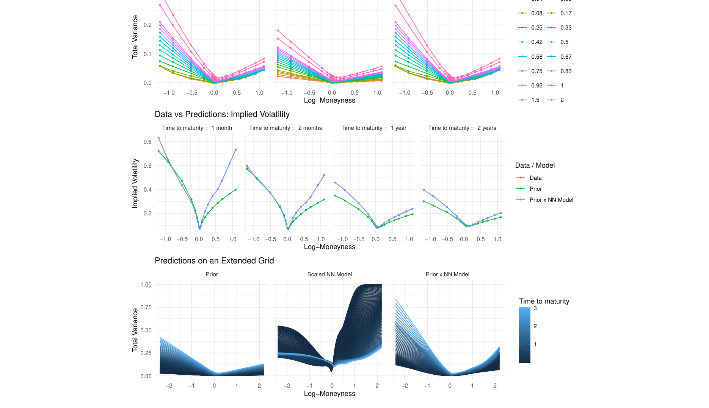

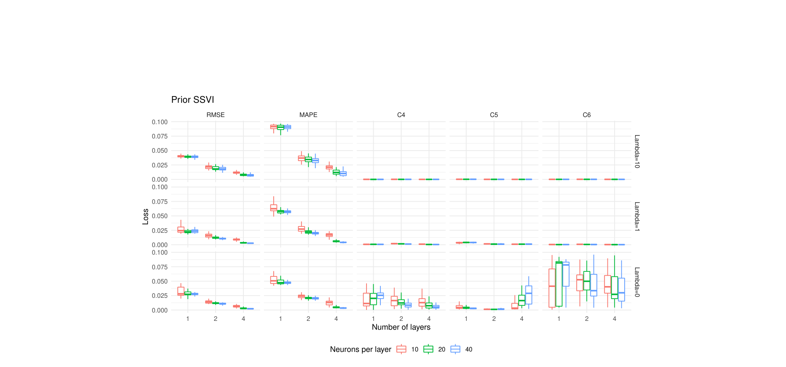

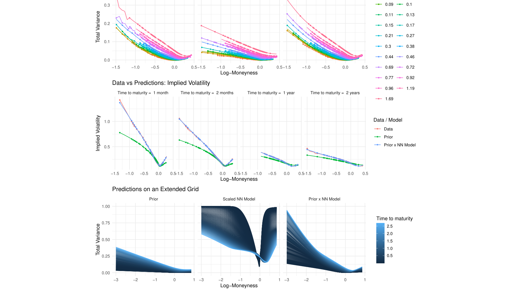

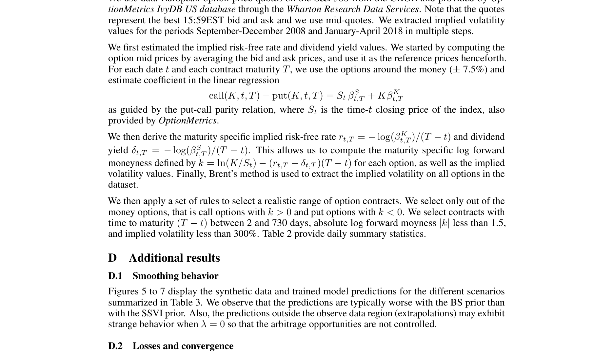

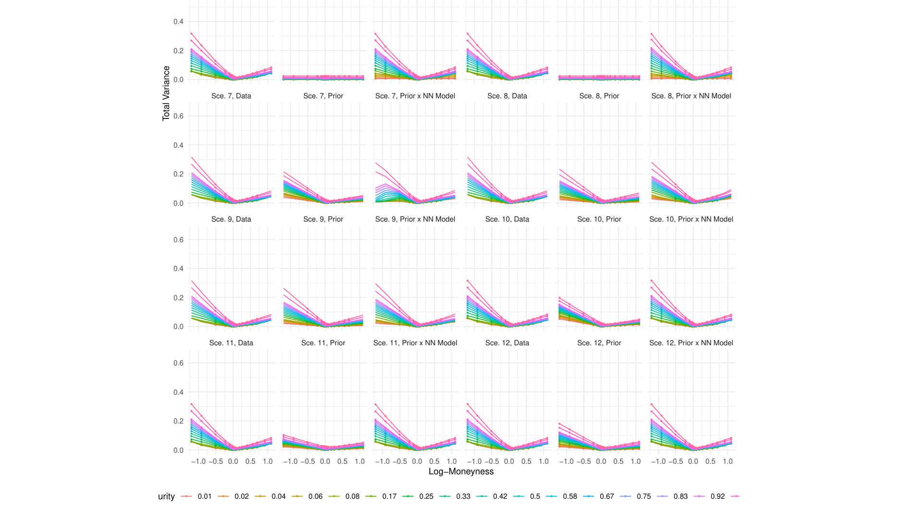

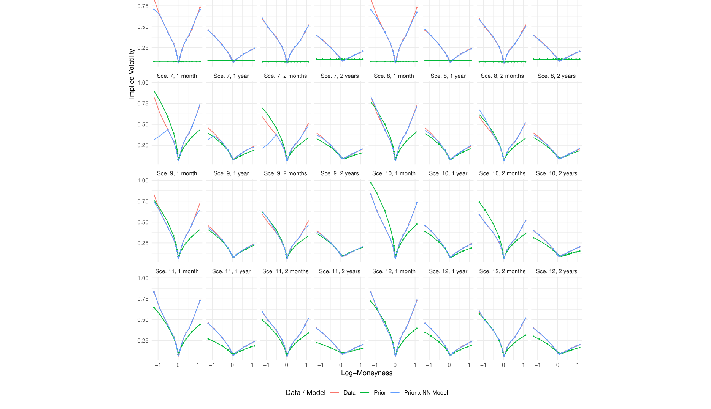

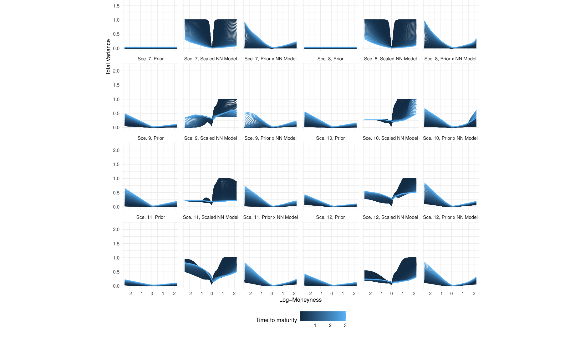

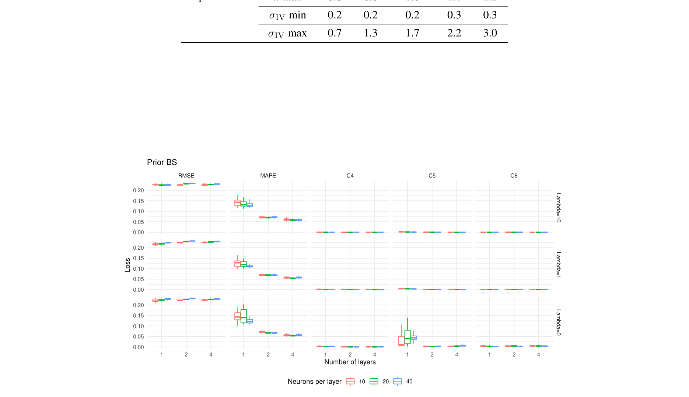

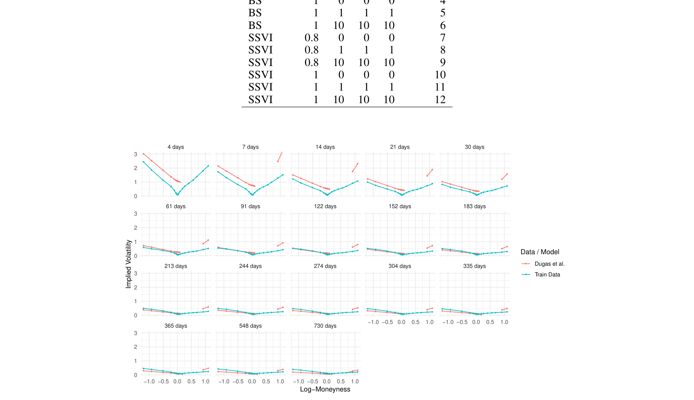

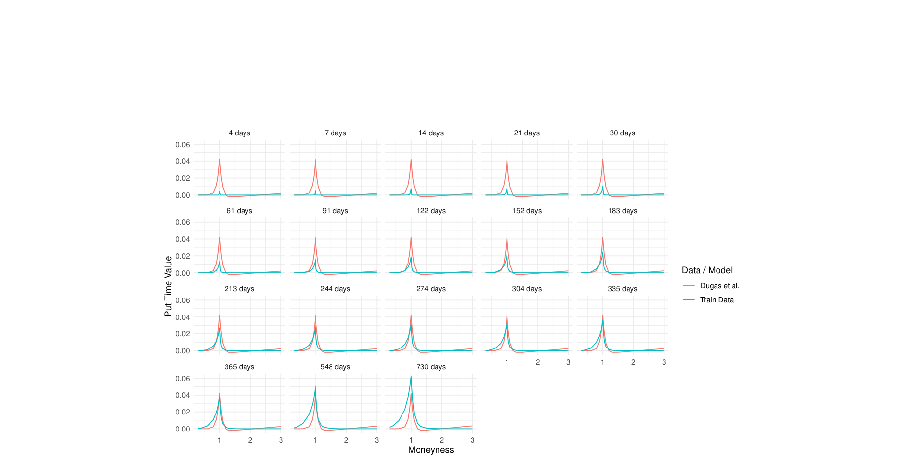

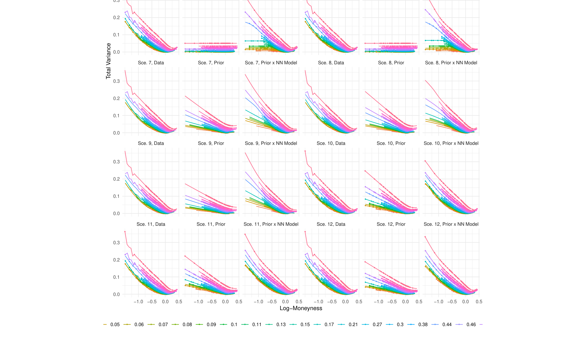

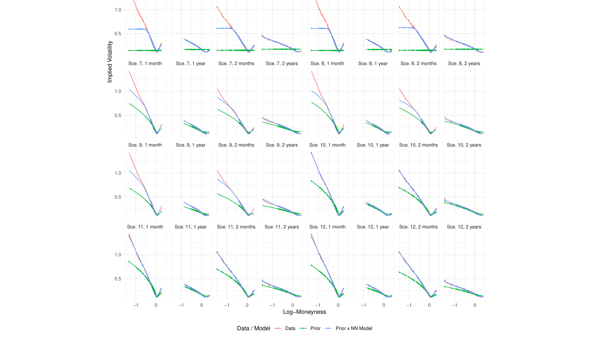

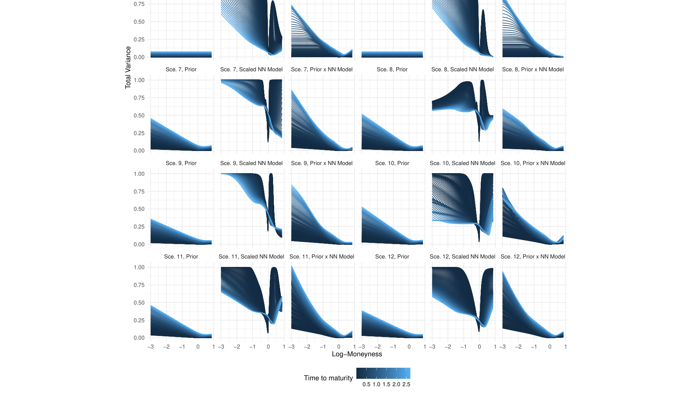

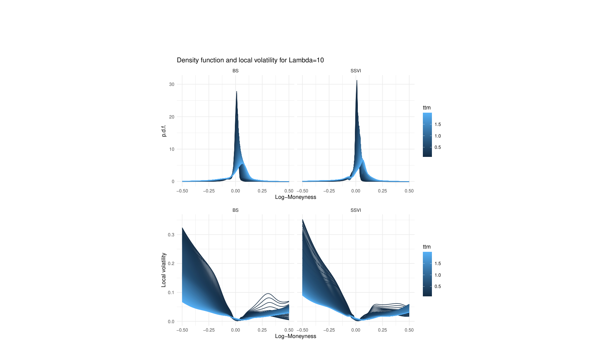

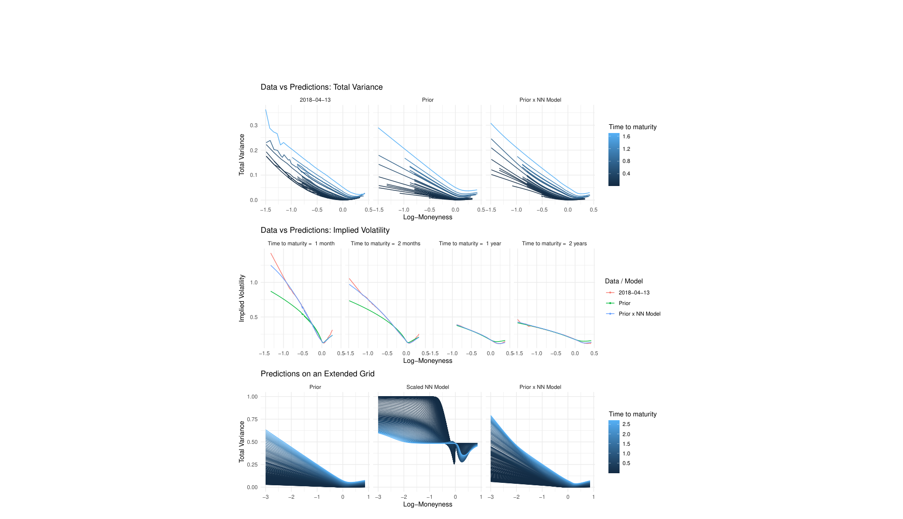

## Extraction Notes

- pdfplumber unusable table on page 7 index 8
- pdfplumber unusable table on page 7 index 9
- pdfplumber unusable table on page 7 index 10
- pdfplumber unusable table on page 8 index 1
- pdfplumber unusable table on page 8 index 2
- pdfplumber unusable table on page 8 index 3
- pdfplumber unusable table on page 8 index 4
- pdfplumber unusable table on page 8 index 5
- pdfplumber unusable table on page 8 index 6
- pdfplumber unusable table on page 8 index 7
- pdfplumber unusable table on page 8 index 8
- pdfplumber unusable table on page 8 index 9
- pdfplumber unusable table on page 8 index 10
- pdfplumber unusable table on page 8 index 11
- pdfplumber unusable table on page 8 index 12
- pdfplumber unusable table on page 8 index 13
- pdfplumber unusable table on page 8 index 14
- pdfplumber unusable table on page 8 index 15
- pdfplumber unusable table on page 9 index 5
- pdfplumber unusable table on page 9 index 6
- pdfplumber unusable table on page 9 index 7
- pdfplumber unusable table on page 9 index 8
- pdfplumber unusable table on page 9 index 9
- pdfplumber unusable table on page 14 index 1
- pdfplumber unusable table on page 14 index 2
- pdfplumber unusable table on page 18 index 2
- pdfplumber unusable table on page 18 index 5
- pdfplumber unusable table on page 18 index 8
- pdfplumber unusable table on page 18 index 11
- pdfplumber unusable table on page 18 index 14
- pdfplumber unusable table on page 18 index 17
- pdfplumber unusable table on page 20 index 1
- pdfplumber unusable table on page 20 index 2
- pdfplumber unusable table on page 20 index 3
- pdfplumber unusable table on page 20 index 4
- pdfplumber unusable table on page 20 index 5
- pdfplumber unusable table on page 20 index 6
- pdfplumber unusable table on page 20 index 7
- pdfplumber unusable table on page 20 index 8
- pdfplumber unusable table on page 20 index 9
- pdfplumber unusable table on page 20 index 10
- pdfplumber unusable table on page 20 index 11
- pdfplumber unusable table on page 20 index 12
- pdfplumber unusable table on page 20 index 13
- pdfplumber unusable table on page 20 index 14
- pdfplumber unusable table on page 20 index 15
- pdfplumber unusable table on page 20 index 16
- pdfplumber unusable table on page 20 index 17
- pdfplumber unusable table on page 20 index 18
- pdfplumber unusable table on page 20 index 19
- pdfplumber unusable table on page 20 index 20
- pdfplumber unusable table on page 20 index 21
- pdfplumber unusable table on page 20 index 22
- pdfplumber unusable table on page 20 index 23
- pdfplumber unusable table on page 20 index 24
- pdfplumber unusable table on page 20 index 25
- pdfplumber unusable table on page 20 index 26
- pdfplumber unusable table on page 20 index 27
- pdfplumber unusable table on page 20 index 28
- pdfplumber unusable table on page 20 index 29
- pdfplumber unusable table on page 20 index 30
- pdfplumber unusable table on page 20 index 31
- pdfplumber unusable table on page 20 index 32
- pdfplumber unusable table on page 20 index 33
- pdfplumber unusable table on page 20 index 34
- pdfplumber unusable table on page 20 index 35
- pdfplumber unusable table on page 20 index 36
- pdfplumber unusable table on page 21 index 1
- pdfplumber unusable table on page 21 index 2
- pdfplumber unusable table on page 21 index 3
- pdfplumber unusable table on page 21 index 4
- pdfplumber unusable table on page 21 index 5
- pdfplumber unusable table on page 21 index 6
- pdfplumber unusable table on page 21 index 7
- pdfplumber unusable table on page 21 index 8
- pdfplumber unusable table on page 21 index 9
- pdfplumber unusable table on page 21 index 10
- pdfplumber unusable table on page 21 index 11
- pdfplumber unusable table on page 21 index 12
- pdfplumber unusable table on page 21 index 13
- pdfplumber unusable table on page 21 index 14
- pdfplumber unusable table on page 21 index 15
- pdfplumber unusable table on page 22 index 13
- pdfplumber unusable table on page 22 index 14
- pdfplumber unusable table on page 22 index 15
- pdfplumber unusable table on page 22 index 16
- pdfplumber unusable table on page 22 index 17
- pdfplumber unusable table on page 22 index 18
- pdfplumber unusable table on page 23 index 1
- pdfplumber unusable table on page 23 index 2
- pdfplumber unusable table on page 23 index 3
- pdfplumber unusable table on page 23 index 4
- pdfplumber unusable table on page 23 index 5
- pdfplumber unusable table on page 23 index 6
- pdfplumber unusable table on page 23 index 7
- pdfplumber unusable table on page 23 index 8
- pdfplumber unusable table on page 23 index 9
- pdfplumber unusable table on page 23 index 10
- pdfplumber unusable table on page 23 index 11
- pdfplumber unusable table on page 23 index 12
- pdfplumber unusable table on page 23 index 13
- pdfplumber unusable table on page 23 index 14
- pdfplumber unusable table on page 23 index 15
- pdfplumber unusable table on page 23 index 16
- pdfplumber unusable table on page 23 index 17
- pdfplumber unusable table on page 23 index 18
- pdfplumber unusable table on page 23 index 19
- pdfplumber unusable table on page 23 index 20
- pdfplumber unusable table on page 23 index 21
- pdfplumber unusable table on page 23 index 22
- pdfplumber unusable table on page 23 index 23
- pdfplumber unusable table on page 23 index 26
- pdfplumber unusable table on page 23 index 28
- pdfplumber unusable table on page 24 index 2
- pdfplumber unusable table on page 24 index 5
- pdfplumber unusable table on page 24 index 8
- pdfplumber unusable table on page 24 index 11
- pdfplumber unusable table on page 24 index 14
- pdfplumber unusable table on page 24 index 17
- pdfplumber unusable table on page 25 index 1
- pdfplumber unusable table on page 25 index 2
- pdfplumber unusable table on page 25 index 3
- pdfplumber unusable table on page 25 index 4
- pdfplumber unusable table on page 25 index 5
- pdfplumber unusable table on page 25 index 6
- pdfplumber unusable table on page 25 index 7
- pdfplumber unusable table on page 25 index 8
- pdfplumber unusable table on page 25 index 9
- pdfplumber unusable table on page 25 index 10
- pdfplumber unusable table on page 25 index 11
- pdfplumber unusable table on page 25 index 12
- pdfplumber unusable table on page 25 index 14
- pdfplumber unusable table on page 25 index 18
- pdfplumber unusable table on page 25 index 22
- pdfplumber unusable table on page 25 index 25
- pdfplumber unusable table on page 25 index 26
- pdfplumber unusable table on page 25 index 27
- pdfplumber unusable table on page 25 index 28
- pdfplumber unusable table on page 25 index 29
- pdfplumber unusable table on page 25 index 30
- pdfplumber unusable table on page 25 index 31
- pdfplumber unusable table on page 25 index 32
- pdfplumber unusable table on page 25 index 33
- pdfplumber unusable table on page 25 index 34
- pdfplumber unusable table on page 25 index 35
- pdfplumber unusable table on page 25 index 36
- pdfplumber unusable table on page 25 index 38
- pdfplumber unusable table on page 25 index 40
- pdfplumber unusable table on page 25 index 42
- pdfplumber unusable table on page 25 index 44
- pdfplumber unusable table on page 25 index 46
- pdfplumber unusable table on page 25 index 48
- pdfplumber unusable table on page 26 index 1
- pdfplumber unusable table on page 26 index 2
- pdfplumber unusable table on page 26 index 3
- pdfplumber unusable table on page 26 index 4
- pdfplumber unusable table on page 26 index 5
- pdfplumber unusable table on page 26 index 6
- pdfplumber unusable table on page 26 index 7
- pdfplumber unusable table on page 26 index 8
- pdfplumber unusable table on page 26 index 9
- pdfplumber unusable table on page 26 index 10
- pdfplumber unusable table on page 26 index 11
- pdfplumber unusable table on page 26 index 12
- pdfplumber unusable table on page 26 index 13
- pdfplumber unusable table on page 26 index 14
- pdfplumber unusable table on page 26 index 15
- pdfplumber unusable table on page 26 index 16
- pdfplumber unusable table on page 26 index 17
- pdfplumber unusable table on page 26 index 18
- pdfplumber unusable table on page 26 index 19
- pdfplumber unusable table on page 26 index 20
- pdfplumber unusable table on page 26 index 21
- pdfplumber unusable table on page 26 index 22
- pdfplumber unusable table on page 26 index 23
- pdfplumber unusable table on page 26 index 24
- pdfplumber unusable table on page 26 index 25
- pdfplumber unusable table on page 26 index 26
- pdfplumber unusable table on page 26 index 27
- pdfplumber unusable table on page 26 index 28
- pdfplumber unusable table on page 26 index 29
- pdfplumber unusable table on page 26 index 30
- pdfplumber unusable table on page 26 index 31
- pdfplumber unusable table on page 26 index 32
- pdfplumber unusable table on page 26 index 33
- pdfplumber unusable table on page 26 index 34
- pdfplumber unusable table on page 26 index 35
- pdfplumber unusable table on page 26 index 36
- pdfplumber unusable table on page 28 index 1
- pdfplumber unusable table on page 28 index 2
- pdfplumber unusable table on page 28 index 3
- pdfplumber unusable table on page 28 index 4
- pdfplumber unusable table on page 29 index 1
- pdfplumber unusable table on page 29 index 2
- pdfplumber unusable table on page 29 index 3
- pdfplumber table quality filter dropped 126 low-quality table(s)
- pdfplumber table dedup removed 4 duplicate table(s)
- discarded 9 low-quality embedded figure(s)
