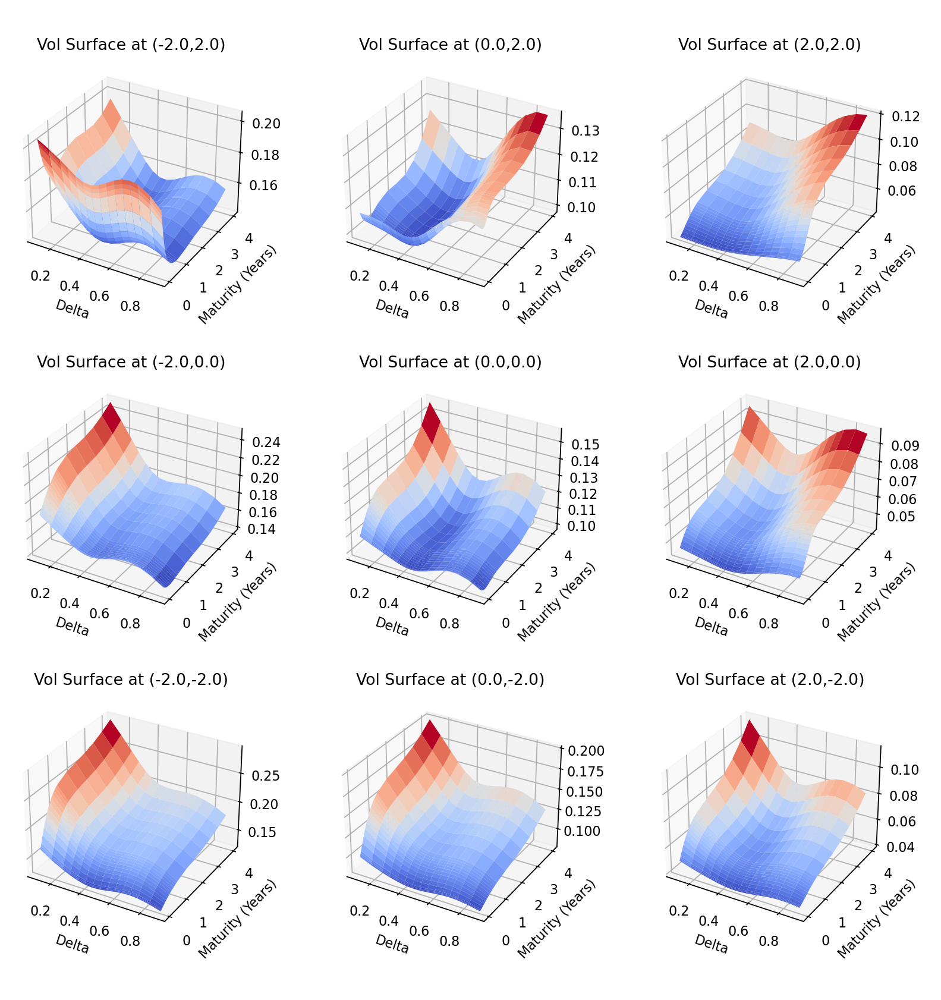
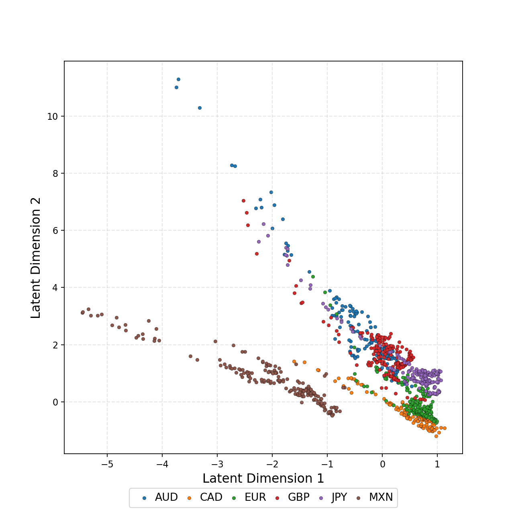

# Variational Autoencoders:

## Metadata

- **Source File:** `2102.03945v1.pdf`
- **Authors:** Unknown
- **Year:** 2021
- **DOI:** Unknown

## Abstract

Not found.

## Main Text

## Variational Autoencoders:
## A Hands-OffApproach to Volatility
## arXiv:2102.03945v1 [q-fin.CP] 7 Feb 2021
Maxime Bergeron, Nicholas Fung, John Hull, Zissis Poulos∗
### February 9, 2021
Maxime Bergeron is the Director of Research and Development at Riskfuel Analytics in
Toronto, ON, Canada.
mb@riskfuel.com
Nicholas Fung is a Masters student in the Edward S. Rogers Sr. Department of Electrical
& Computer Engineering at the University of Toronto, and a Research Associate at Riskfuel
Analytics in Toronto, ON, Canada.
nfung@ece.utoronto.ca
John Hull is a professor at the Joseph L. Rotman School of Management, University of
Toronto.
john.hull@rotman.utoronto.ca
Zissis Poulos is a postdoctoral fellow at the Joseph L. Rotman School of Management,
University of Toronto
zissis.poulos@rotman.utoronto.ca
Corresponding author:
Nicholas Fung
nfung@ece.utoronto.ca
∗We would like to thank Ryan Ferguson, Vlad Lucic, Ivan Sergienko, Andreas Veneris and Gary Wong for their
interest in this work as well as their many helpful comments. We would also like to thank Mitacs for providing
financial support for this research.
1

### Variational Autoencoders: A Hands-OffApproach to Volatility
Abstract
A volatility surface is an important tool for pricing and hedging derivatives. The surface
shows the volatility that is implied by the market price of an option on an asset as a function of
the option’s strike price and maturity. Often, market data is incomplete and it is necessary to
estimate missing points on partially observed surfaces. In this paper, we show how variational
autoencoders can be used for this task. The first step is to derive latent variables that
can be used to construct synthetic volatility surfaces that are indistinguishable from those
observed historically. The second step is to determine the synthetic surface generated by our
latent variables that fits available data as closely as possible. As a dividend of our first step,
the synthetic surfaces produced can also be used in stress testing, in market simulators for
developing quantitative investment strategies, and for the valuation of exotic options. We
illustrate our procedure and demonstrate its power using foreign exchange market data.
THREE KEY TAKEAWAYS:
1. We show how synthetic yet realistic volatility surfaces for an asset can be generated
using variational autoencoders trained on multiple assets at once.
2. We illustrate how variational autoencoders can be used to construct a complete volatility
surface when only a small number of points are available without making assumptions
about the process driving the underlying asset or the shape of the surface.
3. We empirically demonstrate our approach using foreign exchange data.
Keywords: Derivatives; Unsupervised learning; Variational autoencoders
JEL: G10, G20
2

The famous Black and Scholes (1973) formula does not provide a perfect model for pricing
options, but it has been very influential in the way traders manage portfolios of options
and communicate prices. The formula has the attractive property that it involves only one
unobservable variable: volatility. As a result, there is a one-to-one correspondence between
the volatility substituted into Black-Scholes and the option price. The volatility that is
consistent with the price of an option is known as its implied volatility. Traders frequently
communicate prices in the form of implied volatilities. This is convenient because implied
volatilities tend to be less variable than the prices themselves.
A volatility surface shows the implied volatility of an option as a function of its strike
price and time to maturity. If the Black-Scholes formula provided a perfect description of
prices in the market, the volatility surface for an asset would be flat (i.e., implied volatilities
would be the same for all strike prices and maturities) and never change. However, in practice,
volatility surfaces exhibit a variety of different shapes and vary through time.
Traders monitor implied volatilities carefully and use them to provide quotes and value
their portfolios. Option prices, and therefore implied volatilities, are of course determined
by supply and demand. When transactions for many different strike prices and maturities
are available on a particular day, there is very little uncertainty about the volatility surface.
However, in situations where only a few points on the surface can be reliably obtained, it is
necessary to develop a way of estimating the rest of the surface. We refer to this problem as
“completing the volatility surface”.
Black–Scholes assumes that the asset price follows geometric Brownian motion. This leads
to a lognormal distribution for the future asset price. Many other more sophisticated models
have been suggested in the literature in an attempt to fit market prices more accurately.
Some such as Heston (1993) assume that the volatility is stochastic. Others such as Merton
(1976) assume that a diffusion process for the underlying asset is overlaid with jumps. Bates
(1996) incorporates both a stochastic volatility and jumps. Madan, Carr, and Chang (1998)
propose a “variance-gamma” model where there are only jumps. Recently, rough volatility
models have been proposed by authors such as Gatheral, Jaisson, and Rosenbaum (2014). In
these, volatility follows a non-Markovian process. One approach to completing the volatility
surface is to assume one of these models and fit its parameters to the known points as closely
as possible.
Parametric models are another way to complete volatility surfaces. The popular stochastic
volatility inspired representation (Gatheral 2004), as well as its time dependent extension
(Gatheral and Jacquier 2013), characterizes the geometry of surfaces directly through each of
its parameters. Compared to stochastic volatility models, parameteric representations are
easier to calibrate and provide better fits to empirical data.
We propose an alternative deep learning approach using variational autoencoders (VAEs).
The advantage of the approach is that it makes no assumptions about the process driving
the underlying asset or the shape of the surface. The VAE is trained on historical data
from multiple assets to provide a way in which realistic volatility surfaces can be generated
3

from a small number of parameters. A volatility surface can then be completed by choosing
values for the parameters that fit the known points as closely as possible. VAEs also make it
possible to generate synthetic-yet-realistic surfaces, which can be used for other tasks such as
stress testing and in market simulators for developing quantitative investment strategies. We
illustrate our approach using data from foreign exchange.
Deep learning techniques are becoming widely used in the field of mathematical finance.
Ferguson and Green (2018) pioneered the use of neural networks for pricing exotic options.
Several researchers such as Hernandez (2016), Horvath, Muguruza, and Tomas (2019), and
Bayer et al. (2019) have used deep learning to calibrate models to market data. One advantage
of these approaches is that, once computational time has been invested upfront in developing
the model, results can be produced quickly. Our application of VAEs shares this advantage,
but also aims to empirically learn a parameterization of volatility surfaces.
Two works use deep learning to model volatility surfaces directly. Ackerer, Tagasovska,
and Vatter (2020) proposes an approach where volatility is assumed to be a product of an
existing model and a neural network. Chataigner, Cr´epey, and Dixon (2020) use neural
networks to model local volatility using soft and hard constraints inspired by existing models.
A potential disadvantage of both approaches is that they train the neural network on each
surface individually, which can be costly and impractical for real time inference. In contrast,
much of the robustness of our approach stems from the fact that we train our networks using
data from multiple different assets at once.
We conclude this introduction with a brief outline of the paper. Section 1 introduces
variational autoencoders. Section 2 describes how variational autoencoders can be applied to
volatility surfaces. Section 3 presents experimental results. Finally, conclusions are presented
in Section 4.
1.
Variational Autoencoders
The architecture of a vanilla neural network is illustrated in Exhibit 1. There are series
of hidden layers between the inputs (which form the input layer) and the outputs (which
form the output layer). The value at each neuron of a layer (except the input layer) is
F(c + wvT) where F is a nonlinear activation function, c is a constant, w is a vector of
weights and v is a vector of the values at the neurons of the immediately preceding layer.
Popular activation functions are the rectified linear unit (F(x) = max(x, 0)) and the sigmoid
1
function (F(x) =
1+e−x). The network’s parameters, c and w, are in general different for
each neuron. A training set consisting of inputs and outputs is provided to the network
and parameter values are chosen so that the network determines outputs from inputs as
accurately as possible. Further details are provided by Goodfellow et al (2017).
An autoencoder is a special type of neural network where the output layer is the same as
the input layer. The objective is to determine a small number of latent variables that are
capable of reproducing the inputs as accurately as possible. The architecture is illustrated
4

1st Hidden Layer
Lth Hidden Layer
Input layer
Output layer
. . .
h(1)
h(L)
0
0
y1
x1
h(1)
h(L)
1
1
. . .
y2
x2
...
...
...
...
. . .
yN
xM
h(L)
h(1)
m(L)
m(1)
Exhibit 1: A neural network with L hidden layers, with M inputs and N outputs. The ith
hidden layer contains m(i) neurons, and h(i)
k is the value at the kth neuron of hidden layer i.
Decoder D(z)
Encoder E(x)
Latent Encoding
z
Exhibit 2: An autoencoder can be split into encoder and decoder networks. Note that the
dimensionality of the latent encoding is typically smaller than the original input dimension.
in Exhibit 2. The encoding function E consists of a number of layers that produce a vector
of latent variables, z, from the vector of inputs, x. The decoder function, D, attempts to
reproduce the inputs from z. In the simple example in Exhibit 2, there are five input variables.
These are reduced to two variables by the encoder and the decoder attempts to reconstruct
the original five variables from the latent variables. The parameters of the neural network are
chosen to minimize the difference between D(z) and x. Specifically, we choose the network’s
parameters to minimize the reconstruction error (RE):
M
RE = 1
X
(xi −yi)2
(1)
M
i=1
where M is the dimensionality for the input and output, xi is the ith input value and yi
is the ith output value obtained by the decoder. Principal components analysis (PCA) is
5

an alternative approach to dimensionality reduction, and can be regarded as a degenerate
autoencoder without any hidden layers or nonlinear activation functions.1
A useful extension of autoencoders is the variational autoencoder (VAE), which was
introduced by Kingma and Welling (2014). As its name suggests, the VAE is closely linked to
variational inference methods in statistics, which aims to approximate intractable probability
distributions. Rather than producing latent variables in a deterministic manner, the latent
variable is sampled from a distribution that is parameterized by the encoder. By sampling
from the distribution, synthetic data similar to the input data can be generated. A useful
prior distribution for the latent variables is a multivariate normal distribution, N(0, I), where
the variables are uncorrelated with mean zero and standard deviation one. This is what we
will use in what follows. Contrary to deterministic autoencoders, there are now two parts to
the objective function which is to be minimized. The first part is the loss function in equation
(1). The second part is the Kullback-Leibler (KL) divergence between the parameterized
distribution and N(0, I). That is:
d
KL = 1
X
(−1 −log σ2
k + σ2
k + µ2
k)
(2)
2
k=1
where µk and σk are the mean and standard deviation of the kth latent variable. The objective
function is:
RE + βKL
(3)
where β is a hyperparameter that tunes the strength of the regularization provided by KL.
Note that in the limiting case where β goes to 0, the VAE behaves like a deterministic
autoencoder. The reason for introducing the KL divergence term in the loss function is to
encourage the model to encode a distribution that is as close to normal as possible. This
helps ensure stability during training and tractability during inference.
2.
Application for Volatility Surfaces
2.1
Implied Volatility Surfaces
We now show how VAEs can be applied to volatility surfaces. As mentioned earlier, a
volatility surface is a function of the strike price and time to maturity, where the implied
volatilities are obtained by inverting Black-Scholes on observed prices.
For a European call option with strike K ≥0, and time to maturity T > 0, let S0 denote
the current price of the underlying asset, and let r denote the (constant) risk-free rate. Let
Cmkt(K, T) denote the market price of this option, and let CBS be the price of this option
as predicted by the Black-Scholes formula (Black and Scholes 1973). The implied volatility
σ(K, T) ≥0 is implicitly defined by:
Cmkt(K, T) = CBS (S, K, T, r, σ(K, T)) .
(4)
1. Avellaneda et al (2020) provides a recent application of PCA to volatility surface changes.
6

The moneyness of an option is a measure of the extent to which the option is likely to be
exercised. A moneyness measure providing equivalent information to the strike price usually
replaces the strike price in the definition of the volatility surface. One common moneyness
measure is the ratio of strike price to asset price. Another is the delta of the option. The
delta is the partial derivative of the option price with respect to the asset price.2 Intuitively,
the delta approximates the probability that an option expires in-the-money. For a call option
on an asset this varies from zero for a deep out-of-the money option (high strike price) to
one for a deep in-the-money money option (low strike price). As per convention, we present
results on foreign exchange rates using delta as a measure of moneyness.
Many different shapes are observed for the surface and both the level of volatilities and
the shape of the surface can change through time. However, implied volatility surfaces do
not come in completely arbitrary shapes. Indeed, there are several restrictions on their
geometry arising from the absence of (static) arbitrage, that is, the existence of a trading
strategy providing instantaneous risk-free profit. Lucic (2019) provides a good discussion of
approaches that can be used to understand such constraints.3
2.2
Network Architecture
Inspired by Bayer et al. (2019), we considered two methods for modelling volatility surfaces:
the grid-based approach, and the pointwise approach. Exhibit 3 provides an illustration of
the differences between these approaches. In both approaches, the input to the encoder is a
volatility surface, sampled at N prespecified grid points, which is then flattened into a vector,
as shown in Exhibit 3a. Exhibit 3b illustrates the grid-based approach, which follows the
same architecture as traditional VAEs, where the decoder uses a d-dimensional latent variable
to reconstruct the original grid points. Finally, the pointwise approach, as shown in Exhibit
3c is an alternative architecture where the option parameters (moneyness and maturity)
are defined explicitly. Concretely, the input for the pointwise decoder is a single option’s
parameters and the latent variable for the entire surface, and the output is a single point on
the volatility surface. We can then use batch inference to output all volatility surface points.
While Bayer et al. opt to use the grid-based approach for their application, we choose
the pointwise approach for greater expressivity. The pointwise approach has the advantage
that interpolation is performed entirely by neural networks and therefore the derivatives with
respect to option parameters (the “Greeks”) can be calculated precisely and efficiently using
backpropagation. This is not true for the grid-based approach, where derivatives need to be
approximated.
Throughout our investigation, we found that VAEs interpolated volatility surfaces quite
well even in environments with limited data. However, as usual, if more data is available it
should be used since it will improve results. We also experimented with VAEs that were
penalized for constructing surfaces that exhibited arbitrage. Nevertheless, we found that this
2. The partial derivative is calculated using the Black-Scholes model with volatility set equal to the implied volatility.
3. For convenience, we also include the conditions that we use to check for static arbitrage in Appendix A.
7

Input layer
Output layer
. . .
z1
σ (T1, K1)
. . .
z2
σ (T2, K2)
...
...
...
...
. . .
zd
σ (TN, KN)
(a) The encoder architecture
Input layer
Output layer
. . .
z1
σ (T1, K1)
. . .
z2
σ (T2, K2)
...
...
...
...
. . .
zd
σ (TN, KN)
(b) The decoder architecture for the grid-based training approach.
Input layer
. . .
z1
Output layer
...
. . .
zd
σ(T, K; z1, . . . , zd)
...
...
T
. . .
K
(c) The decoder architecture for the pointwise training approach.
Exhibit 3: An illustration of the grid-based and pointwise architectures.
8

did not significantly improve results, as the majority of surfaces produced by our VAEs did
not exhibit arbitrage. For further details, we refer the reader to Appendix A.
2.3
Use Cases
Once the VAE has been trained, the network’s parameters can be fixed and used for
inference tasks. During the calibration procedure, the goal is to identify the latent variables
such that the outputs of the decoder match the market data as closely as possible. We
propose two methods for calibration. One method is to use the encoder to infer the latent
variables. The alternative is to use the decoder in conjunction with an external optimizer
(such as the Levenberg-Marquardt algorithm) to minimize the reconstruction loss. While the
former is more computationally efficient, requiring only a single pass through the network,
the latter is more suitable when option data is sparse.
After the parameters have been calibrated, the VAE can be used to infer unobserved
option prices. Although we focus on the use of VAEs for completing volatility surfaces,
there are several other notable applications. In lieu of PCA, VAEs can be used for efficient
dimensionality reduction to analyze the dynamics of volatility surfaces. Additionally, the
model can be used to generate synthetic-yet-realistic volatility surfaces which can be used in
stress tests, or for inputs to other analyses such as the valuation of exotic options.
3.
Experimental Results
3.1
Methodology
To test our methodology, we use over-the-counter option data from 2012–2020 for the
AUD/USD, USD/CAD, EUR/USD, GBP/USD and USD/MXN
currency pairs, provided by Exchange Data International. The prespecified grid we chose
consists of 40 points formed from eight times to maturity (one week, one month, two months,
three months, six months, nine months, one year and three years) and five different deltas
(0.1, 0.25, 0.5, 0.75 and 0.9). As prices are quoted for at-the-money (ATM), butterfly, and
risk-reversal options, we use the equations provided in Reiswich and Wystup (2012) to obtain
the implied volatilities for the call options (for further details refer to Clark (2010)).
The dataset is partitioned into a training set, which is used to train the VAE, and a
validation set, which is used to evaluate performance. The partitions are split chronologically
to prevent leakage of information. We use 15% of available data as the validation set, which
contains data from March 2020 – December 2020.
We find that the choice of network architecture makes a marginal difference to the results,
and so we choose to use two hidden layers in the encoder and decoder, with 32 units in
each layer. We leave the latent dimension (i.e., the dimension of the encoder output) to
be a variable in our experiments. To train our model, we minimize the objective function
9

in equation (3) using the Adam optimizer from Kingma and Ba (2017). With various
combinations of hyperparameters, including learning rate and batch size, we use a random
grid search to identify suitable hyperparameter choices to optimally balance the reconstruction
loss and KL divergence to ensure continuity in latent space.
3.2
Completing Volatility Surfaces
To evaluate the model’s ability to complete volatility surfaces, we randomly sample a
subset of all options observed on a given day, and assume that these provide the only known
points on the volatility surface. We then use these points to calibrate our model using a
gradient based optimizer4, minimizing the reconstruction error in equation (1). All 40 option
prices are then predicted using the inferred latent variables. We vary the number of sample
points and the number of latent dimensions in the trained VAEs to see how our model
performs in various conditions.
Initially, we trained VAEs on volatility surfaces from single currency pairs. However, we
found that training models using data from multiple currencies yielded more robust models.
Exhibit 4(a) shows the mean absolute error when the models are trained using only the
AUD/USD data, while Exhibit 4(b) shows the mean absolute errors when VAEs are trained
using volatility surfaces from all six currency pairs. It can be seen that in all but two cases
better results are achieved by training the model on all six currency pairs. This suggests that
there is similarity in the drivers of volatility surfaces across different currency pairs.
To compare our results to traditional volatility models, we perform the same task using
Heston. The mean absolute error for each currency in the validation set is shown in Exhibit
5, where we compare Heston to our best performing model from Exhibit 4. In addition
to consistently outperforming Heston in reconstructing volatility surfaces, there are some
additional practical benefits from using VAEs. A primary advantage of using the VAE is that
it predicts prices significantly faster, which makes calibration much more efficient. Another
advantage is that regularization during training encourages latent space to be continuous
– small perturbations in latent space result in small perturbations in the volatility surface.
This is not true for a model such as Heston, as the inverse map from market prices to model
parameters can be multivalued. Finally we highlight the flexibility of using our approach.
When extreme market conditions are encountered, a VAE can be easily retrained. In our
experience, this can be done in only a few minutes using just over 10,000 surfaces.
To investigate where our model performs the best, we calculate the mean absolute error
for individual grid points. We found that the parts of the volatility surface that correspond to
options that are close to expiry have the greatest error. This is not surprising as these options,
particularly when they are close to the money, exhibit the most volatile prices. We note that
our models were trained using an equal weighting of all options, however practitioners can
easily alter the weights to suit their requirements.
4. We use the L-BFGS algorithm.
10

Assumed Number of Known Points on Volatility Surface
Latent
5
10
15
20
25
30
35
40
Dimensions
2
87.2
77.7
75.9
74.5
73.1
73.0
72.9
72.7
3
77.2
66.4
62.4
60.0
59.0
58.0
57.5
57.2
4
73.2
57.8
53.7
50.1
48.5
47.0
46.9
46.5
(a) Models trained using only AUD/USD volatility surfaces.
Assumed Number of Known Points on Volatility Surface
Latent
5
10
15
20
25
30
35
40
Dimensions
2
107.6
82.5
71.4
64.2
63.9
63.5
63.5
63.3
3
75.9
53.8
49.8
48.2
47.0
46.6
46.5
46.3
4
61.1
41.5
37.7
35.9
34.7
34.2
34.1
33.6
(b) Models trained using all available currency pairs.
Exhibit 4: The mean absolute error across the AUD/USD validation set for inferring
volatility surfaces when given partial observations. Each row contains a trained model with a
different number of latent dimensions. Units are in basis points.
Model
Heston
VAE
Currency Pair
AUD/USD
56.6
33.6
USD/CAD
35.3
32.5
EUR/USD
32.2
30.9
GBP/USD
47.6
34.0
USD/JPY
58.5
38.2
USD/MXN
92.2
56.7
Exhibit 5: Mean absolute error when calibrating using Heston and a four-dimensional VAE.
All 40 points of the volatility surface are observed for calibration. Units are in basis points.
11

3.3
Generating Synthetic Surfaces
As mentioned, VAEs can be useful for generating synthetic volatility surfaces (e.g. for stress
testing a portfolio) as well as for completing partially observed surfaces. A straightforward
approach is to sample a latent variable from the prior distribution (in this case, a normal
distribution), and use the decoder to construct a volatility surface. To show that this would
yield a variety of volatility surfaces, we interpolate between points in latent space and
construct the corresponding surface. This is illustrated in the case of a two-dimensional VAE
in Exhibit 6. While, in general, interpreting the latent dimensions of a VAE is a non-trivial
task, we can observe how the direction of skew and the term structure of volatility varies
across both dimensions. A rich variety of volatility surface patterns are obtained.
Exhibit 6: Examples of synthetic volatility surfaces generated when interpolating across
two latent dimensions.
12

We may wish to observe the behavior of volatility surfaces in specific scenarios. Exhibit 7
shows the encoded latent variables for the volatility surfaces in the validation set. While the
majority of the points are clustered near the origin, we notice many outliers which correspond
to volatility surfaces observed at the beginning of the international pandemic in March 2020.
By sampling latent variables in these outlying regions, we can simulate extreme scenarios
that may occur.
Exhibit 7: Latent (colour coded) encodings of implied volatility surfaces
13

4.
Conclusion
Our results demonstrate that VAEs provide a useful approach to analyzing volatility
surfaces empirically. We have described how a VAE can be trained, and used the context of
foreign exchange markets as a realistic testing ground. Our results show that volatility surfaces
can be captured using VAEs with as few as two latent dimensions and that the resulting
models can be used for practical and exploratory purposes. For the sake of concreteness, we
limited the scope of this paper to VAEs with Gaussian priors. In future work it should be
determined if a VAE model without Gaussian priors is able to learn an even wider range of
market behaviours while retaining the stability of our model.
14

References
Ackerer, Damien, Natasa Tagasovska, and Thibault Vatter. 2020. “Deep Smoothing of
the Implied Volatility Surface.” ArXiv: 1906.05065, arXiv:1906.05065 [cs, q-fin, stat],
accessed October 21, 2020. http://arxiv.org/abs/1906.05065.
Bates, David S. 1996. “Jumps and Stochastic Volatility: Exchange Rate Processes Implicit
in Deutsche Mark Options.” The Review of Financial Studies 9 (1): 69–107. issn:
0893-9454, accessed February 2, 2021. https://doi.org/10.1093/rfs/9.1.69. https:
//doi.org/10.1093/rfs/9.1.69.
Bayer, Christian, Blanka Horvath, Aitor Muguruza, Benjamin Stemper, and Mehdi Tomas.
2019. “On deep calibration of (rough) stochastic volatility models.” ArXiv: 1908.08806,
arXiv:1908.08806 [q-fin], accessed November 16, 2020. http://arxiv.org/abs/1908.08806.
Black, Fischer, and Myron Scholes. 1973. “The Pricing of Options and Corporate Liabilities.”
The Journal of Political Economy 81 (3): 637–654. http://www.jstor.org/stable/1831029.
Chataigner, Marc, St´ephane Cr´epey, and Matthew Dixon. 2020. “Deep Local Volatility.”
ArXiv: 2007.10462, arXiv:2007.10462 [q-fin], accessed October 23, 2020. http://arxiv.
org/abs/2007.10462.
Clark, Iain J. 2010. “Foreign Exchange Option Pricing.” Foreign Exchange Option Pricing,
300.
Ferguson, Ryan, and Andrew Green. 2018. “Deeply Learning Derivatives.” ArXiv: 1809.02233,
arXiv:1809.02233 [cs, q-fin], accessed June 17, 2020. http://arxiv.org/abs/1809.02233.
Gatheral, Jim. 2004. “A parsimonious arbitrage-free implied volatility parameterization with
application to the valuation of volatility derivatives,” 41. http://faculty.baruch.cuny.
edu/jgatheral/madrid2004.pdf.
Gatheral, Jim, and Antoine Jacquier. 2013. “Arbitrage-free SVI volatility surfaces.” ArXiv:
1204.0646, arXiv:1204.0646 [q-fin], accessed October 30, 2020. http://arxiv.org/abs/
1204.0646.
Gatheral, Jim, Thibault Jaisson, and Mathieu Rosenbaum. 2014. “Volatility is rough.” ArXiv:
1410.3394, arXiv:1410.3394 [q-fin], accessed February 2, 2021. http://arxiv.org/abs/
1410.3394.
Hernandez, Andres. 2016. Model Calibration with Neural Networks. SSRN Scholarly Paper ID
2812140. Rochester, NY: Social Science Research Network. Accessed June 13, 2020.
https://doi.org/10.2139/ssrn.2812140. https://papers.ssrn.com/abstract=2812140.
Heston, Steven. 1993. “A Closed-Form Solution for Options with Stochastic Volatility with
Applications to Bond and Currency Options.” https://doi.org/10.1093/rfs/6.2.327.
Horvath, Blanka, Aitor Muguruza, and Mehdi Tomas. 2019. “Deep Learning Volatility.”
ArXiv: 1901.09647, arXiv:1901.09647 [q-fin], accessed May 28, 2020. http://arxiv.org/
abs/1901.09647.
15

Kingma, Diederik P., and Jimmy Ba. 2017. “Adam: A Method for Stochastic Optimization.”
ArXiv: 1412.6980, arXiv:1412.6980 [cs], accessed November 25, 2020. http://arxiv.org/
abs/1412.6980.
Kingma, Diederik P., and Max Welling. 2014. “Auto-Encoding Variational Bayes.” ArXiv:
1312.6114, arXiv:1312.6114 [cs, stat], accessed November 25, 2020. http://arxiv.org/
abs/1312.6114.
Lucic, Vladimir. 2019. Volatility Notes. SSRN Scholarly Paper ID 3211920. Rochester, NY:
Social Science Research Network. Accessed December 23, 2020. https://doi.org/10.2139/
ssrn.3211920. https://papers.ssrn.com/abstract=3211920.
Madan, Dilip B., Peter P. Carr, and Eric C. Chang. 1998. “The Variance Gamma Process and
Option Pricing.” Review of Finance 2 (1): 79–105. issn: 1572-3097, 1573-692X, accessed
February 2, 2021. https://doi.org/10.1023/A:1009703431535. https://academic.oup.com/
rof/article/2/1/79/1581894.
Merton, Robert C. 1976. “Option pricing when underlying stock returns are discontinuous.”
Journal of Financial Economics 3 (1): 125–144. issn: 0304-405X, accessed February 2,
2021. https://doi.org/10.1016/0304-405X(76)90022-2. http://www.sciencedirect.com/
science/article/pii/0304405X76900222.
Reiswich, Dimitri, and Uwe Wystup. 2012. “FX Volatility Smile Construction.” Wilmott
2012 (60): 58–69. issn: 15406962, accessed November 26, 2020. https://doi.org/10.1002/
wilm.10132. http://doi.wiley.com/10.1002/wilm.10132.
16

Appendix A.
Arbitrage Conditions
Following Gatheral and Jacquier (2013), we can specify static arbitrage conditions as
follows: Let Ft denote the forward price at time t and X = log K
Ft. Define w(X, t) = t·σ2(X, t)
as the total implied variance surface. An IVS is free of calendar arbitrage if
∂w
∂t ≥0.
(5)
Let w′ = ∂w
∂X and w′′ = ∂2w
∂X2. Suppressing the arguments for w(X, t), the volatility surface is
free of butterfly arbitrage if
 1
1 −Xw′
−w′
+ w′′
w + 1
2


2 ≥0.
g(X, t) :=
(6)
2w
4
4
A volatility surface is said to be free of static arbitrage if the conditions in equation (6) and
(5) are met.
If we let
2

max
0, −∂w

Lcal =
,
(7)
∂t
and
Lbut = ∥max(0, −g)∥2 ,
(8)
the loss function in equation (3) can then be extended as follows:
RE + βKL + λcalLcal + λbutLbut.
(9)
As the parameters λcal and λbut are increased, the possibility of static arbitrage is reduced.
17

## Tables

### Table 1

|  | Assumed Number of Known Points on Volatility Surface |  |  |  |  |  |  |  |
| --- | --- | --- | --- | --- | --- | --- | --- | --- |
| Latent Dimensions | 5 | 10 | 15 | 20 | 25 | 30 | 35 | 40 |
| 2 | 87.2 | 77.7 | 75.9 | 74.5 | 73.1 | 73.0 | 72.9 | 72.7 |
| 3 | 77.2 | 66.4 | 62.4 | 60.0 | 59.0 | 58.0 | 57.5 | 57.2 |
| 4 | 73.2 | 57.8 | 53.7 | 50.1 | 48.5 | 47.0 | 46.9 | 46.5 |

Raw CSV: `assets/table_001.csv`

### Table 2

|  | Assumed Number of Known Points on Volatility Surface |  |  |  |  |  |  |  |
| --- | --- | --- | --- | --- | --- | --- | --- | --- |
| Latent Dimensions | 5 | 10 | 15 | 20 | 25 | 30 | 35 | 40 |
| 2 | 107.6 | 82.5 | 71.4 | 64.2 | 63.9 | 63.5 | 63.5 | 63.3 |
| 3 | 75.9 | 53.8 | 49.8 | 48.2 | 47.0 | 46.6 | 46.5 | 46.3 |
| 4 | 61.1 | 41.5 | 37.7 | 35.9 | 34.7 | 34.2 | 34.1 | 33.6 |

Raw CSV: `assets/table_002.csv`

### Table 3

|  | Model |  |
| --- | --- | --- |
| Currency Pair | Heston | VAE |
| AUD/USD | 56.6 | 33.6 |
| USD/CAD | 35.3 | 32.5 |
| EUR/USD | 32.2 | 30.9 |
| GBP/USD | 47.6 | 34.0 |
| USD/JPY | 58.5 | 38.2 |
| USD/MXN | 92.2 | 56.7 |

Raw CSV: `assets/table_003.csv`

## Figures

## Extraction Notes

- pdfplumber unusable table on page 5 index 1
