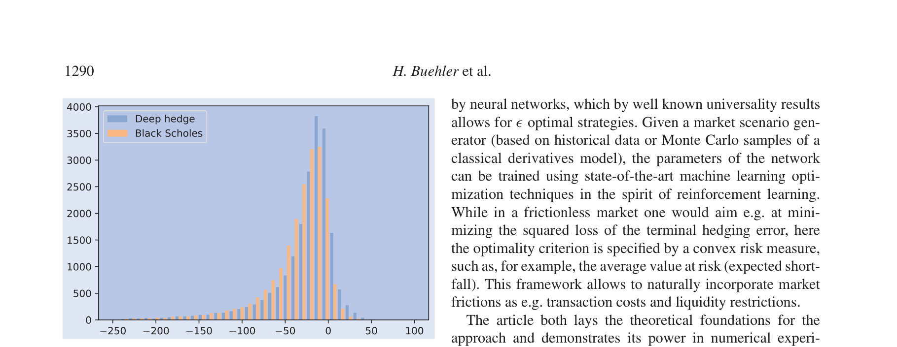

# Deep hedging

## Metadata

- **Source File:** `Deep hedging.pdf`
- **Authors:** H. Buehler1, L. Gonon, J. Teichmann, B. Wood1
- **Year:** 2019
- **DOI:** 10.1080/14697688.2019.1571683

## Abstract

Not found.

## Main Text

### Quantitative Finance
ISSN: 1469-7688 (Print) 1469-7696 (Online) Journal homepage: www.tandfonline.com/journals/rquf20
## Deep hedging
H. Buehler, L. Gonon, J. Teichmann & B. Wood
To cite this article: H. Buehler, L. Gonon, J. Teichmann & B. Wood (2019) Deep hedging,
Quantitative Finance, 19:8, 1271-1291, DOI: 10.1080/14697688.2019.1571683
To link to this article: https://doi.org/10.1080/14697688.2019.1571683
Published online: 21 Feb 2019.
Submit your article to this journal
Article views: 9374
View related articles
View Crossmark data
Citing articles: 105 View citing articles
Full Terms & Conditions of access and use can be found at
https://www.tandfonline.com/action/journalInformation?journalCode=rquf20

Quantitative Finance, 2019
Vol. 19, No. 8, 1271–1291, https://doi.org/10.1080/14697688.2019.1571683
## Deep hedging
H. BUEHLER†§, L. GONON‡*, J. TEICHMANN‡ and B. WOOD†§
†J.P. Morgan, London, UK
‡Eidgenössische Technische Hochschule Zürich, Zürich, Switzerland
(Received 15 February 2018; accepted 9 January 2019; published online 21 February 2019)
We present a framework for hedging a portfolio of derivatives in the presence of market frictions such as transaction costs, liquidity constraints or risk limits using modern deep reinforcement
machine learning methods. We discuss how standard reinforcement learning methods can be applied
to non-linear reward structures, i.e. in our case convex risk measures. As a general contribution to the use of deep learning for stochastic processes, we also show in Section 4 that the
set of constrained trading strategies used by our algorithm is large enough to ϵ-approximate any
optimal solution. Our algorithm can be implemented efficiently even in high-dimensional situations using modern machine learning tools. Its structure does not depend on specific market
dynamics, and generalizes across hedging instruments including the use of liquid derivatives. Its
computational performance is largely invariant in the size of the portfolio as it depends mainly
on the number of hedging instruments available. We illustrate our approach by an experiment
on the S&P500 index and by showing the effect on hedging under transaction costs in a synthetic market driven by the Heston model, where we outperform the standard ‘complete-market’
solution.
Keywords: Reinforcement learning; Machine learning; Market frictions; Transaction costs;
Hedging; Risk management; Portfolio optimization
JEL Classification: C45
1. Introduction
such approaches are limited and it is in any model-driven
decision making process easy to imagine market environThe problem of pricing and hedging portfolios of derivatives
ments where the model-driven decisions actually fail to hedge
is crucial for pricing risk-management in the financial secuproperly.
rities industry. In idealized frictionless and ‘complete-market’
In real markets, though, trading in any instrument is subject
models, mathematical finance provides, with risk-neutral pricto transaction costs, permanent market impact and liquiding and hedging, a tractable solution to this problem. Most
ity constraints. Furthermore, any trading desk is typically
commonly, in such models only the primary asset such as the
also limited by its capacity for risk and stress, or more genequity and a few additional factors are modeled. Arguably,
erally capital. This requires traders to overlay the trading
the most successful such model for equity models is Dupire’s
strategy implied by the greeks computed from the completeLocal Volatility (Dupire 1994), see e.g. Crépey (2004). For
market model with their own adjustments. It also means that
risk management, we will then compute ‘greeks’ with respect
pricing and risk are not linear but dependent on the overnot only to spot but also to calibration input parameters such
all book: a new trade which reduces the risk in a particular
as forward rates and implied volatilities—even if such quantidirection can be priced more favorably. This phenomenon is
ties are not actually state variables in the underlying model.
called having an ‘axe’.
Essentially models are used as a low dimensional interpoThe prevalent use of the complete-market models is due
lation technique of the hedging instruments and the marto a lack of efficient alternatives; even with the impressive
ket information from which hedging decisions are derived.
progress made in the last years for example with respect to
Under complete-market assumptions, pricing and risk of
robust hedging or super-hedging, there are still few solua portfolio of derivatives is additionally linear. Of course
tions which will scale well over a large portfolio of instruments, and which do not depend on the underlying market
dynamics.
*Corresponding author. Email: lukas.gonon@math.ethz.ch
§Opinions expressed in this paper are those of the authors, and do
Our deep hedging approach addresses this deficiency.
not necessarily reflect the view of J.P. Morgan.
Essentially, we model the trading decisions in our hedging
© 2019 Informa UK Limited, trading as Taylor & Francis Group

1272
strategies as neural networks; their feature sets consist not
1.1. Comparison to standard hedging techniques
only of prices of our hedging instruments but may also contain
We want to emphasize that our deep hedging methodology is
additional information such as trading signals, news analytics
generic, i.e. for any sufficiently rich set of market scenarios
or past hedging decisions—quantitative information a human
we can calculate hedging strategies for any pre-specified set
trader might use, in a true machine learning fashion.
of hedging instruments in the presence of any sort of marSuch deep hedging strategies can be described and trained
ket frictions and any risk quantification methodology in an
(optimized in classical language) in a very efficient way, while
efficient way. In contrast to most of the industry applied meththe respective algorithms are entirely model-free and do not
ods the hedging strategies are not calculated within a model
depend on the chosen market dynamics. That means we can
framework.
include market frictions such as transaction costs, liquidity
We have compared our methodology to the following stanconstraints, bid/ask spreads, etc., all potentially dependent on
dard methodology: ‘take a classical stochastic price model,
the features of the scenario.
calibrate it to market data and calculate the model hedge for a
The modeling task now amounts to specifying a market
given payoff and risk quantification methodology’. As a first
scenario generator, a loss function, market frictions and tradexample we have taken a Heston model and used equity and a
ing instruments. This approach lends itself well to statistically
variance swap as hedging instruments. We could have chosen
driven market dynamics. That also means that we do not need
here any other setup with known hedging strategies. In other
to compute greeks of individual derivatives with a classic
words: the complexity of our methodology is not influenced
derivative pricing model. In fact, we will need no such ‘equivby the nature of the law on path space. In addition, as a second
alent martingale measure model’: our approach is greek-free.
example we have fitted a standard econometric model to the
Instead, we can focus our modeling effort on realistic marS&P500 index and evaluated the hedging performance on real
ket dynamics and the actual out-of-sample performance of our
data.
hedging signal.
Of course, in specific situations, e.g. when hedging vanilla
High level optimizers then find reasonably good strategies
options on a single underlying for which a lot of option
to achieve good out-of-sample hedging performance under
price data is available, there are many well-established meththe stated objective. In our examples, we are using gradient
ods, see e.g. Bates (2005), Alexander and Nogueira (2007),
descent ‘Adam’ (Kingma and Ba 2015) minibatch training for
Sepp (2012) and Hull and White (2017). The key contribution
a semi-recurrent reinforcement learning problem.
of the present work is that the proposed methodology is not
To illustrate our approach, we will build on ideas from
limited to such situations. We also want to point out that most
Föllmer and Leukert (2000) and Ilhan et al. (2009) and optiof the standard methods do neither take into account market
mize hedging of a portfolio of derivatives under convex risk
frictions nor trading constraints.
measures. To be able to compare our results with classic
We plan in a future work to quantify first time model risk,
complete-market results, we chose in this article to drive the
i.e. the likely mis-specification of the scenario generation,
market with a Heston model. To show that the approach is
since we can optimize over different scenario generators due
also feasible in practice, these results are complemented by
to the generic character of our approach.
an experiment on the S&P500 index. We re-iterate that our
algorithm is not dependent on the choice of the model.
To illustrate our algorithm, we investigate the following
1.2. Related literature
questions:
There is a vast literature on hedging in market models with
• Section 5.2: How does neural network hedging (for
frictions. We only highlight a few to demonstrate the complex
different risk-preferences) compare to the benchcharacter of the problem. Hedging and utility indifference
mark in a Heston model without transaction costs?
pricing under transaction costs has been studied starting with
• Section 5.3: What is the effect of proportional transHodges and Neuberger (1989) and Davis et al. (1993). As
action costs on the exponential utility indifference
apparent from these papers, calculating the exponential utility
price?
indifference price for a call option even in a Black–Scholes
• Section 5.4: Is the numerical method scalable to
model requires solving a multidimensional non-linear free
higher dimensions?
boundary problem. This has motivated studies on asymp-
• Section 5.5: How does it work in practice, e.g. when
totic behavior of prices and strategies as e.g. in Whalley and
compared to a daily-recalibrated Black–Scholes
Wilmott (1997), Barles and Soner (1998), Kallsen and Muhlemodel on the S&P500 index?
Karbe (2015). For extensive lists of references, which also
cover alternative approaches and portfolio choice problems
Our analysis is based on out-of-sample performance.
under transaction costs, we refer to Carmona (2009), Kabanov
To calculate our hedging strategies numerically, we approxand Safarian (2009), recent contributions as e.g. (Bouchard et
imate them by deep neural networks. State-of-the-art machine
al. 2016) and the survey (Muhle-Karbe et al. 2017).
learning optimization techniques (see Goodfellow et al. 2016)
A closely related setting, which is also covered by our
are then used to train these networks, yielding a close-tooptimal deep hedge. This is implemented in Python using
framework, is considered in Rogers and Singh (2010). The
TensorFlow. Under our Heston model, trading is allowed
authors study a market with quadratic transaction costs, which
is interpreted as a temporary price impact. The price proin both stock and a variance swap. Even experiments with
cess is modeled by a one-dimensional Black–Scholes model.
proportional transaction costs show promising results and the
The optimal trading strategy can be obtained by solving
approach is also feasible in a high-dimensional setting.

Deep hedging
1273
a system of three coupled (non-linear) PDEs. In Bank et
address the question of how to incorporate multiple hedging
al. (2017) a more general tracking problem is carried out
instruments and market frictions such as e.g. transaction costs.
for a Bachelier model and a closed form solution (involving
Finally, let us point out that if a derivative is very liquidly
conditional expectations of a time integral over the optimal
traded and a large quantity of historical price data is available,
then an alternative approach first proposed in Hutchinson
frictionless hedging strategy) is obtained for the strategy.
et al. (1994) is to approximate the pricing function of the
Soner et al. (1995) prove that in a Black–Scholes market
derivative by a neural network and use a hedging strategy
with proportional transaction costs, the cheapest superhedgbased on the greeks of the optimized neural network pricing
ing price for a European call option is the spot price of the
function. The deep hedging approach proposed here directly
underlying. Thus, the concept of super-replication is of little
parametrizes the hedging strategy and can thus be applied also
interest to practitioners in the one-dimensional case. In higher
in situations in which none or only very little price data of
dimensional cases it suffers from numerical intractability.
the derivative to be hedged is available. In addition, the deep
It is well known that deep feed forward networks satisfy
hedging methodology allows to incorporate multiple hedging
universal approximation properties, see e.g. Hornik (1991).
instruments and market frictions such as e.g. transaction costs.
To understand better why they are so efficient at approxiThis puts our article firmly in the realm of pricing and
mating hedging strategies, we rely on the very recent and
fascinating results of Bölcskei et al. (2017), which can be
risk managing a contingent claims in incomplete markets with
friction cost. A general introduction into quantitative finance
stated as follows: they quantify the minimum network connectivity needed to allow approximation of all elements in
with a focus on such markets is Föllmer and Schied (2016).
pre-specified classes of functions to within a prescribed error,
which establishes a universal link between the connectivity of
1.3. Outline
the approximating network and the complexity of the function
class that is approximated. An abstract framework for transThe rest of the article is structured as follows. In Sections 2
ferring optimal M-term approximation results with respect
and 3 we provide the theoretical framework for pricing and
to a representation system to optimal M-edge approximahedging using convex risk measures in discrete-time martion results for neural networks is established. These transfer
kets with frictions. Section 4 outlines the parametrization
results hold for dictionaries that are representable by neural
of appropriate hedging strategies by neural nets and pronetworks and it is also shown in Bölcskei et al. (2017) that
vides theoretical arguments why it works. In Section 5 seva wide class of representation systems, coined affine systems,
eral numerical experiments are performed demonstrating the
and including as special cases wavelets, ridgelets, curvelets,
surprising feasibility and accuracy of the method.
shearlets, α-shearlets, and more generally, α-molecules, as
well as tensor-products thereof, are re-presentable by neural
networks. These results suggest an explanation for the ‘unrea2. Setting: discrete-time market with frictions
sonable effectiveness’ of neural networks: they effectively
combine the optimal approximation properties of all affine
Consider a discrete-time financial market with finite time horisystems taken together. In our application of deep hedging
zon T and trading dates 0 = t0 < t1 < . . . < tn = T. Fix a
strategies this means: understanding the relevant input facfinite† probability space  = {ω1, . . . , ωN} and a probability
tors for which the optimal hedging strategy can be written
measure P such that P[{ωi}] > 0 for all i. We define the set of
efficiently.
all real-valued random variables over  as X := {X :  →
There are several related applications of reinforcement
R}.
learning in finance which have similar challenges, of which
We denote by Ik with values in Rr any new market informawe want to highlight two related streams: the first is the applition available at time tk, including market costs and mid-prices
cation to classic portfolio optimization, i.e. without options
of liquid instruments—typically quoted in auxiliary terms
and under the assumption that market prices are available for
such as implied volatilities—news, balance sheet information,
all hedging instruments. As in our setup, this problem requires
any trading signals, risk limits etc. The process I = (Ik)k=0,...,n
the use of non-linear objective functions, c.f. for example
generates the filtration F = (Fk)k=0,...,n, i.e. Fk represents all
Moody and Wu (1997) or Jiang et al. (2017). The second
information available up to tk. Note that each Fk-measurable
promising application of reinforcement learning is in algorandom variable can be written as a function of I0, . . . , Ik; this
rithmic trading, where several authors have shown promising
is therefore the richest available feature set for any decision
results, e.g. Du et al. (2009) and Lu (2017) to give but two
taken at tk.
examples.
The market contains d hedging instruments with midThe novelty in this article is that we cover derivatives in
prices given by an Rd-valued F-adapted stochastic process
the first place, and in particular over-the-counter derivatives
S = (Sk)k=0,...,n. We do not require that there is an equivalent
which do not have an observable market price. For exammartingale measure under which S is a martingale. We stress
ple, Halperin (2017) covers hedging using Q-learning with
only the stock price under Black–Scholes assumptions and
† The assumption that  is finite is only essential for the numerical
without transaction cost. The article proposes a discrete-time
solution of the optimal hedging problem (from Section 4.3 onwards).
hedging methodology with a mean-variance type optimality
Alternatively, we could start with arbitrary  and discretize it for the
criterion and aims at learning the action-value function, which
numerical solution. If we imposed appropriate integrability condiis parametrized by a set of basis functions chosen by the user.
tions on all assets and contingent claims, then the results prior to
A key difference to our work is that the approach does not
Section 4.3 would remain valid for general .

1274
tradable Vega of Vmax could then be implemented by the map:
that our hedging instruments are not simply primary assets
such as equities but also secondary assets such as liquid
Hk(δ0, . . . , δk) := δk−1 + (δk −δk−1)
options on the former. Some of those hedging instruments are
therefore not tradable before a future point in time (e.g. an
Vmax
×
max{Vk(δk −δk−1), Vmax}.
option only listed in 3M with then time-to-maturity of 6M).
Such liquidity restrictions are modeled alongside trading cost
below.
Our portfolio of derivatives which represents our liabilities
2.3. Hedging
is an FT measurable random variable Z. In keeping with the
All trading is self-financed, so we may also need to inject
classic literature we may refer to this as the contingent claim
additional cash p0 into our portfolio. A negative cash injection
but we stress that it is meant to represent a portfolio which
implies we may extract cash. In a market without transacis a mix of liquid and OTC derivatives. The maturity T is
tion costs the agent’s wealth at time T is thus given by
the maximum maturity of all instruments, at which point all
−Z + p0 + (δ · S)T, where
payments are known.
No classic derivative pricing model will be needed to
n−1

valuate Z or compute Greeks at any point.
(δ · S)T :=
δk · (Sk+1 −Sk).
k=0
2.1. Simplifications
However, we are interested in situations where trading cost
cannot be neglected. We assume that any trading activity
For notational simplicity, we assume that all intermediate paycauses costs as follows: if the agent decides to buy a posiments are accrued using a (locally) risk-free overnight rate.
tion n ∈Rd in S at time tk, then this will incur cost ck(n). The
This essentially means we may assume that rates are zero and
total cost of trading a strategy δ up to maturity is therefore
that all payments occur at T. We also exclude for the purpose of this article instruments with true optionality such as
n

American options. Finally, we also assume that all currency
CT(δ) :=
ck(δk −δk−1)
spot exchange happens at zero cost, and that we therefore may
k=0
assume that all instruments settle in our reference currency.†
(recall δ−1 = δn := 0, the latter of which implies full liquidation in T). The agent’s terminal portfolio value at T is
2.2. Trading strategies
therefore
In order to hedge a liability Z at T, we may trade in S using
PLT(Z, p0, δ) := −Z + p0 + (δ · S)T −CT(δ).
(1)
an Rd-valued F-adapted stochastic process δ = (δk)k=0,...,n−1
k, . . . , δd
k ). Here, δi
with δk = (δ1
k denotes the agent’s holdings
Throughout, we assume that the non-negative adapted cost
of the ith asset at time tk. We may also define δ−1 = δn := 0
functions are normalized to ck(0) = 0 and that they are
for notational convenience.
upper semi-continuous.‡ In our numerical examples we have
We denote by Hu the unconstrained set of such trading
assumed zero transaction costs at maturity.
strategies. However, each δk is subject to additional trading
Our setup includes the following effects:
constraints. Such restrictions arise due to liquidity, asset avail-
• Proportional transaction cost: for for ci
k > 0 define
ability or trading restrictions. They are also used to restrict
ck(n) := d
i=1 ci
k Si
k|ni|.
trading in a particular option prior to its availability. In the
• Fixed transaction costs: for ci
k > 0 and ε > 0 set
example above of an option which is listed in 3M, the respecck(n) := d
tive trading constraints would be {0} until the 3M point. To
i=1 ci
k1|ni|≥ε.
incorporate these effects, we assume that δk is restricted to
• Complex cross-asset cost, such as cost of volatila set Hk which is given as the image of a continuous, Fkity when trading options across the surface: assume
measurable map Hk : Rd(k+1) →Rd, i.e. Hk := Hk(Rd(k+1)).
S1 is spot and that the rest of the hedging instruWe stipulate that Hk(0) = 0.
ments are options on the same asset. Denote by i
k
Moreover, for an unconstrained strategy δu ∈Hu, we (sucDelta and by Vi
k Vega of each instrument, for examcessively) define with (H ◦δu)k := Hk((H ◦δu)0, . . . , (H ◦
ple under a simple Black–Scholes model.We may
δu)k−1, δu
k) its constrained ‘projection’ into Hk. We denote
then define a simple cross-surface proportional cost
by H := (H ◦Hu) ⊂Hu the corresponding non-empty set of
model in Delta and Vega for ck > 0 and vk > 0 as
restricted trading strategies.
1 +
 + vi

 .
d
d


Example 1 Assume that S are a range of options and
ck(n) := ci
i
kni
Vi
kni
kS1
k
k
that Vi
k(Si
k) computes the Black–Scholes Vega of each option
i=2
i=2
using the various market parameters available at time tk.
Remark 1 We believe that our general setup can also be
The overall Vega traded with δk is then Vk(δk −δk−1) :=
| d
i=1 Vi
k(Si
k)(δi
k −δi
extended to include true market impact: in this case, the asset
k−1)|. A liquidity limit of a maximum
distribution is affected by our trading decisions.
† See Burgert and Rüschendorf (2006) for some background on
multi-currency risk measures.
‡ This property is needed in the proof of proposition 4.3.

Deep hedging
1275
Let ρ : X →R be such a convex risk measure and for X ∈
As an example for permanent market impact, assume for
simplicity that I = S and that we have a statistical model of our
X consider the optimization problem
market in the form of a conditional distribution P(Sk+1|Sk).
For a proportional impact parameter ι > 0 we may now define
δ∈H ρ (X + (δ · S)T −CT(δ)) .
π(X) := inf
(2)
the dynamics of S under exponentially decaying, proportional
market impact as P( Sk+1 | Sk(1 + ι(δk −δk−1)) ). The cost
Proposition 3.1 π
is
monotone
decreasing
and
cashfunction is accordingly ck(n) := Skι|n|.
invariant.
In a similar vein, dynamic market impact with decay such
If moreover CT(·) and H are convex, then the functional π
as described in Gatheral and Schied (2013) can be impleis a convex risk measure.
mented.
The real challenge with modeling impact is the effect of
For convexity, let α ∈[0, 1], set α′ := 1 −α and
Proof
trading in one hedging instrument on other hedging instruassume X1, X2 ∈X. Then using the definition of π in the
ments, for example when trading options.
first step, convexity of H in the second step, convexity of
Remark 2 We have chosen here to formulate the problem
CT(·) combined with monotonicity of ρ in the third step and
and our analysis in the language of mathematical finance
convexity of ρ in the fourth step, we obtain
rather than reinforcement learning. This could be translated
by interpreting market information as states, trading strateπ(αX1 + α′X2)
gies as actions and the portfolio value at each time point


αX1 + α′X2 + (δ · S)T −CT(δ)
= inf
δ∈H ρ
as a reward and by employing a convex risk measure (as
introduced in the next section) as a risk-adjusted return

α {X1 + (δ1 · S)T} + α′ {X2 + (δ2 · S)T}
=
δ1,δ2∈H ρ
inf
measure.

−CT(αδ1 + α′δ2)
δ1,δ2∈H ρ (α {X1 + (δ1 · S)T −CT(δ1)}
≤
inf
3. Pricing and hedging using convex risk measures
+α′ {X2 + (δ2 · S)T −CT(δ2)}
In an idealized complete market with continuous-time tradδ1,δ2∈H {αρ (X1 + (δ1 · S)T −CT(δ1))
≤
inf
ing, no transaction costs and unconstrained hedging, for any

liabilities Z there exists a unique replication strategy δ and a
+α′ρ (X2 + (δ2 · S)T −CT(δ2))
fair price p0 ∈R such that −Z + p0 + (δ · S)T −CT(δ) = 0
= απ(X1) + α′π(X2).
holds P-a.s. This is not true in our current setting.
In an incomplete market with frictions, an agent has to
specify an optimality criterion which defines an acceptable
Cash invariance and monotonicity follow directly from the
‘minimal price’ for any position. Such a minimal price is the
respective properties of ρ.
■
going to be the minimal amount of cash we need to add to our
position in order to implement the optimal hedge and such that
We define an optimal hedging strategy as a minimizer δ ∈
the overall position becomes acceptable in light of the various
H of (2). Recalling the interpretation of ρ(−Z) as the minimal
costs and constraints.
amount of capital that has to be added to the risky position −Z
We focus here on optimality under convex risk measures
to make it acceptable for the risk measure ρ, this means that
as studied e.g. in Xu (2006) and Ilhan et al. (2009). See also
π(−Z) is simply the minimal amount that the agent needs to
Klöppel and Schweizer (2007) and further references therein
charge in order to make her terminal position acceptable, if
for a dynamic setting. Convex risk measures are discussed in
she hedges optimally.
great detail in Föllmer and Schied (2016).
If we defined this as the minimal price, then we would
exclude the possibility that having no liabilities may actually
Definition 1 Assume that X, X1, X2 ∈X represent asset
have positive value. This might be the case in the presence of
positions (i.e. −X is a liability).
statistically positive expectation of returns under P for some
We call ρ : X →R a convex risk measure if it is:
of our hedging instruments. As mentioned before, our frame-
(i) Monotone decreasing: if X1 ≥X2 then ρ(X1) ≤ρ(X2).
work lends itself to the integration of signals and other trading
A more favorable position requires less cash injection.
information. We therefore define the indifference price p(Z)
ρ(αX1 + (1 −α)X2) ≤αρ(X1) + (1 −α)ρ
(ii) Convex:
as the amount of cash that she needs to charge in order to
(X2) for α ∈[0, 1].
be indifferent between the position −Z and not doing so, i.e.
Diversification works.
as the solution p0 to π(−Z + p0) = π(0). By cash invariance
(iii) Cash-Invariant: ρ(X + c) = ρ(X) −c for c ∈R.
this is equivalent to taking p0 := p(Z), where
Adding cash to a position reduces the need for more by
as much. In particular, this means that ρ(X + ρ(X)) =
p(Z) := π(−Z) −π(0).
(3)
0, i.e. ρ(X) is the least amount c that needs to be added
to the position X in order to make it acceptable in the
It is easily seen that without trading restrictions and transacsense that ρ(X + c) ≤0.
tion costs, this price coincides with the price of a replicating
We call ρ normalized if ρ(0) = 0.
portfolio (if it exists):

1276
C0(δ)) = −0.5δ0eμt1 for any δ0 ∈R which implies π(0) =
Lemma 3.2 Suppose CT ≡0 and H = Hu. If Z is attainable,
i.e. there exists δ∗∈H and p0 ∈R such that Z = p0 + (δ∗·
−∞. Hence, the market is irrelevant, too, even if it does not
S)T, then p(Z) = p0.
exhibit classic arbitrage. We also note that this is expected
in practise: as an example, consider a strategy which writes
For any δ ∈H, the assumptions and cash invariance
Proof
options on an underlying. In most market scenarios such a
of ρ imply
strategy will on average make money, even if it is subject to
potentially drastic short-term losses.
ρ (−Z + (δ · S)T −CT(δ)) = p0 + ρ(([δ −δ∗] · S)T).
In closing we note that even if the market dynamics exhibit
classic arbitrage, and even in the absence of cost or liquidity
Taking the infimum over δ ∈H on both sides and using H −
δ∗= H one obtains
constraints, we may not be able to exploit it. Let us assume
that for every arbitrage opportunity δ[0] there is a non-zero
δ∈H ρ(([δ −δ∗] · S)T) = p0 + π(0).
π(−Z) = p0 + inf
■
probability of not making money, i.e. P[(δ[0]S)T + CT(δ[0]) =
0] > 0. Under the extreme risk measure ρ(X) := −inf X this
Remark 3 The methodology developed in this article can
market remains relevant with π(0) = 0.
also be applied to approximate optimal hedging strategies
in a setting where the price p0 is given exogenously: fix
a loss function ℓ: R →[0, ∞). Suppose p0 > 0 is given,
3.2. Exponential utility indifference pricing
for example being the result of trading derivatives in the
The following lemma shows that the present framework
market at competitive prices, without taking into account riskincludes exponential utility indifference pricing as studied
management. The agent then wishes to minimize her loss at
for example in Hodges and Neuberger (1989), Davis et
maturity, i.e. she defines an optimal hedging strategy as a
al. (1993), Whalley and Wilmott (1997) and Kallsen and
minimizer to
Muhle-Karbe (2015). Recall that for the exponential utility function U(x) := −exp(−λx), x ∈R with risk-aversion
δ∈H E [ ℓ(−Z + p0 + (δ · S)T −CT(δ)) ] .
(4)
inf
parameter λ > 0 the indifference price q(Z) ∈R of Z is
defined by
This problem, i.e. optimal hedging under a capital constraint,
is closely related to taking for ρ a shortfall risk measure, see
E [U(q(Z) −Z + (δ · S)T + CT(δ))]
sup
e.g. Föllmer and Leukert (2000).
δ∈H
= sup
E [U((δ · S)T + CT(δ))] .
3.1. Arbitrage
δ∈H
We mentioned in the introduction that we do not require
In other words, if the seller charges a cash amount of q(Z),
per se that the market is free of arbitrage. To recap, we
sells Z and trades in the market, she obtains the same expected
call δ[X] ∈H an arbitrage opportunity given X is an opporutility as by not not selling Z at all.
tunity to make money without risk of a loss, i.e. 0 ≤X +
Lemma 3.4 Define q(Z) as above. Choose ρ as the entropic
(δ[X]S)T −CT(δ[X]) =: (∗) while P[(∗) > 0] > 0.
risk measure
In
case
such
an
opportunity
exists,
we
obviously
have ρ(X) < 0. Depending on the cost function and our conρ(X) = 1
straints H, we may be able to invest an unlimited amount into
λ log E[exp(−λX)],
(5)
this strategy. In this case, we get π(X) = −∞. If this applies
to X = 0, we call such a market irrelevant. This is justified by
and define p(Z) by (3). Then q(Z) = p(Z).
the following observation:
Proof
Using the special form of U, one may write the
Corollary 3.3 Assume that π(0) > −∞. Then π(X) >
indifference price as
−∞for all X.
supδ∈H E [U(−Z + (δ · S)T + CT(δ))]
Since  is finite we have sup X < ∞and therefore,
Proof
q(Z) = 1
λ log
π(X) ≥π(sup X) ≥π(0) −sup X >
using
monotonicity,
supδ∈H E [U((δ · S)T + CT(δ))]
−∞.
■
■
and so the claim follows from (3) and (5).
We note, however, that irrelevance is not necessarily a
consequence of outright arbitrage; such statistical arbitrage
may also occur in markets without arbitrage. Consider to this
3.3. Optimized certainty equivalents
end the convex risk measure ρ(X) := −E[X], and assume
Assume that ℓ: R →R is a loss function, i.e. continuous,
that the market without interest rates is driven by a standard
non-decreasing and convex. We may define a convex risk
Black–Scholes model with positive drift μ between two time
measure ρ by setting
points t0 and t1, i.e.


μt1 + σZ√t1
S0 := 1
S1 := exp
and
w∈R {w + E[ℓ(−X −w)]} ,
X ∈X.
ρ(X) := inf
(6)
for Z normal and a volatility σ > 0. Assume the proporLemma 3.5 (6) defines a convex risk measure.
tional cost of trading S in t0 is 0.5eμt1. In this case ρ(δ0S1 −

Deep hedging
1277
Let X, Y ∈X be assets.
Proof
w∈R {w + ℓ(E[Z] −w)} = ρ(−E[Z])
≥inf
(i) Monotonicity: suppose X ≤Y. Since ℓis non-
= E[Z] + ρ(0).
(8)
decreasing, for any w ∈R one has E[ℓ(−X −w)] ≥
E[ℓ(−Y −w)] and thus ρ(X) ≥ρ(Y).
Inserting Z = 0 yields the converse inequality π(0) ≥ρ(0)
(ii) Cash invariance: for any m ∈R, (6) gives
and thus (i). Combining (i), (3) and (8) then directly
■
gives (ii).
w∈R {(w + m) −m + E
ρ(X + m) = inf
[ℓ(−X −(w + m))]} = −m + ρ(X).
4. Approximating hedging strategies by deep neural
(iii) Convexity: let λ ∈[0, 1]. Then convexity of ℓimplies
networks
ρ(λX + (1 −λ)Y)
The key idea that we pursue in this article is to approxiw∈R {w + E[ℓ(−λX −(1 −λ)Y −w)]}
= inf
mate hedging strategies by neural networks. Before describing
this approach in more detail we recall the definition and
w1,w2∈R {λw1 + (1 −λ)w2
=
inf
approximation properties of neural networks and prove some
basic results on hedging strategies built from them. While
+E[ℓ(λ(−X −w1) + (1 −λ)(−Y −w2))]}
these results show that the approach is theoretically wellw2∈R {λ(w1 + E[ℓ(−X −w1)])
≤inf
w1∈R inf
founded, they are only one reason why we have used neural
networks (and not some other parametric family of func-
+(1 −λ)(w2 + E[ℓ(−Y −w2)])}
tions) to approximate hedging strategies. Equally important
= λρ(X) + (1 −λ)ρ(Y).
■
is that optimal hedging strategies built from neural networks can numerically be calculated very efficiently. This
Taking ℓ(x) := −u(−x) (x ∈R) for a utility function
is explained first for the case of OCE-risk measures and for
u: R →R, (6) coincides with the optimized certainty equiventropic risk. Finally, an extension to general risk measures is
alent as defined (and studied in a lot more detail than here) in
presented.
Ben-Tal and Teboulle (2007).
For the reader’s convenience we start by providing a brief
summary of notation: given a liability −Z the goal is to calλ > 0
ℓ(x) := exp(λx) −((1 +
Example 2 Fix
and
set
culate the indifference price p(Z) defined in (3) and find a
log(λ))/λ), x ∈R. Then the optimization problem in (6)
strategy δ ∈H that achieves the infimum in π(−Z), where π
can be solved explicitly and the minimizer w∗satisfies
is defined in (2). In the optimization problem (2) and in what
eλw∗= λE[exp(−λX)]. Inserting this into (6), one obtains the
follows ρ is a convex risk measure and H denotes the set
entropic risk measure defined in (5) above.
of (possibly restricted) trading strategies. Furthermore, for a
Example 3 Let α ∈(0, 1) and set ℓ(x) := (1/(1 −α)) max
strategy δ ∈H the random variables (δ · S)T and CT(δ) denote
(x, 0). The associated risk measure (6) is called average
the cumulative hedging gains and transaction costs incurred
value at risk at level 1 −α (see Föllmer and Schied 2016,
when trading according to δ from today until maturity T,
Definition 4.48, Proposition 4.51 with λ := 1 −α) or also
respectively. We refer to Section 2 for precise assumptions
conditional value at risk or expected shortfall.
and specifications of these quantities. For examples of risk
measures and basic properties of ρ, p(Z) and π we refer to
Proposition 3.6 Suppose S is a P-martingale, ρ is defined as
Section 3.
in (6) and π, p as in (2), (3). Then
(i) π(0) = ρ(0),
(ii) p(Z) ≥E[Z] for any Z ∈X.
4.1. Universal approximation by neural networks
Let us first recall the definition of a (feed forward) neural
Since 0 ∈H and CT(0) = 0, one has π(0) ≤ρ(0)
Proof
network:
for any choice of risk measure ρ in (2). Under the present
assumptions the converse inequality is also true: Since S is a
Definition 2 Let L, N0, N1, . . . , NL ∈N with L ≥2, let
σ : R →R and for any ℓ= 1, . . . , L, let Wℓ: RNℓ−1 →RNℓan
martingale, it holds that
affine function. A function F : RN0 →RNL defined as
n−1

E[(δ · S)T] =
E
δjE[Sj+1 −Sj|Fj]
= 0
for any δ ∈H.
F(x) = WL ◦FL−1 ◦· · · ◦F1with Fℓ= σ ◦Wℓ
j=0
(7)
for ℓ= 1, . . . , L −1
By first applying Jensen’s inequality (recall that ℓis convex)
and then using (7), that CT(δ) ≥0 for any δ ∈H and that ℓis
is called a (feed forward) neural network. Here the activation
non-decreasing, one obtains
function σ is applied componentwise. L denotes the number
of layers, N1, . . . , NL−1 denote the dimensions of the hidden
δ∈H {w + E[ℓ(Z −(δ · S)T + CT(δ) −w)]}
π(−Z) = inf
w∈R inf
layers and N0, NL of the input and output layers, respectively. For any ℓ= 1, . . . , L the affine function Wℓis given
δ∈H {w + ℓ(E[Z −(δ · S)T + CT(δ) −w])}
≥inf
w∈R inf
as Wℓ(x) = Aℓx + bℓfor some Aℓ∈RNℓ×Nℓ−1 and bℓ∈RNℓ.

1278
For any i = 1, . . . Nℓ, j = 1, . . . , Nℓ−1 the number Aℓ
Remark 4 We have two classes of examples in mind: the
ij is interfirst one is to take for NN M,d0,d1 the set of all neural netpreted as the weight of the edge connecting the node i of layer
works in NN ∞,d0,d1 with an arbitrary number of layers and
ℓ−1 to node j of layer ℓ. The number of non-zero weights of
nodes, but at most M non-zero weights. The second one
a network is the sum of the number of non-zero entries of the
is to take for NN M,d0,d1 the set of all neural networks in
matrices Aℓ, ℓ= 1, . . . , L and vectors bℓ, ℓ= 1, . . . , L.
NN ∞,d0,d1 with a fixed architecture, i.e. a fixed number of
Denote by NN σ
∞,d0,d1 the set of neural networks mapping
layers L(M) and fixed input and output dimensions for each
from Rd0 →Rd1 and with activation function σ. The next
layer. These are specified by d0, d1 and some non-decreasing
result (Hornik 1991, Theorems 1 and 2) illustrates that neural
sequences {L(M)}M∈N and {N(M)
}M∈N, . . . , {N(M)
L(M)−1}M∈N. In
1
networks approximate multivariate functions arbitrarily well.
both cases the set NN M,d0,d1 is parametrized by matrices Aℓ
and vectors bℓ.
Theorem 4.1 Universal approximation, Hornik (1991)
Suppose σ is bounded and non-constant. The following
statements hold:
4.2. Optimal hedging using deep neural networks
• For any finite measure μ on (Rd0, B(Rd0)) and 1 ≤
Motivated by the universal approximation results stated
p < ∞, the set NN σ
∞,d0,1 is dense in Lp(Rd0, μ).
above, we now consider neural network hedging strategies.
• If in addition σ ∈C(R), then NN σ
∞,d0,1 is dense in
Let our activation function therefore be bounded and nonC(Rd0) for the topology of uniform convergence on
constant.
compact sets.
In order to apply our Theorem 4.1, we represent the
optimization over constrained trading strategies δ ∈H as
Since each component of an Rd1-valued neural network is
an optimization over δ ∈Hu with a following modified
an R-valued neural network, this result easily generalizes to
NN σ
objective.
∞,d0,d1 with d1 > 1, see also the beginning of Section 2 in
Hornik (1991). Also note that in Hornik (1991) the results are
Lemma 4.2 We may write the constrained problem (2) as the
formulated for L= 2, that is, only one hidden layer is considmodified unconstrained problem as
ered and the dimension N1 of this layer is allowed to become
arbitrarily large. Since NN σ
∞,d0,1 contains this smaller class
δ∈Hu ρ (X + (H ◦δ · S)T −CT(H ◦δ)) .
π(X) = inf
(3.1’)
of networks, Hornik (1991) implies the result as formulated
here. A variety of other results with different assumptions on
Note that by definition any δc ∈H is of the form H ◦
Proof
σ or emphasis on approximation rates are available, see e.g.
δ = δc for some δ ∈Hu (and vice versa) and so (3.1’) directly
Bölcskei et al. (2017) for further references. We point out that
■
follows from (2).
in particular, the result stated here is only qualitative and does
not provide information on advantages of deep networks over
shallow ones (i.e. why L>2 may be preferable). More light on
Note that H is typically not one-to-one (e.g. it could be a
this is shed e.g. in Shaham et al. (2018): there it is shown by
projection), so there may not be a unique optimizer for (3.1’).
means of harmonic analysis that non-linear functions which
Recall that the information available in our market at tk is
are given on a lower dimensional training data set can be effidescribed by the observed maximal feature set I0, . . . , Ik. Our
ciently approximated by deep neural networks. This is highly
trading strategies should therefore depend on this informarelevant in our setting since prices of hedging instruments will
tion and on our previous position in our tradable assets. This
show dependencies which in turn means that they concentrate
gives rise to the following semi-recurrent deep neural network
with high probability on a relatively low dimensional set in the
structure for our unconstrained trading strategies:
state space of prices. It is sufficient to approximate the hedgHM = {(δk)k=0,...,n−1 ∈Hu : δk = Fk(I0, . . . , Ik, δk−1) ,
ing strategies on this low dimensional subset, which by, e.g.
Bölcskei et al. (2017) or Shaham et al. (2018) is efficiently
Fk ∈NN M,r(k+1)+d,d}
possible.
k )k=0,...,n−1 ∈Hu : δθ
= {(δθ
k = Fθk(I0, . . . , Ik, δk−1) ,
In what follows, we fix an activation function σ and omit
it in the notation, i.e. we write NN ∞,d0,d1 := NN σ
∞,d0,d1.
θk ∈M,r(k+1)+d,d}
(9)
Furthermore, we denote by {NN M,d0,d1}M∈N a sequence of
subsets of NN ∞,d0,d1 with the following properties:
We now replace the set Hu in (3.1’) by HM ⊂Hu. We aim at
calculating
• NN M,d0,d1 ⊂NN M+1,d0,d1 for all M ∈N,
•
M∈N NN M,d0,d1 = NN ∞,d0,d1,
• for any M ∈N, one has NN M,d0,d1 = {Fθ : θ ∈
πM(X) := inf
δ∈HM ρ(X + (H ◦δ · S)T −CT(H ◦δ))
M,d0,d1} with M,d0,d1 ⊂Rq
for some q ∈N
θ∈M ρ(X + (H ◦δθ · S)T −CT(H ◦δθ)),
= inf
(depending on M).
(10)
In addition it will be convenient to assume that for any
M = n−1
M ∈N, d, d′, d1 ∈N with d′ > d the set NN M,d,d1 can be
k=0 M,r(k+1)+d,d.
Thus,
the
infinitewhere
recovered from NN M,d′,d1 by considering only those netdimensional problem of finding an optimal hedging strategy
works with zero weight connections at the last d′ −d input
is reduced to the finite-dimensional constraint problem of
nodes, i.e. with A1
ij = 0 for j >d and all i.
finding optimal parameters for our neural network.

Deep hedging
1279
Since  is finite, ρ can be viewed as a convex function
Remark 5 Our setup becomes truly ‘recurrent’ if we
enforce θk = θ0 for all k and add ‘k’ as a parameter into the
ρ : RN →R. In particular, ρ is continuous. Using continuity
of ρ in the first step and upper semi-continuity of ck(·)(ω) for
network. Below proof applies with few modifications.
each ω ∈ combined with monotonicity of ρ in the second
Remark 6 If S is an (F, P)-Markov process and Z = g(ST)
step, one obtains
for g: Rd →R and with simplistic market frictions we may
know that the optimal strategy in (2) is of the simpler form
n→∞ρ(X + (H ◦δn · S)T −CT(H ◦δn))
lim inf
δk = fk(Ik, δk−1) for some fk : Rr+d →Rd.
CT(H ◦δn))
≤ρ(X + (H ◦δ · S)T −lim sup
Remark 7 We would similarly transform (4) into a modified
n→∞
unconstrained problem, optimized over HM.
≤ρ(X + (H ◦δ · S)T −CT(H ◦δ)).
Remark 8 For practical implementations, handling trading
constraints with 10 is not particularly efficient since the graCombining this with (11), there exists n ∈N (large enough)
dient of M of our objective outside H vanishes. In the case
such that
where H ◦δ = δ for δ ∈H, this can be addressed by variants
ρ(X + (H ◦δn · S)T −CT(H ◦δn)) ≤π(X) + ε.
(13)
of
Since δn ∈HM for all M large enough, one obtains πM(X) ≤
δ∈Hu ρ (X + (H ◦δ · S)T −CT(δ) −γ ∥δ
π(X) ≡inf
π(X) + ε by (10) and (13), as desired.
■
−H ◦δ∥1) .
for Lagrange multipliers γ ≫0.
4.3. Numerical solution for OCE-risk measures
The next proposition shows that thanks to the universal
While Theorem 4.1 and Proposition 4.3 give a theoretical
approximation theorem, strategies in H are approximated
justification for using hedging strategies built from neural netarbitrarily well by strategies in HM. Consequently, the neuworks, we now turn to computational considerations: how can
ral network price πM(−Z) −πM(0) converges to the exact
we calculate a (close-to) optimal parameter θ ∈M for (10)?
price p(Z).
To explain the key ideas we focus on the case when ρ is
Proposition 4.3 Define HM as in (9) and πM as in (10).
an OCE-risk measure (see (6)) and no trading constraints are
present, the case of general risk measures is treated below.
Then for any X ∈X,
Inserting the definition of ρ, see (6), into (10), the optimizaM→∞πM(X) = π(X).
lim
tion problem can be rewritten as

We first note that the argument δk−1 in 10 is redunProof
w + E[ℓ(Z −(δ ¯θ · S)T
πM(−Z) = inf
inf
dant, since iteratively δk−1 is itself a function of I0, . . . , Ik−1.
¯θ∈M
w∈R

We may therefore write for the purpose of this proof
+CT(δ ¯θ) −w)]
= inf
θ∈ J(θ),
k )k=0,...,n−1 ∈Hu : δθ
HM = {(δθ
k = Fk(I0, . . . , Ik) ,
(4.1’)
where  = R × M and for θ = (w, ¯θ) ∈,
Fk ∈NN M,r(k+1),d}.
Since HM ⊂HM+1 ⊂Hu for all M ∈N it follows that
J(θ) := w + E[ℓ(Z −(δ ¯θ · S)T + CT(δ ¯θ) −w)].
(14)
πM(X) ≥πM+1(X) ≥π(X). Thus it suffices to show that for
any ε > 0 there exists M ∈N such that πM(X) ≤π(X) + ε.
Generally, to find a local minimum of a differentiable function
By definition, there exists δ ∈Hu such that
J, one may use a gradient descent algorithm: Starting with an
initial guess θ(0), one iteratively defines
ρ(X + (H ◦δ · S)T −CT(H ◦δ)) ≤π(X) + ε
2.
(11)
θ(j+1) = θ(j) −ηj∇Jj(θ(j)),
(15)
is Fk-measurable, there exists fk : Rr(k+1) →
Since δk
Rd measurable such that δk = fk(I0, . . . , Ik) for each k =
for some (small) ηj > 0, j ∈N and with Jj = J. Under suitable
assumptions on J and the sequence {ηj}j∈N, θ(j) converges to
0, . . . , n −1. Since  is finite, δk is bounded and so f i
k ∈
a local minimum of J as j →∞. Of course, the success and
L1(Rr(k+1), μ) for any i = 1, . . . d, where μ is the law of
feasibility of this algorithm crucially depends on two points:
(I0, . . . , Ik) under P. Thus one may use Theorem 4.1 to find
Fi
k,n ∈NN ∞,r(k+1),1 such that Fi
Firstly, can one avoid finding a local minimum instead of a
k,n(I0, . . . , Ik) converges to
global one? Secondly, can ∇J be calculated efficiently?
f i
k(I0, . . . , Ik) in L1(P) as n →∞.
One of the key insights of deep learning is that for cost
By passing now to a suitable subsequence, converfunctions J built based on neural networks both of these probgence holds P-a.s. simultaneously for all i,k. Writing δn
k :=
lems can be dealt with simultaneously by using a variant of
Fk,n(I0, . . . , Ik) and using P[{ω}] > 0 for all ω ∈, this
stochastic gradient descent and the (error) backpropagation
implies
algorithm. What this means in our context is that in each step
n→∞δn
k(ω) = δk(ω)
for all ω ∈.
(12)
lim
j the expectation in (14) (which is in fact a weighted sum
Continuity of Hk(·)(ω) for a fixed ω implies moreover that
over all elements of the finite but potentially very large samalso limn→∞Hk(ω) ◦δn
k(ω) = Hk(ω) ◦δk(ω).
ple space ) is replaced by an expectation over a randomly

1280
(uniformly) chosen subset of  of size Nbatch ≪N, so that Jj
where
used in the update (15) is now given as
J(θ) := E[exp(−λ[−Z + (δθ · S)T −CT(δθ)])].
(16)
Nbatch

m ) −(δ ¯θ · S)T(ω(j)
m ) + CT(δ ¯θ)(ω(j)
A close-to-optimal θ ∈M can then be found numerically as
ℓ(Z(ω(j)
Jj(θ) = w +
m )
above.
m=1
N
P[{ω(j)
m }]
−w)
Nbatch
4.5. Extension to general risk measures
As explained in Section 4.3, for OCE-risk measures the
for some ω(j)
1 , . . . , ω(j)
Nbatch ∈. This is the simplest form of the
optimal hedging problem (10) is amenable to deep learning
(minibatch) stochastic gradient algorithm. Not only does it
optimization techniques (i.e. variants of stochastic gradient
make the gradient computation a lot more efficient (or possidescent) via (14). The key ingredient for this is that the
ble at all, if N is large) but it also avoids getting stuck in local
objective J satisfies
minima: even if θ(j) arrives at a local minimum at some j, it
(ML1) the gradient of J decomposes into a sum over the
moves on afterwards (due to the randomness in the gradient).
samples, i.e. ∇θJ(θ) = N
m=1 ∇θJ(θ, ωm) and
In order to calculate the gradient of Jj for each of the terms
(ML2) ∇θJ(θ, ωm) can be calculated efficiently for each
in the sum, one may now rely on the compositional structure
m, i.e. using backpropagation.
of neural networks. If ℓ, c and σ are sufficiently differentiable
and the derivatives are available in closed form, then one may
The goal of the present section is to show that for a
use the chain rule to calculate the gradient of F ¯θk with respect
general class of convex risk measures (including all coherto θ analytically and the same holds for the gradient of Jj. Furent ones) one can approximate (2) by a minimax probthermore, these analytical expressions can be evaluated very
lem over neural networks and that the objective functional
efficiently using the so called backpropagation algorithm (see
of this approximate problem also has these two key propsubsequent section).
erties, making it amenable to deep learning optimization
While this certainly answers the second question posed
techniques.
above (efficiency), the first one (local minima) is only parDenote by P the set of probability measures on (, F). The
tially resolved, as there is no general result guaranteeing
following result serves as a starting point:
convergence to the global minimum in a reasonable amount of
Theorem 4.4 Robust representation of convex risk measures
time. However, it is common belief that for sufficiently large
Suppose ρ : X →R is a convex risk measure. Then ρ can be
neural networks, it is possible to arrive at a sufficiently low
written as
value of the cost function in a reasonable amount of time, see
Goodfellow et al. (2016, Chapter 8).


EQ[−X] −α(Q)
X ∈X,
ρ(X) = max
Finally, note that for the experiments in Section 5 below
,
(17)
Q∈P
we have used Adam, a more refined version of the stochastic
gradient algorithm, as introduced in Kingma and Ba (2015)
where α(Q) := supX∈X (EQ[−X] −ρ(X)).
and also discussed in Goodfellow et al. (2016, Chapter 8.5.3).
Remark 9 In the experiments in Section 5 below, the funcSince for  finite the set of probability measures P
Proof
tions ℓ, c and σ are continuous
but have only piecewise
coincides with the set of finitely additive, normalized set funccontinuous derivatives. Nevertheless, similar techniques can
tions (appearing in Föllmer and Schied 2016, Theorem 4.16),
be applied.
the present statement follows directly from the cited theorem
■
and Föllmer and Schied (2016, Remark 4.17).
Remark 10 Numerically, trading constraints can be handled
by introducing Lagrange-multipliers or by imposing infinite
The function α : P →R is called the (minimal) penalty
trading cost outside the allowed trading range. Certain types
function of the risk measure ρ.
of constraints can also be dealt with by the choice of activaSince  is finite, P can be identified with the standard
tion function: for example, no short-selling constraints can be
N −1 simplex in RN and so (17) is an optimization over RN.
enforced by choosing a non-negative activation function σ. A
However, N is very large in our context and so the represensystematic numerical treatment will be left for future research.
tation (17) is of little use for numerical calculations. The next
result shows that ρ(X) can be approximated by an optimization problem over a lower dimensional space. To state it, let
4.4. Certainty equivalent of exponential utility
us define the set L ⊂X of log-likelihoods by
The entropic risk measure (5) is a special case of an OCE-risk
measure, as explained in Example 2. However, when applying
L := {f ∈X : E[exp(f )] = 1},
the methodology explained in Section 4.3, there is no need to
minimize over w: we may directly insert (5) into (10) to write
define ¯α : L →R by ¯α(f ) = α(exp(f )dP) for any f ∈L and
write Peq for the set of probability measures on (, F),
which are equivalent to P. Furthermore, one may view ¯I =
πM(−Z) = 1
θ∈M J(θ),
λ log inf
(I0, . . . , In) as a map  →Rr(n+1).

Deep hedging
1281
log(E[exp(f (n) ◦¯I)]) is well-defined and that ¯f (n) ◦¯I also conTheorem 4.5 Suppose
verges P-a.s. to ¯f ◦¯I, as n →∞, where ¯f (n) := f (n) −cn.
(i) α(Q) < ∞for some Q ∈Peq,
Using this, (25) and assumption (ii), for some (in fact all)
(ii) ¯α is continuous,
n ∈N large enough one obtains
(iii) F = FT.
ρ(X) −ε ≤E[−X exp(¯f (n) ◦¯I)] −¯α(¯f (n) ◦¯I).
Then for any X ∈X, ρ(X) = limM→∞ρM(X), where
(26)


E[−X exp(Fθ ◦¯I)] −¯α(Fθ ◦¯I)
ρM(X) :=
sup
.
NN ∞,r(n+1),1 −cn = NN ∞,r(n+1),1
and
from
the
From
choice of NN M,r(n+1),1, one has ¯f (n) ∈NN M,r(n+1),1 for M
θ∈M,r(n+1),1
E[exp(Fθ◦¯I)]=1
large enough. By combining this with (26) and the choice of
(18)
cn one obtains
ρ(X) −ε ≤ρM(X),
Proof
We proceed in two steps. In a first step we show that
for any X ∈X one may write
■
as desired.


E[−X exp(¯f ◦¯I)] −¯α(¯f ◦¯I)
ρ(X) =
,
(19)
sup
Combining (10) and (18), one thus approximates (2) for
¯f ∈M
X = −Z by solving
E[exp(¯f ◦¯I)]=1
J(θ),
sup
(27)
inf
where M denotes the set of measurable functions mapping
θ0∈M
from Rr(n+1) →R. In the second step we rely on (19) to prove
θ1∈M,r(n+1),1
the statement.
where θ = (θ0, θ1),
Step 1: Since P[{ωi}] > 0 for all i, X coincides with
L∞(, F, P) and ρ is law-invariant. Thus by (i) and (Föllmer
−PL(Z, 0, δθ0) exp(Fθ1 ◦¯I)
−¯α(Fθ1 ◦¯I)
J(θ) := E
and Schied 2016, Theorem 4.43) one may write
−λ0(E[exp(Fθ1 ◦¯I)] −1)


EQ[−X] −α(Q)
X ∈X.
ρ(X) = sup
,
(20)
Q∈Peq
and λ0 is a Lagrange multiplier.
We conclude this section by arguing that the objective J
Note that Peq may be written in terms of L as
in (27) indeed satisfies (ML1) and (ML2). This is standard
(c.f. Section 4.3) for all terms in the sum except for ¯α(Fθ1 ◦¯I)
Peq = {exp(f )dP : f ∈L} .
(21)
and so we only consider this term.
Recall that  is finite and consists of N elements, thus
Furthermore, using (iii) one obtains
X = {X :  →R} can be identified with RN. As for standard
backpropagation the compositional structure can be used for
X = {¯f ◦¯I : ¯f ∈M}.
(22)
efficient computation:
Proposition 4.6 Suppose ¯α can be extended to ¯α : X →R
Combining (20), (21) and the definition of ¯α one obtains
continuously differentiable, σ is continuously differentiable
and NN M,r(n+1),1 is the set of neural networks with a fixed
ρ(X) = sup
(E[−X exp(f )] −¯α(f )) ,
architecture (see Remark 4). Then J(θ1) := ¯α(Fθ1 ◦¯I), θ1 ∈
f ∈L
M,r(n+1),1 is continuously differentiable and satisfies (ML1).
which can be rewritten as (19) by using (22).
Step 2: Note that one may also write (18) as
Note that F = Fθ1 is parametrized by the matrices
Proof
Aℓand vectors bℓ, ℓ= 1, . . . , L, and that one may con-


E[−X exp(f ◦¯I)] −¯α(f ◦¯I)
ρM(X) =
sup
. (23)
sider all partial derivatives separately. Given ¯α : X →R and
f ∈NN M,r(n+1),1
i,j ¯α(F ◦¯I) and
∇¯α : X →X, one thus aims at calculating ∂Aℓ
E[exp(f ◦¯I)]=1
i ¯α(F ◦¯I) for ℓ= 1, . . . , L, i = 1, . . . , Nℓ, j = 1, . . . , Nℓ−1.
∂bℓ
NN M,r(n+1),1 ⊂
Combining
(23)
with
(19)
and
using
This can be done by the chain rule: For θ ∈{Aℓ
i,j, bℓ
i }, one has
NN M+1,r(n+1),1 ⊂M, one obtains that ρM(X) ≤ρM+1(X) ≤
ρ(X) for all M ∈N. Thus it suffices to show that for any
N

ε > 0 there exists M ∈N such that ρM(X) ≥ρ(X) −ε.
∂θ ¯α(F ◦¯I) =
∇¯α(F ◦¯I)(ωm)∂θF(¯I(ωm))
By (19), for any ε > 0 one finds ¯f ∈M such that
m=1
E[exp(¯f ◦¯I)] = 1,
(24)
■
and in particular (ML1) holds.
ρ(X) −ε
2 ≤E[−X exp(¯f ◦¯I)] −¯α(¯f ◦¯I).
(25)
Furthermore, in the notation of the proof, for any m =
1, . . . N the derivative ∂θF(¯I(ωm)) can be calculated using
Precisely as in the proof of Proposition 4.3, one may
standard backpropagation algorithm (preceded by a forward
use Theorem 4.1 to find f (n) ∈NN ∞,r(n+1),1 such that Piteration) and so (ML2) holds as well. For the reader’s convea.s., f (n) ◦¯I converges to ¯f ◦¯I as n →∞. Combining this
nience we state it here: One sets x0 = ¯I(ωm), iteratively calculates xℓ:= Fℓ(xℓ−1) for ℓ= 1, . . . , L −1 and xL := WL(xL−1).
with (24), one obtains that for all n large enough, cn :=

1282
Then (this is the backward pass) one sets JL := AL and calalgorithm outlined in Section 4 to calculate close-to opticulates iteratively Jℓ= Jℓ+1dFℓ(xℓ−1) for ℓ= L −1, . . . , 1,
mal hedging strategies and approximate minimal prices. Of
course, for a path-dependent derivative with payoff Z =
where
G(S0, . . . , ST) with G: (Rd)n+1 →R one obtains samples of
dFℓ(xℓ−1) = diag(σ ′(Wℓxℓ−1))Aℓ.
the payoff by simply evaluating G on the sample trajectories
of S.
From this one may use again the chain rule to obtain for any
Different risk measures ρ, transaction cost functions c and
ℓ= 1, . . . L, i = 1, . . . , Nℓ, j = 1, . . . , Nℓ−1 the derivatives of
payoffs Z will be used in the examples and so these are
F with respect to the parameters as
described separately in each of the subsequent sections. To
illustrate the feasibility of the algorithm and have a benchi,jF(¯I(ωm)) = Jℓ+1
σ ′((Wℓxℓ−1)i)xℓ−1
∂Aℓ
i
j
mark at hand for comparison (at least in the absence of
i F(¯I(ωm)) = Jℓ+1
σ ′((Wℓxℓ−1)i).
∂bℓ
transaction costs), we have chosen to generate the sample
i
paths of S from a standard stochastic volatility model under
a risk-neutral measure P (except in Section 5.5). Thus in most
of the examples below, the process S follows (a discretization
5. Numerical experiments and results
of) a Heston model, see the beginning of Section 5.2 below.
But we stress again that, as explained above, the algorithm is
model independent in the sense that no information about the
After having introduced the optimal hedging problem (2) in
Heston model is used except for the (weighted) samples of the
Section 3 and described in Section 4 how one may numeriprice and variance process.
cally approximate the solution by (10) using neural networks,
The algorithm has been implemented in Python, using
we now turn to numerical experiments to illustrate the feasiTensorFlow to build and train the neural networks. To allow
bility of the approach. We start by explaining in Section 5.1
for a larger learning rate, the technique of batch normalizathe modeling choices in detail. The remainder of this section
tion (see Ioffe and Szegedy 2015 and Goodfellow et al. 2016,
will then be devoted to examining the following questions:
Chapter 8.7.1) is used in each layer of each network right
• Section 5.2: How does neural network hedging (for
before applying the activation function. The network paramedifferent risk-preferences) compare to the benchters are initialized randomly (drawn from uniform and normal
mark in a Heston model without transaction costs?
distribution). For network training the Adam algorithm (see
• Section 5.3: What is the effect of proportional transKingma and Ba 2015, Goodfellow et al. 2016, Chapter 8.5.3)
action costs on the exponential utility indifference
with a learning rate of 0.005 and a batch size of 256 has
price?
been used. Finally, the model hedge for the benchmark in
• Section 5.4: Is the numerical method scalable to
Section 5.2 has been calculated using Quantlib.
higher dimensions?
Remark 11 For most of the numerical experiments in this
• Section 5.5: How does it work in practice, e.g. when
article the optimality criteria in (14) and (16) are specified
compared to a daily-recalibrated Black–Scholes
under a risk-neutral measure. Thus, an optimal hedging stratmodel on the S&P500 index?
egy is based on market anticipations of future prices. Alternatively, one could use a statistical measure. The algorithm
5.1. Setting and implementation
presented here can be applied also in this case, see Section 5.5.
Remark 12 In the examples presented here the network
For most of the results presented here we have chosen a
time horizon of 30 trading days with daily rebalancing. Thus,
architecture (number of layers and number of neurons in each
T = 30/365, n= 30 and the trading dates are tk = k/365, k =
layer) has been fixed. In future applications, one may include
0, . . . , n. As explained in Section 4 and Remark 6, the number
an automatic hyperparameter optimization procedure that
of units δk ∈Rd that the agent decides to hold in each of the
selects the best network architecture, learning rate and batch
instruments at tk is parametrized by a semi-recurrent neural
size within a pre-specified set of choices, see e.g. Goodfellow
k−1) where Fθk is a feed forward
network: we set δθ
k = Fθk(Ik, δθ
et al. (2016, Chapter 11.4).
neural network with two hidden layers and Ik = (S0, . . . , Sk)
Remark 13 Note that δθ
k = Fθk(Ik, δθ
k−1), i.e. the neural netfor some : R(k+1)d →Rd specified below. More precisely,
work at tk takes as an input the output δθ
k−1 of the network
in the notation of Definition 2, Fθk is a neural network with
at tk−1. By iterating one obtains that the strategy at tk can
L=3, N0 = 2d, N1 = N2 = d + 15, N3 = d and the actialso be viewed as a feed forward neural network with inputs
vation function is always chosen as σ(x) = max(x, 0). The
(I0, . . . , Ik) and Lk hidden layers. Thus, even in case L=3 one
weight matrices and biases are the parameters to be optimized
works with a ‘deep’ network.
in (10). Note that these are different for each k.
Having made these choices, the algorithm outlined in
Section 4 can now be used for approximate hedging in any
5.2. Benchmark: no transaction costs
market situation: given sample trajectories of the hedging
instruments S(ωm), samples of the payoff Z(ωm) and associAs a first example, we consider hedging without transaction
ated weights P[{ωm}] for m = 1, . . . , N (on a finite probability
costs in a Heston model. In this example the risk measure ρ
space  = {ω1, . . . , ωN}), for any choice of transaction cost
is chosen as the average value at risk (also called conditional
structure c and any risk measure ρ one may now use the
value at risk or expected shortfall), defined for any random

Deep hedging
1283
some u: [0, T] × [0, ∞)2 →R. Assuming that u is suffivariable X by
ciently smooth, one may apply Itô’s formula to H and use
 1−α
1
(31) to obtain
VaRγ (X)dγ
ρ(X) :=
(28)
1 −α
 T
 T
0
g(S1
δ1
t dS1
δ2
t dS2
T) = q +
t +
t ,
(32)
for some α ∈[0, 1), where VaRγ (X) := inf{m ∈R : P(X <
0
0
−m) ≤γ }. An alternative representation of ρ of type (6)
where q = EQ[g(S1
T)] and
is discussed in Example 3. We refer to (Föllmer and
Schied 2016, Section 4.4) for further details. Note that differt := ∂vu(t, S1
t , Vt)
ent levels of α correspond to different levels of risk-aversion,
δ1
t := ∂su(t, S1
t , Vt)andδ2
∂vL(t, Vt) .
(33)
ranging from risk-neutral for α close to 0 to very risk-averse
for α close to 1. The limiting cases are ρ(X) = −E[X]
Thus, if continuous-time trading was possible, (32) shows that
for α = 0 and limα↑1 ρ(X) = −essinf(X), see (Föllmer and
the option payoff can be replicated perfectly by trading in
Schied 2016, p. 234 and Remark 4.50).
(S1, S2) according to the strategy (33).
Remark 14 The strategy (33) depends on Vt. Although not
5.2.1. A brief reminder on the Heston model. Recall that
observable directly, an estimate can be obtained by estimating
 t
a Heston model is specified by the stochastic differential
0 Vs ds and solving (31) for Vt.
equations

dS1
VtS1
S1
t =
for t > 0
0 = s0
t dBt,
and
5.2.2. Setting: discretized Heston model. In addition to

the setting explained in detail in Section 5.1, here we set
(29)
dVt = α(b −Vt)dt + σ
for t > 0
VtdWt,
and
d = 2, consider no transaction costs (i.e. CT ≡0) and genV0 = v0,
erate sample trajectories of the price process of the hedging
instruments from a discretely sampled Heston model. Thus,
where B and W are one-dimensional Brownian motions
S = (S0, . . . , Sn) and for any k = 0, . . . , n, Sk = (S1
k, S2
k) is
(under a probability measure Q) with correlation ρ ∈[−1, 1]
given by (29) and (31) under Q. The sample paths of S are
and α, b, σ, v0 and s0 are positive constants. Below we have
generated by (exact) sampling from the transition density of
chosen α = 1, b= 0.04, ρ = −0.7, σ = 2, v0 = 0.04 and s0 =
the CIR process (see Glasserman 2004, Section 3.4) and then
100, reflecting a typical situation in an equity market.
using the (simplified) Brodie–Kaya scheme (see Broadie and
Here S1 is the price of a liquidly tradeable asset and V is
Kaya 2006; Andersen et al. 2010).‡ Generating independent
the (stochastic) variance process of S1, modeled by a Cox–
samples of S according to this scheme can now be viewed
Ingersoll–Ross (CIR) process. V itself is not tradable directly
as sampling from a uniform distribution on a (huge) finite
but only through options on variance. In our framework this
probability space .§ Thus, in the notation of Section 5.1
is modeled by an idealized variance swap with maturity T, i.e.
one has P[{ωm}] = 1/N for all m = 1, . . . , N with each S(ωm)
we set FH
t := σ((S1
s , Vs) : s ∈[0, t]) and
corresponding to a sample of the Heston model generated as
explained above.
 FH
 T

If continuous-time trading was possible, any European
S2
t := EQ
t ∈[0, T],
Vs ds
,
(30)
t
option could be replicated perfectly by following the strat0
egy (33). However, in the present setup the hedging portfolio
and consider (S1, S2) as the prices of liquidly tradeable assets.
can only be adjusted at discrete time-points. Nevertheless
one may choose δH
k := (δ1
k, δ2
k) for k = 0 . . . n −1 with δ1, δ2
A standard calculation† shows that (30) is given as
defined by (33) and charge the risk-neutral price q. This will
 t
be referred to as the model-delta hedging strategy (or simply
S2
t =
Vs ds + L(t, Vt)
(31)
model hedge) and serves as a benchmark.
0
Finally, in order to compare the neural network stratewhere
gies to this benchmark, the network input is chosen as Ik =
(log(S1
k), Vk). One could also replace Vk by S2
k instead. The
L(t, v) = v −b
(1 −e−α(T−t)) + b(T −t).
network structure at time-step tk is illustrated in figure 1.
α
5.2.3. Results. We now compare the model hedge δH to the
Consider now a European option with payoff g(S1
T) at T for
deep hedging strategies δθ corresponding to different risksome g: R →R. Its price (under Q) at t ∈[0, T] is given
T)|FH
as Ht := EQ[g(S1
t ]. By the Markov property of (S1, V),
preferences, captured by different levels of α in the average
one may write the option price at t as Ht = u(t, S1
t , Vt) for
value at risk (28).
‡ This corresponds to replacing V in the SDE for S1 in (29) by a
† For example, one may use that (log(S1), V) is an affine process to
see that the conditional expectation in (30) can be taken only with
piecewise constant process and the integral in (31) by a sum.
respect to σ(Vt, s ∈[0, t]). This conditional expectation can then
§ To be more precise, one replaces the normal distributions appearing in the simulation scheme for S by (arbitrarily fine) discrete
be calculated by using the SDE for V or by directly inserting the
distributions.
expression from e.g. (Dufresne 2001, Section 3).

1284
Figure 1. Visualization of the structure of the network strategy δθ at tk. Input variables to δθ
k are the current values of I (green nodes on
the left) and the previous holdings in the hedging instruments (red nodes on the left). The network passes these through two hidden layers
(blue nodes in the middle) and returns the current hedging position δθ
k (red nodes on the right). The latter is then used as an input to δθ
k+1, the
strategy at tk+1.
• for this choice of risk-preferences (ρ as in (28) with
As a first example, consider a European call option, i.e.
T −K)+ with K = s0. Following the methodology
Z = (S1
α = 0.5) the optimal strategy in (2) is close to the
model hedge δH,
outlined in Section 5.1, we calculate a (close-to) optimal
parameter θ for (10) with X = −Z and denote by δθ and
• the neural network strategy δθ is able to approxipθ
0 the (close-to) optimal hedging strategy and value of (10),
mate well the optimal strategy in (2).
respectively. By definition of the indifference price (3), the
This is also illustrated by figure 3, where the first comapproximation property Proposition 4.3, Proposition 3.6 and
ponents of the strategies δθ
k and δH
k at a fixed time point k
ρ(0) = 0, pθ
0 is an approximation to the indifference price
are plotted conditional on (S1
k, Vk) = (s, v) on a grid of values
p(Z). As an out-of-sample test, one can then simulate another
for (s, v). To make this last comparison fully sensible instead
set of sample trajectories (here 106) and evaluate the terof the recurrent network structure δθ
k = Fθk(Ik, δθ
k−1) here a
minal hedging errors q −Z + (δH · S)T (model hedge) and
simpler structure δθ
k = Fθk(Ik) is used. The hedging perfor0 −Z + (δθ · S)T (CVar) on each of them. In fact, since the
pθ
mance for this simpler structure is, however, very similar, see
risk-adjusted price pθ
0 is higher than the risk-neutral price
figure 4, where the terminal hedging errors associated to the
q=1.69 (as shown in Proposition 3.6(ii), e.g. for α = 0.5
two strategies are compared in a histogram. Of course, this is
one obtains pθ
0 = 1.94), for (CVar) we have evaluated q −
also expected from (33).†
Z + (δθ · S)T, i.e. the hedging error from using the optimal strategy associated to ρ but only charging the risk-
† For non-zero transaction costs this is not true anymore, i.e. the
neutral price q. The terminal hedging errors associated to
recurrent network structure is needed. For example, figure 5 is genthe two strategies are compared in a histogram in figure 2,
erated for precisely the same parameters as figure 4, except that
where α in (28) is chosen as α = 0.5. As one can see,
α = 0.99 and proportional transaction costs are incurred, i.e. (34)
the hedging performance of δH and δθ is very similar. In
with ε = 0.01. The histogram and the table in figure 5 show that the
recurrent network structure realizes a better hedging performance at
particular
a lower price.

Deep hedging
1285
Figure 4. Comparison of deep hedging strategies with recurrent
Figure 2. Comparison of model hedge and deep hedge associated to
structure to those with a simpler network structure when no transthe 50%-expected shortfall criterion. The figure shows a histogram
action costs are incurred. The figure shows a histogram of the
of the terminal hedging error q −Z + (δ · S)T evaluated on the test
terminal hedging error q −Z + (δθ · S)T evaluated on the test data,
data, for both δ = δH (model hedge) and δ = δθ (neural network
for both δθ
k = Fθk(Ik, δθ
k−1) (recurrent) and δθ
k = Fθk(Ik) (simpler).
hedge). The latter was optimized with α = 0.5 in (28).
Both strategies were optimized with α = 0.5 in (28).
A more extreme case is shown in figure 6, where the teralso has a smaller mean hedging error but the 99%-expected
minal hedging errors associated to the strategies optimized
shortfall strategy yields smaller extreme losses (c.f. also the
for the 50%-CVar and 99%-CVar criterion (i.e. α = 0.5 and
realized 99%-CVar loss value realized on the test sample,
α = 0.99) are compared in a histogram. Also note that for
shown in the table in figure 7).
α = 0.99 one obtains a significantly higher risk-adjusted price
To further illustrate the implications of risk-preferences on
pθ
0 = 3.49. The histogram in figure 7 is the same as in figure 6,
hedging, as a last example we consider selling a call spread,
T −K1)+ −(S1
T −K2)+]/(K2 −K1) for K1 < K2.
i.e. Z = [(S1
except that now the terminal hedging errors for both strategies
Here we have chosen K1 = s0, K2 = 101. Proceeding as
are centered to the risk-neutral price q, i.e. one trades accordabove, we compare the model hedge to the more risk-averse
ing to the 50% and 99%-CVar optimal hedging strategies
hedging strategies associated to α = 0.95 and α = 0.99. The
but only charges the risk-neutral price. From this comparifirst components of the strategies (on a grid of values for spot
son the risk preferences become apparent, see the histogram
and variance) are shown at a fixed time point in figures 8
in figure 7: the 50%-CVar strategy is more centered at 0 and
Figure 3. Comparison of holdings in stock for model hedge and neural network hedge at k = 15 days. The figure shows the first component of
k (model delta) and δθ
both δH
k (network delta) as well as their difference plotted as a function of Ik = (Sk, Vk), evaluated on a grid containing
[95, 103] × [0.3, 0.13]. The neural network hedge has the simpler structure δθ
k = Fθk(Ik) and was optimized using α = 0.5 in (28).

1286
Figure 7. Comparison of deep hedging strategies for two different
Figure 5. Comparison of deep hedging strategies with recurlevels of risk-aversion, centered at the risk-neutral price. The figure
rent structure to those with a simpler network structure in the
shows a histogram of the terminal hedging error q −Z + (δθ · S)T
presence of proportional transaction costs ((34) with ε = 0.01).
evaluated on the test data for two different choices of network stratThe figure shows a histogram of the terminal hedging error
egy δθ. In both cases the risk measure (28) was used to optimize the
0 −Z + (δθ · S)T −CT(δθ) evaluated on the test data, for both
pθ
strategy but once the parameter α in (28) was chosen as α = 0.99
δθ
k = Fθk(Ik, δθ
k−1) (recurrent) and δθ
k = Fθk(Ik) (simpler). Both
(0.99-CVar) and once it was chosen as α = 0.5 (0.5-CVar).
strategies were optimized with α = 0.99 in (28).
and can be used to calculate risk-adjusted optimal hedging
strategies.
The goal of this section is to illustrate the power of
the methodology by numerically calculating the indifference
price (3) in a multi-asset market with transaction costs.
So far, this has been regarded a highly challenging problem,
see e.g. the introduction of Kallsen and Muhle-Karbe (2015).
For example, calculating the exponential utility indifference
price for a call option in a Black–Scholes model involves solving a multidimensional non-linear free boundary problem, see
e.g. Hodges and Neuberger (1989) and Davis et al. (1993).
Motivated by this Whalley and Wilmott (1997) have studied
asymptotically optimal strategies and price asymptotics for
small proportional transaction costs, i.e. for
Figure 6. Comparison of deep hedging strategies for two different
levels of risk-aversion. The figure shows a histogram of the terminal
0 −Z + (δθ · S)T evaluated on the test data for two
d

hedging error pθ
ε|ni|Si
ck(n) =
(34)
different choices of network strategy δθ. In both cases the risk meak
i=1
sure (28) was used to optimize the strategy but once the parameter α
in (28) was chosen as α = 0.99 (0.99-CVar) and once it was chosen
and as ε ↓0. One of the results in the asymptotic analysis is
as α = 0.5 (0.5-CVar).
that
pε −p0 = O(ε2/3),
as ε ↓0,
(35)
and 9. The model hedge would again correspond to α = 0.5.
where pε = pε(Z) is the utility indifference price of Z assoAs one can see for higher levels of risk-aversion, the strategy
ciated to transaction costs of size ε. In fact (35) is true
flattens. From a practical perspective, this precisely correin more general one-dimensional models, see Kallsen and
sponds to a barrier shift, i.e. a more risk-averse hedge for a
Muhle-Karbe (2015), and the rate 2/3 also emerges in a varicall spread with strikes K1 and K2 actually aims at hedging a
ety of related problems with proportional transaction costs,
spread with strikes ˜K1 and K2 for ˜K1 < K1.
see e.g. Rogers (2004) and Muhle-Karbe et al. (2017) and the
references therein.
Here we numerically verify (35) using the deep hedging
5.3. Price asymptotics under proportional transaction costs
algorithm, first for a Black–Scholes model (for which (35)
is known to hold) and then for a Heston model (with d =2
In Section 5.2 we have seen that in a market without transaction costs, deep hedging is able to recover the model hedge
hedging instruments). For this latter case (or any other model

Deep hedging
1287
Figure 8. Comparison of holdings in stock for model hedge and 95%-CVar neural network hedge at k = 15 days when hedging a call spread.
k (model delta) and δθ
The figure shows the first component of both δH
k (network delta) as well as their difference plotted as a function of
Ik = (Sk, Vk), evaluated on a grid containing [95, 103] × [0.3, 0.13]. The neural network hedge has the simpler structure δθ
k = Fθk(Ik) and
was optimized using α = 0.95 in (28).
Figure 9. Comparison of holdings in stock for model hedge and 99%-CVar neural network hedge at k = 15 days when hedging a call spread.
k (model delta) and δθ
The figure shows the first component of both δH
k (network delta) as well as their difference plotted as a function of
Ik = (Sk, Vk), evaluated on a grid containing [95, 103] × [0.3, 0.13]. The neural network hedge has the simpler structure δθ
k = Fθk(Ik) and
was optimized using α = 0.99 in (28).

1288
Figure 10. Black–Scholes model price asymptotics for proportional
Figure 11. Heston model price asymptotics for proportional transtransaction costs. The figure shows the pairs (log(εi), log(pεi −p0))
action costs. The figure shows the pairs (log(εi), log(pεi −p0)) (in
red) and the regression line (in blue), where pεi is the neural net-
(in red) and the closest (in squared distance) line with slope 2/3
(in blue), where pεi is the neural network approximation to the
work approximation to the exponential utility indifference price in
a Heston model with proportional transaction costs (34) of size
exponential utility indifference price in a Black–Scholes model with
proportional transaction costs (34) of size εi = 2−i+5, i = 1, . . . , 5.
εi = 2−i+5, i = 1, . . . , 5.
5.4. High-dimensional example
with d > 1) there have been neither numerical nor theoretical
results on (35) previously in the literature.
As a last example consider a model built from 5 separate Heston models, i.e. d = 10 and (Sh, Sh+1) is the price process of
spot and variance swap in a Heston model (specified by (29)
5.3.1. Black–Scholes model. Consider first d =1 and St =
and (31)) for h = 1, . . . , 5. To have a benchmark at hand the 5
s0 exp(−tσ 2/2 + σWt), where σ > 0 and W
is a onemodels are assumed independent and each of them has paramdimensional Brownian motion. We choose σ = 0.2, s0 = 100
eters as specified in Section 5.2. This choice is of course no
and use the explicit form of S to generate sample trajectorestriction for the algorithm and is only made for convenience.
ries. Setting Ik = log(Sk) and proceeding precisely as in the
The payoff is a sum of call options on each of the underlyings,
i.e. Z = 5
Heston case (see Sections 5.1 and 5.2), we may use the deep
−K)+ and K = s0 = 100.
h=1 Zh with Zh = (S2h−1
hedging algorithm to calculate the exponential utility indifferT
In a market with continuous-time trading and no transaction
ence price pε for different values of ε. Recall that we choose
costs, Z can be replicated perfectly by trading according to
proportional transaction costs (34) and ρ is the entropic risk
strategy (33) in each of the models. In particular, this stratmeasure (5) (see Lemma 3.4). For the numerical example we
egy is decoupled, i.e. the optimal holdings in (Sh, Sh+1) only
take λ = 1 and Z = (ST −K)+ with K = s0 and we calculate
depend on (S(h), S(h+1)). While in the present setup trading
pεi for εi = 2−i+5, i = 1, . . . , 5.
is only possible at discrete time-steps and so the strategy
Figure 10 shows the pairs (log(εi), log(pεi −p0)) (in red)
optimizing (2), where X = −Z, leads to a non-deterministic
and the closest (in squared distance) straight line with slope
terminal hedging error (1), by independence one still expects
2/3 (in blue). Thus, in this range of ε the relation log(pε −
that the optimal strategy is decoupled as above, at least for
p0) = 2/3 log(ε) + C for some C ∈R indeed holds true and
certain classes of risk measures. To see this most prominently,
hence also (35).
here we consider variance optimal hedging: the objective is
Note that trading is only possible at discrete time-points and
chosen as (4) for ℓ(x) = x2 and p0 = 5q, where q = E[Z1].
so the indifference price and the risk-neutral price do not coinLet δ ∈H and write δ(2h−1:2h) := (δ2h−1, δ2h) for h =
cide. Since (35) is a result for continuous-time trading (where
1, . . . , 5 (and analogously for S). If δ is decoupled, i.e. such
q = p0), we have compared to the risk-neutral price q here
that δ(2h−1:2h) is independent of S(2j−1:2j) for j ̸= h, then by
(thus neglecting the discrete-time friction in pε for ε > 0).
independence and since S is a martingale one has
(−Z + p0 + (δ · S)T)2
E
5.3.2. Heston model. We now consider a Heston model with
two hedging instruments, i.e. d =2 and the setting is precisely
5



−Zi + (δ(2h−1:2h) · S(2h−1:2h))T
as in Section 5.2, except that here ρ is chosen as (5) and pro-
=
.
(36)
Var
portional transaction costs (34) are incurred. Choosing λ = 1,
h=1
T −K)+ and εi as in the Black–Scholes case above,
Z = (S1
By building δ from the (discrete-time) variance optimal strateone can again calculate the exponential utility indifference
prices and show the difference to p0 in a log-log plot (see
gies for each of the five models, one sees from (36) that the
minimal value of (4) over all δ ∈H is at most five times the
above) in a graph. These are shown as red dots in figure 11.
Here the blue line in figure 11 is the regression line, i.e. the
minimal value of (4) associated to a single Heston model.
least squares fit of the red dots. The rate is very close to 2/3
This consideration serves as a guideline for assessing the
and so it appears that the relation (35) also holds in this case.
approximation quality of the neural network strategy.

Deep hedging
1289
data in the training period the parameters α, β, γ , ω, μ, ν
To assess the scalability of the algorithm, we now calculate
the close-to-optimal neural network hedging strategy associare estimated by using a maximum likelihood method and
ated to (4) in both instances (i.e. for nH = 5 models and for
this gives in particular an estimate for σ0. Initializing with
a single one, nH = 1) and compare the results. Unless specthat and the historical values of the S&P500 index for ε0
and S0 one may then generate N = 2 × 107 sample paths
ified otherwise, the parameters are as in Section 5.1. Since
for nH = 5 we are actually solving five problems at once, we
of S = (S0, . . . , STdays) by simulating according to (37) for
allow for a network with more hidden nodes by taking N1 =
k = 1, . . . , Tdays with the estimated parameters. These samN2 = 12nH. We then train both networks for a fixed number
ple paths can then be used to train the neural network
of iterations (here 2 × 105) and measure the performance in
hedging strategy precisely as in the previous examples, see
e.g. Section 5.1. Note that here d = 1, Ik = log(Sk), T = Tdays,
terms of both training time and realized loss (evaluated on
a test set of nH × 105 sample paths): the training times on a
Z = (ST −K)+, K = S0, the learning rate is set to 0.0001,
N1 = N2 = 20, and, as commonly done, we only account for
standard Lenovo X1 Carbon laptop are 5.75 and 2.1 hours for
nH = 5 and nH = 1, respectively and the realized losses are
transaction costs by allowing less frequent rebalancing of the
hedging strategy (weekly for Tdays = 30 and biweekly for
1.13 and 0.20. In view of the considerations above, this indiTdays = 240).†
cates that the approximation quality is roughly the same for
Having trained the deep hedging strategy, one may now
both instances (and close-to-optimal).
evaluate its performance on a test set of simulated paths and,
While far from a systematic study, this last example nevmore importantly, the testing period of the historical values
ertheless demonstrates the potential of the algorithm for
of the S&P500 index. On each of these paths, one may also
high-dimensional hedging problems.
evaluate the performance of a practitioner’s Black–Scholes
strategy, in which at every trading date the volatility plugged
5.5. Hedging a call option on the S&P500 index
into the Black–Scholes strategy is extracted from observed
prices (implied volatility, if available or filtered volatility).
The previous examples have shown that the deep hedging
Here volatility is estimated using the filter induced by (37).
methodology can be used to calculate hedging strategies in
Finally, to allow for a fair comparison, the terminal P&L assocomplex models incorporating e.g. transaction costs. We now
ciated to the deep hedging strategy is based on charging the
complement these results by assessing its performance in a
Black–Scholes price instead of the indifference price p(Z).
simple practical situation, in which the (daily recalibrated)
Otherwise the deep hedge would provide even better results
Black–Scholes hedging strategy is known to work very well.
by charging higher premia.
The example that we consider here is the problem of hedging
As a first example we consider Tdays = 240 and optimize
an at-the-money European call option on the S&P500 index
the deep hedging strategy according to the objective (4) for
with time-to-maturity Tdays ∈{30, 240}. Let us now explain
ℓ(x) = x2 and p0 = q, where q is the Black–Scholes price
the experiment in detail. We perform it for different time
associated to the volatility σ0. Figure 12 compares the terwindows and start by describing it for one of those.
minal hedging errors for the two strategies in a histogram.
Firstly, we download historical daily (adjusted) returns of
The Black–Scholes price is at around 70.5 and, at the same
the S&P500 index from 5 March 2013 to 2 January 2018.
price, the deep hedging strategy achieves a mean squared
These nret = 1217 data-points are then split into a training
hedging loss which is around 20% lower. Note that these are
period and a test period, i.e. the first nret −Tdays data-points
simulated trajectories; however, if one believes that the choare considered as the past (and present) and may be used
sen market simulator (37) is a realistic model, then the deep
for training the deep hedging strategy. The last Tdays returns
hedging methodology indeed yields an impressive increase in
are considered as the future and will only be used as a test
performance.
set for comparing the deep hedging strategy to the (daily
As a second example we consider Tdays = 30 and choose
recalibrated) Black–Scholes hedging strategy.
ρ as (28) with α = 0.75. We now repeat the experiment
As a next step we train the deep hedging strategy based on
described above for a range of 300 different time windows,
the historical returns of the index in the training period. To do
i.e. for every new experiment we shift the time window
so, we pick a commonly used, well-established econometric
described above into the past by one week. Thus, e.g. the last
model, fit it to returns in the training period and then generate
2 × 107 sample paths from it. Given these sample trajectoexperiment is precisely as described above except that the historical daily returns of the S&P500 index that are used for
ries, we proceed precisely as in the previous examples to
parameter estimation, training and testing range from 12 June
find a close-to-optimal neural network hedging strategy. This
2007 to 10 April 2012. This procedure yields 300 observademonstrates again the model-free character of our approach.
tions of hedging errors for both strategies on historical data.
More specifically, we choose a GJR-GARCH model with tFigure 13 compares the terminal hedging errors for the two
distributed innovations, i.e. {zk} are i.i.d. t-distributed with ν
strategies in a histogram. The mean terminal P&L for the
degrees of freedom and
Black–Scholes strategy is 3.2, whereas for the deep hedging
log(Sk/Sk−1) = μ + εk,
strategy it is 4.3. The mean square hedging loss incurred by
εk = σkzk,
(37)
σ 2
k = ω + αε2
k−1 + βσ 2
k−1 + γ ε2
k−11{εk−1<0},
† Therefore, e.g. for Tdays = 240 the trading dates are tk = 10k,
k = 0, . . . , 24, and the sample paths of prices used for hedging are
where k ∈{−nret + Tdays, . . . , Tdays} so that k =0 corresponds
obtained by picking from the generated samples of (S0, . . . , STdays)
only the prices at these dates.
to the last point in the training period (‘today’). Given the

1290
by neural networks, which by well known universality results
allows for ϵ optimal strategies. Given a market scenario generator (based on historical data or Monte Carlo samples of a
classical derivatives model), the parameters of the network
can be trained using state-of-the-art machine learning optimization techniques in the spirit of reinforcement learning.
While in a frictionless market one would aim e.g. at minimizing the squared loss of the terminal hedging error, here
the optimality criterion is specified by a convex risk measure,
such as, for example, the average value at risk (expected shortfall). This framework allows to naturally incorporate market
frictions as e.g. transaction costs and liquidity restrictions.
The article both lays the theoretical foundations for the
approach and demonstrates its power in numerical experiments. On the one hand it provides a proof that the approximaFigure 12. Comparison of (daily recalibrated) Black–Scholes model
tion of the ‘minimal price’ (the indifference price) provided by
and deep hedge centered at the Black–Scholes price. The figure
shows a histogram of the terminal hedging error q −Z + (δ · S)T
the neural network hedging strategy converges to the theoretevaluated on the simulated test data.
ical optimum as the complexity of the network increases. For
a certain class of risk measures, namely optimized certainty
equivalents, the close-to-optimal neural network hedge can
be directly approximated using machine learning optimization techniques. For more general risk measures this is not
the case but we show how an additional approximation based
on the dual representation of the risk measure makes the problem amenable to backpropagation and stochastic gradient type
algorithms.
On the other hand we present numerical experiments performed in Python using TensorFlow. In most experiments
we consider data generated from a Heston model and use both
stock and a variance swap as hedging instruments. First we
consider a market without transaction costs, for which the
well known model hedge is available as a benchmark. We
show that our methodology is able to accurately learn this
Figure 13. Comparison of (daily recalibrated) Black–Scholes model
benchmark strategy from samples, if the set of sample sceand deep hedge centered at the Black–Scholes price. The figure
narios is rich enough. Furthermore, different levels of risk
shows a histogram of the terminal hedging error q −Z + (δ · S)T
aversion allow to obtain hedging strategies which put more
evaluated on historical test data of the S&P500 index.
emphasis on avoiding extreme losses or minimizing the average hedging loss. We then demonstrate how our methodology
the Black–Scholes model is −11.6, whereas the deep hedgcan be used to numerically study the impact of proportional
ing methodology yields a value of −7.9, i.e. larger losses are
transaction costs on option prices. In particular, we calcuincurred in the Black–Scholes model on average.
late the asymptotic rate of convergence in a Heston model,
Thus, this provides examples of settings where a refined
which so far has only been known in one-dimensional modBlack–Scholes model is known (and empirically observed)
els. We then present experiments for multiple Heston models,
to work well but the deep hedging methodology outperforms
which show that the approach is feasible also in a highsubstantially. These examples also show that the methodology
dimensional setting. Finally, we complement these results
can be used to base hedging decisions on the statistical meaby an experiment on historical data of the S&P500 index,
sure, which further illustrates the generic nature of the deep
in which we compare the methodology to a (daily recalhedging approach.
ibrated) Black–Scholes model and obtain a better hedging
performance.
6. Conclusion
7. Disclaimer
This article considers the problem of hedging a portfolio of
derivatives in a generic market environment with all sorts of
Opinions and estimates constitute our judgement as of the
frictions. Given a set of instruments available for hedging,
date of this Material, are for informational purposes only and
the holdings in each of these instruments at any trading date
are subject to change without notice. This Material is not the
are obtained by feeding (a suitable selection of) current (and
product of J.P. Morgans Research Department and therefore,
possibly past) market information as well as the holdings of
has not been prepared in accordance with legal requirethe previous trading date into a neural network. Mathematments to promote the independence of research, including
ically, this corresponds to parametrizing hedging strategies
but not limited to, the prohibition on the dealing ahead of

Deep hedging
1291
the dissemination of investment research. This Material is
Gatheral, J. and Schied, A., Dynamical models of market impact and
algorithms for order execution. In Handbook on Systemic Risk,
not intended as research, a recommendation, advice, offer or
pp. 579–599, 2013.
solicitation for the purchase or sale of any financial product
Glasserman, P., Monte Carlo Methods in Financial Engineering,
or service, or to be used in any way for evaluating the merits
Applications of Mathematics: Stochastic Modelling and Applied
of participating in any transaction. It is not a research report
Probability, 2004 (Springer: New York).
and is not intended as such. Past performance is not indicative
Goodfellow, I., Bengio, Y. and Courville, A., Deep Learning, 2016
(MIT Press). Available online at: http://www.deeplearningbook.
of future results. Please consult your own advisors regarding
org.
legal, tax, accounting or any other aspects including suitabilHalperin, I., QLBS: Q-learner in the Black–Scholes (-Merton)
ity implications for your particular circumstances. J.P. Morgan
Worlds. arxiv, 2017. Available online at: https://arxiv.org/abs/
disclaims any responsibility or liability whatsoever for the
1712.04609.
quality, accuracy or completeness of the information herein,
Hodges, S. and Neuberger, A., Optimal replication of contingent
claims under transaction costs. Rev. Futures Markets, 1989, 8,
and for any reliance on, or use of this material in any way.
222–239.
Important disclosures at: www.jpmorgan.com/disclosures
Hornik, K., Approximation capabilities of multilayer feedforward
networks. Neural. Netw., 1991, 4, 251–257.
Hull, J. and White, A., Optimal delta hedging for options. J. Bank.
Finance, 2017, 82, 180–190.
Disclosure statement
Hutchinson, J.M., Lo, A.W. and Poggio, T., A Nonparametric
approach to pricing and hedging derivative securities via learning
No potential conflict of interest was reported by the authors.
networks. J. Finance., 1994, 49, 851–889.
˙Ilhan, A., Jonsson, M. and Sircar, R., Optimal static-dynamic hedges
for exotic options under convex risk measures. Stoch. Process.
References
Their. Appl., 2009, 119, 3608–3632.
Ioffe, S. and Szegedy, C., Batch normalization: Accelerating deep
network training by reducing internal covariate shift. In ProceedAlexander, C. and Nogueira, L.M., Model-free hedge ratios and
ings of the 32nd International Conference on Machine Learning,
scale-invariant models. J. Bank. Finance, 2007, 31, 1839–1861.
pp. 448–456, 2015.
Andersen, L.B.G., Jäckel, P. and Kahl, C., Simulation of square-root
Jiang, Z., Xu, D. and Liang, J., A deep reinforcement learning frameprocesses. In Encyclopedia of Quantitative Finance, 2010 (John
work for the financial portfolio management problem. arxiv, 2017.
Wiley and Sons).
Available online at: https://arxiv.org/abs/1706.10059.
Bank, P., Soner, H.M. and Voß, M., Hedging with temporary price
Kabanov, Y. and Safarian, M., Markets with Transaction Costs:
impact. Math. Financ. Econ., 2017, 11, 215–239.
Mathematical Theory, 2009 (Springer: Berlin, Germany).
Barles, G. and Soner, H.M., Option pricing with transaction costs
Kallsen, J. and Muhle-Karbe, J., Option pricing and hedging with
and a nonlinear Black-Scholes equation. Finance Stoch., 1998, 2,
small transaction costs. Math. Finance, 2015, 25, 702–723.
369–397.
Kingma, D.P. and Ba, J., Adam: A method for stochastic optimizaBates, D.S., Hedging the smirk. Finance Res. Lett., 2005, 2, 195–
tion. Proceedings of the International Conference on Learning
200.
Representations (ICLR), 2015.
Ben-Tal, A. and Teboulle, M., An old-new concept of convex risk
Klöppel, S. and Schweizer, M., Dynamic indifference valuation via
measures: The optimized certainty equivalent. Math. Finance,
convex risk measures. Math. Finance, 2007, 17, 599–627.
2007, 17, 449–476.
Lu, D., Agent inspired trading using recurrent reinforcement learnBölcskei, H., Grohs, P., Kutyniok, G. and Petersen, P., Optimal
ing and LSTM neural networks. arxiv, 2017. Available online at:
approximation with sparsely connected deep neural networks.
https://arxiv.org/pdf/1707.07338.pdf.
Preprint arXiv:1705.01714, 2017.
Moody, J. and Wu, L., Optimization of trading systems and portfoBouchard, B., Moreau, L. and Soner, H.M., Hedging under an
lios. Proceedings of the IEEE/IAFE 1997 Computational Intelliexpected loss constraint with small transaction costs. SIAM J.
gence for Financial Engineering (CIFEr), 1997, pp. 300–307.
Financ. Math., 2016, 7, 508–551.
Muhle-Karbe, J., Reppen, M. and Soner, H.M., A primer on portfoBroadie, M. and Kaya, O., Exact simulation of Stochastic volatility
lio choice with small transaction costs. Annu. Rev. Financ. Econ.,
and other affine jump diffusion processes. Oper. Res., 2006, 54,
2017, 9, 301–331.
217–231.
Rogers, L.C.G., Why is the effect of proportional transaction costs
Burgert, C. and Rüschendorf, L., Consistent risk measures for portO(δ2/3). In Mathematics of Finance, edited by G. Yin and
folio vectors. Insurance: Math. Econ., 2006, 38, 289–297.
Q. Zhang, pp. 303–308, 2004 (American Mathematical Society:
Carmona, R., Indifference Pricing: Theory and Applications, 2009
Providence, RI).
(Princeton University Press: Princeton, NJ).
Rogers, L.C.G. and Singh, S., The cost of illiquidity and its effects
Crépey, S., Delta-hedging vega risk? Quant. Finance, 2004, 4, 559–
on hedging. Math. Finance, 2010, 20, 597–615.
579.
Sepp, A., An approximate distribution of delta-hedging errors in a
Davis, M.H.A., Panas, V.G. and Zariphopoulou, T., European option
jump-diffusion model with discrete trading and transaction costs.
pricing with transaction costs. SIAM J. Control Optim., 1993, 31,
Quant. Finance, 2012, 12, 1119–1141.
470–493.
Shaham, U., Cloninger, A. and Coifman, R.R., Provable approximaDu, X., Zhai, J. and Lv, K., Algorithm trading using q-learning and
tion properties for deep neural networks. Appl. Comput. Harmon.
recurrent reinforcement learning. arxiv, 2009. Available online at:
Anal., 2018, 44, 537–557.
https://arxiv.org/pdf/1707.07338.pdf.
Soner, H.M., Shreve, S.E. and Cvitani´c, J., There is no nontrivial
Dufresne, D., The integrated square-root process, Centre for Actuhedging portfolio for option pricing with transaction costs. Ann.
arial Studies, Research Paper no. 90, University of Melbourne,
Appl. Probab., 1995, 5, 327–355.
2001.
Whalley, A.E. and Wilmott, P., An asymptotic analysis of an optiDupire, B., Pricing with a smile. Risk, 1994, 7, 18–20.
mal hedging model for option pricing with transaction costs. Math.
Föllmer, H. and Leukert, P., Efficient hedging: Cost versus shortfall
Finance, 1997, 7, 307–324.
risk. Finance Stoch., 2000, 4, 117–146.
Xu, M., Risk measure pricing and hedging in incomplete markets.
Föllmer, H. and Schied, A., Stochastic Finance: An Introduction in
Ann. Finance, 2006, 2, 51–71.
Discrete Time, 2016 (De Gruyter: Berlin, Germany).

## Tables

No tables extracted.

## Figures

![Figure 4: Figure 8. Comparison of holdings in stock for model hedge and 95%-CVar neural network hedge at k = 15 days when hedging a call spread. The figure shows the first component of both δH k (model delta) and δθ k (network delta) as well as their difference plotted as a function of Ik = (Sk, Vk), evaluated on a grid containing [95, 103] × [0.3, 0.13]. The neural network hedge has the simpler structure δθ k = Fθk(Ik) and was optimized using α = 0.95 in (28).](assets/fig_004.png)

## Extraction Notes

- pdfplumber unusable table on page 16 index 1
- pdfplumber unusable table on page 16 index 2
- pdfplumber unusable table on page 17 index 1
- pdfplumber unusable table on page 17 index 2
- pdfplumber unusable table on page 17 index 3
- pdfplumber unusable table on page 17 index 4
- pdfplumber unusable table on page 17 index 5
- pdfplumber unusable table on page 21 index 1
- pdfplumber unusable table on page 21 index 2
- discarded 15 tiny-placement embedded figure(s)
- discarded 1 dense-page embedded figure candidate(s)
