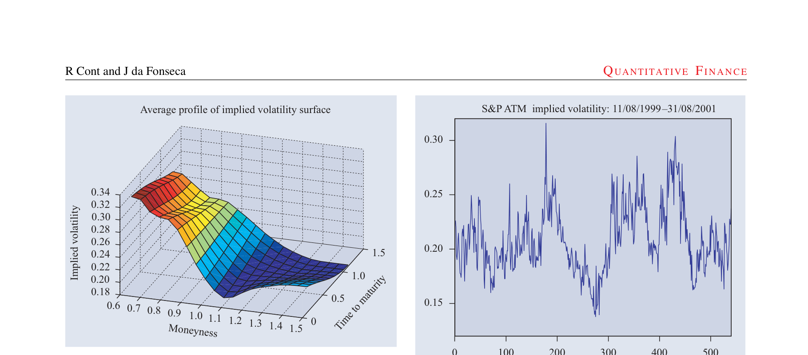
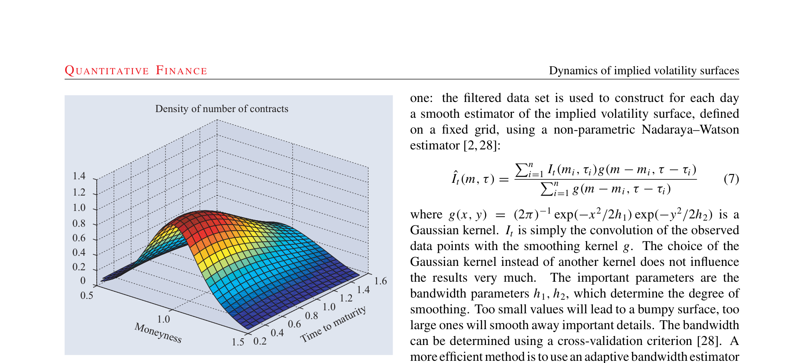
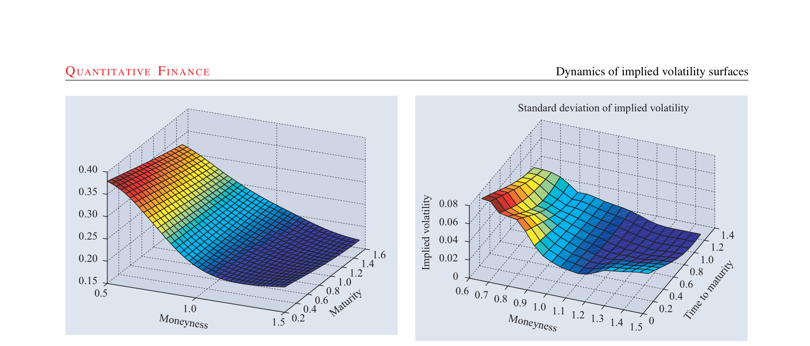
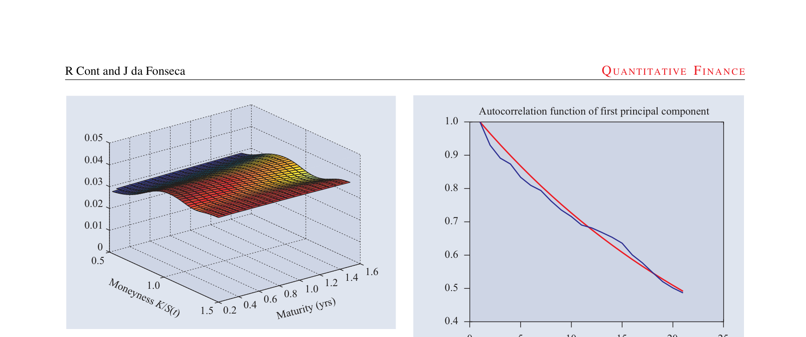
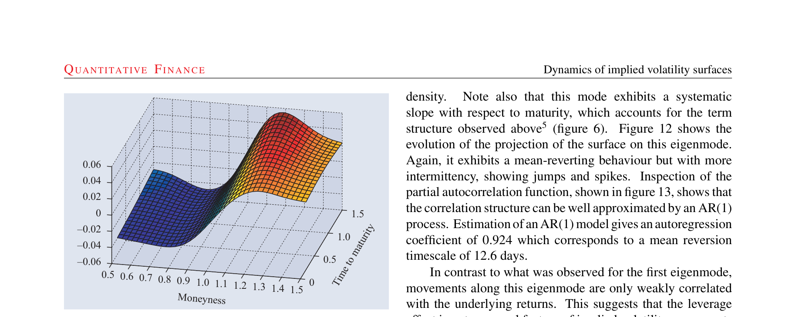
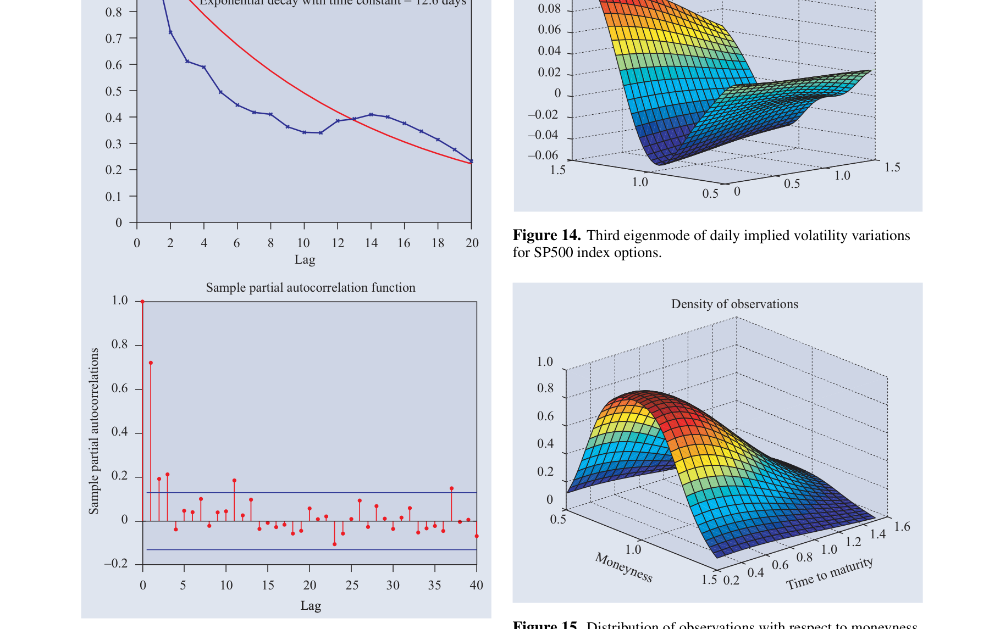
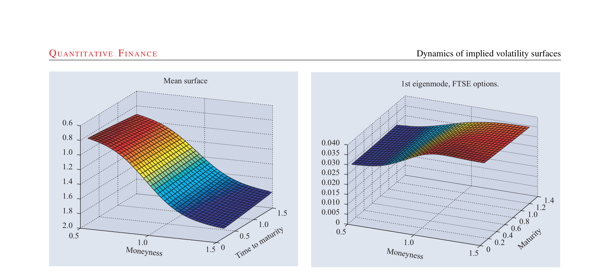
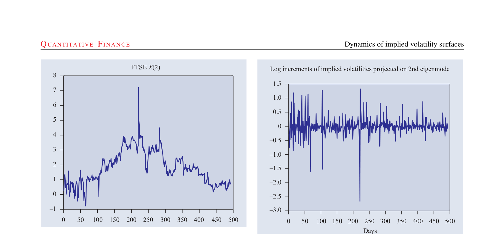
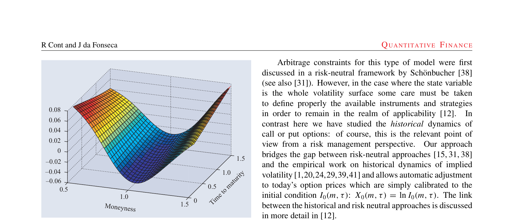

# Dynamics of implied volatility surfaces

## Metadata

- **Source File:** `Dynamics of implied volatility surfaces.pdf`
- **Authors:** IOP Publishing #4 1068 2000 Jul 12 14:56:10
- **Year:** 2002
- **DOI:** 10.1088/1469-7688/2/1/304

## Abstract

The prices of index options at a given date are usually represented via the corresponding implied volatility surface, presenting skew/smile features and term structure which several models have attempted to reproduce. However, the implied volatility surface also changes dynamically over time in a way that is not taken into account by current modelling approaches, giving rise to ‘Vega’ risk in option portfolios. Using time series of option prices on the SP500 and FTSE indices, we study the deformation of this surface and show that it may be represented as a randomly fluctuating surface driven by a small number of orthogonal random factors. We identify and interpret the shape of each of these factors, study their dynamics and their correlation with the underlying index. Our approach is based on a Karhunen–Lo`eve decomposition of the daily variations of implied volatilities obtained from market data. A simple factor model compatible with the empirical observations is proposed. We illustrate how this approach models and improves the well known ‘sticky moneyness’ rule used by option traders for updating implied volatilities. Our approach gives a justification for use of ‘Vega’s for measuring volatility risk and provides a decomposition of volatility risk as a sum of contributions from empirically identifiable factors.

## Main Text

### Quantitative Finance
ISSN: 1469-7688 (Print) 1469-7696 (Online) Journal homepage: www.tandfonline.com/journals/rquf20
## Dynamics of implied volatility surfaces
Rama Cont & José da Fonseca
To cite this article: Rama Cont & José da Fonseca (2002) Dynamics of implied volatility
surfaces, Quantitative Finance, 2:1, 45-60, DOI: 10.1088/1469-7688/2/1/304
To link to this article: https://doi.org/10.1088/1469-7688/2/1/304
Published online: 19 Aug 2006.
Submit your article to this journal
Article views: 1500
View related articles
Citing articles: 29 View citing articles
Full Terms & Conditions of access and use can be found at
https://www.tandfonline.com/action/journalInformation?journalCode=rquf20

RE S E A R C H PA P E R
QUANTITATIVE FINANCE VO L U M E 2 (2002) 45–60
INSTITUTE O F PHYSICS PUBLISHING
quant.iop.org
## Dynamics of implied volatility
## surfaces
Rama Cont1,3 and Jos´e da Fonseca2
1 Centre de Math´ematiques Appliqu´ees, Ecole Polytechnique, F-91128
Palaiseau, France
2 Ecole Superieure d’Ingenierie Leonard de Vinci, F-92916 Paris La D´efense,
France
E-mail: Rama.Cont@polytechnique.fr and jose.da fonseca@devinci.fr
Received 20 September 2001
Published 4 February 2002
Online at stacks.iop.org/Quant/2/45
Abstract
The prices of index options at a given date are usually represented via the
corresponding implied volatility surface, presenting skew/smile features and
term structure which several models have attempted to reproduce. However,
the implied volatility surface also changes dynamically over time in a way
that is not taken into account by current modelling approaches, giving rise to
‘Vega’ risk in option portfolios. Using time series of option prices on the
SP500 and FTSE indices, we study the deformation of this surface and show
that it may be represented as a randomly fluctuating surface driven by a small
number of orthogonal random factors. We identify and interpret the shape of
each of these factors, study their dynamics and their correlation with the
underlying index. Our approach is based on a Karhunen–Lo`eve
decomposition of the daily variations of implied volatilities obtained from
market data. A simple factor model compatible with the empirical
observations is proposed. We illustrate how this approach models and
improves the well known ‘sticky moneyness’ rule used by option traders for
updating implied volatilities. Our approach gives a justification for use of
‘Vega’s for measuring volatility risk and provides a decomposition of
volatility risk as a sum of contributions from empirically identifiable factors.
1. Introduction
synonymous with specifying prices of all (vanilla) calls and
puts at that date.
Although the Black–Scholes formula is very popular among
Two features of this surface have captured the attention
market practitioners, when applied to (‘vanilla’) call and put
of researchers in financial modelling.
First, the non-flat
options it is very often reduced to a means of quoting option
instantaneous profile of the surface, whether it be a ‘smile’,
prices in terms of another parameter, the implied volatility.
‘skew’ or the existence of a term structure, points out the
The implied volatility σ BS
(K, T ) of a call option with strike
t
insufficiency of the Black–Scholes model for matching a set
level K and maturity date T actually depends on K and T ,
of option prices at a given time instant. Second, the level of
in contradiction with the Black–Scholes model. The function
implied volatilities changes with time, deforming the shape of
σ BS
: (K, T ) →σ BS
(K, T ) which represents this dependence
t
t
the implied volatility surface [11]. The evolution in time of this
is called the implied volatility surface at date t. Specifying
surface captures the evolution of prices in the options market.
the implied volatility surface at a given date is therefore
The shortcomings of the Black–Scholes option pricing
3 http://www.cmap.polytechnique.fr/˜rama/
model when compared to empirical data from the options
45
1469-7688/02/010045+16$30.00
© 2002 IOP Publishing Ltd
PII: S1469-7688(02)32334-0

market have led to the development of a considerable literature
the options market and which are not present in the underlying
asset dynamics [12].
on alternative option pricing models, in which the dynamics of
In order to prevent the instability of model parameters
the underlying asset is considered to be a nonlinear diffusion,
resulting from this misspecification, it is necessary for the
a jump-diffusion process or a latent volatility model. These
model to recognize these extra sources of randomness specific
models attempt to explain the various empirical deviations
to the options market and incorporate the statistical features of
from the Black–Scholes model by introducing additional
their dynamics in the model. The aim of this work is to move
degrees of freedom in the model such as a local volatility
a step forward in this direction and identify, through the study
function, a stochastic diffusion coefficient, jump intensities,
of dynamical features of implied volatility surfaces for two
jump amplitudes etc. However, these additional parameters
major option markets, some of the salient dynamic properties
describetheinfinitesimal stochasticevolutionoftheunderlying
of option prices.
asset while the market usually quotes options directly in terms
Based on an empirical study of time series of implied
of their market-implied volatilities which are global quantities.
volatilities of SP500 and FTSE index options, we show that
In order to see whether the model reproduces empirical
the implied volatility surface can be described as a randomly
observations, one has to relate these two representations: the
fluctuating surface driven by a small number of factors. Using
infinitesimal description via a stochastic differential equation
a Karhunen–Lo`eve decomposition, we recover and interpret
on one hand, and the market description via implied volatilities
the shape of these factors and study their dynamics, in relation
on the other hand.
to the underlying index.
The implied volatility surface is
However, in the majority of these models it is impossible
then modelled as a stationary random field with a covariance
to compute directly the shape of the implied volatility surface
structure matching the empirical observations.
This model
in terms of the model parameters.
Although it is possible
extends and improves the well known ‘constant smile’ or
to compute the implied volatility surface numerically, these
‘sticky delta’ model [3] used by practitioners, while matching
numerical studies show that simple jump processes and one
some salient features of implied volatility time series.
factor stochastic volatility models do not reproduce correctly
Our stochastic implied volatility model allows a simple
the profiles of empirically observed implied volatility surfaces
descriptionofthetimeevolutionofasetofoptionsandprovides
and smiles [7,10,13,40]. This problem is also reflected in the
a rationale for Vega hedging of portfolios of options. This
difficulty in ‘calibrating’ model parameters simultaneously to a
modelling approach also allows us to construct a Monte Carlo
setofliquidoptionpricesonagivendate: ifthenumberofinput
framework for simulating scenarios for the joint behaviour of
option prices exceeds the number of parameters (which should
a portfolio of call or put options, leading to a considerable gain
be the case for a parsimonious model) a conflict arises between
in computation time for scenario generation.
different calibration constraints since the implied volatility
Section 2 defines the implied volatility surface and
pattern predicted by the model does not correspond to the
the parametrization used.
Section 3.2 describes the nonempirically observed one.
parametric smoothing procedure for constructing implied
This problem, already present at the static level, becomes
volatility surfaces from data.
Section 3 describes the
more acute if one examines the consistency of model dynamics
Karhunen–Lo`eve decomposition and its implementation. This
with those observed in the options market. While a model
method is then applied to two data sets: SP500 index options
with a large number of parameters—such as a non-parametric
(section 4) and FTSE index options (section 5). The stylized
local volatility function or implied tree—may calibrate well
empirical features of these two data sets are summarized
the strike profile and term structure of options on a given
in section 6.1.
Based on these empirical observations, a
day, the same model parameters might give a poor fit at the
factor model for the implied volatility surface is proposed
next date, creating the need for constant re-calibration of the
in section 6.2.
Section 7 presents implications for risk
model.
Examples of such inconsistencies over time have
management, indicates potential applications and discusses
been documented for the implied-tree approach by Dumas
topics for further research.
et al [17]. This time instability of model parameters leads to
large variations in sensitivities and hedge parameters, which is
2. Implied volatility surfaces
problematic for risk management applications.
The inability of models based on the underlying asset to
2.1. Definitions and notations
describe dynamic behaviour of option prices or their implied
Recall that a European call option on a non-dividend paying
volatilities is not, however, simply due to the mis-specification
asset St with maturity date T and strike price K is defined as
of the underlying stochastic process. There is a deeper reason:
a contingent claim with a payoff of (ST −K)+. Denoting by
since the creation of organized option markets in 1973, these
τ = T −t the time remaining to maturity, the Black–Scholes
markets have become increasingly autonomous and option
formula for the value of this call option with
prices are driven, in addition to movements in the underlying
CBS(St, K, τ, σ) = StN(d1) −Ke−rτN(d2)
asset, alsobyinternalsupplyanddemandintheoptionsmarket.
(1)
This fact is also supported by recent empirical evidence of
d1 = −ln m + τ(r + σ 2
d2 = −ln m + τ(r −σ 2
2 )
2 )
violations of qualitative dynamical relations between options
σ√τ
σ√τ
and their underlying [6]. This observation can be accounted
for by introducing sources of randomness which are specific to
(2)
46

where m
=
K/St
is the moneyness and N(u)
=
a conditional volatility model (e.g. GARCH) or ‘calibrated’
(2π)−1/2  u
−∞exp(−z2
with options data. In the first case, the quantity obtained is
2 ) dz. Let us now consider, in a market
model dependent and in the second case it is the solution of a
where the hypotheses of the Black–Scholes model do not
non-trivial and ill-posed inverse problem [8,18].
necessarily hold, a call option whose (observed) market price is
denoted by C∗
Second, implied volatilities give a representation of the
t (K, T ). The Black–Scholes implied volatility
σ BS
state of the option market which is familiar to the practitioner.
(K, T ) of the option is then defined as the value of the
t
A market scenario described in terms of the level or behaviour
volatility parameter which equates the market price with the
of implied volatility is easier to understand for a practitioner
price given by the Black–Scholes formula
than the same statement rephrased, for instance, in terms of a
σ BS
(K, T ) > 0,
∃!
local volatility or a jump intensity.
t
(3)
Third, shifts in the level of implied volatility are highly
(K, T )) = C∗
CBS(St, K, τ, σ BS
t (K, T ).
t
correlated across strikes and maturities, which suggests that
their joint dynamics is driven by a small number of factors
The existence and uniqueness of the implied volatility is due to
and makes parsimonious modelling of their joint dynamics
the fact that the value of a call option as a function of volatility
possible.
is a monotonic mapping from [0, +∞[ to ]0, St −Ke−rτ[. For
Finally, implied volatility is increasingly used as a market
fixed (K, T ), σ BS
(K, T ) is in general a stochastic process and,
t
reference by various market participants, as attested by the
for fixed t, its value depends on the characteristics of the option
recent emergence of implied volatility indexes and derivative
such as the maturity T and the strike level K: the function
instruments associated with them, and also as a market risk
indicator [32].
σ BS
: (K, T ) →σ BS
(K, T )
(4)
t
t
All these points motivate the study of the behaviour of
is called the implied volatility surface at date t. Using the
implied volatility surfaces as a foundation for a market-based
moneyness m = K/St of the option, one can also represent
approach for modelling the dynamics of the options market.
the implied volatility surface in relative coordinates, as a
function of moneyness and time to maturity: It(m, τ) =
2.3. Empirical study of implied volatility
σ BS
(mS(t), t + τ).
This representation is convenient since
t
At a static level, the dependence of implied volatility on
there is usually a range of moneyness around m = 1 for which
strike and maturity has been studied in many markets by
the options are liquid and therefore empirical data are most
various authors. While the Black–Scholes model predicts a
readily available.
flat profile for the implied volatility surface It(m, τ), it is a
well documented empirical fact that it exhibits both a non-flat
2.2. Implied volatility as a state variable
strike and term structure [11,13,17,21,25,27,33]. A typical
illustration is given in figure 1 in the case of SP500 index
As opposed to ‘local’ volatility, uniquely defined as the
options.
instantaneous increment of the quadratic variation of the
underlying asset, there are a multitude of implied volatilities
The dynamic properties of implied volatility time series
associated with a given asset, one for each traded option.
have also been studied by many authors in the literature;
Therefore, one is faced right from the start with a multivariate
however most of these studies either focus on the term structure
of at the money implied volatilities or study separately implied
problem.
volatility smiles for different maturities. In other words, they
Also, implied volatilities represent prices of traded options
study a cross-section of the surface in one direction, either
on the same underlying asset, which are linked by various
moneyness or maturity, while maintaining the other parameter
arbitrage relations.
It is therefore obvious that implied
fixed.
One then obtains a series of curves (smiles or term
volatilities for different strike and maturity levels cannot
structures) to which most authors apply a principal component
evolve independently and that they form a highly correlated
analysis (PCA).
multivariate system. Arbitrage restrictions on the dynamics of
implied volatilities have been discussed by Schonbucher [38]
The term structure of at the money implied volatilities
in the case of a single implied volatility and more recently by
was studied in [27, 29, 30, 41]. In particular, Avellaneda and
Ledoit and Santa Clara [31] in the case of an implied volatility
Zhu [41] performed a PCA of the term structure of at-thesurface.
money implied volatilities, modelling them with a GARCH
process. H¨ardle and Schmidt [29] perform a similar study on
The above points seem to indicate that defining a model
thetermstructureoftheVDAXandreportthepresenceoflevel,
in terms of implied volatility rather than local volatility may
shift and curvature components in the deformation of the term
complicate somewhat the modelling procedure.
However,
structure. Das and Sundaram [13] study the term structure of
using implied volatility as state variable has some important
implied skewness and kurtosis, showing that empirical patterns
advantages which greatly simplify the analysis.
differ from those predicted by simple models.
First, implied volatilities are observable: they are directly
Skiadopoulos et al [39] perform a PCA of implied
derived from market data without making any modelling
volatility smiles of SP500 American options traded on the
assumptions on the processes involved. By contrast, the local
CME for different maturity buckets and distinguish two
volatility or conditional variance of returns is not directly
significant principal components. Alexander [1] performs a
observableandhastobefilteredouteitherfrompricedatausing
47

#$% !     &''( '' 
        
 

 

    
 
 
 
 




 
 



         

!""






Figure 1. Typical profile of the implied volatility of SP500 options
)
as a function of time to maturity and moneyness, March 1999.
Figure 2. Evolution of at the money implied volatility for SP500
options, Aug. 1999–Aug. 2001.
similar analysis but using the deviation of implied volatilities
from the at-the-money volatility. Hafner and Wallmeier [24]
Unfortunately these simple rules are not verified in
study the dynamics of smile curves for DAX options. Fengler
practice: as shown in figures 6 and 17, the implied volatility
et al [20], use a common principal components approach to
surface It(m, τ) has a noticeable standard deviation that
perform a joint PCA on implied volatility smiles of different
cannot be neglected when considering either hedging or risk
maturity buckets.
management of portfolios of options. Similarly, figure 2 shows
By contrast to the studies mentioned above, our aim is to
the evolution of the at-the-money implied volatility for SP500
consider, following our earlier work on SP500 options [11],
index options: as seen in this figure, even the at the money
the joint dynamics of all implied volatilities quoted on the
implied volatility, assumed to be constant or ‘slowly varying’
market, looking simultaneously at all available maturity and
in the fixed smile model, fluctuates between 15 and 40% in less
moneyness values.
than a few months. Insufficiency of this ‘fixed smile’ approach
has also been pointed out in previous studies [32,35].
2.4. Deterministic models for implied volatility
In this empirical study we precisely focus on these
surfaces
fluctuations of the surface It(m, τ): what is the nature of
The observation that the implied volatility surface evolves
these fluctuations? How can they be quantified, modelled in a
with time has led practitioners to develop simple rules to
parsimonious fashion and simulated in a simple way?
estimate its evolution [14]. A commonly used rule is the ‘sticky
moneyness’ rule which stipulates that, when viewed in relative
3. Methodology
coordinates (m, τ), the surface It(m, τ) remains constant from
day to day:
We first describe in section 3.1 the data sets used. From the data
we construct a time series of smooth surfaces, via a procedure
∀(m, τ),
It+t(m, τ) = It(m, τ).
(5)
described in section 3.2. This time series of smooth surfaces
is then modelled as a stationary random surface to which we
Another well known rule is the so-called ‘sticky strike’ rule: in
apply a Karhunen–Lo`eve decomposition: section 3.3 presents
this case one assumes that the level of implied volatilities for a
the method and section 3.4 discusses how it is applied to the
given option (i.e. in absolute strike and maturity coordinates)
analysis of implied volatility surfaces.
does not change:
σ BS
t+t(K, T ) = σ BS
∀(K, T ),
(K, T ).
(6)
3.1. Data sets
t
The data sets studied contain end-of-day prices of EuropeanThese rules are described in more detail in [14] and [33].
style call and put options on two major indices: the SP500
Before proceeding further, let us note that the above
index and the FTSE 100 index. We observe every day implied
rules are actually deterministic laws of motion for the
volatilities for traded options It(mi, τi), i = 1 . . . n where n is
implied volatility surface:
given today’s option prices,
there is no uncertainty (according to these rules) as to the
a deterministic way. In a detailed study Balland [3] shows that in fact the only
value of implied volatilities tomorrow, up to errors due to
arbitrage-free models in which σ BS
(·, ·) is deterministic are Black–Scholes
t
smoothing/interpolation of today’s implied volatility surface4.
models with deterministic (that is, time dependent but not strike dependent)
volatility. He also shows that if It is deterministic then the underlying risk
4 More generally one can consider models where It(·, ·) or σ BS
neutral dynamics is a process with independent log-increments.
(·, ·) evolve in
t
48

one: the filtered data set is used to construct for each day
)" "* " 
a smooth estimator of the implied volatility surface, defined
on a fixed grid, using a non-parametric Nadaraya–Watson
estimator [2,28]:
n
i=1 It(mi, τi)g(m −mi, τ −τi)
ˆIt(m, τ) =

n
(7)
i=1 g(m −mi, τ −τi)


where g(x, y) = (2π)−1 exp(−x2/2h1) exp(−y2/2h2) is a

Gaussian kernel. It is simply the convolution of the observed

data points with the smoothing kernel g. The choice of the

Gaussian kernel instead of another kernel does not influence

the results very much.
The important parameters are the



bandwidth parameters h1, h2, which determine the degree of



 
smoothing. Too small values will lead to a bumpy surface, too



large ones will smooth away important details. The bandwidth
!""

can be determined using a cross-validation criterion [28]. A


moreefficientmethodistouseanadaptivebandwidthestimator
in order to obtain an ‘optimal’ bandwidth h [9, 23]. Large
Figure 3. Distribution of observations with respect to moneyness
and time to maturity: SP500 options.
sample properties of these estimators have been extensively
studied, we refer to the monograph by H¨ardle [28] or to [2].
We thus obtain a daily time series (It(m, τ), t = 0 . . . N)
the number of options actively traded on that day. Typically
: [mmin, mmax] ×
of smooth implied volatility surfaces I
n is around 100. Time to maturity τ range between a month
[τmin, τmax] →[0, ∞[ to which we apply an analysis of
and a year. Moneyness values outside the interval [0.5, 1.5]
variance, described in the next section. Note that τmin > 0: it is
are filtered out since the numerical uncertainty on implied
around 2 weeks. In particular, we do not use points very close
volatility may be too high and the liquidity very low.
All
to maturity since it is well known that, in this range, implied
options used are out of the money options: calls are used for
volatilities may have highly irregular behaviour which makes
m > 1, puts for m < 1.
These are precisely the options
them unexploitable for risk management purposes.
Also,
which contain the most information about implied volatility
we do not attempt to extrapolate to τ = 0 since such an
movements.
extrapolation will highly depend on the (arbitrary) choice of
Implied volatilities are observed for a discrete set of
the estimator.
moneyness and time to maturity values; the grid of observation
is both irregular and changing with time as the level of the
3.3. Principal component analysis of random
underlying fluctuates. Figure 3 shows the distribution of the
surfaces
number of observations as a function of the level of moneyness
and time to maturity. As illustrated in this figure, the number
In order to analyse the joint dynamics of all implied volatilities,
of traded strikes decreases as we move far from the money and
we model the implied volatility surface as a stationary random
as time to maturity increases. Also, the maximum number of
field, to which we apply a Karhunen–Lo`eve decomposition.
observations occurs at the money (m = 1) and not forwardThe Karhunen–Lo`eve decomposition is a generalization of
at-the-money (m = −rτ) which would create a linear bias
Let A
=
PCA to higher dimensional random fields.
in the position of the peak as τ increases. Also, the number
[mmin, mmax]×[τmin, τmax] be the range of values of moneyness
of observations does not seem to be skewed towards m > 1
and time-to-maturity.
A surface parametrized by A ⊂R2 is a smooth map
or m < 1 (this would advocate for example the use of logmoneyness instead of moneyness). Hence the choice of m as
u : A →R. For two surfaces u, v define the scalar product
⟨u, v⟩by
coordinate seems reasonable.

Similar properties are observed for FTSE options
u(x)v(x) dx
⟨u, v⟩=
(8)
(figure 15).
A
where x
=
(m, τ) designates a point in the moneyness/maturityplane. LetU(ω, x), x ∈Abeatwo-dimensional
3.2. Construction of smooth volatility surfaces
real-valued random field, defined as a family of random variIn order to obtain an implied volatility for arbitrary strikes and
ables indexed by a two-dimensional parameter x ∈A, such
maturities, the practice is to interpolate or smooth the discrete
that each realization of the random field U is a smooth surdata. This can be done either with a parametric form or in a
face U(ω, ·) : A →R. One can then view the random field
non-parametric way. For instance, it is common practice in
U(ω, x) as a random surface U(ω, ·).
many banks to use (piecewise) polynomial functions to fit the
Viewing U as a family of real-valued random variables,
implied volatility smile [17]. These choices are driven more
one may define the covariance coefficients of two points on the
by convenience than by any fundamental consideration. Given
surface as
the absence of arguments pointing to a specific parametric
form, the approach we have used here is a non-parametric
K(x1, x2) = cov(U(x1), U(x2))
x1, x2 ∈A.
(9)
49

The function K(x1, x2), x1, x2
∈
A is analogous to the
described below.
Choosing a family of smooth functions
(surfaces) (hn), one expands each eigenfunction on this basis:
covariance matrix of a random vector. One may also define the
correlation coefficients C(x1, x2). The covariance coefficients

N
define the kernel of an integral operator K acting on a surface
fi(m, τ) =
aijhj(m, τ) + ϵN.
(14)
u through
n=1

For example, one can choose as approximation functions
Ku(x) =
K(x, y)u(y) dy.
(10)
(hj) spline functions, commonly used for interpolating
A
volatility surfaces and yield curves in financial applications.
K is a bounded symmetric positive operator; its eigenvectors fn
Substituting the truncated sum into equation (11) yields an
define an orthonormal family (fn). Let ν2
1 ⩾ν2
2 ⩾· · · ⩾0 the
error term
associated eigenvalues: K ·fn = ν2
nfn. Each eigenfunction fn
 
is therefore a surface fn : A ⊂R2 →R which is the solution

N
dm′ dτ ′K(m, m′, τ, τ ′)hj(m′, τ ′)
εN =
aij
of a Fredholm integral equation defined by the kernel K:
A
n=1


−ν2
j hj(m, τ)
.
K(x, y)fn(y) dy = ν2
nfn(x).
(11)
The Galerkin method consists in requiring that the error εN be
The singular value decomposition of the covariance operator
orthogonal to the approximating functions (hn, n = 1 . . . N):
K can translate into a decomposition of the kernel K:
∀j = 1 . . . N,
⟨εN, hj⟩= 0

 


N
ν2
K(x1, x2) =
nfn(x1)fn(x2).
(12)
dx′K(x, x′)hj(x′)
⇐⇒
aij
dx hi(x)
A
A
n=1


LetUn(ω, x) = ⟨U(ω, ·), fn⟩bethe(random)projectionofthe
−ν2
randomsurfaceU ontheeigenfunctionfn. Byorthogonalityof
= 0.
dx hi(x)hj(x)
j
the (fn), (Un) is a sequence of uncorrelated random variables
A
Using matrix notation
and


Un(ω)fn(·) =
Unfn.
U(ω, ·) =
(13)
A = [aij]
(15)
Equation (13), which expresses the random field U as
Bij = ⟨hi, hj⟩
(16)


a superposition of uncorrelated random variables (Un ·
dm′ dτ ′hi(m, τ)K(m, m′, τ, τ ′)hj(m′, τ ′)
Cij =
dm dτ
fn), each of which is the product of a scalar random
A
A
variable with a deterministic surface, is called the Karhunen–
(17)
D = diag(ν2
Lo`eve decomposition of the random surface U.
Note
i , i = 1 . . . N)
(18)
that the random variables (Un · fn) are orthogonal both as
the orthogonality condition (15) can be rewritten
random variables—elements of L2(&, P)—and as surfaces—
CA = DBA
(19)
elements of L2(A)—which makes the Karhunen–Lo`eve
decomposition very convenient for computational purposes.
where C and B are symmetric positive matrices, computed
from the data. Numerically solving the generalized eigenvalue
problem (19) for D and A and substituting the coefficients
3.4. Karhunen–Lo`eve decomposition: numerical
of A in (14) yields the eigenmodes fk.
D yields their
implementation
associated variances ν2
k. We then compute the projection xk(t)
Given the high autocorrelation, skewness and positivity
of Xt(m, τ) on the eigenmode fk:
constraints on the implied volatility itself, we apply the

above approach to the daily variations of the logarithm of
xk(t) = ⟨Xt −X0, fk⟩=
Xt(m, τ)fk(m, τ) dm dτ
(20)
implied volatility Xt(m, τ) = ln It(m, τ) −ln It−1(m, τ).
A
First, we use market implied volatilities to produce a
and analyse the scalar time series (xk(t), t
=
1 . . . N)
smooth implied volatility surface It(m, τ) using the non-
(principal component processes). The surface then has the
parametric procedure described in section 3.2.
Next, we
representation
 

compute the daily variation of the logarithm of implied
Xt(m, τ)
=
volatility for each point on the surface:
It(m, τ) = I0(m, τ) exp
xk(t)fk
.
(21)
ln It(m, τ) −ln It−1(m, τ). We then apply a Karhunen–Lo`eve
k
decomposition to the random field Ut(m, τ) = Xt(m, τ).
Finally, we analyse the correlation between the movements
To this end, we compute the sample covariance coefficients
in implied volatilities and the underlying asset returns by
K(m, τ, m′, τ ′) = cov(Ut(m, τ), Ut(m′, τ ′)), which specify
computing the correlation coefficients between xk(t) =
the covariance operator K.
xk(t)−xk(t −1) and the underlying returns ln S(t)−ln S(t −1)
Formally, we are faced with an eigenvalue problem for an
for each principal component k.
operator in a function space. In order to solve the problem
We now describe the results obtained by applying this
numerically, we reduce it to a finite-dimensional one using
technique to two sets of data: SP500 index options (section 4)
and FTSE index options (section 5).
a Galerkin procedure for the Fredholm equation (11), as
50

#"     "     
 
 
    

 


 




 

 








        
! 






!""
!""




Figure 4. Average implied volatility surface for SP500 options.
Figure 6. Daily standard deviation of SP500 implied volatilities as
a function of moneyness and time to maturity.
      &#% "
. " 

(
(
-     
(
(
(
(
(
(
(
(
(
(
(
       
!"" '+,

! 

(











Figure 5. Average log-implied volatility surface, SP500 options.
/"0
Figure 7. Sorted eigenvalues of covariance operator as a function
4. Empirical results for SP500 index
of their rank for daily variations of SP500 implied volatilities.
options
volatilities instead of volatilities themselves.
The first data set contains end of day prices for all traded
The sample standard deviation of implied volatilities,
European style call and put options on the SP500 index
shown in figure 6, illustrates that the surface is not static and
between 2 March 2000 and 2 February 2001. These options are
fluctuates around its average profile. This figure can also be
traded on the Chicago Board of Options Exchange and differ
seen as a test of the the ‘fixed smile’ model [3], which would
from the American style options, studied in [39], traded on the
predict a small or negligible variability in implied volatilities,
Chicago Mercantile Exchange.
plotted in moneyness coordinates.
Clearly this is far from
Using the time series of smooth volatility surfaces
being the case. More precisely, the daily standard deviation
estimated via the procedure described in section 3.2, we
of the implied volatility can be as large as a third of its typical
compute the sample average of the random volatility surface
value for out of the money options, resulting in an important
It(m, τ), shown in figure 4. Here the average implied volatility
impact on option prices.
is shown as a function of time to maturity in years and
The eigenvalues ν2
k decay quickly with k (figure 7),
moneyness m = K/S(t).
The figure shows a decreasing
showing that a low-dimensional factor model gives a good
profile in moneyness (‘skew’) as well as a downward sloping
approximation for the dynamics of the surface. In fact the first
term structure.
three eigenmodes account for 98% of the variance, so in what
Figure 5 shows the surface obtained when logarithms of
follows we shall focus on their properties only.
impliedvolatilitiesaretakenbeforeaveraging. Notethat, while
The shape of the first eigenmode is shown in figure 8.
the skew persists, the term structure is less pronounced. This
All of its components are positive: a positive shock in the
remark also pleads in favour of studying logarithms of implied
51

   ""  "   "   ""












       
!"" '+,


! + ,








Figure 8. First eigenmode of daily implied volatility variations for
-+  ,
SP500 index options. This eigenmode, which accounts for around
80% of the daily variance of implied volatilities, can be interpreted
#      ""  "

as a level effect.

#      "
%1  ""   "   ""&#%     




+,



(









-+  ,
(
Figure 10. Top: in blue, autocorrelation function of x1(t); in red,
(
decaying exponential with time constant of 28 days. Bottom: partial
autocorrelation coefficients. Time unit: days.






)
around 3 months: they are both of the same magnitude showing
Figure 9. Time evolution of the projection x1(t) of SP500 implied
that mean reversion of implied volatility is neither ‘slow’ nor
volatilities on the first principal component.
‘fast’ but happens at the time scale of the option maturity.
Movements along this eigenmode, which account for
direction of this eigenmode results in a global increase of all the
around 80% of the daily variance, have a strong negative
implied volatilities: it may therefore be interpreted as a ‘level’
correlation with the underlying index returns. This observation
factor. Figure 9 shows the projection x1(t) of the surface on this
is consistent with the so-called leverage effect: the overall
eigenmode: it is observed to have a mean-reverting behaviour
negative correlation of implied volatility and asset returns.
with a typical mean-reversion time of around a month.
Note also that although the dependence in τ is weak, it is not
Figure 10 shows the autocorrelation function of the principal
zero, and multiplying the surface by a constant can amplify this
component process x1(t): the autocorrelation coefficients are
dependence. Since the variance is large along this direction,
significantly positive up to a month, showing persistence
large movements along this direction can induce term structure
in the values of the principal component process.
As the
fluctuations.
partial autocorrelation coefficients show, this persistence can
The second eigenmode, in contrast, changes sign at the
be conveniently represented by a low-order autoregressive
money: the components are positive for m > 1 and negative
for m < 1 (figure 11). A positive shock along this direction
process:
an AR(1)/Ornstein–Uhlenbeck process already
captures most of the persistence. Estimating an AR(1) process
increases the volatilities of out of the money calls while
on the series gives an autoregression constant of 0.965 which
decreasing those of out of the money puts. By biasing the
gives a mean reversion time of 28 days. This time scale should
implied volatilities towards high strikes, positive movements
along this direction increase the skewness of the risk neutral
be compared with the maturity of liquid options which is
52

density.
Note also that this mode exhibits a systematic
slope with respect to maturity, which accounts for the term
structure observed above5 (figure 6).
Figure 12 shows the
evolution of the projection of the surface on this eigenmode.
Again, it exhibits a mean-reverting behaviour but with more

intermittency, showing jumps and spikes. Inspection of the

partial autocorrelation function, shown in figure 13, shows that

the correlation structure can be well approximated by an AR(1)


process. EstimationofanAR(1)modelgivesanautoregression
 
(

coefficient of 0.924 which corresponds to a mean reversion
(
timescale of 12.6 days.

(
In contrast to what was observed for the first eigenmode,
          

movements along this eigenmode are only weakly correlated
!""
with the underlying returns. This suggests that the leverage
effect is not a general feature of implied volatility movements
Figure 11. Second eigenmode of daily implied volatility variations
but is related to movements in the general level of implied
for SP500 index options.
volatilities, while relative movements of implied volatilities
can be decorrelated with respect to the underlying. For a fixed
maturity, the cross sections of this mode correspond to the
"  "   ""  2#%      2( 
shape found by Skiadopoulos et al [39] on another data set

(SP500 futures options traded on the CME).

The third eigenmode, shown in figure 14, is a ‘butterfly’
mode which is interpreted as a change in the convexity of the

surface, accompanied by a downward sloping term structure
(
which biases the magnitude of the fluctuations towards short
(
term implied volatilities. In terms of risk, movements along
this direction contribute to the ‘fattening’ of both the tails of
(
the risk neutral density. This component only contributes to
( 
0.8% of the overall variance.
( 
Table 1 gives summary statistics for the time series of the
( 
first three principal component processes. Each of them is
highly autocorrelated and mean-reverting with a mean rever-
( 
sion time close to a month: figures 9 and 12 illustrate the sam-
( 
ple paths. Inspection of the partial autocorrelation functions






show that the autocorrelation structures (shown in figures 10
)
and 13) are well approximated by AR(1)/Ornstein–Uhlenbeck
%1  "    "" "  " +#%,
processes. Although the unconditional distributions are not

Gaussian (all series have excess kurtosis and some skewness),

the deviation from normality is mild.
Similar results were
found for DAX options in [24]. Also, none of these factors is

perfectly correlated with the underlying returns. The largest

(negative) correlation value is between the underlying and the
first factor, corresponding to a value of −66%, but still remains

significantly smaller than 1. Movements in other directions,

which reflect changes in the shape of the surface, seem to have
(
little correlation with the underlying asset.
(
5. Empirical results for FTSE options
(
(
In this section we present the results obtained when applying






 
 


the methods described in section 3 to a database of FTSE 100
)
index options.
The options under study are European call
and put options on the FTSE 100 index (ESX options). The
Figure 12. Top: time evolution of the projection x2(t) of SP500
database contains more than 2 years of daily transaction prices
implied volatilities on the second principal component. Bottom:
and quoted Black–Scholes implied volatilities for all quoted
daily increments x2(t). Time unit: days.
5 Actually figure 11 shows a downward sloping term structure but recall that
eigenmodes are defined up to a sign and normalization so the sign is irrelevant.
53

Table 1. Summary statistics for principal component times series: SP500 index options.
Daily
Proportion
Mean
Correlation
standard
of
Kurtosis
Skewness
reversion
with
Eigenmode
deviation
variance (%)
(1 day)
(1 day)
time (days)
underlying
−0.66
1
0.10
94
6.4
0.4
28
≃0
2
0.09
3
7.9
0.15
12.6
3
0.05
0.8
7.8
0
22
0.27




.3""    4 5  " "6  









(

(

(










Figure 14. Third eigenmode of daily implied volatility variations









for SP500 index options.
-
#      ""  "

)" *  "

#      "











       

!""
 
(










-
-
Figure 15. Distribution of observations with respect to moneyness
Figure 13. 2nd principal component process, SP500 implied
and time to maturity: FTSE options.
volatilities. Top: autocorrelation function of x2(t) (blue) compared
to exponential decay (red) with a time constant of 12.6 days.
section 3.1).
Bottom: partial autocorrelation coefficients of x2(t).
As in the preceding section, we first construct a time series
of smooth surfaces by using the non-parametric smoothing
options on the LIFFE6 market (Aug.–Sept. 2001). Maturities
procedure used in section 3.2. We then perform an analysis of
range from one month to more than a year, moneyness levels
some of the dynamical properties of the smoothed time series.
from 50 to 150% with respect to the underlying. Observations
We first compute the sample mean of the surface. The
are unevenly distributed in time-to-maturity and moneyness.
average profile of the implied volatility surface is shown in
Figure 15 shows the frequency of observations for a given
figure 16, on a logarithmic scale.
As in the case of the
moneyness and time to maturity as a function of these two
SP500 index options, it displays a strong skew, the implied
variables, obtained via a non-parametric kernel estimator; it
volatility decreasing as a function of moneyness, as well as
has a shape similar to the one observed for SP500 options (see
some curvature in the moneyness direction. Note that the term
6 London International Financial Futures Exchange.
structure is relatively flat. However, as seen from the standard
54

!"  
  " 27 #. " 


 

 
 

 

 













 

! 










!""
!""

Figure 18. First eigenmode of daily implied volatility variations for
Figure 16. Average profile of FTSE implied volatility surface.
FTSE index options.
#"     "     "





(


(



(
      

!""
! 
( 













Figure 17. Standard deviation of daily variations in FTSE implied
Figure 19. Projection x1(t) on first eigenmode, FTSE options.
volatilities.
in the direction of this eigenmode results in a global increase
deviation of their daily log-increments (figure 17), the daily
of all the implied volatilities: it may therefore be interpreted
variations of implied volatilities do display a systematic term
as a ‘level’ factor. The projection of the implied volatility
structure: short term implied volatilities fluctuate more than
surface on this eigenmode is shown in figure 19: this time
longer ones.
series is highly persistent mean-reverting. The one day lagged
Applying the Karhunen–Lo`eve decomposition (section 3)
partial autocorrelation coefficient is significant and falls to
to the daily log-variations of the implied volatility yields
insignificant levels after 1 day, pointing to an AR(1) correlation
the eigenmodes (principal components) and their associated
structure. Estimating an AR(1) model on the data gives an
eigenvalues (variances). We then project the implied volatility
autocorrelation coefficient of 0.9808 which corresponds to a
surface each day on each eigenmode and study the principal
mean reversion time of 51 days, reflecting a high degree of
component time series thus obtained.
persistence. The autocorrelation function, shown in figure 20,
The variances, ranked in decreasing order, decrease very
is well represented by the corresponding exponential decay
quickly: as in the case of SP500 index options, the variance
over a timescale of 51 days.
As in the case of the SP500
of daily variations is well captured by the first three principal
options, the mean reversion time is close to the lifetime of an
components which account for more than 95% of the observed
option, not much shorter nor longer.
daily variations.
The second eigenmode, shown in figure 21, reveals a
The shape of the dominant eigenmode is shown in
clear slope effect: the signs of the coordinates are negative for
figure 18. This eigenmode contains around 96% of the daily
moneyness levels m < 1 (out of the money puts) and positive
variance.
Similarly to the first eigenmode for the SP500
for m > 1 (out of the money calls), changing sign at the money.
surface, all of its components are positive: a positive shock
55

Table 2. Statistics for principal component times series: FTSE options.
Daily
Proportion
Kurtosis
Mean
Correlation
of xk
standard
of
reversion
with
Eigenmode
deviation
variance (%)
(1 day)
time (days)
underlying
1
2.9
96
9.3
51
0.7
2
0.43
2
5.7
65
0.08
3
0.27
0.8
7.5
81
0.7
7 #. " & "  " 
%     ""  "  "   ""27 #.


#      "








(

(


(

 

(


(













!""

-
   ""  "  "   ""&7 #. " 
Figure 21. Second eigenmode of daily implied volatility variations

for FTSE index options.
.3""    4 5  " "6 

first three factor loadings. As in the case of SP500 options,

they exhibit persistence and mean reversion. Their correlation
structure is well approximated by an AR(1) process with

mean reversion times around two months. However, for the
second and third principal components both the unconditional

distributions and the distribution of residuals have significant

non-Gaussian features and exhibit intermittency, suggesting
the use of an AR(1) model with non-Gaussian noise.


6. A mean reverting factor model for the











implied volatility surface
-+  ,
6.1. Summary of empirical observations
Figure 20. Top: partial autocorrelation coefficients of the
Let us now summarize the statistical properties of implied
projection of FTSE implied volatilities on the first principal
volatility surfaces observed in these two data sets:
component. Bottom: autocorrelation function of x1(t) compared to
an exponential decay with time constant = 51 days. Time unit: days.
(1) Implied volatilities display high (positive) autocorrelation
and mean reverting behaviour.
A positive shock in this direction therefore results in a decrease
(2) The variance of the daily log-variations in implied
in the prices of out of the money puts accompanied by a rise
volatility can be satisfactorily explained in terms of a small
in the prices of out of the money calls. In terms of the risk
number of principal components (two or three).
neutral distribution it corresponds to a (positive) increase in
(3) The first eigenmode reflects an overall shift in the level of
the skewness.
The third eigenmode, shown in figure 24, again represents
all implied volatilities.
changes in the curvature/convexity of the surface in the strike
(4) The second eigenmode reflects opposite movements in
direction, associated with a smaller slope effect in the maturity
(out of the money) call and put implied volatilities.
direction.
(5) The third eigenmode reflects changes in the convexity of
Table 2 gives summary statistics for the time series of the
the surface.
56

7 #.+ ,
- " "        1  " "  " 








(
(
(

( 

( 
(
( 






















)
Figure 22. Projection x2(t) on second eigenmode, FTSE options.
87 "  "   ""27 #. " 

(6) Movements in implied volatility are not perfectly
correlated with movements in the underlying asset.

(7) Shifts in the global level of implied volatilities are
negatively correlated with the returns of the underlying

asset.
(8) Relative movements of implied volatilities have little

correlation with the underlying.
(9) The projections of the surface on its eigenmodes

(principal component processes) exhibit high (positive)
autocorrelation and mean reversion over a timescale close

to a month.
(10) The autocorrelation structure of principal component

processes is well approximated by the AR(1)/Ornstein–
Uhlenbeck process.











-+  ,
Similar results have also been obtained for DAX options,
omitted here for the sake of brevity.
Figure 23. Top: time evolution of the projection of FTSE implied
volatilities on the second principal component. Bottom:
6.2. A factor model for the implied volatility surface
autocorrelation function of x2(t) (blue) compared with exponential
Based on these empirical results, we propose a flexible class of
decay with a time constant of 51 days (red). Time unit: days.
factor models which is compatible with these observations: in
our framework the implied volatility surface is directly used as
Here λk represents the speed of mean reversion along the
the state variable and modelled as a stationary random surface
kth eigenmode, xk the long-term average value and γk is
evolving in a low-dimensional manifold of surfaces. The (log-)
the volatility of implied vols along this direction.
The
implied volatility surface Xt(m, τ) is represented by the sum
‘constant smile’ or ‘sticky delta’ model corresponds to
of the initial surface and its fluctuations along the principal
=
I0, i.e. where xk(t)
=
the case where It
0.
Our
directions (fk, k = 1 . . . d):
factor model is therefore an extension of the sticky delta
model.

d
ln It(m, τ) = Xt(m, τ) = X0(m, τ) +
xk(t)fk(m, τ)
In the stationary case, these parameters are simply related
to the empirical observations: denoting by ν2
k=1
k the variance of
(22)
the kth principal component, then
⟨fj, fk⟩= δj,k
xk(t) = ⟨Xt −X0, fk⟩
(23)
xk = ⟨X −X0, fk⟩
where X0(m, τ) = ln I0(m, τ) is a constant surface and the
(25)
components xk are Ornstein–Uhlenbeck processes driven by
k = γ 2
independent noise sources Zk, which can be Wiener or jump
k
ν2
(26)
processes:
2λk
corr(xk(t), xk(t + s)) = exp(−λks)
dxk(t) = −λk(xk(t) −xk) dt + γk dZk(t).
(27)
(24)
57

Arbitrage constraints for this type of model were first
discussed in a risk-neutral framework by Sch¨onbucher [38]
(see also [31]). However, in the case where the state variable
is the whole volatility surface some care must be taken
to define properly the available instruments and strategies

in order to remain in the realm of applicability [12].
In

contrast here we have studied the historical dynamics of

call or put options: of course, this is the relevant point of

view from a risk management perspective.
Our approach

bridges the gap between risk-neutral approaches [15, 31, 38]

(
and the empirical work on historical dynamics of implied
(
 

volatility [1,20,24,29,39,41] and allows automatic adjustment
(
to today’s option prices which are simply calibrated to the


initial condition I0(m, τ): X0(m, τ) = ln I0(m, τ). The link



between the historical and risk neutral approaches is discussed
!""
in more detail in [12].
Figure 24. Third eigenmode of daily implied volatility variations
for FTSE index options.
7. Applications and extensions
Table 3. Estimation results for factor model.
We have presented in this work an empirical analysis of
historical co-movements of implied volatilities of options
λ1
λ2
λ3
Data set
on the SP500 and FTSE indices.
Using a Karhunen–
SP500
0.035
0.08
0.045
Lo`eve decomposition, we have shown that these fluctuations
FTSE
0.0193
0.0152
0.0122
can be accounted through a low-dimensional, but not onedimensional, multifactor model.
We have extracted and
interpreted the shapes of the principal component surfaces
and may be estimated from discrete observations xk(t), t =
and showed that the principal component processes exhibit
0, 1, 2 . . . of the principal component processes: indeed, under
a mean reverting autoregressive behaviour similar to that of an
the above hypothesis xk follows an AR(1) process:
Ornstein–Uhlenbeck process.
xk(t + 1) = e−λkxk(t) + (1 −e−λk)xk + σkϵk(t)
(28)
Of course the behaviour of these time series can be
studied in more detail, going beyond second-order statistics
1 −exp(−λk)
and examining effects obtained by conditioning on various
ϵ(t) IID noise σk = γk
.
(29)
variables.
However, already at this level, there are several
2λk
interesting implications and potential applications, some of
Estimation of the coefficients was done using a general
which we enumerate below.
method of moments procedure using the discrete observations
xk(t), t = 1, 2, . . . , T . Estimation results are shown in table 3.
7.1. The nature of volatility risk
In the case where Zk are independent Wiener processes,
An interesting feature of our data is that there appears to be
the implied volatilities have a log-normal distribution, which
more than one factor present in the movements of implied
both ensures positivity and is consistent with many empirical
volatilities and these factors are not perfectly correlated with
observations in the literature.
the underlying asset. While this may appear as no surprise
to operators in the options market that implied volatilities
6.3. Dynamics of option prices
of different strikes do not vary in unison, it is clearly not a
An interesting feature of using implied volatilities as state
feature of one-factor ‘complete’ market models which attempt
variables is that the price of any call option Ct(T, K) is simply
to explain all movements of option prices in terms of the
given by the Black–Scholes formula
underlying asset.
In other words:
‘Vega’ risk cannot be
Ct(K, T ) = CBS(St, K, τ, σ BS
(K, T ))
reduced to ‘Delta’ risk.
t

K

The presence of more than one factor also shows that
St, K, τ, It
= CBS
, T −t
(30)
bivariate stochastic volatility models may lack enough degrees
St
of freedom to explain co-movements of implied volatilities
and the continuous-time dynamics of Ct(K, T ) may be
other than general shifts in their level.
computed by applying Ito’s lemma to equation (30) [12]. This
allows to compute Vega hedge ratios and generate scenarios
7.2. Relation with stochastic volatility models
for call/put options directly using the factor model (22). This
Any stochastic model for instantaneous volatility also implies
should be contrasted for example with the approach of Derman
and Kani [15] where the local volatility surface is modelled as
a model for the deformation of the implied volatility surface.
This correspondence may be, however, very non-explicit [22,
a random surface: in this case the impact on option prices is
34].
It would nevertheless be interesting to compare our
complicated and non-explicit.
58

empirical findings with the dynamics of implied volatility
on Empirical Finance, HEC Montreal, Bedlewo workshop on
surfaces in ‘traditional’ stochastic volatility models [4,22], at
Mathematical Finance, the Verona Conference on Credit and
least on a qualitative or numerical basis.
Market Risk, the AMS-SMF 2001 Congress (Lyon, France)
and RISK Math Week 2000 (London and New York) for their
comments and suggestions.
7.3. Quantifying and hedging volatility risk
Our model allows a simple and straightforward approach to
the modelling and hedging of volatility risk, defined in terms
References
familiar to practitioners in the options market, namely that of
Vega risk defined via Black–Scholes Vegas. It also suggests a
[1] Alexander C 2001 Principles of the skew Risk January S29–32
[2] Ait-Sahalia Y and Lo A 2000 Nonparametric estimation of
simple approach to the simulation of scenarios for the joint
state-price densities implicit in financial asset prices
evolution of a portfolio of call and put options along with
J. Finance 53 499–548
their underlying asset. Such approaches have already been
[3] Balland P 2002 Deterministic implied volatility surfaces
considered in the case where the at-the-money implied vol is
Quant. Finance 2 31–44
perturbated by random shocks while the shape of the smile is
[4] Barndorff-Nielsen O E and Shephard N 2001 Non-Gaussian
Ornstein–Uhlenbeck-based models and some of their uses
fixed: Malz [32] uses this approach for stress-testing; see also
in financial economics (with discussion) J. R. Stat. Soc. B
Rosenberg [35]. Our framework allows an extension to the
63 167–241
case of a random smile/surface. These points shall be studied
[5] Black F and Scholes M 1973 The pricing of options and
in a forthcoming work [12].
corporate liabilities J. Political Economy 81 637–54
[6] Bakshi G, Cao C and Chen Z 2000 Do call prices and the
underlying stock always move in the same direction? Rev.
7.4. Generating scenarios for option portfolios
Financial Studies 13 549–84
Given a stochastic model for the joint behaviour of the
[7] Bakshi G, Cao C and Chen Z 1997 Empirical performance of
alternative option pricing models J. Finance LII 2003–49
underlying and its implied volatility surface, one can in
[8] Berestycki H, Busca J and Florent I 2000 An inverse parabolic
principle generate scenarios and compute confidence intervals
problem arising in finance C. R. Acad. Sci. Paris I 331 965
for future values of the implied volatility. Given the monotonic
[9] Brockmann M, Gasser T and Herrmann E 1993 Locally
relation between implied volatility and option prices, this
adaptive bandwidth choice for kernel regression estimators
can allow us to compute confidence intervals for the values
J. Am. Stat. Assoc. 88 1302–9
[10] Busca J and Cont R 2002 Implied volatility surfaces in
of various call and put options and portfolios composed of
exponential L´evy models Working Paper
these instruments. This may be an interesting approach for
[11] Cont R and da Fonseca J 2001 Deformation of implied
computing confidence intervals for future scenarios in the
volatility surfaces: an empirical analysis Empirical
option market, but needs a more detailed characterization of
Approaches to Financial Fluctuations ed Takayasu (Tokyo:
the link between the underlying asset dynamics and that of the
Springer)
[12] Cont R, da Fonseca J and Durrleman V 2002 Stochastic models
option market, perhaps going beyond covariance measures as
of implied volatility surfaces Economic Notes at press
we have done above.
[13] Das S R and Sundaram R K 1999 Of smiles and smirks: a term
structure perspective J. Financial Quant. Anal. 34 211–40
7.5. Dynamics of volatility indices
[14] Derman E 1998 Regimes of volatility Risk
[15] Derman E and Kani I 1998 Stochastic strike and term structure
Another field in which this approach has potentially interesting
Int. J. Theor. Appl. Finance 1 61–110
applications is the hedging and risk management of ‘volatility
[16] Derman E, Kani I and Zou J Z 1995 The local volatility
surface: unlocking the information in option prices
derivatives’ such as options on an implied volatility index.
Goldman Sachs Quantitative Strategies Research Notes
There are several such market indices at present: VIX (CBOE),
[17] Dumas B, Fleming J and Whaley R E 1998 Implied volatility
VDAX (Frankfurt) and VXN (Nasdaq) are some examples.
functions: empirical tests J. Finance 8 2059–106
Such an index, if well diversified across strikes and maturities,
[18] Dupire B 1993 Pricing with a smile Risk 7 18–20
will be sensitive to the factors described above (mainly the first
[19] Engle R and Rosenberg J 2000 Testing the volatility term
structure using option hedging criteria J. Derivatives 8
factor).
10–29
In summary, we find that the study of dynamics of implied
[20] Fengler M, H¨ardle W and Villa C 2000 The dynamics of
volatility surfaces points to the possibility of a simple dynamic
implied volatilities: a common principal component
representation which seems to have interesting applications
approach, Discussion paper no 38/2001, SfB 373,
and links with other topics in financial econometrics and option
Humboldt University, Germany
[21] Franks J R and Schwartz E J 1991 The stochastic behaviour of
pricingtheory. Wehopetopursuesomeoftheseresearchtopics
market variance implied in the price of index options Econ.
in the near future.
J. 101 1460–75
[22] Fouque J P, Papanicolaou G and Sircar R 2000 Derivatives in
Markets with Stochastic Volatility (Cambridge: Cambridge
Acknowledgments
University Press)
[23] Gasser T, Kneip A and Khler W 1991 A flexible and fast
We thank Carol Alexander, Marco Avellaneda, Raphael
method for automatic smoothing J. Am. Stat. Assoc. 86
Douady, Nicole El Karoui, Vincent Lacoste, Ole Barndorff
643–52
Nielsen, Eric Reiner and seminar participants at Aarhus
[24] Hafner R and Wallmeier M 2000 The dynamics of DAX
University, CNRS Aussois Winter School, Nikkei Symposium
implied volatilities Working Paper
59

[34] Renault E and Touzi N 1996 Option hedging and implied
[25] Heynen R 1993 An empirical investigation of observed smile
volatilities in a stochastic volatility model Math. Finance 6
patterns Review Futures Markets 13 317–53
279–302
[26] Hodges H M 1996 Arbitrage bounds on the implied volatility
[35] Rosenberg J V 2000 Implied volatility functions: a reprise
strike and term structures of European style options
J. Derivatives 7
J. Derivatives 3 23–35
[36] Rubinstein M 1994 Implied binomial trees J. Finance 49
[27] Heynen R, Kemma A and Vorst T 1994 Analysis of the term
strucure of implied volatilities J. Financial Quant. Anal. 29
771–818
[37] Sabbatini M and Linton O 1998 A GARCH model of the
31–56
[28] H¨ardle W 1990 Applied Nonparametric Regression
implied volatility of the Swiss market index from option
prices Int. J. Forecasting 14 199–213
(Cambridge: Cambridge University Press)
[38] Sch¨onbucher P J 1999 A market model for stochastic implied
[29] H¨ardle W and Schmidt P 2000 Common factors governing
volatility Phil. Trans. R. Soc. A 357 2071–92
VDAX movements and the maximum loss Humboldt
University Working Paper
[39] Skiadopoulos G, Hodges S and Clelow L 2000 Dynamics of
the S&P500 implied volatility surface Rev. Derivatives Res.
[30] Heynen R 1995 Essays on Derivative Pricing Theory
3 263–82
(Amsterdam: Thesis Publishers)
[40] Tompkins R 2001 Stock index futures markets: stochastic
[31] Ledoit O and Santa Clara P 1999 Relative pricing of options
volatility models and smiles J. Futures Markets 21 4378
with stochastic volatility UCLA Working Paper
[41] Zhu Y and Avellaneda M 1997 An E-ARCH model for the
[32] Malz A 2001 Do implied volatilities provide an early warning
term structure of implied volatility of FX options Appl.
of market stress? J. Risk 3 no 2
Math. Finance 4 81–100
[33] Rebonato R 1999 Volatility and Correlation in the Pricing of
Equity, FX and Interest Rate Options (New York: Wiley)
60

## Tables

### Table 1

| R Cont and J da Fonseca |  | Q U A N T I T A T I V E F I N A N C E |
| --- | --- | --- |
|  |  | (cid:23)(cid:20)(cid:17)(cid:18)(cid:31)(cid:18)(cid:21)(cid:21)(cid:15)(cid:28)(cid:19)(cid:17)(cid:13)(cid:18)"(cid:16)(cid:27)(cid:20)"(cid:31)(cid:17)(cid:13)(cid:18)"(cid:16)(cid:18)(cid:27)(cid:16)(cid:27)(cid:13)(cid:21)(cid:30)(cid:17)(cid:16)(cid:26)(cid:21)(cid:13)"(cid:31)(cid:13)(cid:26)(cid:19)(cid:28)(cid:16)(cid:31)(cid:18)(cid:14)(cid:26)(cid:18)"(cid:15)"(cid:17) |
|  | (cid:4)(cid:2)(cid:1) |  |
| (cid:1)(cid:2)(cid:1)(cid:3) |  |  |
|  | (cid:1)(cid:2)(cid:8) |  |
| (cid:1)(cid:2)(cid:1)(cid:11) |  |  |
| (cid:1)(cid:2)(cid:1)(cid:10) |  |  |
|  | (cid:1)(cid:2)(cid:7) |  |
| (cid:1)(cid:2)(cid:1)(cid:9) |  |  |
|  | (cid:1)(cid:2)(cid:6) |  |
| (cid:1)(cid:2)(cid:1)(cid:4) |  |  |
| (cid:1) |  |  |
|  | (cid:1)(cid:2)(cid:5) |  |
| (cid:1)(cid:2)(cid:3) |  |  |
| (cid:4)(cid:2)(cid:5) |  |  |
| (cid:4)(cid:2)(cid:11) |  |  |
| (cid:4)(cid:2)(cid:9) |  |  |
| (cid:4)(cid:2)(cid:1) | (cid:1)(cid:2)(cid:3) |  |
| (cid:1)(cid:2)(cid:7) |  |  |
| (cid:1)(cid:2)(cid:5) !(cid:18)"(cid:15)(cid:22)"(cid:15)(cid:30)(cid:30)(cid:16)(cid:1)’(cid:2)+(cid:3), |  |  |
| (cid:1)(cid:2)(cid:11) |  |  |
| (cid:1)(cid:2)(cid:9) (cid:4)(cid:2)(cid:3) !(cid:19)(cid:17)(cid:20)(cid:21)(cid:13)(cid:17)(cid:22)(cid:16)+(cid:22)(cid:21)(cid:30), |  |  |
|  | (cid:1)(cid:2)(cid:11) |  |
|  | (cid:1) | (cid:3) (cid:4)(cid:1) (cid:4)(cid:3) (cid:9)(cid:1) (cid:9)(cid:3) |
| Figure 8. First eigenmode of daily implied volatility variations for |  | -(cid:19)(cid:25)(cid:16)+(cid:29)(cid:19)(cid:22)(cid:30), |
| SP500 index options. This eigenmode, which accounts for around |  |  |
| 80% of the daily variance of implied volatilities, can be interpreted |  | #(cid:19)(cid:14)(cid:26)(cid:28)(cid:15)(cid:16)(cid:26)(cid:19)(cid:21)(cid:17)(cid:13)(cid:19)(cid:28)(cid:16)(cid:19)(cid:20)(cid:17)(cid:18)(cid:31)(cid:18)(cid:21)(cid:21)(cid:15)(cid:28)(cid:19)(cid:17)(cid:13)(cid:18)"(cid:16)(cid:27)(cid:20)"(cid:31)(cid:17)(cid:13)(cid:18)" |
|  | (cid:4)(cid:2)(cid:1) |  |
| as a level effect. |  |  |
|  | (cid:1)(cid:2)(cid:7) |  |
| %(cid:21)(cid:18)1(cid:15)(cid:31)(cid:17)(cid:13)(cid:18)"(cid:16)(cid:18)"(cid:16)(cid:27)(cid:13)(cid:21)(cid:30)(cid:17)(cid:16)(cid:26)(cid:21)(cid:13)"(cid:31)(cid:13)(cid:26)(cid:19)(cid:28)(cid:16)(cid:31)(cid:18)(cid:14)(cid:26)(cid:18)"(cid:15)"(cid:17)&(cid:16)#%(cid:3)(cid:1)(cid:1)(cid:16)(cid:13)(cid:14)(cid:26)(cid:28)(cid:13)(cid:15)(cid:29)(cid:16)(cid:24)(cid:18)(cid:28)(cid:19)(cid:17)(cid:13)(cid:28)(cid:13)(cid:17)(cid:22) |  |  |
| (cid:5) |  |  |
|  | (cid:1)(cid:2)(cid:5) |  |
| (cid:11) |  |  |
|  | #(cid:19)(cid:14)(cid:26)(cid:28)(cid:15)(cid:16)(cid:26)(cid:19)(cid:21)(cid:17)(cid:13)(cid:19)(cid:28)(cid:16)(cid:19)(cid:20)(cid:17)(cid:18)(cid:31)(cid:18)(cid:21)(cid:21)(cid:15)(cid:28)(cid:19)(cid:17)(cid:13)(cid:18)"(cid:30) (cid:1)(cid:2)(cid:11) |  |
| (cid:9) | (cid:1)(cid:2)(cid:9) |  |
| +(cid:3), (cid:1) (cid:4) | (cid:1) |  |
| (cid:4) |  |  |
| ((cid:9) | (cid:1)(cid:2)(cid:9) |  |
|  | (cid:1) | (cid:3) (cid:4)(cid:1) (cid:4)(cid:3) (cid:9)(cid:1) (cid:9)(cid:3) (cid:10)(cid:1) (cid:10)(cid:3) (cid:11)(cid:1) |
|  |  | -(cid:19)(cid:25)(cid:16)+(cid:29)(cid:19)(cid:22)(cid:30), |
| ((cid:11) |  |  |
|  | Figure 10. Top: | in blue, autocorrelation function of x1(t); in red, |
| ((cid:5) |  |  |
|  |  | decaying exponential with time constant of 28 days. Bottom: partial |
| (cid:1) (cid:3)(cid:1) (cid:4)(cid:1)(cid:1) (cid:4)(cid:3)(cid:1) (cid:9)(cid:1)(cid:1) (cid:9)(cid:3)(cid:1) |  |  |
|  | autocorrelation coefficients. Time unit: days. |  |

Raw CSV: `assets/table_001.csv`

### Table 2

*Caption:* Table 1 gives summary statistics for the time series of the

| Q U A N T I T A T I V E F I N A N C E | Dynamics of implied volatility surfaces |
| --- | --- |
|  | density. Note also that this mode exhibits a systematic |
|  | slope with respect to maturity, which accounts for the term |
|  | (figure 6). Figure 12 shows the structure observed above5 |
|  | evolution of the projection of the surface on this eigenmode. |
| (cid:1)(cid:2)(cid:1)(cid:5) | Again, it exhibits a mean-reverting behaviour but with more |
| (cid:1)(cid:2)(cid:1)(cid:11) | intermittency, showing jumps and spikes. Inspection of the |
| (cid:1)(cid:2)(cid:1)(cid:9) | partial autocorrelation function, shown in figure 13, shows that |
| (cid:1) (cid:4)(cid:2)(cid:3) | the correlation structure can be well approximated by an AR(1) |
| (cid:22) ((cid:1)(cid:2)(cid:1)(cid:9) (cid:17) | process. Estimation of an AR(1) model gives an autoregression |
| (cid:13) |  |
| (cid:21) (cid:4)(cid:2)(cid:1) |  |
| (cid:20) |  |
| (cid:17) ((cid:1)(cid:2)(cid:1)(cid:11) | coefficient of 0.924 which corresponds to a mean reversion |
| (cid:19) |  |
| (cid:14) |  |
| (cid:16) (cid:1)(cid:2)(cid:3) (cid:18) ((cid:1)(cid:2)(cid:1)(cid:5) | timescale of 12.6 days. |
| (cid:17) (cid:16) |  |
| (cid:15) |  |
| (cid:1)(cid:2)(cid:3) (cid:14) (cid:1)(cid:2)(cid:5) | In contrast to what was observed for the first eigenmode, |
| (cid:1)(cid:2)(cid:6) (cid:13) (cid:1)(cid:2)(cid:7) |  |
| (cid:1)(cid:2)(cid:8) |  |
| (cid:1) (cid:4)(cid:2)(cid:1) (cid:4)(cid:2)(cid:4) (cid:12) (cid:4)(cid:2)(cid:9) |  |
| (cid:4)(cid:2)(cid:10) (cid:4)(cid:2)(cid:11) |  |
| (cid:4)(cid:2)(cid:3) | movements along this eigenmode are only weakly correlated |
| !(cid:18)"(cid:15)(cid:22)"(cid:15)(cid:30)(cid:30) |  |
|  | with the underlying returns. This suggests that the leverage |
|  | effect is not a general feature of implied volatility movements |
| Figure 11. Second eigenmode of daily implied volatility variations |  |
|  | but is related to movements in the general level of implied |
| for SP500 index options. |  |
|  | volatilities, while relative movements of implied volatilities |
|  | can be decorrelated with respect to the underlying. For a fixed |
| (cid:9)"(cid:29)(cid:16)(cid:26)(cid:21)(cid:13)"(cid:31)(cid:13)(cid:26)(cid:19)(cid:28)(cid:16)(cid:31)(cid:18)(cid:14)(cid:26)(cid:18)"(cid:15)"(cid:17)(cid:16)(cid:26)(cid:21)(cid:18)(cid:31)(cid:15)(cid:30)(cid:30)2(cid:16)#%(cid:3)(cid:1)(cid:1)(cid:16)(cid:13)(cid:14)(cid:26)(cid:28)(cid:13)(cid:15)(cid:29)(cid:16)(cid:24)(cid:18)(cid:28)(cid:19)(cid:17)(cid:13)(cid:28)(cid:13)(cid:15)(cid:30)2(cid:16)(cid:4)(cid:8)(cid:8)(cid:8)((cid:9)(cid:1)(cid:1)(cid:1)(cid:2) | maturity, the cross sections of this mode correspond to the |
|  | shape found by Skiadopoulos et al [39] on another data set |
| (cid:4)(cid:2)(cid:1) |  |
|  | (SP500 futures options traded on the CME). |
| (cid:1)(cid:2)(cid:3) |  |
|  | The third eigenmode, shown in figure 14, is a ‘butterfly’ |
| (cid:1) | mode which is interpreted as a change in the convexity of the |
|  | surface, accompanied by a downward sloping term structure |
| ((cid:1)(cid:2)(cid:3) |  |
|  | which biases the magnitude of the fluctuations towards short |
| ((cid:4)(cid:2)(cid:1) |  |
|  | term implied volatilities. In terms of risk, movements along |
| ((cid:4)(cid:2)(cid:3) |  |
|  | this direction contribute to the ‘fattening’ of both the tails of |
| ((cid:9)(cid:2)(cid:1) | the risk neutral density. This component only contributes to |
|  | 0.8% of the overall variance. |
| ((cid:9)(cid:2)(cid:3) |  |
|  | Table 1 gives summary statistics for the time series of the |
| ((cid:10)(cid:2)(cid:1) |  |
|  | first three principal component processes. Each of them is |
| ((cid:10)(cid:2)(cid:3) |  |
|  | highly autocorrelated and mean-reverting with a mean rever- |
| ((cid:11)(cid:2)(cid:1) | sion time close to a month: figures 9 and 12 illustrate the sam- |
| (cid:1) (cid:3)(cid:1) (cid:4)(cid:1)(cid:1) (cid:4)(cid:3)(cid:1) (cid:9)(cid:1)(cid:1) (cid:9)(cid:3)(cid:1) | ple paths. Inspection of the partial autocorrelation functions |
| )(cid:19)(cid:22)(cid:30) | show that the autocorrelation structures (shown in figures 10 |
|  | and 13) are well approximated by AR(1)/Ornstein–Uhlenbeck |
| %(cid:21)(cid:18)1(cid:15)(cid:31)(cid:17)(cid:13)(cid:18)"(cid:16)(cid:18)(cid:27)(cid:16)(cid:29)(cid:19)(cid:13)(cid:28)(cid:22)(cid:16)(cid:24)(cid:19)(cid:21)(cid:13)(cid:19)(cid:17)(cid:13)(cid:18)"(cid:16)(cid:18)"(cid:16)(cid:9)"(cid:29)(cid:16)(cid:15)(cid:13)(cid:25)(cid:15)"(cid:14)(cid:18)(cid:29)(cid:15)(cid:16)+#%(cid:3)(cid:1)(cid:1), |  |
|  | processes. Although the unconditional distributions are not |
| (cid:1)(cid:2)(cid:3) |  |
|  | Gaussian (all series have excess kurtosis and some skewness), |
| (cid:1)(cid:2)(cid:11) |  |
|  | the deviation from normality is mild. Similar results were |
| (cid:1)(cid:2)(cid:10) | found for DAX options in [24]. Also, none of these factors is |
|  | perfectly correlated with the underlying returns. The largest |
| (cid:1)(cid:2)(cid:9) |  |
|  | (negative) correlation value is between the underlying and the |
| (cid:1)(cid:2)(cid:4) | first factor, corresponding to a value of −66%, but still remains |
|  | significantly smaller than 1. Movements in other directions, |
| (cid:1) |  |
|  | which reflect changes in the shape of the surface, seem to have |
| ((cid:1)(cid:2)(cid:4) |  |
|  | little correlation with the underlying asset. |
| ((cid:1)(cid:2)(cid:9) |  |
| ((cid:1)(cid:2)(cid:10) | 5. Empirical results for FTSE options |
| ((cid:1)(cid:2)(cid:11) |  |
|  | In this section we present the results obtained when applying |
| (cid:1) (cid:9)(cid:1) (cid:11)(cid:1) (cid:5)(cid:1) (cid:7)(cid:1) (cid:4)(cid:1)(cid:1) (cid:4)(cid:9)(cid:1) (cid:4)(cid:11)(cid:1) (cid:4)(cid:5)(cid:1) (cid:4)(cid:7)(cid:1) |  |
|  | the methods described in section 3 to a database of FTSE 100 |
| )(cid:19)(cid:22)(cid:30) |  |
|  | index options. The options under study are European call |
|  | and put options on the FTSE 100 index (ESX options). The |
| Figure 12. Top: time evolution of the projection x2(t) of SP500 |  |
|  | database contains more than 2 years of daily transaction prices |
| implied volatilities on the second principal component. Bottom: |  |
|  | and quoted Black–Scholes implied volatilities for all quoted |
| daily increments (cid:22)x2(t). Time unit: days. |  |
|  | 5 Actually figure 11 shows a downward sloping term structure but recall that |
|  | eigenmodes are defined up to a sign and normalization so the sign is irrelevant. |

Raw CSV: `assets/table_002.csv`

### Table 3

*Caption:* Table 1. Summary statistics for principal component times series: SP500 index options.

|  |  |  |  |  |  |  | Daily |  | Proportion |  |  |  | Mean |  | Correlation |  |  |
| --- | --- | --- | --- | --- | --- | --- | --- | --- | --- | --- | --- | --- | --- | --- | --- | --- | --- |
|  |  |  |  |  |  |  | standard |  | of |  | Kurtosis | Skewness | reversion |  | with |  |  |
|  |  |  |  | Eigenmode |  |  | deviation |  | variance (%) |  | (1 day) | (1 day) | time (days) |  | underlying |  |  |
|  |  |  |  | 1 |  | 0.10 |  |  | 94 |  | 6.4 | 0.4 | 28 |  | −0.66 |  |  |
|  |  |  |  | 2 |  | 0.09 |  |  | 3 |  | 7.9 | 0.15 | 12.6 |  | (cid:19)0 |  |  |
|  |  |  |  | 3 |  | 0.05 |  |  | 0.8 |  | 7.8 | 0 | 22 |  | 0.27 |  |  |
| (cid:4)(cid:2)(cid:1) |  |  |  |  |  |  |  |  |  |  |  |  |  |  |  |  |  |
|  |  |  |  |  |  |  |  |  |  |  |  | (cid:1)(cid:2)(cid:4)(cid:9) |  |  |  |  |  |
| (cid:1)(cid:2)(cid:8) |  |  |  |  |  |  |  |  |  |  |  | (cid:1)(cid:2)(cid:4)(cid:1) |  |  |  |  |  |
|  |  |  |  | .3(cid:26)(cid:18)"(cid:15)"(cid:17)(cid:13)(cid:19)(cid:28)(cid:16)(cid:29)(cid:15)(cid:31)(cid:19)(cid:22)(cid:16)4(cid:13)(cid:17)5(cid:16)(cid:17)(cid:13)(cid:14)(cid:15)(cid:16)(cid:31)(cid:18)"(cid:30)(cid:17)(cid:19)"(cid:17)(cid:16)6(cid:16)(cid:4)(cid:9)(cid:2)(cid:5)(cid:16)(cid:29)(cid:19)(cid:22)(cid:30) |  |  |  |  |  |  |  |  |  |  |  |  |  |
|  |  |  |  |  |  |  |  |  |  |  |  | (cid:1)(cid:2)(cid:1)(cid:7) |  |  |  |  |  |
| (cid:1)(cid:2)(cid:7) |  |  |  |  |  |  |  |  |  |  |  |  |  |  |  |  |  |
|  |  |  |  |  |  |  |  |  |  |  |  | (cid:1)(cid:2)(cid:1)(cid:5) |  |  |  |  |  |
| (cid:1)(cid:2)(cid:6) |  |  |  |  |  |  |  |  |  |  |  |  |  |  |  |  |  |
|  |  |  |  |  |  |  |  |  |  |  |  | (cid:1)(cid:2)(cid:1)(cid:11) |  |  |  |  |  |
| (cid:1)(cid:2)(cid:5) |  |  |  |  |  |  |  |  |  |  |  |  |  |  |  |  |  |
|  |  |  |  |  |  |  |  |  |  |  |  | (cid:1)(cid:2)(cid:1)(cid:9) |  |  |  |  |  |
| (cid:1)(cid:2)(cid:3) |  |  |  |  |  |  |  |  |  |  |  | (cid:1) |  |  |  |  |  |
| (cid:1)(cid:2)(cid:11) |  |  |  |  |  |  |  |  |  |  |  | ((cid:1)(cid:2)(cid:1)(cid:9) |  |  |  |  |  |
|  |  |  |  |  |  |  |  |  |  |  |  | ((cid:1)(cid:2)(cid:1)(cid:11) |  |  |  |  |  |
| (cid:1)(cid:2)(cid:10) |  |  |  |  |  |  |  |  |  |  |  |  |  |  |  |  |  |
|  |  |  |  |  |  |  |  |  |  |  |  | ((cid:1)(cid:2)(cid:1)(cid:5) |  |  |  |  |  |
| (cid:1)(cid:2)(cid:9) |  |  |  |  |  |  |  |  |  |  |  | (cid:4)(cid:2)(cid:3) |  |  |  |  | (cid:4)(cid:2)(cid:3) |
|  |  |  |  |  |  |  |  |  |  |  |  |  |  |  |  |  | (cid:4)(cid:2)(cid:1) |
|  |  |  |  |  |  |  |  |  |  |  |  |  | (cid:4)(cid:2)(cid:1) |  |  | (cid:1)(cid:2)(cid:3) |  |
|  |  |  |  |  |  |  |  |  |  |  |  |  |  | (cid:1)(cid:2)(cid:3) | (cid:1) |  |  |
| (cid:1)(cid:2)(cid:4) |  |  |  |  |  |  |  |  |  |  |  |  |  |  |  |  |  |
| (cid:1) |  |  |  |  |  |  |  |  |  |  |  |  |  |  |  |  |  |
|  |  |  |  |  |  |  |  |  |  |  |  |  | Figure 14. Third eigenmode of daily implied volatility variations |  |  |  |  |
|  | (cid:1) | (cid:9) | (cid:11) | (cid:5) | (cid:7) | (cid:4)(cid:1) | (cid:4)(cid:9) | (cid:4)(cid:11) | (cid:4)(cid:5) | (cid:4)(cid:7) | (cid:9)(cid:1) |  |  |  |  |  |  |
|  |  |  |  |  |  |  |  |  |  |  |  | for SP500 index options. |  |  |  |  |  |
|  |  |  |  |  |  | -(cid:19)(cid:25) |  |  |  |  |  |  |  |  |  |  |  |
|  |  |  |  | #(cid:19)(cid:14)(cid:26)(cid:28)(cid:15)(cid:16)(cid:26)(cid:19)(cid:21)(cid:17)(cid:13)(cid:19)(cid:28)(cid:16)(cid:19)(cid:20)(cid:17)(cid:18)(cid:31)(cid:18)(cid:21)(cid:21)(cid:15)(cid:28)(cid:19)(cid:17)(cid:13)(cid:18)"(cid:16)(cid:27)(cid:20)"(cid:31)(cid:17)(cid:13)(cid:18)" |  |  |  |  |  |  |  |  |  |  |  |  |  |
| (cid:4)(cid:2)(cid:1) |  |  |  |  |  |  |  |  |  |  |  |  |  |  |  |  |  |
|  |  |  |  |  |  |  |  |  |  |  |  |  |  | )(cid:15)"(cid:30)(cid:13)(cid:17)(cid:22)(cid:16)(cid:18)(cid:27)(cid:16)(cid:18)*(cid:30)(cid:15)(cid:21)(cid:24)(cid:19)(cid:17)(cid:13)(cid:18)"(cid:30) |  |  |  |
| (cid:1)(cid:2)(cid:7) |  |  |  |  |  |  |  |  |  |  |  |  |  |  |  |  |  |
|  |  |  |  |  |  |  |  |  |  |  |  | (cid:4)(cid:2)(cid:1) |  |  |  |  |  |
| (cid:1)(cid:2)(cid:5) |  |  |  |  |  |  |  |  |  |  |  | (cid:1)(cid:2)(cid:7) |  |  |  |  |  |
|  |  |  |  |  |  |  |  |  |  |  |  | (cid:1)(cid:2)(cid:5) |  |  |  |  |  |
| #(cid:19)(cid:14)(cid:26)(cid:28)(cid:15)(cid:16)(cid:26)(cid:19)(cid:21)(cid:17)(cid:13)(cid:19)(cid:28)(cid:16)(cid:19)(cid:20)(cid:17)(cid:18)(cid:31)(cid:18)(cid:21)(cid:21)(cid:15)(cid:28)(cid:19)(cid:17)(cid:13)(cid:18)"(cid:30) (cid:1)(cid:2)(cid:11) |  |  |  |  |  |  |  |  |  |  |  |  |  |  |  |  |  |
|  |  |  |  |  |  |  |  |  |  |  |  | (cid:1)(cid:2)(cid:11) |  |  |  |  |  |
|  |  |  |  |  |  |  |  |  |  |  |  | (cid:1)(cid:2)(cid:9) |  |  |  |  |  |
| (cid:1)(cid:2)(cid:9) |  |  |  |  |  |  |  |  |  |  |  |  |  |  |  |  |  |
|  |  |  |  |  |  |  |  |  |  |  |  | (cid:1) |  |  |  |  |  |
| (cid:1) |  |  |  |  |  |  |  |  |  |  |  | (cid:1)(cid:2)(cid:3) |  |  |  |  |  |
|  |  |  |  |  |  |  |  |  |  |  |  |  |  |  |  |  | (cid:4)(cid:2)(cid:5) |
|  |  |  |  |  |  |  |  |  |  |  |  |  |  |  |  |  | (cid:4)(cid:2)(cid:11) |
|  |  |  |  |  |  |  |  |  |  |  |  |  |  |  |  |  | (cid:4)(cid:2)(cid:9) |
|  |  |  |  |  |  |  |  |  |  |  |  |  | (cid:4)(cid:2)(cid:1) |  |  |  | (cid:4)(cid:2)(cid:1) |

Raw CSV: `assets/table_003.csv`

### Table 4

*Caption:* Table 2. Statistics for principal component times series: FTSE options.

|  | Daily Proportion | Kurtosis Mean Correlation |
| --- | --- | --- |
|  | standard of | of (cid:22)xk reversion with |
|  | Eigenmode deviation variance (%) | (1 day) time (days) underlying |
|  | 1 2.9 96 | 9.3 51 0.7 |
|  | 2 0.43 2 | 5.7 65 0.08 |
|  | 3 0.27 0.8 | 7.5 81 0.7 |
|  | %(cid:19)(cid:21)(cid:17)(cid:13)(cid:19)(cid:28)(cid:16)(cid:19)(cid:20)(cid:17)(cid:18)(cid:31)(cid:18)(cid:21)(cid:21)(cid:15)(cid:28)(cid:19)(cid:17)(cid:13)(cid:18)"(cid:16)(cid:27)(cid:20)"(cid:31)(cid:17)(cid:13)(cid:18)"(cid:16)(cid:27)(cid:18)(cid:21)(cid:16)(cid:4)(cid:30)(cid:17)(cid:16)(cid:26)(cid:21)(cid:13)"(cid:31)(cid:13)(cid:26)(cid:19)(cid:28)(cid:16)(cid:31)(cid:18)(cid:14)(cid:26)(cid:18)"(cid:15)"(cid:17)2(cid:16)7(cid:12)#. | 7(cid:12)#.(cid:16)(cid:18)(cid:26)(cid:17)(cid:13)(cid:18)"(cid:30)&(cid:16)(cid:9)"(cid:29)(cid:16)(cid:15)(cid:13)(cid:25)(cid:15)"(cid:24)(cid:15)(cid:31)(cid:17)(cid:18)(cid:21) |
|  | (cid:4)(cid:2)(cid:1) |  |
|  | (cid:1)(cid:2)(cid:7) |  |
|  | (cid:1)(cid:2)(cid:5) | (cid:1)(cid:2)(cid:1)(cid:7) |
|  |  | (cid:1)(cid:2)(cid:1)(cid:5) |
|  |  | (cid:1)(cid:2)(cid:1)(cid:11) |
| #(cid:19)(cid:14)(cid:26)(cid:28)(cid:15)(cid:16)(cid:26)(cid:19)(cid:21)(cid:17)(cid:13)(cid:19)(cid:28)(cid:16)(cid:19)(cid:20)(cid:17)(cid:18)(cid:31)(cid:18)(cid:21)(cid:21)(cid:15)(cid:28)(cid:19)(cid:17)(cid:13)(cid:18)"(cid:30) | (cid:1)(cid:2)(cid:11) |  |
|  |  | (cid:1)(cid:2)(cid:1)(cid:9) |
|  |  | (cid:1) |
|  | (cid:1)(cid:2)(cid:9) |  |
|  |  | ((cid:1)(cid:2)(cid:1)(cid:9) |
|  |  | (cid:4)(cid:2)(cid:5) ((cid:1)(cid:2)(cid:1)(cid:11) |
|  | (cid:1) | (cid:4)(cid:2)(cid:11) |
|  |  | ((cid:1)(cid:2)(cid:1)(cid:5) |
|  |  | (cid:4)(cid:2)(cid:9) |
|  |  | (cid:22) (cid:4)(cid:2)(cid:1) (cid:17) ((cid:1)(cid:2)(cid:1)(cid:7) |
|  |  | (cid:13) (cid:21) |
|  |  | (cid:1)(cid:2)(cid:7) (cid:20) (cid:17) |
|  | ((cid:1)(cid:2)(cid:9) | (cid:19) (cid:1)(cid:2)(cid:3) |
|  |  | (cid:1)(cid:2)(cid:5) (cid:14) |
|  |  | (cid:16) |
|  |  | (cid:18) (cid:1)(cid:2)(cid:11) (cid:17) (cid:4)(cid:2)(cid:1) |
|  |  | (cid:16) |
|  | (cid:1) (cid:9) (cid:11) (cid:5) (cid:7) (cid:4)(cid:1) (cid:4)(cid:9) (cid:4)(cid:11) (cid:4)(cid:5) (cid:4)(cid:7) (cid:9)(cid:1) | (cid:15) |
|  |  | (cid:1)(cid:2)(cid:9) (cid:14) |
|  |  | (cid:13) (cid:4)(cid:2)(cid:3) (cid:12) !(cid:18)"(cid:15)(cid:22)"(cid:15)(cid:30)(cid:30) |
|  | -(cid:19)(cid:25) |  |
|  | (cid:23)(cid:20)(cid:17)(cid:18)(cid:31)(cid:18)(cid:21)(cid:21)(cid:15)(cid:28)(cid:19)(cid:17)(cid:13)(cid:18)"(cid:16)(cid:27)(cid:20)"(cid:31)(cid:17)(cid:13)(cid:18)"(cid:16)(cid:18)(cid:27)(cid:16)(cid:4)(cid:30)(cid:17)(cid:16)(cid:26)(cid:21)(cid:13)"(cid:31)(cid:13)(cid:26)(cid:19)(cid:28)(cid:16)(cid:31)(cid:18)(cid:14)(cid:26)(cid:18)"(cid:15)"(cid:17)&(cid:16)7(cid:12)#.(cid:16)(cid:18)(cid:26)(cid:17)(cid:13)(cid:18)"(cid:30)(cid:2) |  |
|  |  | Figure 21. Second eigenmode of daily implied volatility variations |
|  | (cid:4)(cid:2)(cid:1) |  |
|  |  | for FTSE index options. |
|  | .3(cid:26)(cid:18)"(cid:15)"(cid:17)(cid:13)(cid:19)(cid:28)(cid:16)(cid:29)(cid:15)(cid:31)(cid:19)(cid:22)(cid:16)4(cid:13)(cid:17)5(cid:16)(cid:17)(cid:13)(cid:14)(cid:15)(cid:16)(cid:31)(cid:18)"(cid:30)(cid:17)(cid:19)"(cid:17)(cid:16)6(cid:16)(cid:3)(cid:4)(cid:16)(cid:29)(cid:19)(cid:22)(cid:30) (cid:1)(cid:2)(cid:8) |  |
|  |  | first three factor loadings. As in the case of SP500 options, |
|  | (cid:1)(cid:2)(cid:7) |  |
|  |  | they exhibit persistence and mean reversion. Their correlation |
|  |  | structure is well approximated by an AR(1) process with |
|  | (cid:1)(cid:2)(cid:6) |  |
|  |  | mean reversion times around two months. However, for the |
|  | (cid:1)(cid:2)(cid:5) | second and third principal components both the unconditional |
|  |  | distributions and the distribution of residuals have significant |
|  | (cid:1)(cid:2)(cid:3) |  |
|  |  | non-Gaussian features and exhibit intermittency, suggesting |
|  |  | the use of an AR(1) model with non-Gaussian noise. |
|  | (cid:1)(cid:2)(cid:11) |  |

Raw CSV: `assets/table_004.csv`

### Table 5

*Caption:* Table 3. Estimation results for factor model.

|  | historical co-movements of implied volatilities of options |
| --- | --- |
| Data set λ1 λ2 λ3 |  |
|  | on the SP500 and FTSE indices. Using a Karhunen– |
| SP500 0.035 0.08 0.045 |  |
|  | Lo`eve decomposition, we have shown that these fluctuations |
| FTSE 0.0193 0.0152 0.0122 |  |
|  | can be accounted through a low-dimensional, but not one- |
|  | dimensional, multifactor model. We have extracted and |
| and may be estimated from discrete observations xk(t), t = | interpreted the shapes of the principal component surfaces |
| 0, 1, 2 . . . of the principal component processes: indeed, under | and showed that the principal component processes exhibit |
| the above hypothesis xk follows an AR(1) process: | a mean reverting autoregressive behaviour similar to that of an |
|  | Ornstein–Uhlenbeck process. |
| xk(t + 1) = e−λk xk(t) + (1 − e−λk )xk + σk+k(t) (28) | Of course the behaviour of these time series can be |
| (cid:9) |  |
|  | studied in more detail, going beyond second-order statistics |
| 1 − exp(−λk) | and examining effects obtained by conditioning on various |
| . +(t) IID noise σk = γk (29) |  |
| 2λk | variables. However, already at this level, there are several |
|  | interesting implications and potential applications, some of |
| Estimation of the coefficients was done using a general |  |
|  | which we enumerate below. |
| method of moments procedure using the discrete observations |  |
| xk(t), t = 1, 2, . . . , T . Estimation results are shown in table 3. |  |
|  | 7.1. The nature of volatility risk |
| are independent Wiener processes, In the case where Zk |  |
| the implied volatilities have a log-normal distribution, which | An interesting feature of our data is that there appears to be |
| both ensures positivity and is consistent with many empirical | more than one factor present in the movements of implied |
| observations in the literature. | volatilities and these factors are not perfectly correlated with |
|  | the underlying asset. While this may appear as no surprise |
|  | to operators in the options market that implied volatilities |
| 6.3. Dynamics of option prices |  |
|  | of different strikes do not vary in unison, it is clearly not a |
| An interesting feature of using implied volatilities as state |  |
|  | feature of one-factor ‘complete’ market models which attempt |
| variables is that the price of any call option Ct (T , K) is simply |  |
|  | to explain all movements of option prices in terms of the |
| given by the Black–Scholes formula |  |
|  | underlying asset. In other words: ‘Vega’ risk cannot be |
| Ct (K, T ) = CBS(St , K, τ, σ BS | reduced to ‘Delta’ risk. |
| (cid:5) (cid:5) (cid:6)(cid:6) |  |
|  | The presence of more than one factor also shows that |
| K S , T − t St , K, τ, It |  |
| (30) = CBS |  |
|  | bivariate stochastic volatility models may lack enough degrees |
| t |  |
|  | of freedom to explain co-movements of implied volatilities |
| and the continuous-time dynamics of Ct (K, T ) may be |  |
|  | other than general shifts in their level. |
| computed by applying Ito’s lemma to equation (30) [12]. This |  |
| allows to compute Vega hedge ratios and generate scenarios |  |
|  | 7.2. Relation with stochastic volatility models |
| for call/put options directly using the factor model (22). This |  |
| should be contrasted for example with the approach of Derman | Any stochastic model for instantaneous volatility also implies |
| and Kani [15] where the local volatility surface is modelled as | a model for the deformation of the implied volatility surface. |
| a random surface: in this case the impact on option prices is | This correspondence may be, however, very non-explicit [22, |
| complicated and non-explicit. | 34]. It would nevertheless be interesting to compare our |

Raw CSV: `assets/table_005.csv`

### Table 6

*Caption:* Table 3. Estimation results for factor model.

| R Cont and J da Fonseca |  |  |  |  | Q U A N T I T A T I V E F I N A N C E |
| --- | --- | --- | --- | --- | --- |
|  |  |  |  |  | Arbitrage constraints for this type of model were first |
|  |  |  |  |  | discussed in a risk-neutral framework by Sch¨onbucher [38] |
|  |  |  |  |  | (see also [31]). However, in the case where the state variable |
|  |  |  |  |  | is the whole volatility surface some care must be taken |
|  |  |  |  |  | to define properly the available instruments and strategies |
| (cid:1)(cid:2)(cid:1)(cid:7) |  |  |  |  |  |
|  |  |  |  |  | in order to remain in the realm of applicability [12]. In |
| (cid:1)(cid:2)(cid:1)(cid:5) |  |  |  |  |  |
|  |  |  |  |  | historical contrast here we have studied the dynamics of |
| (cid:1)(cid:2)(cid:1)(cid:11) |  |  |  |  |  |
|  |  |  |  |  | call or put options: of course, this is the relevant point of |
| (cid:1)(cid:2)(cid:1)(cid:9) |  |  |  |  |  |
|  |  |  |  |  | view from a risk management perspective. Our approach |
| (cid:1) |  |  |  |  |  |
|  |  |  |  | (cid:4)(cid:2)(cid:3) | bridges the gap between risk-neutral approaches [15, 31, 38] |
| ((cid:1)(cid:2)(cid:1)(cid:9) |  |  |  |  |  |
|  |  |  |  |  | and the empirical work on historical dynamics of implied |
| ((cid:1)(cid:2)(cid:1)(cid:11) |  |  | (cid:4)(cid:2)(cid:1) | (cid:22) |  |
|  |  |  |  | (cid:17) |  |
|  |  |  |  | (cid:13) (cid:21) | volatility [1,20,24,29,39,41] and allows automatic adjustment |
| ((cid:1)(cid:2)(cid:1)(cid:5) |  |  |  | (cid:20) (cid:17) |  |
|  |  |  |  | (cid:19) |  |
|  |  |  | (cid:1)(cid:2)(cid:3) (cid:14) |  | to today’s option prices which are simply calibrated to the |
| (cid:1)(cid:2)(cid:3) |  |  | (cid:16) |  |  |
|  |  |  | (cid:18) (cid:17) |  |  |
|  |  |  | (cid:16) |  |  |
|  |  |  | (cid:15) |  |  |
| (cid:4)(cid:2)(cid:1) |  |  | (cid:14) |  | initial condition I0(m, τ ): X0(m, τ ) = ln I0(m, τ ). The link |
|  |  | (cid:1) | (cid:13) |  |  |
|  | (cid:4)(cid:2)(cid:3) |  | (cid:12) |  |  |
| !(cid:18)"(cid:15)(cid:22)"(cid:15)(cid:30)(cid:30) |  |  |  |  | between the historical and risk neutral approaches is discussed |
|  |  |  |  |  | in more detail in [12]. |
| Figure 24. Third eigenmode of daily implied volatility variations |  |  |  |  |  |
| for FTSE index options. |  |  |  |  |  |
|  |  |  |  |  | 7. Applications and extensions |

Raw CSV: `assets/table_006.csv`

## Figures

## Extraction Notes

- pdfplumber unusable table on page 9 index 1
- pdfplumber unusable table on page 11 index 1
- pdfplumber unusable table on page 13 index 1
- discarded 13 tiny-placement embedded figure(s)
- discarded 1 dense-page embedded figure candidate(s)
- camelot:stream table quality filter dropped 1 low-quality table(s)
