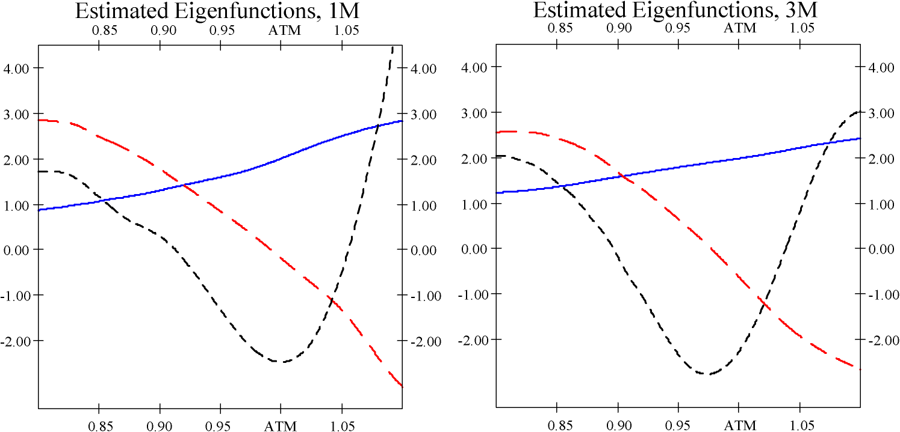
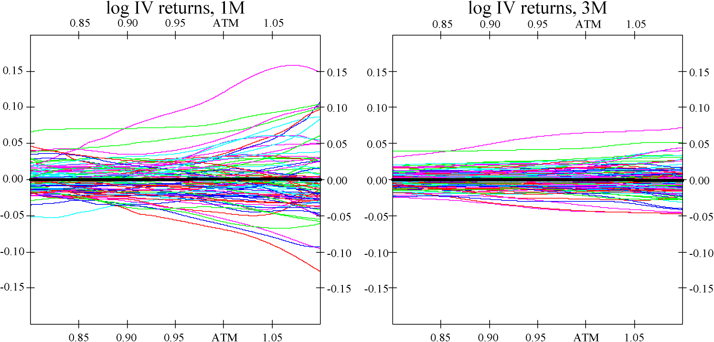

# Common functional principal componentst1

## Metadata

- **Source File:** `07-AOS516.pdf`
- **Authors:** Michal Benko, Wolfgang Hardle, Alois Kneip
- **Year:** 2009
- **DOI:** 10.1214/07-AOS516

## Abstract

Not found.

## Main Text

The Annals of Statistics
2009, Vol. 37, No. 1, 1–34
DOI: 10.1214/07-AOS516
© Institute of Mathematical Statistics, 2009
COMMON FUNCTIONAL PRINCIPAL COMPONENTS1
BY MICHAL BENKO, WOLFGANG HÄRDLE AND ALOIS KNEIP
Humboldt-Universität, Humboldt-Universität and Bonn Universität
Functional principal component analysis (FPCA) based on the Karhunen–
Loève decomposition has been successfully applied in many applications,
mainly for one sample problems. In this paper we consider common functional principal components for two sample problems. Our research is motivated not only by the theoretical challenge of this data situation, but also
by the actual question of dynamics of implied volatility (IV) functions. For
different maturities the log-returns of IVs are samples of (smooth) random
functions and the methods proposed here study the similarities of their stochastic behavior. First we present a new method for estimation of functional
principal components from discrete noisy data. Next we present the two sample inference for FPCA and develop the two sample theory. We propose
bootstrap tests for testing the equality of eigenvalues, eigenfunctions, and
mean functions of two functional samples, illustrate the test-properties by
simulation study and apply the method to the IV analysis.
1. Introduction.
In many applications in biometrics, chemometrics, econometrics, etc., the data come from the observation of continuous phenomenons of
time or space and can be assumed to represent a sample of i.i.d. smooth random
functions X1(t),..., Xn(t) ∈L2[0,1]. Functional data analysis has received considerable attention in the statistical literature during the last decade. In this context
functional principal component analysis (FPCA) has proved to be a key technique.
An early reference is Rao (1958), and important methodological contributions have
been given by various authors. Case studies and references, as well as methodological and algorithmical details, can be found in the books by Ramsay and Silverman
(2002, 2005) or Ferraty and Vieu (2006).
The well-known Karhunen–Loève (KL) expansion provides a basic tool to describe the distribution of the random functions Xi and can be seen as the the-
 1
oretical basis of FPCA. For v,w ∈L2[0,1], let ⟨v,w⟩=
0 v(t)w(t)dt, and let
∥· ∥= ⟨·,·⟩1/2 denote the usual L2-norm. With λ1 ≥λ2 ≥··· and γ1,γ2,... denoting eigenvalues and corresponding orthonormal eigenfunctions of the covariance
operator  of Xi, we obtain Xi = μ+ ∞
r=1 βriγr,i = 1,...,n, where μ = E(Xi)
Received January 2006; revised February 2007.
1Supported by the Deutsche Forschungsgemeinschaft and the Sonderforschungsbereich 649
“Ökonomisches Risiko.”
AMS 2000 subject classifications. Primary 62H25, 62G08; secondary 62P05.
Key words and phrases. Functional principal components, nonparametric regression, bootstrap,
two sample problem.
1

2
is the mean function and βri = ⟨Xi −μ,γr⟩are (scalar) factor loadings with
E(β2
ri) = λr. Structure and dynamics of the random functions can be assessed by
analyzing the “functional principal components” γr, as well as the distribution of
the factor loadings. For a given functional sample, the unknown characteristics
λr,γr are estimated by the eigenvalues and eigenfunctions of the empirical covariance operator ˆn of X1,...,Xn. Note that an eigenfunction γr is identified (up to
sign) only if the corresponding eigenvalue λr has multiplicity one. This therefore
establishes a necessary regularity condition for any inference based on an estimated functional principal component ˆγr in FPCA. Signs are arbitrary (γr and βri
can be replaced by −γr and −βri) and may be fixed by a suitable standardization.
More detailed discussion on this topic and precise assumptions can be found in
Section 2.
In many important applications a small number of functional principal components will suffice to approximate the functions Xi with a high degree of accuracy.
Indeed, FPCA plays a much more central role in functional data analysis than its
well-known analogue in multivariate analysis. There are two major reasons. First,
distributions on function spaces are complex objects, and the Karhunen–Loève expansion seems to be the only practically feasible way to access their structure. Second, in multivariate analysis a substantial interpretation of principal components is
often difficult and has to be based on vague arguments concerning the correlation
of principal components with original variables. Such a problem does not at all
exists in the functional context, where γ1(t),γ2(t),... are functions representing
the major modes of variation of Xi(t) over t.
In this paper we consider inference and tests of hypotheses on the structure of
functional principal components. Motivated by an application to implied volatility
analysis, we will concentrate on the two sample case. A central point is the use
of bootstrap procedures. We will show that the bootstrap methodology can also be
applied to functional data.
In Section 2 we start by discussing one-sample inference for FPCA. Basic results on asymptotic distributions have already been derived by Dauxois, Pousse
and Romain (1982) in situations where the functions are directly observable. Hall
and Hosseini-Nasab (2006) develop asymptotic Taylor expansions of estimated
eigenfunctions in terms of the difference ˆn −. Without deriving rigorous theoretical results, they also provide some qualitative arguments as well as simulation
results motivating the use of bootstrap in order to construct confidence regions for
principal components.
In practice, the functions of interest are often not directly observed, but are regression curves which have to be reconstructed from discrete, noisy data. In this
context the standard approach is to first estimate individual functions nonparametrically (e.g., by B-splines) and then to determine principal components of the
resulting estimated empirical covariance operator—see Besse and Ramsay (1986),
Ramsay and Dalzell (1991), among others. Approaches incorporating a smoothing step into the eigenanalysis have been proposed by Rice and Silverman (1991),

3
Pezzulli and Silverman (1993) or Silverman (1996). Robust estimation of principal components has been considered by Lacontore et al. (1999). Yao, Müller and
Wang (2005) and Hall, Müller and Wang (2006) propose techniques based on nonparametric estimation of the covariance function E[{Xi(t) −μ(t)}{Xi(s) −μ(s)}]
which can also be applied if there are only a few scattered observations per curve.
Section 2.1 presents a new method for estimation of functional principal components. It consists in an adaptation of a technique introduced by Kneip and Utikal
(2001) for the case of density functions. The key-idea is to represent the components of the Karhunen–Loève expansion in terms of an (L2) scalar-product matrix
of the sample. We investigate the asymptotic properties of the proposed method.
It is shown that under mild conditions the additional error caused by estimation
from discrete, noisy data is first-order asymptotically negligible, and inference may
proceed “as if” the functions were directly observed. Generalizing the results of
Dauxois, Pousse and Romain (1982), we then present a theorem on the asymptotic
distributions of the empirical eigenvalues and eigenfunctions. The structure of the
asymptotic expansion derived in the theorem provides a basis to show consistency
of bootstrap procedures.
Section 3 deals with two-sample inference. We consider two independent samples of functions {X(1)
i=1 and {X(2)
i }n1
i }n2
i=1. The problem of interest is to test in how
far the distributions of these random functions coincide. The structure of the different distributions in function space can be accessed by means of the respective
Karhunen–Loève expansions
∞

= μ(p) +
X(p)
β(p)
ri γ (p)
p = 1,2.
,
r
i
r=1
Differences in the distribution of these random functions will correspond to differences in the components of the respective KL expansions above. Without restriction, one may require that signs are such that ⟨γ (1)
,γ (2)
⟩≥0. Two sample
r
r
inference for FPCA in general has not been considered in the literature so far. In
Section 3 we define bootstrap procedures for testing the equality of mean functions, eigenvalues, eigenfunctions and eigenspaces. Consistency of the bootstrap
is derived in Section 3.1, while Section 3.2 contains a simulation study providing
insight into the finite sample performance of our tests.
It is of particular interest to compare the functional components characterizing
the two samples. If these factors are “common,” this means γr := γ (1)
= γ (2)
, then
r
r
only the factor loadings β(p)
may vary across samples. This situation may be seen
ri
as a functional generalization of the concept of “common principal components”
as introduced by Flury (1988) in multivariate analysis. A weaker hypothesis may
only require equality of the eigenspaces spanned by the first L ∈N functional principal components. [N denotes the set of all natural numbers 1,2,... (0 /∈N)]. If for
both samples the common L-dimensional eigenspaces suffice to approximate the

4
functions with high accuracy, then the distributions in function space are well represented by a low-dimensional factor model, and subsequent analysis may rely on
comparing the multivariate distributions of the random vectors (β(p)
r1 ,...,β(p)
rL )⊤.
The idea of “common functional principal components” is of considerable importance in implied volatility (IV) dynamics. This application is discussed in detail in Section 4. Implied volatility is obtained from the pricing model proposed
by Black and Scholes (1973) and is a key parameter for quoting options prices.
Our aim is to construct low-dimensional factor models for the log-returns of
the IV functions of options with different maturities. In our application the first
group of functional observations—{X(1)
i }n1
i=1, are log-returns on the maturity “1
month” (1M group) and second group—{X(2)
i }n2
i=1, are log-returns on the maturity
“3 months” (3M group).
The first three eigenfunctions (ordered with respect to the corresponding eigenvalues), estimated by the method described in Section 2.1, are plotted in Figure 1.
The estimated eigenfunctions for both groups are of similar structure, which motivates a common FPCA approach. Based on discretized vectors of functional values, a (multivariate) common principal components analysis of implied volatilities
has already been considered by Fengler, Härdle and Villa (2003). They rely on
the methodology introduced by Flury (1988) which is based on maximum likelihood estimation under the assumption of multivariate normality. Our analysis
overcomes the limitations of this approach by providing specific hypothesis tests
in a fully functional setup. It will be shown in Section 4 that for both groups L = 3
components suffice to explain 98.2% of the variability of the sample functions. An
application of the tests developed in Section 3 does not reject the equality of the
corresponding eigenspaces.
Estimated eigenfunctions for 1M group in the left plot and 3M group in the right plot:
FIG. 1.
solid—first function, dashed—second function, finely dashed—third function.

5
2. Functional principal components and one sample inference.
In this section we will focus on one sample of i.i.d. smooth random functions X1,...,Xn ∈
L2[0,1]. We will assume a well-defined mean function μ = E(Xi), as well as the
existence of a continuous covariance function σ(t,s) = E[{Xi(t) −μ(t)}{Xi(s) −
 σ(t,t)dt < ∞, and the covariance operator  of
μ(s)}]. Then E(∥Xi −μ∥2) =
Xi is given by

v ∈L2[0,1].
(v)(t) =
σ(t,s)v(s)ds,
The Karhunen–Loève decomposition provides a basic tool to describe the distribution of the random functions Xi. With λ1 ≥λ2 ≥··· and γ1,γ2,... denoting
eigenvalues and a corresponding complete orthonormal basis of eigenfunctions of
, we obtain
∞

Xi = μ +
i = 1,...,n,
βriγr,
(1)
r=1
where βri = ⟨Xi −μ,γr⟩are uncorrelated (scalar) factor loadings with E(βri) = 0,
E(β2
ri) = λr and E(βriβki) = 0 for r ̸= k. Structure and dynamics of the random
functions can be assessed by analyzing the “functional principal components” γr,
as well as the distribution of the factor loadings.
A discussion of basic properties of (1) can, for example, be found in Gihman and
Skorohod (1973). Under our assumptions, the infinite sums in (1) converge with
probability 1, and ∞
r=1 λr = E(∥Xi −μ∥2) < ∞. Smoothness of Xi carries over
to a corresponding degree of smoothness of σ(t,s) and γr. If, with probability 1,
Xi(t) is twice continuously differentiable, then σ as well as γr are also twice
continuously differentiable. The particular case of a Gaussian random function Xi
implies that the βri are independent N(0,λr)-distributed random variables.
An important property of (1) consists in the known fact that the first L principal
components provide a “best basis” for approximating the sample functions in terms
of the integrated square error; see Ramsay and Silverman (2005), Section 6.2.3,
among others. For any choice of L orthonormal basis functions v1,...,vL, the
mean integrated square error
Xi −μ −

2
L

ρ(v1,...,vL) = E
⟨Xi −μ,vr⟩vr
(2)
r=1
is minimized by vr = γr.
2.1. Estimation of functional principal components.
For a given sample an
empirical analog of (1) can be constructed by using eigenvalues ˆλ1 ≥ˆλ2 ≥··· and
orthonormal eigenfunctions ˆγ1, ˆγ2,... of the empirical covariance operator ˆn,
where

( ˆnv)(t) =
ˆσ(t,s)v(s)ds,

6
with ¯X = n−1 n
i=1 Xi and ˆσ(t,s) = n−1 n
i=1{Xi(t) −¯X(t)}{Xi(s) −¯X(s)} denoting sample mean and covariance function. Then
n

Xi = ¯X +
ˆβri ˆγr,
i = 1,...,n,
(3)
r=1
where ˆβri = ⟨ˆγr,Xi −¯X⟩. We necessarily obtain n−1 
i ˆβri = 0, n−1 
i ˆβri ˆβsi =
0 for r ̸= s, and n−1 
i ˆβ2
ri = ˆλr.
Analysis will have to concentrate on the leading principal components explaining the major part of the variance. In the following we will assume that
λ1 > λ2 > ··· > λr0 > λr0+1, where r0 denotes the maximal number of components to be considered. For all r = 1,...,r0, the corresponding eigenfunction γr
is then uniquely defined up to sign. Signs are arbitrary, decompositions (1) or (3)
may just as well be written in terms of −γr,−βri or −ˆγr,−ˆβri, and any suitable
standardization may be applied by the statistician. In order to ensure that ˆγr may
be viewed as an estimator of γr rather than of −γr, we will in the following only
assume that signs are such that ⟨γr, ˆγr⟩≥0. More generally, any subsequent statement concerning differences of two eigenfunctions will be based on the condition
of a nonnegative inner product. This does not impose any restriction and will go
without saying.
The results of Dauxois, Pousse and Romain (1982) imply that, under regularity
conditions, ∥ˆγr −γr∥= Op(n−1/2), |ˆλr −λr| = Op(n−1/2), as well as | ˆβri −βri| =
Op(n−1/2) for all r ≤r0.
However, in practice, the sample functions Xi are often not directly observed,
but have to be reconstructed from noisy observations Yij at discrete design points
tik:
Yik = Xi(tik) + εik,
k = 1,...,Ti,
(4)
where εik are independent noise terms with E(εik) = 0, Var(εik) = σ 2
i .
Our approach for estimating principal components is motivated by the wellknown duality relation between row and column spaces of a data matrix; see
Härdle and Simar (2003), Chapter 8, among others. In a first step this approach
relies on estimating the elements of the matrix:
Mlk = ⟨Xl −¯X,Xk −¯X⟩,
l,k = 1,...,n.
(5)
Some simple linear algebra shows that all nonzero eigenvalues ˆλ1 ≥ˆλ2 ··· of ˆn
and l1 ≥l2 ··· of M are related by ˆλr = lr/n, r = 1,2,.... When using the corresponding orthonormal eigenvectors p1,p2,... of M, the empirical scores ˆβri, as
well as the empirical eigenfunctions ˆγr, are obtained by ˆβri = √lrpir and
n
n


1
1
pir(Xi −¯X) =
√lr
√lr
ˆγr =
pirXi.
(6)
i=1
i=1

7
The elements of M are functionals which can be estimated with asympotically
negligible bias and a parametric rate of convergence T −1/2
. If the data in (4) is
i
generated from a balanced, equidistant design, then it is easily seen that for i ̸= j
this rate of convergence is achieved by the estimator
T

Mij = T −1
(Yik −¯Y·k)(Yjk −¯Y·k),
i ̸= j,
k=1
and
T

(Yik −¯Y·k)2 −ˆσ 2
Mii = T −1
i ,
k=1
i denotes some nonparametric estimator of variance and ¯Y·k = n−1 ×
where ˆσ 2
n
j=1 Yjk.
In the case of a random design some adjustment is necessary: Define the ordered
sample ti(1) ≤ti(2) ≤··· ≤ti(Ti) of design points, and for j = 1,...,Ti, let Yi(j)
denote the observation belonging to ti(j). With ti(0) = −ti(1) and ti(Ti+1) = 2 −
ti(Ti), set
ti(j−1) + ti(j)
Ti

, ti(j) + ti(j+1)
χi(t) =
t ∈
t ∈[0,1],
Yi(j)I
,
2
2
j=1
where I(·) denotes the indicator function, and for i ̸= j, define the estimate of Mij
by
 1
Mij =
0 {χi(t) −¯χ(t)}{χj(t) −¯χ(t)}dt,
where ¯χ(t) = n−1 n
i=1 χi(t). Finally, by redefining ti(1) = −ti(2) and ti(Ti+1) =
i (t) = Ti
j=2 Yi(j−1)I(t ∈[ti(j−1)+ti(j)
, ti(j)+ti(j+1)
2 −ti(Ti), set χ∗
)), t ∈[0,1]. Then
2
2
construct estimators of the diagonal terms Mii by
 1
0 {χi(t) −¯χ(t)}{χ∗
Mii =
i (t) −¯χ(t)}dt.
(7)
The aim of using the estimator (7) for the diagonal terms is to avoid the additional
ik) = Xi(tij)2 + σ 2
bias implied by Eε(Y 2
i . Here Eε denotes conditional expectation given tij, Xi. Alternatively, we can construct a bias corrected estimator using
some nonparametric estimation of variance σ 2
i , for example, the difference based
model-free variance estimators studied in Hall, Kay and Titterington (1990) can
be employed.
The eigenvalues ˆl1 ≥ˆl2 ··· and eigenvectors ˆp1, ˆp2,... of the resulting matrix
ˆlr ˆpir of ˆλr and ˆβri. EstiM then provide estimates ˆλr;T = ˆlr/n and ˆβri;T =
mates ˆγr;T of the empirical functional principal component ˆγr can be determined

8
from (6) when replacing the unknown true functions Xi by nonparametric estimates ˆXi (as, for example, local polynomial estimates) with smoothing parameter
(bandwidth) b:
n

ˆγr;T = 1
ˆpir ˆXi.
(8)
ˆlr
i=1
When considering (8), it is important to note that ˆγr;T is defined as a weighted
average of all estimated sample functions. Averaging reduces variance, and efficient estimation of ˆγr therefore requires undersmoothing of individual function
estimates ˆXi. Theoretical results are given in Theorem 1 below. Indeed, if, for
example, n and T = mini Ti are of the same order of magnitude, then under suitable additional regularity conditions it will be shown that for an optimal choice
of a smoothing parameter b ∼(nT )−1/5 and twice continuously differentiable Xi,
we obtain the rate of convergence ∥ˆγr −ˆγr;T ∥= Op{(nT )−2/5}. Note, however,
that the bias corrected estimator (7) may yield negative eigenvalues. In practice,
these values will be small and will have to be interpreted as zero. Furthermore,
the eigenfunctions determined by (8) may not be exactly orthogonal. Again, when
using reasonable bandwidths, this effect will be small, but of course (8) may by
followed by a suitable orthogonalization procedure.
It is of interest to compare our procedure to more standard methods for estimating ˆλr and ˆγr as mentioned above. When evaluating eigenvalues and eigenfunctions of the empirical covariance operator of nonparametrically estimated curves
ˆXi, then for fixed r ≤r0 the above rate of convergence for the estimated eigenfunctions may well be achieved for a suitable choice of smoothing parameters (e.g.,
number of basis functions). But as will be seen from Theorem 1, our approach
also implies that |ˆλr −ˆlr
n | = Op(T −1 + n−1). When using standard methods it
does not seem to be possible to obtain a corresponding rate of convergence, since
any smoothing bias |E[ ˆXi(t)] −Xi(t)| will invariably affect the quality of the corresponding estimate of ˆλr.
We want to emphasize that any finite sample interpretation will require that T is
sufficiently large such that our nonparametric reconstructions of individual curves
can be assumed to possess a fairly small bias. The above arguments do not apply
to extremely sparse designs with very few observations per curve [see Hall, Müller
and Wang (2006) for an FPCA methodology focusing on sparse data].
Note that, in addition to (8), our final estimate of the empirical mean function
ˆμ = ¯X will be given by ˆμT = n−1 
i ˆXi. A straightforward approach to determine
a suitable bandwidth b consists in a “leave-one-individual-out” cross-validation.
For the maximal number r0 of components to be considered, let ˆμT,−i and ˆγr;T,−i,
r = 1,...,r0, denote the estimates of ˆμ and ˆγr obtained from the data (Ylj,tlj),
l = 1,...,i −1,i + 1,...,n, j = 1,...,Tk. By (8), these estimates depend on b,

9
and one may approximate an optimal smoothing parameter by minimizing

2
r0



ˆϑri ˆγr;T,−i(tij)
Yij −ˆμT,−i(tij) −
r=1
i
j
over b, where ˆϑri denote ordinary least squares estimates of ˆβri. A more sophisticated version of this method may even allow to select different bandwidths br
when estimating different functional principal components by (8). Although, under certain regularity conditions, the same qualitative rates of convergence hold for
any arbitrary fixed r ≤r0, the quality of estimates decreases when r becomes large.
Due to ⟨γs,γr⟩= 0 for s < r, the number of zero crossings, peaks and valleys of
γr has to increase with r. Hence, in tendency γr will be less and less smooth as r
increases. At the same time, λr →0, which means that for large r the rth eigenfunctions will only possess a very small influence on the structure of Xi. This in
turn means that the relative importance of the error terms εik in (4) on the structure
of ˆγr;T will increase with r.
2.2. One sample inference.
Clearly, in the framework described by (1)–(4) we
are faced with two sources of variability of estimated functional principal components. Due to sampling variation, ˆγr will differ from the true component γr, and
due to (4), there will exist an additional estimation error when approximating ˆγr
by ˆγr;T .
The following theorems quantify the order of magnitude of these different types
of error. Our theoretical results are based on the following assumptions on the
structure of the random functions Xi.
X1,...,Xn ∈L2[0,1] is an i.i.d. sample of random funcASSUMPTION 1.
tions with mean μ and continuous covariance function σ(t,s), and (1) holds for
a system of eigenfunctions satisfying sups∈N supt∈[0,1] |γs(t)| < ∞. Furthermore,
∞
∞
si] < ∞and ∞
∞
s=1 E[β2
riβ2
s=1 E[β2
riβqiβsi] < ∞for all r ∈N.
r=1
q=1
Recall that E[βri] = 0 and E[βriβsi] = 0 for r ̸= s. Note that the assumption
on the factor loadings is necessarily fulfilled if Xi are Gaussian random functions.
Then βri and βsi are independent for r ̸= s, all moments of βri are finite, and hence
E[β2
riβqiβsi] = 0 for q ̸= s, as well as E[β2
riβ2
si] = λrλs for r ̸= s; see Gihman and
Skorohod (1973).
We need some further assumptions concerning smoothness of Xi and the structure of the discrete model (4).
(a) Xi is a.s. twice continuously differentiable. There exists
ASSUMPTION 2.
a constant D1 < ∞such that the derivatives are bounded by supt E[Xi′(t)4] ≤D1,
as well as supt E[Xi′′(t)4] ≤D1.

10
(b) The design points tik, i = 1,...,n, k = 1,...,Ti, are i.i.d. random variables which are independent of Xi and εik. The corresponding design density f is
continuous on [0,1] and satisfies inft∈[0,1] f (t) > 0.
(c) For any i, the error terms εik are i.i.d. zero mean random variables with
Var(εik) = σ 2
i . Furthermore, εik is independent of Xi, and there exists a constant
D2 such that E(ε8
ik) < D2 for all i,k.
(d) The estimates ˆXi used in (8) are determined by either a local linear or a
Nadaraya–Watson kernel estimator with smoothing parameter b and kernel function K. K is a continuous probability density which is symmetric at 0.
The following theorems provide asymptotic results as n,T →∞, where T =
minn
i=1{Ti}.
In addition to Assumptions 1 and 2, assume that infs̸=r |λr −
THEOREM 1.
λs| > 0 holds for some r = 1,2,.... Then we have the following:
(i) n−1 n
i=1( ˆβri −ˆβri;T )2 = Op(T −1) and
ˆλr −
 = Op(T −1 + n−1).
ˆlr
(9)
n
(ii) If additionally b →0 and (T b)−1 →0 as n,T →∞, then for all t ∈[0,1],
| ˆγr(t) −ˆγr;T (t)| = Op{b2 + (nT b)−1/2 + (T b1/2)−1 + n−1}.
(10)
A proof is given in the Appendix.
Under Assumption 1 we obtain the following:
THEOREM 2.
(i) For all t ∈[0,1],




n



√n{ ¯X(t) −μ(t)} =
1
γr(t) L
λrγr(t)2
√n
→N
βri
0,
.
r
r
i=1
If, furthermore, λr−1 > λr > λr+1 holds for some fixed r ∈{1,2,...}, then
(ii)
n

√n(ˆλr −λr) = 1
ri −λr) + Op(n−1/2) L
(β2
√n
→N(0, r),
(11)
i=1
where r = E[(β2
ri −λr)2],
(iii) and for all t ∈[0,1]


n


1
ˆγr(t) −γr(t) =
γs(t) + Rr(t),
βsiβri
n(λr −λs)
s̸=r
i=1
(12)
where ∥Rr∥= Op(n−1).

11
Moreover,


n


√n
1
βsiβri
γs(t)
n(λr −λs)
s̸=r
i=1


E[β2


riβqiβsi]
L
→N
(λq −λr)(λs −λr)γq(t)γs(t)
0,
.
q̸=r
s̸=r
A proof can be found in the Appendix. The theorem provides a generalization of
the results of Dauxois, Pousse and Romain (1982) who derive explicit asymptotic
distributions by assuming Gaussian random functions Xi. Note that in this case
r and 

(λq−λr)(λs−λr)γq(t)γs(t) = 
E[β2
riβqiβsi]
λrλs
r = 2λ2
(λs−λr)2 γs(t)2.
q̸=r
s̸=r
s̸=r
When evaluating the bandwidth-dependent terms in (10), best rates of convergence | ˆγr(t)−ˆγr;T (t)| = Op{(nT )−2/5 +T −4/5 +n−1} are achieved when choosing an undersmoothing bandwidth b ∼max{(nT )−1/5,T −2/5}. Theoretical work
in functional data analysis is usually based on the implicit assumption that the
additional error due to (4) is negligible, and that one can proceed “as if” the functions Xi were directly observed. In view of Theorems 1 and 2, this approach is
justified in the following situations:
(1) T is much larger than n, that is, n/T 4/5 →0, and the smoothing parameter b in (8) is of order T −1/5 (optimal smoothing of individual functions).
(2) An undersmoothing bandwidth b ∼max{(nT )−1/5,T −2/5} is used and
n/T 8/5 →0. This means that T may be smaller than n, but T must be at least
of order of magnitude larger than n5/8.
In both cases (1) and (2) the above theorems imply that |ˆλr −ˆlr
n | = Op(|ˆλr −
λr|), as well as ∥ˆγr −ˆγr;T ∥= Op(∥ˆγr −γr∥). Inference about functional principal
components will then be first-order equivalent to an inference based on known
functions Xi.
In such situations Theorem 2 suggests bootstrap procedures as tools for one
sample inference. For example, the distribution of ∥ˆγr −γr∥may by approximated
by the bootstrap distribution of ∥ˆγ ∗
r −ˆγr∥, where ˆγ ∗
r are estimates to be obtained
from i.i.d. bootstrap resamples X∗
1,X∗
2,...,X∗
n of {X1,X2,...,Xn}. This means
that X∗
1 = Xi1,...,X∗
n = Xin for some indices i1,...,in drawn independently and
with replacement from {1,...,n} and, in practice, ˆγ ∗
r may thus be approximated
from corresponding discrete data (Yi1j,ti1j)j=1,...,Ti1,..., (Yinj,tinj)j=1,...,Tin.
The additional error is negligible if either (1) or (2) is satisfied.
One may wonder about the validity of such a bootstrap. Functions are complex objects and there is no established result in bootstrap theory which readily
generalizes to samples of random functions. But by (1), i.i.d. bootstrap resamples {X∗
i }i=1,...,n may be equivalently represented by corresponding, i.i.d. resamples {β∗
1i,β∗
2i,...}i=1,...,n of factor loadings. Standard multivariate bootstrap the-

12
orems imply that for any q ∈N the distribution of moments of the random vectors (β1i,...,βqi) may be consistently approximated by the bootstrap distribution
of corresponding moments of (β∗
1i,...,β∗
qi). Together with some straightforward
limit arguments as q →∞, the structure of the first-order terms in the asymptotic
expansions (11) and (12) then allows to establish consistency of the functional
bootstrap. These arguments will be made precise in the proof of Theorem 3 below,
which concerns related bootstrap statistics in two sample problems.
Theorem 2(iii) implies that the variance of ˆγr is large if one of the
REMARK.
differences λr−1 −λr or λr −λr+1 is small. In the limit case of eigenvalues of multiplicity m > 1 our theory does not apply. Note that then only the m-dimensional
eigenspace is identified, but not a particular basis (eigenfunctions). In multivariate PCA Tyler (1981) provides some inference results on corresponding projection
matrices assuming that λr > λr+1 ≥··· ≥λr+m > λr+m+1 for known values of r
and m.
Although the existence of eigenvalues λr, r ≤r0, with multiplicity m > 1 may
be considered as a degenerate case, it is immediately seen that λr →0 and, hence,
λr −λr+1 →0 as r increases. Even in the case of fully observed functions Xi, estimates of eigenfunctions corresponding to very small eigenvalues will thus be poor.
The problem of determining a sensible upper limit of the number r0 of principal
components to be analyzed is addressed in Hall and Hosseini-Nasab (2006).
3. Two sample inference.
The comparison of functional components across
groups leads naturally to two sample problems. Thus, let
X(1)
1 ,X(1)
X(2)
1 ,X(2)
2 ,...,X(1)
2 ,...,X(2)
and
n1
n2
denote two independent samples of smooth functions. The problem of interest is to
test in how far the distributions of these random functions coincide. The structure
of the different distributions in function space can be accessed by means of the
respective Karhunen–Loève decompositions. The problem to be considered then
translates into testing equality of the different components of these decompositions
given by
∞

= μ(p) +
X(p)
β(p)
ri γ (p)
p = 1,2,
,
(13)
r
i
r=1
where again γ (p)
are the eigenfunctions of the respective covariance operator (p)
r
corresponding to the eigenvalues λ(p)
= E{(β(p)
1i )2} ≥λ(p)
= E{(β(p)
2i )2} ≥···. We
1
2
will again suppose that λ(p)
r−1 > λ(p)
> λ(p)
r+1, p = 1,2, for all r ≤r0 components to
r
be considered. Without restriction, we will additionally assume that signs are such
that ⟨γ (1)
,γ (2)
⟩≥0, as well as ⟨ˆγ (1)
, ˆγ (2)
⟩≥0.
r
r
r
r

13
It is of great interest to detect possible variations in the functional components
characterizing the two samples in (13). Significant difference may give rise to substantial interpretation. Important hypotheses to be considered thus are as follows:
H01 :μ(1) = μ(2)
H02,r :γ (1)
= γ (2)
r ≤r0.
,
and
r
r
Hypothesis H02,r is of particular importance. Then γ (1)
= γ (2)
and only the factor
r
r
loadings βri may vary across samples. If, for example, H02,r is accepted, one may
additionally want to test hypotheses about the distributions of β(p)
ri , p = 1,2. Reri }2 = λ(p)
call that necessarily E{β(p)
ri } = 0, E{β(p)
, and β(p)
is uncorrelated with
r
si
β(p)
if r ̸= s. If the X(p)
are Gaussian random variables, the β(p)
are independent
ri
i
ri
N(0,λr) random variables. A natural hypothesis to be tested then refers to the
equality of variances:
H03,r :λ(1)
= λ(2)
r = 1,2,....
r ,
r

i X(p)
(t), and let ˆλ(p)
≥ˆλ(p)
≥··· and ˆγ (p)
, ˆγ (p)
Let ˆμ(p)(t) = 1
,... denote
i
1
2
1
2
np
eigenvalues and corresponding eigenfunctions of the empirical covariance operator
ˆ(p)
np of X(p)
1 ,X(p)
2 (t),...,X(p)
np . The following test statistics are defined in terms
of ˆμ(p), ˆλ(p)
and ˆγ (p)
. As discussed in the proceeding section, all curves in both
r
r
samples are usually not directly observed, but have to be reconstructed from noisy
observations according to (4). In this situation, the “true” empirical eigenvalues
and eigenfunctions have to be replaced by their discrete sample estimates. Bootstrap estimates are obtained by resampling the observations corresponding to the
unknown curves X(p)
. As discussed in Section 2.2, the validity of our test proi
cedures is then based on the assumption that T is sufficiently large such that the
additional estimation error is asymptotically negligible.
Our tests of the hypotheses H01,H02,r and H03,r rely on the statistics
 ˆμ(1) −ˆμ(2)2,
def
=
D1
 ˆγ (1)
2,
def
−ˆγ (2)
=
D2,r
r
r
ˆλ(1)
2.
def
−ˆλ(2)
=
D3,r
r
r
The respective null-hypothesis has to be rejected if D1 ≥ 1;1−α, D2,r ≥ 2,r;1−α
or D3,r ≥ 3,r;1−α, where 1;1−α, 2,r;1−α and 3,r;1−α denote the critical values of the distributions of
 ˆμ(2) −μ(2)2,
 ˆμ(1) −μ(1) −
def
=
1
 ˆγ (2)
2,
 ˆγ (1)
def
−γ (1)
−γ (2)
=
−
2,r
r
r
r
r
2.
ˆλ(1)
ˆλ(2)
def
−λ(1)
−λ(2)
=
−
3,r
r
r
r
r

14
Of course, the distributions of the different ’s cannot be accessed directly, since
they depend on the unknown true population mean, eigenvalues and eigenfunctions. However, it will be shown below that these distributions and, hence, their
critical values are approximated by the bootstrap distribution of
 ˆμ(2)∗−ˆμ(2)2,
 ˆμ(1)∗−ˆμ(1) −
def
∗
=
1
 ˆγ (2)∗
2,
 ˆγ (1)∗
def
∗
−ˆγ (1)
−ˆγ (2)
=
−
2,r
r
r
r
r
ˆλ(1)∗
2,
ˆλ(2)∗
def
∗
−ˆλ(1)
−ˆλ(2)
=
−
3,r
r
r
r
r
where ˆμ(1)∗, ˆγ (1)∗
, ˆλ(1)∗
, as well as ˆμ(2)∗, ˆγ (2)∗
, ˆλ(2)∗
, are estimates to be obr
r
r
r
tained from independent bootstrap samples X1∗
1 (t),X1∗
2 (t),...,X1∗
n1(t), as well as
X2∗
1 (t),X2∗
2 (t),...,X2∗
n2(t).
This test procedure is motivated by the following insights:
(1) Under each of our null-hypotheses the respective test statistics D is equal
to the corresponding . The test will thus asymptotically possess the correct level:
P(D > 1−α) ≈α.
(2) If the null hypothesis is false, then D ̸= . Compared to the distribution of
, the distribution of D is shifted by the difference in the true means, eigenfunctions or eigenvalues. In tendency D will be larger than 1−α.
Let 1 < L ≤r0. Even if for r ≤L the equality of eigenfunctions is rejected,
we may be interested in the question of whether at least the L-dimensional
eigenspaces generated by the first L eigenfunctions are identical. Therefore, let
E(1)
L , as well as E(2)
L , denote the L-dimensional linear function spaces generated
by the eigenfunctions γ (1)
1 ,...,γ (1)
and γ (2)
1 ,...,γ (2)
L , respectively. We then aim
L
to test the null hypothesis:
H04,L :E(1)
L = E(2)
L .
Of course, H04,L corresponds to the hypothesis that the operators projecting into
E(1)
and E(2)
are identical. This in turn translates into the condition that
L
L
L
L


γ (1)
(t)γ (1)
γ (2)
(t)γ (2)
(s) =
for all t,s ∈[0,1].
(s)
r
r
r
r
r=1
r=1
Similar to above, a suitable test statistic is given by
   L
2
L


def
ˆγ (1)
(t) ˆγ (1)
ˆγ (2)
(t) ˆγ (2)
=
(s) −
D4,L
(s)
dt ds
r
r
r
r
r=1
r=1

15
and the null hypothesis is rejected if D4,L ≥ 4,L;1−α, where 4,L;1−α denotes
the critical value of the distribution of
   L

 ˆγ (1)

def
(t) ˆγ (1)
(s) −γ (1)
(t)γ (1)
=
(s)
4,L
r
r
r
r
r=1
2
L

 ˆγ (2)

(t) ˆγ (2)
(s) −γ (2)
(t)γ (2)
−
(s)
dt ds.
r
r
r
r
r=1
The distribution of 4,L and, hence, its critical values are approximated by the
bootstrap distribution of
   L

 ˆγ (1)∗

def
∗
(t) ˆγ (1)∗
(s) −ˆγ (1)
(t) ˆγ (1)
=
(s)
4,L
r
r
r
r
r=1
2
L

 ˆγ (2)∗

(t) ˆγ (2)∗
(s) −ˆγ (2)
(t) ˆγ (2)
−
(s)
dt ds.
r
r
r
r
r=1
It will be shown in Theorem 3 below that under the null hypothesis, as well as
under the alternative, the distributions of n 1,n 2,r,n 3,r,n 4,L converge to
continuous limit distributions which can be consistently approximated by the bootstrap distributions of n ∗
1,n ∗
2,r,n ∗
3,r,n ∗
4,L.
Let n = (n1 + n2)/2. We will assume that asymptot3.1. Theoretical results.
ically n1 = n · q1 and n2 = n · q2 for some fixed proportions q1 and q2. We will
then study the asymptotic behavior of our statistics as n →∞.
We will use X1 = {X(1)
1 ,...,X(1)
n1 } and X2 = {X(2)
1 ,...,X(2)
n2 } to denote the
observed samples of random functions.
Assume that {X(1)
1 ,...,X(1)
n1 } and {X(2)
1 ,...,X(2)
n2 } are two inTHEOREM 3.
dependent samples of random functions, each of which satisfies Assumption 1. As
n →∞we then obtain the following:
(i) There exists a nondegenerated, continuous probability distribution F1 such
L
→F1, and for any δ > 0,
that n 1
P(n 1 ≥δ) −P(n ∗
 = Op(1).
1 ≥δ|X1,X2)
(ii) If, furthermore, λ(1)
r−1 > λ(1)
> λ(1)
r+1 and λ(2)
r−1 > λ(2)
> λ(2)
r+1 hold for some
r
r
fixed r = 1,2,..., there exist a nondegenerated, continuous probability distribuL
→Fk,r, k = 2,3, and for any δ > 0,
tions Fk,r such that n k,r
P(n k,r ≥δ) −P(n ∗
 = Op(1),
k,r ≥δ|X1,X2)
k = 2,3.

16
(iii) If λ(1)
> λ(1)
r+1 > 0 and λ(2)
> λ(2)
r+1 > 0 hold for all r = 1,...,L, there exr
r
L
→
ists a nondegenerated, continuous probability distribution F4,L such that n 4,L
F4,L, and for any δ > 0,
P(n 4,L ≥δ) −P(n ∗
 = Op(1).
4,L ≥δ|X1,X2)
The structures of the distributions F1, F2,r, F3,r, F4,L are derived in the proof
of the theorem which can be found in the Appendix. They are obtained as limits of
distributions of quadratic forms.
3.2. Simulation study.
In this paragraph we illustrate the finite behavior of the
proposed test. The basic simulation-setup (setup “a”) is established as follows: the
first sample is generated by the random combination of orthonormalized sine and
cosine functions (Fourier functions) and the second sample is generated by the
random combination of the same but shifted factor functions:
√
√
X(1)
i (tik) = β(1)
2sin(2πtik) + β(1)
2cos(2πtik),
1i
2i
√
√
X(2)
i (tik) = β(2)
2sin{2π(tik + δ)} + β(2)
2cos{2π(tik + δ)}.
1i
2i
The factor loadings are i.i.d. random variables with β(p)
∼N(0,λ(p)
1 ) and
1i
β(p)
2i ∼N(0,λ(p)
2 ). The functions are generated on the equidistant grid tik = tk =
k/T, k = 1,...T = 100, i = 1,...,n = 70. The simulation setup is based on the
fact that the error of the estimation of the eigenfunctions simulated by sine and
cosine functions is, in particular, manifested by some shift of the estimated eigenfunctions. The focus of this simulation study is the test of common eigenfunctions.
For the presentation of results in Table 1, we use the following notation: “(a)
λ(1)
1 ,λ(1)
2 ,λ(2)
2 ,λ(2)
2 .” The shift parameter δ is changing from 0 to 0.25 with the
step 0.05. It should be mentioned that the shift δ = 0 yields the simulation of level
and setup with shift δ = 0.25 yields the simulation of the alternative, where the
two factor functions are exchanged.
In the second setup (setup “b”) the first factor functions are the same and the
second factor functions differ:
√
√
X(1)
i (tik) = β(1)
2sin(2πtik) + β(1)
2cos(2πtik),
1i
2i
√
√
X(2)
i (tik) = β(2)
2sin{2π(tik + δ)} + β(2)
2sin{4π(tik + δ)}.
1i
2i
In Table 1 we use the notation “(b) λ(1)
1 ,λ(1)
2 ,λ(2)
2 ,λ(2)
2 ,Dr.” Dr means the test
for the equality of the rth eigenfunction. In the bootstrap tests we used 500 bootstrap replications. The critical level in this simulation is α = 0.1. The number of
simulations is 250.
We can interpret Table 1 in the following way: In power simulations (δ ̸= 0) test
behaves as expected: less powerful if the functions are “hardly distinguishable”

17
TABLE 1
The results of the simulations for α = 0.1, n = 70, T = 100, number of simulations 250
Setup/shift
0
0.05
0.1
0.15
0.2
0.25
0.13
0.41
0.85
0.96
(a) 10, 5, 8, 4
1
1
0.12
0.48
0.87
0.96
(a) 4, 2, 2, 1
1
1
0.14
0.372
0.704
0.872
0.92
0.9
(a) 2, 1, 1.5, 2
0.10
0.44
0.86
0.95
(b) 10, 5, 8, 4 D1
1
1
(b) 10, 5, 8, 4 D2
1
1
1
1
1
1
(small shift, small difference in eigenvalues). The level approximation seems to
be less precise if the difference in the eingenvalues (λ(p)
−λ(p)
2 ) becomes smaller.
1
This can be explained by relative small sample-size n, small number of bootstrapreplications and increasing estimation-error as argued in Theorem 2, assertion (iii).
In comparison to our general setup (4), we used an equidistant and common
design for all functions. This simplification is necessary, it simplifies and speedsup the simulations, in particular, using general random and observation-specific
design makes the simulation computationally untractable.
Second, we omitted the additional observation error, this corresponds to the
standard assumptions in the functional principal components theory. As argued in
Section 2.2, the inference based on the directly observed functions and estimated
functions Xi is first-order equivalent under mild conditions implied by Theorems 1
and 2. In order to illustrate this theoretical result in the simulation, we used the
following setup:
√
√
X(1)
i (tik) = β(1)
2sin(2πtik) + β(1)
2cos(2πtik) + ε(1)
ik ,
1i
2i
√
√
X(2)
i (tik) = β(2)
2sin{2π(tik + δ)} + β(2)
2cos{2π(tik + δ)} + ε(2)
ik ,
1i
2i
where ε(p)
ik ∼N(0,0.25), p = 1,2, all other parameters remain the same as in the
simulation setup “a.” Using this setup, we recalculate the simulation presented in
the second “row” of Table 1, for estimation of the functions X(p)
,p = 1,2, we
i
used the Nadaraya–Watson estimation with Epanechnikov kernel and bandwidth
b = 0.05. We run the simulations with various bandwidths, the choice of the bandwidth does not have a strong influence on results except by oversmoothing (large
bandwidths). The results are printed in Table 2. As we can see, the difference of
the simulation results using estimated functions is not significant in comparison
to the results printed in the second line of Table 1—directly observed functional
values.
The last limitation of this simulation study is the choice of a particular alternative. A more general setup of this simulation study might be based on the following
model: X(1)
i (t) = β(1)
1i γ (1)
1 (t) + β(1)
2i γ (1)
2 (t), X(2)
i (t) = β(2)
1i γ (2)
1 (t) + β(2)
2i γ (2)
2 (t),

18
TABLE 2
The results of the simulation for α = 0.1, n = 70, T = 100 with additional error in observation
Setup/shift
0
0.05
0.1
0.15
0.2
0.25
0.09
0.35
0.64
0.92
0.94
0.97
(a) 10, 5, 8, 4
where γ (1)
1 ,γ (2)
1 ,γ (1)
and g are mutually orthogonal functions on L2[0,1] and
2
γ (2)
= (1 + υ2)−1/2{γ (1)
+ υg}. Basically we create the alternative by the con2
2
tamination of one of the “eigenfunctions” (in our case the second one) in the direction g and ensure ∥γ (2)
2 ∥= 1. The amount of the contamination is controlled
by the parameter υ. Note that the exact squared integral difference ∥γ (1)
−γ (2)
2 ∥2
2
does not depend on function g. Thus, in the “functional sense” particular “direction of the alternative hypothesis” represented by the function g has no impact
on the power of the test. However, since we are using a nonparametric estimation technique, we might expect that rough (highly fluctuating) functions g will
yield higher error of estimation and, hence, decrease the precision (and power) of
the test. Finally, a higher number of factor functions (L) in simulation may cause
less precise approximation of critical values and more bootstrap replications and
larger sample-size may be needed. This can also be expected from Theorem 2 in
Section 2.2—the variance of the estimated eigenfunctions depends on all eigenfunctions corresponding to nonzero eingenvalues.
4. Implied volatility analysis.
In this section we present an application of the
method discussed in previous sections to the implied volatilities of European options on the German stock index (ODAX). Implied volatilities are derived from the
Black–Scholes (BS) pricing formula for European options; see Black and Scholes
(1973). European call and put options are derivatives written on an underlying asset
with price process Si, which yield the pay-off max(SI −K,0) and max(K −SI,0),
respectively. Here i denotes the current day, I the expiration day and K the strike
price. Time to maturity is defined as τ = I −i. The BS pricing formula for a Call
option is
Ci(Si,K,τ,r,σ) = Si(d1) −Ke−rτ(d2),
(14)
, d2 = d1 −σ√τ, r is the risk-free interest rate, σ is
where d1 = ln(Si/K)+(r+σ 2/2)τ
σ√τ
the (unknown and constant) volatility parameter, and  denotes the c.d.f. of a
standard normal distributed random variable. In (14) we assume the zero-dividend
case. The Put option price Pi can be obtained from the put–call parity Pi = Ci −
Si + e−τrK.
The implied volatility ˜σ is defined as the volatility σ, for which the BS price Ci
in (14) equals the price ˜Ci observed on the market. For a single asset, we obtain at

19
each time point (day i) and for each maturity τ a IV function ˜σ τ
i (K). Practitioners
often rescale the strike dimension by plotting this surface in terms of (futures)
moneyness κ = K/Fi(τ), where Fi(τ) = Sierτ.
Clearly, for given parameters Si,r,K,τ the mapping from prices to IVs is a oneto-one mapping. The IV is often used for quoting the European options in financial
practice, since it reflects the “uncertainty” of the financial market better than the
option prices. It is also known that if the stock price drops, the IV raises (so-called
leverage effect), motivates hedging strategies based on IVs. Consequently, for the
purpose of this application, we will regard the BS–IV as an individual financial
variable. The practical relevance of such an approach is justified by the volatility
based financial products such as VDAX, which are commonly traded on the option
markets.
The goal of this analysis is to study the dynamics of the IV functions for different maturities. More specifically, our aim is to construct low dimensional factor
models based on the truncated Karhunen–Loève expansions (1) for the log-returns
of the IV functions of options with different maturities and compare these factor
models using the methodology presented in the previous sections. Analysis of IVs
based on a low-dimensional factor model gives directly a descriptive insight into
the structure of distribution of the log-IV-returns—structure of the factors and empirical distribution of the factor loadings may be a good starting point for further
pricing models. In practice, such a factor model can also be used in Monte Carlo
based pricing methods and for risk-management (hedging) purposes. For comprehensive monographs on IV and IV-factor models, see Hafner (2004) or Fengler
(2005b).
The idea of constructing and analyzing the factor models for log-IV-returns
for different maturities was originally proposed by Fengler, Härdle and Villa
(2003), who studied the dynamics of the IV via PCA on discretized IV functions for different maturity groups and tested the Common Principal Components (CPC) hypotheses (equality of eigenvectors and eigenspaces for different
groups). Fengler, Härdle and Villa (2003) proposed a PCA-based factor model
for log-IV-returns on (short) maturities 1, 2 and 3 months and grid of moneyness
[0.85,0.9,0.95,1,1.05,1.1]. They showed that the factor functions do not significantly differ and only the factor loadings differ across maturity groups. Their
method relies on the CPC methodology introduced by Flury (1988) which is based
on maximum likelihood estimation under the assumption of multivariate normality. The log-IV-returns are extracted by the two-dimensional Nadaraya–Watson
estimate.
The main aim of this application is to reconsider their results in a functional
sense. Doing so, we overcome two basic weaknesses of their approach. First, the
factor model proposed by Fengler, Härdle and Villa (2003) is performed only on
a sparse design of moneyness. However, in practice (e.g., in Monte Carlo pricing methods), evaluation of the model on a fine grid is needed. Using the functional PCA approach, we may overcome this difficulty and evaluate the factor

20
model on an arbitrary fine grid. The second difficulty of the procedure proposed
by Fengler, Härdle and Villa (2003) stems from the data design—on the exchange
we cannot observe options with desired maturity on each day and we need to
estimate them from the IV-functions with maturities observed on the particular
day. Consequently, the two-dimensional Nadaraya–Watson estimator proposed by
Fengler, Härdle and Villa (2003) results essentially in the (weighted) average of
the IVs (with closest maturities) observed on a particular day, which may affect the test of the common eigenfunction hypothesis. We use the linear interTOT,i(κ,τ) def
= (σ τ
polation scheme in the total variance σ 2
i (κ))2τ, in order to recover the IV functions with fixed maturity (on day i). This interpolation scheme
is based on the arbitrage arguments originally proposed by Kahalé (2004) for
zero-dividend and zero-interest rate case and generalized for deterministic interest rate by Fengler (2005a). More precisely, having IVs with maturities observed
τji
(κ), ji = 1,...,pτi, we calculate the corresponding toon a particular day i: ˜σ
i
tal variance ˜σTOT,i(κ,τji). From these total variances we linearly interpolate the
total variance with the desired maturity from the nearest maturities observed on
day i. The total variance can be easily transformed to corresponding IV ˜σ τ
i (κ). As
i (κ) def
the last step, we calculate the log-returns log ˜σ τ
= log ˜σ τ
i+1(κ) −log ˜σ τ
i (κ).
The log-IV-returns are observed for each maturity τ on a discrete grid κτ
ik. We assume that observed log-IV-return log ˜σ τ
i (κτ
ik) consists of true log-return of the
IV function denoted by logσ τ
i (κτ
ik) and possibly of some additional error ετ
ik.
By setting Y τ
ik := log ˜σ τ
i (κτ
ik), Xτ
i (κ) := logσ τ
i (κ), we obtain an analogue of
the model (4) with the argument κ:
Y τ
ik = Xτ
i (κik) + ετ
i = 1,...,nτ.
ik,
(15)
In order to simplify the notation and make the connection with the theoretical part
clear, we will use the notation of (15).
For our analysis we use a recent data set containing daily data from January 2004 to June 2004 from the German–Swiss exchange (EUREX). Violations
of the arbitrage-free assumptions (“obvious” errors in data) were corrected using the procedure proposed by Fengler (2005a). Similarly to Fengler, Härdle and
Villa (2003), we excluded options with maturity smaller then 10 days, since these
option-prices are known to be very noisy, partially because of a special and arbitrary setup in the pricing systems of the dealers. Using the interpolation scheme
described above, we calculate the log-IV-returns for two maturity groups: “1M”
group with maturity τ = 0.12 (measured in years) and “3M” group with maturity τ = 0.36. The observed log-IV-returns are denoted by Y 1M
ik , k = 1,...,K1M
,
i
Y 3M
ik , k = 1,...,K3M
. Since we ensured that for no i, the interpolation procedure
i
uses data with the same maturity for both groups, this procedure has no impact on
the independence of both samples.

21
The underlying models based on the truncated version of (3) are as follows:
L1M

(κ) = ¯X1M(κ) +
ˆβ1M
X1M
γr1M(κ),
i = 1,...,n1M,
(16)
i
ri
r=1
L3M

(κ) = ¯X3M(κ) +
ˆβ3M
X3M
γr3M(κ),
i = 1,...,n3M.
(17)
i
ri
r=1
Models (16) and (17) can serve, for example, in a Monte Carlo pricing tool in
the risk management for pricing exotic options where the whole path of implied
volatilities is needed to determine the price. Estimating the factor functions in (16)
and (17) by eigenfunctions displayed in Figure 1, we only need to fit the (estiand ˆβ3M
mated) factor loadings ˆβ1M
ji . The pillar of the model is the dimension
ji
reduction. Keeping the factor function fixed for a certain time period, we need to
analyze (two) multivariate random processes of the factor loadings. For the purposes of this paper we will focus on the comparison of factors from models (16)
and (17) and the technical details of the factor loading analysis will not be discussed here, since in this respect we refer to Fengler, Härdle and Villa (2003), who
proposed to fit the factor loadings by centered normal distributions with diagonal
variance matrix containing the corresponding eigenvalues. For a deeper discussion of the fitting of factor loadings using a more sophisticated approach, basically
based on (possibly multivariate) GARCH models; see Fengler (2005b).
From our data set we obtained 88 functional observations for the 1M group
(n1M) and 125 observations for the 3M group (n3M). We will estimate the model
on the interval for futures moneyness κ ∈[0.8,1.1]. In comparison to Fengler,
Härdle and Villa (2003), we may estimate models (16) and (17) on an arbitrary
fine grid (we used an equidistant grid of 500 points on the interval [0.8,1.1]). For
illustration, the Nadaraya–Watson (NW) estimator of resulting log-returns is plotted in Figure 2. The smoothing parameters have been chosen in accordance with
the requirements in Section 2.2. As argued in Section 2.2, we should use small
smoothing parameters in order to avoid a possible bias in the estimated eigenfunctions. Thus, we use for each i essentially the smallest bandwidth bi that guarantees
that estimator ˆXi is defined on the entire support [0.8,1.1].
Using the procedures described in Section 2.1, we first estimate the eigenfunctions of both maturity groups. The estimated eigenfunctions are plotted in Figure 1.
The structure of the eigenfunctions is in accordance with other empirical studies
on IV-surfaces. For a deeper discussion and economical interpretation, see, for example, Fengler, Härdle and Mammen (2007) or Fengler, Härdle and Villa (2003).
Clearly, the ratio of the variance explained by the kth factor function is given
/ n1M
j=1 ˆλ1M
= ˆλ1M
by the quantity ˆν1M
for the 1M group and, correspondingly, by
k
k
j
ˆν3M
for the 3M group. In Table 3 we list the contributions of the factor functions.
k
Looking at Table 3, we can see that 4th factor functions explain less than 1% of
the variation. This number was the “threshold” for the choice of L1M and L2M.

22
Nadaraya–Watson estimate of the log-IV-returns for maturity 1M (left figure) and 3M (right
FIG. 2.
figure). The bold line is the sample mean of the corresponding group.
We can observe (see Figure 1) that the factor functions for both groups are
similar. Thus, in the next step we use the bootstrap test for testing the equality
of the factor functions. We use 2000 bootstrap replications. The test of equality of the eigenfunctions was rejected for the first eigenfunction for the analyzed
time period (January 2004–June 2004) at a significance level α = 0.05 (P-value
0.01). We may conclude that the (first) factor functions are not identical in the
factor model for both maturity groups. However, from a practical point of view,
we are more interested in checking the appropriateness of the entire models for
a fixed number of factors: L = 2 or L = 3 in (16) and (17). This requirement
translates into the testing of the equality of eigenspaces. Thus, in the next step
we use the same setup (2000 bootstrap replications) to test the hypotheses that
the first two and first three eigenfunctions span the same eigenspaces E1M
and
L
E3M
L . None of the hypotheses for L = 2 and L = 3 is rejected at significance
level α = 0.05 (P-value is 0.61 for L = 2 and 0.09 for L = 3). Summarizing,
even in the functional sense we have no significant reason to reject the hypothesis of common eigenspaces for these two maturity groups. Using this hypothesis,
TABLE 3
Variance explained by the eigenfunctions
Var. explained 1M
Var. explained 3M
ˆντ
89.9%
93.0%
1
ˆντ
7.7%
4.2%
2
ˆντ
1.7%
1.0%
3
ˆντ
0.6%
0.4%
4

23
the factors governing the movement of the returns of IV surface are invariant to
time to maturity, only their relative importance can vary. This leads to the comi (κ) = ¯Xτ(κ)+Lτ
r=1 ˆβτ
mon factor model: Xτ
ri γr(κ),i = 1,...,nτ, τ = 1M,3M,
where γr := γ 1M
= γ 3M
. Beside contributing to the understanding of the strucr
r
ture of the IV function dynamics, the common factor model helps us to reduce
the number of functional factors by half compared to models (16) and (17). Furthermore, from the technical point of view, we also obtain an additional dimension reduction and higher estimation precision, since under this hypothesis we
may estimate the eigenfunctions from the (individually centered) pooled sample
Xi(κ)1M,i = 1,...,n1M, X3M
(κ),i = 1,...,n3M. The main improvement comi
pared to the multivariate study by Fengler, Härdle and Villa (2003) is that our test is
performed in the functional sense – it does not depend on particular discretization
and our factor model can be evaluated on an arbitrary fine grid.
APPENDIX: MATHEMATICAL PROOFS
 1
0 v(t)2 dt)1/2 will denote the L2-norm for any square
In the following, ∥v∥= (
k
i )1/2 will indicate the
integrable function v. At the same time, ∥a∥= (1
i=1 a2
k
Euclidean norm, whenever a ∈Rk is a k-vector for some k ∈N.
In the proof of Theorem 1, Eε and Varε denote expectation and variance with
respect to ε only (i.e., conditional on tij and Xi).
Recall the definition of the χi(t) and note that
PROOF OF THEOREM 1.
i (t) + χε
χi(t) = χX
i (t), where
ti(j−1) + ti(j)
Ti

, ti(j) + ti(j+1)
χε
i (t) =
t ∈
εi(j)I
,
2
2
j=1
as well as
ti(j−1) + ti(j)
Ti

, ti(j) + ti(j+1)
ti(j)
I
χX
i (t) =
t ∈
Xi
2
2
j=1
i (t) = χX∗
for t ∈[0,1], ti(0) = −ti(1) and ti(Ti+1) = 2 −ti(Ti). Similarly, χ∗
(t) +
i
χε∗
i (t).
By Assumption 2, E(|ti(j) −ti(j−1)|s) = O(T −s) for s = 1,...,4, and the convergence is uniform in j < n. Our assumptions on the structure of Xi together with
some straightforward Taylor expansions then lead to
⟨χi,χj⟩= ⟨Xi,Xj⟩+ Op(1/T )
and
i ⟩= ∥Xi∥2 + Op(1/T ).
⟨χi,χ∗

24
Moreover,
Eε(⟨χε
i ,χX
Eε(∥χε
i ∥2) = σ 2
j ⟩) = 0,
i ,
i ,χε∗
i ,χε∗
Eε(⟨χε
Eε(⟨χε
i ⟩2) = Op(1/T ),
i ⟩) = 0,
Eε(⟨χε
i ,χX
Eε(⟨χε
i ,χX
j ⟩⟨χε
k ,χX
j ⟩2) = Op(1/T ),
l ⟩) = 0
for i ̸= k,
Eε(⟨χε
i ,χε
j ⟩⟨χε
i ,χε
for j ̸= k and Eε(∥χε
i ∥4) = Op(1)
k ⟩) = 0
hold (uniformly) for all i,j = 1,...,n.
Consequently, Eε(∥¯χ∥2 −∥¯X∥2) = Op(T −1 + n−1).
When using these relations, it is easily seen that for all i,j = 1,...,n
Mij −Mij = Op(T −1/2 + n−1)
and
(18)
M −M)2}1/2 = Op(1 + nT −1/2).
tr{(
Since the orthonormal eigenvectors pq of M satisfy ∥pq∥= 1, we furthermore
obtain for any i = 1,...,n and all q = 1,2,...


 1
n

= Op(T −1/2 + n−1/2),
0 χε
i (t)χX
Mij −Mij −
pjq
j (t)dt
(19)
j=1
as well as
n1/2
 1
n

0 χε
i (t)χX
j (t)dt = Op
pjq
(20)
T 1/2
j=1
and
n1/2
 1
n
n


0 χε
i (t)χX
j (t)dt = Op
ai
pjq
(21)
T 1/2
i=1
j=1
for any further vector a with ∥a∥= 1.
Recall that the jth largest eigenvalue lj satisfies nˆλj = lj. Since by assumption
infs̸=r |λr −λs| > 0, the results of Dauxois, Pousse and Romain (1982) imply
that ˆλr converges to λr as n →∞, and sups̸=r
1
|ˆλr−ˆλs| = Op(1), which leads to
1
|lr−ls| = Op(1/n). Assertion (a) of Lemma A of Kneip and Utikal (2001)
sups̸=r
together with (18)–(21) then implies that
ˆλr −
 = n−1|lr −ˆlr| = n−1|p⊤
ˆlr
M −M)pr| + Op(T −1 + n−1)
r (
n
(22)
= Op{(nT )−1/2 + T −1 + n−1}.
When analyzing the difference between the estimated and true eigenvectors ˆpr
and pr, assertion (b) of Lemma A of Kneip and Utikal (2001) together with (18)
lead to
with ∥Rr∥= Op(T −1 + n−1)
ˆpr −pr = −Sr(
M −M)pr + Rr,
(23)

25
and Sr = 
1
1
ls−lr psp⊤
s . Since sup∥a∥=1 a⊤Sra ≤sups̸=r
|lr−ls| = Op(1/n), we
s̸=r
can conclude that
∥ˆpr −pr∥= Op(T −1/2 + n−1),
(24)
and our assertion on the sequence n−1 
i( ˆβri −ˆβri;T )2 is an immediate consequence.
Let us now consider assertion (ii). The well-known properties of local linear
estimators imply that |Eε{ ˆXi(t) −Xi(t)}| = Op(b2), as well as Varε{ ˆXi(t)} =
Op{T b}, and the convergence is uniform for all i,n. Furthermore, due to the independence of the error term εij, Covε{ ˆXi(t), ˆXj(t)} = 0 for i ̸= j. Therefore,
 ˆγr(t) −
 = Op
n

1
1
b2 +
pir ˆXi(t)
√lr
√
.
nT b
i=1
On the other hand, (18)–(24) imply that with ˆX(t) = ( ˆX1(t),..., ˆXn(t))⊤
 ˆγr;T (t) −

n

1
pir ˆXi(t)
√lr
i=1


n
n


1
1
( ˆpir −pir){ ˆXi(t) −Xi(t)}
√lr
√lr
=
( ˆpir −pir)Xi(t) +
i=1
i=1
+ Op(T −1 + n−1)
p⊤

= ∥SrX(t)∥
X(t)
r ( ˆM −M)Sr
√lr
∥SrX(t)∥
+ Op(b2T −1/2 + T −1b−1/2 + n−1)
= Op(n−1/2T −1/2 + b2T −1/2 + T −1b−1/2 + n−1).
□
This proves the theorem.
PROOF OF THEOREM 2.
First consider assertion (i). By definition,


n
n



¯X(t) −μ(t) = n−1
n−1
{Xi(t) −μ(t)} =
βri
γr(t).
r
i=1
i=1
Recall that, by assumption, βri are independent, zero mean random variables with
variance λr, and that the above series converges with probability 1. When defining
the truncated series


q
n


n−1
V (q) =
βri
γr(t),
r=1
i=1
standard central limit theorems therefore imply that √nV (q) is asymptotically
N(0, q
r=1 λrγr(t)2) distributed for any possible q ∈N.

26
The assertion of a N(0, ∞
r=1 λrγr(t)2) limiting distribution now is a consequence of the fact that for all δ1,δ2 > 0 there exists a qδ such that P{|√nV (q) −
√n 
r(n−1 n
i=1 βri)γr(t)| > δ1} < δ2 for all q ≥qδ and all n sufficiently large.
In order to prove assertions (i) and (ii), consider some fixed r ∈{1,2,...} with
λr−1 > λr > λr+1. Note that  as well as ˆn are nuclear, self-adjoint and non-
 ˆσ(t,s)v(s)ds,
 σ(t,s)v(s)ds and ˆnv =
negative linear operators with v =
v ∈L2[0,1]. For m ∈N, let m denote the orthogonal projector from L2[0,1]
into the m-dimensional linear space spanned by {γ1,...,γm}, that is, mv =
m
j=1⟨v,γj⟩γj, v ∈L2[0,1]. Now consider the operator m ˆnm, as well as
its eigenvalues and corresponding eigenfunctions denoted by ˆλ1,m ≥ˆλ2,m ≥···
and ˆγ1,m, ˆγ2,m,..., respectively. It follows from well-known results in the Hilbert
space theory that m ˆnm converges strongly to ˆn as m →∞. Furthermore, we
obtain (Rayleigh–Ritz theorem)
m→∞ˆλr,m = λr
if ˆλr−1 > ˆλr > ˆλr+1.
m→∞∥ˆγr −ˆγr,m∥= 0
(25)
and
lim
lim
Note that under the above condition ˆγr is uniquely determined up to sign, and recall
that we always assume that the right “versions” (with respect to sign) are used so
 γj(t){Xi(t) −μ(t)}dt, and therefore,
that ⟨ˆγr, ˆγr,m⟩≥0. By definition, βji =
 γj(t){Xi(t) −¯X(t)}dt = βji −¯βj, as well as Xi −¯X = 
j(βji −¯βj)γj, where
n
i=1 βji. When analyzing the structure of m ˆnm more deeply, we can
¯βj = 1
n
 ˆσm(t,s)v(s)ds, v ∈L2[0,1], with
verify that m ˆnmv =
ˆσm(t,s) = gm(t)⊤ˆmgm(s),
where gm(t) = (γ1(t),...,γm(t))⊤, and where ˆm is the m × m matrix with el-
n
i=1(βji −¯βj)(βki −¯βk)}j,k=1,...,m. Let λ1( ˆm) ≥λ2( ˆm) ≥··· ≥
ements { 1
n
λm( ˆm) and ˆζ1,m,..., ˆζm,m denote eigenvalues and corresponding eigenvectors of
ˆm. Some straightforward algebra then shows that
ˆγr,m = gm(t)⊤ˆζr,m.
ˆλr,m = λr( ˆm),
(26)
We will use m to represent the m × m diagonal matrix with diagonal entries λ1 ≥··· ≥λm. Obviously, the corresponding eigenvectors are given by the
m-dimensional unit vectors denoted by e1,m,...,em,m. Lemma A of Kneip and
Utikal (2001) now implies that the differences between eigenvalues and eigenvectors of m and ˆm can be bounded by
ˆλr,m −λr = tr{er,me⊤
r,m( ˆm −m)} + ˜Rr,m,
(27)
with ˜Rr,m ≤6sup∥a∥=1 a⊤( ˆm −m)2a
,
mins |λs −λr|
ˆζr,m −er,m = −Sr,m( ˆm −m)er,m + R∗
r,m,
(28)
r,m∥≤6sup∥a∥=1 a⊤( ˆm −m)2a
with ∥R∗
,
mins |λs −λr|2

27
where Sr,m = 
1
λs−λr es,me⊤
s,m.
s̸=r
Assumption 1 implies E( ¯βr) = 0, Var( ¯βr) = λr
n , and with δii = 1, as well as
δij = 0 for i ̸= j, we obtain


a⊤( ˆm −m)2a
sup
E
∥a∥=1
≤E{tr[( ˆm −m)2]}


2
m
n


1
(βji −¯βj)(βki −¯βk) −δjkλj
= E
n
j,k=1
i=1
(29)
 ∞

2
n


1
(βji −¯βj)(βki −¯βk) −δjkλj
≤E
n
j,k=1
i=1



= 1
+ O(n−1) = O(n−1),
E{β2
jiβ2
ki}
n
j
k
n
i=1(βri −¯βr)2 −λr, (25), (26), (27)
r,m( ˆm −m)} = 1
for all m. Since tr{er,me⊤
n
and (29) together with standard central limit theorems imply that
n

√n(ˆλr −λr) =
1
(βri −¯βr)2 −λr + Op(n−1/2)
√n
i=1
n

1
[(βri)2 −E{(βri)2}] + Op(n−1/2)
√n
=
(30)
i=1
L
→N(0, r).
It remains to prove assertion (iii). Relations (26) and (28) lead to
ˆγr,m(t) −γr(t) = gm(t)⊤(ˆζr,m −er,m)


m
n


1
(βsi −¯βs)(βri −¯βr)
= −
γs(t)
(31)
n(λs −λr)
s̸=r
i=1
+ gm(t)⊤R∗
r,m,
where due to (29) the function gm(t)⊤R∗
r,m satisfies
E(∥g⊤
mR∗
r,m∥) = E(∥R∗
r,m∥)



6
+ O(n−1),
E{β2
jiβ2
≤
ki}
nmins |λs −λr|2
j
k

28
for all m. By Assumption 1, the series in (31) converge with probability 1 as m →
∞.
Obviously, the event ˆλr−1 > ˆλr > ˆλr+1 occurs with probability 1. Since m is
arbitrary, we can therefore conclude from (25) and (31) that
ˆγr(t) −γr(t)


n


1
γs(t) + R∗
(βsi −¯βs)(βri −¯βr)
= −
r (t)
(32)
n(λs −λr)
s̸=r
i=1


n


1
γs(t) + Rr(t),
= −
βsiβri
n(λs −λr)
s̸=r
i=1
r ∥= Op(n−1), as well as ∥Rr∥= Op(n−1). Moreover, √n ×
where ∥R∗

n
1
s̸=r{
i=1 βsiβri}γs(t) is a zero mean random variable with variance
n(λs−λr)


E[β2
riβqiβsi]
(λq−λr)(λs−λr)γq(t)γs(t) < ∞. By Assumption 1, it follows from stanq̸=r
s̸=r
dard central limit arguments that for any q ∈N the truncated series √nW(q) def
=
√n q
n
1
s=1,s̸=r[
i=1 βsiβri]γs(t) is asymptotically normal distributed. The
n(λs−λr)
asserted asymptotic normality of the complete series then follows from an argu-
□
ment similar to the one used in the proof of assertion (i).
PROOF OF THEOREM 3.
The results of Theorem 2 imply that
 
n1

1
β(1)
ri γ (1)
n 1 =
(t)
√q1n1
r
r
i=1
(33)
2
n2


1
β(2)
ri γ (2)
−
(t)
dt.
√q2n2
r
r
i=1
Furthermore, independence of X(1)
and X(2)
together with (30) imply that
i
i
0, (1)
+ (2)
√n
ˆλ(1)
ˆλ(2)
 L
r
r
−λ(1)
−λ(2)
−
→N
and
r
r
r
r
q1
q2
(34)
n
L
→χ2
3,r
1.
(1)
r /q1 + (2)
r /q2
Furthermore, (32) leads to



n1


1
β(1)
si β(1)
γ (1)
n 2,r =
√q1n1(λ(1)
s
ri
−λ(1)
r )
s
s̸=r
i=1
(35)



2
n2


1
β(2)
si β(2)
+ Op(n−1/2)
γ (2)
−
√q2n2(λ(2)
s
ri
−λ(2)
r )
s
s̸=r
i=1

29
and
   L

 ˆγ (1)

γ (1)
(u) −γ (1)
n 4,L = n
(t)
(u)
r
r
r
r=1
 ˆγ (1)

+ γ (1)
(t) −γ (1)
(u)
(t)
r
r
r
L

 ˆγ (2)

γ (2)
(u) −γ (2)
−
(t)
(u)
r
r
r
r=1
2
 ˆγ (2)

dt du + Op(n−1/2)
+ γ (2)
(t) −γ (2)
(u)
(t)
r
r
r


   L
n1



1
β(1)
si β(1)
=
(36)
√q1n1(λ(1)
ri
−λ(1)
r )
s
r=1
i=1
s>L
γ (1)

(t)γ (1)
(u) + γ (1)
(u)γ (1)
×
(t)
r
s
r
s


n2
L



1
β(2)
si β(2)
−
√q2n2(λ(2)
ri
−λ(2)
r )
s
r=1
i=1
s>L
2
× {γ (2)
(t)γ (2)
(u) + γ (2)
(u)γ (2)
(t)}
dt du
r
s
r
s
+ Op(n−1/2).
In order to verify (36), note that L
L
1
)aras = 0 for p = 1,2
r=1
s=1,s̸=r
(λ(p)
−λ(p)
s
r
and all possible sequences a1,...,aL. It is clear from our assumptions that all
sums involved converge with probability 1. Recall that E(β(p)
ri β(p)
si ) = 0, p = 1,2
for r ̸= s.
β(p)
si β(p)

np
It follows that ˜X(p)
r γ (p)
1
:=
, p = 1,2, is a continuri
√qpnp
r
s
s̸=r
i=1
λ(p)
−λ(p)
s
ous, zero mean random function on L2[0,1], and, by assumption, E(∥˜X(p)
∥2) <
r
∞. By Hilbert space central limit theorems [see, e.g., Araujo and Giné (1980)],
˜X(p)
thus converges in distribution to a Gaussian random function ξ(p)
as
r
r
n →∞. Obviously, ξ(1)
is independent of ξ(2)
. We can conclude that n 4,L
r
r
possesses a continuous limit distribution F4,L defined by the distribution of
 [L
(t)} −L
r=1{ξ(1)
(t)γ (1)
(u) + ξ(1)
(u)γ (1)
r=1{ξ(2)
(t)γ (2)
(u) + ξ(2)
(u) ×
r
r
r
r
r
r
r
(t)}]2 dt du. Similar arguments show the existence of continuous limit disγ (2)
r
tributions F1 and F2,r of n 1 and n 2,r.
For given q ∈N, define vectors b(p)
= (β(p)
1i ,...,β(p)
qi ,)⊤∈Rq, b(p)
=
i1
i2
ri )⊤∈Rq−1 and bi3 = (β(p)
(β(p)
1i β(p)
ri ,...,β(p)
r−1,iβ(p)
ri ,β(p)
r+1,iβ(p)
ri ,...,β(p)
qi β(p)
1i β(p)
2i ,

30
...,β(p)
qi β(p)
Li )⊤∈R(q−1)L. When the infinite sums over r in (33), respectively
s ̸= r in (35) and (36), are restricted to q ∈N components (i.e., 
r and 
s>L
are replaced by 
r≤q and 
L<s≤q), then the above relations can generally be
presented as limits n = limq→∞n (q) of quadratic forms
⎛
⎞
⎛
⎞
n1
n1
⊤


1
1
b(1)
b(1)
√n1
√n1
⎜⎜⎜⎜⎝
⎟⎟⎟⎟⎠
⎜⎜⎜⎜⎝
⎟⎟⎟⎟⎠
i1
i1
Qq
i=1
i=1
n 1(q) =
,
n2
n2
1


1
1
b(2)
b(2)
√n2
√n2
i1
i1
i=1
i=1
⎛
⎞
⎛
⎞
n1
n1
⊤


1
1
b(1)
b(1)
√n1
√n1
⎜⎜⎜⎜⎝
⎟⎟⎟⎟⎠
⎜⎜⎜⎜⎝
⎟⎟⎟⎟⎠
i2
i2
Qq
i=1
i=1
n 2,r(q) =
,
(37)
n2
n2
2


1
1
b(2)
b(2)
√n2
√n2
i2
i2
i=1
i=1
⎛
⎞
⎛
⎞
n1
n1
⊤


1
1
b(1)
b(1)
√n1
√n1
⎜⎜⎜⎜⎝
⎟⎟⎟⎟⎠
⎜⎜⎜⎜⎝
⎟⎟⎟⎟⎠
i3
i3
Qq
i=1
i=1
n 4,L(q) =
,
n2
n2
3


1
1
b(2)
b(2)
√n2
√n2
i3
i3
i=1
i=1
where the elements of the 2q ×2q, 2(q −1)×2(q −1) and 2L(q −1)×2L(q −1)
matrices Qq
1, Qq
2 and Qq
3 can be computed from the respective (q-element) version
of (33)–(36). Assumption 1 implies that all series converge with probability 1 as
q →∞, and by (33)–(36), it is easily seen that for all ϵ,δ > 0 there exist some
q(ϵ,δ),n(ϵ,δ) ∈N such that
 < δ,
 < δ,
|n 1 −n 1(q)| > ϵ
|n 2,r −n 2,r(q)| > ϵ
P
P
(38)
 < δ
|n 4,L −n 4,L(q)| > ϵ
P
hold for all q ≥q(ϵ,δ) and all n ≥n(ϵ,δ). For any given q, we have E(bi1) =
E(bi2) = E(bi3) = 0, and it follows from Assumption 1 that the respective covariance structures can be represented by finite covariance matrices 1,q, 2,q and
3,q. It therefore follows from our assumptions together with standard multivari-
n1
n2
i=1(b(1)
i=1(b(2)
1
1
ik )⊤,
ik )⊤}⊤,
ate central limit theorems that the vectors {
√n1
√n2
k = 1,2,3, are asymptotically normal with zero means and covariance matrices
1,q, 2,q and 3,q. One can thus conclude that, as n →∞,
n 1(q) L
n 2,r(q) L
n 4,L(q) L
→F1,q,
→F2,r,q,
→F4,L,q,
(39)
where F1,q,F2,r,q,F4,L,q denote the continuous distributions of the quadratic
1 Qq
2 Qq
3 Qq
forms z⊤
1z1, z⊤
2z2, z⊤
3z3 with z1 ∼N(0,1,q), z2 ∼N(0,2,q), z3 ∼

31
N(0,3,q). Since ϵ,δ are arbitrary, (38) implies
q→∞F1,q = F1,
q→∞F2,r,q = F2,r,
q→∞F4,L,q = F4,L.
lim
(40)
lim
lim
We now have to consider the asymptotic properties of bootstrapped eigenval-
 γ (p)
np
i=1 X(p)∗
, β(p)∗
(t){X(p)∗
ues and eigenfunctions. Let ¯X(p)∗= 1
=
(t) −
r
i
ri
i
np
 γ (p)
np
μ(t)}, ¯β(p)∗
i=1 β(p)∗
(t){X(p)∗
(t) −¯X(p)∗(t)} =
1
=
, and note that
r
r
ri
i
np
β(p)∗
−¯β(p)∗
. When considering unconditional expectations, our assumptions imr
ri
ply that for p = 1,2
 = 0,
2 = λ(p)
β(p)∗
β(p)∗
,
E
E
r
ri
ri
2 = λ(p)
 ¯β(p)∗
2 = (p)
β(p)∗
2 −λ(p)
r
,
,
E
E
r
r
r
ri
np
 ∞

2
np


 −δlkλ(p)
β(p)∗
β(p)∗
1
−¯β(p)∗
−¯β(p)∗
E
(41)
li
l
ki
k
l
np
l,k=1
i=1



= 1
(p)
λ(p)
λ(p)
+ O(n−1
+
p ).
l
l
k
np
l̸=k
l
One can infer from (41) that the arguments used to prove Theorem 1 can be
generalized to approximate the difference between the bootstrap eigenvalues and
eigenfunctions ˆλ(p)∗
, ˆγ (p)∗
and the true eigenvalues λ(p)
, γ (p)
. All infinite sums
r
r
r
r
involved converge with probability 1. Relation (30) then generalizes to
ˆλ(p)∗

√np
−ˆλ(p)
r
r
 −√np
ˆλ(p)∗
ˆλ(p)

= √np
−λ(p)
−λ(p)
r
r
r
r
np

β(p)∗
2
1
−¯β(p)∗
=
(42)
√np
r
ri
i=1
np

β(p)
2 + Op(n−1/2
1
ri −¯β(p)
−
)
√np
r
p
i=1


np
np


2 −1
β(p)
2
β(p)∗
1
+ Op(n−1/2
=
).
√np
p
ri
rk
np
i=1
k=1
Similarly, (32) becomes
ˆγ (p)∗
−ˆγ (p)
r
r
 ˆγ (p)

= ˆγ (p)∗
−γ (p)
−γ (p)
−
(43)
r
r
r
r

32

np


β(p)∗
β(p)∗

1
1
−¯β(p)∗
−¯β(p)∗
= −
s
r
si
ri
λ(p)
−λ(p)
np
s
r
s̸=r
i=1

np

β(p)
β(p)

1
1
si −¯β(p)
ri −¯β(p)
γ (p)
−
(t)
s
r
s
λ(p)
−λ(p)
np
s
r
i=1
+ R(p)∗
(t)
r



np
np



1
1
−1
β(p)∗
β(p)∗
β(p)
sk β(p)
γ (p)
= −
(t)
s
si
ri
rk
λ(p)
−λ(p)
np
np
s
r
s̸=r
i=1
k=1
+ ˜R(p)∗
(t),
r
where due to (28), (29) and (41), the remainder term satisfies ∥R(p)∗
∥= Op(n−1
p ).
r
We are now ready to analyze the bootstrap versions ∗of the different .
3,r and note that {(β(p)∗
First consider ∗
)2} are i.i.d. bootstrap resamples from
ri
{(β(p)
ri )2}. It therefore follows from basic bootstrap results that the conditional
np
np
)2 −1
i=1[(β(p)∗
k=1(β(p)
1
rk )2] given Xp converges to the
distribution of
√np
ri
np
np
ri )2 −E{(β(p)
same N(0, (p)
i=1[(β(p)
1
ri )2}]. Together
) limit distribution as
√np
r
)2 and (β(2)∗
with the independence of (β(1)∗
)2, the assertion of the theorem is an
ri
ri
immediate consequence.
Let us turn to ∗
1, ∗
2,r and ∗
4,L. Using (41)–(43), it is then easily seen that
n ∗
1, n ∗
2,r and n ∗
4,L admit expansions similar to (33), (35) and (36), when
np
np
np
i=1(β(p)∗
i=1 β(p)
k=1 β(p)
1
1
1
−
rk ), as well as
replacing there
by
√np
√np
ri
ri
np
np
np
np
i=1(β(p)∗
β(p)∗
i=1 β(p)
si β(p)
k=1 β(p)
sk β(p)
1
1
−1
rk ).
by
√np
√np
ri
si
ri
np
by β(p)∗
, β(p)∗
leads to bootstrap analogs b(p)∗
Replacing β(p)
ri , β(p)
of the vecsi
ri
si
ik
tors b(p)
ik , k = 1,2,3. For any q ∈N, define bootstrap versions n ∗
1(q), n ∗
2,r(q)
n1
i=1(b(1)∗
1
and n ∗
−
4,L(q) of n 1(q), n 2,r(q) and n 4,L(q) by using (
√n1
ik
n1
n2
n2
n1
i=1(b(2)∗
k=1 b(1)
k=1 b(2)
i=1(b(1)
1
1
−1
1
ik )⊤,
ik )⊤) instead of (
ik )⊤,
√n2
√n1
ik
n1
n2
n2
i=1(b(2)
1
ik )⊤), k = 1,2,3, in (37). Applying again (41)–(43), one can con-
√n2
clude that for any ϵ > 0 there exists some q(ϵ) such that, as n →∞,
 →1,
|n ∗
1 −n ∗
1(q)| < ϵ
P
 →1,
|n ∗
2,r −n ∗
2,r(q)| < ϵ
P
(44)
 →1
|n ∗
4,L −n ∗
4,L(q)| < ϵ
P
hold for all q ≥q(ϵ). Of course, (44) generalizes to the conditional probabilities
given X1, X2.

33
In order to prove the theorem, it thus only remains to show that for any given q
and all δ
 −P
 = Op(1)
P
n (q) ≥δ
n ∗(q) ≥δ| X1,X2
(45)
hold for either (q) = 1(q) and ∗(q) = ∗
1(q), (q) = 2,r(q) and ∗(q) =
∗
2,r(q), or (q) = 4,L(q) and ∗(q) = ∗
4,L(q). But note that for k =
1,2,3,E(bik) = 0, {b(j)∗
ik }, and E(b(p)∗
} are i.i.d. bootstrap resamples from {b(p)
|
ik
ik
np
k=1 b(p)
X1,X2) = 1
ik are the corresponding conditional means. It therefore folnp
lows from basic bootstrap results that as n →∞the conditional distribution of
n1
n1
n2
n2
i=1(b(1)∗
i=1(b(2)∗
k=1 b(1)
k=1 b(2)
1
−1
1
−1
ik )⊤,
ik )⊤) given X1,
(
√n1
√n2
ik
ik
n1
n2
n1
i=1(b(1)
1
ik )⊤,
X2 converges to the same N(0,k,q) limit distribution as (
√n1
n2
i=1,(b(2)
1
ik )⊤). This obviously holds for all q ∈N, and (45) is an immedi-
√n2
ate consequence. The theorem then follows from (38), (39), (40), (44) and (45).
□
REFERENCES
ARAUJO, A. and GINÉ, E. (1980). The Central Limit Theorem for Real and Banach Valued Random
Variables. Wiley, New York. MR0576407
BESSE, P. and RAMSAY, J. (1986). Principal components of sampled functions. Psychometrika 51
285–311. MR0848110
BLACK, F. and SCHOLES, M. (1973). The pricing of options and corporate liabilities. J. Political
Economy 81 637–654.
DAUXOIS, J., POUSSE, A. and ROMAIN, Y. (1982). Asymptotic theory for the principal component
analysis of a vector random function: Some applications to statistical inference. J. Multivariate
Anal. 12 136–154. MR0650934
FENGLER, M. (2005a). Arbitrage-free smoothing of the implied volatility surface. SFB 649 Discussion Paper No. 2005–019, SFB 649, Humboldt-Universität zu Berlin.
M. (2005b). Semiparametric Modeling of Implied Volatility. Springer, Berlin.
FENGLER,
MR2183565
FENGLER, M., HÄRDLE, W. and VILLA, P. (2003). The dynamics of implied volatilities: A common
principle components approach. Rev. Derivative Research 6 179–202.
FENGLER, M., HÄRDLE, W. and MAMMEN, E. (2007). A dynamic semiparametric factor model
for implied volatility string dynamics. Financial Econometrics 5 189–218.
FERRATY, F. and VIEU, P. (2006). Nonparametric Functional Data Analysis. Springer, New York.
MR2229687
FLURY, B. (1988). Common Principal Components and Related Models. Wiley, New York.
MR0986245
GIHMAN, I. I. and SKOROHOD, A. V. (1973). The Theory of Stochastic Processes. II. Springer, New
York. MR0375463
HALL, P. and HOSSEINI-NASAB, M. (2006). On properties of functional principal components
analysis. J. Roy. Statist. Soc. Ser. B 68 109–126. MR2212577
HALL, P., MÜLLER, H. G. and WANG, J. L. (2006). Properties of principal components methods
for functional and longitudinal data analysis. Ann. Statist. 34 1493–1517. MR2278365
HALL, P., KAY, J. W. and TITTERINGTON, D. M. (1990). Asymptotically optimal difference-based
estimation of variance in nonparametric regression. Biometrika 77 520–528. MR1087842

34
HAFNER, R. (2004). Stochastic Implied Volatility. Springer, Berlin. MR2090447
HÄRDLE, W. and SIMAR, L. (2003). Applied Multivariate Statistical Analysis. Springer, Berlin.
MR2061627
KAHALÉ, N. (2004). An arbitrage-free interpolation of volatilities. Risk 17 102–106.
KNEIP, A. and UTIKAL, K. (2001). Inference for density families using functional principal components analysis. J. Amer. Statist. Assoc. 96 519–531. MR1946423
LACANTORE, N., MARRON, J. S., SIMPSON, D. G., TRIPOLI, N., ZHANG, J. T. and COHEN, K.
L. (1999). Robust principal component analysis for functional data. Test 8 1–73. MR1707596
PEZZULLI, S. D. and SILVERMAN, B. (1993). Some properties of smoothed principal components
analysis for functional data. Comput. Statist. 8 1–16. MR1220336
RAMSAY, J. O. and DALZELL, C. J. (1991). Some tools for functional data analysis (with discussion). J. Roy. Statist. Soc. Ser. B 53 539–572. MR1125714
RAMSAY, J. and SILVERMAN, B. (2002). Applied Functional Data Analysis. Springer, New York.
MR1910407
RAMSAY, J. and SILVERMAN, B. (2005). Functional Data Analysis. Springer, New York.
MR2168993
RAO, C. (1958). Some statistical methods for comparison of growth curves. Biometrics 14 1–17.
RICE, J. and SILVERMAN, B. (1991). Estimating the mean and covariance structure nonparametrically when the data are curves. J. Roy. Statist. Soc. Ser. B 53 233–243. MR1094283
SILVERMAN, B. (1996). Smoothed functional principal components analysis by choice of norm.
Ann. Statist. 24 1–24. MR1389877
TYLER, D. E. (1981). Asymptotic inference for eigenvectors. Ann. Statist. 9 725–736. MR0619278
YAO, F., MÜLLER, H. G. and WANG, J. L. (2005). Functional data analysis for sparse longitudinal
data. J. Amer. Statist. Assoc. 100 577–590. MR2160561
A. KNEIP
M. BENKO
W. HÄRDLE
STATISTISCHE ABTEILUNG
CASE—CENTER FOR APPLIED STATISTICS AND ECONOMICS
DEPARTMENT OF ECONOMICS
HUMBOLDT-UNIVERSITÄT ZU BERLIN
UNIVERSITÄT BONN
SPANDAUERSTR 1
ADENAUERALLEE 24-26
D-10178 BERLIN
D-53113 BONN
GERMANY
GERMANY
E-MAIL: benko@wiwi.hu-berlin.de
E-MAIL: akneip@uni-bonn.de
haerdle@wiwi.hu-berlin.de
URL: http://www.case.hu-berlin.de/

## Tables

### Table 1

*Caption:* TABLE 1

<table>
  <tr>
    <th>Setup/shift 0 0.05 0.1 0.15 0.2 0.25</th>
  </tr>
  <tr>
    <td>(a) 10, 5, 8, 4 0.13 0.41 0.85 0.96 1 1</td>
  </tr>
  <tr>
    <td>(a) 4, 2, 2, 1 0.12 0.48 0.87 0.96 1 1</td>
  </tr>
  <tr>
    <td>(a) 2, 1, 1.5, 2 0.14 0.372 0.704 0.872 0.92 0.9</td>
  </tr>
  <tr>
    <td>0.10 0.44 0.86 0.95 1 1 (b) 10, 5, 8, 4 D1</td>
  </tr>
  <tr>
    <td>1 1 1 1 1 1 (b) 10, 5, 8, 4 D2</td>
  </tr>
  <tr>
    <td>(small shift, small difference in eigenvalues). The level approximation seems to</td>
  </tr>
  <tr>
    <td>− λ(p) ) becomes smaller. be less precise if the difference in the eingenvalues (λ(p)</td>
  </tr>
  <tr>
    <td>1 2</td>
  </tr>
  <tr>
    <td>This can be explained by relative small sample-size n, small number of bootstrap-</td>
  </tr>
  <tr>
    <td>replications and increasing estimation-error as argued in Theorem 2, assertion (iii).</td>
  </tr>
  <tr>
    <td>In comparison to our general setup (4), we used an equidistant and common</td>
  </tr>
  <tr>
    <td>design for all functions. This simplification is necessary, it simplifies and speeds-</td>
  </tr>
  <tr>
    <td>up the simulations, in particular, using general random and observation-specific</td>
  </tr>
  <tr>
    <td>design makes the simulation computationally untractable.</td>
  </tr>
  <tr>
    <td>Second, we omitted the additional observation error, this corresponds to the</td>
  </tr>
  <tr>
    <td>standard assumptions in the functional principal components theory. As argued in</td>
  </tr>
  <tr>
    <td>Section 2.2, the inference based on the directly observed functions and estimated</td>
  </tr>
  <tr>
    <td>is first-order equivalent under mild conditions implied by Theorems 1 functions Xi</td>
  </tr>
  <tr>
    <td>and 2. In order to illustrate this theoretical result in the simulation, we used the</td>
  </tr>
  <tr>
    <td>following setup:</td>
  </tr>
  <tr>
    <td>√ √</td>
  </tr>
  <tr>
    <td>, X(1) (tik) = β(1) 2 sin(2πtik) + β(1) 2 cos(2πtik) + ε(1)</td>
  </tr>
  <tr>
    <td>i ik 1i 2i</td>
  </tr>
  <tr>
    <td>√ √</td>
  </tr>
  <tr>
    <td>X(2) , (tik) = β(2) 2 sin{2π(tik + δ)} + β(2) 2 cos{2π(tik + δ)} + ε(2)</td>
  </tr>
  <tr>
    <td>i ik 1i 2i</td>
  </tr>
  <tr>
    <td>∼ N(0, 0.25), p = 1, 2, all other parameters remain the same as in the where ε(p)</td>
  </tr>
  <tr>
    <td>ik</td>
  </tr>
  <tr>
    <td>simulation setup “a.” Using this setup, we recalculate the simulation presented in</td>
  </tr>
  <tr>
    <td>, p = 1, 2, we the second “row” of Table 1, for estimation of the functions X(p)</td>
  </tr>
  <tr>
    <td>i</td>
  </tr>
</table>

Raw CSV: `assets/table_001.csv`

### Table 2

*Caption:* TABLE 2

<table>
  <tr>
    <th>Setup/shift 0 0.05 0.1 0.15 0.2 0.25</th>
  </tr>
  <tr>
    <td>(a) 10, 5, 8, 4 0.09 0.35 0.64 0.92 0.94 0.97</td>
  </tr>
  <tr>
    <td>, γ (2) , γ (1) where γ (1) and g are mutually orthogonal functions on L2[0, 1] and</td>
  </tr>
  <tr>
    <td>1 1 2</td>
  </tr>
  <tr>
    <td>γ (2) = (1 + υ2)−1/2{γ (1) + υg}. Basically we create the alternative by the con-</td>
  </tr>
  <tr>
    <td>2 2</td>
  </tr>
  <tr>
    <td>tamination of one of the “eigenfunctions” (in our case the second one) in the di-</td>
  </tr>
  <tr>
    <td>rection g and ensure (cid:5)γ (2) (cid:5) = 1. The amount of the contamination is controlled</td>
  </tr>
  <tr>
    <td>2</td>
  </tr>
  <tr>
    <td>(cid:5)2 − γ (2) by the parameter υ. Note that the exact squared integral difference (cid:5)γ (1)</td>
  </tr>
  <tr>
    <td>2 2</td>
  </tr>
  <tr>
    <td>does not depend on function g. Thus, in the “functional sense” particular “direc-</td>
  </tr>
  <tr>
    <td>tion of the alternative hypothesis” represented by the function g has no impact</td>
  </tr>
  <tr>
    <td>on the power of the test. However, since we are using a nonparametric estima-</td>
  </tr>
  <tr>
    <td>tion technique, we might expect that rough (highly fluctuating) functions g will</td>
  </tr>
  <tr>
    <td>yield higher error of estimation and, hence, decrease the precision (and power) of</td>
  </tr>
  <tr>
    <td>the test. Finally, a higher number of factor functions (L) in simulation may cause</td>
  </tr>
  <tr>
    <td>less precise approximation of critical values and more bootstrap replications and</td>
  </tr>
  <tr>
    <td>larger sample-size may be needed. This can also be expected from Theorem 2 in</td>
  </tr>
  <tr>
    <td>Section 2.2—the variance of the estimated eigenfunctions depends on all eigen-</td>
  </tr>
  <tr>
    <td>functions corresponding to nonzero eingenvalues.</td>
  </tr>
  <tr>
    <td>4. Implied volatility analysis. In this section we present an application of the</td>
  </tr>
  <tr>
    <td>method discussed in previous sections to the implied volatilities of European op-</td>
  </tr>
  <tr>
    <td>tions on the German stock index (ODAX). Implied volatilities are derived from the</td>
  </tr>
  <tr>
    <td>Black–Scholes (BS) pricing formula for European options; see Black and Scholes</td>
  </tr>
  <tr>
    <td>(1973). European call and put options are derivatives written on an underlying asset</td>
  </tr>
  <tr>
    <td>with price process Si , which yield the pay-off max(SI −K, 0) and max(K −SI , 0),</td>
  </tr>
  <tr>
    <td>respectively. Here i denotes the current day, I the expiration day and K the strike</td>
  </tr>
  <tr>
    <td>price. Time to maturity is defined as τ = I − i. The BS pricing formula for a Call</td>
  </tr>
</table>

Raw CSV: `assets/table_002.csv`

### Table 3

*Caption:* TABLE 3

|  | Var. explained 1M | Var. explained 3M |
| --- | --- | --- |
| ντ | 89.9% | 93.0% |
| 1 |  |  |
| ντ | 7.7% | 4.2% |
| 2 |  |  |
| ντ | 1.7% | 1.0% |
| 3 |  |  |
| ντ | 0.6% | 0.4% |
| 4 |  |  |

Raw CSV: `assets/table_003.csv`

### Table 4

*Caption:* TABLE 3

<table>
  <tr>
    <th>FIG. 2. Nadaraya–Watson estimate of the log-IV-returns for maturity 1M (left figure) and 3M (right</th>
  </tr>
  <tr>
    <td>figure). The bold line is the sample mean of the corresponding group.</td>
  </tr>
  <tr>
    <td>We can observe (see Figure 1) that the factor functions for both groups are</td>
  </tr>
  <tr>
    <td>similar. Thus, in the next step we use the bootstrap test for testing the equality</td>
  </tr>
  <tr>
    <td>of the factor functions. We use 2000 bootstrap replications. The test of equal-</td>
  </tr>
  <tr>
    <td>ity of the eigenfunctions was rejected for the first eigenfunction for the analyzed</td>
  </tr>
  <tr>
    <td>time period (January 2004–June 2004) at a significance level α = 0.05 (P-value</td>
  </tr>
  <tr>
    <td>0.01). We may conclude that the (first) factor functions are not identical in the</td>
  </tr>
  <tr>
    <td>factor model for both maturity groups. However, from a practical point of view,</td>
  </tr>
  <tr>
    <td>we are more interested in checking the appropriateness of the entire models for</td>
  </tr>
  <tr>
    <td>a fixed number of factors: L = 2 or L = 3 in (16) and (17). This requirement</td>
  </tr>
  <tr>
    <td>translates into the testing of the equality of eigenspaces. Thus, in the next step</td>
  </tr>
  <tr>
    <td>we use the same setup (2000 bootstrap replications) to test the hypotheses that</td>
  </tr>
  <tr>
    <td>and the first two and first three eigenfunctions span the same eigenspaces E 1M</td>
  </tr>
  <tr>
    <td>L</td>
  </tr>
  <tr>
    <td>. None of the hypotheses for L = 2 and L = 3 is rejected at significance E 3M</td>
  </tr>
  <tr>
    <td>L</td>
  </tr>
  <tr>
    <td>level α = 0.05 (P-value is 0.61 for L = 2 and 0.09 for L = 3). Summarizing,</td>
  </tr>
  <tr>
    <td>even in the functional sense we have no significant reason to reject the hypothe-</td>
  </tr>
  <tr>
    <td>sis of common eigenspaces for these two maturity groups. Using this hypothesis,</td>
  </tr>
</table>

Raw CSV: `assets/table_004.csv`

## Figures

## Extraction Notes

- camelot lattice produced no usable tables; using stream output
