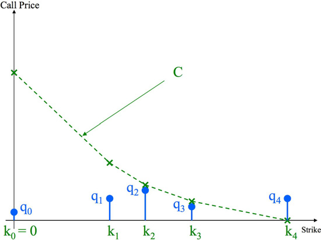
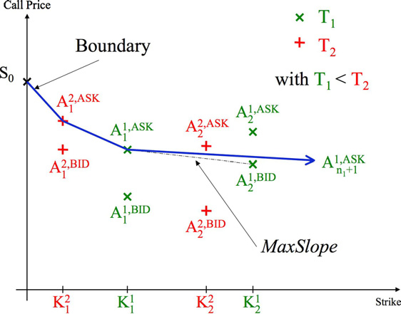
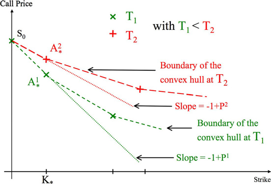

# doi:10.1016/j.jbankfin.2007.04.006

## Metadata

- **Source File:** `1-s2.0-S0378426607001318-main.pdf`
- **Authors:** Unknown
- **Year:** 2007
- **DOI:** 10.1016/j.

## Abstract

Under the assumption of absence of arbitrage, European option quotes on a given asset must satisfy well-known inequalities, which have been described in the landmark paper of Merton [Merton, R., 1973. Theory of rational option pricing. Bell Journal of Economics and Management Science 4 (1), 141–183]. If we further assume that there is no interest rate volatility and that the underlying asset continuously pays deterministic dividends, cross-maturity inequalities must also be satisfied by the bid and ask option prices. In this paper, we show that there exists an arbitrage-free model, which is consistent with the option quotes, if these inequalities are satisfied. One implication is that all static arbitrage strategies are linear combinations, with positive weights, of those described here. We also characterize admissible default probabilities for models which are consistent with given option quotes.  2007 Elsevier B.V. All rights reserved. MSC: 60G44; 60J10 JEL classification: C60; G12 Keywords: Options; Arbitrage; Calibration; Default probability

## Main Text

Available online at www.sciencedirect.com
Journal of Banking & Finance 31 (2007) 3377–3397
www.elsevier.com/locate/jbf
## Conditions on option prices for absence
## of arbitrage and exact calibration
Laurent Cousot
Courant Institute, New York University, 251 Mercer Street, New York, NY 10012, USA
Available online 18 April 2007
Abstract
Under the assumption of absence of arbitrage, European option quotes on a given asset must satisfy well-known inequalities, which have been described in the landmark paper of Merton [Merton,
R., 1973. Theory of rational option pricing. Bell Journal of Economics and Management Science 4
(1), 141–183]. If we further assume that there is no interest rate volatility and that the underlying
asset continuously pays deterministic dividends, cross-maturity inequalities must also be satisfied
by the bid and ask option prices.
In this paper, we show that there exists an arbitrage-free model, which is consistent with the
option quotes, if these inequalities are satisfied. One implication is that all static arbitrage strategies
are linear combinations, with positive weights, of those described here. We also characterize admissible default probabilities for models which are consistent with given option quotes.
 2007 Elsevier B.V. All rights reserved.
MSC: 60G44; 60J10
JEL classification: C60; G12
Keywords: Options; Arbitrage; Calibration; Default probability
1. Introduction
Since the 1987 crash, which showed some of the shortcomings of the Black–Scholes
model (see Black and Scholes, 1973), numerous models have been proposed to better fit
European option quotes. However, those who claim this fitting to be exact are rare.
E-mail address: laurent.cousot@m4x.org
0378-4266/$ - see front matter  2007 Elsevier B.V. All rights reserved.
doi:10.1016/j.jbankfin.2007.04.006

3378
Among them we should cite local volatility models, described in Derman and Kani
(1994) and Dupire (1994) as well as local Le´vy models introduced in Carr et al. (2004).
But these models assume that European options of all strikes and maturities are traded,
which leads in practice to an interpolation of the market option prices. And, to the best
of our knowledge, no rigorous algorithm has been described so far to calibrate these models exactly in practice. For instance, Derman and Kani (1994) advise to ignore some quotes
when the latters produce arbitrage in their model.
One objective of the present paper is to give conditions on quoted European option
prices which allow exact calibration by an arbitrage-free model. Notice that these conditions will be necessary for the absence of arbitrage.
This part of the paper has mainly been inspired by Carr and Madan (2005) and we will
generalize their results by allowing:
• the underlying asset to pay deterministic dividends continuously,
• deterministic interest rates,
• the options to have any strike or maturity and to be in finite number,
• the options to have different bid and ask prices.
Two recent working papers, Buehler (2004) and Davis and Hobson (2004), have the
same goal and a similar treatment. Nevertheless Buehler (2004) does not provide arbitrage
strategies which are related to conditions on option prices but instead describes criteria to
choose a more realistic model in the subset of calibrated arbitrage-free Markov chain
models, as does Cousot (2004). Furthermore, both preprints do not allow different bid
and ask prices.
We should also acknowledge the work of Laurent and Leisen (1998) which obtained
similar results in spirit by extending the concept of Arrow Debreu securities and by constructing a Markov chain model fitting the market quotes. Nevertheless our treatment is
perhaps more rigourous since we attach a great importance to justifying the existence of
what would be in their case transition matrices which give rise to martingales. Moreover,
as the two working papers cited above, their framework does not encompass the difference
between bid and ask prices.
Another objective of the present paper is to characterize the default probabilities which
are admissible for the stock among the arbitrage-free models which are calibrated to a
given set of option prices. Indeed, with the emergence of credit derivative products such
as Credit Default Swaps (CDS), it is more and more desirable for an equity model to
be calibrated to both option prices and default probabilities. (See Atlan and Leblanc
(2005), Carr and Linetsky (2006) and the references herein for examples of models which
attempt to capture both). Nevertheless, to the best of our knowledge, admissible default
probabilities have never been characterized.
The structure of the paper is given as follows. Section 2 specifies our assumptions and
introduces the definitions of calendar vertical spreads and calendar butterfly spreads.
Section 3 describes necessary conditions on option quotes under the assumption of no
arbitrage and also discusses briefly why these conditions are not sufficient without further
assumptions. Section 4 shows that these conditions are not only necessary but also sufficient for the existence of a calibrated arbitrage-free model. Section 5 describes the set of
admissible default probabilities of such a model. Section 6 concludes.

3379
2. Framework of the problem
2.1. Assumptions and notations
We assume that we have at our disposal a finite set of European call option quotes on a
given stock.1 Their maturities, indexed in increasing order, are denoted by (Ti)16i6m. For a
given maturity Ti, ni (ni P 1) quotes are available. The strikes are denoted by
0 < Ki
1 <    < Ki
j <    < Ki
ni and the corresponding bid (resp. ask) prices are denoted
by ðCi;BID
Þ16j6ni (resp. ðCi;ASK
Þ16j6ni).
j
j
We also assume that the stock continuously pays a deterministic dividend qt which is
automatically reinvested in shares and that the short interest rate is a deterministic function of time rt. The corresponding factors will be denoted as follows:
R t2
ru du;
Di
Drðt1; t2Þ  e
r  Drð0; T iÞ;
t1
R t2
qu du;
Di
Dqðt1; t2Þ  e
q  Dqð0; T iÞ;
t1
R t2
ðruquÞ du;
Di
Drqðt1; t2Þ  e
rq  Drqð0; T iÞ:
t1
0  0 for each maturity T i : Ci;BID
By convention, we add a call struck at Ki
 S0=Di
0
q
and Ci;ASK
 S0=Di
q, S0 being the initial stock price.
0
Finally let us introduce some notations which will allow us to work in the forward
measure:
rqKi
Ci;BID
qCi;BID
Ci;ASK
qCi;ASK
Ki
j  Di
 Di
 Di
ð1Þ
j;
;
:
j
j
j
j
2.2. Intuition and definitions
Before introducing some definitions which generalize the notions of vertical, butterfly
and calendar spreads, let us try to give some intuition on the conditions call prices should
satisfy, were they calibrated by an arbitrage-free model.
For simplicity, let us assume in the following three examples that interest rates and dividends are zero and that the bid and ask call prices are identical. In such a case, we know
that the stock is a martingale under the risk-neutral measure, thanks to Harrison and
Kreps (1979) and Harrison and Pliska (1981). Moreover if (St)tP0 is a martingale, then
the corresponding call price function CðK; TÞ  E½ðST  KÞþ is non-increasing and convex
in strike, as well as non-decreasing in maturity since Yt  (St  K)+ is a submartingale.
Consequently, if this martingale were consistent with given call quotes, the quotes would
have to satisfy some constraints. For example, we can easily conclude that the call quotes
1 For the sake of simplicity, we consider only call options since a put option can be replicated by holding a call
option, bonds and being short a share of stock, what is allowed in our framework as we will see in Section 3.1.

3380
Table 1
First example of quotes, which are impossible to calibrate
Maturity
Strike
100
120
x
1 month
3
3 months
2
–
of Table 1 are not compatible with the existence of a calibrated martingale. Indeed if it
existed, we would have x P 3 and x 6 2, which is impossible.
Another more complicated example is given by Table 2. If there was a martingale consistent with these call quotes, then we would have
21 P x1
ðThe price is non-decreasing in maturityÞ;
x1 þ 1
P x2
ðThe price is convex in strikeÞ;
2
x2 P 12
ðThe price is non-decreasing in maturityÞ
and this would result in 11 ¼ 21þ1
P 12.
2
These two situations illustrate why the classical definitions of vertical, butterfly and calendar spreads need to be generalized when the quoted options can have any maturities and
strikes. The following calendar vertical (resp. butterfly) spreads must be thought of as
weighted averages of calendar spreads and classical vertical (resp. butterfly) spreads.
i1 6 i2,
Spreads). "i1,i2 2 s1,mb
8j1 2 s0; ni1t;
2.1 (Calendar
Vertical
s.t.
Definition
8j2 2 s0; ni2t s.t. Ki1
j1 P Ki2
j2
CVSi1;i2
j1;j2  Ci2;ASK
 Ci1;BID
j2
j1
using Eq. (1).
i 6 i1
i 6 i2,
Spreads). "i,i1,i2 2 s1,mb
2.2 (Calendar
Butterfly
s.t.
and
Definition
8j 2 s0; nit; 8j1 2 s0; ni1t; 8j2 2 s0; ni2t s.t. Ki1
j < Ki2
j1 < Ki
j2
Ci1;ASK
 Ci;BID
Ci;BID
 Ci2;ASK
j1
j
j
j2
CBSi;i1;i2
j;j1;j2 

j  Ki1
Ki2
Ki
j2  Ki
j1
j
using Eq. (1).
Note that the above definitions generalize those of classical butterfly, calendar and vertical spreads. Indeed Definition 2.1 is the one of a calendar spread when i1 < i2 and
Table 2
Second example of quotes, which are impossible to calibrate
Maturity
Strike
80
100
120
1 month
–
12
–
x1
x2
3 months
1
6 months
21
–
–

3381
Table 3
Example of quotes with no arbitrage
Maturity
Strike
80
100
120
1 month
21
–
–
3 months
–
–
1
6 months
–
12
–
Ki1
j1 ¼ Ki2
j2. It is also the one of a vertical spread when i1 = i2. Likewise, Definition 2.2 is the
one of a butterfly spread when i = i1 = i2.
Finally the example of Table 3 shows why the strike corresponding to the nearest maturity is always between the two other strikes in the definition of the calendar butterfly
spread. Indeed, in this case, no incompatibility can be argued.
3. Necessary conditions for the absence of arbitrage
In this section, we describe necessary conditions for the absence of arbitrage such as the
non-negativity of calendar vertical spreads and calendar butterfly spreads, which were
introduced in the previous section. We also discuss briefly why these conditions are not
theoretically sufficient for the absence of arbitrage.
3.1. Assumptions
Let us assume that:
• At any time, one can take short or long positions in the stock (resp. default free bond),
at the current stock (resp. bond) price, without any transaction cost or limit in the
quantity;
• One can take long (resp. short) positions in the call options, at the current ask (resp.
bid) price, without any transaction cost or limit in the quantity;
• Finally, the options are cash settled: one, who holds a call, receives in cash the difference
between the stock price and the strike, at maturity, if this difference is positive. (Note
that it is always possible to cash positions. Therefore this assumption does not really
affect the feasibility of the strategies described in Appendix A to prove Proposition 3.1).
3.2. Semi-static arbitrage strategies
In the next subsection, we will show that some constraints on market quotes are necessary for the absence of arbitrage by only resorting to strategies which are semi-static. By
semi-static, we mean that one is allowed to take static positions in stock, options and
bonds at the initial time. Furthermore, as explained in Carr et al. (2003), one has the possibility, at the initial time, to short the stock for a given future period of time, if the stock is
greater than a given value at the beginning of this period. Consequently, if a claim with the
following payoffat time T2 (>T1 > 0):
1fST 1>KgðST 1=DrqðT 1; T 2Þ  ST 2Þ

3382
was available at the initial time, the strategies would be completely static. For the sake of
simplicity, we will pretend, from now on, that such a costless claim exists and will be
denoted by ShortSell(T1,T2,K). Finally, notice that these strategies are a subset of the
strategies, which are allowed in the Asset Pricing Theory, developed in Harrison and
Kreps (1979) and Harrison and Pliska (1981). Therefore, the absence of arbitrage implies
the absence of semi-static arbitrage.
3.3. Necessary conditions for the absence of semi-static arbitrage
Proposition 3.1. Under the assumptions of Sections 2.1 and 3.1 and using the notations of Eq.
(1), the following inequalities are necessary for the absence of semi-static arbitrage:
• "i 2 s1,mb, "j 2 s0,nib
Ci;ASK
P 0;
ð2Þ
j
Ci;BID
6 Ki
 Ci;ASK
ð3Þ
j:
0
j
• 8i1; i2 2 s1; mt s.t. i1 6 i2; 8j1 2 s0; ni1t; 8j2 2 s0; ni2t
if Ki1
j1 P Ki2
CVSi1;i2
j1;j2 P 0
ð4Þ
j2;
if Ki1
j1 > Ki2
CVSi1;i2
j2 and Ci1;BID
j1;j2 > 0
> 0:
ð5Þ
j1
i 6 i1
i 6 i2,
• "i,i1,i2 2 s1,mb
8j 2 s0; nit; 8j1 2 s0; ni1t; 8j2 2 s0; ni2t
s.t.
and
s.t.
Ki1
j < Ki2
j1 < Ki
j2
CBSi;i1;i2
j;j1;j2 P 0:
ð6Þ
h
Proof. See Appendix A.
Remark 3.2. The conditions of Proposition 3.1 are necessary for the absence of semi-static
arbitrage, whatever the statistical measure of reference. But, can we claim that these conditions are sufficient? If we do not specify a statistical measure, the answer is no. Indeed, if
the ask price of a call is zero and the probability that the underlying asset will be greater
than the strike at maturity is positive, then to buy this call is an arbitrage strategy. Likewise, if the bid price of a call is positive and the probability that the stock will be greater
than to the strike at maturity is zero, then to sell this call is an arbitrage strategy.
4. Sufficient conditions for exact calibration to an arbitrage-free model
In the previous Remark 3.2, we explained why the conditions of Proposition 3.1 which
are necessary for the absence of semi-static arbitrage, are not sufficient if no assumptions
about the null sets of the statistical measure are made. Proposition 4.1 shows that these
conditions are not only necessary but also sufficient for the existence of a calibrated arbitrage-free model. In this sense, all semi-static arbitrage strategies are weighted averages of
those described in the proof of Proposition 3.1 (see Appendix A).

3383
Proposition 4.1. Let us assume that the inequalities (2)–(6) of Proposition 3.1 are satisfied.
Then there exists a non-negative process (St)tP0, starting at S0, such that ðSteR t
0ðruquÞ duÞtP0
is a Markov martingale and further "i s.t. 1 6 i 6 m, "j s.t. 0 6 j 6 ni,


R T i
ru duðST i  Ki
jÞþ
6 E e
6 Ci;ASK
Ci;BID
:
0
j
j
h
Proof. See Appendix B.
5. Exact calibration to given market quotes and default probabilities
One can infer from Credit Default Swap quotes a default time distribution by using, for
instance, an intensity model where default is the first jump-time of a time-inhomogeneous
Poisson process. (For more details, see for example Brigo and Alfonsi, 2005). Actually,
this information can be used in an equity model. Indeed, owners of a bond which is in
default can make claims against the assets of the issuer to recover their loss. That is
why the stock price tends to go to zero.
Therefore, if we denote the default probabilities by P i  Pðs 6 T iÞ, where s is the
default time, and if we assume that s 6 T i () ST i ¼ 0, a desirable feature for an equity
model could be
P½ST i ¼ 0 ¼ P i:
As one might expect, not all sets of default probabilities are admissible for an arbitragefree model, which is calibrated to given market quotes. For example, by absence of arbitrage, if the price of a stock reaches zero, it must stay at zero. Consequently the default
probabilities must be non-decreasing in maturity. We also suspect that a default probability imposes lower bounds on put prices of the same maturity and therefore, by put-call
parity, lower bounds on call prices. Proposition 5.1 makes these statements more precise
by describing necessary and sufficient conditions on default probabilities for the existence
of a calibrated arbitrage-free model.
Proposition 5.1. If the conditions of Proposition 3.1 are satisfied, (Pi)16i6m are given real
0  Ci;BID
¼ Ci;ASK
numbers, with Ci
, it is necessary and sufficient that:
0
0
0 6 P 1 6    6 P i 6    6 P m < 1;
ð7Þ
•
• For i 6 k 6 m, 1 6 j 6 nk,
Ck
0  Ck;ASK
P i 6 1 
j
ð8Þ
;
Kk
j
0Ci;BID
Ci
0Ck;ASK
Ck
• If $i 2 s1,mb, j 2 s1,nib, k 2 si,mb, l 2 s1,nkb such that Kk
l > Ki
j
j and
,
¼
l
Ki
Kk
j
l
then
Ci
0  Ci;BID
P i ¼ 1 
j
ð9Þ
Ki
j

3384
for the existence of a non-negative process (St)tP0, starting at S0 > 0, such that
R t
0 ðruquÞ duÞtP0 is a Markov martingale and which satisfies:
ðSte
R Ti
ru duðST i  Ki
jÞþ 6 Ci;ASK
6 E½e
Ci;BID
P½ST i ¼ 0 ¼ P i
and
0
j
j
for 1 6 i 6 m, 0 6 j 6 ni.
h
Proof. See Appendix C.
6. Conclusion
Thanks to Proposition 4.1, we can now decide if market quotes can or cannot be calibrated by an arbitrage-free model. In the first case, semi-static arbitrage strategies may
remain but their eventuality depends on the null sets of the statistical measure, which
are never known in advance (see Remark 3.2). In the second case, we know that there
exists an arbitrage opportunity which never involves more than three options (see Appendix A for a description of the corresponding semi-static arbitrage strategies).
We can also compare the equity and credit markets thanks to Proposition 5.1. Indeed
the latter allows us to see if default probabilities inferred from the credit market are compatible with option prices in the framework of an arbitrage-free model. We suspect that
some arbitrage strategies hide behind the conditions of Proposition 5.1, were enough products on the credit market2 available.
Finally, note that the models that we have constructed in this paper are particularly
unrealistic. For instance, the number of possible states for the stock may be decreasing
with maturity and the transition probability function remains largely undetermined.
Buehler (2004), Laurent and Leisen (1998) and Cousot (2004) explain how to choose
more realistic calibrated and arbitrage-free Markov chain models. The first working
paper proposes to minimize the variance of price changes to choose the martingale transition matrices. The second proposes to choose the transition matrices by minimizing the
entropy relative to a prior model. The last one proposes an algorithm also based on relative entropy minimization to add some states for the stock at each maturity, obtain
smoother marginal distributions, and find transition matrices which take into account
preferences on the forward volatility surface. Numerical examples illustrating the pricing
of derivative securities in such a model can be found in Carr and Cousot (2005), where it
is notably explained how to semi-statically hedge and price a class of mildly path-dependent options.
Acknowledgements
I am grateful to Peter Carr, Bruno Dupire and more generally to the Bloomberg Quantitative Finance Research Team for all their insights. I am also grateful to two anonymous
referees for interesting comments. Remaining errors are of course mine.
2 Such as Credit Default Swaps expiring at option maturities.

3385
Appendix A. Proof of Proposition 3.1
Eqs. (2) and (3) as well as the non-negativity of classical vertical and butterfly spreads
have already been proven in Merton (1973). Therefore let us focus on the calendar vertical
and the calendar butterfly spreads.
A.1. Vertical calendar spreads
We now show that Eqs. (4) and (5) are satisfied by considering the following strategy:
• Long one call, struck at Ki2
j2 and expiring at T i2;
• Short 1=DqðT i1; T i2Þ call, struck at Ki1
j1 and expiring at T i1;
• If i1 5 i2, long one unit of ShortSellðT i1; T i2; Ki1
j1Þ.
The cost of this strategy is
C ¼ 1  Ci2;ASK
 1=DqðT i1; T i2Þ  Ci1;BID
þ 1fi16¼i2g  0:
j2
j1
At T i2, the payoffof this strategy can be written as follows:
j2Þþ  1=DrqðT i1; T i2Þ  ðST i1  Ki1
j1Þþ
P ¼ ðST i2  Ki2
j1gðST i1=DrqðT i1; T i2Þ  ST i2Þ:
þ 1fST i1 >Ki1
In the above expression, we did not make a distinction between the cases i1 = i2 and i1 < i2,
since the short-selling term vanishes if i1 = i2. We now show that this payoffis always nonnegative:
If ST i1 6 Ki1
j1,
j2Þþ P 0
P ¼ ðST i2  Ki2
else,
j2Þþ þ Ki1
P ¼ ðST i2  Ki2
j1=DrqðT i1; T i2Þ  ST i2
P ST i2  Ki2
j2 þ Ki1
j1=DrqðT i1; T i2Þ  ST i2
¼ Ki1
j1=DrqðT i1; T i2Þ  Ki2
j2
1
ðKi1
j1  Ki2
¼
j2Þ
Di2
rq
P 0:
We observe that this payoffis always non-negative and, moreover, it is positive with positive probability if Ki1
j1 > Ki2
j2 and PðST i1 > Ki1
j1Þ > 0. Finally, note that, under the assumption of the absence of semi-static arbitrage, PðST i1 > Ki1
j1Þ > 0 is implied by Ci1;BID
> 0.
j1
A.2. Calendar butterfly spreads
We now show that Eq. (6) is satisfied when i1 P i2 – the other case being similar. We
will use the following notation:

3386
Di1
Di2
q
q
N i  1=Di
P 0;
P 0;
r P 0:
N 1 
N 2 
j  Ki1
Ki2
Ki
j2  Ki
j1
j
Consider the following strategy:
• Long N1 calls, struck at Ki1
j1, of maturity T i1;
• Long N2 calls, struck at Ki2
j2, of maturity T i2;


calls, struck at Ki
• Short Di
1
1
j, of maturity Ti;
q 
þ
jKi1
Ki2
Ki
j2 Ki
j
j1
• If i1 > i, long N1 units of ShortSellðT i; T i1; Ki1
j1=Di
rqÞ;
• If i2 > i, long N2 units of ShortSellðT i; T i2; Ki2
j2=Di
rqÞ.
The cost of this strategy is
!
1
1
C ¼ N 1  Ci1;ASK
þ N 2  Ci2;ASK
 Ci;BID
 Di
:
q 
þ
j1
j2
j
j  Ki1
Ki2
Ki
j2  Ki
j1
j
The payoffof this strategy, at time T i1, can be written as a weighted average of payoffs corresponding to the following strategies:
• The strategy corresponding to the calendar spread involving the call options
ðT i; Ki1
rqÞ and ðT i1; Ki1
j1=Di
j1Þ, whose payoffat time T i1 is
j1Þþ  1=DrqðT i; T i1ÞðST i  Ki1
rqÞþ
P1 ¼ ðST i1  Ki1
j1=Di
rqgðST i=DrqðT i; T i1Þ  ST i1 Þ:
þ 1fSTi >K
i1
j1 =Di
• The strategy corresponding to the calendar spread involving the call options
ðT i; Ki2
rqÞ and ðT i2; Ki2
j2=Di
j2Þ, whose payoffat time T i2 is
j2Þþ  1=DrqðT i; T i2ÞðST i  Ki2
rqÞþ
P2 ¼ ðST i2  Ki2
j2=Di
rqgðST i=DrqðT i; T i2Þ  ST i2 Þ:
þ 1fSTi >K
i2
j2 =Di
• The strategy corresponding to the butterfly spread, at maturity Ti, involving the strikes
Ki1
j and Ki2
rq, Ki
j1=Di
j2=Di
rq, whose payoffat time Ti is
rqÞþ  ðST i  Ki
jÞþ  ðST i  Ki2
jÞþ
rqÞþ
ðST i  Ki1
ðST i  Ki
j1=Di
j2=Di
:
P3 ¼

j  Ki1
Ki2
Ki
rq  Ki
j1=Di
j2=Di
j
rq
Indeed, the payoffof the above defined strategy, at time T i1, can be written as
P ¼ N 1  P1 þ N 2=DrðT i2; T i1Þ  P2 þ N i=DrðT i; T i1Þ  P3:
We know that P1; P2; P3 P 0, whatever the values of ST i, ST i1 or ST i2. Consequently,
P P 0. Under the assumption of the absence of semi-static arbitrage, this implies that
C P 0, which is equivalent to Eq. (6).

3387
Appendix B. Proof of Proposition 4.1
Step 1: Change to the forward measure. If we prove under the assumptions of Proposition 4.1 that there exists a non-negative Markov martingale (Mt)tP0, starting at S0, which
satisfies:
jÞþ 6 Ci;ASK
6 E½ðMT i  Ki
Ci;BID
ð10Þ
j
j
for all 1 6 i 6 m, 0 6 j 6 ni then the conclusion follows since Eq. (10) can be rewritten:
jÞþ 6 Ci;ASK
6 Di
rq  Ki
Ci;BID
rE½ðMT i=Di
j
j
using the definitions of Eq. (1). Consequently the process (St)  (Mt/Drq(0,t)) is the perfect candidate.
Another way to formulate it is to say that we have to prove Proposition 4.1 in the case
where interest rates, dividends are zero and the market quotes ðCi;BID
Þ16i6m;16j6ni,
j
ðKi
ðCi;ASK
and
strikes
are
replaced
respectively
by
Þ16i6m;16j6ni
jÞ16i6m;16j6ni
j
ðCi;BID
Þ16i6m;16j6ni, ðCi;ASK
Þ16i6m;16j6ni and ðKi
jÞ16i6m;16j6ni.
j
j
Step 2: Kellerer’s theorem. Now, if we are able to construct marginal distributions
which:
• are consistent with the new call quotes ðCi;ASK
Þ16i6m;16j6ni and ðCi;BID
Þ16i6m;16j6ni,
j
j
• are non-decreasing in the convex order (see Theorem B.1 for the exact mathematical
formulation),
• have the same mean S0,
then we can use Kellerer’s theorem to conclude that there exists a martingale consistent
with all these marginal distributions and therefore with the call quotes.
Theorem B.1 (Kellerer’s theorem (1972)). Let (lt)t2[0,T] be a family of probability measures
on ðR; BðRÞÞ with first moment, such that, for s < t, lt dominates ls in the convex order, i.e.
for each convex function / : R ! R, lt-integrable for each t 2 [0,T], we have
Z
Z
/dlt P
/dls:
R
R
Then there exists a Markov process (Mt)t2[0,T] with these marginal distributions under which
it is a submartingale. Furthermore if the means are independent of t then (Mt)t2[0,T] is a
martingale.
h
Proof. See Kellerer (1972, p. 120).
Therefore we are left with constructing consistent marginal distributions which are nondecreasing in the convex order (henceforth NDCO) and have the same mean. To do so, we
will actually construct non-decreasing risk-neutral call price functions and use Lemma B.2
which explains how to associate in a one-to-one way discrete distributions to a particular
class of call price functions.

3388
Step 3: One-to-one relationship between certain types of call price functions and discrete
distributions. The following lemma is simply an application of the well-known results of
Breeden and Litzenberger (1978).
Lemma B.2 (Discrete Distribution). If N 2 N, k0 = 0 <    < kj <    < kN are N + 1 real
numbers and C : Rþ ! R is a function, which is continuous, convex, linear and decreasing on
each interval [kj;kj+1] with 0 6 j 6 N  1 (with a slope greater than or equal to 1 on
[k0;k1]) and zero after kN then the following distribution:
X
N
with q0 ¼ 1  Pðk0Þ  Pðk1Þ
qjdkj
l ¼
;
k1  k0
j¼0
qj ¼ Pðkj1Þ  PðkjÞ
 PðkjÞ  Pðkjþ1Þ
for 1 6 j 6 N  1 and qN ¼ PðkN1Þ
kj  kj1
kjþ1  kj
kN  kN1
is such that
Z 1
ðx  KÞþ dl
for all K 2 Rþ:
CðKÞ ¼
ð11Þ
0
In the next step, we will use Lemma B.2 to construct risk-neutral marginal distributions.
At a given maturity, the quoted strikes will be among {kj}06j6N and the corresponding
prices will be given by the function C (see Fig. 1).
Step 4: Construction of consistent call price functions, with the right properties. In the
special case where bid and ask prices are identical, a first guess for a consistent call price
function at maturity Ti could be a piecewise linear function which connects the prices at
this maturity. However this construction does not result in call price functions, which
are non-decreasing with maturity, as can be observed in the simple example of Table 4,
where S0 = 100.
That is why our method for building a call price function at maturity Ti will take into
account call options which expire at a later maturity (see Eq. (16)).
Another important issue is to specify the point where the call price function at maturity
Ti will reach zero. This point must be large enough to preserve the convexity of the call
Fig. 1. Sketch of a possible discrete distribution.

3389
Table 4
Example where the 3 month quote needs to be considered for constructing the 1 month marginal distribution
Maturity
Strike
80
100
1 month
–
30
3 months
35
–
price function but small enough to allow the call price function to be below the ask quotes
at maturity greater than or equal to Ti.
Consider:
1 6 i1 6 i2 6 m; 0 6 j1 6 ni1; 0 6 j2 6 ni2s:t:Ki1
(
)
Ci1;ASK
 Ci2;ASK
j1
j2
j1 > Ki2
Slopes1 
;
j2
Ki1
j1  Ki2
j2
ð12Þ
1 6 i1 6 i2 6 m; 0 6 j1 6 ni1; 0 6 j2 6 ni2s:t:Ki1
(
)
Ci1;BID
 Ci2;ASK
j1
j2
j1 > Ki2
Slopes2 
j2
Ki1
j1  Ki2
j2
ð13Þ
and


[
[
\
R
MaxSlope  max ðSlopes1
Slopes2
f1gÞ
:

If Ci;ASK
¼ 0, then
ni
Ki
niþ1  Ki
with i > 0
ð14Þ
ni þ i
else

n
o

Ki1
=ðaiMaxSlopeÞji 6 i1; 0 6 j1 6 ni1; Ci1;ASK
j1  Ci1;ASK
Ki
niþ1  min
> 0
ð15Þ
;
j1
j1
with ai 2 (0,1).
"i 2 s1,mb, "j 2 s0,nib,
Ai;BID
j; Ci;BID
Ai;ASK
j; Ci;ASK
 ðKi
 ðKi
Þ;
Þ;
j
j
j
j
Ai;BID
Ai;ASK
niþ1  ðKi
niþ1  ðKi
niþ1; 0Þ;
niþ1; 0Þ:
Let us define Ci(K) for K 2 Rþ as
minfyj8ða; bÞ 2 R  R
s:t: ð8i1 2 si; mt; 8j1 2 s0; ni1 þ 1t; aKi1
j1 þ b 6 Ci1;ASK
Þ ) aK þ b 6 yg
ð16Þ
j1
and "i 2 s1,mb, "j 2 s0,ni + 1b,
Ci
j  CiðKi
Ai
j; Ci
j  ðKi
ð17Þ
jÞ;
jÞ:
Informally, Ci is the low boundary of the convex hull of the set of points:
Bi ¼ fAi1;ASK
s:t: i 6 i1 6 m; 0 6 j1 6 ni1 þ 1g:
ð18Þ
j1

3390
Fig. 2. Boundary at T1.
niþ1 is important if Ci;ASK
Note that a cautious choice of Ki
> 0. First, the ask prices do not
ni
need to be non-increasing, as it can be observed in Fig. 2. That is why Ki
niþ1 is defined as a
minimum in Eq. (15). Second, MaxSlope must be large enough to ensure the convexity of
the boundary. This explains why it must greater than or equal to the elements of
Slope1 T R
 (see Eq. (12)). Finally, MaxSlope needs to be large enough to have the call
price function greater than the bid prices. That is why it must be at least equal to the maximum of Slope2 T R
 (see Eq. (13)).
Notice, that in the next six steps, [P1;P2] will denote the segment linking the points P1
and P2 which belong to ðRþÞ2.
Step 4.1: A first sanity check. First, we show that Ki1
j if i1 P i, 0 6 j 6 ni and
ni1 þ1 > Ki
> 0. Let us assume that Ki1
ni1 þ1 6 Ki
Ci;BID
j. We have the following two cases:
j
• If Ci1;ASK
¼ 0, the condition on the calendar (vertical) spread between the points Ai1;ASK
ni1
ni1
6 0, which is a contradiction.
and Ai;BID
imposes that Ci;BID
j
j
j a point such that i1 6 i; j 6 ni and such that the
> 0, let us denote by Ai
• If Ci1;ASK
ni1
½Ai;ASK
; Ai1;ASK
ai1MaxSlope.
slope
of
the
segment
is
equal
to
The
slope
of
ni1þ1 
j
½Ai;ASK
; Ai;BID
 is negative since Ci;BID
> 0 and is less than MaxSlope by definition of
j
j
j
the latter. But this slope is also greater than ai1MaxSlope since the segment
½Ai;ASK
 is above the segment ½Ai;ASK
; Ai1;ASK
; Ai;BID
ni1 þ1 , which is a contradiction.
j
j
j
Consequently, Ki1
ni1 þ1 > Ki
j.
Step 4.2: Immediate properties of the boundary. It is clear that Ci is continuous, piecewise
linear, convex, and that its nodes are among the Ki1
j1 (with corresponding value Ci1;ASK
),
j1
i 6 i1 6 m; 0 6 j1 6 ni1 þ 1.
Step 4.3: We show that the slope of the boundary on the first segment is greater than or
0 ¼ 0 is clearly S0 ¼ Ci;ASK
¼ Ci;BID
equal to 1. The value of the boundary in Ki
. Let us
0
0
denote by Ki1
j1 the smallest non-zero node of the boundary. We have the following cases:
• If j1 6 ni1, then the slope is greater than or equal to 1 because the vertical spread
involving the calls expiring at T i1 and struck at Ki1
0 ¼ 0 and Ki1
j1 is bounded.

3391
 Ci1;BID
 Ci;BID
Ci1;ASK
Ci1;ASK
0
0
j1
j1
P 1:
¼
Ki1
Ki1
j1
j1
• If j1 ¼ ni1 þ 1, then the slope is equal to ai1MaxSlope and is bounded by ai1 > 1 by
definition of MaxSlope.
Step 4.4: We show that the boundary is zero after a given value. Since CiðKi
niþ1Þ ¼ 0 and
the linear functions involved in the definition of Ci (Eq. (16)) have non-positive slopes, the
boundary is zero on ½Ki
niþ1; þ1Þ.
Step 4.5: We study the monotonicity of Ci. We consider two consecutive nodes of the
j2. Denote by Ki
boundary Ki1
j1 and Ki2
j2 with Ki1
j1 < Ki2
j the smallest strike which corresponds
to a node of the boundary whose call value is zero, with i 6 i* and 0 6 j 6 ni þ 1. Since
we know that the boundary is flat at the right of Ki
j, we only need to prove that the segj2 6 Ki
 is decreasing if Ki2
ment ½Ai1;ASK
; Ai2;ASK
j.
j1
j2
; Ai;ASK
We know that ½Ai1;ASK
; Ai2;ASK
 is below ½Ai1;ASK
 since Ai2;ASK
is on the boundary.
j
j1
j2
j1
j2
; Ai;ASK
j1 < Ki
Moreover since Ki1
j, Ci1;ASK
> 0, which implies that ½Ai1;ASK
 has a negative
j
j1
j1
slope. Consequently, ½Ai1;ASK
; Ai2;ASK
 has a negative slope.
j1
j2
Step 4.6: We show that the boundary is consistent with the call quotes. Let us prove that
6 Ci
j 6 Ci;ASK
for 0 6 j 6 ni. Because of the definition of Ci
Ci;BID
j, it is clear that
j
j
j 6 Ci;ASK
6 Ci
Ci
. Consequently, we only need to show that Ci;BID
j. If j = 0 or if
j
j
0 ¼ Ci;ASK
¼ Ci;BID
6 0, the conclusion is obvious since we have Ci
Ci;BID
in the first case,
0
0
j
(1 6 j 6 ni) such that
and Ci
j P 0 in the second. Therefore, let us consider a point Ai;ASK
j
Ci;BID
> 0.
j
j is a node of the boundary and denote by Ci1;ASK
First, let us assume that Ki
, the correj1
sponding value with i1 > i. (The bid price is less than or equal to the ask price. Consequently we can eliminate the trivial case where i1 = i). Thanks to Step 4.1, we know
j1 6 ni1. Consequently,
that
the
condition on
the
calendar
spread
ensures
that
6 Ci1;ASK
Ci;BID
.
j
j1
j is not a node of the boundary, denote by Ki1
j1 (resp. Ki2
If Ki
j2) the greatest (resp. smallest)
j. (Ki2
node of the boundary which is less (resp. greater) than Ki
j2 exists since Ki
niþ1 is on the
boundary). Recall that i 6 i1, i 6 i2, j1 6 ni1 and Ki1
j < Ki2
j1 < Ki
j2.
Due to the definition of Ci, we just need to prove that Ai;BID
is located below or on the
j
segment ½Ai1;ASK
; Ai2;ASK
.
j1
j2
• If j2 6 ni2, the non-negativity of the calendar butterfly spreads ensures that Ai;BID
is
j
below or on the segment ½Ai1;ASK
; Ai2;ASK
.
j1
j2
• If j2 ¼ ni2 þ 1, then we have the following two cases:
and Ai2;ASK
– If Ci2;ASK
¼ 0, then Ai2;ASK
is also on the boundary. Since Ai1;ASK
ni2þ1 are consecni2
ni2
j1
utive on the boundary, Ci1;ASK
¼ 0. The condition on the calendar vertical spreads
j1
j 6 0, which is a contradiction.
between the points Ai1;ASK
and Ai;BID
imposes that Ci
j1
j
i
2;ASK
a point such that i 6 i2 6 i
2 6 ni
– If Ci2;ASK
2, j
> 0, denote by A
2 and such that the
j
ni2
2
i
2;ASK
; Ai2;ASK
ni2 þ1  is equal to ai2MaxSlope. The slope of the segment
slope of the segment ½A
j
2
; Ai2;ASK
½Ai1;ASK
ni2þ1  must be greater than or equal to the slope of the segment
j1
i
2;ASK
; Ai2;ASK
ni2þ1 , since Ai1;ASK
and Ai2;ASK
½A
are two consecutive nodes on the boundary.
j
j1
ni2
2

3392
Its slope is therefore greater than or equal to ai2MaxSlope. If Ai;BID
is not below or on
j
; Ai2;ASK
the segment ½Ai1;ASK
ni2 þ1 , the slope of the segment ½Ai1;ASK
; Ai;BID
 is greater than the
j1
j1
j
; Ai2;ASK
slope of ½Ai1;ASK
ni2 þ1 , and consequently greater than ai2MaxSlope. On the other
j1
hand, since Ci;BID
> 0, the slope of ½Ai1;ASK
; Ai;BID
 is negative because of the condition
j
j1
j
on the calendar vertical spread and must therefore be less than or equal to MaxSlope, which is a contradiction. Consequently, Ai;BID
is below or on the segment
j
; Ai2;ASK
½Ai1;ASK
ni2 þ1 .
j1
We have proved that Ci satisfies all the conditions of Lemma B.2. Therefore we can
associate to it a distribution li satisfying Eq. (11) of Lemma B.2. Moreover this distribu6 Ci
j 6 Ci;ASK
tion is risk-neutral for the calls of maturity Ti since Ci;BID
.
j
j
Step 5: We prove that the distributions are NDCO and that their means are constant over
time. For a given strike, the prices are non-decreasing with maturity since Bi+1  Bi implies
Ci 6 Ci+1,
Bi).
1 6 i < m
that
(see
Eq.
(18)
for
the
definition
of
Moreover,
C0(K) = (S0  K)+ for K 2 Rþ. Therefore it is less than C1, which is equal to S0 in
K = 0, has a slope in 0+ greater than or equal to 1, is convex and non-negative. Finally
the prices of European put options are also non-decreasing with maturity because of putcall parity and since any convex function can be approximated by linear combinations
with positive weights of put and call functions, the distributions are NDCO.
Finally the means of the different distributions are constant over time because all the
calls struck at 0 have the same price.
Remark B.3. Note that we have some freedom in the choice of ðKi
niþ1Þ16i6m. In particular,
if we want them all to be equal to a given value, this is possible by choosing ai small
enough or i big enough for each i 2 s1,mb. (See Eqs. (14) and (15) for the definitions of
Ki
niþ1).
Remark B.4. One may ask if relaxing the assumption of no bid-ask spread on the stock is
possible. The proof of Proposition 4.1 remains valid, in the presence of a bid-ask spread
for the stock, if we replace the condition Ci;BID
6 Ki
j, 1 6 i 6 m, 1 6 j 6 ni, by
 Ci;ASK
0
j
Ci;ASK
6 Ki
 Ci;ASK
j. Nevertheless, these conditions, as well as the cross-maturity inequal0
j
ities, are not necessary for the absence of semi-static arbitrage anymore. Actually, the
inequalities which are necessary for the existence of a consistent martingale are stronger
than the conditions implied by the absence of arbitrage in this case.
Appendix C. Proof of Proposition 5.1
Step 1: Change to the forward measure. As in Step 1 of Appendix B, we work in the forward measure. If we imagine that the only available market prices are Ci;BID
(resp. Ci;ASK
)
j
j
j for 1 6 i 6 m,
for the bid (resp. ask) price of a call option of maturity Ti and struck at Ki
0 6 j 6 ni, then we can assume that interest rates and dividends are zero.
Step 2: Let us show that the conditions of Proposition 5.1 are necessary.
Step 2.1: Condition (7). The fact that the default probabilities are non-decreasing is a
direct consequence of the fact that a non-negative martingale, which is at zero stays at
zero. The default probabilities are also less than 1 because we assume that S0 > 0.

3393
Step 2.2: Condition (8) is necessary because imposing the probability in zero gives a
lower bound for the ask price of a call option. Indeed, for 1 6 i 6 k 6 m and 1 6 l 6 nk,
we have
lÞþ
Ck;ASK
P E½ðST k  Kk
l
l  ST kÞþ
¼ E½ðST k  Kk
lÞ þ ðKk
P S0  Kk
l þ PðST k ¼ 0ÞKk
l
¼ S0  Kk
l þ P kKk
l
P S0  Kk
l þ P iKk
l:
Step 2.3: Condition (9) is necessary because, in this situation, the probability for the
stock to be between 0 and Kk
l is zero. Indeed the value of the butterfly spread at maturity
Ti involving the strikes 0, Ki
j and Kk
l is zero
!
jÞþ  ðST i  Kk
jÞþ
lÞþ
ST i  ðST i  Ki
ðST i  Ki
E

Ki
Kk
l  Ki
j
1
!
jÞþ  ðST k  Kk
jÞþ
lÞþ
ST i  ðST i  Ki
ðST i  Ki
6 E

Ki
Kk
l  Ki
j
j
ðY t  ðSt  KÞþ is a submartingaleÞ
S0  Ci;BID
Ci;BID
 Ck
j
j
l
6
¼ 0:

Ki
Kk
l  Ki
l
j
As a consequence, the bid price of the call struck at Ki
j and maturity Ti has the following
upper bound:
jÞþ
6 E½ðST i  Ki
Ci;BID
j
j  ST iÞþ
¼ E½ðST i  Ki
jÞ þ ðKi
¼ S0  Ki
j þ P iKi
j:
j. Finally, the condition P i 6 1  ðS0  Ck;ASK
Therefore, P i P 1  ðS0  Ci;BID
Þ=Ki
Þ=Kk
l all
j
lows us to conclude.
Step 3: The conditions of Proposition 5.1 are sufficient. The idea is to add fictive quotes at
a strike, that is smaller than all the strikes, to calibrate the default probabilities and conserve the features of the call price functions constructed in Appendix B. Let us denote this
strike by K* and define the bid (resp. ask) price of the call option struck at this strike and
maturity Ti by
Ci
  Ci;ASK
 Ci;BID
 S0  ð1  P iÞK:
ð19Þ


We see that if K* goes to zero, the call price functions with the added quotes tend to the
previous call price functions. That is why we are confident that for K* small enough, the
call price functions with the added quotes will have the right features.

3394
Moreover if the model is calibrated to this new quote then we will have
 ¼ E½ðST i  KÞþ
S0  ð1  P iÞK ¼ Ci
¼ S0  K þ E½ðK  ST iÞþ
¼ S0  K þ PðST i ¼ 0ÞK
¼ S0  ð1  PðST i ¼ 0ÞÞK
which implies PðST i ¼ 0Þ ¼ P i. See Fig. 3 for an example.
Step 3.1: Adding fictive quotes. Let us define:
1 6 i 6 m


S0
K0
ð20Þ
  min
;
1  P i
1 6 i 6 m; 1 6 j 6 ni
(
)
!
S0  Ci;BID
j
K1
  min
ð21Þ
;
1  P i
1 6 i1 6 i2 6 m; 1 6 j1 6 ni1; . . .
(
ÞKi2
ÞKi1
ðS0  Ci1;BID
j2  ðS0  Ci2;ASK
j1
j1
j2
K2
  min
þ ð1  P i1ÞðKi2
j2  Ki1
Ci2;ASK
 Ci1;BID
j1Þ
j2
j1
o
. . . 1 6 j2 6 ni2; s:t:Ki1
j1 < Ki2
ÞKi2
ÞKi1
j2andðS0  Ci1;BID
j2 > ðS0  Ci2;ASK
ð22Þ
;
j1
j1
j2
jj1 6 i 6 m; 1 6 j 6 nigÞ;
  minðfKi
K3
ð23Þ
with the convention min(;) = +1.
K0
 and K1
 are well defined and positive since we ignore the trivial case where S0 = 0. As
 is concerned, let us consider 1 6 i1 6 i2 6 m, 1 6 j1 6 ni1, 1 6 j2 6 ni2 such that
far as K2
Ki1
j1 < Ki2
ÞKi2
ÞKi1
j2 and ðS0  Ci1;BID
j2 > ðS0  Ci2;ASK
j1. We have the following cases:
j1
j2
• If S0 6 Ci2;ASK
, then clearly
j2
ÞKi2
ÞKi1
ÞKi2
ðS0  Ci1;BID
j2  ðS0  Ci2;ASK
j1 P ðS0  Ci1;BID
j2 > 0:
j1
j2
j1
Indeed, the last inequality is a consequence of the positivity of the vertical spread if
6 0. As far as the denominator is concerned,
Ci1;BID
> 0 and of the positivity of S0 if Ci1;BID
j1
j1
we have
þ ð1  P i1ÞðKi2
j2  Ki1
j1Þ > ð1  P i1ÞðKi2
j2  Ki1
Ci2;ASK
 Ci1;BID
j1Þ > 0:
j2
j1
Fig. 3. New quotes introduced to calibrate the default probabilities.

3395
• If S0 > Ci2;ASK
, then we have
j2
þ ð1  P i1ÞðKi2
j2  Ki1
Ci2;ASK
 Ci1;BID
j1Þ
j2
j1
þ ð1  P i2ÞðKi2
j2  Ki1
P Ci2;ASK
 Ci1;BID
j1Þ
j2
j1
S0  Ci2;ASK
j2
ðKi2
j2  Ki1
P Ci2;ASK
 Ci1;BID
þ
j1Þ
j2
j1
Ki2
j2
!
S0  Ci2;ASK
Ci1;BID
 Ci2;ASK
j2
j1
j2
¼ ðKi2
j2  Ki1
:
j1Þ

Ki2
Ki2
j2  Ki1
j2
j1
ÞKi2
ÞKi1
Moreover, the last quantity is positive if ðS0  Ci1;BID
j2 > ðS0  Ci2;ASK
j1 > 0.
j1
j2
Indeed, if d > b > 0 and a/b > c/d > 0, then (c  a)/(d  b) < c/d.
Consequently, K2
 is well defined and positive. Let us assume that K* is a point of the
interval ð0; minðK0
; K1
; K2
; K3
ÞÞ.
Step 3.2: We prove that the market quotes along with the new quotes satisfy the assumptions of Proposition 4.1.
Step 3.2.1: The added call quotes are non-negative. For 1 6 i 6 m, we have
 ¼ S0  ð1  P iÞK > S0  ð1  P iÞK0 P 0:
Ci
Step 3.2.2: The slope of the call price function at the right of 0 is greater than or equal
to 1.
 ¼ ð1  P iÞK 6 K:
Ci
0  Ci
Step 3.2.3: The calendar vertical spreads are non-negative. The only strike which is smaller than K* is 0. For 1 6 i 6 i0 6 m, we have
CVSi;i0
;0  Ci0
0  Ci
 ¼ ð1  P iÞK > 0:
Moreover,
 ¼ ðP i0  P iÞK P 0:
CVSi;i0
;  Ci0
  Ci
For 1 6 i 6 k and 1 6 j 6 ni such that K < Ki
j:
CVSi;k
j;  Ck
  Ci;BID
j
P Ci
  Ci;BID
j
¼ S0  ð1  P iÞK  Ci;BID
  Ci;BID
> S0  ð1  P iÞK1
j
j
P 0
because of the definition of K1
 (see Eq. (21)).
Step 3.2.4: The calendar butterfly spreads are non-negative. First, we consider the calendar butterfly spread involving Ai1
j2 with i 6 i1,i2, 1 6 j2 6 ni2.
0 , Ai
; Ci
Þ and Ai2
  ðKi
S0  Ci2;ASK
Ci
0  Ci
¼ 1  P i P
j2

:
Ki2
K
j2

3396
Second, we need to consider the calendar butterfly spread involving Ai
, Ai1
j1 and Ai2
j2 with
i1 6 i,i2 and 1 6 j1 6 ni1 such that Ki1
j1 < Ki2
j2. Let us show that
þ ð1  P iÞðKi2
j2  Ki1
½Ci2;ASK
 Ci1;BID
j1ÞK
j2
j1
6 Ki2
Þ  Ki1
j2ðS0  Ci1;BID
j1ðS0  Ci2;ASK
ð24Þ
Þ:
j1
j2
We have to differentiate two cases. If Ki2
Þ > Ki1
j2ðS0  Ci1;BID
j1ðS0  Ci2;ASK
Þ, then we have
j1
j2
Ki2
ÞKi1
Ki2
ÞKi1
j2ðS0 Ci1;BID
j1ðS0 Ci2;ASK
j2ðS0 Ci1;BID
j1ðS0 Ci2;ASK
Þ
Þ
j1
j2
j1
j2
 6
j1Þ 6
K < K2
þð1P i1ÞðKi2
j2 Ki1
þð1P iÞðKi2
j2 Ki1
Ci2;ASK
Ci1;BID
Ci2;ASK
Ci1;BID
j1Þ
j2
j1
j2
j1
and Eq. (24) follows.
Let us show that Eq. (24) is also valid in the case where Ki2
Þ 6
j2ðS0 Ci1;BID
j1
Ki1
Þ for any positive value of K*. First, in such a case, Ki2
j1ðS0  Ci2;ASK
j2ðS0  Ci1;BID
Þ ¼
j2
j1
Ki1
j1ðS0  Ci2;ASK
Þ because of the non-negativity of the calendar butterfly spread involving
j2
Ai1
0 , Ai1
j1 and Ai2
j2. Moreover we have
S0  Ci1;BID
j1
P i1 ¼ 1 
ð25Þ
Ki1
1
Ci2;ASK
 Ci1;BID
j2
j1
¼ 1 
ð26Þ
Ki1
j1  Ki2
j2
because b 5 0, d 5 0, d 5 b and a/b = c/d implies that (a  c)/(b  d) = c/d. From (26),
we deduce that
þ ð1  P iÞðKi2
j2  Ki1
½Ci2;ASK
 Ci1;BID
j1ÞK
j2
j1
þ ð1  P i1ÞðKi2
j2  Ki1
6 ½Ci2;ASK
 Ci1;BID
j1ÞK ¼ 0
j2
j1
¼ Ki2
Þ  Ki1
j2ðS0  Ci1;BID
j1ðS0  Ci2;ASK
Þ
j1
j2
and consequently (24) holds. From the latter we obtain
ÞK þ ðKi2
j2  Ki1
Þ 6 Ki2
Þ  Ki1
ðCi2;ASK
 Ci1;BID
j1ÞðS0  Ci
j2ðS0  Ci1;BID
j1ðS0  Ci2;ASK
Þ
j2
j1
j1
j2
from which we deduce easily that
Ci
  Ci1;BID
Ci1;BID
 Ci2;ASK
j1
j1
j2
P 0:

Ki1
Ki2
j2  Ki1
j1  K
j1
References
Atlan, M., Leblanc, B., 2005. Hybrid equity-credit modelling. Risk 18 (8).
Black, F., Scholes, M., 1973. The pricing of options and corporate liabilities. Journal of Political Economy 81 (3),
637–654.
Breeden, D., Litzenberger, R., 1978. Prices of state-contingent claims implicit in option prices. Journal of
Business 51, 621–651.
Brigo, D., Alfonsi, A., 2005. Credit default swap calibration and derivatives pricing with the SSRD stochastic
intensity model. Finance and Stochastics 9 (1), 29–42.
Buehler, H., 2004. Expensive martingales, Preprint, Institut fu¨r Mathematik, TU Berlin.
Carr, P., Cousot, L., 2005. Semi-static hedging of path-dependent securities. Preprint, Courant Institute, New
York University.

3397
Carr, P., Linetsky, V., 2006. A jump to default extended CEV model: An application of Bessel processes. Preprint,
Courant Institute, New York University.
Carr, P., Madan, D., 2005. A note on sufficient conditions for no arbitrage. Finance Letters 2 (3), 125–130.
Carr, P., Geman, H., Madan, D., Yor, M., 2003. Stochastic volatility for Le´vy processes. Mathematical Finance
13 (3), 345–382.
Carr, P., Geman, H., Madan, D., Yor, M., 2004. From local volatility to local Le´vy models. Quantitative Finance
4 (5), 581–588.
Cousot, L., 2004. When can given European call prices be met by a martingale? An answer based on the building
of a Markov chain model, Preprint, Courant Institute, New York University.
Davis, M., Hobson, D., 2004. The range of traded option prices. Preprint, Imperial College London.
Derman, E., Kani, I., 1994. Riding on a smile. Risk 7 (1), 32–39.
Dupire, B., 1994. Pricing with a smile. Risk 7 (1), 18–20.
Harrison, J., Kreps, D., 1979. Martingales and arbitrage in multiperiod securities markets. Journal of Economic
Theory 20, 381–408.
Harrison, J., Pliska, S., 1981. Martingales and stochastic integrals in the theory of continuous trading. Stochastic
Processes and their Applications 11, 215–260.
Kellerer, H., 1972. Markov komposition und eine anwendung of martingale. Mathematische Annalen 98, 99–122.
Laurent, J., Leisen, D., 1998. Building a consistent pricing model from observed option prices. Preprint, Stanford
University.
Merton, R., 1973. Theory of rational option pricing. Bell Journal of Economics and Management Science 4 (1),
141–183.

## Tables

### Table 1

*Caption:* Table 1

<table>
  <tr>
    <th>Maturity Strike</th>
  </tr>
  <tr>
    <td>100 120</td>
  </tr>
  <tr>
    <td>x 1 month 3</td>
  </tr>
  <tr>
    <td>3 months 2 –</td>
  </tr>
  <tr>
    <td>of Table 1 are not compatible with the existence of a calibrated martingale. Indeed if it</td>
  </tr>
  <tr>
    <td>existed, we would have x P 3 and x 6 2, which is impossible.</td>
  </tr>
  <tr>
    <td>Another more complicated example is given by Table 2. If there was a martingale con-</td>
  </tr>
  <tr>
    <td>sistent with these call quotes, then we would have</td>
  </tr>
  <tr>
    <td>ðThe price is non-decreasing in maturityÞ; 21 P x1</td>
  </tr>
  <tr>
    <td>x1 þ 1</td>
  </tr>
  <tr>
    <td>ðThe price is convex in strikeÞ; P x2</td>
  </tr>
  <tr>
    <td>2</td>
  </tr>
  <tr>
    <td>ðThe price is non-decreasing in maturityÞ x2 P 12</td>
  </tr>
  <tr>
    <td>and this would result in 11 ¼ 21þ1</td>
  </tr>
  <tr>
    <td>2 P 12.</td>
  </tr>
  <tr>
    <td>These two situations illustrate why the classical definitions of vertical, butterfly and cal-</td>
  </tr>
  <tr>
    <td>endar spreads need to be generalized when the quoted options can have any maturities and</td>
  </tr>
  <tr>
    <td>strikes. The following calendar vertical (resp. butterfly) spreads must be thought of as</td>
  </tr>
  <tr>
    <td>weighted averages of calendar spreads and classical vertical (resp. butterfly) spreads.</td>
  </tr>
  <tr>
    <td>Vertical Definition 2.1 (Calendar s.t. Spreads). &quot;i1, i2 2 s1, mb i1 6 i2, 8j1 2 s0; ni1 t;</td>
  </tr>
  <tr>
    <td>P K i2 8j2 2 s0; ni2 t s.t. K i1</td>
  </tr>
  <tr>
    <td>j1 j2</td>
  </tr>
  <tr>
    <td>CVSi1;i2 (cid:3) Ci2;ASK (cid:4) Ci1;BID</td>
  </tr>
  <tr>
    <td>j1;j2 j2 j1</td>
  </tr>
  <tr>
    <td>using Eq. (1).</td>
  </tr>
  <tr>
    <td>Butterfly Definition 2.2 (Calendar s.t. and Spreads). &quot;i, i1, i2 2 s1, mb i 6 i1 i 6 i2,</td>
  </tr>
  <tr>
    <td>&lt; K i</td>
  </tr>
  <tr>
    <td>j &lt; K i2 j1 j2</td>
  </tr>
</table>

Raw CSV: `assets/table_001.csv`

### Table 2

*Caption:* Table 2

| Maturity | Strike |  |  |
| --- | --- | --- | --- |
|  | 80 | 100 | 120 |
| 1 month | – | 12 | – |
| 3 months | x1 | x2 | 1 |
| 6 months | 21 | – | – |

Raw CSV: `assets/table_002.csv`

### Table 3

*Caption:* Table 2

| 2 |  |
| --- | --- |
| ðThe price is non-decreasing in maturityÞ x2 P 12 |  |
| and this would result in 11 ¼ 21þ1 |  |
| 2 P 12. |  |
|  | These two situations illustrate why the classical definitions of vertical, butterfly and cal- |
| endar spreads need to be generalized when the quoted options can have any maturities and |  |
| strikes. The following calendar vertical (resp. butterfly) | spreads must be thought of as |
| weighted averages of calendar spreads and classical vertical | (resp. butterfly) spreads. |
| Vertical Definition 2.1 (Calendar Spreads). "i1, i2 2 s1, mb | s.t. i1 6 i2, 8j1 2 s0; ni1 t; |
| P K i2 8j2 2 s0; ni2 t s.t. K i1 |  |
| j1 j2 |  |
| CVSi1;i2 (cid:3) Ci2;ASK (cid:4) Ci1;BID |  |
| j1;j2 j2 j1 |  |
| using Eq. (1). |  |
| Butterfly Definition 2.2 (Calendar Spreads). "i, i1, i2 2 s1, mb | s.t. and i 6 i1 i 6 i2, |
| < K i |  |
| j < K i2 j1 j2 |  |
| Ci1;ASK Ci;BID (cid:4) Ci;BID (cid:4) Ci2;ASK |  |
| j j j1 j2 |  |
| CBSi;i1;i2 (cid:3) (cid:4) |  |
| j;j1;j2 |  |
| K i j (cid:4) K i1 j j1 j2 (cid:4) K i |  |
| using Eq. (1). |  |
|  | Note that the above definitions generalize those of classical butterfly, calendar and ver- |
| tical spreads. Indeed Definition 2.1 is the one of a calendar | spread when i1 < i2 and |

Raw CSV: `assets/table_003.csv`

### Table 4

*Caption:* Table 3

<table>
  <tr>
    <th>Maturity Strike</th>
  </tr>
  <tr>
    <td>80 100 120</td>
  </tr>
  <tr>
    <td>1 month 21 – –</td>
  </tr>
  <tr>
    <td>3 months – – 1</td>
  </tr>
  <tr>
    <td>6 months – 12 –</td>
  </tr>
  <tr>
    <td>K i1</td>
  </tr>
  <tr>
    <td>. It is also the one of a vertical spread when i1 = i2. Likewise, Definition 2.2 is the j1 ¼ K i2</td>
  </tr>
  <tr>
    <td>one of a butterfly spread when i = i1 = i2.</td>
  </tr>
  <tr>
    <td>Finally the example of Table 3 shows why the strike corresponding to the nearest matu-</td>
  </tr>
  <tr>
    <td>rity is always between the two other strikes in the definition of the calendar butterfly</td>
  </tr>
  <tr>
    <td>spread. Indeed, in this case, no incompatibility can be argued.</td>
  </tr>
  <tr>
    <td>3. Necessary conditions for the absence of arbitrage</td>
  </tr>
  <tr>
    <td>In this section, we describe necessary conditions for the absence of arbitrage such as the</td>
  </tr>
  <tr>
    <td>non-negativity of calendar vertical spreads and calendar butterfly spreads, which were</td>
  </tr>
  <tr>
    <td>introduced in the previous section. We also discuss briefly why these conditions are not</td>
  </tr>
  <tr>
    <td>theoretically sufficient for the absence of arbitrage.</td>
  </tr>
  <tr>
    <td>3.1. Assumptions</td>
  </tr>
  <tr>
    <td>Let us assume that:</td>
  </tr>
  <tr>
    <td>• At any time, one can take short or long positions in the stock (resp. default free bond),</td>
  </tr>
  <tr>
    <td>at the current stock (resp. bond) price, without any transaction cost or limit in the</td>
  </tr>
  <tr>
    <td>quantity;</td>
  </tr>
  <tr>
    <td>the current ask (resp. • One can take long (resp. short) positions in the call options, at</td>
  </tr>
  <tr>
    <td>bid) price, without any transaction cost or limit in the quantity;</td>
  </tr>
  <tr>
    <td>• Finally, the options are cash settled: one, who holds a call, receives in cash the difference</td>
  </tr>
  <tr>
    <td>between the stock price and the strike, at maturity, if this difference is positive. (Note</td>
  </tr>
</table>

Raw CSV: `assets/table_004.csv`

### Table 5

*Caption:* Table 4

| Maturity |  | Strike |  |  |  |  |  |  |
| --- | --- | --- | --- | --- | --- | --- | --- | --- |
|  |  | 80 |  |  |  |  |  | 100 |
| 1 month |  | – |  |  |  |  |  | 30 |
| 3 months |  | 35 |  |  |  |  |  | – |
| price function but small enough to allow the call price function to be below the ask quotes |  |  |  |  |  |  |  |  |
| at maturity greater than or equal | to Ti. |  |  |  |  |  |  |  |
| Consider: |  |  |  |  |  |  |  |  |
| ( |  |  |  |  |  |  |  | ) |
| Ci1;ASK (cid:4) Ci2;ASK |  |  |  |  |  |  |  |  |
| j1 j2 |  |  |  |  |  |  |  |  |
| (cid:6)(cid:6)(cid:6)(cid:6)(cid:6) Slopes1 (cid:3) | 1 6 i1 6 i2 6 m; 0 6 j1 |  |  |  | 6 ni1 ; 0 6 j2 | 6 ni2s:t:K i1 |  | > K i2 ; |
|  |  |  |  |  |  |  | j1 | j2 |
| j1 (cid:4) K i2 |  |  |  |  |  |  |  |  |
|  |  |  |  |  |  |  |  | ð12Þ |
| ( |  |  |  |  |  |  |  | ) |
| Ci1;BID (cid:4) Ci2;ASK |  |  |  |  |  |  |  |  |
| j1 j2 |  |  |  |  |  |  |  |  |
| (cid:6)(cid:6)(cid:6)(cid:6)(cid:6) Slopes2 (cid:3) | 1 6 i1 6 i2 6 m; 0 6 j1 |  |  | 6 ni1 ; 0 6 j2 |  | 6 ni2 s:t:K i1 |  | > K i2 |
|  |  |  |  |  |  |  | j1 | j2 |
| j1 (cid:4) K i2 |  |  |  |  |  |  |  |  |
|  |  |  |  |  |  |  |  | ð13Þ |
| and |  |  |  |  |  |  |  |  |
| (cid:7) | [ | [ | \ |  | (cid:8) |  |  |  |
| MaxSlope (cid:3) max ðSlopes1 | Slopes2 | f(cid:4)1gÞ |  | R(cid:7) | : |  |  |  |
|  |  |  |  | (cid:4) |  |  |  |  |
| then If Ci;ASK ¼ 0, |  |  |  |  |  |  |  |  |
| ni |  |  |  |  |  |  |  |  |
| K i |  |  |  |  |  |  |  |  |
| with (cid:2)i > 0 niþ1 (cid:3) K i ni þ (cid:2)i |  |  |  |  |  |  |  | ð14Þ |
| else |  |  |  |  |  |  |  |  |
| (cid:7) n |  |  |  |  |  | o | (cid:8) |  |
| K i K i1 | =ðaiMaxSlopeÞji 6 i1; 0 6 j1 |  |  |  | 6 ni1; Ci1;ASK | > 0 | ; |  |
| niþ1 (cid:3) min j1 (cid:4) Ci1;ASK |  |  |  |  | j1 |  |  | ð15Þ |
| with ai 2 (0, 1). |  |  |  |  |  |  |  |  |
| "i 2 s1, mb, "j 2 s0, nib, |  |  |  |  |  |  |  |  |

Raw CSV: `assets/table_005.csv`

## Figures

## Extraction Notes

- discarded 1 tiny-placement embedded figure(s)
- camelot lattice produced no usable tables; using stream output
