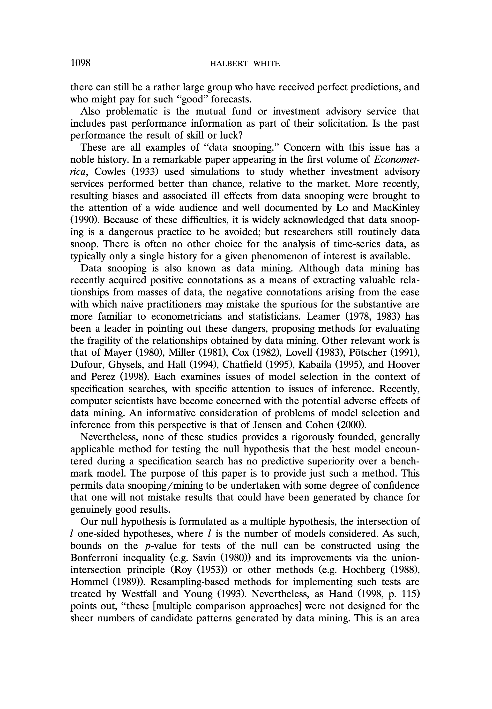
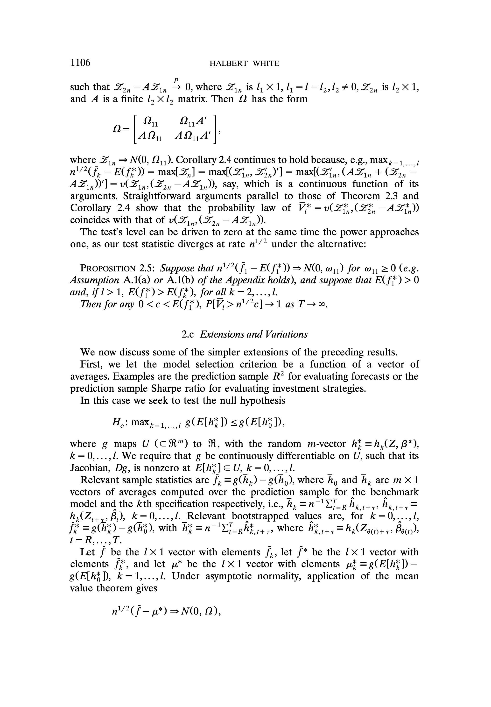
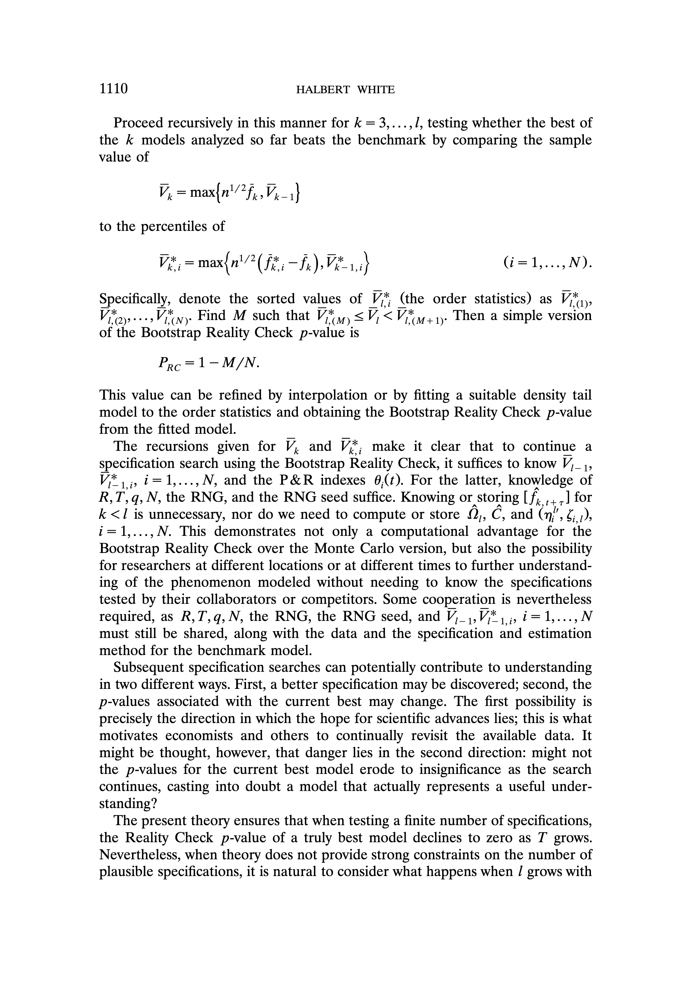
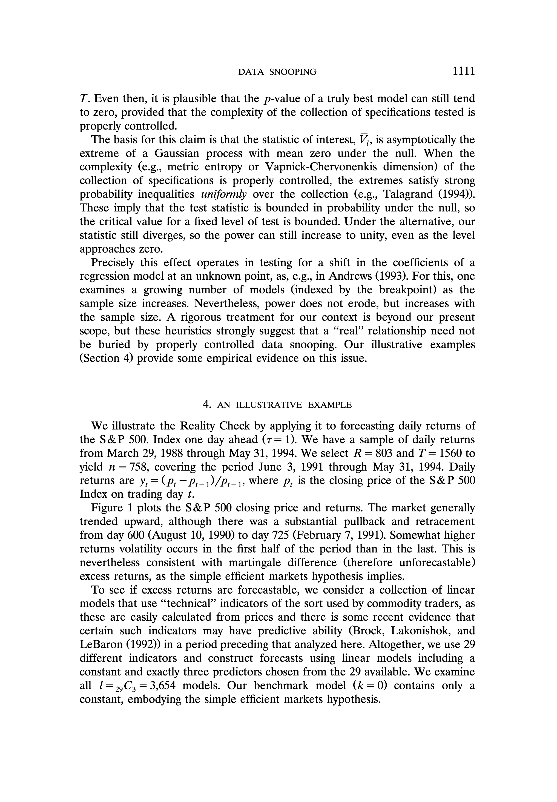
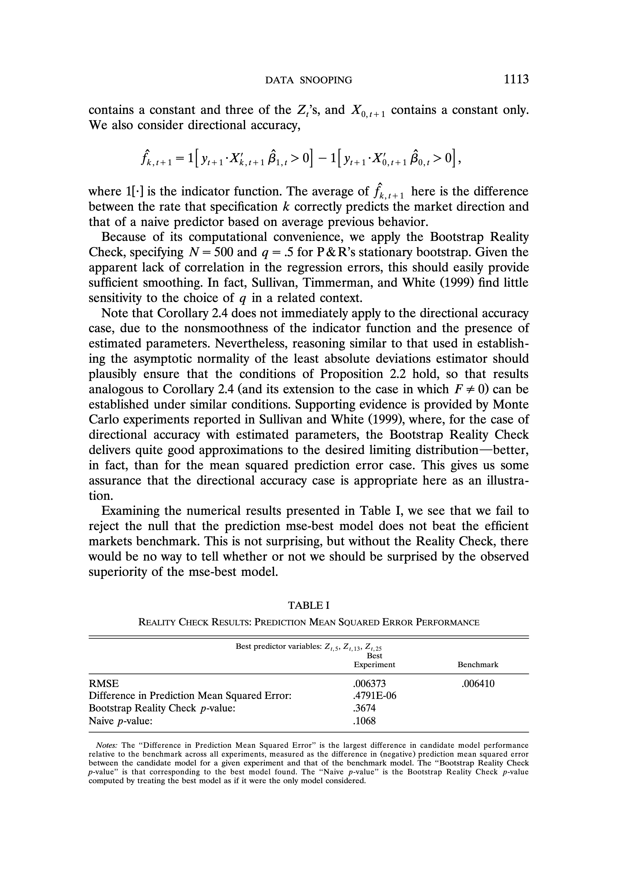
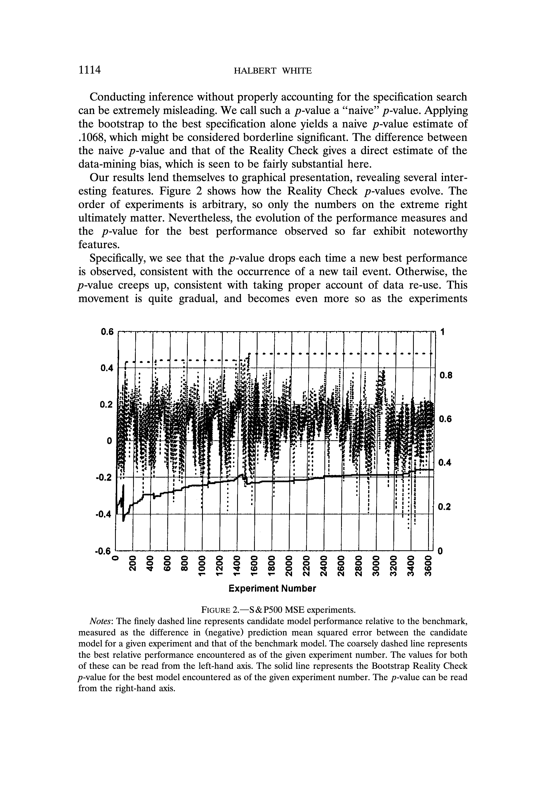
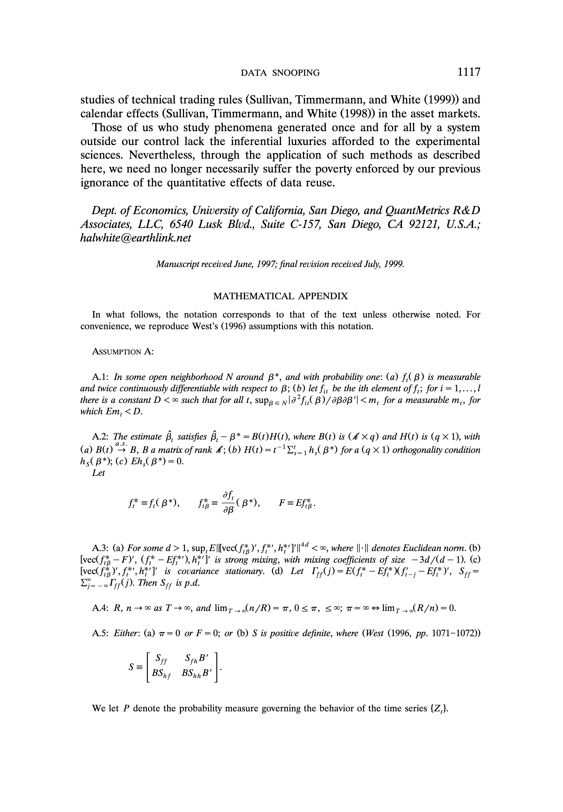
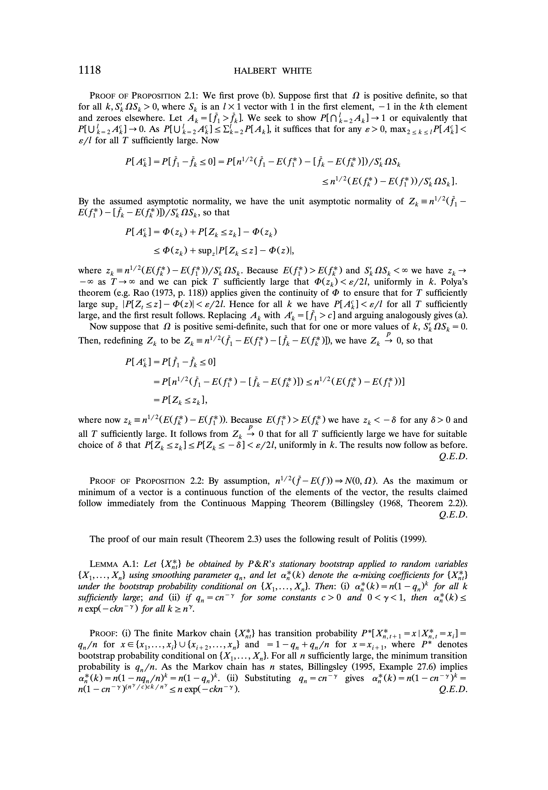
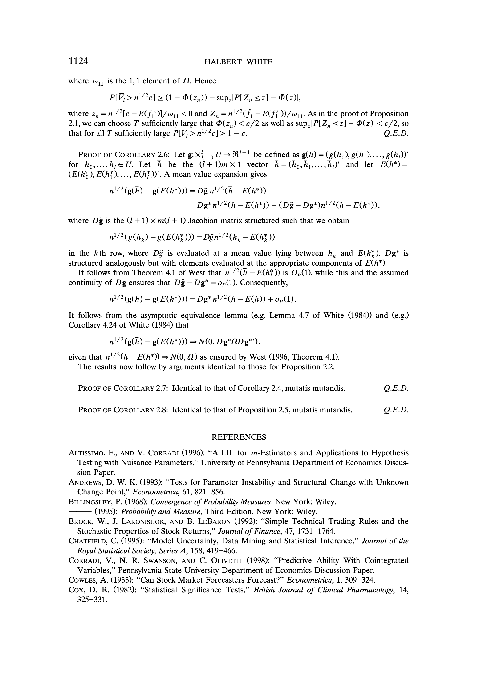
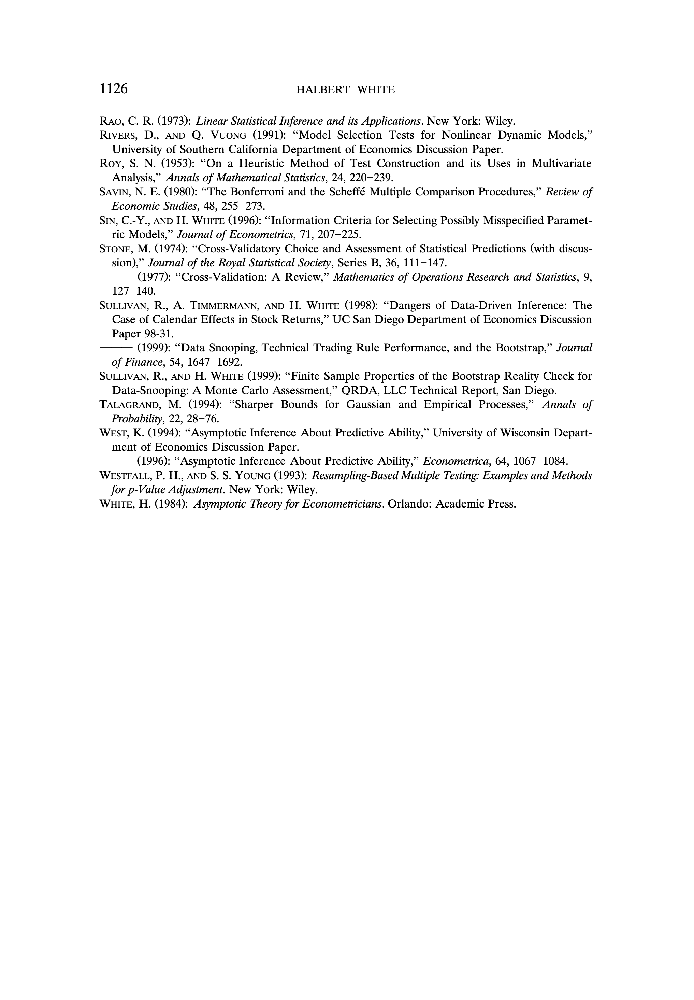

# A Reality Check for Data Snooping

## Metadata

- **Source File:** `A Reality Check for Data Snooping.pdf`
- **Authors:** Unknown
- **Year:** 2003
- **DOI:** 10.1111/1468-0262.00152

## Abstract

Not found.

## Main Text

Econometrica, Vol. 68, No. 5 (September, 2000), 1097-1126
A REALITY CHECK FOR DATA SNOOPING
### By HALBERT WuiTeE!
Data snooping occurs when a given set of data is used more than once for purposes of
inference or model selection. When such data reuse occurs, there is always the possibility
that any satisfactory results obtained may simply be due to chance rather than to any
merit inherent in the method yielding the results. This problem is practically unavoidable
in the analysis of time-series data, as typically only a single history measuring a given
phenomenon of interest is available for analysis. It is widely acknowledged by empirical
researchers that data snooping is a dangerous practice to be avoided, but in fact it is
endemic. The main problem has been a lack of sufficiently simple practical methods
capable of assessing the potential dangers of data snooping in a given situation. Our
purpose here is to provide such methods by specifying a straightforward procedure for
testing the null hypothesis that the best model encountered in a specification search has
no predictive superiority over a given benchmark model. This permits data snooping to be
undertaken with some degree of confidence that one will not mistake results that could
have been generated by chance for genuinely good results.
Keyworbs: Data mining, multiple hypothesis testing, bootstrap, forecast evaluation,
model selection, prediction.
### 1. INTRODUCTION
WHENEVER A “GOOD” FORECASTING MODEL is obtained by an extensive specification search, there is always the danger that the observed good performance
results not from actual forecasting ability, but is instead just luck. Even when no
exploitable forecasting relation exists, looking long enough and hard enough at a
given set of data will often reveal one or more forecasting models that look
good, but are in fact useless.
This is analogous to the fact that if one sequentially flips a sufficiently large
### number of coins, a coin that always comes up heads can emerge with high
likelihood. More colorfully, it is like running the newsletter scam: One selects a
large number of individuals to receive a free copy of a stock market newsletter;
to half the group one predicts the market will go up next week; to the other, that
the market will go down. The next week, one sends the free newsletter only to
those who received the correct prediction; again, half are told the market will go
up and half down. The process is repeated ad libitum. After several months
### ‘The author is grateful to the editor, three anonymous referees, Paul Churchland, Frank
Diebold, Dimitris Politis, Ryan Sullivan, and Joseph Yukich for helpful comments, and to Douglas
Stone of Nicholas Applegate Capital Management for helping to focus my attention on this topic.
All errors are the author’s responsibility. Support for this research was provided by NeuralNet R&D
Associates and QuantMetrics R&D Associates, LLC. Computer implementations of the methods
described in this paper are covered by U.S. Patent 5,893,069.
1097

License

License

License

License

License

License

License

License

License

License

License

License

License

License

License

License

License

License

License

License

License

License

License

License

License

License

License

License

License

## Tables

No tables extracted.

## Figures

## Extraction Notes

- OCR text table fallback found no recoverable structured tables
