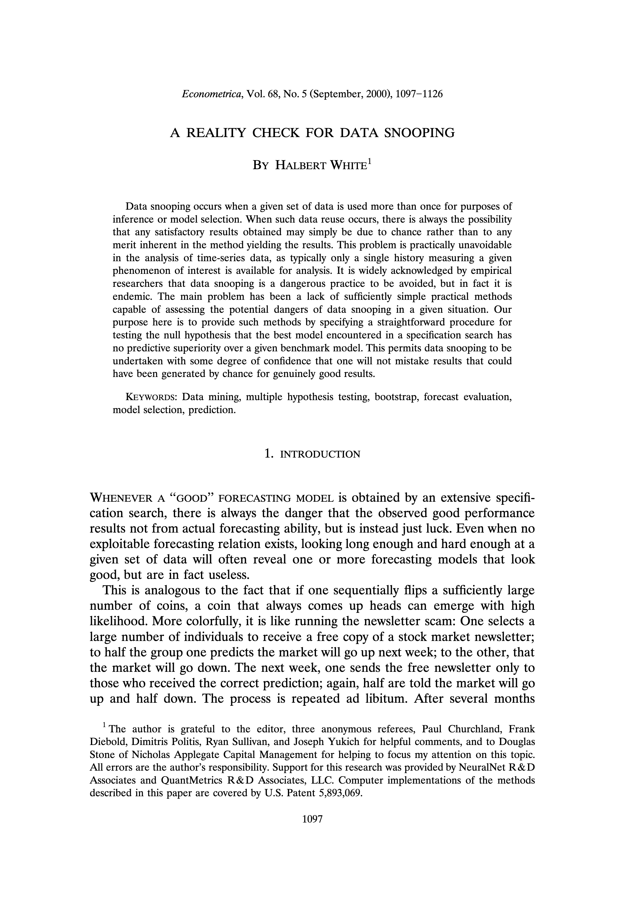
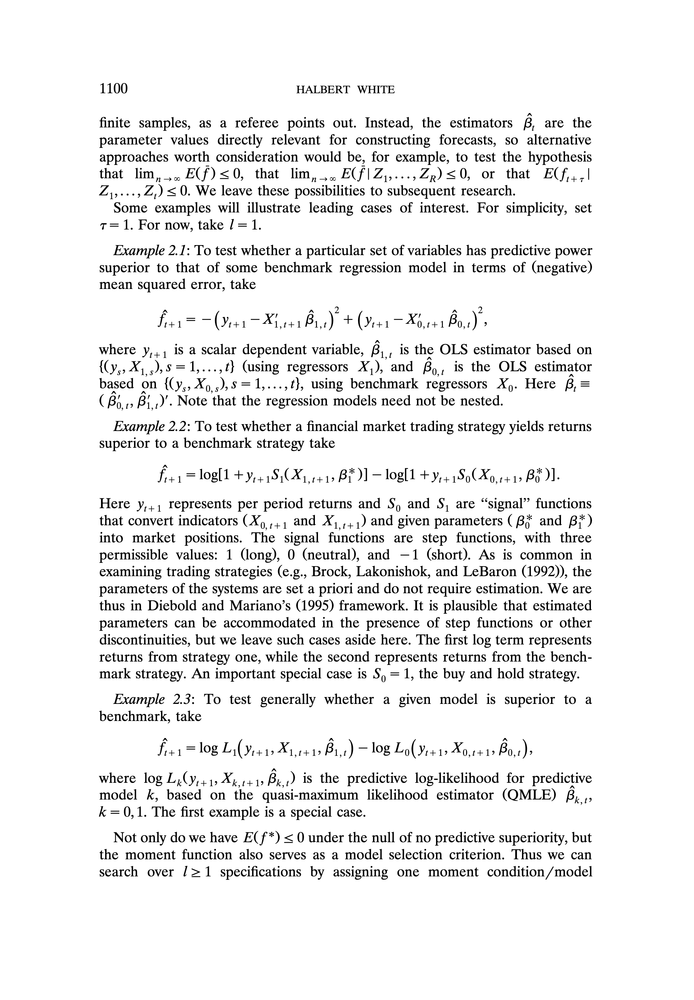
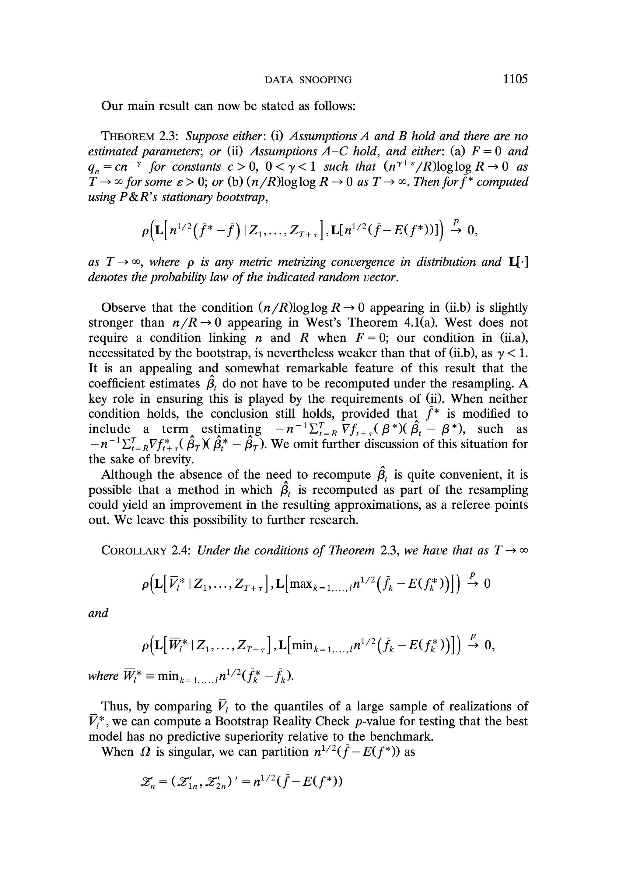
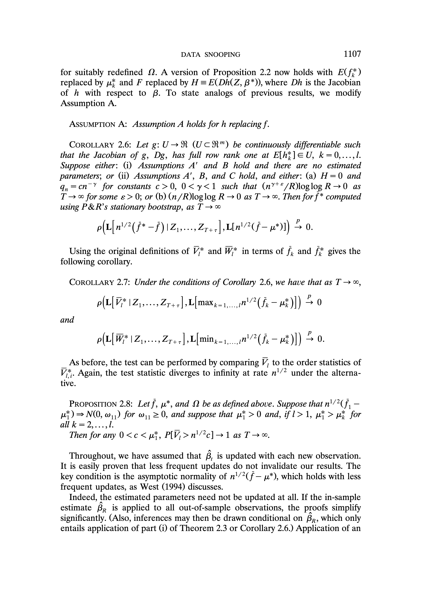
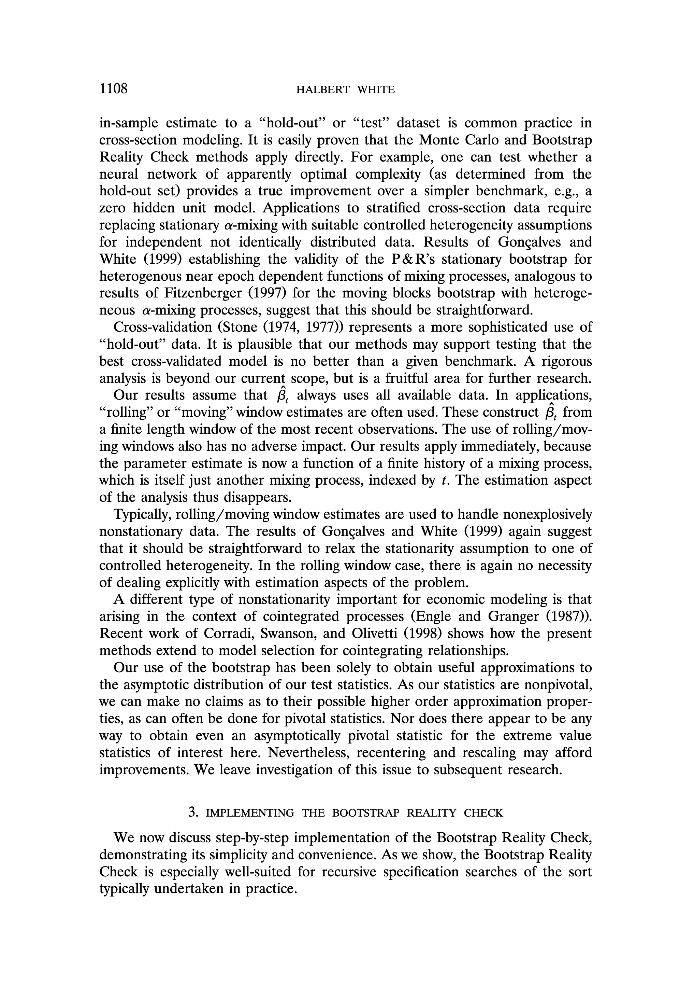
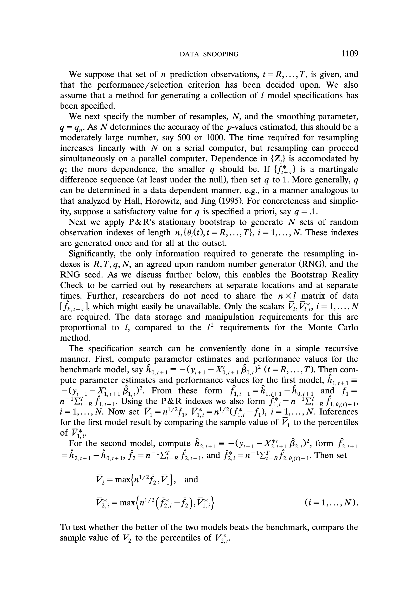
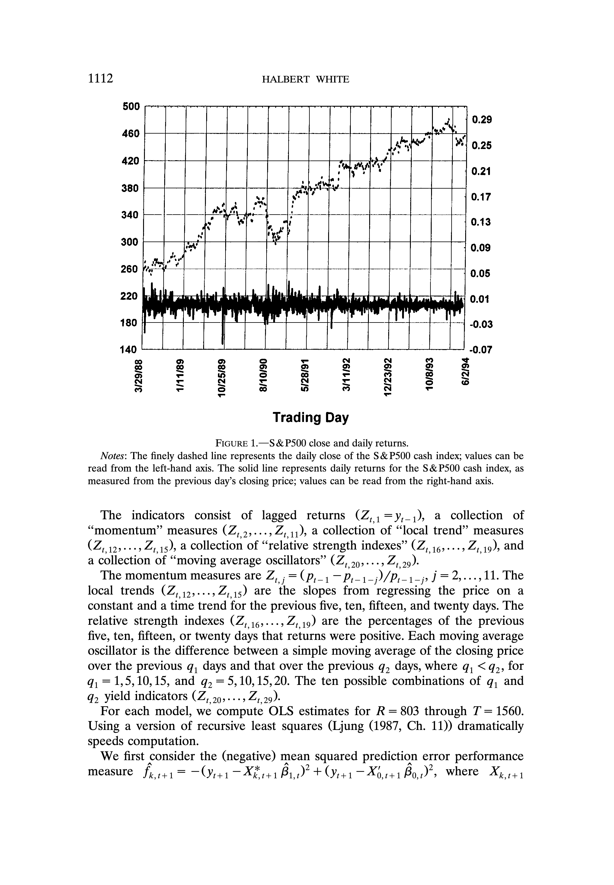
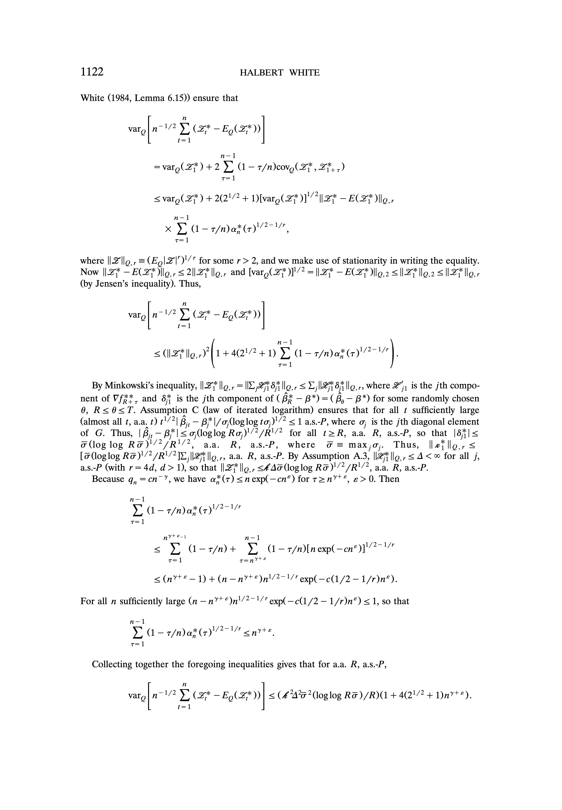
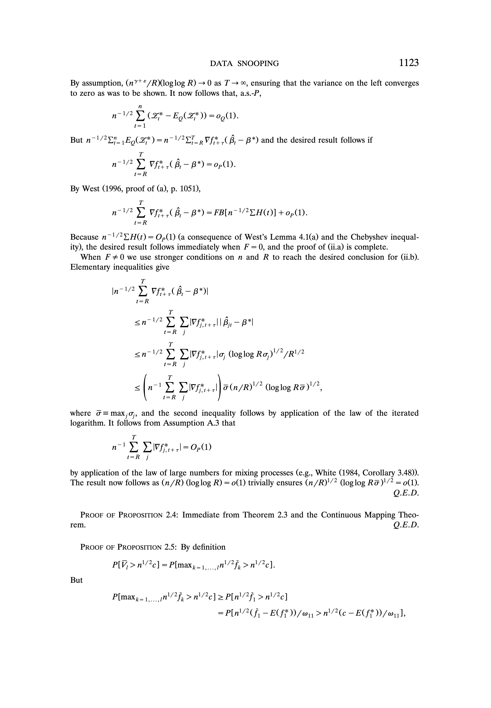

# A Reality Check for Data Snooping

## Metadata

- **Source File:** `A Reality Check for Data Snooping.pdf`
- **Authors:** Unknown
- **Year:** 2003
- **DOI:** 10.1111/1468-0262.00152

## Abstract

Not found.

## Main Text

Econometrica, Vol. 68, No. 5 (September, 2000), 1097-1126
A REALITY CHECK FOR DATA SNOOPING
By HaLsert Wuite!
Data snooping occurs when a given set of data is used more than once for purposes of
inference or model selection. When such data reuse occurs, there is always the possibility
that any satisfactory results obtained may simply be due to chance rather than to any
merit inherent in the method yielding the results. This problem is practically unavoidable
in the analysis of time-series data, as typically only a single history measuring a given
phenomenon of interest is available for analysis. It is widely acknowledged by empirical
researchers that data snooping is a dangerous practice to be avoided, but in fact it is
endemic. The main problem has been a lack of sufficiently simple practical methods
capable of assessing the potential dangers of data snooping in a given situation. Our
purpose here is to provide such methods by specifying a straightforward procedure for
testing the null hypothesis that the best model encountered in a specification search has
no predictive superiority over a given benchmark model. This permits data snooping to be
undertaken with some degree of confidence that one will not mistake results that could
have been generated by chance for genuinely good results.
Keyworbs: Data mining, multiple hypothesis testing, bootstrap, forecast evaluation,
model selection, prediction.
1. INTRODUCTION
WHENEVER A “GOOD” FORECASTING MODEL is obtained by an extensive specification search, there is always the danger that the observed good performance
results not from actual forecasting ability, but is instead just luck. Even when no
exploitable forecasting relation exists, looking long enough and hard enough at a
given set of data will often reveal one or more forecasting models that look
good, but are in fact useless.
This is analogous to the fact that if one sequentially flips a sufficiently large
number of coins, a coin that always comes up heads can emerge with high
likelihood. More colorfully, it is like running the newsletter scam: One selects a
large number of individuals to receive a free copy of a stock market newsletter;
to half the group one predicts the market will go up next week; to the other, that
the market will go down. The next week, one sends the free newsletter only to
those who received the correct prediction; again, half are told the market will go
up and half down. The process is repeated ad libitum. After several months
'The author is grateful to the editor, three anonymous referees, Paul Churchland, Frank
Diebold, Dimitris Politis, Ryan Sullivan, and Joseph Yukich for helpful comments, and to Douglas
Stone of Nicholas Applegate Capital Management for helping to focus my attention on this topic.
All errors are the author’s responsibility. Support for this research was provided by NeuralNet R&D
Associates and QuantMetrics R&D Associates, LLC. Computer implementations of the methods
described in this paper are covered by U.S. Patent 5,893,069.
1097

1098 HALBERT WHITE
there can still be a rather large group who have received perfect predictions, and
who might pay for such “good” forecasts.
Also problematic is the mutual fund or investment advisory service that
includes past performance information as part of their solicitation. Is the past
performance the result of skill or luck?
These are all examples of “data snooping.” Concern with this issue has a
noble history. In a remarkable paper appearing in the first volume of Econometrica, Cowles (1933) used simulations to study whether investment advisory
services performed better than chance, relative to the market. More recently,
resulting biases and associated ill effects from data snooping were brought to
the attention of a wide audience and well documented by Lo and MacKinley
(1990). Because of these difficulties, it is widely acknowledged that data snooping is a dangerous practice to be avoided; but researchers still routinely data
snoop. There is often no other choice for the analysis of time-series data, as
typically only a single history for a given phenomenon of interest is available.
Data snooping is also known as data mining. Although data mining has
recently acquired positive connotations as a means of extracting valuable relationships from masses of data, the negative connotations arising from the ease
with which naive practitioners may mistake the spurious for the substantive are
more familiar to econometricians and statisticians. Leamer (1978, 1983) has
been a leader in pointing out these dangers, proposing methods for evaluating
the fragility of the relationships obtained by data mining. Other relevant work is
that of Mayer (1980), Miller (1981), Cox (1982), Lovell (1983), Pétscher (1991),
Dufour, Ghysels, and Hall (1994), Chatfield (1995), Kabaila (1995), and Hoover
and Perez (1998). Each examines issues of model selection in the context of
specification searches, with specific attention to issues of inference. Recently,
computer scientists have become concerned with the potential adverse effects of
data mining. An informative consideration of problems of model selection and
inference from this perspective is that of Jensen and Cohen (2000).
Nevertheless, none of these studies provides a rigorously founded, generally
applicable method for testing the null hypothesis that the best model encountered during a specification search has no predictive superiority over a benchmark model. The purpose of this paper is to provide just such a method. This
permits data snooping /mining to be undertaken with some degree of confidence
that one will not mistake results that could have been generated by chance for
genuinely good results.
Our null hypothesis is formulated as a multiple hypothesis, the intersection of
I one-sided hypotheses, where / is the number of models considered. As such,
bounds on the p-value for tests of the null can be constructed using the
Bonferroni inequality (e.g. Savin (1980)) and its improvements via the unionintersection principle (Roy (1953)) or other methods (e.g. Hochberg (1988),
Hommel (1989)). Resampling-based methods for implementing such tests are
treated by Westfall and Young (1993). Nevertheless, as Hand (1998, p. 115)
points out, “these [multiple comparison approaches] were not designed for the
sheer numbers of candidate patterns generated by data mining. This is an area
9susdl]
SUOWUWOD BAI}E9ID ajqeoij|dde ay} Aq peuseaoB aie sajoiyie YO ‘asn jo sajns 10} Asesqi] euljuC Aa|iM UO (SUO!}IPUOD-pUe-sWJ9a}/Npa'Uuo}WeYBulgq‘Axo1d "wWod-Aa]IM-Asesqijauluo//:sdj3y) Suol!puod pue
SWeL e431 8eg *[9Z0Z/Z0/90] UO Asesq!] OUI|UO AaIIM ‘UO;WeYBuIg Auns Ag ‘ZGL00°Z9Z0-89PL/LLLL OL/!op/npa uoyweyBbulg-Axo1dWod-Aa|IM-Asesqijauljuo//:sd3}Y Woy pepeojumog 'g 'g00z ‘Z9ZO89vL

DATA SNOOPING 1099
that would benefit from some careful thought.” Thus, our goal is a method that
does not rely on such bounds, but that directly delivers, at least asymptotically,
appropriate p-values.
In taking this approach, we seek to control the simultaneous rate of error
under the null hypothesis. As pointed out by a referee, one may alternatively
wish to control the average rate of error (i.e., the frequency at which we find
“better” models). Which is preferred can be a matter of taste; Miller (1981,
Chapter 1) provides further discussion. Because our interest here focuses on
selecting and using an apparently best model, rather than just asking whether or
not a model better than the benchmark may exist, we adopt the more stringent
approach of controlling the simultaneous rate of error. Nevertheless, the results
presented here are also relevant for controlling average error rates, if this is
desired.
2. THEORY
2.a The Basic Framework
We build on recent work of Diebold and Mariano (1995) and West (1996)
regarding testing hypotheses about predictive ability. Our usage and notation
will be similar.
Predictions are to be made for n periods, indexed from R through T, so that
T=R+n-—1. The predictions are made for a given forecast horizon, r. The
first forecast is based on the estimator B,, formed using observations 1 through
R, the next based on the estimator Bz, , and so forth, with the final forecast
based on the estimator B,.
We test a hypothesis about an /X1 vector of moments, E(f*), where
f* =f(Z, B*) is an 1X1 vector with elements f* =f,(Z, B*), for a random
vector Z and parameters B* = plim Br- Typically, Z will consist of vectors of
dependent variables, say Y, and predictor variables, say X. Our test is based on
the / X 1 statistic
where f pr=f(Ziae> B) and the observed data are generated by {Z,}, a stationary strong (a@-) mixing sequence having marginal distributions identical to that of
Z, with the predictor variables of Z,, , available at time ¢. For suitable choice of
f, the condition
H,: E(f*) <0
will express the null hypothesis of no predictive superiority over a benchmark
model.
Although we follow West (1996) in formulating our hypotheses in terms of
B*, it is not obvious that B* is necessarily the most relevant parameter value for
9susdl]
SUOWUWOD BAI}E9ID ajqeoij|dde ay} Aq peuseaoB aie sajoiyie YO ‘asn jo sajns 10} Asesqi] euljuC Aa|iM UO (SUO!}IPUOD-pUe-sWJ9a}/Npa'Uuo}WeYBulgq‘Axo1d "wWod-Aa]IM-Asesqijauluo//:sdj3y) Suol!puod pue
SWeL e431 8eg *[9Z0Z/Z0/90] UO Asesq!] OUI|UO AaIIM ‘UO;WeYBuIg Auns Ag ‘ZGL00°Z9Z0-89PL/LLLL OL/!op/npa uoyweyBbulg-Axo1dWod-Aa|IM-Asesqijauljuo//:sd3}Y Woy pepeojumog 'g 'g00z ‘Z9ZO89vL

1100 HALBERT WHITE
finite samples, as a referee points out. Instead, the estimators B, are the
parameter values directly relevant for constructing forecasts, so alternative
approaches worth consideration would be, for example, to test the hypothesis
that lim, ,,. E(f) <0, that lim,_... E(f|Z,,...,Z,) <0, or that E(f,,,|
Z,,..-,Z,) <0. We leave these possibilities to subsequent research.
Some examples will illustrate leading cases of interest. For simplicity, set
7= 1. For now, take /=1.
n>
Example 2.1: To test whether a particular set of variables has predictive power
superior to that of some benchmark regression model in terms of (negative)
mean squared error, take
fiat = — (Year —X, 141 Bi, ) + (Yi41 —X, 141 Bo, i)
where y,,, is a scalar dependent variable, By, , is the OLS estimator based on
{(y,, X1,,),8 =1,...,t} (using regressors X,), and Bo, , is the OLS estimator
based on (iy. Xo,) s=1,...,¢}, using benchmark regressors X,). Here B=
(Bo, Bi,". Note that the regression models need not be nested.
Example 2.2: To test whether a financial market trading strategy yields returns
superior to a benchmark strategy take
fas =logl1 +y,, SX ais By )] — logl1 +y,, SoC Xo 14 1» Bo) I.
Here y,,, represents per period returns and S, and S, are “signal” functions
that convert indicators (X,,,, and X,,,,) and given parameters ( Bj and By)
into market positions. The signal functions are step functions, with three
permissible values: 1 (long), 0 (neutral), and —1 (short). As is common in
examining trading strategies (e.g., Brock, Lakonishok, and LeBaron (1992)), the
parameters of the systems are set a priori and do not require estimation. We are
thus in Diebold and Mariano’s (1995) framework. It is plausible that estimated
parameters can be accommodated in the presence of step functions or other
discontinuities, but we leave such cases aside here. The first log term represents
returns from strategy one, while the second represents returns from the benchmark strategy. An important special case is S) = 1, the buy and hold strategy.
Example 2.3: To test generally whether a given model is superior to a
benchmark, take
fia1 = log Li(yn1, X41, r+1 Br, ‘) — log Lo(¥i+1> Xo, t+1» Bo, i)
where log L,0,41 Xk,14.1 Bx. P) is the predictive log-likelihood for predictive
model k, based on the quasi-maximum likelihood estimator (QMLE) Bx, P
k =0,1. The first example is a special case.
Not only do we have E(f*) < 0 under the null of no predictive superiority, but
the moment function also serves as a model selection criterion. Thus we can
search over 1>1 specifications by assigning one moment condition/model
9susdl]
SUOWUWOD BAI}E9ID ajqeoij|dde ay} Aq peuseaoB aie sajoiyie YO ‘asn jo sajns 10} Asesqi] euljuC Aa|iM UO (SUO!}IPUOD-pUe-sWJ9a}/Npa'Uuo}WeYBulgq‘Axo1d "wWod-Aa]IM-Asesqijauluo//:sdj3y) Suol!puod pue
SWeL e431 8eg *[9Z0Z/Z0/90] UO Asesq!] OUI|UO AaIIM ‘UO;WeYBuIg Auns Ag ‘ZGL00°Z9Z0-89PL/LLLL OL/!op/npa uoyweyBbulg-Axo1dWod-Aa|IM-Asesqijauljuo//:sd3}Y Woy pepeojumog 'g 'g00z ‘Z9ZO89vL

DATA SNOOPING 1101
selection criterion to each model. To illustrate, for the third example the / x 1
vector f,,, now has components
fies = log Li(Yiv Xirev By.) — log Lo (Yai Xo,r4 19 Bo,:)
(k =1,...,1).
We select the model with the best model selection criterion value, so the
appropriate null is that the best model is no better than the benchmark.
Formally,
,E( fi) <0.
The alternative is that the best model is superior to the benchmark.
A complexity penalty to enforce model parsimony is easily incorporated; for
example, to apply the Akaike Information Criterion, subtract p,— py from the
above expression for f, ,,,, Where p,(p) is the number of parameters in the
kth (Oth) model. We thus select the model with the best (penalized) predictive
log-likelihood.
The null hypothesis H, is a multiple hypothesis, the intersection of the
one-sided individual hypotheses E(fj*)<0, k=1,...,/. As discussed in the
introduction, our goal is a method that does not rely on bounds, such as
Bonferroni or its improvements, but that directly delivers, at least asymptotically, appropriate p-values.
H,: max;_,
2.b Basic Theory
We can provide such a method whenever f, appropriately standardized, has a
continuous limiting distribution. West’s (1996) Main Theorem 4.1 gives convenient regularity conditions (reproduced in the Appendix as Assumption A)
which ensure that
n'/?(f—E(f*)) = NO, Q),
where = denotes convergence in distribution as T—> ©, and Q (1 x/) is
T
OQ=lim,_,.var|n-'/” ¥ f(Z,,,,B*) |,
t=R
provided that either F = E[(0/0B)f(Z, B*)]=0 or n/R->0 as T> ~~. When
neither of these conditions holds, West’s Theorem 4.1(b) establishes the same
conclusion, but with a more complex expression for 2. For Examples 2.1 and
2.3, F = 0 is readily verified. In Example 2.2, there are no estimated parameters,
so F plays no role.
From this, West obtains standard asymptotic chi-squared statistics nf '} f
for testing the null hypothesis E(f*) = 0, where A is a consistent estimator for
Q. In sharp contrast, our interest in the null hypothesis E(f*)<0 leads
naturally to tests based on max,_; f,. Methods applicable to testing E(f*)
9susdl]
SUOWUWOD BAI}E9ID ajqeoij|dde ay} Aq peuseaoB aie sajoiyie YO ‘asn jo sajns 10} Asesqi] euljuC Aa|iM UO (SUO!}IPUOD-pUe-sWJ9a}/Npa'Uuo}WeYBulgq‘Axo1d "wWod-Aa]IM-Asesqijauluo//:sdj3y) Suol!puod pue
SWeL e431 8eg *[9Z0Z/Z0/90] UO Asesq!] OUI|UO AaIIM ‘UO;WeYBuIg Auns Ag ‘ZGL00°Z9Z0-89PL/LLLL OL/!op/npa uoyweyBbulg-Axo1dWod-Aa|IM-Asesqijauljuo//:sd3}Y Woy pepeojumog 'g 'g00z ‘Z9ZO89vL

1102 HALBERT WHITE
= 0 follow straightforwardly from our results; nevertheless, for succinctness we
focus here strictly on testing E(f*) <0.
Our first result establishes that selecting the model with the best predictive
model selection criterion does indeed identify the best model when there is one.
PROPOSITION 2.1: Suppose that n'/?(f—E(f*))=N(,Q) for Q positive
semi-definite (e.g. Assumption A of the Appendix holds). (a) If Eff‘) >0 for
some 1<k <I, then for any 0<c <E(f;‘), PIf, >c]>1 as T>~. (b) Ifl>1
and E(f*) > E(f;*), for all k =2,...,1, then Pl f, >f, for all k=2,...,1]> 1 as
To,
Part (a) says that if some model (e.g., the best model) beats the benchmark,
then this is eventually revealed by a positive estimated relative performance.
When /=1, this result is analogous to a model selection result of Rivers and
Vuong (1991), for a nonpredictive setting. It is also analogous to a model
selection result of Kloek (1972) for /> 1, again in a nonpredictive setting. Part
(b) says that the best model eventually has the best estimated performance
relative to the benchmark, with probability approaching one.
A test of H, for the predictive model selection criterion follows from the
following proposition.
PROPOSITION 2.2: Suppose that n\/?(f—E(f*)) N,Q) for Q positive
semi-definite (e.g. Assumption A holds). Then as T > ~
max;_;,..., mt fF, -E(ffe )} =V,=max,_,, {Z;}
and
min;-1,., n't Ff, —E(fi)} =W,=min,_;,. AZ},
where Z is an 1X1 vector with components Z,, k=1,...,1, distributed as
N(O, 2).
Given asymptotic normality, the conclusion holds regardless of whether the
null or the alternative is true. We enforce the null for testing by using the fact
that the element of the null least favorable to the alternative is that E(f;*) =0
for all k. The behavior of the predictive model selection criterion for the best
model, say
=1,...,
is thus known under the element of the null least favorable to the alternative,
approximately, for large T, permitting construction of asymptotic p-values. By
enforcing the null hypothesis in this way, we obtain the critical value for the test
in a manner akin to inverting a confidence interval for max, E(f;*). Any method
for obtaining (a consistent estimate of) a p-value for H,: E(f*) <0 in the
context of a specification search we call a “Reality Check,” as this provides an
9susdl]
SUOWUWOD BAI}E9ID ajqeoij|dde ay} Aq peuseaoB aie sajoiyie YO ‘asn jo sajns 10} Asesqi] euljuC Aa|iM UO (SUO!}IPUOD-pUe-sWJ9a}/Npa'Uuo}WeYBulgq‘Axo1d "wWod-Aa]IM-Asesqijauluo//:sdj3y) Suol!puod pue
SWeL e431 8eg *[9Z0Z/Z0/90] UO Asesq!] OUI|UO AaIIM ‘UO;WeYBuIg Auns Ag ‘ZGL00°Z9Z0-89PL/LLLL OL/!op/npa uoyweyBbulg-Axo1dWod-Aa|IM-Asesqijauljuo//:sd3}Y Woy pepeojumog 'g 'g00z ‘Z9ZO89vL

DATA SNOOPING 1103
objective measure of the extent to which apparently good results accord with the
sampling variation relevant for the search.
The challenge to implementing the Reality Check is that the desired distribution, that of the extreme value of a vector of correlated normals for the general
case, is not known. An analytic approach to the Reality Check is not feasible.
Nevertheless, there are at least two ways to obtain the desired p-values. The
first is Monte Carlo simulation. For this, compute a consistent estimator of 2,
say (2. For example, one can use the block resampling estimator of Politis and
Romano (1994a) or the block subsampling estimator of Politis and Romano
(1994c). Then one samples a large number of times from N(0, 2) and obtains
the desired p-value from the distribution of the extremes of N(0, 2). We call
this the “Monte Carlo Reality Check” p-value.
To appreciate the computations needed for the Monte Carlo approach,
consider the addition of one more model (say model /) to the existing collection.
First, we compute the new elements of the estimate 0, its Jth row, 0, =
(Q,,,-..,Q,). For concreteness, suppose we manipulate [ fi trepok=1,...,5
t=1,...,T] to obtain
T
Die = Fuca + Le Wrs Vis + Ves) (k=1,...,1),
s=1
where wy, s = 1, ,T are suitable weights and 4,,, = (T —
str ethos chose s*
Next, we draw independent / X 1 random variables Z,~ NO, 0), b= =1,...,N.
For this, compute the Cholesky decomposition of O, say C (so CC’ = 0), ‘and
form 2; =Cn!, where 7 is l-variate standard normal (N(0, J,)). Finally, compute the Monte Carlo Reality Check p-value from the order statistics of
vos 2,4 where 2; =(Zy,..., Zp’.
The computational demands of constructing g;,, can be reduced by noting
that C is a triangular matrix whose /th row depends only on o and the
preceding / — 1 rows of C. Thus, by storing 0,, C, and (m’, iD» i= 1,...,N, at
each stage (J=1,2,...), one can construct ¢;, at the next sage as §)=
max( ¢; )_ Crm) where C, is the (1X1) Ith row of C, and n! is formed
recursively as n/ =(n/~", n, ,)', with 7, independently drawn as (scalar) unit
normal.
To summarize, obtaining the Monte Carlo Reality Check p-value requires
storage and manipulation of [ fi tech A), CE, and (y!',g,), i=1,...,N. These
storage and manipulation requirements increase with the square of I. Also, if
one is to account for the data-snooping efforts of others, their [f, ,, ,] matrix is
required. -
A second approach relies on the bootstrap, using a resampled version of f to
deliver the “Bootstrap Reality Check” p-value for testing H,. For suitably
chosen random indexes 6(t), the resampled statistic is computed as
*=n'! Lite fi =f(Zows +> Bao) (t=R,...,T).
9susdl]
SUOWUWOD BAI}E9ID ajqeoij|dde ay} Aq peuseaoB aie sajoiyie YO ‘asn jo sajns 10} Asesqi] euljuC Aa|iM UO (SUO!}IPUOD-pUe-sWJ9a}/Npa'Uuo}WeYBulgq‘Axo1d "wWod-Aa]IM-Asesqijauluo//:sdj3y) Suol!puod pue
SWeL e431 8eg *[9Z0Z/Z0/90] UO Asesq!] OUI|UO AaIIM ‘UO;WeYBuIg Auns Ag ‘ZGL00°Z9Z0-89PL/LLLL OL/!op/npa uoyweyBbulg-Axo1dWod-Aa|IM-Asesqijauljuo//:sd3}Y Woy pepeojumog 'g 'g00z ‘Z9ZO89vL

1104 HALBERT WHITE
To handle time-series data, we require a resampling procedure applicable to
dependent processes. The moving blocks method of Kuensch (1989) and Liu and
Singh (1992) is one such procedure. It works by constructing a resample from
fixed length blocks of observations where the starting index for each block is
drawn randomly. A block length of one gives the standard bootstrap, whereas
larger block lengths accommodate increasing dependence. A more sophisticated
version of this approach is the tapered block bootstrap of Paparoditis and Politis
(2000). Although any of these methods can be validly applied, for analytic
simplicity and concreteness we apply and analyze the stationary bootstrap of
Politis and Romano (1994a,b) (henceforth, P& R). This procedure is analogous
to the moving blocks bootstrap, but, instead of using blocks of fixed length (b,
say) one uses blocks of random length, distributed according to the geometric
distribution with mean block length b. As P&R show, this procedure delivers
valid bootstrap approximations for means of a-mixing processes, provided b
increases appropriately with n.
To implement the stationary bootstrap, P& R propose the following algorithm
for obtaining the 0(t)’s. Start by selecting a smoothing parameter g = 1/b =q,,
0<q, <1, q, 70, nq, >” as n—~, and proceed as follows: (i) Set t=R.
Draw 6(R) at random, independently and uniformly from {R,..., 7}. Gi) Increment ¢. If t>T, stop. Otherwise, draw a standard uniform random variable U
(supported on [0,1]) independently of all other random variables. (a) If U<q,
draw @(t) at random, independently and uniformly from {R,...,7}; (b) if U>q,
set 0(t) = 0(t— 1) +1; if O(t) > T, reset to 0(t) =R. (iii) Repeat (ii). As P&R
show, this delivers blocks of random length, distributed according to the geometric distribution with mean block length 1/q.
When £* appears instead of Bore) in the definition of f*, as it does in
Diebold and Mariano’s (1995) setup, P & R’s (1994a) Theorem 2 applies immediately to establish that under appropriate conditions (see Assumption B of the
Appendix), the distribution, conditional on {Zz,,-.-,Zr4,}, of n/*(f* —f)
converges, as n increases, to that of n!/?(f — E(f*)).
Thus, by repeatedly drawing realizations of n'/?(f* —f), we can build up an
estimate of the desired distribution N(0,Q). The Bootstrap Reality Check
p-value for the predictive model selection statistic, V,, can then immediately be
obtained from the quantiles of
When Bowe appears in f*, careful argument under mild additional regularity
conditions delivers the same conclusion. It suffices that By obeys a law of the
iterated logarithm, a refinement of the central limit theorem. With mild additional regularity (see Sin and White (1996) or Altissimo and Corradi (1996)) one
can readily verify the following.
ASSUMPTION C: Let B and H be as defined in Assumption A.2 of the Appendix,
and let G = Bilim, _,,,var(T'/*H(t))|B’. For all (kX 1), NA=1,
Pilim sup;T'/71A'( By — B*)|/{A'GAloglog(a’'Ga)T}'? = 1] = 1.
9susdl]
SUOWUWOD BAI}E9ID ajqeoij|dde ay} Aq peuseaoB aie sajoiyie YO ‘asn jo sajns 10} Asesqi] euljuC Aa|iM UO (SUO!}IPUOD-pUe-sWJ9a}/Npa'Uuo}WeYBulgq‘Axo1d "wWod-Aa]IM-Asesqijauluo//:sdj3y) Suol!puod pue
SWeL e431 8eg *[9Z0Z/Z0/90] UO Asesq!] OUI|UO AaIIM ‘UO;WeYBuIg Auns Ag ‘ZGL00°Z9Z0-89PL/LLLL OL/!op/npa uoyweyBbulg-Axo1dWod-Aa|IM-Asesqijauljuo//:sd3}Y Woy pepeojumog 'g 'g00z ‘Z9ZO89vL

DATA SNOOPING 1105
Our main result can now be stated as follows:
THEOREM 2.3: Suppose either: (i) Assumptions A and B hold and there are no
estimated parameters; or (ii) Assumptions A—C hold, and either: (a) F =0 and
Qn =cn~* for constants c>0, 0<y<1 such that (n”**/R)loglog R>0 as
T > & for some «> 0; or (b) (n/R)loglog R > 0 as T > &. Then for f* computed
using P& R’s stationary bootstrap,
p(L[n'/?(f* -f)1Z,,..-,Zr+,| Ln f- EP) 20,
as T— ©, where p is any metric metrizing convergence in distribution and L{-]
denotes the probability law of the indicated random vector.
Observe that the condition (n/R)loglog R > 0 appearing in (ii-b) is slightly
stronger than n/R-—0 appearing in West’s Theorem 4.1(a). West does not
require a condition linking n and R when F=0; our condition in (iia),
necessitated by the bootstrap, is nevertheless weaker than that of (ii.b), as y < 1.
It is an appealing and somewhat remarkable feature of this result that the
coefficient estimates B, do not have to be recomputed under the resampling. A
key role in ensuring this is played by the requirements of (ii). When neither
condition holds, the conclusion still holds, provided that f* is modified to
include a term estimating —n~'L/_,Vf,,,(B*)(B, — B*), such as
—n'YT_,Vf* .( Br B* — B,). We omit further discussion of this situation for
the sake of brevity. .
Although the absence of the need to recompute B, is quite convenient, it is
possible that a method in which B, is recomputed as part of the resampling
could yield an improvement in the resulting approximations, as a referee points
out. We leave this possibility to further research.
COROLLARY 2.4: Under the conditions of Theorem 2.3, we have that as T >
and
where W* =min,-1,. fe —fi)-
Thus, by comparing V, to the quantiles of a large sample of realizations of
V;*, we can compute a Bootstrap Reality Check p-value for testing that the best
model has no predictive superiority relative to the benchmark.
When 22 is singular, we can partition n'/?(f— E(f*)) as
ZF, = (Fin, By)! =n'?(f - E(f*))
9susdl]
SUOWUWOD BAI}E9ID ajqeoij|dde ay} Aq peuseaoB aie sajoiyie YO ‘asn jo sajns 10} Asesqi] euljuC Aa|iM UO (SUO!}IPUOD-pUe-sWJ9a}/Npa'Uuo}WeYBulgq‘Axo1d "wWod-Aa]IM-Asesqijauluo//:sdj3y) Suol!puod pue
SWeL e431 8eg *[9Z0Z/Z0/90] UO Asesq!] OUI|UO AaIIM ‘UO;WeYBuIg Auns Ag ‘ZGL00°Z9Z0-89PL/LLLL OL/!op/npa uoyweyBbulg-Axo1dWod-Aa|IM-Asesqijauljuo//:sd3}Y Woy pepeojumog 'g 'g00z ‘Z9ZO89vL

1106 HALBERT WHITE
such that 2, -AZ,, 4 0, where Z,,, is 1, X 1,1, =1—1,,1, #0, Z, is 1, x1,
and A is a finite /, X/, matrix. Then 2 has the form
Q= DQ, QA’
AQ,, AQ,,A'|’
grees
1s Weds ee Az.) say, which is a continuous function of its
arguments. Straightforward arguments parallel to those of Theorem 2.3 and
Corollary 2.4 show that the probability law of V;* =v(Z*,,( 2%, -AZ;))
coincides with that of v(2,,,(2,,, -AZ,,,)).
The test’s level can be driven to zero at the same time the power approaches
one, as our test statistic diverges at rate n'/” under the alternative:
PROPOSITION 2.5: Suppose that n'/?(f, — ECf;*)) = NO, @1,) for w,, = 0 (e.g.
Assumption A.1(a) or A.1(b) of the Appendix holds), and suppose that E(f;*) > 0
and, if 1>1, E(f#)>ECf*), for all k =2,...,1.
Then for any 0<c <E(f#*), PIV, > n/c] > 1 as T>
2.c Extensions and Variations
We now discuss some of the simpler extensions of the preceding results.
First, we let the model selection criterion be a function of a vector of
averages. Examples are the prediction sample R? for evaluating forecasts or the
prediction sample Sharpe ratio for evaluating investment strategies.
In this case we seek to test the null hypothesis
1 SCELhE)) <g(Elho)),
where g maps U (cC”) to , with the random m-vector hi =h,(Z, B*),
k=0,...,/. We require that g be continuously differentiable on U, such that its
Jacobian, Dg, is nonzero at E[h{]<¢U, k=0,...,1.
Relevant sample statistics are f, = g(h,) — g(hy), where h, and h, are mX1
vectors of averages computed over the prediction sample for the benchmark
model and the kth specification respectively, ie. h, =n~'Li_p h katte h kttr=
h AZ, 44> B,), k=0,...,1. Relevant bootstrapped values are, for k=0,...,/,
fé =8(hiD) — g(h}), with hi =n Y7 ahi, t+79 Where hy, 47 =i (Lowses Brco)s
t=R,...,T.
Let f be the / x1 vector with elements f,, let f* be the 1x1 vector with
elements f;*, and let u* be the 1x1 vector with elements p* = g(E[hi]) —
g(E[h*]), k=1,...,/. Under asymptotic normality, application of the mean
value theorem gives
n'/?(f—p*) = NO, 2),
9susdl]
SUOWUWOD BAI}E9ID ajqeoij|dde ay} Aq peuseaoB aie sajoiyie YO ‘asn jo sajns 10} Asesqi] euljuC Aa|iM UO (SUO!}IPUOD-pUe-sWJ9a}/Npa'Uuo}WeYBulgq‘Axo1d "wWod-Aa]IM-Asesqijauluo//:sdj3y) Suol!puod pue
SWeL e431 8eg *[9Z0Z/Z0/90] UO Asesq!] OUI|UO AaIIM ‘UO;WeYBuIg Auns Ag ‘ZGL00°Z9Z0-89PL/LLLL OL/!op/npa uoyweyBbulg-Axo1dWod-Aa|IM-Asesqijauljuo//:sd3}Y Woy pepeojumog 'g 'g00z ‘Z9ZO89vL

DATA SNOOPING 1107
for suitably redefined 2. A version of Proposition 2.2 now holds with E(f;*)
replaced by wz and F replaced by H = E(DA(Z, B*)), where Dh is the Jacobian
of h with respect to B. To state analogs of previous results, we modify
Assumption A.
ASSUMPTION A: Assumption A holds for h replacing f.
CorOLiary 2.6: Let g:U > 8 (UCR™) be continuously differentiable such
that the Jacobian of g, Dg, has full row rank one at E[hi])<U, k=0,...,1.
Suppose either: (i) Assumptions A' and B hold and there are no estimated
parameters; or (ii) Assumptions A’, B, and C hold, and either: (a) H=0 and
qn =cn~” for constants c>0, 0<y<1 such that (n”**/R)loglog R>0 as
T > ~ for some e> 0; or (b) (n/R)loglog R > 0 as T > ©. Then for f* computed
using P& R’s stationary bootstrap, as T > ©
p(L[n'/?(f* —f) |Zys.--Zr+,| Unf 21) 5 0.
Using the original definitions of V;* and W;* in terms of f, and f* gives the
following corollary.
COROLLARY 2.7: Under the conditions of Corollary 2.6, we have that as T > ~,
o(L[ Vi" 125-5 Zrs-] L[maxy-1,...1'/?(fe— at)]) > 0
and
_ As before, the test can be performed by comparing V, to the order statistics of
V;*. Again, the test statistic diverges to infinity at rate n'/? under the alternative.
PROPOSITION 2.8: Let f, u*, and Q be as defined above. Suppose that n'/?(f, —
Bi) => NO, w,,) for w,, > 0, and suppose that pi > 0 and, if 1>1, wi > we for
all kk =2,...,1.
Then for any 0<c < px, PIV; > nc] > 1 as T> ©.
Throughout, we have assumed that B, is updated with each new observation.
It is easily proven that less frequent updates do not invalidate our results. The
key condition is the asymptotic normality of n'/?(f — u*), which holds with less
frequent updates, as West (1994) discusses.
Indeed, the estimated parameters need not be updated at all. If the in-sample
estimate B, is applied to all out-of-sample observations, the proofs simplify
significantly. (Also, inferences may then be drawn conditional on Br, which only
entails application of part (i) of Theorem 2.3 or Corollary 2.6.) Application of an
9susdl]
SUOWUWOD BAI}E9ID ajqeoij|dde ay} Aq peuseaoB aie sajoiyie YO ‘asn jo sajns 10} Asesqi] euljuC Aa|iM UO (SUO!}IPUOD-pUe-sWJ9a}/Npa'Uuo}WeYBulgq‘Axo1d "wWod-Aa]IM-Asesqijauluo//:sdj3y) Suol!puod pue
SWeL e431 8eg *[9Z0Z/Z0/90] UO Asesq!] OUI|UO AaIIM ‘UO;WeYBuIg Auns Ag ‘ZGL00°Z9Z0-89PL/LLLL OL/!op/npa uoyweyBbulg-Axo1dWod-Aa|IM-Asesqijauljuo//:sd3}Y Woy pepeojumog 'g 'g00z ‘Z9ZO89vL

1108 HALBERT WHITE
in-sample estimate to a “hold-out” or “test” dataset is common practice in
cross-section modeling. It is easily proven that the Monte Carlo and Bootstrap
Reality Check methods apply directly. For example, one can test whether a
neural network of apparently optimal complexity (as determined from the
hold-out set) provides a true improvement over a simpler benchmark, e.g., a
zero hidden unit model. Applications to stratified cross-section data require
replacing stationary a-mixing with suitable controlled heterogeneity assumptions
for independent not identically distributed data. Results of Gongalves and
White (1999) establishing the validity of the P&R’s stationary bootstrap for
heterogenous near epoch dependent functions of mixing processes, analogous to
results of Fitzenberger (1997) for the moving blocks bootstrap with heterogeneous a-mixing processes, suggest that this should be straightforward.
Cross-validation (Stone (1974, 1977)) represents a more sophisticated use of
“hold-out” data. It is plausible that our methods may support testing that the
best cross-validated model is no better than a given benchmark. A rigorous
analysis is beyond our current scope, but is a fruitful area for further research.
Our results assume that B, always uses all available data. In applications,
“rolling” or “moving” window estimates are often used. These construct 8, from
a finite length window of the most recent observations. The use of rolling /moving windows also has no adverse impact. Our results apply immediately, because
the parameter estimate is now a function of a finite history of a mixing process,
which is itself just another mixing process, indexed by ¢. The estimation aspect
of the analysis thus disappears.
Typically, rolling /moving window estimates are used to handle nonexplosively
nonstationary data. The results of Gongalves and White (1999) again suggest
that it should be straightforward to relax the stationarity assumption to one of
controlled heterogeneity. In the rolling window case, there is again no necessity
of dealing explicitly with estimation aspects of the problem.
A different type of nonstationarity important for economic modeling is that
arising in the context of cointegrated processes (Engle and Granger (1987)).
Recent work of Corradi, Swanson, and Olivetti (1998) shows how the present
methods extend to model selection for cointegrating relationships.
Our use of the bootstrap has been solely to obtain useful approximations to
the asymptotic distribution of our test statistics. As our statistics are nonpivotal,
we can make no claims as to their possible higher order approximation properties, as can often be done for pivotal statistics. Nor does there appear to be any
way to obtain even an asymptotically pivotal statistic for the extreme value
Statistics of interest here. Nevertheless, recentering and rescaling may afford
improvements. We leave investigation of this issue to subsequent research.
3. IMPLEMENTING THE BOOTSTRAP REALITY CHECK
We now discuss step-by-step implementation of the Bootstrap Reality Check,
demonstrating its simplicity and convenience. As we show, the Bootstrap Reality
Check is especially well-suited for recursive specification searches of the sort
typically undertaken in practice.
9susdl]
SUOWUWOD BAI}E9ID ajqeoij|dde ay} Aq peuseaoB aie sajoiyie YO ‘asn jo sajns 10} Asesqi] euljuC Aa|iM UO (SUO!}IPUOD-pUe-sWJ9a}/Npa'Uuo}WeYBulgq‘Axo1d "wWod-Aa]IM-Asesqijauluo//:sdj3y) Suol!puod pue
SWeL e431 8eg *[9Z0Z/Z0/90] UO Asesq!] OUI|UO AaIIM ‘UO;WeYBuIg Auns Ag ‘ZGL00°Z9Z0-89PL/LLLL OL/!op/npa uoyweyBbulg-Axo1dWod-Aa|IM-Asesqijauljuo//:sd3}Y Woy pepeojumog 'g 'g00z ‘Z9ZO89vL

DATA SNOOPING 1109
We suppose that set of n prediction observations, t=R,...,T, is given, and
that the performance/selection criterion has been decided upon. We also
assume that a method for generating a collection of / model specifications has
been specified.
We next specify the number of resamples, N, and the smoothing parameter,
q =4q,. As N determines the accuracy of the p-values estimated, this should be a
moderately large number, say 500 or 1000. The time required for resampling
increases linearly with N on a serial computer, but resampling can proceed
simultaneously on a parallel computer. Dependence in {Z,} is accomodated by
q; the more dependence, the smaller qg should be. If {f*.,} is a martingale
difference sequence (at least under the null), then set g to 1. More generally, qg
can be determined in a data dependent manner, e.g., in a manner analogous to
that analyzed by Hall, Horowitz, and Jing (1995). For concreteness and simplicity, suppose a satisfactory value for q is specified a priori, say gq = .1.
Next we apply P&R’s stationary bootstrap to generate N sets of random
observation indexes of length n,{0,(t),t=R,...,T}, i=1,..., N. These indexes
are generated once and for all at the outset.
Significantly, the only information required to generate the resampling indexes is R,T,q, N, an agreed upon random number generator (RNG), and the
RNG seed. As we discuss further below, this enables the Bootstrap Reality
Check to be carried out by researchers at separate locations and at separate
times. Further, researchers do not need to share the n X/ matrix of data
[fi1+7], Which might easily be unavailable. Only the scalars V,,V;5, i=1,...,N
are required. The data storage and manipulation requirements for this are
proportional to J, compared to the /* requirements for the Monte Carlo
method.
The specification search can be conveniently done in a simple recursive
manner. First, compute parameter estimates and Borormance values for the
benchmark model, say hg 1.4 = —Q41—Xh.141 Bo)? (= .,T). Then compute parameter estimates and performance values for the fist ‘model, hy, t=
O41 Xi 141 By, )°. From these form f, t+1 =h, +1 —hy, i+ and f,=
n-1ET fi 1+4- Using the P&R indexes we also form fi; =n yl R f 6,(t)+ 1
i=1,...,N. Now set V,=n'/f,, Vit, =n'(f#; -f,), i=1,...,N. Inferences
for the first model result by comparing the sample value of V, to ‘the percentiles
of Vi i
For the second model, compute h, = 7 Oa ~ XN aa By, ’, form fy, 41
=hy...- hori f= n ‘Yr. Rhy and fiian- Ye rhs, OAt)+1° Then set
V, = max{n'/f,,V,}, and
V3; = max{n n'? (fx, i-h), Ain (@i=1,...,N).
To test whether the better of the two models beats the benchmark, compare the
sample value of V, to the percentiles of V;',.
9susdl]
SUOWUWOD BAI}E9ID ajqeoij|dde ay} Aq peuseaoB aie sajoiyie YO ‘asn jo sajns 10} Asesqi] euljuC Aa|iM UO (SUO!}IPUOD-pUe-sWJ9a}/Npa'Uuo}WeYBulgq‘Axo1d "wWod-Aa]IM-Asesqijauluo//:sdj3y) Suol!puod pue
SWeL e431 8eg *[9Z0Z/Z0/90] UO Asesq!] OUI|UO AaIIM ‘UO;WeYBuIg Auns Ag ‘ZGL00°Z9Z0-89PL/LLLL OL/!op/npa uoyweyBbulg-Axo1dWod-Aa|IM-Asesqijauljuo//:sd3}Y Woy pepeojumog 'g 'g00z ‘Z9ZO89vL

1110 HALBERT WHITE
Proceed recursively in this manner for k = 3,...,/, testing whether the best of
the k models analyzed so far beats the benchmark by comparing the sample
value of
V, = max{n'/?f,,Vi_}
to the percentiles of
Ve, =max{n'/?( ft: —fi),Vie,:) G=1,...,N).
Specifically, denote the sorted values of Vit (the order statistics) as Vita,
Vita) +++sViyy. Find M such that Vi wy) S V,< Vi (m+1: Then a simple version
of the Bootstrap Reality Check p-value is
Peco =1-M/N.
This value can be refined by interpolation or by fitting a suitable density tail
model to the order statistics and obtaining the Bootstrap Reality Check p-value
from the fitted model.
The recursions given for V, and Vi ; make it clear that to continue a
specification search using the Bootstrap Reality Check, it suffices to know V;_,,
Vi. i=1,...,N, and the P&R indexes 0,(t). For the latter, knowledge of
R,T,q,N, the RNG, and the RNG seed suffice. Knowing or storing [ fi ' irl for
k <I is unnecessary, nor do we need to compute or store 0, C, and (nl, 1)
i=1,...,N. This demonstrates not only a computational advantage for “te
Bootstrap Reality Check over the Monte Carlo version, but also the possibility
for researchers at different locations or at different times to further understanding of the phenomenon modeled without needing to know the specifications
tested by their collaborators or competitors. Some cooperation is nevertheless
required, as R,T',q, N, the RNG, the RNG seed, and V;_,,V;*,,;, i=1,...,N
must still be shared, along with the data and the specification and estimation
method for the benchmark model.
Subsequent specification searches can potentially contribute to understanding
in two different ways. First, a better specification may be discovered; second, the
p-values associated with the current best may change. The first possibility is
precisely the direction in which the hope for scientific advances lies; this is what
motivates economists and others to continually revisit the available data. It
might be thought, however, that danger lies in the second direction: might not
the p-values for the current best model erode to insignificance as the search
continues, casting into doubt a model that actually represents a useful understanding?
The present theory ensures that when testing a finite number of specifications,
the Reality Check p-value of a truly best model declines to zero as T grows.
Nevertheless, when theory does not provide strong constraints on the number of
plausible specifications, it is natural to consider what happens when / grows with
9susdl]
SUOWUWOD BAI}E9ID ajqeoij|dde ay} Aq peuseaoB aie sajoiyie YO ‘asn jo sajns 10} Asesqi] euljuC Aa|iM UO (SUO!}IPUOD-pUe-sWJ9a}/Npa'Uuo}WeYBulgq‘Axo1d "wWod-Aa]IM-Asesqijauluo//:sdj3y) Suol!puod pue
SWeL e431 8eg *[9Z0Z/Z0/90] UO Asesq!] OUI|UO AaIIM ‘UO;WeYBuIg Auns Ag ‘ZGL00°Z9Z0-89PL/LLLL OL/!op/npa uoyweyBbulg-Axo1dWod-Aa|IM-Asesqijauljuo//:sd3}Y Woy pepeojumog 'g 'g00z ‘Z9ZO89vL

DATA SNOOPING 1111
T. Even then, it is plausible that the p-value of a truly best model can still tend
to zero, provided that the complexity of the collection of specifications tested is
properly controlled.
The basis for this claim is that the statistic of interest, V,, is asymptotically the
extreme of a Gaussian process with mean zero under the null. When the
complexity (e.g., metric entropy or Vapnick-Chervonenkis dimension) of the
collection of specifications is properly controlled, the extremes satisfy strong
probability inequalities uniformly over the collection (e.g., Talagrand (1994)).
These imply that the test statistic is bounded in probability under the null, so
the critical value for a fixed level of test is bounded. Under the alternative, our
statistic still diverges, so the power can still increase to unity, even as the level
approaches zero.
Precisely this effect operates in testing for a shift in the coefficients of a
regression model at an unknown point, as, e.g., in Andrews (1993). For this, one
examines a growing number of models (indexed by the breakpoint) as the
sample size increases. Nevertheless, power does not erode, but increases with
the sample size. A rigorous treatment for our context is beyond our present
scope, but these heuristics strongly suggest that a “real” relationship need not
be buried by properly controlled data snooping. Our illustrative examples
(Section 4) provide some empirical evidence on this issue.
4. AN ILLUSTRATIVE EXAMPLE
We illustrate the Reality Check by applying it to forecasting daily returns of
the S&P 500. Index one day ahead (r= 1). We have a sample of daily returns
from March 29, 1988 through May 31, 1994. We select R = 803 and T = 1560 to
yield n = 758, covering the period June 3, 1991 through May 31, 1994. Daily
returns are y,=(p, —p,_,)/p,_1, where p, is the closing price of the S&P 500
Index on trading day ¢.
Figure 1 plots the S&P 500 closing price and returns. The market generally
trended upward, although there was a substantial pullback and retracement
from day 600 (August 10, 1990) to day 725 (February 7, 1991). Somewhat higher
returns volatility occurs in the first half of the period than in the last. This is
nevertheless consistent with martingale difference (therefore unforecastable)
excess returns, as the simple efficient markets hypothesis implies.
To see if excess returns are forecastable, we consider a collection of linear
models that use “technical” indicators of the sort used by commodity traders, as
these are easily calculated from prices and there is some recent evidence that
certain such indicators may have predictive ability (Brock, Lakonishok, and
LeBaron (1992)) in a period preceding that analyzed here. Altogether, we use 29
different indicators and construct forecasts using linear models including a
constant and exactly three predictors chosen from the 29 available. We examine
all 1=,,C; = 3,654 models. Our benchmark model (k=0) contains only a
constant, embodying the simple efficient markets hypothesis.
9susdl]
SUOWUWOD BAI}E9ID ajqeoij|dde ay} Aq peuseaoB aie sajoiyie YO ‘asn jo sajns 10} Asesqi] euljuC Aa|iM UO (SUO!}IPUOD-pUe-sWJ9a}/Npa'Uuo}WeYBulgq‘Axo1d "wWod-Aa]IM-Asesqijauluo//:sdj3y) Suol!puod pue
SWeL e431 8eg *[9Z0Z/Z0/90] UO Asesq!] OUI|UO AaIIM ‘UO;WeYBuIg Auns Ag ‘ZGL00°Z9Z0-89PL/LLLL OL/!op/npa uoyweyBbulg-Axo1dWod-Aa|IM-Asesqijauljuo//:sd3}Y Woy pepeojumog 'g 'g00z ‘Z9ZO89vL

1112 HALBERT WHITE
a] {0.29
460 | afset
er 1 0.25
aA | 0.21
420
vd L
380 . | | 0.17
340 : 10.13
300 as) jo
260 ~ 0.05
220 i 0.01
180 | 0.03
140 -0.07
2 E 2 & & ey 2 S &
2 =: 8 2 8&8 = & gs 8
5 = S 3 Po 3 N s
Trading Day
Ficure 1.—S&P500 close and daily returns.
Notes: The finely dashed line represents the daily close of the S& P500 cash index; values can be
read from the left-hand axis. The solid line represents daily returns for the S&P500 cash index, as
measured from the previous day’s closing price; values can be read from the right-hand axis.
The indicators consist of lagged returns (Z,,=y,_,), a collection of
“momentum” measures (Z, 5,...,Z,,1,), a collection of “local trend” measures
(Z,,195+++»Z;,15), a collection of “relative strength indexes” (Z, 1¢,...,Z;,19), and
a collection of “moving average oscillators” (Z, 39,..., Z;,29)-
The momentum measures are Z, , = (p,_1 — P,-1-)/P;-1-j> J = 2,---, 11. The
local trends (Z,17,...,Z;,15) are the slopes from regressing the price on a
constant and a time trend for the previous five, ten, fifteen, and twenty days. The
relative strength indexes (Z, ,,,...,Z;,19) are the percentages of the previous
five, ten, fifteen, or twenty days that returns were positive. Each moving average
oscillator is the difference between a simple moving average of the closing price
over the previous q, days and that over the previous g, days, where q, <q, for
q; = 1,5,10,15, and g, =5,10,15,20. The ten possible combinations of q, and
2 yield indicators (Z, 59,..-,Z;,29).
For each model, we compute OLS estimates for R = 803 through T = 1560.
Using a version of recursive least squares (Ljung (1987, Ch. 11)) dramatically
speeds computation.
We first consider the (negative) mean squared prediction error performance
measure Sit+1 = —Oi41 — Xe 41 Bi)” + a1 —Xo141 Bo,” where X41
9susdl]
SUOWUWOD BAI}E9ID ajqeoij|dde ay} Aq peuseaoB aie sajoiyie YO ‘asn jo sajns 10} Asesqi] euljuC Aa|iM UO (SUO!}IPUOD-pUe-sWJ9a}/Npa'Uuo}WeYBulgq‘Axo1d "wWod-Aa]IM-Asesqijauluo//:sdj3y) Suol!puod pue
SWeL e431 8eg *[9Z0Z/Z0/90] UO Asesq!] OUI|UO AaIIM ‘UO;WeYBuIg Auns Ag ‘ZGL00°Z9Z0-89PL/LLLL OL/!op/npa uoyweyBbulg-Axo1dWod-Aa|IM-Asesqijauljuo//:sd3}Y Woy pepeojumog 'g 'g00z ‘Z9ZO89vL

DATA SNOOPING 1113
contains a constant and three of the Z,’s, and Xo ,,, contains a constant only.
We also consider directional accuracy,
feet = Iya Xi r41 Bi: > 0] _ Uva Xb. Bout > 0] ’
where 1[-] is the indicator function. The average of fre 141 here is the difference
between the rate that specification k correctly predicts the market direction and
that of a naive predictor based on average previous behavior.
Because of its computational convenience, we apply the Bootstrap Reality
Check, specifying N = 500 and q = .5 for P&R’s stationary bootstrap. Given the
apparent lack of correlation in the regression errors, this should easily provide
sufficient smoothing. In fact, Sullivan, Timmerman, and White (1999) find little
sensitivity to the choice of q in a related context.
Note that Corollary 2.4 does not immediately apply to the directional accuracy
case, due to the nonsmoothness of the indicator function and the presence of
estimated parameters. Nevertheless, reasoning similar to that used in establishing the asymptotic normality of the least absolute deviations estimator should
plausibly ensure that the conditions of Proposition 2.2 hold, so that results
analogous to Corollary 2.4 (and its extension to the case in which F # 0) can be
established under similar conditions. Supporting evidence is provided by Monte
Carlo experiments reported in Sullivan and White (1999), where, for the case of
directional accuracy with estimated parameters, the Bootstrap Reality Check
delivers quite good approximations to the desired limiting distribution—better,
in fact, than for the mean squared prediction error case. This gives us some
assurance that the directional accuracy case is appropriate here as an illustration.
Examining the numerical results presented in Table I, we see that we fail to
reject the null that the prediction mse-best model does not beat the efficient
markets benchmark. This is not surprising, but without the Reality Check, there
would be no way to tell whether or not we should be surprised by the observed
superiority of the mse-best model.
TABLE I
REALITY CHECK RESULTS: PREDICTION MEAN SQUARED ERROR PERFORMANCE
Best predictor variables: Z,.5, Z;,13, Z:,25
Best
Experiment Benchmark
RMSE 006373 006410
Difference in Prediction Mean Squared Error: 4A791E-06
Bootstrap Reality Check p-value: 3674
Naive p-value: -1068
Notes: The “Difference in Prediction Mean Squared Error” is the largest difference in candidate model performance
relative to the benchmark across all experiments, measured as the difference in (negative) prediction mean squared error
between the candidate model for a given experiment and that of the benchmark model. The “Bootstrap Reality Check
p-value” is that corresponding to the best model found. The “Naive p-value” is the Bootstrap Reality Check p-value
computed by treating the best model as if it were the only model considered.
9susdl]
SUOWUWOD BAI}E9ID ajqeoij|dde ay} Aq peuseaoB aie sajoiyie YO ‘asn jo sajns 10} Asesqi] euljuC Aa|iM UO (SUO!}IPUOD-pUe-sWJ9a}/Npa'Uuo}WeYBulgq‘Axo1d "wWod-Aa]IM-Asesqijauluo//:sdj3y) Suol!puod pue
SWeL e431 8eg *[9Z0Z/Z0/90] UO Asesq!] OUI|UO AaIIM ‘UO;WeYBuIg Auns Ag ‘ZGL00°Z9Z0-89PL/LLLL OL/!op/npa uoyweyBbulg-Axo1dWod-Aa|IM-Asesqijauljuo//:sd3}Y Woy pepeojumog 'g 'g00z ‘Z9ZO89vL

1114 HALBERT WHITE
Conducting inference without properly accounting for the specification search
can be extremely misleading. We call such a p-value a “naive” p-value. Applying
the bootstrap to the best specification alone yields a naive p-value estimate of
.1068, which might be considered borderline significant. The difference between
the naive p-value and that of the Reality Check gives a direct estimate of the
data-mining bias, which is seen to be fairly substantial here.
Our results lend themselves to graphical presentation, revealing several interesting features. Figure 2 shows how the Reality Check p-values evolve. The
order of experiments is arbitrary, so only the numbers on the extreme right
ultimately matter. Nevertheless, the evolution of the performance measures and
the p-value for the best performance observed so far exhibit noteworthy
features.
Specifically, we see that the p-value drops each time a new best performance
is observed, consistent with the occurrence of a new tail event. Otherwise, the
p-value creeps up, consistent with taking proper account of data re-use. This
movement is quite gradual, and becomes even more so as the experiments
+ 2 wemime. Meet:
Keene
| |
|
0
°
a
oe
*
= 2 — ~~ ee —
oo ocelhUcrmcmCUCOOUCOUCOWNWUCcCOUCU8WDlUCS8 oo°o0d[cO8hUO
Nn TO DM ON Yt OBO DDN ooonNn ryt
rr er eK KH NN NNN OH HO OM
Experiment Number
FIGURE 2.—S & P500 MSE experiments.
Notes: The finely dashed line represents candidate model performance relative to the benchmark,
measured as the difference in (negative) prediction mean squared error between the candidate
model for a given experiment and that of the benchmark model. The coarsely dashed line represents
the best relative performance encountered as of the given experiment number. The values for both
of these can be read from the left-hand axis. The solid line represents the Bootstrap Reality Check
p-value for the best model encountered as of the given experiment number. The p-value can be read
from the right-hand axis.
9susdl]
SUOWUWOD BAI}E9ID ajqeoij|dde ay} Aq peuseaoB aie sajoiyie YO ‘asn jo sajns 10} Asesqi] euljuC Aa|iM UO (SUO!}IPUOD-pUe-sWJ9a}/Npa'Uuo}WeYBulgq‘Axo1d "wWod-Aa]IM-Asesqijauluo//:sdj3y) Suol!puod pue
SWeL e431 8eg *[9Z0Z/Z0/90] UO Asesq!] OUI|UO AaIIM ‘UO;WeYBuIg Auns Ag ‘ZGL00°Z9Z0-89PL/LLLL OL/!op/npa uoyweyBbulg-Axo1dWod-Aa|IM-Asesqijauljuo//:sd3}Y Woy pepeojumog 'g 'g00z ‘Z9ZO89vL

DATA SNOOPING 1115
proceed. In fact, the p-value stays flat for modest stretches, due to the relatively
high correlation among the forecasts. This illustrates that consideration of even
a large number of models need not lead to dramatic erosion of the Reality
Check p-value.
The indicators optimizing directional accuracy differ from those optimizing
prediction mse. While there is an impressive gain in directional accuracy
achieved by the best model, as seen in the numerical results of Table II, this is
not statistically significant. This example dramatically illustrates the dangers of
data mining. The naive p-value is .0036! Anyone relying on this would be
seriously misled. Viewing the intermediate results in Figure 3, we observe
features similar to those already seen in the prediction mse experiments,
reinforcing our earlier observations.
Although use of the naive p-value is potentially dangerous, it does have value.
Specifically, if the naive p-value is large, there is no need to compute the Reality
Check p-value, as this can only be larger than the naive p-value. But if the naive
p-value is small, one can then compute the Reality Check p-value in order to
accurately assess the evidence against the null.
5. SUMMARY AND CONCLUDING REMARKS
Data snooping occurs when a given set of data is used more than once for
purposes of inference or model selection. When such data reuse occurs, there is
always the possibility that any satisfactory results obtained may simply be due to
chance rather than to any merit inherent in the method yielding the results. Our
new procedure, the Reality Check, provides simple and straightforward procedures for testing the null that the best model encountered in a specification
search has no predictive superiority over a given benchmark model, permitting
account to be taken of the effects of data snooping.
Many fascinating research topics remain. These include permitting the number of specifications tested to increase with the sample size, application of the
method to the results of cross-validation, and the use of recentering, rescaling,
TABLE II
REALITY CHECK RESULTS: DIRECTIONAL ACCURACY PERFORMANCE
Best predictor variables: Z, 13, Z;,14, 2,26
Best
Experiment Benchmark
Percent Correct 54.7493 50.7916
Difference in Prediction Directional Accuracy: 0396
Bootstrap Reality Check p-value: .2040
Naive p-value: .0036
Notes: The “Difference in Prediction Directional Accuracy” is the largest difference in candidate model performance
relative to the benchmark across all experiments, measured as the difference in the proportion of correct predicted
direction between the candidate model for a given experiment and that of the benchmark model. The “Bootstrap Reality
Check p-value” is that corresponding to the best model found. The “Naive p-value” is the Bootstrap Reality Check p-value
computed by treating the best model as if it were the only model considered.
9susdl]
SUOWUWOD BAI}E9ID ajqeoij|dde ay} Aq peuseaoB aie sajoiyie YO ‘asn jo sajns 10} Asesqi] euljuC Aa|iM UO (SUO!}IPUOD-pUe-sWJ9a}/Npa'Uuo}WeYBulgq‘Axo1d "wWod-Aa]IM-Asesqijauluo//:sdj3y) Suol!puod pue
SWeL e431 8eg *[9Z0Z/Z0/90] UO Asesq!] OUI|UO AaIIM ‘UO;WeYBuIg Auns Ag ‘ZGL00°Z9Z0-89PL/LLLL OL/!op/npa uoyweyBbulg-Axo1dWod-Aa|IM-Asesqijauljuo//:sd3}Y Woy pepeojumog 'g 'g00z ‘Z9ZO89vL

1116 HALBERT WHITE
0.05 . — 4
0.04 sts LY
etedej.f. fe. aepe led iG .
0.03 att ta 0.8
igs i AH Pr ay He eS LBS,
0.02 Bt ieee Bue ge bib hy a li
: nx Ps as oy ae big
0.04 ff , ri 0.6
0 Fes act eh
-0.01 BR a +t" if 1 9.4
‘ie bd
-0.02
-0.03 0.2
-0.04
-0.05 -! 1 i)
°ssssssssss3ssesss8
NYT OWoN TFT OH WO NTO DWON Tt O
rrr re KF NN NNN OO OH HO
Experiment Number
FiGuRE 3.—S & P500 direction experiments.
Notes: The finely dashed line represents candidate model performance relative to the benchmark,
measured as the difference in the proportion of correct predicted direction between the candidate
model for a given experiment and that of the benchmark model. The coarsely dashed line represents
the best relative performance encountered as of the given experiment number. The values for both
of these can be read from the left-hand axis. The solid line represents the Bootstrap Reality Check
p-value for the best model encountered as of the given experiment number. The p-value can be read
from the right-hand axis.
or other modifications to achieve improvements in sampling distribution approximations.
Simulation studies of the finite sample properties of both the Monte Carlo
and the Bootstrap versions of the Reality Check are a top priority. A first step in
this direction is Sullivan and White (1999), in which we find that the tests
typically (though not always) appear conservative, that test performance is
relatively insensitive to the choice of the bootstrap smoothing parameter q, and
that there is much better agreement between actual and bootstrapped critical
values when the performance measure has fewer extreme outlying values.
Finally, and of particular significance for economics, finance, and other
domains where our scientific world-view has been shaped by studies in which
data reuse has been the unavoidable standard practice, there is now the
opportunity for a re-assessment of that world-view, taking into account the
effects of data reuse. Do we really know what we think we know? That is, will
currently accepted theories withstand the challenges posed by a quantitative
accounting of the effects of data snooping? A start in this direction is made by
9susdl]
SUOWUWOD BAI}E9ID ajqeoij|dde ay} Aq peuseaoB aie sajoiyie YO ‘asn jo sajns 10} Asesqi] euljuC Aa|iM UO (SUO!}IPUOD-pUe-sWJ9a}/Npa'Uuo}WeYBulgq‘Axo1d "wWod-Aa]IM-Asesqijauluo//:sdj3y) Suol!puod pue
SWeL e431 8eg *[9Z0Z/Z0/90] UO Asesq!] OUI|UO AaIIM ‘UO;WeYBuIg Auns Ag ‘ZGL00°Z9Z0-89PL/LLLL OL/!op/npa uoyweyBbulg-Axo1dWod-Aa|IM-Asesqijauljuo//:sd3}Y Woy pepeojumog 'g 'g00z ‘Z9ZO89vL

DATA SNOOPING 1117
studies of technical trading rules (Sullivan, Timmermann, and White (1999)) and
calendar effects (Sullivan, Timmermann, and White (1998)) in the asset markets.
Those of us who study phenomena generated once and for all by a system
outside our control lack the inferential luxuries afforded to the experimental
sciences. Nevertheless, through the application of such methods as described
here, we need no longer necessarily suffer the poverty enforced by our previous
ignorance of the quantitative effects of data reuse.
Dept. of Economics, University of California, San Diego, and QuantMetrics R&D
Associates, LLC, 6540 Lusk Blud., Suite C-157, San Diego, CA 92121, U.S.A.;
halwhite @earthlink.net
Manuscript received June, 1997; final revision received July, 1999.
MATHEMATICAL APPENDIX
In what follows, the notation corresponds to that of the text unless otherwise noted. For
convenience, we reproduce West’s (1996) assumptions with this notation.
ASSUMPTION A:
A.1: In some open neighborhood N around B*, and with probability one: (a) f,( B) is measurable
and twice continuously differentiable with respect to B; (b) let f;, be the ith element of f,; fori =1,...,1
there is a constant D < © such that for all t, supg < vlé7fil B)/ @BdB'|<m, for a measurable m,, for
which Em, < D.
A.2: The estimate B, satisfies B — B* =B(t)H(t), where B(t) is (4 X q) and H(t) is (q X 1), with
(a) B(t) “> B, B a matrix of rank 4; (b) H(t) =t71¥!_, h,( B*) for a (q X 1) orthogonality condition
hs( B*); (c) Eh,( B*) = 0.
Let
of;
AaiB), fess
(B*), F=EfipA.3: (a) For some d> 1, sup, Elllvec( fi VA, neyii4 <0, where ||-|| denotes Euclidean norm. (b)
[vec( fig —F)', Cf — Eff), h7')' is strong mixing, with mixing coefficients of size —3d/(d — 1). ©)
[vec( fie yf%,h*'Y is covariance stationary. (d) Let red) = E(f* — Ef* Wij — Ef)’, Spp=
L7- —217(j). Then Sp is p.d.
A4: R, n> 2 as T> ©, and lim; _,.{n/R)=7,0< 7, <%; =~ lim;_,.{R/n) =0.
A.5: Either: (a) 7=0 or F =0; or (b) S is positive definite, where (West (1996, pp. 1071-1072))
| Sy SB"
“| BS, p BSpnB' |"
We let P denote the probability measure governing the behavior of the time series {Z,}.
9susdl]
SUOWUWOD BAI}E9ID ajqeoij|dde ay} Aq peuseaoB aie sajoiyie YO ‘asn jo sajns 10} Asesqi] euljuC Aa|iM UO (SUO!}IPUOD-pUe-sWJ9a}/Npa'Uuo}WeYBulgq‘Axo1d "wWod-Aa]IM-Asesqijauluo//:sdj3y) Suol!puod pue
sual ayy 8ag *[9Z0zZ/Z0/90] UO Asesq!7 aul|UO AallM ‘Uo}WeYbuIg Aung Ag “ZGL00'Z9Z0-89PL/LLLLOL/lop/npauoyweYbulq-Axo1d" Wod-AalM-Asesqijauljuo//:sdyjyy Woy papeojumog 'g 'g00z ‘Z9ZO89LL

1118 HALBERT WHITE
PROOF OF PROPOSITION 2.1: We first prove (b). Suppose first that Q is positive definite, so that
for all k, S;, QS, > 0, where S, is an / X 1 vector with 1 in the first element, —1 in the kth element
and zeroes elsewhere. Let A, =[f, >f;,]. We seek to show P[Q,_,A,] 1 or equivalently that
PLU). A¢] > 0. As PIU, AG] < Lh_, PIA,], it suffices that for any ¢ > 0, max, -,<)PLA%]<
é/I for all T sufficiently large. Now
PL AQ] =PIf, -—f, < 01 = Plan? (f, — ECF) - Lh, — ECD /S;, OS,
<n/?(E( fi) — ECG) /S;, OS, ).
By the assumed asymptotic normality, we have the unit asymptotic normality of Z, aen(f,-
ECT) — [fe — EGE DD /S; AS, so that
PLA{] = ®(z,) + PLZ, <2] — BC)
< P(z,) + sup,|P[Z, <z] — ®(z)|,
where z, =n!/?(E( ff) — ECf#))/S;,QS,. Because E(f}*) > ECfj*) and Si, QS, <© we have z, >
—c as To and we can pick T sufficiently large that D(z,)<e/2l, uniformly in k. Polya’s
theorem (e.g. Rao (1973, p. 118)) applies given the continuity of ® to ensure that for T sufficiently
large sup, |P[Z, <z]— ®(z)|< ¢/2I. Hence for all k we have P[A{]<e/I for all T sufficiently
large, and the first result follows. Replacing A, with A’, =[f, >c] and arguing analogously gives (a).
Now suppose that (2 is positive semi-definite, such that for one or more values of k, S; QS, =0.
Then, redefining Z, to be Z,=n'/7(f, — E(f*) -[f, —EC@)D, we have Z,, 5, 0, so that
P(A] =PIf, -f, <0]
=P[n'/?(f, - ECf#) - Lf, -EG2)D <n? (ECf®) - EG)
=P(Z, <z,],
where now z, =n!/?(E(f;*) — E(fj*)). Because E(f;*) > E(f;*) we have z,< —6 for any 5>0 and
all T sufficiently large. It follows from Z, — 0 that for all T sufficiently large we have for suitable
choice of 6 that P[Z, <z,]<P[Z, < —6]< «/2I, uniformly in k. The results now follow as before.
Q.E.D.
PROOF OF PROPOSITION 2.2: By assumption, n!/?(f—E(f)) => N(0, 2). As the maximum or
minimum of a vector is a continuous function of the elements of the vector, the results claimed
follow immediately from the Continuous Mapping Theorem (Billingsley (1968, Theorem 2.2)).
O.E.D.
The proof of our main result (Theorem 2.3) uses the following result of Politis (1999).
LemMA A.1: Let {X4} be obtained by P&R’s stationary bootstrap applied to random variables
{X,,...,X,,} using smoothing parameter q,,, and let a¥(k) denote the a-mixing coefficients for {X*+}
under the bootstrap probability conditional on {X,,..., X,}. Then: @) a*(k)=n(—q,)* for all k
sufficiently large; and (ii) if q,=cn~” for some constants c>0 and 0<y<1, then ax(k)<
nexp(—ckn~”) for all k >n.
Proor: (i) The finite Markov chain {X;7,} has transition probability P*.Xy,,; =x|Xy,=x]=
G,/n for x €{x,,..., x} U{%;,5,...,x,} and =1-—q,+4q,/n for x=x;,,, where P* denotes
bootstrap probability conditional on {X,,..., X,,}. For all sufficiently large, the minimum transition
probability is q,/n. As the Markov chain has n states, Billingsley (1995, Example 27.6) implies
ax (k) =n — nq,/n)* =n — Qn: (ii) Substituting g,=cn~” gives aX(k)=n(— cn-Y)k=
n(1 —en~7 yer" 7k / 2” < n exp(—ckn-7). Q.E.D.
9susdl]
SUOWUWOD BAI}E9ID ajqeoij|dde ay} Aq peuseaoB aie sajoiyie YO ‘asn jo sajns 10} Asesqi] euljuC Aa|iM UO (SUO!}IPUOD-pUe-sWJ9a}/Npa'Uuo}WeYBulgq‘Axo1d "wWod-Aa]IM-Asesqijauluo//:sdj3y) Suol!puod pue
SwaL a4} 8ag *[9Z0zZ/Z0/90] UO Asesq!7 auI|UO AalIM ‘Uo}WeYBuIg Aung Ag “ZGL00'Z9Z0-89PL/LLLLOL/lop/npa' uoyweYbulq-Axo1d" Wod-Aa|M-Asesqijauljuo//:sd3jyy Woy papeojumog 'g 'g00z ‘Z9ZO89VL

DATA SNOOPING 1119
Next, we provide a statement of a version of P& R’s (1994a) Theorem 2.
THEOREM A.2: Let xX, X,,... be a Strictly stationary process, with E|X,|°* ° <0 for some «> 0,
and let w= E(X,) and X, =n~!¥"_,X,. Suppose that {X,} is a-mixing with a(k) = O(k~") for some
r>3(6 + «)/e. Then o, = lim, _,,, var(n'/*X,,) is finite. Moreover, if o,, > 0, then
sup,|P{n'/?(X,, — w) <x} — ®(x/a,)| > 0,
where ® is the standard normal cumulative distribution function. Assume that q, > 0 and nq, > © as
n- ©, Then for {X}*} obtained by P&R’s stationary bootstrap
> > s P
sup,|P{n!/?(X* —X,) <x|X,...,X,} — Pln'7(X,, — w) <x} > 0,
where X* =n~1¥"_,X*.
Now we can state our next assumption:
ASSUMPTION B: The conditions of Theorem A.2 hold for each element of f;*.
Note that Assumption B ensures that the conditions of Theorem A.2 hold for X,=A'f;* with
g,,>0 for every A, A‘A=1, given the positive definiteness of S, thus justifying the use of the
Cramer-Wold device.
Our next lemma provides a convenient approach to establishing the validity of bootstrap methods
in general situations similar to ours. Similar methods have been used by Liu and Singh (1992) and
Politis and Romano (1992), but to the best of our knowledge, a formal statement of this approach
has not previously been given.
Lemma A.3: Let (,F, P) be a complete probability space and for each w € 2 let (A, ¥,Q,,) be a
complete probability space. For m,n = 1,2,... and each w € Q define
Tn n> ®) = Sin ns @) + Xin nC, @) + Y,(@),
where Sin. n> w): A> and Xinns @): A> are measurable-Y. Suppose also that for each € A,
Sin,n(As): Q> KR and X,, (A,+): Q—> RK are measurable-F. Let Y,:Q—> KR be measurable-F such
that Y,, = 0p(1).
Suppose there exist random variables Z,(-, w) on (A, ¥,Q,,) such that for each XE A, Z,(A,+): Q
— ® is measurable-F with P[C,,] > 1 as n > ©, for
C, = {01 Sin nC, 0) 29, Z,¢, @) asm > ~},
where = denotes convergence in distribution under the measure Q.,, with
sup, c ylF,(z,-) — F(z)| = op),
where F,(z, @)=Q,[Z,(-,@)<z] for some cumulative distribution function F, continuous on St.
Suppose further that P{D,]—> 1 as n > ~, for
D, = {01Xn, nC, @) 29, 0as m >},
where > denotes convergence in probability under Q.,.
Letm=m, >” asn-—>. Then for all «> 0,
P{olsup, c 9lQul Tin nC, @) <z]— F(z) |>e} > 0 asn>~.
Proor: The asymptotic equivalence lemma (e.g., White (1984, Lemma 4.7)) ensures that when
Sin,nC, @) 9, Z,C, ) and X,,, ,¢, @) = 0g (1), it follows that S,, ,¢, 0) + Xn nC, @) 9, Z,C, o),
which holds for all w in C,9D,, P[C,D,]—1. It thus suffices to prove the result for
Tn, n's @) = Sin, ns @) + ¥,(o).
9susdl]
SUOWUWOD BAI}E9ID ajqeoij|dde ay} Aq peuseaoB aie sajoiyie YO ‘asn jo sajns 10} Asesqi] euljuC Aa|iM UO (SUO!}IPUOD-pUe-sWJ9a}/Npa'Uuo}WeYBulgq‘Axo1d "wWod-Aa]IM-Asesqijauluo//:sdj3y) Suol!puod pue
SwaL a4} 8ag *[9Z0zZ/Z0/90] UO Asesq!7 auI|UO AalIM ‘Uo}WeYBuIg Aung Ag “ZGL00'Z9Z0-89PL/LLLLOL/lop/npa' uoyweYbulq-Axo1d" Wod-Aa|M-Asesqijauljuo//:sd3jyy Woy papeojumog 'g 'g00z ‘Z9ZO89VL

1120 HALBERT WHITE
For notational convenience, we suppress the dependence of m, on n, writing m=m,, throughout. Pick «> 0, and for 6 to be chosen below define
An, 5 = {ol l¥,(@)|> 8},
B,,5 = {olsup,|F,(z, @) — F(z) | > 8}.
Because Y, =op(1) and sup,|F,(@, z) — F(z)|=op(1), we can choose n sufficiently large that
PIA, 5] < £/3, PLB, 5] < ¢/3, and PIC‘]< #/3.
For w€K, =A%, 5 By 5AC,(CA¥, 5) we have |Y,(w)|< 6. This and S,, ,(-,@)<z—6 imply
Tn, nC, @) <z, So that for w € K,,
OlSmn ns) <z—- 861 <0, [Ty nC, @) <z).
Similarly, |¥,()| < 6 and T,, ,(-,@) <z imply S,,_,(-, @) <z+ 4, so that for o€ K,
QT n n> @) $215 O18 mn nC, @) <z4+ 6).
Subtracting Q,[S,,,,(¢-, ©) <z] from these inequalities for w € K,, gives
OlSn n> @) $<z-86]-O, 1S, ,¢, 0) sz]
< OAT ns ©) <zZ1-Q,1Sn nC, @) <z]
SOAS nC, @) $zZ+ 6]-O,[S, nC, @) <z).
We argue explicitly using the second inequality; an analogous argument applies to the first. From the
triangle inequality applied to the last expression (which is nonnegative) we have
OQlTn nC, ©) <Z]-Q, [Sn nb, @) <z]
S1Q 1S yn, @) <z+ 6] -F,(z + 6, o)|
+1O1Sin ns 0) <Z]—F,(z, &)|
+|F,(z + 6, w) — F(z+ 8)|+1F,(z, o) — F(z)|
+|F(z+ 6) —-F(z)|.
For w€K,, (CC,,) we can choose n (hence m) sufficiently large that each of the first two terms is
bounded by «/7, uniformly in z by Polya’s theorem, given the continuity of F,(-, w) for n sufficiently
large ensured by the uniform convergence of F, to F and the continuity of F. For n sufficiently
large, the next two terms are each bounded by ¢/7, uniformly in z for o€K, (CBy 5). The
continuity of F (uniformly) on ensures that we can pick 6, sufficiently small that for n sufficiently
large, the last term is bounded by «/7, uniformly in z, so that for w€ K,, we have
QolTn nC ©) <2] - Qo1S nn, @) <z] <5e/7,
uniformly in z. Analogous argument for the lower bound with w € K,, gives
—Se/7 <Q Tn un, ©) $Z1- OQ [S mn nC, @) <z],
so that uniformly in z
QoL Tin, ns ©) $Z1]- Q.[S nn, @) <z]l< 2/7.
By the triangle inequality we have
sup, c 91Q.[TnnC, @) <z] — F(2)I
<supze 9 lQu[ Tn nC, ©) <z]-O.[Sn nC, @) < zl
t+ sup, ec 9lQo[ $n, nC, @) <z] —-F,(z, o)|
+ sup, cw lF,(z, @) — F(Z)I
<5e/7+8/1+8/T=6
9susdl]
SUOWUWOD BAI}E9ID ajqeoij|dde ay} Aq peuseaoB aie sajoiyie YO ‘asn jo sajns 10} Asesqi] euljuC Aa|iM UO (SUO!}IPUOD-pUe-sWJ9a}/Npa'Uuo}WeYBulgq‘Axo1d "wWod-Aa]IM-Asesqijauluo//:sdj3y) Suol!puod pue
SwaL a4} 8ag *[9Z0zZ/Z0/90] UO Asesq!7 auI|UO AalIM ‘Uo}WeYBuIg Aung Ag “ZGL00'Z9Z0-89PL/LLLLOL/lop/npa' uoyweYbulq-Axo1d" Wod-Aa|M-Asesqijauljuo//:sd3jyy Woy papeojumog 'g 'g00z ‘Z9ZO89VL

DATA SNOOPING 1121
for all n sufficiently large and w»€K,, which ensures that the second term is bounded by ¢/7
(K,, CC,,) and that the final term is also bounded by ¢/7 (K,, CB; 5). Thus K,, implies
L,, = {olsup, < glQ,[T,,,¢, ©) <z] -— F(2) |< e},
so that P[L‘,]<P[K{]<PIA,,5]+ PIB, 51+ PICi]l<e for all 7 sufficiently large. But «¢ is
arbitrary, and the result follows. Q.E.D.
PROOF OF THEOREM 2.3: We prove only the result for (ii). That for (i) is immediate. We denote
Si =f(Zoy+ 7» B*). Adding and subtracting appropriately gives
T
n'2(f*—fy=n'? fi —fss
t=R
T T
an? VR fn? Ye ae fie
t=R
t=R
T
-172 A
+n? YY Of PRA]
t=R
= lint Lon + Sans
with obvious definitions. Under Assumption B, Theorem A.2 ensures that ¢,,, obeys the conditions
imposed on S,,, in Lemma A.3 with m =n and F(z) = ®(z/a,). Applying West (1996, p. 1081) to
¢,, ensures that Z,,, 20 a.s., hence in probability-P, satisfying the conditions imposed on Y, in
Lemma A.3. The result follows from Lemma A.3 if P[ £3, =0g(1)] > 1 as n increases, where Q is
the probability distribution induced by the stationary bootstrap (conditional on Z,,...,Z74,), SO
that £3, satisfies the conditions imposed on X,,,, in Lemma A.3 with m=n. For notational
convenience, we suppress the dependence of Q on w.
By a mean value expansion, we have
T T
ban =n? VAR CBE BN +n? Yo wi,
t=R t=R
where Vi", = Vf(Zo)4-,8*) and w7,, is the vector with elements
Wires = CBE BLA firs o(BG),/ BABI B* — B*),
with B,, a mean value lying between ;* and B*. Routine arguments deliver n~'/?E7_ wi, ,=
09(1) with probability-P approaching one. It remains to show that the first term of ¢3,, vanishes in
probability-O with probability-P approaching one.
To proceed, we write 27% a1 =n 18 ri = Vite (BF — 8%), with 54241 =(B* — B*).
By Chebyshev’s inequality
n n
Q| |n-/? Y) (Z* - Eg Z* = | <e? tg] Y (ZF - Eo Z)),
t=1 t=1
where Ey and vary are the expectation and variance induced by probability measure Q.
We now show that vargln~!/?D7_ (2;* — Eg(Z;*))] > 0. By Proposition 3.1 of P& R (1994a) and
Lemma A.1, {Z;*} is stationary and a-mixing. Standard inequalities for a-mixing processes (e.g.,
9susdl]
SUOWUWOD BAI}E9ID ajqeoij|dde ay} Aq peuseaoB aie sajoiyie YO ‘asn jo sajns 10} Asesqi] euljuC Aa|iM UO (SUO!}IPUOD-pUe-sWJ9a}/Npa'Uuo}WeYBulgq‘Axo1d "wWod-Aa]IM-Asesqijauluo//:sdj3y) Suol!puod pue
SwaL a4} 8ag *[9Z0zZ/Z0/90] UO Asesq!7 auI|UO AalIM ‘Uo}WeYBuIg Aung Ag “ZGL00'Z9Z0-89PL/LLLLOL/lop/npa' uoyweYbulq-Axo1d" Wod-Aa|M-Asesqijauljuo//:sd3jyy Woy papeojumog 'g 'g00z ‘Z9ZO89VL

1122 HALBERT WHITE
White (1984, Lemma 6.15)) ensure that
n
varg|n~1/? )* (2* — Eo(2*))
t=1
n-1
=varg( 2) +2 )) 1 - t/n)oovg( 2, ZF.)
T=1
<vato(Z*) + 2(2'/? + Divarg( #7 ZF — ESP lle,
n-1
x FY d-st/nat(r)'7-",
T=1
where || Zllo,-=(Eg|Z1")'" for some r > 2, and we make use of stationarity in writing the equality.
Now || Z# — E(Z# lo, < AFF llo,r and [varg( 2} )P/? = |_ZF — ESPllo,2 < IF llo,2 < FF lla,
(by Jensen’s inequality). Thus,
varg [ni Y (e -(2")|
t=1
n-1
< data. (1 +4222 41) Yd -s/nak (ry! ].
T=1
By Minkowski’s inequality, || Z#‘llo,, = IZ, 27,8; llo,r < Lllar ei llo,r, where 2;, is the jth component of Vfg;, and 6; is the jth component of (Bg — B*) = (8, — 8*) for some randomly chosen
6, R<6@<T. Assumption C (law of iterated logarithm) ensures that for all ¢ sufficiently large
(almost all ¢, a.a, ¢) ¢'/| Bi — Bj |/oj(oglog to;)'/* < 1 a.s.-P, where o; is the jth diagonal element
of G. Thus, |B, — B*|< o(loglog Ro;)'/?/R'/? for all t>R, aa. R, as-P, so that |5%|<
F(log log R&)'/?7/R'/?, a.a. R, a.s.-P, where @ = maxjo; Thus, Ilzjllo,, <
[@(loglog R&)'/?/R'/? DZ llo,r, a.a. R, as.-P. By Assumption A.3, ||Z7llo,,< 4 <~© for all j,
a.s.-P (with r= 4d, d> 1), so that ||Z7‘llo,, <#AT(oglog R&)'/?/R'/?, aa. R, as.-P.
Because g,, =cn~, we have a*(r) <nexp(—cn*) for r>n?**, e> 0. Then
n-1
Yi a-ak (ry
T=1
nye n-1
< XY (1 -7/n) + y (1-7/n)[n exp(—cn*)]'/7~ Vr
T=1 r=nrte
<(n%*=-1) + (n=n7**)nl/2-!/ exp(—c(1/2 - 1/r)n*).
For all n sufficiently large (n —n?**)n'/?-1/" exp(—c(1/2 — 1/r)n*) < 1, so that
n-1
Yd =7/n) aX (ry cnrte,
T=1
Collecting together the foregoing inequalities gives that for a.a. R, a.s.-P,
varg|n-1/? ° (.2* — Eo(2*))| < (4G (log log RE)/R)(1 + 4(2'/? + 1)n7**).
t=1
9susdl]
SUOWUWOD BAI}E9ID ajqeoij|dde ay} Aq peuseaoB aie sajoiyie YO ‘asn jo sajns 10} Asesqi] euljuC Aa|iM UO (SUO!}IPUOD-pUe-sWJ9a}/Npa'Uuo}WeYBulgq‘Axo1d "wWod-Aa]IM-Asesqijauluo//:sdj3y) Suol!puod pue
SwaL a4} 8ag *[9Z0zZ/Z0/90] UO Asesq!7 auI|UO AalIM ‘Uo}WeYBuIg Aung Ag “ZGL00'Z9Z0-89PL/LLLLOL/lop/npa' uoyweYbulq-Axo1d" Wod-Aa|M-Asesqijauljuo//:sd3jyy Woy papeojumog 'g 'g00z ‘Z9ZO89VL

DATA SNOOPING 1123
By assumption, (n7**/R)(loglog R) > 0 as T > , ensuring that the variance on the left converges
to zero as was to be shown. It now follows that, a.s.-P,
n-/2 YY (Z* — Eo(Z*)) = 091).
t=1
But n-1/?5"_ Eo( 2") =n- 1/7272 Vf* CB, — B*) and the desired result follows if
T
n-/2 \ Vfe. CB, — B*) = op(1).
t=R
By West (1996, proof of (a), p. 1051),
T
n-/2 Y vet _( B, — B*) = FBIn-'/2LH(t)] + op(1).
t=R
Because n~!/? H(t) = Op(1) (a consequence of West’s Lemma 4.1(a) and the Chebyshev inequality), the desired result follows immediately when F = 0, and the proof of (ii.a) is complete.
When F #0 we use stronger conditions on n and R to reach the desired conclusion for (ii.b).
Elementary inequalities give
T
Ino?) Fs CB - BL
t=R
T
<n? > LWE + ol | Bie — B*l
t=R j
T
<n? LNW Fi 1G; (log log Ro)? /R'?
t=R j
T
< [- y Efi] ens” (oglog R&)'””,
t=R j
where o=max,o;, and the second inequality follows by application of the law of the iterated
logarithm. It follows from Assumption A.3 that
T
nD) Yh = Op)
t=R j
by application of the law of large numbers for mixing processes (e.g., White (1984, Corollary 3.48)).
The result now follows as (n/R) (loglog R) = o(1) trivially ensures (n/R)'/? (loglog R&)!/? = o(1).
Q.E.D.
PROOF OF PROPOSITION 2.4: Immediate from Theorem 2.3 and the Continuous Mapping Theorem. Q.E.D.
PROOF OF PROPOSITION 2.5: By definition
PIV, >n'/2c] =Plmax,_,jn'/2f, > n/c].
But
Plmax,-1,..n'/?f, >n'/2c] = Pln'/?f, >n'/7c]
=Pln'/?(f, - ECf#)) /oy, > n/c - E(f#))/oy],
9susdl]
SUOWUWOD BAI}E9ID ajqeoij|dde ay} Aq peuseaoB aie sajoiyie YO ‘asn jo sajns 10} Asesqi] euljuC Aa|iM UO (SUO!}IPUOD-pUe-sWJ9a}/Npa'Uuo}WeYBulgq‘Axo1d "wWod-Aa]IM-Asesqijauluo//:sdj3y) Suol!puod pue
SwaL a4} 8ag *[9Z0zZ/Z0/90] UO Asesq!7 auI|UO AalIM ‘Uo}WeYBuIg Aung Ag “ZGL00'Z9Z0-89PL/LLLLOL/lop/npa' uoyweYbulq-Axo1d" Wod-Aa|M-Asesqijauljuo//:sd3jyy Woy papeojumog 'g 'g00z ‘Z9ZO89VL

1124 HALBERT WHITE
where w,, is the 1,1 element of . Hence
PLV,>n'/2c] = (1 — B(z,)) — sup, |PIZ,, <z] — &(z)I,
where z, =n'/"[c — E(f)]/@,,; <0 and Z, =n'/*(f, — E(fj*))/@,. As in the proof of Proposition
2.1, we can choose T sufficiently large that (z,,) < ¢/2 as well as sup,|P[Z,, <z] — B(z)| < €/2, so
that for all T sufficiently large P[V; > n'/?c]>1-e. Q.E.D.
PROOF OF COROLLARY 2.6: Let g:X/,.) U> ®!*! be defined as g(h) = (g(ho), g(hy),---. 8A)’
for ho,...,h;€U. Let h be the (+1)mxX1 vector h=(hy,hy,...,h))' and let E(h*)=
(E(h’), E(h*),..., E(h#))’. A mean value expansion gives
n'/?(g(h) — g(E(h*))) = Dé n'/?(h — E(h*))
= Dg* n'/?(h — E(h*)) + (Dé — Dg*)n'/?(h - E(h*)),
where D@ is the (J + 1) x m(/ + 1) Jacobian matrix structured such that we obtain
n'/?(¢(h,) —g(E(hi))) = Dgn'/?(h, — E(hét))
in the kth row, where Dg is evaluated at a mean value lying between h, and E(h{). Dg* is
structured analogously but with elements evaluated at the appropriate components of E(h*).
It follows from Theorem 4.1 of West that n!/?(h — E(h*)) is Op(1), while this and the assumed
continuity of Dg ensures that Dg — Dg* = op(1). Consequently,
n'/?(g(h) — g(E(h*))) = Dg* n'/?(h — E(h)) + op (1).
It follows from the asymptotic equivalence lemma (e.g. Lemma 4.7 of White (1984)) and (e.g.)
Corollary 4.24 of White (1984) that
n'/?(g(h) — g(E(h*))) = N(O, Dg*QDg*'),
given that n'/?(h — E(h*)) > NO, Q) as ensured by West (1996, Theorem 4.1).
The results now follow by arguments identical to those for Proposition 2.2.
PROOF OF COROLLARY 2.7: Identical to that of Corollary 2.4, mutatis mutandis. Q.E.D.
PROOF OF COROLLARY 2.8: Identical to that of Proposition 2.5, mutatis mutandis. Q.E.D.
REFERENCES
ALTISSIMO, F., AND V. CorRADI (1996): “A LIL for m-Estimators and Applications to Hypothesis
Testing with Nuisance Parameters,” University of Pennsylvania Department of Economics Discussion Paper.
Anpbrews, D. W. K. (1993): “Tests for Parameter Instability and Structural Change with Unknown
Change Point,” Econometrica, 61, 821-856.
BILLINGSLEY, P. (1968): Convergence of Probability Measures. New York: Wiley.
(1995): Probability and Measure, Third Edition. New York: Wiley.
Brock, W., J. LAKONISHOK, AND B. LEBARON (1992): “Simple Technical Trading Rules and the
Stochastic Properties of Stock Returns,” Journal of Finance, 47, 1731-1764.
CHATFIELD, C. (1995): “Model Uncertainty, Data Mining and Statistical Inference,” Journal of the
Royal Statistical Society, Series A, 158, 419-466.
CorrapI, V., N. R. SWANSON, AND C. OLIVETTI (1998): “Predictive Ability With Cointegrated
Variables,” Pennsylvania State University Department of Economics Discussion Paper.
Cow es, A. (1933): “Can Stock Market Forecasters Forecast?” Econometrica, 1, 309-324.
Cox, D. R. (1982): “Statistical Significance Tests,” British Journal of Clinical Pharmacology, 14,
325-331.
9susdl]
SUOWUWOD BAI}E9ID ajqeoij|dde ay} Aq peuseaoB aie sajoiyie YO ‘asn jo sajns 10} Asesqi] euljuC Aa|iM UO (SUO!}IPUOD-pUe-sWJ9a}/Npa'Uuo}WeYBulgq‘Axo1d "wWod-Aa]IM-Asesqijauluo//:sdj3y) Suol!puod pue
SwaL a4} 8ag *[9Z0zZ/Z0/90] UO Asesq!7 auI|UO AalIM ‘Uo}WeYBuIg Aung Ag “ZGL00'Z9Z0-89PL/LLLLOL/lop/npa' uoyweYbulq-Axo1d" Wod-Aa|M-Asesqijauljuo//:sd3jyy Woy papeojumog 'g 'g00z ‘Z9ZO89VL

DATA SNOOPING 1125
DIEBOLD, F., AND R. MARIANO (1995): “Comparing Predictive Accuracy,” Journal of Business and
Economic Statistics, 13, 253-265.
Durour, J.-M., E. GHYSELS, AND A. HALL (1994): “Generalized Predictive Tests and Structural
Change Analysis in Econometrics,” International Economic Review, 35, 199-229.
ENGLE, R., AND C. W. J. GRANGER (1987): “Co-integration and Error Correction: Representation,
Estimation and Testing,” Econometrica, 55, 251-276.
FITZENBERGER, B. (1997): “The Moving Blocks Bootstrap and Robust Inference for Linear Least
Squares and Quantile Regressions,” Journal of Econometrics, 82, 235-287.
GONGALVES, S., AND H. WHITE (1999): “The Bootstrap of the Mean for Dependent Heterogeneous
Arrays,” UCSD Department of Economics Discussion Paper.
HALL, P., J. Horowitz, AND B.-Y. JinG (1995): “On Blocking Rules for the Bootstrap with
Dependent Data,” Biometrika, 82, 561-574.
Hanp, D. (1998): “Data Mining: Statistics and More?” The American Statistician, 52, 112-118.
HocuBerG, Y. (1988): “A Sharper Bonferroni Procedure for Multiple Tests of Significance,”
Biometrika, 75, 800-802.
HommEL, G. (1989): “A Comparison of Two Modified Bonferroni Procedures,” Biometrika, 76,
625-625.
Hoover, K. D., AND S. J. PEREZ (1998): “Data Mining Reconsidered: Encompassing and the
General-to-Specific Approach to Specification Search,” UC Davis Department of Economics
Discussion Paper.
JENSEN, D., AND P. COHEN (2000): “Multiple Comparisons in Induction Algorithms,” Machine
Learning, 38, 309-338.
KasalLa, P. (1995): “The Effect of Model Selection on Confidence Regions and Prediction
Regions,” Econometric Theory, 11, 537-549.
KLork, T. (1972): “Note on a Large-Sample Result in Specification Analysis,” Econometrica, 43,
933-936.
KueEnscu, H. R. (1989): “The Jackknife and Bootstrap for General Stationary Observations,” Annals
of Statistics, 17, 1217-1241.
LEAMER, E. (1978): Specification Searches: Ad Hoc Inference with Nonexperimental Data. New York:
Wiley.
(1983): “Let’s Take the Con out of Econometrics,” American Economic Review, 73, 31-43.
Liu, R. Y., AND K. SINGH (1992): “Moving Blocks Jackknife and Bootstrap Capture Weak Dependence,” in Exploring the Limits of Bootstrap, ed. by R. Lepage and L. Billiard. New York: Wiley,
pp. 225-248.
LyunG, L. (1987): System Identification: Theory for the User. Englewood Cliffs: Prentice-Hall.
Lo, A., AND C. MACKINLEY (1990): “Data Snooping Biases in Tests of Financial Asset Pricing
Models,” Review of Financial Studies, 3, 431-468.
LovELL, M. C. (1983): “Data Mining,” Review of Economics and Statistics, 45, 1-12.
Mayer, T. (1980): “Economics as a Hard Science: Realistic Goal or Wishful Thinking?” Economic
Inquiry, 18, 165-178.
MILLER, JR., R. G. (1981): Simultaneous Statistical Inference. New York: Springer-Verlag.
PaPARODITIS, E., AND D. Poitis (2000): “Tapered Block Bootstrap,” U.C. San Diego Dept. of
Mathematics Discussion Paper.
Po.itis, D. (1999): Personal Communication.
Pouitis, D., AND J. ROMANO (1992): “A General Resampling Scheme for Triangular Arrays of
a-mixing Random Variables with Application to the Problem of Spectral Density Estimation,”
Annals of Statistics, 20, 1985-2007.
(1994a): “The Stationary Bootstrap,” Journal of the American Statistical Association, 89,
1303-1313.
(1994b): “Limit Theorems for Weakly Dependent Hilbert Space Valued Random Variables
with Application to the Stationary Bootstrap,” Statistica Sinica, 4, 461-476.
(1994c): “Large Sample Confidence Regions Based on Subsamples Under Minimal Assumptions,” Annals of Statistics, 22, 2031-2050.
POTSCHER, B. (1991): “Effects of Model Selection on Inference,” Econometric Theory, 7, 163-185.
9susdl]
SUOWUWOD BAI}E9ID ajqeoij|dde ay} Aq peuseaoB aie sajoiyie YO ‘asn jo sajns 10} Asesqi] euljuC Aa|iM UO (SUO!}IPUOD-pUe-sWJ9a}/Npa'Uuo}WeYBulgq‘Axo1d "wWod-Aa]IM-Asesqijauluo//:sdj3y) Suol!puod pue
SwaL a4} 8ag *[9Z0zZ/Z0/90] UO Asesq!7 auI|UO AalIM ‘Uo}WeYBuIg Aung Ag “ZGL00'Z9Z0-89PL/LLLLOL/lop/npa' uoyweYbulq-Axo1d" Wod-Aa|M-Asesqijauljuo//:sd3jyy Woy papeojumog 'g 'g00z ‘Z9ZO89VL

1126 HALBERT WHITE
Rao, C. R. (1973): Linear Statistical Inference and its Applications. New York: Wiley.
Rivers, D., AND Q. VuONG (1991): “Model Selection Tests for Nonlinear Dynamic Models,”
University of Southern California Department of Economics Discussion Paper.
Roy, S. N. (1953): “On a Heuristic Method of Test Construction and its Uses in Multivariate
Analysis,” Annals of Mathematical Statistics, 24, 220-239.
SAVIN, N. E. (1980): “The Bonferroni and the Scheffé Multiple Comparison Procedures,” Review of
Economic Studies, 48, 255-273.
Sin, C.-Y., AND H. WHITE (1996): “Information Criteria for Selecting Possibly Misspecified Paramettic Models,” Journal of Econometrics, 71, 207-225.
SToNE, M. (1974): “Cross-Validatory Choice and Assessment of Statistical Predictions (with discussion),” Journal of the Royal Statistical Society, Series B, 36, 111-147.
(1977): “Cross-Validation: A Review,” Mathematics of Operations Research and Statistics, 9,
127-140.
SULLIVAN, R., A. TIMMERMANN, AND H. WHITE (1998): “Dangers of Data-Driven Inference: The
Case of Calendar Effects in Stock Returns,” UC San Diego Department of Economics Discussion
Paper 98-31.
(1999): “Data Snooping, Technical Trading Rule Performance, and the Bootstrap,” Journal
of Finance, 54, 1647-1692.
SULLIVAN, R., AND H. WHITE (1999): “Finite Sample Properties of the Bootstrap Reality Check for
Data-Snooping: A Monte Carlo Assessment,” QRDA, LLC Technical Report, San Diego.
TALAGRAND, M. (1994): “Sharper Bounds for Gaussian and Empirical Processes,” Annals of
Probability, 22, 28-76.
WEST, K. (1994): “Asymptotic Inference About Predictive Ability,” University of Wisconsin Department of Economics Discussion Paper.
(1996): “Asymptotic Inference About Predictive Ability,” Econometrica, 64, 1067-1084.
WESTFALL, P. H., AND S. S. YOUNG (1993): Resampling-Based Multiple Testing: Examples and Methods
for p-Value Adjustment. New York: Wiley.
Wuite, H. (1984): Asymptotic Theory for Econometricians. Orlando: Academic Press.
9susdl]
SUOWUWOD BAI}E9ID ajqeoij|dde ay} Aq peuseaoB aie sajoiyie YO ‘asn jo sajns 10} Asesqi] euljuC Aa|iM UO (SUO!}IPUOD-pUe-sWJ9a}/Npa'Uuo}WeYBulgq‘Axo1d "wWod-Aa]IM-Asesqijauluo//:sdj3y) Suol!puod pue
SwaL a4} 8ag *[9Z0zZ/Z0/90] UO Asesq!7 auI|UO AalIM ‘Uo}WeYBuIg Aung Ag “ZGL00'Z9Z0-89PL/LLLLOL/lop/npa' uoyweYbulq-Axo1d" Wod-Aa|M-Asesqijauljuo//:sd3jyy Woy papeojumog 'g 'g00z ‘Z9ZO89VL

## Tables

No tables extracted.

## Figures

## Extraction Notes

- OCR image fallback replaced text extraction output
- OCR text table fallback found no recoverable structured tables
