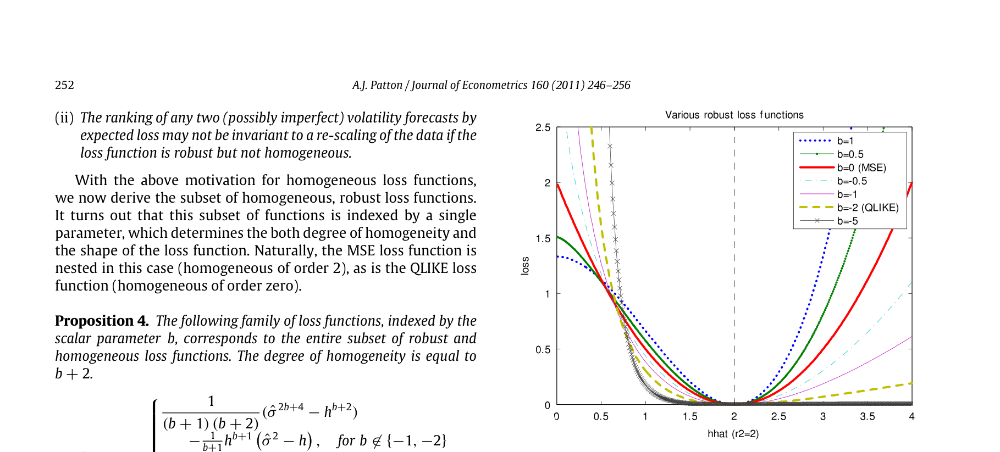
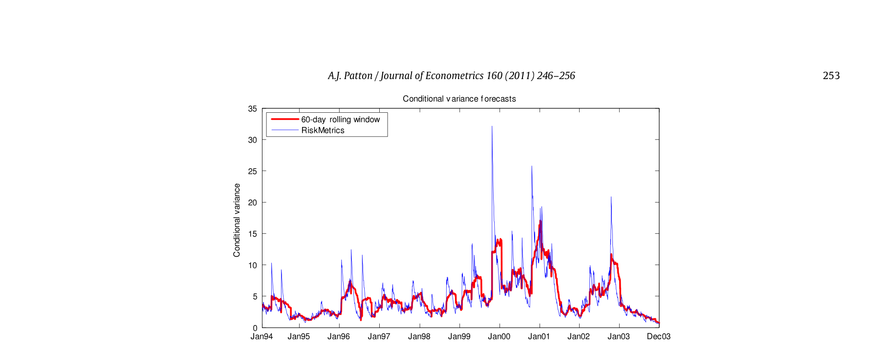

# Volatility forecast comparison using imperfect volatility proxies

## Metadata

- **Source File:** `1-s2.0-S030440761000076X-main.pdf`
- **Authors:** Andrew J. Patton
- **Year:** 2011
- **DOI:** 10.1016/j.jeconom.2010.03.034

## Abstract

Not found.

## Main Text

Journal of Econometrics 160 (2011) 246–256
Contents lists available at ScienceDirect
Journal of Econometrics
journal homepage: www.elsevier.com/locate/jeconom
✩
Volatility forecast comparison using imperfect volatility proxies
Andrew J. Patton ∗
Department of Economics, Duke University, USA
Oxford-Man Institute of Quantitative Finance, University of Oxford, UK
a b s t r a c t
a r t i c l e
i n f o
Article history:
The use of a conditionally unbiased, but imperfect, volatility proxy can lead to undesirable outcomes in
Available online 6 March 2010
standard methods for comparing conditional variance forecasts. We motivate our study with analytical
results on the distortions caused by some widely used loss functions, when used with standard volatility
JEL classification:
proxies such as squared returns, the intra-daily range or realised volatility. We then derive necessary and
C53
sufficient conditions on the functional form of the loss function for the ranking of competing volatility
C52
forecasts to be robust to the presence of noise in the volatility proxy, and derive some useful special cases
C22
of this class of ‘‘robust’’ loss functions. The methods are illustrated with an application to the volatility of
returns on IBM over the period 1993 to 2003.
Keywords:
© 2010 Published by Elsevier B.V.
Forecast evaluation
Forecast comparison
Loss functions
Realised variance
Range
conditional variance of the asset over the period t.2 Many of the
1. Introduction
standard methods for forecast evaluation and comparison, such
as the Mincer and Zarnowitz (1969) regression and the Diebold
Many forecasting problems in economics and finance involve
and Mariano (1995) and West (1996) tests, can be shown to be
a variable of interest that is unobservable, even ex post. The
applicable when such a conditionally unbiased proxy is used, see
most prominent example of such a problem is the forecasting
Hansen and Lunde (2006) for example. However, it is not true
of volatility for use in financial decision making. Other problems
that using a conditionally unbiased proxy will always lead to the
include forecasting the true rates of inflation, GDP growth or
same outcome as if the true latent variable were used: Andersen
unemployment (not simply the announced rates); forecasting
and Bollerslev (1998) and Andersen et al. (2005), amongst others,
trade intensities; and forecasting default probabilities or ‘crash’
study the reduction in finite-sample power of tests based on noisy
probabilities. While evaluating and comparing economic forecasts
volatility proxies; we focus, like Hansen and Lunde (2006), on
is a well-studied problem, dating back at least to Cowles (1933),
distortions in the rankings of competing forecasts that can arise
if the variable of interest is latent then the problem of forecast
when using a noisy volatility proxy in some commonly used tests
evaluation and comparison becomes more complicated.1
for forecast comparison.
This complication can be resolved, at least partly, if an unbiased
For example, in the volatility forecasting literature numerous
estimator of the latent variable of interest is available. In volatility
authors have expressed concern that a few extreme observations
forecasting, for example, the squared return on an asset over
may have an unduly large impact on the outcomes of forecast
the period t (assuming a zero mean return) can be interpreted
evaluation and comparison tests, see Bollerslev and Ghysels
as a conditionally unbiased estimator of the true unobserved
(1994), Andersen et al. (1999) and Poon and Granger (2003)
amongst others. One common response to this concern is to
employ forecast loss functions that are ‘‘less sensitive’’ to large
✩Matlab code used in this paper is available from
observations than the usual squared forecast error loss function,
such as absolute error or proportional error loss functions. In
http://econ.duke.edu/~ap172/code.html.
∗Corresponding address: Department of Economics, Duke University, 213 Social
Sciences Building, Box 90097, Durham NC 27708-0097, USA.
E-mail address: andrew.patton@duke.edu.
2 The high/low range and realised volatility, see Parkinson (1980) and Andersen
1 For recent surveys of the forecast evaluation literature see Clements (2005) and
et al. (2003) for example, have also been used as volatility proxies. These are
West (2006). For recent surveys of the volatility forecasting literature, see Andersen
discussed in detail below.
et al. (2006), Poon and Granger (2003) and Shephard (2005).
0304-4076/$ – see front matter © 2010 Published by Elsevier B.V.
doi:10.1016/j.jeconom.2010.03.034

247
this paper we show analytically that such approaches can lead
some choices previously used in the literature. However we show
that the class of ‘‘robust’’ loss functions still admits a wide variety of
to incorrect inferences and the selection of inferior forecasts over
loss functions, allowing much flexibility in representing volatility
better forecasts.
forecast users’ preferences.
We focus on volatility forecasting as a specific case of the
One practical implication of this paper is that the stated goal
more general problem of latent variable forecasting. In Section 5
of forecasting the conditional variance is not consistent with the
we discuss the extension of our results to other latent variable
use of some loss functions when an imperfect volatility proxy
forecasting problems. Our research builds on work by Andersen
is employed. However, these loss functions are not inherently
and Bollerslev (1998), Meddahi (2001) and Hansen and Lunde
invalid or inappropriate: if the forecast user’s preferences are
(2006), who were among the first to analyse the problems
indeed described by an ‘‘non-robust’’ loss function, then this simply
introduced by the presence of noise in a volatility proxy. This
implies that the object of interest to that forecast user is not the
paper extends the existing literature in two important directions,
conditional variance but rather some other quantity.4 In academic
discussed below.
research the preferences of the end-user of the forecast are often
Firstly, we derive explicit analytical results for the distortions
unknown, and a common response to this to is to select forecasts
that may arise when some common loss functions are employed,
based on their average distance, somehow measured, to the true
considering the three most commonly used volatility proxies: the
latent conditional variance. In such cases, the methods outlined in
daily squared return, the intra-daily range and a realised variance
this paper can be applied to identify the forecast that is closest to
estimator. We show that these distortions can be large, even for
the true conditional variance by using imperfect volatility proxy
favourable scenarios (such as Gaussianity). Further, we show that
and a ‘‘robust’’ loss function.
the distortions vary greatly with the choice of loss function, thus
The remainder of this paper is as follows. In Section 2 we
providing a theoretical explanation for the widespread finding of
analytically consider volatility forecast comparison tests using an
conflicting rankings of volatility forecasts when ‘‘non-robust’’ loss
imperfect volatility proxy, showing the problems that arise when
functions (defined precisely in Section 2) are used in applied work,
using some common loss functions. We initially consider using
see Lamoureux and Lastrapes (1993), Hamilton and Susmel (1994),
squared daily returns as the proxy, and then consider using the
Bollerslev and Ghysels (1994) and Hansen and Lunde (2005),
range and realised variance. In Section 3 we provide necessary and
amongst many others.3
sufficient conditions on the functional form of a loss function for
Secondly, we provide necessary and sufficient conditions on the
the ranking of competing volatility forecasts to be robust to the
presence of noise in the volatility proxy, and derive some useful
functional form of the loss function to ensure that the ranking of
special cases of this class of robust loss functions. One of these
various forecasts is preserved when using a noisy volatility proxy.
special cases is a parametric family of loss functions that nests two
These conditions are related to those of Gourieroux et al. (1984)
of the most widely used loss functions in the literature, namely the
for quasi-maximum likelihood estimation. Interestingly, we find
MSE and QLIKE loss functions (defined in Eqs. (5) and (6) below).
that there are an infinite number of loss functions that satisfy
In Section 4 we present an empirical illustration using two widely
these conditions, and that these loss functions differ in meaningful
used volatility forecasting methods, and in Section 5 we conclude
ways (such as the penalty applied to over-prediction versus underand suggest extensions. All proofs and derivations are provided in
prediction). Thus our class of ‘‘robust’’ loss functions is not simply
Appendix.
the quadratic loss function or minor variations thereof.
The canonical problem in point forecasting is to find the
1.1. Notation
forecast that minimises the expected loss, conditional on time t
information. That is,
Let rt be the variable whose conditional variance is of interest,
ˆY ∗
usually a daily or monthly asset return in the volatility forecastYt+h, ˆy
t+h,t ≡arg min
|Ft




E
L
(1)
ing literature. The information set used in defining the conditional
ˆy∈Y
variance of interest is denoted Ft−1, which is assumed to contain
where Yt+h is the variable of interest, L is the forecast user’s loss
σ(rt−j, j ≥1), but may also include other variables and/or varifunction, Y is the set of possible forecasts, and Ft is the time t
ables measured at a higher frequency than rt (such as intra-daily
information set. Starting with the assumption that the forecast
returns). Denote V[rt|Ft−1] ≡Vt−1[rt] ≡σ 2
t . We will assume
user is interested in the conditional variance, we effectively take
throughout that E[rt|Ft−1] ≡Et−1[rt] = 0, and so σ 2
t = Et−1[r2
t ].
the solution of the optimisation problem above (the conditional
Let εt ≡rt/σt denote the ‘standardised return’. Let a forecast of
variance) as given, and consider the loss functions that will
the conditional variance of rt be denoted ht, or hi,t if there is more
generate the desired solution. This approach is unusual in the
than one forecast under analysis. We will take forecasts as ‘‘primieconomic forecasting literature: the more common approach is
tive’’, and not consider the specific models and estimators that may
to take the forecast user’s loss function as given and derive the
have generated the forecasts. The loss function of the forecast user
is L : R+ × H →R+, where the first argument of L is σ 2
optimal forecast for that loss function; related papers here are
t or some
Granger (1969), Engle (1993), Christoffersen and Diebold (1997),
t , and the second is ht. R+ and R++ denote
t , denoted ˆσ 2
proxy for σ 2
Christoffersen and Jacobs (2004) and Patton and Timmermann
the non-negative and positive parts of the real line respectively,
and H is a compact subset of R++. Commonly used volatility prox-
(2007), amongst others. The fact that we know the forecast user
desires a variance forecast places limits on the class of loss
ies are the squared return, r2
t , realised volatility, RVt, and the range,
functions that may be used for volatility comparison, ruling out
RGt. Optimal forecasts for a given loss function and proxy are denoted h∗
t and are defined as:
h∗
ˆσ 2
t ≡arg min
|Ft−1




t , h
.
E
L
(2)
3 All of the results in this paper apply directly to the problem of forecasting
h∈H
integrated variance (IV), which Andersen et al. (2010), amongst others, argue is
a more ‘‘relevant’’ notion of variability. We focus on the problem of conditional
variance forecasting due to its prevalence in applied work in the past two decades.
4 For example, the utility of realised returns on a portfolio formed using a
If we take expected IV rather than the conditional variance as the latent object
of interest, then we only require that an unbiased realised variance estimator
volatility forecast, or the profits obtained from an option trading strategy based on a
is available for the results to go through. In the presence of jumps in the price
volatility forecast, see West et al. (1993) and Engle et al. (1993) for example, define
process, quadratic variation (QV) is a more appropriate measure of risk, and a similar
economically meaningful loss functions, even though the optimal forecasts under
extension is possible.
those loss functions will not generally be the true conditional variance.

248
2. Volatility forecast comparison using an imperfect volatility
level of expected loss that would be obtained using the true latent
proxy
variable of interest.
It follows directly from the definition of a robust loss function
We consider volatility forecast comparisons based on expected
that the true conditional variance is the optimal forecast (we
loss, or distance to the true conditional variance. These comparformally show this in the proof of Proposition 1), and thus a
isons can be implemented in finite samples using the tests of
necessary condition for a loss function to be robust to noise is that
Diebold and Mariano (1995) and West (1996), (henceforth DMW).
the true conditional variance is the optimal forecast. In this section
If we define ui,t ≡L(σ 2
t , hi,t), where L is the forecast user’s loss
we determine whether this condition holds for some common loss
=
u1,t −u2,t, then a DMW test of equal
function, and let dt
functions, and analytically characterise the distortion for those
predictive accuracy can be conducted as a simple Wald test that
cases where it is violated.
E[dt] = 0.5
A common response to the concern that a few extreme
Of primary interest is whether the feasible ranking of two
observations drive the results of volatility forecast comparison
forecasts obtained using an imperfect volatility proxy is the
studies is to employ alternative measures of forecast accuracy
same as the infeasible ranking that would be obtained using the
to the usual MSE loss function, see Pagan and Schwert (1990),
unobservable true conditional variance. In such a case we are able
Bollerslev and Ghysels (1994); Bollerslev et al. (1994), Diebold
to compare average forecast accuracy even though the variable of
and Lopez (1996), Andersen et al. (1999), Poon and Granger
interest is unobservable. We define loss functions that yield such
(2003) and Hansen and Lunde (2005), for example. A collection
an equivalence as ‘‘robust’’:
of loss functions employed in the literature on volatility forecast
evaluation is presented below.8 In the next two sub-sections we
Definition 1. A loss function, L, is ‘‘robust’’ if the ranking of any two
will study the properties of these loss functions and show that for
(possibly imperfect) volatility forecasts, h1t and h2t, by expected
almost all choices of volatility proxy most of these loss functions
loss is the same whether the ranking is done using the true
are not robust and can lead to incorrect rankings of volatility
conditional variance, σ 2
t , or some conditionally unbiased volatility
forecasts.
proxy, ˆσ 2
t . That is,
ˆσ 2 −h
2
ˆσ 2, h
MSE : L
=



(5)
σ 2
σ 2






⋛E
t , h1t
t , h2t
E
L
L
= log h + ˆσ 2
(3)
ˆσ 2, h
QLIKE : L


(6)
ˆσ 2
ˆσ 2
⇔E






⋛E
t , h1t
t , h2t
L
L
h
log ˆσ 2 −log h
for any ˆσ 2
t s.t. E[ ˆσ 2
t |Ft−1] = σ 2
2
t .
ˆσ 2, h
MSE-LOG : L
=



(7)
√
Meddahi (2001) showed that the ranking of forecasts on the
2

ˆσ 2, h
MSE-SD : L
=
ˆσ −


basis of the R2 from the Mincer–Zarnowitz regression:
h
(8)
ˆσ 2
t = β0 + β1hit + eit
2
ˆσ 2
(4)
ˆσ 2, h
MSE-prop : L
=
h −1


(9)
is robust to noise in ˆσ 2
t . Hansen and Lunde (2006) showed that
the R2 from a regression of log( ˆσ 2
ˆσ 2 −h
t ) on a constant and log(ht) is

ˆσ 2, h
MAE : L
=


(10)
not robust to noise, and showed more generally that a sufficient
log ˆσ 2 −log h

condition for a loss function to be robust is that ∂2L(σ 2, h)/∂(σ 2)2
ˆσ 2, h
MAE-LOG : L
=


(11)
does not depend on h. In Section 3 we generalise this result by
√
ˆσ −

ˆσ 2, h
MAE-SD : L
=


providing necessary and sufficient conditions for a loss function to
h
(12)
be robust.6,7
ˆσ 2
.

It is worth noting that although the ranking obtained from
ˆσ 2, h
h −1
MAE-prop : L
=


(13)
a robust loss function will be invariant to noise in the proxy,
the actual level of expected loss obtained using a proxy will
be larger than that which would be obtained when using the
true conditional variance. This point was compellingly presented
2.1. Using squared returns as a volatility proxy
in Andersen and Bollerslev (1998) and Andersen et al. (2004).
Andersen et al. (2005) provide a method to estimate the distortion
In this section we will focus on the use of daily squared
in the level of expected loss and thereby obtain an estimator of the
returns for volatility forecast evaluation, and in Section 2.2 we
will examine the use of realised volatility and the range. We will
derive our results under three assumptions for the conditional
distribution of daily returns:
5 The key difference between the approaches of Diebold and Mariano (1995)

0, σ 2
and West (1996) is that the latter explicitly allows for forecasts that are based


Ft
t

on estimated parameters, whereas the null of equal predictive accuracy is based
rt|Ft−1 ∼
0, σ 2


t , ν
Student’s t
on population parameters, see West (2006). The problems we identify below arise
0, σ 2


N

even in the absence of estimation error in the forecasts, thus our treatment of the
t
forecasts as primitive, and so for our purposes these two approaches coincide.
where Ft(0, σ 2
6 Our use of the adjective ‘‘robust’’ is related, though not equivalent, to its use in
t ) is some unspecified distribution with mean
estimation theory, where it applies to estimators that insensitive/less sensitive to
zero and variance σ 2
t , and Student’s t(0, σ 2
t , ν) is a Student’s t
the presence of outliers in the data, see Huber (1981) for example. A ‘‘robust’’ loss
distribution with mean zero, variance σ 2
t and ν degrees of freedom.
function, in the sense of Definition 1, will generally not be robust to the presence of
outliers.
7 In recent work Giacomini and White (2006) propose ranking forecasts by
expected loss conditional on some information set Gt, rather than by unconditional
8 Some of these loss functions are called different names by different
expected loss as in Definition 1. The numerical examples provided below will differ
in this more general case, of course, however the theoretical results in this paper go
authors: MSE-prop is also known as ‘‘heteroskedasticity-adjusted MSE (HMSE)’’;
through if Gt ⊆Ft−1, which is true for all of the examples considered by Giacomini
MAE-prop is also known as ‘‘mean absolute percentage error (MAPE)’’ or as
and White (2006).
‘‘heteroskedasticity-adjusted MAE (HMAE)’’.

249
In all cases it is clear that Et−1[r2
t ] = σ 2
t , and so the squared daily
Ghysels (1994) and Hansen and Lunde (2005), amongst many
others, use some or all of the nine loss functions considered in
return is a valid volatility proxy.
Table 1 and find that the best-performing volatility model changes
It is trivial to show that the MSE loss function generates an optimal forecast equal to the conditional variance: h∗
t = Et−1[r2
t ] =
with the choice of loss function. Given that, for example, the
MSE-prop loss function leads to an optimal forecast that is biased
σ 2
t , and thus satisfies the necessary condition for robustness. Furupwards by at least a factor of three, while the MAE loss function
ther, the MSE loss function also satisfies the sufficient condition
leads to an optimal forecast that is biased downwards by at least a
of Hansen and Lunde (2006), and thus MSE is a ‘‘robust’’ loss funcfactor of two, it is no surprise that different rankings of volatility
tion. Another commonly used loss function is the MSE loss function
forecasts are found.
on standard deviations rather than variances, MSE-SD, see Eq. (8).
The motivation for this loss function is that taking square root of
2.2. Using better volatility proxies
the two arguments of the squared-error loss function shrinks the
larger values towards zero, reducing the impact of the most exIt has long been known that squared returns are a rather
treme values of rt. However it also leads to an incorrect volatility
noisy proxy for the true conditional variance. One alternative
forecast being selected as optimal:
volatility proxy that has gained much attention recently is ‘‘realised
√
[
2]
volatility’’, see Andersen et al. (2001, 2003), and Barndorff-Nielsen
h∗
|rt| −
t ≡arg min
Et−1
h
and Shephard (2002, 2004). Another commonly used alternative
h∈H
to squared returns is the intra-daily range. It is well known that
√
2] 
FOC 0 = ∂
[
if the log stock price follows a Brownian motion then both of
|rt| −
Et−1
h
∂h
these estimators are unbiased and more efficient than the squared
h=h∗
t
return. In this section we obtain the rate at which the distortion in
so h∗
t = (Et−1 [|rt|])2
(14)
the ranking of alternative forecasts disappears when using realised
t (Et−1 [|εt|])2
= σ 2
volatility as the proxy, as the sampling frequency increases, for a
simple data generating process (DGP).
2
ν −2
ν −1

ν


Assume that there are m equally-spaced observations per trade
σ 2
t ,
0
0

day, and let ri,m,t denote the ith intra-daily return on day t. While
π
2
2
=
(15)
recent work on realised volatility would enable us to consider a
if rt|Ft−1 ∼Student’s t


0, σ 2
t , ν
, ν > 2
quite general class of DGPs, in order to obtain analytical results

2
if rt|Ft−1 ∼N
π σ 2
t ≈0.64σ 2
0, σ 2


t ,
.
for problems involving the range as a volatility proxy we consider
t
only a simple DGP: zero mean return, no jumps, and constant
conditional volatility within a trade day.10 Patton and Sheppard
This distortion is present even under Gaussianity, and excess kurtosis in asset returns exacerbates the distortion: For example, if
(2009) present the corresponding results for a range of more
realistic DGPs via simulation.11 Let
returns follow the Student’s t distribution with six degrees of freedom then the coefficient on σ 2
t in the above expression is 0.56.
rt = d log Pt = σtdWt
(16)
As mentioned in the Introduction, if the forecast user’s loss
στ = σt
∀τ ∈(t −1, t]
(17)
function truly is the square of the difference between the absolute
return and the square root of the forecast, then the ‘‘distortion’’ in
∫i/m
∫i/m
ri,m,t ≡
rτ dτ = σt
the optimal forecast above is desirable, as this is the forecast that
dWτ
(18)
(i−1)/m
(i−1)/m
minimises his/her expected loss. However, if the goal is to find
the forecast that is closest to the true conditional variance, then
0, σ 2


m
t
i=1 ∼i.i.d. N

.
so
ri,m,t
(19)
this distortion in the optimal forecast can lead to an incorrect
m
ranking of competing forecasts.9 Thus the MSE-SD loss function is
The ‘‘realised volatility’’ or ‘‘realised variance’’ is defined as:
not consistent with the goal of ranking volatility forecasts by their
distance to the true conditional variance when using the squared
m
RV(m)
−
r2
≡
return as the volatility proxy: either the proxy has to be re-scaled
i,m,t.
t
by a term that depends critically on the underlying conditional
i=1
distribution of returns, or, more simply, a different loss function
Realised variance, like the daily squared return (which is obtained
must be chosen.
in the above framework by setting m = 1), is a conditionally unbiThe corresponding calculations for the remaining loss functions
ased estimator of the daily conditional variance. Its main advantage
in Eqs. (5) to (13) are provided in Patton (2006), and the results
is that it is more efficient estimator than the daily squared return:
are summarised in Table 1. This table shows that the degree of
for this DGP it can be shown that Et−1[(r2
t −σ 2
t )2] = 2σ 4
t while
distortion in the optimal forecast according to some of the loss
→p σ 2
Et−1[(RV(m)
t /m. Thus RV(m)
−σ 2
t )2] = 2σ 4
t as m →∞,
t
t
functions used in the literature can be substantial. Under normality
under these assumptions, and we find in this case that σ 2
t is obthe optimal forecast under these loss functions ranges from about
servable. As expected, all distortions vanish in this case.
one quarter of the true conditional variance to three times the true
conditional variance. If returns exhibit excess conditional kurtosis
then the range of optimal forecasts from these loss functions is
10 Analytical and empirical results on the range and ‘‘realised range’’ under more
even wider.
Table 1 provides a theoretical explanation for the widespread
flexible DGPs are presented in two recent papers by Christensen and Podolskij
(2007) and Martens and van Dijk (2007).
finding of conflicting rankings of volatility forecasts when non11 When the DGP is specified to be log-normal or GARCH stochastic volatility
robust loss functions are used in applied work. Lamoureux and
diffusions, Patton and Sheppard (2009) find results very similar to those obtained
Lastrapes (1993), Hamilton and Susmel (1994), Bollerslev and
for the case below. Using the same parameterisations as those in the simulations
of Gonçalves and Meddahi (2009), slightly larger biases from the non-robust loss
functions are found, but they generally differ from those in Table 2 only in the
second decimal place. In contrast, the biases are found to be much larger under
9 This distortion remains if the target is instead the conditional standard
the two-factor stochastic volatility diffusion considered by Gonçalves and Meddahi
deviation, as the absolute return is not an unbiased proxy for that quantity.
(2009).

250
Table 1
Optimal forecasts under various loss functions.
Loss function
Distribution of daily returns
Ft(0, σ 2
Student’s t(0, σ 2
t )
t , ν)
ν = 6
ν = 10
ν →∞
ν
σ 2
σ 2
σ 2
σ 2
σ 2
MSE
t
t
t
t
t
σ 2
σ 2
σ 2
σ 2
σ 2
QLIKE
t
t
t
t
t
ν
−Ψ
(ν −2)σ 2
exp{Et−1[log ε2
t ]}σ 2
1



0.22σ 2
0.25σ 2
0.28σ 2
Ψ
MSE-LOG
exp
t
t
t
t
t
2
2
2 σ 2
ν−2
ν−1
ν
(Et−1[|εt|])2σ 2


0.56σ 2
0.60σ 2
0.64σ 2
/0
0
MSE-SD
t
t
t
t
t
π
2
2
3 ν−2
Kurtosist−1 [rt]σ 2
ν−4 σ 2
6.00σ 2
4.00σ 2
3.00σ 2
MSE-prop
t
t
t
t
t
ν−2
Mediant−1 [r2
Median [F1,ν]σ 2
t ]
0.34σ 2
0.39σ 2
0.45σ 2
MAE
t
t
t
t
ν
ν−2
Median [F1,ν]σ 2
Mediant−1 [r2
t ]
0.34σ 2
0.39σ 2
0.45σ 2
MAE-LOG
t
t
t
t
ν
ν−2
Median [F1,ν]σ 2
Mediant−1 [r2
t ]
0.34σ 2
0.39σ 2
0.45σ 2
MAE-SD
t
t
t
t
ν


2.36 + 1.00
+ 7.78
MAE-propa
σ 2
2.73σ 2
2.55σ 2
2.36σ 2
n/a
t
t
t
t
ν
ν2
Notes: This table presents the forecast that minimises the conditional expected loss when the squared return is used as a volatility proxy. That is, h∗
t minimises Et−1[L(r2
t , h)],
for various loss functions L. The first column presents the solutions when returns have an arbitrary conditional distribution rt|Ft−1 ∼Ft with mean zero and conditional
variance σ 2
t , the second, third, and fourth columns present results with returns have a Student’s t distribution with mean zero, variance σ 2
t and degrees of freedom ν, and
the final column presents the solutions when returns are conditionally normally distributed. 0 is the gamma function and Ψ is the digamma function.
a The expressions given for MAE-prop are based on a numerical approximation, see Patton (2006) for details.
≈√
[
]
1
The range, or the high/low, estimator has been used in finance
m −
4√
χ 2
E
by a Taylor series approximation
m
for many years, see Garman and Klass (1980) and Parkinson (1980).
m
The intra-daily log range is defined as:


1
1
so h∗
t ≈σ 2
1 −
2m +
t
RGt ≡max
log Pτ −min
t −1 < τ ≤t.
16m2
log Pτ,
(20)
τ
τ

0.5625 · σ 2
for m = 1
t

≈
0.9619 · σ 2
for m = 13
Under the dynamics in Eq. (16) Feller (1951) presented the density
t
of RGt, and Parkinson (1980) presented a formula for obtaining
0.9936 · σ 2
for m = 78.

t
moments of the range, which enable us to compute:
The results for the MSE-SD loss function using realised volatility
RG2
= 4 log (2) · σ 2
t ≈2.7726σ 2


show that reducing the noise in the volatility proxy improves
t .
Et−1
(21)
t
the optimal forecast,12 consistent with Hansen and Lunde (2006).
Details on the distributional properties of the range under this DGP
Using the range we find that
are presented in Patton (2006). The above expression shows that
2 =
2
squared range is not a conditionally unbiased estimator of σ 2
h∗
RG∗
t ; we
π log 2σ 2
t ≈0.9184σ 2
t =


Et−1
t
t
will thus focus below on the adjusted range:
and so the distortion from using the range is approximately
RGt
RG∗
t ≡
log (2) ≈0.6006RGt
2√
equal to that incurred when using a realised volatility constructed
(22)
using 6 intra-daily observations. Calculations for the remaining
loss functions are collected in Patton (2006), and the results are
which, when squared, is an unbiased proxy for the conditional varisummarised in Table 2.
ance. Note that the adjustment factor depends critically on the
The results in Table 2 confirm that as the proxy used to measure
assumed DGP, which is a potential drawback of the range as a
the true conditional variance gets more efficient the degree of
volatility proxy. Using the results of Parkinson (1980) it is simple to
determine that MSEt−1[RG∗2
distortion decreases for all loss functions. Using half-hour returns
t ] ≈
0.4073σ 4
t , which is approxi-
(13 intra-daily observations) or the intra-daily range still leaves
mately one-fifth of the MSE of the daily squared return.
substantial distortions in the optimal forecasts, but using 5-min
We now determine the optimal forecasts obtained using the
returns (78 intra-daily observations) eliminates almost all of the
t = RV(m)
various loss functions considered above, when ˆσ 2
or ˆσ 2
t =
t
bias, at least in this simple framework. While high frequency data
RG∗2
is used as a proxy for the conditional variance rather than r2
t .
is available and reliable for some assets (the most liquid assets on
t
We initially leave m unspecified for the realised volatility proxy,
well-developed exchanges), for most assets it is not possible to
and then specialise to three cases: m = 1, 13 and 78, correspondobtain reliable high-frequency data, and thus the impact of noise
ing to the use of daily, half-hourly and 5-min returns, on a stock
in the volatility proxy cannot be ignored.
listed on the New York Stock Exchange (NYSE).
For MSE and QLIKE the optimal forecast is simply the
3. A class of robust loss functions
conditional mean of ˆσ 2
t , which equals the conditional variance, as
RV(m)
and RG∗2
are both conditionally unbiased. The MSE-SD loss
In the previous section we showed that amongst nine loss
t
t
function yields (Et−1[ ˆσt])2 as the optimal forecast. Under the setfunctions commonly used to compare volatility forecasts, only the
MSE and the QLIKE loss functions lead to h∗
t = Et−1[ ˆσ 2
t ] = σ 2
up above,
t ,
which is a necessary condition for a loss function to be robust
m
m
t,i = σ 2
RV(m)
−
−
t
r2
ε2
≡
t,i
t
m
i=1
i=1
RV(m)
so mσ −2
∼χ 2
12 Note that the result for m = 1 is different to that obtained in Section 2, which
t
t
m
was h∗
t =
t ≈0.6366σ 2
t . This is because for m = 1 we can obtain the expression
2
π σ 2
]2
t = σ 2

[
so h∗
exactly, using results for the normal distribution, whereas for arbitrary m we relied
t
χ 2
E
m
on a second-order Taylor series approximation.
m

251
Table 2
Optimal forecasts under various loss functions, using realised volatility and range.
Loss function
Volatility proxy
Range
Realised volatility
m = 1
m = 13
m = 78
m →∞
Arbitrary m
σ 2
σ 2
σ 2
σ 2
σ 2
σ 2
MSE
t
t
t
t
t
t
σ 2
σ 2
σ 2
σ 2
σ 2
σ 2
QLIKE
t
t
t
t
t
t
e−1.2741/mσ 2
MSE-LOGa
0.85σ 2
0.28σ 2
0.91σ 2
0.98σ 2
σ 2
t
t
t
t
t
t
2


1
σ 2
0.56σ 2
0.96σ 2
0.99σ 2
σ 2
0.92σ 2
χ 2
E
MSE-SD
m
t
t
t
t
t
t
m
1 + 2


σ 2
3.00σ 2
1.15σ 2
1.03σ 2
σ 2
1.41σ 2
MSE-prop
t
t
t
t
t
t
m
m Median [χ 2
m]σ 2
1
0.45σ 2
0.95σ 2
0.99σ 2
σ 2
0.83σ 2
MAE
t
t
t
t
t
t
m Median [χ 2
m]σ 2
1
0.83σ 2
0.45σ 2
0.95σ 2
0.99σ 2
σ 2
MAE-LOG
t
t
t
t
t
t
m Median [χ 2
m]σ 2
1
0.83σ 2
0.45σ 2
0.95σ 2
0.99σ 2
σ 2
MAE-SD
t
t
t
t
t
t
1 + 1.3624


MAE-propa
σ 2
1.19σ 2
2.36σ 2
1.10σ 2
1.02σ 2
σ 2
t
t
t
t
t
t
m
Notes: This table presents the forecast that minimises the conditional expected loss when the range or realised volatility is used as a volatility proxy. That is, h∗
t minimises
t = RG∗2
Et−1[L( ˆσ 2
t , h)], for ˆσ 2
or ˆσ 2
t = RVt, for various loss functions L. In all cases returns are assumed to be generated as a zero mean Brownian motion with constant
t
volatility within each trade day and no jumps. The cases of m = 1, 13, 78 correspond to the use of daily squared returns, realised variance with 30-min returns and realised
variance with 5-min returns respectively. The case that m →∞corresponds to the case where the conditional variance is observable ex post without error.
a For the MSE-LOG and MAE-prop loss functions we used simulations, numerical integration and numerical optimisation to obtain the expressions given. Details on the
computation of the figures in this table are given in Patton (2006).
to noise in the volatility proxy. The following proposition is the
Proposition 2. (i) The ‘‘MSE’’ loss function is the only robust loss
main theoretical contribution of the paper; it provides a necessary
function satisfying assumptions A1–A5 that depends solely on the
forecast error, ˆσ 2 −h.
and sufficient class of robust loss functions for volatility forecast
comparison, which are related to the class of linear-exponential
(ii) The ‘‘QLIKE’’ loss function is the only robust loss function satisfying
densities of Gourieroux et al. (1984), and to the work of Gourieroux
assumptions A1–A5 that depends solely on the standardised
forecast error, ˆσ 2/h.
et al. (1987). We will show below that this class contains an infinite
number of loss functions, and allows for asymmetric penalties
The standardised forecast error will be centred approximately
to be applied to over- versus under-predictions, as well as for a
around 1 (if h is somewhat accurate) and, more interestingly,
symmetric penalty. We make the following assumptions:
the conditional variance of the standardised forecast error will
A1: Et−1[ ˆσ 2
t ] = σ 2
t for all t.
be approximately 2 (under Gaussianity) regardless of the level
t |Ft−1 ∼Ft ∈˜F, the set of all absolutely continuous disA2: ˆσ 2
of volatility of returns. Thus the average QLIKE loss will be less
tribution functions on R+.
affected (generally) by the most extreme observations in the
A3: L is twice continuously differentiable with respect to h and
sample. The MSE loss, on the other hand, depends on the usual
ˆσ 2, and has a unique minimum at ˆσ 2 = h.
forecast error, ˆσ 2 −h, which will be centred approximately around
A4: There exists some h∗
t ∈int(H) such that h∗
t = Et−1[ ˆσ 2
t ],
zero, but will have variance that is proportional to the square of the
where H is a compact subset of R++.
variance of returns, i.e., σ 4. As noted by several previous authors,
A5: L and Ft are such that: (a) Et−1[L( ˆσ 2
t , h)] < ∞for some h ∈
this implies that MSE is sensitive to extreme observations and the
level of volatility of returns.
H; (b) |Et−1[∂L( ˆσ 2
t , h)/∂h|h=σ 2
t ]| < ∞; and (c) |Et−1[∂2L( ˆσ 2
t , h)/
In most economic and financial applications, the choice of units
t ]| < ∞, for all t.
∂h2|h=σ 2
of measurement is arbitrary, e.g., measuring prices in dollars versus
cents, or measuring returns in percentages versus decimals. Given
this, it is useful to consider the impact of a simple change in
Proposition 1. Let assumptions A1 to A5 hold. Then a loss function L
units on the ranking of two competing forecasts by expected loss.
is robust, in the sense of Definition 1, if and only if it takes the following
The class of loss functions presented in Proposition 1 guarantees
form:
that the true conditional variance will be chosen (subject to
ˆσ 2 −h
= ˜C (h) + B
ˆσ 2, h
ˆσ 2
+ C (h)





sampling variation) over any other forecast regardless of the choice
L
(23)
units. However it does not guarantee that the ranking of two
where B and C are twice continuously differentiable, C is a strictly
imperfect forecasts will be invariant to the choice of units. The
decreasing function on H, and ˜C is the anti-derivative of C.
following proposition shows that by using a homogeneous robust
loss function, the ranking of any two (possibly imperfect) forecasts
is invariant to a re-scaling of the data. It further provides an
Remark 1. If we normalise the loss function to yield zero loss
when ˆσ 2 = h, then B( ˆσ 2) = −˜C( ˆσ 2).
example where the ranking can be reversed simply with a rescaling of the data if a non-homogeneous robust loss function is
used.
Remark 2. Up to additive and multiplicative constants, MSE loss is
obtained by setting C(z) = −z, ˜C(z) = −z2/2 and B(z) = z2/2,
Proposition 3. Recall that a loss function L is homogeneous of order
and QLIKE is obtained by setting C(z) = 1/z, ˜C(z) = log(z) and
k if
B(z) = 0.
a ˆσ 2, ah
= akL
ˆσ 2, h
∀a > 0 for some k.




L
Given the widespread interest in economics and finance
Then:
in loss functions that depend only on the forecast error or
(i) The ranking of any two (possibly imperfect) volatility forecasts
the standardised forecast error, we present below a somewhat
by expected loss is invariant to a re-scaling of the data if the loss
surprising result on the subset of robust loss functions that satisfy
function is homogeneous.
one of these restrictions.

252
(ii) The ranking of any two (possibly imperfect) volatility forecasts by
expected loss may not be invariant to a re-scaling of the data if the
loss function is robust but not homogeneous.
With the above motivation for homogeneous loss functions,
we now derive the subset of homogeneous, robust loss functions.
It turns out that this subset of functions is indexed by a single
parameter, which determines the both degree of homogeneity and
the shape of the loss function. Naturally, the MSE loss function is
nested in this case (homogeneous of order 2), as is the QLIKE loss
function (homogeneous of order zero).
Proposition 4. The following family of loss functions, indexed by the
scalar parameter b, corresponds to the entire subset of robust and
homogeneous loss functions. The degree of homogeneity is equal to
b + 2.
1
(b + 1) (b + 2)( ˆσ 2b+4 −hb+2)


ˆσ 2 −h
b+1hb+1 
for b ̸∈{−1, −2}
−
1

,
ˆσ 2, h; b
=


L
(24)
h −ˆσ 2 + ˆσ 2 log ˆσ 2
Fig. 1. Loss functions for various choices of b. True σ 2 = 2 in this example, with
for b = −1
h ,

the volatility forecast ranging between 0 and 4. b = 0 and b = −2 correspond to
ˆσ 2
h −log ˆσ 2
the MSE and QLIKE loss functions respectively.
h −1,
for b = −2.
The MSE loss function is obtained when b = 0 and the QLIKE
loss function is obtained when b = −2, up to additive and multiplicative constants. In Fig. 1 we present the above class of functions for various values of b, ranging from 1 to −5, and including the MSE and QLIKE cases. This figure shows that this family of
loss functions can take a wide variety of shapes, ranging from symmetric (b = 0, corresponding to MSE) to asymmetric, with heavier penalty either on under-prediction (b < 0) or over-prediction
(b > 0). Fig. 2 plots the ratio of losses incurred for negative forecast errors to those incurred for positive forecast errors, to make
clearer the form of asymmetries in these loss functions. Other considerations when choosing a loss function from the class in Eq. (24)
include the moment conditions required for formal tests and the
finite-sample power of these tests. Patton (2006) presents results
on how moment and memory conditions required for DMW tests
vary with the shape parameter b. It is noteworthy that the moment
conditions required under MSE loss are substantially stronger than
those using QLIKE loss. Related to this, Patton and Sheppard (2009)
find that the power of DMW tests using QLIKE loss are higher than
Fig. 2. Ratio of losses from negative forecast errors to positive forecast errors, for
those using MSE loss, providing further motivation for using QLIKE
various choices of b. Trueσ 2 = 2 in this example, with the volatility forecast ranging
rather than MSE in volatility forecasting applications.
between 0 and 4. b = 0 and b = −2 correspond to the MSE and QLIKE loss functions
respectively.
4. Empirical application to forecasting IBM return volatility
section requires that the volatility proxy ( ˆσ 2
t ) is conditionally unbiIn this section we consider the problem of forecasting the
ased, but no such assumption is required for the volatility forecasts
(hit): the rolling window and RiskMetrics forecasts can be biased,
conditional variance of the daily open-to-close return on IBM,
using data from the TAQ database over the period from January
or inaccurate in other ways. (Indeed, Mincer–Zarnowitz tests re1993 to December 2003. We consider two simple volatility
ported in Patton (2006) indicate that both of these forecasts are
forecasting models that are widely used in industry: a 60-day
biased.)
rolling window forecast, and the RiskMetrics volatility forecast
We employ a variety of volatility proxies in the comparison
based on daily returns:
of these forecasts: the daily squared return, and realised variance
(RV) computed using 65-min, 15-min and 5-min returns.13 In order
60
1
for the theory in the previous section to be applied, we require the
−
r2
Rolling window : h1t =
(25)
t−j
proxy to be conditionally unbiased. For a liquid stock such as IBM,
60
j=1
all of these proxies can plausibly be considered free from market
RiskMetrics : h2t = λh2t−1 + (1 −λ) r2
λ = 0.94.
t−1,
(26)
microstructure effects. The same is not likely true for very high
We use approximately the first year of observations (272 observations) to initialise the RiskMetrics forecasts, and the remaining
2500 observations to compare the forecasts. A plot of the volatility
13 We use 65-min returns rather than 60-min returns so that there are an even
forecasts is provided in Fig. 3. Recall that the theory in the previous
number of intervals within the NYSE trade day, which runs from 9.30 am to 4 pm.

253
Fig. 3. Conditional variance forecasts for IBM returns from 60-day rolling window and RiskMetrics models, January 1994 to December 2003.
Table 3
Comparison of rolling window and RiskMetrics forecasts.
Loss function
Volatility proxy
Daily squared return
65-min realised vol.
15-min realised vol.
5-min realised vol.
b = 1
−1.58
−1.66
−1.30
−1.35
b = 0 (MSE)
−0.59
−0.80
−0.03
−0.13
b = −1
−1.55
1.30
1.04
1.65
2.21∗
2.73∗
2.41∗
b = −2 (QLIKE)
1.94
b = −5
−0.17
0.25
1.63
0.65
Notes: This table presents the t-statistics from Diebold–Mariano–West tests of equal predictive accuracy for a 60-day rolling window forecast and a RiskMetrics forecast, for
IBM over the period January 1994 to December 2003. A t-statistic greater than 1.96 in absolute value indicates a rejection of the null of equal predictive accuracy at the 0.05
level. These statistics are marked with an asterisk. The sign of the t-statistics indicates which forecast performed better for each loss function: a positive t-statistic indicates
that the rolling window forecast produced larger average loss than the RiskMetrics forecast, while a negative sign indicates the opposite.
frequencies (such as 1-s or 30-s), and may not be true for 5-min
volatility forecast being selected over the true conditional variance
for certain choices of loss function. Thus noisy volatility proxies
RV for less liquid stocks.
not only reduce power, as discussed in Andersen and Bollerslev
In comparing these forecasts we present the results of
(1998) for example, they can also seriously affect the asymptotic
Diebold–Mariano–West tests using the loss function presented in
size of commonly used tests. We showed analytically that less
Proposition 4, for five different choices of the loss function parameter: b = {1, 0, −1, −2, −5}. MSE loss and QLIKE loss correspond
noisy volatility proxies, such as the intra-daily range and realised
to b = 0 and b = −2 respectively. Table 3 presents tests comvolatility, lead to less distortion, though in many cases the degree
of distortion is still large.
paring the RiskMetrics forecasts based on daily returns with the
We derived necessary and sufficient conditions for the loss
60-day rolling window volatility forecasts. The only loss function
function to yield rankings of volatility forecasts that are robust
for which the difference in forecast performance is significantly
to noise in the proxy. We also proposed a new parametric family
different from zero is the QLIKE loss function: the difference is sigof robust and homogeneous loss functions, which yield inference
nificant at the 0.05 level using 65-min, 15-min and 5-min realised
that is invariant to the choice of units of measurement. The
variances as the volatility proxy, and significant at the 0.10 level
new family of loss function nests both squared-error (MSE) and
using daily squared returns as the proxy. In all of these cases the
the ‘‘QLIKE’’ loss functions, two of the most widely used in the
t-statistic is positive, indicating that the rolling window forecasts
volatility forecasting literature. A small empirical study of IBM
generated larger average loss than the RiskMetrics forecasts.
equity volatility illustrated the new loss functions in forecast
Interestingly, under MSE loss, the differences in average loss
comparison tests.
favour the rolling window forecasts, though these differences
Whilst volatility forecasting is a prominent example of a
are not statistically significant. Mincer–Zarnowitz tests (presented
problem in economics where the variable of interest is unobserved,
in Patton (2006)) revealed, unsurprisingly, that neither of these
there are many other such examples: forecasting the true rate
forecasts is optimal. Robust loss functions are designed to always
of GDP growth (not simply the announced rate); forecasting
select the true conditional variance over any competing forecast,
default probabilities; and forecasting covariances or correlations.
but when comparing two imperfect forecasts the ranking can, as
The derivations in this paper exploited the fact that the latent
in this example, change depending on the choice of loss function.
variable of interest in volatility forecasting (namely the conditional
This emphasises the flexibility that remains even when we restrict
variance) is a positive random variable, and the proxy is nonattention to homogeneous, robust loss functions.
negative and continuously distributed. Extending the results in this
paper to handle latent variables of interest with support on the
5. Conclusion
entire real line, as would be required for applications to studies
of the ‘‘true’’ rates of growth in macroeconomic aggregates or
This paper analytically demonstrated some problems with
to conditional covariances, should not be difficult. Extending our
volatility forecast comparison techniques used in the literature.
results to handle proxies with discrete support, such as those that
These techniques invariably rely on a volatility proxy, which is
would be used in default forecasting applications, may require
some imperfect estimator of the true conditional variance, and
a different method of proof. We leave such extensions to future
research.
the presence of noise in the volatility proxy can lead an imperfect

254
t , h∗
t , h∗
t ) = c(h∗
Et−1[c( ˆσ 2
t )] for all t, which implies that c( ˆσ 2
t ), and
Acknowledgements
thus that ∂L( ˆσ 2
t , ht)/∂h = c(ht)( ˆσ 2
t −ht).
The author would particularly like to thank Peter Hansen,
The remainder of the proof is straightforward: A necessary condition for h∗
t , h∗
t to minimise Et−1[L( ˆσ 2
t , h)] is that Et−1[∂2L( ˆσ 2
Ivana Komunjer and Asger Lunde for helpful suggestions and
t )/
comments. Thanks are also due to Torben Andersen, Tim Bollerslev,
∂h2] ≥0, using A5 to interchange expectation and differentiation.
Peter Christoffersen, Rob Engle, Christian Gourieroux, Tony Hall,
Using the previous result we have:
Mike McCracken, Nour Meddahi, Roel Oomen, Adrian Pagan,


t , h∗
ˆσ 2


∂2L
Neil Shephard, Kevin Sheppard, and Ken Wallis. Runquan Chen
c′ 
h∗
t −h∗
h∗
t
ˆσ 2
= Et−1
−c





Et−1
provided excellent research assistance. The author gratefully
t
t
t
∂h2
acknowledges financial support from the Leverhulme Trust under
h∗
= −c


Grant F/0004/AF. Some of the work on this paper was conducted
t
while the author was a visiting scholar at the School of Finance and
which is non-negative iff c(h∗
t ) is non-positive. From assumption
Economics, University of Technology, Sydney.
A4 we know that the optimum is in the interior of H and so we
know that c ̸= 0, and thus c(h) < 0 ∀h ∈H. To obtain the loss
Appendix
function corresponding to the given first derivative we simply integrate up:
Proof of Proposition 1. We prove this proposition by showing the
equivalence of the following three statements:
∫
∫
ˆσ 2, h
= ˆσ 2
c (h) dh −


c (h) hdh
L
S1: The loss function takes the form given the statement of the
proposition;
∫
S2: The loss function is robust in the sense of Definition 1;
ˆσ 2
+ ˆσ 2C (h) −C (h) h +
= B

C (h) dh
S3: The optimal forecast under the loss function is the
ˆσ 2 −h
= ˜C (h) + B
conditional variance.
ˆσ 2
+ C (h)



We will show that S1 ⇒S2 ⇒S3 ⇒S1. That S1 ⇒
where C is a strictly decreasing function (i.e. C′ ≡c is negative)
S2 follows from Hansen and Lunde (2006): their assumption 2 is
and ˜C is the anti-derivative of C. By assumption A3 both B and C
satisfied given the assumptions for the proposition and noting that
∂2L( ˆσ 2, h)/∂( ˆσ 2)2 = B′′( ˆσ 2) does not depend on h.
are twice continuously differentiable. Thus S3 ⇒S1, completing
We next show that S2 ⇒S3: by the definition of h∗
□
t we have
the proof.



t , ˜ht
t , h∗
Proof of Proposition 2. Without loss of generality, we work beˆσ 2
ˆσ 2
≤Et−1



Et−1
L
L
t
low with loss functions that have been normalised to imply zero
loss when the forecast error is zero: L( ˆσ 2, h) = ˜C(h) −˜C( ˆσ 2) +
for any other sequence of Ft−1-measurable forecasts ˜ht. Then
C(h)( ˆσ 2 −h).



t , ˜ht
t , h∗
ˆσ 2
ˆσ 2
≤E



(i) We want to find the general sub-set of loss functions that
E
L
L
by the LIE
t
satisfy L( ˆσ 2, h) = ˜L( ˆσ 2 −h) ∀( ˆσ 2, h) for some function ˜L. This



t , ˜ht
t , h∗
σ 2
σ 2
≤E



since L is robust under S2.
and
E
L
L
condition implies
t
But L( ˆσ 2, h) has a unique minimum at ˆσ 2 = h, and if we set
ˆσ 2, h
ˆσ 2, h




= −∂L
∂L
ˆσ 2, h
∀


˜ht = σ 2
t then it must be the case that h∗
∂ˆσ 2
∂h
t = σ 2
t .
ˆσ 2 −h
+ C (h) + C′ (h)
Proving S3 ⇒S1 is more challenging. For this part we follow
ˆσ 2, h
ˆσ 2
= 0
∀
−C





.
the proof of Theorem 1 of Komunjer and Vuong (2006), adapted to
Taking the derivative of both sides w.r.t. ˆσ 2 we obtain:
our problem. We seek to show that the functional form of the loss
function given in the proposition is necessary for h∗
t = Et−1[ ˆσ 2
t ],
+ C′ (h) = 0
−C′ 
ˆσ 2, h
ˆσ 2
∀


for any Ft ∈˜F. Notice that we can write
which implies C′ (h) = κ1
∀h
ˆσ 2


∂L
t , ht
ˆσ 2
ˆσ 2
= c
t −ht



t , ht
and since we know C is strictly decreasing, we also have κ1 < 0.
∂h
ˆσ 2
so C (h) = κ1h + κ2

t −ht)−1∂L( ˆσ 2
where c( ˆσ 2
t , ht) = ( ˆσ 2
t , ht)/∂h, since ˆσ 2
t ̸= ht a.s. by
assumption A2. Now decompose c( ˆσ 2
1
t , ht) into
2κ1h2 + κ2
˜C (h) =
ˆσ 2
ˆσ 2
h + κ3


ˆσ 2
ˆσ 2
= Et−1
+ εt





t , ht
t , ht
c
c
where κ2, κ3 are constants of integration, and may be functions of
where Et−1[εt] = 0. Thus
ˆσ 2. Thus the loss function becomes


t , h∗
1
1
ˆσ 2


2κ1h2 + κ2
∂L
ˆσ 2, h
2κ1 ˆσ 4
ˆσ 2
ˆσ 2
=
h + κ3
−




t , h∗
t −h∗
t
L
ˆσ 2
ˆσ 2
= Et−1




Et−1
c
t
t
∂h
ˆσ 2 −κ3
ˆσ 2 −h
ˆσ 2
ˆσ 2
ˆσ 2
−κ2
+
κ1h + κ2





t −h∗
t −h∗
ˆσ 2
ˆσ 2
ˆσ 2
= Et−1
+ Et−1








t , ht
εt
.
c
Et−1
t
t
2 .
1
ˆσ 2 −h
= −

2κ1
t , h∗
t )/∂h] = 0 for h∗
If Et−1[∂L( ˆσ 2
t = Et−1[ ˆσ 2
t ], then it must be
t −h∗
t −h∗
that Et−1[ ˆσ 2
t ] =
0 ⇒
Et−1[εt( ˆσ 2
t )] =
0 for all
Since proportionality constants do not affect the loss function,
Ft ∈˜F. Employing a generalised Farkas lemma, see Lemma 8.1 of
we find that the only loss function that depends on ( ˆσ 2, h) only
through the forecast error, ˆσ 2 −h, is the MSE loss function.
Gourieroux and Monfort (1996), this implies that ∃λ ∈R such that
t ) for every Ft ∈˜F and for all t. Since
t −h∗
t −h∗
λ( ˆσ 2
t ) = εt( ˆσ 2
(ii) We next want to find the general sub-set of loss functions
that satisfy L( ˆσ 2, h) = ˜L( ˆσ 2/h) ∀( ˆσ 2, h) for some function ˜L. Note
t −h∗
ˆσ 2
t ̸= 0 a.s. by assumption A2 this implies that εt = λ a.s.
t , h∗
for all t. Since Et−1[εt] = 0 we then have λ = 0. Thus c( ˆσ 2
t ) =
that this condition implies that L is homogeneous of degree zero.

255
where γ is an unknown scalar. Since C′ < 0 we know that γ < 0,
Using Proposition 4 below, this implies that the loss function must
and as this is just a scaling parameter we set it to −1 without loss
be of the form:
of generality.
= ˆσ 2
h −log ˆσ 2
ˆσ 2, h
h −1


C′ (h) = −hk−2
L
1
hk−1 + z1

which is the QLIKE loss function up to additive and multiplicative
k ̸= 1
C (h) =
1 −k
□
constants.
−log h + z1
k = 1
Proof of Proposition 3. (i) If L is homogeneous then E[L(a ˆσ 2
t ,
1

hk + z2
k ̸∈{0, 1}
z1h +
ah1t)] ≥E[L(a ˆσ 2
t , ah2t)] ⇔E[akL( ˆσ 2
t , h1t)] ≥E[akL( ˆσ 2
t , h2t)] ⇔

k (1 −k)
˜C (h) =
E[L( ˆσ 2
t , h1t)] ≥E[L( ˆσ 2
t , h2t)], for any a > 0.
z1h + h −h log h + z2
k = 1
(ii) Here we need only provide an example. Consider the

z1h + log h + z2
k = 0
= 1 a.s. ∀t, (h1t, h2t) = (γ1, γ2) ∀t,
following stylised case: σ 2
t
where z1 and z2 are constants of integration. Finally, we substitute
and ˆσ 2
t is such that Et−1[ ˆσ 2
t ] = 1 a.s. ∀t. As a robust but nonthe expressions for C and ˜C into Eq. (23), set B = −˜C, and simplify
homogeneous loss we will use the one generated by the following
to obtain the loss functions in Eq. (24) with k = b + 2.
specification for C′:
□
C′ (h) = −log (1 + h)
References
so C (h) = h −(1 + h) log (1 + h)
Andersen, T.G., Bollerslev, T., 1998. Answering the skeptics: yes, standard volatility
1
h (3h + 2) −2 (1 + h)2 log (1 + h)
˜C (h) =


models do provide accurate forecasts. International Economic Review 39,
.
and
885–905.
4
Andersen, T.G., Bollerslev, T., Christoffersen, P.F., Diebold, F.X., 2006. Volatility and
For small h this loss function resembles the b = 1 loss function
correlation forecasting. In: Elliott, G., Granger, C.W.J., Timmermann, A. (Eds.),
Handbook of Economic Forecasting. North Holland Press, Amsterdam.
from Proposition 4 (up to a scaling constant), but for medium
Andersen, T.G., Bollerslev, T., Diebold, F.X., 2010. Parametric and nonparametric
to large h this loss function does not correspond to any in
volatility measurement. In: Hansen, L.P., Aï t-Sahalia, Y. (Eds.), Handbook of
Proposition 4.
Financial Econometrics. North-Holland Press, Amsterdam.
Andersen, T.G., Bollerslev, T., Diebold, F.X., Ebens, H., 2001. The distribution of
Given this set-up, we have
realized stock return volatility. Journal of Financial Economics 61, 43–76.
Andersen, T.G., Bollerslev, T., Diebold, F.X., Labys, P., 2003. Modeling and forecasting
1
aγi (3aγi + 2) −2 (1 + aγi)2 log (1 + aγi)
a ˆσ 2
=





t , ahit
E
L
realized volatility. Econometrica 71 (2), 579–625.
4
Andersen, T.G., Bollerslev, T., Lange, S., 1999. Forecasting financial market volatility:
sample frequency vis-à-vis forecast horizon. Journal of Empirical Finance 6,


˜C
a ˆσ 2
+ a [aγi −(1 + aγi) log (1 + aγi)] (1 −γi) .
−E

457–477.
t
Andersen, T.G., Bollerslev, T., Meddahi, N., 2005. Correcting the errors: volatility
forecast evaluation using high-frequency data and realized volatilities.
Then define
Econometrica 73 (1), 279–296.
Andersen, T.G., Bollerslev, T., Meddahi, N., 2004. Analytic evaluation of volatility
a ˆσ 2
a ˆσ 2
dt (γ1, γ2, a) ≡L
−L




t , aγ1
t , aγ2
forecasts. International Economic Review 45, 1079–1110.
a
Barndorff-Nielsen, O.E., Shephard, N., 2002. Econometric analysis of realised
E [dt (γ1, γ2, a)] =
4 (γ1 −γ2) (2 −4a −a (γ1 + γ2))
volatility and its use in estimating stochastic volatility models. Journal of the
Royal Statistical Society, Series B 64, 253–280.
Barndorff-Nielsen, O.E., Shephard, N., 2004. Econometric analysis of realized
1
a2 (γ1 −1)2 −(1 + a)2
+
log (1 + aγ1)

covariation: high frequency based covariance, regression and correlation in
2
financial economics. Econometrica 72 (3), 885–925.
Bollerslev, T., Engle, R.F., Nelson, D.B., 1994. ARCH models. In: Engle, R.F.,
1
a2 (γ2 −1)2 −(1 + a)2
−
log (1 + aγ2) .

McFadden, D. (Eds.), Handbook of Econometrics. North Holland Press,
2
Amsterdam.
Bollerslev, T., Ghysels, E., 1994. Periodic autoregressive conditional heteroscedasLet h1t = γ1 = 1/3 and let h2t = γ2 = 3/2. Then E[dt(h1t,
ticity. Journal of Business and Economic Statistics 14 (2), 139–151.
h2t, 1)] = −0.0087, and so the first forecast has lower expected
Christensen, K., Podolskij, M., 2007. Realized range-based estimation of integrated
variance. Journal of Econometrics 141, 323–349.
loss than the second using the ‘‘original’’ scaling of the data. But
Christoffersen, P.F., Diebold, F.X., 1997. Optimal prediction under asymmetric loss.
E[dt(h1t, h2t, 2)] = 0.0061, and so if all variables are multiplied
Econometric Theory 13, 808–817.
by 2 then the second forecast has lower expected loss than the
Christoffersen, P.F., Jacobs, K., 2004. The importance of the loss function in option
valuation. Journal of Financial Economics 72, 291–318.
□
first.
Clements, M.P., 2005. Evaluating Econometric Forecasts of Economic and Financial
Variables. Palgrave MacMillan, United Kingdom.
Proof of Proposition 4. We seek the subset of robust loss funcCowles, A., 1933. Can stock market forecasters forecast? Econometrica 1 (3),
tions that are homogeneous of order k : L(a ˆσ 2, ah) = akL( ˆσ 2, h)
309–324.
∀a > 0. Let
Diebold, F.X., Lopez, J.A., 1996. Forecast evaluation and combination. In: Maddala, G.S., Rao, C.R. (Eds.), Handbook of Statistics. North-Holland, Amsterdam,
ˆσ 2, h
ˆσ 2, h
≡∂L




pp. 241–268.
λ
/∂h
Diebold, F.X., Mariano, R.S., 1995. Comparing predictive accuracy. Journal of
ˆσ 2 −h
= C′ (h)
Business and Economic Statistics 13 (3), 253–263.


for robust loss functions.
Engle, R.F., 1993. A comment on Hendry and Clements on the limitations of
comparing mean square forecast errors. Journal of Forecasting 12, 642–644.
Since L is homogeneous of order k, λ is homogeneous of order (k−
Engle, R.F., Hong, C.-H., Kane, A., Noh, J., 1993. Arbitrage valuation of variance
1). This implies λ(a ˆσ 2, ah) = ak−1λ( ˆσ 2, h) = ak−1C′(h)( ˆσ 2 −h),
forecasts with simulated options. In: Chance, D., Tripp, R. (Eds.), Advances in
while direct substitution yields λ(a ˆσ 2, ah) = aC′(ah)( ˆσ 2 −h).
Futures and Options Research. JIA Press, Greenwich, USA.
Thus C′(ah) = ak−2C′(h) ∀a > 0, that is, C′ is homogeneous of
Feller, W., 1951. The asymptotic distribution of the range of sums of random
variables. Annals of Mathematical Statistics 22, 427–432.
order (k −2).
Garman, M.B., Klass, M.J., 1980. On the estimation of security price volatilities from
Next we apply Euler’s Theorem to C′: C′′(h)h = (k −2)C′(h)
historical data. Journal of Business 53 (1), 67–78.
Giacomini, R., White, H., 2006. Tests of conditional predictive ability. Econometrica
∀h > 0, and so
74 (6), 1545–1578.
(2 −k) C′ (h) + C′′ (h) h = 0.
Gonçalves, S., Meddahi, N., 2009. Bootstrapping realized volatility. Econometrica 77
(1), 283–306.
Gourieroux, C., Monfort, A., 1996. Statistics and Econometric Models, Vol. 1.
We can solve this first-order differential equation to find:
Cambridge University Press, Great Britain, (Q. Vuong, Trans.) (in French).
Gourieroux, C., Monfort, A., Renault, E., 1987. Consistent M-estimators in a semiC′ (h) = γ hk−2
parametric model, CEPREMAP Working Paper 8720.

256
Gourieroux, C., Monfort, A., Trognon, A., 1984. Pseudo maximum likelihood
Pagan, A.R., Schwert, G.W., 1990. Alternative models for conditional volatility.
methods: theory. Econometrica 52 (3), 681–700.
Journal of Econometrics 45, 267–290.
Granger, C.W.J., 1969. Prediction with a generalized cost function. Operations
Parkinson, M., 1980. The extreme value method for estimating the variance of the
Research Quarterly 20, 199–207.
rate of return. Journal of Business 53 (1), 61–65.
Hamilton, J.D., Susmel, R., 1994. Autoregressive conditional heteroskedasticity and
Patton, A.J., 2006. Volatility forecast comparison using imperfect volatility proxies,
changes in regime. Journal of Econometrics 64 (1–2), 307–333.
Research Paper 175, Quantitative Finance Research Centre, University of
Hansen, P.R., Lunde, A., 2006. Consistent ranking of volatility models. Journal of
Technology Sydney.
Econometrics 131 (1–2), 97–121.
Patton, A.J., Sheppard, K., 2009. Evaluating volatility and correlation forecasts.
Hansen, P.R., Lunde, A., 2005. A forecast comparison of volatility models: does
In: Andersen, T.G., Davis, R.A., Kreiss, J.-P., Mikosch, T. (Eds.), The Handbook of
anything beat a GARCH(1, 1)? Journal of Applied Econometrics 20 (7), 873–889.
Financial Time Series. Springer Verlag.
Huber, P.J., 1981. Robust Statistics. Wiley, New York, USA.
Patton, A.J., Timmermann, A., 2007. Properties of optimal forecasts under
Komunjer, I., Vuong, Q., 2006. Efficientt conditional quantile estimation: the time
asymmetric loss and nonlinearity. Journal of Econometrics 140 (2), 884–918.
series case, Working Paper 2006–10, Department of Economics, UC-San Diego.
Poon, S.-H., Granger, C.W.J., 2003. Forecasting volatility in financial markets. Journal
Lamoureux, C.G., Lastrapes, W.D., 1993. Forecasting stock return variance: toward
of Economic Literature 41, 478–539.
an understanding of stochastic implied volatilities. Review of Financial Studies
Shephard, N., 2005. Stochastic Volatility: Selected Readings. Oxford University
6 (2), 293–326.
Press, United Kingdom.
Martens, M., van Dijk, D., 2007. Measuring volatility with the realized range. Journal
West, K.D., 2006. Forecast evaluation. In: Elliott, G., Granger, C.W.J., Timmermann, A.
of Econometrics 138, 181–207.
(Eds.), Handbook of Economic Forecasting. North Holland Press, Amsterdam.
Meddahi, N., 2001. A theoretical comparison between integrated and realized
volatilities, Manuscript, Université de Montréal.
West, K.D., 1996. Asymptotic inference about predictive ability. Econometrica 64,
Mincer, J., Zarnowitz, V., 1969. The evaluation of economic forecasts. In: Zarnowitz, J.
1067–1084.
(Ed.), Economic Forecasts and Expectations. National Bureau of Economic
West, K.D., Edison, H.J., Cho, D., 1993. A utility-based comparison of some models of
Research, New York.
exchange rate volatility. Journal of International Economics 35, 23–45.

## Tables

### Table 1

*Caption:* Table 1

<table>
  <tr>
    <th>Lossfunction Distributionofdailyreturns Ft (0,σ 2) Student’st(0,σ 2,ν) t t ν ν=6 ν=10 ν→∞</th>
  </tr>
  <tr>
    <td>MSE σ2 σ2 σ2 σ2 σ2 t t t t t QLIKE σ2 σ2 σ2 σ2 σ2 t t t t t MSE-LOG exp{Et−1 [logε 2]}σ 2 exp Ψ1 −Ψν (ν−2)σ 2 0.22σ 2 0.25σ 2 0.28σ 2 t t 2 2 t t t t MSE-SD (Et−1 [|ε t |])2σ t 2 ν− π 2(cid:48)ν− 2 1/(cid:48)ν 2 2σ t 2 0.56σ t 2 0.60σ t 2 0.64σ t 2 MSE-prop Kurtosist−1 [rt ]σ t 2 3 ν ν − − 2 4 σ t 2 6.00σ t 2 4.00σ t 2 3.00σ t 2 MAE Mediant−1 [r t 2] ν− ν 2Median[F1,ν]σ t 2 0.34σ t 2 0.39σ t 2 0.45σ t 2 MAE-LOG Mediant−1 [r t 2] ν− ν 2Median[F1,ν]σ t 2 0.34σ t 2 0.39σ t 2 0.45σ t 2 MAE-SD Mediant−1 [r t 2] ν− ν 2Median[F1,ν]σ t 2 0.34σ t 2 0.39σ t 2 0.45σ t 2   MAE-propa n/a 2.36+1. 00+7 .7 8 σ 2 2.73σ 2 2.55σ 2 2.36σ 2 ν ν 2 t t t t</td>
  </tr>
  <tr>
    <td>Notes:Thistablepresentstheforecastthatminimisestheconditionalexpectedlosswhenthesquaredreturnisusedasavolatilityproxy.Thatis,h∗ minimisesEt−1 [L(r 2,h)], t t forvariouslossfunctionsL.Thefirstcolumnpresentsthesolutionswhenreturnshaveanarbitraryconditionaldistributionrt |Ft−1 ∼Ftwithmeanzeroandconditional varianceσ2,thesecond,third,andfourthcolumnspresentresultswithreturnshaveaStudent’stdistributionwithmeanzero,varianceσ2anddegreesoffreedomν,and thefinalco t lumnpresentsthesolutionswhenreturnsareconditionallynormallydistributed.(cid:48)isthegammafunctionandΨisthedigamm t afunction. a TheexpressionsgivenforMAE-proparebasedonanumericalapproximation,seePatton(2006)fordetails.</td>
  </tr>
</table>

Raw CSV: `assets/table_001.csv`

### Table 2

*Caption:* Table 2

<table>
  <tr>
    <th>Lossfunction Volatilityproxy Range Realisedvolatility Arbitrarym m=1 m=13 m=78 m→∞</th>
  </tr>
  <tr>
    <td>MSE σ2 σ2 σ2 σ2 σ2 σ2 t t t t t t QLIKE σ2 σ2 σ2 σ2 σ2 σ2 t t t t t t MSE-LOGa 0.85σ2 e−1.2741/mσ2 0.28σ2 0.91σ2 0.98σ2 σ2 t t t t t t  χ2 2σ2 MSE-SD 0.92σ2 1 E 0.56σ2 0.96σ2 0.99σ2 σ2 t m m t t t t t MSE-prop 1.41σ2  1+ 2σ2 3.00σ2 1.15σ2 1.03σ2 σ2 t m t t t t t MAE 0.83σ2 1 Median[χ2]σ2 0.45σ2 0.95σ2 0.99σ2 σ2 t m m t t t t t MAE-LOG 0.83σ2 1 Median[χ2]σ2 0.45σ2 0.95σ2 0.99σ2 σ2 t m m t t t t t MAE-SD 0.83σ2 1 Median[χ2]σ2 0.45σ2 0.95σ2 0.99σ2 σ2 MAE-propa 1.19σ t 2 m 1+1.3624σ m 2 t 2.36σ t 2 1.10σ t 2 1.02σ t 2 σ t 2 t m t t t t t</td>
  </tr>
  <tr>
    <td>Notes:Thistablepresentstheforecastthatminimisestheconditionalexpectedlosswhentherangeorrealisedvolatilityisusedasavolatilityproxy.Thatis,h∗minimises t v Et o − la 1 t [ i L l ( it σˆ y t 2 w ,h it ) h ], in fo e r a σ c ˆ h t 2 t = rad R e G d ∗ t a 2 y o a r n σˆ d t 2 no = ju R m V p t, s f . o T r h v e a c r a io s u es s o lo f s m sf = un 1 c , ti 1 o 3 n , s 7 L 8 .I c n or a r l e l s c p a o s n es d r t e o t t u h r e ns us a e re of as d s a u il m y e s d qu t a o r b ed e r g e e t n u e r r n a s t , e r d ea a l s is a ed ze v r a o ri m an e c a e n w B i r t o h w 3 n 0 i - a m n i m nr o e t t io u n rn w sa it n h d c r o e n a s l t is a e n d t variancewith5-minreturnsrespectively.Thecasethatm→∞correspondstothecasewheretheconditionalvarianceisobservableexpostwithouterror. a FortheMSE-LOGandMAE-proplossfunctionsweusedsimulations,numericalintegrationandnumericaloptimisationtoobtaintheexpressionsgiven.Detailsonthe computationofthefiguresinthistablearegiveninPatton(2006).</td>
  </tr>
</table>

Raw CSV: `assets/table_002.csv`

### Table 3

*Caption:* Table 3

<table>
  <tr>
    <th>Lossfunction Volatilityproxy Dailysquaredreturn 65-minrealisedvol. 15-minrealisedvol. 5-minrealisedvol.</th>
  </tr>
  <tr>
    <td>b=1 −1.58 −1.66 −1.30 −1.35 b=0(MSE) −0.59 −0.80 −0.03 −0.13 b=−1 1.30 1.04 1.65 −1.55 b=−2(QLIKE) 1.94 2.21∗ 2.73∗ 2.41∗ b=−5 −0.17 0.25 1.63 0.65</td>
  </tr>
  <tr>
    <td>Notes:Thistablepresentsthet-statisticsfromDiebold–Mariano–Westtestsofequalpredictiveaccuracyfora60-dayrollingwindowforecastandaRiskMetricsforecast,for IBMovertheperiodJanuary1994toDecember2003.At-statisticgreaterthan1.96inabsolutevalueindicatesarejectionofthenullofequalpredictiveaccuracyatthe0.05 level.Thesestatisticsaremarkedwithanasterisk.Thesignofthet-statisticsindicateswhichforecastperformedbetterforeachlossfunction:apositivet-statisticindicates thattherollingwindowforecastproducedlargeraveragelossthantheRiskMetricsforecast,whileanegativesignindicatestheopposite.</td>
  </tr>
</table>

Raw CSV: `assets/table_003.csv`

## Figures

## Extraction Notes

- discarded 2 low-quality embedded figure(s)
