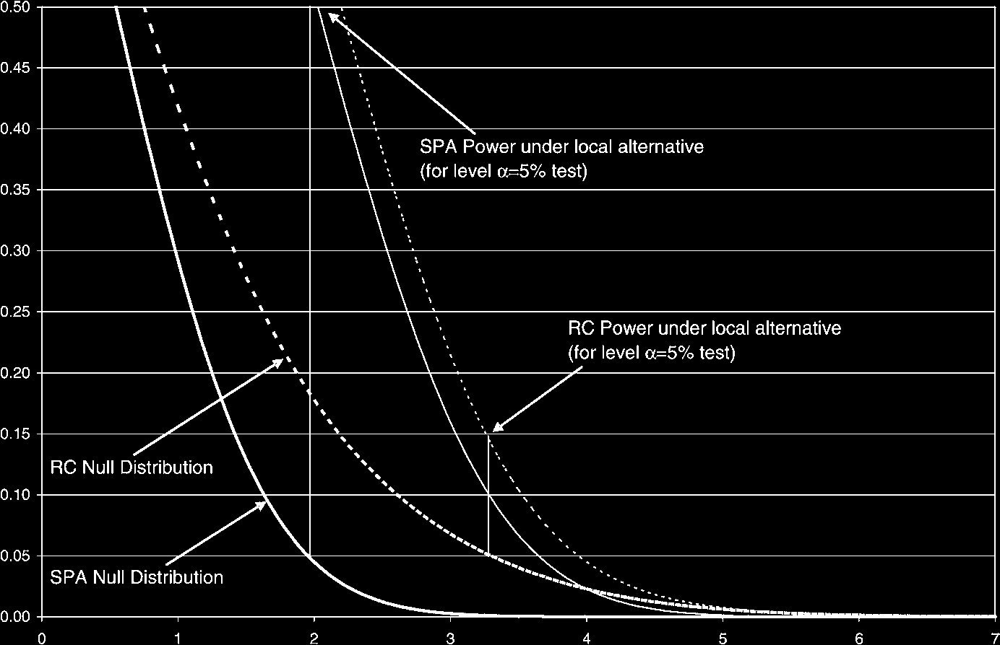
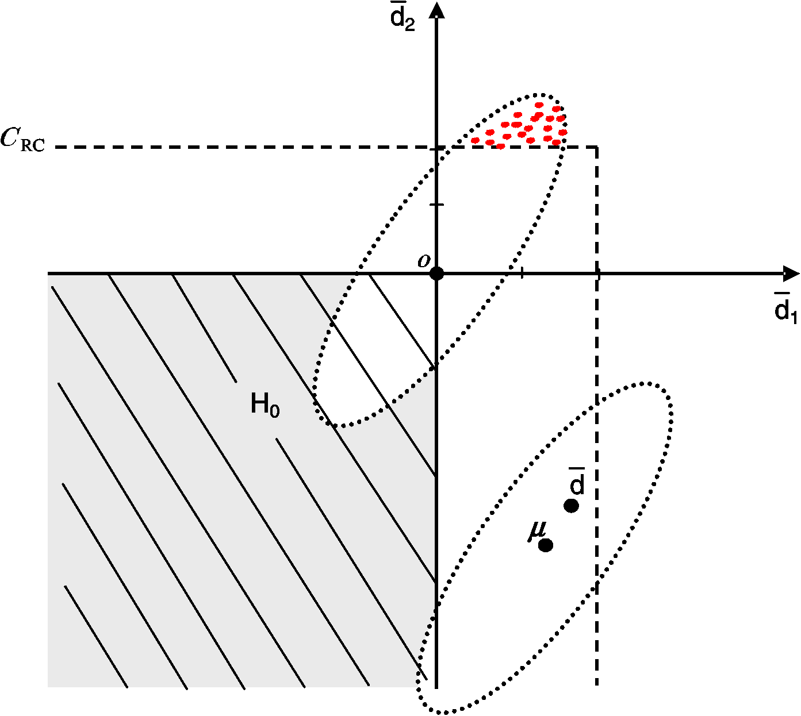
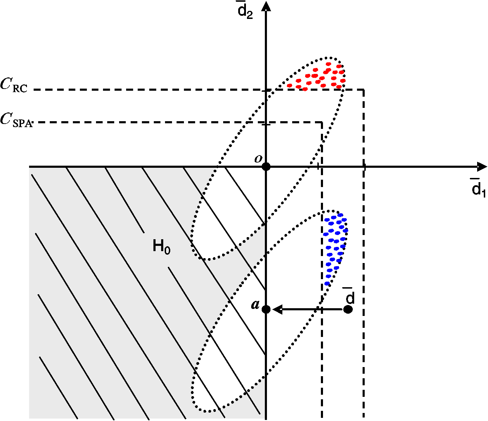
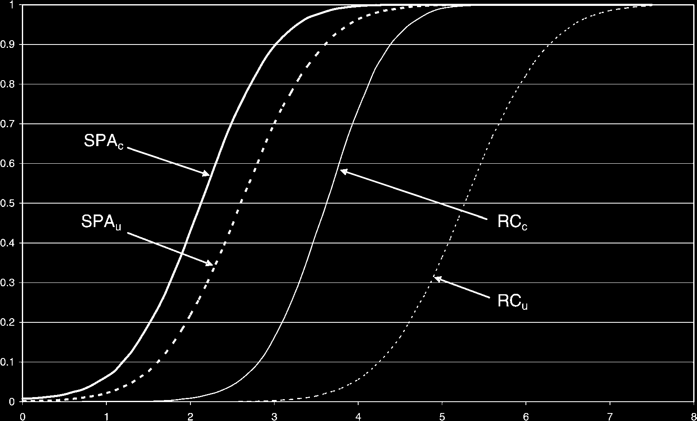

# A Test for Superior Predictive Ability

## Metadata

- **Source File:** `A Test for Superior Predictive Ability.pdf`
- **Authors:** Peter Reinhard Hansen
- **Year:** 2005
- **DOI:** 10.1198/073500105000000063

## Abstract

Not found.

## Main Text

### Journal of Business & Economic Statistics
ISSN: 0735-0015 (Print) 1537-2707 (Online) Journal homepage: www.tandfonline.com/journals/ubes20
## A Test for Superior Predictive Ability
Peter Reinhard Hansen
To cite this article: Peter Reinhard Hansen (2005) A Test for Superior Predictive Ability, Journal
of Business & Economic Statistics, 23:4, 365-380, DOI: 10.1198/073500105000000063
To link to this article: https://doi.org/10.1198/073500105000000063
View supplementary material
Published online: 01 Jan 2012.
Submit your article to this journal
Article views: 2297
View related articles
Citing articles: 101 View citing articles
Full Terms & Conditions of access and use can be found at
https://www.tandfonline.com/action/journalInformation?journalCode=ubes20

## A Test for Superior Predictive Ability
Peter Reinhard HANSEN
Stanford University, Department of Economics, 579 Serra Mall, Stanford, CA 94305 ( peter.hansen@stanford.edu)
We propose a new test for superior predictive ability. The new test compares favorably to the reality check
(RC) for data snooping, because it is more powerful and less sensitive to poor and irrelevant alternatives.
The improvements are achieved by two modifications of the RC. We use a studentized test statistic that
reduces the influence of erratic forecasts and invoke a sample-dependent null distribution. The advantages
of the new test are confirmed by Monte Carlo experiments and an empirical exercise in which we compare
a large number of regression-based forecasts of annual U.S. inflation to a simple random-walk forecast.
The random-walk forecast is found to be inferior to regression-based forecasts and, interestingly, the best
sample performance is achieved by models that have a Phillips curve structure.
KEY WORDS:
Forecast evaluation; Forecasting; Inequality testing; Multiple comparison; Testing for
superior predictive ability.
1.
INTRODUCTION
any alternative forecast.” This testing problem is relevant for applied econometrics, because several ideas and specifications are
Testing whether a particular forecasting procedure is outperoften used before a model is selected. This mining over alternaformed by alternative forecasts represents a test of superior pretive forecasts may be exacerbated if more than one researcher is
dictive ability (SPA). White (2000) developed a framework for
searching for a good forecasting model. (For a more complete
comparing multiple forecasting models and proposed a test for
discussion of this issue, see Sullivan, Timmermann, and White
SPA that is known as the reality check (RC) for data snooping.
2003 and references therein.) Testing for SPA is useful for a
Here the term “model” is used in a broad sense that includes
forecaster who wants to explore whether a better forecasting
forecasting rules/methods, which need not involve modeling
model than the model currently being used to make predictions
data. In White’s framework, m alternative forecasts (where
is available. After a search over several alternative forecasts, the
m is a fixed number) are compared with a benchmark forecast,
relevant question is whether one of the alternative forecasts is
where the predictive abilities are defined by expected loss. The
significantly more accurate than the benchmark. (The test for
complexity of this inference problem arises from the need to
SPA can also be used to test an economic theory that places recontrol for the full set of alternatives.
strictions on the predictability of certain variables, such as the
In this article, we propose a new test for SPA. Our framework
efficient markets hypothesis; see Sullivian et al. 1999.)
is identical to that of White (2000), but we take a different path
Tests for equal predictive ability (EPA) in a general setin our construction of the test. To be specific, we use a different
ting were proposed by Diebold and Mariano (1995) and West
test statistic and invoke a sample-dependent distribution under
(1996), where the framework of West can accommodate the sitthe null hypothesis. Compared with the RC, the new test is more
uation where forecasts involve estimated parameters. Harvey,
powerful and less sensitive to the inclusion of poor and irreleLeybourne, and Newbold (1997) suggested a modification of
vant alternatives.
the Diebold–Mariano test that leads to better small-sample
We make three contributions in this article. First, we proproperties. A test for comparing multiple-nested models was
vide a theoretical analysis of the testing problem and expose
given by Harvey and Newbold (2000), and McCracken (2000)
some of its important aspects. Our theoretical results reveal that
derived results for the case with estimated parameters and nonthe RC can be manipulated by the including poor and irreledifferentiable loss functions, such as the mean absolute devant forecasts in the set of alternative forecasts. This problem
viation loss function. West and McCracken (1998) developed
is alleviated by studentizing the test statistic and by invoking
regression-based tests, and other extensions were made by
a sample-dependent null distribution. The latter is based on a
Harvey et al. (1998), Chao, Corradi, and Swanson (2001), Clark
novel procedure that incorporates additional sample informaand McCracken (2001), West (2001), and Corradi and Swanson
tion to identify the “relevant” alternatives. Second, we provide
(2002), who considered tests for forecast encompassing, and by
a detailed explanation of a bootstrap implementation of our
Corradi, Swanson, and Olivetti (2001), who compared forecasttest for SPA. Third, we apply the tests in an empirical analying models that include cointegrated variables. (For a discussis of U.S. inflation. Our benchmark is a simple random-walk
sion of in-sample versus out-of-sample testing, see Inoue and
forecast that uses current inflation as the prediction of future
Kilian 2004.)
inflation. The benchmark is compared with a large number of
Whereas the frameworks of Diebold and Mariano (1995)
regression-based forecasts, and our empirical results show that
and West (1996) involve tests for EPA, the testing problem in
the benchmark is significantly outperformed. Interestingly, the
White’s framework is a test for SPA. The distinction is imstrongest evidence is provided by regression models that have a
portant because the former leads to a simple null hypothesis,
Phillips curve structure.
whereas the latter leads to a composite hypothesis. One of the
When testing for SPA, the question of interest is whether
any alternative forecast is better than the benchmark forecast
© 2005 American Statistical Association
or, equivalently, whether the best alternative forecasting model
Journal of Business & Economic Statistics
is better than the benchmark. This question can be addressed by
October 2005, Vol. 23, No. 4
testing the null hypothesis that “the benchmark is not inferior to
DOI 10.1198/073500105000000063
365

366
main complications in composite hypotheses testing is that (asof possible decision rules. Decisions are evaluated with a realvalued loss function, L(ξt,δk,t−h), where ξt is a random variable
ymptotic) distributions typically depend on nuisance paramethat represents the aspects of the decision problem that are unters, such that the null distribution is not unique. The usual way
to handle this ambiguity is to use the least favorable configknown at the time that the decision is made. We evaluate forecasts in terms of their expected loss, E[L(ξt,δk,t−h)]. Thus we
uration (LFC), which is sometimes referred to as “the point
need not assume that any of the forecasts are constructed from
least favorable to the alternative.” Our analysis shows that the
a correctly specified model. Whenever δk,t−h = δk,t−h( ˆθk,t−h)
LFC-based approach leads to some rather unfortunate propis based on estimated parameters, ˆθk,t−h, these are likely to inerties when testing for SPA. The following situation delivers
key insight to the advantages of using a sample-dependent null
fluence the expected loss—typically by increasing the expected
distribution. Let pmin denote the smallest p value of the m pairloss. We make assumptions that do not permit parameters that
wise comparisons (comparing each alternative with the benchare estimated with the recursive scheme. However, the rolling
mark); then the Bonferroni bound test (at level α) rejects the
scheme is accommodated by our framework, and so is the fixed
null hypothesis if pmin < α/m. It is now evident that the power
scheme when the comparison of forecasts is interpreted as beof this test can be driven to 0 by adding poor and irrelevant aling conditional on the estimated parameters. An overview of
ternatives to the comparison, because this increases m but does
our notation is given in Table 1. This provides a general framenot affect pmin. However, sample information will (at least aswork for comparing forecasts and decision rules. Our leading
ymptotically) identify the poor and irrelevant alternative, which
example is the comparison of forecasts, so we often refer to
allows us to use a smaller denominator when defining the critδk,t−h as the kth forecasting model. The first model, k = 0, has
ical value, for example, α/m0 for some m0 ≤m. Although our
a special role and is referred to as the benchmark. The decision
testing procedure is quite different from the conservative Bonrule, δk,t−h, can represent a point forecast, an interval forecast,
ferroni bound test, our sample-dependent null distribution is
a density forecasts, or a trading rule for an investor, as we illussimilar to this improvement of the Bonferroni bound test, altrate next with some examples.
though the (presumed) poor alternatives are not discarded enExample 1 (Point forecast). Let δk,t−h, k = 0,1,...,m, be
tirely in our framework.
different point forecasts of a real random variable ξt. The mean
In relation to the existing literature on forecast evaluation and
squared error loss function, L(ξt,δk,t−h) = (ξt −δk,t−h)2, is an
comparison, it is important to acknowledge a limitation of the
example of a loss function that could be used to compare the
specific test that we propose in this article. A comparison of
different forecasts.
models with parameters that are estimated recursively is not accommodated by our framework, because this situation violates
Example 2 (Conditional distribution and value-at-risk foreour stationarity assumption. (For recent progress on this probcasts). Let ξt be a conditional density on R, and let δk,t−h
lem in the present context, see Corradi and Swanson 2005a.)
be a forecast of ξt. Then we might evaluate the precision
However, our framework does permit parameters that are estiof δk by the Kolmogorov–Smirnov statistic, L(ξt,δk,t−h) =
 x
mated once (fixed scheme) or with a moving window (rolling
supx∈R |
−∞[ξt(y) −δk,t−h(y)]dy|, or a Kullback–Leibler
 ∞
schemes), as we discuss in Section 2. The advantages of the
=
−∞log[δk,t−h(x)/ξt(x)]ξt(x)dx.
L(ξt,δk,t−h)
measure,
studentized test statistic and our sample-dependent null distriAlternatively, δk,t−h could be a value-at-risk measure (at
bution do not rely on stationarity, so these modifications are
quantile α) that may be evaluated with L(ξt,δk,t−h) =
 δk,t−h
expected to be useful in a more general context. A related issue
|
ξt(x)dx −α|.
−∞
concerns the optimality of our test. Although the new test domIn Example 2, ξt will often be unobserved, which creates
inates the RC, we do not claim that it is optimal. The lack of an
additional complications for empirical evaluation and comparioptimality result is not surprising, because such results are rare
son. When a proxy is substituted for ξt it can cause the empirical
in composite hypothesis testing. It is also worth observing that
ranking of alternatives to be inconsistent for the intended (true)
leading statisticians continue to quarrel about what constitutes
ranking (see Hansen and Lunde 2005a). Corradi and Swana suitable test in this context (see Perlman and Wu 1999 and
son (2005b) recently derived an RC-type test for comparing
the comments on that article by Berger, Cox, McDermott, and
conditional density forecasts, which is closely related to the
Wang).
problem of Example 2. Their test is similar to that of White
This article is organized as follows. Section 2 introduces the
(2000), because their test statistic is also the maximum of mulnew test for SPA and contains our theoretical results. Section 3
tiple nonstudentized quantities. So it would be interesting to
provides the details of the bootstrap implementation. Section 4
analyze whether our two modifications can be implemented in
contains a simulation-based study of the finite-sample proptheir framework.
erties of the new test for SPA and compares it with those of
the RC. Section 5 contains an empirical forecasting exercise
Example 3 (Trading rules). Let δk,t−1 be a binary variable
of U.S. inflation, and Section 6 gives a summery and some conthat instructs a trader to take either a short (δ = −1) or a long
cluding remarks. All proofs are presented in an Appendix.
(δ = 1) position in an asset at time t −1. The kth trading rule
yields the profit πk,t = δk,t−1rt, where rt is the return on the
asset in period t. A trader who is currently using the rule, δ0,
2.
TESTING FOR SUPERIOR PREDICTIVE ABILITY
might be interested to know whether an alternative rule has a
We consider a situation where a decision must be made h pelarger expected profit than δ0. This can be formulated in our
riods in advance and let {δk,t−h, k = 0,1,...,m} be a finite set
framework by setting ξt = rt and L(ξt,δk,t−1) = −δk,t−1ξt.

367
Table 1. Overview of Notation and Definitions
t = 1, . . . , n
Sample period for the model comparison
k = 0, 1, . . . , m
Model index (k = 0 is the benchmark)
ξt
Object (variable) of interest
δk,t−h
The kth decision rule (e.g., h-step-ahead forecast of ξt)
Lk,t ≡L(ξt, δk,t−h)
Observed loss of the kth decision rule/forecast
dk,t ≡L0,t −Lk,t
Performance of model k relative to the benchmark
¯dk ≡n−1 n
t=1 dk,t
Average relative performance of model k
dt ≡(d1,t , . . . , dm,t)′
Vector of relative performances at time t
¯d ≡n−1 n
t=1 dt
Vector of average relative performance
µk ≡E(dk,t)
Expected excess performance of model k
µ ≡(µ1, . . . , µm)′
Vector of expected excess performances
 ≡avar(n1/2 ¯d)
Asymptotic m × m covariance matrix
where ¯d ≡n−1 n
t=1 dt and  ≡avar(n1/2(¯d −µ)) (see, e.g.,
The benchmark in Example 3 could be δ0,t = 1, which is the
rule that is always “long in the market.” This was the benchde Jong 1997).
mark used by Sullivan et al. (1999, 2001) who evaluated the
Diebold and Mariano (1995) and West (1996) provided sufsignificance of technical trading rules and calendar effects in
ficient conditions that also lead to the asymptotic normality
stock returns.
in (2). Giacomini and White (2003) established this property
for a related testing problem. However, the asymptotic normal2.1
Hypothesis of Interest
ity does not hold in general. An important exception is the situation where the benchmark is nested in all alternative models
We are interested to know whether any of the models,
(under the null hypothesis) and the parameters are estimated
k = 1,...,m, are better than the benchmark in terms of exrecursively. In this situation the limiting distribution will typpected loss. So we seek a test of the null hypothesis that the
ically be given as a function of Brownian motions (see, e.g.,
benchmark is not inferior to any of the alternatives. The variClark and McCracken 2001). When comparing nested models,
ables that are key for our analysis are the relative performance
the null hypothesis simplifies to the simple hypothesis, µ = 0.
variables, which are defined by
So in this case it seems more appropriate to apply a test for EPA,
dk,t ≡L(ξt,δ0,t−h) −L(ξt,δk,t−h),
k = 1,...,m.
such as that of Harvey and Newbold (2000), which can be used
to compare multiple-nested models.
So dk,t denotes the performance of model k relative to the
At this point, all essential aspects of our framework are idenbenchmark at time t, and we stack these variables into the vector
tical to those of White (2000). White proceeded by constructing
of relative performances, dt = (d1,t,...,dm,t)′. Provided that
the RC from the test statistic,
µ ≡E(dt) is well defined, we can now formulate the null hypothesis of interest as


n1/2¯d1,...,n1/2¯dm
TRC
≡max
,
n
H0 :µ ≤0,
(1)
and an asymptotic null distribution based on n1/2 ¯d ∼Nm(0, ˆ),
and our maintained hypothesis is µ ∈Rm.
where ˆ is a consistent estimator of . Here it is worth noting
We work under the assumption that model k is better than the
benchmark if and only if E(dk,t) > 0. So we focus exclusively
that the RC relies on an asymptotic null distribution that ason the properties of dt and abstract entirely from all aspects
sumes µk = 0 for all k, even though all negative values of µk
that relate to the construction of the δ-variables. Thus dt, t =
also conform with the null hypothesis. This aspect is the un1,...,n, is de facto viewed as our data, and we therefore state
derlying topic of Sections 2.3 and 2.4, but first we discuss a
all assumptions in terms dt. Specifically we make the following
studentization of the test statistic.
assumption.
Given the asymptotic normality of ¯d, it may seem natural to
use a quadratic-form test statistic to test H0, such as the likeliAssumption 1. The vector of relative loss variables, {dt},
hood ratio test used by Wolak (1987). However, the situation
is (strictly) stationary and α-mixing of size −(2 + δ)(r + δ)/
(r −2), for some r > 2 and δ > 0, where E|dt|r+δ < ∞and
that we have in mind is one in which m is too large to obtain a sensible estimate of all elements of . Instead we convar(dk,t) > 0 for all k = 1,...,m.
sider simpler statistics, such as TSPA
(defined later) that requires
n
Assumption 1 is made for two reasons: first, to ensure that
only that the diagonal elements of  be estimated. It is not
certain population moments such as µ are well defined, and
surprising that nonquadratic statistics will be nonpivotal—even
second, to justify the use of bootstrap techniques that we deasymptotically—because their asymptotic distribution will describe in detail in Section 3. Note that Assumption 1 does not
pend on (some elements of ) the covariance matrix, which
require that the individual loss variables, L(ξt,δk,t−h), be stamakes  a nuisance parameter. To handle this problem, we foltionary. An immediate consequence of Assumption 1 is that a
low White (2000) and use a bootstrap method that implicitly
central limit theorem applies, such that
takes care of this nuisance parameter problem. So our motivad→Nm(0,),
n1/2(¯d −µ)
(2)
tion for using the bootstrap is not driven by higher-order refine-

368
(such as the case where ω2
j = ω2
k ∀j,k = 1,...,m). However,
ments, but is merely to handle this nuisance parameter problem.
We analyze this testing problem in the remainder of this secsuch exceptions are unlikely to be of much empirical relevance,
tion, and our findings motivate the following two recommendaas we discuss later. So we are comfortable recommending the
tions that spell out the differences between the RC and our new
use of TSPA
in practice, and it is worth pointing out that stun
test for SPA:
dentization of the individual statistics is the conventional approach to multiple comparisons (see Miller 1981; Savin 1984).
1. Use the studentized test statistic,


This studentization is also embedded in the related approach
n1/2¯dk
TSPA
where the individual statistics are converted into “p values,”
≡max
,0
,
max
n
ˆωk
k=1,...,m
with the smallest p value used as the test statistic (see Tippett
k ≡var(n1/2¯dk).
where ˆω2
k is some consistent estimator of ω2
1931; Folks 1984; Marden 1985; Westfall and Young 1993;
2. Invoke a null distribution that is based on Nm( ˆµc, ˆ),
Dufour and Khalaf 2002). In the present context, Romano and
where ˆµc is a carefully chosen estimator for µ that conWolf (2005) also adopted the studentized test statistic (see also
Lehmann and Romano 2005, chap. 9).
forms with the null hypothesis. Specifically, we suggest
the estimator
Our main argument for studentization is that it typically will
improve the power. This can be understood from the following
k = ¯dk1{n1/2 ¯dk/ ˆωk≤−√2loglogn},
ˆµc
k = 1,...,m,
simple example.
where 1{·} denotes the indicator function.
Example 4. Consider the case where m = 2 and suppose that
We explain our reasons for this choice of µ-estimator in Sec-

4 0

tion 2.4, but it is important to understand that using a consistent
n1/2(¯d −µ) ∼N2
0,
,
estimator of µ need not produce a valid test.
0 1
2.2
Choice of Test Statistic
where the covariance is 0 (a simplification that is not necessary for our argument). Now consider the particular local
When the benchmark has the best sample performance
alternative where µ2 = 2n−1/2 > 0. Here ¯d2 is expected to
(¯d ≤0), the test statistic is normalized to 0. In this case there
is no evidence against the null hypothesis, and consequently
yield a fair amount of evidence against H0 :µ ≤0, because
the t-statistic, n1/2¯d2/ ˆωk, will be centered about 2. It folthe null should not be rejected. The normalization is convenient
for theoretical reasons, because we avoid a divergence problem
lows that the null distributions (using µ = 0) are given by
(to −∞) that would otherwise occur when µ < 0.
a∼G0(x) ≡(x)(x),
TRC
∼F0(x) ≡(x/2)(x) and TSPA
n
n
As discussed in Section 1, there are few optimality results in
a∼G1(x) ≡
whereas TRC
∼F1(x) ≡(x/2)(x + 2) and TSPA
the context of composite hypothesis testing. This is particularly
n
n
(x)(x+2) under the local alternative. Here (·) denotes the
the case for the present problem of testing multiple inequalities.
a∼means “asymptotically
standard Gaussian distribution and
However, some arguments that justify our choice of test statistic TSPA
(instead of TRC
distributed as.” Figure 1 shows the upper tails of the null distribn ) are called on. Although we argue
n
that TSPA
is preferable to TRC
utions, 1 −F0(x) and 1 −G0(x) (thick lines) and the upper tails
n , it cannot be shown that the forn
of 1 −F1(x) and 1 −G1(x) (thin lines) that represent the distrimer uniformly dominates the latter in terms of power. In fact,
there are situations where TRC
butions of the test statistics under the local alternative. Dotted
leads to a more powerful test
n
Figure 1. (One minus) The cdfs for the Test Statistics T RC and TSPA Under the Null Hypothesis, µ1 = µ2 = 0, and the Local Alternative,
µ2 = 2/√n > 0. [
1−F0(x);
1−F1(x);
1−G0(x);
1−G1(x).] Studentization improves the power from about 15% to about 53%.

369
lines represent for the distributions of TRC
n , and solid lines repelements of certain rows and columns have been set to 0. An
example of how µ and  translate into 0 is as follows:
resent for the distributions of TSPA
. The power for a given level
n




of either of the two tests can be read off the figure, and we have
ω2
11 ω12 ω13
0
singled out the powers of the 5%-level tests. These reveal that

,
,

ω21 ω2
−2
µ =
 =
22 ω23
studentization more than triples the power, from about 15% to
ω31 ω32 ω2
0
33
about 53%. So the RC is much less likely to detect the false null,


because the noisy ¯d1 conceals the evidence against H0 that ¯d2
ω2
11 0 ω13
0 =

,
provides.
0 0 0
ω31 0 ω2
The preceding example highlights the advantages of studen33
tizing the individual statistics, because it avoids a comparison
and 0 has at most rank m0, where m0 is the number of eleof objects measured in different “units of standard deviation”
ments in µ that equal 0.
(avoiding a comparison of apples and bananas). There is one
The following theorem provides the asymptotic null distribexception where studentization may reduce the power, when
ution for all test statistics that satisfy Assumption 2.
the best performing model is associated with the largest variance [i.e., if var(¯d2) ≥var(¯d1) in the previous example]. We
Theorem 1. Suppose that Assumptions 1 and 2 hold and let
F0 be the cumulative distribution function (cdf ) of ϕ(Z,v0),
consider this case to be of little empirical relevance, because
where Z ∼Nm(0,0). Under the null hypothesis, µ ≤0, we
poorly performing models also tend to have the most erratic
d→F0, where v0 = plimVn. Under the
have that ϕ(n1/2 ¯d,Vn)
performances in practice. Moreover, the loss in power from esp→∞.
alternative, µ ≰0, we have that ϕ(n1/2 ¯d,Vn)
timating ω2
k, k = 1,...,m, is quite modest when these are estimated precisely, as is the case when n is large.
The test statistic TSPA
satisfies Assumption 2, whereas that
n
In the remainder of this section we formulate our theoretical
of the RC does not. It is nevertheless possible to obtain critical
results that motivate our data-dependent choice of null distribvalues for TRC
from Theorem 1. This is done by applying Theon
ution. We derive our results for a broad class of test statistics
rem 1 to the test statistic TRC+
= max(TRC
n ,0) that satisfies Asto emphasize that our results are not specific to the two statisn
sumption 2 and noting that the distributions of TRC+
and TRC
tics, TRC
and TSPA
. This is also convenient because other statisn
n
n
n
coincide on the positive axis, which is the relevant support
tics (from this class of statistics) may be used in future applied
for the critical value. Alternatively, the asymptotic distribution
work.
of TRC
can be obtained directly, as we do in the following coroln
lary.
2.3
Theoretical Results for a Class of Test Statistics
Corollary 1. Let m0 ≤m be the number of models with
µk = 0, define  to be the m0 × m0 submatrix of  that conWe consider a class of test statistics, where each of the statistains the (i,j)th element of  if µi = µj = 0, and let ζ detics satisfies the following conditions.
j , where Z0 =
note the distribution of Zmax ≡maxj=1,...,m0 Z0
Assumption 2. The test statistic has the form Tn = ϕ(Un,Vn),
d→ζ if maxk µk = 0,
m0)′ ∼Nm0(0,). Then TRC
(Z0
1,...,Z0
p→v0 ∈Rq (a constant). The mapwhere Un ≡n1/2 ¯d and Vn
n
p→−∞if µk < 0 for all k = 1,...,m. Under the
whereas TRC
ping, ϕ(u,v), is continuous in u on Rm and continuous in v in
n
p→∞.
alternative where µk > 0 for some k, it holds that TRC
a neighborhood of v0. Further, ϕ has the following properties:
n
Theorem 1 and Corollary 1 demonstrate that it is only the
(a) ϕ(u,v) ≥0 and ϕ(0,v) = 0.
binding constraints (i.e., those with µk = 0) that matter for
(b) ϕ(u,v) = ϕ(u+,v), where u+
= max(0,uk), k =
k
the asymptotic distribution. Naturally, the number of binding
1,...,m.
constraints can be small relative to the number of inequali-
(c) ϕ(u,v) →∞, if uk →∞for some k = 1,...,m.
ties, m, being tested. This result is known from the problem
Thus, in addition to the sample average, ¯d, the test statistic
of testing linear inequalities in linear (regression) models (see
may depend on the data through Vn ≡v(d1,...,dn), as long
Perlman 1969; Wolak 1987, 1989b; Robertson, Wright, and
as Vn converges in probability to a constant (or vector of conDykstra 1988; Dufour 1989). (See Wolak 1989a, 1991 for tests
stants). Assumption 2(a) is a normalization (if ¯d = 0, then there
of nonlinear inequalities.) The testing problem is also related
to that of Gouriéroux, Holly, and Monfort (1982), King and
is no evidence against H0), Assumption 2(b) states that only the
Smith (1986), and Andrews (1998), where the alternative is
positive elements of u matter for the value of the test statistic,
constrained by inequalities. (See Goldberger 1992 for a nice
and Assumption 2(c) requires that the test statistic diverges to
discussion of the relation between the two testing problems.)
infinity as the evidence against the null hypothesis increases (to
An immediate consequence of Corollary 1 is that the RC
infinity).
The mapping (µ,) →0, given by
is easy to manipulate by including irrelevant alternative models. This follows because the RC’s p value, which is based
0
ij ≡ ij1{µi=µj=0},
i,j = 1,...,m,
on max(Z1,...,Zm), can be increased in an artificial way by
adding poor forecasts to the set of alternative forecasts (i.e., by
defines an m × m covariance matrix, 0, that plays a role in
increasing m while m0 remains constant). In other words, it is
our asymptotic results. So 0 is similar to , except that the
possible to erode the power of the RC to 0 by including poor

370
whereas the idea of Hansen (2003) is to take the supremum
over a smaller (confidence) set chosen such that it contains the
true parameter with a probability that converges to 1. In this
article, we use a closely related procedure based directly on the
asymptotic distributions of Theorem 1 and Corollary 1.
In the preceding section, we saw that the poor alternatives
are irrelevant for the asymptotic distribution. So a proper test
should reduce the influence of these models while preserving
the influence of the models with µk = 0. It may be tempting to
simply exclude the alternatives with ¯dk < 0 from the analysis.
But this approach does not lead to valid inference in general, because the models that are (or appear to be) a little worse than the
benchmark can have a substantial influence on the distribution
of the test statistic in finite samples (and even asymptotically
if µk = 0). So we construct our test in a way that incorporates
all models, while reducing the influence of alternatives that the
data suggest are poor.
Our choice of estimator, ˆµc, is motivated by the law of the
iterated logarithm stating that


Figure 2. A Situation Where the RC Fails to Reject a False Null Hyn1/2(¯dk −µk)
pothesis. The true parameter value is µ = (µ1, µ2)′, the sample es-
= −
= 1
P
2loglogn
liminf
ωk
timate is ¯d = ( ¯d1, ¯d2)′, and CRC represents the critical value derived
n→∞
from a null distribution that tacitly assumes that µ = (0, 0) ′.
and


n1/2(¯dk −µk)
= +
= 1.
2loglogn
P
limsup
alternatives in the analysis. Naturally, we would want to avoid
ωk
n→∞
such properties to the extent possible.
The first equality shows that ˆµc
Because the test statistics have asymptotic distributions that
k effectively captures all of the
elements of µ that are 0, such that µk = 0 ⇒ˆµc
depend on µ and , these are nuisance parameters. The tradik = 0 almost
tional way to proceed in this case is to substitute a consistent
surely. Similarly, if µk < 0, then the second equality states that
¯dk is very close to µk; in fact, n1/2¯dk is smaller than −n1/2−ϵ
estimator for  and use the LFC over the values of µ that satfor any ϵ > 0 and n sufficiently large. Thus n1/2¯dk/ωk is, in
isfy the null hypothesis. In the present situation, the point least
particular, smaller than the threshold rate, −√2loglogn, for
favorable to the alternative is µ = 0, which presumes that all aln sufficiently large, demonstrating that ¯dk eventually will stay
ternatives are as good as the benchmark. In the next section we
below the implicit threshold in our definition of ˆµc
explore an alternative way to handle the nuisance dependence
k, such that
k ≪0 almost surely. So ˆµc meets the necessary
µk < 0 ⇒ˆµc
on µ, where we use a data-dependent choice for µ rather than
µ = 0 as dictated by the LFC.
asymptotic requirements that we identified in Theorem 1 and
Figure 2 illustrates a situation for m = 2, where the twoCorollary 1.
dimensional plane represents the sampling space for ¯d =
Although the poor alternatives should be discarded asymp-
(¯d1, ¯d2)′. We have plotted a realization of ¯d, that is in the neightotically, this is not the case in finite samples, as we discussed
borhood of its true expected value, µ = (µ1,µ2)′, and the elearlier. Our estimator, ˆµc, explicitly accounts for this by keeplipse around µ is meant to illustrate the covariance structure
ing all alternatives in the analysis. A poor alternative, µk < 0,
of ¯d. The shaded area represents the values of µ that conform
has an impact on the critical value whenever µk/(ωkn1/2) is
with the null hypothesis. Because we have placed µ outside
only moderately negative, say between −1 and 0. This is the
this shaded area, the situation in Figure 2 is one where the null
reason that the poorly performing alternatives cannot simply
hypothesis is false. The RC is an LFC-based test, so it derives
be omitted from the analysis. We emphasize this point because
critical values as if µ = 0 [the origin, o = (0,0)′, of the figure].
an earlier version of this article has been incorrectly quoted for
The critical value, CRC, is represented by the dashed line, such
“discarding the poor models.”
Although ˆµc leads to a correct separation of good and poor
that the area above and to the right of the dashed line defines
the critical region of the RC. The shape of the critical region
alternatives, other threshold rates also produce valid tests. The
rate √2loglogn is the slowest rate that captures all alternatives
n . Because ¯d is outside the
follows from the definition of TRC
with µk = 0, whereas the faster rate, n1/2−ϵ for any ϵ > 0, guarcritical region in this example, the RC fails to reject the false
null hypothesis in this case.
antees that all of the poor models are discarded asymptotically.
So a range of rates can be used to asymptotically discriminate
between good and poor alternatives. One example is 1
4n1/4,
2.4
The Distribution Under the Null Hypothesis
which was used in a previous version of this article. Because
different threshold rates will lead to different p values in finite
Hansen (2003) proposed an alternative to the LFC approach
that leads to more powerful tests of composite hypotheses. The
samples, it is convenient to determine an upper and lower bound
for the p values in which different threshold rates can result.
LFC is based on a supremum taken over the null hypothesis,

371
These are easily obtained using the “estimators,” ˆµl and ˆµu,
k ≡min(¯dk,0) and ˆµu
given by ˆµl
k = 0, k = 1,...,m, where
the latter yields the LFC-based test. It is simple to verify that
ˆµl ≤ˆµc ≤ˆµu, which in part motivates the superscripts, and we
have the following result, where F0 is the cdf of ϕ(Z,v0) that
we defined in Theorem 1.
Theorem 2. Let Fi
n be the cdf of ϕ(n1/2Zi
n,Vn), for i = l, c,
d→Nm(0,). Suppose that Assumpn −ˆµi)
or u, where n1/2(Zi
tions 1 and 2 hold; then Fc
n →F0 as n →∞, for all continuity
points of F0 and Fl
n(x) ≤Fc
n(x) ≤Fu
n(x) for all n and all x ∈R.
Theorem 2 demonstrates that ˆµc leads to a consistent estimate of the asymptotic distribution of our test statistic. The theorem also demonstrates that ˆµl and ˆµu provide upper and lower
bound for the distribution Fc
n that can be useful in practice; for
example, a substantial difference between these bounds is indicative of the presence of poor alternatives, in which case the
sample-dependent null distribution is useful.
Figure
3. How
the
Power
Is
Improved
by
Using
the
SamGiven a value for the test statistic t = Tn(d1,...,dn), it is natple-Dependent Null Distribution. This distribution is centered about
ural to define the true asymptotic p value as p0(t) ≡1 −F0(t).
ˆµc = a, which leads to the critical value CSPA. In contrast, the RC fails to
The empirical p value is deduced from an estimate of Fi
n,
reject the null hypothesis, because the LFC-based null distribution leads
i = l,c,u, and the following corollary demonstrates that ˆµc
to the larger critical value CRC.
yields a consistent p value.
3.
BOOTSTRAP IMPLEMENTATION OF THE TEST
Corollary 2. Consider the studentized test statistic, t =
(d1,...,dn). Let the empirical p value, ˆpc
FOR SUPERIOR PREDICTIVE ABILITY
TSPA
n(t), be inn
ferred from ˆFc
n, where ˆFc
n(t) −Fc
n(t) = o(1) for all t. Then
In this section we describe a bootstrap implementation of the
p→p0(t) for any t > 0.
ˆpc
n(t)
SPA tests in detail. The implementation is based on the stationary bootstrap of Politis and Romano (1994), but it is straightThe two other choices, ˆµl and ˆµu, do not produce consisforward to modify the implementation to the block bootstrap
tent p values in general. It follows directly from Theorem 1
of Künsch (1989). Although there are arguments that favor the
that ˆµu will not produce a consistent p value unless µ = 0.
block bootstrap over the stationary bootstrap (see Lahiri 1999),
That the p value from using ˆµl is inconsistent is easily underthese advantages require the use of an optimal block length that
stood by noting that a critical value based on Nm(0,) will
is difficult to determine when m is large relative to n, as will
be greater than one based on the mixed Gaussian distribution,
often be the case when testing for SPA.
Nm(n1/2 ˆµl,). So a p value based on ˆµl is (asymptotically)
The stationary bootstrap of Politis and Romano (1994) is
smaller than the correct p value, which makes this a liberal test
based on pseudo-time series of the original data. The pseudop→µ under the null hypothesis. This
despite the fact that ˆµl
time series {d∗
b,t} ≡{dτb,t}, b = 1,...,B, are resamples of dt,
problem is closely related to the inconsistency of the bootstrap,
where {τb,1,...,τb,n} is constructed by combining blocks of
when a parameter is on the boundary of the parameter space,
{1,...,n} with random lengths. The leading case is that where
as analyzed by Andrews (2000). In our situation the inconsisthe block length is chosen to be geometrically distributed with
tency arises because µ is on the boundary of the null hypothesis,
parameter q ∈(0,1], but the block length may be randomized
which leads to a violation of a similarity on the boundary condifferently, as discussed by Politis and Romano (1994). The
number of bootstrap resamples, B, should be chosen to be suffidition (see Hansen 2003). (See Cox and Hinkley 1974, p. 150,
ciently large such that the results are not affected by the actual
and Gouriéroux and Monfort 1995, chap. 16, for discussions of
draws of τb,t. This can be achieved by increasing B until the rethe finite-sample version of this similarity condition.)
sults are robust to increments, or more formal methods, such as
Figure 3 shows how the consistent estimate of the null disthe three-step method of Andrews and Buchinsky (2000), can
tribution can improve the power. Recall the situation from Figbe applied. Here we follow the conventional setup of the staure 2, where the null hypothesis is false. The data-dependent
tionary bootstrap and generate B resamples from two random
null distribution is defined from a projection of ¯d = (¯d1, ¯d2)′
B × n matrices, U and V, where the elements, ub,t and vb,t,
onto the set of parameter values that conform with the null hypothesis. This yields the point a, which represents ˆµl = ˆµc (asare independent and uniformly distributed on (0,1]. The first
element of each resample is defined by τb,1 = ⌈nub,1⌉, where
suming that ¯d2 is below the relevant 2loglogn-threshold). The
⌈x⌉is the smallest integer that is larger than or equal to x. For
critical region of the SPA test (induced by ¯d) is the area above
t = 2,...,n, the elements are given recursively by
and to the right of the dotted line marked by CSPA. Because ¯d is
⌈nub,1⌉
if vb,t < q
in the critical region, the SPA test (correctly) rejects the null
τb,t =
hypothesis in this case.
1{τb,t−1<n}τb,t−1 + 1
if vb,t ≥q.

372
√
where gl(x) = max(0,x), gc(x) = x · 1{x≥−
So with probability q, the tth element is chosen uniformly on
k/n)2loglogn}, and
( ˆω2
{1,...,n} and with probability 1 −q, the tth element is chosen
gu(x) = x. It is simple to verify that the expected values of
to be the integer that follows τb,t−1, unless τb,t−1 = n in which
k,b,t, i = l,c,u (conditional on d1,...,dn), are given by ˆµl,
Z∗
case τb,t ≡1. The block bootstrap is very similar to the stationˆµc, and ˆµu.
ary bootstrap, but instead of using blocks with random length,
Corollary 3. Let Assumption 1 hold and let Z∗
b,t be centered
the block bootstrap combines blocks of equal length.
From the pseudo-time series, we calculate their sample averabout ˆµ, for ˆµ = ˆµl, ˆµc, or ˆµu. Then
b ≡n−1 n
ages, ¯d∗
t=1 d∗
b,t, b = 1,...,B, that can be viewed as
 p→0,
P∗


∗
(asymptotically) independent draws from the distribution of ¯d,
n1/2(¯d −µ) ≤z
n1/2(Z
b −ˆµ) ≤z
−P
sup
z∈Rm
under the bootstrap distribution. So this provides an intermediate step to estimate the distribution of our test statistic.
k,b = n−1 n
where ¯Z∗
t=1 Z∗
k,b,t, k = 1,...,m.
Lemma 1. Let Assumption 1 hold and suppose that the bootstrap parameter, q = qn, satisfies qn →0 and nq2
n →∞as
Given our assumptions about the test statistic, Corollary 3
n →∞. Then
demonstrates that we can approximate the distribution of our
 p→0,
P∗


test statistics under the null hypothesis by the empirical distribn1/2(¯d∗
b −¯d) ≤z
n1/2(¯d −µ) ≤z
−P
sup
ution we obtain from the bootstrap resamples Z∗
b,t, t = 1,...,n.
z∈Rm
The p values of the three tests for SPA are now simple to obwhere P∗denotes the bootstrap probability measure.
= max{0,maxk=1,...,m[n1/2 ¯Z∗
tain. We calculate TSPA∗
k,b/ ˆωk]}
b,n
for b = 1,...,B, and the bootstrap p value is given by
This lemma demonstrates that the empirical distribution of
the pseudo-time series can be used to approximate the distribution of n1/2(¯d−µ). This result follows directly from Goncalves
1{TSPA∗
B

>TSPA
}
n
b,n
ˆpSPA ≡
,
and de Jong (2003, thm. 2) who derived the result under slightly
B
b=1
weaker assumptions than we have stated. (Their assumptions
are formulated for near–epoch-dependent processes.) The test
where the null hypothesis should be rejected for small p values.
requires estimates of ω2
statistic TSPA
k, k = 1,...,m. An earlier
n
Thus we obtain three p values, one for each of the estimators
version of this article was based on the estimator
ˆµl, ˆµc, and ˆµu. The p values based on the test statistic TRC
can
n
B


2,
be derived similarly.
ˆω∗2
k,B ≡B−1
n1/2¯d∗
k,b −n1/2¯dk
Note that we are using the same estimate of ω2
k to calculate
b=1
and TSPA∗
TSPA
, b = 1,...,B. A nice robustness property of the
k,b = n−1 n
n
b,n
where ¯d∗
t=1 dk,τb,t. By the law of large numbers, this
SPA test is that it is valid even if ˆω2
k is inconsistent for ω2
k. This
estimator is consistent for the bootstrap population value of the
is easy to understand by recalling that ˆω2
k = 1 for all k leads
variance, which in turn is consistent for the true variance, ω2
to the RC (and 1 is generally inconsistent for ω2
k). Although
k
(see Goncalves and de Jong 2003, thm. 1). However, it is our
this robustness is convenient, it is desirable that ( ˆω2
1,..., ˆω2
m)
experience that B needs to be quite large to sufficiently reduce
be close to (ω2
1,...,ω2
m), such that the individual statistics,
the additional layer of randomness introduced by the resamn1/2¯dk/ ˆωk, have approximately the same scale, due to the power
pling scheme. So our recommendation is to use the bootstrap
issues that we discussed in Section 2.
population value directly, which is given by
n−1

ˆω2
k ≡ˆγ0,k + 2
κ(n,i) ˆγi,k,
4.
SIZE AND POWER COMPARISON BY
i=1
MONTE CARLO SIMULATIONS
where
The two test statistics TRC
and TSPA
and the three null disn−i
n
n

tributions centered about ˆµl, ˆµc, and ˆµu result in six different
ˆγi,k ≡n−1
(dk,j −¯dk)(dk,j+i −¯dk),
i = 0,1,...,n −1,
tests. In this section we study the size and power properties of
j=1
these tests in a Monte Carlo experiment.
We generate Lk,t ∼iidN(λk/√n,σ 2
are the usual empirical covariances and the kernel weights (unk ) for k = 0,1,...,m and
der the stationary bootstrap) are given by
t = 1,...,n, where the benchmark model has λ0 = 0. So posκ(n,i) ≡n −i
(1 −q)i + i
itive values (λk > 0) correspond to alternatives that are worse
n(1 −q)n−i
n
than the benchmark, whereas negative values (λk < 0) correspond to alternatives that are better than the benchmark.
(see Politis and Romano 1994).
In our experiment we have λ1 ≤0 and λk ≥0 for k =
We seek the distribution of the test statistics under the null
2,...,m, such that the first alternative (k = 1) defines whether
hypothesis, so we impose the null by recentering the bootstrap
variables about ˆµl, ˆµc, or ˆµu. This is done by defining
the rejection probability corresponds to a type I error (λ1 = 0)
or a power (λ1 < 0). The performances of the “poor” models
Z∗
k,b,t ≡d∗
k,b,t −gi(¯dk),
are such that their mean values are spread evenly between 0
and λm = 0 (the worst model). So the vectors of the λk’s are
i = l,c,u,b = 1,...,B,t = 1,...,n,

373
given by
where




µk = λk
k ≃1 + 1
2λk + 1
k −1
0
ω2
4λ2
12λ3
√n
k,
and
λ0


1


λ1
1
m−10
where the expression for ω2
k now follows from var(dk,t) =
λ2
2
var(L0,t −Lk,t) = 1
λ3
m−10
2 + var(Lk,t) and the Taylor expansion
=
λ ≡
.
...
...
(about 0)


1
2 exp(arctan(x)) = 1
1 + x + 1
2x2 −1
6x3 −7
λm−1
m−2
24x4 + O(x5)
m−10
.
λm
2
0
In our experiments we use 0 = 0,1,2,5,10 to control the
4.1
Simulation Results
extent to which the inequalities are binding with (0 = 0 corFirst, we consider the case with m = 100 and the two samresponding to the case where all inequalities are binding). The
ple sizes n = 200 and n = 1,000. Then we consider the case
first alternative model has 1 = 0, −1, −2, −3, −4, −5. So
with m = 1,000 using the sample size n = 200. The rejection
λ1 = 1 defines the local alternative that is being analyzed
frequencies that we report are based on 10,000 independent
(unless 1 = 0, which conforms with the null hypothesis). To
samples, where we used q = 1 in accordance with the lack of
make the experiment more realistic, we tie the variance, σ 2
k , to
time dependence in dt, t = 1,...,n. All of our simulations were
the “quality” of the model. Specifically, we set
made using Ox 3.30 (see Doornik 1999). The rejection frequenσ 2
k = 1
2 exp(arctan(λk)),
cies of the tests at the 5% and 10% levels are reported in Tables 2–4. The numbers in italic type are used when the null
such that a good model has a smaller variance than poor model.
hypothesis is true (1 = 0), so these frequencies correspond to
Note that this implies that
type I errors. The numbers in regular type represent powers for
√n¯dk ∼N(µk,ω2
the various local alternatives (1 < 0).
k),
Table 2. Rejection Frequencies Under the Null and Alternative (m = 100 and n = 200)
Level: α = .05
Level: α = .10
Λ1
RCl
RCc
RCu
SPAl
SPAc
SPAu
RCl
RCc
RCu
SPAl
SPAc
SPAu
Panel A: 0 = 0
0
.055
.053
.053
.062
.060
.060
.108
.101
.101
.116
.110
.109
−1
.057
.054
.054
.077
.074
.074
.112
.105
.105
.136
.129
.129
−2
.121
.111
.111
.310
.280
.280
.219
.197
.197
.436
.389
.388
−3
.550
.471
.470
.848
.764
.761
.727
.620
.618
.921
.845
.841
−4
.968
.888
.882
.997
.979
.976
.993
.947
.941
1.000
.990
.987
−5
1.000
.996
.992
1.000
1.000
1.000
1.000
.999
.998
1.000
1.000
1.000
Panel B: 0 = 1
0
.013
.010
.010
.026
.022
.022
.035
.025
.025
.055
.044
.044
−1
.013
.010
.010
.047
.041
.040
.036
.027
.027
.087
.072
.071
−2
.036
.028
.028
.312
.252
.250
.084
.060
.060
.436
.345
.342
−3
.301
.201
.197
.862
.744
.733
.516
.334
.327
.928
.829
.814
−4
.896
.677
.658
.998
.977
.971
.971
.816
.793
1.000
.989
.984
−5
1.000
.968
.952
1.000
1.000
.999
1.000
.991
.980
1.000
1.000
1.000
Panel C: 0 = 2
0
.004
.002
.002
.018
.012
.012
.013
.007
.006
.039
.026
.026
−1
.004
.002
.002
.044
.032
.032
.014
.007
.006
.080
.058
.056
−2
.013
.007
.006
.336
.244
.238
.041
.020
.019
.464
.336
.324
−3
.195
.077
.073
.881
.745
.721
.401
.167
.152
.941
.827
.799
−4
.842
.460
.414
.999
.978
.968
.957
.659
.598
1.000
.989
.982
−5
.999
.911
.855
1.000
1.000
.999
1.000
.971
.934
1.000
1.000
1.000
Panel D: 0 = 5
.002
.000
.000
.014
.007
.005
.008
.001
.000
.032
.013
.011
0
−1
.002
.000
.000
.056
.031
.025
.009
.001
.000
.101
.054
.044
−2
.012
.001
.001
.433
.273
.227
.047
.005
.003
.573
.370
.306
−3
.262
.032
.017
.929
.787
.710
.533
.088
.045
.968
.860
.784
−4
.913
.336
.167
1.000
.986
.966
.983
.581
.312
1.000
.995
.979
−5
1.000
.894
.620
1.000
1.000
.999
1.000
.974
.786
1.000
1.000
1.000
Panel E: 0 = 10
0
.003
.000
.000
.016
.007
.002
.011
.001
.000
.036
.015
.006
−1
.004
.000
.000
.080
.043
.022
.014
.001
.000
.149
.073
.039
−2
.037
.002
.000
.532
.340
.221
.128
.011
.001
.675
.455
.298
−3
.487
.064
.006
.953
.843
.703
.768
.181
.021
.980
.907
.779
−4
.973
.526
.091
1.000
.992
.964
.997
.772
.196
1.000
.998
.979
−5
1.000
.963
.462
1.000
1.000
.999
1.000
.993
.662
1.000
1.000
1.000
Estimated rejection frequencies for the six tests for SPA under the null hypothesis (1 = 0) and local alternatives (1 < 0). The rejection frequencies in italic type correspond to type I
NOTE:
errors, and those in regular type correspond to local powers. The reality check of White (2000) is denoted by RCu, and the test advocated in this article is denoted by SPAc.

374
Table 3. Rejection Frequencies Under the Null and Alternative (m = 100 and n = 1,000)
Level: α = .05
Level: α = .10
Λ1
RCl
RCc
RCu
SPAl
SPAc
SPAu
RCl
RCc
RCu
SPAl
SPAc
SPAu
Panel A: 0 = 0
0
.051
.048
.048
.051
.048
.048
.104
.098
.098
.107
.100
.100
−1
.054
.051
.051
.068
.064
.064
.110
.103
.103
.131
.122
.122
−2
.125
.116
.116
.309
.282
.282
.223
.202
.202
.435
.391
.390
−3
.556
.480
.479
.843
.762
.760
.729
.624
.622
.918
.842
.840
−4
.970
.889
.886
.998
.980
.977
.995
.945
.941
1.000
.992
.990
−5
1.000
.996
.994
1.000
1.000
1.000
1.000
.999
.997
1.000
1.000
1.000
Panel B: 0 = 1
0
.011
.009
.009
.020
.017
.017
.031
.024
.023
.050
.040
.039
−1
.011
.009
.009
.043
.036
.035
.033
.025
.025
.086
.069
.069
−2
.034
.026
.026
.312
.252
.250
.084
.059
.059
.436
.346
.342
−3
.316
.205
.203
.859
.740
.732
.520
.338
.331
.927
.822
.814
−4
.900
.682
.666
.999
.978
.972
.973
.816
.797
1.000
.990
.985
−5
1.000
.968
.955
1.000
1.000
.999
1.000
.991
.982
1.000
1.000
1.000
Panel B: 0 = 2
0
.003
.001
.001
.014
.009
.009
.012
.004
.004
.034
.022
.021
−1
.003
.002
.002
.042
.029
.028
.013
.004
.004
.079
.055
.054
−2
.014
.006
.006
.338
.242
.236
.042
.018
.017
.465
.330
.322
−3
.202
.082
.077
.881
.737
.720
.411
.169
.159
.941
.820
.798
−4
.844
.461
.428
.999
.979
.969
.959
.652
.602
1.000
.991
.983
−5
1.000
.906
.861
1.000
1.000
.999
1.000
.969
.936
1.000
1.000
1.000
Panel B: 0 = 5
0
.002
.000
.000
.012
.005
.004
.006
.000
.000
.029
.011
.008
−1
.002
.000
.000
.057
.028
.024
.007
.001
.000
.103
.051
.042
−2
.014
.001
.000
.435
.267
.225
.047
.004
.002
.572
.364
.306
−3
.270
.029
.017
.930
.777
.708
.540
.084
.044
.968
.851
.784
−4
.917
.328
.175
.999
.987
.966
.987
.554
.320
1.000
.995
.981
−5
1.000
.877
.632
1.000
1.000
.999
1.000
.966
.791
1.000
1.000
1.000
Panel B: 0 = 10
.003
.000
.000
.013
.005
.003
.010
.001
.000
.033
.012
.005
0
−1
.003
.000
.000
.083
.042
.022
.013
.001
.000
.145
.070
.039
−2
.039
.002
.000
.534
.335
.220
.128
.010
.000
.672
.444
.299
−3
.498
.060
.006
.954
.835
.703
.762
.165
.020
.980
.900
.778
−4
.974
.496
.095
.999
.994
.965
.997
.737
.203
1.000
.998
.980
−5
1.000
.953
.480
1.000
1.000
.999
1.000
.993
.669
1.000
1.000
1.000
Estimated rejection frequencies for the six tests for SPA under the null hypothesis (1 = 0) and local alternatives (1 < 0). The rejection frequencies in italic type correspond to type I
NOTE:
errors, and those in regular type correspond to local powers. The reality check of White (2000) is denoted by RCu, and the test advocated in this article is denoted by SPAc.
Table 2 presents the results for the case where m = 100 and
distribution. A somewhat extreme situation is observed in Tan = 200. In the situation where all 100 inequalities are bindble 2, panel E for (0,1) = (10,−3), whereas the RC almost
ing (0 = 1 = 0), we see that the rejection probabilities are
never rejects the null hypothesis, while the new SPAc-test has a
close to the nominal levels for all the tests. The SPAc test has an
power close to 84%.
overrejection by 1%. This overrejection appears to be a smallTable 4 is quite interesting, because this is a situation where
m = 1,000 exceeds the sample size n = 200. So in this case it is
sample problem, because it disappears when the sample size is
increased to n = 1,000 (see Table 3). The fact that the liberal
impossible to estimate  in a sensible manner without imposnull distribution does not lead to a larger overrejection is ining a restrictive structure on its coefficients. Thus using stanteresting. This finding may be due to the positive correlation
dard first-order asymptotics is not a viable alternative to the
across alternatives, cov(di,t,dj,t) = var(L0,t) > 0, which creates
bootstrap implementation in this situation. Because the boota positive correlation between the test statistic and ˆµl. Thus the
strap invokes an implicit estimate of , one might worry about
its properties in this situation, where an explicit estimate is uncritical value will tend to be (too) small, when the test statistic
available. Nevertheless, the bootstrap does surprisingly well,
is small and this correlation will reduce the overrejection of the
tests based on ˆµl. This suggests that our test may be improved
and we notice only a slight overrejection when all inequalities are binding (0 = 1 = 0). The power properties are quite
if there is a reliable way to incorporate information about the
good despite the fact that 1,000 alternatives are being compared
off-diagonal elements of . We do not pursue this aspect in this
with the benchmark.
article.
The power curves for the tests that use ˆµc and ˆµu are shown
Panel A corresponds to the case where µ = 0, that is, the best
in Figure 4 for the case where m = 100, n = 200, and 0 = 20.
possible situation for LFC-based tests. This is the only situation
These power curves are based on tests that aim at a 5% sigwhere the LFC-based tests apply the correct asymptotic distribution, so it is not surprising that the tests based on ˆµu = 0 do
nificance level, and we have plotted their rejection frequencies
against a range of local alternatives. These rejection frequenwell. Fortunately, our new test, SPAc, also performs well in this
cies have not been adjusted for their underrejection at 1 = 0.
case. Turning to the configurations where 0 > 0, we immeThis is a fair comparison, because it would not be possible to
diately see the advantages of using the sample-dependent null

375
Table 4. Rejection Frequencies Under the Null and Alternative (m = 1,000 and n = 200)
Level: α = .05
Level: α = .10
Λ1
RCl
RCc
RCu
SPAl
SPAc
SPAu
RCl
RCc
RCu
SPAl
SPAc
SPAu
Panel A: 0 = 0
0
.049
.047
.047
.064
.062
.062
.106
.100
.100
.125
.119
.119
−1
.049
.047
.047
.066
.064
.064
.106
.101
.100
.128
.122
.122
−2
.061
.058
.058
.173
.164
.164
.128
.121
.121
.269
.252
.252
−3
.288
.262
.262
.658
.598
.596
.434
.388
.388
.770
.699
.697
−4
.815
.720
.719
.980
.937
.933
.917
.828
.824
.994
.967
.963
−5
.998
.971
.967
1.000
.999
.998
1.000
.991
.988
1.000
1.000
1.000
Panel B: 0 = 1
0
.009
.007
.007
.025
.022
.022
.022
.017
.017
.054
.045
.045
−1
.009
.007
.007
.029
.025
.025
.022
.017
.017
.059
.050
.050
−2
.010
.008
.008
.150
.127
.127
.026
.020
.020
.229
.192
.191
−3
.066
.049
.049
.652
.555
.548
.150
.103
.102
.759
.652
.643
−4
.502
.345
.339
.980
.924
.916
.701
.500
.488
.993
.956
.947
−5
.965
.813
.794
1.000
.998
.997
.994
.907
.886
1.000
1.000
.999
Panel C: 0 = 2
0
.001
.000
.000
.015
.011
.011
.005
.002
.002
.035
.026
.025
−1
.001
.000
.000
.020
.015
.015
.005
.002
.002
.043
.032
.032
−2
.002
.000
.000
.155
.115
.113
.006
.003
.003
.233
.172
.167
−3
.016
.007
.007
.669
.544
.525
.054
.022
.022
.779
.636
.616
−4
.291
.125
.117
.985
.923
.906
.516
.243
.224
.994
.954
.940
−5
.901
.576
.529
1.000
.999
.996
.980
.744
.683
1.000
1.000
.998
Panel D: 0 = 5
0
.000
.000
.000
.011
.005
.004
.002
.000
.000
.029
.012
.009
−1
.000
.000
.000
.019
.010
.008
.002
.000
.000
.044
.020
.016
−2
.000
.000
.000
.199
.122
.101
.002
.000
.000
.291
.180
.148
−3
.011
.000
.000
.748
.570
.505
.045
.004
.002
.843
.664
.589
−4
.303
.036
.017
.993
.939
.897
.575
.098
.050
.998
.967
.930
−5
.936
.387
.207
1.000
.999
.996
.992
.605
.356
1.000
1.000
.998
Panel E: 0 = 10
0
.001
.000
.000
.012
.004
.003
.002
.000
.000
.029
.011
.004
−1
.001
.000
.000
.025
.012
.007
.002
.000
.000
.054
.024
.011
−2
.001
.000
.000
.259
.156
.097
.004
.000
.000
.366
.226
.141
−3
.031
.001
.000
.815
.633
.495
.109
.006
.000
.891
.726
.579
−4
.508
.064
.005
.996
.958
.892
.765
.175
.018
.999
.981
.926
−5
.983
.531
.099
1.000
1.000
.995
.998
.753
.210
1.000
1.000
.998
Estimated rejection frequencies for the six tests for SPA under the null hypothesis (1 = 0) and local alternatives (1 < 0). The rejection frequencies in italic type correspond to type I
NOTE:
errors, and those in regular type correspond to local powers. The reality check of White (2000) is denoted by RCu, and the test advocated in this article is denoted by SPAc.
Figure 4. Local Power Curves of the Four Tests, SPAc, SPAu, RCc, and RCu, for the Simulation Experiment Where m = 100, Λ0 = 20, and
µ1/√n ( = −Λ1) Ranges From 0 to 8 (the x-axis). The power curves quantify the power improvements that are achieved by the two modifications
of the reality check. Both the studentization and the data-dependent null distribution lead to substantial power gains in this design.

376
estimation scheme ensures that stationarity of (Xt,Yt) is carmake such an adjustment in practice without exceeding the inried over to L(Yt+h, ˆβ′
tended level of the test for other configurations—particularly
(k),tX(k),t), whereby a violation of Asthe case where 0 = 1 = 0. (See Horowitz and Savin 2000
sumption 1 is avoided. For example, it is difficult to reconcile
for a criticism of reporting “size”-adjusted powers.) From the
Assumption 1 with the case where β(k) is estimated recursively
(i.e., using an expanding window of observation as n →∞).
power curves in Figure 4, it is clear that the RC is domiThe first forecast of annual inflation is made at time 1959:Q4
nated by the three other tests. There is a substantial increase
(predicting inflation for the year 1960:Q1–1961:Q1). So the
in power from using the consistent distribution, and a similar
evaluation period includes n = 160 quarters:
improvement is achieved by using the standardized test statistic, TSPA
. For example, the local alternative 1 = −4 is rejected
t = 1952:Q1,...,1959:Q4
,1961:Q1,...,2000:Q4
.
n






by the RC in about 5.5%. Using the data-dependent null distriinitial estimation period
evaluation period
bution (RCc) or the studentization (SPAu) improves the power
The models are evaluated using a mean absolute error criteto about 73.6% and 96.4%. Invoking both modifications (as we
rion (MAE) given by L(Yt, ˆYk,t) = |Yt −ˆYk,t|, and the bestadvocate) improves the power to 99.7% in this simulation experforming models turn out to have a Phillips curve structure. In
periment. So both modifications are very useful, and the comfact, the best forecasts are produced by regressors that measure
bination of the two yields a substantial improvement in power.
(changes in) inflation, interest rates, employment, and GDP, and
Comparing the sample sizes that would result in the same
the very best sample performance is achieved by the three repower is an effective way to convey the relative efficiency of the
gressors X1,t, X8,t, and X13,t, which represent annual inflation,
tests. For the configuration used in Figure 4, we see that the four
tests have 50% power at the local alternatives, µ1/√n ≃2.13,
employment relative to the previous year’s employment, and
the change in GDP (see Table 5). We also include the aver2.60, 3.63, and 5.28. These numbers demonstrate that we would
age forecast (i.e., average across all regression-based forecasts),
need a sample size that is (2.60/2.13)2 = 1.49 times larger to
because this simple combination of forecasts is often found to
regain the power that is lost by using the LFC instead of the
dominate the individual forecasts (see, e.g., Stock and Watson
sample-dependent null distribution. In other words, using the
1999). In addition to the average forecast, the 27 regressors lead
LFC is equivalent to tossing away about 33% of the data. Simto 3,303 regression-based forecasts when we consider all posilarly, dropping the studentization is equivalent to tossing away
sible subset regressions with 1, 2, or 3 regressors. So we are to
about 65% of the data, and dropping both modifications (i.e.,
compare m = 3,304 forecasts to the random-walk benchmark,
using the RC instead of SPAc) is equivalent to tossing away
and we refer to this set of competing forecasts as the large uniabout 84% of the data in this simulation design.
verse.
Panel A of Table 6 contains the output produced by the tests
for SPA for the large universe. Because the SPAc p value is .741,
5.
FORECASTING U.S. INFLATION USING LINEAR
there is no statistical evidence that any of the regression-based
REGRESSION MODELS
forecasts (including the average of them) are better than the
random-walk forecast. Note the discrepancy between the p valIn an attempt to forecast annual U.S. inflation, we estimate
ues based on ˆµl and ˆµu. This difference suggests that some
a large number of linear regression models used to construct
of the alternatives are poor forecasts, and a closer inspection of
competing forecasts. The annual U.S. inflation rate is defined
the large universe verifies that several models have substantially
by Yt ≡log[Pt/Pt−4], where Pt is the GDP price deflator for
worse performance than the benchmark.
the tth quarter. Inflation and most of the variables are not obThe ability to construct better forecasts using models with
served instantaneously. For this reason, we let the set of potenadditional regressors is made difficult by the need to estimate
tial regressors consist of variables that are lagged five quarters
additional parameters. In a forecasting exercise there is a tradeor more relative to the end of the 12-month period for which
off between estimating a parameter and imposing it to have a
we attempt to predict inflation. This leaves time (one quarter)
particular value (typically 0, which is implicitly imposed on the
for observing most of our regressors at the beginning of the
coefficient of an omitted regressor). Imposing a particular value
12-month period.
will (most likely) introduce a “bias,” but if this bias is small, it
The linear regression models include 1, 2, or 3 regressors out
may be less severe for out-of-sample predictions than the preof the pool of 27 regressors, X1,t,...,X27,t, which leads to a
diction error introduced by estimation error (see, e.g., Clements
total of 3,303 regression models. Descriptions and definitions
and Hendry 1998). Exploiting this bias–variance trade-off is
of the regressors are given in Table 5.
particularly useful whenever the estimator is based on a moderate number of observations, as is the case in our application.
The sequence of forecasts produced by the kth regression
For this reason, we also consider a small universe of regressionmodel is given by
based forecasts, where all models include lagged inflation, X1,t,
ˆYk,τ+5 ≡ˆβ′
τ = 0,...,n −1,
(k),τX(k),τ,
as a predictor (regressor) with a coefficient set to unity. The
remaining parameters are estimated by ridge regressions that
where X(k),τ contains the regressors included in model k
shrink these parameters toward 0.
and ˆβ′
(k),τ is the least squares estimator based on the 32
Thus the regression models have the form
most recent observations (a rolling window). Thus ˆβ(k),τ ≡
Yτ+5 −Yτ ≡β′
(k)X(k),τ + ε(k),t,
τ = 0,...,n −1,
(X′
k,τXk,τ)−1X′
k,τYτ, where the rows of Xk,τ are given by
X′
(k),t−5, t = τ −32+1,...,τ, and similarly the elements of Yτ
where X(k),τ is a vector that includes either one or two regresare given by Yτ , t = τ −32 + 1,...,τ. Using a rolling-window
sors. As before, we use a rolling-window scheme (32 quar-

377
Table 5. Definitions of Variables
Panel A: Description of variables
Yt
Annual inflation
X1, t, X2, t
Annual inflation (lags of Yt)
X3, t, X4, t
Quarterly inflation
X5, t
Quarterly inflation relative to previous year’s inflation
X6, t, X7, t
Changes in employment in manufacturing sector
X8, t
Quarterly employment relative to average of previous year
X9, t
Quarterly employment relative to average of previous 2 years
X10, t, X11, t
Quarterly changes in real inventory
X12, t, X13, t
Quarterly changes in quarterly GDP
X14, t
Interest paid on 3-month T-bill
X15, t, X16, t
Changes in 3-month T-bill
X17, t, X18, t
Changes in 3-month T-bill relative to level of T-bill
X19, t, X20, t
Changes in prices of fuel and energy
X21, t, X22, t
Changes in prices of food
X23, t–X26, t
Quarterly dummies: first, second, third, and fourth quarters
X27, t
Constant
Panel B: Definitions of variables
= log(GDPCTPIt) −log(GDPCTPIt −4),
X1, t = Y t −5,
X2, t = Y t −8
Y t
= 4[log(GDPCTPIt) −log(GDPCTPIt −1],
X4, t = X3, t −1
X3, t
= log(1 + X3, t) −log(1 + X1, t −1)
X5, t
= log(MANEMPt) −log(MANEMPt −1),
X7, t = X6, t −1
X6, t
4
= log(MANEMPt) −log( 1
X8, t
i=1 MANEMPt −i)
4
8
= log(MANEMPt) −log( 1
X9, t
i=1 MANEMPt −i)
8
X10, t = log(CBIt) −log(GDPt),
X11, t = X10, t −1
X12, t = log(GDPt) −log(GDPt −1),
X13, t = X12, t −1
X15, t = X14, t,
X17, t = X14, t/X14, t,
X14, t = TB3MSt,
X16, t = X15, t −1,
X18, t = X17, t −1
X19, t = log(PPIENGt) −log(PPIENGt −1),
X20, t = X19, t −1
X21, t = log(PPIFCFt) −log(PPIFCFt −1),
X22, t = X21, t −1
X23, t = 1,
X24, t = X23, t −1,
X25, t = X23, t −2,
X26, t = X23, t −3,
X27, t = 1
Raw data: GDPCTPI = gross domestic product: chain-type price index; CBI = change in private inventories; GDP = gross domestic product; TB3MS = 3-month Treasury bill rate, secondary market∗; PPIENG = producer price index: fuels and related products
and power∗∗; PPIFCF = producer price index: finished consumer foods∗∗; MANEMP = employees on nonfarm payrolls: manufacturing.
∗Quarterly data are defined as the average of the monthly observations over the quarter.
∗∗Quarterly data are defined as be the last monthly observation of the quarter.
Table 6. Tests for Superior Predictive Ability
Loss
t-statistic
p value
Panel A: Results for the large universe of forecasts
Evaluated by MAE
Benchmark:
.0098
m = 3,304 (number of models)
Best performing:
.0084
1.2363
.120
n = 160 (sample size)
Most significant:
.0085
1.2628
.112
B = 10,000 (resamples)
−2.7694
Median:
.0141
q = .25 (dependence)
−7.8939
Worst:
.0416
RCl
RCc
RCu
SPAl
SPAc
SPAu
SPA p values
.503
.781
.978
.571
.741
.903
Panel B: Results for the small universe of forecasts
Evaluated by MAE
Benchmark:
.0098
m = 352 (number of models)
Best performing:
.0082
2.7547
.006
n = 160 (sample size)
Most significant:
.0096
2.9399
.004
B = 10,000 (resamples)
Median:
.0097
.0657
q = .25 (dependence)
−1.3272
Worst:
.0107
RCl
RCc
RCu
SPAl
SPAc
SPAu
SPA p values
.071
.106
.106
.045
.048
.048
Panel C: Results for the full universe of forecasts
Evaluated by MAE
Benchmark:
.0098
m = 3,656 (number of models)
Best performing:
.0082
2.7547
.006
n = 160 (sample size)
Most significant:
.0096
2.9399
.004
B = 10,000 (resamples)
−1.9398
Median:
.0135
q = .25 (dependence)
−7.8939
Worst:
.0416
RCl
RCc
RCu
SPAl
SPAc
SPAu
SPA p value
.395
.691
.963
.078
.100
.135
NOTE:
The table reports SPA p values for three sets of regression-based forecasts that are compared to a random-walk forecast. The p value of the new test, SPAc, is in bold type. Panel A
contains the results for the large universe, panel B contains the results for the small universe, and panel C contains the results for the full universe. For each “universe of forecasts” we also
report the sample loss for the benchmark and the four alternative forecasts that had the smallest sample loss, the largest t-statistic for relative sample loss ( ¯dk ), the median sample loss (across
alternatives), and the worst sample loss. The corresponding t-statistic (of their sample loss relative to the benchmark) is given in the second last column. We also report the “p values” from the
pairwise comparisons of “best” and “largest t-statistic” forecasts to the benchmark. These p values (unlike the SPA p values) do not account for the entire universe of forecasts.

378
ters), but with the estimator for β(k) now given by ˆβ(k),τ ≡
irrelevant alternatives and reduce their influence on the test
k,τ ˜Yτ , where λ = .1 is the shrinkage pa-
(X′
k,τXk,τ + λI)−1X′
for SPA.
The power improvements were quantified in simulation exrameter and the elements of ˜Yτ are given by Yt −Yt−5 for
periments and an empirical forecasting exercise of U.S. inflat = τ −32+1,...,τ. This results in 351 regression-based foretion. These also highlighted that the RC is sensitive to poor
casts plus the average forecast, such that the total number of aland irrelevant alternatives. Two researchers are therefore more
ternative forecasts in the small universe is m = 352. The most
likely to arrive at the same conclusion when they use the
accurate forecast in the small universe is produced by the reSPAc test than they would when using the RC—even if they
gression model with the regressors X8,t and X9,t, which are
do not fully agree on the set of forecasts that is relevant for the
two measures of (relative) employment. The largest t-statistic
analysis.
is produced by the regressions X6,t and X10,t, which represent
Interestingly, we found that the best (and most significant)
changes in employment and inventories. So our findings suppredictions of U.S. inflation were produced by regression-based
port a conclusion reached by Stock and Watson (1999) that
forecasts that had a Phillips curve structure. In our full uniforecasts based on Phillips curve specifications are useful for
verse of alternatives, we found that the (random-walk) benchforecasting inflation.
mark forecast is outperformed by the regression-based forecasts
The empirical results for this universe are presented in
if a moderate (10%) significance level is used. Whereas the
panel B of Table 6. The SPAc p value for this universe is
SPAc test yields a p value of 10%, the RC yields a p value of
.048, which suggests that the benchmark is outperformed by
about 96%, such that the two tests arrive at opposite conclusions
the regression-based forecasts. For each of the test statistics,
(weak evidence against H0 vs. no evidence). This is caused by
we note that the p values are quite similar. This agreement is
the poor alternatives that conceal the evidence against the null
not surprising, because the worst forecast is only slightly worse
than the benchmark, such that ˆµl and ˆµu are similar. The differhypothesis when the RC is used. This phenomenon was also
discussed Hansen and Lunde (2005b), who compared a large
ence in p values across the two test statistics is fairly modest but
number of volatility models using the methods of this article.
do suggest some variation in the variances, ω2
k, k = 1,...,352.
Although there are several advantages of our new test, some
Reporting the results in panel B is not fully consistent with
important issues need to be addressed in future research. In this
the spirit of this article, because the results in panel B do not
article we have proposed two modifications and adopted these
control for the 3,304 forecasting models that were compared to
in a stationary framework. This framework does not permit the
the benchmark in the initial analysis of the large universe. So
comparison of parameterized models when a recursive scheme
the significant p values in panel B are subject to the criticisms
is used to estimate the parameters. So it would be interesting to
of data mining. To address this concern, we perform the tests
construct a suitable test that can accommodate this situation and
for SPA over the union of the large universe and the small unianalyze the need for our two modifications in this framework.
verse. We refer to this set of forecasts as the full universe, and
Despite its many pitfalls, data mining is a constructive device
present the results for this set of alternatives in panel C. Adding
for the discovery of true phenomena and has become a poputhe large number of insignificant alternatives to the comparison
lar tool in many applied areas, such as genetics, e-commerce,
reduces the significance, although the excess performance conand financial services. However, it is necessary to account for
tinues to be borderline significant with an SPAc p value of 10%.
the full data exploration before making a legitimate statement
Note that the RC’s p value increases from 10.6% to 96.3% by
about significance. Increasing the number of comparisons raises
“adding” the large universe to the small universe. This jump in
the bar at which alternatives are classified as being significantly
the p value is most likely due to the RC’s sensitivity to poor and
better than the benchmark. This aspect is particularly problemirrelevant alternatives. The SPAc test’s p value increases from
atic for economic applications where data are scarce. In this
4.8% to 10%. Although this increment is more moderate, it recontext it is particularly useful to confine the exploration to alveals that the new test is not entirely immune to the inclusion
ternatives motivated by theoretical considerations. Our empiriof (a large number of ) poor forecasts. This reminds us that excal application provides a good illustration of this issue. Within
cessive data mining can be costly in terms of the conclusions
the small universe we found fairly compelling evidence against
that can be drawn from an empirical analysis, because it may
the null hypothesis, and ex post it is easy to produce arguments
prevent the researcher from concluding that a particular finding
that motivate the use of shrinkage methods, which led to the
is significant. Given the scarcity of macroeconomic data, it will
small universe of regression-based forecasts. However, because
often be useful to confine the set of alternatives to those mothe large universe was explored in the initial analysis, we cantivated by theoretical considerations, instead of undertaking a
not exclude the possibility that the largest t-statistic would have
blind search over a large number of alternatives.
been found in this universe. The weaker evidence against the
null hypothesis found in the full universe is the price that we
6.
SUMMARY AND CONCLUDING REMARKS
have to pay for the data exploration that preceded our analysis
of the small universe.
We have analyzed the problem of comparing multiple forecasts to a given benchmark through tests for superior predictive ability. We have shown that the power can be improved
ACKNOWLEDGMENTS
(often substantially) by using a studentized test statistic and inI thank Albert Chun, Jinyong Hahn, James D. Hamilton,
corporating additional sample information by means of a dataSøren Johansen, Tony Lancaster, Asger Lunde, Michael
dependent null distribution. The latter serves to identify the

379
Proof of Corollary 3
McCracken, Barbara Rossi, and seminar participants at Princeton, Harvard/MIT, University of Montreal, UBC, New York
k,b,t −gi(¯dk)) −(¯dk −gi(¯dk)) =
Because Z∗
k,b,t −ˆµk = (d∗
Fed, Stanford, NBER/NSF Summer Institute 2001, three anonyk,b,t −¯dk for all k = 1,...,m, the corollary follows trivially
d∗
mous referees, and Torben G. Andersen (editor) for many valufrom Lemma 1.
able comments and suggestions. I am also grateful for financial
support from the Danish Research Agency (grant 24-00-0363).
[Received February 2005. Revised April 2005.]
APPENDIX: PROOFS
REFERENCES
Proof of Theorem 1
Andrews, D. W. K. (1998), “Hypothesis Testing With a Restricted Parameter
We define the vectors, Wn,Zn ∈Rm, whose elements are
Space,” Journal of Econometrics, 84, 155–199.
given by Wn,k = n1/2¯dk1{µk<0} and Zn,k = n1/2¯dk1{µk=0}, k =
(2000), “Inconsistency of the Bootstrap When a Parameter Is on the
Boundary of the Parameter Space,” Econometrica, 68, 399–405.
1,...,m. Thus Un = Wn + Zn under the null hypothesis.
Andrews, D. W. K., and Buchinsky, M. (2000), “A Three-Step Method for
The mappings (coordinate selectors) that transform Un into
Choosing the Number of Bootstrap Repetitions,” Econometrica, 68, 23–52.
d→Nm(0,−
Chao, J. C., Corradi, V., and Swanson, N. R. (2001), “An Out-of-Sample Test
Wn and Zn are continuous, so that (Wn −n1/2µ)
for Granger Causality,” Macroeconomic Dynamics, 5, 598–620.
d→Nm(0,0) by the continuous mapping theorem.
0) and Zn
Clark, T. E., and McCracken, M. W. (2001), “Tests of Equal Forecast Accuracy and Encompassing for Nested Models,” Journal of Econometrics, 105,
This implies that
85–110.
Clements, M. P., and Hendry, D. F. (1998), Forecasting Economic Time Series,
ϕ(Un,Vn) = ϕ(Wn + Zn,Vn)
Cambridge, U.K.: Cambridge University Press.
Corradi, V., and Swanson, N. R. (2002), “A Consistent Test for Nonlinear Outd→ϕ(Z,v0),
= ϕ(Zn,Vn) + op(1)
of-Sample Predictive Accuracy,” Journal of Econometrics, 110, 353–381.
(2005a),
“Nonparametric
Bootstrap
Procedures
for
Predictive
where the second equality uses Assumption 2(b) and the fact
Inference
Based
on
Recursive
Estimation
Schemes,”
available
at
http://econweb.rutgers.edu/nswanson/papers.htm.
that the elements of Wn are either 0 (µk = 0) or diverges to
(2005b), “Predictive Density and Conditional Confidence Interval Acminus infinity in probability (µk < 0). Under the alternative
curacy Tests,” Journal of Econometrics, forthcoming.
hypothesis, there will be an element of n1/2 ¯d that diverges to
Corradi, V., Swanson, N. R., and Olivetti, C. (2001), “Predictive Ability With
Cointegrated Variables,” Journal of Econometrics, 104, 315–358.
infinity. So the last result of the theorem follows by AssumpCox, D. R., and Hinkley, D. V. (1974), Theoretical Statistics, London: Chapman
tion 2(c).
& Hall.
de Jong, R. (1997), “Central Limit Theorems for Dependent Heterogeneous
Random Variables,” Econometric Theory, 13, 353–367.
Proof of Corollary 1
Diebold, F. X., and Mariano, R. S. (1995), “Comparing Predictive Accuracy,”
Journal of Business & Economic Statistics, 13, 253–263.
d→Nm(0,) and
The results follow from n1/2(¯d −µ)
Doornik, J. A. (1999), Ox: An Object-Oriented Matrix Language (3rd ed.), London: Timberlake Consulants Press.
the continuous mapping theorem, applied to the mapping
Dufour, J.-M. (1989), “Nonlinear Hypotheses, Inequality Restrictions, and
¯d →¯dmax.
Non-Nested Hypotheses: Exact Simultaneous Test in Linear Regressions,”
Econometrica, 57, 335–355.
Dufour, J.-M., and Khalaf, L. (2002), “Exact Tests for Contemporaneous CorProof of Theorem 2
relation of Disturbances in Seemingly Unrelated Regressions,” Journal of
Econometrics, 106, 143–170.
Without loss of generality, suppose that µk = 0 for k =
Folks, L. (1984), “Combination of Independent Tests,” in Handbook of Statistics 4: Nonparametric Methods, eds. P. R. Krishnaiah and P. K. Sen, New
1,...,m0 and that µk < 0 for k = m0 + 1,...,m. Given our
York: North-Holland, pp. 113–121.
definition of ˆµc, it holds that P( ˆµc
m0 = 0, ˆµc
1 = ··· = ˆµc
m0+1 <
Giacomini, R., and White, H. (2003), “Tests of Conditional Predictive Ability,”
ϵ,..., ˆµc
Working Paper 572, Boston College.
m < ϵ) almost surely as n →0, for some ϵ < 0. So
Goldberger, A. S. (1992), “One-Sided and Inequality Tests for a Pair of Means,”
for n sufficiently large, the last m −m0 elements of Zi
n are
in Contributions to Consumer Demand and Econometrics, eds. R. Bewley
bounded below 0 in probability, which demonstrates that ˆµc
and T. V. Hoa, New York: St. Martin’s Press, pp. 140–162.
leads to the correct limiting distribution and Fc
Goncalves, S., and de Jong, R. (2003), “Consistency of the Stationary Bootstrap
n →F0. That
Under Weak Moment Conditions,” Economics Letters, 81, 273–278.
n(x) follows from ˆµl ≤ˆµc ≤ˆµu.
Fl
n(x) ≤Fc
n(x) ≤Fu
Gouriéroux, C., Holly, A., and Monfort, A. (1982), “Likelihood Ratio Test,
Wald Test, and Kuhn–Tucker Test in Linear Models With Inequality Constraints on the Regression Parameters,” Econometrica, 50, 63–80.
Proof of Corollary 2
Gouriéroux, C., and Monfort, A. (1995), Statistics and Econometric Models,
Cambridge, U.K.: Cambridge University Press.
The test statistic TSPA
leads to a continuous asymptotic disHansen, P. R. (2003), “Asymptotic Tests of Composite Hypotheses,” available
n
at http://www.stanford.edu/people/peter.hansen.
tribution, F0(t), for all t > 0. Because ˆFc
n(t) −F0(t) = [ ˆFc
n(t) −
Hansen, P. R., and Lunde, A. (2005a), “Consistent Ranking of Volatility ModFc
n(t)] + [Fc
n(t) −F0(t)], the result now follows, because the
els,” Journal of Econometrics, forthcoming.
first term is o(1) by assumption and the second term is o(1) by
(2005b), “A Forecast Comparison of Volatility Models: Does Anything
Beat a GARCH(1,1)?” Journal of Applied Econometrics, forthcoming.
Theorem 2.
Harvey, D., and Newbold, P. (2000), “Tests for Multiple Forecast Encompassing,” Journal of Applied Econometrics, 15, 471–482.
Harvey, D. I., Leybourne, S. J., and Newbold, P. (1997), “Testing the Equality
Proof of Lemma 1
of Prediction Mean Squared Errors,” International Journal of Forecasting,
13, 281–291.
This follows from work of Goncalves and de Jong (2003,
(1998), “Tests for Forecast Encompassing,” Journal of Business &
thm. 2).
Economic Statistics, 16, 254–259.

380
Stock, J. H., and Watson, M. W. (1999), “Forecasting Inflation,” Journal of
Horowitz, J. L., and Savin, N. E. (2000), “Empirically Relevant Critical Values
for Hypothesis Tests: A Bootstrap Approach,” Journal of Econometrics, 95,
Monetary Economics, 44, 293–335.
375–389.
Sullivan, R., Timmermann, A., and White, H. (1999), “Data-Snooping, TechniInoue, A., and Kilian, L. (2004), “In-Sample or Out-of-Sample Tests of
cal Trading Rules, and the Bootstrap,” Journal of Finance, 54, 1647–1692.
Predictability: Which One Should We Use?” Econometrics Review, 23,
(2001), “Dangers of Data-Driven Inference: The Case of Calendar Ef371–402.
fects in Stock Returns,” Journal of Econometrics, 105, 249–286.
King, M. L., and Smith, M. D. (1986), “Joint One-Sided Tests of Linear Re-
(2003), “Forecast Evaluation With Shared Data Sets,” International
gression Coefficients,” Journal of Econometrics, 32, 367–387.
Journal of Forecasting, 19, 217–227.
Künsch, H. R. (1989), “The Jackknife and the Bootstrap for General Stationary
Tippett, L. H. C. (1931), The Methods of Statistics, London: Williams and NorObservations,” The Annals of Statistics, 17, 1217–1241.
gate.
Lahiri, S. N. (1999), “Theoretical Comparisons of Block Bootstrap Methods,”
West, K. D. (1996), “Asymptotic Inference About Predictive Ability,” EconoThe Annals of Statistics, 27, 386–404.
metrica, 64, 1067–1084.
Lehmann, E. L., and Romano, J. P. (2005), Testing Statistical Hypotheses
(2001), “Tests for Forecast Encompassing When Forecasts Depend on
(3rd ed.), New York: Wiley.
Estimated Regression Parameters,” Journal of Business & Economic StatisMarden, J. I. (1985), “Combining Independent One-Sided Noncentral t or Normal Mean Tests,” The Annals of Statistics, 13, 1535–1553.
tics, 19, 29–33.
McCracken, M. W. (2000), “Robust Out-of-Sample Inference,” Journal of
West, K. D., and McCracken, M. W. (1998), “Regression Based Tests of PreEconometrics, 99, 195–223.
dictive Ability,” International Economic Review, 39, 817–840.
Miller, R. G. (1981), Simultaneous Statistical Inference (2nd ed.), New York:
Westfall, P. H., and Young, S. S. (1993), Resampling-Based Multiple Testing:
Springer-Verlag.
Examples and Methods for p-Value Adjustments, New York: Wiley.
Perlman, M. D. (1969), “One-Sided Testing Problems in Multivariate AnalyWhite, H. (2000), “A Reality Check for Data Snooping,” Econometrica, 68,
sis,” The Annals of Mathematical Statistics, 40, 549–567.
1097–1126.
Perlman, M. D., and Wu, L. (1999), “The Emperor’s New Tests,” Statistical
Wolak, F. A. (1987), “An Exact Test for Multiple Inequality and Equality ConScience, 14, 355–381.
strants in the Linear Regression Model,” Journal of the American Statistical
Politis, D. N., and Romano, J. P. (1994), “The Stationary Bootstrap,” Journal
Association, 82, 782–793.
of the American Statistical Association, 89, 1303–1313.
(1989a), “Local and Global Testing of Linear and Nonlinear InequalRobertson, T., Wright, F. T., and Dykstra, R. L. (1988), Order-Restricted Staity Constraints in Nonlinear Econometric Models,” Econometric Theory, 5,
tistical Inference, New York: Wiley.
1–35.
Romano, J. P., and Wolf, M. (2005), “Stepwise Multiple Testing as Formalized
(1989b), “Testing Inequality Constraints in Linear Econometric ModData Snooping,” Econometrica, forthcoming.
els,” Journal of Econometrics, 41, 205–235.
Savin, N. E. (1984), “Multiple Hypothesis Testing,” in Handbook of Econo-
(1991), “The Local Nature of Hypothesis Tests Involving Inequality
metrics, Vol. 2, eds. K. J. Arrow and M. D. Intriligator, Amsterdam: NorthConstraints in Nonlinear Models,” Econometrica, 59, 981–995.
Holland, pp. 827–879.

## Tables

### Table 1

*Caption:* Table 3. Rejection Frequencies Under the Null and Alternative (m = 100 and n = 1,000)

|  |  |  |  | Level: α = .05 |  |  |  |  |  | Level: α = .10 |  |  |
| --- | --- | --- | --- | --- | --- | --- | --- | --- | --- | --- | --- | --- |
| Λ1 | RCl | RCc | RCu | SPAl | SPAc | SPAu | RCl | RCc | RCu | SPAl | SPAc | SPAu |
| Panel A: (cid:17)0 = 0 |  |  |  |  |  |  |  |  |  |  |  |  |
| 0 | .051 | .048 | .048 | .051 | .048 | .048 | .104 | .098 | .098 | .107 | .100 | .100 |
| −1 | .054 | .051 | .051 | .068 | .064 | .064 | .110 | .103 | .103 | .131 | .122 | .122 |
| −2 | .125 | .116 | .116 | .309 | .282 | .282 | .223 | .202 | .202 | .435 | .391 | .390 |
| −3 | .556 | .480 | .479 | .843 | .762 | .760 | .729 | .624 | .622 | .918 | .842 | .840 |
| −4 | .970 | .889 | .886 | .998 | .980 | .977 | .995 | .945 | .941 | 1.000 | .992 | .990 |
| −5 | 1.000 | .996 | .994 | 1.000 | 1.000 | 1.000 | 1.000 | .999 | .997 | 1.000 | 1.000 | 1.000 |
| Panel B: (cid:17)0 = 1 |  |  |  |  |  |  |  |  |  |  |  |  |
| 0 | .011 | .009 | .009 | .020 | .017 | .017 | .031 | .024 | .023 | .050 | .040 | .039 |
| −1 | .011 | .009 | .009 | .043 | .036 | .035 | .033 | .025 | .025 | .086 | .069 | .069 |
| −2 | .034 | .026 | .026 | .312 | .252 | .250 | .084 | .059 | .059 | .436 | .346 | .342 |
| −3 | .316 | .205 | .203 | .859 | .740 | .732 | .520 | .338 | .331 | .927 | .822 | .814 |
| −4 | .900 | .682 | .666 | .999 | .978 | .972 | .973 | .816 | .797 | 1.000 | .990 | .985 |
| −5 | 1.000 | .968 | .955 | 1.000 | 1.000 | .999 | 1.000 | .991 | .982 | 1.000 | 1.000 | 1.000 |
| Panel B: (cid:17)0 = 2 |  |  |  |  |  |  |  |  |  |  |  |  |
| 0 | .003 | .001 | .001 | .014 | .009 | .009 | .012 | .004 | .004 | .034 | .022 | .021 |
| −1 | .003 | .002 | .002 | .042 | .029 | .028 | .013 | .004 | .004 | .079 | .055 | .054 |
| −2 | .014 | .006 | .006 | .338 | .242 | .236 | .042 | .018 | .017 | .465 | .330 | .322 |
| −3 | .202 | .082 | .077 | .881 | .737 | .720 | .411 | .169 | .159 | .941 | .820 | .798 |
| −4 | .844 | .461 | .428 | .999 | .979 | .969 | .959 | .652 | .602 | 1.000 | .991 | .983 |
| −5 | 1.000 | .906 | .861 | 1.000 | 1.000 | .999 | 1.000 | .969 | .936 | 1.000 | 1.000 | 1.000 |
| Panel B: (cid:17)0 = 5 |  |  |  |  |  |  |  |  |  |  |  |  |
| 0 | .002 | .000 | .000 | .012 | .005 | .004 | .006 | .000 | .000 | .029 | .011 | .008 |
| −1 | .002 | .000 | .000 | .057 | .028 | .024 | .007 | .001 | .000 | .103 | .051 | .042 |
| −2 | .014 | .001 | .000 | .435 | .267 | .225 | .047 | .004 | .002 | .572 | .364 | .306 |
| −3 | .270 | .029 | .017 | .930 | .777 | .708 | .540 | .084 | .044 | .968 | .851 | .784 |
| −4 | .917 | .328 | .175 | .999 | .987 | .966 | .987 | .554 | .320 | 1.000 | .995 | .981 |
| −5 | 1.000 | .877 | .632 | 1.000 | 1.000 | .999 | 1.000 | .966 | .791 | 1.000 | 1.000 | 1.000 |
| Panel B: (cid:17)0 = 10 |  |  |  |  |  |  |  |  |  |  |  |  |
| 0 | .003 | .000 | .000 | .013 | .005 | .003 | .010 | .001 | .000 | .033 | .012 | .005 |
| −1 | .003 | .000 | .000 | .083 | .042 | .022 | .013 | .001 | .000 | .145 | .070 | .039 |
| −2 | .039 | .002 | .000 | .534 | .335 | .220 | .128 | .010 | .000 | .672 | .444 | .299 |
| −3 | .498 | .060 | .006 | .954 | .835 | .703 | .762 | .165 | .020 | .980 | .900 | .778 |
| −4 | .974 | .496 | .095 | .999 | .994 | .965 | .997 | .737 | .203 | 1.000 | .998 | .980 |
| −5 | 1.000 | .953 | .480 | 1.000 | 1.000 | .999 | 1.000 | .993 | .669 | 1.000 | 1.000 | 1.000 |
| NOTE: |  | Estimated rejection frequencies for the six tests for SPA under the null hypothesis ((cid:17)1 = 0) and local alternatives ((cid:17)1 < 0). The rejection frequencies in italic type correspond to type I |  |  |  |  |  |  |  |  |  |  |
|  | errors, and those in regular type correspond to local powers. The reality check of White (2000) is denoted by RCu, and the test advocated in this article is denoted by SPAc. |  |  |  |  |  |  |  |  |  |  |  |
|  | Table 2 presents the results for the case where m = 100 and |  |  |  |  |  | distribution. A somewhat extreme situation is observed in Ta- |  |  |  |  |  |
| n = 200. |  | In the situation where all 100 inequalities are bind- |  |  |  |  | ble 2, panel E for ((cid:17)0, (cid:17)1) = (10, −3), whereas the RC almost |  |  |  |  |  |

Raw CSV: `assets/table_001.csv`

### Table 2

*Caption:* Table 2 presents the results for the case where m = 100 and

| −1 | .054 | .051 | .051 | .068 | .064 | .064 | .110 | .103 | .103 | .131 | .122 | .122 |
| --- | --- | --- | --- | --- | --- | --- | --- | --- | --- | --- | --- | --- |
| −2 | .125 | .116 | .116 | .309 | .282 | .282 | .223 | .202 | .202 | .435 | .391 | .390 |
| −3 | .556 | .480 | .479 | .843 | .762 | .760 | .729 | .624 | .622 | .918 | .842 | .840 |
| −4 | .970 | .889 | .886 | .998 | .980 | .977 | .995 | .945 | .941 | 1.000 | .992 | .990 |
| −5 | 1.000 | .996 | .994 | 1.000 | 1.000 | 1.000 | 1.000 | .999 | .997 | 1.000 | 1.000 | 1.000 |
| Panel B: (cid:17)0 = 1 |  |  |  |  |  |  |  |  |  |  |  |  |
| 0 | .011 | .009 | .009 | .020 | .017 | .017 | .031 | .024 | .023 | .050 | .040 | .039 |
| −1 | .011 | .009 | .009 | .043 | .036 | .035 | .033 | .025 | .025 | .086 | .069 | .069 |
| −2 | .034 | .026 | .026 | .312 | .252 | .250 | .084 | .059 | .059 | .436 | .346 | .342 |
| −3 | .316 | .205 | .203 | .859 | .740 | .732 | .520 | .338 | .331 | .927 | .822 | .814 |
| −4 | .900 | .682 | .666 | .999 | .978 | .972 | .973 | .816 | .797 | 1.000 | .990 | .985 |
| −5 | 1.000 | .968 | .955 | 1.000 | 1.000 | .999 | 1.000 | .991 | .982 | 1.000 | 1.000 | 1.000 |
| Panel B: (cid:17)0 = 2 |  |  |  |  |  |  |  |  |  |  |  |  |
| 0 | .003 | .001 | .001 | .014 | .009 | .009 | .012 | .004 | .004 | .034 | .022 | .021 |
| −1 | .003 | .002 | .002 | .042 | .029 | .028 | .013 | .004 | .004 | .079 | .055 | .054 |
| −2 | .014 | .006 | .006 | .338 | .242 | .236 | .042 | .018 | .017 | .465 | .330 | .322 |
| −3 | .202 | .082 | .077 | .881 | .737 | .720 | .411 | .169 | .159 | .941 | .820 | .798 |
| −4 | .844 | .461 | .428 | .999 | .979 | .969 | .959 | .652 | .602 | 1.000 | .991 | .983 |
| −5 | 1.000 | .906 | .861 | 1.000 | 1.000 | .999 | 1.000 | .969 | .936 | 1.000 | 1.000 | 1.000 |
| Panel B: (cid:17)0 = 5 |  |  |  |  |  |  |  |  |  |  |  |  |
| 0 | .002 | .000 | .000 | .012 | .005 | .004 | .006 | .000 | .000 | .029 | .011 | .008 |
| −1 | .002 | .000 | .000 | .057 | .028 | .024 | .007 | .001 | .000 | .103 | .051 | .042 |
| −2 | .014 | .001 | .000 | .435 | .267 | .225 | .047 | .004 | .002 | .572 | .364 | .306 |
| −3 | .270 | .029 | .017 | .930 | .777 | .708 | .540 | .084 | .044 | .968 | .851 | .784 |
| −4 | .917 | .328 | .175 | .999 | .987 | .966 | .987 | .554 | .320 | 1.000 | .995 | .981 |
| −5 | 1.000 | .877 | .632 | 1.000 | 1.000 | .999 | 1.000 | .966 | .791 | 1.000 | 1.000 | 1.000 |
| Panel B: (cid:17)0 = 10 |  |  |  |  |  |  |  |  |  |  |  |  |
| 0 | .003 | .000 | .000 | .013 | .005 | .003 | .010 | .001 | .000 | .033 | .012 | .005 |
| −1 | .003 | .000 | .000 | .083 | .042 | .022 | .013 | .001 | .000 | .145 | .070 | .039 |
| −2 | .039 | .002 | .000 | .534 | .335 | .220 | .128 | .010 | .000 | .672 | .444 | .299 |
| −3 | .498 | .060 | .006 | .954 | .835 | .703 | .762 | .165 | .020 | .980 | .900 | .778 |
| −4 | .974 | .496 | .095 | .999 | .994 | .965 | .997 | .737 | .203 | 1.000 | .998 | .980 |
| −5 | 1.000 | .953 | .480 | 1.000 | 1.000 | .999 | 1.000 | .993 | .669 | 1.000 | 1.000 | 1.000 |
| NOTE: |  | Estimated rejection frequencies for the six tests for SPA under the null hypothesis ((cid:17)1 = 0) and local alternatives ((cid:17)1 < 0). The rejection frequencies in italic type correspond to type I |  |  |  |  |  |  |  |  |  |  |
|  | errors, and those in regular type correspond to local powers. The reality check of White (2000) is denoted by RCu, and the test advocated in this article is denoted by SPAc. |  |  |  |  |  |  |  |  |  |  |  |

Raw CSV: `assets/table_002.csv`

## Figures

## Extraction Notes

- discarded 4 low-quality embedded figure(s)
- discarded 15 tiny-placement embedded figure(s)
- discarded 1 dense-page embedded figure candidate(s)
- camelot lattice produced no usable tables; using stream output
- camelot stream failed on page 11 region 29.70,41.31,564.30,2.00: cannot unpack non-iterable NoneType object
