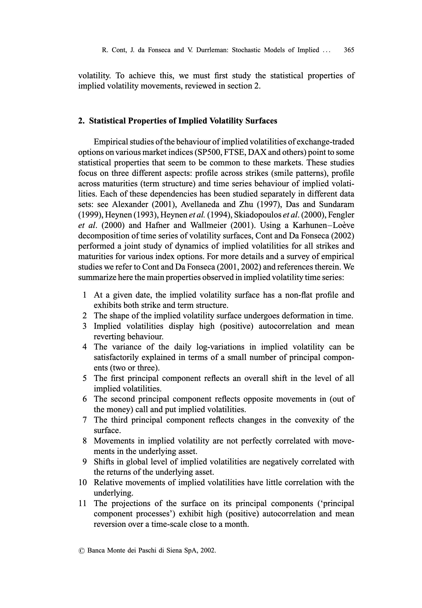
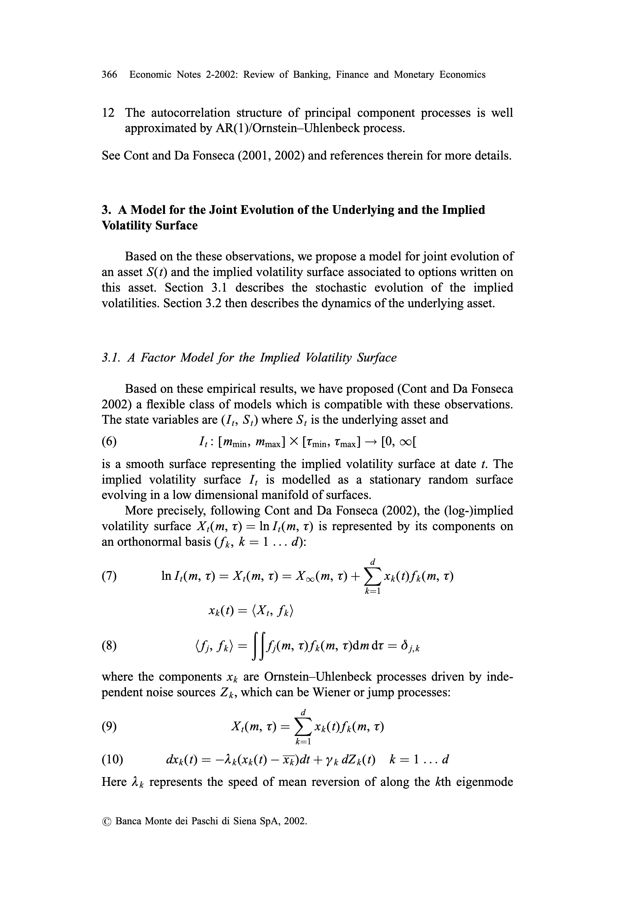
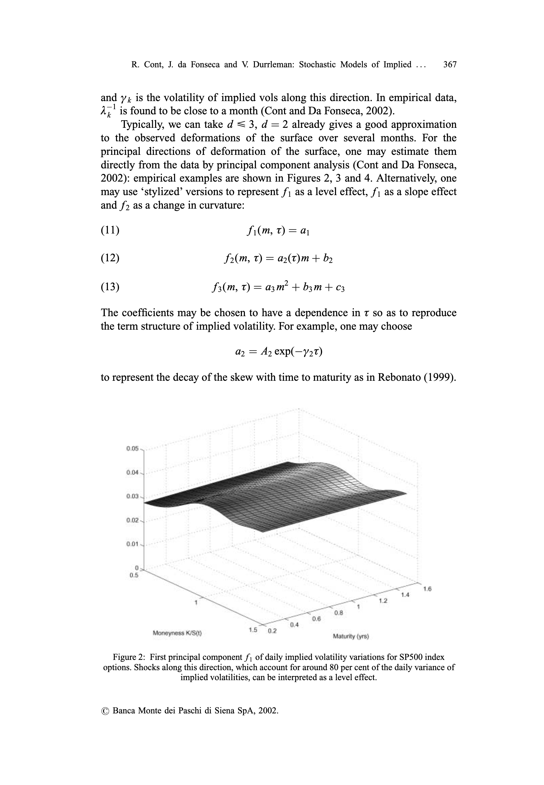
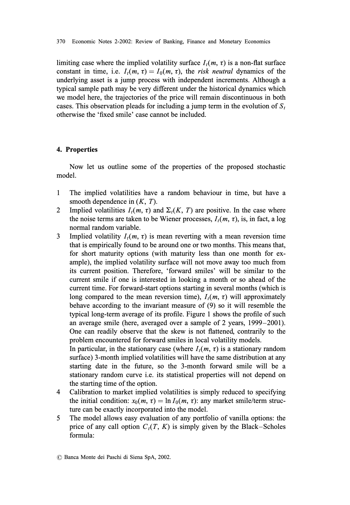
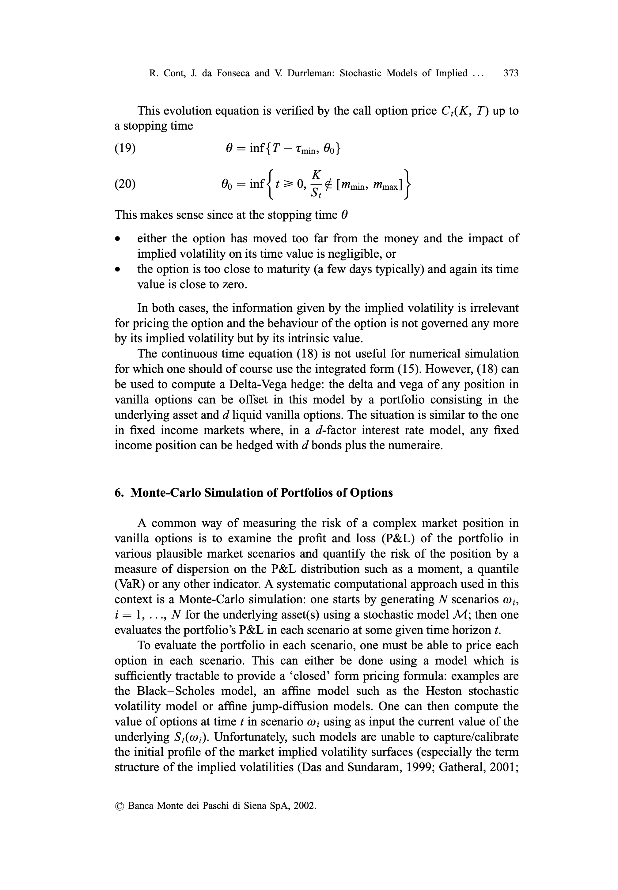
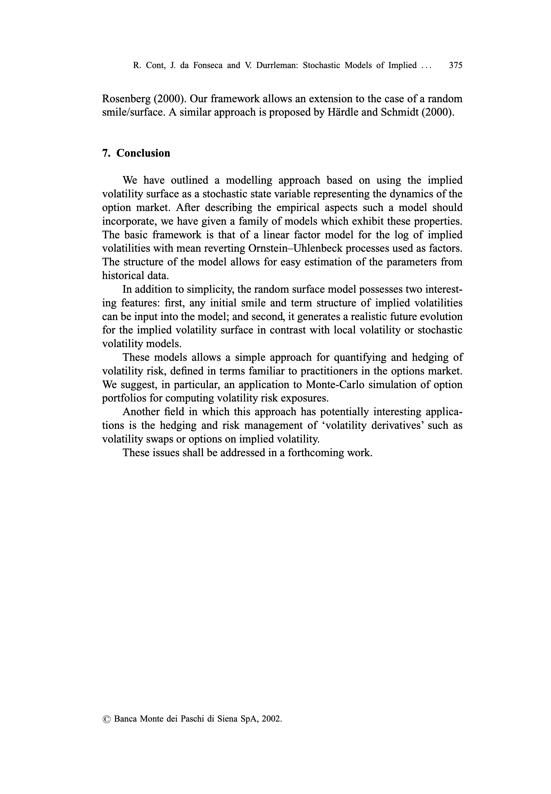

# Stochastic Models of Implied Volatility Surfaces

## Metadata

- **Source File:** `Stochastic Models of Implied Volatility Surfaces.pdf`
- **Authors:** Unknown
- **Year:** 2003
- **DOI:** 10.1111/1468-0300.00090

## Abstract

Not found.

## Main Text

Economic Notes by Banca Monte dei Paschi di Siena SpA, vol. 31, no. 2-2002, pp. 361-377
Stochastic Models of Implied Volatility
Surfaces*
RAMA Contt — JosE DA FONSECA? — VALDO DURRLEMANS
We propose a market-based approach to the modelling of implied
volatility, in which the implied volatility surface is directly used as the
state variable to describe the joint evolution of market prices of
options and their underlying asset. We model the evolution of an
implied volatility surface by representing it as a randomly fluctuating
surface driven by a finite number of orthogonal random factors. Our
approach is based on a Karhunen—Loéve decomposition of the daily
variations of implied volatilities obtained from market data on SP500
and DAX options.
We illustrate how this approach extends and improves the accuracy
of the well-known ‘sticky moneyness’ rule used by option traders for
updating implied volatilities. Our approach gives a justification for
the use of ‘Vegas’ for measuring volatility risk and provides a
decomposition of volatility risk as a sum of independent contributions
from empirically identifiable factors.
(JE.L.: G130, C14, C31).
In the market for call/put options, option prices are often represented in
term of the Black-Scholes implied volatilities, obtained by inverting the
Black-Scholes formula given the market price of the option. It is empirically
observed that the implied volatility 2,(K, T) of a call option with exercise
price K and maturity date T depends on (K, T). The function
2: (K, T) > 2K, T)
which represents this dependence is called the implied volatility surface at date
t. It summarizes the state of the options market at data t.
Two features of this surface have captured the attention of researchers in
* We thank Andrea Berardi, Vincent Lacoste, Ole Barndorff Nielsen, Eric Reiner and
seminar participants in Verona, HEC Montreal, Frontiers in Finance, RISK Math Week for their
comments and suggestions.
+ Centre de Mathématiques Appliquées, Ecole Polytechnique, F-91128 Palaiseau, France.
E-mail: Rama.Cont@polytechnique.fr http://www.cmap.polytechnique. fr/~rama/
+ Ecole Supérieure d’Ingenierie Leonard de Vinci, F-91926 Paris La Defense, France.
E-mail: jose.da_fonseca@devinci.fr
8 Department of Operations Research and Financial Engineering, Princeton University,
Princeton, NJ 08544.
© Banca Monte dei Paschi di Siena SpA, 2002. Published by Blackwell Publishers,
108 Cowley Road, Oxford OX4 1JE, UK and 350 Main Street, Malden, MA 02148, USA.

362 Economic Notes 2-2002: Review of Banking, Finance and Monetary Economics
financial modelling. First, the non-flat instantaneous profile of the surface,
whether it be a ‘smile’, ‘skew’ or the existence of a term structrue, point out to
the insufficiency of the Black-Scholes model for matching a set of option
prices at a given time instant and have led to various generalizations of the
Black—Scholes model which aim at reproducing realistic instantaneous profiles
for the surface 2,(K, T). Second, the fact that the surfaces itself changes
randomly with time as a result of supply and demand on the options market
means that a good risk management model must not only fit the shape of
2,(K, T) at a given date but also give realistic dynamics for 2,(K, T) in time.
This paper presents a non-technical summary of our recent work on a
market-based approach to the modelling of implied volatility, in which the
implied volatility surface is directly used as the state variable to describe the
joint evolution of market prices of options and their underlying asset. Our
model is built on empirical facts and captures statistical properties of implied
volatility dynamics in a parsimonious way.
We show how our stochastic implied volatility model allows a simple
description of the time evolution of a set of options and provides a rationale for
Vega hedging of portfolios of options. This modelling approach also allows us
to construct a Monte-Carlo framework for simulating scenarios for the joint
behaviour of a portfolio of call or put options, leading to a considerable gain in
computation time for scenario generation.
The paper is structured as follows. Section 1 introduces the implied
volatility surface and defines notations. Section 2 summarizes empirical findings on dynamics of implied volatility surfaces which are the foundation of
our approach. Motivated by these facts, a factor model for implied volatility
compatible with empirical observations is proposed in section 3. Some properties of the model are discussed in section 4. Evolution of call option prices is
discussed in section 5. Section 6 discusses an application to Monte-Carlo
simulation of a portfolio of options. Section 7 summarizes the results and
discusses further applications.
1. Implied Volatility Surfaces
Recall that a European call option on a non-dividend paying asset S with
maturity date T and strike price K is defined as a contingent claim with a payoff of (Sr — K)*. Denoting by t = T — tf the time remaining to maturity, the
Black and Scholes (1973) formula for the value of this call option is
() Cas(Si, K, t, 0) = S,N(d1) — Ke“ N(d2)
© Banca Monte dei Paschi di Siena SpA, 2002.
9susdl]
SUOWUWOD BAI}ESID ajqeoij|dde ay} Aq peuseaoB aie sajoiyie YO ‘asn jo sain 10} Asesqi] euljuC Aa|IM UO (SUO!}IPUOD-pUe-sWJ9a}/nNpa‘Uo}WeYBulgq ‘Axo1d wWod-AayIM-Asesqijauljuo//:sdj3Yy) Suol!puod pue
SWJ2L B43 80g *[9Z0Z/Z0/90] UO Asesq!] OUI|UO AaIIM ‘UO;WeYBuIg AuNs Ag °06000'00E0-89PL/LLLL OL/lop/npe' uoyweYBuig Axosdwos-AalIM-Asesg!|ouljuo//:sdyjy Wo1y papeojumog 'z '00z ‘OOEO89bL

R. Cont, J. da Fonseca and V. Durrleman: Stochastic Models of Implied ... 363
o2
—Inm+t\ r+—
d, = 2
oVt
o2
—Inm+t (. - “)
2 dad, =
@) 2 avi
where m = K/SS; is the moneyness and
u 2
N(u) = ony"? exp (- =) dz
Since the Black-Scholes price is strictly increasing with respect to the
volatility, it defines a one-to-one map between prices and volatilities:
(3) Vy E\(S — Ke~"7)*, S[, Alo > 0, Cas(Si, K, t, 0) = y
Consider now, in a market where the hypotheses of the Black—Scholes model
do not necessarily hold, a call option whose (observed) market price is denoted
by C*(K, T). The Black-Scholes implied volatility &,(K, 7) of the option is
then defined as the value of the volatility parameter, which equates the market
price with the price given by the Black-Scholes formula:
(4) dq! 2(K,T)>0, Cps(S, K, t, 2K, T)) = Cr(K, T)
The Black-Scholes implied volatility thus defined is a widely used market
indicator used by all options market practitioners and, as such, should be an
object of interest for modelling the evolution of the options market.
From the implicit function theorem, one expects that, in general, 2 will
depend on ¢, S, 7, K (and, of course, on the randomness w!). For fixed (K, T),
2,(K, T) is, in general, a stochastic process and, for fixed t, its value depends
on the characteristics of the option: the maturity T and the strike level K. The
function 2,: (K, T) — 2,(K, T) is called the implied volatility surface at date
t. Using the moneyness m = K/S, of the option, one can also represent the
implied volatility surface as a function of moneyness and maturity:
(5) I(m, 0) = =AmS,, t+7)
This representation is convenient because there is usually a range of moneyness around m = 1 for which the options are most liquid and, therefore, the
empirical data are most readily available. The implied volatility surface today
gives a snapshot of today’s market prices of vanilla options: given the current
term structure of interest rates and dividends, specifying the implied volatility
surface is equivalent to specifying prices of all vanilla options quoted on the
market.
A large body of empirical and theoretical literature deals with the profile
of the implied volatility surface for various markets as a function of (m, T) (or
© Banca Monte dei Paschi di Siena SpA, 2002.
9susdl]
SUOWUWOD BAI}ESID ajqeoij|dde ay} Aq peuseaoB aie sajoiyie YO ‘asn jo sain 10} Asesqi] euljuC Aa|IM UO (SUO!}IPUOD-pUe-sWJ9a}/nNpa‘Uo}WeYBulgq ‘Axo1d wWod-AayIM-Asesqijauljuo//:sdj3Yy) Suol!puod pue
SWJ2L B43 80g *[9Z0Z/Z0/90] UO Asesq!] OUI|UO AaIIM ‘UO;WeYBuIg AuNs Ag °06000'00E0-89PL/LLLL OL/lop/npe' uoyweYBuig Axosdwos-AalIM-Asesg!|ouljuo//:sdyjy Wo1y papeojumog 'z '00z ‘OOEO89bL

364 Economic Notes 2-2002: Review of Banking, Finance and Monetary Economics
(K, T)) at a given date, i.e. with (t, S,) fixed. While the Black-Scholes model
predicts a flat profile for the implied volatility surface J,(m, T), it is a welldocumented empirical fact that it exhibits both a non-flat strike and term
structure (Das and Sundaram, 1999; Dumas ef al., 1998; Heynen, 1993;
Rebonato, 1999). A typical illustration is given in Figure 1 in the case of DAX
index options.
A plethora of models have been proposed to model the instantaneous
profile in (m, T) of the implied volatility surface: local volatility models, jumpdiffusion models and stochastic volatility models with or without jumps.!
These ‘smile’ models are defined in terms of stochastic differential equations
whose parameters describe the infinitesimal evolution of the asset price: since
this evolution is not directly observed, calibration of model parameters to
market prices of options turns out to be an ill-posed problem whose numerical
solution is not trivial. However, even in cases where perfect calibration to
today’s option prices is achievable by a non-parametric model (for example, a
local volatility model), a perfect fit of the implied volatility surfaces does not
guarantee that the model will generate realistic future scenarios. This problem
can be seen in the shape of the future smile (that is, the smile for forward-start
options) generated by the model: many of these models, while giving good fits
to today’s implied volatility/call prices generate unrealistic forms for future
smiles, thus leading to a bias in prices of forward options.
As pointed out by Balland (2002), risk management of complex option
positions requires not only a model that can calibrate today’s market implied
volatilities but also a model which implies a realistic evolution of implied
Axwtage pratie of iinptid volatity surface
Figure 1: Average profile of the implied volatility of DAX options as a function of time to
maturity and moneyness, 1999-2001.
1 See Avellaneda and Cont (2002) for recent reviews on these topics.
© Banca Monte dei Paschi di Siena SpA, 2002.
9susdl]
SUOWUWOD BAI}ESID ajqeoij|dde ay} Aq peuseaoB aie sajoiyie YO ‘asn jo sain 10} Asesqi] euljuC Aa|IM UO (SUO!}IPUOD-pUe-sWJ9a}/nNpa‘Uo}WeYBulgq ‘Axo1d wWod-AayIM-Asesqijauljuo//:sdj3Yy) Suol!puod pue
sual ayy 8ag *[9Z0Z/Z0/90] UO Asesq!7 aul|UO AalIM ‘Uo}WeYBuIg Aung Ag *06000°00E0-89VLILLLL OL/op/npa"uoyweyBulg Axo1d: Wod-Kalim-Asesqiaurjuo//:sdyay Woy papeojumog 'z '€00z ‘OOEO89VL

R. Cont, J. da Fonseca and V. Durrleman: Stochastic Models of Implied ... 365
volatility. To achieve this, we must first study the statistical properties of
implied volatility movements, reviewed in section 2.
2. Statistical Properties of Implied Volatility Surfaces
Empirical studies of the behaviour of implied volatilities of exchange-traded
options on various market indices (SP500, FTSE, DAX and others) point to some
statistical properties that seem to be common to these markets. These studies
focus on three different aspects: profile across strikes (smile patterns), profile
across maturities (term structure) and time series behaviour of implied volatilities. Each of these dependencies has been studied separately in different data
sets: see Alexander (2001), Avellaneda and Zhu (1997), Das and Sundaram
(1999), Heynen (1993), Heynen et al. (1994), Skiadopoulos et al. (2000), Fengler
et al. (2000) and Hafner and Wallmeier (2001). Using a Karhunen—Loéve
decomposition of time series of volatility surfaces, Cont and Da Fonseca (2002)
performed a joint study of dynamics of implied volatilities for all strikes and
maturities for various index options. For more details and a survey of empirical
studies we refer to Cont and Da Fonseca (2001, 2002) and references therein. We
summarize here the main properties observed in implied volatility time series:
1 At a given date, the implied volatility surface has a non-flat profile and
exhibits both strike and term structure.
2 The shape of the implied volatility surface undergoes deformation in time.
3 Implied volatilities display high (positive) autocorrelation and mean
reverting behaviour.
4 The variance of the daily log-variations in implied volatility can be
satisfactorily explained in terms of a small number of principal components (two or three).
5 The first principal component reflects an overall shift in the level of all
implied volatilities.
6 The second principal component reflects opposite movements in (out of
the money) call and put implied volatilities.
7 The third principal component reflects changes in the convexity of the
surface.
8 Movements in implied volatility are not perfectly correlated with movements in the underlying asset.
9 Shifts in global level of implied volatilities are negatively correlated with
the returns of the underlying asset.
10 Relative movements of implied volatilities have little correlation with the
underlying.
11 The projections of the surface on its principal components (‘principal
component processes’) exhibit high (positive) autocorrelation and mean
reversion over a time-scale close to a month.
© Banca Monte dei Paschi di Siena SpA, 2002.
9susdl]
SUOWUWOD BAI}ESID ajqeoij|dde ay} Aq peuseaoB aie sajoiyie YO ‘asn jo sain 10} Asesqi] euljuC Aa|IM UO (SUO!}IPUOD-pUe-sWJ9a}/nNpa‘Uo}WeYBulgq ‘Axo1d wWod-AayIM-Asesqijauljuo//:sdj3Yy) Suol!puod pue
SWJ2L B43 80g *[9Z0Z/Z0/90] UO Asesq!] OUI|UO AaIIM ‘UO;WeYBuIg AuNs Ag °06000'00E0-89PL/LLLL OL/lop/npe' uoyweYBuig Axosdwos-AalIM-Asesg!|ouljuo//:sdyjy Wo1y papeojumog 'z '00z ‘OOEO89bL

366 Economic Notes 2-2002: Review of Banking, Finance and Monetary Economics
12 The autocorrelation structure of principal component processes is well
approximated by AR(1)/Ornstein—Uhlenbeck process.
See Cont and Da Fonseca (2001, 2002) and references therein for more details.
3. A Model for the Joint Evolution of the Underlying and the Implied
Volatility Surface
Based on the these observations, we propose a model for joint evolution of
an asset S(t) and the implied volatility surface associated to options written on
this asset. Section 3.1 describes the stochastic evolution of the implied
volatilities. Section 3.2 then describes the dynamics of the underlying asset.
3.1. A Factor Model for the Implied Volatility Surface
Based on these empirical results, we have proposed (Cont and Da Fonseca
2002) a flexible class of models which is compatible with these observations.
The state variables are (J,, S;) where S, is the underlying asset and
(6) I: [mins Mmax] X [Tmins Tmax] — [0, oof
is a smooth surface representing the implied volatility surface at date t. The
implied volatility surface J; is modelled as a stationary random surface
evolving in a low dimensional manifold of surfaces.
More precisely, following Cont and Da Fonseca (2002), the (log-)implied
volatility surface X;(m, Tt) = InJ,(m, T) is represented by its components on
an orthonormal basis (f;, k = 1... d):
d
(7) In ,(m, t) = Xi(m, 1) = Xoo(m, 0) + D> xe()fe(m, 7)
k=1
xe(t) = (X1, fe)
(8) fs fe) = | [scm 1)fe(m, t)dm dt = 54
where the components x; are Ornstein—Uhlenbeck processes driven by independent noise sources Z;, which can be Wiener or jump processes:
d
(9) Xm, 1) = > xu fam, 7)
k=1
(10) dxy(t) = —Ay(xp(t) —¥pdt + yx dZ(t) k=1...d
Here A; represents the speed of mean reversion of along the Ath eigenmode
© Banca Monte dei Paschi di Siena SpA, 2002.
9susdl]
SUOWUWOD BAI}ESID ajqeoij|dde ay} Aq peuseaoB aie sajoiyie YO ‘asn jo sain 10} Asesqi] euljuC Aa|IM UO (SUO!}IPUOD-pUe-sWJ9a}/nNpa‘Uo}WeYBulgq ‘Axo1d wWod-AayIM-Asesqijauljuo//:sdj3Yy) Suol!puod pue
SWJ2L B43 80g *[9Z0Z/Z0/90] UO Asesq!] OUI|UO AaIIM ‘UO;WeYBuIg AuNs Ag °06000'00E0-89PL/LLLL OL/lop/npe' uoyweYBuig Axosdwos-AalIM-Asesg!|ouljuo//:sdyjy Wo1y papeojumog 'z '00z ‘OOEO89bL

R. Cont, J. da Fonseca and V. Durrleman: Stochastic Models of Implied ... 367
and y, is the volatility of implied vols along this direction. In empirical data,
Ay! is found to be close to a month (Cont and Da Fonseca, 2002).
Typically, we can take d < 3, d = 2 already gives a good approximation
to the observed deformations of the surface over several months. For the
principal directions of deformation of the surface, one may estimate them
directly from the data by principal component analysis (Cont and Da Fonseca,
2002): empirical examples are shown in Figures 2, 3 and 4. Alternatively, one
may use ‘stylized’ versions to represent | as a level effect, f| as a slope effect
and f2 as a change in curvature:
(11) film, T) = ay
(12) S2(m, T) = ar(t)m + by
(13) f3(m, 8) = a3m? + b3m + ¢3
The coefficients may be chosen to have a dependence in T so as to reproduce
the term structure of implied volatility. For example, one may choose
az = Az exp(—72T)
to represent the decay of the skew with time to maturity as in Rebonato (1999).
0.05
0.01.
Moneyness K/Sit) Maturity (yrs)
Figure 2: First principal component /; of daily implied volatility variations for SP500 index
options. Shocks along this direction, which account for around 80 per cent of the daily variance of
implied volatilities, can be interpreted as a level effect.
© Banca Monte dei Paschi di Siena SpA, 2002.
9susdl]
SUOWUWOD BAI}ESID ajqeoij|dde ay} Aq peuseaoB aie sajoiyie YO ‘asn jo sain 10} Asesqi] euljuC Aa|IM UO (SUO!}IPUOD-pUe-sWJ9a}/nNpa‘Uo}WeYBulgq ‘Axo1d wWod-AayIM-Asesqijauljuo//:sdj3Yy) Suol!puod pue
sual ayy 8ag *[9Z0Z/Z0/90] UO Asesq!7 aul|UO AalIM ‘Uo}WeYBuIg Aung Ag *06000°00E0-89VLILLLL OL/op/npa"uoyweyBulg Axo1d: Wod-Kalim-Asesqiaurjuo//:sdyay Woy papeojumog 'z '€00z ‘OOEO89VL

368 Economic Notes 2-2002: Review of Banking, Finance and Monetary Economics
0.06 -
0.04
0.02
-0.02 —
-0.04
“05
-0.06 +-—__
oS o6 5 ~ 
 of daily implied volatility variations for SP500 index
options.
Figure 4: Third principal component /3 of daily implied volatility variations for SP500 index
options.
3.2. Evolution of the Underlying Asset
To compute dynamics of option prices, one needs to specify the dynamics
of the underlying asset. One possibility is to describe the
dS d
(14) " = pdt + ao(t)dZ? + S~ ax(t)dZx(t)
k=1
© Banca Monte dei Paschi di Siena SpA, 2002.
asuaoly
SUOWUWOD BAI}ESID ajqeoij|dde ay} Aq peuseaoB aie sajoiyie YO ‘asn jo sain 10} Asesqi] euljuC Aa|IM UO (SUO!}IPUOD-pUe-sWJ9a}/nNpa‘Uo}WeYBulgq ‘Axo1d wWod-AayIM-Asesqijauljuo//:sdj3Yy) Suol!puod pue
sual ayy 8ag *[9Z0Z/Z0/90] UO Asesq!7 aul|UO AalIM ‘Uo}WeYBuIg Aung Ag *06000°00E0-89VLILLLL OL/op/npa"uoyweyBulg Axo1d: Wod-Kalim-Asesqiaurjuo//:sdyay Woy papeojumog 'z '€00z ‘OOEO89VL

R. Cont, J. da Fonseca and V. Durrleman: Stochastic Models of Implied ... 369
where Z* are independent noise terms and Z° represents the idiosyncratic risk
in the underlying asset which is uncorrelated with the options market. For
example, Z‘, k = 0 ... d can be independent Wiener processes.
ao(t) £ 0 leads to an imperfect correlation between the underlying asset
and the implied volatility surface. Empirical results indicate a strong negative
correlation between movements in the level of implied volatility and the
underlying returns. This can be captured by imposing a,(t) < 0. The magnitude of a;, i > 2 is expected to be small (Cont and Da Fonseca, 2002).
Let us discuss now the relation between the two processes. Let F°, F/ be
respectively the filtrations generated by (S;) and J,(m, Tt). In a one-factor
complete market model, such as a local volatility model, the option prices can
be attained by dynamic hedging strategies invoving the underlying asset only,
so the information contained in the option prices is redundant with respect to
the information in F' $ : I(m, T) is an F S-adapted process.
In the model presented above, this is not the case: in general, neither F! is
contained in F°, nor the other way round. This is an important property of the
model and corresponds indeed to the real situation encountered on the market:
option prices can be affected by factors other than the underlying asset; and,
inversely, although market prices of options do give some information on the
underlying asset, there is not enough information on the options market to
retrieve, in a unique way, the implied dynamics of the underlying asset. This is,
by the way, the fundamental reason the problem of calibrating smile models to
option prices is ill-posed in general.
Arbitrage restrictions on stochastic models for implied volatilities were
considered in Schénbucher (1999), Brace et al. (2001) and Ledoit and Santa
Clara (1999) in a risk neutral framework. Note that here we have to consider,
from a risk management perspective, the real dynamics of the implied
volatilities and not the risk neutral dynamics, which may be very different. For
example, it is shown in Schénbucher (1999) that, in a model with a single
implied volatility, the risk neutral implied volatility has a mean-fleeing
(opposite of mean reverting!) behaviour. The relation between risk neutral and
historical dynamics is discussed in more detail in Cont and Durrleman (2002).
3.3. Nature of Noise Terms
As observed in Cont and Da Fonseca (2002), while it may appear more
convenient to choose Wiener processes as noise sources, this is not necessarily
the best choice. First, from an empirical point of view, the movements in
implied volatility can exhibit jumps: in the case of FTSE implied volatilities,
the second principal component process is observed to have heavy-tailed
increments with jump-like movements (Cont and Da Fonseca, 2002, figs 22
and 23). This observation pleads for the inclusion of jump terms in the
evolution of J; (in this case, in Z*). Second, as shown by Balland (2002), in the
© Banca Monte dei Paschi di Siena SpA, 2002.
9susdl]
SUOWUWOD BAI}ESID ajqeoij|dde ay} Aq peuseaoB aie sajoiyie YO ‘asn jo sain 10} Asesqi] euljuC Aa|IM UO (SUO!}IPUOD-pUe-sWJ9a}/nNpa‘Uo}WeYBulgq ‘Axo1d wWod-AayIM-Asesqijauljuo//:sdj3Yy) Suol!puod pue
SWJ2L B43 80g *[9Z0Z/Z0/90] UO Asesq!] OUI|UO AaIIM ‘UO;WeYBuIg AuNs Ag °06000'00E0-89PL/LLLL OL/lop/npe' uoyweYBuig Axosdwos-AalIM-Asesg!|ouljuo//:sdyjy Wo1y papeojumog 'z '00z ‘OOEO89bL

370 Economic Notes 2-2002: Review of Banking, Finance and Monetary Economics
limiting case where the implied volatility surface J,(m, T) is a non-flat surface
constant in time, i.e. /,(m, T) = Io(m, T), the risk neutral dynamics of the
underlying asset is a jump process with independent increments. Although a
typical sample path may be very different under the historical dynamics which
we model here, the trajectories of the price will remain discontinuous in both
cases. This observation pleads for including a jump term in the evolution of S;
otherwise the ‘fixed smile’ case cannot be included.
4. Properties
Now let us outline some of the properties of the proposed stochastic
model.
1 The implied volatilities have a random behaviour in time, but have a
smooth dependence in (K, T).
2 Implied volatilities 7,(m, tT) and 2,(K, T) are positive. In the case where
the noise terms are taken to be Wiener processes, /,(m, T), is, in fact, a log
normal random variable.
3 Implied volatility 7,(m, tT) is mean reverting with a mean reversion time
that is empirically found to be around one or two months. This means that,
for short maturity options (with maturity less than one month for example), the implied volatility surface will not move away too much from
its current position. Therefore, ‘forward smiles’ will be similar to the
current smile if one is interested in looking a month or so ahead of the
current time. For forward-start options starting in several months (which is
long compared to the mean reversion time), /,(m, T) will approximately
behave according to the invariant measure of (9) so it will resemble the
typical long-term average of its profile. Figure 1 shows the profile of such
an average smile (here, averaged over a sample of 2 years, 1999-2001).
One can readily observe that the skew is not flattened, contrarily to the
problem encountered for forward smiles in local volatility models.
In particular, in the stationary case (where J,(m, T) is a stationary random
surface) 3-month implied volatilities will have the same distribution at any
starting date in the future, so the 3-month forward smile will be a
stationary random curve i.e. its statistical properties will not depend on
the starting time of the option.
4 Calibration to market implied volatilities is simply reduced to specifying
the initial condition: xo(m, tT) = In Jo(m, T): any market smile/term structure can be exactly incorporated into the model.
5 The model allows easy evaluation of any portfolio of vanilla options: the
price of any call option C,(T, K) is simply given by the Black—Scholes
formula:
© Banca Monte dei Paschi di Siena SpA, 2002.
9susdl]
SUOWUWOD BAI}ESID ajqeoij|dde ay} Aq peuseaoB aie sajoiyie YO ‘asn jo sain 10} Asesqi] euljuC Aa|IM UO (SUO!}IPUOD-pUe-sWJ9a}/nNpa‘Uo}WeYBulgq ‘Axo1d wWod-AayIM-Asesqijauljuo//:sdj3Yy) Suol!puod pue
SWJ2L B43 80g *[9Z0Z/Z0/90] UO Asesq!] OUI|UO AaIIM ‘UO;WeYBuIg AuNs Ag °06000'00E0-89PL/LLLL OL/lop/npe' uoyweYBuig Axosdwos-AalIM-Asesg!|ouljuo//:sdyjy Wo1y papeojumog 'z '00z ‘OOEO89bL

R. Cont, J. da Fonseca and V. Durrleman: Stochastic Models of Implied ... 371
Ci(K, T) = Cps(Si, K; t, 2K, T))
K
(15) = Ces (s:. K,t, [i (5. T- ‘))
t
This is obviously true at the current date but also at any future date in any
scenario generated in a Monte-Carlo simulation of the factor model. In
particular, it suggests a simple way of generating joint scenarios for
implied volatilities (see section 6). This property should be contrasted for
example with the approach of Derman and Kani (1998) where the local
volatility surface is modelled as a random surface: in that case, the impact
on option prices is complicated and requires solving a PDE.
5. Evolution of European Call Options
As mentioned above, the price of a European call (or put) option is simply
given by applying the Black-Scholes formula to the current implied volatility
surface. The dynamic evolution of a call option is therefore given by Ito’s
formula:
OCs OCzs OCs
dt 4 dS, 4
at as © Os
107Cps 10°Cps
29s 2S S747 om
0? Ces
OzoS
(16) = 0, dt + A, dS; + Vega dz,(K, T)
dC(K, T)
d=(K, T)
d<X\K, T)>
+
d<X\K,T),S>,
where =(K, T) is the implied volatility for a given strike K and maturity date
T. One therefore requires the evolution of the fixed-strike volatility X(K, T),
the quadratic variations of the fixed-strike volatility, the quadratic variation of
S and their joint variation.
Proposition 1 Evolution of fixed strike implied volatilities The fixed-strike
implied volatility X(K, T) follows the dynamics
2
d&(K,T)_ @() (4S. .K
ZAK, T) 2 (Spx ann)
© Banca Monte dei Paschi di Siena SpA, 2002.
9susdl]
SUOWUWOD BAI}ESID ajqeoij|dde ay} Aq peuseaoB aie sajoiyie YO ‘asn jo sain 10} Asesqi] euljuC Aa|IM UO (SUO!}IPUOD-pUe-sWJ9a}/nNpa‘Uo}WeYBulgq ‘Axo1d wWod-AayIM-Asesqijauljuo//:sdj3Yy) Suol!puod pue
SWJ2L B43 80g *[9Z0Z/Z0/90] UO Asesq!] OUI|UO AaIIM ‘UO;WeYBuIg AuNs Ag °06000'00E0-89PL/LLLL OL/lop/npe' uoyweYBuig Axosdwos-AalIM-Asesg!|ouljuo//:sdyjy Wo1y papeojumog 'z '00z ‘OOEO89bL

372 Economic Notes 2-2002: Review of Banking, Finance and Monetary Economics
y.Ka,(t)
S;, Omfk
d V3,
+o Aakehe + Si +
k=1
d
K(@ —u— So yja(0f)
=1 K-02?
+ x4(2)\ Omfx 3 + xy mb
t t
Arti — Ocfx } | dt
d Ka, d
+o lyfe - ae, So x(DInfj | | dV i(0)
k=1 t j=l
(17)
Given the stochastic equation governing a fixed-strike implied volatility, it is
now straightforward to derive the evolution of a European call option by
substituting (17) in (16):
Proposition 2. Evolution of European call option The price of a European
call option C,(T, K) follows the dynamics
d
dC(T, K) = Midt+s,)~ ae i(t)
j=0
d .
+n(di)E(K, TVT — (rs a(t) 0 (OE Onf) aw
k=1 t
d
= M,dt+ S:A(T, K))_ aj(t)aw}
j=0
d d
(18) + Vega(T, K) )> bs - (ONO LOnht aw}
j=0 k=1 t
where M, is a drift term; see Cont and Durrleman (2002) for details. The
random terms are thus decomposed into a sum of two terms:
e a term proportional to the Black—Scholes delta of the option, already
present in a local volatility model
e aterm proportional to the Black-Scholes vega, representing the volatility
risk of the option.
Note that the sensitivities appearing in (18) are the usual Black—Scholes
sensitivities and are not model dependent, showing that the usual Black—
Scholes vegas will be the relevant sensitivities to compute in this modelling
approach.
© Banca Monte dei Paschi di Siena SpA, 2002.
9susdl]
SUOWUWOD BAI}ESID ajqeoij|dde ay} Aq peuseaoB aie sajoiyie YO ‘asn jo sain 10} Asesqi] euljuC Aa|IM UO (SUO!}IPUOD-pUe-sWJ9a}/nNpa‘Uo}WeYBulgq ‘Axo1d wWod-AayIM-Asesqijauljuo//:sdj3Yy) Suol!puod pue
SWJ2L B43 80g *[9Z0Z/Z0/90] UO Asesq!] OUI|UO AaIIM ‘UO;WeYBuIg AuNs Ag °06000'00E0-89PL/LLLL OL/lop/npe' uoyweYBuig Axosdwos-AalIM-Asesg!|ouljuo//:sdyjy Wo1y papeojumog 'z '00z ‘OOEO89bL

R. Cont, J. da Fonseca and V. Durrleman: Stochastic Models of Implied ... 373
This evolution equation is verified by the call option price C,(K, 7) up to
a stopping time
(19) 0 = inf{T — Tins Oo}
(20) = int 2 0, zt [™mins rl
t
This makes sense since at the stopping time 0
e either the option has moved too far from the money and the impact of
implied volatility on its time value is negligible, or
e the option is too close to maturity (a few days typically) and again its time
value is close to zero.
In both cases, the information given by the implied volatility is irrelevant
for pricing the option and the behaviour of the option is not governed any more
by its implied volatility but by its intrinsic value.
The continuous time equation (18) is not useful for numerical simulation
for which one should of course use the integrated form (15). However, (18) can
be used to compute a Delta-Vega hedge: the delta and vega of any position in
vanilla options can be offset in this model by a portfolio consisting in the
underlying asset and d liquid vanilla options. The situation is similar to the one
in fixed income markets where, in a d-factor interest rate model, any fixed
income position can be hedged with d bonds plus the numeraire.
6. Monte-Carlo Simulation of Portfolios of Options
A common way of measuring the risk of a complex market position in
vanilla options is to examine the profit and loss (P&L) of the portfolio in
various plausible market scenarios and quantify the risk of the position by a
measure of dispersion on the P&L distribution such as a moment, a quantile
(VaR) or any other indicator. A systematic computational approach used in this
context is a Monte-Carlo simulation: one starts by generating N scenarios w;,
i=1,..., N for the underlying asset(s) using a stochastic model M; then one
evaluates the portfolio’s P&L in each scenario at some given time horizon t.
To evaluate the portfolio in each scenario, one must be able to price each
option in each scenario. This can either be done using a model which is
sufficiently tractable to provide a ‘closed’ form pricing formula: examples are
the Black-Scholes model, an affine model such as the Heston stochastic
volatility model or affine jump-diffusion models. One can then compute the
value of options at time ¢ in scenario w; using as input the current value of the
underlying S,(w;). Unfortunately, such models are unable to capture/calibrate
the initial profile of the market implied volatility surfaces (especially the term
structure of the implied volatilities (Das and Sundaram, 1999; Gatheral, 2001;
© Banca Monte dei Paschi di Siena SpA, 2002.
9susdl]
SUOWUWOD BAI}ESID ajqeoij|dde ay} Aq peuseaoB aie sajoiyie YO ‘asn jo sain 10} Asesqi] euljuC Aa|IM UO (SUO!}IPUOD-pUe-sWJ9a}/nNpa‘Uo}WeYBulgq ‘Axo1d wWod-AayIM-Asesqijauljuo//:sdj3Yy) Suol!puod pue
SWJ2L B43 80g *[9Z0Z/Z0/90] UO Asesq!] OUI|UO AaIIM ‘UO;WeYBuIg AuNs Ag °06000'00E0-89PL/LLLL OL/lop/npe' uoyweYBuig Axosdwos-AalIM-Asesg!|ouljuo//:sdyjy Wo1y papeojumog 'z '00z ‘OOEO89bL

374 Economic Notes 2-2002: Review of Banking, Finance and Monetary Economics
Busca and Cont, 2002; Tompkins, 2001), so one cannot incorporate the
information on the initial smiles into them.
An alternative approach is then to use a model for the underlying asset
which is capable of fitting the initial volatility surface. This is the case for
example if one uses a non-parametric local volatility model (Dupire model):
(21) = = udt + a(t, S)dW,
t
where the local volatility surface o(-, -) is calibrated to match the initial
implied volatility surface Jo(-, -). Prices of call options are not given in closed
form but may be computed for all future dates and scenarios by solving
numerically the generalized Black—Scholes partial differential equation:
oc n oc n x?07(t, x)07C
ar” ax 2 Ox?
(23) Vx=0 C(T, x: T, Ky) =(x—K)*
(22)
— rC(t, x; T, K) =0
A known problem with this approach is that, when the calibration is done at
t = 0 and the model is translated forward in time, it produces a future smile
pattern that flattens out: the ‘forward smile’ cannot be time invariant (Berestycki et al., 2002). This is related to the fact that the local volatility surface is
parametrized by absolute maturity T (as opposed to relative maturity T).
Our mean reverting model for the implied volatility surface provides a
simple approach to the simulation of scenarios for the joint evolution of a
portfolio of call and put options which avoids these problems.
First, since the initial condition Jp is chosen to be the current market
surface, there is no issue with calibration so the model can take into account
the current volatility smile. Second, as noted in section 4, the implied
volatilities for forward-start options behave in a similar way to those today: in
the special case of the stationary model, in fact, the model becomes time
invariant. In particular, the forward smile does not flatten out: it will fluctuate
around its long-term average.
Moreover, since the parameters are estimated to match the statistical
properties of the time evolution of implied volatilities, the scenarios generated
for future smiles will be similar to those seen in historical data and coherent
with the type of evolution seen in the market.
A popular approach for marking to market exotic option deals is to use
static or quasi static replication (Carr et al., 1998; Allen and Padovani, 2002):
this technique reduces an exotic position to a portfolio of vanilla calls and puts.
In this case, such a portfolio can be readily priced in a Monte-Carlo sample
path using the same approach as above.
Such approaches have already been considered in the case where the atthe-money implied vol is perturbed by random shocks while the shape of the
smile is fixed: Malz (2001) uses this approach for stress-testing; see also
© Banca Monte dei Paschi di Siena SpA, 2002.
9susdl]
SUOWUWOD BAI}ESID ajqeoij|dde ay} Aq peuseaoB aie sajoiyie YO ‘asn jo sain 10} Asesqi] euljuC Aa|IM UO (SUO!}IPUOD-pUe-sWJ9a}/nNpa‘Uo}WeYBulgq ‘Axo1d wWod-AayIM-Asesqijauljuo//:sdj3Yy) Suol!puod pue
SWJ2L B43 80g *[9Z0Z/Z0/90] UO Asesq!] OUI|UO AaIIM ‘UO;WeYBuIg AuNs Ag °06000'00E0-89PL/LLLL OL/lop/npe' uoyweYBuig Axosdwos-AalIM-Asesg!|ouljuo//:sdyjy Wo1y papeojumog 'z '00z ‘OOEO89bL

R. Cont, J. da Fonseca and V. Durrleman: Stochastic Models of Implied ... 375
Rosenberg (2000). Our framework allows an extension to the case of a random
smile/surface. A similar approach is proposed by Hardle and Schmidt (2000).
7. Conclusion
We have outlined a modelling approach based on using the implied
volatility surface as a stochastic state variable representing the dynamics of the
option market. After describing the empirical aspects such a model should
incorporate, we have given a family of models which exhibit these properties.
The basic framework is that of a linear factor model for the log of implied
volatilities with mean reverting Ornstein—Uhlenbeck processes used as factors.
The structure of the model allows for easy estimation of the parameters from
historical data.
In addition to simplicity, the random surface model possesses two interesting features: first, any initial smile and term structure of implied volatilities
can be input into the model; and second, it generates a realistic future evolution
for the implied volatility surface in contrast with local volatility or stochastic
volatility models.
These models allows a simple approach for quantifying and hedging of
volatility risk, defined in terms familiar to practitioners in the options market.
We suggest, in particular, an application to Monte-Carlo simulation of option
portfolios for computing volatility risk exposures.
Another field in which this approach has potentially interesting applications is the hedging and risk management of ‘volatility derivatives’ such as
volatility swaps or options on implied volatility.
These issues shall be addressed in a forthcoming work.
© Banca Monte dei Paschi di Siena SpA, 2002.
9susdl]
SUOWUWOD BAI}ESID ajqeoij|dde ay} Aq peuseaoB aie sajoiyie YO ‘asn jo sain 10} Asesqi] euljuC Aa|IM UO (SUO!}IPUOD-pUe-sWJ9a}/nNpa‘Uo}WeYBulgq ‘Axo1d wWod-AayIM-Asesqijauljuo//:sdj3Yy) Suol!puod pue
SWJ2L B43 80g *[9Z0Z/Z0/90] UO Asesq!] OUI|UO AaIIM ‘UO;WeYBuIg AuNs Ag °06000'00E0-89PL/LLLL OL/lop/npe' uoyweYBuig Axosdwos-AalIM-Asesg!|ouljuo//:sdyjy Wo1y papeojumog 'z '00z ‘OOEO89bL

376 Economic Notes 2-2002: Review of Banking, Finance and Monetary Economics
REFERENCES
C. ALEXANDER (2001), “Principles of the Skew”, RISK, January, S29—32.
S. ALLEN - O. PADOVANI (2002), “Risk Management using Quasi Static Hedging”,
Economic Notes, this issue.
M. AVELLANEDA - R. CONT (eds) (2002), Special Issue on Volatility modeling,
Quantitative Finance, 2(1).
M. AVELLANEDA - Y. ZHU (1997), “An E-ARCH Model for the Term Structure of
Implied Volatility of FX Options”, Applied Mathematical Finance, 4, pp. 81-100.
P. BALLAND (2002), “Deterministic Implied Volatility Models”, Quantitative Finance,
2(1).
H. BERESTYCKI - J. BUSCA - I. FLORENT (2002), “Asymptotics and Calibration of Local
Volatility Models”, Quantitative Finance, 2(1), pp. 61—70.
F. BLACK - M. SCHOLES (1973), “The Pricing of Options and Corporate Liabilities”,
Journal of Political Economy, 81, pp. 637-54.
A. BRACE - B. GOLDYS - F. KLEBANER - R. WOMERSLEY (2001), “Market Model of
Stochastic Implied Volatility with Application to the BGM Model”, Working paper
S01-1, Department of Statistics, University of New South Wales.
J. Busca - R. Cont (2002), “Properties of Option Prices in Exponential Lévy Models”,
Working Paper, CMAP, Ecole Polytechnique.
P. CARR - P. ELLIS - V. GUPTA (1998), “Static Hedging of Exotic Options”, Journal of
Finance, LIII(3), pp. 1161-90.
R. ConT - J. DA FONSECA (2001), “Deformation of Implied Volatility Surfaces: An
Empirical Study”, in H. Takayasu (ed.), Empirical Science of Financial Fluctuations, Springer, Tokyo, pp. 230-9.
R. ConT - J. DA FONSECA (2002), “Dynamics of Implied Volatility Surfaces”,
Quantitative Finance, 2(1), pp. 45-60.
R. CONT- V. DURRLEMAN (2002), in preparation.
S. R. Das - R. K. SUNDARAM (1999), “Of Smiles and Smirks: A Term Structure
Perspective”, Journal of Financial and Quantitative Analysis, 34(2), pp.
211-40.
E. DERMAN - I. KANI (1998), “Stochastic Implied Trees: Arbitrage Pricing with
Stochastic Strike and Term Structure”, /nternational Journal of Theoretical and
Applied Finance, 1, pp. 61-110.
B. DUMAS - J. FLEMING - R. E. WHALEY (1998), “Implied Volatility Functions:
Empirical Tests”, The Journal of Finance, 8(6), pp. 2059-106.
M. FENGLER - W. HARDLE - C. VILLA (2000), ““The Dynamics of Implied Volatilities: A
Common Principal Component Approach”, Working paper, Humboldt Universitat,
Berlin.
© Banca Monte dei Paschi di Siena SpA, 2002.
9susdl]
SUOWUWOD BAI}ESID ajqeoij|dde ay} Aq peuseaoB aie sajoiyie YO ‘asn jo sain 10} Asesqi] euljuC Aa|IM UO (SUO!}IPUOD-pUe-sWJ9a}/nNpa‘Uo}WeYBulgq ‘Axo1d wWod-AayIM-Asesqijauljuo//:sdj3Yy) Suol!puod pue
sual ayy 8ag *[9Z0Z/Z0/90] UO Asesq!7 aul|UO AalIM ‘Uo}WeYBuIg Aung Ag *06000°00E0-89VLILLLL OL/op/npa"uoyweyBulg Axo1d: Wod-Kalim-Asesqiaurjuo//:sdyay Woy papeojumog 'z '€00z ‘OOEO89VL

R. Cont, J. da Fonseca and V. Durrleman: Stochastic Models of Implied ... 377
J. GATHERAL (2001), “Fitting the Implied Volatility Skew”, (lecture notes), NYU
Courant Institute.
R. HAFNER - M. WALLMEIER (2001), “The Dynamics of DAX Implied Volatilities”,
Quarterly International Journal of Finance, 1, $1—27.
W. HARDLE - P. SCHMIDT (2000), “Common Factors Governing VDAX Movements and
the Maximum Loss”, Humboldt University Working paper.
R. HEYNEN (1993), “An Empirical Investigation of Observed Smile Patterns”, Review
of Future Markets, 13, pp. 317-53.
R. HEYNEN - A. KEMMA - T. VorsT (1994), “Analysis of the Term Structure of Implied
Volatilities”, Journal of Financial and Quantitative Analysis, 29(1), pp. 31-56.
O. LEDoIT - P. SANTA CLARA (1999), “Relative Pricing of Options with Stochastic
Volatility”, UCLA Working paper.
A. MALZ (2001), “Do Implied Volatilities Provide an Early Warning of Market
Stress?”, Journal of Risk, 3(2).
R. REBONATO (1999), Volatility and Correlation in the Pricing of Equity, FX and
Interest Rate Options, Wiley, New York.
J. V. ROSENBERG (2000), “Implied Volatility Functions: A Reprise”, Journal of
Derivatives, 7(3).
P. J. SCHONBUCHER (1999), “A Market Model for Stochastic Implied Volatility”,
Philosophical Transactions of Royal Society, Series A, 357(1758), August,
pp. 2071-92.
G. SKIADOPOULOS - S. HODGES - L. CLELOW (2000), “Dynamics of the S&P500
Implied Volatility Surface”, Review of Derivatives Research, 3(3), pp. 263-82.
R. TOMPKINS (2001), “Stock Index Futures Markets: Stochastic Volatility Models and
Smiles”, The Journal of Futures Markets, 21(1), pp. 43-78.
© Banca Monte dei Paschi di Siena SpA, 2002.
9susdl]
SUOWUWOD BAI}ESID ajqeoij|dde ay} Aq peuseaoB aie sajoiyie YO ‘asn jo sain 10} Asesqi] euljuC Aa|IM UO (SUO!}IPUOD-pUe-sWJ9a}/nNpa‘Uo}WeYBulgq ‘Axo1d wWod-AayIM-Asesqijauljuo//:sdj3Yy) Suol!puod pue
sual ayy 8ag *[9Z0Z/Z0/90] UO Asesq!7 aul|UO AalIM ‘Uo}WeYBuIg Aung Ag *06000°00E0-89VLILLLL OL/op/npa"uoyweyBulg Axo1d: Wod-Kalim-Asesqiaurjuo//:sdyay Woy papeojumog 'z '€00z ‘OOEO89VL

## Tables

No tables extracted.

## Figures

## Extraction Notes

- OCR image fallback replaced text extraction output
- OCR text table fallback found no recoverable structured tables
