# arXiv:2108.08481v6 [cs.LG] 2 May 2024

## Metadata

- **Source File:** `2108.08481v6.pdf`
- **Authors:** Unknown
- **Year:** 2022
- **DOI:** Unknown

## Abstract

The classical development of neural networks has primarily focused on learning mappings between finite dimensional Euclidean spaces or finite sets. We propose a generalization of neural networks to learn operators, termed neural operators, that map between infinite dimensional function spaces. We formulate the neural operator as a composition of linear integral operators and nonlinear activation functions. We prove a universal approximation theorem for our proposed neural operator, showing that it can approximate any given nonlinear continuous operator. The proposed neural operators are also discretization-invariant, i.e., they share the same model parameters among different discretization of the underlying function spaces. Furthermore, we introduce four classes of efficient parameterization, viz., graph neural operators, multi-pole graph neural operators, low-rank neural operators, and Fourier neural operators. An important application for neural operators is learning surrogate maps for the solution operators of partial differential equations (PDEs). We consider standard PDEs such as the Burgers, Darcy subsurface flow, and the Navier-Stokes equations, and show that the proposed neural operators have superior performance compared to existing machine learning based methodologies, while being several orders of magnitude faster than conventional PDE solvers. Keywords: Deep Learning, Operator Learning, Discretization-Invariance, Partial Differential Equations, Navier-Stokes Equation.

## Main Text

Journal of Machine Learning Research 23 (2022) 1-97
Submitted 12/21; Revised 10/22; Published 12/22
### Neural Operator: Learning Maps Between Function Spaces
### With Applications to PDEs
Nikola Kovachki∗†
NKOVACHKI@NVIDIA.COM Nvidia
Zongyi Li∗
ZONGYILI@CALTECH.EDU Caltech
Burigede Liu
BL377@CAM.AC.UK Cambridge University
Kamyar Azizzadenesheli
KAMYARA@NVIDIA.COM Nvidia
## arXiv:2108.08481v6 [cs.LG] 2 May 2024
Kaushik Bhattacharya
BHATTA@CALTECH.EDU Caltech
Andrew Stuart
ASTUART@CALTECH.EDU Caltech
Anima Anandkumar
ANIMA@CALTECH.EDU Caltech
Editor: Lorenzo Rosasco
Abstract
The classical development of neural networks has primarily focused on learning mappings between finite dimensional Euclidean spaces or finite sets. We propose a generalization of neural networks to learn operators, termed neural operators, that map between infinite dimensional function
spaces. We formulate the neural operator as a composition of linear integral operators and nonlinear
activation functions. We prove a universal approximation theorem for our proposed neural operator,
showing that it can approximate any given nonlinear continuous operator. The proposed neural operators are also discretization-invariant, i.e., they share the same model parameters among different
discretization of the underlying function spaces. Furthermore, we introduce four classes of efficient
parameterization, viz., graph neural operators, multi-pole graph neural operators, low-rank neural
operators, and Fourier neural operators. An important application for neural operators is learning
surrogate maps for the solution operators of partial differential equations (PDEs). We consider
standard PDEs such as the Burgers, Darcy subsurface flow, and the Navier-Stokes equations, and
show that the proposed neural operators have superior performance compared to existing machine
learning based methodologies, while being several orders of magnitude faster than conventional
PDE solvers.
Keywords:
Deep Learning, Operator Learning, Discretization-Invariance, Partial Differential
Equations, Navier-Stokes Equation.
1. Introduction
Learning mappings between function spaces has widespread applications in science and engineering. For instance, for solving differential equations, the input is a coefficient function and the
output is a solution function. A straightforward solution to this problem is to simply discretize the
infinite-dimensional input and output function spaces into finite-dimensional grids, and apply standard learning models such as neural networks. However, this limits applicability since the learned
*. Equal contribution.
†. Majority of the work was completed while the author was at Caltech.
©2022 Nikola Kovachki, Zongyi Li, Burigede Liu, Kamyar Azizzadenesheli, Kaushik Bhattacharya, Andrew Stuart, Anima
Anandkumar.
License: CC-BY 4.0, see https://creativecommons.org/licenses/by/4.0/. Attribution requirements are provided at
http://jmlr.org/papers/v23/21-1524.html.

KOVACHKI, LI, LIU, AZIZZADENESHELI, BHATTACHARYA, STUART, ANANDKUMAR
neural network model may not generalize well to different discretizations, beyond the discretization
grid of the training data.
To overcome these limitations of standard neural networks, we formulate a new deep-learning
framework for learning operators, called neural operators, which directly map between function
spaces on bounded domains. Since our neural operator is designed on function spaces, they can be
discretized by a variety of different methods, and at different levels of resolution, without the need
for re-training. In contrast, standard neural network architectures depend heavily on the discretization of training data: new architectures with new parameters may be needed to achieve the same
error for data with varying discretization. We also propose the notion of discretization-invariant
models and prove that our neural operators satisfy this property, while standard neural networks do
not.
1.1 Our Approach
Discretization-Invariant Models.
We formulate a precise mathematical notion of discretization
invariance. We require any discretization-invariant model with a fixed number of parameters to
satisfy the following:
1. acts on any discretization of the input function, i.e. accepts any set of points in the input domain,
2. can be evaluated at any point of the output domain,
3. converges to a continuum operator as the discretization is refined.
The first two requirements of accepting any input and output points in the domain is a natural
requirement for discretization invariance, while the last one ensures consistency in the limit as the
discretization is refined. For example, families of graph neural networks (Scarselli et al., 2008) and
transformer models (Vaswani et al., 2017) are resolution invariant, i.e., they can receive inputs at any
resolution, but they fail to converge to a continuum operator as discretization is refined. Moreover,
we require the models to have a fixed number of parameters; otherwise, the number of parameters
becomes unbounded in the limit as the discretization is refined, as shown in Figure 1. Thus the
notion of discretization invariance allows us to define neural operator models that are consistent
in function spaces and can be applied to data given at any resolution and on any mesh. We also
establish that standard neural network models are not discretization invariant.
Neural Operators.
We introduce the concept of neural operators for learning operators that are
mappings between infinite-dimensional function spaces. We propose neural operator architectures
to be multi-layers where layers are themselves operators composed with non-linear activations. This
ensures that that the overall end-to-end composition is an operator, and thus satisfies the discretization invariance property. The key design choice for neural operator is the operator layers. To keep it
simple, we limit ourselves to layers that are linear operators. Since these layers are composed with
non-linear activations, we obtain neural operator models that are expressive and able to capture any
continuous operator. The latter property is known as universal approximation.
The above line of reasoning for neural operator design follows closely the design of standard
neural networks, where linear layers (e.g. matrix multiplication, convolution) are composed with
non-linear activations, and we have universal approximation of continuous functions defined on
compact domains (Hornik et al., 1989). Neural operators replace finite-dimensional linear layers in
neural networks with linear operators in function spaces.
2

NEURAL OPERATOR: LEARNING MAPS BETWEEN FUNCTION SPACES WITH APPLICATIONS TO PDES
Figure 1: Discretization Invariance
An discretization-invariant operator has convergent predictions on a mesh refinement.
We formally establish that neural operator models with a fixed number of parameters satisfy
discretization invariance. We further show that neural operators models are universal approximators
of continuous operators acting between Banach spaces, and can uniformly approximate any continuous operator defined on a compact set of a Banach space. Neural operators are the only known
class of models that guarantee both discretization-invariance and universal approximation.
See Table 1 for a comparison among the deep learning models. Previous deep learning models are
mostly defined on a fixed grid, and removing, adding, or moving grid points generally makes these
models no longer applicable. Thus, they are not discretization invariant.
We propose several design choices for the linear operator layers in neural operator such as a parameterized integral operator or through multiplication in the spectral domain as shown in Figure 2.
Specifically, we propose four practical methods for implementing the neural operator framework:
graph-based operators, low-rank operators, multipole graph-based operators, and Fourier operators.
Specifically, for graph-based operators, we develop a Nystr¨om extension to connect the integral operator formulation of the neural operator to families of graph neural networks (GNNs) on arbitrary
grids. For Fourier operators, we consider the spectral domain formulation of the neural operator
which leads to efficient algorithms in settings where fast transform methods are applicable.
We include an exhaustive numerical study of the four formulations of neural operators. Numerically, we show that the proposed methodology consistently outperforms all existing deep learning
methods even on the resolutions for which the standard neural networks were designed. For the
two-dimensional Navier-Stokes equation, when learning the entire flow map, the method achieves
< 1% error for a Reynolds number of 20 and 8% error for a Reynolds number of 200.
The proposed Fourier neural operator (FNO) has an inference time that is three orders of magnitude faster than the pseudo-spectral method used to generate the data for the Navier-Stokes problem
(Chandler and Kerswell, 2013) – 0.005s compared to the 2.2s on a 256 × 256 uniform spatial grid.
Despite its tremendous speed advantage, the method does not suffer from accuracy degradation
when used in downstream applications such as solving Bayesian inverse problems. Furthermore,
we demonstrate that FNO is robust to noise on the testing problems we consider here.
3

KOVACHKI, LI, LIU, AZIZZADENESHELI, BHATTACHARYA, STUART, ANANDKUMAR
...
u
a
P
Layer L
Layer 1
Layer 2
Neural Operator Layer
ʃ k(x,y)v(y)dμ(y) + b(x)
σ
+
v
W
Instantiations of neural operator layer
Neural Operator Layer
k(x,y )v(y ) + b(x)
B
(x,r)
i
i
B
i
(x,r)
GNO layer
σ
+
v
W
Neural Operator Layer
+ b(x)
LNO layer
σ
+
v
W
Neural Operator Layer
ℱ-1 R
( . (v))(x) + b(x)
ℱ
FNO layer
σ
+
v
W
Figure 2: Neural operator architecture schematic
The input function a is passed to a pointwise lifting operator P that is followed by T layers of integral
operators and pointwise non-linearity operations σ. In the end, the pointwise projection operator Q outputs
the function u. Three instantiation of neural operator layers, GNO, LNO, and FNO are provided.
1.2 Background and Context
Data-driven approaches for solving PDEs.
Over the past decades, significant progress has been
made in formulating (Gurtin, 1982) and solving (Johnson, 2012) the governing PDEs in many scientific fields from micro-scale problems (e.g., quantum and molecular dynamics) to macro-scale
applications (e.g., civil and marine engineering). Despite the success in the application of PDEs to
solve real-world problems, two significant challenges remain: (1) identifying the governing model
for complex systems; (2) efficiently solving large-scale nonlinear systems of equations.
Identifying and formulating the underlying PDEs appropriate for modeling a specific problem
usually requires extensive prior knowledge in the corresponding field which is then combined with
universal conservation laws to design a predictive model. For example, modeling the deformation
and failure of solid structures requires detailed knowledge of the relationship between stress and
strain in the constituent material. For complicated systems such as living cells, acquiring such
knowledge is often elusive and formulating the governing PDE for these systems remains pro4

NEURAL OPERATOR: LEARNING MAPS BETWEEN FUNCTION SPACES WITH APPLICATIONS TO PDES
Model
NNs
DeepONets
Interpolation
Neural Operators
Property
✗
✗
✓
✓
Discretization Invariance
✗
✓
✓
✓
Is the output a function?
✗
✓
✓
✓
Can query the output at any point?
✗
✗
✓
✓
Can take the input at any point?
✗
✓
✗
✓
Universal Approximation
Table 1: Comparison of deep learning models. The first row indicates whether the model is discretization invariant. The second and third rows indicate whether the output and input are a functions. The fourth row indicates whether the model class is a universal approximator of operators.
Neural Operators are discretization invariant deep learning methods that output functions and can
approximate any operator.
hibitive, or the models proposed are too simplistic to be informative. The possibility of acquiring
such knowledge from data can revolutionize these fields. Second, solving complicated nonlinear
PDE systems (such as those arising in turbulence and plasticity) is computationally demanding and
can often make realistic simulations intractable. Again the possibility of using instances of data to
design fast approximate solvers holds great potential for accelerating numerous problems.
Learning PDE Solution Operators.
In PDE applications, the governing differential equations
are by definition local, whilst the solution operator exhibits non-local properties. Such non-local
effects can be described by integral operators explicitly in the spatial domain, or by means of spectral domain multiplication; convolution is an archetypal example. For integral equations, the graph
approximations of Nystr¨om type (Belongie et al., 2002) provide a consistent way of connecting
different grid or data structures arising in computational methods and understanding their continuum limits (Von Luxburg et al., 2008; Trillos and Slepˇcev, 2018; Trillos et al., 2020). For spectral
domain calculations, there are well-developed tools that exist for approximating the continuum
(Boyd, 2001; Trefethen, 2000). However, these approaches for approximating integral operators
are not data-driven. Neural networks present a natural approach for learning-based integral operator approximations since they can incorporate non-locality. However, standard neural networks are
limited to the discretization of training data and hence, offer a poor approximation to the integral
operator. We tackle this issue here by proposing the framework of neural operators.
Properties of existing deep-learning models.
Previous deep learning models are mostly defined
on a fixed grid, and removing, adding, or moving grid points generally makes these models no longer
applicable, as seen in Table 1. Thus, they are not discretization invariant. In general, standard neural
networks (NN) (such as Multilayer perceptron (MLP), convolution neural networks (CNN), Resnet,
and Vision Transformers (ViT)) that take the input grid and output grid as finite-dimensional vectors
are not discretization-invariant since their input and output have to be at the fixed grid with fixed
location. On the other hand, the pointwise neural networks used in PINNs (Raissi et al., 2019) that
take each coordinate as input are discretization-invariant since it can be applied at each location
in parallel. However PINNs only represent the solution function of one instance and it does not
learn the map from the input functions to the output solution functions. A special class of neural
networks is convolution neural networks (CNNs). CNNs also do not converge with grid refinement
5

KOVACHKI, LI, LIU, AZIZZADENESHELI, BHATTACHARYA, STUART, ANANDKUMAR
since their respective fields change with different input grids. On the other hand, if normalized
by the grid size, CNNs can be applied to uniform grids with different resolutions, which converge
to differential operators, in a similar fashion to the finite difference method. Interpolation is a
baseline approach to achieve discretization-invariance. While NNs+Interpolation (or in general any
finite-dimensional neural networks+Interpolation) are resolution invariant and their outputs can be
queried at any point, they are not universal approximators of operators since the dimension of input
and output of the internal CNN model is defined to a bounded number. DeepONets (Lu et al., 2019)
are a class of operators that have the universal approximation property. DeepONets consist of a
branch net and a trunk net. The trunk net allows queries at any point, but the branch net constrains
the input to fixed locations; however it is possible to modify the branch net to make the methodology
discretization invariant, for example by using the PCA-based approach as used in (De Hoop et al.,
2022).
Furthermore, we show transformers (Vaswani et al., 2017) are special cases of neural operators
with structured kernels that can be used with varying grids to represent the input function. However,
the commonly used vision-based extensions of transformers, e.g., ViT (Dosovitskiy et al., 2020),
use convolutions on patches to generate tokens, and therefore, they are not discretization-invariant
models.
We also show that when our proposed neural operators are applied only on fixed grids, the resulting architectures coincide with neural networks and other operator learning frameworks. In such
reductions, point evaluations of the input functions are available on the grid points. In particular, we
show that the recent work of DeepONets (Lu et al., 2019), which are maps from finite-dimensional
spaces to infinite dimensional spaces are special cases of neural operators architecture when neural operators are limited only to fixed input grids. Moreover, by introducing an adjustment to the
DeepONet architecture, we propose the DeepONet-Operator model that fits into the full operator
learning framework of maps between function spaces.
2. Learning Operators
In subsection 2.1, we describe the generic setting of PDEs to make the discussions in the following
setting concrete. In subsection 2.2, we outline the general problem of operator learning as well as
our approach to solving it. In subsection 2.3, we discuss the functional data that is available and
how we work with it numerically.
2.1 Generic Parametric PDEs
We consider the generic family of PDEs of the following form,
x ∈D,
(Lau)(x) = f(x),
(1)
x ∈∂D,
u(x) = 0,
for some a ∈A, f ∈U∗and D ⊂Rd a bounded domain. We assume that the solution u : D →R
lives in the Banach space U and La : A →L(U; U∗) is a mapping from the parameter Banach
space A to the space of (possibly unbounded) linear operators mapping U to its dual U∗. A natural
operator which arises from this PDE is G† := L−1
a f : A →U defined to map the parameter to the
solution a 7→u. A simple example that we study further in Section 6.2 is when La is the weak
form of the second-order elliptic operator −∇· (a∇) subject to homogeneous Dirichlet boundary
6

NEURAL OPERATOR: LEARNING MAPS BETWEEN FUNCTION SPACES WITH APPLICATIONS TO PDES
conditions. In this setting, A = L∞(D; R+), U = H1
0(D; R), and U∗= H−1(D; R). When
needed, we will assume that the domain D is discretized into K ∈N points and that we observe
N ∈N pairs of coefficient functions and (approximate) solution functions {a(i), u(i)}N
i=1 that are
used to train the model (see Section 2.2). We assume that a(i) are i.i.d. samples from a probability
measure µ supported on A and u(i) are the pushforwards under G†.
2.2 Problem Setting
Our goal is to learn a mapping between two infinite dimensional spaces by using a finite collection of observations of input-output pairs from this mapping. We make this problem concrete in
the following setting. Let A and U be Banach spaces of functions defined on bounded domains
D ⊂Rd, D′ ⊂Rd′ respectively and G† : A →U be a (typically) non-linear map. Suppose we
i=1 where a(i) ∼µ are i.i.d. samples drawn from some probability
have observations {a(i), u(i)}N
measure µ supported on A and u(i) = G†(a(i)) is possibly corrupted with noise. We aim to build an
approximation of G† by constructing a parametric map
θ ∈Rp
Gθ : A →U,
(2)
with parameters from the finite-dimensional space Rp and then choosing θ† ∈Rp so that Gθ† ≈G†.
We will be interested in controlling the error of the approximation on average with respect to µ.
In particular, assuming G† is µ-measurable, we will aim to control the L2
µ(A; U) Bochner norm of
the approximation
Z
∥G† −Gθ∥2
L2µ(A;U) = Ea∼µ∥G†(a) −Gθ(a)∥2
∥G†(a) −Gθ(a)∥2
U =
U dµ(a).
(3)
A
This is a natural framework for learning in infinite-dimensions as one could seek to solve the associated empirical-risk minimization problem
N
1
∥u(i) −Gθ(a(i))∥2
X
θ∈Rp Ea∼µ∥G†(a) −Gθ(a)∥2
U ≈min
min
(4)
U
N
θ∈Rp
i=1
which directly parallels the classical finite-dimensional setting (Vapnik, 1998). As well as using
error measured in the Bochner norm, we will also consider the setting where error is measured
uniformly over compact sets of A. In particular, given any K ⊂A compact, we consider
∥G†(a) −Gθ(a)∥U
sup
(5)
a∈K
which is a more standard error metric in the approximation theory literature. Indeed, the classic
approximation theory of neural networks in formulated analogously to equation (5) (Hornik et al.,
1989).
In Section 8 we show that, for the architecture we propose and given any desired error tolerance,
there exists p ∈N and an associated parameter θ† ∈Rp, so that the loss (3) or (5) is less than the
specified tolerance. However, we do not address the challenging open problems of characterizing
the error with respect to either (a) a fixed parameter dimension p or (b) a fixed number of training
samples N. Instead, we approach this in the empirical test-train setting where we minimize (4)
based on a fixed training set and approximate (3) from new samples that were not seen during
7

KOVACHKI, LI, LIU, AZIZZADENESHELI, BHATTACHARYA, STUART, ANANDKUMAR
training. Because we conceptualize our methodology in the infinite-dimensional setting, all finitedimensional approximations can share a common set of network parameters which are defined in the
(approximation-free) infinite-dimensional setting. In particular, our architecture does not depend on
the way the functions a(i), u(i) are discretized. . The notation used through out this paper, along
with a useful summary table, may be found in Appendix A.
2.3 Discretization
Since our data a(i) and u(i) are, in general, functions, to work with them numerically, we assume
access only to their point-wise evaluations. To illustrate this, we will continue with the example
of the preceding paragraph. For simplicity, assume D = D′ and suppose that the input and output
functions are both real-valued. Let D(i) = {x(i)
ℓ}L
ℓ=1 ⊂D be a L-point discretization of the
domain D and assume we have observations a(i)|D(i), u(i)|D(i) ∈RL, for a finite collection of
input-output pairs indexed by j. In the next section, we propose a kernel inspired graph neural
network architecture which, while trained on the discretized data, can produce the solution u(x) for
any x ∈D given an input a ∼µ. In particular, our discretized architecture maps into the space
U and not into a discretization thereof. Furthermore our parametric operator class is consistent, in
that, given a fixed set of parameters, refinement of the input discretization converges to the true
functions space operator. We make this notion precise in what follows and refer to architectures that
possess it as function space architectures, mesh-invariant architectures, or discretization-invariant
architectures. *
Definition 1 We call a discrete refinement of the domain D ⊂Rd any sequence of nested sets
D1 ⊂D2 ⊂· · · ⊂D with |DL| = L for any L ∈N such that, for any ϵ > 0, there exists a number
L = L(ϵ) ∈N such that
{y ∈Rd : ∥y −x∥2 < ϵ}.
[
D ⊆
x∈DL
L=1 of the domain D ⊂Rd, any member DL is
Definition 2 Given a discrete refinement (DL)∞
called a discretization of D.
Since a : D ⊂Rd →Rm, pointwise evaluation of the function (discretization) at a set of L points
ℓ=1. Note that this may be viewed as a vector in RLd × RLm.
gives rise to the data set {(xℓ, a(xℓ))}L
An example of the mesh refinement is given in Figure 1.
Definition 3 Suppose A is a Banach space of Rm-valued functions on the domain D ⊂Rd. Let
G : A →U be an operator, DL be an L-point discretization of D, and ˆG : RLd × RLm →U some
map. For any K ⊂A compact, we define the discretized uniform risk as
RK(G, ˆG, DL) = sup
∥ˆG(DL, a|DL) −G(a)∥U.
a∈K
Definition 4 Let Θ ⊆Rp be a finite dimensional parameter space and G : A × Θ →U a map
representing a parametric class of operators with parameters θ ∈Θ. Given a discrete refinement
n=1 of the domain D ⊂Rd, we say G is discretization-invariant if there exists a sequence of
(Dn)∞
*. Note that the meaning of the indexing of sets D• in the following definition differs that used earlier in this paragraph.
8

NEURAL OPERATOR: LEARNING MAPS BETWEEN FUNCTION SPACES WITH APPLICATIONS TO PDES
maps ˆG1, ˆG2, . . . where ˆGL : RLd × RLm × Θ →U such that, for any θ ∈Θ and any compact set
K ⊂A,
L→∞RK(G(·, θ), ˆGL(·, ·, θ), DL) = 0.
lim
We prove that the architectures proposed in Section 3 are discretization-invariant. We further verify
this claim numerically by showing that the approximation error is approximately constant as we
refine the discretization. Such a property is highly desirable as it allows a transfer of solutions
between different grid geometries and discretization sizes with a single architecture that has a fixed
number of parameters.
We note that, while the application of our methodology is based on having point-wise evaluations of the function, it is not limited by it. One may, for example, represent a function numerically
as a finite set of truncated basis coefficients. Invariance of the representation would then be with
respect to the size of this set. Our methodology can, in principle, be modified to accommodate this
scenario through a suitably chosen architecture. We do not pursue this direction in the current work.
From the construction of neural operators, when the input and output functions are evaluated on
fixed grids, the architecture of neural operators on these fixed grids coincide with the class of neural
networks.
3. Neural Operators
In this section, we outline the neural operator framework. We assume that the input functions a ∈A
are Rda-valued and defined on the bounded domain D ⊂Rd while the output functions u ∈U are
Rdu-valued and defined on the bounded domain D′ ⊂Rd′. The proposed architecture Gθ : A →U
has the following overall structure:
1. Lifting: Using a pointwise function Rda →Rdv0, map the input {a : D →Rda} 7→{v0 :
D →Rdv0} to its first hidden representation. Usually, we choose dv0 > da and hence this is
a lifting operation performed by a fully local operator.
2. Iterative Kernel Integration: For t = 0, . . . , T −1, map each hidden representation to the
next {vt : Dt →Rdvt} 7→{vt+1 : Dt+1 →Rdvt+1} via the action of the sum of a local linear
operator, a non-local integral kernel operator, and a bias function, composing the sum with a
fixed, pointwise nonlinearity. Here we set D0 = D and DT = D′ and impose that Dt ⊂Rdt
is a bounded domain.†
3. Projection: Using a pointwise function RdvT →Rdu, map the last hidden representation
{vT : D′ →RdvT } 7→{u : D′ →Rdu} to the output function. Analogously to the first
step, we usually pick dvT > du and hence this is a projection step performed by a fully local
operator.
The outlined structure mimics that of a finite dimensional neural network where hidden representations are successively mapped to produce the final output. In particular, we have
Gθ := Q ◦σT (WT−1 + KT−1 + bT−1) ◦· · · ◦σ1(W0 + K0 + b0) ◦P
(6)
†. The indexing of sets D• here differs from the two previous indexings used in Subsection 2.3. The index t is not the
physical time, but the iteration (layer) in the model architecture.
9

KOVACHKI, LI, LIU, AZIZZADENESHELI, BHATTACHARYA, STUART, ANANDKUMAR
where P : Rda →Rdv0, Q : RdvT →Rdu are the local lifting and projection mappings respectively,
Wt ∈Rdvt+1×dvt are local linear operators (matrices), Kt : {vt : Dt →Rdvt} →{vt+1 : Dt+1 →
Rdvt+1} are integral kernel operators, bt : Dt+1 →Rdvt+1 are bias functions, and σt are fixed
activation functions acting locally as maps Rvt+1 →Rvt+1 in each layer. The output dimensions
dv0, . . . , dvT as well as the input dimensions d1, . . . , dT−1 and domains of definition D1, . . . , DT−1
are hyperparameters of the architecture. By local maps, we mean that the action is pointwise, in
particular, for the lifting and projection maps, we have (P(a))(x) = P(a(x)) for any x ∈D
and (Q(vT ))(x) = Q(vT (x)) for any x ∈D′ and similarly, for the activation, (σ(vt+1))(x) =
σ(vt+1(x)) for any x ∈Dt+1. The maps, P, Q, and σt can thus be thought of as defining Nemitskiy
operators (Dudley and Norvaisa, 2011, Chapters 6,7) when each of their components are assumed to
be Borel measurable. This interpretation allows us to define the general neural operator architecture
when pointwise evaluation is not well-defined in the spaces A or U e.g. when they are Lebesgue,
Sobolev, or Besov spaces.
The crucial difference between the proposed architecture (6) and a standard feed-forward neural
network is that all operations are directly defined in function space (noting that the activation funtions, P and Q are all interpreted through their extension to Nemitskiy operators) and therefore do
not depend on any discretization of the data. Intuitively, the lifting step locally maps the data to a
space where the non-local part of G† is easier to capture. We confirm this intuition numerically in
Section 7; however, we note that for the theory presented in Section 8 it suffices that P is the identity
map. The non-local part of G† is then learned by successively approximating using integral kernel
operators composed with a local nonlinearity. Each integral kernel operator is the function space
analog of the weight matrix in a standard feed-forward network since they are infinite-dimensional
linear operators mapping one function space to another. We turn the biases, which are normally vectors, to functions and, using intuition from the ResNet architecture (He et al., 2016), we further add
a local linear operator acting on the output of the previous layer before applying the nonlinearity.
The final projection step simply gets us back to the space of our output function. We concatenate
in θ ∈Rp the parameters of P, Q, {bt} which are usually themselves shallow neural networks, the
parameters of the kernels representing {Kt} which are again usually shallow neural networks, and
the matrices {Wt}. We note, however, that our framework is general and other parameterizations
such as polynomials may also be employed.
We define three version of the integral kernel operator Kt used in (6).
Integral Kernel Operators
For the first, let κ(t) ∈C(Dt+1 × Dt; Rdvt+1×dvt) and let νt be a Borel measure on Dt. Then we
define Kt by
Z
κ(t)(x, y)vt(y) dνt(y)
(Kt(vt))(x) =
∀x ∈Dt+1.
(7)
Dt
Normally, we take νt to simply be the Lebesgue measure on Rdt but, as discussed in Section 4,
other choices can be used to speed up computation or aid the learning process by building in a
priori information. The choice of integral kernel operator in (7) defines the basic form of the neural
operator and is the one we analyze in Section 8 and study most in the numerical experiments of
Section 7.
For the second, let κ(t) ∈C(Dt+1 × Dt × Rda × Rda; Rdvt+1×dvt). Then we define Kt by
Z
κ(t)(x, y, a(ΠD
t+1(x)), a(ΠD
(Kt(vt))(x) =
∀x ∈Dt+1.
t (y)))vt(y) dνt(y)
(8)
Dt
10

NEURAL OPERATOR: LEARNING MAPS BETWEEN FUNCTION SPACES WITH APPLICATIONS TO PDES
where ΠD
t : Dt →D are fixed mappings. We have found numerically that, for certain PDE problems, the form (8) outperforms (7) due to the strong dependence of the solution u on the parameters
a, for example, the Darcy flow problem considered in subsection 7.2.1. Indeed, if we think of (6)
as a discrete time dynamical system, then the input a ∈A only enters through the initial condition hence its influence diminishes with more layers. By directly building in a-dependence into the
kernel, we ensure that it influences the entire architecture.
Lastly, let κ(t) ∈C(Dt+1 × Dt × Rdvt × Rdvt; Rdvt+1×dvt). Then we define Kt by
Z
κ(t)(x, y, vt(Πt(x)), vt(y))vt(y) dνt(y)
(Kt(vt))(x) =
∀x ∈Dt+1.
(9)
Dt
where Πt : Dt+1 →Dt are fixed mappings. Note that, in contrast to (7) and (8), the integral
operator (9) is nonlinear since the kernel can depend on the input function vt. With this definition
and a particular choice of kernel κt and measure νt, we show in Section 5.2 that neural operators
are a continuous input/output space generalization of the popular transformer architecture (Vaswani
et al., 2017).
Single Hidden Layer Construction
Having defined possible choices for the integral kernel operator, we are now in a position to explicitly write down a full layer of the architecture defined by (6).
For simplicity, we choose the integral kernel operator given by (7), but note that the other definitions
(8), (9) work analogously. We then have that a single hidden layer update is given by


Z
κ(t)(x, y)vt(y) dνt(y) + bt(x)
∀x ∈Dt+1
Wtvt(Πt(x)) +
vt+1(x) = σt+1
(10)
Dt
where Πt : Dt+1 →Dt are fixed mappings. We remark that, since we often consider functions on
the same domain, we usually take Πt to be the identity.
We will now give an example of a full single hidden layer architecture i.e. when T = 2. We
choose D1 = D, take σ2 as the identity, and denote σ1 by σ, assuming it is any activation function.
Furthermore, for simplicity, we set W1 = 0, b1 = 0, and assume that ν0 = ν1 is the Lebesgue
measure on Rd. Then (6) becomes
Z



Z
κ(1)(x, y)σ
κ(0)(y, z)P(a(z)) dz + b0(y)
(Gθ(a))(x) = Q
W0P(a(y)) +
dy
(11)
D
D
for any x ∈D′. In this example, P ∈C(Rda; Rdv0), κ(0) ∈C(D×D; Rdv1×dv0), b0 ∈C(D; Rdv1),
W0 ∈Rdv1×dv0, κ(1) ∈C(D′ × D; Rdv2×dv1), and Q ∈C(Rdv2; Rdu). One can then parametrize
the continuous functions P, Q, κ(0), κ(1), b0 by standard feed-forward neural networks (or by any
other means) and the matrix W0 simply by its entries. The parameter vector θ ∈Rp then becomes
the concatenation of the parameters of P, Q, κ(0), κ(1), b0 along with the entries of W0. One can
then optimize these parameters by minimizing with respect to θ using standard gradient based minimization techniques. To implement this minimization, the functions entering the loss need to be
discretized; but the learned parameters may then be used with other discretizations. In Section 4,
we discuss various choices for parametrizing the kernels, picking the integration measure, and how
those choices affect the computational complexity of the architecture.
11

KOVACHKI, LI, LIU, AZIZZADENESHELI, BHATTACHARYA, STUART, ANANDKUMAR
It is often beneficial to manually include features into the input functions a to help
Preprocessing
facilitate the learning process. For example, instead of considering the Rda-valued vector field a
as input, we use the Rd+da-valued vector field (x, a(x)). By including the identity element, information about the geometry of the spatial domain D is directly incorporated into the architecture.
This allows the neural networks direct access to information that is already known in the problem
and therefore eases learning. We use this idea in all of our numerical experiments in Section 7.
Similarly, when learning a smoothing operator, it may be beneficial to include a smoothed version
of the inputs aϵ using, for example, Gaussian convolution. Derivative information may also be
of interest and thus, as input, one may consider, for example, the Rd+2da+dda-valued vector field
(x, a(x), aϵ(x), ∇xaϵ(x)). Many other possibilities may be considered on a problem-specific basis.
Discretization Invariance and Approximation
In light of discretization invariance Theorem 8
and universal approximation Theorems 11 12, 13, 14 whose formal statements are given in Section 8, we may obtain a decomposition of the total error made by a neural operator as a sum of the
discretization error and the approximation error. In particular, given a finite dimensional instantiation of a neural operator ˆGθ : RLd × RLda →U, for some L-point discretization of the input, we
have
∥ˆGθ(DL, a|DL) −G†(a)∥U ≤∥ˆGθ(DL, a|DL) −Gθ(a)∥U
+ ∥Gθ(a) −G†(a)∥U
.
|
{z
}
|
{z
}
approximation error
discretization error
Our approximation theoretic Theorems imply that we can find parameters θ so that the approximation error is arbitrarily small while the discretization invariance Theorem states that we can find
a fine enough discretization (large enough L) so that the discretization error is arbitrarily small.
Therefore, with a fixed set of parameters independent of the input discretization, a neural operator
that is able to be implemented on a computer can approximate operators to arbitrary accuracy.
4. Parameterization and Computation
In this section, we discuss various ways of parameterizing the infinite dimensional architecture
(6), Figure 2. The goal is to find an intrinsic infinite dimensional parameterization that achieves
small error (say ϵ), and then rely on numerical approximation to ensure that this parameterization
delivers an error of the same magnitude (say 2ϵ), for all data discretizations fine enough. In this way
the number of parameters used to achieve O(ϵ) error is independent of the data discretization. In
many applications we have in mind the data discretization is something we can control, for example
when generating input/output pairs from solution of partial differential equations via numerical
simulation. The proposed approach allows us to train a neural operator approximation using data
from different discretizations, and to predict with discretizations different from those used in the
data, all by relating everything to the underlying infinite dimensional problem.
We also discuss the computational complexity of the proposed parameterizations and suggest algorithms which yield efficient numerical methods for approximation. Subsections 4.1-4.4 delineate
each of the proposed methods.
To simplify notation, we will only consider a single layer of (6) i.e. (10) and choose the input
and output domains to be the same. Furthermore, we will drop the layer index t and write the single
layer update as


Z
∀x ∈D
u(x) = σ
Wv(x) +
κ(x, y)v(y) dν(y) + b(x)
(12)
D
12

NEURAL OPERATOR: LEARNING MAPS BETWEEN FUNCTION SPACES WITH APPLICATIONS TO PDES
where D ⊂Rd is a bounded domain, v : D →Rn is the input function and u : D →Rm
When the domain domains D of v and u are different, we will usually
is the output function.
extend them to be on a larger domain. We will consider σ to be fixed, and, for the time being,
take dν(y) = dy to be the Lebesgue measure on Rd. Equation (12) then leaves three objects
which can be parameterized: W, κ, and b. Since W is linear and acts only locally on v, we will
always parametrize it by the values of its associated m × n matrix; hence W ∈Rm×n yielding
mn parameters. We have found empirically that letting b : D →Rm be a constant function over
any domain D works at least as well as allowing it to be an arbitrary neural network. Perusal of
the proof of Theorem 11 shows that we do not lose any approximation power by doing this, and we
reduce the total number of parameters in the architecutre. Therefore we will always parametrize b
by the entries of a fixed m-dimensional vector; in particular, b ∈Rm yielding m parameters. Notice
that both parameterizations are independent of any discretization of v.
The rest of this section will be dedicated to choosing the kernel function κ : D × D →Rm×n
and the computation of the associated integral kernel operator. For clarity of exposition, we consider
only the simplest proposed version of this operator (7) but note that similar ideas may also be applied
to (8) and (9). Furthermore, in order to focus on learning the kernel κ, here we drop σ, W, and b
from (12) and simply consider the linear update
Z
∀x ∈D.
u(x) =
κ(x, y)v(y) dν(y)
(13)
D
To demonstrate the computational challenges associated with (13), let {x1, . . . , xJ} ⊂D be a
uniformly-sampled J-point discretization of D. Recall that we assumed dν(y) = dy and, for
simplicity, suppose that ν(D) = 1, then the Monte Carlo approximation of (13) is
J
u(xj) = 1
X
κ(xj, xl)v(xl),
j = 1, . . . , J
(14)
J
l=1
The integral in (13) can be approximated using any other integral approximation methods, including
the celebrated Riemann sum for which u(xj) = PJ
l=1 κ(xj, xl)v(xl)∆xl and ∆xl is the Riemann
sum coefficient associated with ν at xl. For the approximation methods, to compute u on the entire grid requires O(J2) matrix-vector multiplications. Each of these matrix-vector multiplications
requires O(mn) operations; for the rest of the discussion, we treat mn = O(1) as constant and
consider only the cost with respect to J the discretization parameter since m and n are fixed by
the architecture choice whereas J varies depending on required discretization accuracy and hence
may be arbitrarily large. This cost is not specific to the Monte Carlo approximation but is generic
for quadrature rules which use the entirety of the data. Therefore, when J is large, computing (13)
becomes intractable and new ideas are needed in order to alleviate this. Subsections 4.1-4.4 propose
different approaches to the solution to this problem, inspired by classical methods in numerical
analysis. We finally remark that, in contrast, computations with W, b, and σ only require O(J)
operations which justifies our focus on computation with the kernel integral operator.
It will often times be useful to consider the kernel matrix associated to κ for the
Kernel Matrix.
discrete points {x1, . . . , xJ} ⊂D. We define the kernel matrix K ∈RmJ×nJ to be the J ×J block
matrix with each block given by the value of the kernel i.e.
Kjl = κ(xj, xl) ∈Rm×n,
j, l = 1, . . . , J
13

KOVACHKI, LI, LIU, AZIZZADENESHELI, BHATTACHARYA, STUART, ANANDKUMAR
where we use (j, l) to index an individual block rather than a matrix element. Various numerical
algorithms for the efficient computation of (13) can be derived based on assumptions made about
the structure of this matrix, for example, bounds on its rank or sparsity.
4.1 Graph Neural Operator (GNO)
We first outline the Graph Neural Operator (GNO) which approximates (13) by combining a Nystr¨om
approximation with domain truncation and is implemented with the standard framework of graph
neural networks. This construction was originally proposed in Li et al. (2020c).
Nystr¨om Approximation.
A simple yet effective method to alleviate the cost of computing (13)
is employing a Nystr¨om approximation. This amounts to sampling uniformly at random the points
over which we compute the output function u. In particular, let xk1, . . . , xkJ′ ⊂{x1, . . . , xJ} be
J′ ≪J randomly selected points and, assuming ν(D) = 1, approximate (13) by
J′
u(xkj) ≈1
X
j = 1, . . . , J′.
κ(xkj, xkl)v(xkl),
J′
l=1
We can view this as a low-rank approximation to the kernel matrix K, in particular,
K ≈KJJ′KJ′J′KJ′J
(15)
where KJ′J′ is a J′ × J′ block matrix and KJJ′, KJ′J are interpolation matrices, for example,
linearly extending the function to the whole domain from the random nodal points.
The complexity
of this computation is O(J′2) hence it remains quadratic but only in the number of subsampled
points J′ which we assume is much less than the number of points J in the original discretization.
Truncation.
Another simple method to alleviate the cost of computing (13) is to truncate the
integral to a sub-domain of D which depends on the point of evaluation x ∈D. Let s : D →B(D)
be a mapping of the points of D to the Lebesgue measurable subsets of D denoted B(D). Define
dν(x, y) = 1s(x)dy then (13) becomes
Z
∀x ∈D.
u(x) =
κ(x, y)v(y) dy
(16)
s(x)
If the size of each set s(x) is smaller than D then the cost of computing (16) is O(csJ2) where
cs < 1 is a constant depending on s. While the cost remains quadratic in J, the constant cs can
have a significant effect in practical computations, as we demonstrate in Section 7. For simplicity
and ease of implementation, we only consider s(x) = B(x, r) ∩D where B(x, r) = {y ∈Rd :
∥y −x∥Rd < r} for some fixed r > 0. With this choice of s and assuming that D = [0, 1]d, we can
explicitly calculate that cs ≈rd.
Furthermore notice that we do not lose any expressive power when we make this approximation
so long as we combine it with composition. To see this, consider the example of the previous
√
2, then (16) reverts to (13). Pick r < 1 and let L ∈N with
paragraph where, if we let r =
L ≥2 be the smallest integer such that 2L−1r ≥1. Suppose that u(x) is computed by composing
the right hand side of (16) L times with a different kernel every time. The domain of influence
of u(x) is then B(x, 2L−1r) ∩D = D hence it is easy to see that there exist L kernels such that
14

NEURAL OPERATOR: LEARNING MAPS BETWEEN FUNCTION SPACES WITH APPLICATIONS TO PDES
computing this composition is equivalent to computing (13) for any given kernel with appropriate
regularity. Furthermore the cost of this computation is O(LrdJ2) and therefore the truncation is
beneficial if rd(log2 1/r + 1) < 1 which holds for any r < 1/2 when d = 1 and any r < 1
when d ≥2. Therefore we have shown that we can always reduce the cost of computing (13) by
truncation and composition. From the perspective of the kernel matrix, truncation enforces a sparse,
block diagonally-dominant structure at each layer. We further explore the hierarchical nature of this
computation using the multipole method in subsection 4.3.
Besides being a useful computational tool, truncation can also be interpreted as explicitly building local structure into the kernel κ. For problems where such structure exists, explicitly enforcing
it makes learning more efficient, usually requiring less data to achieve the same generalization error. Many physical systems such as interacting particles in an electric potential exhibit strong local
behavior that quickly decays, making truncation a natural approximation technique.
Graph Neural Networks.
We utilize the standard architecture of message passing graph networks employing edge features as introduced in Gilmer et al. (2017) to efficiently implement (13)
on arbitrary discretizations of the domain D. To do so, we treat a discretization {x1, . . . , xJ} ⊂D
as the nodes of a weighted, directed graph and assign edges to each node using the function
s : D →B(D) which, recall from the section on truncation, assigns to each point a domain of
integration. In particular, for j = 1, . . . , J, we assign the node xj the value v(xj) and emanate
from it edges to the nodes s(xj) ∩{x1, . . . , xJ} = N(xj) which we call the neighborhood of xj.
If s(x) = D then the graph is fully-connected. Generally, the sparsity structure of the graph determines the sparsity of the kernel matrix K, indeed, the adjacency matrix of the graph and the block
kernel matrix have the same zero entries. The weights of each edge are assigned as the arguments
of the kernel. In particular, for the case of (13), the weight of the edge between nodes xj and xk is
simply the concatenation (xj, xk) ∈R2d. More complicated weighting functions are considered for
the implementation of the integral kernel operators (8) or (9).
With the above definition the message passing algorithm of Gilmer et al. (2017), with averaging
aggregation, updates the value v(xj) of the node xj to the value u(xj) as
1
X
κ(xj, y)v(y),
j = 1, . . . , J
u(xj) =
|N(xj)|
y∈N(xj)
which corresponds to the Monte-Carlo approximation of the integral (16). More sophisticated
quadrature rules and adaptive meshes can also be implemented using the general framework of
message passing on graphs, see, for example, Pfaff et al. (2020). We further utilize this framework
in subsection 4.3.
Convolutional Neural Networks.
Lastly, we compare and contrast the GNO framework to standard convolutional neural networks (CNNs). In computer vision, the success of CNNs has largely
been attributed to their ability to capture local features such as edges that can be used to distinguish
different objects in a natural image. This property is obtained by enforcing the convolution kernel to
have local support, an idea similar to our truncation approximation. Furthermore by directly using a
translation invariant kernel, a CNN architecture becomes translation equivariant; this is a desirable
feature for many vision models e.g. ones that perform segmentation. We will show that similar
ideas can be applied to the neural operator framework to obtain an architecture with built-in local
properties and translational symmetries that, unlike CNNs, remain consistent in function space.
15

KOVACHKI, LI, LIU, AZIZZADENESHELI, BHATTACHARYA, STUART, ANANDKUMAR
To that end, let κ(x, y) = κ(x −y) and suppose that κ : Rd →Rm×n is supported on B(0, r).
Let r∗> 0 be the smallest radius such that D ⊆B(x∗, r∗) where x∗∈Rd denotes the center of
mass of D and suppose r ≪r∗. Then (13) becomes the convolution
Z
u(x) = (κ ∗v)(x) =
κ(x −y)v(y) dy
∀x ∈D.
(17)
B(x,r)∩D
Notice that (17) is precisely (16) when s(x) = B(x, r) ∩D and κ(x, y) = κ(x −y). When the
kernel is parameterized by e.g. a standard neural network and the radius r is chosen independently
of the data discretization, (17) becomes a layer of a convolution neural network that is consistent in
function space. Indeed the parameters of (17) do not depend on any discretization of v. The choice
κ(x, y) = κ(x −y) enforces translational equivariance in the output while picking r small enforces
locality in the kernel; hence we obtain the distinguishing features of a CNN model.
We will now show that, by picking a parameterization that is inconsistent in function space
and applying a Monte Carlo approximation to the integral, (17) becomes a standard CNN. This is
most easily demonstrated when D = [0, 1] and the discretization {x1, . . . , xJ} is equispaced i.e.
|xj+1 −xj| = h for any j = 1, . . . , J −1. Let k ∈N be an odd filter size and let z1, . . . , zk ∈R
be the points zj = (j −1 −(k −1)/2)h for j = 1, . . . , k. It is easy to see that {z1, . . . , zk} ⊂
¯B(0, (k −1)h/2) which we choose as the support of κ. Furthermore, we parameterize κ directly
by its pointwise values which are m × n matrices at the locations z1, . . . , zk thus yielding kmn
parameters. Then (17) becomes
k
n
u(xj)p ≈1
X
X
κ(zl)pqv(xj −zl)q,
j = 1, . . . , J, p = 1, . . . , m
k
q=1
l=1
where we define v(x) = 0 if x ̸∈{x1, . . . , xJ}. Up to the constant factor 1/k which can be reabsorbed into the parameterization of κ, this is precisely the update of a stride 1 CNN with n input
channels, m output channels, and zero-padding so that the input and output signals have the same
length. This example can easily be generalized to higher dimensions and different CNN structures,
we made the current choices for simplicity of exposition. Notice that if we double the amount of
discretization points for v i.e. J 7→2J and h 7→h/2, the support of κ becomes ¯B(0, (k −1)h/4)
hence the model changes due to the discretization of the data. Indeed, if we take the limit to the
continuum J →∞, we find ¯B(0, (k −1)h/2) →{0} hence the model becomes completely local.
To fix this, we may try to increase the filter size k (or equivalently add more layers) simultaneously
with J, but then the number of parameters in the model goes to infinity as J →∞since, as we
previously noted, there are kmn parameters in this layer. Therefore standard CNNs are not consistent models in function space. We demonstrate their inability to generalize to different resolutions
in Section 7.
4.2 Low-rank Neural Operator (LNO)
By directly imposing that the kernel κ is of a tensor product form, we obtain a layer with O(J)
computational complexity. We term this construction the Low-rank Neural Operator (LNO) due to
its equivalence to directly parameterizing a finite-rank operator. We start by assuming κ : D×D →
R is scalar valued and later generalize to the vector valued setting. We express the kernel as
r
X
φ(j)(x)ψ(j)(y)
∀x, y ∈D
κ(x, y) =
j=1
16

NEURAL OPERATOR: LEARNING MAPS BETWEEN FUNCTION SPACES WITH APPLICATIONS TO PDES
for some functions φ(1), ψ(1), . . . , φ(r), ψ(r) : D →R that are normally given as the components
of two neural networks φ, ψ : D →Rr or a single neural network Ξ : D →R2r which couples all
functions through its parameters. With this definition, and supposing that n = m = 1, we have that
(13) becomes
r
Z
X
φ(j)(x)ψ(j)(y)v(y) dy
u(x) =
D
j=1
r
Z
X
ψ(j)(y)v(y) dy φ(j)(x)
=
D
j=1
r
X
⟨ψ(j), v⟩φ(j)(x)
=
j=1
where ⟨·, ·⟩denotes the L2(D; R) inner product. Notice that the inner products can be evaluated
independently of the evaluation point x ∈D hence the computational complexity of this method is
O(rJ) which is linear in the discretization.
We may also interpret this choice of kernel as directly parameterizing a rank r ∈N operator on
L2(D; R). Indeed, we have
r
(φ(j) ⊗ψ(j))v
X
u =
(18)
j=1
which corresponds preceisely to applying the SVD of a rank r operator to the function v. Equation
(18) makes natural the vector valued generalization. Assume m, n ≥1 and φ(j) : D →Rm and
ψ(j) : D →Rn for j = 1, . . . , r then, (18) defines an operator mapping L2(D; Rn) →L2(D; Rm)
that can be evaluated as
r
X
⟨ψ(j), v⟩L2(D;Rn)φ(j)(x)
∀x ∈D.
u(x) =
j=1
We again note the linear computational complexity of this parameterization. Finally, we observe
that this method can be interpreted as directly imposing a rank r structure on the kernel matrix.
Indeed,
K = KJrKrJ
where KJr, KrJ are J × r and r × J block matricies respectively. This construction is similar to
the DeepONet construction of Lu et al. (2019) discussed in Section 5.1, but parameterized to be
consistent in function space.
4.3 Multipole Graph Neural Operator (MGNO)
A natural extension to directly working with kernels in a tensor product form as in Section 4.2 is
to instead consider kernels that can be well approximated by such a form. This assumption gives
rise to the fast multipole method (FMM) which employs a multi-scale decomposition of the kernel
in order to achieve linear complexity in computing (13); for a detailed discussion see e.g. (E, 2011,
Section 3.2). FMM can be viewed as a systematic approach to combine the sparse and low-rank
approximations to the kernel matrix. Indeed, the kernel matrix is decomposed into different ranges
17

KOVACHKI, LI, LIU, AZIZZADENESHELI, BHATTACHARYA, STUART, ANANDKUMAR
and a hierarchy of low-rank structures is imposed on the long-range components. We employ this
idea to construct hierarchical, multi-scale graphs, without being constrained to particular forms of
the kernel. We will elucidate the workings of the FMM through matrix factorization. This approach was first outlined in Li et al. (2020b) and is referred as the Multipole Graph Neural Operator
(MGNO).
The key to the fast multipole method’s linear complexity lies in the subdivision of the kernel
matrix according to the range of interaction, as shown in Figure 3:
K = K1 + K2 + . . . + KL,
(19)
where Kℓwith ℓ= 1 corresponds to the shortest-range interaction, and ℓ= L corresponds to
the longest-range interaction; more generally index ℓis ordered by the range of interaction. While
the uniform grids depicted in Figure 3 produce an orthogonal decomposition of the kernel, the
decomposition may be generalized to arbitrary discretizations by allowing slight overlap of the
ranges.
Figure 3: Hierarchical matrix decomposition
The kernel matrix K is decomposed with respect to its interaction ranges. K1 corresponds to short-range
interaction; it is sparse but full-rank. K3 corresponds to long-range interaction; it is dense but low-rank.
We produce a hierarchy of L discretizations with a decreasing numMulti-scale Discretization.
ber of nodes J1 ≥. . . ≥JL and increasing kernel integration radius r1 ≤. . . ≤rL. Therefore, the
shortest-range interaction K1 has a fine resolution but is truncated locally, while the longest-range
interaction KL has a coarse resolution, but covers the entire domain. This is shown pictorially in
Figure 3. The number of nodes J1 ≥. . . ≥JL, and the integration radii r1 ≤. . . ≤rL are
hyperparameter choices and can be picked so that the total computational complexity is linear in J.
A special case of this construction is when the grid is uniform. Then our formulation reduces to
the standard fast multipole algorithm and the kernels Kl form an orthogonal decomposition of the
full kernel matrix K. Assuming the underlying discretization {x1, . . . , xJ} ⊂D is a uniform grid
with resolution s such that sd = J, the L multi-level discretizations will be grids with resolution
l = (s/2l−1)d . In this case rl can be chosen as 1/s for
sl = s/2l−1, and consequentially Jl = sd
l = 1, . . . , L. To ensure orthogonality of the discretizations, the fast multipole algorithm sets the
integration domains to be B(x, rl)\B(x, rl−1) for each level l = 2, . . . , L, so that the discretization
on level l does not overlap with the one on level l −1. Details of this algorithm can be found in e.g.
Greengard and Rokhlin (1997).
Recursive Low-rank Decomposition.
The coarse discretization representation can be understood
as recursively applying an inducing points approximation (Qui˜nonero Candela and Rasmussen,
18

NEURAL OPERATOR: LEARNING MAPS BETWEEN FUNCTION SPACES WITH APPLICATIONS TO PDES
Figure 4: V-cycle
Left: the multi-level discretization. Right: one V-cycle iteration for the multipole neural operator.
2005): starting from a discretization with J1 = J nodes, we impose inducing points of size
J2, J3, . . . , JL which all admit a low-rank kernel matrix decomposition of the form (15). The original J × J kernel matrix Kl is represented by a much smaller Jl × Jl kernel matrix, denoted by
Kl,l. As shown in Figure 3, K1 is full-rank but very sparse while KL is dense but low-rank. Such
structure can be achieved by applying equation (15) recursively to equation (19), leading to the
multi-resolution matrix factorization (Kondor et al., 2014):
K ≈K1,1 + K1,2K2,2K2,1 + K1,2K2,3K3,3K3,2K2,1 + · · ·
(20)
where K1,1 = K1 represents the shortest range, K1,2K2,2K2,1 ≈K2, represents the second shortest
range, etc. The center matrix Kl,l is a Jl × Jl kernel matrix corresponding to the l-level of the
discretization described above. The matrices Kl+1,l, Kl,l+1 are Jl+1 × Jl and Jl × Jl+1 wide and
long respectively block transition matrices. Denote vl ∈RJl×n for the representation of the input
v at each level of the discretization for l = 1, . . . , L, and ul ∈RJl×n for the output (assuming the
inputs and outputs has the same dimension). We define the matrices Kl+1,l, Kl,l+1 as moving the
representation vl between different levels of the discretization via an integral kernel that we learn.
Combining with the truncation idea introduced in subsection 4.1, we define the transition matrices
as discretizations of the following integral kernel operators:
Z
Kl,l : vl 7→ul =
κl,l(x, y)vl(y) dy
(21)
B(x,rl,l)
Z
Kl+1,l : vl 7→ul+1 =
κl+1,l(x, y)vl(y) dy
(22)
B(x,rl+1,l)
Z
Kl,l+1 : vl+1 7→ul =
κl,l+1(x, y)vl+1(y) dy
(23)
B(x,rl,l+1)
where each kernel κl,l′ : D × D →Rn×n is parameterized as a neural network and learned.
V-cycle Algorithm
We present a V-cycle algorithm, see Figure 4, for efficiently computing (20).
It consists of two steps: the downward pass and the upward pass. Denote the representation in
downward pass and upward pass by ˇv and ˆv respectively. In the downward step, the algorithm starts
from the fine discretization representation ˇv1 and updates it by applying a downward transition
19

KOVACHKI, LI, LIU, AZIZZADENESHELI, BHATTACHARYA, STUART, ANANDKUMAR
ˇvl+1 = Kl+1,lˇvl. In the upward step, the algorithm starts from the coarse presentation ˆvL and
updates it by applying an upward transition and the center kernel matrix ˆvl = Kl,l−1ˆvl−1 + Kl,lˇvl.
Notice that applying one level downward and upward exactly computes K1,1 + K1,2K2,2K2,1, and
a full L-level V-cycle leads to the multi-resolution decomposition (20).
Employing (21)-(23), we use L neural networks κ1,1, . . . , κL,L to approximate the kernel operators associated to Kl,l, and 2(L −1) neural networks κ1,2, κ2,1, . . . to approximate the transitions
Kl+1,l, Kl,l+1. Following the iterative architecture (6), we introduce the linear operator W ∈Rn×n
(denoting it by Wl for each corresponding resolution) to help regularize the iteration, as well as the
nonlinear activation function σ to increase the expensiveness.
Since W acts pointwise (requiring
J remains the same for input and output), we employ it only along with the kernel Kl,l and not the
transitions. At each layer t = 0, . . . , T −1, we perform a full V-cycle as:
• Downward Pass
ˇv(t+1)
= σ(ˆv(t)
l+1 + Kl+1,lˇv(t+1)
For l = 1, . . . , L :
)
(24)
l+1
l
• Upward Pass
ˆv(t+1)
= σ((Wl + Kl,l)ˇv(t+1)
+ Kl,l−1ˆv(t+1)
For l = L, . . . , 1 :
l−1 ).
(25)
l
l
Notice that one full pass of the V-cycle algorithm defines a mapping v 7→u.
We emphasize that we view the discretization {x1, . . . , xJ} ⊂D as a graph
Multi-level Graphs.
in order to facilitate an efficient implementation through the message passing graph neural network
architecture. Since the V-cycle algorithm works at different levels of the discretization, we build
multi-level graphs to represent the coarser and finer discretizations. We present and utilize two constructions of multi-level graphs, the orthogonal multipole graph and the generalized random graph.
The orthogonal multipole graph is the standard grid construction used in the fast multiple method
which is adapted to a uniform grid, see e.g. (Greengard and Rokhlin, 1997). In this construction, the
decomposition in (19) is orthogonal in that the finest graph only captures the closest range interaction, the second finest graph captures the second closest interaction minus the part already captured
in the previous graph and so on, recursively. In particular, the ranges of interaction for each kernel
do not overlap. While this construction is usually efficient, it is limited to uniform grids which
may be a bottleneck for certain applications. Our second construction is the generalized random
graph as shown in Figure 3 where the ranges of the kernels are allowed to overlap. The generalized
random graph is very flexible as it can be applied on any domain geometry and discretization. Further it can also be combined with random sampling methods to work on problems where J is very
large or combined with an active learning method to adaptively choose the regions where a finer
discretization is needed.
Linear Complexity.
Each term in the decomposition (19) is represented by the kernel matrix
Kl,l for l = 1, . . . , L, and Kl+1,l, Kl,l+1 for l = 1, . . . , L −1 corresponding to the appropriTherefore the complexity of the multipole method is PL
l=1 O(J2
l rd
l ) +
ate sub-discretization.
PL−1
l ) = PL
l=1 O(JlJl+1rd
l=1 O(J2
l rd
l ). By designing the sub-discretization so that O(J2
l rd
l ) ≤
O(J), we can obtain complexity linear in J. For example, when d = 2, pick rl = 1/√Jl and
Jl = O(2−lJ) such that rL is large enough so that there exists a ball of radius rL containing D.
Then clearly PL
l=1 O(J2
l rd
l ) = O(J). By combining with a Nystr¨om approximation, we can obtain
O(J′) complexity for some J′ ≪J.
20

NEURAL OPERATOR: LEARNING MAPS BETWEEN FUNCTION SPACES WITH APPLICATIONS TO PDES
4.4 Fourier Neural Operator (FNO)
Instead of working with a kernel directly on the domain D, we may consider its representation in
Fourier space and directly parameterize it there. This allows us to utilize Fast Fourier Transform
(FFT) methods in order to compute the action of the kernel integral operator (13) with almost linear
complexity. A similar idea was used in (Nelsen and Stuart, 2021) to construct random features in
function space The method we outline was first described in Li et al. (2020a) and is termed the
Fourier Neural Operator (FNO). We note that the theory of Section 4 is designed for general kernels
and does not apply to the FNO formulation; however, similar universal approximation results were
developed for it in (Kovachki et al., 2021) when the input and output spaces are Hilbert space. For
simplicity, we will assume that D = Td is the unit torus and all functions are complex-valued. Let
F : L2(D; Cn) →ℓ2(Zd; Cn) denote the Fourier transform of a function v : D →Cn and F−1 its
inverse. For v ∈L2(D; Cn) and w ∈ℓ2(Zd; Cn), we have
k ∈Zd,
(Fv)j(k) = ⟨vj, ψk⟩L2(D;C),
j ∈{1, . . . , n},
X
(F−1w)j(x) =
j ∈{1, . . . , n},
x ∈D
wj(k)ψk(x),
k∈Zd
where, for each k ∈Zd, we define
ψk(x) = e2πik1x1 · · · e2πikdxd,
x ∈D
with i = √−1 the imaginary unit. By letting κ(x, y) = κ(x −y) for some κ : D →Cm×n in (13)
and applying the convolution theorem, we find that
u(x) = F−1

F(κ) · F(v)
∀x ∈D.
(x)
We therefore propose to directly parameterize κ by its Fourier coefficients. We write
u(x) = F−1

Rϕ · F(v)
∀x ∈D
(x)
(26)
where Rϕ is the Fourier transform of a periodic function κ : D →Cm×n parameterized by some
ϕ ∈Rp.
For frequency mode k ∈Zd, we have (Fv)(k) ∈Cn and Rϕ(k) ∈Cm×n.
We pick a
finite-dimensional parameterization by truncating the Fourier series at a maximal number of modes
kmax = |Zkmax| = |{k ∈Zd : |kj| ≤kmax,j, for j = 1, . . . , d}|. This choice improves the empirical
performance and sensitivity of the resulting model with respect to the choices of discretization. We
thus parameterize Rϕ directly as complex-valued (kmax × m × n)-tensor comprising a collection
of truncated Fourier modes and therefore drop ϕ from our notation. In the case where we have
real-valued v and we want u to also be real-valued, we impose that κ is real-valued by enforcing
conjugate symmetry in the parameterization i.e.
R(−k)j,l = R∗(k)j,l
∀k ∈Zkmax,
j = 1, . . . , m, l = 1, . . . , n.
We note that the set Zkmax is not the canonical choice for the low frequency modes of vt. Indeed,
the low frequency modes are usually defined by placing an upper-bound on the ℓ1-norm of k ∈Zd.
We choose Zkmax as above since it allows for an efficient implementation. Figure 5 gives a pictorial
representation of an entire Neural Operator architecture employing Fourier layers.
21

KOVACHKI, LI, LIU, AZIZZADENESHELI, BHATTACHARYA, STUART, ANANDKUMAR
Figure 5: top: The architecture of the neural operators; bottom: Fourier layer.
(a) The full architecture of neural operator: start from input a. 1. Lift to a higher dimension channel
space by a neural network P. 2. Apply T (typically T = 4) layers of integral operators and activation
functions. 3. Project back to the target dimension by a neural network Q. Output u. (b) Fourier layers:
Start from input v. On top: apply the Fourier transform F; a linear transform R on the lower Fourier modes
which also filters out the higher modes; then apply the inverse Fourier transform F−1. On the bottom: apply
a local linear transform W.
Assuming the domain D is discretized with J ∈N points, we
The Discrete Case and the FFT.
can treat v ∈CJ×n and F(v) ∈CJ×n. Since we convolve v with a function which only has kmax
Fourier modes, we may simply truncate the higher modes to obtain F(v) ∈Ckmax×n. Multiplication
by the weight tensor R ∈Ckmax×m×n is then
n
X


Rk,l,j(Fv)k,j,
R · (Fvt)
k,l =
k = 1, . . . , kmax,
l = 1, . . . , m.
(27)
j=1
When the discretization is uniform with resolution s1 ×· · ·×sd = J, F can be replaced by the Fast
Fourier Transform. For v ∈CJ×n, k = (k1, . . . , kd) ∈Zs1 ×· · ·×Zsd, and x = (x1, . . . , xd) ∈D,
the FFT ˆF and its inverse ˆF−1 are defined as
sd−1
s1−1
xjkj
−2iπ Pd
( ˆFv)l(k) =
X
X
sj ,
j=1
· · ·
vl(x1, . . . , xd)e
x1=0
xd=0
sd−1
s1−1
xjkj
2iπ Pd
( ˆF−1v)l(x) =
X
X
j=1
sj
· · ·
vl(k1, . . . , kd)e
k1=0
kd=0
for l = 1, . . . , n. In this case, the set of truncated modes becomes
Zkmax = {(k1, . . . , kd) ∈Zs1 × · · · × Zsd | kj ≤kmax,j or sj −kj ≤kmax,j, for j = 1, . . . , d}.
When implemented, R is treated as a (s1×· · ·×sd×m×n)-tensor and the above definition of Zkmax
corresponds to the “corners” of R, which allows for a straight-forward parallel implementation of
(27) via matrix-vector multiplication. In practice, we have found the choice kmax,j roughly around
1
3 to 2
3 of the maximum number of Fourier modes in the Fast Fourier Transform of the grid valuation
of the input function provides desirable performance. In our empirical studies, we set kmax,j = 12
which yields kmax = 12d parameters per channel, to be sufficient for all the tasks that we consider.
22

NEURAL OPERATOR: LEARNING MAPS BETWEEN FUNCTION SPACES WITH APPLICATIONS TO PDES
In general, R can be defined to depend on (Fa), the Fourier transform of the
Choices for R.
input a ∈A to parallel our construction (8). Indeed, we can define Rϕ : Zd × Cda →Cm×n as

k, (Fa)(k)) to the values of the appropriate Fourier modes. We
a parametric function that maps
have experimented with the following parameterizations of Rϕ:
• Direct. Define the parameters ϕk ∈Cm×n for each wave number k:


k, (Fa)(k)
Rϕ
:= ϕk.
• Linear. Define the parameters ϕk1 ∈Cm×n×da, ϕk2 ∈Cm×n for each wave number k:


k, (Fa)(k)
:= ϕk1(Fa)(k) + ϕk2.
Rϕ
• Feed-forward neural network. Let Φϕ : Zd × Cda →Cm×n be a neural network with
parameters ϕ:


k, (Fa)(k)
:= Φϕ(k, (Fa)(k)).
Rϕ
We find that the linear parameterization has a similar performance to the direct parameterization
above, however, it is not as efficient both in terms of computational complexity and the number of
parameters required. On the other hand, we find that the feed-forward neural network parameterization has a worse performance. This is likely due to the discrete structure of the space Zd; numerical
evidence suggests neural networks are not adept at handling this structure. Our experiments in this
work focus on the direct parameterization presented above.
Invariance to Discretization.
The Fourier layers are discretization-invariant because they can
learn from and evaluate functions which are discretized in an arbitrary way. Since parameters are
learned directly in Fourier space, resolving the functions in physical space simply amounts to projecting on the basis elements e2πi⟨x,k⟩; these are well-defined everywhere on Cd.
The weight tensor R contains kmax < J modes, so the inner multipliQuasi-linear Complexity.
cation has complexity O(kmax). Therefore, the majority of the computational cost lies in computing
the Fourier transform F(v) and its inverse. General Fourier transforms have complexity O(J2),
however, since we truncate the series the complexity is in fact O(Jkmax), while the FFT has complexity O(J log J). Generally, we have found using FFTs to be very efficient, however, a uniform
discretization is required.
Non-uniform and Non-periodic Geometry.
The Fourier neural operator model is defined based
on Fourier transform operations accompanied by local residual operations and potentially additive
bias function terms. These operations are mainly defined on general geometries, function spaces,
and choices of discretization. They are not limited to rectangular domains, periodic functions, or
uniform grids. In this paper, we instantiate these operations on uniform grids and periodic functions
in order to develop fast implementations that enjoy spectral convergence and utilize methods such as
fast Fourier transform. In order to maintain a fast and memory-efficient method, our implementation
of the Fourier neural operator relies on the fast Fourier transform which is only defined on uniform
mesh discretizations of D = Td, or for functions on the square satisfying homogeneous Dirichlet
(fast Fourier sine transform) or homogeneous Neumann (fast Fourier cosine transform) boundary
conditions. However, the fast implementation of Fourier neural operator can be applied in more
23

KOVACHKI, LI, LIU, AZIZZADENESHELI, BHATTACHARYA, STUART, ANANDKUMAR
general geometries via Fourier continuations. Given any compact manifold D = M, we can always
embed it into a periodic cube (torus),
i : M →Td
where the regular FFT can be applied. Conventionally, in numerical analysis applications, the embedding i is defined through a continuous extension by fitting polynomials (Bruno et al., 2007).
However, in the Fourier neural operator, the idea can be applied simply by padding the input with
zeros. The loss is computed only on the original space during training. The Fourier neural operator
will automatically generate a smooth extension to the padded domain in the output space.
4.5 Summary
We summarize the main computational approaches presented in this section and their complexity:
• GNO: Subsample J′ points from the J-point discretization and compute the truncated integral
Z
u(x) =
κ(x, y)v(y) dy
(28)
B(x,r)
at a O(JJ′) complexity.
• LNO: Decompose the kernel function tensor product form and compute
r
X
⟨ψ(j), v⟩φ(j)(x)
u(x) =
(29)
j=1
at a O(J) complexity.
• MGNO: Compute a multi-scale decomposition of the kernel
K = K1,1 + K1,2K2,2K2,1 + K1,2K2,3K3,3K3,2K2,1 + · · ·
(30)
u(x) = (Kv)(x)
at a O(J) complexity.
• FNO: Parameterize the kernel in the Fourier domain and compute the using the FFT
u(x) = F−1

Rϕ · F(v)
(x)
(31)
at a O(J log J) complexity.
5. Neural Operators and Other Deep Learning Models
In this section, we provide a discussion on the recent related methods, in particular, DeepONets, and
demonstrate that their architectures are subsumed by generic neural operators when neural operators
are parametrized inconsistently 5.1. When only applied and queried on fixed grids, we show neural
operator architectures subsume neural networks and, furthermore, we show how transformers are
special cases of neural operators 5.2.
24

NEURAL OPERATOR: LEARNING MAPS BETWEEN FUNCTION SPACES WITH APPLICATIONS TO PDES
5.1 DeepONets
We will now draw a parallel between the recently proposed DeepONet architecture in Lu et al.
(2019), a map from finite-dimensional spaces to function spaces, and the neural operator framework. We will show that if we use a particular, point-wise parameterization of the first kernel in a
NO and discretize the integral operator, we obtain a DeepONet. However, such a parameterization
breaks the notion of discretization invariance because the number of parameters depends on the discretization of the input function. Therefore such a model cannot be applied to arbitrarily discretized
functions and its number of parameters goes to infinity as we take the limit to the continuum. This
phenomenon is similar to our discussion in subsection 4.1 where a NO parametrization which is
inconsistent in function space and breaks discretization invariance yields a CNN. We propose a
modification to the DeepONet architecture, based on the idea of the LNO, which addresses this
issue and gives a discretization invariant neural operator.
Proposition 5 A neural operator with a point-wise parameterized first kernel and discretized integral operators yields a DeepONet.
Proof We work with (11) where we choose W0 = 0 and denote b0 by b. For simplicity, we will
consider only real-valued functions i.e. da = du = 1 and set dv0 = dv1 = n and dv2 = p for
some n, p ∈N. Define P : R →Rn by P(x) = (x, . . . , x) and Q : Rp →R by Q(x) =
x1 + · · · + xp. Furthermore let κ(1) : D′ × D →Rp×n be defined by some κ(1)
jk : D′ × D →R
for j = 1, . . . , p and k = 1, . . . , n. Similarly let κ(0) : D × D →Rn×n be given as κ(0)(x, y) =
diag(κ(0)
1 (x, y), . . . , κ(0)
n (x, y)) for some κ(0)
1 , . . . κ(0)
: D × D →R. Then (11) becomes
n
p
n
Z

Z
κ(1)
κ(0)
X
X
(Gθ(a))(x) =
jk (x, y)σ
j (y, z)a(z) dz + bj(y)
dy
D
D
j=1
k=1
where b(y) = (b1(y), . . . , bn(y)) for some b1, . . . , bn : D →R. Let x1, . . . , xq ∈D be the points
∈Rq the vector of


at which the input function a is evaluated and denote by ˜a =
a(x1), . . . , a(xq)
evaluations. Choose κ(0)
j (y, z) = 1(y)wj(z) for some w1, . . . , wn : D →R where 1 denotes the
constant function taking the value one. Let
q
|D| ˜wjl
wj(xl) =
for j = 1, . . . , n and l = 1, . . . , q where ˜wjl ∈R are some constants. Furthermore let bj(y) =
˜bj1(y) for some constants ˜bj ∈R. Then the Monte Carlo approximation of the inner-integral yields
p
n
Z


κ(1)
⟨˜wj, ˜a⟩Rq + ˜bj
X
X
1(y) dy
(Gθ(a))(x) =
jk (x, y)σ
D
j=1
k=1
. Choose κ(1)
jk (x, y) = (˜cjk/|D|)φk(x)1(y) for some constants ˜cjk ∈R


where ˜wj =
˜wj1, . . . , ˜wjq
and functions φ1, . . . , φp : D′ →R. Then we obtain


p
p
n


⟨˜wj, ˜a⟩Rq + ˜bj
X
X
X
(Gθ(a))(x) =
˜cjkσ
φk(x) =
Gk(˜v)φk(x)
(32)

j=1
k=1
k=1
25

KOVACHKI, LI, LIU, AZIZZADENESHELI, BHATTACHARYA, STUART, ANANDKUMAR
where Gk : Rq →R can be viewed as the components of a single hidden layer neural network
G : Rq →Rp with parameters ˜wjl,˜bj, ˜cjk. The set of maps φ1, . . . , φp form the trunk net while
G is the branch net of a DeepONet. Our construction above can clearly be generalized to yield
arbitrary depth branch nets by adding more kernel integral layers, and, similarly, the trunk net can
be chosen arbitrarily deep by parameterizing each φk as a deep neural network.
Since the mappings w1, . . . , wn are point-wise parametrized based on the input values ˜a, it is
clear that the construction in the above proof is not discretization invariant. In order to make this
model a discretization invariant neural operator, we propose DeepONet-Operator where, for each
j, we replace the inner product in the finite dimensional space ⟨˜wj, ˜a⟩Rq with an appropriate inner
product in the function space ⟨wj, a⟩.


p
n


⟨wj, a⟩+ ˜bj
X
X
(Gθ(a))(x) =
φk(x)
˜cjkσ
(33)

j=1
k=1
This operation is a projection of function a onto wj. Parametrizing wj by neural networks makes
DeepONet-Operator a discretization invariant model.
There are other ways in which the issue can be resolved for DeepONets. For example, by
fixing the set of points on which the input function is evaluated independently of its discretization,
by taking local spatial averages as in (Lanthaler et al., 2021) or more generally by taking a set of
linear functionals on A as input to a finite-dimensional branch neural network (a generalization to
DeeONet-Operator) as in the specific PCA-based variant on DeepONet in (De Hoop et al., 2022).
We demonstrate numerically in Section 7 that, when applied in the standard way, the error incurred
by DeepONet(s) grows with the discretization of a while it remains constant for neural operators.
Linear Approximation and Nonlinear Approximation.
We point out that parametrizations of
the form (32) fall within the class of linear approximation methods since the nonlinear space G†(A)
is approximated by the linear space span{φ1, . . . , φp} (DeVore, 1998). The quality of the best
possible linear approximation to a nonlinear space is given by the Kolmogorov n-width where n
is the dimension of the linear space used in the approximation (Pinkus, 1985). The rate of decay
of the n-width as a function of n quantifies how well the linear space approximates the nonlinear
one. It is well know that for some problems such as the flow maps of advection-dominated PDEs,
the n-widths decay very slowly; hence a very large n is needed for a good approximation for such
problems (Cohen and DeVore, 2015). This can be limiting in practice as more parameters are
needed in order to describe more basis functions φj and therefore more data is needed to fit these
parameters.
On the other hand, we point out that parametrizations of the form (6), and the particular case
(11), constitute (in general) a form of nonlinear approximation. The benefits of nonlinear approximation are well understood in the setting of function approximation, see e.g. (DeVore, 1998), however the theory for the operator setting is still in its infancy (Bonito et al., 2020; Cohen et al., 2020).
We observe numerically in Section 7 that nonlinear parametrizations such as (11) outperform linear
ones such as DeepONets or the low-rank method introduced in Section 4.2 when implemented with
similar numbers of parameters. We acknowledge, however, that the theory presented in Section 8 is
based on the reduction to a linear approximation and therefore does not capture the benefits of the
nonlinear approximation. Furthermore, in practice, we have found that deeper architectures than
26

NEURAL OPERATOR: LEARNING MAPS BETWEEN FUNCTION SPACES WITH APPLICATIONS TO PDES
(11) (usually four to five layers are used in the experiments of Section 7), perform better. The benefits of depth are again not captured in our analysis in Section 8 either. We leave further theoretical
studies of approximation properties as an interesting avenue of investigation for future work.
Function Representation.
An important difference between neural operators, introduced here,
PCA-based operator approximation, introduced in Bhattacharya et al. (2020) and DeepONets, introduced in Lu et al. (2019), is the manner in which the output function space is finite-dimensionalized.
Neural operators as implemented in this paper typically use the same finite-dimensionalization in
both the input and output function spaces; however different variants of the neural operator idea
use different finite-dimensionalizations. As discussed in Section 4, the GNO and MGNO are finitedimensionalized using pointwise values as the nodes of graphs; the FNO is finite-dimensionalized
in Fourier space, requiring finite-dimensionalization on a uniform grid in real space; the Low-rank
neural operator is finite-dimensionalized on a product space formed from the Barron space of neural
networks. The PCA approach finite-dimensionalizes in the span of PCA modes. DeepONet, on the
other hand, uses different input and output space finite-dimensionalizations; in its basic form it uses
pointwise (grid) values on the input (branch net) whilst its output (trunk net) is represented as a
function in Barron space. There also exist POD-DeepONet variants that finite-dimensionalize the
output in the span of PCA modes Lu et al. (2021b), bringing them closer to the method introduced
in Bhattacharya et al. (2020), but with a different finite-dimensionalization of the input space.
As is widely quoted, “all models are wrong, but some are useful” Box (1976). For operator approximation, each finite-dimensionalization has its own induced biases and limitations, and
therefore works best on a subset of problems. Finite-dimensionalization introduces a trade-off between flexibility and representation power of the resulting approximate architecture. The Barron
space representation (Low-rank operator and DeepONet) is usually the most generic and flexible as
it is widely applicable. However this can lead to induced biases and reduced representation power
on specific problems; in practice, DeepONet sometimes needs problem-specific feature engineering
and architecture choices as studied in Lu et al. (2021b). We conjecture that these problem-specific
features compensate for the induced bias and reduced representation power that the basic form of the
method (Lu et al., 2019) sometimes exhibits. The PCA (PCA operator, POD-DeepONet) and graphbased (GNO, MGNO) discretizations are also generic, but more specific compared to the DeepONet
representation; for this reason POD-DeepONet can outperform DeepONet on some problems (Lu
et al., 2021b). On the other hand, the uniform grid-based representation FNO is the most specific
of all those operator approximators considered in this paper: in its basic form it applies by discretizing the input functions, assumed to be specified on a periodic domain, on a uniform grid. As
shown in Section 7 FNO usually works out of the box on such problems. But, as a trade-off, it requires substantial additional treatments to work well on non-uniform geometries, such as extension,
interpolation (explored in Lu et al. (2021b)), and Fourier continuation (Bruno et al., 2007).
5.2 Transformers as a Special Case of Neural Operators
We will now show that our neural operator framework can be viewed as a continuum generalization
to the popular transformer architecture (Vaswani et al., 2017) which has been extremely successful
in natural language processing tasks (Devlin et al., 2018; Brown et al., 2020) and, more recently,
is becoming a popular choice in computer vision tasks (Dosovitskiy et al., 2020). The parallel
stems from the fact that we can view sequences of arbitrary length as arbitrary discretizations of
functions. Indeed, in the context of natural language processing, we may think of a sentence as
27

KOVACHKI, LI, LIU, AZIZZADENESHELI, BHATTACHARYA, STUART, ANANDKUMAR
a “word”-valued function on, for example, the domain [0, 1]. Assuming our function is linked to
a sentence with a fixed semantic meaning, adding or removing words from the sentence simply
corresponds to refining or coarsening the discretization of [0, 1]. We will now make this intuition
precise in the proof of the following statement.
Proposition 6 The attention mechanism in transformer models is a special case of a neural operator layer.
Proof We will show that by making a particular choice of the nonlinear integral kernel operator
(9) and discretizing the integral by a Monte-Carlo approximation, a neural operator layer reduces
to a pre-normalized, single-headed attention, transformer block as originally proposed in (Vaswani
et al., 2017). For simplicity, we assume dvt = n ∈N and that Dt = D for any t = 0, . . . , T, the
bias term is zero, and W = I is the identity. Furthermore, to simplify notation, we will drop the
layer index t from (10) and, employing (9), obtain


Z
∀x ∈D
u(x) = σ
v(x) +
κv(x, y, v(x), v(y))v(y) dy
(34)
D
a single layer of the neural operator where v : D →Rn is the input function to the layer and we
denote by u : D →Rn the output function. We use the notation κv to indicate that the kernel
depends on the entirety of the function v as well as on its pointwise values v(x) and v(y). While
this is not explicitly done in (9), it is a straightforward generalization. We now pick a specific form
for kernel, in particular, we assume κv : Rn ×Rn →Rn×n does not explicitly depend on the spatial
variables (x, y) but only on the input pair (v(x), v(y)). Furthermore, we let
κv(v(x), v(y)) = gv(v(x), v(y))R
where R ∈Rn×n is a matrix of free parameters i.e. its entries are concatenated in θ so they are
learned, and gv : Rn × Rn →R is defined as
−1

⟨Av(x), Bv(y)⟩

Z
⟨Av(s), Bv(y)⟩
√m
√m
gv(v(x), v(y)) =
ds
.
exp
exp
D
Here A, B ∈Rm×n are again matrices of free parameters, m ∈N is a hyperparameter, and ⟨·, ·⟩is
the Euclidean inner-product on Rm. Putting this together, we find that (34) becomes


⟨Av(x),Bv(y)⟩


exp
√m
Z
∀x ∈D.
u(x) = σ
v(x) +
Rv(y) dy
(35)



⟨Av(s),Bv(y)⟩
R
ds
D exp
√m
D
Equation (35) can be thought of as the continuum limit of a transformer block. To see this, we will
discretize to obtain the usual transformer block.
To that end, let {x1, . . . , xk} ⊂D be a uniformly-sampled, k-point discretization of D and
denote vj = v(xj) ∈Rn and uj = u(xj) ∈Rn for j = 1, . . . , k. Approximating the inner-integral
in (35) by Monte-Carlo, we have
k
⟨Av(s), Bv(y)⟩

⟨Avl, Bv(y)⟩

ds ≈|D|
Z
X
√m
√m
.
exp
exp
k
D
l=1
28

NEURAL OPERATOR: LEARNING MAPS BETWEEN FUNCTION SPACES WITH APPLICATIONS TO PDES
Plugging this into (35) and using the same approximation for the outer integral yields
 ⟨Avj,Bvq⟩



k
exp
√m
X
Rvq
,
j = 1, . . . , k.
uj = σ
vj +
(36)

⟨Avl,Bvq⟩
Pk
l=1 exp
√m
q=1
Equation (36) can be viewed as a Nystr¨om approximation of (35). Define the vectors zq ∈Rk by
1
√m(⟨Av1, Bvq⟩, . . . , ⟨Avk, Bvq⟩),
zq =
q = 1, . . . , k.
Define S : Rk →∆k, where ∆k denotes the k-dimensional probability simplex, as the softmax
function
!
exp(wk)
exp(w1)
∀w ∈Rk.
S(w) =
, . . . ,
,
Pk
Pk
j=1 exp(wj)
j=1 exp(wj)
Then we may re-write (36) as


k
X
vj +
,
j = 1, . . . , k.
uj = σ
Sj(zq)Rvq
q=1
Furthermore, if we re-parametrize R = RoutRval where Rout ∈Rn×m and Rval ∈Rm×n are
matrices of free parameters, we obtain


k
X
vj + Rout
Sj(zq)Rvalvq
,
j = 1, . . . , k
uj = σ
q=1
which is precisely the single-headed attention, transformer block with no layer normalization applied inside the activation function. In the language of transformers, the matrices A, B, and Rval
correspond to the queries, keys, and values functions respectively. We note that tricks such as layer
normalization (Ba et al., 2016) can be adapted in a straightforward manner to the continuum setting
and incorporated into (35). Furthermore multi-headed self-attention can be realized by simply allowing κv to be a sum over multiple functions with form gvR all of which have separate trainable
parameters. Including such generalizations yields the continuum limit of the transformer as implemented in practice. We do not pursue this here as our goal is simply to draw a parallel between the
two methods.
Even though transformers are special cases of neural operators, the standard attention mechanism is memory and computation intensive, as seen in Section 6, compared to neural operator
architectures developed here (7)-(9). The high computational complexity of transformers is evident
is (35) since we must evaluate a nested integral of v for each x ∈D. Recently, efficient attention
mechanisms have been explored, e.g. long-short Zhu et al. (2021) and adaptive FNO-based attention mechanisms (Guibas et al., 2021). However, many of the efficient vision transformer architectures (Choromanski et al., 2020; Dosovitskiy et al., 2020) like ViTs are not special cases of neural
operators since they use CNN layers to generate tokens, which are not discretization invariant.
29

KOVACHKI, LI, LIU, AZIZZADENESHELI, BHATTACHARYA, STUART, ANANDKUMAR
6. Test Problems
A central application of neural operators is learning solution operators defined by parametric partial
differential equations. In this section, we define four test problems for which we numerically study
the approximation properties of neural operators. To that end, let (A, U, F) be a triplet of Banach
spaces. The first two problem classes considered are derived from the following general class of
PDEs:
Lau = f
(37)
where, for every a ∈A, La : U →F is a, possibly nonlinear, partial differential operator, and u ∈U
corresponds to the solution of the PDE (37) when f ∈F and appropriate boundary conditions are
imposed. The second class will be evolution equations with initial condition a ∈A and solution
u(t) ∈U at every time t > 0. We seek to learn the map from a to u := u(τ) for some fixed time
τ > 0; we will also study maps on paths (time-dependent solutions).
Our goal will be to learn the mappings
G† : a 7→u
G† : f 7→u;
or
we will study both cases, depending on the test problem considered. We will define a probability
measure µ on A or F which will serve to define a model for likely input data. Furthermore, measure
µ will define a topology on the space of mappings in which G† lives, using the Bochner norm (3).
We will assume that each of the spaces (A, U, F) are Banach spaces of functions defined on a
bounded domain D ⊂Rd. All reported errors will be Monte-Carlo estimates of the relative error
∥G†(a) −Gθ(a)∥L2(D)
Ea∼µ
∥G†(a)∥L2(D)
or equivalently replacing a with f in the above display and with the assumption that U ⊆L2(D).
The domain D will be discretized, usually uniformly, with J ∈N points.
6.1 Poisson Equation
First we consider the one-dimensional Poisson equation with a zero boundary condition. In particular, (37) takes the form
−d2
x ∈(0, 1)
dx2 u(x) = f(x),
(38)
u(0) = u(1) = 0
for some source function f : (0, 1) →R). In particular, for D(L) := H1
0((0, 1); R)∩H2((0, 1); R),
we have L : D(L) →L2((0, 1); R) defined as −d2/dx2, noting that that L has no dependence on
any parameter a ∈A in this case. We will consider the weak form of (38) with source function
f ∈H−1((0, 1); R) and therefore the solution operator G† : H−1((0, 1); R) →H1
0((0, 1); R)
defined as
G† : f 7→u.
We define the probability measure µ = N(0, C) where
−2

C =
L + I
,
30

NEURAL OPERATOR: LEARNING MAPS BETWEEN FUNCTION SPACES WITH APPLICATIONS TO PDES
defined through the spectral theory of self-adjoint operators. Since µ charges a subset of L2((0, 1); R),
we will learn G† : L2((0, 1); R) →H1
0((0, 1); R) in the topology induced by (3).
In this setting, G† has a closed-form solution given as
Z 1
G†(f) =
G(·, y)f(y) dy
0
where
G(x, y) = 1
∀(x, y) ∈[0, 1]2
2 (x + y −|y −x|) −xy,
is the Green’s function. Note that while G† is a linear operator, the Green’s function G is non-linear
as a function of its arguments. We will consider only a single layer of (6) with σ1 = Id, P = Id,
Q = Id, W0 = 0, b0 = 0, and
Z 1
K0(f) =
κθ(·, y)f(y) dy
0
where κθ : R2 →R will be parameterized as a standard neural network with parameters θ.
The purpose of the current example is two-fold. First we will test the efficacy of the neural
operator framework in a simple setting where an exact solution is analytically available. Second
we will show that by building in the right inductive bias, in particular, paralleling the form of the
Green’s function solution, we obtain a model that generalizes outside the distribution µ. That is,
once trained, the model will generalize to any f ∈L2((0, 1); R) that may be outside the support
of µ. For example, as defined, the random variable f ∼µ is a continuous function, however, if
κθ approximates the Green’s function well then the model G† will approximate the solution to (38)
accurately even for discontinuous inputs.
To create the dataset used for training, solutions to (38) are obtained by numerical integration
using the Green’s function on a uniform grid with 85 collocation points. We use N = 1000 training
examples.
6.2 Darcy Flow
We consider the steady state of Darcy Flow in two dimensions which is the second order elliptic
equation
−∇· (a(x)∇u(x)) = f(x),
x ∈D
(39)
x ∈∂D
u(x) = 0,
where D = (0, 1)2 is the unit square. In this setting A = L∞(D; R+), U = H1
0(D; R), and
F = H−1(D; R). We fix f ≡1 and consider the weak form of (39) and therefore the solution
operator G† : L∞(D; R+) →H1
0(D; R) defined as
G† : a 7→u.
(40)
Note that while (39) is a linear PDE, the solution operator G† is nonlinear. We define the probability
measure µ = T♯N(0, C) as the pushforward of a Gaussian measure under the operator T where the
covariance of the Gaussian is
C = (−∆+ 9I)−2
31

KOVACHKI, LI, LIU, AZIZZADENESHELI, BHATTACHARYA, STUART, ANANDKUMAR
with D(−∆) defined to impose zero Neumann boundary on the Laplacian. We define T to be a
Nemytskii operator acting on functions, defined through the map T : R →R+ defined as
(
x ≥0
12,
x < 0 .
T(x) =
3,
The random variable a ∼µ is a piecewise-constant function with random interfaces given by the
underlying Gaussian random field. Such constructions are prototypical models for many physical
systems such as permeability in sub-surface flows and (in a vector generalization) material microstructures in elasticity.
To create the dataset used for training, solutions to (39) are obtained using a second-order finite
difference scheme on a uniform grid of size 421×421. All other resolutions are downsampled from
this data set. We use N = 1000 training examples.
6.3 Burgers’ Equation
We consider the one-dimensional viscous Burgers’ equation
2 = ν ∂2
∂tu(x, t) + 1
∂
∂

x ∈(0, 2π), t ∈(0, ∞)
u(x, t)
∂x2 u(x, t),
(41)
2
∂x
x ∈(0, 2π)
u(x, 0) = u0(x),
per((0, 2π); R)×R+ →
with periodic boundary conditions and a fixed viscosity ν = 10−1. Let Ψ : L2
per((0, 2π); R), for any s > 0, be the flow map associated to (41), in particular,
Hs
Ψ(u0, t) = u(·, t),
t > 0.
We consider the solution operator defined by evaluating Ψ at a fixed time. Fix any s ≥0. Then we
may define G† : L2
per((0, 2π); R) →Hs
per((0, 2π); R) by
G† : u0 7→Ψ(u0, 1).
(42)
We define the probability measure µ = N(0, C) where
−d2
−2

dx2 + 25I
C = 625
with domain of the Laplacian defined to impose periodic boundary conditions. We chose the initial
per((0, 2π); R).
condition for (41) by drawing u0 ∼µ, noting that µ charges a subset of L2
To create the dataset used for training, solutions to (41) are obtained using a pseudo-spectral
split step method where the heat equation part is solved exactly in Fourier space and then the nonlinear part is advanced using a forward Euler method with a very small time step. We use a uniform
spatial grid with 213 = 8192 collocation points and subsample all other resolutions from this data
set. We use N = 1000 training examples.
32

NEURAL OPERATOR: LEARNING MAPS BETWEEN FUNCTION SPACES WITH APPLICATIONS TO PDES
6.4 Navier-Stokes Equation
We consider the two-dimensional Navier-Stokes equation for a viscous, incompressible fluid
x ∈T2, t ∈(0, ∞)
∂tu(x, t) + u(x, t) · ∇u(x, t) + ∇p(x, t) = ν∆u(x, t) + f(x),
x ∈T2, t ∈[0, ∞)
∇· u(x, t) = 0,
(43)
x ∈T2
u(x, 0) = u0(x),
where T2 is the unit torus i.e. [0, 1]2 equipped with periodic boundary conditions, and ν ∈R+ is a
fixed viscosity. Here u : T2 × R+ →R2 is the velocity field, p : T2 × R+ →R2 is the pressure
field, and f : T2 →R is a fixed forcing function.
Equivalently, we study the vorticity-streamfunction formulation of the equation
x ∈T2, t ∈(0, ∞),
∂tw(x, t) + ∇⊥ψ · ∇w(x, t) = ν∆w(x, t) + g(x),
(44a)
x ∈T2, t ∈(0, ∞),
−∆ψ = ω,
(44b)
x ∈T2,
w(x, 0) = w0(x),
(44c)
where w is the out-of-plane component of the vorticity field ∇× u : T2 × R+ →R3. Since, when


, it follows that ∇× u = (0, 0, ω). The
viewed in three dimensions, u =
u1(x1, x2), u2(x1, x2), 0
stream function ψ is related to the velocity by u = ∇⊥ψ, enforcing the divergence-free condition.
Similar considerations as for the curl of u apply to the curl of f, showing that ∇× f = (0, 0, g).
Note that in (44b) ψ is undetermined up to an (irrelevant, since u is computed from ψ by taking a
gradient) additive constant; uniqueness is restored by seeking ψ with spatial mean 0. We define the
forcing term as
∀(x1, x2) ∈T2.
g(x1, x2) = 0.1(sin(2π(x1 + x2)) + cos(2π(x1 + x2))),
√
0.1
The corresponding Reynolds number is estimated as Re =
ν(2π)3/2 (Chandler and Kerswell, 2013).
Let Ψ : L2(T2; R) × R+ →Hs(T2; R), for any s > 0, be the flow map associated to (44), in
particular,
Ψ(w0, t) = w(·, t),
t > 0.
Notice that this is well-defined for any w0 ∈L2(T; R).
We will define two notions of the solution operator. In the first, we will proceed as in the
previous examples, in particular, G† : L2(T2; R) →Hs(T2; R) is defined as
G† : w0 7→Ψ(w0, T)
(45)
for some fixed T > 0. In the second, we will map an initial part of the trajectory to a later part of the
trajectory. In particular, we define G† : L2(T2; R)×C
(0, 10]; Hs(T2; R)
(10, T]; Hs(T2; R)




→C
by
G† :


w0, Ψ(w0, t)|t∈(0,10]
7→Ψ(w0, t)|t∈(10,T]
(46)
for some fixed T > 10. We define the probability measure µ = N(0, C) where
C = 73/2(−∆+ 49I)−2.5
33

KOVACHKI, LI, LIU, AZIZZADENESHELI, BHATTACHARYA, STUART, ANANDKUMAR
with periodic boundary conditions on the Laplacian. We model the initial vorticity w0 ∼µ to (44)
as µ charges a subset of L2(T2; R). Its pushforward onto Ψ(w0, t)|t∈(0,10] is required to define the
measure on input space in the second case defined by (46).
To create the dataset used for training, solutions to (44) are obtained using a pseudo-spectral
split step method where the viscous terms are advanced using a Crank–Nicolson update and the
nonlinear and forcing terms are advanced using Heun’s method. Dealiasing is used with the 2/3
rule. For further details on this approach see (Chandler and Kerswell, 2013). Data is obtained on a
uniform 256 × 256 grid and all other resolutions are subsampled from this data set. We experiment
with different viscosities ν, final times T, and amounts of training data N.
6.4.1 BAYESIAN INVERSE PROBLEM
As an application of operator learning, we consider the inverse problem of recovering the initial
vorticity in the Navier-Stokes equation (44) from partial, noisy observations of the vorticity at a later
time. Consider the first solution operator defined in subsection 6.4, in particular, G† : L2(T2; R) →
Hs(T2; R) defined as
G† : w0 7→Ψ(w0, 50)
where Ψ is the flow map associated to (44). We then consider the inverse problem
G†(w0)


y = O
+η
(47)
of recovering w0 ∈L2(T2; R) where O : Hs(T2; R) →R49 is the evaluation operator on a uniform
7 × 7 interior grid, and η ∼N(0, Γ) is observational noise with covariance Γ = (1/γ2)I and
γ = 0.1. We view (47) as the Bayesian inverse problem mapping prior measure µ on w0 to posterior
measure πy on w0/y. In particular, πy has density with respect to µ, given by the Randon-Nikodym
derivative
dπy
−1


G†(w0)
∥2


dµ (w0) ∝exp
2∥y −O
Γ
where ∥· ∥Γ = ∥Γ−1/2 · ∥and ∥· ∥is the Euclidean norm in R49. For further details on Bayesian
inversion for functions see (Cotter et al., 2009; Stuart, 2010), and see (Cotter et al., 2013) for MCMC
methods adapted to the function-space setting.
We solve (47) by computing the posterior mean Ew0∼πy[w0] using the pre-conditioned Crank–Nicolson
(pCN) MCMC method described in Cotter et al. (2013) for this task. We employ pCN in two cases:
(i) using G† evaluated with the pseudo-spectral method described in section 6.4; and (ii) using Gθ,
the neural operator approximating G†. After a 5,000 sample burn-in period, we generate 25,000
samples from the posterior using both approaches and use them to compute the posterior mean.
6.4.2 SPECTRA
Because of the constant-in-time forcing term the energy reaches a non-zero equilibrium in time
which is statistically reproducible for different initial conditions. To compare the complexity of the
solution to the Navier-Stokes problem outlined in subsection 6.4 we show, in Figure 6, the Fourier
spectrum of the solution data at time t = 50 for three different choices of the viscosity ν. The
figure demonstrates that, for a wide range of wavenumbers k, which grows as ν decreases, the rate
of decay of the spectrum is −5/3, matching what is expected in the turbulent regime (Kraichnan,
1967). This is a statistically stationary property of the equation, sustained for all positive times.
34

NEURAL OPERATOR: LEARNING MAPS BETWEEN FUNCTION SPACES WITH APPLICATIONS TO PDES
Figure 6: Spectral Decay of Navier-Stokes.
The spectral decay of the Navier-stokes equation data. The y-axis is represents the value of each mode; the
x-axis is the wavenumber |k| = k1 + k2. From left to right, the solutions have viscosity
ν = 10−3, 10−4, 10−5 respectively.
6.5 Choice of Loss Criteria
In general, the model has the best performance when trained and tested using the same loss criteria.
If one trains the model using one norm and tests with another norm, the model may overfit in the
training norm. Furthermore, the choice of loss function plays a key role. In this work, we use the
relative L2 error to measure the performance in all our problems. Both the L2 error and its square,
the mean squared error (MSE), are common choices of the testing criteria in the numerical analysis
and machine learning literature. We observed that using the relative error to train the model has a
good normalization and regularization effect that prevents overfitting. In practice, training with the
relative L2 loss results in around half the testing error rate compared to training with the MSE loss.
7. Numerical Results
In this section, we compare the proposed neural operator with other supervised learning approaches,
using the four test problems outlined in Section 6. In Subsection 7.1 we study the Poisson equation,
and learning a Greens function; Subsection 7.2 considers the coefficient to solution map for steady
Darcy flow, and the initial condition to solution at positive time map for Burgers equation. In
subsection 7.3 we study the Navier-Stokes equation.
We compare with a variety of architectures found by discretizing the data and applying finitedimensional approaches, as well as with other operator-based approximation methods; further detailed comparison of other operator-based approximation methods may be found in De Hoop et al.
(2022), where the issue of error versus cost (with cost defined in various ways such as evaluation
time of the network, amount of data required) is studied. We do not compare against traditional
solvers (FEM/FDM/Spectral), although our methods, once trained, enable evaluation of the input
to output map orders of magnitude more quickly than by use of such traditional solvers on complex problems. We demonstrate the benefits of this speed-up in a prototypical application, Bayesian
inversion, in Subsubection 7.3.4.
All the computations are carried on a single Nvidia V100 GPU with 16GB memory. The code
is available at https://github.com/zongyi-li/graph-pde and https://github.
com/zongyi-li/fourier_neural_operator.
Setup of the Four Methods:
We construct the neural operator by stacking four integral operator
layers as specified in (6) with the ReLU activation. No batch normalization is needed. Unless
35

KOVACHKI, LI, LIU, AZIZZADENESHELI, BHATTACHARYA, STUART, ANANDKUMAR
otherwise specified, we use N = 1000 training instances and 200 testing instances. We use the
Adam optimizer to train for 500 epochs with an initial learning rate of 0.001 that is halved every
100 epochs. We set the channel dimensions dv0 = · · · = dv3 = 64 for all one-dimensional problems
and dv0 = · · · = dv3 = 32 for all two-dimensional problems. The kernel networks κ(0), . . . , κ(3)
are standard feed-forward neural networks with three layers and widths of 256 units. We use the
following abbreviations to denote the methods introduced in Section 4.
• GNO: The method introduced in subsection 4.1, truncating the integral to a ball with radius
r = 0.25 and using the Nystr¨om approximation with J′ = 300 sub-sampled nodes.
• LNO: The low-rank method introduced in subsection 4.2 with rank r = 4.
• MGNO: The multipole method introduced in subsection 4.3. On the Darcy flow problem,
we use the random construction with three graph levels, each sampling J1 = 400, J2 =
100, J3 = 25 nodes nodes respectively. On the Burgers’ equation problem, we use the orthogonal construction without sampling.
• FNO: The Fourier method introduced in subsection 4.4. We set kmax,j = 16 for all onedimensional problems and kmax,j = 12 for all two-dimensional problems.
Remark on the Resolution.
Traditional PDE solvers such as FEM and FDM approximate a single
function and therefore their error to the continuum decreases as the resolution is increased. The figures we show here exhibit something different: the error is independent of resolution, once enough
resolution is used, but is not zero. This reflects the fact that there is a residual approximation error,
in the infinite dimensional limit, from the use of a finite-parametrized neural operator, trained on a
finite amount of data. Invariance of the error with respect to (sufficiently fine) resolution is a desirable property that demonstrates that an intrinsic approximation of the operator has been learned,
independent of any specific discretization; see Figure 8. Furthermore, resolution-invariant operators
can do zero-shot super-resolution, as shown in Subsubection 7.3.1.
7.1 Poisson Equation
Recall the Poisson equation (38) introduced in subsection 6.1. We use a zero hidden layer neural
operator construction without lifting the input dimension. In particular, we simply learn a kernel
κθ : R2 →R parameterized as a standard feed-forward neural network with parameters θ. Using
only N = 1000 training examples, we obtain a relative test error of 10−7. The neural operator gives
an almost perfect approximation to the true solution operator in the topology of (3).
To examine the quality of the approximation in the much stronger uniform topology, we check
whether the kernel κθ approximates the Green’s function for this problem. To see why this is
enough, let K ⊂L2([0, 1]; R) be a bounded set i.e.
∥f∥L2([0,1];R) ≤M,
∀f ∈K
and suppose that
(x,y)∈[0,1]2 |κθ(x, y) −G(x, y)| < ϵ
M .
sup
for some ϵ > 0. Then it is easy to see that
∥G†(f) −Gθ(f)∥L2([0,1];R) < ϵ,
sup
f∈K
36

NEURAL OPERATOR: LEARNING MAPS BETWEEN FUNCTION SPACES WITH APPLICATIONS TO PDES
Figure 7: Kernel for one-dimensional Green’s function, with the Nystrom approximation method
left: learned kernel function; right: the analytic Green’s function.
This is a proof of concept of the graph kernel network on 1 dimensional Poisson equation and the
comparison of learned and truth kernel.
in particular, we obtain an approximation in the topology of uniform convergence over bounded
sets, while having trained only in the topology of the Bochner norm (3). Figure 7 shows the results
from which we can see that κθ does indeed approximate the Green’s function well. This result
implies that by constructing a suitable architecture, we can generalize to the entire space and data
that is well outside the support of the training set.
7.2 Darcy and Burgers Equations
In the following section, we compare four methods presented in this paper, with different operator
approximation benchmarks; we study the Darcy flow problem introduced in Subsection 6.2 and
the Burgers’ equation problem introduced in Subsection 6.3. The solution operators of interest are
defined by (40) and (42). We use the following abbreviations for the methods against which we
benchmark.
• NN is a standard point-wise feedforward neural network. It is mesh-free, but performs badly
due to lack of neighbor information. We use standard fully connected neural networks with 8
layers and width 1000.
• FCN is the state of the art neural network method based on Fully Convolution Network (Zhu
and Zabaras, 2018). It has a dominating performance for small grids s = 61. But fully
convolution networks are mesh-dependent and therefore their error grows when moving to a
larger grid.
• PCA+NN is an instantiation of the methodology proposed in Bhattacharya et al. (2020): using
PCA as an autoencoder on both the input and output spaces and interpolating the latent spaces
with a standard fully connected neural network with width 200. The method provably obtains
mesh-independent error and can learn purely from data, however the solution can only be
evaluated on the same mesh as the training data.
37

KOVACHKI, LI, LIU, AZIZZADENESHELI, BHATTACHARYA, STUART, ANANDKUMAR
(a) benchmarks on Burgers equation; (b) benchmarks on Darcy Flow for different resolutions; Train and test
on the same resolution. For acronyms, see Section 7; details in Tables 3, 2.
Figure 8: Benchmark on Burger’s equation and Darcy Flow
• RBM is the classical Reduced Basis Method (using a PCA basis), which is widely used in
applications and provably obtains mesh-independent error (DeVore, 2014). This method has
good performance, but the solutions can only be evaluated on the same mesh as the training
data and one needs knowledge of the PDE to employ it.
• DeepONet is the Deep Operator network (Lu et al., 2019) that comes equipped with an approximation theory (Lanthaler et al., 2021). We use the unstacked version with width 200
which is precisely defined in the original work (Lu et al., 2019). We use standard fully connected neural networks with 8 layers and width 200.
7.2.1 DARCY FLOW
The results of the experiments on Darcy flow are shown in Figure 8 and Table 2. All the methods,
except for FCN, achieve invariance of the error with respect to the resolution s. In the experiment,
we tune each model across of range of different widths and depth to obtain the choices used here;
for DeepONet for example this leads to 8 layers and width 200 as reported above.
Within our hyperparameter search, the Fourier neural operator (FNO) obtains the lowest relative
error. The Fourier based method likely sees this advantage because the output functions are smooth
in these test problems. We also note that is also possible to obtain better results on each model
using modified architectures and problem specific feature engineering. For example for DeepONet,
using CNN on the branch net and PCA on the trunk net (the latter being similar to the method used
in Bhattacharya et al. (2020)) can achieve 0.0232 relative L2 error, as shown in Lu et al. (2021b),
about half the size of the error we obtain here, but for a very coarse grid with s = 29. In the
experiments the different approximation architectures are such their training cost are similar across
all the methods considered, for given s. Noting this, and for example comparing the graph-based
neural operator methods such as GNO and MGNO that use Nystr¨om sampling in physical space
with FNO, we see that FNO is more accurate.
38

NEURAL OPERATOR: LEARNING MAPS BETWEEN FUNCTION SPACES WITH APPLICATIONS TO PDES
s = 85
s = 141
s = 211
s = 421
Networks
0.1716
0.1716
0.1716
0.1716
NN
0.0253
0.0493
0.0727
0.1097
FCN
0.0299
0.0298
0.0298
0.0299
PCANN
0.0244
0.0251
0.0255
0.0259
RBM
0.0476
0.0479
0.0462
0.0487
DeepONet
0.0346
0.0332
0.0342
0.0369
GNO
−
0.0520
0.0461
0.0445
LNO
0.0416
0.0428
0.0428
0.0420
MGNO
0.0108
0.0109
0.0109
0.0098
FNO
Table 2: Relative error on 2-d Darcy Flow for different resolutions s.
7.2.2 BURGERS’ EQUATION
The results of the experiments on Burgers’ equation are shown in Figure 8 and Table 3. As for the
Darcy problem, our instantiation of the Fourier neural operator obtains nearly one order of magnitude lower relative error compared to any benchmarks. The Fourier neural operator has standard
deviation 0.0010 and mean training error 0.0012. If one replaces the ReLU activation by GeLU, the
test error of the FNO is further reduced from 0.0018 to 0.0007. We again observe the invariance of
the error with respect to the resolution. It is possible to improve the performance on each model using modified architectures and problem specific feature engineering. Similarly, the PCA-enhanced
DeepONet with a proper scaling can achieve 0.0194 relative L2 error, as shown in Lu et al. (2021b),
on a grid of resolution s = 128.
s = 256
s = 512
s = 1024
s = 2048
s = 4096
s = 8192
Networks
0.4714
0.4561
0.4803
0.4645
0.4779
0.4452
NN
0.3999
0.4138
0.4176
0.4157
0.4191
0.4198
GCN
0.0958
0.1407
0.1877
0.2313
0.2855
0.3238
FCN
0.0398
0.0395
0.0391
0.0383
0.0392
0.0393
PCANN
0.0569
0.0617
0.0685
0.0702
0.0833
0.0857
DeepONet
0.0555
0.0594
0.0651
0.0663
0.0666
0.0699
GNO
0.0212
0.0221
0.0217
0.0219
0.0200
0.0189
LNO
0.0243
0.0355
0.0374
0.0360
0.0364
0.0364
MGNO
0.0018
0.0018
0.0018
0.0019
0.0020
0.0019
FNO
Table 3: Relative errors on 1-d Burgers’ equation for different resolutions s.
7.2.3 ZERO-SHOT SUPER-RESOLUTION.
The neural operator is mesh-invariant, so it can be trained on a lower resolution and evaluated at a
higher resolution, without seeing any higher resolution data (zero-shot super-resolution). Figure 9
shows an example of the Darcy Equation where we train the GNO model on 16×16 resolution data
in the setting above and transfer to 256 × 256 resolution, demonstrating super-resolution in space.
39

KOVACHKI, LI, LIU, AZIZZADENESHELI, BHATTACHARYA, STUART, ANANDKUMAR
Figure 9: Darcy, trained on 16 × 16, tested on 241 × 241
Graph kernel network for the solution of (6.2). It can be trained on a small resolution and will generalize to
a large one. The Error is point-wise absolute squared error.
7.3 Navier-Stokes Equation
In the following section, we compare our four methods with different benchmarks on the NavierStokes equation introduced in subsection 6.4. The operator of interest is given by (46). We use the
following abbreviations for the methods against which we benchmark.
• ResNet: 18 layers of 2-d convolution with residual connections He et al. (2016).
• U-Net: A popular choice for image-to-image regression tasks consisting of four blocks with
2-d convolutions and deconvolutions Ronneberger et al. (2015).
• TF-Net: A network designed for learning turbulent flows based on a combination of spatial
and temporal convolutions Wang et al. (2020).
• FNO-2d: 2-d Fourier neural operator with an auto-regressive structure in time. We use the
Fourier neural operator to model the local evolution from the previous 10 time steps to the
next one time step, and iteratively apply the model to get the long-term trajectory. We set and
kmax,j = 12, dv = 32.
• FNO-3d: 3-d Fourier neural operator that directly convolves in space-time. We use the
Fourier neural operator to model the global evolution from the initial 10 time steps directly to
the long-term trajectory. We set kmax,j = 12, dv = 20.
As shown in Table 4, the FNO-3D has the best performance when there is sufficient data (ν =
10−3, N = 1000 and ν = 10−4, N = 10000). For the configurations where the amount of data
is insufficient (ν = 10−4, N = 1000 and ν = 10−5, N = 1000), all methods have > 15% error
with FNO-2D achieving the lowest among our hyperparameter search. Note that we only present
results for spatial resolution 64 × 64 since all benchmarks we compare against are designed for this
resolution. Increasing the spatial resolution degrades their performance while FNO achieves the
same errors.
Auto-regressive (2D) and Temporal Convolution (3D).
We investigate two standard formulation
to model the time evolution: the auto-regressive model (2D) and the temporal convolution model
(3D). Auto-regressive models: FNO-2D, U-Net, TF-Net, and ResNet all do 2D-convolution in the
40

NEURAL OPERATOR: LEARNING MAPS BETWEEN FUNCTION SPACES WITH APPLICATIONS TO PDES
Figure 10: Benchmark on the Navier-Stokes
The learning curves on Navier-Stokes ν = 1e−3 with different benchmarks. Train and test on the same
resolution. For acronyms, see Section 7; details in Tables 4.
ν = 10−3
ν = 10−4
ν = 10−4
ν = 10−5
Parameters
Time
T = 50
T = 30
T = 30
T = 20
Config
per
N = 1000
N = 1000
N = 10000
N = 1000
epoch
6, 558, 537
38.99s
0.0086
0.1918
0.0820
0.1893
FNO-3D
414, 517
127.80s
0.0128
0.1559
0.0834
0.1556
FNO-2D
24, 950, 491
48.67s
0.0245
0.2051
0.1190
0.1982
U-Net
7, 451, 724
47.21s
0.0225
0.2253
0.1168
0.2268
TF-Net
266, 641
78.47s
0.0701
0.2871
0.2311
0.2753
ResNet
Table 4: Benchmarks on Navier Stokes (fixing resolution 64 × 64 for both training and testing).
spatial domain and recurrently propagate in the time domain (2D+RNN). The operator maps the
solution at previous time steps to the next time step (2D functions to 2D functions). Temporal
convolution models: on the other hand, FNO-3D performs convolution in space-time – it approximates the integral in time by a convolution. FNO-3D maps the initial time interval directly to the
full trajectory (3D functions to 3D functions). The 2D+RNN structure can propagate the solution to
any arbitrary time T in increments of a fixed interval length ∆t, while the Conv3D structure is fixed
to the interval [0, T] but can transfer the solution to an arbitrary time-discretization. We find the 2D
method work better for short time sequences while the 3D method more expressive and easier to
train on longer sequences.
41

KOVACHKI, LI, LIU, AZIZZADENESHELI, BHATTACHARYA, STUART, ANANDKUMAR
s = 64
s = 128
s = 256
Networks
0.0098
0.0101
0.0106
FNO-3D
0.0129
0.0128
0.0126
FNO-2D
0.0253
0.0289
0.0344
U-Net
0.0277
0.0278
0.0301
TF-Net
Table 5: Resolution study on Navier-stokes equation (ν = 10−3, N = 200, T = 20.)
7.3.1 ZERO-SHOT SUPER-RESOLUTION.
The neural operator is mesh-invariant, so it can be trained on a lower resolution and evaluated at a
higher resolution, without seeing any higher resolution data (zero-shot super-resolution). Figure 11
shows an example where we train the FNO-3D model on 64 × 64 × 20 resolution data in the setting
above with (ν = 10−4, N = 10000) and transfer to 256×256×80 resolution, demonstrating superresolution in space-time. The Fourier neural operator is the only model among the benchmarks
(FNO-2D, U-Net, TF-Net, and ResNet) that can do zero-shot super-resolution; the method works
well not only on the spatial but also on the temporal domain.
Figure 11: Zero-shot super-resolution
Vorticity field of the solution to the two-dimensional Navier-Stokes equation with viscosity ν = 104
(Re≈200); Ground truth on top and prediction on bottom. The model is trained on data that is discretized
on a uniform 64 × 64 spatial grid and on a 20-point uniform temporal grid. The model is evaluated with a
different initial condition that is discretized on a uniform 256 × 256 spatial grid and a 80-point uniform
temporal grid.
7.3.2 SPECTRAL ANALYSIS
Figure 12 shows that all the methods are able to capture the spectral decay of the Navier-Stokes
equation. Notice that, while the Fourier method truncates the higher frequency modes during the
convolution, FNO can still recover the higher frequency components in the final prediction. Due
to the way we parameterize Rϕ, the function output by (26) has at most kmax,j Fourier modes per
channel. This, however, does not mean that the Fourier neural operator can only approximate functions up to kmax,j modes. Indeed, the activation functions which occurs between integral operators
42

NEURAL OPERATOR: LEARNING MAPS BETWEEN FUNCTION SPACES WITH APPLICATIONS TO PDES
Figure 12: The spectral decay of the predictions of different methods
The spectral decay of the predictions of different models on the Navier-Stokes equation. The y-axis is the
spectrum; the x-axis is the wavenumber. Left is the spectrum of one trajectory; right is the average of 40
trajectories.
Figure 13: Spectral Decay in term of kmax
The error of truncation in one single Fourier layer without applying the linear transform R. The y-axis is the
normalized truncation error; the x-axis is the truncation mode kmax.
and the final decoder network Q recover the high frequency modes. As an example, consider a solution to the Navier-Stokes equation with viscosity ν = 10−3. Truncating this function at 20 Fourier
modes yields an error around 2% as shown in Figure 13, while the Fourier neural operator learns
the parametric dependence and produces approximations to an error of ≤1% with only kmax,j = 12
parameterized modes.
7.3.3 NON-PERIODIC BOUNDARY CONDITION.
Traditional Fourier methods work only with periodic boundary conditions. However, the Fourier
neural operator does not have this limitation. This is due to the linear transform W (the bias term)
which keeps the track of non-periodic boundary. As an example, the Darcy Flow and the time
domain of Navier-Stokes have non-periodic boundary conditions, and the Fourier neural operator
still learns the solution operator with excellent accuracy.
43

KOVACHKI, LI, LIU, AZIZZADENESHELI, BHATTACHARYA, STUART, ANANDKUMAR
7.3.4 BAYESIAN INVERSE PROBLEM
As discussed in Section 6.4.1, we use the pCN method of Cotter et al. (2013) to draw samples from
the posterior distribution of initial vorticities in the Navier-Stokes equation given sparse, noisy observations at time T = 50. We compare the Fourier neural operator acting as a surrogate model with
the traditional solvers used to generate our train-test data (both run on GPU). We generate 25,000
samples from the posterior (with a 5,000 sample burn-in period), requiring 30,000 evaluations of
the forward operator.
As shown in Figure 14, FNO and the traditional solver recover almost the same posterior mean
which, when pushed forward, recovers well the later-time solution of the Navier-Stokes equation.
In sharp contrast, FNO takes 0.005s to evaluate a single instance while the traditional solver, after
being optimized to use the largest possible internal time-step which does not lead to blow-up, takes
2.2s. This amounts to 2.5 minutes for the MCMC using FNO and over 18 hours for the traditional
solver. Even if we account for data generation and training time (offline steps) which take 12 hours,
using FNO is still faster. Once trained, FNO can be used to quickly perform multiple MCMC
runs for different initial conditions and observations, while the traditional solver will take 18 hours
for every instance. Furthermore, since FNO is differentiable, it can easily be applied to PDEconstrained optimization problems in which adjoint calculations are used as part of the solution
procedure.
Figure 14: Results of the Bayesian inverse problem for the Navier-Stokes equation.
The top left panel shows the true initial vorticity while bottom left panel shows the true observed vorticity at
T = 50 with black dots indicating the locations of the observation points placed on a 7 × 7 grid. The top
middle panel shows the posterior mean of the initial vorticity given the noisy observations estimated with
MCMC using the traditional solver, while the top right panel shows the same thing but using FNO as a
surrogate model. The bottom middle and right panels show the vorticity at T = 50 when the respective
approximate posterior means are used as initial conditions.
44

NEURAL OPERATOR: LEARNING MAPS BETWEEN FUNCTION SPACES WITH APPLICATIONS TO PDES
7.4 Discussion and Comparison of the Four methods
In this section we will compare the four methods in term of expressiveness, complexity, refinabilibity, and ingenuity.
7.4.1 INGENUITY
First we will discuss ingenuity, in other words, the design of the frameworks. The first method,
GNO, relies on the Nystr¨om approximation of the kernel, or the Monte Carlo approximation of the
integration. It is the most simple and straightforward method. The second method, LNO, relies on
the low-rank decomposition of the kernel operator. It is efficient when the kernel has a near lowrank structure. The third method, MGNO, is the combination of the first two. It has a hierarchical,
multi-resolution decomposition of the kernel. The last one, FNO, is different from the first three; it
restricts the integral kernel to induce a convolution.
GNO and MGNO are implemented using graph neural networks, which helps to define sampling
and integration. The graph network library also allows sparse and distributed message passing. The
LNO and FNO don’t have sampling. They are faster without using the graph library.
scheme
graph-based
kernel network
Nystr¨om approximation
GNO
Yes
Yes
Low-rank approximation
No
Yes
LNO
MGNO
Multi-level graphs on GNO
Yes
Yes
Convolution theorem; Fourier features
No
No
FNO
Table 6: Ingenuity.
7.4.2 EXPRESSIVENESS
We measure the expressiveness by the training and testing error of the method. The full O(J2)
integration always has the best results, but it is usually too expensive. As shown in the experiments
7.2.1 and 7.2.2, GNO usually has good accuracy, but its performance suffers from sampling. LNO
works the best on the 1d problem (Burgers equation). It has difficulty on the 2d problem because it
doesn’t employ sampling to speed-up evaluation. MGNO has the multi-level structure, which gives
it the benefit of the first two. Finally, FNO has overall the best performance. It is also the only
method that can capture the challenging Navier-Stokes equation.
7.4.3 COMPLEXITY
The complexity of the four methods are listed in Table 7. GNO and MGNO have sampling. Their
complexity depends on the number of nodes sampled J′. When using the full nodes. They are still
quadratic. LNO has the lowest complexity O(J). FNO, when using the fast Fourier transform, has
complexity O(J log J).
In practice. FNO is faster then the other three methods because it doesn’t have the kernel
network κ. MGNO is relatively slower because of its multi-level graph structure.
45

KOVACHKI, LI, LIU, AZIZZADENESHELI, BHATTACHARYA, STUART, ANANDKUMAR
Complexity
Time per epochs in training
O(J′2r2)
4s
GNO
O(J)
20s
LNO
l O(J2
l r2
P
l ) ∼O(J)
8s
MGNO
(J log J)
4s
FNO
Table 7: Complexity (roundup to second on a single Nvidia V100 GPU)
7.4.4 REFINABILITY
Refineability measures the number of parameters used in the framework. Table 8 lists the accuracy
of the relative error on Darcy Flow with respect to different number of parameters. Because GNO,
LNO, and MGNO have the kernel networks, the slope of their error rates are flat: they can work
with a very small number of parameters. On the other hand, FNO does not have the sub-network. It
needs at a larger magnitude of parameters to obtain an acceptable error rate.
103
104
105
106
Number of parameters
0.075
0.065
0.060
0.035
GNO
0.080
0.070
0.060
0.040
LNO
0.070
0.050
0.040
0.030
MGNO
0.200
0.035
0.020
0.015
FNO
Table 8: Refinability.
The relative error on Darcy Flow with respect to different number of parameters. The errors above are
approximated value roundup to 0.05. They are the lowest test error achieved by the model, given the
model’s number of parameters |θ| is bounded by 103, 104, 105, 106 respectively.
7.4.5 ROBUSTNESS
We conclude with experiments investigating the robustness of Fourier neural operator to noise. We
study: a) training on clean (noiseless) data and testing with clean and noisy data; b) training on
clean (noiseless) data and testing with clean and noisy data. When creating noisy data we map a to
noisy a′ as follows: at every grid-point x we set
a(x)′ = a(x) + 0.1 · ∥a∥∞ξ,
where ξ ∼N(0, 1) is drawn i.i.d. at every grid point; this is similar to the setting adopted in Lu et al.
(2021b). We also study the 1d advection equation as an additional test case, following the setting in
Lu et al. (2021b) in which the input data is a random square wave, defined by an R3-valued random
variable.
As shown in the top half of Table 9 and Figure 15, we observe the Fourier neural operator is
robust with respect to the (test) noise level on all four problems. In particular, on the advection problem, it has about 10% error with 10% noise. The Darcy and Navier-Stokes operators are smoothing,
and the Fourier neural operator obtains lower than 10% error in all scenarios. However the FNO
46

NEURAL OPERATOR: LEARNING MAPS BETWEEN FUNCTION SPACES WITH APPLICATIONS TO PDES
Problems
Training error
Test (clean)
Test (noisy)
0.002
0.002
0.018
Burgers
0.002
0.002
0.094
Advection
0.006
0.011
0.012
Darcy
0.024
0.024
0.039
Navier-Stokes
0.011
0.004
0.011
Burgers (train with noise)
0.020
0.010
0.019
Advection (train with noise)
0.007
0.012
0.012
Darcy (train with noise)
0.026
0.026
0.025
Navier-Stokes (train with noise)
Table 9: Robustness.
is less robust on the advection equation, which is not smoothing, and on Burgers equation which,
whilst smoothing also forms steep fronts.
A straightforward approach to enhance the robustness is to train the model with noise. As shown
in the bottom half of Table 9, the Fourier neural operator has no gap between the clean data and noisy
data when training with noise. However, noise in training may degrade the performance on the clean
data, as a trade-off. In general, augmenting the training data with noise leads to robustness. For
example, in the auto-regressive modeling of dynamical systems, training the model with noise will
reduce error accumulation in time, and thereby help the model to predict over longer time-horizons
(Pfaff et al., 2020). We also observed that other regularization techniques such as early-stopping
and weight decay improve robustness. Using a higher spatial resolution also helps.
The advection problem is a hard problem for the FNO since it has discontinuities; similar issues
arise when using spectral methods for conservation laws. One can modify the architecture to address
such discontinuities accordingly. For example, Wen et al. (2021) enhance the FNO by composing a
CNN or UNet branch with the Fourier layer; the resulting composite model outperforms the basic
FNO on multiphase flow with high contrast and sharp shocks. However the CNN and UNet take
the method out of the realm of discretization-invariant methods; further work is required to design
discretization-invariant image-processing tools, such as the identification of discontinuities.
8. Approximation Theory
The paper by Chen and Chen (1995) provides the first universal approximation theorem for operator
approximation via neural networks, and the paper by Bhattacharya et al. (2020) provides an alternative architecture and approximation result. The analysis of Chen and Chen (1995) was recently
extended in significant ways in the paper by Lanthaler et al. (2021) where, for the first time, the curse
of dimensionality is addressed, and resolved, for certain specific operator learning problems, using
the DeepOnet generalization Lu et al. (2019, 2021a) of Chen and Chen (1995). The paper Lanthaler
et al. (2021) was generalized to study operator approximation, and the curse of dimensionality, for
the FNO, in Kovachki et al. (2021).
Unlike the finite-dimensional setting, the choice of input and output spaces A and U for the
mapping G† play a crucial role in the approximation theory due to the distinctiveness of the induced
norm topologies. In this section, we prove universal approximation theorems for neural operators
both with respect to the topology of uniform convergence over compact sets and with respect to
47

KOVACHKI, LI, LIU, AZIZZADENESHELI, BHATTACHARYA, STUART, ANANDKUMAR
Figure 15: Robustness on Advection and Burgers equations
(a) The input of Advection equation (s = 40). The orange curve is the clean input; the blue curve is the
noisy input. (b) The output of Advection equation. The green curve is the ground truth output; the orange
curve is the prediction of FNO with clean input (overlapping with the ground truth); the blue curve is the
prediction on the noisy input. Figure (c) and (d) are for Burgers’ equation (s = 1000) correspondingly.
the topology induced by the Bochner norm (3). We focus our attention on the Lebesgue, Sobolev,
continuous, and continuously differentiable function classes as they have numerous applications
in scientific computing and machine learning problems. Unlike the results of Bhattacharya et al.
(2020); Kovachki et al. (2021) which rely on the Hilbertian structure of the input and output spaces
or the results of Chen and Chen (1995); Lanthaler et al. (2021) which rely on the continuous functions, our results extend to more general Banach spaces as specified by Assumptions 9 and 10 (stated
in Section 8.3) and are, to the best of our knowledge, the first of their kind to apply at this level of
generality.
Our method of proof proceeds by making use of the following two observations. First we establish the Banach space approximation property Grothendieck (1955) for the input and output spaces
of interest, which allows for a finite dimensionalization of the problem. In particular, we prove that
the Banach space approximation property holds for various function spaces defined on Lipschitz
domains; the precise result we need, while unsurprising, seems to be missing from the functional
analysis literature and so we provide statement and proof. Details are given in Appendix A. Second,
we establish that integral kernel operators with smooth kernels can be used to approximate linear
functionals of various input spaces. In doing so, we establish a Riesz-type representation theorem
for the continuously differentiable functions. Such a result is not surprising and mimics the wellknown result for Sobolev spaces; however in the form we need it we could not find the result in the
functional analysis literature and so we provide statement and proof. Details are given in Appendix
B. With these two facts, we construct a neural operator which linearly maps any input function to a
finite vector then non-linearly maps this vector to a new finite vector which is then used to form the
48

NEURAL OPERATOR: LEARNING MAPS BETWEEN FUNCTION SPACES WITH APPLICATIONS TO PDES
coefficients of a basis expansion for the output function. We reemphasize that our approximation
theory uses the fact that neural operators can be reduced to a linear method of approximation (as
pointed out in Section 5.1) and does not capture any benefits of nonlinear approximation. However
these benefits are present in the architecture and are exploited by the trained networks we find in
practice. Exploiting their nonlinear nature to potentially obtain improved rates of approximation
remains an interesting direction for future research.
The rest of this section is organized as follows. In Subsection 8.1, we define allowable activation
functions and the set of neural operators used in our theory, noting that they constitute a subclass of
the neural operators defined in Section 5. In Subsection 8.3, we state and prove our main universal
approximation theorems.
8.1 Neural Operators
For any n ∈N and σ : R →R, we define the set of real-valued n-layer neural networks on Rd by
Nn(σ; Rd) := {f : Rd →R : f(x) = Wnσ(. . . W1σ(W0x + b0) + b1 . . . ) + bn,
W0 ∈Rd0×d, W1 ∈Rd1×d0, . . . , Wn ∈R1×dn−1,
b0 ∈Rd0, b1 ∈Rd1, . . . , bn ∈R, d0, d1, . . . , dn−1 ∈N}.
We define the set of Rd′-valued neural networks simply by stacking real-valued networks
Nn(σ; Rd, Rd′) := {f : Rd →Rd′ : f(x) =
, f1, . . . , fd′ ∈Nn(σ; Rd)}.


f1(x), . . . , fd′(x)
We remark that we could have defined Nn(σ; Rd, Rd′) by letting Wn ∈Rd′×dn and bn ∈Rd′ in the
definition of Nn(σ; Rd) because we allow arbitrary width, making the two definitions equivalent;
however the definition as presented is more convenient for our analysis. We also employ the preceding definition with Rd and Rd′ replaced by spaces of matrices. For any m ∈N0, we define the
set of allowable activation functions as the continuous R →R maps which make neural networks
dense in Cm(Rd) on compacta at any fixed depth,
Am := {σ ∈C(R) : ∃n ∈N s.t. Nn(σ; Rd) is dense in Cm(K) ∀K ⊂Rd compact}.
It is shown in (Pinkus, 1999, Theorem 4.1) that {σ ∈Cm(R) : σ is not a polynomial} ⊆Am with
n = 1. Clearly Am+1 ⊆Am.
We define the set of linearly bounded activations as


|σ(x)|
AL
m :=
1 + |x| < ∞
σ ∈Am : σ is Borel measurable , sup
,
x∈R
noting that any globally Lipschitz, non-polynomial, Cm-function is contained in AL
m. Most activation functions used in practice fall within this class, for example, ReLU ∈AL
0, ELU ∈AL
1 while
m for any m ∈N0.
tanh, sigmoid ∈AL
For approximation in a Bochner norm, we will be interested in constructing globally bounded
neural networks which can approximate the identity over compact sets as done in (Lanthaler et al.,
2021; Bhattacharya et al., 2020). This allows us to control the potential unboundedness of the
support of the input measure by exploiting the fact that the probability of an input must decay
to zero in unbounded regions. Following (Lanthaler et al., 2021), we introduce the forthcoming
49

KOVACHKI, LI, LIU, AZIZZADENESHELI, BHATTACHARYA, STUART, ANANDKUMAR
definition which uses the notation of the diameter of a set. In particular, the diameter of any set
S ⊆Rd is defined as, for | · |2 the Euclidean norm on Rd,
diam2(S) := sup
|x −y|2.
x,y∈S
Definition 7 We denote by BA the set of maps σ ∈A0 such that, for any compact set K ⊂Rd,
ϵ > 0, and C ≥diam2(K) , there exists a number n ∈N and a neural network f ∈Nn(σ; Rd, Rd′)
such that
|f(x) −x|2 ≤ϵ,
∀x ∈K,
∀x ∈Rd.
|f(x)|2 ≤C,
It is shown in (Lanthaler et al., 2021, Lemma C.1) that ReLU ∈AL
0 ∩BA with n = 3.
We will now define the specific class of neural operators for which we prove a universal approximation theorem. It is important to note that the class with which we work is a simplification of
the one given in (6). In particular, the lifting and projection operators Q, P, together with the final
activation function σn, are set to the identity, and the local linear operators W0, . . . , Wn−1 are set to
zero. In our numerical studies we have in any case typically set σn to the identity. However we have
found that learning the local operators Q, P and W0, . . . , Wn−1 is beneficial in practice; extending
the universal approximation theorems given here to explain this benefit would be an important but
non-trivial development of the analysis we present here.
Let D ⊂Rd be a domain. For any σ ∈A0, we define the set of affine kernel integral operators
by
Z
κ(·, y)f(y) dy + b : κ ∈Nn1(σ; Rd × Rd, Rd2×d1),
IO(σ; D, Rd1, Rd2) = {f 7→
D
b ∈Nn2(σ; Rd, Rd2), n1, n2 ∈N},
for any d1, d2 ∈N. Clearly, since σ ∈A0, any S ∈IO(σ; D, Rd1, Rd2) acts as S : Lp(D; Rd1) →
Lp(D; Rd2) for any 1 ≤p ≤∞since κ ∈C( ¯D × ¯D; Rd2×d1) and b ∈C( ¯D; Rd2). For any
n ∈N≥2, da, du ∈N, D ⊂Rd, D′ ⊂Rd′ domains, and σ1 ∈AL
0, σ2, σ3 ∈A0, we define the set of
n-layer neural operators by
Z
NOn(σ1, σ2, σ3; D, D′, Rda, Rdu) = {f 7→


κn(·, y)
Sn−1σ1(. . . S2σ1(S1(S0f)) . . . )
(y) dy :
D
S0 ∈IO(σ2, D; Rda, Rd1), . . . Sn−1 ∈IO(σ2, D; Rdn−1, Rdn),
κn ∈Nl(σ3; Rd′ × Rd, Rdu×dn), d1, . . . , dn, l ∈N}.
When da = du = 1, we will simply write NOn(σ1, σ2, σ3; D, D′). Since σ1 is linearly bounded, we
can use a result about compositions of maps in Lp spaces such as (Dudley and Norvaiˇsa, 2010, Theorem 7.13) to conclude that any G ∈NOn(σ1, σ2, σ3, D, D′; Rda, Rdu) acts as G : Lp(D; Rda) →
Lp(D′; Rdu). Note that it is only in the last layer that we transition from functions defined over
domain D to functions defined over domain D′.
When the input space of an operator of interest is Cm( ¯D), for m ∈N, we will need to take in
derivatives explicitly as they cannot be learned using kernel integration as employed in the current
50

NEURAL OPERATOR: LEARNING MAPS BETWEEN FUNCTION SPACES WITH APPLICATIONS TO PDES
F
RJ
A
A
ψ
G†
G†
G
RJ′
U
U
Figure 16: A schematic overview of the maps used to approximate G†.
construction given in Lemma 30; note that this is not the case for W m,p(D) as shown in Lemma 28.
We will therefore define the set of m-th order neural operators by
n (σ1, σ2, σ3; D, D′, Rda, Rdu) = {(∂α1f, . . . , ∂αJmf) 7→G(∂α1f, . . . , ∂αJmf) :
NOm
G ∈NOn(σ1, σ2, σ3; D, D′, RJmda, Rdu)}
where α1, . . . , αJm ∈Nd is an enumeration of the set {α ∈Nd : 0 ≤|α|1 ≤m}. Since we only
use the m-th order operators when dealing with spaces of continuous functions, each element of
n can be thought of as a mapping from a product space of spaces of the form Cm−|αj|( ¯D; Rda)
NOm
for all j ∈{1, . . . , Jm} to an appropriate Banach space of interest.
8.2 Discretization Invariance
Given the construction above and the definition of discretization invariance in Definition 4, in the
following we prove that neural operators are discretization invariant deep learning models.
Theorem 8 Let D ⊂Rd and D′ ⊂Rd′ be two domains for some d, d′ ∈N. Let A and U be
real-valued Banach function spaces on D and D′ respectively. Suppose that A and U can be
continuously embedded in C( ¯D) and C( ¯
D′) respectively and that σ1, σ2, σ3 ∈C(R). Then, for
any n ∈N, the set of neural operators NOn(σ1, σ2, σ3; D, D′) whose elements are viewed as maps
A →U is discretization-invariant.
The proof, provided in appendix E, constructs a sequence of finite dimensional maps which
approximate the neural operator by Riemann sums and shows uniform converges of the error over
compact sets of A.
8.3 Approximation Theorems
Let A and U be Banach function spaces on the domains D ⊂Rd and D′ ⊂Rd′ respectively. We
will work in the setting where functions in A or U are real-valued, but note that all results generalize
in a straightforward fashion to the vector-valued setting. We are interested in the approximation of
nonlinear operators G† : A →U by neural operators. We will make the following assumptions on
the spaces A and U.
Assumption 9 Let D ⊂Rd be a Lipschitz domain for some d ∈N. One of the following holds
1. A = Lp1(D) for some 1 ≤p1 < ∞.
2. A = W m1,p1(D) for some 1 ≤p1 < ∞and m1 ∈N,
3. A = C( ¯D).
51

KOVACHKI, LI, LIU, AZIZZADENESHELI, BHATTACHARYA, STUART, ANANDKUMAR
Assumption 10 Let D′ ⊂Rd′ be a Lipschitz domain for some d′ ∈N. One of the following holds
1. U = Lp2(D′) for some 1 ≤p2 < ∞, and m2 = 0,
2. U = W m2,p2(D′) for some 1 ≤p2 < ∞and m2 ∈N,
3. U = Cm2( ¯D′) and m2 ∈N0.
We first show that neural operators are dense in the continuous operators G† : A →U in
the topology of uniform convergence on compacta. The proof proceeds by making three main
approximations which are schematically shown in Figure 16. First, inputs are mapped to a finitedimensional representation through a set of appropriate linear functionals on A denoted by F :
A →RJ. We show in Lemmas 21 and 23 that, when A satisfies Assumption 9, elements of A∗can
be approximated by integration against smooth functions. This generalizes the idea from (Chen and
Chen, 1995) where functionals on C( ¯D) are approximated by a weighted sum of Dirac measures.
We then show in Lemma 25 that, by lifting the dimension, this representation can be approximated
by a single element of IO. Second, the representation is non-linearly mapped to a new representation
by a continuous function ψ : RJ →RJ′ which finite-dimensionalizes the action of G†. We show,
in Lemma 28, that this map can be approximated by a neural operator by reducing the architecture
to that of a standard neural network. Third, the new representation is used as the coefficients of
an expansion onto representers of U, the map denoted G : RJ′ →U, which we show can be
approximated by a single IO layer in Lemma 27 using density results for continuous functions. The
structure of the overall approximation is similar to (Bhattacharya et al., 2020) but generalizes the
ideas from working on Hilbert spaces to the spaces in Assumptions 9 and 10. Statements and proofs
of the lemmas used in the theorems are given in the appendices.
Theorem 11 Let Assumptions 9 and 10 hold and suppose G† : A →U is continuous. Let σ1 ∈AL
0,
σ2 ∈A0, and σ3 ∈Am2. Then for any compact set K ⊂A and 0 < ϵ ≤1, there exists a number
N ∈N and a neural operator G ∈NON(σ1, σ2, σ3; D, D′) such that
∥G†(a) −G(a)∥U ≤ϵ.
sup
a∈K
Furthermore, if U is a Hilbert space and σ1 ∈BA and, for some M > 0, we have that ∥G†(a)∥U ≤
M for all a ∈A then G can be chosen so that
∥G(a)∥U ≤4M,
∀a ∈A.
The proof is provided in appendix F In the following theorem, we extend this result to the case
A = Cm1( ¯D), showing density of the m1-th order neural operators.
Theorem 12 Let D ⊂Rd be a Lipschitz domain, m1 ∈N, define A := Cm1( ¯D), suppose Assumption 10 holds and assume that G† : A →U is continuous. Let σ1 ∈AL
0, σ2 ∈A0, and σ3 ∈Am2.
Then for any compact set K ⊂A and 0 < ϵ ≤1, there exists a number N ∈N and a neural
operator G ∈NOm1
N (σ1, σ2, σ3; D, D′) such that
∥G†(a) −G(a)∥U ≤ϵ.
sup
a∈K
52

NEURAL OPERATOR: LEARNING MAPS BETWEEN FUNCTION SPACES WITH APPLICATIONS TO PDES
Furthermore, if U is a Hilbert space and σ1 ∈BA and, for some M > 0, we have that ∥G†(a)∥U ≤
M for all a ∈A then G can be chosen so that
∥G(a)∥U ≤4M,
∀a ∈A.
Proof The proof follows as in Theorem 11, replacing the use of Lemma 32 with Lemma 33.
With these results in hand, we show density of neural operators in the space L2
µ(A; U) where
µ is a probability measure and U is a separable Hilbert space. The Hilbertian structure of U allows
us to uniformly control the norm of the approximation due to the isomorphism with ℓ2 as shown in
Theorem 11. It remains an interesting future direction to obtain similar results for Banach spaces.
The proof follows the ideas in (Lanthaler et al., 2021) where similar results are obtained for DeepONet(s) on L2(D) by using Lusin’s theorem to restrict the approximation to a large enough compact
set and exploit the decay of µ outside it. Bhattacharya et al. (2020) also employ a similar approach
but explicitly constructs the necessary compact set after finite-dimensionalizing.
Theorem 13 Let D′ ⊂Rd′ be a Lipschitz domain, m2 ∈N0, and suppose Assumption 9 holds.
Let µ be a probability measure on A and suppose G† : A →Hm2(D) is µ-measurable and G† ∈
L2
µ(A; Hm2(D)). Let σ1 ∈AL
0 ∩BA, σ2 ∈A0, and σ3 ∈Am2. Then for any 0 < ϵ ≤1, there exists
a number N ∈N and a neural operator G ∈NON(σ1, σ2, σ3; D, D′) such that
∥G† −G∥L2µ(A;Hm2(D)) ≤ϵ.
The proof is provided in appendix G. In the following we extend this result to the case A = Cm1(D)
using the m1-th order neural operators.
Theorem 14 Let D ⊂Rd be a Lipschitz domain, m1 ∈N, define A := Cm1(D) and suppose
Let µ be a probability measure on Cm1(D) and let G† : Cm1(D) →
Assumption 10 holds.
U be µ-measurable and suppose G† ∈L2
µ(Cm1(D); U). Let σ1 ∈AL
0 ∩BA, σ2 ∈A0, and
σ3 ∈Am2. Then for any 0 < ϵ ≤1, there exists a number N ∈N and a neural operator
G ∈NOm1
N (σ1, σ2, σ3; D, D′) such that
∥G† −G∥L2µ(Cm1(D);U) ≤ϵ.
Proof The proof follows as in Theorem 13 by replacing the use of Theorem 11 with Theorem 12.
9. Literature Review
We outline the major neural network-based approaches for the solution of PDEs.
An immediate approach to approximate G† is to parameterize it
Finite-dimensional Operators.
as a deep convolutional neural network (CNN) between the finite-dimensional Euclidean spaces
on which the data is discretized i.e. G : RK × Θ →RK (Guo et al., 2016; Zhu and Zabaras,
2018; Adler and Oktem, 2017; Bhatnagar et al., 2019; Kutyniok et al., 2022). Khoo et al. (2021)
53

KOVACHKI, LI, LIU, AZIZZADENESHELI, BHATTACHARYA, STUART, ANANDKUMAR
concerns a similar setting, but with output space R. Such approaches are, by definition, not mesh
independent and need modifications to the architecture for different resolution and discretization of
D in order to achieve consistent error (if at all possible). We demonstrate this issue numerically
in Section 7. Furthermore, these approaches are limited to the discretization size and geometry of
the training data and hence it is not possible to query solutions at new points in the domain. In
contrast for our method, we show in Section 7, both invariance of the error to grid resolution, and
the ability to transfer the solution between meshes. The work Ummenhofer et al. (2020) proposed a
continuous convolution network for fluid problems, where off-grid points are sampled and linearly
interpolated. However the continuous convolution method is still constrained by the underlying
grid which prevents generalization to higher resolutions. Similarly, to get finer resolution solution,
Jiang et al. (2020) proposed learning super-resolution with a U-Net structure for fluid mechanics
problems. However fine-resolution data is needed for training, while neural operators are capable
of zero-shot super-resolution with no new data.
DeepONet
A novel operator regression architecture, named DeepONet, was recently proposed by
Lu et al. (2019, 2021a); it builds an iterated or deep structure on top of the shallow architecture
proposed in Chen and Chen (1995). The architecture consists of two neural networks: a branch
net applied on the input functions and a trunk net applied on the querying locations in the output
space. The original work of Chen and Chen (1995) provides a universal approximation theorem,
and more recently Lanthaler et al. (2021) developed an error estimate for DeepONet itself. The
standard DeepONet structure is a linear approximation of the target operator, where the trunk net
and branch net learn the coefficients and basis. On the other hand, the neural operator setting is
heavily inspired by the advances in deep learning and is a non-linear approximation, which makes it
constructively more expressive. A detailed discussion of DeepONet is provided in Section 5.1 and
as well as a numerical comparison to DeepONet in Section 7.2.
Physics Informed Neural Networks (PINNs), Deep Ritz Method (DRM), and Deep Galerkin
A different approach is to directly parameterize the solution u as a neural netMethod (DGM).
work u : ¯D × Θ →R (E and Yu, 2018; Raissi et al., 2019; Sirignano and Spiliopoulos, 2018;
Bar and Sochen, 2019; Smith et al., 2020; Pan and Duraisamy, 2020; Beck et al., 2021). This
approach is designed to model one specific instance of the PDE, not the solution operator. It is
mesh-independent, but for any given new parameter coefficient function a ∈A, one would need
to train a new neural network ua which is computationally costly and time consuming. Such an
approach closely resembles classical methods such as finite elements, replacing the linear span of a
finite set of local basis functions with the space of neural networks.
ML-based Hybrid Solvers
Similarly, another line of work proposes to enhance existing numerical solvers with neural networks by building hybrid models (Pathak et al., 2020; Um et al., 2020a;
Greenfeld et al., 2019) These approaches suffer from the same computational issue as classical
methods: one needs to solve an optimization problem for every new parameter similarly to the
PINNs setting. Furthermore, the approaches are limited to a setting in which the underlying PDE is
known. Purely data-driven learning of a map between spaces of functions is not possible.
Reduced Basis Methods.
Our methodology most closely resembles the classical reduced basis
method (RBM) (DeVore, 2014) or the method of Cohen and DeVore (2015). The method introduced here, along with the contemporaneous work introduced in the papers (Bhattacharya et al.,
2020; Nelsen and Stuart, 2021; Opschoor et al., 2020; Schwab and Zech, 2019; O’Leary-Roseberry
54

NEURAL OPERATOR: LEARNING MAPS BETWEEN FUNCTION SPACES WITH APPLICATIONS TO PDES
et al., 2020; Lu et al., 2019; Fresca and Manzoni, 2022), are, to the best of our knowledge, amongst
the first practical supervised learning methods designed to learn maps between infinite-dimensional
spaces. Our methodology addresses the mesh-dependent nature of the approach in the papers (Guo
et al., 2016; Zhu and Zabaras, 2018; Adler and Oktem, 2017; Bhatnagar et al., 2019) by producing a single set of network parameters that can be used with different discretizations. Furthermore,
it has the ability to transfer solutions between meshes and indeed between different discretization
methods. Moreover, it needs only to be trained once on the equation set {aj, uj}N
j=1. Then, obtaining a solution for a new a ∼µ only requires a forward pass of the network, alleviating the major
computational issues incurred in (E and Yu, 2018; Raissi et al., 2019; Herrmann et al., 2020; Bar
and Sochen, 2019) where a different network would need to be trained for each input parameter.
Lastly, our method requires no knowledge of the underlying PDE: it is purely data-driven and therefore non-intrusive. Indeed the true map can be treated as a black-box, perhaps to be learned from
experimental data or from the output of a costly computer simulation, not necessarily from a PDE.
Continuous Neural Networks.
Using continuity as a tool to design and interpret neural networks
is gaining currency in the machine learning community, and the formulation of ResNet as a continuous time process over the depth parameter is a powerful example of this (Haber and Ruthotto,
2017; E, 2017). The concept of defining neural networks in infinite-dimensional spaces is a central
problem that has long been studied (Williams, 1996; Neal, 1996; Roux and Bengio, 2007; Globerson and Livni, 2016; Guss, 2016). The general idea is to take the infinite-width limit which yields a
non-parametric method and has connections to Gaussian Process Regression (Neal, 1996; Matthews
et al., 2018; Garriga-Alonso et al., 2018), leading to the introduction of deep Gaussian processes
(Damianou and Lawrence, 2013; Dunlop et al., 2018). Thus far, such methods have not yielded
efficient numerical algorithms that can parallel the success of convolutional or recurrent neural networks for the problem of approximating mappings between finite dimensional spaces. Despite the
superficial similarity with our proposed work, this body of work differs substantially from what
we are proposing: in our work we are motivated by the continuous dependence of the data, in the
input or output spaces, in spatial or spatio-temporal variables; in contrast the work outlined in this
paragraph uses continuity in an artificial algorithmic depth or width parameter to study the network
architecture when the depth or width approaches infinity, but the input and output spaces remain of
fixed finite dimension.
Nystr¨om Approximation, GNNs, and Graph Neural Operators (GNOs).
The graph neural operators (Section 4.1) has an underlying Nystr¨om approximation formulation (Nystr¨om, 1930) which
links different grids to a single set of network parameters. This perspective relates our continuum
approach to Graph Neural Networks (GNNs). GNNs are a recently developed class of neural networks that apply to graph-structured data; they have been used in a variety of applications. Graph
networks incorporate an array of techniques from neural network design such as graph convolution, edge convolution, attention, and graph pooling (Kipf and Welling, 2016; Hamilton et al., 2017;
Gilmer et al., 2017; Veliˇckovi´c et al., 2017; Murphy et al., 2018). GNNs have also been applied to
the modeling of physical phenomena such as molecules (Chen et al., 2019) and rigid body systems
(Battaglia et al., 2018) since these problems exhibit a natural graph interpretation: the particles are
the nodes and the interactions are the edges. The work (Alet et al., 2019) performs an initial study
that employs graph networks on the problem of learning solutions to Poisson’s equation, among
other physical applications. They propose an encoder-decoder setting, constructing graphs in the
latent space, and utilizing message passing between the encoder and decoder. However, their model
55

KOVACHKI, LI, LIU, AZIZZADENESHELI, BHATTACHARYA, STUART, ANANDKUMAR
uses a nearest neighbor structure that is unable to capture non-local dependencies as the mesh size
is increased. In contrast, we directly construct a graph in which the nodes are located on the spatial
domain of the output function. Through message passing, we are then able to directly learn the kernel of the network which approximates the PDE solution. When querying a new location, we simply
add a new node to our spatial graph and connect it to the existing nodes, avoiding interpolation error
by leveraging the power of the Nystr¨om extension for integral operators.
Low-rank Kernel Decomposition and Low-rank Neural Operators (LNOs).
Low-rank decomposition is a popular method used in kernel methods and Gaussian process (Kulis et al., 2006;
Bach, 2013; Lan et al., 2017; Gardner et al., 2018). We present the low-rank neural operator in
Section 4.2 where we structure the kernel network as a product of two factor networks inspired by
Fredholm theory. The low-rank method, while simple, is very efficient and easy to train especially
when the target operator is close to linear. Khoo and Ying (2019) proposed a related neural network
with low-rank structure to approximate the inverse of differential operators. The framework of two
factor networks is also similar to the trunk and branch network used in DeepONet (Lu et al., 2019).
But in our work, the factor networks are defined on the physical domain and non-local information
is accumulated through integration with respect to the Lebesgue measure. In contrast, DeepONet(s)
integrate against delta measures at a set of pre-defined nodal points that are usually taken to be the
grid on which the data is given. See section 5.1 for further discussion.
Multipole, Multi-resolution Methods, and Multipole Graph Neural Operators (MGNOs).
To
efficiently capture long-range interaction, multi-scale methods such as the classical fast multipole
methods (FMM) have been developed (Greengard and Rokhlin, 1997). Based on the assumption that
long-range interactions decay quickly, FMM decomposes the kernel matrix into different ranges and
hierarchically imposes low-rank structures on the long-range components (hierarchical matrices)
(B¨orm et al., 2003). This decomposition can be viewed as a specific form of the multi-resolution
matrix factorization of the kernel (Kondor et al., 2014; B¨orm et al., 2003). For example, the works of
Fan et al. (2019c,b); He and Xu (2019) propose a similar multipole expansion for solving parametric
PDEs on structured grids. However, the classical FMM requires nested grids as well as the explicit
form of the PDEs. In Section 4.3, we propose the multipole graph neural operator (MGNO) by
generalizing this idea to arbitrary graphs in the data-driven setting, so that the corresponding graph
neural networks can learn discretization-invariant solution operators which are fast and can work on
complex geometries.
Fourier Transform, Spectral Methods, and Fourier Neural Operators (FNOs).
The Fourier
transform is frequently used in spectral methods for solving differential equations since differentiation is equivalent to multiplication in the Fourier domain. Fourier transforms have also played
an important role in the development of deep learning. They are used in theoretical work, such as
the proof of the neural network universal approximation theorem (Hornik et al., 1989) and related
results for random feature methods (Rahimi and Recht, 2008); empirically, they have been used
to speed up convolutional neural networks (Mathieu et al., 2013). Neural network architectures
involving the Fourier transform or the use of sinusoidal activation functions have also been proposed and studied (Bengio et al., 2007; Mingo et al., 2004; Sitzmann et al., 2020). Recently, some
spectral methods for PDEs have been extended to neural networks (Fan et al., 2019a,c; Kashinath
et al., 2020). In Section 4.4, we build on these works by proposing the Fourier neural operator
56

NEURAL OPERATOR: LEARNING MAPS BETWEEN FUNCTION SPACES WITH APPLICATIONS TO PDES
architecture defined directly in Fourier space with quasi-linear time complexity and state-of-the-art
approximation capabilities.
Sources of Error
In this paper we will study the error resulting from approximating an operator
(mapping between Banach spaces) from within a class of finitely-parameterized operators. We show
that the resulting error, expressed in terms of universal approximation of operators over a compact
set or in terms of a resulting risk, can be driven to zero by increasing the number of parameters, and
refining the approximations inherent in the neural operator architecture. In practice there will be two
other sources of approximation error: firstly from the discretization of the data; and secondly from
the use of empirical risk minimization over a finite data set to determine the parameters. Balancing
all three sources of error is key to making algorithms efficient. However we do not study these other
two sources of error in this work. Furthermore we do not study how the number of parameters in
our approximation grows as the error tolerance is refined. Generally, this growth may be superexponential as shown in (Kovachki et al., 2021). However, for certain classes of operators and
related approximation methods, it is possible to beat the curse of dimensionality; we refer the reader
to the works (Lanthaler et al., 2021; Kovachki et al., 2021) for detailed analyses demonstrating this.
Finally we also emphasize that there is a potential source of error from the optimization procedure
which attempts to minimize the empirical risk: it may not achieve the global minumum. Analysis
of this error in the context of operator approximation has not been undertaken.
10. Conclusions
We have introduced the concept of Neural Operator, the goal being to construct a neural network
architecture adapted to the problem of mapping elements of one function space into elements of
another function space. The network is comprised of four steps which, in turn, (i) extract features
from the input functions, (ii) iterate a recurrent neural network on feature space, defined through
composition of a sigmoid function and a nonlocal operator, and (iii) a final mapping from feature
space into the output function.
We have studied four nonlocal operators in step (iii), one based on graph kernel networks, one
based on the low-rank decomposition, one based on the multi-level graph structure, and the last one
based on convolution in Fourier space. The designed network architectures are constructed to be
mesh-free and our numerical experiments demonstrate that they have the desired property of being
able to train and generalize on different meshes. This is because the networks learn the mapping
between infinite-dimensional function spaces, which can then be shared with approximations at different levels of discretization. A further advantage of the integral operator approach is that data may
be incorporated on unstructured grids, using the Nystr¨om approximation; these methods, however,
are quadratic in the number of discretization points; we describe variants on this methodology, using
low rank and multiscale ideas, to reduce this complexity. On the other hand the Fourier approach
leads directly to fast methods, linear-log linear in the number of discretization points, provided
structured grids are used. We demonstrate that our methods can achieve competitive performance
with other mesh-free approaches developed in the numerical analysis community. Specifically, the
Fourier neural operator achieves the best numerical performance among our experiments, potentially due to the smoothness of the solution function and the underlying uniform grids. The methods
developed in the numerical analysis community are less flexible than the approach we introduce
here, relying heavily on the structure of an underlying PDE mapping input to output; our method is
entirely data-driven.
57

KOVACHKI, LI, LIU, AZIZZADENESHELI, BHATTACHARYA, STUART, ANANDKUMAR
10.1 Future Directions
We foresee three main directions in which this work will develop: firstly as a method to speedup scientific computing tasks which involve repeated evaluation of a mapping between spaces of
functions, following the example of the Bayesian inverse problem 7.3.4, or when the underlying
model is unknown as in computer vision or robotics; and secondly the development of more advanced methodologies beyond the four approximation schemes presented in Section 4 that are more
efficient or better in specific situations; thirdly, the development of an underpinning theory which
captures the expressive power, and approximation error properties, of the proposed neural network,
following Section 8, and quantifies the computational complexity required to achieve given error.
10.1.1 NEW APPLICATIONS
The proposed neural operator is a blackbox surrogate model for function-to-function mappings. It
naturally fits into solving PDEs for physics and engineering problems. In the paper we mainly studied three partial differential equations: Darcy Flow, Burgers’ equation, and Navier-Stokes equation,
which cover a broad range of scenarios. Due to its blackbox structure, the neural operator is easily
applied on other problems. We foresee applications on more challenging turbulent flows, such as
those arising in subgrid models with in climate GCMs, high contrast media in geological models
generalizing the Darcy model, and general physics simulation for games and visual effects. The
operator setting leads to an efficient and accurate representation, and the resolution-invariant properties make it possible to training and a smaller resolution dataset, and be evaluated on arbitrarily
large resolution.
The operator learning setting is not restricted to scientific computing. For example, in computer
vision, images can naturally be viewed as real-valued functions on 2D domains and videos simply
add a temporal structure. Our approach is therefore a natural choice for problems in computer vision
where invariance to discretization is crucial. We leave this as an interesting future direction.
10.1.2 NEW METHODOLOGIES
Despite their excellent performance, there is still room for improvement upon the current methodologies. For example, the full O(J2) integration method still outperforms the FNO by about 40%,
albeit at greater cost. It is of potential interest to develop more advanced integration techniques
or approximation schemes that follows the neural operator framework. For example, one can use
adaptive graph or probability estimation in the Nystr¨om approximation. It is also possible to use
other basis than the Fourier basis such as the PCA basis and the Chebyshev basis.
Another direction for new methodologies is to combine the neural operator in other settings.
The current problem is set as a supervised learning problem. Instead, one can combine the neural
operator with solvers (Pathak et al., 2020; Um et al., 2020b), augmenting and correcting the solvers
to get faster and more accurate approximation. Similarly, one can combine operator learning with
physics constraints (Wang et al., 2021; Li et al., 2021).
10.1.3 THEORY
In this work, we develop a universal approximation theory (Section 8) for neural operators. As in
the work of Lu et al. (2019) studying universal approximation for DeepONet, we use linear approximation techniques. The power of non-linear approximation (DeVore, 1998), which is likely
58

NEURAL OPERATOR: LEARNING MAPS BETWEEN FUNCTION SPACES WITH APPLICATIONS TO PDES
intrinsic to the success of neural operators in some settings, is still less studied, as discussed in
Section 5.1; we note that DeepOnet is intrinsically limited by linear approximation properties. For
functions between Euclidean spaces, we clearly know, by combining two layers of linear functions
with one layer of non-linear activation function, the neural network can approximate arbitrary continuous functions, and that deep neural networks can be exponentially more expressive compared to
shallow networks (Poole et al., 2016). However issues are less clear when it comes to the choice of
architecture and the scaling of the number of parameters within neural operators between Banach
spaces. The approximation theory of operators is much more complex and challenging compared to
that of functions over Euclidean spaces. It is important to study the class of neural operators with
respect to their architecture – what spaces the true solution operators lie in, and which classes of
PDEs the neural operator approximate efficiently. We leave these as exciting, but open, research
directions.
59

KOVACHKI, LI, LIU, AZIZZADENESHELI, BHATTACHARYA, STUART, ANANDKUMAR
Acknowledgements
Z. Li gratefully acknowledges the financial support from the Kortschak Scholars, PIMCO Fellows,
and Amazon AI4Science Fellows programs. A. Anandkumar is supported in part by Bren endowed
chair. K. Bhattacharya, N. B. Kovachki, B. Liu and A. M. Stuart gratefully acknowledge the financial support of the Army Research Laboratory through the Cooperative Agreement Number
W911NF-12-0022. Research was sponsored by the Army Research Laboratory and was accomplished under Cooperative Agreement Number W911NF-12-2-0022. AMS is also supported by
NSF (award DMS-1818977). Part of this research is developed when K. Azizzadenesheli was with
the Purdue University. The authors are grateful to Siddhartha Mishra for his valuable feedback on
this work.
The views and conclusions contained in this document are those of the authors and should not be
interpreted as representing the official policies, either expressed or implied, of the Army Research
Laboratory or the U.S. Government. The U.S. Government is authorized to reproduce and distribute
reprints for Government purposes notwithstanding any copyright notation herein.
The computations presented here were conducted on the Resnick High Performance Cluster at
the California Institute of Technology.
References
J. Aaronson. An Introduction to Infinite Ergodic Theory. Mathematical surveys and monographs.
American Mathematical Society, 1997. ISBN 9780821804940.
R. A. Adams and J. J. Fournier. Sobolev Spaces. Elsevier Science, 2003.
Jonas Adler and Ozan Oktem.
Solving ill-posed inverse problems using iterative deep neural
URL https:
Inverse Problems, nov 2017.
networks.
doi: 10.1088/1361-6420/aa9581.
//doi.org/10.1088%2F1361-6420%2Faa9581.
Fernando Albiac and Nigel J. Kalton. Topics in Banach space theory. Graduate Texts in Mathematics. Springer, 1 edition, 2006.
Ferran Alet, Adarsh Keshav Jeewajee, Maria Bauza Villalonga, Alberto Rodriguez, Tomas LozanoPerez, and Leslie Kaelbling. Graph element networks: adaptive, structured computation and
memory. In 36th International Conference on Machine Learning. PMLR, 2019. URL http:
//proceedings.mlr.press/v97/alet19a.html.
Jimmy Lei Ba, Jamie Ryan Kiros, and Geoffrey E Hinton. Layer normalization. arXiv preprint
arXiv:1607.06450, 2016.
Francis Bach. Sharp analysis of low-rank kernel matrix approximations. In Conference on Learning
Theory, pages 185–209, 2013.
Leah Bar and Nir Sochen. Unsupervised deep learning algorithm for PDE-based forward and inverse
problems. arXiv preprint arXiv:1904.05417, 2019.
Peter W Battaglia, Jessica B Hamrick, Victor Bapst, Alvaro Sanchez-Gonzalez, Vinicius Zambaldi,
Mateusz Malinowski, Andrea Tacchetti, David Raposo, Adam Santoro, Ryan Faulkner, et al.
60

NEURAL OPERATOR: LEARNING MAPS BETWEEN FUNCTION SPACES WITH APPLICATIONS TO PDES
Relational inductive biases, deep learning, and graph networks. arXiv preprint arXiv:1806.01261,
2018.
Christian Beck, Sebastian Becker, Philipp Grohs, Nor Jaafari, and Arnulf Jentzen. Solving the
kolmogorov pde by means of deep learning. Journal of Scientific Computing, 88(3), 2021.
Serge Belongie, Charless Fowlkes, Fan Chung, and Jitendra Malik. Spectral partitioning with indefinite kernels using the nystr¨om extension. In European conference on computer vision. Springer,
2002.
Yoshua Bengio, Yann LeCun, et al. Scaling learning algorithms towards ai. Large-scale kernel
machines, 34(5):1–41, 2007.
Saakaar Bhatnagar, Yaser Afshar, Shaowu Pan, Karthik Duraisamy, and Shailendra Kaushik. Prediction of aerodynamic flow fields using convolutional neural networks. Computational Mechanics,
pages 1–21, 2019.
Kaushik Bhattacharya, Bamdad Hosseini, Nikola B Kovachki, and Andrew M Stuart. Model reduction and neural networks for parametric PDEs. arXiv preprint arXiv:2005.03180, 2020.
V. I. Bogachev. Measure Theory, volume 2. Springer-Verlag Berlin Heidelberg, 2007.
Andrea Bonito, Albert Cohen, Ronald DeVore, Diane Guignard, Peter Jantsch, and Guergana
Petrova. Nonlinear methods for model reduction. arXiv preprint arXiv:2005.02565, 2020.
Steffen B¨orm, Lars Grasedyck, and Wolfgang Hackbusch. Hierarchical matrices. Lecture notes, 21:
2003, 2003.
George EP Box. Science and statistics. Journal of the American Statistical Association, 71(356):
791–799, 1976.
John P Boyd. Chebyshev and Fourier spectral methods. Courier Corporation, 2001.
Tom B Brown, Benjamin Mann, Nick Ryder, Melanie Subbiah, Jared Kaplan, Prafulla Dhariwal,
Arvind Neelakantan, Pranav Shyam, Girish Sastry, Amanda Askell, et al. Language models are
few-shot learners. arXiv preprint arXiv:2005.14165, 2020.
Methods of Geometric Analysis in Extension and Trace
Alexander Brudnyi and Yuri Brudnyi.
Problems, volume 1. Birkh¨auser Basel, 2012.
Oscar P Bruno, Youngae Han, and Matthew M Pohlman. Accurate, high-order representation of
complex three-dimensional surfaces via fourier continuation analysis. Journal of computational
Physics, 227(2):1094–1125, 2007.
Gary J. Chandler and Rich R. Kerswell. Invariant recurrent solutions embedded in a turbulent twodimensional kolmogorov flow. Journal of Fluid Mechanics, 722:554–595, 2013.
Chi Chen, Weike Ye, Yunxing Zuo, Chen Zheng, and Shyue Ping Ong. Graph networks as a universal machine learning framework for molecules and crystals. Chemistry of Materials, 31(9):
3564–3572, 2019.
61

KOVACHKI, LI, LIU, AZIZZADENESHELI, BHATTACHARYA, STUART, ANANDKUMAR
Tianping Chen and Hong Chen. Universal approximation to nonlinear operators by neural networks
with arbitrary activation functions and its application to dynamical systems. IEEE Transactions
on Neural Networks, 6(4):911–917, 1995.
Krzysztof Choromanski, Valerii Likhosherstov, David Dohan, Xingyou Song, Andreea Gane, Tamas
Sarlos, Peter Hawkins, Jared Davis, Afroz Mohiuddin, Lukasz Kaiser, et al. Rethinking attention
with performers. arXiv preprint arXiv:2009.14794, 2020.
Z. Ciesielski and J. Domsta. Construction of an orthonormal basis in cm(id) and wmp(id). Studia
Mathematica, 41:211–224, 1972.
Albert Cohen and Ronald DeVore. Approximation of high-dimensional parametric PDEs. Acta
Numerica, 2015. doi: 10.1017/S0962492915000033.
Albert Cohen, Ronald Devore, Guergana Petrova, and Przemyslaw Wojtaszczyk. Optimal stable
nonlinear approximation. arXiv preprint arXiv:2009.09907, 2020.
J. B. Conway. A Course in Functional Analysis. Springer-Verlag New York, 2007.
S. L. Cotter, G. O. Roberts, A. M. Stuart, and D. White. Mcmc methods for functions: Modifying
old algorithms to make them faster. Statistical Science, 28(3):424–446, Aug 2013. ISSN 08834237. doi: 10.1214/13-sts421. URL http://dx.doi.org/10.1214/13-STS421.
Simon L Cotter, Massoumeh Dashti, James Cooper Robinson, and Andrew M Stuart. Bayesian
inverse problems for functions and applications to fluid mechanics. Inverse problems, 25(11):
115008, 2009.
Andreas Damianou and Neil Lawrence. Deep gaussian processes. In Artificial Intelligence and
Statistics, pages 207–215, 2013.
Maarten De Hoop, Daniel Zhengyu Huang, Elizabeth Qian, and Andrew M Stuart.
The costJournal of Machine Learning,
accuracy trade-off in operator learning with neural networks.
to appear; arXiv preprint arXiv:2203.13181, 2022.
Jacob Devlin, Ming-Wei Chang, Kenton Lee, and Kristina Toutanova. Bert: Pre-training of deep
bidirectional transformers for language understanding. arXiv preprint arXiv:1810.04805, 2018.
Ronald A. DeVore. Nonlinear approximation. Acta Numerica, 7:51–150, 1998.
Ronald A. DeVore. Chapter 3: The Theoretical Foundation of Reduced Basis Methods. 2014. doi:
10.1137/1.9781611974829.ch3.
Alexey Dosovitskiy, Lucas Beyer, Alexander Kolesnikov, Dirk Weissenborn, Xiaohua Zhai, Thomas
Unterthiner, Mostafa Dehghani, Matthias Minderer, Georg Heigold, Sylvain Gelly, et al. An
arXiv preprint
image is worth 16x16 words: Transformers for image recognition at scale.
arXiv:2010.11929, 2020.
R. Dudley and Rimas Norvaisa. Concrete Functional Calculus, volume 149. 01 2011. ISBN
978-1-4419-6949-1.
62

NEURAL OPERATOR: LEARNING MAPS BETWEEN FUNCTION SPACES WITH APPLICATIONS TO PDES
R.M. Dudley and R. Norvaiˇsa. Concrete Functional Calculus. Springer Monographs in Mathematics. Springer New York, 2010.
J. Dugundji. An extension of tietze’s theorem. Pacific Journal of Mathematics, 1(3):353 – 367,
1951.
Matthew M Dunlop, Mark A Girolami, Andrew M Stuart, and Aretha L Teckentrup. How deep are
deep gaussian processes? The Journal of Machine Learning Research, 19(1):2100–2145, 2018.
W E. A proposal on machine learning via dynamical systems. Communications in Mathematics
and Statistics, 5(1):1–11, 2017.
Weinan E. Principles of Multiscale Modeling. Cambridge University Press, Cambridge, 2011.
Weinan E and Bing Yu. The deep ritz method: A deep learning-based numerical algorithm for
solving variational problems. Communications in Mathematics and Statistics, 3 2018. ISSN
2194-6701. doi: 10.1007/s40304-018-0127-z.
Yuwei Fan, Cindy Orozco Bohorquez, and Lexing Ying. Bcr-net: A neural network based on the
nonstandard wavelet form. Journal of Computational Physics, 384:1–15, 2019a.
Yuwei Fan, Jordi Feliu-Faba, Lin Lin, Lexing Ying, and Leonardo Zepeda-N´unez. A multiscale
neural network based on hierarchical nested bases. Research in the Mathematical Sciences, 6(2):
21, 2019b.
Yuwei Fan, Lin Lin, Lexing Ying, and Leonardo Zepeda-N´unez. A multiscale neural network based
on hierarchical matrices. Multiscale Modeling & Simulation, 17(4):1189–1213, 2019c.
Charles Fefferman. Cm extension by linear operators. Annals of Mathematics, 166:779–835, 2007.
Stefania Fresca and Andrea Manzoni. Pod-dl-rom: Enhancing deep learning-based reduced order
models for nonlinear parametrized pdes by proper orthogonal decomposition. Computer Methods
in Applied Mechanics and Engineering, 388:114–181, 2022.
Jacob R Gardner, Geoff Pleiss, Ruihan Wu, Kilian Q Weinberger, and Andrew Gordon Wilson.
Product kernel interpolation for scalable gaussian processes. arXiv preprint arXiv:1802.08903,
2018.
Adri`a Garriga-Alonso, Carl Edward Rasmussen, and Laurence Aitchison. Deep Convolutional Networks as shallow Gaussian Processes. arXiv e-prints, art. arXiv:1808.05587, Aug 2018.
Justin Gilmer, Samuel S Schoenholz, Patrick F Riley, Oriol Vinyals, and George E Dahl. Neural
message passing for quantum chemistry. In Proceedings of the 34th International Conference on
Machine Learning, 2017.
Amir Globerson and Roi Livni. Learning infinite-layer networks: Beyond the kernel trick. CoRR,
abs/1606.05316, 2016. URL http://arxiv.org/abs/1606.05316.
Daniel Greenfeld, Meirav Galun, Ronen Basri, Irad Yavneh, and Ron Kimmel. Learning to optimize
multigrid PDE solvers. In International Conference on Machine Learning, pages 2415–2423.
PMLR, 2019.
63

KOVACHKI, LI, LIU, AZIZZADENESHELI, BHATTACHARYA, STUART, ANANDKUMAR
Leslie Greengard and Vladimir Rokhlin. A new version of the fast multipole method for the laplace
equation in three dimensions. Acta numerica, 6:229–269, 1997.
A Grothendieck. Produits tensoriels topologiques et espaces nucl´eaires, volume 16. American
Mathematical Society Providence, 1955.
John Guibas, Morteza Mardani, Zongyi Li, Andrew Tao, Anima Anandkumar, and Bryan Catanzaro. Adaptive fourier neural operators: Efficient token mixers for transformers. arXiv preprint
arXiv:2111.13587, 2021.
Xiaoxiao Guo, Wei Li, and Francesco Iorio. Convolutional neural networks for steady flow approximation. In Proceedings of the 22nd ACM SIGKDD International Conference on Knowledge
Discovery and Data Mining, 2016.
Morton E Gurtin. An introduction to continuum mechanics. Academic press, 1982.
William H. Guss. Deep Function Machines: Generalized Neural Networks for Topological Layer
Expression. arXiv e-prints, art. arXiv:1612.04799, Dec 2016.
Eldad Haber and Lars Ruthotto. Stable architectures for deep neural networks. Inverse Problems,
34(1):014004, 2017.
Will Hamilton, Zhitao Ying, and Jure Leskovec. Inductive representation learning on large graphs.
In Advances in neural information processing systems, pages 1024–1034, 2017.
Juncai He and Jinchao Xu. Mgnet: A unified framework of multigrid and convolutional neural
network. Science china mathematics, 62(7):1331–1354, 2019.
Kaiming He, Xiangyu Zhang, Shaoqing Ren, and Jian Sun. Deep residual learning for image recognition. In Proceedings of the IEEE conference on computer vision and pattern recognition, pages
770–778, 2016.
L Herrmann, Ch Schwab, and J Zech. Deep relu neural network expression rates for data-to-qoi
maps in bayesian PDE inversion. 2020.
Kurt Hornik, Maxwell Stinchcombe, Halbert White, et al. Multilayer feedforward networks are
universal approximators. Neural networks, 2(5):359–366, 1989.
Chiyu Max Jiang, Soheil Esmaeilzadeh, Kamyar Azizzadenesheli, Karthik Kashinath, Mustafa
Mustafa, Hamdi A Tchelepi, Philip Marcus, Anima Anandkumar, et al. Meshfreeflownet: A
arXiv preprint
physics-constrained deep continuous space-time super-resolution framework.
arXiv:2005.01463, 2020.
Claes Johnson. Numerical solution of partial differential equations by the finite element method.
Courier Corporation, 2012.
Karthik Kashinath, Philip Marcus, et al. Enforcing physical constraints in cnns through differentiable PDE layer. In ICLR 2020 Workshop on Integration of Deep Neural Models and Differential
Equations, 2020.
64

NEURAL OPERATOR: LEARNING MAPS BETWEEN FUNCTION SPACES WITH APPLICATIONS TO PDES
Yuehaw Khoo and Lexing Ying. Switchnet: a neural network model for forward and inverse scattering problems. SIAM Journal on Scientific Computing, 41(5):A3182–A3201, 2019.
Yuehaw Khoo, Jianfeng Lu, and Lexing Ying. Solving parametric PDE problems with artificial
neural networks. European Journal of Applied Mathematics, 32(3):421–435, 2021.
Thomas N Kipf and Max Welling. Semi-supervised classification with graph convolutional networks. arXiv preprint arXiv:1609.02907, 2016.
Risi Kondor, Nedelina Teneva, and Vikas Garg. Multiresolution matrix factorization. In International Conference on Machine Learning, pages 1620–1628, 2014.
Nikola Kovachki, Samuel Lanthaler, and Siddhartha Mishra. On universal approximation and error
bounds for Fourier Neural Operators. arXiv preprint arXiv:2107.07562, 2021.
Robert H. Kraichnan. Inertial ranges in two-dimensional turbulence. The Physics of Fluids, 10(7):
1417–1423, 1967.
Brian Kulis, M´aty´as Sustik, and Inderjit Dhillon. Learning low-rank kernel matrices. In Proceedings
of the 23rd international conference on Machine learning, pages 505–512, 2006.
Gitta Kutyniok, Philipp Petersen, Mones Raslan, and Reinhold Schneider. A theoretical analysis of
deep neural networks and parametric pdes. Constructive Approximation, 55(1):73–125, 2022.
Liang Lan, Kai Zhang, Hancheng Ge, Wei Cheng, Jun Liu, Andreas Rauber, Xiao-Li Li, Jun Wang,
and Hongyuan Zha. Low-rank decomposition meets kernel learning: A generalized nystr¨om
method. Artificial Intelligence, 250:1–15, 2017.
Samuel Lanthaler, Siddhartha Mishra, and George Em Karniadakis. Error estimates for deeponets:
A deep learning framework in infinite dimensions. arXiv preprint arXiv:2102.09618, 2021.
G. Leoni. A First Course in Sobolev Spaces. Graduate studies in mathematics. American Mathematical Soc., 2009.
Zongyi Li, Nikola Kovachki, Kamyar Azizzadenesheli, Burigede Liu, Kaushik Bhattacharya, Andrew Stuart, and Anima Anandkumar. Fourier neural operator for parametric partial differential
equations, 2020a.
Zongyi Li, Nikola Kovachki, Kamyar Azizzadenesheli, Burigede Liu, Kaushik Bhattacharya, Andrew Stuart, and Anima Anandkumar. Multipole graph neural operator for parametric partial
differential equations, 2020b.
Zongyi Li, Nikola Kovachki, Kamyar Azizzadenesheli, Burigede Liu, Kaushik Bhattacharya, Andrew Stuart, and Anima Anandkumar. Neural operator: Graph kernel network for partial differential equations. arXiv preprint arXiv:2003.03485, 2020c.
Zongyi Li, Hongkai Zheng, Nikola Kovachki, David Jin, Haoxuan Chen, Burigede Liu, Kamyar
Azizzadenesheli, and Anima Anandkumar. Physics-informed neural operator for learning partial
differential equations. arXiv preprint arXiv:2111.03794, 2021.
65

KOVACHKI, LI, LIU, AZIZZADENESHELI, BHATTACHARYA, STUART, ANANDKUMAR
Lu Lu, Pengzhan Jin, and George Em Karniadakis. Deeponet: Learning nonlinear operators for
identifying differential equations based on the universal approximation theorem of operators.
arXiv preprint arXiv:1910.03193, 2019.
Lu Lu, Pengzhan Jin, Guofei Pang, Zhongqiang Zhang, and George Em Karniadakis. Learning
nonlinear operators via deeponet based on the universal approximation theorem of operators.
Nature Machine Intelligence, 3(3):218–229, 2021a.
Lu Lu, Xuhui Meng, Shengze Cai, Zhiping Mao, Somdatta Goswami, Zhongqiang Zhang, and
George Em Karniadakis. A comprehensive and fair comparison of two neural operators (with
practical extensions) based on fair data. arXiv preprint arXiv:2111.05512, 2021b.
Michael Mathieu, Mikael Henaff, and Yann LeCun. Fast training of convolutional networks through
ffts, 2013.
Alexander G. de G. Matthews, Mark Rowland, Jiri Hron, Richard E. Turner, and Zoubin Ghahramani. Gaussian Process Behaviour in Wide Deep Neural Networks. Apr 2018.
Luis Mingo, Levon Aslanyan, Juan Castellanos, Miguel Diaz, and Vladimir Riazanov. Fourier
neural networks: An approach with sinusoidal activation functions. 2004.
Ryan L Murphy, Balasubramaniam Srinivasan, Vinayak Rao, and Bruno Ribeiro. Janossy poolarXiv preprint
ing: Learning deep permutation-invariant functions for variable-size inputs.
arXiv:1811.01900, 2018.
Bayesian Learning for Neural Networks.
Radford M. Neal.
Springer-Verlag, 1996.
ISBN
0387947248.
Nicholas H Nelsen and Andrew M Stuart. The random feature model for input-output maps between
banach spaces. SIAM Journal on Scientific Computing, 43(5):A3212–A3243, 2021.
¨Uber die praktische aufl¨osung von integralgleichungen mit anwendungen auf
Evert J Nystr¨om.
randwertaufgaben. Acta Mathematica, 1930.
Thomas O’Leary-Roseberry, Umberto Villa, Peng Chen, and Omar Ghattas. Derivative-informed
arXiv
projected neural networks for high-dimensional parametric maps governed by pdes.
preprint arXiv:2011.15110, 2020.
Joost A.A. Opschoor, Christoph Schwab, and Jakob Zech. Deep learning in high dimension: Relu
network expression rates for bayesian PDE inversion. SAM Research Report, 2020-47, 2020.
Shaowu Pan and Karthik Duraisamy. Physics-informed probabilistic learning of linear embeddings
of nonlinear dynamics with guaranteed stability. SIAM Journal on Applied Dynamical Systems,
19(1):480–509, 2020.
Jaideep Pathak, Mustafa Mustafa, Karthik Kashinath, Emmanuel Motheau, Thorsten Kurth, and
Marcus Day. Using machine learning to augment coarse-grid computational fluid dynamics simulations, 2020.
Aleksander Pełczy´nski and Michał Wojciechowski. Contribution to the isomorphic classification of
sobolev spaces lpk(omega). Recent Progress in Functional Analysis, 189:133–142, 2001.
66

NEURAL OPERATOR: LEARNING MAPS BETWEEN FUNCTION SPACES WITH APPLICATIONS TO PDES
Tobias Pfaff, Meire Fortunato, Alvaro Sanchez-Gonzalez, and Peter W. Battaglia. Learning meshbased simulation with graph networks, 2020.
A. Pinkus. N-Widths in Approximation Theory. Springer-Verlag Berlin Heidelberg, 1985.
Allan Pinkus. Approximation theory of the mlp model in neural networks. Acta Numerica, 8:
143–195, 1999.
Ben Poole, Subhaneil Lahiri, Maithra Raghu, Jascha Sohl-Dickstein, and Surya Ganguli. Exponential expressivity in deep neural networks through transient chaos. Advances in neural information
processing systems, 29:3360–3368, 2016.
Joaquin Qui˜nonero Candela and Carl Edward Rasmussen. A unifying view of sparse approximate
gaussian process regression. J. Mach. Learn. Res., 6:1939–1959, 2005.
Ali Rahimi and Benjamin Recht. Uniform approximation of functions with random bases. In 2008
46th Annual Allerton Conference on Communication, Control, and Computing, pages 555–561.
IEEE, 2008.
Maziar Raissi, Paris Perdikaris, and George E Karniadakis. Physics-informed neural networks: A
deep learning framework for solving forward and inverse problems involving nonlinear partial
differential equations. Journal of Computational Physics, 378:686–707, 2019.
Olaf Ronneberger, Philipp Fischer, and Thomas Brox. U-net: Convolutional networks for biomedical image segmentation. In International Conference on Medical image computing and computerassisted intervention, pages 234–241. Springer, 2015.
Nicolas Le Roux and Yoshua Bengio. Continuous neural networks. In Marina Meila and Xiaotong
Shen, editors, Proceedings of the Eleventh International Conference on Artificial Intelligence and
Statistics, 2007.
Franco Scarselli, Marco Gori, Ah Chung Tsoi, Markus Hagenbuchner, and Gabriele Monfardini.
The graph neural network model. IEEE transactions on neural networks, 20(1):61–80, 2008.
Christoph Schwab and Jakob Zech. Deep learning in high dimension: Neural network expression
rates for generalized polynomial chaos expansions in UQ. Analysis and Applications, 17(01):
19–55, 2019.
Justin Sirignano and Konstantinos Spiliopoulos. Dgm: A deep learning algorithm for solving partial
differential equations. Journal of computational physics, 375:1339–1364, 2018.
Vincent Sitzmann, Julien NP Martel, Alexander W Bergman, David B Lindell, and Gordon
arXiv preprint
Wetzstein.
Implicit neural representations with periodic activation functions.
arXiv:2006.09661, 2020.
Jonathan D Smith, Kamyar Azizzadenesheli, and Zachary E Ross. Eikonet: Solving the eikonal
equation with deep neural networks. arXiv preprint arXiv:2004.00361, 2020.
Elias M. Stein. Singular Integrals and Differentiability Properties of Functions. Princeton University Press, 1970.
67

KOVACHKI, LI, LIU, AZIZZADENESHELI, BHATTACHARYA, STUART, ANANDKUMAR
A. M. Stuart. Inverse problems: A bayesian perspective. Acta Numerica, 19:451–559, 2010.
Lloyd N Trefethen. Spectral methods in MATLAB, volume 10. Siam, 2000.
Nicolas Garcia Trillos and Dejan Slepˇcev. A variational approach to the consistency of spectral
clustering. Applied and Computational Harmonic Analysis, 45(2):239–281, 2018.
Nicol´as Garc´ıa Trillos, Moritz Gerlach, Matthias Hein, and Dejan Slepˇcev. Error estimates for
spectral convergence of the graph laplacian on random geometric graphs toward the laplace–
beltrami operator. Foundations of Computational Mathematics, 20(4):827–887, 2020.
Kiwon Um, Philipp Holl, Robert Brand, Nils Thuerey, et al. Solver-in-the-loop: Learning from
differentiable physics to interact with iterative PDE-solvers. arXiv preprint arXiv:2007.00016,
2020a.
Kiwon Um, Raymond, Fei, Philipp Holl, Robert Brand, and Nils Thuerey.
Solver-in-the-loop:
Learning from differentiable physics to interact with iterative PDE-solvers, 2020b.
Benjamin Ummenhofer, Lukas Prantl, Nils Th¨urey, and Vladlen Koltun. Lagrangian fluid simulation with continuous convolutions. In International Conference on Learning Representations,
2020.
Vladimir N. Vapnik. Statistical Learning Theory. Wiley-Interscience, 1998.
Ashish Vaswani, Noam Shazeer, Niki Parmar, Jakob Uszkoreit, Llion Jones, Aidan N Gomez,
Ł ukasz Kaiser, and Illia Polosukhin. Attention is all you need. In I. Guyon, U. V. Luxburg,
S. Bengio, H. Wallach, R. Fergus, S. Vishwanathan, and R. Garnett, editors, Advances in Neural
Information Processing Systems, volume 30. Curran Associates, Inc., 2017.
Petar Veliˇckovi´c, Guillem Cucurull, Arantxa Casanova, Adriana Romero, Pietro Lio, and Yoshua
Bengio. Graph attention networks. 2017.
Ulrike Von Luxburg, Mikhail Belkin, and Olivier Bousquet. Consistency of spectral clustering. The
Annals of Statistics, pages 555–586, 2008.
Rui Wang, Karthik Kashinath, Mustafa Mustafa, Adrian Albert, and Rose Yu. Towards physicsinformed deep learning for turbulent flow prediction. In Proceedings of the 26th ACM SIGKDD
International Conference on Knowledge Discovery & Data Mining, pages 1457–1466, 2020.
Sifan Wang, Hanwen Wang, and Paris Perdikaris. Learning the solution operator of parametric
partial differential equations with physics-informed deeponets. arXiv preprint arXiv:2103.10974,
2021.
Gege Wen, Zongyi Li, Kamyar Azizzadenesheli, Anima Anandkumar, and Sally M Benson. Ufno–an enhanced fourier neural operator based-deep learning model for multiphase flow. arXiv
preprint arXiv:2109.03697, 2021.
Hassler Whitney. Functions differentiable on the boundaries of regions. Annals of Mathematics, 35
(3):482–485, 1934.
68

NEURAL OPERATOR: LEARNING MAPS BETWEEN FUNCTION SPACES WITH APPLICATIONS TO PDES
Christopher K. I. Williams. Computing with infinite networks. In Proceedings of the 9th International Conference on Neural Information Processing Systems, Cambridge, MA, USA, 1996. MIT
Press.
Chen Zhu, Wei Ping, Chaowei Xiao, Mohammad Shoeybi, Tom Goldstein, Anima Anandkumar,
and Bryan Catanzaro. Long-short transformer: Efficient transformers for language and vision. In
Advances in Neural Information Processing Systems, 2021.
Yinhao Zhu and Nicholas Zabaras.
Bayesian deep convolutional encoder–decoder networks
Journal of Computational Physics,
for surrogate modeling and uncertainty quantification.
2018. ISSN 0021-9991. doi: https://doi.org/10.1016/j.jcp.2018.04.018. URL http://www.
sciencedirect.com/science/article/pii/S0021999118302341.
69

KOVACHKI, LI, LIU, AZIZZADENESHELI, BHATTACHARYA, STUART, ANANDKUMAR
Appendix A.
Notation
Meaning
Operator Learning
D ⊂Rd
The spatial domain for the PDE.
x ∈D
Points in the the spatial domain.
a ∈A = (D; Rda)
The input functions (coefficients, boundaries, and/or initial conditions).
u ∈U = (D; Rdu)
The target solution functions.
Dj
The discretization of (aj, uj).
G† : A →U
The operator mapping the coefficients to the solutions.
µ
A probability measure where aj sampled from.
Neural Operator
v(x) ∈Rdv
The neural network representation of u(x)
da
Dimension of the input a(x).
du
Dimension of the output u(x).
dv
The dimension of the representation v(x).
t = 0, . . . , T
The layer (iteration) in the neural operator .
P, Q
The pointwise linear transformation P : a(x) 7→v0(x) and Q : vT (x) 7→u(x).
K
The integral operator in the iterative update vt 7→vt+1,
κ : R2(d+1) →Rdv×dv
The kernel maps (x, y, a(x), a(y)) to a dv × dv matrix
K ∈Rn×n×dv×dv
The kernel matrix with Kxy = κ(x, y).
W ∈Rdv×dv
The pointwise linear transformation used as the bias term in the iterative update.
σ
The activation function.
Table 10: Table of notations: operator learning and neural operators
In the paper, we will use lowercase letters such as v, u to represent vectors and functions; uppercase letters
such as W, K to represent matrices or discretized transformations; and calligraphic letters such as G, F to
represent operators.
We write N = {1, 2, 3, . . . } and N0 = N ∪{0}. Furthermore, we denote by | · |p the p-norm
on any Euclidean space. We say X is a Banach space if it is a Banach space over the real field R.
We denote by ∥· ∥X its norm and by X ∗its topological (continuous) dual. In particular, X ∗is the
Banach space consisting of all continuous linear functionals f : X →R with the operator norm
∥f∥X ∗=
|f(x)| < ∞.
sup
x∈X
∥x∥X =1
For any Banach space Y, we denote by L(X; Y) the Banach space of continuous linear maps T :
X →Y with the operator norm
∥T∥X→Y =
∥Tx∥Y < ∞.
sup
x∈X
∥x∥X =1
We will abuse notation and write ∥· ∥for any operator norm when there is no ambiguity about the
spaces in question.
70

NEURAL OPERATOR: LEARNING MAPS BETWEEN FUNCTION SPACES WITH APPLICATIONS TO PDES
Let d ∈N. We say that D ⊂Rd is a domain if it is a bounded and connected open set that is
topologically regular i.e. int( ¯D) = D. Note that, in the case d = 1, a domain is any bounded, open
interval. For d ≥2, we say D is a Lipschitz domain if ∂D can be locally represented as the graph of
a Lipschitz continuous function defined on an open ball of Rd−1. If d = 1, we will call any domain
a Lipschitz domain. For any multi-index α ∈Nd
0, we write ∂αf for the α-th weak partial derivative
of f when it exists.
Let D ⊂Rd be a domain. For any m ∈N0, we define the following spaces
C(D) = {f : D →R : f is continuous},
Cm(D) = {f : D →R : ∂αf ∈Cm−|α|1(D) ∀0 ≤|α|1 ≤m},


Cm
f ∈Cm(D) :
|∂αf(x)| < ∞
b (D) =
0≤|α|1≤m sup
max
,
x∈D
Cm( ¯D) = {f ∈Cm
b (D) : ∂αf is uniformly continuous ∀0 ≤|α|1 ≤m}
and make the equivalent definitions when D is replaced with Rd. Note that any function in Cm( ¯D)
has a unique, bounded, continuous extension from D to ¯D and is hence uniquely defined on ∂D.
We will work with this extension without further notice. We remark that when D is a Lipschitz
domain, the following definition for Cm( ¯D) is equivalent
Cm( ¯D) = {f : ¯D →R : ∃F ∈Cm(Rd) such that f ≡F| ¯D},
see Whitney (1934); Brudnyi and Brudnyi (2012). We define C∞(D) = T∞
m=0 Cm(D) and, simib (D) and C∞( ¯D). We further define
larly, C∞
C∞
c (D) = {f ∈C∞(D) : supp(f) ⊂D is compact}
b (D) →R≥0
and, again, note that all definitions hold analogously for Rd. We denote by ∥·∥Cm : Cm
the norm
|∂αf(x)|
∥f∥Cm =
0≤|α|1≤m sup
max
x∈D
b (D) (also with D = Rd) and Cm( ¯D) Banach spaces. For any n ∈N, we write
which makes Cm
C(D; Rn) for the n-fold Cartesian product of C(D) and similarly for all other spaces we have
b (D; Rn)
defined or will define subsequently. We will continue to write ∥· ∥Cm for the norm on Cm
and Cm( ¯D; Rn) defined as
∥f∥Cm =
j∈{1,...,n} ∥fj∥Cm.
max
For any m ∈N and 1 ≤p ≤∞, we use the notation W m,p(D) for the standard Lp-type Sobolev
space with m derivatives; we refer the reader to Adams and Fournier (2003) for a formal definition.
Furthermore, we, at times, use the notation W 0,p(D) = Lp(D) and W m,2(D) = Hm(D). Since
we use the standard definitions of Sobolev spaces that can be found in any reference on the subject,
we do not give the specifics here.
Appendix B.
In this section we gather various results on the approximation property of Banach spaces. The main
results are Lemma 22 which states that if two Banach spaces have the approximation property then
continuous maps between them can be approximated in a finite-dimensional manner, and Lemma 26
which states the spaces in Assumptions 9 and 10 have the approximation property.
71

KOVACHKI, LI, LIU, AZIZZADENESHELI, BHATTACHARYA, STUART, ANANDKUMAR
Definition 15 A Banach space X has a Schauder basis if there exist some {φj}∞
j=1 ⊂X and
{cj}∞
j=1 ⊂X ∗such that
1. cj(φk) = δjk for any j, k ∈N,
n→∞∥x −Pn
j=1 cj(x)φj∥X = 0 for all x ∈X.
lim
2.
We remark that definition 15 is equivalent to the following. The elements {φj}∞
j=1 ⊂X are called
j=1 ⊂R such that
a Schauder basis for X if, for each x ∈X, there exists a unique sequence {αj}∞
n
X
n→∞∥x −
αjφj∥X = 0.
lim
j=1
For the equivalence, see, for example (Albiac and Kalton, 2006, Theorem 1.1.3). Throughout this
paper we will simply write the term basis to mean Schauder basis. Furthermore, we note that if
{φ}∞
j=1 is a basis then so is {φj/∥φ∥X }∞
j=1, so we will assume that any basis we use is normalized.
Definition 16 Let X be a Banach space and U ∈L(X; X). U is called a finite rank operator if
U(X) ⊆X is finite dimensional.
By noting that any finite dimensional subspace has a basis, we may equivalently define a finite rank
operator U ∈L(X; X) to be one such that there exists a number n ∈N and some {φj}n
j=1 ⊂X
j=1 ⊂X ∗such that
and {cj}n
n
X
∀x ∈X.
Ux =
cj(x)φj,
j=1
Definition 17 A Banach space X is said to have the approximation property (AP) if, for any compact set K ⊂X and ϵ > 0, there exists a finite rank operator U : X →X such that
∥x −Ux∥X ≤ϵ,
∀x ∈K.
We now state and prove some well-known results about the relationship between basis and the
AP. We were unable to find the statements of the following lemmas in the form given here in the
literature and therefore we provide full proofs.
Lemma 18 Let X be a Banach space with a basis. Then X has the AP.
Proof Let {cj}∞
j=1 ⊂X ∗and {φj}∞
j=1 ⊂X be a basis for X. Note that there exists a constant
C > 0 such that, for any x ∈X and n ∈N,
n
J
X
X
∥
cj(x)φj∥X ≤sup
∥
cj(x)φj∥X ≤C∥x∥X ,
J∈N
j=1
j=1
see, for example (Albiac and Kalton, 2006, Remark 1.1.6). Assume, without loss of generality,
that C ≥1. Let K ⊂X be compact and ϵ > 0. Since K is compact, we can find a number
72

NEURAL OPERATOR: LEARNING MAPS BETWEEN FUNCTION SPACES WITH APPLICATIONS TO PDES
n = n(ϵ, C) ∈N and elements y1, . . . , yn ∈K such that for any x ∈K there exists a number
l ∈{1, . . . , n} with the property that
ϵ
∥x −yl∥X ≤
3C .
We can then find a number J = J(ϵ, n) ∈N such that
J
ck(yj)φk∥X ≤ϵ
X
j∈{1,...,n} ∥yj −
max
3.
k=1
Define the finite rank operator U : X →X by
J
X
∀x ∈X.
Ux =
cj(x)φj,
j=1
Triangle inequality implies that, for any x ∈K,
∥x −U(x)∥X ≤∥x −yl∥X + ∥yl −U(yl)∥X + ∥U(yl) −U(x)∥X
J
≤2ϵ
X


3 + ∥
cj(yl) −cj(x)
φj∥X
j=1
≤2ϵ
3 + C∥yl −x∥X
≤ϵ
as desired.
Lemma 19 Let X be a Banach space with a basis and Y be any Banach space. Suppose there
exists a continuous linear bijection T : X →Y. Then Y has a basis.
Proof Let y ∈Y and ϵ > 0. Since T is a bijection, there exists an element x ∈X so that Tx = y
and T −1y = x. Since X has a basis, we can find {φj}∞
j=1 ⊂X and {cj}∞
j=1 ⊂X ∗and a number
n = n(ϵ, ∥T∥) ∈N such that
n
ϵ
X
∥x −
cj(x)φj∥X ≤
∥T∥.
j=1
Note that
n
n
n
X
X
X
cj(T −1y)Tφj∥Y = ∥Tx −T
∥y −
cj(x)φj∥≤∥T∥∥x −
cj(x)φj∥X ≤ϵ
j=1
j=1
j=1
hence {Tφj}∞
j=1 ⊂Y and {cj(T −1·)}∞
j=1 ⊂Y∗form a basis for Y by linearity and continuity of T
and T −1.
73

KOVACHKI, LI, LIU, AZIZZADENESHELI, BHATTACHARYA, STUART, ANANDKUMAR
Lemma 20 Let X be a Banach space with the AP and Y be any Banach space. Suppose there exists
a continuous linear bijection T : X →Y. Then Y has the AP.
Proof Let K ⊂Y be a compact set and ϵ > 0. The set R = T −1(K) ⊂X is compact since T −1
is continuous. Since X has the AP, there exists a finite rank operator U : X →X such that
ϵ
∥x −Ux∥X ≤
∀x ∈R.
∥T∥,
Define the operator W : Y →Y by W = TUT −1. Clearly W is a finite rank operator since U is a
finite rank operator. Let y ∈K then, since K = T(R), there exists x ∈R such that Tx = y and
x = T −1y. Then
∥y −Wy∥Y = ∥Tx −TUx∥Y ≤∥T∥∥x −Ux∥X ≤ϵ.
hence Y has the AP.
The following lemma shows than the infinite union of compact sets is compact if each set is
the image of a fixed compact set under a convergent sequence of continuous maps. The result is
instrumental in proving Lemma 22.
Lemma 21 Let X, Y be Banach spaces and F : X →Y be a continuous map. Let K ⊂X be a
compact set in X and {Fn : X →Y}∞
n=1 be a sequence of continuous maps such that
∥F(x) −Fn(x)∥Y = 0.
n→∞sup
lim
x∈K
Then the set
∞
[
W :=
Fn(K) ∪F(K)
n=1
is compact in Y.
Proof Let ϵ > 0 then there exists a number N = N(ϵ) ∈N such that
∥F(x) −Fn(x)∥Y ≤ϵ
∀n ≥N.
sup
2,
x∈K
Define the set
N
[
Fn(K) ∪F(K)
WN =
n=1
which is compact since F and each Fn are continuous. We can therefore find a number J =
J(ϵ, N) ∈N and elements y1, . . . , yJ ∈WN such that, for any z ∈WN, there exists a number
l = l(z) ∈{1, . . . , J} such that
∥z −yl∥Y ≤ϵ
2.
Let y ∈W \ WN then there exists a number m > N and an element x ∈K such that y = Fm(x).
Since F(x) ∈WN, we can find a number l ∈{1, . . . , J} such that
∥F(x) −yl∥Y ≤ϵ
2.
74

NEURAL OPERATOR: LEARNING MAPS BETWEEN FUNCTION SPACES WITH APPLICATIONS TO PDES
Therefore,
∥y −yl∥Y ≤∥Fm(x) −F(x)∥Y + ∥F(x) −yl∥Y ≤ϵ
hence {yj}J
j=1 forms a finite ϵ-net for W, showing that W is totally bounded.
We will now show that W is closed. To that end, let {pn}∞
n=1 be a convergent sequence in W,
in particular, pn ∈W for every n ∈N and pn →p ∈Y as n →∞. We can thus find convergent
n=1 such that xn ∈K, αn ∈N0, and pn = Fαn(xn) where we define
sequences {xn}∞
n=1 and {αn}∞
n→∞xn = x ∈K thus, for each fixed n ∈N,
F0 := F. Since K is closed, lim
j→∞Fαn(xj) = Fαn(x) ∈W
lim
by continuity of Fαn. Since uniform convergence implies point-wise convergence
n→∞Fαn(x) = Fα(x) ∈W
p = lim
for some α ∈N0 thus p ∈W, showing that W is closed.
The following lemma shows that any continuous operator acting between two Banach spaces
with the AP can be approximated in a finite-dimensional manner. The approximation proceeds
in three steps which are shown schematically in Figure 16. First an input is mapped to a finitedimensional representation via the action of a set of functionals on X. This representation is then
mapped by a continuous function to a new finite-dimensional representation which serves as the set
of coefficients onto representers of Y. The resulting expansion is an element of Y that is ϵ-close to
the action of G on the input element. A similar finite-dimensionalization was used in (Bhattacharya
et al., 2020) by using PCA on X to define the functionals acting on the input and PCA on Y to define
the output representers. However the result in that work is restricted to separable Hilbert spaces;
here, we generalize it to Banach spaces with the AP.
Lemma 22 Let X, Y be two Banach spaces with the AP and let G : X →Y be a continuous map.
For every compact set K ⊂X and ϵ > 0, there exist numbers J, J′ ∈N and continuous linear
maps FJ : X →RJ, GJ′ : RJ′ →Y as well as φ ∈C(RJ; RJ′) such that
∥G(x) −(GJ′ ◦φ ◦FJ)(x)∥Y ≤ϵ.
sup
x∈K
Furthermore there exist w1, . . . , wJ ∈X ∗such that FJ has the form


∀x ∈X
FJ(x) =
w1(x), . . . , wJ(x)
,
and there exist β1, . . . , βJ′ ∈Y such that GJ′ has the form
J′
∀v ∈RJ′.
X
GJ′(v) =
vjβj,
j=1
If Y admits a basis then {βj}J′
j=1 can be picked so that there is an extension {βj}∞
j=1 ⊂Y which is
a basis for Y.
75

KOVACHKI, LI, LIU, AZIZZADENESHELI, BHATTACHARYA, STUART, ANANDKUMAR
Proof Since X has the AP, there exists a sequence of finite rank operators {UX
n : X →X}∞
n=1
such that
∥x −UX
n x∥X = 0.
n→∞sup
lim
x∈K
Define the set
∞
[
UX
n (K) ∪K
Z =
n=1
which is compact by Lemma 21. Therefore, G is uniformly continuous on Z hence there exists a
modulus of continuity ω : R≥0 →R≥0 which is non-decreasing and satisfies ω(t) →ω(0) = 0 as
t →0 as well as


∀z1, z2 ∈Z.
∥G(z1) −G(z2)∥Y ≤ω
∥z1 −z2∥X
We can thus find, a number N = N(ϵ) ∈N such that
≤ϵ
∥x −UX


N x∥X
sup
ω
2.
x∈K
Let J = dim UX
j=1 ⊂X ∗such that
N (X) < ∞. There exist elements {αj}J
j=1 ⊂X and {wj}J
J
X
UX
∀x ∈X.
N x =
wj(x)αj,
j=1
J : RJ →X by
J : X →RJ and GX
Define the maps F X
F X
∀x ∈X,
J (x) = (w1(x), . . . , wJ(x)),
J
X
∀v ∈RJ,
GX
J (v) =
vjαj,
j=1
J . Define the set W = (G◦UX
J ◦F X
N = GX
noting that UX
N )(K) ⊆Y which is clearly compact. Since
J′ : Y →Y with J′ = dim UY
Y has the AP, we can similarly find a finite rank operator UY
J′(Y) < ∞
such that
J′y∥Y ≤ϵ
∥y −UY
sup
2.
y∈W
J′ : RJ′ →Y by
J′ : Y →RJ′ and GY
Analogously, define the maps F Y
F Y
∀y ∈Y,
J′(y) = (q1(y), . . . , qJ′(y)),
J′
∀v ∈RJ′
X
GY
J′(v) =
vjβj,
j=1
for some {βj}J′
j=1 ⊂Y and {qj}J′
j=1 ⊂Y∗such that UY
J′ = GY
J′ ◦F Y
J′. Clearly if Y admits a basis
J′. Define φ : RJ →RJ′
then we could have defined F Y
J′ and GY
J′ through it instead of through UY
by
∀v ∈RJ
φ(v) = (F Y
J′ ◦G ◦GX
J )(v),
76

NEURAL OPERATOR: LEARNING MAPS BETWEEN FUNCTION SPACES WITH APPLICATIONS TO PDES
which is clearly continuous and note that GY
= UY
J′ ◦φ ◦F X
J′ ◦G ◦UX
N . Set FJ = F X
J and
J
GJ′ = GY
J′ then, for any x ∈K,
N x) −(UY
J′ ◦G ◦UX
N x)∥Y + ∥G(UX
∥G(x) −(GJ′ ◦φ ◦FJ)(x)∥Y ≤∥G(x) −G(UX
N )(x)∥Y
∥y −UY
∥x −UX


J′y∥Y
≤ω
N x∥X
+ sup
y∈W
≤ϵ
as desired.
We now state and prove some results about isomorphisms of function spaces defined on different
domains. These results are instrumental in proving Lemma 26.
Lemma 23 Let D, D′ ⊂Rd be domains. Suppose that, for some m ∈N0, there exists a Cmdiffeomorphism τ : ¯D′ →¯D. Then the mapping T : Cm( ¯D) →Cm( ¯D′) defined as
∀f ∈Cm( ¯D), x ∈¯D′
T(f)(x) = f(τ(x)),
is a continuous linear bijection.
Proof Clearly T is linear since the evaluation functional is linear. To see that it is continuous, note
that by the chain rule we can find a constant Q = Q(m) > 0 such that
∀f ∈Cm( ¯D).
∥T(f)∥Cm ≤Q∥τ∥Cm∥f∥Cm,
We will now show that it is bijective. Let f, g ∈Cm( ¯D) so that f ̸= g. Then there exists a point
x ∈¯D such that f(x) ̸= g(x). Then T(f)(τ −1(x)) = f(x) and T(g)(τ −1(x)) = g(x) hence
T(f) ̸= T(g) thus T is injective. Now let g ∈Cm( ¯D′) and define f : ¯D →R by f = g ◦τ −1.
Since τ −1 ∈Cm( ¯D; ¯D′), we have that f ∈Cm( ¯D). Clearly, T(f) = g hence T is surjective.
Corollary 24 Let M > 0 and m ∈N0. There exists a continuous linear bijection T : Cm([0, 1]d) →
Cm([−M, M]d).
Proof Let 1 ∈Rd denote the vector in which all entries are 1. Define the map τ : Rd →Rd by
2M x + 1
1
21,
∀x ∈Rd.
τ(x) =
(48)
Clearly τ is a C∞-diffeomorphism between [−M, M]d and [0, 1]d hence Lemma 23 implies the
result.
Lemma 25 Let M > 0 and m ∈N. There exists a continuous linear bijection T : W m,1((0, 1)d) →
W m,1((−M, M)d).
77

KOVACHKI, LI, LIU, AZIZZADENESHELI, BHATTACHARYA, STUART, ANANDKUMAR
Proof Define the map τ : Rd →Rd by (48). We have that τ((−M, M)d) = (0, 1)d. Define the
operator T by
∀f ∈W m,1((0, 1)d).
Tf = f ◦τ,
which is clearly linear since composition is linear. We compute that, for any 0 ≤|α|1 ≤m,
∂α(f ◦τ) = (2M)−|α|1(∂αf) ◦τ
hence, by the change of variables formula,
X
(2M)d−|α|1∥∂αf∥L1((0,1)d).
∥Tf∥W m,1((−M,M)d) =
0≤|α|1≤m
We can therefore find numbers C1, C2 > 0, depending on M and m, such that
C1∥f∥W m,1((0,1)d) ≤∥Tf∥W m,1((−M,M)d) ≤C2∥f∥W m,1((0,1)d).
This shows that T : W m,1((0, 1)d) →W m,1((−M, M)d) is continuous and injective. Now let
g ∈W m,1((−M, M)d) and define f = g ◦τ −1. A similar argument shows that f ∈W m,1((0, 1)d)
and, clearly, Tf = g hence T is surjective.
We now show that the spaces in Assumptions 9 and 10 have the AP. While the result is wellknown when the domain is (0, 1)d or Rd, we were unable to find any results in the literature for
Lipschitz domains and we therefore give a full proof here. The essence of the proof is to either
exhibit an isomorphism to a space that is already known to have AP or to directly show AP by
embedding the Lipschitz domain into an hypercube for which there are known basis constructions.
Our proof shows the stronger result that W m,p(D) for m ∈N0 and 1 ≤p < ∞has a basis, but,
for Cm( ¯D), we only establish the AP and not necessarily a basis. The discrepancy comes from the
fact that there is an isomorphism between W m,p(D) and W m,p(Rd) while there is not one between
Cm( ¯D) and Cm(Rd).
Lemma 26 Let Assumptions 9 and 10 hold. Then A and U have the AP.
Proof It is enough to show that the spaces W m,p(D), and Cm( ¯D) for any 1 ≤p < ∞and m ∈N0
with D ⊂Rd a Lipschitz domain have the AP. Consider first the spaces W 0,p(D) = Lp(D). Since
the Lebesgue measure on D is σ-finite and has no atoms, Lp(D) is isometrically isomorphic to
Lp((0, 1)) (see, for example, (Albiac and Kalton, 2006, Chapter 6)). Hence by Lemma 20, it is
enough to show that Lp((0, 1)) has the AP. Similarly, consider the spaces W m,p(D) for m > 0 and
p > 1. Since D is Lipschitz, there exists a continuous linear operator W m,p(D) →W m,p(Rd)
(Stein, 1970, Chapter 6, Theorem 5) (this also holds for p = 1). We can therefore apply (Pełczy´nski
and Wojciechowski, 2001, Corollary 4) (when p > 1) to conclude that W m,p(D) is isomorphic
to Lp((0, 1)).
By (Albiac and Kalton, 2006, Proposition 6.1.3), Lp((0, 1)) has a basis hence
Lemma 18 implies the result.
Now, consider the spaces Cm( ¯D). Since D is bounded, there exists a number M > 0 such that
¯D ⊆[−M, M]d. Hence, by Corollary 24, Cm([0, 1]d) is isomorphic to Cm([−M, M]d). Since
Cm([0, 1]d) has a basis (Ciesielski and Domsta, 1972, Theorem 5), Lemma 19 then implies that
Cm([−M, M]d) has a basis. By (Fefferman, 2007, Theorem 1), there exists a continuous linear
78

NEURAL OPERATOR: LEARNING MAPS BETWEEN FUNCTION SPACES WITH APPLICATIONS TO PDES
operator E : Cm( ¯D) →Cm
b (Rd) such that E(f)| ¯D = f for all f ∈C( ¯D). Define the restriction
b (Rd) →Cm([−M, M]d) and RD : Cm([−M, M]d) →Cm( ¯D) which are
operators RM : Cm
∗
both clearly linear and continuous and ∥RM∥= ∥RD∥= 1. Let {cj}∞
Cm([−M, M]d)

j=1 ⊂
and {φj}∞
j=1 ⊂Cm([−M, M]d) be a basis for Cm([−M, M]d). As in the proof of Lemma 18,
there exists a constant C1 > 0 such that, for any n ∈N and f ∈Cm([−M, M]d),
n
X
∥
cj(f)φj∥Cm([−M,M]d) ≤C1∥f∥Cm([−M,M]d).
j=1
Suppose, without loss of generality, that C1∥E∥≥1. Let K ⊂Cm( ¯D) be a compact set and ϵ > 0.
Since K is compact, we can find a number n = n(ϵ) ∈N and elements y1, . . . , yn ∈K such that,
for any f ∈K there exists a number l ∈{1, . . . , n} such that
ϵ
∥f −yl∥Cm( ¯D) ≤
3C1∥E∥.
For every l ∈{1, . . . , n}, define gl = RM(E(yl)) and note that gl ∈Cm([−M, M]d) hence there
exists a number J = J(ϵ, n) ∈N such that
J
cj(gl)φj∥Cm([−M,M]d) ≤ϵ
X
l∈{1,...,n} ∥gl −
3.
max
j=1
Notice that, since yl = RD(gl), we have
J
J
cj(gl)φj∥Cm([−M,M]d) ≤ϵ
X
X


l∈{1,...,n} ∥yl−
RD(φj)∥Cm( ¯D) ≤∥RD∥
l∈{1,...,n} ∥gl−
max
cj
RM(E(yl))
max
3.
j=1
j=1
Define the finite rank operator U : Cm( ¯D) →Cm( ¯D) by
J
∀f ∈Cm( ¯D).
X


Uf =
cj
RM(E(f))
RD(φj),
j=1
We then have that, for any f ∈K,
∥f −Uf∥Cm( ¯D) ≤∥f −yl∥Cm( ¯D) + ∥yl −Uyl∥Cm( ¯D) + ∥Uyl −Uf∥Cm( ¯D)
J
≤2ϵ
X


3 + ∥
RM(E(yl −f))
φj∥Cm([−M,M]d)
cj
j=1
≤2ϵ
3 + C1∥RM(E(yl −f))∥Cm([−M,M]d)
≤2ϵ
3 + C1∥E∥∥yl −f∥Cm( ¯D)
≤ϵ
hence Cm( ¯D) has the AP.
79

KOVACHKI, LI, LIU, AZIZZADENESHELI, BHATTACHARYA, STUART, ANANDKUMAR
We are left with the case W m,1(D). A similar argument as for the Cm( ¯D) case holds. In particular the basis from (Ciesielski and Domsta, 1972, Theorem 5) is also a basis for W m,1((0, 1)d).
Lemma 25 gives an isomorphism between W m,1((0, 1)d) and W m,1((−M, M)d) hence we may
use the extension operator W m,1(D) →W m,1(Rd) from (Stein, 1970, Chapter 6, Theorem 5) to
complete the argument. In fact, the same construction yields a basis for W m,1(D) due to the isomorphism with W m,1(Rd), see, for example (Pełczy´nski and Wojciechowski, 2001, Theorem 1).
Appendix C.
In this section, we prove various results about the approximation of linear functionals by kernel integral operators. Lemma 27 establishes a Riesz-representation theorem for Cm. The proof proceeds
exactly as in the well-known result for W m,p but, since we did not find it in the literature, we give
full details here. Lemma 28 shows that linear functionals on W m,p can be approximated uniformly
over compact set by integral kernel operators with a C∞kernel. Lemmas 30 and 31 establish similar
results for C and Cm respectively by employing Lemma 27. These lemmas are crucial in showing
that NO(s) are universal since they imply that the functionals from Lemma 22 can be approximated
by elements of IO.
∗there exist finite,
Lemma 27 Let D ⊂Rd be a domain and m ∈N0. For every L ∈
Cm( ¯D)

signed, Radon measures {λα}0≤|α|1≤m such that
Z
∀f ∈Cm( ¯D).
X
∂αf dλα,
L(f) =
¯D
0≤|α|1≤m
Proof The case m = 0 follow directly from (Leoni, 2009, Theorem B.111), so we assume that
m > 0. Let α1, . . . , αJ be an enumeration of the set {α ∈Nd : |α|1 ≤m}. Define the mapping
T : Cm( ¯D) →C( ¯D; RJ) by
∀f ∈Cm( ¯D).
∂α0f, . . . , ∂αJf),

Tf =
Clearly ∥Tf∥C( ¯D;RJ) = ∥f∥Cm( ¯D) hence T is an injective, continuous linear operator. Define
W := T(Cm( ¯D)) ⊂C( ¯D; RJ) then T −1 : W →Cm( ¯D) is a continuous linear operator since
T −1−1(Cm( ¯D)) is closed as the pre-image of a closed set under

T preserves norm. Thus W =
a continuous map. In particular, W is a Banach space since C( ¯D; RJ) is a Banach space and T
is an isometric isomorphism between Cm( ¯D) and W. Therefore, there exists a continuous linear
functional ˜L ∈W ∗such that
L(f) = ˜L(Tf),
∀f ∈Cm( ¯D).
∗
By the Hahn-Banach theorem, ˜L can be extended to a continuous linear functional ¯L ∈
C( ¯D; RJ)

such that ∥L∥(Cm( ¯D))∗= ∥˜L∥W ∗= ∥¯L∥(C( ¯D;RJ))∗. We have that
L(f) = ˜L(Tf) = ¯L(Tf),
∀f ∈Cm( ¯D).
Since
J
J×
∗∼=
∗∼=
∗,
C( ¯D)
C( ¯D; RJ)
C( ¯D)
M



j=1
j=1
80

NEURAL OPERATOR: LEARNING MAPS BETWEEN FUNCTION SPACES WITH APPLICATIONS TO PDES
we have, by applying (Leoni, 2009, Theorem B.111) J times, that there exist finite, signed, Radon
measures {λα}0≤|α|1≤m such that
Z
¯L(Tf) =
∀f ∈Cm( ¯D)
X
∂αf dλα,
¯D
0≤|α|1≤m
as desired.
Lemma 28 Let D ⊂Rd be a bounded, open set and L ∈(W m,p(D))∗for some m ≥0 and
1 ≤p < ∞. For any closed and bounded set K ⊂W m,p(D) (compact if p = 1) and ϵ > 0, there
exists a function κ ∈C∞
c (D) such that
Z
|L(u) −
κu dx| < ϵ.
sup
u∈K
D
Proof First consider the case m = 0 and 1 ≤p < ∞. By the Riesz Representation Theorem
(Conway, 2007, Appendix B), there exists a function v ∈Lq(D) such that
Z
L(u) =
vu dx.
D
Since K is bounded, there is a constant M > 0 such that
∥u∥Lp ≤M.
sup
u∈K
Suppose p > 1, so that 1 < q < ∞. Density of C∞
c (D) in Lq(D) (Adams and Fournier, 2003,
Corollary 2.30) implies there exists a function κ ∈C∞
c (D) such that
∥v −κ∥Lq < ϵ
M .
By the H¨older inequality,
Z
κu dx| ≤∥u∥Lp∥v −κ∥Lq < ϵ.
|L(u) −
D
Suppose that p = 1 then q = ∞. Since K is totally bounded, there exists a number n ∈N and
functions g1, . . . , gn ∈K such that, for any u ∈K,
ϵ
∥u −gl∥L1 <
3∥v∥L∞
for some l ∈{1, . . . , n}. Let ψη ∈C∞
c (D) denote a standard mollifier for any η > 0. We can find
η > 0 small enough such that
ϵ
l∈{1,...,n} ∥ψη ∗gl −gl∥L1 <
max
9∥v∥L∞
81

KOVACHKI, LI, LIU, AZIZZADENESHELI, BHATTACHARYA, STUART, ANANDKUMAR
Define f = ψη ∗v ∈C(D) and note that ∥f∥L∞≤∥v∥L∞. By Fubini’s theorem, we find
v(ψη ∗gl −gl) dx ≤∥v∥L∞∥ψη ∗gl −gl∥L1 < ϵ
Z
Z
(f −v)gl dx| =
|
9.
D
D
Since gl ∈L1(D), by Lusin’s theorem, we can find a compact set A ⊂D such that
ϵ
Z
|gl| dx <
max
18∥v∥L∞
l∈{1,...,n}
D\A
Since C∞
c (D) is dense in C(D) over compact sets (Leoni, 2009, Theorem C.16), we can find a
function κ ∈C∞
c (D) such that
ϵ
|κ(x) −f(x)| ≤
sup
9M
x∈A
and ∥κ∥L∞≤∥f∥L∞≤∥v∥L∞. We have,
Z
Z
Z
|
(κ −v)gl dx| ≤
|(κ −v)gl| dx +
|(κ −v)gl| dx
D\A
D
A
Z
Z
Z
|gl| dx
≤
|(κ −f)gl| dx +
|(f −v)gl| dx + 2∥v∥L∞
D\A
A
D
|κ(x) −f(x)|∥gl∥L1 + 2ϵ
≤sup
9
x∈A
< ϵ
3.
Finally,
Z
Z
Z
Z
Z
|L(u) −
κu dx| ≤|
vu dx −
vgl dx| + |
vgl dx −
κu dx|
D
D
D
D
D
Z
Z
Z
Z
≤∥v∥L∞∥u −gl∥L1 + |
κu dx −
κgl dx| + |
κgl dx −
vgl dx|
D
D
D
D
≤ϵ
Z
3 + ∥κ∥L∞∥u −gl∥L1 + |
(κ −v)gl dx|
D
≤2ϵ
3 + ∥v∥L∞∥u −gl∥L1
< ϵ.
Suppose m ≥1. By the Riesz Representation Theorem (Adams and Fournier, 2003, Theorem
3.9), there exist elements (vα)0≤|α|1≤m of Lq(D) where α ∈Nd is a multi-index such that
Z
X
L(u) =
vα∂αu dx.
D
0≤|α|1≤m
Since K is bounded, there is a constant M > 0 such that
∥u∥W m,p ≤M.
sup
u∈K
82

NEURAL OPERATOR: LEARNING MAPS BETWEEN FUNCTION SPACES WITH APPLICATIONS TO PDES
Suppose p > 1, so that 1 < q < ∞. Density of C∞
0 (D) in Lq(D) implies there exist functions
(fα)0≤|α|1≤m in C∞
c (D) such that
ϵ
∥fα −vα∥Lq <
MJ
where J = |{α ∈Nd : |α|1 ≤m}|. Let
X
(−1)|α|1∂αfα
κ =
0≤|α|1≤m
then, by definition of a weak derivative,
Z
Z
Z
X
X
(−1)|α|1
κu dx =
∂αfαu dx =
fα∂αu dx.
D
D
D
0≤|α|1≤m
0≤|α|1≤m
By the H¨older inequality,
ϵ
Z
X
X
∥∂αu∥Lp∥fα −vα∥Lq < M
|L(u) −
κu dx| ≤
MJ = ϵ.
D
0≤|α|1≤m
0≤|α|1≤m
Suppose that p = 1 then q = ∞. Define the constant Cv > 0 by
X
∥vα∥L∞.
Cv =
0≤|α|1≤m
Since K is totally bounded, there exists a number n ∈N and functions g1, . . . , gn ∈K such that,
for any u ∈K,
ϵ
∥u −gl∥W m,1 <
3Cv
for some l ∈{1, . . . , n}. Let ψη ∈C∞
c (D) denote a standard mollifier for any η > 0. We can find
η > 0 small enough such that
ϵ
l∈{1,...,n} ∥ψη ∗∂αgl −∂αgl∥L1 <
.
max
max
9Cv
α
Define fα = ψη ∗vα ∈C(D) and note that ∥fα∥L∞≤∥vα∥L∞. By Fubini’s theorem, we find
Z
Z
X
X
|
(fα −vα)∂αgl dx| =
|
vα(ψη ∗∂αgl −∂αgl) dx|
D
D
0≤|α|1≤m
0≤|α|1≤m
X
≤
∥vα∥L∞∥ψη ∗∂αgl −∂αgl∥L1
0≤|α|1≤m
< ϵ
9.
Since ∂αgl ∈L1(D), by Lusin’s theorem, we can find a compact set A ⊂D such that
ϵ
Z
|∂αgl| dx <
max
max
.
18Cv
α
l∈{1,...,n}
D\A
83

KOVACHKI, LI, LIU, AZIZZADENESHELI, BHATTACHARYA, STUART, ANANDKUMAR
Since C∞
c (D) is dense in C(D) over compact sets, we can find functions wα ∈C∞
c (D) such that
ϵ
|wα(x) −fα(x)| ≤
sup
9MJ
x∈A
where J = |{α ∈Nd : |α|1 ≤m}| and ∥wα∥L∞≤∥fα∥L∞≤∥vα∥L∞. We have,
!
Z
Z
Z
X
X
|(wα −vα)∂αgl|dx +
|(wα −vα)∂αgl|dx
|(wα −vα)∂αgl| =
D\A
A
D
0≤|α|1≤m
0≤|α|1≤m
 Z
Z
X
≤
|(wα −fα)∂αgl| dx +
|(fα −vα)∂αgl| dx
A
D
0≤|α|1≤m

Z
+ 2∥vα∥L∞
|∂αgl| dx
D\A
|wα(x) −fα(x)|∥∂αgl∥L1 + 2ϵ
X
≤
sup
9
x∈A
0≤|α|1≤m
< ϵ
3.
Let
X
(−1)|α|1∂αwα.
κ =
0≤|α|1≤m
then, by definition of a weak derivative,
Z
Z
Z
X
X
(−1)|α|1
κu dx =
∂αwαu dx =
wα∂αu dx.
D
D
D
0≤|α|1≤m
0≤|α|1≤m
Finally,
Z
Z
X
|vα∂αu −wα∂αu| dx
|L(u) −
κu dx| ≤
D
D
0≤|α|1≤m
Z

Z
X
≤
|vα(∂αu −∂αgl)| dx +
|vα∂αgl −wα∂αu| dx
D
D
0≤|α|1≤m


Z
Z
X
≤
∥vα∥L∞∥u −gl∥W m,1 +
|(vα −wα)∂αgl| dx +
|(∂αgl −∂αu)wα| dx
D
D
0≤|α|1≤m
< 2ϵ
X
∥wα∥L∞∥u −gl∥W m,1
3 +
0≤|α|1≤m
< ϵ.
84

NEURAL OPERATOR: LEARNING MAPS BETWEEN FUNCTION SPACES WITH APPLICATIONS TO PDES
∗for some m ∈N0. For any compact
Lemma 29 Let D ⊂Rd be a domain and L ∈
Cm( ¯D)

set K ⊂Cm( ¯D) and ϵ > 0, there exists distinct points y11, . . . , y1n1, . . . , yJnJ ∈D and numbers
c11, . . . , c1n1, . . . , cJnJ ∈R such that
nj
J
X
X
cjk∂αju(yjk)| ≤ϵ
|L(u) −
sup
u∈K
j=1
k=1
where α1, . . . , αJ is an enumeration of the set {α ∈Nd
0 : 0 ≤|α|1 ≤m}.
Proof By Lemma 27, there exist finite, signed, Radon measures {λα}0≤|α|1≤m such that
Z
∀u ∈Cm( ¯D).
X
∂αu dλα,
L(u) =
¯D
0≤|α|1≤m
Let α1, . . . , αJ be an enumeration of the set {α ∈Nd
0 : 0 ≤|α|1 ≤m}. By weak density of the
Dirac measures (Bogachev, 2007, Example 8.1.6), we can find points y11, . . . , y1n1, . . . , yJ1, . . . , yJnJ ∈
¯D as well as numbers c11, . . . , cJnJ ∈R such that
nj
cjk∂αju(yjk)| ≤ϵ
Z
∀u ∈Cm( ¯D)
X
∂αju dλαj −
|
4J ,
¯D
k=1
for any j ∈{1, . . . , J}. Therefore,
nj
J
J
cjk∂αju(yjk)| ≤ϵ
Z
∀u ∈Cm( ¯D).
X
X
X
∂αju dλαj −
|
4,
¯D
j=1
j=1
k=1
Define the constant
nj
J
X
X
Q :=
|cjk|.
j=1
k=1
Since K is compact, we can find functions g1, . . . , gN ∈K such that, for any u ∈K, there exists
l ∈{1, . . . , N} such that
ϵ
∥u −gl∥Ck ≤
4Q.
Suppose that some yjk ∈∂D. By uniform continuity, we can find a point ˜yjk ∈D such that
ϵ
l∈{1,...,N} |∂αjgl(yjk) −∂αjgl(˜yjk)| ≤
4Q.
max
Denote
nj
J
X
X
cjk∂αju(yjk)
S(u) =
j=1
k=1
85

KOVACHKI, LI, LIU, AZIZZADENESHELI, BHATTACHARYA, STUART, ANANDKUMAR
and by ˜S(u) the sum S(u) with yjk replaced by ˜yjk. Then, for any u ∈K, we have
|L(u) −˜S(u)| ≤|L(u) −S(u)| + |S(u) −˜S(u)|
≤ϵ
4 + |cjk∂αju(˜yjk) −cjk∂αju(yjk)|
≤ϵ
4 + |cjk∂αju(˜yjk) −cjk∂αjgl(˜yjk)| + |cjk∂αjgl(˜yjk) −cjk∂αju(yjk)|
≤ϵ
4 + |cjk|∥u −gl∥Cm + |cjk∂αjgl(˜yjk) −cjk∂αjgl(yjk)| + |cjk∂αjgl(yjk) −cjk∂αju(yjk)|
≤ϵ
4 + 2|cjk|∥u −gl∥Cm + |cjk||∂αjgl(˜yjk) −∂αjgl(yjk)|
≤ϵ.
Since there are a finite number of points, this implies that all points yjk can be chosen in D. Suppose
now that yjk = yqp for some (j, k) ̸= (q, p). As before, we can always find a point ˜yjk distinct from
all others such that
ϵ
l∈{1,...,N} |∂αjgl(yjk) −∂αjgl(˜yjk)| ≤
4Q.
max
Repeating the previous argument then shows that all points yjk can be chosen distinctly as desired.
∗. For any compact set K ⊂C( ¯D) and
Lemma 30 Let D ⊂Rd be a domain and L ∈
C( ¯D)

ϵ > 0, there exists a function κ ∈C∞
c (D) such that
Z
|L(u) −
κu dx| < ϵ.
sup
u∈K
D
By Lemma 29, we can find points distinct points y1, . . . , yn ∈D as well as numbers
Proof
c1, . . . , cn ∈R such that
n
cju(yj)| ≤ϵ
X
|L(u) −
3.
sup
u∈K
j=1
Define the constants
n
X
Q :=
|cj|.
j=1
Since K is compact, there exist functions g1, . . . , gJ ∈K such that, for any u ∈K, there exists
some l ∈{1, . . . , J} such that
ϵ
∥u −gl∥C ≤
6nQ.
c (Rd)
Let r > 0 be such that the open balls Br(yj) ⊂D and are pairwise disjoint. Let ψη ∈C∞
denote the standard mollifier with parameter η > 0, noting that supp ψr = Br(0). We can find a
number 0 < γ ≤r such that
ϵ
Z
|
ψγ(x −yj)gl(x) dx −gl(yj)| ≤
max
3nQ.
l∈{1,...,J}
D
j∈{1,...,n}
86

NEURAL OPERATOR: LEARNING MAPS BETWEEN FUNCTION SPACES WITH APPLICATIONS TO PDES
Define κ : Rd →R by
n
X
∀x ∈Rd.
cjψγ(x −yj),
κ(x) =
j=1
Since supp ψγ(· −yj) ⊆Br(yj), we have that κ ∈C∞
c (D). Then, for any u ∈K,
n
n
Z
Z
X
X
κu dx| ≤|L(u) −
cju(yj)| + |
cju(yj) −
κu dx|
|L(u) −
D
D
j=1
j=1
n
≤ϵ
Z
X
|cj||u(yj) −
ψη(x −yj)u(x) dx|
3 +
D
j=1
n
≤ϵ
Z
X
|u(yj) −gl(yj)| + |gl(yj) −
ψη(x −yj)u(x) dx|
3 + Q
D
j=1
n
≤ϵ
Z
X
3 + nQ∥u −gl∥C + Q
|gl(yj) −
ψη(x −yj)gl(x) dx|
D
j=1
Z


+ |
ψη(x −yj)
gl(x) −u(x)
dx|
D
n
≤ϵ
ϵ
Z
X
ψγ(x −yj) dx
3 + nQ∥u −gl∥C + nQ
3nQ + Q∥gl −u∥C
D
j=1
= 2ϵ
3 + 2nQ∥u −gl∥C
= ϵ
where we use the fact that mollifiers are non-negative and integrate to one.
∗. For any compact set K ⊂Cm( ¯D) and
Lemma 31 Let D ⊂Rd be a domain and L ∈
Cm( ¯D)

ϵ > 0, there exist functions κ1, . . . , κJ ∈C∞
c (D) such that
J
Z
X
κj∂αju dx| < ϵ
|L(u) −
sup
u∈K
D
j=1
where α1, . . . , αJ is an enumeration of the set {α ∈Nd
0 : 0 ≤|α|1 ≤m}.
Proof By Lemma 29, we find distinct points y11, . . . , y1n1, . . . , yJnJ ∈D and numbers c11, . . . , cJnJ ∈
R such that
nj
J
cjk∂αju(yjk)| ≤ϵ
X
X
|L(u) −
2.
sup
u∈K
j=1
k=1
Applying the proof of Lemma 31 J times to each of the inner sums, we find functions κ1, . . . , κJ ∈
C∞
c (D) such that
nj
cjk∂αju(yjk)| ≤ϵ
Z
X
κj∂αju dx −
j∈{1,...,J} |
max
2J .
D
k=1
87

KOVACHKI, LI, LIU, AZIZZADENESHELI, BHATTACHARYA, STUART, ANANDKUMAR
Then, for any u ∈K,
J
Z
X
κj∂αju dx|
|L(u) −
D
j=1
nj
nj
J
J
Z
X
X
X
X
cjk∂αju(yjk)| +
κj∂αju dx −
cjk∂αju(yjk)| ≤ϵ
≤|L(u) −
|
D
j=1
j=1
k=1
k=1
as desired.
Appendix D.
The following lemmas show that the three pieces used in constructing the approximation from
Lemma 22, which are schematically depicted in Figure 16, can all be approximated by NO(s).
Lemma 32 shows that FJ : A →RJ can be approximated by an element of IO by mapping to a
vector-valued constant function. Similarly, Lemma 34 shows that GJ′ : RJ′ →U can be approximated by an element of IO by mapping a vector-valued constant function to the coefficients of a
basis expansion. Finally, Lemma 35 shows that NO(s) can exactly represent any standard neural
network by viewing the inputs and outputs as vector-valued constant functions.
j=1 ⊂A∗for some n ∈N. Define the map F : A →
Lemma 32 Let Assumption 9 hold. Let {cj}n
Rn by


∀a ∈A.
F(a) =
c1(a), . . . , cn(a)
,
Then, for any compact set K ⊂A, σ ∈A0, and ϵ > 0, there exists a number L ∈N and neural
network κ ∈NL(σ; Rd × Rd, Rn×1) such that
Z
|F(a) −
κ(y, x)a(x) dx|1 ≤ϵ.
sup
sup
y∈¯D
a∈K
D
Proof Since K is bounded, there exists a number M > 0 such that
∥a∥A ≤M.
sup
a∈K
Define the constant
(
A = W m,p(D)
M,
Q :=
A = C( ¯D)
M|D|,
and let p = 1 if A = C( ¯D). By Lemma 28 and Lemma 30, there exist functions f1, . . . , fn ∈
C∞
c (D) such that
ϵ
Z
|cj(a) −
fja dx| ≤
.
j∈{1,...,n} sup
max
1
2n
a∈K
D
p
Since σ ∈A0, there exits some L ∈N and neural networks ψ1, . . . , ψn ∈NL(σ; Rd) such that
ϵ
j∈{1,...,n} ∥ψj −fj∥C ≤
max
.
1
2Qn
p
88

NEURAL OPERATOR: LEARNING MAPS BETWEEN FUNCTION SPACES WITH APPLICATIONS TO PDES
By setting all weights associated to the first argument to zero, we can modify each neural network
ψj to a neural network ψj ∈NL(σ; Rd × Rd) so that
ψj(y, x) = ψj(x)1(y),
∀y, x ∈Rd.
Define κ ∈NL(σ; Rd × Rd, Rn×1) by
κ(y, x) = [ψ1(y, x), . . . , ψn(y, x)]T .
Then for any a ∈K and y ∈¯D, we have
n
Z
Z
X
1(y)ψj(x)a(x) dx|p
κ(y, x)a dx|p
|cj(a) −
|F(a) −
p =
D
D
j=1
n
Z
Z
fja dx|p + |
X
≤2p−1
(fj −ψj)a dx|p
|cj(a) −
D
D
j=1
≤ϵp
2 + 2p−1nQp∥fj −ψj∥p
C
≤ϵp
and the result follows by finite dimensional norm equivalence.
∗for some m, n ∈N.
Lemma 33 Suppose D ⊂Rd is a domain and let {cj}n
Cm( ¯D)

j=1 ⊂
Define the map F : A →Rn by
∀a ∈Cm( ¯D).


F(a) =
c1(a), . . . , cn(a)
,
Then, for any compact set K ⊂Cm( ¯D), σ ∈A0, and ϵ > 0, there exists a number L ∈N and
neural network κ ∈NL(σ; Rd × Rd, Rn×J) such that
Z
∂α1a(x), . . . , ∂αJa(x)


|F(a) −
dx|1 ≤ϵ
sup
sup
κ(y, x)
y∈¯D
a∈K
D
where α1, . . . , αJ is an enumeration of the set {α ∈Nd : 0 ≤|α|1 ≤m}.
Proof The proof follows as in Lemma 32 by replacing the use of Lemmas 28 and 30 by Lemma 31.
j=1 ⊂U for some n ∈N. Define the map G : Rn →
Lemma 34 Let Assumption 10 hold. Let {φj}n
U by
n
X
∀w ∈Rn.
G(w) =
wjφj,
j=1
Then, for any compact set K ⊂Rn, σ ∈Am2, and ϵ > 0, there exists a number L ∈N and a neural
network κ ∈NL(σ; Rd′ × Rd′, R1×n) such that
Z
D′ κ(·, x)w1(x) dx∥U ≤ϵ.
∥G(w) −
sup
w∈K
89

KOVACHKI, LI, LIU, AZIZZADENESHELI, BHATTACHARYA, STUART, ANANDKUMAR
Proof Since K ⊂Rn is compact, there is a number M > 1 such that
|w|1 ≤M.
sup
w∈K
c (D′) implies there are functions ˜ψ1, . . . , ˜ψn ∈C∞( ¯D′) such
If U = Lp2(D′), then density of C∞
that
ϵ
j∈{1,...,n} ∥φj −˜ψj∥U ≤
2nM .
max
c (Rd′) to D′ (Leoni,
Similarly if U = W m2,p2(D′), then density of the restriction of functions in C∞
2009, Theorem 11.35) implies the same result. If U = Cm2( ¯D′) then we set ˜ψj = φj for any
j ∈{1, . . . , n}. Define ˜κ : Rd′ × Rd′ →R1×n by
1
|D′|[ ˜ψ1(y), . . . , ˜ψn(y)].
˜κ(y, x) =
Then, for any w ∈K,
n
n
Z
wj ˜ψj∥U
X
X
D′ ˜κ(·, x)w1(x) dx∥U = ∥
∥G(w) −
wjφj −
j=1
j=1
n
|wj|∥φj −˜ψj∥U
X
≤
j=1
≤ϵ
2.
Since σ ∈Am2, there exists neural networks ψ1, . . . , ψn ∈N1(σ; Rd′) such that
ϵ
j∈{1,...,n} ∥˜ψj −ψj∥Cm2 ≤
max
1
2nM(J|D′|)
p2
where, if U = Cm2( ¯D′), we set J = 1/|D′| and p2 = 1, and otherwise J = |{α ∈Nd : |α|1 ≤
m2}|. By setting all weights associated to the second argument to zero, we can modify each neural
network ψj to a neural network ψj ∈N1(σ; Rd′ × Rd′) so that
∀y, x ∈Rd′.
ψj(y, x) = ψj(y)1(x),
Define κ ∈N1(σ; Rd′ × Rd′, R1×n) as
1
κ(y, x) =
|D′|[ψ1(y, x), . . . , ψn(y, x)].
Then, for any w ∈Rn,
n
Z
X
D′ κ(y, x)w1(x) dx =
wjψj(y).
j=1
We compute that, for any j ∈{1, . . . , n},
1

p2 ∥ψj −˜ψj∥Cm2,
|D′|
U = Lp2(D′)



1
∥ψj −˜ψj∥U ≤
p2 ∥ψj −˜ψj∥Cm2,
(J|D′|)
U = W m2,p2(D′)

∥ψj −˜ψj∥Cm2,
U = Cm2( ¯D′)


90

NEURAL OPERATOR: LEARNING MAPS BETWEEN FUNCTION SPACES WITH APPLICATIONS TO PDES
hence, for any w ∈K,
n
n
|wj|∥ψj −˜ψj∥U ≤ϵ
Z
wj ˜ψj∥U ≤
X
X
D′ κ(y, x)w1(x) dx −
∥
2.
j=1
j=1
By triangle inequality, for any w ∈K, we have
Z
Z
κ(·, x)w1(x) dx∥U ≤∥G(w) −
˜κ(·, x)w1(x) dx∥U
∥G(w) −
D
D
Z
Z
˜κ(·, x)w1(x) dx −
κ(·, x)w1(x) dx∥U
+ ∥
D
D
n
≤ϵ
Z
wj ˜ψn∥U
X
κ(·, x)w1(x) −
2 + ∥
D
j=1
≤ϵ
as desired.
Lemma 35 Let N, d, d′, p, q ∈N, m, n ∈N0, D ⊂Rp and D′ ⊂Rq be domains and σ1 ∈AL
m.
For any φ ∈NN(σ1; Rd, Rd′) and σ2, σ3 ∈An, there exists a G ∈NON(σ1, σ2, σ3; D, D′, Rd, Rd′)
such that
φ(w) = G(w1)(x),
∀w ∈Rd, ∀x ∈D′.
.
Proof We have that
∀x ∈Rd
φ(x) = WNσ1(. . . W1σ1(W0x + b0) + b1 . . . ) + bN,
where W0 ∈Rd0×d, W1 ∈Rd1×d0, . . . , WN ∈Rd′×dN−1 and b0 ∈Rd0, b1 ∈Rd1, . . . , bN ∈Rd′
for some d0, . . . , dN−1 ∈N. By setting all parameters to zero except for the last bias term, we can
find κ(0) ∈N1(σ2; Rp × Rp, Rd0×d) such that
1
∀x, y ∈Rp.
κ0(x, y) =
|D|W0,
Similarly, we can find ˜b0 ∈N1(σ2; Rp, Rd0) such that
˜b0(x) = b0,
∀x ∈Rp.
Then
Z
κ0(y, x)w1(x) dx + ˜b(y) = (W0w + b0)1(y),
∀w ∈Rd, ∀y ∈D.
D
Continuing a similar construction for all layers clearly yields the result.
91

KOVACHKI, LI, LIU, AZIZZADENESHELI, BHATTACHARYA, STUART, ANANDKUMAR
Appendix E.
Proof [of Theorem 8] Without loss of generality, we will assume that D = D′ and, by continuous
embedding, that A = U = C( ¯D). Furthermore, note that, by continuity, it suffices to show the
result for the single layer

Z


: κ ∈Nn1(σ2; Rd × Rd), b ∈Nn2(σ2; Rd), n1, n2 ∈N
f 7→σ1
κ(·, y)f(y) dy + b
NO =
.
D
Let K ⊂A be a compact set and (Dj)∞
j=1 be a discrete refinement of D. To each discretization Dj
associate partitions P (1)
, . . . , P (j)
⊆D which are pairwise disjoint, each contains a single, unique
j
j
point of Dj, each has positive Lebesgue measure, and
ja
P (k)
= D.
j
k=1
We can do this since the points in each discretization Dj are pairwise distinct. For any G ∈NO
with parameters κ, b define the sequence of maps ˆGj : Rjd × Rj →Y by
j
!
κ(·, yk)wk|P (k)
ˆGj(y1, . . . , yj, w1, . . . , wj) = σ1
X
| + b(·)
j
k=1
for any yk ∈Rd and wk ∈R. Since K is compact, there is a constant M > 0 such that
∥a∥U ≤M.
sup
a∈K
Therefore,
j
≤2(M|D|∥κ∥C( ¯D× ¯D) + ∥b∥C( ¯D))
Z
κ(x, yk)a(yk)|P (k)
X
| + 2b(x)
sup
sup
κ(x, y)a(y) dy +
j
j∈N
x∈¯D
D
k=1
:= R.
Hence we need only consider σ1 as a map [−R, R] →R. Thus, by uniform continuity, there exists
a modulus of continuity ω : R≥0 →R≥0 which is continuous, non-negative, and non-decreasing on
R≥0, satisfies ω(z) →ω(0) = 0 as z →0 and
|σ1(z1) −σ1(z2)| ≤ω(|z1 −z2|)
∀z1, z2 ∈[−R, R].
(49)
Let ϵ > 0. Equation (49) and the non-decreasing property of ω imply that in order to show there
exists Q = Q(ϵ) ∈N such that for any m ≥Q implies
∥ˆGm(Dm, a|Dm) −G(a)∥Y < ϵ,
sup
a∈K
it is enough to show that
m
< ϵ
Z
X
κ(x, yk)a(yk)|P (k)
κ(x, y)a(y) dy −
m |
sup
sup
(50)
x∈¯D
a∈K
D
k=1
92

NEURAL OPERATOR: LEARNING MAPS BETWEEN FUNCTION SPACES WITH APPLICATIONS TO PDES
for any m ≥Q. Since K is compact, we can find functions a1, . . . , aN ∈K such that, for any
a ∈K, there is some n ∈{1, . . . , N} such that
ϵ
∥a −an∥C( ¯D) ≤
.
4|D|∥κ∥C( ¯D× ¯D)
Since (Dj) is a discrete refinement, by convergence of Riemann sums, we can find some q ∈N
such that for any t ≥q, we have
t
< |D|∥κ∥C( ¯D× ¯D)
Z
κ(x, yk)|P (k)
X
| −
sup
κ(x, y) dy
t
x∈¯D
D
k=1
where Dt = {y1, . . . , yt}. Similarly, we can find p1, . . . , pN ∈N such that, for any tn ≥pn, we
have
tn
< ϵ
Z
κ(x, y(n)
k )an(y(n)
k )|P (k)
X
tn | −
sup
κ(x, y)an(y) dy
4
x∈¯D
D
k=1
where Dtn = {y(n)
1 , . . . , y(n)
tn }. Let m ≥max{q, p1, . . . , pN} and denote Dm = {y1, . . . , ym}.
Note that,
≤|D|∥κ∥C( ¯D× ¯D)∥a −an∥C( ¯D).
Z
κ(x, y) (a(y) −an(y)) dy
sup
x∈¯D
D
Furthermore,
m
m
≤∥an −a∥C( ¯D) sup
X
X
κ(x, yk) (an(yk) −a(yk)) |P (k)
κ(x, yk)|P (k)
m |
m |
sup
x∈¯D
x∈¯D
k=1
k=1
m

Z
X
κ(x, yk)|P (k)
≤∥an −a∥C( ¯D)
m | −
sup
κ(x, y) dy
x∈¯D
D
k=1

Z
+ sup
κ(x, y) dy
x∈¯D
D
≤2|D|∥κ∥C( ¯D× ¯D)∥an −a∥C( ¯D).
Therefore, for any a ∈K, by repeated application of the triangle inequality, we find that
m
m
≤sup
Z
Z
X
X
κ(x, yk)a(yk)|P (k)
κ(x, yk)an(yk)|P (k)
κ(x, y)a(y) dy −
m |
m | −
sup
κ(x, y)an(y) dy
x∈¯D
x∈¯D
D
D
k=1
k=1
+ 3|D|∥κ∥C( ¯D× ¯D)∥a −an∥C( ¯D)
4 + 3ϵ
< ϵ
4 = ϵ
which completes the proof.
93

KOVACHKI, LI, LIU, AZIZZADENESHELI, BHATTACHARYA, STUART, ANANDKUMAR
Appendix F.
Proof [of Theorem 11] The statement in Lemma 26 allows us to apply Lemma 22 to find a mapping
G1 : A →U such that
∥G†(a) −G1(a)∥U ≤ϵ
sup
2
a∈K
where G1 = G◦ψ◦F with F : A →RJ, G : RJ′ →U continuous linear maps and ψ ∈C(RJ; RJ′)
for some J, J′ ∈N. By Lemma 32, we can find a sequence of maps Ft ∈IO(σ2; D, R, RJ) for
t = 1, 2, . . . such that
(x) −F(a)|1 ≤1


|
t .
sup
sup
Ft(a)
x∈¯D
a∈K
In particular, Ft(a)(x) = wt(a)1(x) for some wt : A →RJ which is constant in space. We can
therefore identify the range of Ft(a) with RJ. Define the set
∞
[
Ft(K) ∪F(K) ⊂RJ
Z :=
t=1
which is compact by Lemma 21. Since ψ is continuous, it is uniformly continuous on Z hence
there exists a modulus of continuity ω : R≥0 →R≥0 which is continuous, non-negative, and nondecreasing on R≥0, satisfies ω(s) →ω(0) = 0 as s →0 and
|ψ(z1) −ψ(z2)|1 ≤ω(|z1 −z2|1)
∀z1, z2 ∈Z.
We can thus find T ∈N large enough such that
ϵ
ω(|F(a) −FT (a)|1) ≤
6∥G∥.
sup
a∈K
Since FT is continuous, FT (K) is compact. Since ψ is a continuous function on the compact set
FT (K) ⊂RJ mapping into RJ′, we can use any classical neural network approximation theorem
such as (Pinkus, 1999, Theorem 4.1) to find an ϵ-close (uniformly) neural network. Since Lemma
35 shows that neural operators can exactly mimic standard neural networks, it follows that we
can find S1 ∈IO(σ1; D, RJ, Rd1), . . . , SN−1 ∈IO(σ1; D, RdN−1, RJ′) for some N ∈N≥2 and
d1, . . . , dN−1 ∈N such that
˜ψ(f) :=
∀f ∈L1(D; RJ)


SN−1 ◦σ1 ◦· · · ◦S2 ◦σ1 ◦S1
(f),
satisfies
ϵ
|ψ(q) −˜ψ(q1)(x)|1 ≤
sup
sup
6∥G∥.
x∈¯D
q∈FT (K)
By construction, ˜ψ maps constant functions into constant functions and is continuous in the appropriate subspace topology of constant functions hence we can identity it as an element of C(RJ; RJ′)
for any input constant function taking values in RJ. Then ( ˜ψ ◦FT )(K) ⊂RJ′ is compact. Therefore, by Lemma 34, we can find a neural network κ ∈NL(σ3; Rd′ × Rd′, R1×J′) for some L ∈N
such that
Z
∀f ∈L1(D; RJ′)
˜G(f) :=
D′ κ(·, y)f(y) dy,
94

NEURAL OPERATOR: LEARNING MAPS BETWEEN FUNCTION SPACES WITH APPLICATIONS TO PDES
satisfies
∥G(y) −˜G(y1)∥U ≤ϵ
sup
6.
y∈( ˜ψ◦FT )(K)
Define
 ˜G ◦˜ψ ◦FT
Z



G(a) :=
D′ κ(·, y)
(SN−1 ◦σ1 ◦. . . σ1 ◦S1 ◦FT )(a)
∀a ∈A,
(a) =
(y) dy,
noting that G ∈NON(σ1, σ2, σ3; D, D′). For any a ∈K, define a1 := (ψ ◦F)(a) and ˜a1 :=
( ˜ψ ◦FT )(a) so that G1(a) = G(a1) and G(a) = ˜G(˜a1) then
∥G1(a) −G(a)∥U ≤∥G(a1) −G(˜a1)∥U + ∥G(˜a1) −˜G(˜a1)∥U
∥G(y) −˜G(y1)∥U
≤∥G∥|a1 −˜a1|1 +
sup
y∈( ˜ψ◦FT )(K)
≤ϵ
6 + ∥G∥|(ψ ◦F)(a) −(ψ ◦FT )(a)|1 + ∥G∥|(ψ ◦FT )(a) −( ˜ψ ◦FT )(a)|1
≤ϵ
|ψ(q) −˜ψ(q)|1


6 + ∥G∥ω
|F(a) −FT (a)|1
+∥G∥
sup
q∈FT (K)
≤ϵ
2.
Finally we have
∥G†(a) −G(a)∥U ≤∥G†(a) −G1(a)∥U + ∥G1(a) −G(a)∥U ≤ϵ
2 + ϵ
2 = ϵ
as desired.
To show boundedness, we will exhibit a neural operator ˜G that is ϵ-close to G in K and is
uniformly bounded by 4M. Note first that
∥G(a)∥U ≤∥G(a) −G†(a)∥U + ∥G†(a)∥U ≤ϵ + M ≤2M,
∀a ∈K
where, without loss of generality, we assume that M ≥1. By construction, we have that
J′
˜ψj(FT (a))φj,
X
G(a) =
∀a ∈A
j=1
for some neural network φ : Rd′ →RJ′. Since U is a Hilbert space and by linearity, we may assume
that the components φj are orthonormal since orthonormalizing them only requires multiplying the
last layers of ˜ψ by an invertible linear map. Therefore
| ˜ψ(FT (a))|2 = ∥G(a)∥U ≤2M,
∀a ∈K.
Define the set W := ( ˜ψ ◦FT )(K) ⊂RJ′ which is compact as before. We have
|x −y|2 ≤sup
|x|2 + |y|2 ≤4M.
diam2(W) = sup
x,y∈W
x,y∈W
Since σ1 ∈BA, there exists a number R ∈N and a neural network β ∈NR(σ1; RJ′, RJ′) such that
|β(x) −x|2 ≤ϵ,
∀x ∈W
∀x ∈RJ′.
|β(x)|2 ≤4M,
95

KOVACHKI, LI, LIU, AZIZZADENESHELI, BHATTACHARYA, STUART, ANANDKUMAR
Define
J′
βj( ˜ψ(FT (a)))φj,
˜G(a) :=
X
∀a ∈A.
j=1
Lemmas 34 and 35 then shows that ˜G ∈NON+R(σ1, σ2, σ3; D, D′). Notice that
∥G(a) −˜G(a)∥U ≤sup
|w −β(w)|2 ≤ϵ.
sup
a∈K
w∈W
Furthermore,
∥˜G(a)∥U ≤∥˜G(a) −G(a)∥U + ∥G(a)∥U ≤ϵ + 2M ≤3M,
∀a ∈K.
Let a ∈A \ K then there exists q ∈RJ′ \ W such that ˜ψ(FT (a)) = q and
∥˜G(a)∥U = |β(q)|2 ≤4M
as desired.
Appendix G.
Proof [of Theorem 13] Let U = Hm2(D). For any R > 0, define
(
G†(a),
∥G†(a)∥U ≤R
G†
R(a) :=
R
∥G†(a)∥U G†(a),
otherwise
R →G† as R →∞µ-almost everywhere, G† ∈L2
for any a ∈A. Since G†
µ(A; U), and clearly
∥G†
R(a)∥U ≤∥G†(a)∥U for any a ∈A, we can apply the dominated convergence theorem for
Bochner integrals to find R > 0 large enough such that
R −G†∥L2µ(A;U) ≤ϵ
∥G†
3.
Since A and U are Polish spaces, by Lusin’s theorem (Aaronson, 1997, Theorem 1.0.0) we can find
a compact set K ⊂A such that
ϵ2
µ(A \ K) ≤
153R2
and G†
R|K is continuous. Since K is closed, by a generalization of the Tietze extension theorem
(Dugundji, 1951, Theorem 4.1), there exist a continuous mapping ˜G†
R : A →U such that ˜G†
R(a) =
G†
R(a) for all a ∈K and
∥˜G†
∥G†
R(a)∥≤sup
R(a)∥≤R.
sup
a∈A
a∈A
Applying Theorem 11 to ˜G†
R, we find that there exists a number N ∈N and a neural operator
G ∈NON(σ1, σ2, σ3; D, D′) such that
√
2ϵ
∥G(a) −G†
R(a)∥U ≤
sup
3
a∈K
96

NEURAL OPERATOR: LEARNING MAPS BETWEEN FUNCTION SPACES WITH APPLICATIONS TO PDES
and
∥G(a)∥U ≤4R.
sup
a∈A
We then have
∥G† −G∥L2µ(A;U) ≤∥G† −G†
R∥L2µ(A;U) + ∥G†
R −G∥L2µ(A;U)
! 1
Z
2
≤ϵ
Z
∥G†
∥G†
R(a) −G(a)∥2
R(a) −G(a)∥2
U dµ(a)
U dµ(a) +
3 +
A\K
K
 1
2ϵ2


≤ϵ
2
∥G†
R(a)∥2
U + ∥G(a)∥2
µ(A \ K)
3 +
9 + 2
sup
U
a∈A
 1
2ϵ2
≤ϵ
2
9 + 34R2µ(A \ K)
3 +
 1
4ϵ2
≤ϵ
2
3 +
9
= ϵ
as desired.
97

## Tables

### Table 1

*Caption:* Table 1: Comparison of deep learning models. The first row indicates whether the model is discretization invariant. The second and third rows indicate whether the output and input are a functions. The fourth row indicates whether the model class is a universal approximator of operators.

| ✗ | ✗ | ✓ |
| --- | --- | --- |
| ✗ | ✓ | ✓ |
| ✗ | ✓ | ✓ |
| ✗ | ✗ | ✓ |
| ✗ | ✓ | ✗ |

Raw CSV: `assets/table_001.csv`

### Table 2

*Caption:* Table 10: Table of notations: operator learning and neural operators

| OperatorLearning D ⊂ Rd x ∈ D a ∈ A = (D;Rda) u ∈ U = (D;Rdu) D j G† : A → U µ | ThespatialdomainforthePDE. Pointsinthethespatialdomain. Theinputfunctions(coefficients,boundaries,and/orinitialconditions). Thetargetsolutionfunctions. Thediscretizationof(a ,u ). j j Theoperatormappingthecoefficientstothesolutions. Aprobabilitymeasurewherea sampledfrom. j |
| --- | --- |
| NeuralOperator v(x) ∈ Rdv d a d u d v t = 0,...,T P,Q K κ : R2(d+1) → Rdv×dv K ∈ Rn×n×dv×dv W ∈ Rdv×dv σ | Theneuralnetworkrepresentationofu(x) Dimensionoftheinputa(x). Dimensionoftheoutputu(x). Thedimensionoftherepresentationv(x). Thelayer(iteration)intheneuraloperator. ThepointwiselineartransformationP : a(x) (cid:55)→ v (x)andQ : v (x) (cid:55)→ u(x). 0 T Theintegraloperatorintheiterativeupdatev (cid:55)→ v , t t+1 Thekernelmaps(x,y,a(x),a(y))toad ×d matrix v v ThekernelmatrixwithK = κ(x,y). xy Thepointwiselineartransformationusedasthebiastermintheiterativeupdate. Theactivationfunction. |

Raw CSV: `assets/table_002.csv`

## Figures

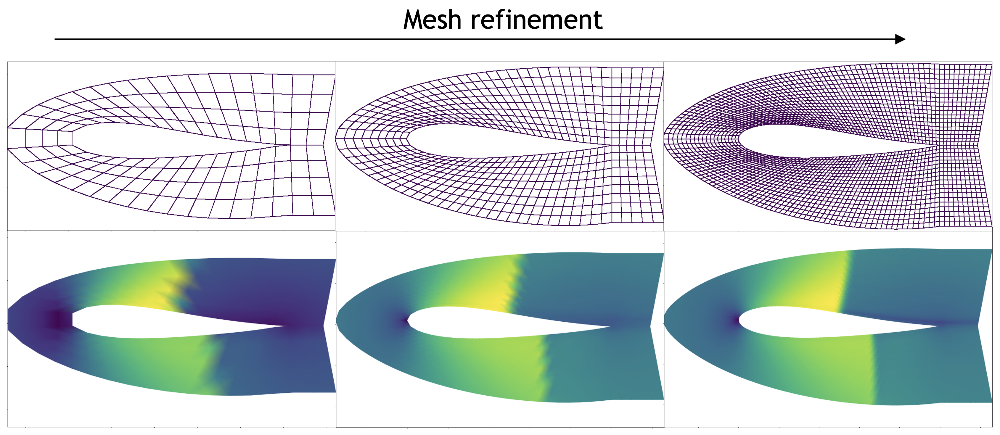

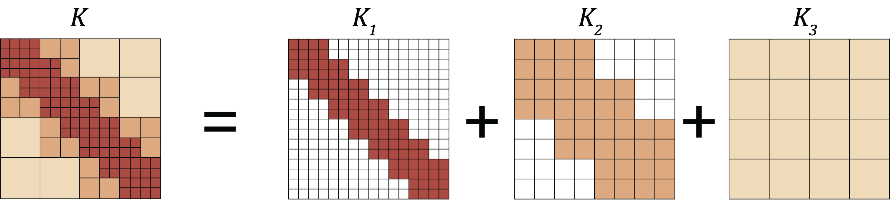

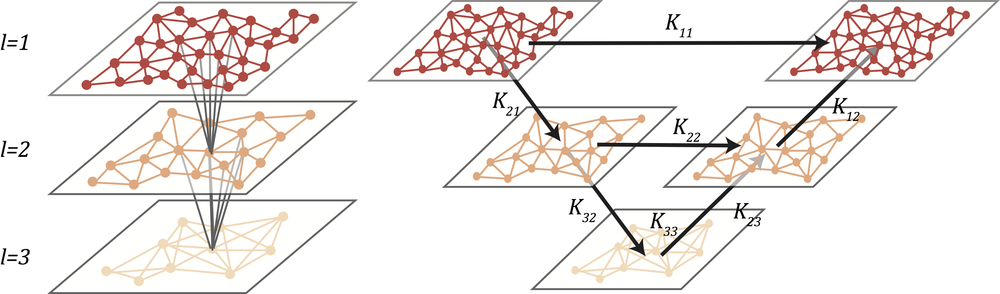

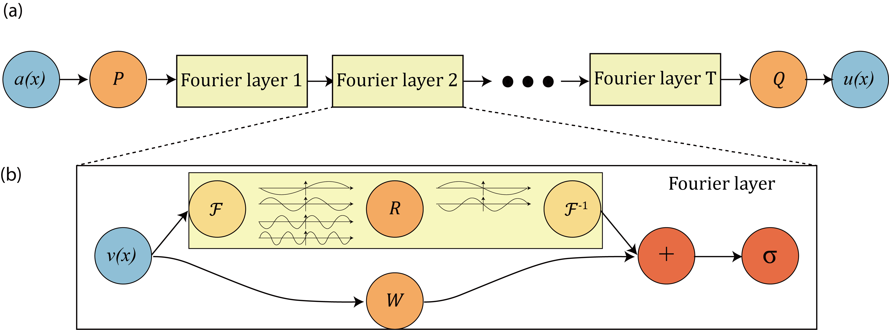

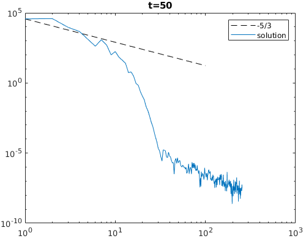

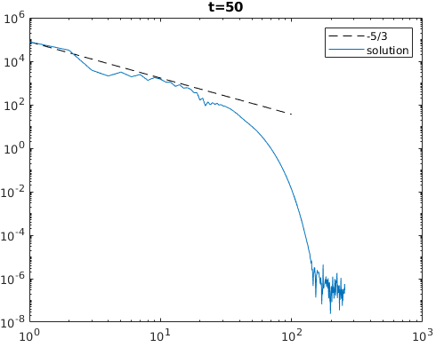

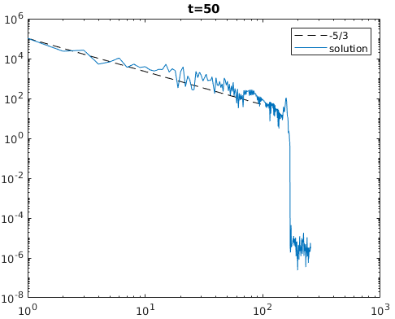

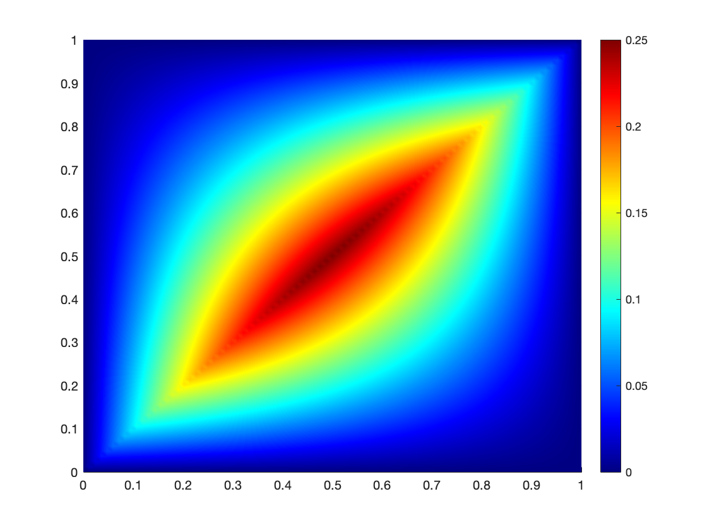

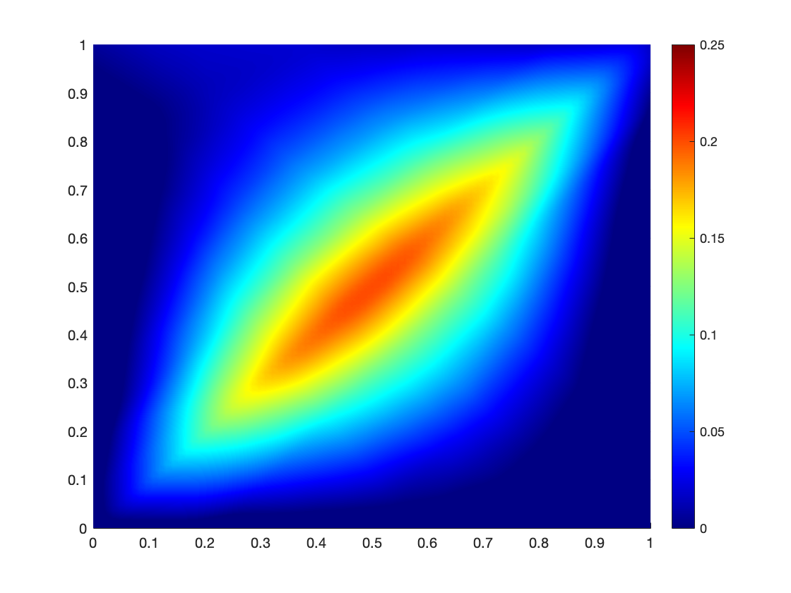

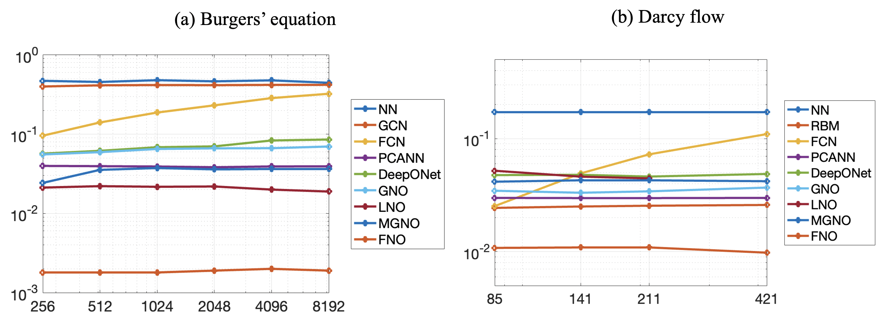

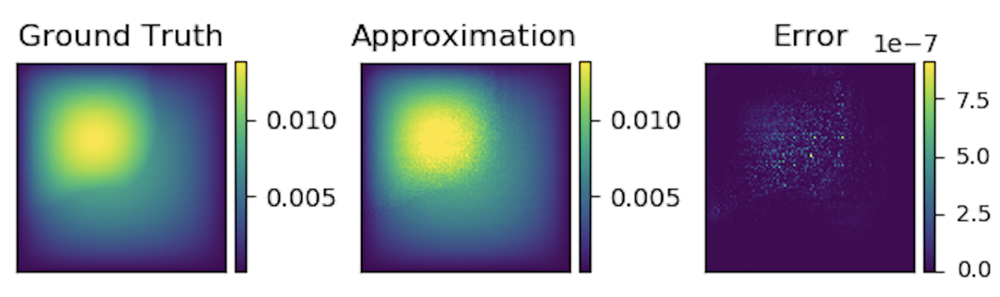

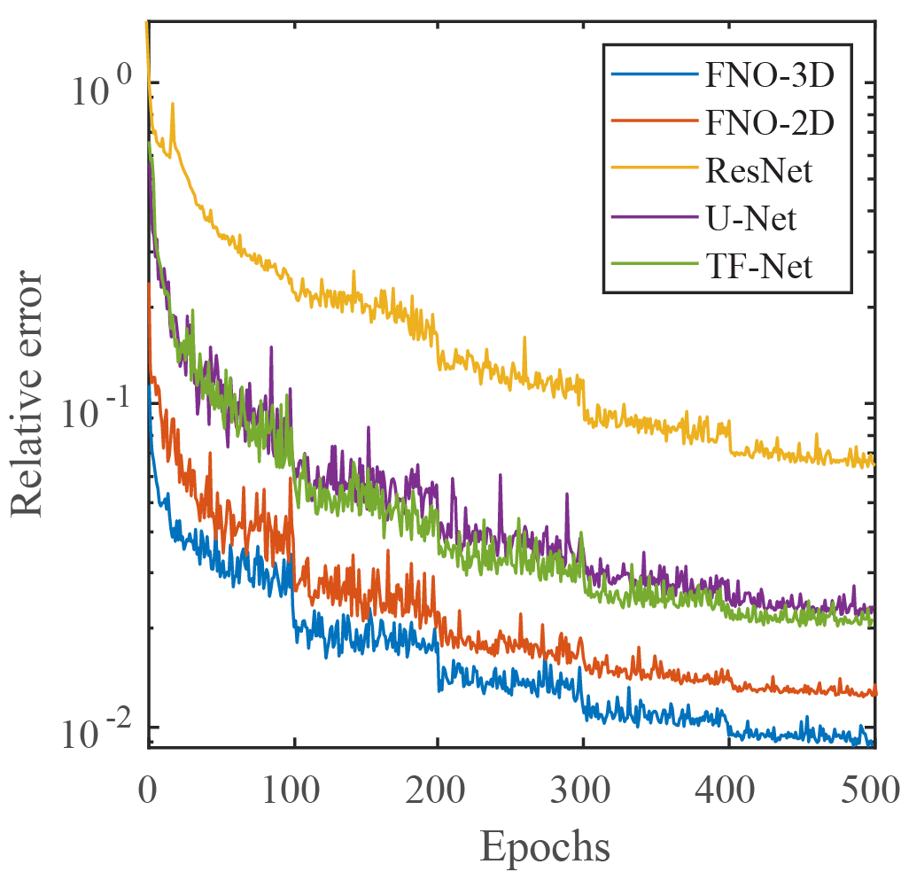

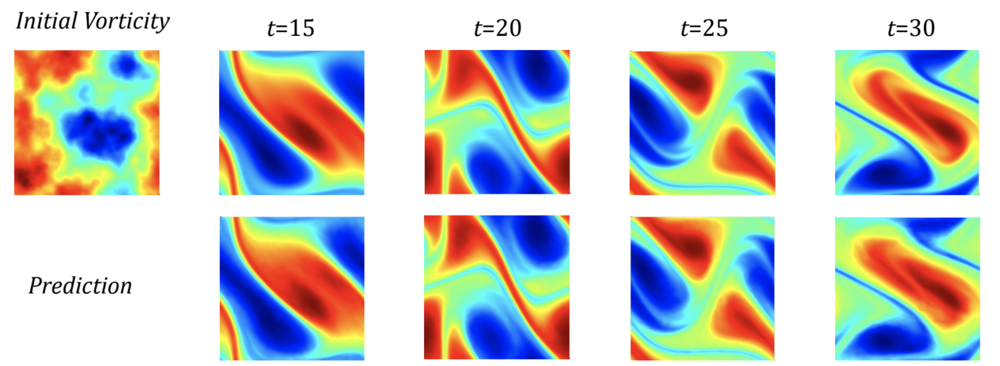

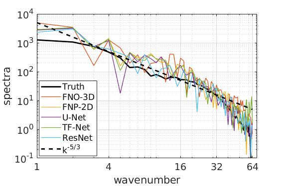

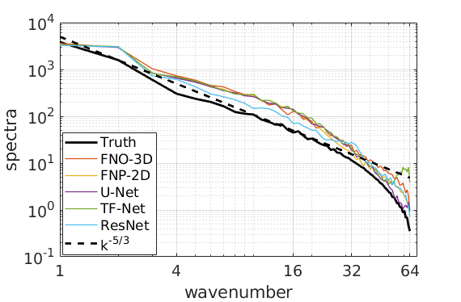

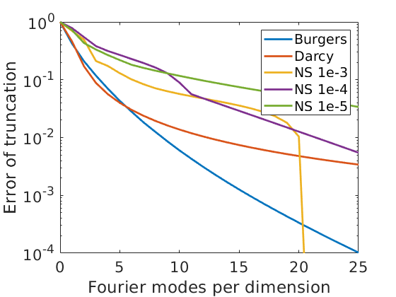

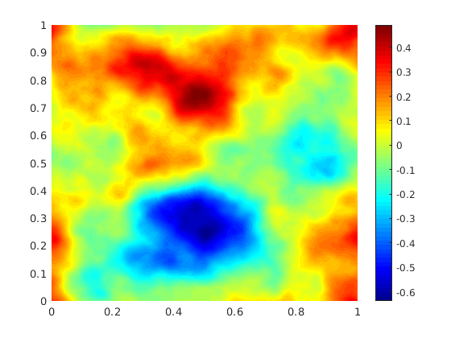

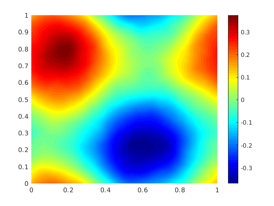

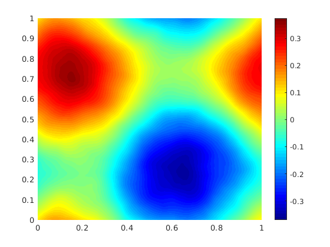

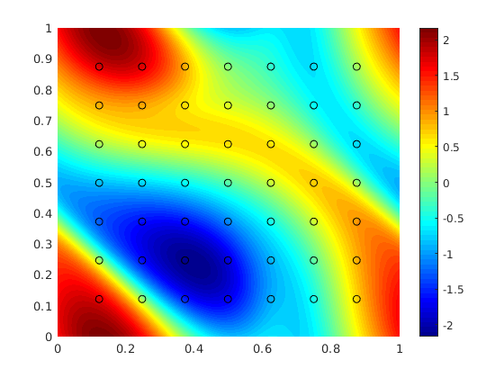

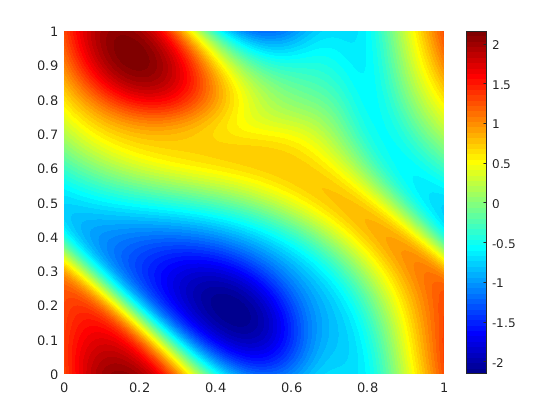

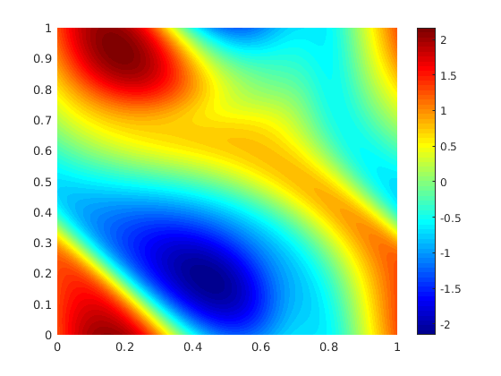

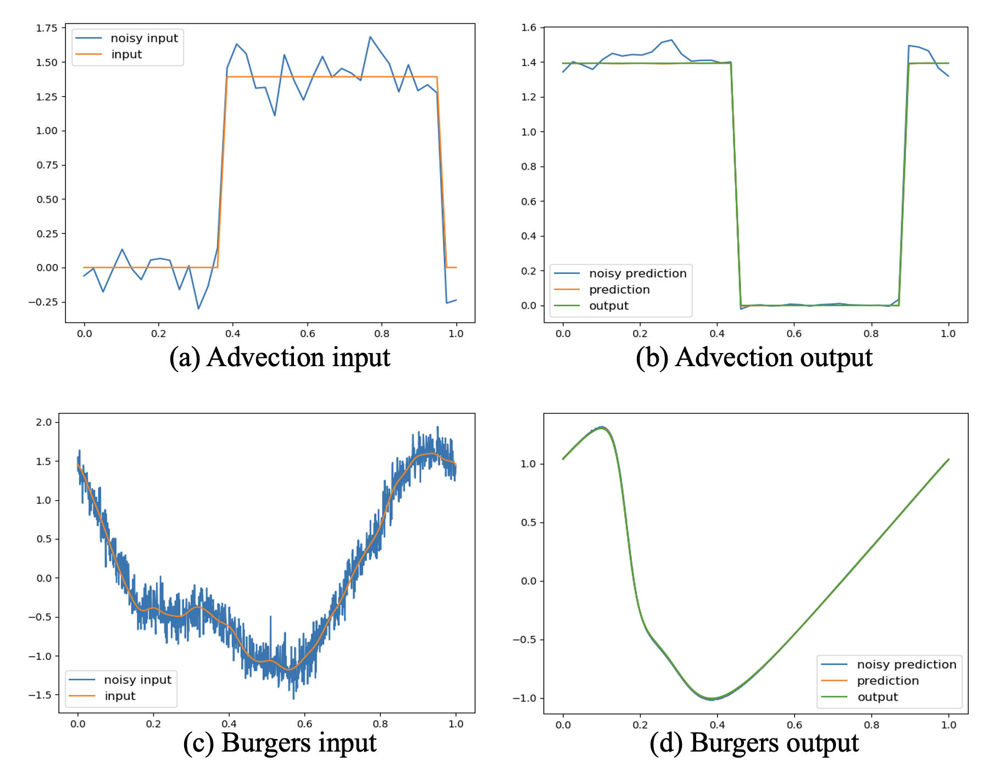

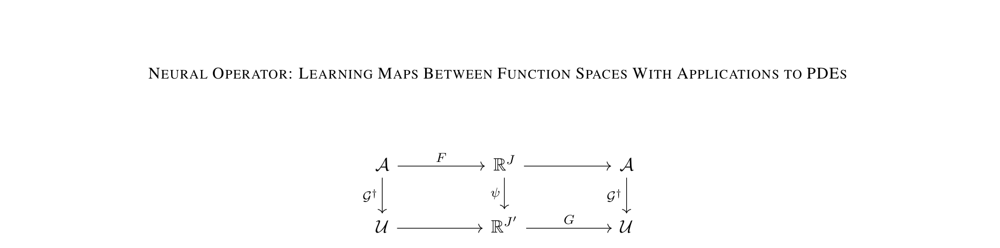

## Extraction Notes

- No warnings.
