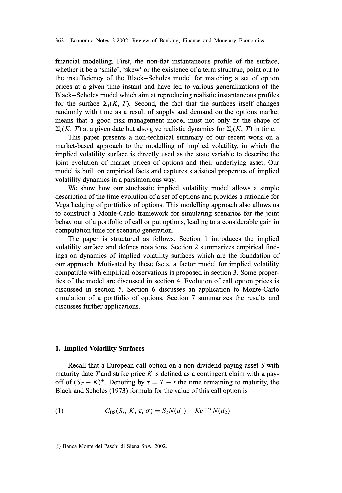
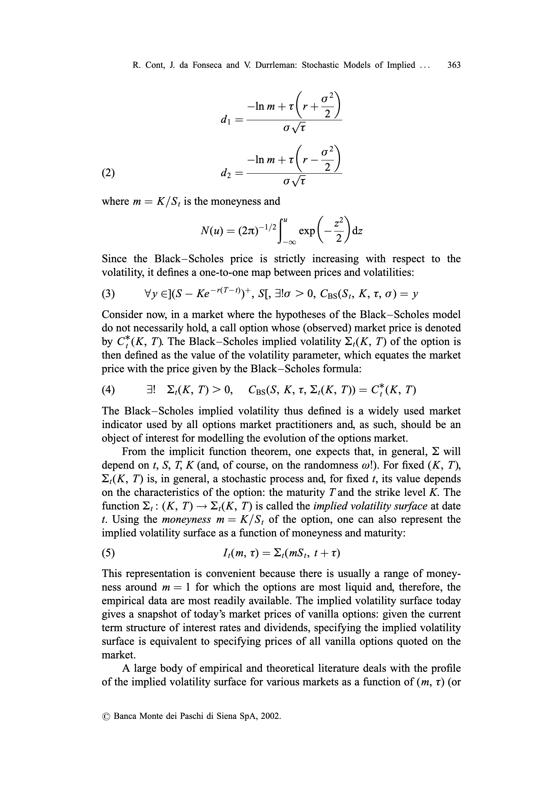
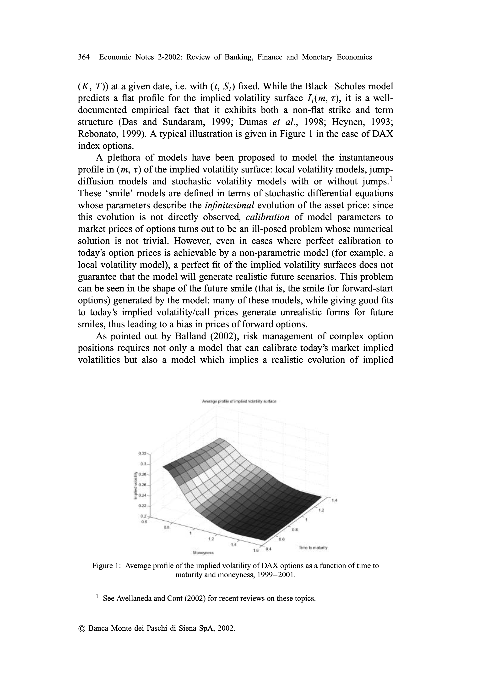

# Stochastic Models of Implied Volatility Surfaces

## Metadata

- **Source File:** `Stochastic Models of Implied Volatility Surfaces.pdf`
- **Authors:** Unknown
- **Year:** 2003
- **DOI:** 10.1111/1468-0300.00090

## Abstract

Not found.

## Main Text

14680300, 2003, 2, Downloaded from https://onlinelibrary-wiley-com.proxy.binghamton.edu/doi/10.1111/1468-0300.00090. By Suny Binghamton, Wiley Online Library on [06/02/2026]. See the Terms
and Conditions (https://onlinelibrary-wiley-com.proxy.binghamton.edu/terms-and-conditions) on Wiley Online Library for rules of use; OA articles are governed by the applicable Creative Commons
License

14680300, 2003, 2, Downloaded from https://onlinelibrary-wiley-com.proxy.binghamton.edu/doi/10.1111/1468-0300.00090. By Suny Binghamton, Wiley Online Library on [06/02/2026]. See the Terms
and Conditions (https://onlinelibrary-wiley-com.proxy.binghamton.edu/terms-and-conditions) on Wiley Online Library for rules of use; OA articles are governed by the applicable Creative Commons
License

14680300, 2003, 2, Downloaded from https://onlinelibrary-wiley-com.proxy.binghamton.edu/doi/10.1111/1468-0300.00090. By Suny Binghamton, Wiley Online Library on [06/02/2026]. See the Terms
and Conditions (https://onlinelibrary-wiley-com.proxy.binghamton.edu/terms-and-conditions) on Wiley Online Library for rules of use; OA articles are governed by the applicable Creative Commons
License

14680300, 2003, 2, Downloaded from https://onlinelibrary-wiley-com.proxy.binghamton.edu/doi/10.1111/1468-0300.00090. By Suny Binghamton, Wiley Online Library on [06/02/2026]. See the Terms
and Conditions (https://onlinelibrary-wiley-com.proxy.binghamton.edu/terms-and-conditions) on Wiley Online Library for rules of use; OA articles are governed by the applicable Creative Commons
License

14680300, 2003, 2, Downloaded from https://onlinelibrary-wiley-com.proxy.binghamton.edu/doi/10.1111/1468-0300.00090. By Suny Binghamton, Wiley Online Library on [06/02/2026]. See the Terms
and Conditions (https://onlinelibrary-wiley-com.proxy.binghamton.edu/terms-and-conditions) on Wiley Online Library for rules of use; OA articles are governed by the applicable Creative Commons
License

14680300, 2003, 2, Downloaded from https://onlinelibrary-wiley-com.proxy.binghamton.edu/doi/10.1111/1468-0300.00090. By Suny Binghamton, Wiley Online Library on [06/02/2026]. See the Terms
and Conditions (https://onlinelibrary-wiley-com.proxy.binghamton.edu/terms-and-conditions) on Wiley Online Library for rules of use; OA articles are governed by the applicable Creative Commons
License

14680300, 2003, 2, Downloaded from https://onlinelibrary-wiley-com.proxy.binghamton.edu/doi/10.1111/1468-0300.00090. By Suny Binghamton, Wiley Online Library on [06/02/2026]. See the Terms
and Conditions (https://onlinelibrary-wiley-com.proxy.binghamton.edu/terms-and-conditions) on Wiley Online Library for rules of use; OA articles are governed by the applicable Creative Commons
License

14680300, 2003, 2, Downloaded from https://onlinelibrary-wiley-com.proxy.binghamton.edu/doi/10.1111/1468-0300.00090. By Suny Binghamton, Wiley Online Library on [06/02/2026]. See the Terms
and Conditions (https://onlinelibrary-wiley-com.proxy.binghamton.edu/terms-and-conditions) on Wiley Online Library for rules of use; OA articles are governed by the applicable Creative Commons
License

14680300, 2003, 2, Downloaded from https://onlinelibrary-wiley-com.proxy.binghamton.edu/doi/10.1111/1468-0300.00090. By Suny Binghamton, Wiley Online Library on [06/02/2026]. See the Terms
and Conditions (https://onlinelibrary-wiley-com.proxy.binghamton.edu/terms-and-conditions) on Wiley Online Library for rules of use; OA articles are governed by the applicable Creative Commons
License

14680300, 2003, 2, Downloaded from https://onlinelibrary-wiley-com.proxy.binghamton.edu/doi/10.1111/1468-0300.00090. By Suny Binghamton, Wiley Online Library on [06/02/2026]. See the Terms
and Conditions (https://onlinelibrary-wiley-com.proxy.binghamton.edu/terms-and-conditions) on Wiley Online Library for rules of use; OA articles are governed by the applicable Creative Commons
License

14680300, 2003, 2, Downloaded from https://onlinelibrary-wiley-com.proxy.binghamton.edu/doi/10.1111/1468-0300.00090. By Suny Binghamton, Wiley Online Library on [06/02/2026]. See the Terms
and Conditions (https://onlinelibrary-wiley-com.proxy.binghamton.edu/terms-and-conditions) on Wiley Online Library for rules of use; OA articles are governed by the applicable Creative Commons
License

14680300, 2003, 2, Downloaded from https://onlinelibrary-wiley-com.proxy.binghamton.edu/doi/10.1111/1468-0300.00090. By Suny Binghamton, Wiley Online Library on [06/02/2026]. See the Terms
and Conditions (https://onlinelibrary-wiley-com.proxy.binghamton.edu/terms-and-conditions) on Wiley Online Library for rules of use; OA articles are governed by the applicable Creative Commons
License

14680300, 2003, 2, Downloaded from https://onlinelibrary-wiley-com.proxy.binghamton.edu/doi/10.1111/1468-0300.00090. By Suny Binghamton, Wiley Online Library on [06/02/2026]. See the Terms
and Conditions (https://onlinelibrary-wiley-com.proxy.binghamton.edu/terms-and-conditions) on Wiley Online Library for rules of use; OA articles are governed by the applicable Creative Commons
License

14680300, 2003, 2, Downloaded from https://onlinelibrary-wiley-com.proxy.binghamton.edu/doi/10.1111/1468-0300.00090. By Suny Binghamton, Wiley Online Library on [06/02/2026]. See the Terms
and Conditions (https://onlinelibrary-wiley-com.proxy.binghamton.edu/terms-and-conditions) on Wiley Online Library for rules of use; OA articles are governed by the applicable Creative Commons
License

14680300, 2003, 2, Downloaded from https://onlinelibrary-wiley-com.proxy.binghamton.edu/doi/10.1111/1468-0300.00090. By Suny Binghamton, Wiley Online Library on [06/02/2026]. See the Terms
and Conditions (https://onlinelibrary-wiley-com.proxy.binghamton.edu/terms-and-conditions) on Wiley Online Library for rules of use; OA articles are governed by the applicable Creative Commons
License

14680300, 2003, 2, Downloaded from https://onlinelibrary-wiley-com.proxy.binghamton.edu/doi/10.1111/1468-0300.00090. By Suny Binghamton, Wiley Online Library on [06/02/2026]. See the Terms
and Conditions (https://onlinelibrary-wiley-com.proxy.binghamton.edu/terms-and-conditions) on Wiley Online Library for rules of use; OA articles are governed by the applicable Creative Commons
License

## Tables

No tables extracted.

## Figures

## Extraction Notes

- No warnings.
